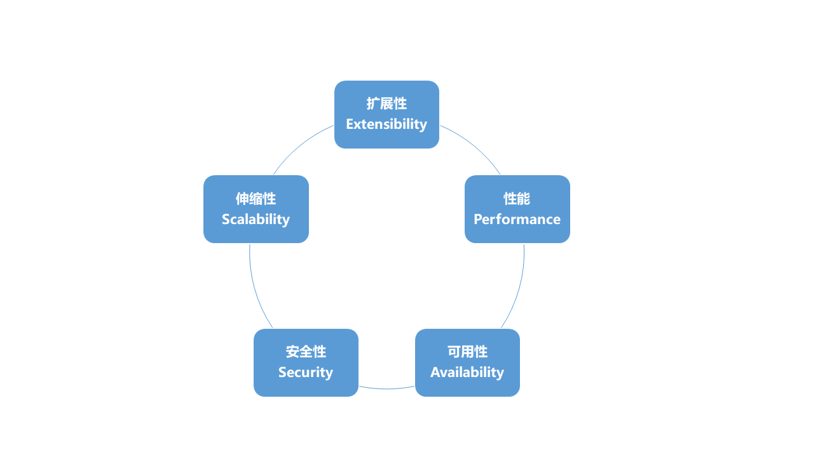

# 架构师之旅

## 目录

1. [架构师与程序员的区别](#架构师与程序员的区别)
2. [为什么要向架构师转型](#为什么要向架构师转型)
3. [程序员向架构师转型模型](#程序员向架构师转型模型)
   - [成功转型的三段式模型](#成功转型的三段式模型)
   - [架构师的学习模型](#架构师的学习模型)
4. [架构师转型的思维和挑战](#架构师转型的思维和挑战)
5. [深入剖析架构师角色](#深入剖析架构师角色)
6. [关于架构师的几个常见的话题](#关于架构师的几个常见的话题)
7. [架构设计的核心问题](#架构设计的核心问题)
8. [架构设计的层次](#架构设计的层次)
9. [架构设计的维度](#架构设计的维度)
10. [架构设计的视图](#架构设计的视图)
    - [4+1架构视图](#4+1架构视图)
    - [六维架构视图](#六维架构视图)

多年在底层的工作，我的每一步都走得比别人艰辛，工作给予的幸福感对我来说弥足珍贵。

我想要得到这种幸福，我想要成长，我想要升华！

不管蜕变有多么痛苦，不管前面有任何困难，不管别人的冷嘲热讽...我还是只能向前走！

## 架构师与程序员的区别

作者：Simon Brown

- 问：开发者和架构师之间最大的区别是什么？

  >架构师和开发者一样，也经常写代码，简单的说，开发者和架构师之间最大的区别就是技术领导力。软件架构师的角色需要理解最重要的架构驱动力是什么，他提供的设计需要考虑这些因素。架构师还要控制技术风险，在需要的时候积极演化架构，并且负责技术质量保证。从根本上讲，架构师是一个技术领导者的角色，这就是最大的区别。

- 问：一位开发者如何才能成为一位架构师？他/她需要掌握哪些领域之外的能力？

  >两个字：经验。我认识的大部分优秀软件架构师同时也是出色的软件开发者，他们都是经过时间逐渐发展成为架构师的。你需要有退后一步看代码的能力，从而理解特定软件系统背后的设计决策。退后一步才能看到“大局”，这是架构师必须掌握的核心技能。这就是为什么《程序员必读之软件架构》一书中加入了有关C4模型的内容，这是一种从多个不同抽象层面理解软件系统的方法。这个方法有助于你退后一步反观大局。

- 问：你对软件架构的理解是否因为你的经历和实践而改变过？

  >是的。我对软件架构的理解是根据我在咨询公司工作时在各个项目中负责软件架构的经验形成的。咨询是一件好事，尤其从最近我开始从事独立咨询师这个工作之后，我可以看到很多不同的团队，不同的架构，不同的技术，以及人们不同的工作方式。世界各地的文化多样性又为工作的复杂度增加了一个维度。无论是寻找特定问题解决方案的过程，还是为各种想法去芜存菁的过程，这些经验和与我共事的人的反馈一起最终形成了我今天对软件架构的认识，这些思维也反应在了我的书中。

- 问：你书中的每一章内容都很有趣而且很精炼，有没有想过写几本详细论述《程序员必读之软件架构》中重要话题的书？

  >我写作这本书的目的是要创造一本让读者可以从头读到尾的书，但是你也可以通过粗略浏览来找到具体问题的答案。对于这个问题来说，没错，有一些相关主题没有出现在这本书中，这些主题可以构成一本与《程序员必读之软件架构》相互补的书。比如，图表和建模的材料就可以扩充成一本完整的书，另外我和一个朋友也讨论过要写一本关于架构模式的技术性更强的书。

- 问：你在书中也谈到了敏捷方法，你是如何看待现在流行的"敏捷已死"的说法的？

  >我听过很多人说“敏捷已死”，他们观点似乎来自两个主要视角。首先，敏捷这个品牌现在虽然已经成为主流，但是其背后的一些意义却在近些年消失殆尽。遵循敏捷实践的软件团队有很多（比如每日站立会议，测试驱动开发等等）但是他们却并不知道为什么要遵照这些规则。盲目仿效敏捷实践并不是敏捷的核心精神。
  >
  >还有一些团队，他们尝试了敏捷，但是结果却一团糟。我从软件架构的视角特别能注意到这件事。大部分敏捷方法并不明确讨论预先设计，而很多人把这点误解为在敏捷项目中不需要做预先设计。当然，这不是事实，而现在人们开始寻找所谓的传统开发和敏捷开发之间的平衡点。
  >
  >敏捷并没有死。采用敏捷方式意味着不断地反思和调整你使用的方法，从而达到解决问题、变得更有效率或者更频繁地交付优秀软件的目的。团队要如何完成这件事完全是由他们自己决定的。

- 问：作为技术领导者，如何协调一个大型项目中不同架构师的协同工作？

  >这是一个复杂的问题，根据背景的不同，答案也有很多。在我的经验里，大多数大型项目都包含有一些小团队，可能是根据技术类型、子系统或组件区分的。在这种情况下，每个团队一般都会有自己的软件架构师，因为必须有人要为这些零散的部分负责。为了要管理整个项目，协调合作，有以下几种方式：
  >
  >1、一个单独的架构师来管理整个项目，然后通过和基于团队的架构师的合作来确保工作顺利进行。  
  >2、基于团队的架构师共同协作，分享和执行架构领导者的角色。  
  >3、某一位基于团队的架构师额外花费一些时间来管理整个团队。  
  >
  >第一种方式是我最不喜欢的，因为多出来的这个人可能不会像其他基于团队的架构师那样投身到每天的工作中，而且他有可能缺少必要的背景信息，无法做出明智的决定。在第二种和第三种方式之间选择的时候，我们可以根据基于团队的架构师的领导力和兴趣来决定。比如，强制一个不感兴趣的人来管理整个项目可能不会成功。我个人比较倾向于第三种方式，但前提是其他基于项目的架构师也应该以某种程度参与进来，因为对整个项目的理解是必不可少的。

- 问：复杂是软件架构的敌人，很多人欣赏那些已经用了十几年的架构，但是这种情况下多场景预判会使得程序变得复杂。你是如何规划架构时间点上的规模和设计的呢？

  >简单的答案就是一开始就使用简洁的设计，然后明确地思考模块化。软件系统随着时间很容易就会发展成“大泥球”，对于需求不断变化的软件系统来说，维护性和适应性的最大影响因素就是不同事物间的耦合程度。如果你从一开始就考虑了模块化，把软件系统分解成高内聚低耦合的小模块单元，在未来你就可以更轻易地对系统做出改变。更进一步说，这意味着你定义的软件架构应该反映在代码中。正如我在书中所说，事实并不永远如此。我去年在一次大会中的演讲（抱歉，演讲是英文的而且在YouTube上）中深度讲解了这个话题 -> `https://www.youtube.com/watch?v=ehH3UGdSwPo`

- 问：你认为从10万用户扩展到1亿用户的架构存在吗？如果存在的话，这些架构具有超强扩展性的原因是什么？

  >我确定这样的架构确实存在，但是在构造这些架构之初时，架构师可能并没有设想到如此强的扩展能力。每个互联网级别的大型网站背后的故事都很有趣，它们大多数都已经经历过在开发、部署、运维的同时持续发展架构的阶段。做出架构决策的关键就在于理解利弊和确定优先级。你可以在CAP定理中看到类似的情况。一旦你明白了不能拥有一切，就会更容易做出架构决策了。

- 问：什么样的架构能够做到快速响应频繁变化的需求？

  >和之前的答案一样，简洁的设计和模块化会让你可以快速响应快速变化的需求。如果你需要经常改变架构，但只想改变其中的一部分，为了防止为每个小变化重新部署整个系统，采用微服务架构是一个明智的选择。

- 问：有没有什么事是架构师永远都不应该做的？

  >有，软件架构师永远都不应该停止编程和停止学习！:-)  
  >从程序员到架构师，不仅是知识的增长，也是能力的提升！

## 为什么要向架构师转型

无论对于传统行业还是互联网行业，开发具有功能强大且用户体验好的移动端应用已经成为众多软件从业人员的目标和要求。然而，分析和设计一个软件系统以及管理其研发过程并不是每一个软件行业从业人员都能做的事情，需要具备专业的知识领域、丰富的实践经验以及良好的个人综合能力，我们把具备以上能力的人才称之为软件架构师。

中国目前每年有几十万的软件开发人才缺口，其中对具备系统架构设计和实现能力的人才更是趋之若鹜。对于一名软件开发人员而言，成为一名合格乃至优秀的架构师是自身奋斗的一个方向。目前很多公司尤其是大型公司程 序员并不缺，缺的是架构师。

同时，对于一名具备多年行业从业经验的开发人员，如果目前还处在普通的开发人员序列，还没有具备相应的意识形态和专业能力去从事系统架构设计和实现相关工作的话，势必导致技术与年龄不相匹配，也就会出现职场上经常谈论的所谓“30岁危机”。所以，从这个角度讲，成为一名架构师事实上也是自身发展所不得不面临的一个瓶颈。如何打破这个瓶颈，如何从普通的程序员转型成为一名架构师，对于广大开发人员而言都可能是一个值得思考的问题。
  
当然，对于从事技术开发的人员而言，技术变化日行月异，一个人的能力很大程度上体现为一种学习能力。如何实现自我提升，如何看到目前还没有看到的技术层次，也是个人发展道路上不可回避的一个话题。

**本课程的内容大纲：**

本课程针对架构设计的知识体系进行了抽象，认为架构设计包含以下几个基本切入点。
  
- 领域建模：架构设计的第一步；
- RPC：一切架构的基础；
- 分布式：最核心的架构；
- 微服务：最热门的架构；
- 消息传递：可解耦的架构。

在这些知识体系的背后体现的是一种学习模型，从学习模型中我们应该认识到各种工具、框架背后的相同点，也即技术体系中存在的相通性。
  
架构设计同样体现为一种系统工程，系统架构设计和实现的背后同样需要考虑项目管理、配置管理、过程改进和交付管理等工程性问题，这些内容同样是架构师区别于普通开发人员的关键要素。

**本课程配套书籍：**

- 《系统架构设计--程序员向架构师转型之路》

## 程序员向架构师转型模型

从周围的两位同事说起

我本人在杭州，大家都知道杭州有家公司叫阿里巴巴，我也推荐过一些前同事和朋友去阿里巴巴面试，有些成功入职，有些虽然最终入职但过程比较艰难，而有些则一直没有找到机会。这里举两个例子与各位读者分享。

同事A：每一面都顺利通过，一次性走完所有流程，历时约 1 个半月入职阿里闲鱼。阿里闲鱼是阿里旗下一个二手商品的交易平台，1 个半月的面试时间在入职阿里的过程中已经算是比较快的流程，需要做到每一面都一次通过。这里简单介绍一下阿里的面试流程，正常情况下是 4 轮面试，有些部门在同一轮面试中会对候选人进行多次面试，如果一次不行还会安排不同的面试官再面一次。而每次面试都需要协调面试人员，所以整体流程通常都会比较长。

同事B：一共面试 11 个岗位，其中一面失败 5次，二面失败 6 次，三面失败 2 次。从今年上半年开始，历时半年仍未入职。目前已放弃，准备做一定积累之后再进行尝试。

事实上，这两位同事的年龄、工作履历以及技术能力相差无几，那为什么面试同一家公司结果会完全不同呢？通过对这两位同事的面试经历进行分析，我们能够得出一个结论，即知识体系的重要性。

再举一个同事的例子

同事C：10 年以上开发经验，工作能力和态度都没有问题，但一直都是从事偏向业务的开发工作，随着年龄的逐渐偏大，目前已经明显遇到了职业生涯发展瓶颈。

就我个人与同事 C 的对比，从薪资上目前是同事 C 的两倍，并且对系统架构和技术管理体系都非常了解，成功担任过大型企业中的系统分析架构师与技术总监职务，可以说在一定程度上已经突破了目前所面临的发展瓶颈。

针对同事 C 的案例而言，我们同样得出另外一个重要的结论，即转型思维的重要性。

我们将在后面的内容中花较大篇幅讨论如何建立知识体系结构，本篇的内容主要围绕转型思维展开，即程序员向架构师转型应该具备相应的转型模型。

### 成功转型的三段式模型

转型需要一个过程，任何过程一般都可以抽象成人、工具和流程的组合。但是对于转型过程而言，显然普适意义上的人、工具和流程并不能直接应用。如何找到更加有效的途径来完成从程序员到架构师的转变，本课程提出了针对转型的特定过程模型，即如下图所示的由思路、方法论和工程实践所构成的三段式模型。

#### 转型的思路

思路意指思考的条理脉络，通俗的解释就是心里的想法。
  
转型需要想法，但往架构师转型的想法却受以下三个方面限制：意识形态(Mindset)、环境(Environment)和决心(Determination)。
  
意识形态是转型的触动点，当我们想去做一件事情而这件事情需要付出很大努力时，通常是意识形态发生了变化，从习惯于根据详细设计文档编写代码并完成功能自测，到根据业务需求抽象出系统模型并转变成架构描述，意识的转变是工作内容转变的前提，意识形态很多时候决定了一个人发展的高度。但一个人所能达到的高度还很大程度受限于环境因素，好的环境和不好的环境对个人发展影响巨大，而我们往往无法改变环境，只能适应环境，所以是否具备一个良好的环境也是在转型之前需要进行梳理并作出判断，必要时也应该果断采取行动。思路的最后一点就是决心，当意识形态和环境因素都已经具备，决心变成是否能够转型的关键，毕竟想要成为一名合格甚至优秀的架构师可能要比想象的困难。
  
一般而言，从偏向微观的编码领域进入到需要宏观思维的架构设计领域，开发人员会发现这种角色转换要比预想的更具挑战性。实际上许多技术人员对架构师存在明显的误解，认为只要技术能力出众就能成为架构师，或者认为那些画画系统模型图的工作不是架构设计，甚至看不起那些关注业务模型的设计人员。尽管这样，每年还是有许多技术人员接受提拔而成为架构师，这些技术人员相信会找到并解决架构设计过程中存在的种种问题，正是这种信念促使大多数技术人员接受挑战并完成转型过程。然而，并不是所有的技术人员都能获得提拔的机会，对于目前尚未有明确的提升机会但又想往架构师转型的技术人员而言，我们认为思路恰恰是其首先需要考虑的问题。

#### 转型的方法论

所谓方法就是做事的手段、方式、流程，而方法论即一组方法的集合，也就是一组用于确保成功的规则的集合。
  
技术人员想要转型到架构师岗位，将要面临一大堆他们不熟悉的问题。对于技术人员，解决技术问题的能力是主要的衡量标准，技术人员自身所具备的方法论也更多的偏向技术体系本身。但对架构师而言，技术体系只是一个方面，更多的方法论需要进行理解和掌握。

对架构师而言，了解主流软件架构风格、模式和模型、通过整合各种架构体系形成自身的架构设计思想是一种方法论；能够对主流架构设计方法进行阐述、把握主流技术体系知识领域以及相应的原理是一种方法论；围绕软件开发生命周期的系统工程，理解软件工程、业务架构、敏捷方法、产品交付等概念是一种方法论；作为架构师明白面临的各种软技能需求以及相应的应对方法也是一种方法论。理论指导实践，只有具备相关的方法论，才能用于工程实践。

#### 转型的工程实践

在软件开发领域，我们经常提倡使用各种最佳实践(Best Practice)。最佳实践是一个管理学概念，认为存在某种技术、方法、过程、活动或机制可以使生产或管理实践的结果达到最优，并减少出错的可能性。
  
把软件开发的最佳方式和开发人员个人做得最好的事项一一总结出来，就是组织的最佳实践。最佳实践包含在技术和非技术领域，包含在对人和事物的处理过程，也包含在架构师所应具备的各项软、硬能力中。要想成为一名架构师，对架构师所应该从事的各项活动都应该需要且能够提炼出最佳工程实践作为具体工作展开的输入和模板。

### 架构师的学习模型

在讨论完架构师转型的基本模型之后，我们还需要给出架构师的学习模型，因为转型的过程本质上还是一个不断学习和进步的过程。对于正在向架构师转型的开发人员而言，处于初始阶段的同学有转型的想法和思路，但是在纷繁复杂的技术知识体系和各种层出不穷的工具框架面前就显的无从下手。而有些同学已经跨越了初级阶段，并按照自己的方法正在系统的梳理各种架构师所需的技能，但很多时候会发现效果不是很好，自身提升的速度比较慢。学习模型的作用就在于为这两类人提供一个简单的方法确保能够快速成长。

在本课程中，架构师的学习模型由以下两个阶段所构成。

1. 第一阶段

   第一阶段的主要工作是找一两个核心框架和技术体系进行深入分析并抽象出其中的技术理论。

   所谓理论指导实践，架构师一定要从纷繁复杂的技术知识体系和各种层出不穷的工具框架中抓住其背后的原理，然后做到用自己的语言对这些原理进行阐述。

   事实上，现在很多大型公司的架构师面试风格上就是偏向于考察面试者的原理分析能力和表达能力，这点我们在课程的最后一篇中会再结合架构师面试的技巧以及部分面试题做进一步展开。

2. 第二阶段

   在第二阶段，架构师需要广泛了解其它框架和技术体系，看能否把在第一阶段中自己抽象出来的技术理论用来剖析这些框架，如果不能，找各种资料继续第一阶段。

   从上面的两个阶段我们可以看出学习模型是一个循环模型，就我自身经历而言，一般人都需要经历过 3~5 个循环之后才能对架构设计这一领域有比较深入的理解。

   对于初始阶段，可以找类似 Mybatis、Spring 等相对比较独立的核心框架入手，然后逐步过渡到向 Dubbo、Zookeeper 等综合型框架。

   而对于那些已经完成初始阶段的同学而言，需要在不同的循环中针对不同的知识体系做相应的规划，可以针对分布式、微服务等主题进行专门的学习和训练。

## 架构师转型的思维和挑战

根据以上分析，从最高的高度看待架构师转型，可以总结出如下图所示的转型等式，前面提到的转型模型和学习模型都是为了构建适合自身的知识体系和转型方法。
  
虽然这个等式非常简单，但架构师转型面临巨大的挑战，挑战来自于架构师的工作特性以及康威定律。

康威定律(Conway's Law)指出设计系统的组织，其产生的设计和架构等价于组织间的沟通结构。
  
从传统的单块架构到目前非常流行的微服务架构实际就是这一定律的一种体现。
  
现在很多开发团队本质上都是分布式的，单块架构的开发、测试、部署协调沟通成本巨大，严重影响效率且容易产生冲突。将单块架构解耦成微服务，每个团队开发、测试和发布自己负责的微服务，互不干扰，系统效率得到提升。可见，组织和系统架构之间有一个映射关系：一方面，如果组织结构和文化结构不支持，通常无法成功建立有效的系统架构；反过来，如果系统设计或者架构不支持，那么你就无法成功建立一个高效的组织。

康威定律给我们的指导是设计系统架构之前，先看清组织结构和组织文化，再根据具体情况设计并调整系统架构。要做到这一点，架构师应该具备较高的综合能力。下表体现了普通研发工程师与架构师工作性质的对比，从对比中我们可以看到，架构师的工作不能只关注与技术，而更重要是站在团队和组织的角度看问题。

但是我们知道软件研发人员也具有自己的思想和方法论，一方面作为技术人员自然崇尚技术能力，架构师应该具备较强的技术创新能力才能让下面的开发人员信服；另一方面，架构师需要把握团队架构，在组织文化下和外部团队进行有效协作，需要具备人员和过程的管理能力，能够使内部、外部的团队成员目标一致，实现架构师的自身价值。显然，要做到以上两个方面是困难的。

面对架构师转型所需要克服的各项挑战以及康威定律给我们带来的启示，结合转型成功所需要的三段式模型和学习模型，我们得出了如下的转型思维导图。
  
该图上半部分代表包含思路、方法论和工程实践的三段式模型，下半部分代表转型主题，即知识体系、软技能和就业指导三个部分。
  
其中知识体系是本课程的主体内容，但本课程也会对架构师所需的各项软技能做简要介绍，并通过面试技巧和面试题分析对架构师的就业活动给出一定的参考性建议。
  
三段式模型指导着转型主题的落实，即对每一个转型主题，思路、方法论和工程实践都是我们进行转型的基本切入点；反过来，转型主题又推动着三段式模型的进一步成熟和改进。该转型思维导图构成了本课程的基本行文框架，本课程后续内容基本按照该图进行展开。

## 深入剖析架构师角色

### 什么是系统架构设计：关于架构演进理论

在过去软件开发过程发展的很长一段时间内，软件架构表现为一种集中式的单块(Monolithic)式，即先对系统进行分层，然后通过单个进程进行部署和维护，典型的分层体系包括界面交互层、业务逻辑层和数据访问层。直至今日，这种单块模式在部分系统构建过程中仍然是最基本的架构模式。

随着业务功能的不断发展以及性能、数据存储等系统瓶颈问题的出现，单块模块逐渐不适合系统的维护和扩展，分布式架构应运而生。通过把系统业务进行服务化，以及完善服务治理功能，系统架构就可以如同搭建积木一样构建成高度可集成、高内聚松耦合的业务系统，如下图中系统主体由 Frontend-Service 和 Core-Service 两层服务化构成，为 Web 层提供网关和核心业务服务。

服务化架构为系统提供了扩展性和伸缩性，然而随着系统用户体量的增加以及分布式系统固有的网络通信机制，性能问题在业务关键链路逐渐成为系统运行的瓶颈。解决性能问题的切入点有很多，一方面可以从硬件设备和软件服务器入手，但对系统架构而言，更多的场合需要我们分析系统实现方案，并使用以缓存为代表的架构设计手段重构业务关键链路，下图即为在 Frontend-Service 和 Core-Service 两层服务中分别添加分布式缓存之后所得到的系统部署图。

缓存能够提升性能，但不能解耦系统。当系统中分布式服务数量和种类日渐增多，而这些服务又分别属于不同业务层次时，如何合理的管理这些服务之间的调用关系，进一步确保系统的健壮性和扩展性成为系统架构设计的又一大难题。分布式服务的自身特征决定了其在时间、空间和技术上都具有一定程度的系统耦合性，在使用分布式服务时需要谨慎处理服务调用的时序、所使用的服务定义以及技术平台的差异性等问题，这些问题为如何开展快速架构重构和扩展、如何进行高效分布式团队协作带来了挑战。以各种消息传递组件为代表的中间件系统为降低系统耦合性、屏蔽技术平台差异性带来了新的思路。当不同的服务需要进行交互、但又不需要直接进行服务的定位、调用和管理时，消息中间件能显著降低系统的耦合程度，下图中在 Frontend-Service 和 Other-Service 中添加了消息传递中间件，确保两个服务在并不需要意识到对方存在的前提下进行数据的有效传输。

试想这样一种场景，我们的系统需要跟外部的多个系统进行集成以形成关键业务链路闭环管理，而这些外部系统分别部署在其他供应商或客户环境，并且每个系统都可能基于完全不同的技术平台和体系构建，随着业务发展需求，这些外部需求还需要实现动态的注册和注销。

对系统架构设计而言，一方面我们需要整合这些外部系统提供的服务进行数据的获取和操作，另一方面，我们又不希望我们系统对它们产生强依赖。消息中间件在这种场景下已经失去系统解耦的价值，因为外部系统不在控制范围之内，我们对其内部实现原理一无所知。

如何在异构系统、分布式服务和基于租户的基本架构需求下实现有效的系统集成，企业服务总线（Enterprise Service Bus，ESB）提供了相应的解决方案。通过在核心业务服务中引入 ESB 以及对应的路由、过滤、转换、端点等系统集成模式，即可屏蔽由于技术差异性导致的各种系统集成问题，并动态管理 ESB 上的第三方服务。如下图中，ESB 为内部的 Core-Service 整合外部的 Thirdparty-Service1 和 Thirdparty-Service2 提供了集成平台。

随着大数据时代到来，许多业务系统也面临着对庞大业务数据进行管理和利用的难题。

近年来，以 Hadoop 生态圈为代表的大数据处理平台，以及以 Lucene 为内核的多种垂直化搜索引擎系统为业务发展提供了高效的批量数据处理和数据搜索功能。

在系统架构设计维度，我们也可以引入如 Spring Batch、Spring Data 等轻量级的批处理和数据访问框架，以便与基于 Spring 的核心系统构建框架进行无缝整合，见下图。

上述的系统架构演进过程在现有的互联网应用中具有一定的代表性，很多 App 后台就是从一个简单的单块系统开始，当面临系统架构设计问题时，通过引入各种技术体系逐步完善架构，直至具备庞大体量的大型集群系统。

在这个系统架构演进过程中，我们再来回答“什么是系统架构设计”这个问题时，我们可以认为系统架构设计就是在系统开发演化过程中，解决一系列问题的方法论和工程实践。关于方法论与工程实践的含义我们已经在上一篇中做了讨论。

## 关于架构师的几个常见的话题

在明确了架构设计的基本概念之后，我们将要进一步讨论架构师角色。围绕架构师角色存在如下几个常见的话题。

- 架构设计到底是一种技术活还是业务活？
- 架构师到底要做哪些工作？
- 架构师到底是不是一个技术管理岗？
- 架构师有哪些类型？
- 架构师应该具备哪些技能和职责？

在本篇后续内容中，我们将对以上问题做一一解答。当然，如同前面给出的关于架构设计方面的定义，不同的公司、不同的行业和不同的时期对这些问题也是见仁见智，我们只是基于最普遍的场景给出适合我们自身的答案。

### 架构设计到底是一种技术活还是业务活

在很多技术人员的眼中，架构设计可能就只是一种技术性的工作，很多公司在招聘架构师的时候也过多的关注了候选人的技术能力。

事实上，在大型软件系统中，架构设计被认为是从问题领域到解决方案的一种桥梁（见下图），从图中我们可以看到架构设计活动与代表问题域的需求分析活动和代表解决域的软件开发活动都有直接的交集，连接着两个软件开发的核心领域。

架构师是架构设计的执行者，架构设计的桥梁作用给架构师带来了挑战，意味着架构师需要同时具备处理两个核心领域的能力，即架构师需要能够从问题领域出发推导出满足业务需求的架构体系，同时又能够从实现方法入手设计出能够满足业务架构需求的技术架构体系，最终实现业务架构和技术架构的统一。

### 架构师到底要做哪些工作

架构师是负责设计、记录和领导能够满足所有干系人需求的系统构建过程的人。通常，这个角色需要完成以下几项活动。

- 识别干系人并让他们参与进来

  干系人是业务需求的源头，识别正确的干系人能够确保业务需求的正确性，让干系人参与能够确保业务需求的实时性和有效控制需求变更。

- 理解和记录系统功能和非功能相关的关注点

  通过需求分析，架构师梳理并抽象系统的各项功能性和非功能性需求，并对这些需求进行系统建模。

- 创建并拥有应对这些关注点的架构定义

  对功能性和非功能性需求，从扩展性（Extensibility）、性能（Performance）、可用性（Availability）、安全性（Security）、伸缩性（Scalability）等架构设计的基本维度出发定义架构，关于这些维度的讨论是下一篇的主要内容。

- 在把架构实现为具体系统的过程中起主要作用

  推动架构设计活动按照项目和产品计划有序进行，参与需求、设计评审等各种技术评审过程，并管理系统设计和开发团队的日常工作。

就一个完整的系统开发生命周期而言，架构设计活动有其时效性。

下图体现了传统瀑布（Waterfall）模型下的系统开发生命周期与架构师参与情况，从图中可以看出在由需求分析和系统建模所构成的系统初始阶段和由服务集成和产品接受所构成的最后交付阶段，架构师会较多的参与到系统建设过程中去，具体参与程度取决于系统本身的特征以及生命周期模型。

对于类似 Scrum 的敏捷开发模型，如果把一个个迭代看成是小型的 Water-Scrum-Fall 模型的话，架构师参与程度实际上也与上图所示的结果相类似，即重点参与迭代计划阶段和迭代演示回顾阶段。

### 架构师到底是不是一个技术管理岗

很多时候，我们也把架构师归为是一种技术管理者角色。技术管理者的工作包括设计行业与解决方案、推进业务结构与产品化、架构设计和技术创新、开展软件项目管理和研发过程体系建设等。视环境的不同，架构师也会在这些工作中发挥一定的推动作用。

但就一个完整的产品开发生命周期而言，技术管理活动也具有其时效性，这种时效性相较于系统架构设计和实现等技术专业类活动而言还具有较大的灵活性。我们可以理解为系统开发生命周期是整个完整软件产品生命周期的一部分，如下图所示。

在系统开发工作开展之前，技术管理者需要进行行业分析、技术解决方案的设计以及产品开发策略的规划，同时针对行业特点也可能会从事部分的技术预测工作。而在系统开发工作结束之后，随着产品和运营工作的开展，技术管理者也要深入其中从组织战略的角度出发对技术提出进一步的规划方案和创新措施。

### 架构师有哪些类型

基于以上关于架构师的工作内容、参与程度和系统工程的分析，可以看到架构师根据其作用、职责和对系统关注层次的不同，可以分成很多类型。

狭义上的架构师往往偏重于技术架构设计，但从广义上讲，业界对架构师的划分有一定的体系。

首先，根据所发挥的核心作用，可以把架构师划分成设计型、救火型、布道型、极客型等类型。相较于传统意义上的设计型架构师，这些类型的架构师更加偏重于执行某一项特定的架构工作，并不一定会完整参与系统开发生命周期，更加不一定会从系统工程的角度去看问题。

其次，产品型、基础设施型和应用型等架构师是从其所处的业务和职责出发进行分类的结果。产品型架构师偏重于进行业务架构设计，往往在系统开发前期会重点参与；基础设施型架构师偏重于进行技术基础框架设计，一般采用独立于系统开发生命周期的特有开发模式；常见的系统架构师指的是应用型架构师，正如前文所述，负责将问题领域进行建模并转变成解决方案。

再次，根据关注层次的不同，架构师也可分为几种不同的类型，包括但不限于功能、非功能、团队组织和管理、产品运营等方面。

- 应用设计型架构师
  
  本课程所阐述的架构师角色从作用上讲限于应用设计型架构师，从职责上讲偏重于应用开发，并关注于功能、非功能、团队组织和管理等层次。
  
  这是行业内最常见的架构师类型，也是需求量最大的架构师类型。应用设计型架构师需要同时考虑业务架构和技术架构，从而实现业务架构和技术架构的统一。

- 大数据架构师
  
  现在是大数据时代，在大数据领域也存在大数据架构师这一细分岗位。
  
  大数据架构也只是一种架构，通用架构风格和架构模式、通用架构设计原则和维度同样适用。而且大数据架构肯定也是一种分布式架构，从技术体系上讲也存在很多通用的应用场景，例如 RPC 在Hadoop、Yarn、Storm 中的应用；高可用架构在 Hadoop、Yarn、HDFS 中的应用；Zookeeper 在 Hadoop、Kafka 中的应用；消息传递机制在 Spark、Storm 中的应用；加密、授权、认证等安全性机制在大数据体系中的应用等。
  
  以上关于 RPC、高可用架构、Zookeeper、消息传递机制等技术体系在本课程中都会讲到。我们在第 10 篇中也会提到技术体系的相通性，所以大数据架构师也是架构师的一种表现形式，在掌握架构设计原理和核心技术的同时需要掌握大数据生态相关工具和框架，并具备架构师应有的综合能力。

### 架构师的技能和职责

作为一名合格的架构师，完备的技术领域知识是必备的技能，但针对应用设计型架构师，所需的技能不仅仅限于了解和掌握技术体系，也需要从业务领域和软技能两个层面进行技能拓展。

- 技术领域知识
  
  架构设计相关的技术领域知识包括在上文中架构演进理论中提到过的分布式系统、缓存、消息中间件、企业服务总线、搜索引擎和批量数据处理等各种目前业务主流的技术体系，也包括软件架构体系结构中所蕴含的架构风格、架构模式和架构模型思想。

- 业务领域知识
  
  在应用程序开发过程中，业务架构驱动技术架构现象非常普遍。提升业务领域知识和提升技术领域知识一样，都对架构设计有直接的影响。从这个角度讲，架构师应该具备跨领域的技能。

- 软技能
  
  无论是传统型软件还是互联网应用，当前的开发模式已不再崇尚靠能力出众的个人来决定系统的产出，而是要靠团队。
  
  架构设计同样面临着项目计划同步、第三方服务集成、外部团队协作等团队性活动需求，很多场景下架构师需要与内部团队、外部团队统一协作才能设计出适合业务发展方向的系统架构。从这个角度讲，架构师应该具备跨团队的技能。

如果一名架构师具备以上能力，就可以从事架构设计工作。对于具体的工作内容，任何一名团队成员都应明确其职责并赋予相应的权力，架构师自然也不例外。

架构师作为技术负责人，从问题领域出发进行抽象和建模并提供系统解决方案。同时，需要与过程管理人员进行合作，制定计划、分配资源、组建团队。最后，通过自身影响力和协作能力，保证项目按既定计划和成本完成。定义并记录系统的架构、构建和部署系统的策略、确保架构满足系统的质量属性、促进系统级别决定的产出、确保这些决定与干系人的期望一致、对架构方面的各项指标做平衡性的判断并确保达成一致意见等都是架构师的一些职责示例。

## 架构设计的核心问题

架构设计是一项综合且抽象的工作，当需要把架构展示给别人时，如何表现架构设计、如何让别人快速而准确的理解进而实现架构就成为架构师的考虑点之一。通常，架构师会面临类似如下的疑问。

- 架构能实现那些功能？
- 架构主要构成元素有哪些？
- 架构中需要管理、存储和展示的信息有哪些？
- 架构需要提供怎么样的开发、测试和部署环境？

面对这些疑问，我们的思路是避免使用单个面面俱到的模型回答所有问题。在本课程中，我们将通过使用三个核心概念回答上述问题，即层次、维度和视图。

## 架构设计的层次

架构设计被认为是从问题领域到解决方案的一种桥梁（见下图），我们在上一篇中已经提到过这张图，从图中我们可以看到架构设计活动与代表问题域的需求分析活动和代表解决域的软件开发活动都有直接的交集，连接着两个软件开发的核心领域。从下图我们可以看到架构设计的两个层次，即面向问题领域的业务架构（Business Architecture）和面向解决方案的技术架构（Technical Architecture）。

业务架构设计涵盖应用功能的划分、应用功能集成和部署，主要关注点在于复杂的业务逻辑、多方面的数据来源、系统的独立性和集成性。

技术架构则提供技术的分层描述以及关键技术的方案，主要关注点在于系统运行时的各种设计要素，如高并发场景下的性能、可用性以及数据的安全性。

架构设计本质是满足业务需求，在现实中绝大多数场景下，业务架构驱动着技术架构，而不是反其道而行。

## 架构设计的维度

对于架构设计，存在几个最重要的设计维度，这些维度关注于架构设计最终的质量和结果。关于架构设计的维度或要素的划分，业界也有很多不同的说法，在本课程中，我们认为下图中展示的五个维度对于架构设计而言至关重要。

### 可扩展性维度

所谓可扩展性，扩展的是什么？扩展的是业务。在现有系统功能基础上，对新功能有持续扩展和提升的能力，并对现有功能影响最小。可扩展性在表现形式上体现在基础设施稳定不需要经常变更、应用之间耦合度小依赖管理简单、满足开闭原则等方面。如下图所示，现有系统 SystemA 中存在 SubSystem1、SubSystem2 和 SubSystem3 三个子系统，当我们往 SystemA 再加入一个 NewSubSystem 时，如果不需要改变原有的各个子系统而只需把新业务封闭在一个新的子系统中就能完成整体业务的升级，我们就可以认为系统具有较好的可扩展性。显然，传统的单块系统不具备良好的可扩展性，因为对系统业务进行任何一处的修改，都需要重新构建整个系统并进行发布。单块系统内部没有根据业务结构进行合理的业务拆分是导致其可扩展性低下的主要原因。

 实现可扩展性的一个切入点是加强产品管理，从业务需求的源头把控变化，对部分业务在进入开发流程之前进行梳理以避免不需要变化的引入。对于已经进入开发流程的变化，同样需要把握变化的维度和量级，并从变化交付、开发复杂度等角度出发找到提升可扩展性的方法。

对于可扩展性，架构设计上重点在于梳理系统的变化并把它们抽象成扩展点，并通过对这些扩展点创建可扩展的接口、应用促进变更的设计技术，以及尽量使用基于业务标准的扩展点技术等手段确保系统具有较高的可扩展性。

### 可伸缩性维度

可伸缩性和可扩展性非常容易混淆，但实际上两者完全不一样。所谓可伸缩，伸缩的是性能，即当系统性能出现问题时，如果我们只需要简单添加应用服务器等硬件设备就能避免系统出现性能瓶颈，那么该系统无疑具备较高的可伸缩性。如果资源的增加和系统能力提升是线性的，就是线性伸缩性。通常，我们会考虑采用水平伸缩的方法实现可伸缩性。当考虑水平伸缩时，一般的做法是建立一个集群，通过在集群中不断的添加新节点，然后借助前端的负载均衡器，将用户的请求按照某种算法分配到不同的节点上。

参考下图中的单块系统，某个系统的组件 A 的负载已经达到了 80%，也就是到了不得不对系统运行能力进行扩容的时候。但同一系统的其它两个组件 B 和 C 的负载还没有到其处理能力的 20%。由于该系统中的各个组件是打包在同一个 WAR 包中的，因此通过添加一个额外的系统运行实例虽然可以将需要扩容组件的负载降低一半，但是显然其他组件的利用率变得更为低下，造成资源浪费。另一方面，对于那些需要保持类似会话（Session）数据的需求而言，扩容之后的运行机制在如何保持各个服务器之间数据的一致性也存在较大的实现难度。所以对于可伸缩而言，首先要做的事情也是对系统进行合理拆分，这点与可扩展性是一致的，这也是为什么可伸缩性和可扩展性非常容易产生混淆的一大原因。

### 性能维度

性能的要求体现在系统在其指定的性能状况下执行，以及将来需要时提供增长的处理能力。我们可以从核心功能响应时间、系统吞吐量、部署架构的可伸缩性、性能问题的可预测性和峰值负载等方向判断系统是否存在性能问题并找到相应的解决方案。

架构策略上，也有很多针对性能问题的设计方案，对核心业务链路和活动进行分解并把串行操作转变成并行化流程、对需要重复执行的处理过程进行优化、重用资源和结果、使用异步处理、放松事务一致性、转换数据强一致性为弱一致性等都可以在一定程度上提升系统的性能。

### 可用性维度

可用性保证系统在需要时能够完整的提供服务，并有效处理影响系统可用性故障的能力。可用性的规划和实现需要先明确服务的类型，对不同类型的服务其可用性要求不尽相同。系统升级、停机和维修时间、系统备份、灾难恢复等也都需要有对应的实施计划。

架构设计策略上，一方面使用容错硬件和容错软件、确保采用主流的集群和负载均衡机制、加强日志管理和分析、采用组件复制策略、建立完整的备份和灾难恢复解决方案都属于这个维度的考虑范围之内。另一方面，我们也需要从服务之间的依赖关系入手，防止单个服务失败所引起的“雪崩效应”，超时和重试、集群容错、服务隔离、服务降级和服务限流等都是常见的实现手段。

### 安全性维度

安全性体现的是控制、监控和审计对资源的访问性和执行能力，以及从安全漏洞中恢复的能力。需要进行安全性控制的内容通常称之为资源（Resource），能访问资源的人或系统称为访问主体（Subject），控制安全性就是根据不同的访问主体对不同的资源进行精细化控制，包含建立完善的用户权限管理系统并提供相应安全策略。

找到安全性切入点，架构设计上就可以对症下药。对用户进行身份认证（Authentication）、授权（Authorization）访问、通过加密解密等确保信息保密性和完整性、提供类似单点登录（Single Sign On，SSO）的安全性管理平台、使用第三方安全性基础框架等都是安全性架构设计的常见手段。

综合考虑架构设计的层次和维度，我们不难发现，系统的可扩展性偏向于业务架构，而其余的伸缩性、性能、可用性和安全性则更多偏向于技术架构。但是在具体设计和实现过程中，有些设计思路和理念对业务架构和技术架构设计同样有效。在本课程中，我们分别会从业务架构和技术架构这两个主要层次出发，把架构设计的各个维度穿插在各个主题中。

## 架构设计的视图

架构视图是对从某一视角或某一切入点上看到的系统所做的简化描述，描述中涵盖系统的某一特定方面，而省略了与此方面无关的实体。

系统架构视图代表性的有 4+1 架构视图和六维架构视图。这两种视图实际上是对同一事物的不同理解和表述方式，其本质是一致的，我们从下面的描述中也不难看到它们两者之间的共性。

GeneraJly speaking, the term architecture can be seen as covering all aspects of a software architecture. All its aspects are deeply intertwined, and it is really a subjective decision to split it up in parts and subjects. Having said that, the usefulness of introducing architectural viewpoints is essential as a way of discussing, documenting, and mastering the architecture of large-scale systems

### 架构五视图

#### 逻辑架构

**概念及说明：**

- 软件的逻辑架构规定了软件系统由哪些逻辑元素组成以及这些逻辑元素之间的关系。
- 软件的逻辑元素一般指某种级别的功能模块，大到我们熟悉的逻辑层(Layer)，以及子系统、模块，小到一个个的类。至于具体要分解到何种大小的功能模块才可结束软件架构设计，并不存在一个“一刀切”的标准一一只要足够明确简单，能够分头开发就可以了。
- 逻辑架构关注功能，不仅包括用户可见的功能，还包括为实现用户功能而必须提供的“辅助功能模块”：它们可能是逻辑层、功能模块和类等。
- 今天，用例技术已经成为捕获功能需求的事实标准，所以逻辑架构的设计往往是从用例分析开始的。基于用例的分析方法使逻辑架构的设计变得比较有序一一通过对每个关键用例的分析，从逻辑上将用例实现为一组功能块的特定组合，最后综合这些用例分析成果，得到整个软件系统的逻辑架构。
- 逻辑架构中关于职责划分的决策，体现为层、子系统和模块等的划分决定，从静态视角为详细设计和编程实现提供切实的指导：有了分解就必然产生协作，逻辑架构还规定了不同逻辑单元之间的交互接口和交互机制，而编程工作必须实现这些接口和机制。
  
  所谓交互机制，是指不同软件单元之间交互的手段。交互机制的例子有：方法调用、基于RMI的远程方法调用、发送消息等。

**3大核心任务：**

- 识别功能块
- 规划功能块的接口
- 明确功能块之间的使用关系和使用机制

#### 开发架构

**概念及说明：**

- 开发架构关注程序包，不仅包括要编写的源程序，还包括可以直接使用的第三方SDK和现成框架、类库，以及开发的系统将运行于其上的系统软件或中间件。
- 开发架构和逻辑架构之间可能存在一定的映射关系：比如逻辑架构中的逻辑层一般会映射到开发架构中的多个程序包；再比如开发架构中的源码文件可以包含逻辑架构中的一到多个类（在C++里一个源码文件可以包含多个类，即使在Java里一个源码文件也可以同时包含一个类和几个内部类）。

#### 运行架构

**概念及说明：**

- 运行架构关注进程、线程、对象等运行时概念，以及相关的并发、同步、通信等问题。
- 运行架构和开发架构的关系：开发架构一般偏重程序包在编译时期的静态依赖关系，而这些程序运行起来之后会表现为对象、线程、进程，运行架构比较关注的是这些运行时单元的变互问题。

#### 物理架构

**概念及说明：**

- 软件的物理架构规定了组成软件系统的物理元素，这些物理元素之间的关系，以及它们部署到硬件上的策略。
- 物理架构关注“目标程序及其依赖的运行库和系统软件”最终如何安装或部署到物理机器，以及如何部署机器和网络来配合软件系统的可靠性、可伸缩性等要求。
- 对“物理”元素的不同看法

  

- 物理层和分布有关，通过将一个整体的软件系统划分为不同的物理层，可以把它部署到分布在不同位置的多台计算机上，从而为远程访问和负载均衡等问题提供了手段。当然，物理层是大粒度的物理单元，它最终是由粒度更小的组件、模块和进程等单元组成的。
- 物理架构关注的是软件系统在计算机中运行期间的情况。
- 物理架构设计方案中规定了软件系统如何使用进程和线程完成期望的并发处理，进程线程这些主动对象(Active Object)会调用哪些被动对象(Passive Object)参与处理，交互机制（如消息）运作等问题，从而为详细设计和编程实现提供了工作目标的动态视图。
- 物理架构和运行架构的关系：运行架构特别关注目标程序的动态执行情况，而物理架构重视目标程序的静态位置问题；物理架构还要考虑软件系统和包括硬件在内的整个IT系统之间是如何相互影响的。

#### 数据架构

**概念及说明：**

- 数据架构关注持久化数据的存储方案，不仅包括实体及实体关系的数据存储格式，还可能包括数据传递、数据复制和数据同步等策略。
- 数据架构和物理架构的关系：对于很多集成系统，数据需要在不同系统之间传递、复制和暂存，这往往要涉及到不同的物理机器；也就是说，如果需要，可以把数据放在物理架构之中考虑，以便体现集成系统的数据分布与传递特征。

**总结：**

- 视图架构设计方法的不同视图，所重点针对的需求类型不同
- 多个架构视图之间的同步问题：所谓保持架构视图之间的同步，就是要保证视图之间是相互解释而不是相互矛盾的。
- 架构视图的数量问题：视图之间的同步是多视图方法的“开销”所在，因此一般而言，我们应该限制软件架构视图的数量。

**功能需求：**

- 系统应当向用户提供什么样的服务。逻辑架构的关注点主要是行为或职责的划分。
- 如果使用UML来描述逻辑架构，则该视图的静态方面由包图、类图、对象图来描述，动态方面由序列图、协作图、状态图和活动图来描述。

**开发期质量属性：**

例如可扩展性、可重用性、可移植性、易理解性和易测试性等。

- 开发架构的关注点是在软件开发环境中软件模块的实际组织方式，具体涉及源程序文件、配置文件、源程序包、编译（或许还需要打包）后的目标文件和第三方库文件等。
- 如果使用UML来描述逻辑架构，则该视图可能包括包图、类图和组件图等。

**运行期质量属性：**

例如性能、可伸缩性、持续可用性和安全性等。

- 运行架构的关注点是系统的并发与同步等问题，这势必涉及到进程和线程等技术。
- 如果使用UML来描述运行架构，则该视图的静态方面由包图、类图（其中主动类非常重要）和对象图（其中主动对象非常重要）等来说明关键运行时概念的结构关系。动态方面由序列图、协作图等来说明关键交互机制。

**安装和部署需求：**

- 物理视图描述运行软件的计算机、网络和硬件设施等情况，还包括如何将软件包部署（如果是嵌入式系统则是烧写）到这些硬件资源上，以及它们运行时的配置情况。
- 物理架构的关注点是软件的目标单元如何映射到硬件：另外，由于一部分运行时质量属性需要硬件或网络的支持，所以物理架构还应关注相关的可靠性、可伸缩性、持续可用性、性能和安全性等方面。
- 如果使用UML来描述架构的运行架构，则该视图可能包括部署图和组件图。

**数据需求：**

- 数据架构的关注点是持久化数据的组织、数据传递、数据复制和数据同步等策略。
- 数据架构的描述一般用 E-R 图和数据流图表示。当采用 UML 时，可以用特定版型(Stereotype)的UML类图替代E-R图，采用带对象流的活动图替代数据流图。

### 4+1架构视图

Philippe Kruchten 在其著作《Rational 统一过程引论》提出了一个"4+1"视图模型，从逻辑视图、进程视图、物理视图、开发视图、场景视图等 5 个不同的视图来描述软件体系结构。每一个视图只关心系统的一个侧面，5 个视图结合在一起才能反映系统的软件体系结构的全部内容。

#### 逻辑视图

逻辑视图（Logic View）用来描述系统的功能需求，即在为实现用户服务方面系统所应该提供的功能。在逻辑视图中，系统分解成一系列的功能抽象和功能分析，这些主要来自问题领域。

在面向对象技术中，逻辑视图表现为一系列经过抽象、封装和继承的对象。基于对象模型，可以用 UML 中的类图来描述逻辑视图。类图用来显示一个类的集合以及它们之间的关联、使用、组合、继承等逻辑关系。

#### 进程视图

进程视图（Process View）考虑一些非功能性的需求，如性能和可用性。它解决并发性、分布性、系统完整性、容错性的问题，以及逻辑视图中的主要抽象如何与进程结构相配合在一起，即定义逻辑视图中的各个类的具体操作是在哪一个线程中被执行。所以进程视图侧重系统的运行特性并服务于系统集成人员，方便后续开展性能测试。

#### 物理视图

物理视图（Physical View）主要描述硬件配置。服务于系统工程人员，解决系统的拓扑结构、系统安装、通信等问题。主要考虑如何把软件映射到硬件上，也要考虑系统性能、规模、可靠性等。物理架构主要关注系统非功能性的需求，如可用性、可靠性、容错性、吞吐量和可伸缩性。

#### 开发视图

开发视图（Development View）描述了在开发环境中软件的静态组织结构，即关注软件开发环境下实际模块的组织，服务于软件编程人员。将软件打包成一系列组件或子系统，这些组件和子系统可以组织成分层结构，每个层为上一层提供良好定义的接口。

#### 场景视图

场景视图（Scenarios View）综合所有的视图，用于刻画组件或子系统之间的相互关系，将四个视图有机地联系起来。该视图可以描述一个特定的视图内的组件或子系统关系，也可以将这些关系延伸到不同视图间的组件或子系统。

四种视图的元素通过一组重要场景进行无缝协同工作，在某种意义上场景是最重要的需求抽象。4+1 架构中各个视图的关系见下图，可以看到场景视图是其他视图的冗余（名称中 +1 的由来），但它起到了两个作用：作为一项驱动因素来发现架构设计过程中的架构元素；作为架构设计结束后的一项验证和说明功能，既以视图的角度来说明，又作为架构原型测试的出发点。

如果我们用 UML 来表示 4+1 视图，则场景视图往往对应用例图，逻辑视图对应类图和对象图，开发视图对应类图和组件图，进程视图对应顺序图、协作图、状态图、活动图和组件图，部署视图对应部署图。

### 六维架构视图

六维架构视图为我们提供了六大视图，分别是上下文视图、功能视图、数据视图、开发视图、部署视图和运维视图。

#### 上下文视图

所谓上下文（Context）指的就是一种环境，上下文视图描述系统与环境之间的关系、依赖和交互，包含了各种当前环境中数据及其操作。通常，上下文包含在特定的场景中，所以有时候我们也可以把场景（Scenario）这个词视同系统的上下文。

基于环境和交互，上下文视图的切入点往往同时关注于系统的内部和外部，系统的范围、系统之间的界限和外部系统的划分、组件和模块之间的依赖关系以及如何进行系统有效集成等是上下文视图的主要展示内容。

架构设计方面，上下文视图总结我们所设计的架构背后究竟是怎么样的一个系统，包括系统本身、外部实体和相关接口。下图所展示的就是一个基于电商系统业务的上下文视图示例，可以看到一个电商系统的内部包含账户系统、支付系统、物流系统等核心功能子系统，同时也需要和各种第三方系统进行集成，相关数据都存储在本地数据库中，用户通过电商系统门户可以获取各个内部和外部子系统所提供的服务，从而提供了一幅完整的系统功能范围、外部系统集成和用户交互的上下文视图。

  
#### 功能视图

功能视图描述系统运行时功能元素及其职责、接口和交互关系，从定义上看，功能视图和上下文视图有一定的重合之处，但功能视图脱离环境，描述的是系统组件定义以及各个组件之间的交互关系而不是业务场景分析，所以对于功能视图而言，我们结合组件设计思想进行理解。订单系统对应的功能视图参考下图，采用 UML 中组件图进行绘制，可以进一步看到组件之间的接口和依赖关系。

功能视图的切入点比较明确，就是从功能出发，包括系统的内部结构和外部接口，推导出该系统所需的各个组件及其依赖关系。内部结构取决于系统建模和架构分析的结果，而外部接口受系统集成模式和实现技术的约束。

#### 数据视图

业务系统软件通过数据来承载结果，大多数实现过程都是围绕数据展开。数据视图描述系统存储、操作、管理和分发数据的方式，是系统中核心业务数据的一种载体和表现形式。

数据视图对数据的处理包括几个主要方面，首当其冲的是数据结构，数据结构作为表示数据的元数据，是系统内部最核心的数据模型；同时，为了能够在系统内部各模块以及与外部系统之间进行有效交互和集成，数据标识符和映射关系同样成为数据设计的基本要求；数据一般都需要进行持久化管理，建立以传统关系型数据库、NoSQL 亦或大数据平台为代表的数据存储模型是数据视图最后需要考虑的切入点。

数据架构建模有几种典型方式，包括静态数据建模、数据流建模和数据状态建模。这些数据模型代表着数据在不同场景下的不同表现形式以及发挥的作用。在 UML 中，类图、流程图和状态图分别可以作为静态数据模型、数据流模型和数据模型的建模工具。

#### ★开发视图

开发视图描述支持软件开发过程的架构。在所有架构视图中，该视图最接近于系统设计和具体实现方案，是架构设计中面向技术的核心视图。

系统设计和开发包含通用的体系结构和设计模式，其中系统模块的合理组织、软件复用技术的应用、使用设计和测试的标准化以及如何进行代码组织都是开发视图常见的切入点。

上述切入点需要结合具体的业务需求并采用特定的架构设计模型方能展现成开发视图，模块结构模型是开发视图中比较容易实现且易于展示的一种模型，在架构设计和系统开发中时常需要考虑的一些设计模式，如系统分层（领域层、业务逻辑层和表现层）以及这些层次之间的依赖关系。当然，开发视图中也可以包含一些通用的设计模型。

#### 部署视图

部署视图描述系统部署的环境，以及系统与其中元素的依赖关系。通常，架构设计的结果会对系统部署有特定的约束条件；反过来，系统部署条件也会影响架构设计方案，这也是为什么要把部署作为单独一项架构设计视图的原因。

部署视图的切入点一般都比较程式化，系统部署所需的运行时平台、硬件设备和软件服务、第三方软件需求和网络需求是该视图的主要考虑点，通常这些考虑点已经包含了常见业务系统部署的各个方面。

部署架构上，运行时平台模型、网络组成模型和技术依赖关系模型需要通过部署视图展示给相关的服务发布和运维人员，特别是现在服务化架构大行其道的背景下，系统服务之间的调用关系远比传统意义上单块模式复杂，部署视图的重要性得到显著提升。UML 中，我们可以使用部署图对系统部署架构进行建模。

#### 运维视图

运维视图描述当系统运行在生产环境时如何进行运维、管理和支持。运维视图并不属于系统架构设计的核心视图，该视图也通常由专业的运维人员进行开发和维护。

运维视图和部署视图一样，切入点通常都比较程式化，如建立隔离的生产环境、运行时的功能/数据迁移、状态/性能监控、集中式或分布式的配置管理、数据和系统的备份和还原以及提供各项技术支持等都是常见的运维要求。

架构设计上，运维视图的目的是为了保证服务的稳定性和可用性，并在系统出现运行时故障时能够进行容错和快速恢复，这其中包括安装、迁移、管理和支持活动，并且希望这些活动能够尽量做到自动化。
