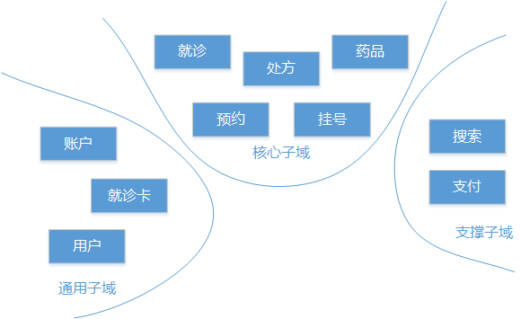
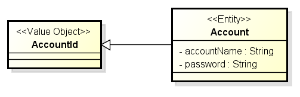

# 领域建模

## 目录

1. [面向领域思想](#面向领域思想)
   - [领域驱动设计核心概念](#领域驱动设计核心概念)
2. [面向领域的策略设计](#面向领域的策略设计)
   - [系统拆分方法](#系统拆分方法)
   - [系统拆分策略](#系统拆分策略)
   - [上下文集成技术](#上下文集成技术)
3. [领域驱动的架构风格](#领域驱动的架构风格)
   - [领域驱动设计核心组件](#领域驱动设计核心组件)
   - [实体与值对象](#实体与值对象)
     - [实体](#实体)
     - [值对象](#值对象)
     - [识别实体和值对象](#识别实体和值对象)
   - [聚合](#聚合)
     - [聚合的概念](#聚合的概念)
     - [聚合建模](#聚合建模)
4. [领域建模与架构师](#领域建模与架构师)

架构师需要能够从 **问题领域** 出发推导出满足业务需求的架构体系，同时又能够从实现方法入手设计出能够满足业务架构需求的技术架构体系，最终实现 **业务架构** 和 **技术架构** 的统一。

架构设计的两个层次：面向 **问题领域** 的 **业务架构** 和 面向 **解决方案** 的 **技术架构**。

诚然，对于架构师的需求主要体现在技术架构上，但业务架构是实现技术架构的前提，目前一些大型互联网公司对于业务架构师的需求也逐渐增多，下图是来自拉勾的一则业务架构师招聘信息，可作参考。

## 面向领域思想

在大型团队的系统设计和实现过程中，<b style="color:green">确保业务架构和技术架构能够统一</b>已经成为系统开发成败的关键。

而领域驱动设计（Domain-Driven Design，DDD）为我们提供了一种软件开发方法，强调 <b style="color:green">开发人员与领域专家协作交付业务价值</b>，强调 <b style="color:green">把握业务的高层次方向</b>，也强调 <b style="color:green">系统建模工具和方法</b> 以满足技术需求。

领域驱动设计思想的核心就是认为 <b style="color:green">系统架构应该是业务架构和技术架构相结合的一种过程，并提供了一系列的设计相关工具和模式确保实现这一过程</b>。在具体讲解领域驱动设计之前，我们先来理解领域的概念。

所谓领域（Domain），即是对现实世界问题的一种统称，是一个组织的业务开展方式，体现一个组织所做的事情以及其中所包含的一切业务范围和所进行的活动，我们在开发软件时面对的就是组织的领域。

例如，一个电商网站的领域包含了产品名录、订单、库存和物流的概念，而医疗信息化公司关注挂号、就诊、用药、健康报告等领域。

对架构设计而言，领域概念的提出是为了更好的体现系统的业务价值，领域的业务价值在于通过对业务定义的抽象，为系统设计和开发提供有用的领域模型和清晰的模型边界，从而实现更好的用户体验。

领域驱动设计也是实现设计微服务架构的基本方法论。

### 领域驱动设计核心概念

开发人员对领域的思考方法体现在设计的维度上。在领域驱动设计中，有两个主要的设计维度，即设计的策略维度和设计的技术维度。

- 设计的策略维度

  设计的策略维度关注如何设计领域模型以及对领域模型的划分，其目的在于清楚界分不同的系统与业务关注点。策略维度是一个面向业务、具备较高层次的的设计维度，偏重于业务架构的梳理以及考虑如何把业务架构和技术架构相结合的问题。

- 设计的技术维度

  设计的技术维度关注技术实现，从技术的的层面指导我们如何具体地实施领域驱动，关注基于技术设计工具按照领域模型开发软件。显然，技术维度偏向于技术实现，体现了技术架构的设计和展现方式。

设计的策略维度和技术维度相结合提供了一套通用的建模语言和术语，展示基于领域驱动的架构设计方法和实现领域驱动设计的各项关键技术，在本篇中，我们将主要介绍面向领域的策略设计，面向领域的技术设计将在下一篇中介绍。

## 面向领域的策略设计

策略维度包含领域驱动设计中的一些核心概念，用于抽象业务模型的领域或子域（Sub Domain），用于划分系统边界并考虑系统集成的限界上下文（Boundary Context）以及基于领域驱动设计的特有架构风格都属于这一设计维度。

任何软件系统的发展都是从简单到复杂、从集中到分散的过程。在系统构建初期，我们习惯于构建单一、内聚和全功能式的系统，因为这样的系统就能满足当前业务的需求。而当系统发展到一定阶段，集中化系统已经表现出诸多弊端，功能拆分和服务化思想和实践就会被引入。而当系统继续演进，团队规模也随之增大，由于分工模糊和业务复杂度的不断上升，系统架构逐渐被腐化，直到系统不能承受任何改变，也就到了需要重新拆分的阶段。这一过程给我们的启示就在于将所有东西放在一个系统中是不好的，软件系统的关注点应该清晰划分，并能通过功能拆分降低系统复杂性。

### 系统拆分方法

系统拆分需要解决两个问题：

- 如何找到拆分的切入点？
- 如何对拆分后的功能进行组装？

针对第一个问题，领域驱动设计给出了子域（Sub Domain）的概念。子域作为系统拆分的切入点，其来源往往取决于系统的特征和拆分的需求，如核心功能、辅助性功能、第三方功能等。而对于第二个问题而言，基本的思路就是系统集成，即子域之间通过有效的集成方式确保拆分后的业务功能能够整合到一起构成一个大的业务功能。系统集成的需求与业务需求不同，虽然包含在子域之中，但更多的关注集成的策略和技术体系，在领域驱动设计中，这部分需求及其实现被称为界限上下文（Boundary Context）。

- 子域

  子域的划分虽然因系统而异，但通过对子域的抽象，我们还是可以梳理出通用的分类方法。业界比较认可的分类方法认为，系统中的各个子域可以分成核心域、支撑子域和通用子域三种类型，其中系统中的核心业务属于核心域，专注于业务的某一方面的子域称为支撑子域，可以用于整个业务系统且作为一种基础设施的功能可以归到通用子域。当然，这也只是一家之说，我们可以根据需要建立对子域的抽象模型，为了描述方便，本篇后续内容以上述的分类方法标记系统子域。

- 界限上下文

  子域存在于界限上下文中，这里的界限指的是每个模型概念、属性和操作，在特定边界之内具有特定的含义，这些含义只限于该界限之内。如下图就是一个简单的界限上下文，其中 A 上下文和 B 上下文中都存在 User 对象，但是 B 上下文中的 User 对象不同于 A 上下文中的 User 对象，而 B 上下文中 Account 对象可能基于 A 上下文中的 Role 对象，这时候我们就会发现界限的划分能在很大程度上影响系统的设计和实现。

  

整合子域与界限上下文的示例结构见下图（来自于移动医疗场景），该图根据业务功能的特性把整个系统拆分成三个主要的子域，分别包含一个核心子域，一个支撑性子域以及一个通用子域，每个子域都有其界限上下文，各个界限上下文之间可以根据需要有效整合从而构成完整的领域。

### 系统拆分策略

根据子域和界限上下文概念，我们就可以对系统进行拆分。系统拆分的策略可以因地制宜，常见的拆分策略也包括：

- 根据业务

  根据业务进行系统拆分是面向领域策略设计的前提，也是《系统架构设计–程序员向架构师转型之路》一书所推崇的方法。

- 根据技术架构

  根据技术架构拆分系统违背了业务架构驱动技术架构的原则，在对业务梳理尚不完善、系统的策略设计尚不健全的情况下就考虑技术架构和实现方法，往往会导致返工，在不断的系统修改中腐化架构。

- 根据开发任务分配

  据开发任务分配同样不是一个好主意，在系统拆分过程中实际还没有到具体开发资源和时间统筹的阶段，开发任务自然也无从谈起。

- 一个团队负责一个上下文

  但是一个团队一个上下文策略有时候反而是一种有效的拆分策略。团队的构建方式可以是职能团队（Function Team）也可以是特征团队（Feature Team），前者关注于某一个特定职能，如常见的服务端、前端、数据库、UI 等功能团队，而后者则代表一种跨职能（Cross Function）的团队构建方式，团队中包括服务端、前端等各种角色。上下文的构建以及界限的划分是一项跨职能的活动，如果团队组织架构具备跨职能特性，可以安排特定的团队负责特定的上下文并统一管理该上下文对应的界限。

### 上下文集成技术

明确各个上下文的边界之后，我们同时需要考虑的问题就是如何对拆分后的功能进行组装。对于这个问题，基本的思路就是系统集成。站在高层次的架构分析角度，任何一个系统都可以处在其他系统的上游（Upstream），也可以位于其他系统的下游（Downstream）。所以系统集成实际上就是将上游系统与下游系统进行整合共同完成某一项业务的过程。如下图所示，假设通过领域拆分得到三个上下文 A、B 和 C，A 上下文同时位于 B、C 上下文的上游，B 上下文相对 A 而言处于下游但相对 C 而言处于上游，C 上下文则处在整个系统的最下游。

上下文集成的基本思路在于解耦和统一。对于解耦而言，一方面在于技术实现上的依赖性，需要支持异构系统的有效交互；一方面也需要把关注于集成的实现与业务逻辑的实现相分离，确保集成机制的独立性。而统一的含义在于一致性，即上游系统应该定义协议，让所有下游系统通过协议访问，确保在数据传输接口和语义上各个上下文之间能够达成一致。

**防腐层与统一协议：**

针对以上两种思路，我们可以分别抽象出两种最基本的集成模式，即防腐层（AntiCorruption Layer，ACL）和统一协议（Unified Protocol，UP）。防腐层强调下游系统根据领域模型创建单独一层，该层完成与上游系统之间的交互，从而隔离业务逻辑，实现解耦。统一协议则是提供一致的协议定义，促使其他系统通过协议访问。显然，防腐层模式面向下游系统而统一协议面向上游系统。

在对任何子域和上下文进行提取时，确保从组织关系和集成模式上对上下文集成进行抽象。下图就是上下文关系在集成方案上的一种表现形式。

**领域事件：**

现实中很多场景都可以抽象成事件，如当……发生……时、如果发生……、当……时通知我等，领域事件（Domain Event）指的就是把领域中所发生的活动建模成一系列离散事件。领域事件也是一种领域对象，是领域模型的组成部分，同时也为上下文之间的交互提供了另一种方式。

领域事件生命周期包括产生、存储、分发和使用四个阶段，根据角色的不同，事件的产生处于事件发布阶段，而存储、分发和使用可以归为事件的处理阶段。但针对某种特定事件并不一定都会经历完整的生命周期。

事件的识别有时候具有一定的隐秘性，当一个实体依赖于另外一个实体，但两者之间并不希望产生强耦合而又需要保证两者之间的一致性时，我们通常就可以提取事件，这是事件最容易识别的场景。如在移动医疗系统的挂号（Registration）场景，为了避免挂号系统与其他系统之间产生强耦合，当一个挂号结束时，该上下文更新挂号结果信息并通知相关兴趣方，这个过程中我们就可以提取 RegistrationFinished 事件。

领域事件同样需要建模，一般使用过去时对事件进行命名，如上述的 RegistrationFinished 事件。领域事件包含唯一标识、产生时间、事件来源等元数据，也可以根据需要包含任何业务数据。同时，领域事件具有严格意义上的不变性，任何场合都不可能对事件本身做任何修改，因为事件代表的是一种瞬时状态。

事件驱动架构的发布-订阅机制非常适合与其他风格进行整合构成复合型架构风格，最典型的就是与管道-过滤器（Pipe-Filter）风格进行整合。管道中流转的数据就是领域事件，而过滤器可以是一个子域中的某个组件，也可以是进行跨子域的界限上下文。下图就是一个典型的管道-过滤器示例，我们看到事件发布器 UserPasswordPublisher 发布了一个 UserPasswordChanged 事件，而订阅该事件的 UserPasswordHandler 组件对该事件进行处理之后再次发送一个 UserPasswordChangeSucceed 事件，负责接收 UserPasswordChangeSucceed 事件的 UserPasswordChangeSucceedHandler 组件可以根据需要对该事件进行后续处理。整个过程中能够发送事件的组件实际上就是管道，而处理事件的组件就是过滤器，通过管道和过滤器的组合形成基于领域事件的管道-过滤器风格。

## 领域驱动的架构风格

作为高层次的设计维度，面向领域的策略设计同样涉及系统的体系架构，领域驱动设计在设计思想上有其独特的考虑。

### 领域驱动设计核心组件

设计架构分层的前提是明确系统的核心组件，分层体现的就是对这些核心组件的层次和调用关系的梳理。在领域驱动设计中，一般认为存在以下四大组件：

- 领域组件。代表对整个领域驱动设计的核心，包含对领域、子域、界限上下文等策略设计相关内容，也包含后续所要阐述的所有技术设计组件。领域组件代表抽象模型，并不包含具体实现细节和技术。
- 基础设施（Infrastructure）组件。这里的基础设施组件范围比较广泛，即可以包括通用的工具类服务，也包括数据持久化等具体的技术实现方式。领域组件中的部分抽象接口需要通过基础设施提供的服务得以实现，所以基础设施组件对领域组件存在依赖关系。
- 应用组件（Application）。应用组件面向用户接口组件，是系统对领域组件的一种简单封装，通常作为一种门户（Facade）或网关（Gateway）对外提供统一访问入口，在用户接口和领域之间起到衔接作用。同时，因为基础设施组件是对领域组件部分抽象接口的具体实现，所以应用组件也会使用基础设施组件的服务完成具体操作。
- 用户接口（User Interface）组件。用户接口处于系统的顶层，直接面向前端应用，调用应用组件提供的应用级别入口完成用户操作。

在领域组件中，为了建立完整的领域模型，势必会涉及到数据的管理。数据相关操作对于领域模型而言只是持久化的一种抽象，不应该关联具体的实现方式。比如，我们可以用关系型数据库去实现某个数据操作，有时候根据需要我们同样可以采用各种 NoSQL 技术。显然，无论是关系型数据库操作还是 NoSQL 技术都不应该包含在领域组件中，通常我们会使用接口的方式抽象数据访问操作，然后通过依赖注入方法把实现这些数据访问接口的组件注入到领域模型中，这些数据访问的实现我们就可以统一放在基础设施组件中，也就是说基础设施组件实现了领域组件中的抽象接口。

通过以上分析，我们可以把领域驱动设计中的四种组件分别列为四层，并梳理各个层次之间的关系形成分层结构图（见下图），该图的表现形式与上述各个组件描述是一致的。

传统的分层结构根据是否可以跨层调用可以归为两类，即严格分层架构和松散分层架构，前者认为各个层次之间不允许存在跨层调用的方式，而后者并不对此有严格限制。所以，领域驱动设计分层结构实际上是一种松散分层架构，位于系统流程上游的用户接口层和应用层，以及位于系统流程下游的的具备数据访问功能的基础设施层都依赖于抽象层，事实上已不存在严格意义上的分层概念。领域驱动设计思想认为应该推平分层架构，不使用严格的分层架构来构建系统，平面形架构（见下图）也就应运而生。

在上图中，平面形架构促使我们转换视角重新审视一个系统，划分内部和外部成为架构搭建的切入点，系统由内而外围绕领域组件展开，领域组件位于平面形架构的最内层，应用程序也可以包含业务逻辑，与领域组件构成系统的内部基础架构；而对于外部组件而言，通过各种适配器进行上下文集成，这些适配器包括数据持久化，也包括面向第三方的数据集成。基于依赖注入和 Mock 机制，适配器组件可以进行方便的模拟和替换。

正如上面所述，在领域驱动设计中策略设计侧重于子域的拆分和集成，其结果是合理划分的子域以及它们之间的交互关系。当系统已经被拆分成子域之后，领域驱动设计中的技术维度则关注更小的粒度，主要解决的问题是处理在某一个子域之内各个对象之间的交互关系。为此，本篇引出实体（Entity）和值对象（Value Object）的概念并介绍它们背后的聚合（Aggregation）设计思想。

## 实体与值对象

### 实体

通常，我们在设计一个系统时不知不觉会使用数据驱动的设计思想，即先设计数据库模型，然后再根据数据设计服务层和表现层。数据驱动设计思想非常常见，开发者趋向于关注数据而不是领域，但我们认为面向领域的实体对象才是能够表达业务逻辑的有效载体。究其原因，在于很多对象不是通过它们的数据属性来定义，而是应该具有一系列的标识和行为定义。在领域驱动设计中，我们关注的是实体（Entity）对象而并非数据本身。当然，实体对象本身也包含数据属性，我们可以采用一定的手段把数据对象转换成实体对象。通过标识区分对象，并为对象引入状态改变和生命周期就能达到这种转换目的。

领域驱动设计中，实体应该具有两个基本特征：唯一标识和可变性。

1. 唯一标识

   唯一标识（Identity）的创建有几种通用的策略，如用户提供初始唯一值、系统内部自动生成唯一标识、系统依赖持久化存储生成唯一标识等。用户提供初始唯一值的处理方式依赖于用户通过界面输入，系统根据用户输入判断是否重复，如果重复则不允许创建实体。系统内部自动生成唯一标识被广泛应用于各种需要生成唯一标识的场景，策略上可以简单使用 JDK 自带的 UUID，也可以借助于第三方框架如 Apache Commons Id，但更为常见的是根据时间、IP、对象标识、随机数、加密等多种手段混合生成。

2. 可变性

   涉及到实体的可变性，我们不得不面对一个老生常谈的话题，也就是到底应该采用贫血模型还是充血模型。贫血模型的系统结构如下图所示，它的优点在于层次结构清楚，各层之间单向依赖，领域对象几乎只作传输介质之用，不会影响到层次的划分。但缺点也很明显，即领域对象只是作为保存状态或者传递状态使用并不包含任何业务逻辑，只有数据没有行为的对象不是真正的领域对象，在应用层里面处理所有的业务逻辑，对于细粒度的逻辑处理，通过增加一层 Facade 达到门面包装的效果，应用层比较庞大，边界不易控制，内部的各个模块之间的依赖关系不易管理。这些都与面向领域驱动设计中子域和界限上下文的划分以及集成思想相违背，所以我们推荐的是充血模型。

   

   充血模型优点是面向对象，应用层符合单一职责，不像在贫血模型里面那样包含所有的业务逻辑太过沉重。同时，每一个领域模型对象一般都会具备自己的基础业务方法，满足充血模型的特征。充血模型更加适合较复杂业务逻辑的设计开发（见下图）。但如何划分业务逻辑，也就是说要做到把业务逻辑正确放在领域层和应用层中比较困难。

   

### 值对象

当只关心对象的属性时，该对象应归为值对象(Value Object)，从这点上讲值对象有点类型贫血模型对象。但值对象具备根据明确的约束条件，包括值对象是不变对象、值对象没有唯一标识、值对象具有较低的复杂性。

一般在对系统的实体和值对象进行提取时，关注点首先在于实体，当我们把实体提取完毕，就需要进一步梳理实体中是否包含了潜在的值对象。值对象的特征决定了如何分离值对象的方法。

如果一个对象满足自身是度量或描述领域中的一个部分、可以作为不变量、将不同的相关属性组合成一个概念整体、当度量或描述改变时可以用另一个值对象予以替换、可以和其他值对象进行相等性比较、不会对协作对象造成副作用等条件时，我们就认为该对象很大程度上就可能是一个值对象。

下图就是从实体中分离值对象的示例，我们发现 Customer 对象中包含了客户的 Address 信息，而 Address 就是一个值对象，因为 Address 将 Street、City、State 等相关属性组合成一个概念整体，Address 也可以作为不变量，当该 Address 改变时，可以用另一个 Address 值对象予以替换。

值对象可以用来表示标准类型，也可以在上下文集成中充当对外的数据媒介。值对象在实现上需要严格保持其的不变性，通过只用构造函数、不用 setter 方法等手段可以构建一个合适的值对象。

### 识别实体和值对象

识别实体和值对象是面向领域技术设计的第一步，基本的思路还是充分利用业务逻辑中的信息，并采用以下四个步骤。在本节中我们将通过一般系统中常见的账户中心（AccountCenter）为例对这些步骤进行具体展开。

#### 1.识别实体

AccountCenter 对账户（Account）的描述包括：必须对系统中的 Account 进行认证；Account可以处理自己的个人信息，包含姓名、联系方式等；Account 的安全密码等个人信息能被本人修改。请大家注意“认证”、“修改”等关键词，从这些词中我们可以判断出 Account 应该是一个实体对象而不是值对象，所以 Account 应该包含一个唯一标识以及其他相关属性。考虑到 Account 实体的唯一标识 UserId 可能只是一个数据库主键值，也可能是一个复杂的数据结构，所以我们 AccountId 提取成一个值对象。这样基本的 Account 实体就识别出来了（见下图）。

#### 2.挖掘实体的关键行为

对 Account 而言，我们再进一步细化。考虑到关联 Account 的用户可能离职等原因，Account 可以处于激活或锁定状态，对应的 Account 实体应用具备激活或锁定相关的行为。包含行为的 Account 实体见下图。

#### 3.识别值对象

考虑到激活状态的 Account 可以修改安全密码、姓名、联系方式等个人信息，我们势必需要从 Account 实体中提取姓名、联系方式等信息，这些信息实际上构成了一个完整的人（User）的概念，但显然 User 不等于 Account，而是 Account 的一部分。

Account 作为一个抽象的概念，包含 User 相关信息，也包含用户名、密码等账户相关的信息，所以这个时候我们发现需要从 Account 中进一步分离 User 对象。User 同样也是一个实体，但与 User 紧密相关的联系方式等信息倾向于分离成值对象。对 Account 实体进行进一步分离之后我们可以得到下图的细化结果。

#### 4.构建概念整体

通过以上分析，我们发现从通用语言出发，围绕 Account 概念所提取出来的实体和值对象有多个，其中 Account 和 User 代表两个实体，Account 中包含 User 实现和 AccountId 值对象，而 User 中包含 UserId、Name 和 ContactInfo 值对象。

最后，我们再来总结一下实体和值对象的区别。从标识的角度，实体有唯一标识，值对象没有唯一标识，不存在这个值对象或那个值对象的说法；从是否只读的角度，实体是可变的，而值对象是只读的；从生命周期的角度，实体具有生命周期，而值对象无生命周期可言，因为值对象代表的只是一个值，需要依附于某个具体实体。

## 聚合

### 聚合的概念

一个子域中包含若干聚合（Aggregate）。聚合的核心思想在于将关联减至最少有助于简化对象之间的遍历，使用一个抽象来封装模型中的引用。聚合的组成有两部分，一部分被称为根（Root）实体，是聚合中的某一个特定实体；另一部分描述一个边界，定义聚合内部都有什么。聚合代表一组相关对象的组合，是数据修改的最小单元，也就是意味着对对象组合的修改只能通过聚合中的根实体进行，而不是对于组合中的所有实体都能进行直接修改。

聚合具备如下固定规则。聚合中的根实体具有全局标识、外部系统只能看到根实体，只有根实体才能直接通过数据进行查询获取，其他对象必须通过聚合内部关联的遍历才能找到，而且删除操作必须一次删除聚合之内的所有对象。这些固定规则都是为了减少复杂关系下对象遍历的次数，明确系统边界。

参考下图中的聚合示意图，左半部分代表的是没有采用聚合概念的对象遍历图，我们可以看到任何对象都能两两进行交互，所以对象都处于同一个边界中；而右半部分显然有所不同，通过聚合思想把系统划分成三个边界，每个边界里面包含一个聚合，图中与外部边界直接关联的就是聚合中的根对象，我们可以看到只有根对象之间才能进行直接交互，其他对象只能与该聚合中的根对象进行直接交互。以图中的8个对象为例，通过聚合可以把最多 28-1 次对象直接交互减少到 23-1 次。

使用聚合将领域模型分散和参与到每个聚合中，这使得领域模型更容易理解。聚合也能帮助我们明确查询操作和删除操作的范围。同时，因为对象的访问只能通过聚合中的根实体进行，考虑到性能和伸缩性，我们一般建议聚合的大小不应该过大。

### 聚合建模

我们假想一个场景，在项目管理中一个项目可以创建很多任务，一个项目可以评估出一个项目计划。通过分析业务逻辑，可以识别 Project、Task、Plan 这三个主要实体或值对象。关于如何设计这些对象之间的关联，我们有几种思路。

下图是一种基于聚合的建模思路，我们把 Project、Task、Plan 归为实体对象，并把 Project 上升到聚合的根对象。这样外部系统只能通过 Project 对象访问 Plan 和 Task 对象，而 Project 中包含着对 Plan 和 Task 的直接引用。

思路二（见下图）走的是另一条路，我们把 Plan 和 Task 同样上升到聚合级别，意味着重新划分了系统边界，三个对象构成了三个不同的聚合。显然，这种情况下，Project 对象中包含着对 Plan 和 Task 的直接引用是不合适的，在不破环现在有的实体关系，我们可以通过引入值对象来缓解这种现象，通过把唯一标识提取成一个值对象 ProjectId，Project 通过 ProjectId 与 Plan 和 Task 对象进行关联。

思路一和思路二代表着各有利弊的两种极端，有三条聚合建模的原则可以帮忙我们找到其中存在的问题。

1. 聚合内部真正的不变条件

   第一条建模原则在于关注聚合内部建模真正的不变条件，什么样的业务规则应该总是保持一致，即在一个事务中只修改一个聚合实例，如果一个事务内需要修改的所有内容处于不同聚合中，我们就要重新考虑聚合划分的有效性。另一方面，聚合内部保持强一致性的同时，聚合之间需要保持最终一致性。

   考虑思路二中的 Plan 对象，因为系统的目的就是获取 Project 的 Plan，而不是把 Project 和 Plan 分别进行管理，也就是说更新 Project 的同时也应该同时更新 Plan，Project 和 Plan 的更新处于同一个事务中，所以把 Plan 放到以 Project 为根实体的聚合中更加符合聚合建模的这一条原则。

2. 设计小聚合

   聚合可大可小，设计聚合大小的通用原则是考虑性能和扩展性，我们倾向于使用小聚合。大的聚合可以降低边界对象遍历的数量，但聚合内部包含更多实体和值对象。从性能角度讲，聚合内部复杂的对象管理和深层次的对象遍历会降低系统的性能，因为很多边界处理实际上并不需要涉及过多的聚合内部对象。而对于扩展性，系统的变化对于大粒度聚合的影响显然大于小聚合。同时，考虑到实体具备生命周期和状态变化，聚合建模也推荐优先使用值对象以降低聚合内部复杂性。

3. 通过唯一标识引用其他聚合

   通过唯一标识引用其他聚合对聚合设计的提示就是通过标识而非对象引用使多个聚合协同工作。聚合中的根实体应该具备唯一标识，思路二中引入值对象 ProjectId 作为 Project 的唯一标识，并通过该值对象与其它聚合中的根实体进行交互就是这条原则的具体体现。如果 Task 业务作为一个根实体的话，一般也会提取一个值对象 TaskId 作为其唯一标识。

综合运用三条聚合建模的原则之后，我们可以得到入下图的聚合建模思路三，这是我们对上述场景进行聚合建模的最终结果。

### 聚合与子域

子域、聚合和界限上下文三者之间的关系示意图如下所示。该图根据业务功能的特性把整个系统拆分成四个主要的子域，分别包含一个核心子域、两个支撑子域以及一个通用子域，每个子域都有其界限上下文，各个界限上下文之间可以根据需要有效整合从而构成完整的领域。

从上图中我们也可以进一步看到，聚合位于子域中，与子域一样代表的也是一种拆分的层次和粒度。通过在子域的基础上再添加一层聚合的抽象，使得系统拆分不仅仅在大的业务体系级别有所体现，也精确到了系统内部的对象级别。聚合概念的提出与软件复杂度有直接关联。软件设计中的一大问题就在于大多数业务系统中的对象都具有十分复杂的联系，现实世界很少有清晰的边界。复杂的关系需要通过关联数量庞大的对象才能建立，复杂关系的开发和维护需要投入巨大成本，这也是我们为什么要推行微服务架构的一个根源，关于微服务架构的更多内容请参考本课程的第八篇《微服务——最热门的架构》。

## 领域建模与架构师

对从事应用软件开发而又立志往架构师方向转型的广大程序员而言，面对所谓的架构设计，内心可能会萦绕这样一个问题：架构设计到底是面向技术还是面向业务？诚然在很多技术人员眼中，架构设计几乎等同于技术架构设计，对架构师的理解也主要关注于对各种技术体系和框架的掌握程度。然而，很多团队并不缺少出色的技术人员，但是产品开发最终还是会以失败而告终。究其原因，在于技术人员往往只关注于技术架构，而对系统设计的其他方面，尤其是对业务的理解缺少足够的重视。

当然，针对不同性质的系统开发，架构设计的工作重点显然也会有所区别。在对“架构设计到底是面向技术还是面向业务”这个问题作出判断之前，我们首先需要明确两点，第一点是我们是不是在做业务？除了专门从事中间件或底层框架开发的少数场景之外，绝大多数的软件开发工作实际上都是围绕着现实中的业务问题而展开。如果面对的是业务导向的开发场景，那么我们就要考虑第二点，即面对复杂的业务逻辑架构师应该怎么办？采用主流的架构设计理念和先进的技术实现体系，对业务的充分理解，并且能够对业务与技术进行整合的能力同样是成为一名合格架构师的必要条件。

面向领域思想阐述的架构设计方法既面向技术也面向业务。在上一篇和本篇的内容中，我们探讨了如何整合技术和业务，并引入领域驱动设计思想。领域建模是架构设计的第一步，也是成为架构师首先应该具备的重要知识体系。
