# 架构概述

## 目录

1. [RPC——一切架构的基础]
   - [网络通信](#网络通信)
   - [序列化](#序列化)
   - [传输协议](#传输协议)
   - [服务调用](#服务调用)
2. [分布式服务架构——最核心的架构](#分布式服务架构——最核心的架构)
   - [负载均衡](#负载均衡)
   - [服务路由](#服务路由)
   - [服务发布与调用](#服务发布与调用)
3. [微服务——最热门的架构](#微服务——最热门的架构)
   - [服务边界](#服务边界)
   - [服务拆分](#服务拆分)
   - [服务集成](#服务集成)
   - [微服务架构基础组件](#微服务架构基础组件)
   - [微服务实现技术](#微服务实现技术)
   - [微服务与架构师](#微服务与架构师)

## RPC——一切架构的基础

现代架构设计离不开分布式系统，而远程过程调用（Remote Process Call，RPC）则是一切分布式架构的基础。

RPC 架构是基本的远程通信架构，主要由 **网络通信**、**序列化/反序列化**、**传输协议** 和 **服务调用** 等四个核心组件所构成。

下面的结构图包括了分布式环境下的各个基本功能组件。

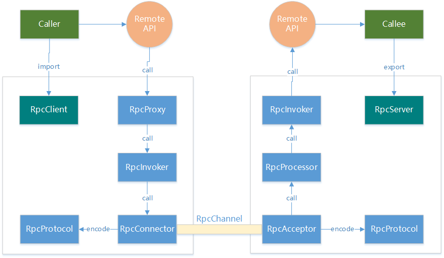

从上图中，可以看到 RPC 架构有左右对称的两大部分构成，分别代表了一个远程过程调用的客户端和服务器端组件。客户端组件与职责包括：

- RpcClient，负责导入（import）由 RpcProxy 提供的远程接口的代理实现；
- RpcProxy，远程接口的代理实现，提供远程服务本地化访问的入口；
- RpcInvoker，负责编码和发送调用请求到服务方并等待结果；
- RpcProtocol，负责网络传输协议的编码和解码；
- RpcConnector，负责维持客户端和服务端连接通道和发送数据到服务端；
- RpcChannel，网络数据传输通道。

而服务端组件与职责包括：

- RpcServer，负责导出（export）远程接口；
- RpcInvoker，负责调用服务端接口的具体实现并返回结果；
- RpcProtocol，负责网络传输协议的编码和解码；
- RpcAcceptor，负责接收客户方请求并返回请求结果；
- RpcProcessor，负责在服务方控制调用过程，包括管理调用线程池、超时时间等；
- RpcChannel，网络数据传输通道。

在 RPC 架构实现思路上，远程服务提供者以某种形式提供服务调用相关信息，远程代理对象通过动态代理拦截机制生成远程服务的本地代理，让远程调用在使用上就如同本地调用一样。

下图所示的就是动态代理的基本结构图，可以看到通过在目标类的执行方法前后动态加入前置通知和后置通知就可以实现基本的拦截操作。

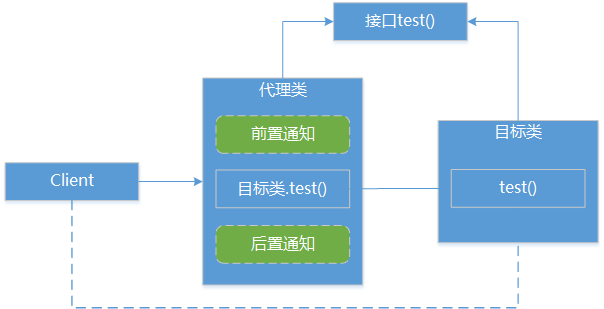

以 JDK 自带的动态代理机制为例，其执行过程时序图如下所示，涉及到的核心 Proxy 和 InvocationHandler 类在图中都有所体现。

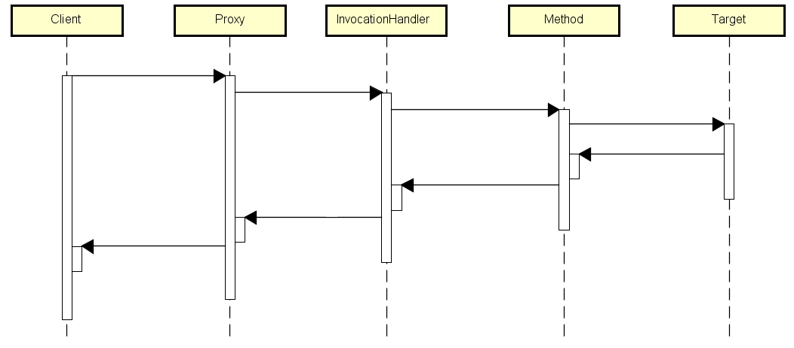

而在本地接口代理对象中，访问远程服务网络的通信应该与具体协议无关，通过序列化和反序列化方式对网络传输数据进行有效传输。

### 网络通信

网络通信是任何分布式系统的基础组件。网络通信本身涉及面很广，这里并不打算介绍网络通信相关的方方面面。对于分布式架构而言，网络通信关注于网络连接、IO 模型和可靠性设计。

#### 网络连接

基于 TCP 协议的网络连接有两种基本方式，也就是通常所说的长连接（也叫持久连接，Persistent Connection）和短连接（Short Connection）。当网络通信采用 TCP 协议时，在真正的读写操作之前，Server 与 Client 之间必须建立一个连接，当读写操作完成后，双方不再需要这个连接时就可以释放这个连接。连接的建立需要三次握手，而释放则需要四次握手，每个连接的建立都意味着需要资源和时间的消耗。

当客户端向服务器端发起连接请求，服务器端接收请求，然后双方就可以建立连接。服务器端响应来自客户端的请求就需要完成一次读写过程，这时候双方都可以发起关闭操作，所以短连接一般只会在客户端/服务器端间传递一次读写操作，也就是说 TCP 连接建立后，数据包传输完成即关闭连接。短连接结构简单，管理起来比较简单，存在的连接都是有用的连接，不需要额外的控制手段。

长连接则不同，当客户端与服务器端完成一次读写之后，它们之间的连接并不会主动关闭，后续的读写操作会继续使用这个连接。这样当 TCP 连接建立后，就可以连续发送多个数据包，能够节省资源并降低时延。

长连接和短连接的产生在于客户端和服务器端采取的关闭策略，具体的应用场景采用具体的策略，没有十全十美的选择，只有合适的选择。在 RPC 框架实现过程中，考虑到性能和服务治理等因素，通常使用长连接进行通信。

#### IO模型

说到网络通信，就不得不提 IO 模型。现代操作系统都包括内核空间（Kernel Space）和用户空间（User Space），内核空间主要存放内核代码和数据，是供系统进程使用的空间；而用户空间主要存放的是用户代码和数据，是供用户进程使用的空间。一般的 IO 操作都分为两个阶段，以网络套接口（Socket）的输入操作为例，它的两个阶段包括内核空间和用户空间之间的数据传输，即首先等待网络数据到来，当数据分组到来时，将其拷贝到内核空间的临时缓冲区中，然后再将内核空间临时缓冲区中的数据拷贝到用户空间缓冲区中。围绕 IO 操作的这两个阶段，存在几种主流的 IO 操作模式（见下图）。

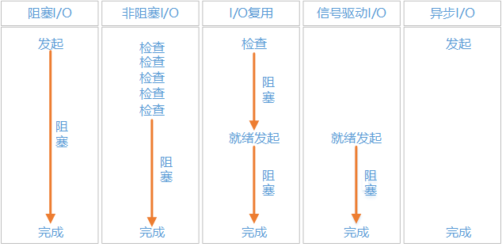

上图中每个模式对应的不同的处理方式和效果如下。

- 阻塞 IO

  阻塞 IO（Blocking IO，BIO）在默认情况下，所有套接口都是阻塞的，意味着 IO 的发起和结束都需等待。任何一个系统调用都会产生一个由用户态到内核态切换，再从内核态到用户态切换的过程，而进程上下文切换是通过系统中断程序来实现的，需要保存当前进程的上下文状态，这是一个成本很高的过程。

- 非阻塞 IO

  如果采用非阻塞 IO（Non-blocking IO，NIO），即当我们把套接口设置成非阻塞时，会由用户进程不停地询问内核某种操作是否准备就绪，这就是我们常说的轮询（Polling）。这同样是一件比较浪费 CPU 的方式。

- IO 复用

  IO 复用主要依赖于操作系统提供的 select 和 poll 机制。同样会阻塞进程，但是这里进程是阻塞在 select 或者 poll 这两个系统调用上，而不是阻塞在真正的 IO 操作上。另外还有一点不同于阻塞 IO 的就是，尽管看起来 IO 复用阻塞了两次，但是第一次阻塞是在 select 上时，select 可以监控多个套接口上是否已有 IO 操作准备就绪，而不是像阻塞 IO 那种，一次只能监控一个套接口。

- 信号驱动 IO

  信号驱动 IO 就是说我们可以通过 sigaction 系统调用注册一个信号处理程序，然后主程序可以继续向下执行，当我们所监控的套接口有 IO 操作准备就绪时，由内核通知触发前面注册的信号处理程序执行，然后将我们所需要的数据从内核空间拷贝到用户空间。

- 异步 IO

  异步 IO（Asynchronous IO，AIO）与信号驱动 IO 最主要的区别就是信号驱动 IO 是由内核通知我们何时可以进行 IO 操作，而异步 IO 则是由内核告诉我们 IO 操作何时完成了。具体来说就是，信号驱动 IO 中当内核通知触发信号处理程序时，信号处理程序还需要阻塞在从内核空间缓冲区拷贝数据到用户空间缓冲区这个阶段，而异步 IO 是在第二个阶段完成后内核直接通知可以进行后续操作。

结合各个 IO 模型的效果图，我们发现前四种 IO 模型的主要区别是在第一阶段，因为它们的第二阶段都是在阻塞等待数据由内核空间拷贝到用户空间；而异步 IO 很明显与前面四种有所不同，它在第一阶段和第二阶段都不会阻塞。

#### 可靠性

由于存在网络闪断、超时等网络状态相关的不稳定性以及业务系统本身的故障，网络之间的通信必须在发生上述问题时能够快速感知并修复。常见的网络通信保障手段包括链路有效性检测以及断线之后的重连处理。

从原理上讲，要确保通信链路的可靠性就必须对链路进行周期性的有效性检测，通用的做法就是心跳（Heart Beat）检测。心跳检测通常有两种技术实现方式，一种是在 TCP 层通过建立长链接在发送方和接收方之间传递心跳信息；另一种则是在应用层，心跳信息根据系统要求可能包含一定的业务逻辑。

当发送方检测到通信链路中断，会在事先约定好的重连间隔时间之后发起重连操作，如果重连失败，则周期性的使用该间隔时间进行重连直至重连成功。

### 序列化

所谓序列化（Serialization）就是将对象转化为字节数组，用于网络传输、数据持久化或其他用途，而反序列化（Deserialization）则是把从网络、磁盘等读取的字节数组还原成原始对象，以便后续业务逻辑操作。

序列化的方式有很多，常见的有文本和二进制两大类。XML 和 JSON 是文本类序列化方式的代表，而二进制实现的方案包括 Google 的 Protocol Buffer 和 Facebook 的 Thrift 等。对于一个序列化实现方案而言，以下几方面的需求可以帮我们作出合适的选择。

#### 功能

序列化基本功能的关注点在于所支持的数据结构种类以及接口友好性。数据结构种类体现在对泛型和 Map/List 等复杂数据结构的支持，有些序列化工具并不内置这些复杂数据结构。接口友好性涉及是否需要定义中间语言（Intermediate Language，IL），正如 Protocol Buffer 需要 .proto 文件、Thrift 需要 .thrift 文件，通过中间语言实现序列化一定程度上增加了使用的复杂度。

另一方面，在分布式系统中，各个独立的分布式服务原则上都可以具备自身的技术体系，形成异构化系统，而异构系统实现交互就需要跨语言支持。Java 自身的序列化机制无法支持多语言也是我们使用其他各种序列化技术的一个重要原因。像前面提到过的 Protocol Buffer、Thrift 以及 Apache Avro 都是跨语言序列化技术的代表。同时，我们也应该注意到，跨语言支持的实现与所支持的数据结构种类以及接口友好性存在一定的矛盾。要做到跨语言就需要兼容各种语言的数据结构特征，通常意味着要放弃 Map/List 等部分语言所不支持的复杂数据结构，而使用各种格式的中间语言的目的也正是在于能够通过中间语言生成各个语言版本的序列化代码。

#### 性能

性能可能是我们在序列化工具选择过程中最看重的一个指标。性能指标主要包括序列化之后码流大小、序列化/反序列化速度和 CPU/内存资源占用。下表中我们列举了目前主流的一些序列化技术，可以看到在序列化和反序列化时间维度上 Alibaba 的 fastJSON 具有一定优势，而从空间维度上看，相较其他技术我们可以优先选择 Protocol Buffer。

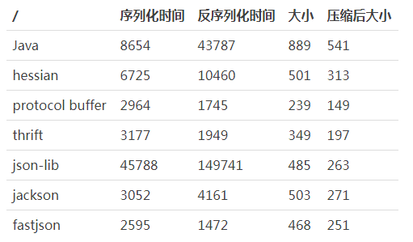

#### 兼容性

兼容性（Compatibility）在序列化机制中体现的是版本概念。业务需求的变化势必导致分布式服务接口的演进，而接口的变动是否会影响使用该接口的消费方、是否也需要消费方随之变动成为在接口开发和维护过程中的一个痛点。在接口参数中新增字段、删除字段和调整字段顺序都是常见的接口调整需求，类如 Protocol Buffer 就能实现前向兼容性确保调整之后新、老接口都能保持可用。

### 传输协议

ISO/OSI 网络模型分成 7 个层次，自上而下分别是应用层、表示层、会话层、传输层、网络层、数据链路层和物理层。其中传输层实现端到端连接、会话层实现互连主机通讯、表示层用于数据表示、应用层则直接面向应用程序。

RPC 架构的设计和实现通常会涉及传输层及以上各个层次的相关协议，通常所说的 TCP 协议就属于传输层，而 HTTP 协议则位于应用层。TCP 协议面向连接、可靠的字节流服务，可以支持长连接和短连接。HTTP 是一个无状态的面向连接的协议，基于 TCP 的客户端/服务器端请求和应答标准，同样支持长连接和短连接，但 HTTP 协议的长连接和短连接本质上还是 TCP 的连接模式。

我们可以使用 TCP 协议和 HTTP 协议等公共协议作为基本的传输协议构建 RPC 架构，也可以使用基于 HTTP 协议的 Web Service 和 RESTful 风格设计更加强大和友好的数据传输方式。但大部分 RPC 框架内部往往使用私有协议进行通信，这样做的主要目的在于提升性能，因为公共协议出于通用性考虑添加了很多辅助性功能，这些辅助性功能会消耗通信资源从而降低性能，设计私有协议可以确保协议尽量精简。另一方面，出于扩展性的考虑，具备高度定制化的私有协议也比公共协议更加容易实现扩展。当然，私有协议一般都会实现对公共协议的外部对接。实现自定义私有协议的过程可以抽象成一个模型，自定义协议的通信模型和消息定义、支持点对点长连接通信、使用 NIO 模型进行异步通信、提供可扩展的编解码框架以及支持多种序列化方式是该模型的基本需求。

传输协议的消息包括消息头（Header）和消息体（Payload）两部分，消息体表示需要传输的业务数据，而消息头用于进行传输控制，传输协议的这种设计方法体现的是“信封（Envelope）”思想（见下图），通过现有消息上添加一层信封来对消息进行包装，从而有效区分传输协议的各个层次。作为协议的元数据，我们可以在消息头中添加各种定制化信息形成自定义协议。

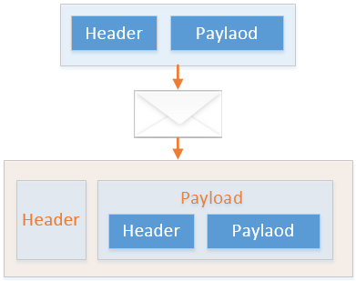

下图是 Dubbo 分布式框架中采用的私有 Dubbo 协议的定义方式，我们可以看到 Dubbo 协议在会话层中添加了自定义消息头，该消息头包括多协议支持和兼容的 Magic Code 属性、支持同步转异步并扩展消息头的 Id 属性等。

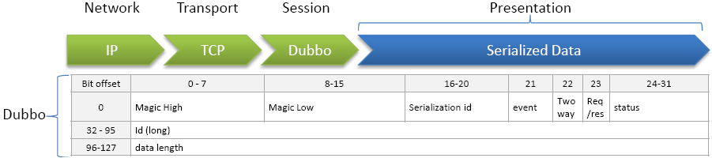

Dubbo 协议的设计者认为远程服务调用时间主要消耗在于传输数据包大小，所以 Dubbo 序列化主要优化目标在于减少数据包大小，提高序列化反序列化性能。可以从下图中看出 Dubbo 协议对数据包大小的处理优于大多数相关工具和框架。

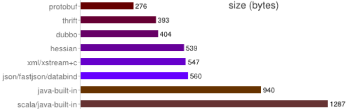

### 服务调用

服务调用存在两种基本方式，即同步调用和异步调用。

#### 同步调用

同步调用会造成业务线程阻塞，但开发和管理相对简单。对于同步调用而言，发起调用的服务线程发送请求到 IO 线程之后就一直处于等待阶段，直到 IO 线程完成与网络的读写操作之后被主动唤醒。

#### 异步调用

使用异步调用的目的在于获取高性能，消息传递系统和事件驱动架构都是实现异步调用的常见策略，但都需要依赖于基础中间件平台。下图所示的就是事件驱动架构的一种实现方法，事件发布器发布事件，简单订阅者直接处理事件，表现为一个独立的事件处理程序，这样就形成了基本的异步调用模式。而即时转发订阅者对应于事件的分发和使用阶段，一方面可以具备简单订阅者的功能，另一方面也可以把事件转为给其他订阅者。通常，把事件转发到消息队列是一个好的实践方法，现有的很多消息传递系统具备强大的一对一和一对多转发功能，可能满足远程订阅者处理事件的需求，这样就把事件驱动与消息传递整合到了一起。另外，我们还可以添加事件存储订阅者，该订阅者在处理事件的同时对事件进行持久化。存储的事件可以作为一种历史记录，也可以通过专门的事件转发器转发到消息队列。

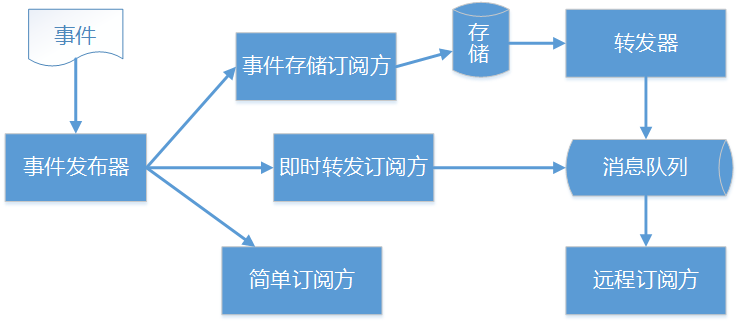

关于异步调用，JDK 中的 Future 模式也为我们实现调用发起者和调用响应者之间的解耦提供了另一种思路。Future 模式有点类似于商品订单，在网上购物提交订单后，在收货的这段时间里无需一直在家里等候，可以先干别的事情。类推到程序设计中，提交请求的目的是期望得到响应，但这个响应可能很慢。传统做法是一直等待到这个响应收到后再去做别的事情，但如果利用 Future 模式就无需等待响应的到来，在等待响应的过程中可以执行其他程序。传统调用和 Future 模式调用对比可以参考下图，我们可以看到在 Future 模式调用过程中，服务调用者得到服务消费者的请求时马上返回，可以继续执行其他任务直到服务消费者通知 Future 调用的结果，体现了 Future 调用异步化特点。

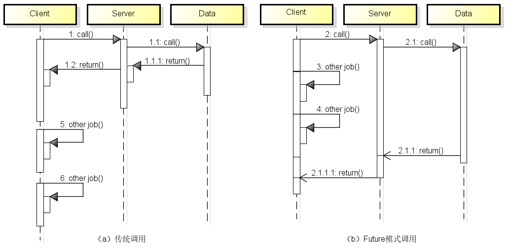

以上关于服务调用的内容对于 RPC 用户而言通常是透明的，但掌握这些基本概念有助于更好的开展技术选型以及理解后续分布式架构中的其他组件。

## 分布式服务架构——最核心的架构

RPC 架构解决了分布式环境下两个独立进程之间通过网络进行方法调用和数据传输这一基础性问题，但光有 RPC 是不够的。

当服务越来越多时：

- 服务地址的配置管理会变得非常困难，单点系统的访问压力也越来越大。
- 服务间依赖关系变得错踪复杂，甚至分不清哪个应用要在哪个应用之前启动，以至于无法描述应用的架构关系。
- 服务的调用量越来越大，服务的容量问题暴露出来。

这些场景都不包含在 RPC 的职能范围之内，我们需要通过引入更加全面和强大的架构体系来解决这些问题，这种架构体系就称为分布式服务架构。

分布式服务架构的核心组件包括 **负载均衡**、**服务路由**、**服务发布与调用**、**服务监控和治理**、**服务可靠性**。

### 负载均衡

所谓负载均衡（Load Balance），简单讲就是将请求分摊到多个操作单元上进行执行，如下图中来自客户端的请求通过负载均衡机制将被分发到各个服务器，根据分发策略的不同将产生该策略下对应的分发结果。

负载均衡建立在现有网络结构之上，它提供了一种廉价有效透明的方法扩展服务器的带宽、增加吞吐量、加强网络数据处理能力、提高网络的灵活性。负载均衡实现上可以使用硬件、软件或者两者兼有。

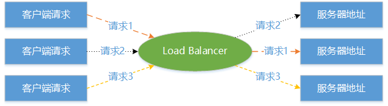

负载均衡根据服务器地址列表所存放的位置可以分成两大类型，一类是服务器端负载均衡，一类是客户端负载均衡。另一方面，以各种负载均衡算法为基础的 **分发策略** 决定了负载均衡的效果。

#### 服务器端负载均衡

在分布式服务架构中，下图为服务器端负载均衡机制示意图：

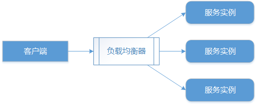

- 客户端发送请求到负载均衡器
- 负载均衡器负责将接收到的各个请求转发到运行中的某台服务节点上
- 接收到请求的服务做响应处理

提供服务器端负载均衡的工具有很多，例如常见的 Apache、Nginx、HAProxy 等都实现了基于 HTTP 协议或 TCP 协议的负载均衡模块。

基于服务器端的负载均衡机制实现比较简单，只需要在客户端与各个微服务实例之间架设集中式的负载均衡器即可。

负载均衡器与各个服务实例之间需要实现服务诊断以及状态监控，通过动态获取各个服务的运行时信息决定负载均衡的目标服务。如果负载均衡器检测到某个服务已经不可用时就会自动移除该服务。

通过上述分析，可以看到负载均衡器运行在一台独立的服务器上并充当代理（Proxy）的作用。

所有的请求都需要通过负载均衡器的转发才能实现服务调用，这可能会是一个问题，因为当服务请求量越来越大时，负载均衡器将会成为系统的瓶颈。同时，一旦负载均衡器自身发生失败，整个服务的调用过程都将发生失败。因此，在分布式服务架构中，为了避免集中式负载均衡所带来的这种问题，客户端负载均衡同样也是一种常用的方式。

#### 客户端负载均衡

客户端本身同样可以实现负载均衡，客户端负载均衡最基本的表现形式如下图所示。

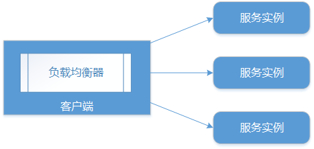

客户端负载均衡机制的主要优势就是不会出现集中式负载均衡所产生的瓶颈问题，因为每个客户端都有自己的负载均衡器，该负载均衡器的失败也不会造成严重的后果。

另一方面，由于所有的运行时信息都需要在多个负载均衡器之间进行传递，会在一定程度上加重网络流量负载。

客户端负载均衡，简单的说就是在客户端程序里面，自己设定一个调度算法，在向服务器发起请求的时候，先执行调度算法计算出目标服务器地址。也就是说每个服务中包含着各个服务器的配置信息，然后通过负载均衡算法计算目标服务器实现负载均衡。

客户端负载均衡的另一种典型实现方式是把 Nginx 等能够实现代理功能的负载均衡器部署到运行服务的同一台机器上。当然，这种方式需要考虑实施成本和维护性问题。

客户端负载均衡比较适合于客户端具有成熟的调度库函数、算法以及 API 的工具和框架。一般可以选择为初期简单的负载均衡方案，也可以结合其他负载均衡方案进行架构。

#### 负载均衡算法

无论是使用服务器端负载均衡还是客户端负载均衡，运行时的 **分发策略** 决定了负载均衡的效果。

分发策略在软件负载均衡中的实现体现为一组分发算法，通常称为 **负载均衡算法**。负载均衡算法可以分成两大类，即静态负载均衡算法和动态负载均衡算法。

**1. 静态负载均衡算法：**

静态负载均衡算法的代表是是各种随机（Random）和轮询（Round Robin）算法。

采用随机算法进行负载均衡在集群中相对比较平均。

- 随机算法实现比较简单，使用 JDK 自带的 Random 相关随机算法就可指定服务提供者地址。
- 随机算法的一种改进是加权随机（Weight Random）算法，在集群中可能存在部分性能较优服务器，为了使这些服务器响应更多请求，就可以通过加权随机算法提升这些服务器的权重。

加权轮循（Weighted Round Robin）算法同样按照权重，顺序循环遍历服务提供者列表，到达上限之后重新归零，继续顺序循环直到指定某一台服务器作为服务的提供者。普通的轮询算法实际上就是权重为1的加权轮循算法。

**2. 动态负载均衡算法：**

所有涉及到权重的静态算法都可以转变为动态算法，因为权重可以在运行过程中动态更新。例如动态轮询算法中权重值基于对各个服务器的持续监控并不断更新。

基于服务器的实时性能分析分配连接（比如每个节点的当前连接数或者节点的最快响应时间）是常见的动态策略。

类似的动态算法还包括 **最少连接数**（Least Connection）算法和 **服务调用时延**（Service Invoke Delay）算法，前者对传入的请求根据每台服务器当前所打开的连接数来分配；后者中服务消费者缓存并计算所有服务提供者的服务调用时延，根据服务调用和平均时延的差值动态调整权重。

**源 IP 哈希**（Source IP Hash）算法实现请求 IP 粘滞连接，尽可能让消费者总是向同一提供者发起调用服务。这是一种有状态机制，也可以归为动态负载均衡算法。

### 服务路由

在集群化环境中，当客户端请求到达集群，如何确定由某一台服务器进行请求响应就是服务路由（Routing）问题。

从这个角度讲，负载均衡也是一种路由方案，但是负载均衡的出发点是提供服务分发而不是解决路由问题，常见的静态、动态负载均衡算法也无法实现精细化的路由管理。

服务路由的管理也可以归为几个大类，包括直接路由、间接路由和路由规则。

#### 直接路由

所谓直接路由就是服务的消费者需要感知服务提供者地址信息：

服务消费者获取服务提供者地址的基本思路是通过配置中心或者数据库，当服务的消费者需要调用某个服务时，基于配置中心或者数据库中存储的目标服务的具体地址构建链路完成调用。
  
这是常见的路由方案，但并不是一种好的方案：

- 一方面服务的消费者直接依赖服务提供者的具体地址

  一旦在运行时服务提供者地址发生改变时无法在第一时间通知消费者，可能会导致服务消费者的相应变动，从而增强服务提供者和消费者之间的耦合度。
  
- 另一方面创建和维护配置中心或数据库持久化操作同样需要成本。

#### 间接路由

间接路由体现了解耦思想并充分发挥了发布-订阅（Publish-Subscribe）模式的作用，发布-订阅机制参考下图：

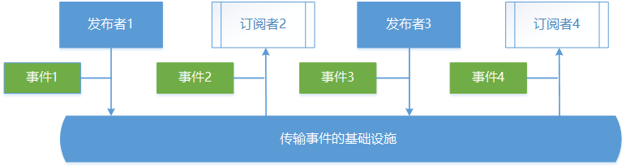

事件（Event）是整个结构能够运行所依赖的基本数据模型，围绕事件存在两个角色，即发布者和订阅者。发布者发布事件，订阅者关注自身所想关注的事件，发布者和订阅者并不需要感知对方的存在，两者之间通过传输事件的基础设施进行完全解耦。

在分布式服务架构中，实现间接路由的组件一般称为服务注册中心（Service Registration Center），服务注册中心从概念上讲就是发布-订阅模式中传输事件的基础设施，可以把服务的地址信息理解为事件的具体表现。

通过服务注册中心，服务提供者发布服务到注册中心，服务消费者订阅感兴趣的服务。服务消费者只需知道有哪些服务，而不需要知道服务具体在什么位置，从而实现间接路由。

当服务提供者地址发生变化时，注册中心推送服务变化到服务消费者确保服务消费者使用最新的地址路由信息。

同时，为了提高路由的效率和容错性，服务消费者可以配备缓存机制以加速服务路由，更重要的是当服务注册中心不可用时，服务消费者可以利用本地缓存路由实现对现有服务的可靠调用。

服务注册中心的基本模型如下图所示：

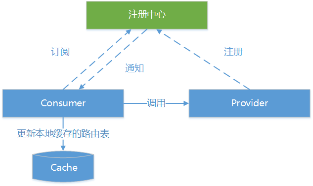

#### 路由规则

间接路由解决了路由解耦问题，面向全路由场景。在服务故障、高峰期导流、业务相关定制化路由等特定场景下，依靠间接路由提供的静态路由信息并不能满足需求，这就需要实现动态路由，动态路由可以通过路由规则（Routing Rule）进行实现。

路由规则常见的实现方案是白名单或黑名单，即把需要路由的服务地址信息（如服务 IP）放入可以控制是否可见的路由池中。更为复杂的场景可以使用 Python 等脚本语言实现各种定制化条件脚本（Condition Script），如针对某些请求 IP 或请求服务 URL 中的特定语义进行过滤，也可以细化到运行时具体业务参数控制路由效率。

下图对服务路由相关策略做了总结，我们可以看到负载均衡和直接路由、间接路由、路由规则一样都可以看作是一种路由方案，路由方案为服务的消费者提供服务目标地址，并通过网络完成远程调用。

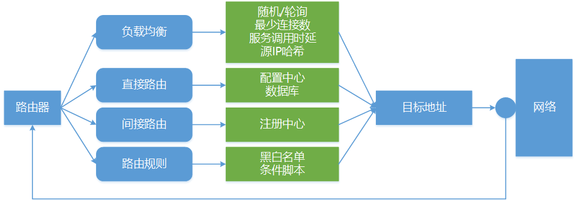

### 服务发布与调用

**服务注册中心** 是服务 **发布** 和 **引用** 的媒介，当我们把服务信息注册到注册中心，并能够通过主动或被动的方式从注册中心中获取服务调用地址时，需要考虑的问题就是如何进行有效的服务发布和调用。

#### 服务发布

服务发布的目的是为了暴露（Export）服务访问入口，是一个通过构建网络连接并启动端口监听请求的过程。服务发布的整体流程参考下图，包含了服务发布过程中的核心组件，本节将对这些核心组件做一一展开。

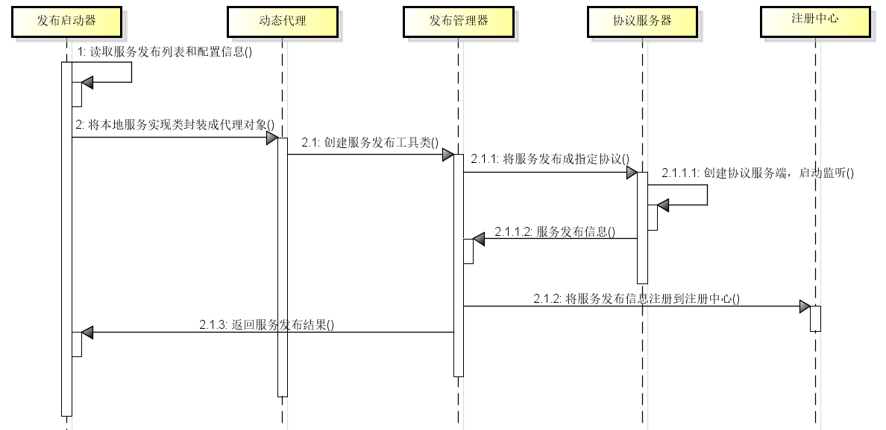

1. 发布启动器

   发布启动器（Launcher）的作用是确定服务发布形式并启动发布平台。

   服务的发布形式常见有三种，即配置化、API调用和使用注解。

   - 通过以 XML 为代表的配置化工具，服务框架对业务代码零侵入，扩展和修改方便，同时配置信息修改能够实时生效；
   - 而通过 API 调用方式，服务框架对业务代码侵入性较强，修改代码之后需要重新编译才能生效；
   - 注解方式中，服务框架对业务代码零侵入，扩展和修改也比较方便，但修改配置需要重新编译代码。
  
   以上三种方式各有利弊，一般我们倾向于使用基于配置的方式，但在涉及到系统之间集成时，由于需要使用服务框架中较底层的服务接口，API 调用可能是唯一的选择。

   发布平台的启动与所选择的发布方式密切相关。在使用配置化发布方式时，通常我们会借助于诸如 Spring 的容器进行服务实例的配置和管理，容器的正常启动意味着发布平台的启动，注解方式下的平台启动也类似。而对于 API 调用而言，简单使用 main 函数进行启动是通常的做法。

2. 动态代理

   在涉及到远程调用时，通常会在本地服务实现的基础上添加动态代理功能。通过动态代理实现对服务发布进行动态拦截，可以对服务发布行为本身进行封装和抽象，也便于扩展和定制化。

   JDK 自带的 Proxy 机制以及类如 Javassist 的字节码编辑库都可以实现动态代理。

3. 发布管理器

   发布管理器在整个服务发布流程中更像是一种承上启下的门户（Facade）。一方面，它获取协议服务器中生成的服务 URL 信息并发布到注册中心，另一方面，发布器也负责通知发布启动器本次发布是否成功。

4. 协议服务器

   协议服务器是真正实现服务器创建和网络通信的组件。协议服务器的主要作用在于确定发布协议以及根据该协议建立网络连接，并管理心跳检测、断线重连、端口绑定与释放。用于发布服务的常见协议包括 HTTP、RMI、Hessian等。

   对于服务发布而言，注册中心的作用是保存和更新服务的地址信息，位于流程的末端。

#### 服务调用(Call)

相较服务发布，服务的调用是一个导入（Import）的过程，整体流程如下图所示。图中我们可以看到服务调用流程与服务发布流程呈对称结构，所包含的组件包括：

1. 调用启动器

   调用启动器的作用就是确定服务的调用形式并启动调用平台，该组件使用的策略与发布启动器一样，不再重复介绍。

2. 动态代理

   动态代理完成本地接口到远程调用的转换。导入服务提供者接口 API 和服务信息并生成远程服务的本地动态代理对象，从而将本地 API 调用转换成远程服务调用并返回调用结果。

3. 调用管理器

   调用管理器具备缓存功能，保存着服务地址的缓存信息。

   当从注册中心获取服务提供者地址信息时，调用管理器根据需要更新本地缓存，确保在注册中心不可用的情况下，调用启动器仍然可以从本地缓存中获取服务提供者的有效地址信息。

4. 协议客户端

   协议客户端根据服务调用指定的协议类型创建客户端并发起连接请求，负责与协议服务器进行交互并获取调用结果。

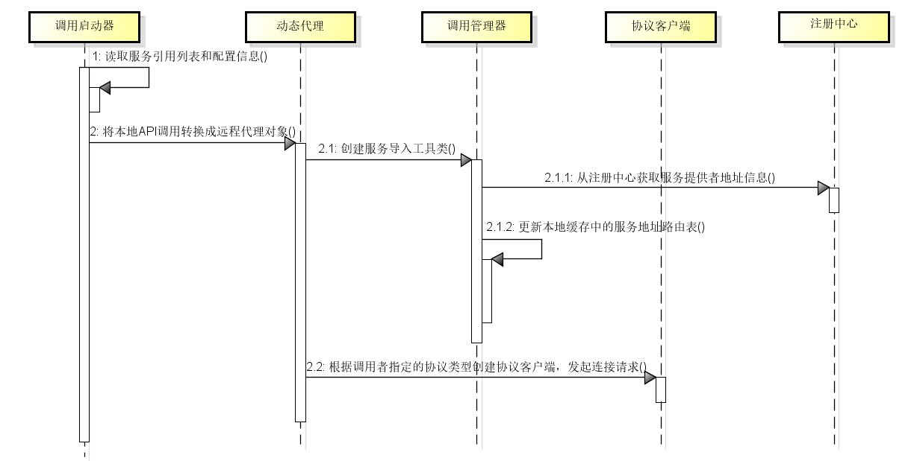

在服务调用过程中，实现了从本地缓存获取服务路由、序列化请求消息封装成协议消息、发送协议请求并同步等待或注册监听器回调、反序列化应答消息并唤醒业务线程或触发监听器等分布式服务的基本步骤。

如果调用超时或失败，将采用集群容错机制。至此，整个服务发布和调用过程形成闭环。

### 服务监控与治理

在分布式环境下，围绕某个业务链的所有服务之间的调用关系可能非常复杂，服务中间件、数据库、缓存、文件系统以及其它服务之间都可能存在依赖关系。

为了确保系统运行时这些依赖关系的稳定性和可用性，服务调用路径、服务调用业务数据、服务性能数据都是需要监控的内容，以便进行系统故障的预防和定位。

服务监控的基本思路是日志埋点，即使用跟踪 Id 作为一次完整应用调用的唯一标识，然后将该次调用的详细信息通过日志的方式进行保存。

日志埋点分为客户端埋点和服务器端埋点，前者关注于跟踪 Id、客户端 IP、调用方接口、调用时间等信息，而后者则记录跟踪 Id、调用方上下文、服务端耗时、处理结果。

日志埋点会产生海量运行时数据，通常都需要专门的工具进行处理。基于 Hadoop、Storm、Spark 等技术的离线/实时批量处理框架，基于 Elastic Search、Solr 的垂直化搜索引擎以及专门的 Flume/ELK 等日志处理框架都被广泛应用于埋点数据处理。

### 服务可靠性

保障服务可靠性的手段也有很多，比较典型的就是集群容错和服务隔离。

#### 集群容错

当服务运行在一个集群中，出现通信链路故障、服务端超时以及业务异常等场景都会导致服务调用失败。

容错（Fault Tolerance）机制的基本思想是重试和冗余，即是当一个服务器出现问题时不妨试试其他服务器。集群的建立已经满足冗余的条件，而围绕如何进行重试就产生了几种不同的集群容错策略。

- Failover

  Failover 即失效转移，当发生服务调用异常时，重新在集群中查找下一个可用的服务提供者。为了防止无限重试，通常对失败重试最大次数进行限制。典型的 Failover 结构如下图所示。

  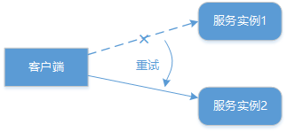

- Failback

  Failback 可以理解为失败通知，当服务调用失败直接将远程调用异常通知给消费者，由消费者捕获异常进行后续处理。

- Failsafe

  失败安全策略中，当获取服务调用异常时，直接忽略。通常用于写入审计日志等操作，确保后续可以根据日志记录找到引起异常的原因并解决。该策略可以理解为一种简单的熔断机制（Circuit Breaker），为了调用链路的完整性，在非关键环节中允许出现错误而不中断整个调用链路。

- Failfast

  快速失败策略在获取服务调用异常时，立即报错。显然，Failfast 已经彻底放弃了重试机制，等同于没有容错。在特定场景中可以使用该策略确保非核心业务服务只调用一次，为重要的核心服务节约宝贵时间。

- Forking

  分支机制，使用该机制时会并行调用多个服务器，只要一个成功即返回。通常用于实时性要求较高的读操作，但需要浪费更多服务资源。

- Broadcast

  广播机制，调用所有提供者，逐个调用，任意一台报错则报错。通常用于通知所有提供者更新缓存或日志等本地资源信息的业务场景，而不是简单的远程调用。

#### 服务隔离

关于服务隔离，首先要介绍舱壁隔离模式（Bulkhead Isolation Pattern），该模式顾名思义就是像舱壁一样对资源或失败单元进行隔离，如果一个船舱破了进水，只损失一个船舱，其它船舱可以不受影响。舱壁隔离模式在分布式服务架构中的应用就是各种服务隔离思想。

服务隔离包括一些常见的隔离思路以及特定的隔离实现技术框架。所谓隔离本质上是对系统或资源进行分割，从而实现当系统发生故障时能限定传播范围和影响范围，即发生故障后只有出问题的服务不可用，保证其他服务仍然可用。隔离的基本思路如下图所示。

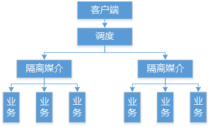

上图中的隔离媒介可以是线程、进程、集群、机房以及读写方式。

其中关于线程隔离，目前业界也有像 Hystrix 这样优秀的框架可以直接使用，关于线程隔离和 Hystrix 我们将在下一篇《微服务：最热门的架构》有进一步介绍。

实现服务可靠性的其他手段还包括 **服务限流** 和 **服务降级**，篇幅关系这里不再展开。

## 微服务——最热门的架构

在大型互联网应用中，如何更为合理的划分系统和团队边界、如何更加有效的组织系统开发过程、如何通过技术手段识别和消除开发过程中的浪费成为广大软件开发和技术管理人员所需要思考的命题。

针对这些命题，我们的思路首先是根据业务划分系统和领域的边界，对一个大而全的系统进行分而治之，通过一些功能边界明确、业务高度抽象的模块或组件之间的组装去形成更大的业务体系。

其次，在系统和领域边界内部，同样需要对业务体系进行合理建模，通过建立服务体系对服务进行一定粒度下的拆分和集成，从而降低业务实现的复杂性，并提高服务交互的灵活性。

再次，通过服务拆分和集成的手段也可以推动研发团队组织架构的优化，并促进系统持续交付工作的有效开展。围绕这些解决问题的思路，微服务架构（Microservices Architecture）为我们提供了一种具体的解决方案。

所谓微服务（Microservices），就是一些具有足够小的粒度、能够相互协作且自治的服务体系。每个微服务都比较简单，仅关注于完成一个功能并能很好地完成该功能，而这里的功能代表都是一种业务能力。

构建微服务体系需要一套完整的方法论和工程实践，而微服务架构代表的是实现微服务体系的架构模式，即为我们提供了这些方法论和工程实践。

### 服务边界

微服务架构实现的前提是识别服务，识别服务的切入点在于识别服务与服务之间的边界（Boundary）。

明确服务边界是服务拆分和集成的前提。在微服务架构中，识别服务边界的方法主要参考领域驱动设计思想。

在通过使用领域和界限上下文进行服务边界划分的过程中，经常会碰到这样一个问题，即这个服务看起来放这个子域合适，放另一个子域也合适，如何抉择呢？这就需要梳理服务边界划分的原则。常见的边界划分原则如下：

- 服务关联度原则

  该原则有几种表现形式，比如是否该服务变化时，其他服务也需要进行变化；或者说该服务中的数据是否通常由当前上下文中的范围内使用。

- 业务能力职责单一原则

  服务边界内的业务能力职责应单一，不是完成同一业务能力的服务不应该放在同一个上下文中。

- 读写分离原则

  对于数据读取类型的服务应该尽量放在单独的子域中，而且这种子域一般不应该是核心子域。

- 组织关系原则

  组织中业务结构的划分也是一种参考，因为一个业务部门的存在往往有其独特的业务价值。所以，一个团队一个上下文策略有时候反而是一种有效的拆分策略。
  
  团队的构建方式可以是职能团队（Function Team）也可以是特征团队（Feature Team），前者关注于某一个特定职能，如常见的服务端、前端、数据库、UI 等功能团队，而后者则代表一种跨职能的团队构建方式，团队中包括各种职能角色。
  
  上下文的构建以及界限的划分是一项跨职能的活动，如果团队组织架构具备跨职能特性，可以安排特定的团队负责特定的上下文并统一管理该上下文对应的界限。

在服务边界划分中，应该尽早识别和剥离通用领域，如账户管理、登录等服务；而对于系统中最复杂且相对多变的子域，需要及早进行隔离并充分考虑它与核心子域之间的协作关系。

### 服务拆分

#### 服务拆分的维度

关于服务拆分的切入点，我们先从 MartinL.Abbott 所著[《架构即未来》](https://item.jd.com/11905648.html)中介绍的 AKF 扩展立方体出发寻找一些灵感，然后给出本文中关于服务拆分的两大维度。

**AKF 扩展立方体：**

AKF 扩展立方体（Scalability Cube）是一种可扩展模型，这个立方体有三个轴线，每个轴线描述扩展性的一个维度（见下图），分别是：

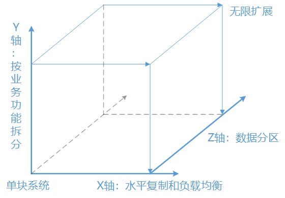

- X轴：代表无差别的克隆服务和数据，工作可以很均匀的分散在不同的服务实例上。
- Y轴：关注应用中职责的划分，比如数据类型、交易执行类型的划分。
- Z轴：关注服务和数据的优先级划分，如分地域划分。

以上 X、Y 和 Z 轴的划分可以概括为 X 轴关注水平复制，Z 轴类似数据分区，而 Y 轴则强调基于不同的业务拆分。

理论上按照这三个扩展维度，可以将一个单体系统进行无限扩展。

举例来说，比如医疗行业中的用户预约挂号应用，一个集群撑不住时可以分成多个集群，后来用户激增还是不够用，经过分析发现是用户和医生访问量很大，就将预约挂号应用拆成了患者服务、医生服务、支付服务等三个服务。三个服务的业务特点各不相同，独立维护，各自都可以再次按需扩展。

在上图中，Y 轴就是我们所说的微服务的拆分模式，即基于不同的业务进行拆分。但在进行业务拆分过程中，我们发现业务往往与数据有较大耦合性，所以接下去我们把业务和数据结合起来对服务拆分的维度展开讨论。

**业务与数据：**

服务拆分存在两大维度，即 **业务** 与 **数据**。

业务体现在各种功能代码中，通过确定业务的边界，并使用领域与界限上下文、领域事件等技术手段可以实现拆分。而数据的拆分则体现在如何将集中式的中心化数据转变为各个微服务各自拥有的独立数据，这部分工作同样十分具有挑战性。

关于业务和数据谁应该先拆分的问题，可以是先数据库后业务代码，也可以是先业务代码后数据库。然而在拆分中遇到的最大挑战可能会是数据层的拆分，因为在数据库中，可能会存在各种跨表连接查询、跨库连接查询以及不同业务模块的代码与数据耦合得非常紧密的场景，这会导致服务的拆分非常困难。

因此在拆分步骤上我们更多的推荐数据库先行。数据模型能否彻底分开，很大程度上决定了微服务的边界功能是否彻底划清。

#### 服务拆分的策略

服务拆分的方法需要根据系统自身的特点和运行状态，通常分为绞杀者与修缮者两种模式。

**绞杀者模式：**

[绞杀者模式（Strangler Pattern）](https://martinfowler.com/bliki/StranglerApplication.html)最早由 Martin Fowler 提出，指的是在现有系统外围将新功能用新的方式构建为新的服务的策略，通过将新功能做成微服务方式，而不是直接修改原有系统，逐步的实现对老系统替换。

采用这种策略，随着时间的推移，新的服务就会逐渐 “绞杀” 老的系统。对于那些规模很大而又难以对现有架构进行修改的遗留系统，推荐采用绞杀者模式。

绞杀者模式的示意图如下图所示，我们可以看到随着功能演进和时间的不断推移，老的遗留系统功能被逐步削弱，而采用微服务架构的新功能越积越多，最终会形成从量变到质变的过程。

绞杀者模式在具体实施过程中，所需要把握的最主要一点原则就是对于任何需要开发的功能一定要完整的采用微服务架构，对于完全独立的新功能这点比较容易把握，而对于涉及到老业务变更的新功能则需要通过重构达到这一目标。

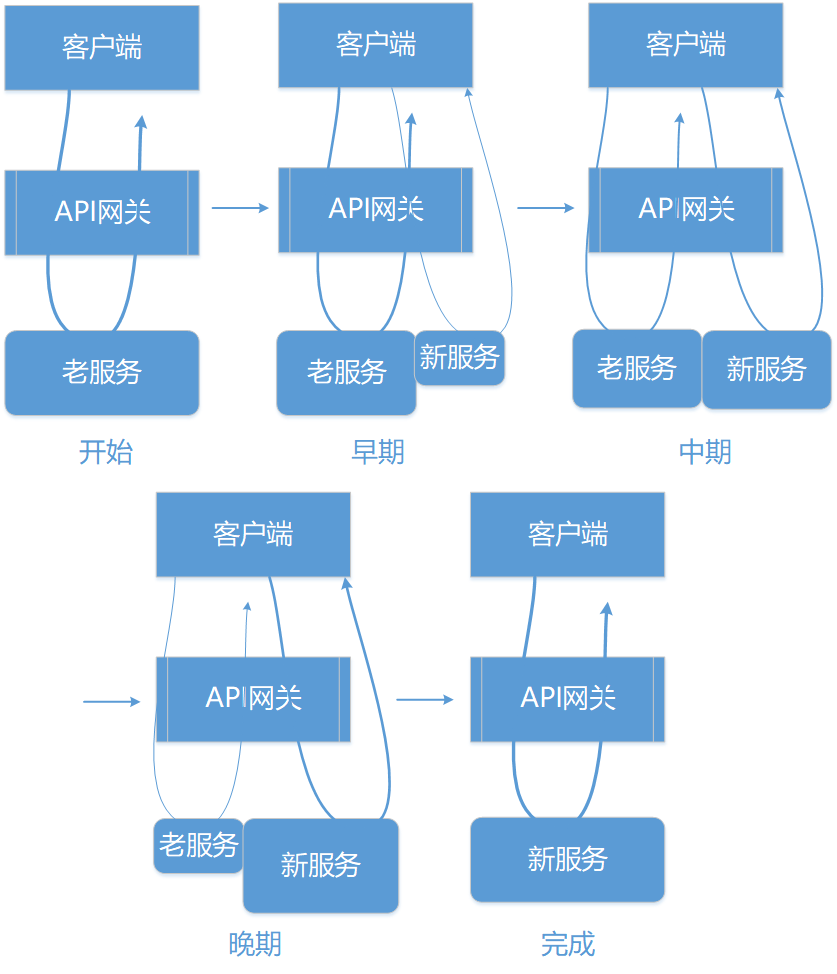

**修缮者模式：**

修缮者模式就如修房或修路一样，将老旧待修缮的部分进行隔离，用新的方式对其进行单独修复。修复的同时，需保证与其他部分仍能协同工作。

从这种思路出发，修缮者模式更多表现为一种重构技术。修缮者模式在具体实现上可以参考 Martine Fowler 的 [BranchByAbstraction](https://www.martinfowler.com/bliki/BranchByAbstraction.html) 重构方法，该重构方法的示意图如下图所示。

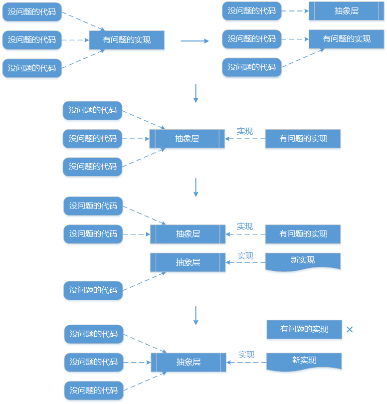

从上图中，可以看到这种模式的实现方式可以分成三个主要步骤。

- 抽象层提取

  首先通过识别内部的待拆分功能，对其增加抽象接口层，同时对原有代码进行改造，确保其同样实现该抽象层。这样在依赖关系上就添加了一个中间层。

- 抽象层实现

  为抽象层提供新的实现，新的实现采用微服务方式。

- 抽象层替换

  采用新的实现对原有的各个抽象层实现进行逐步替换，直至原有实现被完全废弃，从而完成新老实现方式之间的替换。

### 服务集成

服务之间势必需要集成，而这种集成关系远比简单的 API 调用要复杂。在本节中，我们将系统分析服务集成的方式以及在微服务架构中的表现形式。关于服务之间的集成存在一些通用的模式，我们也将在梳理这些模式的同时给出实现过程中的最佳实践。

业界关于系统集成存在一些主流的模式和工程实践（见下图），包括文件传输（File Transfer）、共享数据库（Shared Database）、远程过程调用（RPC）和消息传递（Messaging）。

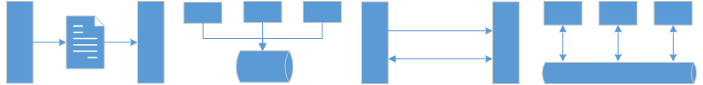

以上四种主流的集成模式各有优缺点。

- 文件传输方式最大的挑战在于如何进行文件的更新和同步；
- 如果使用数据库，在多方共享的条件下如何确保数据库模式统一是一个大问题；
- RPC 容易产生瓶颈节点；而消息传递在提供松耦合的同时也加大了系统的复杂性。
- RPC 和消息传递面对的都是分布式环境下的远程调用，远程调用区别于内部方法调用，一方面网络不一定可靠和存在延迟问题，另一方面集成通常面对的是一些异构系统。

对于微服务架构而言，我们的思路是尽量采用标准化的数据结构并降低系统集成的耦合度。我们会根据需要采用上图所示的四种典型的系统集成模式，同时还会引入其它一些手段来达到服务与服务之间的有效集成。我们把微服务架构中服务之间的集成模式分为以下四大类（见下图）。

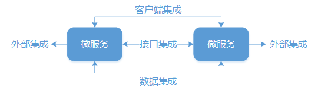

- 接口集成

  接口集成是服务之间集成的最常见手段，通常基于业务逻辑的需要进行集成。RPC、REST、消息传递 和 服务总线 都可以归为这种集成方式。

- 数据集成

  数据集成同样可以用于微服务之间的交互，共享数据库是一个选择，但也可以通过数据复制（Data Replication）的方式实现数据集成。

- 客户端集成

  由于微服务是一个能够独立运行的整体，有些微服务会包含一些 UI 界面，这也意味着微服务之间也可以通过 UI 界面进行集成。

- 外部集成

  这里把外部集成单独剥离出来的原因在于现实中很多服务之间的集成需求来自于与外部服务的依赖和整合，而在集成方式上也可以综合采用接口集成、数据集成和 UI 集成。

### 微服务架构基础组件

微服务架构也是一种分布式架构，分布式系统相较于集中式系统具备优势的同时，也存在一些我们不得不考虑的特性。

微服务架构的实现一方面与分布式系统架构的实现需求完全一致，另一部分则在分布式系统的基础之上表现出特定的需求。

针对这些需求，本篇中将微服务架构基础组件梳理如下：服务之间的通信、面向事件驱动的架构设计方法、负载均衡、服务路由、API 网关和分布式配置中心等。

其中服务通信、事件驱动、负载均衡、服务路由我们已经在上一篇中有了详细介绍，本篇将对 API 网关和分布式配置中心做详细展开。

### API 网关

在设计模式存在一种外观模式（Façade Pattern，也叫门面模式），其设计意图在于为子系统中的一组接口提供一个一致的入口，这个入口使得这一子系统更加容易使用。表现为用户界面不与系统耦合，而外观类则与系统耦合。在层次化结构中，可以使用外观模式定义系统中每一层的入口。

API 网关本质上就是一种外观模式的具体实现，它是一种服务器端应用程序并作为系统访问的唯一入口。API 网关封装了系统内部架构，为每个客户端提供一个定制的 API。同时，它可能还具有身份验证、监控、缓存、请求管理、静态响应处理等功能。

在微服务架构中，API 网关的核心要点是，所有的客户端和消费端都通过统一的网关接入微服务，在网关层处理所有的非业务功能。

**网关的作用：**

API 网关的需求来自于多个方面。通常，微服务提供的 API 粒度与客户端的要求不一定完全匹配，微服务一般提供细粒度的 API，这意味着客户端通常需要与多个服务进行交互。更为重要的是，网关能够起到客户端与微服务之间的隔离作用，随着业务需求的变化和时间的演进，网关背后的各个微服务的划分和实现可能需要做相应的调整和升级，这种调整和升级需要实现对客户端透明。

API 网关的作用体现在以下几个主要方面：

- 解耦

  API 网关使客户端和服务器端在调用关系和部署环境上实现解耦，向客户端隐藏了应用如何被划分到微服务的细节。尽管微服务架构支持客户端直接与微服务交互的方式，但当需要交互的微服务数量较多时，解耦就成为一项核心需求。

- API 优化

  API 网关向每个客户端提供最优的 API。在多客户端场景中，对于同一个业务请求，不同的客户端一般需要不同的数据。例如，对于同一个用户查询功能，PC 端会一次性获取所有数据，而对于手机 App 而言，可以通过分页的方式逐步加载用户信息。

- 简化调用过程

  由于能够对返回数据进行灵活处理，API 网关减少了请求往返次数，从而简化了客户端的调用，也提高了服务访问的性能。比如，API 使得客户端可以在一次请求中向多个服务拉取数据。请求数量的减少也会直接提升用户体验。

另一方面，API 网关也增加了系统的复杂性和响应时间，因为 API 网关作为单独的应用程序也需要进行开发、部署和管理，为了暴露每个微服务的端点，开发人员必须更新 API 网关。同时，通过 API 网关也多了一层网络跳转。
  
但是我们认为 API 网关模式的缺点相比其优点是微不足道的，因此该模式目前被广泛应用在微服务架构设计和实现中。
  
如下图所示，API 网关作为单一入口通过请求转换适配整合后台微服务体系，面向各种客户端提供统一服务。

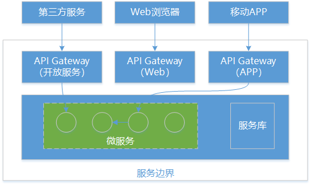

**网关的功能：**

API 网关的结构参考下图所示。在这个结构背后，我们需要挖掘其所应具备的核心功能，从而发挥上文中所提到的各项作用。

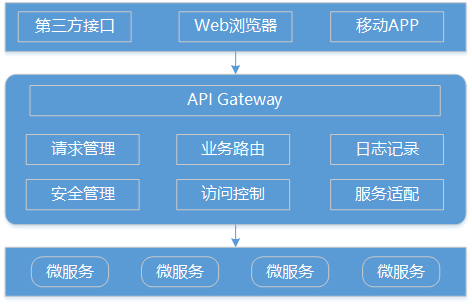

API 网关在实现上需要提供如下功能：

- NIO 接入和异步接出

  API 网关作为所有的客户端与微服务之间的桥梁，在两者之间多加了一层网络跳转。为了尽可能的消除这层网络跳转所带来的性能影响，API 网关在实现上需要提供 NIO 接入和异步接出的功能。参考《RPC——一切架构的基础》介绍的服务通信机制，我们明确这样的实现方式能够提供较高的通信性能。

- 报文格式转换

  API 网关的一大作用在于构建异构系统，如下图所示，API 网关作为单一入口通过协议转换整合后台基于 REST、AMQP 和 Dubbo 等不同风格和实现技术的微服务，面向 Web、Mobile、开放平台等特定客户端提供统一服务。

  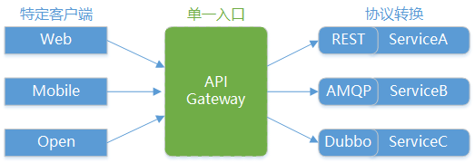

- 安全性控制

  一般而言，无论是对内网还是外网的接口都是需要做用户身份认证的，而用户认证在一些规模较大的系统都会采用统一的单点登录功能，如果每个微服务都要对接单点登录系统，那么显然比较浪费资源且开发效率低。
  
  API 网关是统一管理安全性的绝佳场所，可以将认证的部分抽取到网关层，然后微服务系统无需关注认证的逻辑只关注自身业务即可。常见的安全性技术如秘钥交换、客户端认证与报文加解密等功能都可以在 API 网关中加以实现。

- 访问控制

  某些场景下需要控制客户端的访问次数和访问频率，对于一些高并发系统有时还会有限流的需求。为了防止站点不被未知的大流量冲跨，在网关上可以配置一个阀值，当请求数超过阀值时就直接返回错误而不继续访问后台服务。

- 业务路由支持

  可以在网关层制定灵活的路由策略。针对一些特定的 API，我们需要设置白名单、路由规则等各类限制。而这些非业务功能的配置以及变更都可以在网关层单独操作。

### 分布式配置中心

配置管理的需求在任何类型的系统中都存在，而且随着业务复杂度的上升和技术架构的演变，系统对配置方式也会提出越来越高的要求。

例如在单块系统中，配置管理方式典型的演变过程往往是这样的：刚开始是配置文件比较少，更新频率也不会太高，所以倾向于把所有配置跟源代码一起放在代码仓库中；之后由于配置文件数量和改动频率的增加，就会考虑将配置文件从代码仓库中分离出来，或者放在 CI 服务器上通过打包脚本打入应用包中，或者直接放到运行应用的服务器特定目录下，剩下的非文件形式的关键配置则存入数据库中。

上述配置管理的演变过程在单体应用阶段非常常见，在增加配置信息安全性的同时，也往往可以运行的很好。但到了微服务阶段，面对爆发式增长的应用数量和服务器数量，就显得无能为力。为此，在微服务架构中，一般都需要引入配置中心（Configuration Center）的设计思想和相关工具。

**配置中心模型：**

所谓配置中心，简单来说就是一种统一管理各种应用配置的基础服务组件。本小结我们将给出配置中心的基本模型。

在讨论配置中心之前，我们先来梳理一下配置相关的内容和分类，参考如下：

- 按配置的来源划分

  主要有源代码文件，数据库和远程调用。

- 按配置的适用环境划分

  可分为开发环境，测试环境，预发布环境，生产环境等。

- 按配置的集成阶段划分

  可分为编译时，打包时和运行时。
  
  - 编译时，最常见的有两种，一是源代码级的配置，二是把配置文件和源代码一起提交到代码仓库中。
  - 打包时，即在应用打包阶段通过某种方式将配置打入最终的应用包中。
  - 运行时，是指应用启动前并不知道具体的配置，而是先从本地或者远程获取配置，然后再正常启动。

- 按配置的加载方式划分

  可分为单次加载型配置和动态加载型配置。

  基于配置相关的内容和分类，构建一个合适的配置中心，至少需要满足如下4个核心需求：
  
  - 非开发环境下应用配置的保密性，避免将关键配置写入源代码；
  - 不同部署环境下应用配置的隔离性，比如非生产环境的配置不能用于生产环境；
  - 同一部署环境下的服务器应用配置的一致性，即所有服务器使用同一份配置；
  - 分布式环境下应用配置的可管理性，即提供远程管理配置的能力。

采用配置中心也就意味着采用集中式配置管理的设计思想（见下图）。

在集中式配置中心中，开发、测试和生产等不同的环境配置信息统一保存在配置中心中，这是一个维度。而另一个维度就是分布式集群环境，需要确保集群中同一类服务的所有服务器保存同一份配置文件并且能够同步更新。

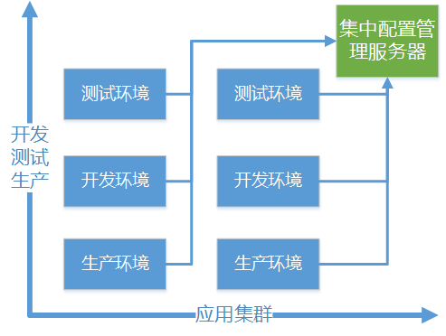

### 微服务实现技术

#### Dubbo

Dubbo 是国内 SOA 框架集大成之作，基本具备一个 SOA 框架应有的所有功能，包括高性能通信、多协议集成、服务注册与发现、服务路由、负载均衡、服务治理等核心功能。

作为一个 RPC 架构和 SOA 架构，Dubbo 无疑是非常优秀的，但在功能完备性上，API 网关、服务熔断器等核心组件在 Dubbo 中并没有完整体现。

从社区活跃度上，Dubbo 在2012年底基本已经不再更新，但不影响其在各大互联网公司的应用和扩展。好消息是最近 Alibaba 宣布重新启动 Dubbo 的维护工作。

Dubbo 的文档可以说在国内开源框架中算是一流的，非常全面且讲解的也比较深入，由于版本已经稳定不再更新，所以也不太会出现不一致的情况，学习成本较低。

#### Spring Cloud

Spring Cloud 是 Spring 家族中新的一员，重点打造面向服务化的功能组件，在功能上服务注册中心、API 网关、服务熔断器、分布式配置中心等组件都能在 Spring Cloud 中找到对应的实现。

从版本更新上，显然 Spring Cloud 也表现得非常活跃。目前 Spring Cloud 在 Github 的托管代码几乎每天都有更新，其发展仍处于高速迭代的阶段。

Spring Cloud 在一定程度上是一种集成型的框架，其内部大量依赖了各种外部的第三方工具和框架，所以文档在体量上自然要比 Dubbo 多很多，文档内容上还算简洁清楚，但是更多的是偏向整合，更深入的使用方法还是需要查看第三方组件的详细文档。

#### 对比与结论

通过对比分析，这里推荐 Spring Cloud 作为我们实现微服务架构的主体框架。功能的完备性是我们选择 Spring Cloud 的主要原因，下表中列出了 Dubbo 与 Spring Cloud 功能对比一览，可以看到 Spring Cloud 提供了很多 Dubbo 所不具备但对微服务实现又必不可少的核心组件。

-|Dubbo|Spring Cloud
-|-|-
服务注册中心|Zookeeper|Spring Cloud Netflix Eureka
服务调用方式|RPC|RESTful API
API网关|无|无
服务熔断器|不完善|Spring Cloud Netflix Hystrix
分布式配置|无|Spring Cloud Config
服务跟踪|无|Spring Cloud Sleuth
消息总线|无|Spring Cloud Bus
数据流|无|Spring Cloud Stream
安全性|无|Spring Cloud Security

另一个选择 Spring Cloud 的原因在于服务之间的交互方式。我们知道微服务架构中推崇基于 HTTP 协议的 RESTful 风格实现服务间通信，而 Dubbo 的服务调用通过 RPC 实现。

采用 RPC 方式会导致服务提供方与调用方接口产生较强依赖，而且服务对技术敏感，无法做到通用。Spring Cloud 采用的就是 RESTful 风格，这方面更加符合微服务架构的设计理念。

Spring Cloud 还具备一个天生的优势，因为它是 Spring 家庭的一员，而 Spring 在开发领域的强大地位给 Spring Cloud 起到很好的推动作用。同时，Spring Cloud 基于 Spring Boot，而 Spring Boot 目前已经在越来越多的公司得到应用和推广，用来简化 Spring 应用的框架搭建以及开发过程。Spring Cloud 也继承了 Spring Boot 简单配置、快速开发、轻松部署的特点，让原本复杂的架构工作变得相对容易上手。

通过上面这几个环节的分析，相信读者对 Dubbo 和 Spring Cloud 有了一个初步的了解。从目前 Spring Cloud 的被关注度和活跃度上来看，很有可能将来会成为微服务架构的标准框架。

### 微服务与架构师

微服务架构也对处于快速演进过程中的架构师提出了新的要求，关注服务之间的交互，而不要过于关注各个服务内部实现细节；作出符合团队目标的技术选择，提供代码模板；考虑系统允许多少的可变性，并能够快速适应变化以及建设团队是架构师采用微服务架构的基本方法。
