# 系统工程

## 目录

1. [团队管理](#团队管理)
2. [软件工程](#软件工程)
   - [瀑布模型](#瀑布模型)
3. [敏捷开发](#敏捷开发)
   - [核心价值观和原则](#核心价值观和原则)
   - [敏捷开发方法框架](#敏捷开发方法框架)

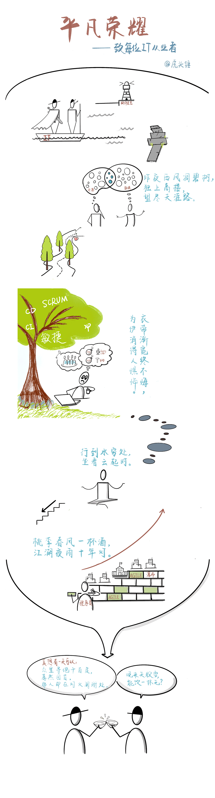
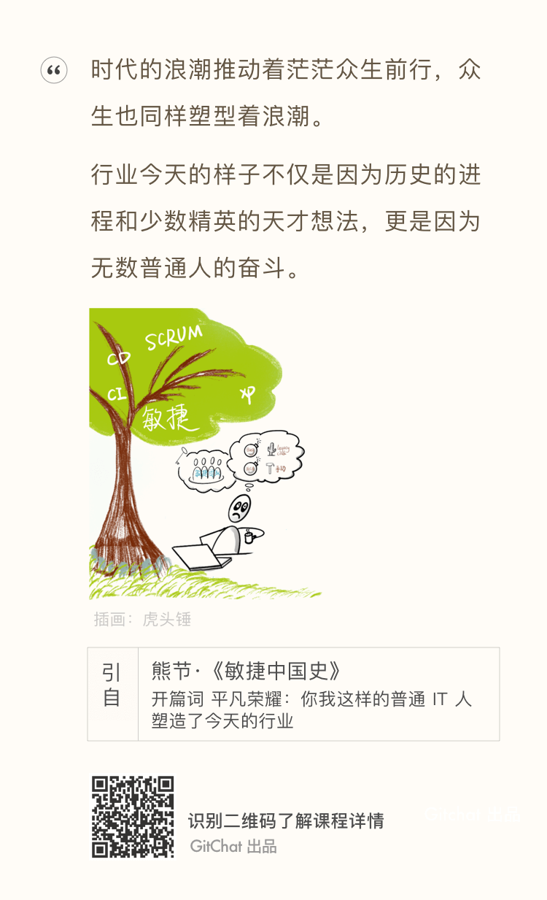

<b style="color:green">ThoughtWorks 期望员工不盲从主流意见，要持怀疑挑战的态度，以求找到不一样的路径，做到比当前更好。</b>

## 团队管理

### 可扩展性组织人员配置

```txt
孙子说：斗众如斗寡，形名是也。
孙子说：将弱不严，教道不明，吏卒无常，陈兵纵横，曰乱。
孙子说：将凡治众如治寡，分数是也。
```

#### 人员和领导力对扩展性的影响

哪个因素对确保产品的长远扩展性最为关键？人员、过程还是技术？人员

组织内部两个基本冲突类型：情感型和认知型

- 情感型冲突是以角色或控制为基础的冲突，经常发生在团队之间。
- 认知型冲突常常是关于“谁”做，或者“怎么”做。

情感型冲突很少能提升产品的价值，相反，几乎总是延迟产品的发布和增加成本。认知型的冲突，如果处理得当，常被称为“好的冲突”。

人是影响可扩展性最为重要的因素，没有人，就没有过程和系统。有效的组织将协助你快速达成目标，反之则产生阻碍作用。在组织里，管理和领导的作用分别是推和拉。领导鼓励员工取得更大的成绩，管理鼓励员工实现目标。

在可扩展性的拼图中人员是最重要的一块。对可扩展的组织，需要有合适的人，在合适的时间，以合适的行为，做合适的工作。

组织的结构很少有对与错之分，任何的结构都有利有弊。

在设计组织的过程中要考虑下述几个方面：

- 易于在现有的组织上增加新的工作单元。在组织里增加和减少人员有多么困难？你可以成组地增加入吗？你能增加独立贡献的个人吗？
- 容易度量一个时期组织和独立贡献者的工作业绩。
- 把一个目标交给一个团队有多么困难？团队是否能感觉到有足够授权去达成目标？
- 团队内部和团队之间的冲突情况如何？是否促进或阻碍实现公司的使命。
- 组织会促进还是阻碍创新以及市场响应时间？
- 组织的结构会增加还是减少单位产出的成本？
- 工作在组织内部的流转是否容易？

组织扩展成本：组织和个人的平均产出之间的关系。示例：增加人，增加了沟通成本，组织内个人产出下降，整体产出增加。

“两张比萨团队”概念：亚马逊创始人杰夫•贝佐斯提出，任何一个团队的规模不能大过两张比萨所能喂饱的人数。

具体含义：沟通主要发生在团队内部，因此额外的沟通负担就大大地减少了。团队还要有足够的授权才能成功地达成目标。每个团队都要设置一个或几个KPI 来衡量整体的成功情况。通常配置跨部门的人员来确保团队技能齐全，不必请求外援。

管理意味着度量，失败的度量意味着失败的管理。

总的来说，管理是与“推”(pushing)相关的活动， 而领导是与“拉”(pulling) 相关的活动。领导设定目的地和通往目的地的路线图。管理设法到达目的地。

管理把适当的任务分配到人，并且确保这些任务可以在指定的时间内以适当的成本完成。管理对工作表现及时反馈，尽早和经常地进行沟通，也包括移除障碍或者帮助团队绕过障碍。管理就是度量，度量失败即管理失败。

领导激励员工和组织做正确的事并好好做事。领导是描绘激动人心的愿景，并把愿景深入到员工的心里，引领他们为公司做正确的事情。领导确定使命、描绘愿景、制订路线图，帮助员工理解做什么和如何做才能为股东创造价值。最后，在向组织最高目标前进的路上，领导定义阶段性的目标和KPI。

好的领导创造文化，聚焦打造具有高可扩展性的组织、流程和产品而取得成功。这种文化靠激励体系来确保公司能够在成本可控的情况下扩展，同时不影响用户体验和出现扩展性问题。

可扩展性：绝对不仅仅是技术那么简单！扩展性问题始于组织和人员，然后扩散到过程和技术。

#### 可扩展性技术组织的角色

做出最佳决策最为关键的要素是有一个最佳的决策过程，来确保合适的人收集合适的信息，并把它提供给最终的决策者。

你可以下放任何权力，但是必须对其结果承担所有的责任

你可以对任何事情放权，但是绝对不会把对结果负责的事情放权。

好的领导总是把赞扬留给团队，承认失败并公开地承担责任。相反，差的领导在失败时找替罪羊，在成功时抢功。

好的CEO 需要精通管理哲学，了解一些基础知识（技术，资产负债表、损益表、现金流表等），知道该问什么问题，知道去哪里和在什么时间可以得到帮助；具备“高管盘问”(executive interrogation)的关键能力；与技术公司建立专业或个人的关系，依靠这些关系来帮助你提出正确的问题，并且当你要深究的时候，协助你评估答案；能够更好地提出和评估问题。

CTO 或CIO 必须要有公司的整体技术愿景，理解公司业务运作的基本情况，有市场营销的基础知识。

架构师的责任是确保系统的设计和架构可以随着业务的发展而扩展，也可以负责信息技术的管制、标准和过程。

工程师遵循公司的架构标准，根据架构进行具体设计，并且最后完成代码的实现。

devOps 是"Development"（开发）和"Operations"（运维）两个词的合并和缩写，近来常用这个词描述软件研发团队和技术运维团队之间交互和合作的现象。在SaaS和Web 2.0时代，DevOps通常负责配置、运行和监控生产系统。

**斯洛的锤子理论**：如果你手里只有一把锤子，那么所有你看到的都是钉子。

**RASCI工具：**

一套用来确定责任的表格，坚守“职责清楚、奖惩分明”的原则

- R: 负责(Responsible) 对项目或者任务的完成负责的人。
- A: 批准(Accountable) 项目关键决策的批准人。
- S: 支持(Supportive) 为项目完成提供资源的人。
- C: 咨询(Consulted) 为项目提供数据或者信息的人。
- I: 知情(Informed) 需要了解项目相关情况的人。


[事项检查表](./Resource/事项检查表.docx)

#### 组织的设置

功能点和场景点是度量功能的两个不同的标准化方法。功能点从用户角度出发，而场景点从工程师角度出发。

组织结构：

1、职能型（竖井式）

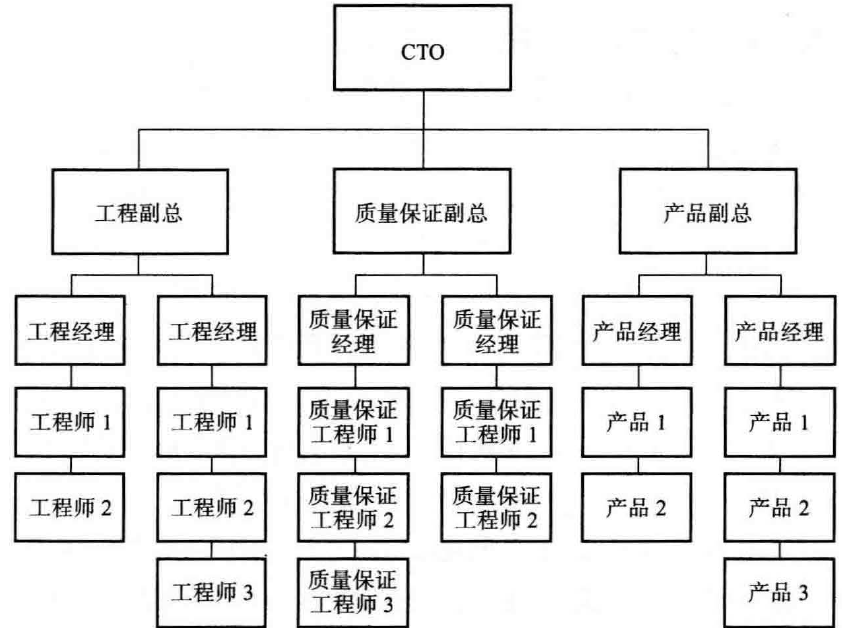

职能型组织的好处包括经理和工作伙伴的同质性、责任简单清晰、有标准可依。不利的地方包括没有单一的项目负责人和沟通不顺畅。采用瀑布式研发的组织，经常能从按职能划分的组织结构中获益，因为该结构恰好与瀑布型方法中固有的阶段控制相匹配。

2、矩阵型

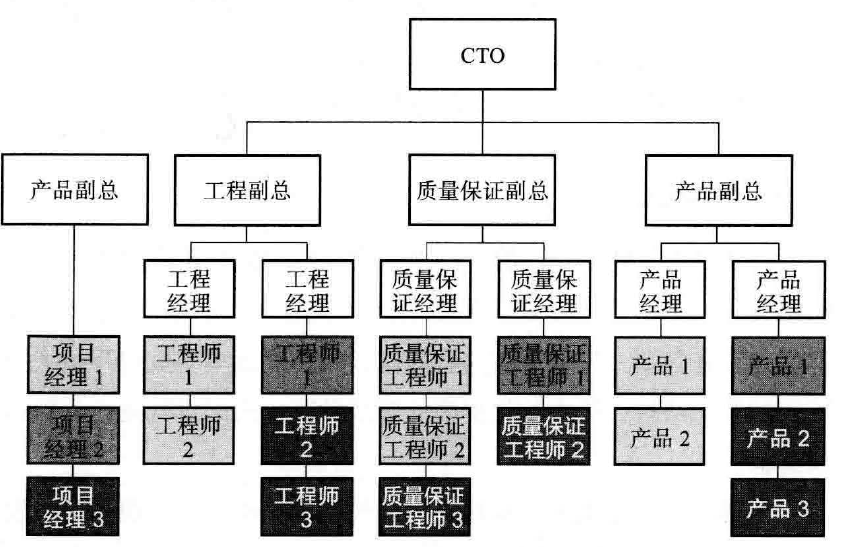

## 软件工程

瀑布模型，增量模型，迭代模型

### 架构设计中的系统工程

从工程学角度讲，软件开发的相关工作可以分成两个维度，即**项目管理**和**过程改进**。

项目管理从范围、时间、成本等角度出发讨论如何在一定的约束条件下实现系统，包括需求工程、计划和估算管理、质量与配置管理、风险与团队管理等内容；而过程改进则围绕软件开发的过程，提出持续优化的方法和实践确保得到令人满意的结果。

架构设计过程中的系统工程实际上指的就是这两个维度，而每个维度都与架构师有关。本篇从系统工程的两个维度出发，一方面给出各个维度的工作内容，另一方面也会介绍架构师与这些维度之间的的关联关系，从而更好的指导架构师的日常工作。

#### 项目管理

项目管理包含一整套知识体系，如业界具有代表性的 PMBOK（Project Management Body Of Knowledge，项目管理知识体系）就是对项目管理所需的知识、技能和工具进行了概括性描述。

PMBOK 中包含项目整合管理、范围管理、时间管理、成本管理、质量管理、人力资源管理、沟通管理、风险管理、采购管理和干系人管理等十大知识领域。以上这十大知识领域之间的关系可以见下图。

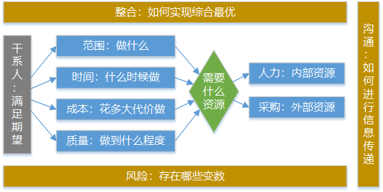

PMBOK 面向通用的、全行业的项目管理过程，对于软件开发而言，由于一般不涉及到材料的消耗，不需要对成本和采购做专门的管理；人力资源、沟通管理和干系人管理涉及到技术管理者的组织管理和软能力，我们会在下一篇中做这方面的阐述。

**整合管理**的思想贯穿项目管理所有内容，产品和技术之间的融合、系统的集成等都是其具体体现。所以本篇中的项目管理主要针对的是与软件开发和技术管理者日常工作密切相关的知识领域，包括 **需求管理**、**计划管理**、**质量管理** 和 **风险管理**。

##### 需求管理

如同软件架构，我们对需求进行分析之后会发现其同样具备一定的层次性，层次性的产生原因一方面在于需求抽象的过程，另一方面也取决于需求传递过程中所流转的角色和媒介。

从下图中可以看出，**业务需求**位于整个需求层次的最上层，代表的是客观存在的业务实体本身，反映了组织机构或客户对系统、产品高层次的业务利益和目标要求。

但业务实体只有被抽象成**用户需求**才能被识别，也才能从用户角度被验证，用户需求描述了用户使用产品必须要完成的任务，它们在**用例**（Use Case）和**情景描述**（Scenario）中予以说明。

**系统需求**描述了系统中各个方面的需求，包含硬件、软件和其它关联系统，更多站在技术人员的角度看问题，把用户需求转变为可供编码实现的系统模型。

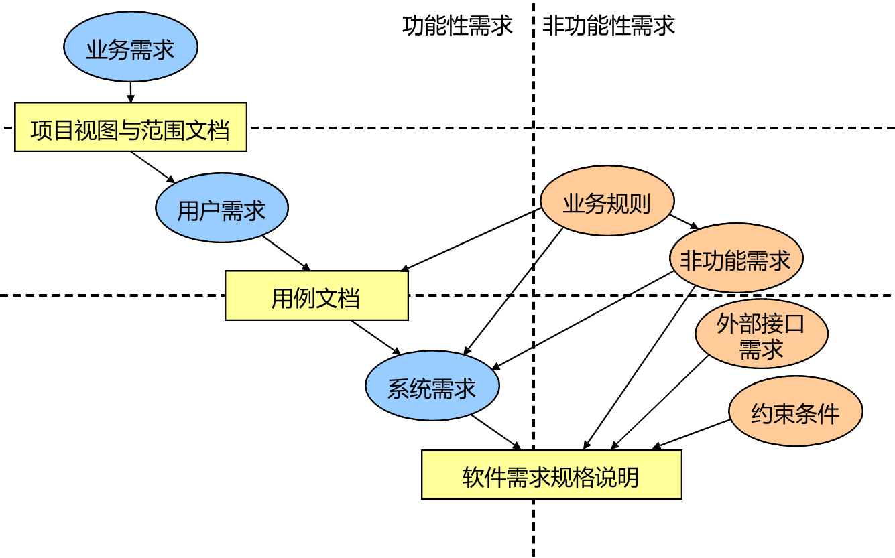

需求的不同层次分别会有不同的需求表现形式，从最初的**项目视图**和**功能范围**，到**功能用例**，再到详细的**软件需求规格**，需求的粒度逐步细化，而对功能的描述也从纯粹的功能性需求转变到功能性需求和非功能性需求的结合体。

所谓功能性需求，指的是项目中具体需要或不需要提供的功能和内容，而非功能需求则代表项目中为满足客户业务需要必须达到的一些特性，典型的包括系统**性能**、**可靠性**、**可维护性**，**可扩展性**以及对技术与业务方面的适应性。这些非功能性需求的提炼依赖于对功能性需求的充分理解和分析，也是架构师的一项关键职责，我们已经在前面的文章中对这些非功能性需求做了分析和探讨。

##### 计划管理

计划管理可以说是范围、时间、成本管理的整合体，对于软件开发而言，作为技术管理者的架构师最重要的工作之一就是主导制定产品或项目的开发计划。研发计划的制定一方面存在通用的管理框架，另一方面，软件开发活动的固有特性又需要我们对开发范围的分析和开发工作量的估算采用特定的方法和模型。计划管理最重要的工作就是开发**范围分解**以及开发**工作量估算**。

###### 开发范围分解技术

考虑到软件开发的固有特性和不同场景，我们认为以下分解方法有助于更好的明确开发范围，并确保开发人员能够在范围管理中起到一定的推动作用：

**根据系统集成：**

很多软件系统都涉及到系统集成需求，包括与外部第三方系统的对接，也包括组织内部各个团队之间的功能或数据集成。

在对范围分解过程中，识别并分解这部分开发范围至关重要，因为但凡依靠其他团队才能完成的功能其风险性都会比普通的开发任务大很多。

如果系统集成的双方是合作关系，即分别处于上游和下游的两个团队共同进退，那还是比较理想的关系。而如果两者之间是遵奉者（Conformist）关系，即其他团队由于利益关系等因素并不想或没有能力推动系统集成，那么范围分解所得出的系统集成需求就是开发过程中需要重点管理的对象。

**根据技术改造：**

现实中有很多系统属于遗留系统（Legacy System），这些系统中普遍存在很多技术债务（Technical Debt），需要通过不断的重构来改善系统架构。

但通常，范围的分解面向业务功能，而不是技术改造，如果处于技术债务较多的遗留系统中，技术管理者就应具备从功能开发范围中提炼技术改造需求的能力，并把它们作为开发范围的一部分展示给所有相关人员以争取开发资源。

**根据技术试验：**

有时候，开发人员无法正确的把控开发所需的技术需求。在这种情况下，可以创建技术预演和试验相关的需求，我们把这种需求称为**试验性需求**。这种需求通常具备较大的灵活性，因此在范围分解以及后续的计划安排中需要专门考虑。

**根据管理成本：**

软件开发范围分解过程中一个比较明显的特点就是几乎不大考虑管理软件开发过程的成本。实际上，按照 WBS（Work Breakdown Structure，工作分解结构） 规范，管理成本也是一种范围，也需要进行分解。在合适的条件下，技术管理者可以把这部分管理成本作为开发范围的一部分进行分解并补充到范围分解结果中。

虽然本小节讨论的话题是开发范围分解，但反过来，随着开发过程的演进，对一些过度细分的范围也有可能需要进行合并。合并是分解的逆过程，可以按照前面介绍的各种分解思路进行逆推即可。

###### 开发工作量估算技术

开发工作量估算在软件开发领域是一个老大难问题，因为软件开发是一项需要创新的工作，并不能像传统制造业一样容易对工作进行量化管理。

一方面软件开发过程中新技术的不断出现和应用，软件本质是复杂和不可见的。另一方面，传统项目进程可以用相近的项目做参考，但软件项目在绝大多数情况下都是独一无二的，缺少可以参考的经验数据。

但软估算仍然存在一些典型的估算策略，包括常见的基于分解的自顶向下和自底而上策略、类比策略、代理策略等。基于这些策略，业界诞生了很多估算技术，我们把这些估算技术分成具有普遍适用性的通用估算技术和针对软件开发的专用估算技术。

通用估算技术包括类比估算法（Analogous Estimating）、参数估算法（Parametric Estimating）和专家判断法等，而专用估算技术则包括功能点估算法（Function Point，FP）和全功能点分析法（Full Function Point，FFP）等。

##### 质量管理

项目中的质量管理由三部分组成，分别是**质量规划**、**质量保证** 和 **质量控制**。

**质量规划**（Quality Planning，QP）用于识别哪些质量标准适用于本项目，并确定如何满足这些标准的要求；

**质量保证**（Quality Assurance，QA）开展经过计划的、具有系统性的质量活动，确保项目实施满足所需要的所有过程；

**质量控制**（Quality Control，QC）监测项目的具体结果，判断它们是否符合相关质量标准，并找出如何消除不合理场景的方法。

对于质量管理，架构师需要主导的工作一般是各种技术评审（Technical Review，TR），其主要特点是由一组评审者按照规范的步骤对软件需求、设计、代码或其他技术文档进行仔细地检查，以找出和消除其中的缺陷。技术评审中存在一些典型问题点需要引起注意。

- 缺少必要的评审

  在不同的产品开发阶段需要不同的技术评审，每个技术评审主要关注产品的一个方面。尽管我们可以通过过程裁剪弱化乃至取消部分技术评审，但缺少必要的技术评审是质量问题产生的一个源头。评审过于仓促，或者可有可无，保证质量就需要过分依赖测试。确保该有的评审在执行过程中都应该要有。

- 产品需求没有二次评审

  建议在产品需求中实施二次评审。为了快速适应市场需求，软件开发周期越来越短，产品经理在没有完全梳理清楚产品需求的情况下就召开需求评审会议，导致后期开发过程中出现很多问题，返工的现象比较严重。这种情况在互联网行业尤为常见。二次评审意味着在面向所有开发人员的正式需求评审之前，先可以找部分技术代表作第一次评审，通过第一次评审对需求存在的问题先修订之后再召集所有人开第二次评审。

- 评审缺乏数据

  评审同样需要数据，缺乏评审的历史数据就无法确保评审本身的质量，也就无法对评审过程进行评估和管理，也就无法改进评审。评审数据也是一种过程资产，需要进行维护和管理。

- 评审节奏无法合理控制

  评审会议也是会议，会议就需要聚焦议题。很多评审效率不高就在于会议本身有问题，典型的包括输入输出不明确、缺少主持人或主持人不善于引导、会议不是结果导向也就无法形成有效决策、会议议程空泛而不能收敛、会议虽然能达成一致但没有具体工作安排和责任人制度、即使有工作安排但缺乏跟踪和监控机制、会议相关的资料没有充分准备也没有提前交付到参会人员等。
  
  具有上述特点的评审会议很大程度上不会有实质性的成果，开完一次之后还需要开第二次，如果把握不好浪费的不但是时间还是团队的气氛，需要进行分析和识别。

- 不合适的参与者

  这里不合适的参与者往往指的是具有决策权的上层管理人员。这些上层管理人员的个人意见可以主导其他人员的意见，评审会也就可能变成“一言堂”。技术评审会议中应尽量避免这些人员的参与。

### 瀑布模型

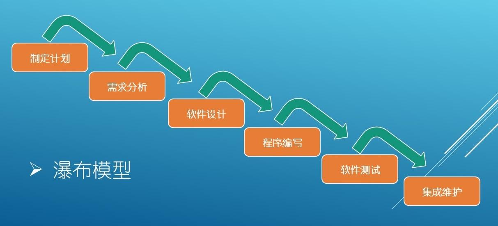

其各阶段顺序的开展，形如自上而下的瀑布，比较适合小型工程或工程相对比较稳定的项目，5个阶段：

- 需求分析
- 设计
- 编码
- 单元测试
- 集成测试

## 敏捷开发

问题：

- 团队是否适合敏捷？
- 敏捷转型需要哪些准备？

**总体框架：**

接受敏捷理念的客户和工程师有着共同的观点：<b style="color:green">唯一真正重要的工作产品是在合适时间提交给客户的可运行软件增量。</b>

敏捷开发是一种轻量级开发方法，通过一个或多个跨职能的小型团队分多个迭代持续增量的交付价值。通过迭代和快速用户反馈管理不确定性和拥抱变化。

敏捷开发知识体系整体框架可分为三层，如图所示：核心价值层、方法框架层和敏捷实践层。

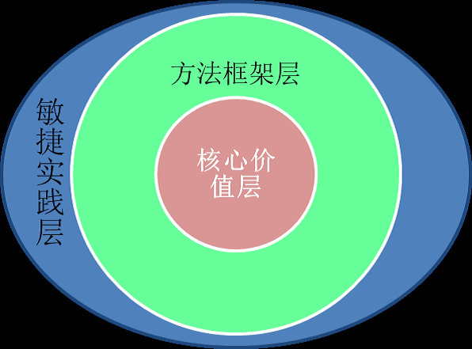

敏捷知识体系整体框架：

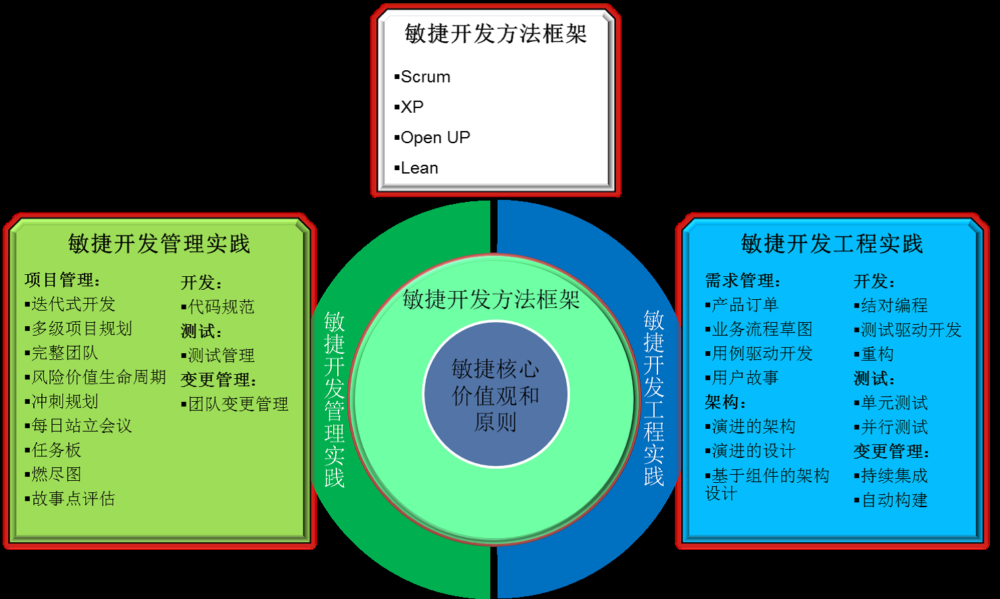

其中，敏捷开发知识体系的核心是**敏捷宣言**，它们是敏捷开发思想和价值观的集中体现，它直接影响人们的思维模式。因此，正确的理解敏捷宣言，建立正确的敏捷价值观是成功开展敏捷开发的关键。

- 核心价值层主要包括 **敏捷宣言** 和 **12个原则**；

  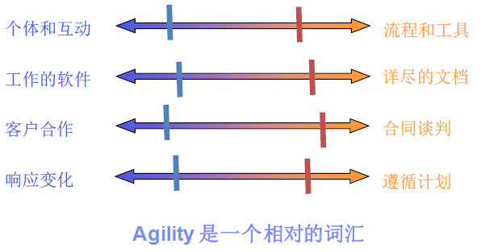

- 方法框架层主要包括各种敏捷开发过程框架，包括 **XP**、**Scrum**、**精益开发** 和 **OpenUP** 等；

  敏捷开发过程的3个关键假设（适用于大多数项目）：

  1. 项目需求总是变化，提前预测非常困难。同样，管理项目进行中客户的优先级变化也很困难
  2. 对于很多软件来说，设计和构建是交错进行的
  3. 从制定计划的角度看，软件的分析、设计、构建和测试并不像我们设想的那么容易

  这3个假设要求敏捷过程一定要有预测性。因此敏捷软件必须是 **增量地自适应**。为了达到这一目的，敏捷团队需要快速交付，获取客户持续反馈

  其中应用最广的敏捷开发方法框架包括：

  - Scrum

    Scrum 包括一系列实践和预定义角色，是一种灵活的软件管理过程。它提供了一种经验方法，可以帮助你驾驭迭代并实现递增的软件开发过程。这一过程是迅速、有适应性、自组织的，它发现了软件工程的社会意义，使得团队成员能够独立地集中在创造性的协作环境下工作。

  - 精益开发(Lean)

    精益的理念，就是从最终用户的视角上观察生产流程，视任何未产生增值的活动为浪费，并通过持续地消除浪费，实现快速交付、提高质量与控制成本的目标。因此，对于软件开发而言，在开发者或最终用户的视角上观察软件开发过程，并发现和消除其无益于快速交付的行为，即为精益的软件开发。

  - 极限编程(XP)

    极限编程是由 Kent Beck 提出的一套针对业务需求和软件开发实践的规则，它的作用在于将二者力量集中在一个共同的目标上，高效并稳妥地推进开发。它力图在客户需求不断变化的前提下，以可持续的步调，采用高响应性的软件开发过程来交付高质量的软件产品。

  - OpenUP

    最早源自 IBM 内部对 RUP（Rational Unified Process）的敏捷化改造，它是由一组适合高效率软件开发的最小实践集组成的敏捷化的统一过程。它的基本出发点是务实、敏捷和协作。通过提供支撑工具、降低流程开销等措施，OpenUP 方法既可以按照基本模式使用，也可以扩展更多的实践。因而，OpenUP 拥有更为广泛的应用范围。

- 敏捷实践层则主要包括用于指导敏捷开发的各种实践。他们按使用目的可分为两类：**敏捷开发管理实践** 和 **敏捷开发工程实践**。

  敏捷开发管理实践泛指用于指导敏捷团队进行敏捷开发的各种管理类最佳实践，业界应用最广的敏捷开发管理实践包括：

  **项目管理：**
  
  - 迭代开发
  - 风险价值生命周期
  - 多级项目规划
  - 完整团队
  - 每日站立会议
  - 任务板
  - 燃尽图
  - 变更管理

  **开发：**

  - 代码规范

  **测试：**

  - 测试管理

  敏捷开发工程实践泛指用于指导敏捷团队进行敏捷开发的各种工程实践，业界应用最广的敏捷开发工程实践包括：

  **需求：**

  - 产品待办列表
  - 业务流程草图
  - 用例驱动开发
  - 用户故事
  
  **架构：**

  - 演进的架构
  - 演进的设计
  - 基于组件的架构设计
  
  **开发：**

  - 结对编程
  - 测试驱动开发
  - 重构

  **测试：**

  - 单元测试
  - 并行测试

  **构建：**

  - 持续集成
  - 自动构建

### 核心价值观和原则

**敏捷软件开发宣言：**

我们一直在实践中探寻更好的软件开发方法，身体力行的同时也帮助他人。由此我们建立了如下价值观：

```txt
个体和互动 高于 流程和工具
工作的软件 高于 详尽的文档
客户合作 高于 合同谈判
响应变化 高于 遵循计划
```

也就是说，尽管右项有其价值，我们更重视左项的价值。

**敏捷开发的核心价值观：**

敏捷开发的核心理念就是以最简单有效的方式快速的达成目标，并在这个过程中及时地响应外界的变化，做出迅速的调整。

- 敏捷开发的第一条价值观就是 **以人为本**，强调 “个体（人）” 及 “个体” 间的沟通与协作在软件开发过程中的重要性。
- 敏捷开发的第二条价值观就是 **目标导向**。软件开发的目标是 “可工作的软件”，而不是面面俱到的文档。
- 敏捷开发的第三条价值观就是 **客户为先**。敏捷价值观把客户当成了合作者和伙伴，把自己的使命定位为 “帮助客户取得竞争优势”。
- 敏捷开发的第四条价值观就是 **拥抱变化**。

**敏捷开发的12条原则：**

1. 我们最重要的目标，是通过持续不断地及早交付有价值的软件使客户满意。
2. 欣然面对需求变化，即使在开发后期也一样。为了客户的竞争优势，敏捷过程掌控变化。
3. 经常地交付可工作的软件，相隔几星期或一两个月，倾向于采取较短的周期。
4. 业务人员和开发人员必须相互合作，项目中的每一天都不例外。
5. 激发个体的斗志，以他们为核心搭建项目。提供所需的环境和支援，辅以信任，从而达成目标。
6. 不论团队内外，传递信息效果最好效率也最高的方式是面对面的交谈。
7. 可工作的软件是进度的首要度量标准。
8. 敏捷过程倡导可持续开发。责任人、开发人员和用户要能够共同维持其步调稳定延续。
9. 坚持不懈地追求技术卓越和良好设计，敏捷能力由此增强。
10. 以简洁为本，它是极力减少不必要工作量的艺术。
11. 最好的架构、需求和设计出自自组织团队。
12. 团队定期地反思如何能提高成效，并依此调整自身的举止表现。

敏捷开发团队可以以这十二条原则为基础，进一步的细化敏捷项目的管理流程、步骤、和方法工具，以便这些原则能够更好的被团队理解和执行。

### 敏捷开发方法框架

#### SCRUM

Scrum 最早由 Jeff Sutherland 在 1993 年提出，Ken Schwaber 在 1995 年 OOPSLA 会议上形式化了 Scrum 开发过程，并向业界公布。目前 Scrum 是应用最为广泛的敏捷方法之一。

Scrum 是一个敏捷开发框架，是一个增量的、迭代的开发过程。在这个框架中，整个开发周期由若干个短的迭代周期组成，一个短的迭代周期称为一个Sprint，每个 Sprint 的建议长度是 2 到 4 周。

在 Scrum 中，使用产品 Backlog 来管理产品的需求，产品 Backlog 是一个按照商业价值排序的需求列表，列表条目的体现形式通常为用户故事。

Scrum 团队总是先开发对客户具有较高价值的需求。在 Sprint 中，Scrum 团队从产品 Backlog 中挑选最高优先级的需求进行开发。挑选的需求在 Sprint 计划会议上经过讨论、分析和估算得到相应的任务列表，我们称它为 Sprint Backlog。在每个迭代结束时，Scrum 团队将递交潜在可交付的产品增量。

**SCRUM 理论基础：**

Scrum 是以经验过程控制理论作为理论基础，通过迭代、增量的方法来增强产品开发的可预见性，并控制风险。Scrum 经验过程控制理论的实施由三大支柱支撑：

- 第一：透明性(Transparency)
- 第二：检验(Inspection)
- 第三：适应(daptation)

Scrum 中通过三个活动进行检验和适应：

1. 每日例会
2. Sprint 评审和计划会议
3. Sprint 回顾会议

Scrum 框架主要包括以下内容：

角色：

- 产品负责人（Product Owner）：代表了客户的意愿
- Scrum Master：负责确保 Scrum 过程正确实施
- 团队：包含专业人员，负责在每个 Sprint 的结尾交付潜在可发布的 “完成” 产品增量

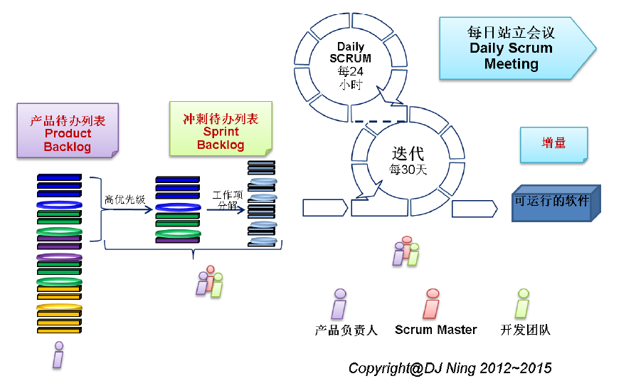

活动：

- 冲刺规划会议（Sprint Plan Meeting）
  
  对于周期为一个月的 Sprint，计划会议的时间盒限定为 8 小时。
  
  Sprint 计划会议分为两部分，每一部分都占用 Sprint 计划会议时间盒长度的一半。两部分的计划会议分别回答以下两个问题：

  1) 下个 Sprint 中将交付什么增量结果？（这个 Sprint 要做什么？）
  2) 要交付增量需完成什么样的工作？（选出的工作如何完成？）

- 每日站立会议（Scrum Daily Meeting）

  每日站立会议是 15 分钟时间盒的开发团队事件，为的是同步活动并创建下个 24 小时的计划。这需要检验上个每日站立会议以来的工作和预测下个每日站立会议之前所能完成的工作。每日站立会议在同一时间，同一地点进行，来降低复杂度。会议上，每个团队成员需要汇报以下三个问题：

  1) 从上次会议到现在都完成了哪些工作；
  2) 下次每日站立会议之前准备完成什么；
  3) 工作中遇到了哪些障碍。

  只有开发团队成员才能参加。每日站立会议不是进度汇报会议，只是为将产品待办事项列表条目转化成为增量的人（团队）而召开的。

- 冲刺复审会议（Sprint Review Meeting）

  Sprint 评审会议在 Sprint 的结尾召开，用以检验所交付的产品增量并按需调整产品代办事项列表。

  一个月的 Sprint 通常对应 4 小时时间盒的评审会议。

  Sprint 评审会议包含以下因素：

  1) 产品负责人确定哪些工作 “完成” 了，哪些工作没有 “完成”
  2) 开发团队讨论在 Sprint 中哪些工作进展顺利、遇到了什么问题、问题是如何解决的
  3) 开发团队演示 “完成” 的工作并解答关于所交付增量的问题
  4) 产品负责人和与会人员按现实情况讨论产品待办事项列表，并基于当前的进度推测可能的完成日期
  5) 整个团体就下一步的工作进行探讨，这样，Sprint 评审会议就能为接下来的 Sprint 计划会议提供了有价值的信息。

- 冲刺回顾会议（Sprint Retrospective Meeting）

  Sprint 回顾会议是 Scrum 团队检验自身并创建下个 Sprint 改进计划的机会。

  对于长度为一个月的 Sprint，这是一个 3 小时时间盒的会议。

  Sprint 回顾会议的目的是：

  1) 对前一个 Sprint 周期中的人、关系、过程和工具进行检验
  2) 识别并排序做得好的和能潜在改进的主要条目
  3) 创建实施改进 Scrum 团队工作方式的计划

  主要工件：

  - 产品待办列表（Product Backlog）

    产品待办列表是整个项目的概要文档，它包含已划分优先等级的、项目要开发的系统或产品的需求清单，包括功能和非功能性需求及其他假设和约束条件。

  - 冲刺待办列表（Sprint Backlog）

    冲刺待办列表是大大细化了的文档，用来界定工作或任务，定义团队在 Sprint 中的任务清单，这些任务会将当前冲刺选定的产品待办列表转化为完整的产品功能增量。

    任务被分解为以小时为单位，没有任务可以超过 16 个小时。如果一个任务超过 16 个小时，那么它就应该被进一步分解。

- 燃尽图（Burndown Chart）

  燃尽图是一个公开展示的图表，纵轴代表剩余工作量，横轴代表时间，显示当前冲刺中随时间变化而变化的剩余工作量。

  剩余工作量趋势线与横轴之间的交集表示在那个时间点最可能的工作完成量。我们可以借助它设想在增加或减少发布功能后项目的情况，我们可能缩短开发时间，或延长开发期限以获得更多功能。它可以展示项目实际进度与计划之间的矛盾。

Scrum 方法中的主要活动和交付件（整个流程）：

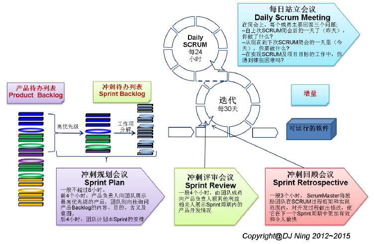

#### XP
