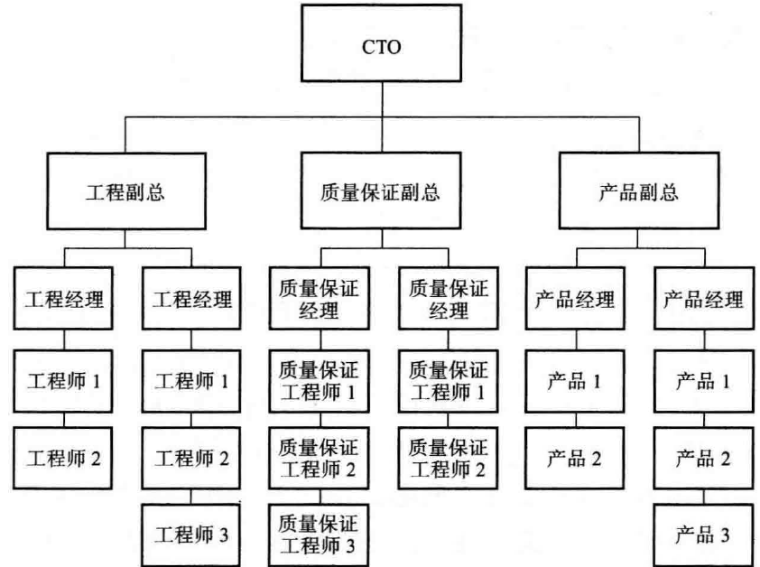
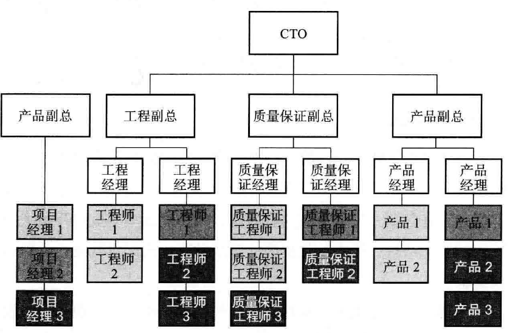
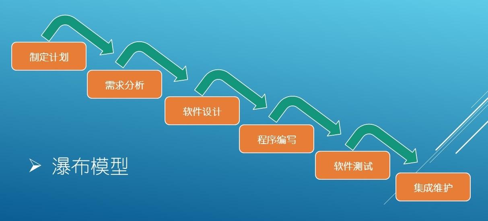

# 项目管理

## 目录

1. [团队管理](#团队管理)
2. [软件工程](#软件工程)


<b style="color:green">ThoughtWorks 期望员工不盲从主流意见，要持怀疑挑战的态度，以求找到不一样的路径，做到比当前更好。</b>

## 团队管理

### 可扩展性组织人员配置

```txt
孙子说：斗众如斗寡，形名是也。
孙子说：将弱不严，教道不明，吏卒无常，陈兵纵横，曰乱。
孙子说：将凡治众如治寡，分数是也。
```

#### 人员和领导力对扩展性的影响

哪个因素对确保产品的长远扩展性最为关键？人员、过程还是技术？人员

组织内部两个基本冲突类型：情感型和认知型

- 情感型冲突是以角色或控制为基础的冲突，经常发生在团队之间。
- 认知型冲突常常是关于“谁”做，或者“怎么”做。

情感型冲突很少能提升产品的价值，相反，几乎总是延迟产品的发布和增加成本。认知型的冲突，如果处理得当，常被称为“好的冲突”。

人是影响可扩展性最为重要的因素，没有人，就没有过程和系统。有效的组织将协助你快速达成目标，反之则产生阻碍作用。在组织里，管理和领导的作用分别是推和拉。领导鼓励员工取得更大的成绩，管理鼓励员工实现目标。

在可扩展性的拼图中人员是最重要的一块。对可扩展的组织，需要有合适的人，在合适的时间，以合适的行为，做合适的工作。

组织的结构很少有对与错之分，任何的结构都有利有弊。

在设计组织的过程中要考虑下述几个方面：

- 易于在现有的组织上增加新的工作单元。在组织里增加和减少人员有多么困难？你可以成组地增加入吗？你能增加独立贡献的个人吗？
- 容易度量一个时期组织和独立贡献者的工作业绩。
- 把一个目标交给一个团队有多么困难？团队是否能感觉到有足够授权去达成目标？
- 团队内部和团队之间的冲突情况如何？是否促进或阻碍实现公司的使命。
- 组织会促进还是阻碍创新以及市场响应时间？
- 组织的结构会增加还是减少单位产出的成本？
- 工作在组织内部的流转是否容易？

组织扩展成本：组织和个人的平均产出之间的关系。示例：增加人，增加了沟通成本，组织内个人产出下降，整体产出增加。

“两张比萨团队”概念：亚马逊创始人杰夫•贝佐斯提出，任何一个团队的规模不能大过两张比萨所能喂饱的人数。

具体含义：沟通主要发生在团队内部，因此额外的沟通负担就大大地减少了。团队还要有足够的授权才能成功地达成目标。每个团队都要设置一个或几个KPI 来衡量整体的成功情况。通常配置跨部门的人员来确保团队技能齐全，不必请求外援。

管理意味着度量，失败的度量意味着失败的管理。

总的来说，管理是与“推”(pushing)相关的活动， 而领导是与“拉”(pulling) 相关的活动。领导设定目的地和通往目的地的路线图。管理设法到达目的地。

管理把适当的任务分配到人，并且确保这些任务可以在指定的时间内以适当的成本完成。管理对工作表现及时反馈，尽早和经常地进行沟通，也包括移除障碍或者帮助团队绕过障碍。管理就是度量，度量失败即管理失败。

领导激励员工和组织做正确的事并好好做事。领导是描绘激动人心的愿景，并把愿景深入到员工的心里，引领他们为公司做正确的事情。领导确定使命、描绘愿景、制订路线图，帮助员工理解做什么和如何做才能为股东创造价值。最后，在向组织最高目标前进的路上，领导定义阶段性的目标和KPI。

好的领导创造文化，聚焦打造具有高可扩展性的组织、流程和产品而取得成功。这种文化靠激励体系来确保公司能够在成本可控的情况下扩展，同时不影响用户体验和出现扩展性问题。

可扩展性：绝对不仅仅是技术那么简单！扩展性问题始于组织和人员，然后扩散到过程和技术。

#### 可扩展性技术组织的角色

做出最佳决策最为关键的要素是有一个最佳的决策过程，来确保合适的人收集合适的信息，并把它提供给最终的决策者。

你可以下放任何权力，但是必须对其结果承担所有的责任

你可以对任何事情放权，但是绝对不会把对结果负责的事情放权。

好的领导总是把赞扬留给团队，承认失败并公开地承担责任。相反，差的领导在失败时找替罪羊，在成功时抢功。

好的CEO 需要精通管理哲学，了解一些基础知识（技术，资产负债表、损益表、现金流表等），知道该问什么问题，知道去哪里和在什么时间可以得到帮助；具备“高管盘问”(executive interrogation)的关键能力；与技术公司建立专业或个人的关系，依靠这些关系来帮助你提出正确的问题，并且当你要深究的时候，协助你评估答案；能够更好地提出和评估问题。

CTO 或CIO 必须要有公司的整体技术愿景，理解公司业务运作的基本情况，有市场营销的基础知识。

架构师的责任是确保系统的设计和架构可以随着业务的发展而扩展，也可以负责信息技术的管制、标准和过程。

工程师遵循公司的架构标准，根据架构进行具体设计，并且最后完成代码的实现。

devOps 是"Development"（开发）和"Operations"（运维）两个词的合并和缩写，近来常用这个词描述软件研发团队和技术运维团队之间交互和合作的现象。在SaaS和Web 2.0时代，DevOps通常负责配置、运行和监控生产系统。

**斯洛的锤子理论**：如果你手里只有一把锤子，那么所有你看到的都是钉子。

**RASCI工具：**

一套用来确定责任的表格，坚守“职责清楚、奖惩分明”的原则

- R: 负责(Responsible) 对项目或者任务的完成负责的人。
- A: 批准(Accountable) 项目关键决策的批准人。
- S: 支持(Supportive) 为项目完成提供资源的人。
- C: 咨询(Consulted) 为项目提供数据或者信息的人。
- I: 知情(Informed) 需要了解项目相关情况的人。


[事项检查表](./Resource/事项检查表.docx)

#### 组织的设置

功能点和场景点是度量功能的两个不同的标准化方法。功能点从用户角度出发，而场景点从工程师角度出发。

组织结构：

1、职能型（竖井式）



职能型组织的好处包括经理和工作伙伴的同质性、责任简单清晰、有标准可依。不利的地方包括没有单一的项目负责人和沟通不顺畅。采用瀑布式研发的组织，经常能从按职能划分的组织结构中获益，因为该结构恰好与瀑布型方法中固有的阶段控制相匹配。

2、矩阵型



## 软件工程

瀑布模型，增量模型，迭代模型

### 瀑布模型



其各阶段顺序的开展，形如自上而下的瀑布，比较适合小型工程或工程相对比较稳定的项目，5个阶段：

- 需求分析
- 设计
- 编码
- 单元测试
- 集成测试
