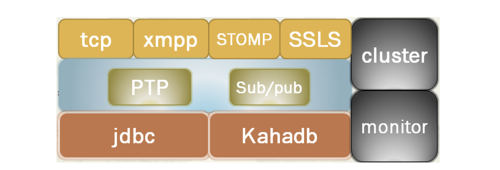
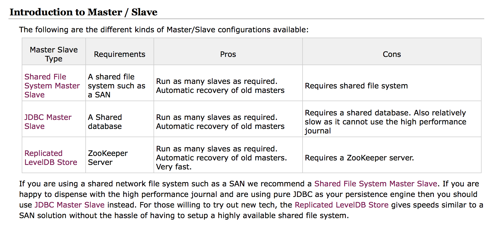
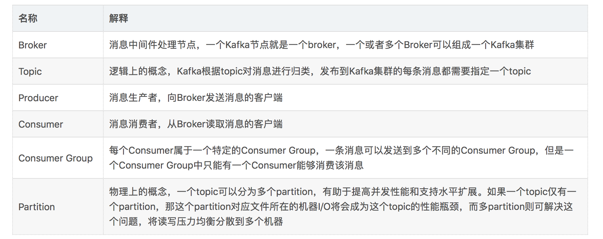

# 中间件

## 目录

- Web Server
  - Nginx
  - OpenResty
  - Tengine
  - Apache Httpd
  - Tomcat
  - Jetty
- [缓存](#缓存)
  - 本地缓存
  - 客户端缓存
  - 服务端缓存
    - Web缓存
    - [Memcached](#Memcached)
    - [Redis](#Redis)
    - Tait
- [消息队列](#消息队列)
  - [应用场景](#应用场景)
  - [消息总线](#消息总线)
  - 消息的顺序
  - [RabbitMQ](#RabbitMQ)
  - [RocketMQ](#RocketMQ)
  - [ActiveMQ](#ActiveMQ)
  - [Kafka](#Kafka)
  - Redis消息推送
  - ZeroMQ
- 定时调度
  - 单机定时调度
  - 分布式定时调度
- RPC
  - Dubbo
  - Thrift
  - gRPC
- 数据库中间件
  - Sharding Jdbc  
- 日志系统
  - 日志搜集
- [配置中心](#配置中心)
  - 为什么需要统一配置？
  - 解决思路
  - Zookeeper方案
  - Zookeeper代码实现
- API网关

## 缓存

缓存是一种用于提高系统响应速度、改善系统运行性能的技术。对于一个服务，其性能瓶颈往往都在 DB，传统关系型存储尤甚。从磁盘中读取数据，IO 瓶颈是非常明显的，而缓存通常是基于内存的，比 DB 从磁盘读数据快两个数量级。

分布式缓存主要包含以上几大特性：

1. **高性能**：当传统数据库面临大规模数据访问时，磁盘 I/O 往往成为性能瓶颈，从而导致过高的响应延迟。分布式缓存将高速内存作为数据对象的存储介质，数据以 key/value 形式存储，理想情况下可以获得 DRAM 级的读写性能；

2. **动态扩展性**：支持弹性扩展，通过动态增加或减少节点应对变化的数据访问负载，提供可预测的性能与扩展性，同时，最大限度地提高资源利用率；

3. **高可用性**：包含数据可用性与服务可用性两方面。基于冗余机制实现高可用性，无单点失效问题，支持故障的自动发现，透明地实施故障切换，不会因服务器故障而导致缓存服务中断或数据丢失，动态扩展时自动均衡数据分区，同时保障缓存服务持续可用；

4. **易用性**：提供单一的数据与管理视图；API 接口简单且与拓扑结构无关；动态扩展或失效恢复时无需人工配置；自动选取备份节点；多数缓存系统提供了图形化的管理控制台，便于统一维护。

典型应用场景主要有：

1. 页面缓存：用来缓存 Web 页面的内容片段，包括 HTML、CSS 和图片等，多应用于社交网站等；

2. 应用对象缓存：缓存系统作为 ORM 框架的二级缓存对外提供服务，目的是减轻数据库的负载压力，加速应用访问；

3. 状态缓存：缓存包括 Session 会话状态及应用横向扩展时的状态数据等，这类数据一般是难以恢复的，对可用性要求较高，多应用于高可用集群；

4. 并行处理：通常涉及大量中间计算结果需要共享；

5. 事件处理：分布式缓存提供了针对事件流的连续查询处理技术,满足实时性需求。

分布式缓存一般被定义为一个数据集合，它将数据分布（或分区）于任意数目的集群节点上。集群中的一个具体节点负责缓存中的一部分数据，整体对外提供统一的访问接口。分布式缓存一般基于 **冗余备份机制** 实现数据高可用，又被称为内存数据网格(IMDG, In-Memory Data Grid)。在云平台飞速发展的今天，作为提升应用性能的重要手段，分布式缓存技术在工业界得到了越来越广泛的关注和研发投入 。

## Memcached

## Redis

Redis: Remote Dictionary Server，属于 NoSQL 数据库

- 作者：来自意大利西西里岛的 Salvatore Sanfilippo，Github地址：[http://github.com/antirez](http://github.com/antirez)。
- 使用 ANSI C 语言编写，最新版本（4.0.10）代码规模7.6万行。
- 目前，在所有可实现分布式缓存的开源软件中，Redis 应用最为广泛，开源社区也最为活跃，开源客户端支持语言也最为丰富。
- 可用作 **数据库**、**高速缓存**、**锁** 和 **消息队列**
- 支持字符串、哈希表、列表、集合、有序集合、位图、HyperLogLogs 等数据类型
- 内置复制、Lua 脚本、老化逐出、事务以及不同级别磁盘持久化功能
- Redis 还支持 Sentinel 和 Cluster（从3.0开始）等高可用集群方案
- Redis 作为缓存的常见业务场景有：
  1. 缓存热点数据，减轻数据库负载；
  2. 基于 List 结构显示最新的项目列表；
  3. 基于 Sorted Set 来做排行榜，取 Top N；
  4. 基于 Set 来做 uniq 操作，如页面访问者排重；
  5. 基于 Hset 做单 Key 下多属性的项目，例如商品的基本信息、库存、价格等设置成多属性。
- Redis 特点
  - Redis 不仅仅支持简单的 key-value 类型的数据，同时还提供 list，set，zset，hash 等数据结构的存储。
  - Redis 支持数据的持久化，可以将内存中的数据保存在磁盘中，重启的时候可以再次加载进行使用。
  - Redis 支持数据的备份，即 master-slave 模式的数据备份。
  - Redis 主进程是 <b style="color:green">单线程</b> 工作，因此，Redis 的所有操作都是原子性的。意思就是要么成功执行要么失败完全不执行。单个操作是原子性的。多个操作也支持事务，即原子性，通过 `MULTI` 和 `EXEC` 指令包起来。
  - 性能极高 – Redis能读的速度是110000次/s，写的速度是81000次/s，此外，Key 和 Value 的大小限制均为 512M，这阈值相当可观。
  - 丰富的特性 – Redis 还支持 publish/subscribe，通知，key 过期等等特性。
- [详细说明文档](../Database/3.1_Redis.md)

## Tait

## 消息队列

在企业应用系统领域，会面对不同系统之间的通信集成与整合，尤其当面临 **异构系统** 时，这种分布式的调用与通信变得越发重要。其次，系统中一般会有很多对实时性要求不高的但是执行起来比较较耗时的地方，比如发送短信，邮件提醒，更新文章阅读计数，记录用户操作日志等等，如果实时处理的话，在用户访问量比较大的情况下，对系统压力比较大。

面对这些问题，我们一般会将这些请求，放在 **消息队列MQ** 中处理；异构系统之间使用消息进行通讯。

MQ全称为Message Queue, 消息队列（MQ）是一种应用程序对应用程序的通信方法。应用程序通过读写出入队列的消息（针对应用程序的数据）来通信，而无需专用连接来链接它们。

**消息传递** 指的是程序之间通过在消息中发送数据进行通信，而不是通过直接调用彼此来通信，直接调用通常是用于诸如 **远程过程调用** 的技术。排队指的是应用程序通过队列来通信。队列的使用除去了接收和发送应用程序同时执行的要求。

MQ 是 **消费-生产者模型** 的一个典型的代表，一端往消息队列中不断写入消息，而另一端则可以读取或者订阅队列中的消息。

**消息传递** 相较 **文件传递** 与 **远程过程调用(RPC)** 而言，似乎更胜一筹，因为它具有更好的平台无关性，并能够很好地支持并发与异步调用。

总之，**消息队列** 在 构建分布式系统 和 提高系统的可扩展性和响应性 方面有着很重要的作用。

## 应用场景

### 1. 异步处理

支持异步通信协议，消息的发送者将消息发送到消息队列后可以立即返回，不用等待接收者的响应。消息会被保存在队列中，直到被接收者取出。消息的发送与处理是完全异步的。

以用户注册为例：

### 2. 应用解耦

以电商 IT 架构为例，在传统紧耦合订单场景里，客户在电商网站下订单，订单系统接收到请求后，立即调用库存系统接口，库存减一，如下图所示：

上述模式存在巨大风险：

1. 假如库存系统无法访问（升级、业务变更、故障等），则订单减库存将失败，从而导致订单失败；
2. 短时间内大量的请求，频繁查询库存，修改库存，库存系统负载极大。

我们引入消息队列，解除强耦合性，处理流程又会怎样呢？

订单系统中，用户下单后，订单系统完成持久化处理，将消息写入消息队列，返回用户订单下单成功，此时客户可以认为下单成功。消息队列提供异步的通信协议，消息的发送者将消息发送到消息队列后可以立即返回，不用等待接收者的响应。消息会被保存在队列中，直到被接收者取出。

库存系统中，从消息队列中获取下单信息，库存系统根据下单信息进行库存操作。

### 3. 流量削锋

像双11秒杀、预约抢购等活动，通常会出现流量暴增，当外部请求超过系统处理能力时，如果系统没有做相应保护，可能因不堪重负而挂掉。

这时，我们可以引入消息队列，缓解短时间内高流量压力：

1. 用户的秒杀请求，服务器接收后，首先写入消息队列，然后返回成功。假如消息队列长度超过最大数量，则直接抛弃用户请求或跳转到失败页面；
2. 秒杀业务根据消息队列中的请求信息，再做后续处理（根据数据库实际的select、insert、update 能力处理注册、预约申请）。

### 4. 消息通讯

消息通讯很好理解，以微信群聊为例：

1. A 通过客户端发送消息到群里，服务端将消息写入消息队列；
2. 消息队列，负责消息数据的接收，存储和转发；
3. B 通过客户端查看群消息，订阅并消费消息队列中的信息。

## 消息总线

## RabbitMQ

RabbitMQ 是由 RabbitMQ Technologies Ltd 开发并提供技术支持的开源软件。该公司在 2010 年 4 月被 SpringSource（VMWare 的一个部门）收购。在 2013 年 5 月被并入 Pivotal。事实上 VMWare、Pivotal 和 EMC 同属一家，不同的是 VMWare 是独立上市子公司，而 Pivotal 整合了 EMC 的某些资源，现在并没有上市。

### RabbitMQ简介

RabbitMQ 是流行的开源消息队列系统，最新版本为 3.7.8。RabbitMQ 是 AMQP（Advanced Message Queuing Protocol）的标准实现。支持多种客户端，如 Python、Ruby、.NET、Java、JMS、C、PHP、ActionScript、XMPP、STOMP 等，支持 AJAX、持久化。用于在分布式系统中存储转发消息，在易用性、扩展性、高可用性等方面表现不俗，它遵循Mozilla Public License开源协议。

RabbitMQ 采用 Erlang 语言开发。Erlang 是一种面向并发运行环境的通用编程语言。该语言由爱立信公司在 1986 年开始开发，目的是创造一种可以应对大规模并发活动的编程语言和运行环境。Erlang 问世于 1987 年，经过十年的发展，于 1998 年发布开源版本。

Erlang 是一个结构化、动态类型编程语言，内建并行计算支持。使用 Erlang 编写出的应用运行时通常由成千上万个轻量级进程组成，并通过消息传递相互通讯。进程间上下文切换对于 Erlang 来说仅仅只是一两个环节，比起 C 程序的线程切换要高效得多。Erlang 运行时环境是一个虚拟机，有点像 Java 虚拟机，这样代码一经编译，同样可以随处运行。它的运行时系统甚至允许代码在不被中断的情况下更新。另外字节代码也可以编译成本地代码运行。

### RabbitMQ特点

根据[官方介绍](http://www.rabbitmq.com/#features)，RabbitMQ 是部署最广泛的消息代理，有以下特点：

- 异步消息传递，支持多种消息传递协议、消息队列、传递确认机制，灵活的路由消息到队列，多种交换类型；
- 良好的开发者体验，可在许多操作系统及云环境中运行，并为大多数流行语言提供各种开发工具；
- 可插拔身份认证授权，支持 TLS（Transport Layer Security）和 LDAP（Lightweight Directory Access Protocol）。轻量且容易部署到内部、私有云或公有云中；
- 分布式部署，支持集群模式、跨区域部署，以满足高可用、高吞吐量应用场景；
- 有专门用于管理和监督的 HTTP-API、命令行工具和 UI；
- 支持连续集成、操作度量和集成到其他企业系统的各种工具和插件阵列。可以插件方式灵活地扩展 RabbitMQ 的功能。

综上所述，RabbitMQ 是一个“体系较为完善”的消息代理系统，性能好、安全、可靠、分布式，支持多种语言的客户端，且有专门的运维管理工具。

### RabbitMQ 架构

根据官方文档说明，RabbitMQ 的架构图如下所示：

RabbitMQ是一个消息代理。他从消息生产者(producers)那里接收消息，然后把消息送给消息消费者(consumer)在发送和接受之间，他能够根据设置的规则进行路由，缓存和持久化。

一般提到RabbitMQ和消息，都用到一些专有名词。

- 生产(Producing)意思就是发送。发送消息的程序就是一个生产者(producer)。我们一般用"P"来表示
- 队列(queue)就是邮箱的名称。消息通过你的应用程序和RabbitMQ进行传输，它们只能存储在队列(queue)中。队列(queue)容量没有限制，你要存储多少消息都可以——基本上是一个无限的缓冲区。多个生产者(producers)能够把消息发送给同一个队列，同样，多个消费者(consumers)也能从同一个队列(queue)中获取数据。
- 消费(Consuming)和获取消息是一样的意思。一个消费者(consumer)就是一个等待获取消息的程序。我们把它称作"C"。

RabbitMQ 的重要概念有以下几个：

- Broker：接收消息，分发消息应用；
- Exchange：消息交换机；指定消息按照什么规则路由到哪个队列 Queue；
- Queue：消息队列，存储消息的载体；
- Binding：Exchange 和 Queue 之间的虚拟连接；Binding 中可以包含 RoutingKey，其信息被保存到 Exchange 中的查询表中，作为 Message 的分发依据；
- RoutingKey：路由关键字，Exchange 根据 RoutingKey 将消息投递到对应的队列中；
- Vhost：虚拟主机，一个 Broker 可以有多个虚拟主机，用作不同用户的权限分离；一个虚拟主机持有一组 Exchange、Queue 和 Binding；
- Producer：消息生产者，主要将消息投递到对应的 Exchange 上面；
- Consumer：消息消费者，消息的接收者，一般是独立的程序；
- Channel：消息通道，也称信道。在客户端的每个连接里可以建立多个 Channel，每个 Channel 代表一个会话任务。

消息队列的使用过程如下：

1. 客户端连接到消息队列服务器，打开一个 Channel。
2. 客户端声明一个 Exchange，并设置相关属性。
3. 客户端声明一个 Queue，并设置相关属性。
4. 客户端使用 Routing Key，在 Exchange 和 Queue 之间建立好绑定关系。
5. 客户端投递消息到 Exchange。Exchange 接收到消息后，根据消息的 Key 和已经设置的 Binding，进行消息路由，将消息投递到一个或多个队列里。

有三种类型的 Exchange，即 Direct、Fanout、Topic，每个实现了不同的路由算法（Routing Algorithm）。

- **Direct Exchange**：完全根据 Key 投递。如果 Routing Key 匹配，Message 就会被传递到相应的 Queue 中。其实在 Queue 创建时，它会自动地以 Queue 的名字作为 Routing Key 来绑定 Exchange。例如，绑定时设置了 Routing Key 为"abc"，那么客户端提交的消息，只有设置了 Key为"abc"的才会投递到队列中。
- **Fanout Exchange**：该类型 Exchange 不需要 Key。它采取广播模式，一个消息进来时，便投递到与该交换机绑定的所有队列中。
- **Topic Exchange**：对 Key 进行模式匹配后再投递。比如符号 "#" 匹配一个或多个词，符号 "." 正好匹配一个词。例如 "abc.#" 匹配"abc.def.ghi"，"abc."只匹配"abc.def"。

### RabbitMQ 高可用方案

就分布式系统而言，实现高可用（High Availability，HA）的策略基本一致，即副本思想，当主节点宕机之后，作为副本的备节点迅速“顶上去”继续提供服务。此外，单机的吞吐量是极为有限的，为了提升性能，通常都采用“人海战术”，也就是所谓的集群模式。

RabbitMQ 集群配置方式主要包括以下几种：

- Cluster：不支持跨网段，用于同一个网段内的局域网；可以随意得动态增加或者减少；节点之间需要运行相同版本的 RabbitMQ 和 Erlang。
- Federation：应用于广域网，允许单台服务器上的交换机或队列接收发布到另一台服务器上的交换机或队列的消息，可以是单独机器或集群。Federation 队列类似于单向点对点连接，消息会在联盟队列之间转发任意次，直到被消费者接受。通常使用 Federation 来连接 Internet 上的中间服务器，用作订阅分发消息或工作队列。
- Shovel：连接方式与 Federation 的连接方式类似，但它工作在更低层次。可以应用于广域网。

RabbitMQ 节点类型有以下几种：

- 内存节点：内存节点将队列、交换机、绑定、用户、权限和 Vhost 的所有元数据定义存储在内存中，好处是可以更好地加速交换机和队列声明等操作。
- 磁盘节点：将元数据存储在磁盘中，单节点系统只允许磁盘类型的节点，防止重启 RabbitMQ 时丢失系统的配置信息。

问题说明：RabbitMQ 要求集群中至少有一个磁盘节点，所有其他节点可以是内存节点，当节点加入或者离开集群时，必须要将该变更通知给至少一个磁盘节点。如果集群中唯一的一个磁盘节点崩溃的话，集群仍然可以保持运行，但是无法进行操作（增删改查），直到节点恢复。

解决方案：设置两个磁盘节点，至少有一个是可用的，可以保存元数据的更改。

**Erlang Cookie：**

Erlang Cookie 是保证不同节点可以相互通信的密钥，要保证集群中的不同节点相互通信必须共享相同的 Erlang Cookie。具体的目录存放在 `/var/lib/rabbitmq/.erlang.cookie`。

它的起源要从 rabbitmqctl 命令的工作原理说起。RabbitMQ 底层基于 Erlang 架构实现，所以 rabbitmqctl 会启动 Erlang 节点，并基于 Erlang 节点使用 Erlang 系统连接 RabbitMQ 节点，在连接过程中需要正确的 Erlang Cookie 和节点名称，Erlang 节点通过交换 Erlang Cookie 以获得认证。

**镜像队列：**

RabbitMQ 的 Cluster 集群模式一般分为两种，普通模式和镜像模式。

- 普通模式：默认的集群模式，以两个节点（Rabbit01、Rabbit02）为例来进行说明。对于 Queue 来说，消息实体只存在于其中一个节点 Rabbit01（或者 Rabbit02），Rabbit01 和 Rabbit02 两个节点仅有相同的元数据，即队列的结构。当消息进入 Rabbit01 节点的 Queue 后，Consumer 从 Rabbit02 节点消费时，RabbitMQ 会临时在 Rabbit01、Rabbit02 间进行消息传输，把 A 中的消息实体取出并经过 B 发送给 Consumer。所以 Consumer 应尽量连接每一个节点，从中取消息。即对于同一个逻辑队列，要在多个节点建立物理 Queue。否则无论 Consumer 连 Rabbit01 或 Rabbit02，出口总在 Rabbit01，会产生瓶颈。当 Rabbit01 节点故障后，Rabbit02 节点无法取到 Rabbit01 节点中还未消费的消息实体。如果做了消息持久化，那么得等 Rabbit01 节点恢复，然后才可被消费；如果没有持久化的话，就会产生消息丢失的现象。
- 镜像模式：将需要消费的队列变为镜像队列，存在于多个节点，这样就可以实现 RabbitMQ 的 HA，消息实体会主动在镜像节点之间实现同步，而不是像普通模式那样，在 Consumer 消费数据时临时读取。但也存在缺点，集群内部的同步通讯会占用大量的网络带宽。

### RabbitMQ 优缺点

优点主要有以下几点：

- 由于 Erlang 语言的特性，RabbitMQ 性能较好、高并发；
- 健壮、稳定、易用、跨平台、支持多种语言客户端、文档齐全；
- 有消息确认机制和持久化机制，可靠性高；
- 高度可定制的路由；
- 管理界面较丰富，在互联网公司也有较大规模的应用；
- 社区活跃度高，更新快。

缺点主要有：

- 尽管结合 Erlang 语言本身的并发优势，性能较好，但是不利于做二次开发和维护；
- 实现了代理架构，意味着消息在发送到客户端之前可以在中央节点上排队。此特性使得 RabbitMQ 易于使用和部署，但使得其运行速度较慢，因为中央节点增加了延迟，消息封装后也比较大；
- 需要学习比较复杂的接口和协议，学习和维护成本较高。

## RocketMQ

RocketMQ 由阿里研发团队开发的分布式队列，侧重于消息的顺序投递，具有高吞吐量、可靠性等特征。RocketMQ 于 2013 年开源，2016 年捐赠给 Apache 软件基金会，并于 2017 年 9 月成为 Apache 基金会的顶级项目。

## ActiveMQ

ActiveMQ 是 Apache 下的一个子项目。之所以把它放在第二位介绍，是因为它官网上的说明：

>Apache ActiveMQ is the most popular and powerful open source messaging and Integration Patterns server.

居然没有“之一”，不太谦虚呀，放在第二位，以示“诫勉”。

### ActiveMQ 简介

ActiveMQ 由 Apache 出品，据[官网](http://activemq.apache.org/)介绍，它是最流行和最强大的开源消息总线。ActiveMQ 是一个完全支持 JMS1.1 和 J2EE 1.4 规范的 JMS Provider 实现，非常快速，支持多种语言的客户端和协议，而且可以非常容易地嵌入到企业的应用环境中，并有许多高级功能。

ActiveMQ 基于 Java 语言开发，目前最新版本为 5.1.5.6。

### ActiveMQ 特点

ActiveMQ 的特点，官网在 Features 一栏中做了非常详细的说明，我做了下翻译，如下：

- 支持多种语言和协议编写客户端。语言包括 Java、C、C++、C#、Ruby、Perl、Python、PHP。应用协议包括 OpenWire、Stomp REST、WS Notification、XMPP、AMQP；
- 完全支持 JMS1.1 和 J2EE 1.4 规范（持久化、XA 消息、事务)；
- 完全支持 JMS 客户端和消息代理中的企业集成模式；
- 支持许多高级特性，例如消息组、虚拟目的地、通配符和复合目的地；
- 支持 Spring，ActiveMQ 可以很容易地嵌入 Spring 应用程序中，并使用 Spring 的 XML 配置机制进行配置；
- 通过了常见 J2EE 服务器（如 Geronimo、JBoss4、GlassFish、WebLogic）的测试，其中通过 JCA 1.5 Resource Adaptors 的配置，可以让 ActiveMQ 自动部署到任何兼容 J2EE 1.4 商业服务器上；
- 支持多种传输协议，如 VM、TCP、SSL、NIO、UDP、Multicast、JGroups 以及 JXTA；
- 支持通过 JDBC 和 Journal 提供高速的消息持久化；
- 从设计上保证了高性能的集群，客户端-服务器，点对点；
- REST API 为消息提供技术无关和基于语言的 Web API；
- AJAX 允许使用纯 DHTML 实现 Web 流对 Web 浏览器的支持，允许 Web 浏览器成为消息传递结构的一部分；
- 获得 CXF 和 Axes 的支持，使得 ActiveMQ 可以很容易地嵌入 Web 服务栈中的任何一个，以提供可靠的消息传递；
- 很容易调用内嵌 JMS Provider，进行测试。

### ActiveMQ 架构

ActiveMQ 的主体架构如下图所示：

- **传输协议**：消息之间的传递，无疑需要协议进行沟通，启动一个 ActiveMQ 便打开一个监听端口。ActiveMQ 提供了广泛的连接模式，主要包括 SSL、STOMP、XMPP。ActiveMQ 默认的使用协议为 OpenWire，端口号为 61616。
- **通信方式**：ActiveMQ 有两种通信方式，Point-to-Point Model（点对点模式），Publish/Subscribe Model（发布/订阅模式），其中在 Publich/Subscribe 模式下又有持久化订阅和非持久化订阅两种消息处理方式。
- **消息存储**：在实际应用中，重要的消息通常需要持久化到数据库或文件系统中，确保服务器崩溃时，信息不会丢失。
- **Cluster（集群）**：最常见到集群方式包括 Network of Brokers 和 Master Slave。
- **Monitor（监控）**：ActiveMQ 一般由 JMX 进行监控。

默认配置下的 ActiveMQ 只适合学习而不适用于实际生产环境，ActiveMQ 的性能需要通过配置挖掘，其性能提高包括代码级性能、规则性能、存储性能、网络性能以及多节点协同方法（集群方案），所以我们优化 ActiveMQ 的中心思路也是这样的：

1. 优化 ActiveMQ 单个节点性能，包括 NIO 模型选择和存储选择。
2. 配置 ActiveMQ 集群（ActiveMQ 的高性能和高可用需要通过集群表现出来）。

在生产环境中，ActiveMQ 集群的部署方式主要有下面两种。

- Master Slave 模式：实现高可用，当主服务器宕机时，备用服务器可以升主，以保证服务的继续。
- Broker Clusters 模式：实现负载均衡，多个 Broker 之间同步消息，以达到服务器负载的可能。

### ActiveMQ 高可用方案

在生产环境中，高可用（High Availability，HA）可谓 “刚需”， ActiveMQ 的高可用性架构基于 Master/Slave 模型。ActiveMQ 总共提供了四种配置方案来配置 HA，其中 Shared Nothing Master/Slave 在 5.8 版本之后不再使用了，并在 ActiveMQ 5.9 版本中引入了基于 Zookeeper 的 Replicated LevelDB Store HA 方案。

关于几种 HA 方案的详细介绍，读者可查看[官网说明](http://activemq.apache.org/masterslave.html)，在此，我仅做简单介绍。

#### 方案一：Shared Nothing Master/Slave

这是一种最简单最典型的 Master-Slave 模式，Master 与 Slave 有各自的存储系统，不共享任何数据。“Shared Nothing” 模式有很多局限性，存在丢失消息、“双主”等问题。目前，在要求严格的生产环境中几乎没有应用，是一种趋于淘汰的方案，因此，本文就不作介绍了。

#### 方案二：Shared Storage Master/Slave

这是很常用的一种架构。“共享存储”意味着 Master 与 Slave 之间的数据是共享的。为了实现数据共享，有两种方式：

1. Shared Database Master/Slave
2. Shared File system Master/Slave

（1）Shared File System Master/Slaves

这是基于共享文件系统的 Master/Slaves 模式。此处所谓的“共享文件系统”目前只能是基于 POSIX 接口可以访问的文件系统，比如本地文件系统或者 SAN 分布式共享文件系统（如 glusterFS)。对于 Broker 而言，启动时将会首先获取存储引擎的文件锁，如果获取成功才能继续初始化 transportConnector，否则它将一直尝试获取锁（tryLock），这对于共享文件系统而言，需要严格确保任何时候只能有一个进程获取排他锁。如果你选择的 SAN 文件系统不能保证此条件，那么将不能作为 Master/Slavers 的共享存储引擎。

“Shared File System”这种方式是最常用的模式，架构简单，可靠实用。我们只需要一个 SAN 文件系统即可。

（2）JDBC Store Master/Slaves

显而易见，数据存储引擎为 Database，ActiveMQ 通过 JDBC 方式与 Database 交互，排他锁使用 Database 的表级排他锁。JDBC Store 相对于日志文件而言，通常被认为是低效的，尽管数据的可见性较好，但是 Database 的扩容能力非常弱，无法良好地适应高并发、大数据情况（严格来说，单组 M-S 架构是无法支持大数据的），况且 ActiveMQ 的消息通常存储时间较短，频繁地写入，频繁地删除，都是性能的影响点。我们通常在研究 ActiveMQ 存储原理时使用 JDBC Store，或者在对数据一致性（可靠性、可见性）要求较高的中小型应用环境中使用，比如订单系统中交易流程支撑系统等。但由于 JDBC 架构实施简便，易于管理，我们仍然倾向于首选这种方式。

在使用 JDBC Store 之前，必须有一个稳定的 Database，且为 AcitveMQ 中的链接用户授权“创建表”和普通 CRUD 的权限。Master 与 Slave 中的配置文件基本一样，开发者需要注意 brokerName 和 brokerId 全局不可重复。此外还需要把相应的 jdbc-connector 的 Jar 包复制到 ${acitvemq}/lib/optional 目录下。

#### 方案三： Replicated LevelDB Store

基于复制的 LevelDB Store，是 ActiveMQ 最新的 HA 方案，在 5.9+ 版本中获得支持。相较于方案二中的两种“Shared Storage”模式，本方案在存储和通讯机制上，更符合“Master-Slave”模型。

“Replicated LevelDB”同样允许有多个 Slaves，而且 Slaves 的个数有了约束性的限制，这归结于其使用 ZooKeeper 选举 Master。要进行选举，则需要多数派的“参与者”。因为 Replicated LevelDB Store 中有多个 Broker，从多个 Broker 中选举出一个成为 Master，其他的则成为 Slave。只有 Master 接收 Client 的连接，Slave 负责连接到 Master，并接收（同步方式、异步方式）Master 上的数据。每个 Broker 实例将消息数据保存本地（类似于“Shared Nothing”），它们之间并不共享任何数据，因此，某种意义上把“Replicated LevelDB”归类为“Shared Storage”并不妥当。

特别说明：ActiveMQ 官网警告，LevelDB 不再作为推荐的存储方案，取而代之的是 KahaDB。

### ActiveMQ HA 方案之 Network Bridges 模式

在上节中介绍的几种 HA 方案，本质上都只有一个 Master 节点，无法满足高并发、大吞吐量的商用场景，因此，ActiveMQ 官方推出了 “网桥” 架构模式，即真正的“分布式消息队列”。该模式可应对大规模 Clients、高密度的消息增量的场景；它以集群的模式，承载较大数据量的应用。

如上图所示，集群由多个子 Groups 构成，每个 Group 为 M-S 模式、共享存储；多个 Groups 之间基于“Network Connector”建立连接（Master-Slave 协议），通常为双向连接，所有的 Groups 之间彼此相连，Groups 之间形成“订阅”关系，比如 G2 在逻辑上为 G1 的订阅者（订阅的策略是根据各个 Broker 上消费者的 Destination 列表进行分类），消息的转发原理也基于此。对于 Client 而言，仍然支持 Failover，Failover 协议中可以包含集群中“多数派”的节点地址。

Topic 订阅者的消息，将会在所有 Group 中复制存储，对于 Queue 的消息，将会在 Brokers 之间转发，并最终到达 Consumer 所在的节点。

Producers 和 Consumers 可以与任何 Group 中的 Master 建立连接并进行消息通信，当 Brokers 集群拓扑变化时，Producers 或 Consumers 的个数变化时，将会动态平衡 Clients 的连接位置。Brokers 之间通过 "Advisory" 机制来同步 Clients 的连接信息，比如新的 Consumers 加入，Broker 将会发送 Advisory 消息（内部的通道）通知其他 Brokers。

集群模式提供了较好的可用性担保能力，在某些特性上或许需要权衡，比如 Queue 消息的有序性将会打破，因为同一个 Queue 的多个 Consumer 可能位于不同的 Group 上，如果某个 Group 实现，那么保存在其上的消息只有当其恢复后才能对 Clients 可见。

“网络转发桥”集群模式，构建复杂，维护成本高，可以在生产环境中使用。

### ActiveMQ 优缺点

优点主要有以下几点：

- 跨平台（Java 编写与平台无关，ActiveMQ 几乎可以运行在任何 JVM 上)；
- 可以使用 JDBC，将数据持久化到数据库。虽然使用 JDBC 会降低 ActiveMQ 的性能，但数据库一直都是开发人员最熟悉的存储介质。将消息存到数据库，看得见摸得着。而且公司有专门的 DBA 去对数据库进行调优，主从分离；
- 支持 JMS 的统一接口；
- 支持自动重连；
- 有安全机制：支持基于 Shiro、JAAS 等多种安全配置机制，可以对 Queue/Topic 进行认证和授权；
- 拥有完善的监控体系，包括 Web Console、JMX、Shell 命令行，以及 Jolokia 的 REST API；
- 界面友善：提供的 Web Console 可以满足大部分需求，此外，还有很多第三方组件可以使用，如 Hawtio。

其缺点主要有以下几点：

- 社区活跃度较低，更新慢，增加维护成本；
- 网络资料显示，ActiveMQ 存在一些莫名其妙的问题，会丢失消息；
- 目前，官方将重心放到 ActiveMQ 6.0 下一代产品 Apollo 上，对 5.x 的维护较少；
- 不适合用于上千个队列的应用场景。

## Kafka

在分布式消息队列的江湖里，Kafka 凭借其优秀的性能占据重要一席。它最初由 LinkedIn 公司开发，Linkedin 于 2010 年贡献给了 Apache基金会，之后成为顶级开源项目。

[官网](http://kafka.apache.org/intro)定义：

>Apache Kafka is a distributed streaming platform.

Kafka 作为流平台具有以下三种能力：

1. 发布和订阅记录流，类似于消息队列或企业消息系统；
2. 具有容错能力，且可以持久化的方式存储记录流；
3. 当记录流产生时（发生时），可及时对其进行处理。

Kafka 适用于两类应用：

1. 建立实时流数据管道，在系统或应用之间可靠地获取数据；
2. 建立对数据流进行转换或反应的实时流应用程序。

kafka 包含四种核心 API。

1. Producer API：基于该 API，应用程序可以将记录流发布到一个或多个 Kafka 主题（Topics）；
2. Consumer API：基于该 API，应用程序可以订阅一个或多个主题，并处理主题对应的记录流；
3. Streams API：基于该 API，应用程序可以充当流处理器，从一个或多个主题消费输入流，并生成输出流输出一个或多个主题，从而有效地将输入流转换为输出流；
4. Connector API：允许构建和运行将 Kafka 主题连接到现有应用程序或数据系统的可重用生产者或消费者。例如，关系数据库的连接器可能会捕获表的每一个更改。

### Kafka 特点

作为一种高吞吐量的分布式发布订阅消息系统，Kafka 具有如下特性：

- 快速持久化，可以在 O(1) 的系统开销下进行消息持久化；
- 高吞吐，在一台普通的服务器上可以达到 10W/s 的吞吐速率；
- 完全的分布式系统，Broker、Producer、Consumer 都原生自动支持分布式，自动实现负载均衡；
- 支持同步和异步复制两种 HA；
- 支持数据批量发送和拉取；
- Zero-Copy，减少 IO 操作步骤；
- 数据迁移、扩容对用户透明；
- 无需停机即可扩展机器；
- 其他特性还包括严格的消息顺序、丰富的消息拉取模型、高效订阅者水平扩展、实时的消息订阅、亿级的消息堆积能力、定期删除机制。

### Kafka 部署环境

**操作系统：**

- Windows：虽然 Kafka 可以在部分 Windows 系统运行，但官方并不推荐；
- Unix：支持所有版本的 Unix 系统，以及 Linux 和 Solaris系统。

**环境要求：**

- JDK：Kafka 的最新版本为 2.0.0，JDK 版本需 1.8 及以上；
- ZooKeeper：Kafka 集群依赖 ZooKeeper，需根据 Kafka 的版本选择安装对应的 ZooKeeper 版本。

### Kafka 架构

如上图所示，一个典型的 Kafka 体系架构包括若干 Producer（消息生产者），若干 Broker（Kafka 支持水平扩展，一般 Broker 数量越多，集群吞吐率越高），若干 Consumer（Group），以及一个 Zookeeper 集群。

Kafka 通过 Zookeeper 管理集群配置，选举 Leader，以及在 Consumer Group 发生变化时进行 Rebalance。Producer 使用 Push（推）模式将消息发布到 Broker，Consumer 使用 Pull（拉）模式从 Broker 订阅并消费消息。

**各个名词的解释请见下表：**

### Kafka 高可用方案

Kafka 高可用性的保障来源于其健壮的 **副本**（Replication）策略。

为了提高吞吐能力，Kafka 中每一个 Topic 分为若干 Partitions；为了保证可用性，每一个 Partition 又设置若干副本（Replicas）；为了保障数据的一致性，Zookeeper 机制得以引入。基于 Zookeeper，Kafka 为每一个 Partition 找一个节点作为 Leader，其余备份作为 Follower，只有 Leader 才能处理客户端请求，而 Follower 仅作为副本同步 Leader 的数据，如下示意图：TopicA 分为两个 Partition，每个 Partition 配置两个副本。

基于上图的架构，当 Producer Push 的消息写入 Partition（分区） 时，Leader 所在的 Broker（Kafka 节点）会将消息写入自己的分区，同时还会将此消息复制到各个 Follower，实现同步。如果某个 Follower 挂掉，Leader 会再找一个替代并同步消息；如果 Leader 挂了，将会从 Follower 中选举出一个新的 Leader 替代，继续业务，这些都是由 ZooKeeper 完成的。

### Kafka 优缺点

优点主要包括以下几点：

- 客户端语言丰富，支持 Java、.NET、PHP、Ruby、Python、Go 等多种语言；
- 性能卓越，单机写入 TPS 约在百万条/秒，消息大小 10 个字节；
- 提供完全分布式架构，并有 Replica 机制，拥有较高的可用性和可靠性，理论上支持消息无限堆积；
- 支持批量操作；
- 消费者采用 Pull 方式获取消息，消息有序，通过控制能够保证所有消息被消费且仅被消费一次；
- 有优秀的第三方 Kafka Web 管理界面 Kafka-Manager；
- 在日志领域比较成熟，被多家公司和多个开源项目使用。

缺点主要有：

- Kafka 单机超过 64 个队列/分区，Load 会发生明显的飙高现象，队列越多，Load 越高，发送消息响应时间越长；
- 使用短轮询方式，实时性取决于轮询间隔时间；
- 消费失败不支持重试；
- 支持消息顺序，但是一台代理宕机后，就会产生消息乱序；
- 社区更新较慢。

## 配置中心

### 为什么需要统一配置

做项目时用到的配置比如数据库连接等最简单的方式是写死在项目里，如果需要更改，那么就通过修改配置文件然后再投产上去。问题来了，如果是集群呢，有100台机器，这时候做修改就太不切实际了；我们需要用统一配置管理。

### 解决思路

1. 把公共配置抽取出来
2. 对公共配置进行维护
3. 修改公共配置后应用不需要重新部署

### Zookeeper方案

1. 公共配置抽取存放于zookeeper中并落地数据库
2. 对公共配置修改后发布到zookeeper中并落地数据库
3. 对应用开启配置实时监听，zookeeper配置文件一旦被修改，应用可实时监听到并获取

### Zookeeper代码实现
