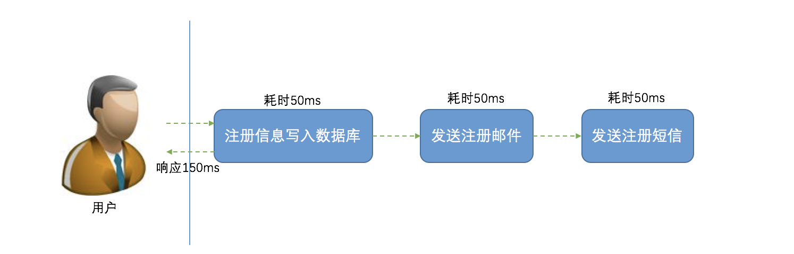
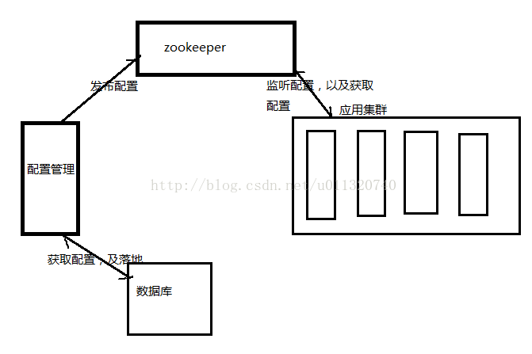

# 中间件

## 目录

- Web Server
  - Nginx
  - OpenResty
  - Tengine
  - Apache Httpd
  - Tomcat
  - Jetty
- [缓存](#缓存)
  - 本地缓存
  - 客户端缓存
  - 服务端缓存
    - Web缓存
    - [Memcached](#Memcached)
    - [Redis](#Redis)
    - Tait
- [消息队列](#消息队列)
  - [应用场景](#应用场景)
  - [消息总线](#消息总线)
  - 消息的顺序
  - [RabbitMQ](#RabbitMQ)
  - [RocketMQ](#RocketMQ)
  - ActiveMQ
  - Kafka
  - Redis消息推送
  - ZeroMQ
- 定时调度
  - 单机定时调度
  - 分布式定时调度
- RPC
  - Dubbo
  - Thrift
  - gRPC
- 数据库中间件
  - Sharding Jdbc  
- 日志系统
  - 日志搜集
- [配置中心](#配置中心)
  - 为什么需要统一配置？
  - 解决思路
  - Zookeeper方案
  - Zookeeper代码实现
- API网关

## 缓存

缓存是一种用于提高系统响应速度、改善系统运行性能的技术。对于一个服务，其性能瓶颈往往都在 DB，传统关系型存储尤甚。从磁盘中读取数据，IO 瓶颈是非常明显的，而缓存通常是基于内存的，比 DB 从磁盘读数据快两个数量级。

分布式缓存主要包含以上几大特性：

1. **高性能**：当传统数据库面临大规模数据访问时，磁盘 I/O 往往成为性能瓶颈，从而导致过高的响应延迟。分布式缓存将高速内存作为数据对象的存储介质，数据以 key/value 形式存储，理想情况下可以获得 DRAM 级的读写性能；

2. **动态扩展性**：支持弹性扩展，通过动态增加或减少节点应对变化的数据访问负载，提供可预测的性能与扩展性，同时，最大限度地提高资源利用率；

3. **高可用性**：包含数据可用性与服务可用性两方面。基于冗余机制实现高可用性，无单点失效问题，支持故障的自动发现，透明地实施故障切换，不会因服务器故障而导致缓存服务中断或数据丢失，动态扩展时自动均衡数据分区，同时保障缓存服务持续可用；

4. **易用性**：提供单一的数据与管理视图；API 接口简单且与拓扑结构无关；动态扩展或失效恢复时无需人工配置；自动选取备份节点；多数缓存系统提供了图形化的管理控制台，便于统一维护。

典型应用场景主要有：

1. 页面缓存：用来缓存 Web 页面的内容片段，包括 HTML、CSS 和图片等，多应用于社交网站等；

2. 应用对象缓存：缓存系统作为 ORM 框架的二级缓存对外提供服务，目的是减轻数据库的负载压力，加速应用访问；

3. 状态缓存：缓存包括 Session 会话状态及应用横向扩展时的状态数据等，这类数据一般是难以恢复的，对可用性要求较高，多应用于高可用集群；

4. 并行处理：通常涉及大量中间计算结果需要共享；

5. 事件处理：分布式缓存提供了针对事件流的连续查询处理技术,满足实时性需求。

分布式缓存一般被定义为一个数据集合，它将数据分布（或分区）于任意数目的集群节点上。集群中的一个具体节点负责缓存中的一部分数据，整体对外提供统一的访问接口。分布式缓存一般基于 **冗余备份机制** 实现数据高可用，又被称为内存数据网格(IMDG, In-Memory Data Grid)。在云平台飞速发展的今天，作为提升应用性能的重要手段，分布式缓存技术在工业界得到了越来越广泛的关注和研发投入 。

## Memcached

Memcached，其命名构成为 Mem + cached，Mem 代表内存，cache 意为缓存；即基于内存的缓存。

- 始于2003年，是以 LiveJournal 旗下 Danga Interactive 公司的 Brad Fitzpatric 为首开发的一款开源软件
- 适用的业务场景有：

  - 缓存动态网页，以及一些很小但被频繁访问的数据、文件；
  - 缓存 Session 数据 、临时数据；
  - 缓存计算结果和渲染后的网页模板。
- Memcached 有以下特点：
  
  - 基于内存存储，速度快，对内存的要求高，CPU 要求低，不支持持久化，宕机或重启数据将全部丢失；
  - 支持数据逐出机制，Memecache 在容量达到指定值后，将基于 LRU（Least Recently Used，最近最少被使用）算法自动删除不使用的缓存；
  - 支持老化机制，可对存储的数据设置过期时间，但过期的数据采取惰性删除机制：不主动监控过期，而是在访问的时候查看 Key 的时间戳，判断是否过期，过期则返回空；
  - 节点间相互独立，无集群模式；
  - Memcached 采用 Slab Table 方式分配内存，可有效减少内存碎片，提升回收效率；
  - 存储数据 Key 限制为250字节，Value 限制为 1MB，适用于小块数据的存储；
  - Memcached 本身并不支持分布式，因此，一般在客户端通过一致性哈希这样的分布式算法来实现 Memcached 的分布式存储。此外，也可以通过第三方软件实现分布式；
- 只支持对键值对的存储
- Memcached 使用了多线程模式
  - 开启 Memcached 服务器时使用 `-t` 参数可以指定要开启的线程数，但并不是线程数越多越好，一般设置为 CPU 核数，这样效率最高
  - Memcached 使用了 NIO 模型以提升并发行能
- 不提供持久机制
  - Memached 的设计理念就是一个单纯的缓存；但可以通过第三方软件，如 MemcacheDB 来支持持久性。
- 只支持单一的淘汰策略：LRU。可以通过 `M` 参数禁止 LRU 算法
- 采用 Slab Allocation 机制管理内存

### Memcached安装

Windows安装包：

- [32位系统 1.2.5版本](http://static.runoob.com/download/memcached-1.2.5-win32-bin.zip)
- [32位系统 1.2.6版本](http://static.runoob.com/download/memcached-1.2.6-win32-bin.zip)
- [32位系统 1.4.4版本](http://static.runoob.com/download/memcached-win32-1.4.4-14.zip)
- [64位系统 1.4.4版本](http://static.runoob.com/download/memcached-win64-1.4.4-14.zip)
- [32位系统 1.4.5版本](http://static.runoob.com/download/memcached-1.4.5-x86.zip)
- [64位系统 1.4.5版本](http://static.runoob.com/download/memcached-1.4.5-amd64.zip)

memcached >= 1.4.5 版本安装

1、解压下载的安装包到指定目录。  
2、在 memcached1.4.5 版本之后，memcached 不能作为服务来运行，需要使用任务计划中来开启一个普通的进程，在 window 启动时设置 memcached自动执行。

我们使用管理员身份执行以下命令将 memcached 添加来任务计划表中：

```bat
schtasks /create /sc onstart /tn memcached /tr "'D:\memcached-amd64\memcached.exe' -m 512"
```

>注意：  
>1、你需要使用真实的路径替代 D:\memcached-amd64\memcached.exe。  
>2、-m 512 意思是设置 memcached 最大的缓存配置为512M。  
>3、我们可以通过使用 "D:\memcached-amd64\memcached.exe -h" 命令查看更多的参数配置。

3、如果需要删除 memcached 的任务计划可以执行以下命令：

```bat
schtasks /delete /tn memcached
```

[Memcached三种客户端的使用](https://www.jianshu.com/p/8c8432255e6f)

## Redis

Redis: Remote Dictionary Server，属于 NoSQL 数据库

- 作者：来自意大利西西里岛的 Salvatore Sanfilippo，Github地址：[http://github.com/antirez](http://github.com/antirez)。
- 使用 ANSI C 语言编写，最新版本（4.0.10）代码规模7.6万行。
- 目前，在所有可实现分布式缓存的开源软件中，Redis 应用最为广泛，开源社区也最为活跃，开源客户端支持语言也最为丰富。
- 可用作 **数据库**、**高速缓存**、**锁** 和 **消息队列**
- 支持字符串、哈希表、列表、集合、有序集合、位图、HyperLogLogs 等数据类型
- 内置复制、Lua 脚本、老化逐出、事务以及不同级别磁盘持久化功能
- Redis 还支持 Sentinel 和 Cluster（从3.0开始）等高可用集群方案
- Redis 作为缓存的常见业务场景有：
  1. 缓存热点数据，减轻数据库负载；
  2. 基于 List 结构显示最新的项目列表；
  3. 基于 Sorted Set 来做排行榜，取 Top N；
  4. 基于 Set 来做 uniq 操作，如页面访问者排重；
  5. 基于 Hset 做单 Key 下多属性的项目，例如商品的基本信息、库存、价格等设置成多属性。
- Redis 特点
  - Redis 不仅仅支持简单的 key-value 类型的数据，同时还提供 list，set，zset，hash 等数据结构的存储。
  - Redis 支持数据的持久化，可以将内存中的数据保存在磁盘中，重启的时候可以再次加载进行使用。
  - Redis 支持数据的备份，即 master-slave 模式的数据备份。
  - Redis 主进程是 <b style="color:green">单线程</b> 工作，因此，Redis 的所有操作都是原子性的。意思就是要么成功执行要么失败完全不执行。单个操作是原子性的。多个操作也支持事务，即原子性，通过 `MULTI` 和 `EXEC` 指令包起来。
  - 性能极高 – Redis能读的速度是110000次/s，写的速度是81000次/s，此外，Key 和 Value 的大小限制均为 512M，这阈值相当可观。
  - 丰富的特性 – Redis 还支持 publish/subscribe，通知，key 过期等等特性。
- [详细说明文档](../Database/3.1_Redis.md)

## Tait

## 消息队列

在企业应用系统领域，会面对不同系统之间的通信集成与整合，尤其当面临 **异构系统** 时，这种分布式的调用与通信变得越发重要。其次，系统中一般会有很多对实时性要求不高的但是执行起来比较较耗时的地方，比如发送短信，邮件提醒，更新文章阅读计数，记录用户操作日志等等，如果实时处理的话，在用户访问量比较大的情况下，对系统压力比较大。

面对这些问题，我们一般会将这些请求，放在 **消息队列MQ** 中处理；异构系统之间使用消息进行通讯。

MQ全称为Message Queue, 消息队列（MQ）是一种应用程序对应用程序的通信方法。应用程序通过读写出入队列的消息（针对应用程序的数据）来通信，而无需专用连接来链接它们。

**消息传递** 指的是程序之间通过在消息中发送数据进行通信，而不是通过直接调用彼此来通信，直接调用通常是用于诸如 **远程过程调用** 的技术。排队指的是应用程序通过队列来通信。队列的使用除去了接收和发送应用程序同时执行的要求。

MQ 是 **消费-生产者模型** 的一个典型的代表，一端往消息队列中不断写入消息，而另一端则可以读取或者订阅队列中的消息。

**消息传递** 相较 **文件传递** 与 **远程过程调用(RPC)** 而言，似乎更胜一筹，因为它具有更好的平台无关性，并能够很好地支持并发与异步调用。

总之，**消息队列** 在 构建分布式系统 和 提高系统的可扩展性和响应性 方面有着很重要的作用。

## 应用场景

### 1. 异步处理

支持异步通信协议，消息的发送者将消息发送到消息队列后可以立即返回，不用等待接收者的响应。消息会被保存在队列中，直到被接收者取出。消息的发送与处理是完全异步的。

以用户注册为例：




### 2. 应用解耦

以电商 IT 架构为例，在传统紧耦合订单场景里，客户在电商网站下订单，订单系统接收到请求后，立即调用库存系统接口，库存减一，如下图所示：

上述模式存在巨大风险：

1. 假如库存系统无法访问（升级、业务变更、故障等），则订单减库存将失败，从而导致订单失败；
2. 短时间内大量的请求，频繁查询库存，修改库存，库存系统负载极大。

我们引入消息队列，解除强耦合性，处理流程又会怎样呢？

订单系统中，用户下单后，订单系统完成持久化处理，将消息写入消息队列，返回用户订单下单成功，此时客户可以认为下单成功。消息队列提供异步的通信协议，消息的发送者将消息发送到消息队列后可以立即返回，不用等待接收者的响应。消息会被保存在队列中，直到被接收者取出。

库存系统中，从消息队列中获取下单信息，库存系统根据下单信息进行库存操作。


### 3. 流量削锋

像双11秒杀、预约抢购等活动，通常会出现流量暴增，当外部请求超过系统处理能力时，如果系统没有做相应保护，可能因不堪重负而挂掉。

这时，我们可以引入消息队列，缓解短时间内高流量压力：

1. 用户的秒杀请求，服务器接收后，首先写入消息队列，然后返回成功。假如消息队列长度超过最大数量，则直接抛弃用户请求或跳转到失败页面；
2. 秒杀业务根据消息队列中的请求信息，再做后续处理（根据数据库实际的select、insert、update 能力处理注册、预约申请）。


### 4. 消息通讯

消息通讯很好理解，以微信群聊为例：

1. A 通过客户端发送消息到群里，服务端将消息写入消息队列；
2. 消息队列，负责消息数据的接收，存储和转发；
3. B 通过客户端查看群消息，订阅并消费消息队列中的信息。

## 消息总线

## RabbitMQ

RabbitMQ是一个在AMQP基础上完整的，可复用的企业消息系统。他遵循Mozilla Public License开源协议。

### RabbitMQ安装

1. 由于RabbitMQ使用Erlang语言编写，所以先[安装Erlang语言运行环境](https://www.cnblogs.com/longlongogo/p/6479424.html)。

   >（1）下载地址：[http://www.erlang.org/downloads](http://www.erlang.org/downloads)。  
   >Erlang(['ə:læŋ])是一种通用的面向并发的编程语言，它由瑞典电信设备制造商爱立信所辖的CS-Lab开发，目的是创造一种可以应对大规模并发活动的编程语言和运行环境。  
   >使用Erlang来编写分布式应用要简单的多，因为它的分布式机制是透明的：对于程序来说并不知道自己是在分布式运行。Erlang运行时环境是一个虚拟机，有点像Java虚拟机，这样代码一经编译，同样可以随处运行。它的运行时系统甚至允许代码在不被中断 的情况下更新。另外如果需要更高效的话，字节代码也可以编译成本地代码运行。  
   >
   >（2）设置环境变量：  
   >手动编辑"path"加入路径，示例：`C:\Program Files\erl8.2\bin`
   >
   >（3）检查Erlang是否安装成功  
   >打开cmd，输入 `erl` 后回车查看信息

2. 下载安装[RabbitMQ](http://www.rabbitmq.com/)

   >使 RabbitMQ 以 Windows Service 的方式在后台运行：打开 cmd 切换到 sbin 目录下执行：

   ```sh
   rabbitmq-service install
   rabbitmq-service enable
   rabbitmq-service start
   ```

   >查看状态：`rabbitmqctl status`  
   >假如显示node没有连接上，需要到C:\Windows目录下，将.erlang.cookie文件，拷贝到用户目录下 C:\Users\{用户名}，这是Erlang的Cookie文件，允许与Erlang进行交互。
   >
   >使用命令查看用户：`rabbitmqctl list_users`  
   >RabbitMQ会为我们创建默认的用户名guest和密码guest，guest默认拥有RabbitMQ的所有权限。
   >
   >一般的，我们需要新建一个我们自己的用户，设置密码，并授予权限，并将其设置为管理员，可以使用下面的命令来执行这一操作：

   ```sh
   rabbitmqctl  add_user  JC JayChou  # 创建用户JC密码为JayChou
   rabbitmqctl  set_permissions  JC ".*"  ".*"  ".*"  # 赋予JC读写所有消息队列的权限
   rabbitmqctl  set_user_tags JC administrator  # 分配用户组

   # 修改JC密码为123：
   rabbitmqctl change_password JC  123
   # 删除用户JC：
   rabbitmqctl delete_user  JC
   # 也可以开启rabbitmq_management插件，在web界面查看和管理RabbitMQ服务
   rabbitmq-plugins enable rabbitmq_management
   ```

   现在，在浏览器中输入 `http://server-name:15672/` server-name换成机器地址或者域名，如果是本地的，直接用localhost（RabbitMQ 3.0之前版本端口号为55672）在输入之后，弹出登录界面，使用我们之前创建的用户登录。在该界面上可以看到当前RabbitMQServer的所有状态。

***CentOS 7 安装 RabbitMQ***

1. 添加 Erlang 源：`vim /etc/yum.repos.d/rabbitmq-erlang.repo`，文件中添加如下内容保存：

   ```ini
   [rabbitmq-erlang]
   name=rabbitmq-erlang
   baseurl=https://dl.bintray.com/rabbitmq/rpm/erlang/20/el/7
   gpgcheck=1
   gpgkey=https://dl.bintray.com/rabbitmq/Keys/rabbitmq-release-signing-key.asc
   repo_gpgcheck=0
   enabled=1
   ```

2. 新建目录：`mkdir /usr/local/software`
3. 下载 RabbitMQ rpm 安装文件：`wget https://dl.bintray.com/rabbitmq/all/rabbitmq-server/3.7.7/rabbitmq-server-3.7.7-1.el7.noarch.rpm`
4. 安装 RabbitMQ Server：`yum install -y rabbitmq-server-3.7.7-1.el7.noarch.rpm`
5. 安装 RabbitMQ Web 管理界面并启动 RabbitMQ Server：

   ```sh
   rabbitmq-plugins enable rabbitmq_management
   systemctl start rabbitmq-server
   ```

6. 由于 RabbitMQ 默认用户 Guest 只能访问安装在 RabbitMQ 本机上的 Web 管理页面，因此当 RabbitMQ 安装在 Linux 服务器上时，需要做如下操作才能在别的机器上访问其 Web管理页面：

   - 添加用户：`rabbitmqctl add_user root 123456`，其中 root 表示新添加用户名，123456 表示登录密码；
   - 赋予用户权限：`rabbitmqctl set_permissions -p "/" root '.*' '.*' '.*'`；
   - 赋予用户角色：`rabbitmqctl set_user_tags root administrator`；
   - 查看 RabbitMQ 用户：`rabbitmqctl list_users`。

7. 访问：`http://localhost:15672`，得到 RabbitMQ Web 管理页面

   此时，RabbitMQ 已经安装成功。

### RabbitMQ概念说明

RabbitMQ是一个消息代理。他从消息生产者(producers)那里接收消息，然后把消息送给消息消费者(consumer)在发送和接受之间，他能够根据设置的规则进行路由，缓存和持久化。

一般提到RabbitMQ和消息，都用到一些专有名词。

- 生产(Producing)意思就是发送。发送消息的程序就是一个生产者(producer)。我们一般用"P"来表示
- 队列(queue)就是邮箱的名称。消息通过你的应用程序和RabbitMQ进行传输，它们只能存储在队列(queue)中。队列(queue)容量没有限制，你要存储多少消息都可以——基本上是一个无限的缓冲区。多个生产者(producers)能够把消息发送给同一个队列，同样，多个消费者(consumers)也能从同一个队列(queue)中获取数据。
- 消费(Consuming)和获取消息是一样的意思。一个消费者(consumer)就是一个等待获取消息的程序。我们把它称作"C"。

RabbitMQ 的重要概念有以下几个：

- Broker：接收消息，分发消息应用；
- Exchange：消息交换机；指定消息按照什么规则路由到哪个队列 Queue；
- Queue：消息队列，存储消息的载体；
- Binding：Exchange 和 Queue 之间的虚拟连接；Binding 中可以包含 RoutingKey，其信息被保存到 Exchange 中的查询表中，作为 Message 的分发依据；
- RoutingKey：路由关键字，Exchange 根据 RoutingKey 将消息投递到对应的队列中；
- Vhost：虚拟主机，一个 Broker 可以有多个虚拟主机，用作不同用户的权限分离；一个虚拟主机持有一组 Exchange、Queue 和 Binding；
- Producer：消息生产者，主要将消息投递到对应的 Exchange 上面；
- Consumer：消息消费者，消息的接收者，一般是独立的程序；
- Channel：消息通道，也称信道。在客户端的每个连接里可以建立多个 Channel，每个 Channel 代表一个会话任务。

## RocketMQ

## 配置中心

### 为什么需要统一配置

做项目时用到的配置比如数据库连接等最简单的方式是写死在项目里，如果需要更改，那么就通过修改配置文件然后再投产上去。问题来了，如果是集群呢，有100台机器，这时候做修改就太不切实际了；我们需要用统一配置管理。

### 解决思路

1. 把公共配置抽取出来
2. 对公共配置进行维护
3. 修改公共配置后应用不需要重新部署

### Zookeeper方案



1. 公共配置抽取存放于zookeeper中并落地数据库
2. 对公共配置修改后发布到zookeeper中并落地数据库
3. 对应用开启配置实时监听，zookeeper配置文件一旦被修改，应用可实时监听到并获取

### Zookeeper代码实现
