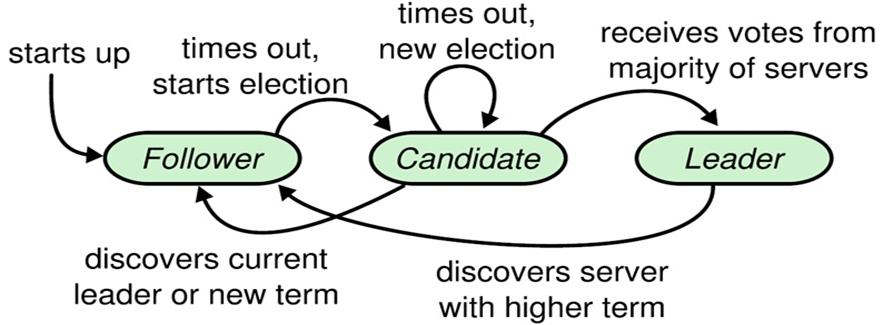

# 中间件

## 目录

- Web Server
  - Nginx
  - OpenResty
  - Tengine
  - Apache Httpd
  - Tomcat
  - Jetty
- [缓存](#缓存)
  - 本地缓存
  - 客户端缓存
  - 服务端缓存
    - Web缓存
    - [Memcached](#Memcached)
    - [Redis](#Redis)
    - Tait
- [消息队列](#消息队列)
  - [应用场景](#应用场景)
  - [消息总线](#消息总线)
  - 消息的顺序
  - [RabbitMQ](#RabbitMQ)
  - [RocketMQ](#RocketMQ)
  - [ActiveMQ](#ActiveMQ)
  - [Kafka](#Kafka)
  - Redis消息推送
  - ZeroMQ
  - [消息队列选型](#消息队列选型)
- 定时调度
  - 单机定时调度
  - 分布式定时调度
- RPC
  - Dubbo
  - Thrift
  - gRPC
- 数据库中间件
  - Sharding Jdbc
  - [Mycat](#Mycat)
- 日志系统
  - 日志搜集
- [配置中心](#配置中心)
  - [基于zookeeper实现统一配置管理](#基于zookeeper实现统一配置管理)
- 服务注册中心
  - [Eureka](#Eureka)
  - [Zookeeper](#Zookeeper)
  - [Consul](#Consul)
  - [服务注册中心选型](#服务注册中心选型)
- [参考](#参考)

## 消息队列

## RocketMQ

RocketMQ 由阿里研发团队开发的分布式队列，侧重于消息的顺序投递，具有高吞吐量、可靠性等特征。RocketMQ 于 2013 年开源，2016 年捐赠给 Apache 软件基金会，并于 2017 年 9 月成为 Apache 基金会的顶级项目。

### RocketMQ 简介

RocketMQ 用 Java 语言实现，在设计时参考了 Kafka，并做出了自己的改进，在消息可靠性上比 Kafka 更好，目前[最新版本](http://rocketmq.apache.org/)为 4.3.1。RocketMQ 已经被业界多个大型互联网公司采用。

在阿里内部，RocketMQ 很好地服务了集团大大小小上千个应用，在每年的双十一当天，更有不可思议的万亿级消息通过 RocketMQ 流转（在 2017 年的双 11 当天，整个阿里巴巴集团通过 RocketMQ 流转的线上消息达到了万亿级，峰值 TPS 达到 5600 万），在阿里大中台策略上发挥着举足轻重的作用。

### RocketMQ 特点

RcoketMQ 是一款低延迟、高可靠、可伸缩、易于使用的消息中间件。具有以下特性：

- 支持发布/订阅（Pub/Sub）和点对点（P2P）消息模型；
- 队列中有着可靠的先进先出（FIFO）和严格的顺序传递；
- 支持拉（Pull）和推（Push）两种消息模式；
- 单一队列百万消息的堆积能力；
- 支持多种消息协议，如 JMS、MQTT 等；
- 分布式高可用的部署架构，满足至少一次消息传递语义；
- 提供 Docker 镜像用于隔离测试和云集群部署；
- 提供配置、指标和监控等功能丰富的 Dashboard。

### RocketMQ 架构

RocketMQ 是一个具有高性能、高可靠、低延迟、分布式的万亿级容量，且可伸缩的分布式消息和流平台。它由 Name Servers、Brokers、 Producers 和 Consumers 四个部分组成。其架构如下图所示（取自[官网](http://rocketmq.apache.org/docs/rmq-arc/)）。


**NameServer 集群：**

NameServer 是一个功能齐全的服务器，其角色类似 Kafka 中的 ZooKeeper，支持 Broker 的动态注册与发现。主要包括两个功能：

- Broker 管理。NameServer 接受 Broker 集群的注册信息并且保存下来作为路由信息的基本数据。然后提供心跳检测机制，检查 Broker 是否还存活。
- 路由信息管理。每个 NameServer 将保存关于 Broker 集群的整个路由信息和用于客户端查询的队列信息。然后 Producer 和 Conumser 通过 NameServer 就可以知道整个 Broker 集群的路由信息，从而进行消息的投递和消费。

NameServer 通常也是集群的方式部署，各实例间相互不进行信息通讯。Broker 向每一台 NameServer 注册自己的路由信息，所以每一个 NameServer 实例上面都保存一份完整的路由信息。当某个 NameServer 因某种原因下线，Broker 仍然可以向其它 NameServer 同步其路由信息，Produce、Consumer 仍然可以动态感知 Broker 的路由信息。

**Broker 集群：**

Broker 主要负责消息的存储、投递、查询以及服务高可用保证。为了实现这些功能 Broker 包含了以下几个重要子模块。

- Remoting Module：整个 Broker 的实体，负责处理来自 Clients 端的请求；
- Client Manager：负责管理客户端（Producer、Consumer）和 Consumer 的 Topic 订阅信息；
- Store Service：提供方便简单的 API 接口处理消息存储到物理硬盘和查询功能；
- HA Service：高可用服务，提供 Master Broker 和 Slave Broker 之间的数据同步功能；
- Index Service：根据特定的 Message Key 对投递到 Broker 的消息进行索引服务，以提供消息的快速查询。

**Producer 集群：**

充当消息生产者的角色，支持分布式集群方式部署。Producers 通过 MQ 的负载均衡模块选择相应的 Broker 集群队列进行消息投递。投递的过程支持快速失败并且低延迟。

**Consumer 集群：**

充当消息消费者的角色，支持分布式集群方式部署。支持以 Push、pull 两种模式对消息进行消费。同时也支持集群方式和广播形式的消费，它提供实时消息订阅机制，可以满足大多数用户的需求。

### RocketMQ 高可用实现原理

毫无悬念，RocketMQ 实现高可用（HA）的方案仍然是基于最淳朴的“副本思想”，但与 Kafka、Redis、Etcd 采用的副本机制有所不同：RocketMQ 的 Master 和 Slave 没有 Election 机制，也没有 Failover 机制。

RocketMQ 不具备选举功能，在集群模式下，Master、Slave 角色需预先设置，是固定的；Master 与 Slave 配对是通过指定相同的 brokerName 参数来实现，Master 的 BrokerId 必须是 0，Slave 的 BrokerId 必须是大于 0 的数。一个 Master 下面可以挂载多个 Slave，同一个 Master 下的多个 Slave 通过指定不同的 BrokerId 来区分。当 Master 节点宕机后，消费者仍然可以从 Slave 消费，从而保证生产者已经 Push 的消息不丢失；由于该 Master 宕机，生产者将消息 Push 到其它 Master，不影响可用性。RocketMQ 的 Broker 有 4 种部署方式。

1. 单个 Master 模式

   除了配置简单，没什么优点。

   它的缺点是不可靠。该机器重启或宕机，将导致整个服务不可用，因此，生产环境几乎不采用这种方案。

2. 多个 Master 模式

   配置简单，性能最高，是它的优点。

   它的缺点是：可能会有少量消息丢失（异步刷盘丢失少量消息，同步刷盘不丢失），单台机器重启或宕机期间，该机器下未被消费的消息在机器恢复前不可订阅，影响消息实时性。

   >特别说明：当使用多 Master 无 Slave 的集群搭建方式时，Master 的 brokerRole 配置必须为 ASYNC_MASTER。如果配置为 SYNC_MASTER，则 producer 发送消息时，返回值的 SendStatus 会一直是 SLAVE_NOT_AVAILABLE。

3. 多 Master 多 Slave 模式：异步复制

   其优点为：即使磁盘损坏，消息丢失得非常少，消息实时性不会受影响，因为 Master 宕机后，消费者仍然可以从 Slave 消费，此过程对应用透明，不需要人工干预，性能同多 Master 模式几乎一样。

   它的缺点为：Master 宕机或磁盘损坏时会有少量消息丢失。

4. 多 Master 多 Slave 模式：同步双写

   其优点为：数据与服务都无单点，Master 宕机情况下，消息无延迟，服务可用性与数据可用性都非常高。

   其缺点为：性能比异步复制模式稍低，大约低 10% 左右，发送单个消息的 RT 会稍高，目前主宕机后，备机不能自动切换为主机，后续会支持自动切换功能。

### RocketMQ 优缺点

优点主要包括以下几点：

- 单机支持 1 万以上持久化队列；
- RocketMQ 的所有消息都是持久化的，先写入系统 Page Cache，然后刷盘，可以保证内存与磁盘都有一份数据，访问时，直接从内存读取；
- 模型简单，接口易用（JMS 的接口很多场合并不太实用）；
- 性能非常好，可以大量堆积消息在 Broker 中；
- 支持多种消费模式，包括集群消费、广播消费等；
- 各个环节分布式扩展设计，主从 HA；
- 社区较活跃，版本更新较快。

缺点主要有：

- 支持的客户端语言不多，目前是 Java、C++ 和 Go，后两种尚不成熟；
- 没有 Web 管理界面，提供了 CLI（命令行界面）管理工具来进行查询、管理和诊断各种问题；
- 没有在 MQ 核心中实现 JMS 等接口。

## ActiveMQ

ActiveMQ 是 Apache 下的一个子项目。之所以把它放在第二位介绍，是因为它官网上的说明：

>Apache ActiveMQ is the most popular and powerful open source messaging and Integration Patterns server.

居然没有“之一”，不太谦虚呀，放在第二位，以示“诫勉”。

### ActiveMQ 简介

ActiveMQ 由 Apache 出品，据[官网](http://activemq.apache.org/)介绍，它是最流行和最强大的开源消息总线。ActiveMQ 是一个完全支持 JMS1.1 和 J2EE 1.4 规范的 JMS Provider 实现，非常快速，支持多种语言的客户端和协议，而且可以非常容易地嵌入到企业的应用环境中，并有许多高级功能。

ActiveMQ 基于 Java 语言开发，目前最新版本为 5.1.5.6。

### ActiveMQ 特点

ActiveMQ 的特点，官网在 Features 一栏中做了非常详细的说明，我做了下翻译，如下：

- 支持多种语言和协议编写客户端。语言包括 Java、C、C++、C#、Ruby、Perl、Python、PHP。应用协议包括 OpenWire、Stomp REST、WS Notification、XMPP、AMQP；
- 完全支持 JMS1.1 和 J2EE 1.4 规范（持久化、XA 消息、事务)；
- 完全支持 JMS 客户端和消息代理中的企业集成模式；
- 支持许多高级特性，例如消息组、虚拟目的地、通配符和复合目的地；
- 支持 Spring，ActiveMQ 可以很容易地嵌入 Spring 应用程序中，并使用 Spring 的 XML 配置机制进行配置；
- 通过了常见 J2EE 服务器（如 Geronimo、JBoss4、GlassFish、WebLogic）的测试，其中通过 JCA 1.5 Resource Adaptors 的配置，可以让 ActiveMQ 自动部署到任何兼容 J2EE 1.4 商业服务器上；
- 支持多种传输协议，如 VM、TCP、SSL、NIO、UDP、Multicast、JGroups 以及 JXTA；
- 支持通过 JDBC 和 Journal 提供高速的消息持久化；
- 从设计上保证了高性能的集群，客户端-服务器，点对点；
- REST API 为消息提供技术无关和基于语言的 Web API；
- AJAX 允许使用纯 DHTML 实现 Web 流对 Web 浏览器的支持，允许 Web 浏览器成为消息传递结构的一部分；
- 获得 CXF 和 Axes 的支持，使得 ActiveMQ 可以很容易地嵌入 Web 服务栈中的任何一个，以提供可靠的消息传递；
- 很容易调用内嵌 JMS Provider，进行测试。

### ActiveMQ 架构

ActiveMQ 的主体架构如下图所示：


- **传输协议**：消息之间的传递，无疑需要协议进行沟通，启动一个 ActiveMQ 便打开一个监听端口。ActiveMQ 提供了广泛的连接模式，主要包括 SSL、STOMP、XMPP。ActiveMQ 默认的使用协议为 OpenWire，端口号为 61616。
- **通信方式**：ActiveMQ 有两种通信方式，Point-to-Point Model（点对点模式），Publish/Subscribe Model（发布/订阅模式），其中在 Publich/Subscribe 模式下又有持久化订阅和非持久化订阅两种消息处理方式。
- **消息存储**：在实际应用中，重要的消息通常需要持久化到数据库或文件系统中，确保服务器崩溃时，信息不会丢失。
- **Cluster（集群）**：最常见到集群方式包括 Network of Brokers 和 Master Slave。
- **Monitor（监控）**：ActiveMQ 一般由 JMX 进行监控。

默认配置下的 ActiveMQ 只适合学习而不适用于实际生产环境，ActiveMQ 的性能需要通过配置挖掘，其性能提高包括代码级性能、规则性能、存储性能、网络性能以及多节点协同方法（集群方案），所以我们优化 ActiveMQ 的中心思路也是这样的：

1. 优化 ActiveMQ 单个节点性能，包括 NIO 模型选择和存储选择。
2. 配置 ActiveMQ 集群（ActiveMQ 的高性能和高可用需要通过集群表现出来）。

在生产环境中，ActiveMQ 集群的部署方式主要有下面两种。

- Master Slave 模式：实现高可用，当主服务器宕机时，备用服务器可以升主，以保证服务的继续。
- Broker Clusters 模式：实现负载均衡，多个 Broker 之间同步消息，以达到服务器负载的可能。

### ActiveMQ 高可用方案

在生产环境中，高可用（High Availability，HA）可谓 “刚需”， ActiveMQ 的高可用性架构基于 Master/Slave 模型。ActiveMQ 总共提供了四种配置方案来配置 HA，其中 Shared Nothing Master/Slave 在 5.8 版本之后不再使用了，并在 ActiveMQ 5.9 版本中引入了基于 Zookeeper 的 Replicated LevelDB Store HA 方案。


关于几种 HA 方案的详细介绍，读者可查看[官网说明](http://activemq.apache.org/masterslave.html)，在此，我仅做简单介绍。

#### 方案一：Shared Nothing Master/Slave

这是一种最简单最典型的 Master-Slave 模式，Master 与 Slave 有各自的存储系统，不共享任何数据。“Shared Nothing” 模式有很多局限性，存在丢失消息、“双主”等问题。目前，在要求严格的生产环境中几乎没有应用，是一种趋于淘汰的方案，因此，本文就不作介绍了。

#### 方案二：Shared Storage Master/Slave

这是很常用的一种架构。“共享存储”意味着 Master 与 Slave 之间的数据是共享的。为了实现数据共享，有两种方式：

1. Shared Database Master/Slave
2. Shared File system Master/Slave

（1）Shared File System Master/Slaves

这是基于共享文件系统的 Master/Slaves 模式。此处所谓的“共享文件系统”目前只能是基于 POSIX 接口可以访问的文件系统，比如本地文件系统或者 SAN 分布式共享文件系统（如 glusterFS)。对于 Broker 而言，启动时将会首先获取存储引擎的文件锁，如果获取成功才能继续初始化 transportConnector，否则它将一直尝试获取锁（tryLock），这对于共享文件系统而言，需要严格确保任何时候只能有一个进程获取排他锁。如果你选择的 SAN 文件系统不能保证此条件，那么将不能作为 Master/Slavers 的共享存储引擎。

“Shared File System”这种方式是最常用的模式，架构简单，可靠实用。我们只需要一个 SAN 文件系统即可。

（2）JDBC Store Master/Slaves

显而易见，数据存储引擎为 Database，ActiveMQ 通过 JDBC 方式与 Database 交互，排他锁使用 Database 的表级排他锁。JDBC Store 相对于日志文件而言，通常被认为是低效的，尽管数据的可见性较好，但是 Database 的扩容能力非常弱，无法良好地适应高并发、大数据情况（严格来说，单组 M-S 架构是无法支持大数据的），况且 ActiveMQ 的消息通常存储时间较短，频繁地写入，频繁地删除，都是性能的影响点。我们通常在研究 ActiveMQ 存储原理时使用 JDBC Store，或者在对数据一致性（可靠性、可见性）要求较高的中小型应用环境中使用，比如订单系统中交易流程支撑系统等。但由于 JDBC 架构实施简便，易于管理，我们仍然倾向于首选这种方式。

在使用 JDBC Store 之前，必须有一个稳定的 Database，且为 AcitveMQ 中的链接用户授权“创建表”和普通 CRUD 的权限。Master 与 Slave 中的配置文件基本一样，开发者需要注意 brokerName 和 brokerId 全局不可重复。此外还需要把相应的 jdbc-connector 的 Jar 包复制到 ${acitvemq}/lib/optional 目录下。

#### 方案三： Replicated LevelDB Store

基于复制的 LevelDB Store，是 ActiveMQ 最新的 HA 方案，在 5.9+ 版本中获得支持。相较于方案二中的两种“Shared Storage”模式，本方案在存储和通讯机制上，更符合“Master-Slave”模型。

“Replicated LevelDB”同样允许有多个 Slaves，而且 Slaves 的个数有了约束性的限制，这归结于其使用 ZooKeeper 选举 Master。要进行选举，则需要多数派的“参与者”。因为 Replicated LevelDB Store 中有多个 Broker，从多个 Broker 中选举出一个成为 Master，其他的则成为 Slave。只有 Master 接收 Client 的连接，Slave 负责连接到 Master，并接收（同步方式、异步方式）Master 上的数据。每个 Broker 实例将消息数据保存本地（类似于“Shared Nothing”），它们之间并不共享任何数据，因此，某种意义上把“Replicated LevelDB”归类为“Shared Storage”并不妥当。

特别说明：ActiveMQ 官网警告，LevelDB 不再作为推荐的存储方案，取而代之的是 KahaDB。

### ActiveMQ HA 方案之 Network Bridges 模式

在上节中介绍的几种 HA 方案，本质上都只有一个 Master 节点，无法满足高并发、大吞吐量的商用场景，因此，ActiveMQ 官方推出了 “网桥” 架构模式，即真正的“分布式消息队列”。该模式可应对大规模 Clients、高密度的消息增量的场景；它以集群的模式，承载较大数据量的应用。


如上图所示，集群由多个子 Groups 构成，每个 Group 为 M-S 模式、共享存储；多个 Groups 之间基于“Network Connector”建立连接（Master-Slave 协议），通常为双向连接，所有的 Groups 之间彼此相连，Groups 之间形成“订阅”关系，比如 G2 在逻辑上为 G1 的订阅者（订阅的策略是根据各个 Broker 上消费者的 Destination 列表进行分类），消息的转发原理也基于此。对于 Client 而言，仍然支持 Failover，Failover 协议中可以包含集群中“多数派”的节点地址。

Topic 订阅者的消息，将会在所有 Group 中复制存储，对于 Queue 的消息，将会在 Brokers 之间转发，并最终到达 Consumer 所在的节点。

Producers 和 Consumers 可以与任何 Group 中的 Master 建立连接并进行消息通信，当 Brokers 集群拓扑变化时，Producers 或 Consumers 的个数变化时，将会动态平衡 Clients 的连接位置。Brokers 之间通过 "Advisory" 机制来同步 Clients 的连接信息，比如新的 Consumers 加入，Broker 将会发送 Advisory 消息（内部的通道）通知其他 Brokers。

集群模式提供了较好的可用性担保能力，在某些特性上或许需要权衡，比如 Queue 消息的有序性将会打破，因为同一个 Queue 的多个 Consumer 可能位于不同的 Group 上，如果某个 Group 实现，那么保存在其上的消息只有当其恢复后才能对 Clients 可见。

“网络转发桥”集群模式，构建复杂，维护成本高，可以在生产环境中使用。

### ActiveMQ 优缺点

优点主要有以下几点：

- 跨平台（Java 编写与平台无关，ActiveMQ 几乎可以运行在任何 JVM 上)；
- 可以使用 JDBC，将数据持久化到数据库。虽然使用 JDBC 会降低 ActiveMQ 的性能，但数据库一直都是开发人员最熟悉的存储介质。将消息存到数据库，看得见摸得着。而且公司有专门的 DBA 去对数据库进行调优，主从分离；
- 支持 JMS 的统一接口；
- 支持自动重连；
- 有安全机制：支持基于 Shiro、JAAS 等多种安全配置机制，可以对 Queue/Topic 进行认证和授权；
- 拥有完善的监控体系，包括 Web Console、JMX、Shell 命令行，以及 Jolokia 的 REST API；
- 界面友善：提供的 Web Console 可以满足大部分需求，此外，还有很多第三方组件可以使用，如 Hawtio。

其缺点主要有以下几点：

- 社区活跃度较低，更新慢，增加维护成本；
- 网络资料显示，ActiveMQ 存在一些莫名其妙的问题，会丢失消息；
- 目前，官方将重心放到 ActiveMQ 6.0 下一代产品 Apollo 上，对 5.x 的维护较少；
- 不适合用于上千个队列的应用场景。

## Kafka

在分布式消息队列的江湖里，Kafka 凭借其优秀的性能占据重要一席。它最初由 LinkedIn 公司开发，Linkedin 于 2010 年贡献给了 Apache基金会，之后成为顶级开源项目。

[官网](http://kafka.apache.org/intro)定义：

>Apache Kafka is a distributed streaming platform.

Kafka 作为流平台具有以下三种能力：

1. 发布和订阅记录流，类似于消息队列或企业消息系统；
2. 具有容错能力，且可以持久化的方式存储记录流；
3. 当记录流产生时（发生时），可及时对其进行处理。

Kafka 适用于两类应用：

1. 建立实时流数据管道，在系统或应用之间可靠地获取数据；
2. 建立对数据流进行转换或反应的实时流应用程序。

kafka 包含四种核心 API。

1. Producer API：基于该 API，应用程序可以将记录流发布到一个或多个 Kafka 主题（Topics）；
2. Consumer API：基于该 API，应用程序可以订阅一个或多个主题，并处理主题对应的记录流；
3. Streams API：基于该 API，应用程序可以充当流处理器，从一个或多个主题消费输入流，并生成输出流输出一个或多个主题，从而有效地将输入流转换为输出流；
4. Connector API：允许构建和运行将 Kafka 主题连接到现有应用程序或数据系统的可重用生产者或消费者。例如，关系数据库的连接器可能会捕获表的每一个更改。

### Kafka 特点

作为一种高吞吐量的分布式发布订阅消息系统，Kafka 具有如下特性：

- 快速持久化，可以在 O(1) 的系统开销下进行消息持久化；
- 高吞吐，在一台普通的服务器上可以达到 10W/s 的吞吐速率；
- 完全的分布式系统，Broker、Producer、Consumer 都原生自动支持分布式，自动实现负载均衡；
- 支持同步和异步复制两种 HA；
- 支持数据批量发送和拉取；
- Zero-Copy，减少 IO 操作步骤；
- 数据迁移、扩容对用户透明；
- 无需停机即可扩展机器；
- 其他特性还包括严格的消息顺序、丰富的消息拉取模型、高效订阅者水平扩展、实时的消息订阅、亿级的消息堆积能力、定期删除机制。

### Kafka 部署环境

**操作系统：**

- Windows：虽然 Kafka 可以在部分 Windows 系统运行，但官方并不推荐；
- Unix：支持所有版本的 Unix 系统，以及 Linux 和 Solaris系统。

**环境要求：**

- JDK：Kafka 的最新版本为 2.0.0，JDK 版本需 1.8 及以上；
- ZooKeeper：Kafka 集群依赖 ZooKeeper，需根据 Kafka 的版本选择安装对应的 ZooKeeper 版本。

### Kafka 架构


如上图所示，一个典型的 Kafka 体系架构包括若干 Producer（消息生产者），若干 Broker（Kafka 支持水平扩展，一般 Broker 数量越多，集群吞吐率越高），若干 Consumer（Group），以及一个 Zookeeper 集群。

Kafka 通过 Zookeeper 管理集群配置，选举 Leader，以及在 Consumer Group 发生变化时进行 Rebalance。Producer 使用 Push（推）模式将消息发布到 Broker，Consumer 使用 Pull（拉）模式从 Broker 订阅并消费消息。

**各个名词的解释请见下表：**


### Kafka 高可用方案

Kafka 高可用性的保障来源于其健壮的 **副本**（Replication）策略。

为了提高吞吐能力，Kafka 中每一个 Topic 分为若干 Partitions；为了保证可用性，每一个 Partition 又设置若干副本（Replicas）；为了保障数据的一致性，Zookeeper 机制得以引入。基于 Zookeeper，Kafka 为每一个 Partition 找一个节点作为 Leader，其余备份作为 Follower，只有 Leader 才能处理客户端请求，而 Follower 仅作为副本同步 Leader 的数据，如下示意图：TopicA 分为两个 Partition，每个 Partition 配置两个副本。


基于上图的架构，当 Producer Push 的消息写入 Partition（分区） 时，Leader 所在的 Broker（Kafka 节点）会将消息写入自己的分区，同时还会将此消息复制到各个 Follower，实现同步。如果某个 Follower 挂掉，Leader 会再找一个替代并同步消息；如果 Leader 挂了，将会从 Follower 中选举出一个新的 Leader 替代，继续业务，这些都是由 ZooKeeper 完成的。

### Kafka 优缺点

优点主要包括以下几点：

- 客户端语言丰富，支持 Java、.NET、PHP、Ruby、Python、Go 等多种语言；
- 性能卓越，单机写入 TPS 约在百万条/秒，消息大小 10 个字节；
- 提供完全分布式架构，并有 Replica 机制，拥有较高的可用性和可靠性，理论上支持消息无限堆积；
- 支持批量操作；
- 消费者采用 Pull 方式获取消息，消息有序，通过控制能够保证所有消息被消费且仅被消费一次；
- 有优秀的第三方 Kafka Web 管理界面 Kafka-Manager；
- 在日志领域比较成熟，被多家公司和多个开源项目使用。

缺点主要有：

- Kafka 单机超过 64 个队列/分区，Load 会发生明显的飙高现象，队列越多，Load 越高，发送消息响应时间越长；
- 使用短轮询方式，实时性取决于轮询间隔时间；
- 消费失败不支持重试；
- 支持消息顺序，但是一台代理宕机后，就会产生消息乱序；
- 社区更新较慢。

### 消息队列选型

目前，消息队列相关的开源软件非常多，这些消息队列各有所长，没有哪一种消息队列具备 “一统江湖” 的优势，某种程度上，增加了选型的难度。不像分布式缓存和分布式锁，Redis、Etcd 具备“绝对”优势，选型无需纠结。

**RocketMQ 官方评价：**

所谓实践是检验真理的唯一标准，实际应用中的表现比文字更具说服力。在 [RocketMQ 官方文档](http://rocketmq.apache.org/docs/motivation/)中，关于 RocketMQ 的研发背景是这样说的：在我们的研究中，随着使用 Queue 和 Topic 的增加，ActiveMQ IO 模块很快达到了瓶颈。我们试图通过节流、断路器或降级来解决这个问题，但效果不佳。所以我们开始关注当时流行的消息解决方案 Kafka。不幸的是，Kafka 不能满足我们的要求，特别是在低延迟和高可靠性方面。

简而言之，ActiveMQ 和 Kafka 的性能都不能满足阿里的超大规模应用场景。在此背景下，阿里自研了 RocketMQ，并捐赠给了开源社区，目前有超过 100 家企业在使用其开源版本。关于 ActiveMQ 、Kafka 以及 RocketMQ 的比较如下所示（取自 [RocketMQ 官网文档](http://rocketmq.apache.org/docs/motivation/)）：


**对比各大消息队列：**

消息队列利用高效可靠的消息传递机制进行平台无关的数据交流，并基于数据通信来进行分布式系统的集成。目前业界有很多的 MQ 产品，例如 RabbitMQ、RocketMQ、ActiveMQ、Kafka、ZeroMQ、MetaMq 等，也有直接使用数据库 Redis 充当消息队列的案例。而这些消息队列产品，各有侧重，在实际选型时，需要结合自身需求及 MQ 产品特征，综合考虑。

以下是四种消息队列的差异对比（[图片源地址](http://blog.51cto.com/caczjz/2141194?source=dra)）：


## Mycat

**什么是MyCAT？**

简单的说，MyCAT就是：

- 一个彻底开源的，面向企业应用开发的“大数据库集群”
- 支持事务、ACID、可以替代Mysql的加强版数据库
- 一个可以视为“Mysql”集群的企业级数据库，用来替代昂贵的Oracle集群
- 一个融合内存缓存技术、Nosql技术、HDFS大数据的新型SQL Server
- 结合传统数据库和新型分布式数据仓库的新一代企业级数据库产品
- 一个新颖的数据库中间件产品

MyCAT的目标是：低成本的将现有的单机数据库和应用平滑迁移到“云”端，解决数据存储和业务规模迅速增长情况下的数据瓶颈问题。

**MyCAT的关键特性：**

- 支持 SQL 92标准
- 支持 Mysql 集群，可以作为 Proxy 使用
- 支持 JDBC 连接 ORACLE、DB2、SQL Server，将其模拟为 MySQL Server 使用
- 支持 galera for mysql 集群，percona-cluster 或者 mariadb cluster，提供高可用性数据分片集群
- 自动故障切换，高可用性
- 支持读写分离，支持 Mysql 双主多从，以及一主多从的模式
- 支持全局表，数据自动分片到多个节点，用于高效表关联查询
- 支持独有的基于 E-R 关系的分片策略，实现了高效的表关联查询
- 多平台支持，部署和实施简单

**Mycat解决的问题：**

- 性能问题
- 数据库连接过多
- E-R分片难处理
- 可用性问题
- 成本和伸缩性问题


**Mycat对多数据库的支持：**


**Mycat的下载：**

- 官方网站：[http://www.mycat.org.cn/](http://www.mycat.org.cn/)
- github地址：[https://github.com/MyCATApache](https://github.com/MyCATApache)

**Mycat安装：**

- 第一步：把MyCat的压缩包上传到linux服务器
- 第二步：解压缩，得到mycat目录

  ```sh
  # windows环境下安装
  mycat.bat install
  ```

- 第三步：进入mycat/bin，启动MyCat
  
  ```sh
  # 启动命令：
  ./mycat start
  # 停止命令：
  ./mycat stop
  # 重启命令：
  ./mycat restart
  # 查看状态：
  ./mycat status
  ```

>注意：可以使用mysql的客户端直接连接mycat服务。默认服务端口为8066

### MyCAT架构


如图所示：MyCAT 使用 Mysql 的通讯协议模拟成了一个 Mysql 服务器，并建立了完整的Schema（数据库）、Table （数据表）、User(用户)的逻辑模型，并将这套逻辑模型映射到后端的存储节点DataNode（MySQL Instance）上的真实物理库中，这样一来，所有能使用 Mysql 的客户端以及编程语言都能将 MyCAT 当成是 Mysql Server 来使用，不必开发新的客户端协议。

### 分片策略

MyCAT支持水平分片与垂直分片：

- 水平分片：一个表格的数据分割到多个节点上，按照行分隔。
- 垂直分片：一个数据库中多个表格A，B，C，A存储到节点1上，B存储到节点2上，C存储到节点3上。


MyCAT 通过定义表的分片规则来实现分片，每个表格可以捆绑一个分片规则，每个分片规则指定一个分片字段并绑定一个函数，来实现动态分片算法。

1. Schema：逻辑库，与MySQL中的Database（数据库）对应，一个逻辑库中定义了所包括的Table。
2. Table：表，即物理数据库中存储的某一张表，与传统数据库不同，这里的表格需要声明其所存储的逻辑数据节点DataNode。在此可以指定表的分片规则。
3. DataNode：MyCAT的逻辑数据节点，是存放table的具体物理节点，也称之为分片节点，通过DataSource来关联到后端某个具体数据库上。DataSource：定义某个物理库的访问地址，用于捆绑到Datanode上

### 配置环境示例

1、mysql节点1环境：

```txt
操作系统版本 : centos6.4
数据库版本 : mysql-5.6
mycat版本 ：1.4 release
数据库名 : db1、db3
ip:192.168.25.134
```

2、mysql节点2环境

```txt
操作系统版本 : centos6.4
数据库版本 : mysql-5.6
mycat版本 ：1.4 release
数据库名 : db2
ip:192.168.25.166
```

MyCat安装到节点1上（需要安装jdk）

**配置schema.xml：**

Schema.xml 作为 MyCat 中重要的配置文件之一，管理着 MyCat 的逻辑库、表、分片规则、DataNode 以及DataSource。弄懂这些配置，是正确使用 MyCat 的前提。这里就一层层对该文件进行解析。

- schema 标签用于定义 MyCat 实例中的逻辑库
- Table 标签定义了 MyCat 中的逻辑表
- dataNode 标签定义了 MyCat 中的数据节点，也就是我们通常说所的数据分片。
- dataHost 标签在 mycat 逻辑库中也是作为最底层的标签存在，直接定义了具体的数据库实例、读写分离配置和心跳语句。

>注意：若是 LINUX 版本的 MYSQL，则需要设置为 Mysql 大小写不敏感，否则可能会发生表找不到的问题。

在 MySQL 的配置文件中my.ini [mysqld] 中增加一行：

```ini
lower_case_table_names = 1
```

Schema.xml配置示例：

```xml
<?xml version="1.0"?>
<!DOCTYPE mycat:schema SYSTEM "schema.dtd">
<mycat:schema xmlns:mycat="http://org.opencloudb/">
  <schema name="TESTDB" checkSQLschema="false" sqlMaxLimit="100">
    <!-- auto sharding by id (long) -->
    <table name="TB_ITEM" dataNode="dn1,dn2,dn3" rule="auto-sharding-long" />
    <table name="TB_USER" primaryKey="ID" type="global" dataNode="dn1,dn2" />
  </schema>
  <dataNode name="dn1" dataHost="localhost1" database="db1" />
  <dataNode name="dn2" dataHost="localhost2" database="db2" />
  <dataNode name="dn3" dataHost="localhost1" database="db3" />
  <dataHost name="localhost1" maxCon="1000" minCon="10" balance="0"
      writeType="0" dbType="mysql" dbDriver="native" switchType="1"  slaveThreshold="100">
    <heartbeat>select user()</heartbeat>
    <!-- can have multi write hosts -->
    <writeHost host="hostM1" url="192.168.25.134:3306" user="root" password="root">
      <!-- can have multi read hosts -->
    </writeHost>
  </dataHost>
  <dataHost name="localhost2" maxCon="1000" minCon="10" balance="0"
      writeType="0" dbType="mysql" dbDriver="native" switchType="1"  slaveThreshold="100">
    <heartbeat>select user()</heartbeat>
    <!-- can have multi write hosts -->
    <writeHost host="hostM1" url="192.168.25.166:3306" user="root" password="root">
      <!-- can have multi read hosts -->
    </writeHost>
  </dataHost>
</mycat:schema>
```

**配置server.xml：**

server.xml几乎保存了所有mycat需要的系统配置信息。最常用的是在此配置用户名、密码及权限。

```xml
<user name="test">
  <property name="password">test</property>
  <property name="schemas">TESTDB</property>
  <property name="readOnly">true</property>
</user>
```

**配置rule.xml：**

- rule.xml 里面就定义了我们对表进行拆分所涉及到的规则定义。我们可以灵活的对表使用不同的分片算法，或者对表使用相同的算法但具体的参数不同。
- 这个文件里面主要有 tableRule 和 function 这两个标签。在具体使用过程中可以按照需求添加 tableRule 和function。
- 此配置文件可以不用修改，使用默认即可。

分片测试：

- 由于配置的分片规则为 "auto-sharding-long"，所以 mycat 会根据此规则自动分片。
- 每个 datanode 中保存一定数量的数据。根据 id 进行分片
- 经测试 id 范围为：

  ```sh
  Datanode1：1~5000000
  Datanode2：5000000~10000000
  Datanode3：10000001~15000000
  ```

  当15000000以上的id插入时报错：

  ```txt
  [Err] 1064 - can't find any valid datanode :TB_ITEM -> ID -> 15000001
  ```

  此时需要添加节点了。

**Mycat读写分离：**

数据库读写分离对于大型系统或者访问量很高的互联网应用来说，是必不可少的一个重要功能。对于 MySQL 来说，标准的读写分离是主从模式，一个写节点 Master 后面跟着多个读节点，读节点的数量取决于系统的压力，通常是 1-3 个读节点的配置


Mycat 读写分离和自动切换机制，需要 mysql 的主从复制机制配合。

**Mysql的主从复制：**


主从配置需要注意的地方：

1. 主DB server和从DB server数据库的版本一致
2. 主DB server和从DB server数据库数据一致（这里就会可以把主的备份在从上还原，也可以直接将主的数据目录拷贝到从的相应数据目录）
3. 主DB server开启二进制日志，主DB server和从DB server的server_id都必须唯一

**Mysql主服务器配置：**

- 第一步：修改my.conf文件：

  在[mysqld]段下添加：

  ```ini
  binlog-do-db=db1
  binlog-ignore-db=mysql
  # 启用二进制日志
  log-bin=mysql-bin
  # 服务器唯一ID，一般取IP最后一段
  server-id=134
  ```

- 第二步：重启mysql服务：`service mysqld restart`
- 第三步：建立帐户并授权slave

  ```sh
  mysql> GRANT FILE ON *.* TO 'backup'@'%' IDENTIFIED BY '123456';
  mysql> GRANT REPLICATION SLAVE, REPLICATION CLIENT ON *.* to 'backup'@'%' identified by '123456';
  # 一般不用root帐号，"%"表示所有客户端都可能连，只要帐号，密码正确，此处可用具体客户端IP代替，如192.168.145.226，加强安全。
  
  # 刷新权限
  mysql> FLUSH PRIVILEGES;

  # 查看mysql现在有哪些用户

  mysql> select user,host from mysql.user;
  ```

- 第四步：查询master的状态
  
  ```sh
  mysql> show master status;
  ```

**Mysql从服务器配置：**

- 第一步：修改my.conf文件

  ```ini
  [mysqld]
  server-id=166
  ```

## 配置中心

### 基于zookeeper实现统一配置管理

**为什么需要统一配置？**

做项目时用到的配置比如数据库连接等最简单的方式是写死在项目里，如果需要更改，那么就通过修改配置文件然后再投产上去。问题来了，如果是集群呢，有100台机器，这时候做修改就太不切实际了；我们需要用统一配置管理。

**解决思路：**

1. 把公共配置抽取出来
2. 对公共配置进行维护
3. 修改公共配置后应用不需要重新部署

**采用Zookeeper方案：**


1. 公共配置抽取存放于zookeeper中并落地数据库
2. 对公共配置修改后发布到zookeeper中并落地数据库
3. 对应用开启配置实时监听，zookeeper配置文件一旦被修改，应用可实时监听到并获取

## Zookeeper

ZooKeeper 是一个开源的分布式协调服务，由雅虎创建，是 Google Chubby 的开源实现。

分布式应用程序可以基于 ZooKeeper 实现诸如数据发布/订阅、负载均衡、命名服务、分布式协调/通知、集群管理、Master 选举、配置维护，名字服务、分布式同步、分布式锁和分布式队列 等功能。

为了保证高可用，最好是以集群形态来部署 ZooKeeper，这样只要集群中大部分机器是可用的（能够容忍一定的机器故障），那么 ZooKeeper 本身仍然是可用的。

客户端在使用 ZooKeeper 时，需要知道集群机器列表，通过与集群中的某一台机器建立 TCP 长连接来使用服务。客户端使用这个 TCP 链接来发送请求、获取结果、获取监听事件以及发送心跳包。如果这个连接异常断开了，客户端可以连接到另外的机器上。


上图是 ZooKeeper 官方提供的架构图：

- 图中每一个 Server 代表一个安装 ZooKeeper 服务的服务器。组成 ZooKeeper 服务的服务器都会在内存中维护当前的服务器状态，并且每台服务器之间都互相保持着通信。
- 集群间通过 Zab 协议（Zookeeper AtomicBroadcast）来保持数据的一致性。
- 对于来自客户端的每个更新请求，ZooKeeper 都会分配一个全局唯一的递增编号。这个编号反应了所有事务操作的先后顺序，应用程序可以使用 ZooKeeper 这个特性来实现更高层次的同步原语。这个编号也叫做时间戳—zxid（ZooKeeper Transaction Id）。

最典型集群模式：Master/Slave 模式（主备模式）。在这种模式中，通常 Master 服务器作为主服务器提供写服务，其他的 Slave 服务器从服务器通过异步复制的方式获取 Master 服务器最新的数据提供读服务。

但是，在 ZooKeeper 中没有选择传统的 Master/Slave 概念，而是引入了Leader、Follower 和 Observer 三种角色。如下图所示：


- ZooKeeper 集群中的所有机器通过一个 Leader 选举过程来选定一台称为 "Leader" 的机器。
- Leader 既可以为客户端提供写服务又能提供读服务。除了 Leader 外，Follower 和  Observer 都只能提供读服务
- Server：Server中存在两种类型：Follower 和 Observer。其中 Follower 接受客户端的请求并返回结果（事务请求将转发给 Leader 处理），并在选举过程中参与投票；
- Observer 与 Follower 功能一致，唯一的区别在于 Observer 机器不参与 Leader 的选举过程，也不参与写操作的“过半写成功”策略，因此 Observer 机器可以在不影响写性能的情况下提升集群的读性能。
- Client：请求发起方，Server 和 Client 之间可以通过长连接的方式进行交互。如发起注册或者请求集群信息等。
- 集群间通过 Zab 协议（Zookeeper Atomic Broadcast）来保持数据的一致性。

### Zab协议

ZAB（ZooKeeper Atomic Broadcast 原子广播）协议是为分布式协调服务 ZooKeeper 专门设计的一种支持崩溃恢复的原子广播协议。在 ZooKeeper 中，主要依赖 ZAB 协议来实现分布式数据一致性，基于该协议，ZooKeeper 实现了一种主备模式的系统架构来保持集群中各个副本之间的数据一致性。ZAB 协议包括两种基本的模式，分别是崩溃恢复和消息广播。


- 当整个服务框架在启动过程中，或是当 Leader 服务器出现网络中断、崩溃退出与重启等异常情况时，ZAB 协议就会进入恢复模式并选举产生新的 Leader 服务器。
- 当选举产生了新的 Leader 服务器，同时集群中已经有过半的机器与该 Leader 服务器完成了状态同步之后，ZAB 协议就会退出恢复模式。

其中，所谓的状态同步是指数据同步，用来保证集群中存在过半的机器能够和 Leader 服务器的数据状态保持一致。当集群中已经有过半的 Follower 服务器完成了和 Leader 服务器的状态同步，那么整个服务框架就可以进人消息广播模式了。

当一台同样遵守 ZAB 协议的服务器启动后加入到集群中时，如果此时集群中已经存在一个 Leader 服务器在负责进行消息广播。那么新加入的服务器就会自觉地进人数据恢复模式：找到 Leader 所在的服务器，并与其进行数据同步，然后一起参与到消息广播流程中去。

正如上文介绍中所说的，ZooKeeper 设计成只允许唯一的一个 Leader 服务器来进行事务请求的处理。Leader 服务器在接收到客户端的事务请求后，会生成对应的事务提案并发起一轮广播协议。而如果集群中的其他机器接收到客户端的事务请求，那么这些非 Leader 服务器会首先将这个事务请求转发给 Leader 服务器。

## Consul

Consul 是 HashiCorp 公司推出的开源工具，基于 Go 语言开发的支持多数据中心分布式高可用的服务发布和注册服务软件，采用 Raft 算法保证服务的一致性，且支持健康检查。

因为通过 Golang 实现，因此具有天然可移植性（支持Linux、windows和Mac OS X）；安装包仅包含一个可执行文件，方便部署，与 Docker 等轻量级容器可无缝配合。

Consul 采用主从模式的设计，使得集群的数量可以大规模扩展，集群间通过 RPC 的方式调用（HTTP 和 DNS）。它的结构图如下所示：


- Client：作为一个代理（非微服务实例），它将转发所有的 RPC 请求到 Server 中。作为相对无状态的服务，它不持有任何注册信息。
- Server：作为一个具备扩展功能的代理，它将响应 RPC 查询、参与 Raft 选举、维护集群状态和转发查询给 Leader 等。
- Leader-Server：一个数据中心的所有 Server 都作为 Raft 节点集合的一部分。其中 Leader 将负责所有的查询和事务（如服务注册），同时这些事务也会被复制到所有其他的节点。
- Data Center：数据中心作为一个私有的，低延迟和高带宽的一个网络环境。每个数据中心会存在 Consul 集群，一般建议 Server 是 3-5 台（考虑到 Raft 算法在可用性和性能上取舍），而 Leader 只能唯一，Client 的数量没有限制，可以轻松扩展。Consul 通过 WAN 的 Gossip 协议，完成跨数据中心的同步；而且其他的产品则需要额外的开发工作来实现。

### Raft 算法

不同于 Paxos 算法直接从分布式一致性问题出发推导出来，Raft 算法则是从多副本状态机的角度提出，用于管理多副本状态机的日志复制。Raft 实现了和 Paxos 相同的功能，它将一致性分解为多个子问题：Leader 选举（Leader election）、日志同步（Log replication）、安全性（Safety）、日志压缩（Log compaction）、成员变更（Membership change）等。同时，Raft 算法使用了更强的假设来减少了需要考虑的状态，使之变的易于理解和实现。



Raft 算法将 Server 分为三种类型：Leader、Follower 和 Candidate。

- Leader 处理所有的查询和事务，并向 Follower 同步事务。
- Follower 会将所有的 RPC 查询和事务转发给 Leader 处理，它仅从 Leader 接受事务的同步。数据的一致性以 Leader 中的数据为准实现。

在节点初始启动时，节点的 Raft 状态机将处于 Follower 状态等待来来自 Leader 节点的心跳。如果在一定时间周期内没有收到 Leader 节点的心跳，节点将发起选举。

Follower 节点选举时会将自己的状态切换为 Candidate，然后向集群中其它 Follower 节点发送请求，询问其是否选举自己成为 Leader。当收到来自集群中过半数节点的接受投票后，节点即成为 Leader，开始接收 Client 的事务处理和查询并向其它的 Follower 节点同步事务。Leader 节点会定时向 Follower 发送心跳来保持其地位。

### Gossip协议

Gossip protocol 也叫 Epidemic Protocol （流行病协议），实际上它还有很多别名，比如：“流言算法”、“疫情传播算法”等。

Gossip 过程是由种子节点发起，当一个种子节点有状态需要更新到网络中的其他节点时，它会随机的选择周围几个节点散播消息，收到消息的节点也会重复该过程，直至最终网络中所有的节点都收到了消息。

这个过程可能需要一定的时间，由于不能保证某个时刻所有节点都收到消息，但是理论上最终所有节点都会收到消息，因此它是一个最终一致性协议。这个协议的作用就像其名字表示的意思一样，非常容易理解，它的方式其实在我们日常生活中也很常见，比如电脑病毒的传播，森林大火，细胞扩散等等。


为了表述清楚，我们先做一些前提设定：

1. Gossip 是周期性的散播消息，把周期限定为 1 秒
2. 被感染节点随机选择 k 个邻接节点（fan-out）散播消息，这里把 fan-out 设置为 3，每次最多往 3 个节点散播。
3. 每次散播消息都选择尚未发送过的节点进行散播
4. 收到消息的节点不再往发送节点散播，比如 A -> B，那么 B 进行散播的时候，不再发给 A。

这里一共有 16 个节点，节点 1 为初始被感染节点，通过 Gossip 过程，最终所有节点都被感染。

**Gossip 的特点（优势）：**

1）**扩展性**

网络可以允许节点的任意增加和减少，新增加的节点的状态最终会与其他节点一致。

2）**容错**

网络中任何节点的宕机和重启都不会影响 Gossip 消息的传播，Gossip 协议具有天然的分布式系统容错特性。

3）**去中心化**

Gossip 协议不要求任何中心节点，所有节点都可以是对等的，任何一个节点无需知道整个网络状况，只要网络是连通的，任意一个节点就可以把消息散播到全网。

4）**一致性收敛**

Gossip 协议中的消息会以一传十、十传百一样的指数级速度在网络中快速传播，因此系统状态的不一致可以在很快的时间内收敛到一致。消息传播速度达到了 logN。

5）**简单**

Gossip 协议的过程极其简单，实现起来几乎没有太多复杂性。

**Gossip 的缺陷：**

分布式网络中，没有一种完美的解决方案，Gossip 协议跟其他协议一样，也有一些不可避免的缺陷，主要是两个：

1）**消息的延迟**

由于 Gossip 协议中，节点只会随机向少数几个节点发送消息，消息最终是通过多个轮次的散播而到达全网的，因此使用 Gossip 协议会造成不可避免的消息延迟。不适合用在对实时性要求较高的场景下。

2）**消息冗余**

Gossip 协议规定，节点会定期随机选择周围节点发送消息，而收到消息的节点也会重复该步骤，因此就不可避免的存在消息重复发送给同一节点的情况，造成了消息的冗余，同时也增加了收到消息的节点的处理压力。而且，由于是定期发送，因此，即使收到了消息的节点还会反复收到重复消息，加重了消息的冗余。

Gossip 协议是为了解决分布式环境下监控和事件通知的瓶颈。

Gossip 协议中的每个 Agent 会利用 Gossip 协议互相检查在线状态，分担了服务器节点的心跳压力，通过 Gossip 广播的方式发送消息。所有的 Agent 都运行着 Gossip 协议。服务器节点和普通 Agent 都会加入这个 Gossip 集群，收发 Gossip 消息。

每隔一段时间，每个节点都会随机选择几个节点发送 Gossip 消息，其他节点会再次随机选择其他几个节点接力发送消息。这样一段时间过后，整个集群都能收到这条消息。基于 Raft 算法，Consul 提供强一致性的注册中心服务，但是由于 Leader 节点承担了所有的处理工作，势必加大了注册和发现的代价，降低了服务的可用性。

通过 Gossip 协议，Consul 可以很好地监控 Consul 集群的运行，同时可以方便通知各类事件，如 Leader 选择发生、Server 地址变更等。

## 服务注册中心选型

下面是这三个服务注册中心的特性对比， 没有最好的服务中心， 只有最合适的，我们可以根据项目的实际情况来进行选择：


**为什么不使用Zookeeper作为服务注册表？**

1. zookeeper在写入操作必须得到法定人数确认才能成功提交。
2. zookeeper在选举期间会停止对外服务

选Eureka理由：（[参考](https://github.com/Netflix/eureka/wiki/Understanding-Eureka-Peer-to-Peer-Communication)）

1. Eureka 客户试图与 Eureka Server 交互。如果与服务器通信时出现问题或者同一区域中不存在服务器，则客户端将故障转移到其他区域中的服务器。

2. 一旦服务器开始接收流量，服务器上执行的所有操作都将复制到服务器知道的所有对等节点。如果某个操作由于某种原因而失败，则会在下一个也会在服务器之间复制的心跳上协调该信息。

## 参考

- RocketMQ 、RabbitMQ、Kafka 以及 ActiveMQ 官方文档；
- [分布式消息队列浅析](https://www.cnblogs.com/firstdream/p/6587057.html)
- [Kafka 简介、基本原理、执行流程与使用场景](https://blog.csdn.net/xlgen157387/article/details/77266719)
- [JMS 学习（六）：ActiveMQ 的高可用性实现](https://www.cnblogs.com/hapjin/p/5663024.html)
- [MQ 入门总结（三）：ActiveMQ 的用法和实现](https://blog.csdn.net/echojson/article/details/79702829)
