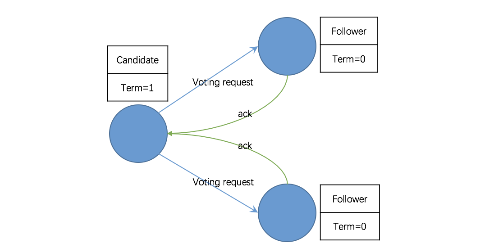
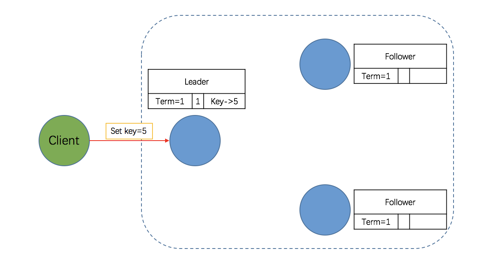

# 分布式架构

## 目录

1. 理论
   - [分布式系统特性](#分布式系统特性)
   - [分布式系统常见问题](#分布式系统常见问题)
   - [CAP理论简介](#CAP理论简介)
   - [分布式一致性算法](#分布式一致性算法)
2. 实践
   - [数据库架构](#数据库架构)
3. [部署](#部署)
4. [参考](#参考)

## 理论

关于“分布式系统”的定义，《分布式系统原理和范型》一书中是这样阐述的：**分布式系统是若干独立计算机的集合，这些计算机对于用户来说就像是单个相关系统**。

>分布式系统出现之前，软件系统都是集中式的，俗称单机系统。在很长的一段时期，单机系统通过升级硬件就能满足不断增长的性能需求，然而，随着互联网的飞速发展，高吞吐、高并发、低延迟逐渐成为“刚需”，单凭硬件升级已无能为力，分布式系统 “应需求而生”。

为何分布式系统会被广泛应用呢？原因很简单：**需求驱动**。

>说得直白点，就像开餐厅，每天供应50个人用餐，一个厨师，一个灶台就够了；倘若每天供应5000人用餐，恐怕请一个食神也搞不定吧，怎么办呢？安排100个普通厨师，100个灶台同时开火，将5000人的用餐压力分散到各个厨师，并使用员工守则对厨师进行管理。

通常，只有在单机系统完全无法满足需求的时候，我们才考虑分布式系统。因为，分布式系统提供的服务与单机系统本质是一样的，但分布式系统更为复杂，会引入很多单机系统没有的问题，为了解决这些问题又会引入更多的机制、协议，进而带来更多的问题。鉴于此，<b style="color:red">单机系统能够解决的问题，不要盲目采用分布式系统</b>。这一点很好理解：管理一个厨师很容易，管理100个厨师问题就多了。

## 分布式系统特性

- **内聚性**：内聚性是指每一个节点高度自治
- **透明性**：透明性是指系统对用户来说都是透明的，用户无法感知系统是如何实现的。
- **可扩展性**：通常有两种方式：

  - 其一，优化系统的性能或者升级硬件（Scale Up，即垂直扩展）；
  - 其二，增加计算单元（如服务器等）以扩展系统的规模（Scale Out，即水平扩展）

  究竟选择哪种扩展方式呢？**全盘考虑**。

  理想情形：当任务量增加的时候，系统的处理能力可随之增强（比如增加服务器的数量）；当任务量减少的时候，系统的处理能力可以减弱（比如减少服务器的数量），以避免资源浪费，这就是所谓的**动态伸缩**。

  >显然，垂直扩展并不具备动态伸缩的能力，因此，分布式系统通常采用的是水平扩展方式，不仅可以实现动态伸缩，还可以松耦合、提升系统的容错能力。

- **可用性**：在要求的外部资源得到保证的前提下，系统在规定的条件下和规定的时刻或时间区间内处于可执行规定功能状态的能力。

  公式：`Availability = MTBF / (MTBF + MTTR) * 100%`

  >其中，MTBF（Mean Time Between Failure）是指相邻两次故障之间的平均工作时间，MTTR（Mean Time To Repair）是指系统由故障状态转为工作状态所需修复时间的平均值。通常，用 N 个 9 来表征系统可用性，比如99.9%（3-nines Availability），99.999%（5-nines Availability）。

  

- **可靠性**：在给定的时间间隔和给定条件下，系统能正确执行其功能的概率

  >可靠性的量化指标是周期内系统平均无故障运行时间，可用性的量化指标是周期内系统无故障运行的总时间。

  示例：

  >A 系统每年因故障中断 10 次，每次恢复平均要 30 分钟；B 系统每年因故障中断 2 次，每次需 5 小时恢复。则 A 系统可用性比 B 系统高，但可靠性比 B 系统差。
  >
  >**评价可用性：A > B**
  >
  >A系统 = `(365 * 24 - 10 * 0.5) / 10 / ((365 * 24 - 10 * 0.5) / 10 + 0.5) * 100%` = 99.943%
  >
  >B系统 = `(365 * 24 - 2 * 5) / 2 / ((365 * 24 - 2 * 5) / 2 + 5)*100%` = 99.886%
  >
  >**评价可靠性：A < B**
  >
  >A系统 = `(365 * 24 - 10 * 0.5) / 10` = 875.5
  >
  >B系统 = `(365 * 24 - 2 * 5) / 2` = 4375

- **高性能**：不同的系统对性能的衡量指标不同，最常见的：**高并发**，单位时间内处理的任务越多越好；**低延迟**：每个任务的平均时间越少越好。分布式系统的设计初衷便是<b style="color:green">高性能</b>。

- **一致性**：分布式系统为了提高可用性和可靠性，一般会引入冗余（副本）。为了保证这些节点上的状态一致，分布式系统必须解决一致性问题。

  一致性有很多等级：

  一致性等级越强，对用户越友好，但会制约系统的可用性；  
  一致性等级越低，用户就需要兼容数据不一致的情况，但系统的可用性、并发性会好很多。

## 分布式系统常见问题

1、网络并没有那么可靠

- 消息丢失
- 网络分区：两个机房通信中断问题
- 消息乱序：顺序发送的消息不顺序送达
- 数据错误：丢失1个bit也会造成整个数据包的不可用。校验码机制
- 分布式系统三态：“成功”、“失败”、“超时（未知）”
  
  >如果某个节点向另一个节点发起 RPC 调用，即某个节点 A 向另一个节点 B 发送一个消息，节点 B 根据收到的消息内容完成某些操作，并将操作的结果通过另一个消息返回给节点 A，那么这个 RPC 执行的结果有三种状态：“成功”、“失败”、“超时（未知）”，称之为分布式系统的三态。
  >
  >单节点应用发送消息（发给自己）后的执行结果只存在双态：成功 或 失败。

2、节点故障无法避免：监控节点状态

## CAP理论简介

2000年由 Eric Brewer 教授在 PODC 的研讨会上提出猜想，后来 Lynch 等人进行了证明，是分布式系统领域的重要理论之一：

>在分布式环境下设计和部署系统时，有三个核心的系统需求：**Consistency（一致性）**，**Availability（可用性）** 和 **PartitionTolerance（分区容忍性）**，但<b style="color:red">三者无法在分布式系统中同时被满足，并且最多只能满足其中两个</b>

### 一致性(Consistency)

如果系统对一个写操作返回成功，那么之后的读请求都必须读到这个新数据；如果返回失败，那么所有读操作都不能读到这个数据

对调用者而言数据具有强一致性（Strong Consistency）（又叫原子性 Atomic、线性一致性 Linearizable Consistency)。

### 可用性(Availability)

用户的每个请求都能接受到一个响应，无论响应是成功或失败，即服务在任何时刻都是可用的。

这就要求系统当中不应该有单点的存在（如果服务是单节点部署，一旦节点宕机，服务便不可用了），通常可用性都是通过冗余的方式来实现的。

### 分区容忍性(PartitionTolerance)

Brewer 的定义："No set of failures less than total network failure is allowed to cause the system to respond incorrectly"，即除了整个网络出现故障外，其它的故障都不能导致整个系统无法正确响应。

>分布式系统中，节点间通过网络进行通信，然而可能因为一些故障，导致有些节点之间不连通，整个网络就分成了几块区域。数据就散布在了这些不连通的区域中，从而形成了分区。
>
>当一个数据项只在一个节点中保存时，如果分区出现，那和该节点不连通的部分将无法访问这个数据（即单点故障问题），这时的分区是无法容忍的。提高分区容忍性的办法就是将一个数据项复制到多个节点上（副本思想），在出现分区后，这一数据项就可能分布到各个区里，容忍性就提高了。
>
>然而，要把数据复制到多个节点，就会带来一致性的问题，就是多个节点上面的数据可能是不一致的。要保证一致，每次写操作都要等待全部节点写成功，而等待期间系统是不可用的，从而带来可用性的问题。总的来说，数据存在的节点越多（副本越多），分区容忍性越高，但同时需要复制、更新的数据就越多，一致性就越难保证。为了保证一致性，更新所有节点数据所需要的时间就越长，可用性就会降低。

### CAP——鱼与熊掌不可兼得

根据 CAP 理论，在分布式系统中，CAP 三者不可能同时被满足，在设计分布式系统时，工程师必须做出取舍，一般认为，CAP 只能选择其二。

## 分布式一致性算法

“工欲善其事，必先利其器。” 懂得原理方能触类旁通，立于不败之地。本文首先详细解读了著名的分布式一致性算法 Raft，在此基础上，介绍了 Etcd 的架构和典型应用场景。本文内容是学习下一篇 “基于 Etcd 的分布式锁”的基础。

### Raft 算法简介

#### Raft 背景

在分布式系统中，一致性算法至关重要。在所有一致性算法中，Paxos 最负盛名，它由莱斯利·兰伯特（Leslie Lamport）于 1990 年提出，是一种基于消息传递的一致性算法，被认为是类似算法中最有效的。

Paxos 算法虽然很有效，但复杂的原理使它实现起来非常困难，截止目前，实现 Paxos 算法的开源软件很少，比较出名的有 Chubby、LibPaxos。此外，Zookeeper 采用的 ZAB（Zookeeper Atomic Broadcast）协议也是基于 Paxos 算法实现的，不过 ZAB 对 Paxos 进行了很多改进与优化，两者的设计目标也存在差异——ZAB 协议主要用于构建一个高可用的分布式数据主备系统，而 Paxos 算法则是用于构建一个分布式的一致性状态机系统。

由于 Paxos 算法过于复杂、实现困难，极大地制约了其应用，而分布式系统领域又亟需一种高效而易于实现的分布式一致性算法，在此背景下，Raft 算法应运而生。

Raft 算法在斯坦福 Diego Ongaro 和 John Ousterhout 于 2013 年发表的《In Search of an Understandable Consensus Algorithm》中提出。相较于 Paxos，Raft 通过逻辑分离使其更容易理解和实现，目前，已经有十多种语言的 Raft 算法实现框架，较为出名的有 etcd、Consul 。

#### Raft 角色

根据官方文档解释，一个 Raft 集群包含若干节点，Raft 把这些节点分为三种状态：Leader、Follower、Candidate，每种状态负责的任务也是不一样的。正常情况下，集群中的节点只存在 Leader 与 Follower 两种状态。

- **Leader（领导者）**：负责日志的同步管理，处理来自客户端的请求，与Follower保持heartBeat的联系；
- **Follower（追随者）**：响应 Leader 的日志同步请求，响应Candidate的邀票请求，以及把客户端请求到Follower的事务转发（重定向）给Leader；
- **Candidate（候选者）**：负责选举投票，集群刚启动或者Leader宕机时，状态为Follower的节点将转为Candidate并发起选举，选举胜出（获得超过半数节点的投票）后，从Candidate转为Leader状态。

#### Raft 三个子问题

通常，Raft 集群中只有一个 Leader，其它节点都是 Follower。Follower 都是被动的，不会发送任何请求，只是简单地响应来自 Leader 或者 Candidate 的请求。Leader 负责处理所有的客户端请求（如果一个客户端和 Follower 联系，那么 Follower 会把请求重定向给 Leader）。

为简化逻辑和实现，Raft 将一致性问题分解成了三个相对独立的子问题。

- **选举（Leader Election）**：当 Leader 宕机或者集群初创时，一个新的 Leader 需要被选举出来；
- **日志复制（Log Replication）**：Leader 接收来自客户端的请求并将其以日志条目的形式复制到集群中的其它节点，并且强制要求其它节点的日志和自己保持一致；
- **安全性（Safety）**：如果有任何的服务器节点已经应用了一个确定的日志条目到它的状态机中，那么其它服务器节点不能在同一个日志索引位置应用一个不同的指令。

### Raft 算法之 Leader Election 原理

根据 Raft 协议，一个应用 Raft 协议的集群在刚启动时，所有节点的状态都是 Follower。由于没有 Leader，Followers 无法与 Leader 保持心跳（Heart Beat），因此，Followers 会认为 Leader 已经下线，进而转为 Candidate 状态。然后，Candidate 将向集群中其它节点请求投票，同意自己升级为 Leader。如果 Candidate 收到超过半数节点的投票（N/2 + 1），它将获胜成为 Leader。

**第一阶段：所有节点都是 Follower。**

上面提到，一个应用 Raft 协议的集群在刚启动（或 Leader 宕机）时，所有节点的状态都是 Follower，初始 Term（任期）为 0。同时启动选举定时器，每个节点的选举定时器超时时间都在 100~500 毫秒之间且并不一致（避免同时发起选举）。

**第二阶段：Follower 转为 Candidate 并发起投票。**

没有 Leader，Followers 无法与 Leader 保持心跳（Heart Beat），节点启动后在一个选举定时器周期内未收到心跳和投票请求，则状态转为候选者 Candidate 状态，且 Term 自增，并向集群中所有节点发送投票请求并且重置选举定时器。

注意，由于每个节点的选举定时器超时时间都在 100-500 毫秒之间，且彼此不一样，以避免所有 Follower 同时转为 Candidate 并同时发起投票请求。换言之，最先转为 Candidate 并发起投票请求的节点将具有成为 Leader 的“先发优势”。

**第三阶段：投票策略。**

节点收到投票请求后会根据以下情况决定是否接受投票请求：

1. 请求节点的 Term 大于自己的 Term，且自己尚未投票给其它节点，则接受请求，把票投给它；
2. 请求节点的 Term 小于自己的 Term，且自己尚未投票，则拒绝请求，将票投给自己。

**第四阶段：Candidate 转为 Leader。**

一轮选举过后，正常情况下，会有一个 Candidate 收到超过半数节点（N/2 + 1）的投票，它将胜出并升级为 Leader。然后定时发送心跳给其它的节点，其它节点会转为 Follower 并与 Leader 保持同步，到此，本轮选举结束。

>注意：有可能一轮选举中，没有 Candidate 收到超过半数节点投票，那么将进行下一轮选举。

### Raft 算法之 Log Replication 原理

在一个 Raft 集群中，只有 Leader 节点能够处理客户端的请求（如果客户端的请求发到了 Follower，Follower 将会把请求重定向到 Leader），客户端的每一个请求都包含一条被复制状态机执行的指令。Leader 把这条指令作为一条新的日志条目（Entry）附加到日志中去，然后并行得将附加条目发送给 Followers，让它们复制这条日志条目。

当这条日志条目被 Followers 安全复制，Leader 会将这条日志条目应用到它的状态机中，然后把执行的结果返回给客户端。如果 Follower 崩溃或者运行缓慢，再或者网络丢包，Leader 会不断得重复尝试附加日志条目（尽管已经回复了客户端）直到所有的 Follower 都最终存储了所有的日志条目，确保强一致性。

**第一阶段：客户端请求提交到 Leader。**

如下图所示，Leader 收到客户端的请求，比如存储数据 5。Leader 在收到请求后，会将它作为日志条目（Entry）写入本地日志中。需要注意的是，此时该 Entry 的状态是未提交（Uncommitted），Leader 并不会更新本地数据，因此它是不可读的。

**第二阶段：Leader 将 Entry 发送到其它 Follower。**

Leader 与 Floolwers 之间保持着心跳联系，随心跳 Leader 将追加的 Entry（AppendEntries）并行地发送给其它的 Follower，并让它们复制这条日志条目，这一过程称为复制（Replicate）。

有几点需要注意：

1. 为什么 Leader 向 Follower 发送的 Entry 是 AppendEntries 呢？

   因为 Leader 与 Follower 的心跳是周期性的，而一个周期间 Leader 可能接收到多条客户端的请求，因此，随心跳向 Followers 发送的大概率是多个 Entry，即 AppendEntries。当然，在本例中，我们假设只有一条请求，自然也就是一个Entry了。

2. Leader 向 Followers 发送的不仅仅是追加的 Entry（AppendEntries）。

   在发送追加日志条目的时候，Leader 会把新的日志条目紧接着之前条目的索引位置（prevLogIndex）， Leader 任期号（Term）也包含在其中。如果 Follower 在它的日志中找不到包含相同索引位置和任期号的条目，那么它就会拒绝接收新的日志条目，因为出现这种情况说明 Follower 和 Leader 不一致。

3. 如何解决 Leader 与 Follower 不一致的问题？

   在正常情况下，Leader 和 Follower 的日志保持一致，所以追加日志的一致性检查从来不会失败。然而，Leader 和 Follower 一系列崩溃的情况会使它们的日志处于不一致状态。Follower可能会丢失一些在新的 Leader 中有的日志条目，它也可能拥有一些 Leader 没有的日志条目，或者两者都发生。丢失或者多出日志条目可能会持续多个任期。

   要使 Follower 的日志与 Leader 恢复一致，Leader 必须找到最后两者达成一致的地方（说白了就是回溯，找到两者最近的一致点），然后删除从那个点之后的所有日志条目，发送自己的日志给 Follower。所有的这些操作都在进行附加日志的一致性检查时完成。

   Leader 为每一个 Follower 维护一个 nextIndex，它表示下一个需要发送给 Follower 的日志条目的索引地址。当一个 Leader 刚获得权力的时候，它初始化所有的 nextIndex 值，为自己的最后一条日志的 index 加 1。如果一个 Follower 的日志和 Leader 不一致，那么在下一次附加日志时一致性检查就会失败。在被 Follower 拒绝之后，Leader 就会减小该 Follower 对应的 nextIndex 值并进行重试。最终 nextIndex 会在某个位置使得 Leader 和 Follower 的日志达成一致。当这种情况发生，附加日志就会成功，这时就会把 Follower 冲突的日志条目全部删除并且加上 Leader 的日志。一旦附加日志成功，那么 Follower 的日志就会和 Leader 保持一致，并且在接下来的任期继续保持一致。

**第三阶段：Leader 等待 Followers 回应。**

Followers 接收到 Leader 发来的复制请求后，有两种可能的回应：

1. 写入本地日志中，返回 Success；
2. 一致性检查失败，拒绝写入，返回 False，原因和解决办法上面已做了详细说明。

>需要注意的是，此时该 Entry 的状态也是未提交（Uncommitted）。完成上述步骤后，Followers 会向 Leader 发出 Success 的回应，当 Leader 收到大多数 Followers 的回应后，会将第一阶段写入的 Entry 标记为提交状态（Committed），并把这条日志条目应用到它的状态机中。

**第四阶段：Leader 回应客户端。**

完成前三个阶段后，Leader会向客户端回应 OK，表示写操作成功。

**第五阶段，Leader 通知 Followers Entry 已提交。**

Leader 回应客户端后，将随着下一个心跳通知 Followers，Followers 收到通知后也会将 Entry 标记为提交状态。至此，Raft 集群超过半数节点已经达到一致状态，可以确保强一致性。

需要注意的是，由于网络、性能、故障等各种原因导致“反应慢”、“不一致”等问题的节点，最终也会与 Leader 达成一致。

### Raft 算法之安全性

前面描述了 Raft 算法是如何选举 Leader 和复制日志的。然而，到目前为止描述的机制并不能充分地保证每一个状态机会按照相同的顺序执行相同的指令。例如，一个 Follower 可能处于不可用状态，同时 Leader 已经提交了若干的日志条目；然后这个 Follower 恢复（尚未与 Leader 达成一致）而 Leader 故障；如果该 Follower 被选举为 Leader 并且覆盖这些日志条目，就会出现问题，即不同的状态机执行不同的指令序列。

鉴于此，在 Leader 选举的时候需增加一些限制来完善 Raft 算法。这些限制可保证任何的 Leader 对于给定的任期号（Term），都拥有之前任期的所有被提交的日志条目（所谓 Leader 的完整特性）。关于这一选举时的限制，下文将详细说明。

#### 选举限制

在所有基于 Leader 机制的一致性算法中，Leader 都必须存储所有已经提交的日志条目。为了保障这一点，Raft 使用了一种简单而有效的方法，以保证所有之前的任期号中已经提交的日志条目在选举的时候都会出现在新的 Leader 中。换言之，日志条目的传送是单向的，只从 Leader 传给 Follower，并且 Leader 从不会覆盖自身本地日志中已经存在的条目。

Raft 使用投票的方式来阻止一个 Candidate 赢得选举，除非这个 Candidate 包含了所有已经提交的日志条目。Candidate 为了赢得选举必须联系集群中的大部分节点。这意味着每一个已经提交的日志条目肯定存在于至少一个服务器节点上。如果 Candidate 的日志至少和大多数的服务器节点一样新（这个新的定义会在下面讨论），那么它一定持有了所有已经提交的日志条目（多数派的思想）。投票请求的限制中请求中包含了 Candidate 的日志信息，然后投票人会拒绝那些日志没有自己新的投票请求。

Raft 通过比较两份日志中最后一条日志条目的索引值和任期号，确定谁的日志比较新。如果两份日志最后条目的任期号不同，那么任期号大的日志更加新。如果两份日志最后的条目任期号相同，那么日志比较长的那个就更加新。

#### 提交之前任期内的日志条目

如同上节介绍的那样，Leader 知道一条当前任期内的日志记录是可以被提交的，只要它被复制到了大多数的 Follower 上（多数派的思想）。如果一个 Leader 在提交日志条目之前崩溃了，继任的 Leader 会继续尝试复制这条日志记录。然而，一个 Leader 并不能断定被保存到大多数 Follower 上的一个之前任期里的日志条目 就一定已经提交了。这很明显，从日志复制的过程可以看出。

鉴于上述情况，Raft 算法不会通过计算副本数目的方式去提交一个之前任期内的日志条目。只有 Leader 当前任期里的日志条目通过计算副本数目可以被提交；一旦当前任期的日志条目以这种方式被提交，那么由于日志匹配特性，之前的日志条目也都会被间接的提交。在某些情况下，Leader 可以安全地知道一个老的日志条目是否已经被提交（只需判断该条目是否存储到所有节点上），但是 Raft 为了简化问题使用了一种更加保守的方法。

当 Leader 复制之前任期里的日志时，Raft 会为所有日志保留原始的任期号，这在提交规则上产生了额外的复杂性。但是，这种策略更加容易辨别出日志，即使随着时间和日志的变化，日志仍维护着同一个任期编号。此外，该策略使得新 Leader 只需要发送较少日志条目。

### Etcd 介绍

Etcd 是一个高可用、强一致的分布式键值（Key-Value）数据库，主要用途是共享配置和服务发现。其内部采用 Raft 算法作为分布式一致性协议，因此，Etcd 集群作为一个分布式系统“天然” 具有强一致性；而副本机制（一个 Leader，多个 Follower）又保证了其高可用性（点击进入 [Etcd 官网](https://coreos.com/etcd/)）。

**Etcd 命名的由来：**

在 Unix 系统中，/etc 目录用于存放系统管理和配置文件。分布式系统（Distributed System）第一个字母是"d"。两者看上去并没有直接联系，但它们加在一起就有点意思了：分布式的关键数据（系统管理和配置文件）存储系统，这便是 Etcd 命名的灵感之源。

#### Etcd 架构

Etcd 的架构图如下，从架构图中可以看出，Etcd 主要分为四个部分：HTTP Server、Store、Raft 以及 WAL。

- HTTP Server：用于处理客户端发送的 API 请求以及其它 Etcd 节点的同步与心跳信息请求。
- Store：用于处理 Etcd 支持的各类功能的事务，包括数据索引、节点状态变更、监控与反馈、事件处理与执行等等，是 Etcd 对用户提供的大多数 API 功能的具体实现。
- Raft：Raft 强一致性算法的具体实现，是 Etcd 的核心。
- WAL：Write Ahead Log（预写式日志），是 Etcd 的数据存储方式。除了在内存中存有所有数据的状态以及节点的索引，Etcd 还通过 WAL 进行持久化存储。WAL 中，所有的数据提交前都会事先记录日志。Snapshot 是为了防止数据过多而进行的状态快照。Entry 表示存储的具体日志内容。

通常，一个用户的请求发送过来，会经由 HTTP Server 转发给 Store 进行具体的事务处理；如果涉及到节点的修改，则交给 Raft 模块进行状态的变更、日志的记录，然后再同步给别的 Etcd 节点以确认数据提交；最后进行数据的提交，再次同步。

#### Etcd 的基本概念词

由于 Etcd 基于分布式一致性算法 Raft，其涉及的概念词与 Raft 保持一致，如下所示，通过前面 Raft 算法的介绍，相信读者已经可以大体勾勒出 Etcd 集群的运作机制。

- Raft：Etcd 的核心，保证分布式系统强一致性的算法。
- Node：一个 Raft 状态机实例。
- Member：一个 Etcd 实例，它管理着一个 Node，并且可以为客户端请求提供服务。
- Cluster：由多个 Member 构成可以协同工作的 Etcd 集群。
- Peer：对同一个 Etcd 集群中另外一个 Member 的称呼。
- Client：向 Etcd 集群发送 HTTP 请求的客户端。
- WAL：预写式日志，Etcd 用于持久化存储的日志格式。
- Snapshot：Etcd 防止 WAL 文件过多而设置的快照，存储 Etcd 数据状态。
- Leader：Raft 算法中通过竞选而产生的处理所有数据提交的节点。
- Follower：竞选失败的节点作为 Raft 中的从属节点，为算法提供强一致性保证。
- Candidate：当超过一定时间接收不到 Leader 的心跳时， Follower 转变为 Candidate 开始竞选。
- Term：某个节点成为 Leader 到下一次竞选期间，称为一个 Term（任期）。
- Index：数据项编号。Raft 中通过 Term 和 Index 来定位数据。

#### Etcd 能做什么

在分布式系统中，有一个最基本的需求，即如何保证分布式部署的多个节点之间的数据共享。如同团队协作，成员可以分头干活，但总是需要共享一些必须的信息，比如谁是 Leader、团队成员列表、关联任务之间的顺序协调等。所以分布式系统要么自己实现一个可靠的共享存储来同步信息，要么依赖一个可靠的共享存储服务，而 Etcd 就是这样一个服务。

[Etcd 官方](https://coreos.com/etcd/)如此介绍："A distributed, reliable key-value store for the most critical data of a distributed system." 简言之，它是一个可用于存储分布式系统关键数据的可靠的键值数据库。关于可靠性自不必多说，Raft 协议已经阐明，但事实上，Etcd 作为 Key-Value 型数据库还有其它特点，如 Watch 机制、租约机制、Revision 机制等，正是这些机制赋予了 Etcd 强大的能力。

- **Lease 机制**：即租约机制（TTL，Time To Live），Etcd 可以为存储的 Key-Value 对设置租约，当租约到期，Key-Value 将失效删除；同时也支持续约，通过客户端可以在租约到期之前续约，以避免 Key-Value 对过期失效；此外，还支持解约，一旦解约，与该租约绑定的 Key-Value 将失效删除；

- **Prefix 机制**：即前缀机制，也称目录机制，如两个 Key 命名如下：key1="/mykey/key1"，key2="/mykey/key2"，那么，可以通过前缀"/mykey"查询，返回包含两个 Key-Value 对的列表；

- **Watch 机制**：即监听机制，Watch 机制支持监听某个固定的 Key，也支持监听一个范围（前缀机制），当被监听的 Key 或范围发生变化，客户端将收到通知；

- **Revision 机制**：每个 Key 带有一个 Revision 号，每进行一次事务便加一，因此它是全局唯一的，如初始值为 0，进行一次 Put 操作，Key 的 Revision 变为1，同样的操作，再进行一次，Revision 变为 2；换成 Key1 进行 Put 操作，Revision 将变为 3。这种机制有一个作用，即通过 Revision 的大小就可知道写操作的顺序，这对于实现公平锁，队列十分有益。

#### Etcd 主要应用场景

从上节的介绍可以看出，Etcd 的功能非常强大，其功能点或功能组合可以实现众多的需求，以下列举一些典型应用场景。

***应用场景 1：服务发现***

服务发现（Service Discovery）要解决的是分布式系统中最常见的问题之一，即在同一个分布式集群中的进程或服务如何才能找到对方并建立连接。服务发现的实现原理如下：

- 存在一个高可靠、高可用的中心配置节点：基于 Ralf 算法的 Etcd 天然支持，不必多解释。

- 服务提供方会持续的向配置节点注册服务：用户可以在 Etcd 中注册服务，并且对注册的服务配置租约，定时续约以达到维持服务的目的（一旦停止续约，对应的服务就会失效）。

- 服务的调用方会持续地读取中心配置节点的配置并修改本机配置，然后 Reload 服务：服务提供方在 Etcd 指定的目录（前缀机制支持）下注册服务，服务调用方在对应的目录下查询服务。通过 Watch 机制，服务调用方还可以监测服务的变化。

***应用场景 2： 消息发布和订阅***

在分布式系统中，组件间通信常用的方式是消息发布-订阅机制。具体而言，即配置一个配置共享中心，数据提供者在这个配置中心发布消息，而消息使用者则订阅它们关心的主题，一旦有关主题有消息发布，就会实时通知订阅者。通过这种方式可以实现分布式系统配置的集中式管理和实时动态更新。显然，通过 Watch 机制可以实现。

应用在启动时，主动从 Etcd 获取一次配置信息，同时，在 Etcd 节点上注册一个 Watcher 并等待，以后每次配置有更新，Etcd 都会实时通知订阅者，以此达到获取最新配置信息的目的。

***应用场景 3： 分布式锁***

前面已经提及，Etcd 支持 Revision 机制，那么对于同一个 Lock，即便有多个客户端争夺（本质上就是 `put(lockName, value)` 操作），Revision 机制可以保证它们的 Revision 编号有序且唯一，那么，客户端只要根据 Revision 的大小顺序就可以确定获
得锁的先后顺序，从而很容易实现“公平锁”。

***应用场景4： 集群监控与 Leader 竞选***

- **集群监控**：通过 Etcd 的 Watch 机制，当某个 Key 消失或变动时，Watcher 会第一时间发现并告知用户。节点可以为 Key 设置租约（TTL），比如每隔 30 s 向 Etcd 发送一次心跳续约，使代表该节点的 Key 保持存活，一旦节点故障，续约停止，对应的 Key 将失效删除。如此，通过 Watch 机制就可以第一时间检测到各节点的健康状态，以完成集群的监控要求。

- **Leader 竞选**：使用分布式锁，可以很好地实现 Leader 竞选（抢锁成功的成为 Leader）。Leader 应用的经典场景是在搜索系统中建立全量索引。如果每个机器分别进行索引建立，不仅耗时，而且不能保证索引的一致性。通过在 Etcd 实现的锁机制竞选 Leader，由 Leader 进行索引计算，再将计算结果分发到其它节点。

#### Etcd 的部署方法

Etcd 集群的部署比较简单，官方提供了详细的说明（[点击查看](https://coreos.com/etcd/docs/latest/demo.html)），网上也有很多博客，因此，本文就不在赘述了。另外，Etcd 提供了 Windows 版本，对于只有 Windows 环境的读者，可以放心了（点击访问[官方下载地址](https://github.com/etcd-io/etcd/releases)）。

## 数据库架构

本章，将介绍数据库架构设计中的一些基本概念，常见问题以及对应解决方案，为了便于读者理解，将以“用户中心”为例，讲解数据库架构设计的常见玩法。

### 用户中心

用户中心是一个非常常见的业务，主要提供用户注册、登录、信息查询与修改的服务，其核心元数据为：

User(uid, uname, passwd, sex, age, nickname, …)

其中：

uid为用户ID，主键。

uname, passwd, sex, age, nickname, …等为用户的属性。

数据库设计上，一般来说在业务初期，单库单表就能够搞定这个需求。

### 图示说明

为了方便大家理解，后文图片说明较多：

- “灰色”方框，表示service，服务。
- “紫色”圆框，标识master，主库。
- “粉色”圆框，表示slave，从库。

### 单库架构

最常见的架构设计如上：

- user-service：用户中心服务，对调用者提供友好的RPC接口。
- user-db：一个库进行数据存储。

### 分组架构

**什么是分组？**

答：分组架构是最常见的一主多从，主从同步，读写分离数据库架构：

- user-service：依旧是用户中心服务。
- user-db-M(master)：主库，提供数据库写服务。
- user-db-S(slave)：从库，提供数据库读服务。

主和从构成的数据库集群称为“组”。

**分组有什么特点？**

答：同一个组里的数据库集群：

- 主从之间通过binlog进行数据同步。
- 多个实例数据库结构完全相同。
- 多个实例存储的数据也完全相同，本质上是将数据进行复制。

**分组架构究竟解决什么问题？**

答：大部分互联网业务读多写少，数据库的读往往最先成为性能瓶颈，如果希望：

- 线性提升数据库读性能。
- 通过消除读写锁冲突提升数据库写性能。
- 通过冗余从库实现数据的“读高可用”。

此时可以使用分组架构，需要注意的是，分组架构中，数据库的主库依然是写单点。

一句话总结，**分组解决的是“数据库读写高并发量高”问题**，所实施的架构设计。

### 分片架构

**什么是分片？**

答：分片架构是大伙常说的水平切分(sharding)数据库架构：

- user-service：依旧是用户中心服务。
- user-db1：水平切分成2份中的第一份。
- user-db2：水平切分成2份中的第二份。

分片后，多个数据库实例也会构成一个数据库集群。

**水平切分，到底是分库还是分表？**

答：强烈建议分库，而不是分表来实施水平切分，因为：

- 分表依然公用一个数据库文件，仍然有磁盘IO的竞争。
- 分库能够很容易的将数据迁移到不同数据库实例，甚至数据库机器上，扩展性更好。

**水平切分，用什么算法？**

答：常见的水平切分算法有“范围法”和“哈希法”：

**范围法**如上图：以用户中心的业务主键uid为划分依据，将数据水平切分到两个数据库实例上去：

- user-db1：存储0到1千万的uid数据。
- user-db2：存储1千万到2千万的uid数据。

**哈希法**如上图：也是以用户中心的业务主键uid为划分依据，将数据水平切分到两个数据库实例上去：

- user-db1：存储uid取模得1的uid数据。
- user-db2：存储uid取模得0的uid数据。

这两种方法在互联网都有使用，其中哈希法使用较为广泛。

**分片有什么特点？**

答：同一个分片里的数据库集群：

- 多个实例之间本身不直接产生联系，不像主从间有binlog同步。
- 多个实例数据库结构，也完全相同。
- 多个实例存储的数据之间没有交集，所有实例间数据并集构成全局数据。

**分片架构究竟解决什么问题？**

答：大部分互联网业务数据量很大，单库容量容易成为瓶颈，此时通过分片可以：

- 线性提升数据库写性能，需要注意的是，分组架构是不能线性提升数据库写性能的。
- 降低单库数据容量。

一句话总结，**分片解决的是“数据库数据量大”问题**，所实施的架构设计。

### 分组+分片架构

如果业务读写并发量很高，数据量也很大，通常需要实施分组+分片的数据库架构：

- 通过分片来降低单库的数据量，线性提升数据库的写性能。
- 通过分组来线性提升数据库的读性能，保证读库的高可用。

### 垂直切分

除了水平切分，垂直切分也是一类常见的数据库架构设计，垂直切分一般和业务结合比较紧密。

还是以用户中心为例，可以这么进行垂直切分：

1. User(uid, uname, passwd, sex, age, …)
2. User_EX(uid, intro, sign, …)

- 垂直切分开的表，主键都是uid。
- 登录名，密码，性别，年龄等属性放在一个垂直表（库）里。
- 自我介绍，个人签名等属性放在另一个垂直表（库）里。

**如何进行垂直切分？**

答：根据业务对数据进行垂直切分时，一般要考虑属性的“长度”和“访问频度”两个因素：

- 长度较短，访问频度较高的放在一起。
- 长度较长，访问频度较低的放在一起。

这是因为，数据库会以行(row)为单位，将数load到内存(buffer)里，在内存容量有限的情况下，长度短且访问频度高的属性，内存能够load更多的数据，命中率会更高，磁盘IO会减少，数据库的性能会提升。

**垂直切分有什么特点？**

答：垂直切分和水平切有相似的地方，又不太相同：

- 多个实例之间也不直接产生联系，即没有binlog同步。
- 多个实例数据库结构，都不一样。
- 多个实例存储的数据之间至少有一列交集，一般来说是业务主键，所有实例间数据并集构成全局数据。

**垂直切分解决什么问题？**

答：垂直切分即可以降低单库的数据量，还可以降低磁盘IO从而提升吞吐量，但它与业务结合比较紧密，并不是所有业务都能够进行垂直切分的。

**总结：**

业务场景决定数据库架构：

- 业务初期用单库。
- 读压力大，读高可用，用分组。
- 数据量大，写线性扩容，用分片。
- 属性短，访问频度高的属性，垂直拆分到一起。

## 部署

部署清单：

序号|类别|文件
-|-|-
1|JDK|jdk-8u65-linux-x64.rpm
2|Redis|redis-3.0.6.tar.gz
3|ZooKeeper|zookeeper-3.4.6.tar.gz
4|Nginx|nginx-1.10.1-1.el6.ngx.x86_64.rpm
5|Keepalived|keepalived-1.1.15.tar.gz
6|MongoDB|mongodb-linux-x86_64-3.4.2.tgz

部署架构图：

服务器资源预估方法，[点此查看](https://gitbook.cn/gitchat/activity/5dce1a66e244774863b05bfb)

## 参考

- [什么是分布式系统，如何学习分布式系统](https://www.cnblogs.com/xybaby/p/7787034.html)
- [浅谈分布式缓存那些事儿](http://os.51cto.com/art/201306/397999.htm)
- [多线程并发常见问题](https://www.cnblogs.com/tonghun/p/7086251.html)
- [分布式缓存那些事儿](https://blog.csdn.net/dinglang_2009/article/details/9071075)
- [并发并行与分布式系统 CAP 理论中的 P 到底是个什么意思？](https://www.zhihu.com/question/54105974/answer/139037688)
- [CAP 理论基础（注解）](https://www.jianshu.com/p/9988aab9bd2e)
- [浅谈分布式缓存那些事儿](https://www.cnblogs.com/softidea/p/5555578.html)
