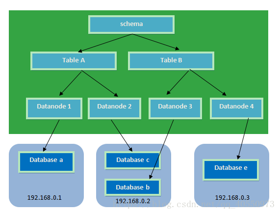

# 实战微服务

## 目录

1. [微服务思想](#微服务思想)
2. [微服务项目示例](#微服务项目示例)

## 微服务思想

## 微服务项目示例

在VS中调试的时候有很多修改Web应用运行端口的方法。但是在开发、调试微服务应用的时候可能需要同时在不同端口上开启多个服务器的实例,因此下面主要看看如何通过命令行指定Web应用的端口（默认5000）

可以通过设置临时环境变量ASPNETCORE URLS来改变默认的端口、域名，也就是执行 dotnet xxx.dll之前执行 `set ASPNETCORE_URLS=http://127.0.0.1:5001` 来设置环境变量。

如果需要在程序中读取端口、域名（后续服务治理会用到），用ASPNETCORE URLS环境变量就不太方便，可以自定义配置文件，自己读取设置。

```C#
public static IHostBuilder CreateHostBuilder(string[] args) =>
  Host.CreateDefaultBuilder(args).ConfigureWebHostDefaults(webBuilder =>
  {
    var config = new ConfigurationBuilder().AddCommandLine(args).Build();
    string ip = config["ip"];
    string port = config["port"];

    webBuilder.UseStartup<Startup>().UseUrls($"http://{ip}:{port}");
  });
```

然后启动的时候：

```sh
dotnet xxx.dll --ip 127.0.0.1 --port 8889
```

`.Net Core` 因为跨平台，所以可以不依赖于IIS运行。可以用 `.Net Core` 内置的 kestrel 服务器运行网站，当然真正面对终端用户访问的时候一般通过 Nginx 等做反向代理。

### 服务治理发现

- [consul](https://www.consul.io/)：Consul是注册中心，服务提供者、服务消费者等都要注册到Consul中，这样就可以实现服务提供者、服务消费者的隔离
- Eureka
- Zookeeper

**consul：**

```sh
consul.exe agent -dev
```

这是开发环境测试，生产环境要建集群，要至少一台Server，多台Agent consul

监控页面：[http://127.0.0.1:8500/consult](http://127.0.0.1:8500/consult)

主要做三件事：提供服务到ip地址的注册，提供服务到ip地址列表的查询，对提供服务方的健康检查(HealthCheck)。

**.Net Core连接Consul：**

1、安装 Consul nuget 包

```sh
Install-Package Consul
```

2、让Rest服务注册到Consul中

```C#
public void Configure(IApplicationBuilder app, IWebHostEnvironment env)
{
  // ...

  // 部署到不同服务器的时候不能写成127.0.0.1或者0.0.0.0，因为这是让服务消费者调用的地址
  string ip = Configuration["ip"];
  int port = int.Parse(Configuration["port"]);
  // 向consul注册服务
  ConsulClient client = new ConsulClient(ConfigurationOverview);
  Task<WriteResult> result = client.Agent.ServiceRegister(new AgentServiceRegistration()
  {
    // 服务编号，不能重复，用Guid最简单
    ID = "apiservice1" + Guid.NewGuid(),
    // 服务的名字
    Name = "apiservice1",
    // 我的ip地址（可以被其他应用访问的地址，本地测试可以用127.0.0.1，机房环境中一定要写自己的内网ip地址）
    Address = ip,
    // 我的端口
    Port = port,
    Check = new AgentServiceCheck()
    {
      // 服务停止多久后反注册
      DeregisterCriticalServiceAfter = TimeSpan.FromSeconds(5),
      // 健康检查时间间隔，或者称为心跳间隔
      Interval = TimeSpan.FromSeconds(10),
      // 健康检查地址
      HTTP = $"http://{ip}:{port}/api/health",
      Timeout = TimeSpan.FromSeconds(5)
    }
  });
}

private static void ConfigurationOverview(ConsulClientConfiguration obj)
{
  obj.Address = new Uri("http://127.0.0.1:8500");
  obj.Datacenter = "dc1";
}
```

注意不同实例一定要用不同的Id，即使是相同服务的不同实例也要用不同的ld，上面的代码用Guid做Id，确保不重复。相同的服务用相同的Name。Address、Port是供服务消费者访问的服务器地址（或者IP地址）及端口号。Check则是做服务健康检查的。

在注册服务的时候还可以通过AgentServiceRegistration的Tags属性设置额外的标签。

通过命令行启动两个实例

```sh
dotnet xxx.dll --ip 127.0.0.1 --port 5001
dotnet xxx.dll --ip 127.0.0.1 --port 5002
```

### 数据库集群

**MySQL Cluster VS MyCat：**

MYSQL集群方案有挺多的，主从读写分离是最容易实现的，但是会很快碰到主服务器写入瓶颈的问题，sharding方案才是未来可扩展的解决方案。目前我觉得有两个方案较为靠谱：

1. MYSQL CLUSTER，这个是MYSQL的官方集群方案，直接在数据库级别支持ndb网络节点，自动分片，自动join，单机故障不影响集群；
2. MYCAT，这个是基于阿里巴巴的Cobar方案优化而来，其支持团队也挺卖力的，支持半自动化分片、join。为什么叫“半自动化”呢？因为需要DBA对每个表的分片策略进行配置和干涉。个人感觉没有方案1的傻瓜式分片简单。

MySQL Cluster 是一个基于 NDB Cluster 存储引擎的完整的分布式数据库系统；不仅仅具有高可用性，而且可以自动切分数据，冗余数据等高级功能；MySQL Cluster 是一个 Share Nothing 的架构，各个 MySQLServer 之间并不共享任何数据。

**背景：**

各种宕机原因：

- 运行环境（35%）：磁盘空间耗尽 / 网络
- 性能问题（35%）：糟糕的SQL / 服务器bug
- 复制问题（20%）：主备数据不一致
- 数据丢失损坏（10%）：DROP TABLE / 缺少可用备份

实现高可用：

- 提升平均失效时间（MTBF）：做好管理，防止故障发生
- 降低平均恢复时间（MTTR）：建立冗余，避免单点失效，故障转移

**Cluster 组成：**

- **SQL服务节点**（SQL层）：MySQL Server，不需要提供任何存储引擎的MySQL服务器，实现一个数据库在存储层之上的所有事情
- **NDB数据节点**（Storage层）：实现底层数据存储功能，每一个 Cluster 节点保存完整数据的一个 fragment，NDB 节点被组织成一个一个的 NDB Group，一个 NDB Group 实际上就是一组存有完全相同的物理数据的 NDB 节点群
- **Manage节点**：管理整个 Cluster 集群中各个节点，包括集群配置、控制节点、维护、数据恢复


**Mysql-cluster的优缺点：**

优点：

1. 99.999 ％的高可用性
2. 快速的自动失效切换
3. 灵活的分布式体系结构，没有单点故障
4. 高吞吐量和低延迟
5. 可扩展性强，支持在线扩容

缺点：

1. 存在很多限制，比如：不支持外键，数据行不能超过8K（不包括BLOB和text中的数据）
2. 部署、管理、配置很复杂
3. 占用磁盘空间大，内存大
4. 备份和恢复不方便
5. 重启的时候，数据节点将数据load到内存需要很长时间

**Cluster 优化：**

- 节点之间的内部网络带宽要保证足够使用；
- SQL节点和NDB节点的主机性能配比要均衡，不能一方出现瓶颈，一方处于空闲；
- 优化SQL节点和NDB节点的软件配置；

**小结：**

MySQL Cluster 的核心在于 NDB Cluster 存储引擎，他不仅对数据进行了水平切分，还对数据进行了跨节点冗余。既解决了数据库的扩展问题，同时也在很大程度上提高了数据库整体可用性。

但是 CLUSTER 数据都是放在内存里的，这个硬件只怕不便宜，而且实时同步依靠的是超大的网络带宽。生产环境没有听说过的案例。

**什么是MyCAT？**

简单的说，MyCAT就是：

- 一个彻底开源的，面向企业应用开发的“大数据库集群”
- 支持事务、ACID、可以替代Mysql的加强版数据库
- 一个可以视为“Mysql”集群的企业级数据库，用来替代昂贵的Oracle集群
- 一个融合内存缓存技术、Nosql技术、HDFS大数据的新型SQL Server
- 结合传统数据库和新型分布式数据仓库的新一代企业级数据库产品
- 一个新颖的数据库中间件产品

MyCAT的目标是：低成本的将现有的单机数据库和应用平滑迁移到“云”端，解决数据存储和业务规模迅速增长情况下的数据瓶颈问题。

**MyCAT的关键特性：**

- 支持 SQL 92标准
- 支持 Mysql 集群，可以作为 Proxy 使用
- 支持 JDBC 连接 ORACLE、DB2、SQL Server，将其模拟为 MySQL Server 使用
- 支持 galera for mysql 集群，percona-cluster 或者 mariadb cluster，提供高可用性数据分片集群
- 自动故障切换，高可用性
- 支持读写分离，支持 Mysql 双主多从，以及一主多从的模式
- 支持全局表，数据自动分片到多个节点，用于高效表关联查询
- 支持独有的基于 E-R 关系的分片策略，实现了高效的表关联查询
- 多平台支持，部署和实施简单

**MyCAT架构：**


如图所示：MyCAT 使用 Mysql 的通讯协议模拟成了一个 Mysql 服务器，并建立了完整的Schema（数据库）、Table （数据表）、User(用户)的逻辑模型，并将这套逻辑模型映射到后端的存储节点DataNode（MySQL Instance）上的真实物理库中，这样一来，所有能使用 Mysql 的客户端以及编程语言都能将 MyCAT 当成是 Mysql Server 来使用，不必开发新的客户端协议。

**Mycat解决的问题：**

- 性能问题
- 数据库连接过多
- E-R分片难处理
- 可用性问题
- 成本和伸缩性问题


**Mycat对多数据库的支持：**


**分片策略：**

MyCAT支持水平分片与垂直分片：

- 水平分片：一个表格的数据分割到多个节点上，按照行分隔。
- 垂直分片：一个数据库中多个表格A，B，C，A存储到节点1上，B存储到节点2上，C存储到节点3上。



MyCAT 通过定义表的分片规则来实现分片，每个表格可以捆绑一个分片规则，每个分片规则指定一个分片字段并绑定一个函数，来实现动态分片算法。

1. Schema：逻辑库，与MySQL中的Database（数据库）对应，一个逻辑库中定义了所包括的Table。
2. Table：表，即物理数据库中存储的某一张表，与传统数据库不同，这里的表格需要声明其所存储的逻辑数据节点DataNode。在此可以指定表的分片规则。
3. DataNode：MyCAT的逻辑数据节点，是存放table的具体物理节点，也称之为分片节点，通过DataSource来关联到后端某个具体数据库上。DataSource：定义某个物理库的访问地址，用于捆绑到Datanode上

**Mycat的下载及安装：**

- 官方网站：[http://www.mycat.org.cn/](http://www.mycat.org.cn/)
- github地址：[https://github.com/MyCATApache](https://github.com/MyCATApache)

### eShopOnContainers

开发环境的 eShopOnContainers 参考应用程序体系结构：


一些可用于不同微服务的方法和技术（多体系结构模式和 polyglot 微服务体系）：


## .NET平台微服务项目汇集

最近博客园出现了一篇文章[《微服务时代之2017年五军之战：Net PHP谁先死》](http://www.cnblogs.com/vesaa/p/7416866.html)，掀起了一波撕逼，作者只是从一个使用者的角度来指点江山，这个姿势是不对的。.NET Core就是专门针对模块化的微服务架构而设计，在微服务架构这方面Java的Spring Cloud具有非常高的人气，这个正是这篇文章作者的立脚点。然后他没有看到蓬勃发展的.NET 社区的微服务的相关框架,本文主要梳理下当前.NET社区微服务的相关项目的汇集。

1、 Service Fabric
微软作为.NET的主战场，自然在当前的微服务框架上有着丰富的经验，这一领域的代表作就是Azure Service Fabric，在Azure上的众多云服务都是基于Servie Fabric构建，而且微软已经明确表态了Service Fabric将开源，Runtime还没开源，说有计划开源，但目前因为依赖于很多内部工具、组件，在逐步推进runtime的开源进程，具体可以看下我写的一篇博客《期待微软平台即服务技术Service Fabric 开源》。如果你是基于Azure平台来开发，你完全可以使用Service Fabric 做应用开发。当然你如果是在你私有云里用他，也是完全可以的，具体案例我举一个就是腾讯游戏：https://customers.microsoft.com/en-us/story/tencent-telecommunications-azure-service-fabric-windows-server-en

这里列出1个Github 以Service Fabric 开发微服务的项目：

https://github.com/danielmarbach/Microservices.ServiceFabric

2、Steeltoe OSS
在微服务架构这方面Spring Cloud具有非常高的人气，如果你在使用Spring Cloud，可以使用开源项目https://github.com/steeltoeoss 开发.NET Core应用，具体可以参考这篇文章Enabling .NET Core Microservices with Steeltoe and Pivotal Cloud Foundry .

3、Microdot Framework
https://github.com/gigya/microdot，这是一个4月份才开源的.NET微服务框架，让您专注于编写定义服务逻辑的代码，无需解决开发分布式系统的无数挑战，可以很好的Microsoft Orleans的集成。

4、.NET China Foundation
.NET China Foundation 也组织整合了系列国内社区开源项目，里面有多个项目都是以微服务为方向，欢迎大家加入一起来把.NET Core的微服务玩好。

https://github.com/dotnetcore/CAP

https://github.com/dotnetcore/surging

https://github.com/dotnetcore/Util

5、其他众多开源的微服务架构项目
.NET社区里还有很多微服务的项目，下面我就简要列出他们在Github上的地址：

1、Xigadee
https://github.com/xigadee/Microservice

2、Apworks framework
https://github.com/daxnet/apworks-core

https://github.com/daxnet/apworks-examples

3、Cronus
https://github.com/Elders/Cronus

4、NancyFx
https://github.com/Cimpress-MCP/Cimpress.Nancy

5、GRPC
https://github.com/pchalamet/GrpcConsul

6、API 网关Ocelot
https://github.com/TomPallister/Ocelot ，Ocelot是一个使用.NET Core平台上的一个API Gateway，这个项目的目标是在.NET上面运行微服务架构，我在年初基于Ocelot做了一个POC项目 https://github.com/geffzhang/NanoFabric ，目前已经上线运行。同时也在不断的丰富Ocelot的功能。

简要的列了一下.NET 平台上的微服务开发的相关类库，欢迎大家推荐你用过的微服务的相关类库，在最后推荐一个.NET上归属与.NET 基金会下面的开源项目：https://dotnetfoundation.org/projects?type=project 这里可以找到你想要的项目。
