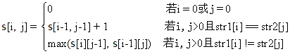
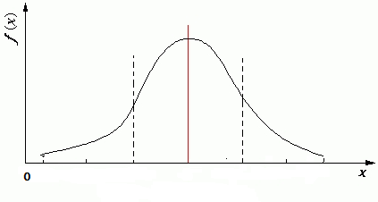

# 算法设计常用思想

算法作为智力活动的结果，并不是随机头脑风暴活动的产物，虽然因人而异，会有不同的结果，但是基本上它应该是遵循一定规律的活动结果。

首先，它需要一些基础性的知识作为这种智力活动的着力点，比如相关领域的数学知识、各种数据结构的掌握等；其次，它需要对问题域做充分的分析和研究，高度概括并抽象出问题的精确描述，也就是各种建立数学模型的方法；最后，有一些常用的模式和原则，可以作为构造算法的选择项，有人将其称为算法设计方法，我建议将它称为算法设计模式或算法设计思想，以便于将其与一些具体的算法名称区分开。

模式作为算法演进的一些固定的思路，它提供了一些构造算法的常用思想。常用的算法设计思想有迭代法、贪婪法、穷举搜索法、递推法、递归法、回溯法、分治法、动态规划法等。

## 贪婪法

这一课将介绍贪婪法。

**基本思想：**

贪婪法(Greedy Algorithm)，又称贪心算法，是寻找最优解问题的常用方法，这种方法模式一般将求解过程分成若干个步骤，但每个步骤都应用贪心原则，选取当前状态下最好的或最优的选择（局部最有利的选择），并以此希望最后堆叠出的结果也是最好或最优的解。

贪婪法的每次决策都以当前情况为基础并根据某个最优原则进行选择，不从整体上考虑其他各种可能的情况。一般来说，这种贪心原则在各种算法模式中都会体现，这里单独作为一种方法来说明，是因为贪婪法对于特定的问题是非常有效的方法。

贪婪法和动态规划法以及分治法一样，都需要对问题进行分解，定义最优解的子结构，但是与其他方法最大的不同在于，贪婪法每一步选择完局部最优解之后就确定了，不再进行回溯处理，也就是说，每一个步骤的局部最优解确定以后，就不再修改，直到算法结束。

因为不进行回溯处理，贪婪法只在很少的情况下可以得到真正的最优解，比如最短路径问题、图的最小生成树问题。在大多数情况下，由于选择策略的“短视”，贪婪法会错过真正的最优解，而得不到问题的真正答案。但是贪婪法简单、高效，省去了为找最优解可能需要的穷举操作，可以得到与最优解比较接近的近似最优解，通常作为其他算法的辅助算法来使用。

贪婪法的基本设计思想有以下三个步骤：

- 建立对问题精确描述的数学模型，包括定义最优解的模型；
- 将问题分解为一系列的子问题，同时定义子问题的最优解结构；
- 应用贪心原则确定每个子问题的局部最优解，并根据最优解的模型，用子问题的局部最优解堆叠出全局最优解。

定义最优解的模型通常和定义子问题的最优结构是同时进行的，最优解的模型一般都体现了最优子问题的分解结构和堆叠方式。

对于子问题的分解有多种方式，有的问题可以按照问题的求解过程一步一步进行分解，每一步都在前一步的基础上选择当前最好的解，每做一次选择就将问题简化为一个规模更小的子问题，当最后一步的求解完成后就得到了全局最优解。还有的问题可以将问题分解成相对独立的几个子问题，对每个子问题求解完成后再按照一定的规则（比如某种公式或计算法则）将其组合起来得到全局最优解。

这里说的定义子问题分解和子问题的最优解结构可能有点抽象，我们来看一个具体的经典的例子——找零钱。

假如，某国发行的货币有 25 分、10 分、5 分和 1 分四种硬币，如果你是售货员且要找给客户 41 分钱的硬币，如何安排才能找给客人的钱既正确且硬币的个数又最少？

这个问题的子问题定义就是从四种币值的硬币中选择一枚，使这个硬币的币值和其他已经选择的硬币的币值总和不超过 41 分钱。子问题的最优解结构就是在之前的步骤已经选择的硬币再加上当前选择的一枚硬币，当然，选择的策略是贪婪策略，即在币值总和不超过 41 的前提下选择币值最大的那种硬币。按照这个策略，第一步会选择 25 分的硬币一枚，第二步会选择 10 分的硬币一枚，第三步会选择 5 分的硬币一枚，第四步会选择 1 分的硬币一枚，总共需要 4 枚硬币。

上面的例子得到的确实是一个最优解，但是很多情况下贪婪法都不能得到最优解。

同样以找零钱为例，假如，某国货币发行为 25 分、20 分、5 分和 1 分四种硬币，这时候找 41 分钱的最优策略是 2 枚 20 分的硬币加上 1 枚 1 分硬币，一共 3 枚硬币，但是用贪婪法得到的结果却是 1 枚 25 分硬币、3 枚 5 分硬币和 1 枚 1 分硬币，一共 5 枚硬币。

例子：0-1 背包问题

本节课将介绍一个贪婪法的经典例子——0-1 背包问题：有 N 件物品和一个承重为 C 的背包（也可定义为体积），每件物品的重量是 wi，价值是 pi，求解将哪几件物品装入背包可使这些物品在重量总和不超过 C 的情况下价值总和最大。

背包问题(Knapsack Problem)是此类组合优化的NP完全问题的统称，如货箱装载问题、货船载物问题等，因问题最初来源于如何选择最合适的物品装在背包中而得名，这个问题隐含了一个条件，每个物品只有一件，也就是限定每件物品只能选择 0 个或 1 个，因此又被称为 0-1 背包问题。

来看一个具体的例子，有一个背包，最多能承载重量为 C=150 的物品，现在有 7 个物品（物品不能分割成任意大小），编号为 1~7，重量分别是 wi=[35,30,60,50,40,10,25]，价值分别是 pi=[10,40,30,50,35,40,30]，现在从这 7 个物品中选择一个或多个装入背包，要求在物品总重量不超过 C 的前提下，所装入的物品总价值最高。

这个问题的数学模型非常简单，就是一个承重是 C 的背包和 n 个物品，每个物品都有重量和价值两个属性。但是在对问题分析的过程中，我们发现，每个物品还需要一个状态用于标记该物品的选择状态，以确定该物品是否已经被选进背包了，状态是 1 表示物品已经被装到包里了，后续的选择不要再考虑这个物品了。需要特别说明的是状态值为 2 的情况，这种情况表示用当前策略选择的物品导致总重量超过了背包承重量，在这种情况下，如果放弃这个物品，按照策略从剩下的物品中再选一个，有可能就能满足背包承重的要求。因此，设置了一个状态 2，表示当前选择物品不合适，下次选择也不要再选这个物品了。描述每个物品的数据结构 OBJECT 定义为：

```C
typedef struct
{
    int weight;
    int price;
    int status; // 0:未选中；1:已选中；2:已经不可选
} OBJECT;
```

接下来是背包问题的定义，背包问题包括两个属性，一个是可选物品列表，另一个是背包总的承重量，简单定义背包问题数据结构如下：

```C
typedef struct
{
    std::vector<OBJECT> objs;
    int totalC;
} KNAPSACK_PROBLEM;
```

确定数学模型之后，接下来就要确定子问题了。

根据题意，本题的子问题可以描述为：在背包承重还有 C' 的情况下，选择一个还没有被选择过，且符合贪婪策略的物品装入背包。每选择一个物品 p[i]，都要调整背包的承重量 C' = C' - p[i].weight，问题的初始状态是 C' = 150，且所有物品都可以选择。假如选择了一个重为 35 的物品后，子问题就变成在背包容量 C' 是 115 的情况下，从剩下 6 件物品中选择一个物品。确定了子问题的描述，算法的整体实现过程就是按照选择物品装入背包的过程，按部就班地一步一步解决子问题，直到背包不能再装入物品或所有物品都已经装入背包时，结束算法。

那么如何选择物品呢？这就是贪婪策略的选择问题。对于本题，常见的贪婪策略有三种：

- 第一种策略是根据物品价值选择，每次都选价值最高的物品，根据这个策略最终选择装入背包的物品编号依次是 4、2、6、5，此时包中物品总重量是 130，总价值是 165。
- 第二种策略是根据物品重量选择，每次都选择重量最轻的物品，根据这个策略最终选择装入背包的物品编号依次是 6、7、2、1、5，此时包中物品总重量是 140，总价值是 155。
- 第三种策略是定义一个价值密度的概念，每次选择都选价值密度最高的物品，物品的价值密度 si 定义为 pi/wi，这 7 件物品的价值密度分别为 si=[0.286,1.333,0.5,1.0,0.875,4.0,1.2]。根据这个策略最终选择装入背包的物品编号依次是 6、2、7、4、1，此时包中物品的总重量是 150，总价值是 170。

GreedyAlgo() 函数是贪婪算法的主体结构，包括子问题的分解和选择策略的选择都在这个函数中。能够明显看出来这个算法使用了迭代法的算法模式，当然，这个算法主体的实现还可以使用递归法，正如函数所展示的那样，它可以作为此类问题的一个通用解决思路：

```C
void GreedyAlgo(KNAPSACK_PROBLEM *problem, SELECT_POLICY spFunc)
{
    int idx;
    int ntc = 0;

    // spFunc 每次选最符合策略的那个物品，选后再检查
    while((idx = spFunc(problem->objs, problem->totalC - ntc)) != -1)
    {
        // 所选物品是否满足背包承重要求？
        if((ntc + problem->objs[idx].weight) <= problem->totalC)
        {
            problem->objs[idx].status = 1;
            ntc += problem->objs[idx].weight;
        }
        else
        {
            // 不能选这个物品了，做个标记后重新选
            problem->objs[idx].status = 2;
        }
    }

    PrintResult(problem->objs);
}
```

spFunc 参数是选择策略函数的接口，通过替换这个参数，可以实现上文提到的三种贪婪策略，分别得到各种贪婪策略下得到的解。以第一种策略为例，每次总是选择 price 最大的物品，可以这样实现：

```C
int Choosefunc1(std::vector<OBJECT>& objs, int c)
{
    int index = -1;  //-1表示背包容量已满
    int mp = 0;
    for(int i = 0; i < static_cast<int>(objs.size()); i++)
    {
        if((objs[i].status == 0) && (objs[i].price > mp))
        {
            mp = objs[i].price;
            index = i;
        }
    }

    return index;
}
```

看起来第三种策略取得了最好的结果，和动态规划方法得到的最优结果是一致的，但是实际上，这只是对这组数据的验证结果而已，如果换一组数据，结果可能完全相反。当然，对于一些能够证明贪婪策略得到的就是最优解的问题，应用贪婪法可以高效地求得结果，比如求最小生成树的 Prim 算法和 Kruskal 算法。

在大多数情况下，贪婪法受自身策略模式的限制，通常很难直接求解全局最优解问题，也很难用于多阶段决策问题。贪婪法只能得到比较接近最优解的近似最优解，但是作为一种启发式辅助方法在很多算法中都得到了广泛的应用，很多常用的算法在解决局部最优决策时，都会应用到贪婪法。比如 Dijkstra 的单源最短路径算法在从 dist 中选择当前最短距离的节点时，就是采用的贪婪法策略。事实上，在任何算法中，只要在某个阶段使用了只考虑局部最优情况的选择策略，都可以理解为使用了贪婪算法。

## 分治法

分治，顾名思义，分而治之。分治法(Divide and Conquer)也是一种解决问题的常用模式，分治法的设计思想是将无法着手解决的大问题分解成一系列规模较小的相同问题，然后逐个解决小问题，即所谓分而治之。分治法产生的子问题与原始问题相同，只是规模减小，反复使用分治方法，可以使得子问题的规模不断减小，直到能够被直接求解为止。

**基本思想：**

分治法作为算法设计中一个古老的策略，在很多问题中得到了广泛的应用，比如最轻、最重问题（在一堆形状相同的物品中找出最重或最轻的那一个），矩阵乘法、大整数乘法以及排序（例如，快速排序和归并排序）。除此之外，这个技巧也是许多高效算法的基础，比如快速傅立叶变换算法和 Karatsuba 乘法算法。

应用分治法，一般出于两个目的，其一是通过分解问题，使得无法着手解决的大问题变成容易解决的小问题，其二是通过减小问题的规模，降低解决问题的复杂度（或计算量）。

给 1000 个数排序，可能会因为问题的规模太大而无从下手，但是如果减小这个问题的规模，将问题一分为二，变成分别对两个拥有 500 个数的序列排序，然后再将两个排序后的序列合并成一个就得到了 1000 个数的排序结果。对 500 个数排序仍然无法下手，需要继续分解，直到最后问题的规模变成 2 个数排序的时候，只需要一次比较就可以确定顺序。这正是快速排序的实现思想，通过减小问题的规模使问题由难以解决变得容易解决。

计算 N 个采样点的离散傅立叶变换，需要做 $N^2$ 次复数乘法，但是将其分解成两个 N/2 个采样点的离散傅立叶变换，则只需要做 $(\frac{N}{2})^2 + (\frac{N}{2})^2 = \frac{N^2}{2}$ 次复数乘法，做一次分解就使得计算量减少了一半，这正是快速傅立叶变换(FFT)的实现思想，通过减小问题的规模来减少计算量，以降低问题的复杂度。

分治法的实现模式可以是递归方式，也可以是非递归方式，一般采用递归方式的算法模式可以用伪代码描述为：

```C
T DivideAndConquer(P)
{
    if(P 可以直接解决)
    {
        T <- P 的结果;
        return T;
    }

    // 将 P 分解为子问题{P1, P2,..., Pn};
    for_each(Pi : {P1, P2,..., Pn})
    {
        ti <- DivideAndConquer(Pi); //递归解决子问题 Pi
    }
    T <- Merge(t1, t2,...,tn); //合并子问题的解

    return T;
}
```

能使用分治法解决的问题一般都具有两个显著的特点，第一个特点是问题可以分解为若干个规模较小的相同问题，并且这个分解关系可以用递归或递推的方式逐级分解，直到问题的规模小到可以直接求解的程度。这里说的相同问题，并不是说分解后的子问题与原问题完全一样，这里说的相同只是问题的结构相同，比如原问题有四个属性，分解后规模较小的子问题也应该具有四个相同的属性，不同的只是各个属性的范围和规模。第二个特点是子问题的解可以用某种方式合并出原始问题的解。这很容易理解，如果不能合并出原始问题的解，那么子问题的划分和求解就没有意义了。

分治法的难点是如何将子问题分解，并且将子问题的解合并出原始问题的解，针对不同的问题，通常有不同的分解与合并方式。

先来看看快速排序算法，快速排序算法的分解思想是选择一个标兵数，将待排序的序列分成两个子序列，其中一个子序列中的数都小于标兵数，另一个子序列中的数都大于标兵数，然后分别对这两个子序列排序，其合并思想就是将两个已经排序的子序列一前一后拼接在标兵数前后，组成一个完整的有序序列。

再来看看快速傅立叶变换，快速傅立叶变换的分解思想是将一个 N 点离散傅立叶变换，按照奇偶关系分成两个 N/2 点离散傅立叶变换，其合并思想就是将两个 N/2 点离散傅立叶变换结果按照蝶形运算的位置关系重新排列成一个 N 点序列。

最后再介绍一下 Karatsuba 大整数乘法算法，其分解思想是将两个参与计算的 n 位大数各自分成两部分：a + b 和 c + d，其中，a 和 c 分别是这两个大整数的整数幂部分，b 和 d 分别是它们的剩余部分，然后利用乘法的分解公式：(a + b)(c + d) = ac + ad + bc + bd，将其分解为四次小规模大数的乘法计算，并且利用一个小技巧将其化解成三次乘法和少量移位操作。最终结果的合并思想就是用几次加法对小规模乘法的结果进行求和，得到原始问题的解。

以上两个例子的具体原理和实现在《算法的乐趣》一书中都有详细的介绍，有兴趣的读者可以了解一下。

由以上的例子可知，分治法最难也最灵活的部分就是对问题的分解和结果的合并，对于一个未知的问题，只要能找到对子问题的分解方式和结果的合并方式，应用分治法就可以迎刃而解。而在数学上，只要能用数学归纳法证明的问题，一般也都可以应用分治法解决，这也是一个应用分治法的强烈信号。

**递归实现和分治法：**

递归作为一种算法的实现方式，与分治法是一对儿天然的好朋友。为什么这么说呢？因为问题的分解肯定不是一步到位，往往需要反复使用分治手段，在多个层次上层层分解，这种分解的方法很自然地导致了递归方式的使用。从算法实现的角度看，分治法得到的子问题和原问题是相同的，当然可以用相同的函数来解决，区别只在于问题的规模和范围不同。通过特定的函数参数安排，使得同一个函数可以解决不同规模的相同问题，这就是递归方法的基础。

以快速排序为例，如果把待排序的序列作为问题的话，那么子问题的规模就可以定义为子序列在原始序列中的起始位置。对此一般化之后，原始问题和子问题的描述就统一了，都是原始序列 + 起始位置，原始问题的起始位置就是 [1,n]，子问题的起始位置就是 [1,n] 中的某一个子区间，由此一来，递归的接口就明确了：

```C
void quick_sort(int *arElem, int p, int r)
```

其中，p 和 r 就分别是子序列在 arElem 中的起始位置，有了子问题的递归定义接口，快速排序的算法实现也就水到渠成了：

```C
void quick_sort(int *arElem, int p, int r)
{
  if(p < r)
  {
    int mid = partion(arElem, p, r);
    quick_sort(arElem, p, mid - 1);
    quick_sort(arElem, mid + 1, r);
  }
}

int intArray[] = {12, 56, 22, 78, 102, 6, 90, 57, 29};
quick_sort(0, 8); //原始问题：对数组中的1-9号元素排序
```

不用递归是不是就不能用分治法了？当然不是，快速傅立叶变换算法就没有用递归。很多算法都有自己的非递归实现方式，是否用了递归方法不是判断是不是分治法的必要条件。即便是一些使用了递归方法的算法，也都可以用一个自己构造的栈将其改编为非递归方法，比如快速排序就有很多用栈实现的非递归方法。Robert Sedgewick 在其著作《算法：C语言实现》一书中就给出了一种快速排序的非递归高效算法，有兴趣的读者可阅读此书，了解一下算法实现。

**分治法的例子：字符串全排列问题！**

我们的问题是：给定一个没有重复字母的字符串，输出该字符串中字符的所有排列。假如给定的字符串是“abc”，则应该输出“abc”、“acb”、“bac”、“bca”、“cab”和“cba”六种结果。

首先分析这是一个全排列问题，解决这个问题我们的常用策略是每次选择固定一个字符，然后对剩下的两个字符进行排列。比如这个三个字母的字符串，我们首先选择固定 a，然后对 bc 进行排列，可以得到“abc”和“acb”两个结果；然后选择固定 b，对 ac 进行排列，可以得到“bac”和“bca”两个结果；最后选择固定 c，对 ab 排列，可以得到“cab”和“cba”两个结果。

不知道大家有没有意识到，这其实就是使用了分治法的思想在解决问题。三个字符排列，我们人脑可能处理不过来，但是我们固定一个字母后，把问题的规模减小为两个字符的排列，两个字符的排列只有两种结果，是可以解决的问题；然后我们将小问题的结果与固定的字母组合在一起，就可以得到原始问题，即三个字符的排列结果。分治法分解子问题，并不是一定要用某种方式均匀分解原始问题，哪怕是每次只能将原始问题的规模变小一点，也是一种分解子问题的方法。

回到我们这个问题上，对字符串类问题分解子问题，通常考虑的方法有两个。

- 一个方法是用字符串的开始位置和字符串的长度表示一个子字符串，对于一个长度为 n 的字符串，用这种方法定义的子问题就是“从位置 i 开始，长度为 m 的字符串，其中，1 ⩽ i < n，0 < m ⩽ nn，原始问题就是从位置 1 开始，长度为 n 的字符串。
- 另一个方法是用字符串的位置区间来表示一个子字符串，同样对于一个长度为 n 的字符串，用这种方法定义的子问题就是“从位置 i 开始，到位置 j 结束的字符串，其中，1 ⩽ i < n, i ⩽ j ⩽ nn，原始问题就是从位置 1 开始到位置 n 结束的字符串。考虑到很多编程语言中索引位置都是从 0 开始，上述描述中的索引位置要做 -1 修正，读者应该能够理解，接下来的例子用 C++ 实现算法，就会体现这一点。

对于这个问题，我们选择用区间的方法定义子问题，即用字符位置索引区间 [begin, end] 表示子问题，选好子问题的表达方式，接下来就要考虑如何分解子问题。根据之前的分析，我们采用每次固定一个字符，然后将剩下的字符串作为一个子问题进行全排列的方式分解子问题。

因为每个字符都要被“固定”一次，所以算法实现的方法是用一个循环对子问题 [begin, end] 区间上的每个字符都选择一次。因为大多数编程语言都没有提供直接的方法能够将一个字符固定，同时将剩下的内容重组为一个连续的字符串，所以很显然，这里面就会有一个实现上的困难需要克服，即如何选中一个字符固定，还要让剩下的字符保持连续，成为子问题所描述的字符串。我们采用的方法是将问题区间 [begin, end] 中的 begin 位置作为选中的固定字符位置，将除了这个位置之外的问题区间 [begin+1, end] 作为子问题进一步处理。如果被选中的固定字符不在 begin 位置，则交换两个字符的位置，使得被选中的固定字符位于 begin 位置。

解决了子问题的分解，接下来要考虑子问题的求解。分解的目的是为了减小问题的规模，直到问题能够求解，对于这个字符串排列问题，当子问题的规模减小到只有一个字符的时候，子问题就可以求解了。因为我们处理方式是从前向后，每次固定 begin 位置的字符，然后将区间 [begin+1, end] 作为子问题进一步处理，所以当 begin 位置和 end 位置相同的时候，就说明字符串只有一个字符了，这时就不需要再分解子问题了。因为这个问题的特点，它不需要显式求解子问题，只需在子问题变成只有一个字符的字符串时输出这个字符串即可，并且因为之前分解子问题的时候，每个位置都已经固定好字符，所以当 begin 位置和 end 位置相同的时候，就实际得到了一个全排列结果。

算法实现的主体就是一个可递归调用的 Permutation() 函数，Permutation() 函数解决字符串 chList 中从 begin 位置开始到 end 位置结束的字符串的全排列问题，要求解原始问题，只需将 begin 设置成 0，将 end 设置成字符串长度 -1 即可（字符串长度 -1 就是字符串最后一个字符的索引位置）。递归展现出了无与伦比的优雅，最后的算法实现只要十几行代码就搞定了。

**总结：**

分治法有很多典型的应用，比如二分查找、Karatsuba 大整数乘法、棋盘覆盖问题、快速排序、合并排序，等等，大家可以找来相关的算法实现研究一下，看看各种情况下分解子问题和合并子问题的解的方法。我记得前几年有个很火的网文，说是 90% 的程序员写不出完全正确的二分查找算法，那么本节课的问题就是，用你熟悉的编程语言实现一个二分查找算法，完成这个作业，你就是那 10% 了。

## 迭代法

上一课我们介绍了算法模式中的分治法，这一课继续介绍迭代法，我们一般在求解一个问题的时候，都是使用明确的方法或计算公式，带入已知量，一次性求得问题的解。但是如果用计算机解决这些问题，常常因为各种原因无法直接求解，比如求解一元高次方程的问题。

针对这种情况，人们提出了很多迭代法来近似求解这类问题，比较常见的有梯度法、最小二乘法和牛顿迭代法，只要问题的解是可收敛的（或者是局部可收敛的），都可以使用迭代法求解。数学意义上的迭代法是一种不断用变量的旧值递推新值的过程，其对应的迭代算法也是用计算机解决问题的一种基本方法。

**迭代法和递推法的关系：**

迭代法一般用于求解数学问题，比如求解一元高次方程、线性和非线性方程组和曲线拟合等问题。

迭代的基本点就是迭代公式，一般也理解为递推公式，这常常让人对迭代法和递推法产生混淆，认为这两个概念是等同的。事实上，这两个概念还是有点差异的，迭代法作为很多数学问题的求解算法，是解决数学问题的一种常用的算法模式，可以独立构成解决问题的算法。递推法作为一种设计算法的常用思想，没有固定的算法实现模式，通常是与其他算法模式配合形成算法实现。比如线性动态规划问题，一般都有明确的子问题最优解递推公式，递推思想常常作为算法实现的一部分融入到动态规划算法的实现中。

对于迭代法，还有一种更广泛的观点，就是所有使用了迭代思想的算法实现，都可以理解为是使用了迭代法。从这个角度理解，除了线性动态规划算法，遗传算法、退火算法等算法也可归入迭代法的范畴。关于这一观点，仁者见仁，读者可自己体会。

**基本思想：**

迭代法的实现，一般需要确定以下三个要点。

- 确定迭代变量：迭代变量一般就是要求解的问题的解，利用迭代递推公式可以不断地由旧值递推出新值。根据问题的不同，迭代变量可以是一个，也可以是多个。确定迭代变量，通常还要根据迭代递推关系给出迭代变量的初始值，这一点也很重要。
- 确定迭代递推关系：迭代递推关系是根据旧值计算新值的关系或公式，这是迭代法实现的关键，如果不能确定迭代关系，则无法用迭代法实现算法。
- 确定迭代终止条件：迭代终止条件是控制迭代过程退出的关键条件。迭代不可能无休止地进行，必须设置迭代终止条件，在适当的时候退出迭代。
  
  迭代终止条件一般有三种假设：
  
  1. 其一是迭代变量已经求得问题的精确值；
  2. 其二是迭代变量无法得到精确值，但是某个迭代的值的精度已经满足要求；
  3. 其三是指定明确的迭代计算次数。

  迭代算法的具体实现，可根据问题的类型选择迭代终止条件。一般情况下，为了防止迭代关系在某个区间上发散（不收敛）使得算法进入死循环，都会把第三个条件作为异常退出条件和其他迭代终止条件配合使用，也就是说，即使无法得到符合条件的解，只要迭代计算次数达到某个限制值，也退出迭代过程。

狭义的迭代法一般指用于求解数学问题的算法实现，在这种情况下，迭代法是相对比较简单的算法模式，因为根据问题的数学原理，迭代法的三个要点都可以直接获得。

**迭代法的例子：**

计算一个数的平方根，数学上一般用迭代法，常用的迭代递推公式是：

$$x_{(n+1)}=\frac{1}{2}(x_n+\frac{a}{x_n})$$

这一节我们就根据这个迭代公式写出算法实现，这是一个简单的例子，但是迭代法的三个要素都有体现。迭代递推关系就是上面的递推公式，迭代变量就是要计算的平方根 $x_i$。当某次迭代计算后得到的 $x_i$ 符合精度要求，则迭代计算终止，除此之外，为了防止在给出的初始值附近无法收敛，还要给出一个控制迭代计算次数的控制条件。

确定了这三个迭代法的关键要素，算法的实现就非常简单了，算法的主体就是用循环结构进行迭代变量的递推计算：

```C++
std::pair<bool, double> cl_root(double a, double eps)
{
    double xi = a / 2.0; //初始值用 a 的一半，很多人的选择
    double xt;
    int count = 0;
    do
    {
        xt = xi;
        xi = (xt + (a / xt)) / 2.0;
        count++; //用于检查是否收敛的计数器
        if (count >= LOOP_LIMIT)
        {
            return {false, 0.0}; //不收敛，返回失败
        }
    } while (std::fabs(xi - xt) > eps);

    return { true, xi };
}
```

## 动态规划法

上一课我们介绍了迭代法，这一课来介绍算法设计思想（模式）中最飘逸的动态规划法，说它飘逸是因为这种算法思想的原理很简单，但是落地（实现）困难。

所谓落地困难是因为子问题的分解和决策状态的定义需要有相当的经验，而这种经验需要大量的实践之后才能建立起来。动态规划既不是阳春白雪般高大上，但也不是轻易就能掌握的技能。这一课我们先简单介绍一下动态规划，随后的课程里会有一系列的内容来介绍各种类型的动态规划问题，帮助大家建立经验积累的第一手资料。

**介绍：**

动态规划（Dynamic Programming）是解决多阶段决策问题常用的最优化理论，动态规划和分治法一样，也是通过定义子问题，先求解子问题，然后在由子问题的解组合出原问题的解。但是它们之间的不同点是分治法的子问题之间是相互独立的，而动态规划的子问题之间存在堆叠关系（递推关系式确定的递推关系）。

动态规划方法的原理就是把多阶段决策过程转化为一系列的单阶段决策问题，利用各个阶段之间的递推关系，逐个确定每个阶段的最优化决策，最终堆叠出多阶段决策的最优化决策结果。动态规划问题有很多模型，常见的有线性模型、（字符或数字）串模型、区间模型、状态压缩模型，等等，本节课后面介绍的最长公共子序列问题，就是一个典型的串模型。

动态规划比穷举高效，这一点在很多情况下都得到了印证，这常常给人一种错觉，以为它是高效的多项式时间算法，但是事实并非如此。动态规划法对所有子问题求解的内在机制其实是一种广域搜索，其效率在很大程度上还是取决于问题本身，本课程在介绍动态规划法专题时，会对这个问题再进行具体探讨。每种方法都有自身的局限性，动态规划法也不是万能的。动态规划适合求解多阶段（状态转换）决策问题的最优解，也可用于含有线性或非线性递推关系的最优解问题，但是这些问题都必须满足最优化原理和子问题的“无后向性”。

最优化原理：最优化原理其实就是问题的最优子结构的性质，如果一个问题的最优子结构是不论过去状态和决策如何，对前面的决策所形成的状态而言，其后的决策必须构成最优策略。也就是说，不管之前的决策是否是最优决策，都必须保证从现在开始的决策是在之前决策基础上的最优决策，则这样的最优子结构就符合最优化原理。

无后向性（无后效性）：所谓“无后向性”，就是当各个阶段的子问题确定以后，对于某个特定阶段的子问题来说，它之前各个阶段的子问题的决策只影响该阶段的决策，对该阶段之后的决策不产生影响。

这里需要解释一下无后向性。在解释之前，我们先淡化一下阶段的概念，只强调状态（决策状态），事实上，这是我本人学动态规划法过程中的一点经验。多阶段决策过程中，随着子问题的划分会产生很多状态，对于某一个状态 S 来说，只要 S 状态确定了以后，S 以后的那些依靠 S 状态做最优选择的状态也就都确定了，S 之后的状态只受 S 状态的影响。也就是说，无论之前是经过何种决策途径来到了 S 状态，S 状态确定以后，其后续状态的演化结果都是一样的，不会因为到达 S 状态的决策路径的不同而产生不同的结果，这就是无后向性。

**基本思想：**

和分治法一样，动态规划解决复杂问题的思路也是先对问题进行分解，然后通过求解小规模的子问题再反推出原问题的结果。但是动态规划分解子问题不是简单地按照“大事化小”的方式进行的，而是沿着决策的阶段来划分子问题，决策的阶段可以随时间划分，也可以随着问题的演化状态来划分。分治法要求子问题是互相独立的，以便分别求解并最终合并出原始问题的解。分治法对所有的子问题都“一视同仁”地进行计算求解，如果分解的子问题中存在相同子问题，就会存在重复求解子问题的情况。

比如某个问题 A，第一次分解为 A1 和 A2 两个子问题，A1 又可分解为 A11 和 A12 两个子问题，A2 又分解为 A21 和 A22 两个子问题，分治法会分别求解 A11、A12、A21 和 A22 四个子问题，即便 A12 和 A21 是相同的子问题，分治法也依然会计算四次子问题的解，这就存在重复计算的问题，重复计算相同的子问题会影响求解的效率。

与之相反，动态规划法的子问题不是互相独立的，子问题之间通常有包含关系，甚至两个子问题可以包含相同的子子问题。比如，子问题 A 的解可能由子问题 C 的解递推得到，同时，子问题 B 的解也可能由子问题 C 的解递推得到。对于这种情况，动态规划法对子问题 C 只求解一次，然后将其结果保存在一张表中（此表也被称为备忘录）。当求解子问题 A 或子问题 B 的时候，如果发现子问题 C 已经求解过（在备忘录表中能查到），则不再求解子问题 C，而是直接使用从表中查到的子问题 C 的解，避免了子问题 C 被重复计算求解的问题。

动态规划法不像贪婪法或分治法那样有固定的算法实现模式，线性规划问题和区间动态规划问题的实现方法就完全不同。作为解决多阶段决策最优化问题的一种思想，可以用带备忘录的穷举方法实现，也可以根据堆叠子问题之间的递推公式用递推的方法实现。但是从算法设计的角度分析，使用动态规划法一般需要四个步骤，分别是：

1. 定义最优子问题（最优解的子结构）
2. 定义状态（最优解的值）
3. 定义决策和状态转换方程（定义计算最优解的值的方法）
4. 确定边界条件

这四个问题解决了，算法也就确定了。接下来就结合两个实例分别介绍这四个步骤，这两个例子分别是经典的 0-1 背包问题和最长公共子序列问题。

**定义最优子问题：**

定义最优子问题，也就是最优解的子结构，它确定问题的优化目标以及如何决策最优解，并对决策过程划分阶段。所谓阶段，可以理解为一个问题从开始到解决需要经过的环节，这些环节前后关联。划分阶段没有固定的方法，根据问题的结构，可以是按照时间或动作的顺序划分阶段，比如《算法导论》书中介绍的“装配线与工作站问题“（本课程第四部分也有详细介绍）；也可以是按照问题的组合状态划分阶段，比如经典的“凸多边形三角剖分问题”。阶段划分以后，对问题的求解就变成了各个阶段分别进行最优化决策，问题的解就变成按照阶段顺序依次选择的一个决策序列。

对于 0-1 背包问题，每选择装一个物品可以看做是一个阶段，其子问题就可以定义为每次向包中装（选择）一个物品，直到超过背包的最大容量为止。最长公共子序列问题可以按照问题的演化状态划分阶段，这就需要先定义状态，有了状态的定义，只要状态发生了变化，就可以认为是一个阶段。

**定义状态：**

状态既是决策的对象，也是决策的结果，对于每个阶段来说，对起始状态施加决策，使得状态发生改变，得到决策的结果状态。初始状态经过每一个阶段的决策（状态改变）之后，最终得到的状态就是问题的解。当然，不是所有的决策序列施加于初始状态后都可以得到最优解，只有一个决策序列能得到最优解。状态的定义是建立在子问题定义基础之上的，因此状态必须满足无后向性要求。必要时，可以增加状态的维度，引入更多的约束条件，使得状态定义满足无后向性要求。

0-1 背包问题本身是个线性过程，但是如果简单将状态定义为装入的物品编号，也就是定义 s[i] 为装入第 i 件物品后获得的最大价值，则子问题无法满足无后向性要求，原因是之前的任何一个决策都会影响到所有的后序决策（因为装入物品后背包容量发生变化了），因此需要增加一个维度的约束。

考虑到每装入一个物品，背包的剩余容量就会减少，故而选择将背包容量也包含在状态定义中。最终背包问题的状态 s[i,j] 定义为将第 i 件物品装入容量为 j 的背包中所能获得的最大价值。对于最长公共子序列问题，如果定义 str1[1…i] 为第一个字符串前 i 个字符组成的子串，定义 str2[1…j] 为第二个字符串的前 j 个字符组成的子串，则最长公共子序列问题的状态 s[i,j] 定义为 str1[1…i] 与 str2[1…j] 的最长公共子序列长度。

**定义决策和状态转换方程：**

决策就是能使状态发生转变的选择动作，如果选择动作有多个，则决策就是取其中能使得阶段结果最优的那一个。状态转换方程是描述状态转换关系的一系列等式，也就是从 n-1 阶段到 n 阶段演化的规律。状态转换取决于子问题的堆叠方式，如果状态定义得不合适，会导致子问题之间没有重叠，也就不存在状态转换关系了。没有状态转换关系，动态规划也就没有意义了，实际算法就退化为像分治法那样的朴素递归搜索算法了。

0-1 背包问题的决策很简单，那就是决定是否选择第 i 件物品，即判断装入第 i 件物品获得的收益最大还是不装入第 i 件物品获得的收益最大。如果不装入第 i 件物品，则背包内物品的价值仍然是 s[i-1,j] 状态，如果装入第 i 件物品，则背包内物品的价值就变成了 s[i,j-Vi] + Pi 状态，其中 Vi 和 Pi 分别是第 i 件物品的容积和价值，决策的状态转换方程就是：

$$s[i,j]=max(s[i-1,j],s[i,j-Vi]+Pi)$$

最长公共子序列问题的决策方式就是判断 str1[i] 和 str2[j] 的关系，如果 str1[i] 与 str2[j] 相同，则公共子序列的长度应该是 s[i-1,j-1] + 1，否则就分别尝试匹配 str1[1…i+1] 与 str2[1…j] 的最长公共子序列，以及 str1[1…i] 与 str2[1…j+1] 的最长公共子序列，然后取二者中较大的那个值作为 s[i,j] 的值。最长公共子序列问题的状态转换方程就是：

$$s[i,j]=s[i-1,j-1]+1$$

其中，str1[i] 与 str2[j] 相同。

$$s[i,j]=max(s[i,j-1],s[i-1,j])$$

其中，str1[i] 与 str2[j] 不相同。

**确定边界条件：**

对于递归加备忘录方式（记忆搜索）实现的动态规划方法，边界条件实际上就是递归终结条件，无需额外的计算。对于使用递推关系直接实现的动态规划方法，需要确定状态转换方程的递推式的初始条件或边界条件，否则无法开始递推计算。

0-1 背包问题的边界条件很简单，就是没有装入任何物品的状态：$s[0,Vmax]=0$

若要确定最长公共子序列问题的边界条件，要从其决策方式入手，当两个字符串中的一个长度为 0 时，其公共子序列长度肯定是 0，因此其边界条件就是：$s[i,j]=0$ 其中，i=0 或 j=0。

**最长公共子序列（LCS）问题：**

这一课我们用一个经典的最长公共子序列问题为例，来说明一下如何将上面的原理分析应用到算法实现过程中。最长公共子序列（LCS，Longest Common Subsequence）的定义是：一个序列 S，如果分别是两个或多个已知序列的子序列，且是符合此条件的子序列中最长的，则称 S 为已知序列的最长公共子序列。

关于子序列的定义通常有两种方式，一种是对子序列没有连续的要求，其子序列的定义就是原序列中删除若干元素后得到的序列；另一种是对子序列有连续的要求，其子序列的定义是原序列中连续出现的若干个元素组成的序列。

求解子序列是非连续的最长公共子序列问题，也是一个十分实用的问题，它可以描述两段文字之间的“相似度”，即它们的雷同程度，从而能够用来辨别抄袭。下面将介绍对子序列没有连续性要求的情况下应如何用动态规划法来解决最长公共子序列问题。

根据前面的分析，假如有两个字符串 str1[1..m] 和 str2[1..n]，其最长公共子序列问题在某一个决策阶段的状态 s[i,j] 定义为 str1[1…i] 与 str2[1…j] 的最长公共子序列长度（i<=m, j<=n），这个状态 s[i,j] 其实也就是子问题的定义，可以将其描述为：求字符串 str1<1..m> 中从第 1 个到第 i（i <= m）个字符组成的子串 str1<1…i> 和字符串 str2<1..n> 中从第 1 个到第 j(j <= n) 个字符组成的子串 str2<1…j> 的最长公共序列。

接下来要找出子问题的最优序列中状态 s[i,j] 的递推关系。分析 s[i,j] 的递推关系要从 str1[i] 和 str2[j] 的关系入手，根据非连续最长公共子序列问题的定义，如果 str1[i] 和 str2[j] 相同，则 s[i,j] 就是 s[i-1,j-1] 的最长公共序列 ＋1，如果 str1[i] 和 str2[j] 不相同，则 s[i,j] 就是 s[i-1,j] 的最长公共序列和 s[i,j-1] 的最长公共序列中较大的那一个。

最后是确定状态转移递推关系的边界值。很显然，当 str1 和 str2 中任何一个的长度为 0，则其最长公共子序列即为 0，当状态递推到 s[m,n] 时，s[m,n] 就是原始问题的最长公共子序列长度。完整的状态转移递推关系如下：



图（1）最长非连续公共子序列问题状态递推关系图

DpLcs() 函数是用动态规划法解决最长公共子序列问题的算法实现，从下面的代码中可以看出，两个 for 循环实际上是做了个广域搜索，将所有子序列的结果都求出来了，只有 s[m,n] 代表的是原始问题的最长公共子序列长度。

```C++
int DpLcs(const std::string& str1, const std::string& str2, int s[MAX_STRING_LEN][MAX_STRING_LEN])
{
    std::string::size_type i,j;

    for(i = 1; i <= str1.length(); i++)
        s[i][0] = 0;
    for(j = 1; j <= str2.length(); j++)
        s[0][j] = 0;

    for(i = 1; i <= str1.length(); i++)
    {
        for(j = 1; j <= str2.length(); j++)
        {
            if((str1[i - 1] == str2[j - 1]))
            {
                s[i][j] = s[i - 1][j - 1] + 1;
            }
            else
            {
                s[i][j] = std::max(s[i - 1][j], s[i][j - 1]);
            }
        }
    }

    return s[str1.length()][str2.length()];
}
```

这是一个经典的动态规划法应用实例，帮助大家体会动态规划的设计思想。虽然动态规划的概念很抽象，但是只要确定问题的实质，按照前面给出的四个步骤引导，逐步分析，实现动态规划法的算法就不再是一件很困难的事情了。如果你还没有完全理解，不要紧，之后会有一个专题专门来介绍各种类型的动态规划问题，可以在解决这些问题的过程中进一步加深理解动态规划思想的实现方法。

## 穷举法

这一课我们来介绍穷举法，有一些人把穷举法视为上不了台面的低级方法，这种想法是错误的，虽然穷举思想的原理简单，但是用穷举思想设计一个算法却一点也不简单。各种算法模式或思想没有高下之分，关键在于你是否能灵活运用，更不用说很多著名的算法也会在某个局部应用穷举的思想了。某些最优解问题，如果有多个最优解，还只能用穷举法才能把这些最优解都找出来。有时候，为了验证其他算法的解是否正确，也会用穷举法来辅助验证。所以，不要小看穷举法，很多问题在走投无路的情况下，试试穷举法或许是最后的救命稻草。

**介绍：**

穷举法又称穷举搜索法，是一种在问题域的解空间中对所有可能的解穷举搜索，并根据条件选择最优解的方法的总称。数学上也把穷举法称为枚举法，就是在一个由有限个元素构成的集合中，把所有元素一一枚举研究的方法。比如要找一个集合中最大的数，就把这个集合中的所有数都枚举一遍，通过相互比较找出最大的那个数。穷举法作为计算机算法使用时，就是依赖计算机不知疲倦的计算能力，对解空间内的候选解按某种顺序进行逐一枚举和检验，并根据问题给定的条件从中找出那些符合要求的候选解作为问题的解，很多暴力破解密码的程序就是这么干的。穷举法一般用来找出符合条件的所有解，但是如果给出最优解的判断条件，穷举法也可以用于求解最优解问题。

一般来说，只要一个问题有其他更好的方法解决，通常不会选择穷举法，穷举法也常被作为“不是办法的办法”或“最后的办法”来使用，但是绝对不能因为这样而轻视穷举法，穷举法在算法设计模式中占有非常重要的地位，它还是很多问题的唯一解决方法。穷举法虽然思想简单，但是设计一个解决特定问题的穷举法实现却并不简单。首先，解空间或状态空间的定义没有具体的模式，不同问题的解空间形式上也差异巨大；其次，针对不同问题要选择不同的搜索算法，有很多问题的搜索算法并不直观，需要对问题做细致的分析并且依靠丰富的经验才能设计出来。正因为如此，穷举法也被公认为是最“难用”的算法模式。

使用穷举法解决问题，基本上就是以下两个步骤：

1. 确定问题的解（或状态）的定义、解空间的范围以及正确解的判定条件；
2. 根据解空间的特点来选择搜索策略，逐个检验解空间中的候选解是否正确；

正如前文所讲的那样，穷举法的设计思想非常简单，没有任何条件性的约束和假设，使得穷举法几乎适合求解任何问题，当然，穷举法的“难用”也体现在这两个步骤上。但是如果能用好穷举法，你就掌握了能解决所有问题的“通用算法”，至少理论上是这样的。穷举法作为一种算法模式，也常常与其他模式配合使用，成为某个具体算法中的一部分。比如贪婪法在某个决策过程中需要选择最好的一个条件，往往也结合穷举法穷举所有的条件，才能找到最好的那个条件。

**解空间的定义：**

解空间就是全部可能的候选解的一个约束范围，确定问题的解就在这个约束范围内，将搜索策略应用到这个约束范围就可以找到问题的解。要确定解空间，首先要定义问题的解并建立解的数据模型。如果解的数据模型选择错误或不合适，则会导致解空间结构繁杂、范围难以界定，甚至无法设计穷举算法。以 0-1 背包问题为例，问题要求解的答案是背包中物品能获得的最大价值，但是如果简单地将物品的最大价值定为解的数据模型，则解空间内的候选解的范围就是 [0,235]，其中，235 是全部 7 件物品的价值总和。如果对这个解空间穷举，就需要根据每一个价值总和反推出这个价值总和是由哪几个物品组成的，这会使得搜索算法非常麻烦。如果换一个角度考虑这个问题，将解的数据模型定义为物品的选择状态，用一个 7 元组分别表示 7 件物品的选择状态，0 表示不选择装入该物品，1 表示选择装入该物品，这个题目的最优解是选择 1、2、4、6、7 号物品，用 7 元组表示就是 [1,1,0,1,0,1,1]。根据这个选择状态，计算最终的物品总价值的方法非常简单，直接求和即可，比前一种方案根据价值总和反推物品选择状态也简单很多。根据状态定义，解空间一共有 128（27）个状态，非法解判断与合法解的判断，以及最优解的比较算法都非常简单。最重要的是，搜索算法的设计也很简单，n 元组的遍历有递归、多重循环等多种成熟的实现方法可以选择，简单套用即可。

正如上述背包问题定义解的数据模型时展示的方法，很多问题在设计穷举法时都不是直接根据问题的答案设计解空间的数据模型，因为那样会造成穷举算法设计困难，甚至无法实现算法。如果将问题的解扩展为一组状态，通过状态可以简单推出问题的解，并且状态可以通过演变成另一个状态，将解空间转化成一个可以遍历的状态空间，就可以将对问题的解的穷举遍历变成对这个状态空间的的穷举遍历，从而简化算法设计的难度。《算法的乐趣》书中介绍的“三个水桶等分 8 升水的问题”和“妖怪和和尚过河问题”，就是使用了这种思想。

在很多情况下，候选解或状态之间不独立，存在各种关联关系并且这些状态之间也没有简单的规律，不能用一套通用的遍历算法把这些状态都事先确定好，但是可以根据状态之间的演化关系，从一种状态推出另一种或几种状态，递归地执行这种状态演化，逐步得到整个解空间。在这种情况下，解空间通常伴随着搜索算法展开，从一个原始状态开始，逐步扩展至整个解空间。这样的解空间通常被组织成一棵状态树，最终状态就是状态树的叶子节点，从根节点到叶子节点之间的状态转换过程就是问题求解的过程。对于更复杂的情况，需要用图的一些方法组织和搜索解空间，在这种情况下，解空间就是节点和边的关系空间。

**穷举解空间的策略：**

穷举解空间的策略就是搜索算法的设计策略，根据问题的类型，解空间的结构可能是线性表、集合、树或者图，对于不同类型的解空间，需要设计与之相适应的穷举搜索算法。简单的问题可以用通用的搜索算法，比如线性搜索算法用于对线性解空间的搜索，广度优先和深度优先的递归搜索算法适用于树型解空间或更复杂的图型解空间。根据问题的需要设计搜索算法是一件困难重重的事情，没有捷径，只能在常用搜索策略的基础上多实践，多积累。如果选择一种搜索策略，不带任何假设的穷举搜索，不管行不行，眉毛胡子一把抓，把所有可能的解都检查一遍，这样的搜索通常被称为“盲目搜索”。与之对应的是利用某种策略或计算依据，由启发函数策动有目的的搜索行为，这些策略和依据通常能够加快算法的收敛速度，或者能够划定一个更小的、最有可能出现解的空间并在此空间上搜索，这样的搜索通常称为“启发性搜索”。

一般来说，为了加快算法的求解，通常会在搜索算法的执行过程中辅助一些剪枝算法，排除一些明显不可能是正确解的检验过程，来提高穷举的效率。剪枝一个很形象的比喻，如果某一个状态节点确定不可能演化出结果，就应该停止从这个状态节点开始的搜索，相当于状态树上这一分枝就被剪掉了。除了采用剪枝策略，还可以使用限制搜索深度的方法加快算法的收敛，但是限制搜索深度会导致无解，或错过最优解，通常只在特定的情况下使用，比如博弈树的搜索。

**盲目搜索和启发式搜索：**

对于线性问题的盲目搜索，就是把线性表中的所有算法按照一定的顺序遍历一遍，对于复杂问题的盲目搜索，常用广度优先搜索和深度优先搜索这两种盲目搜索算法。广度优先算法因为需要额外的存储空间，因此在设计算法时要考虑此额外空间的规模，深度优先算法在搜索过程中容易陷入状态循环，导致在一个没有解的子树上“死循环”，一般需要做状态循环的判断和避免，但总的来说，两种策略并无优劣之分，很多情况下可以互换使用。

如果问题的规模比较大，盲目搜索算法的低效常常会导致无法在可接受的时间内完成搜索。如果搜索能够智能化一点，利用搜索过程中出现的额外信息直接跳过一些状态，避免盲目的、机械式的搜索，就可以加快搜索算法的收敛，这就是启发性搜索。启发性搜索需要一些额外信息和操作来“启发”搜索算法，根据这些信息的不同，启发的方式也不同。比如，如果知道解空间的状态分布呈现正态分布的特征，则可以从分布中间值开始向两边搜索，因为在中间值附近出现最优解的概率更高，这就是启发式搜索。再比如，搜索过程中选择合适的评估函数，对每个状态节点能演化出解的可能性进行评估，搜索过程中根据这种可能性对待搜索的状态节点排序，也是一种启发式搜索。再简单一点，如果在某一个层面的搜索能应用贪婪策略，优先选择与贪婪策略符合的状态节点进行搜索，也是一种启发式搜索。著名的A* 寻径算法，就是一种带启发的搜索算法，利用路径评估函数，每次都选择距离出发点最近的位置开始搜索最短路径的下一个位置。



图（1）正态分布示意图

**剪枝策略：**

对解空间穷举搜索时，如果有一些状态节点可以根据问题提供的信息明确地被判定为不可能演化出最优解，也就是说，从此节点开始遍历得到的子树，可能存在正确的解，但是肯定不是最优解，就可以跳过此状态节点的遍历，这将极大地提高算法的执行效率，这就是剪枝策略，应用剪枝策略的难点在于如何找到一个评价方法（估值函数）对状态节点进行评估。特定的评价方法都附着在特定的搜索算法中，比如博弈树算法中常用的极大极小值算法和“α-β”算法，都伴随着相应的剪枝算法。除了针对特定问题类型的剪枝算法之外，没有可以一统天下的通用评价方法，通常需要根据实际问题小心地分析，确定评价方法。

除了最优解问题，还有一种情况也会用到剪枝策略。对解空间内的状态节点遍历搜索的过程中，会有一些在特定搜索策略下重复出现的状态节点，对这些状态节点如果不做特殊处理，不仅会因为重复处理相同的状态节点而降低效率，还可能会导致深度优先搜索算法“陷入”到某个子树的搜索中无法退出。举个例子，如果出现对状态 A 搜索得到子状态 B，对状态 B 搜索得到子状态 C，对状态 C 搜索又可得到子状态 A 的情况，就会使得搜索算法陷入“死循环”。在这种情况下，常用的剪枝策略就是找到一种算法对状态计算校验值，通过比较校验值判断是否是已经处理过的状态节点。

**剪枝和启发：**

有些读者会把搜索过程中的剪枝策略也误认为是启发性搜索，其实剪枝不是启发性搜索。剪枝的原理是在结果已经搜索出来或部分搜索出来（比如树的根节点已经搜索出来了，但是叶子节点还没有搜索出来）的情况下，根据最优解的判断条件，确定这个方向上不可能存在最优解，从而放弃对这个方向的继续搜索。而启发性搜索通常是根据启发函数给出的评估值，在结果出来之前就朝着最可能出现最优解的方向搜索。它们的差异点在于是根据结果进行判断还是根据启发函数的评估值进行判断。

**搜索算法的评估和收敛：**

穷举法虽然被称为灵活的“通用算法”，但也不是万能的，穷举法最大的敌人是问题的规模。很多问题，当规模大到一定程度时，使用穷举法就只具有理论上的可行性。对某些问题，穷举法是最后的办法，但是问题规模又大到无法对解空间进行完整搜索，这时候就需要对搜索算法进行评估，并确定一些收敛原则。收敛原则是只要能找到一个比较好的解就返回（不求最好），根据解的评估判断是否需要继续下一次搜索。大型棋类游戏通常面临这种问题，比如国际象棋和围棋的求解算法，想要搜索整个解空间得到最优解目前是不可能的，所以此类搜索算法通常都通过一个搜索深度参数来控制搜索算法的收敛，当搜索到指定的深度时（相当于走了若干步棋）就返回当前已经找到的最好的结果，这种退而求其次的策略也是不得已而为之，在第六部分介绍博弈树和棋类游戏的时候，会具体介绍相关的方法。

**百钱买鸡问题：**

一百个钱买一百只鸡，是个典型的穷举法应用。问题描述：每只大公鸡值 5 个钱，每只母鸡值 3 个钱，每 3 只小鸡值 1 个钱，现在有 100 个钱，想买 100 只鸡，问如何买？有多少种方法？

分析这个问题，首先定义问题的解。原始问题问如何买鸡，实际是在问对于一种买法来说，买的公鸡、母鸡和小鸡分别有多少只。很显然，这个问题的解是由公鸡数量、母鸡数量和小鸡数量三个值组成的三元组：[roosters,hens,chicks]。

定义了问题的解的数据模型，接着要确定问题的解的穷举方法，对于这个问题来说，穷举的方法非常简单，就是对三元组的三个属性的数量分别穷举。首先是公鸡的数量，因为总共是 100 钱，所以公鸡的数量最多只能买 20 只，对公鸡数量枚举的范围只要限定在 0~20 就可以了；同样，母鸡的数量最多只能买 33 只，其枚举范围限制在 0~33 之间。因为三种鸡的总数是 100 只，所以小鸡的数量就不需要枚举了，根据这个关系直接计算出来即可。

根据题目的意思，要使最后的总钱数能凑够整数 100，小鸡的数量必须是 3 的整数倍，所以可以根据这个条件进行一个小小的剪枝处理，最终实现代码如 Buy() 函数所示，第一层 for 循环枚举大公鸡的数量，第二层 for 循环枚举母鸡的数量，两层循环之后再通过总数 100 只的关系计算出小鸡的数量，这样就凑出了一个候选解。枚举到一个候选解之后，就按照是否能满足 100 钱的条件进行检查，如果符合条件就输出一个正确的解，否则继续枚举下一个候选解。

```C++
void Buy()
{
    int count = 0;

    for (int roosters = 0; roosters <= 20; roosters++)   //枚举大公鸡数量
    {
        for (int hens = 0; hens <= 33; hens++) //枚举母鸡数量
        {
            int chicks = 100 - roosters - hens;  //剩下的就是小鸡数量
            if (((chicks % 3) == 0) //小鸡个数应该是 3 的整数倍，算是个小小的剪枝
                && ((5 * roosters + 3 * hens + chicks / 3) == 100)) //是否凑够 100 钱
            {
                count++;
                std::cout << "买法 " << count << "：公鸡 " << roosters
                                              << ", 母鸡 " << hens
                                              << ", 小鸡 " << chicks << std::endl;
            }
        }
    }

    std::cout << "共有 " << count << " 种买法" << std::endl;
}
```

## 总结

到目前为止，我们介绍了五种常用的算法设计思想或模式，这些算法的设计思想或模式通常都不是单独使用的，一般都是几种方法结合在一起构成某个算法的实现。

比如分治法通常配合迭代法和递归法实现对问题域的层层分解，穷举法常常使用迭代法和递归法进行解空间的穷举，而回溯法通常和递归法一起结对使用。

这些算法模式之间既有相同点，也有差别，有的问题可以用多种算法模式解决，不同的算法模式对应的算法实现也各不相同。有些问题则由固定的算法模式，换一种模式可能无法设计出算法。无论如何，这些算法原理或模式都不是死方法，需要根据具体问题确定具体的算法实现，后续的课程在介绍到具体算法题目的时候，还会再次用到本课的内容，到时候大家会有更深的印象。

好了，到了出题时间，这一课我们的题目是穷举法的经典题目：鸡兔同笼问题。有鸡和兔在一个笼子中，数头共 50 个头，数脚共 120 只脚，问：鸡和兔分别有多少只？
