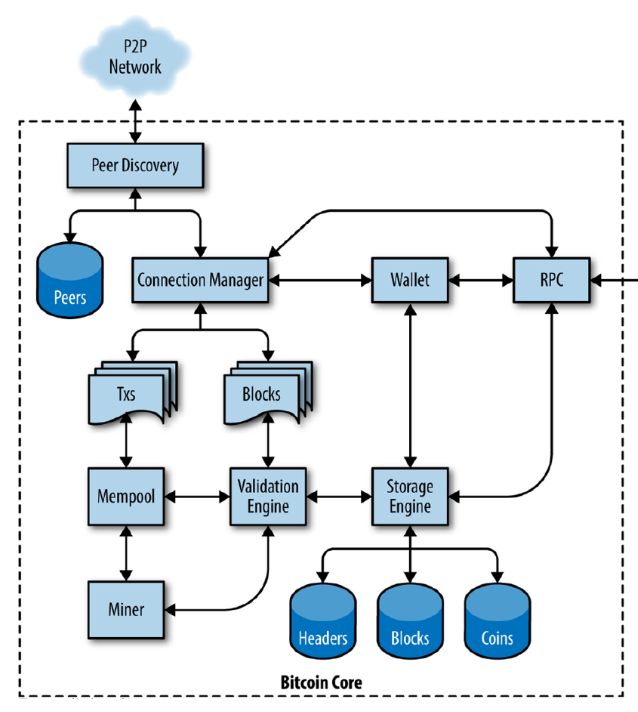
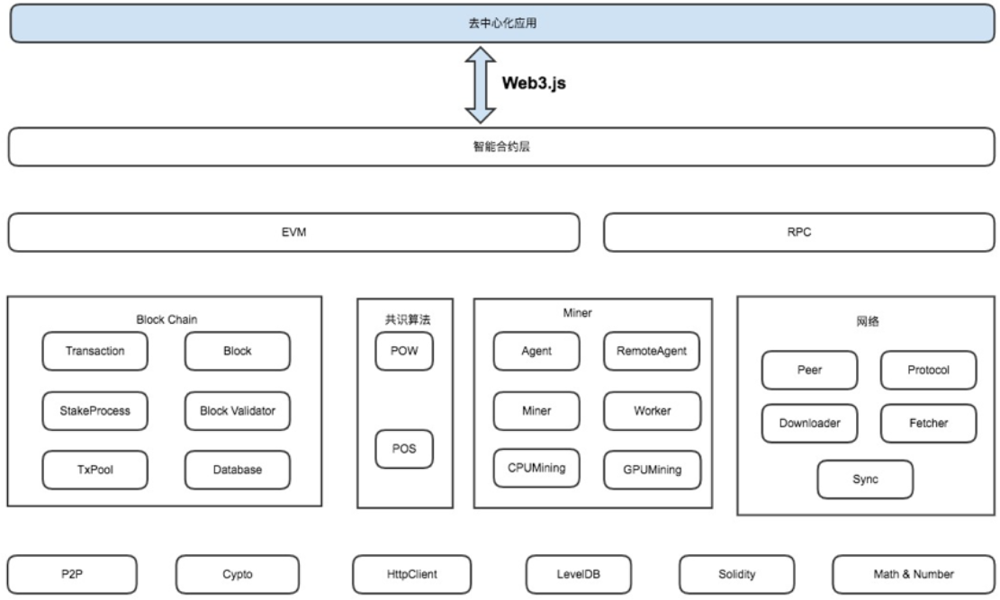
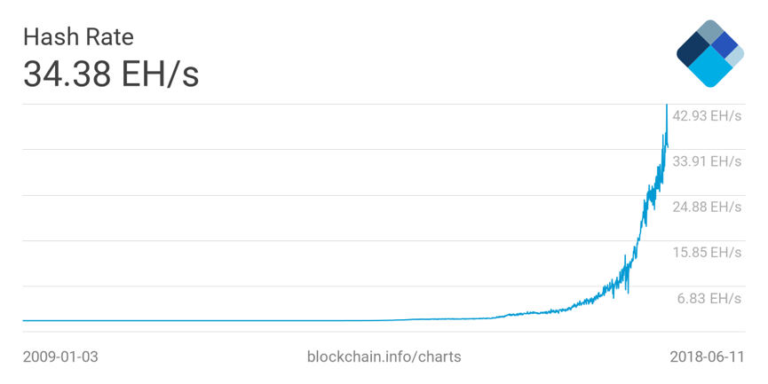
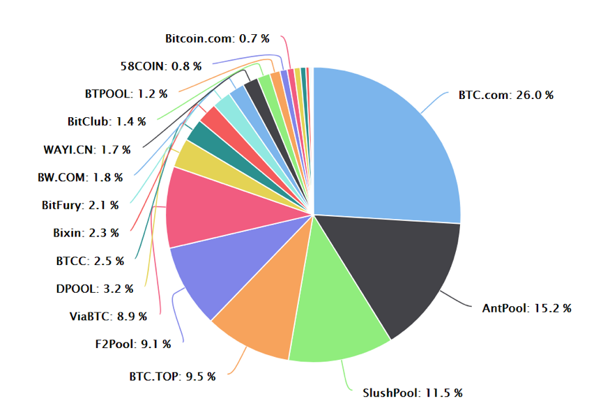
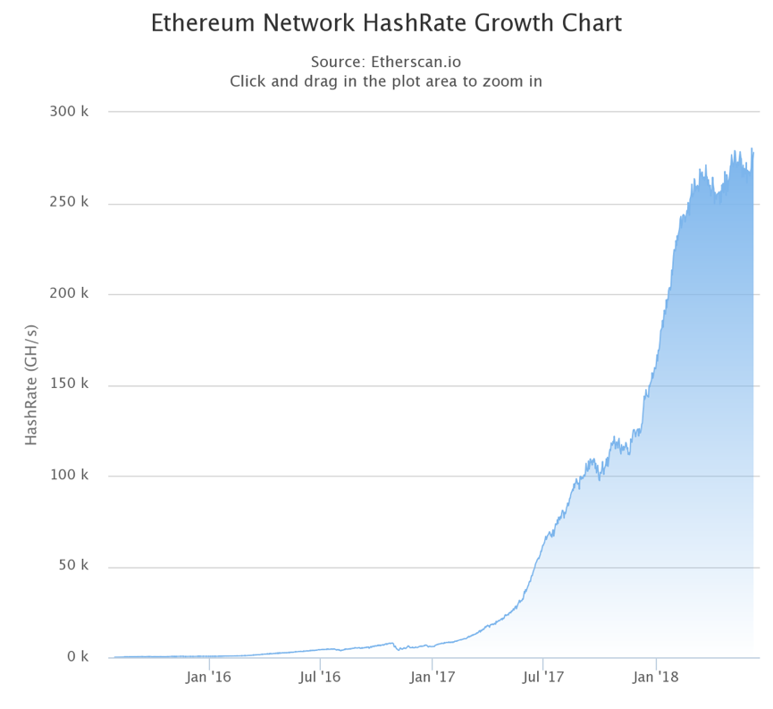
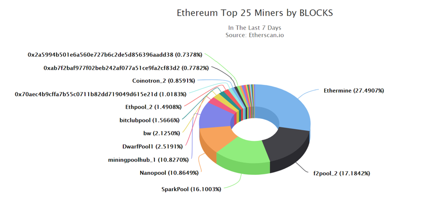
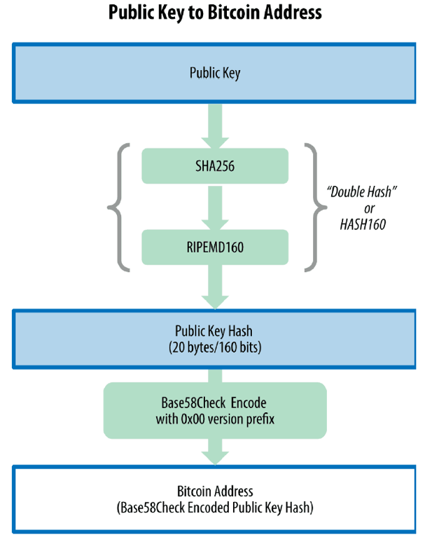
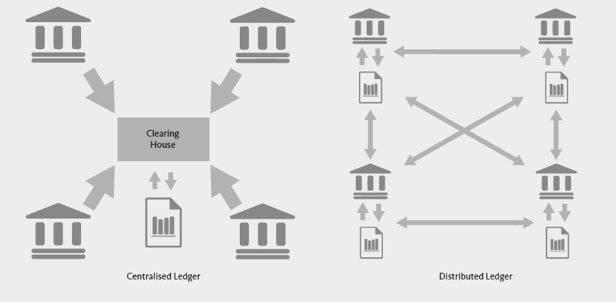

# 区块链

## 目录

1. [概念与全景](#概念与全景)
2. [比特币基础](#比特币基础)
3. [以太坊基础](#以太坊基础)
4. [开放社区生态中的物种构成](#开放社区生态中的物种构成)
5. [区块链的四大支柱](#区块链的四大支柱)
   - [共识机制](#共识机制)
   - [密码学](#密码学)
   - [分布式账本](#分布式账本)
   - [智能合约](#智能合约)
6. [多面怪区块链](#多面怪区块链)

2008年11月1日，中本聪（Satoshi Nakamoto，匿名）公开论文 Bitcoin：A Peer-to-Peer Electronic Cash System

- [英文版](./Resource/bitcoin.pdf)
- [中文版](./Resource/比特币.pdf)

## 概念与全景

这篇论文中提出了一种全新的电子货币——比特币，宣告比特币的诞生。中本聪结合了诸如 b-money 和 HashCash 等先前的发明，创建了一个完全去中心化的电子现金系统，它不依赖中央机构进行货币发行或结算和验证交易。关键的创新是使用分布式计算系统（称为“工作量证明”算法）每10分钟进行一次全球性的“投票”，从而允许分布式网络达成关于交易状态的共识。

2009年1月3日，中本聪在位于芬兰赫尔辛基一个小型服务器上挖出了第一批比特币50个，这就是比特币的创世区块。从此，打开了数字货币创新的潘多拉盒子。

与政府法定货币不同，比特币不依靠特定货币机构发行，它依据特定算法，通过大量的计算产生，该计算能力来源于一个由众多节点构成的点对点（P2P）网络。该网络各节点共同维护一个去中心化的数据库（称为区块链），来确认并记录所有的交易行为，并使用密码学方法来确保货币流通各个环节的安全性。

这一设计可以确保安全性：比特币只能被真正的拥有者转移或支付，任何人无法通过大量制造比特币、或者伪造篡改交易记录来操纵、破坏整个比特币系统。

比特币是人类历史上第一次实现了去中心化的电子货币发行和交易，全网共同维护一份共享的账本。比特币的出现使得电子货币由传统的“中心化账本+中介”的模式向“公共账本+共识”的模式转变。

比特币的发行机制由比特币软件设定，其总数量为2100万个，任何人无权更改，因此具有极强的稀缺性。目前全世界发行流通的比特币共有1700万个（2018年6月），每一个比特币都是由矿工节点挖矿产生。

比特币软件设定，每10分钟全网产生一个区块，有幸挖到该区块的矿工将获得一定数额的比特币做为奖励，这就是所有流通比特币的发行源头。每隔210000个区块（即4年），奖励就会减半。也就是说，从第1个区块到第210000个区块，每个区块的奖励都是50个比特币，从第2100001区块到第420000区块，每个区块的奖励是25个比特币。以此类推，直到2140年左右，最后一枚比特币被挖出，从此再无新增的比特币。

比特币诞生后，人们被其设计上的简洁优美和未来的无穷可能性震惊，一批先知先觉的人开始关注这个领域。

著名的硅谷风险投资家马克 · 安德森（Marc Andreessen），对于比特币激发的巨大认知转变有着生动的描述：

>我有很多的程序员朋友。他们总是说“比特人都疯了。” 然后，几乎每次，他们会坐下来，看论文读代码，这会持续几周，然后他们就一百八十度大转弯。他们会说：“哦，额滴神啊，就是他！这是一个巨大的突破。这就是我们一直在等待的东西。他解决了一切的问题。不管他是谁，他都应该获得诺贝尔奖，他是一个天才（指中本聪）。就是它！分布式信任网络，这是互联网最最需要却从来没有出现过的。”

另外一个比特币的忠实粉丝、Mastering Bitcoin 的作者 Andreas · M · Antonopoulos 说：

>对“不是货币，而是去中心化信任网络”的领悟，让我开启了为期四个月的比特币沉醉之旅。我如饥似渴地寻找任何关于比特币的点滴信息，变得越来越着迷，每天都花上12个小时以上紧盯屏幕，竭尽所能地不断阅读、写作、学习和编程。从这段着魔的状态中走出来的时候，我的体重由于饮食不规律轻了20 多磅……

基于比特币模型，人们发明了无数类似的系统。一开始是简单的模仿和复制，甚至仅仅是修改一下比特币源码的参数，这些数字货币被称为山寨币（Alt Coin）。众多山寨币中，最成功的要数莱特币（Litecoin）了，莱特币部分地得益于这一深入人心的口号：比特是金，莱特是银。

早期的炒作过后，比特币在技术创新上的启示和价值被越来越多人认可和传播，越来越多天才加入这个领域，开始全面挖掘、升级比特币模型，创新程度大幅提升，诞生了诸如比特股（Bitshares）、以太坊（Ethereum）等较成功的系统。

2015年前后，人们开始将“区块链”技术从比特币中剥离出来，认为“比特币没有价值，区块链才是未来”。当时的背景下看，这一区分是有实际意义的。因为一直以来，比特币的“货币属性”都极具争议性（到今天依然如此）。这一区分将比特币中的核心技术——区块链——和投机炒作区分开来，有利于鼓励更多人群了解区块链技术，从而引发了全世界范围内的区块链浪潮，包括政府、产业界和媒体等。

至此，这一领域就被非正式地划分为两个圈子：币圈和链圈。尽管没有公认的划分标准，但一般认为，币圈的人主要关心“币价”，属于投资者和投机者，链圈的人主要关心作为技术的“区块链”，对币价涨跌持冷漠和鄙视态度，相关的项目和技术创新也都与“币”和“通证 Token”无关。

从币圈来看，近十年的发展可谓日新月异。矿机与挖矿、交易所、钱包、媒体、投资基金、衍生产品（如 ETF 和比特币期货）等日益丰富和活跃。近日有消息称，矿机巨头比特大陆已经成为台积电的第二大客户。挖矿芯片的飞速发展与比特币社区，已经构成了完美的产业协同进化。币圈的社区管理、内容创新也层出不穷。

从链圈来看，技术发展也非常迅速。以联盟链为代表的无币区块链，如超级账本 HyperLedger，也已经开发了多个面向企业的技术平台，开始得到各路巨头们的广泛应用。各个行业都有一些创业项目在试图将业务流程实现区块链化改造。

到今天为止，比特币已经成功运行近10年，社区成熟稳健，市值超过千亿美元。全球数字货币已经有上千种，未来还会更多。价值互联网、智能合约、去中心化应用、数字身份、开放社区经济、通证经济这些概念，激励无数人幻想未来的数字世界。

无论你赞同有币还是无币，区块链和数字货币已经掀起了一场席卷每个角落的创新浪潮，火爆已经成为事实，而且必将继续前进。至此，区块链和数字货币正式出现在历史舞台上。

在即将开始的这场旅行中，有两个不可错过的必玩景点：比特币和以太坊。请大家跟上我。

附录

读者可参考 Coindesk 的 State of Blockchain [季度和年度报告](https://www.coindesk.com/research/state-blockchain-2018/)

## 比特币基础

比特币是在2008年由署名为中本聪（Satoshi Nakamoto）的匿名人士发明的，是一个完全去中心化的电子现金系统，它完全不依赖中央机构（如央行）。

### 比特币开发团队——Bitcoin Core

中本聪于2011年4月退出公众视线，将代码和网络维护的责任转交给一个志愿开发者小组身上，即所谓的比特币核心（[Bitcoin Core](https://bitcoincore.org)）团队。目前社区认为， Bitcoin Core 团队是比特币的官方开发者团队，负责比特币的权威和参考版本，其他版本一般与之兼容。可在 Github 找到 Bitcoin core 的最新源代码。

Bitcoin 是一个开源项目，源代码可以根据开放（MIT）许可证提供，可免费下载并用于任何目的。任何人(包括你)都可以参与比特币的代码开发。到2018年，比特币的源代码有551个 contributor，大约十几位全职开发人员，几十名兼职开发者。

如图所示，为比特币核心的基本架构，可以据此对比特币软件有初步认识。



### 比特币：既是货币又是网络

比特币有三重含义：既代表比特币网络，也指网络节点使用的比特币软件，也可以指网络中交易的数字货币单位。用作数字货币或记账单位时，通常简写为 BTC 或 XBT。

比特币网络是一个由若干节点组成的用以广播交易信息和数据区块的 P2P 网络，这个网络包括矿工、比特币软件、钱包、用户、交易所等。

### 挖矿与工作量证明

矿工利用专门用于挖掘比特币的软硬件系统即矿机，来验证交易，并将交易打包成区块，完成工作量证明机制（proof-of-work），通过公平竞争，最终以获得区块奖励和交易手续费（也称矿工费）作为回报。比特币挖矿是一个极富竞争性的行业。自从比特币存在开始，每年比特币算力都成指数增长。

所谓工作量证明机制，就是重复计算区块头的哈希值，不断随机尝试一个参数，直到产生与难度哈希值匹配的过程。哈希函数的结果无法提前得知，也不存在得到特定哈希值的破解算法。所以，得到特定哈希值的唯一方法是依靠无数次不断的尝试，每次随机修改输入，直到出现适当的哈希值。因此这一机制催生了专用挖矿芯片和矿机的持续进化。矿机算力也构成对网络的一种保护。

可以将比特币挖矿类比为一个巨大的多人数独游戏。想象一个有几千行几千列的数独游戏。我们可以调整这个游戏的规模大小（更多或更少的行列），以保证全网计算机每次解开一个数独游戏需要大约10分钟。数独游戏与比特币挖矿 “谜题”都有一个非常好的性质：找到答案只能依靠诚实的计算，非常花时间；一旦找到，所有节点都可以很快验证答案是否正确。

### 手续费与区块奖励、减半发行机制

矿工挖矿，完成工作量证明的猜谜游戏是为了过去打包新区块的权力，这将为矿工带来两类收入：一是新区块中所有的交易手续费；二是区块奖励，即新币发行。

交易手续费是在发送比特币到另一地址时需要用户设定的支付给矿工的比特币数量，一般根据比特币网络中的市场力量动态确定。一笔交易的交易费越高，越可能被矿工优先处理。

挖矿所得的区块奖励就是新比特币的发行过程。新币发行被设计为产量递减模式，即 “四年减半”。系统设定，奖励给矿工的比特币数量大约每四年（或准确说是每210,000个块）减少一半。也就是说，2009年1月开始，区块奖励为50个比特币，然后到2012年11月减半为25个比特币。2016年7月再次减半为12.5个比特币，以此类推，直到2140年所有的比特币（21,000,000）全部发行完毕。2140年之后，不再有新的比特币产生，世界上流通的比特币上限恒定在2100万个。

比特币这种总量有限并且发行速度递减的机制，透明的、公平的、事前确定，保证了系统内生代币的长期价值，能够有效激励矿工、投资者及其他人及早进入积极行动，从而推动生态系统像滚雪球一样发展壮大。

### 比特币地址

比特币在不同的地址之间转移和交易。比特币地址（例如：1LVL7K3SNwZr7hUhBXrDYzx83mzL5h5eLt）由一串字符和数字组成，由公钥经过单向的加密哈希算法得到，相当于收款账户，类似于 email 地址。不同的数字货币有自己的地址体系，互相之间不能共用。

### 比特币交易

处理交易是比特币网络的核心功能。一笔交易是指把比特币从一个地址转移到另一个地址。更精确地，一笔“交易”指一个经过签名运算的、表达价值转移的数据结构。任何一笔交易的都附有交易费，意在通过对每一笔交易收取小额费用来防止对系统的滥用。

### 区块与区块链

每一笔“交易”都经过比特币网络广播和传输，由矿工节点收集并封包至区块中，永久保存在区块链某处。要确认一笔交易，一个交易必须包含在一个区块中，并被添加到区块链中。

一个区块（Block）就是若干交易数据的集合，它会被标记上时间戳和之前一个区块的独特标记，网络每10分钟生成一个区块。区块头经过哈希运算后会生成一份工作量证明，从而验证区块中的交易。所有的区块按时间顺序串联起来，形成区块链（Blockchain）。

比特币软件设定，平均每10分钟生成一个区块，称为出块速度。这就是比特币的心跳，是比特币的发行速率和交易达成的基准参数。为保证这一参数恒定，应对矿工算力的进入退出冲击，比特币网络设定了对挖矿难度进行动态调整的机制，即每2016个区块（约2周时间）调整一次，以实现平均10分钟产生一个新区块。

注意，并不是每个数字货币的出块速度都是10分钟。其他的数字货币都有自己的出块速度，如莱特币和 ZCash 是2.5分钟，以太坊是14秒左右。

你可以将区块链想象成地质上的沉积岩层构造。表层岩土会随着季节、洪水而变化，但是越往深处，地质层就越稳定。到了几十上百米甚至更深的地方，是保存了数百万年的岩层。在区块链里，区块在区块链中的位置越深，被改变的可能性就越小。

### 交易所

交易所是指提供数字货币与法币兑换服务的场所，是生态系统的重要参与者。大多数用户买卖比特币，都是通过交易所的币币交易（非法币）来完成的。目前全球有上万家交易所公司，也有一些场外交易的兑换平台。

### 小结

比特币代表了数十年的密码学和分布式系统的巅峰之作，这是一个独特而强大的组合，包括以下四个关键创新：

1. 一个去中心化的点对点网络（比特币协议）
2. 一个公共的交易账簿（区块链）
3. 一个去中心化的数学的和确定性的货币发行（挖矿机制）
4. 一个去中心化的交易验证系统（交易脚本）

这四点紧密协作，形成了整个比特币的软件系统。

以上是比特币景区的主要知识，接下来我们将进入另一个设计目标和原理完全不同的 5A 级景区——以太坊 Ethereum。

## 以太坊基础

由于比特币设计追求安全性和可靠性，内置的脚本语言限制和操作码有限，因此在比特币中只能实现极为有限的功能扩展。人们渐渐意识到，可以扩展比特币的设计，实现一个功能更强大、更灵活、通用的去中心化计算平台。由天才少年程序员、俄裔加拿大人维塔利克 · 布特林（Vitalik Buterin）创建的以太坊，正是这样的平台。

关于维塔利克 · 布特林，业内都称他为 V 神。2013年末，他发表了以太坊白皮书，描述了以太坊的技术设计和基本原理。2014年，V 神开始和 Gavin Wood 合作。2014年4月，Gavin 发表了以太坊黄皮书，给出了以太坊虚拟机的技术说明。该黄皮书充满数学符号，极为晦涩难懂，笔者曾挑战数次，最终放弃。

2014年6月，以太坊开启了为期42天的 ICO，募集到3万个比特币，当时价值1843万美元。从此以太坊步入正轨。

以太坊 Ethereum，是一个通用的图灵完备的智能合约和去中心化应用（Decentralized Application，简称 Dapp）平台。所谓图灵完备，可以简单理解为：一切可计算的问题都能够计算。

智能合约概念最早由密码学家尼克 · 萨博（Nick Szabo）在1995年提出，是一种在区块链上运行的相对独立的程序，是纸质合同的代码化和自动化的产物，极具革命性。智能合约完全按照程序设定的条件运行，可以自动实现条件判断、资金划转，杜绝了扯皮推诿、中心化操控、欺诈和干涉的可能性。去中心化应用（Dapp）是指一个功能完备的独立应用，类似于手机 App，包括一个或多个智能合约，以及交互界面。

要实现这样的宏大目标，以太坊的结构设计要远比比特币更复杂和抽象。V 神意识到了这一点，所以开发了一些设计原则来管理这种复杂性。

### 以太坊的设计原则（摘自白皮书）

1. 简洁：协议应尽可能简单，即使要付出数据存储和时间的代价。这可以降低个体对协议的影响。团队会拒绝增加复杂性的改进，除非它有根本性的好处。
2. 通用：没有“特性”是以太坊设计哲学中的核心特征。以太坊提供了一个图灵完备的脚本语言，以帮助用户创建任何的智能合约或交易类型。
3. 模块化：组件应尽可能模块化和独立。应支持在协议中做小改动的同时，应用层却可以不加改动地继续正常运行。最大程度地模块化可以帮助整个加密货币生态系统。
4. 无歧视：协议不应主动限制或阻碍某一特定的项目或用途，协议中的所有监管机制都应被设计为直接监管，不应拒绝不受欢迎的应用。你可以运行一个无限循环的程序，只要你支付足够的交易费用。

### 以太坊的结构

整个以太坊系统，可以分解为：一个 P2P 网络，共识规则，交易，以太坊虚拟机 EVM，区块链，共识算法和客户端。软件层面的构成包括：账户，状态，瓦斯和费用，交易，区块，交易执行，挖矿和工作量证明。如图所示为以太坊的基本架构。



以太坊虚拟机（EVM）是以太坊智能合约的执行环境。网络中的每个节点都运行 EVM，节点使用 EVM 执行所有的一般转账交易和智能合约交易，并获得区块奖励和交易费用。以太坊虚拟机是图灵完备的：这意味着 EVM 代码可以实现任何计算，包括无限循环。为防止智能合约陷入无限循环无法退出，以太坊引入了 Gas 费用机制，每一步计算都需要支付一定的费用，由于没有用户能支付无限的 Gas，这样就不会存在无限循环问题了。

Gas 是计算资源的计量单位，用来衡量在一个具体计算中需要的费用单位。对每个交易或智能合约，发送者都需要设置 Gas Limit 和 Gas Price。

Gas Limit 代表用户愿意花费在 Gas 上的钱的最大值。Gas Price 是为每个 Gas 支付费用的单价，即：你愿意在每个 Gas 上花费 Ether 的数量，以“gwei”进行衡量。如果交易使用的 Gas 少于或等于 Gas 上限，智能合约会被继续执行。如果 Gas 总数超过 Gas 上限，则撤销所有修改，除了依然合法且矿工能够收到费用的交易。

收取费用可以给矿工合理的经济激励，同时也是出于安全的考虑，防止节点向网络发送大量的零费用或极低费用的垃圾交易以堵塞网络。

以太坊的内生代币叫做以太币（Ether，简称 ETH）。以太币没有总量上限，目前采取了一个通胀率递减的发行模式，与比特币的递减发行机制不同。部署和执行智能合约需要用到以太币。因此，有人将以太币称为“燃料货币”，业界流行“比特币是黄金，以太币是石油”的说法。用户账户（所谓 EOA）和智能合约都可以拥有自己的地址，并持有以太币。

在以太坊中，可以用3种编程语言编写智能合约，包括 Solidity、LLL 和 Serpent，其中 Solidity 最受欢迎。

目前以太坊采用与比特币类似的 POW 工作量证明机制。矿工通过处理交易和执行智能合约来赚取以太币、生成区块。以太坊使用区块链数据结构和工作量证明共识协议，未来可能会升级到 POW+POS 的混合型共识协议。以太坊的出块时间更短（约14秒），因此带来了一些安全和技术问题，比如无效块（叔块）。

Whisper 是以太坊架构中的一个去中心化通信协议，Swarm 则是一个区中心化的文件系统。

### 以太坊的开发过程

以太坊的开发过程经历了4个阶段：前沿 Frontier，家园 Homestead，大都会 Metropolis 和宁静 Serenity。

- 从创始区块开始是 Frontier，只有命令行界面，持续时间为2015年7月30日至2016年3月。
- 区块高度1,150,000时，即2016年3月，进入以太坊第二阶段 Homestead，添加了图形界面。
- 在高度为1,192,000时，发生了著名的 DAO 被盗分叉事件，直接导致了以太坊经典（Ethereum Classic，简称ETC）的诞生，与回滚交易的 Ethereum 成为竞争的数字货币系统。DAO 事件细节戳[这里](http://www.8btc.com/eth-thedao)
- 在高度为2,675,000时，系统进入 Spurious Dragon 硬分叉，旨在解决拒绝服务攻击和重放攻击。
- 当前时点（2018年6月），以太坊处于 Metropolis 阶段，由两个硬分叉 Byzantium 和 Constantinople 带来。Byzantium 于2017年10月生效。预期 Constantinople 将于2018年年中生效，会引入 POW/POS 共识算法。
- 下一个里程碑版本是 Serenity，需要硬分叉，目前还没有明确的发布时间表。Serenity 将把共识协议改为 Casper（POS 的一个修订版本），并将整合状态通道和分片技术。

目前，市场上流通的以太币约1亿枚，单价为560美元，总市值约560亿美元，为第二大市值的公有区块链项目，仅次于比特币。

目前出现了一些新的公有区块链项目，旨在提供一个更强大的去中心化应用和智能合约的通用平台，与以太坊展开直接竞争，如 EOS。

理解比特币和以太坊之后，第4节我们会转向数字货币生态圈的更多玩家，如挖矿业、交易所和媒体等。

>了解更多：
>
>[以太坊官网](https://www.ethereum.org/)  
>[区块链浏览器](https://etherscan.io/)

## 开放社区生态中的物种构成

### 开放社区经济新时代：物种大爆发

比特币震惊世界的不是它疯狂的涨幅，而是它创造了一个开放社区经济的新时代。

开放社区最早源于黑客文化和开源软件运动，《大教堂与集市》一书对开源文化做了精彩论述。之前，开放社区主要局限于极客和黑客圈，以志愿者和松散线上社区为主，包括 Github、Apache、opensource.org 等。

比特币诞生后，开源社区获得了之前一直缺乏的经济激励机制，摆脱了依靠无私奉献和社区声誉激励的束缚，迎来了爆发式发展。

比特币是全球性开源社区经济的成功典范：全世界热爱、支持、开发和使用比特币的人，自动构成一个社区。他们开发矿机、挖矿、做钱包、做交易所、在 Github 上贡献代码、做媒体网站、翻译文献、建立投资基金、组织线下聚会等。这些参与者，不论是无私奉献还是唯利是图，都完善了社区生态，创造了价值，从而增加币的内在价值。而币价上涨，又会吸引更多人参与竞争和创新，未来会有更多物种加入、更好玩的现象发生。这一正反馈，是开放社区经济繁荣发展的逻辑基础。当然，那些恶意圈钱、操纵市场、欺诈用户的败类，是必须强烈谴责的。

像比特币和以太坊这样，以区块链为核心的生态系统，给人们带来巨大的启发。现在，社区化和生态系统化已经成为全行业的基本共识。

### 比特币经济体的挖矿行业

比特币挖矿是一个极富竞争性的行业。如图4.1所示，从比特币诞生开始，每年比特币算力都成指数增长。处于上游的比特币矿机也跟随比特币迅速演进，从早期最简单的 CPU 挖矿，到 GPU，到 FPGA，到现在的专用 ASIC 矿机。现在的挖矿竞争已经非常激烈和残酷，个体矿工（solo 挖矿）发现一个区块的可能性非常小。

因此出现了矿池模式，矿工们组成大型矿池，汇集算力进行挖矿并分享奖励。通过加入矿池，把搜寻候选区块的工作量分割，并根据算力比例分享挖矿奖励，减少了不确定性。矿池管理者收取一定百分比的费用。矿池对任何矿工开放，无论算力大小、专业或业余。

2018年6月，前八大比特币矿池分别是：BTC.com，蚁池AntPool，SlushPool，ViaBTC，BTC.top，鱼池F2Pool，BTCC，Bitfury 等。如图所示。



数据来源：Blockchain.info



数据来源：BTC.COM

### 以太坊经济体的挖矿行业

与比特币类似，所有采用 POW 工作量证明机制的数字货币，都有挖矿机制。如下两图展示了以太坊的算力增长和挖矿业格局。同样，以太坊的全网算力也保持了指数级增长，格局日趋集中化，矿池间竞争激烈。



数据来源：Etherscan.io



数据来源：Etherscan.io

### 数字货币交易所

数字货币交易所，也称交易平台，指通过互联网（网页或 App）为投资者提供买卖数字货币服务的私营公司。大多数人通过交易所买入或卖出数字货币。

**做市商 or 集中竞价**：有些交易所是做市商制度，通过提供流动性——即做市——赚取买卖价差。大部分交易所的盈利模式是集中竞价交易模式，收取交易手续费，没有做市商，类似于传统证券交易所。

**法币 or 币币**：部分交易所提供法定货币与数字货币的兑换服务，有些因法律监管原因仅提供币币交易，不涉及法币。目前市场来看，法币中美元和日元交易占主导地位，数字货币中比特币和以太坊交易占主导地位。为了解决法币兑换的问题，有人发明了锚定美元的数字代币，叫做 USDT，一美元兑换一枚 USDT。这种私营的、中心化的兑换中介发行的 USDT 缺乏美国政府背书，并非真正的美元，蕴含一定的风险，也引起了很大争议。

**场外交易**：为了逃避监管，场外交易平台也应用而生，如 Localbitcoins 及 OTCBTC 等。平台本身没有集中竞价交易，仅提供买卖双方的报价，双方自行一对一成交，交易平台提供担保，类似支付宝。场外交易的对手方风险较大，交易金额低，费率高，价格相对交易所有较高溢价。

**去中心化交易所**：除了中心化和场外交易之外，还有一种备受关注的去中心化交易所，旨在去除中心化交易所的“中心化”弊端。

除现货交易外，有些交易所还提供期货交易，5-20倍甚至更高的杠杆。数字货币本身波动性就大，杠杆过高意味着风险急剧放大，投资者应谨慎参与期货交易。

需要指出的是，交易所与数字货币开发团队没有关联，相互独立。用户在交易所购买数字货币以后，可以选择将其转移到自己控制的钱包地址中，称为提现。如果用户将币存放在交易所，需要承担交易所被黑客攻击或私钥遗失的风险，应谨慎考虑。历史上发生过惨痛的 Mx.Gox 门头沟倒闭事件、Bitfinex 被盗事件等。

**交易所的竞争格局**：

据 Coinmarketcap.com（CMC）统计，截止2018年6月，全球共有11346个交易所，交易1600种数字货币。因此交易所的竞争格局在日益恶化。影响力越大的币种，支持的交易所越多。 支持比特币的交易所有至少400家，交易对包括 BTC/USDT，BTC/USD，BTC/ETH，BTC/JPY，BTC/EUR 等。比特币一天的交易量是70万个 BTC，对应成交额约46亿美元。反观市值排名第200位的 Trade Token（TIO），全球只有13个交易所上线交易，最近一日成交额只有176万美元，仅相当于268个 BTC，是比特币成交量的1/2600。

目前（2018年6月）中国大陆已经关闭所有的数字货币交易所。2018年4月传出消息，纳斯达克有可能成为首个支持数字资产交易的主流证券交易所。

全球来看，各国都在加强对数字货币交易所的监管。我们相信，全球政府逐步接纳数字货币交易是必然趋势，中国市场未来一定会重新开放。

**其他：媒体、钱包、浏览器等：**

币圈其他物种，还包括媒体、区块链浏览器、钱包、开发者、投资机构等。这些服务不同程度地丰富了数字货币的应用场景。

币圈媒体很多，比较知名的有 Coindesk、国内的巴比特、金色财经、币世界、奇点财经（sfgroup.hk）等，以及大量的自媒体。其中 Coindesk 和巴比特是比较老牌的币圈综合性门户网站。币世界以社交性的实时短新闻见长，满足了短时、快速、高频的需求。奇点财经以高质量、客观准确和前瞻性深度报道见长，并尝试向研究和投资延伸。由于进入门槛较低，目前媒体的竞争非常激烈。

区块链浏览器是查看交易、区块和全网统计的网页版浏览器，目前主要玩家是大型矿池，并将其作为挖矿的附加服务免费提供。因为运营矿池，需要实时监视整个网络的交易和区块生成情况，因此矿池做区块链浏览器有天生优势。

钱包领域的竞争也日趋激烈。除了必需的安全性外，大多数用户都期望钱包可以支持多个币种，这样就不需要为每个币安装一个钱包。因此，钱包行业的竞争在向着品牌、安全性、多币种、用户体验等维度展开。

前面4节与您分享了区块链行业的全貌，接下来两节，我们将介绍区块链的基本结构。

## 区块链的四大支柱

区块链（Blockchain）是一系列现有成熟技术的有机组合，它对业务账本进行分布式的有效记录，并且提供完善的底层语言脚本以支持多样的业务逻辑。在典型的区块链系统中，数据以区块（block）为单位产生和存储，并按照时间顺序连成链式（chain）数据结构。所有节点共同参与区块链系统的数据验证、存储和维护。新区块的创建通常需得到全网多数（数量取决于不同的共识机制）节点的确认，并向各节点广播实现全网同步，之后不能更改或删除。

区块链的技术本质是一种去中心化、面向业务、跨主体、健壮与安全的分布式状态机，具有存储数据、共享数据、分布式、防篡改与保护隐私、智能合约等核心特征。基于这些特征，可以在不同参与者之间部署节点（具体可以采用公有链、联盟链或私有链模式），用区块链技术搭建一张社会化的业务流程与数据共享网络，从而以技术手段来解决跨主体之间存在的信任问题。

区块链技术是一个集成了多项技术成果的综合性技术集合，主要解决了交易的信任和安全问题。一般认为，其中有四项核心技术：共识机制、密码学、分布式账本技术和智能合约。当然，未来随着技术的演进，可能会有其他的技术被添加进来。

本节我们先介绍区块链技术的第一个支柱：共识机制。

### 共识机制

#### 为什么需要共识机制

武侠小说里，汇聚在一起的各路英雄意见各不相同，群龙无首，大家听谁的呢？公认的办法是打，一轮轮打下来，谁武功天下第一，大家都听他的。这就是江湖上的共识机制，靠实力说话。

类似地，区块链是一个去中心化的电脑网络，各节点间如何就交易和数据状态达成一致性的认识，是网络要解决的首要问题。区块链通过一套共识机制来使得各节点之间形成普遍认可。所谓共识，是指多方参与的节点在预设规则下，通过多节点网络的交互，对数据、行为或流程达成一致的过程。共识机制是指定义共识过程的算法、协议和规则。

这一点在去中心化体系中至关重要，而且与中心化的体系完全不同。中心化的业务体系中，都有一个可信的中心，它就是权威，所有其他参与者必须参照它的账本。比如政府机关、银行、支付宝。

因此，区块链的共识机制应具有民主自治的特点，包括少数服从多数以及人人平等。其中少数服从多数不一定指节点个数，也可以是计算能力、股权数或者其他特征量。人人平等是指所有节点都有权优先提出共识结果、直接被其他节点认同后并最后有可能成为最终的全网共识结果。

更进一步地，共识协议用于在分布式系统中实现可用性与一致性，其核心指标包括共识协议的强壮性（容错、容恶意节点的能力）、高效性（收敛速度，也即系统达成一致性或“稳态”的速度）及安全性（协议抽象理论模型的安全边界）。代表性协议包括 POW 共识、POS 共识、PBFT 共识及混合共识等。

#### 共识机制的分类

按节点属性，共识算法分为两类，可信节点间的共识算法与不可信（无信任或任意）节点间的共识算法。前者已经被深入研究且广泛应用。不可信节点间的共识算法，是在区块链出现以后才得到广泛研究和应用的。

根据应用场景的不同，共识算法又可以分为两大类，一类算法适用于公有链，包括以工作量证明 PoW（Proof of Work），权益证明 PoS（Proof of Stake）等算法。

另一类适用于联盟链或私有链，以实用拜占庭容错算法 PBFT（Practical Byzantine Fault Tolerance）及其变种算法为代表。提示：关于公有链、联盟链和私有链的概念，因本节容量不够，将移至下一节介绍。

#### 工作量证明 POW 算法

工作量证明 POW 算法是比特币和以太坊采用的共识算法，该算法于1998年由 W. Dai（戴伟）在 B-money 的设计中提出。

比特币的工作量证明是寻找满足特定难度值的区块头哈希（参考第二节比特币中介绍的挖矿机制），并引入了经济激励，设计了随着区块生成而持续滚动的无限次投票流程：

- 任何人都可以生成一个包含交易的新区块(增加账本数据)并广播；
- 必须完成足够难度的大量随机计算才能获得区块记账权；
- 其他人如果同意该区块纳入账本，则将该区块的哈希作为自己构造的区块数据的一部分，以对该区块进行“确认”；
- 对某个区块的“确认”也包含了对该区块前序所有区块的“确认”。

也有一类共识机制的思路是设计内存消耗型算法，比如 Ethereum 基于 Dagger-Hashimoto 的 Ethash，Zcash 基于广义生日悖论问题的 Equihash 等。这类算法在计算时需要占用大量内存，而内存作为成熟产品优化空间小，设计专用 ASIC 芯片的成本优势不大。

#### 权益证明 PoS（Proof of Stake）算法

权益证明 PoS（Proof of Stake）算法最早由 Sunny King 在2012年的点点币 PPC（Peer To Peer Coin）系统中首先实现。PoS 及其变种算法可以解决 PoW 算法一直诟病的浪费算力、运行成本高问题，但其本身尚未经过足够验证。PoS 协议下，节点获得区块创建权的概率取决于该节点在系统中所占有的权益比例的大小。简单说，PoS 机制中，你拥有的币越多，你就能够获得更多的区块奖励。以太坊目前正在计划以 PoS+PoW 机制来代替 PoW。

PoS 一般需要用户时刻在线，这对应用带来了很大挑战。为了解决这个问题，衍生出了 DPoS（Delegated Proof of Stake）共识，其核心思想是从先从全网节点中选出部分节点，保证这些节点的有效性，然后在该子节点集合内进行 PoS 共识。

#### PBFT 算法

BFT（Byzantine Fault-Tolerant）算法于20世纪80年代开始被研究，旨在解决所谓拜占庭将军问题。拜占庭将军问题（Byzantine failures）是指，拜占庭帝国军队的将军们必须全体一致，以决定是否攻击某一支敌军。问题是这些将军在地理上是分隔开来的，并且将军中存在叛徒。BFT 类算法中最著名的是 PBFT 算法。

PBFT 算法最早由卡斯特罗（Miguel Castro）和利斯科夫（Barbara Liskov）在1999年提出，该算法运行效率更高。假设系统中共有 N 个节点，那么 PBFT 算法可以容忍存在不多于1/3比例的恶意节点。

BFT 类共识随着参与共识节点的增加，通信开销会急剧上升，达成共识的速度则快速下降，难以支撑上万节点规模的分布式系统，一般 PBFT 共识系统中节点数很少超过100个。此外，节点参与共识首先要获得投票权，因此要为节点的加入和退出过程设计额外的机制，增加了协议复杂度和实现难度。

PBFT 的优点是收敛速度快、节省资源、具有理论上的安全界（理论上允许不超过1/3的恶意节点存在）。

#### 共识算法小结

无论是 PoW 算法还是 PoS 算法，其核心思想都是通过经济激励来鼓励节点对系统的贡献和付出。为了鼓励更多节点参与网络共识，公有链通常会发放代币（token）以激励节点的付出。

联盟链一般没有代币激励机制，联盟链的节点通常更愿意获得可信数据、获得业务合作关系等。通常，联盟链的参与节点数较少，节点信任度相对较高，因此 PBFT 类算法正好适用于联盟链或私链的应用场景。

长远来看，共识算法也在快速进化中，未来可能出现更好的共识算法机制。

下一节，我们将介绍区块链技术的另一个重要构成：密码学。

### 密码学

参考：《深入浅出密码学》

密码学技术是整个信息技术的基石。区块链中大量使用了信息安全和密码学技术，包括：哈希算法、非对称加密、数字签名、零知识证明等。

#### 哈希算法

哈希即 Hash，也称为散列算法。区块链采用密码学哈希算法，保证区块链账本的完整性（不被破坏）。常见的哈希函数包括庞杂的SHA家族等，比特币使用的是 SHA256。

哈希函数是一个数学函数，它具有以下特性：

输入可以是任意大小的字符串；
产生固定大小的输出
能进行有效的计算
哈希算法能将任意大小的二进制数据转换为一串较短的字符串。你可以将哈希输出理解为输入的一个指纹或唯一标记。这个指纹或标记严格依赖于输入的数据，且不泄露输入数据的任何信息。还有防撞击特性：输入数据不同，得到的哈希结果一定不同。

哈希函数具有输入敏感特性。也就是说，如果输入数据发生微小改变——比如改一个字符，那么输出将发生很大的变化。这带来两点好处：第一，你无法通过输出的变化，来推测输入发生了什么变化。第二，保存哈希值可以验证数据是否被篡改。

如果输入数据 A 被篡改为 B，而我们又存储了 A 的哈希值 X，只需对 B 进行哈希运算，看结果 Y 是不是与 X 相同，而且这个验算过程非常简单快捷。如果 Y=X，则 B=A，数据没有被改动。如果 Y≠X，则可断定 B≠A，证明原始数据 A 被篡改了。

以上就是区块链“无法篡改”的机制。在每个区块内，生成包含上一个区块的哈希值，并在区块内生成验证过的交易的 Merkle 根哈希值。一旦整个区块链某些区块被篡改，都无法得到与篡改前相同的哈希值，从而保证，当区块链被篡改时能够被网络节点迅速识别，最终保证区块链的完整性。

#### 非对称加密

对称加密是指，同一个密钥可以同时用作信息的加密和解密。

非对称加密则需要两个密钥：一个公开密钥（public key）和一个私有密钥（private key）。公开密钥与私有密钥是一对，如果用公开密钥对数据进行加密，只有用对应的私有密钥才能解密；如果用私有密钥对数据进行加密，那么只有用对应的公开密钥才能解密。并且将公钥公开后，根据公钥无法测算出对应的私钥。

非对称加密算法实现机密信息交换的基本过程是：甲方生成一对密钥并将其中的一把作为公用密钥向其它方公开；得到该公用密钥的乙方使用该密钥对机密信息进行加密后再发送给甲方；甲方再用自己保存的另一把专用密钥对加密后的信息进行解密。

常见的非对称加密算法包括 RSA 体系。

非对称加密强大的地方在于，它成功实现了在不安全环境中（如公开网络）传递敏感信息，多方通信需要的密钥数量较少，简化了密钥维护工作，而且可用于更强大的数字签名技术。

总结一下，使用公钥加密、私钥解密，完成了乙方到甲方的一次数据传递，通过私钥加密、公钥解密，同时通过私钥签名、公钥验证签名，完成了一次甲方到乙方的数据传递与验证，两次数据传递完成一整套的数据交互。

#### Merkle Tree

梅克尔树（Merkle trees）是区块链的基本组成部分，1979年由拉尔夫 · 梅克尔（Ralph Merkle）申请专利。理论上来讲，没有梅克尔树，区块链也可以实现。但这样每一笔交易的区块头会非常大，这会带来可扩展性方面的潜在困难。

简单的梅克尔树结构类似一个二叉树，所有区块都被两两分组，指向这些区块的指针被存储在上一层的父节点中，而这些父节点再次被两两分组，指向父节点的指针被存储在上一层的父节点中，一直持续这个过程，直到最后达到树的根节点。

利用梅克尔树，可以高效实现区块的隶属证明。假设现在某人需要证明某个数据区块隶属于梅克尔树，我们只需要记住根节点，然后他展示给我们数据区块的信息以及该数据区块通向梅克尔根的哪些数据区块，我们可以忽略梅克尔树的其余部分，而通过只该分支的数据到达这个目的。这点可以支持钱包的轻客户端开发。

比特币钱包服务用 Merkle Tree 的机制来作“百分百准备金证明”。过程是构建 Merkle Tree，当构建完该树，且根节点的余额与公布的储蓄地址余额相同，即证明了100%储备。

以太坊使用了更复杂的 Merkle Patricia Tree 技术。

#### 数字签名

数字签名技术是将摘要信息用发送者的私钥加密，与原文一起传送给接收者。接收者只有用发送者的公钥才能解密被加密的摘要信息，然后用 Hash 函数对收到的原文产生一个摘要信息，与解密的摘要信息对比。如果相同，则说明收到的信息是完整的，在传输过程中没有被修改，否则说明信息被修改过，因此数字签名能够验证信息的完整性。

数字签名是个加密的过程，数字签名验证是个解密的过程。

数字签名技术可以保证信息传输的完整性、发送者的身份认证、防止交易中的抵赖发生。实际上，数字签名是对纸质文档中广泛存在的公章、骑缝章、骑缝签名的数字对应物和颠覆。

有效的数字签名给了参与方一个坚强的理由去相信：

1. 该消息是由已知的发送者（身份认证）创建的；
2. 发送方不能否认已发送消息（不可否认性）；
3. 消息在传输中未被更改（完整性）。

比特币中使用的数字签名算法是椭圆曲线数字签名算法 ECDSA（Elliptic Curve Digital Signature Algorithm）。ECDSA 是用于基于椭圆曲线私钥/公钥对的数字签名的算法。

#### 零知识证明

战争中你被俘了，敌人拷问你情报。你是这么想的：如果我把情报都告诉他们，他们就会认为我没有价值，就会杀了我；但如果我死活不说，他们也会认为我没有价值而杀了我。怎样才能做到既让他们确信我知道情报，但又一丁点情报也不泄露呢？这就是零知识证明的问题情境。

零知识证明（Zero—Knowledge Proof），是由三位数学家 S.Goldwasser、S.Micali 及 C.Rackoff 在20世纪80年代初提出的。它指的是证明者能够在不向验证者提供任何有用的信息的情况下，使验证者相信某个论断是正确的。

零知识证明就是既能充分证明自己是某种权益的合法拥有者，又不把有关的信息泄露出去——即给外界的“知识”为“零”。

早在16世纪文艺复兴时期，意大利有两位数学家抢夺一元三次方程求根公式发现者的桂冠，就采用了零知识证明。当时，数学家塔尔塔里雅和菲奥都宣称自己掌握了这个求根公式。为了证明自己没有说谎，又不泄露公式的具体内容，他们摆开了擂台：双方各出30个一元三次方程给对方解，谁能全部解出，就说明谁掌握了这个公式。比赛结果显示，塔尔塔里雅解出了菲奥出的全部30个方程，而菲奥一个也解不出。于是人们相信塔尔塔里雅是一元三次方程求根公式的真正发现者，虽然当时除了塔尔塔里雅外，谁也不知道这个公式到底是个什么样子。

零知识证明的优点包括，不降低安全性，工作高效，计算过程量小，双方交换信息少。数字货币 ZCash 就使用了零知识证明，在整个交易过程中实现完全匿名。

#### 不是小结

最后，下图给出一个比特币系统中从公钥到比特币地址的一个密码学过程，方便读者能够对密码学在比特币中的具体应用有一个最小的、直观的理解。



### 分布式账本

分布式账本技术（distributed ledger technology，简称 DLT，也称为 shared ledger），是一种在网络成员之间共享、验证和同步的、记录成员之间的交易的分布式数据库，需要匹配一个点对点网络和共识算法，节点成员一般是地理上分开的，每个节点都存储一套账本的副本，没有中央管理者和中心化的数据存储。

如图所示，中心化账本和分布式账本的区别非常明显。



网络中的参与者根据共识原则来制约和协商对账本中的记录的更新，没有中间的第三方权威中介机构的参与。每个节点都可以参与验证和监督交易的合法性，同时也可以共同为其作证。分布式账本中的每条记录都有一个时间戳和唯一的密码签名，这使得账本成为网络中所有交易的可审计历史记录。

分布式账本可能是区块链行业里，最具有争议性的概念了。有些人认为它跟区块链是同义词，没什么区别。有些人则争辩说，区块链是线性的、链式数据结构，而分布式账本则不一定是链式，如 IOTA 的 Tangle，即，分布式账本不一定用区块链技术实现。从字面上来看，分布式账本强调了“分布式”和“账本”两个侧面。也有人因为分布式账本不强调“币”的属性，认为分布式账本适合于面向企业的联盟链模式。

鉴于区块链和分布式账本都处于发展初期，概念没有定论是正常的，我们建议读者根据具体的文本环境灵活理解。本文中，我们取分布式账本的狭义含义，即字面意义，并认为分布式账本是广义区块链技术的一个重要组成部分。

<b>分布式账本与传统“分布式存储”的区别</b>

传统分布式存储一般是将数据按照一定规则分割成许多份进行存储，而且一般是通过中心节点往其他备份节点同步数据，中心节点负责数据管理。传统存储模式是跟日益中心化的互联网发展密切相关的。大公司自然对应着大规模的数据中心，而这有必然对应着可能的单点故障、信息泄露、信息滥用等中心化信任问题。普通用户只能选择相信大公司的“好意”，而不是在技术上保证信息安全。

分布式账本技术可以从根本上改善这一点。由于各个节点均各自维护了一套完整的数据副本，任意单一节点或少数集群对数据的修改，均无法对全局大多数副本造成影响。换句话说，无论是服务提供商在无授权情况下的蓄意修改，还是网络黑客的恶意攻击，均需要同时影响到分布式账本集群中的大部分节点，才能实现对已有数据的篡改，否则系统中的大多数诚实节点将很快识别并追溯到恶意行为。这显然会大大提升系统的可信度和安全性。

#### 区块链的分类

按照区块链网络节点的公开程度，可以将区块链分为三类：公有链（public blockchain）、联盟链（consortium blockchain）和私有链（private blockchain）。

<b>公有链（Public Blockchain）</b>

公有区块链开放程度最高、去中心化程度最高、节点信任要求最低的区块链：任何个体都可以发送交易、成为节点、参与共识过程，且交易能够获得网络的有效确认。参与节点按照系统规则自由接入网络、不受控制，节点间基于共识机制开展工作。公有链向任何人开放，任何人都可以下载获得完整区块链数据，即全部账本。公有区块链是最早的区块链形态，也是目前应用最广泛的区块链。典型的数字货币如比特币、以太坊、莱特币等都是公有链。

<b>联盟链（consortium blockchain）</b>

联盟链是部分去中心化的区块链，由若干机构联合发起，介于公有链和私有链之间，只对有限的参与者开放。节点之间有一定的相互信任，节点类型可能有两类或更多类，各节点在不需要完全互信的情况下实现数据的可信交换，节点对应有权利和义务的分配，并对共享数据的访问做一定的访问控制。联盟链节点通常有对应的实体机构，适用于多个实体构成的组织或联盟，通过授权后才能加入或退出网络。

联盟链是一种公司与公司、组织与组织之间达成联盟的模式。比如几十家商业银行可以组成一个银行间的联盟链。联盟链的实质是产业联盟的区块链化，由某个群体（产业）内部指定多个预选的节点为记账人，每个块的生成由所有的预选节点共同决定（预选节点参与共识过程），其他接入节点可以参与交易，但不参与记账过程。因此对联盟链来说，预选节点的多少，如何决定每个块的记账者成为主要风险点。

跟公有链中每个节点地位等同不同，联盟链的节点是分层的、不对等的，有些节点权力比较大，如控制节点。

联盟链的特点是，节点之间互相熟悉，信任程度较高；节点、账本的可控制，满足监管和准入需求；通过分布式账本实现不可篡改的加密交易数据，交易可追溯不可抵赖，实现了较高程度的隐私保护（牺牲了去中心化程度）：交易匿名，交易不可关联；可监管和审计。

典型的联盟链项目有超级账本 HyperLedger 和 R3 等。我们将在第三篇中介绍这些主流的联盟链项目。

<b>私有链（Private Blockchain）</b>

私有链是只对一个参与者开放、完全中心化的区块链，其写入权限由中心机构控制，读取权限可视需求有选择性地对外开放，只有被许可的节点才可以参与并且查看数据。比如一个企业内部的区块链。私有链一般适用于特定机构将自己的业务流程实现区块链化改造。

关于区块链的分类，还可以分为两类：许可区块链和无许可区块链。

<b>许可区块链（permissioned blockchain）</b>

如果区块链的节点需要许可和授权可能加入网络，则称为许可区块链。许可区块链可以进一步细分为私有链、联盟链。

<b>无许可区块链（permissionless blockchain）</b>

如果区块链对所有人开放，节点加入网络不需要许可，可以自由加入或推出网络，节点之间不需要信任（即允许恶意节点的存在），则称为无许可区块链，等同于公有区块链。

#### 区块链分类小结

从目前的行业实践来看，联盟链的处理性能和效率更高，更易标准化，因此一般大企业更重视联盟链的开发。但是联盟链内是没有代币发行，因此对节点的激励机制上可能存在问题。

现在越来越多的人们开始意识到，没有代币的区块链，无法发挥出区块链模式的所有潜力，实际上是将区块链降格为一个普通的 IT 技术实施。虽然公有链在处理性能和效率有一定的瓶颈，但借助于开放式的社区和创新，系统价值直接反应在代币价格上，激励机制充分，因此大多数创业企业和开发者们更重视公有链的开发。

展望未来，有可能联盟链和公有链两分天下，互相融合。也有激进者认为，公有链开放程度更高、信任要求更低，因而变革更彻底，而联盟链很难解决代币发行和节点激励的问题，容易变成形式上的区块链而失去活跃度和创新性，最终可能会发生公有链一统天下的局面。

### 智能合约

智能合约（Smart contract）是一种以计算机语言编写、由计算机自动验证和执行的代码化的合同，是纸质合同的数字化形式。

智能合约概念于 1994 年由计算机科学家、法学家及密码学家尼克 · 萨博（Nick Szabo）首次提出。他对智能合约的定义是“一个智能合约是一套以数字形式定义的承诺（promises），包括合约参与方可以在上面执行这些承诺的协议。”

智能合约概念面世后，自然面临如何落地的问题：

第一，谁来执行合约？显然，签署合约的双方不应成为执行人。

这带来一系列问题：如何激励他为你执行合约而不是免费？他如何保持公正和中立？他缺位、消失或者拒不执行怎么办？

第二，如何通过计算机程序支付现金和资产？

当时技术条件尚未成熟，无法解决上述问题，因此智能合约迟迟无法变为现实。

#### 区块链是智能合约落地的土壤

数字货币和区块链诞生以后，上述问题得以顺利解决：

1. 执行智能合约的机制：去中心化网络+共识机制+受激励的矿工
2. 价值转移功能：内生可编程的数字货币
3. 去中心化的永不停机的计算网络，保持中立、公平、永远工作

区块链不仅内嵌数字货币系统，而且可编程可扩展，具有去中心化、不可篡改、过程透明、可追踪等优点，天然适合于智能合约。从此，智能合约才从理论构想变为落地的现实，从而插上了飞速发展的翅膀。区块链给智能合约提供了最佳的技术土壤，而智能合约功能也大大扩展了区块链的应用前景。目前一般认为，智能合约是基于区块链技术的自动执行的数字合约形式。

智能合约的出现，是社会经济运行进一步智能化、数字化的必然结果。人们用纸质合同做交易，已经有上千年的历史。合同，代表了不信任或者弱信任的双方做交易的标准形式。人们之所以信任合同、尊重合同，因为背后的机制是法律、法庭、名声、文化和道德感。智能合约以一种高度标准化、简洁、强大的方式，一举去掉了（至少削弱了）这些围绕纸质合同的繁琐机制，促进了社会进步。

#### 智能合约与去中心化应用

去中心化应用（Decentralized Application，简称Dapp）是一种基于区块链的互联网应用，它运行在一个去中心化的点对点网络上 (P2P 网络)，代码开源，网络中不存在能够完全控制 Dapp 的节点。去中心化应用一般应包括至少一个智能合约和一个网页用户界面，有时还需要一个去中心化的存储协议和去中心化的通信协议。去中心化应用的背后没有中心化的实体负责和运营，这与 “中心化应用”完全相反，比如微信、淘宝。可以认为智能合约等同于去中心化应用。

#### 智能合约的优点

与纸质合同相比，智能合约至少具有以下优点：

1. 合约制定的高时效性：合约制定中，不必依赖第三方或代理机构的参与，只需合约各方将共同约定的条款转化为自动化、数字化的计算机代码，繁文缛节大大减少；
2. 合约条款的明确性：代码化的智能合同含义明确，支持事前的测试，杜绝了纸质合同中的概念不清、理解分歧；
3. 合约签署的明确性：智能合约需要参与各方以私钥签名及发送交易才能启动，杜绝了签约过程中的假公章、恶意更改等；
4. 条款事先约定且自动强制执行：智能合约可对触发条件进行智能判断，根本上杜绝了人为错误、违约、拖延和“店大欺客”；
5. 合约执行的成本低、准确性高和效率高：智能合约一旦部署成功，利益各方均无法干预，由矿工节点按照约定条款监督、执行，一旦发生违约可由程序强制执行。与传统合约对应的律师法庭体系相比，智能合约大大降低了成本，提高了合约的执行准确性和高效性；
6. 更公正透明的商业环境：现实生活中存在大量的合同不公或欺诈，因为金额较小或诉讼成本太高或者不懂法律条文，受害一方往往只能忍气吞声。在智能合约世界里，一切清楚透明可查，且可以事先进行无限次的演练，这会塑造一个更公正透明的商业环境；
7. 跨国跨文化性：传统合同往往都与当地的商业文化、习俗、具体法规等有关，智能合约依赖于全球化的通用语言——编程语言，轻松越过了自然语言带来的障碍和瓶颈，可以在全球范围内推广使用。智能合约的盛行可能会带来数字世界的商业与信用文化逐渐走向统一。

#### 智能合约前景——替代纸质合同

想想传统纸质合同吧：公章，骑缝章，签名，一式三份，抠字眼抠条款，纸质档案保存与查询的不便，面对强势缔约方的不公待遇和霸王条款，各种萝卜章、虚假合同、偷换条款，执行中的沟通与扯皮，律师——大多数人请不起，法律诉讼——大多数人想不敢想，合同诉讼管辖地问题，漫长的立案庭审上诉执行过程等等。

智能合约就是要试图颠覆笨重低效的纸质合同。智能合约能够大幅度地降低交易成本，降低人工，增强了各方对合同本身的信任和尊重，让经济交易回归交易本身，增加交易各方的福利。从此，陌生人之间可以无需信任地放心交易，这将革命性地提升交易的范围和深度，给经济和社会生活带来巨大的改变。

早期的区块链解决了货币和支付的去中心化问题，插上智能合约翅膀的区块链可以创建、确认、转移不同的数字资产，并将人类经济生活中的复杂交易形式-合同也实现了代码化、区块链化和自动化。实际上，简单分析可知，几乎所有类型的合同交易都可以改造成区块链上的智能合约，包括：买卖合同，水电煤热类公用事业合同，借款合同，租赁与融资租赁合同，赠与合同，劳动合同等。

智能合约已经在以太坊、Hyperledger Fabric 等项目中得到广泛应用。最近智能合约这一概念被扩展为更宏大的智能经济、可编程经济等。围绕智能合约和去中心化应用平台的公有区块链竞争也日益激烈。

#### 智能合约存在的问题

目前智能合约还不成熟，存在着一些理论、技术安全、推广应用、法律等方面的问题。

理论上的问题在于，现在还无法从技术上事先判断：一个智能合约是否会陷入无限循环而无法停止。简单的解决办法是为智能合约设定一个费用上限或时间上限，每一步执行需要支付费用，避免无限循环。这是以太坊采取的办法。

另一个问题在于安全性，目前的智能合约常会因安全漏洞导致资产被盗。

应用层面的障碍在于，智能合约由代码构成，有一定门槛，普通用户无法编写自己的智能合约。解决办法有两类，一是开发图形化、可视化的编程界面，一是开发大量的标准化的智能合约模板，用户做小修小补即可。

#### 附录

1. 尼克 · 萨博最早对智能合约的[定义](http://www.fon.hum.uva.nl/rob/Courses/InformationInSpeech/CDROM/Literature/LOTwinterschool2006/szabo.best.vwh.net/smart.contracts.html)
2. 智能合约应用案例研究 ：Smart Contracts: 12 Use Cases for Business & Beyond
3. 一篇论文：Smart Contracts – [How will Blockchain Technology Affect Contractual Practices](https://www.researchgate.net/publication/312211462SmartContracts-HowwillBlockchainTechnologyAffectContractualPractices)

## 多面怪区块链

我们认为区块链是一个多维度的技术革命，可以把区块链比喻为一个多面怪。在多次的沟通和辩论中，我们发现总是无法用简单几句话来描述“区块链多么牛逼”，论战也多数“牛头不对马嘴”，因为双方不在相同的维度上。所以这个系列，也是作者个人经历无数口水仗之后痛定思痛的结果，希望能够对区块链有一个全面的拆分。

摸清楚一头大象需要5个盲人。那么要摸清楚区块链，可能需要20个甚至更多盲人。今天，我们终于凑齐了这20个盲人，带你360度认识区块链。分为上中下三篇：

```txt
第9课（上篇）————————
维度1：比特币开启了货币创新的新纪元
维度2：比特币开启了价值互联网时代
维度3：比特币首次实现“技术驱动金融”
维度4：从价值转移到智能合约
维度5：从数字货币到数字资产
维度6：从多账本到单一共享账本
维度7：区块链是新的多方协作平台
维度8：区块链是数据安全的新模式

第10课（中篇）————————
维度9：区块链是信任的机器
维度10：比特币实现了彻底的去中心化、民主和市场经济
维度11：比特币引领全球性开源社区经济的崛起，挑战金字塔型结构
维度12：区块链是永不停息的机器
维度13：代币经济将威胁股份制经济
维度14：开放性社区意味着职业的消解与再造

第11课（下篇）————————
维度15：社会经济重构倒逼知识重构
维度16：区块链将变革公共服务模式
维度17：区块链是唯一、公认、不可更改、多副本、永久保存的真相的历史
维度18：比特币社区代表了一种无信任的社区治理模式
维度19：数字货币预示未来的价值观
维度20：比特币开启了平行宇宙——数字世界的崛起
```

让我们从第一个维度开始。

### 维度 1：比特币开启了货币创新的新纪元

回顾货币的历史，从最早期的以物易物，到贝壳、金属、金银、纸币、支付宝，比特币，人们一直在寻找最好的货币形式。在这个漫长的演化过程中，货币逐渐剥离了实用价值，一步步抽象化、符号化和虚拟化，一步步摆脱了对实物和实体（如政府）的信任。

货币，本质上是一种共同的信任或信仰。比特币和数字货币，正是将“货币”中最本质、最不可缺的因素抽象出来，彻底剥离了实物价值、人和政府实体的因素。

以比特币为代表的数字货币，具备一系列优良特性，在几乎所有维度上都完胜法定货币。比如数字化、互联网化、内置支付网络、可分割、安全性、去中心化、透明性、低成本、无国界、零门槛、不可伪造、不可篡改、可追溯、隐私性、可编程性等。

货币形式演化到去中心化的数字货币（密码学+代码+账本），是人类文明的巨大进步。

### 维度 2：比特币开启了价值互联网时代

当前互联网的主要功能是信息传递。今天的微信、Facebook，已经可以实现全世界任意两点非常便捷地传递信息。但是，任意两点的转账现在还无法实现。国内支付宝和微信支付实现全国范围的自由转账，但依然依赖商业银行体系。

信息互联网还存在着一系列的缺陷：复制泛滥，数字版权保护难题等。有人批评互联网就是一个巨大的失控的拷贝机器。

比特币的颠覆之处在于，它第一次实现了任何人可以在任何地方将价值即时地（instant）传输给地球上另外一个人，而不需要借助于任何中介。人们称以比特币为代表的互联网为“价值互联网”，以区别于当前的信息互联网。

比特币系统实现了价值传递所需要的诸多特性：唯一性、安全性、不可逆、不可篡改、记录永久等。

展望未来，价值互联网基于并超越了信息互联网，区块链技术将再造信息互联网。

### 维度 3：比特币首次实现“技术驱动金融”

传统金融体系由金融和政治精英设计，是政治经济权力的体现，是自上而下。在传统金融公司里，IT 部门绝非主导，常常是：业务部门提需求，IT 部门负责实施。

比特币则完全不同：这里是极客的天下，他们制定一套完整的游戏规则，吸引大家参与，是完全的“草根发明”，是自下而上。比特币是由码农发明出来的一套金融系统，而不是金融家。人类历史上首次，由非金融人士设计了一套成功的全球化金融系统，这就是所谓的技术驱动金融。这是基本范式的巨大转变。

比特币背后的区块链技术，将彻底改变金融服务业的图景。区块链可以应用在支付、借贷、抵押、保险、证券交易、股权登记等领域，重构业务流程，提高效率，降低成本，减少人工，催生新商业模式。

忘掉什么 P2P 吧，区块链才是真正的互联网金融。金融将加速向数字世界迁移，大部分金融业务将来都有可能被代码化、上链、智能化，跟不上时代的都会被淘汰。干掉你的可能不是银行行长，而是一个呆萌 IT 男。

### 维度 4：从价值转移到智能合约

比特币网络的核心功能是处理最简单的转账交易。

能不能扩展一下，做复杂的交易呢？

最复杂最抽象的交易形式是什么？

是合同。

合同代表了不信任或者弱信任的双方做交易的标准形式。合同交易及其记录是构成我们社会经济，法律和政治体系的重要组成部分。

但是，以合同为中心的体制并没有跟上数字化浪潮的步伐。我们依然停留在纸质合同、公章、一式三份的旧石器时代。

现在，技术天才雄心勃勃，要用代码来实现合同。所谓智能合约 smart contract，是代码化的、能够自动执行、自动判断条件的电子合同，杜绝了纸质合同执行中的伪造、身份不明、理解分歧、扯皮推诿、诉讼等成本。

智能合约是基于区块链技术的自动执行的数字合约形式，是社会经济运行进一步智能化、数字化的必然结果。

数字货币以太坊（Ethereum，简称 ETH），目标就是成为一个通用的、图灵完备的智能合约平台。人们可以在其平台上编写自己的智能合约，实现多样化的类似纸质合同的功能。目前以太坊市值为400多亿美元，是仅次于比特币的第二大数字货币体系。

从价值转移到智能合约，区块链将处理绝大多数的经济交易，降低交易成本，提升效率，创造一个更富足的社会。

### 维度 5：从数字货币到数字资产

比特币作为“纯粹”的数字货币，是否可以扩展到数字形式的资产——数字资产呢？区块链具有交易记录不可更改的属性，天生适合于做数字资产的权利确认、权利证明及数字资产交易。利用区块链，可以轻易地创造多种数字资产。广义的数字资产，不仅包括数字货币，也应包括数字艺术品、数字知识产权、数字宠物等。

从数字货币到数字资产，区块链将成为数字经济的金融基础设施。

### 维度 6：从多账本到单一共享账本

传统机构如政府及企业里，业务处理流程的特征是：各方以自己为中心，开发并保存一套业务相关的账本。这使得业务真相存在于多个机构，存在多个账本。比如几乎所有文档都需要一式三份，加盖骑缝章，沟通成本高，交易成本高，不便查询，缺乏对个人的尊重和保护。多账本模式的核心特征是机构账户为主，业务流程（交易账本）为辅。

比特币模型第一次实现了，多个参与方以业务为中心共同维护一个公开账本，即所谓的分布式账本。分布式账本意味着全新的业务模型：业务（交易账本）为主，机构为辅。这种分布式的单一账本模式，有可能改变目前流行的多方存帐模式。

### 维度 7：区块链是新的多方协作平台

人类离不开协作，协作无处不在，协作的深度和广度决定了经济发展水平和福利。

比特币系统是建立在节点之间互不信任、可能存在黑客节点的假设之上的。比特币的成功，激发人们去理解这种互不信任的各方如何参与协作、形成共识的新模式。

区块链是可以实现陌生人之间大规模协作的机制和平台。这将突破原有界限和障碍，激发海量的交易、海量的合作、海量的可能性。

### 维度 8：区块链是数据安全的新模式

单点故障导致系统崩塌，是中心化数据管理模式难以克服的弊端之一。

比特币区块链构成了全新的数据安全模型。比特币的区块链数据是去中心化存储的，每个节点都存有一套完整的数据副本。这种较高的冗余度带来了数据安全性。即使部分节点遭到攻击，数据被篡改或丢失，其他节点也能迅速识别，数据完整性不会有任何损失。当网络在全球有成千上百个节点，数据有成千上百处的备份时，攻击者要同时篡改每个节点的数据，就变的不太现实。

对比当前中心化互联网的各种弊端（故障、删帖、更改、封禁、隐私泄露等），去中心化的存储模式激发人们去探索新的、更安全的互联网。


