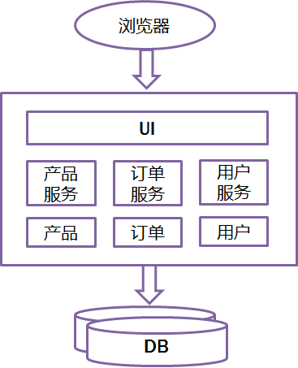

# 架构演进

## 目录

1. 单体架构
2. SOA架构
3. 微服务架构

软件架构是一个包含各种组件的生态系统，这些组件包括Web服务器、应用服务器、数据库、文件存储、通讯层，它们彼此存在关系。系统架构的目标是解决利益相关者的关注点。

>利益相关者的关注点？很抽象，是不是？出自《软件系统架构：使用视点和视角与利益相关者合作》一书，具体意义会在下一篇《架构定义理解》中谈及。

### 单体架构

简单架构图示例：

很久以前，我们去公司面试时，面试官通常会让我们简要介绍下软件设计中的三层设计模型（表示层、业务逻辑处理层、数据访问层）：

- 表示层：通常理解为用于和用户交互的视图层；
- 业务逻辑处理层：用户提交请求，经过业务逻辑层处理后，对用户请求作出响应；
- 数据库访问层：主要用于操作数据库。

尽管在软件设计过程中，架构师或者程序设计者遵守了流行一时的经典的三层模型，但由于并未按照业务场景进行划分，使得最终的系统应用将所有的业务场景的表示层、业务逻辑处理层、数据访问层放在一个项目中，然后经过编译、打包并部署到一台服务器上。

这种架构(Monolithic)适用于用户业务不复杂、访问量较小的时候，甚至可以将应用服务、数据库、文件服务器部署在一台服务器上。但随着用户业务场景变得越来越复杂，单体架构的局限性就很快暴露出来了，主要体现在如下几方面：

- 开发效率低：开发人员在一个项目改代码，代码冲突不断
- 代码维护难：代码功能耦合在一起，新人不知道从何下手
- 测试难度大：随着系统代码量的剧增，当修改应用程序或者新增需求时，测试难度成指数级增长
- 扩展性不够：随着用户访问量增加，单体应用的并发能力有限
- 稳定性不高：一个微不足道的小问题，可以导致整个应用挂掉
- 部署效率低：构建时间长，任何小修改必须重新构建整个项目，这个过程往往很长；

当然也有优点：

- 开发简单直接，集中式管理，基本不会重复开发
- 功能都在本地，没有分布式的管理开销和调用开销

### SOA架构

SOA(Service Oriented Architecture)是一种粗粒度、松耦合服务架构，服务之间通过简单、精确定义接口进行通讯，不涉及底层编程接口和通讯模型。SOA可以看作是B/S模型、XML（标准通用标记语言的子集）/WebService技术之后的自然延伸。

**主要优点：**

- 把模块（即服务）拆分，使用接口通信，降低模块之间的耦合度；
- 把项目拆分成若干个子项目，不同的团队负责不同的子项目；
- 增加功能时只需要再增加一个子项目，调用其它系统的接口就可以；
- 可以灵活的进行分布式部署。

**主要缺点：**

- 和单体架构相比，增加了系统复杂度，系统整体性能有较大影响；
- 多服务数据通信协议之间转换过程复杂，容易造成ESB(Enterprise Service Bus)性能瓶颈。

### 微服务架构

微服务(MicroServices)的概念是 Martin Flower 在2014年写的一篇论文《MicroServices》中提出来的。

**主要特点：**

- 每个服务按照业务划分；
- 服务之间通过轻量级API调用；
- 可以使用不同语言开发；
- 可以使用不同的数据存储技术；
- 可独立部署，服务之间互相不影响；
- 可针对用户访问流量大的服务单独扩展，从而能够节约资源；
- 管理自动化。

**主要挑战：**

- 微服务粒度大小难以划分，需要设计人员对业务有很好的掌握；
- 分布式复杂性，主要体现在分布式事务、网络延迟、系统容错等问题解决难度较大；
- 微服务之间通信成本较高，对微服务之间网络稳定性、通信速度要求较高；
- 由于微服务数量较大，运维人员运维、部署有较大的挑战。
