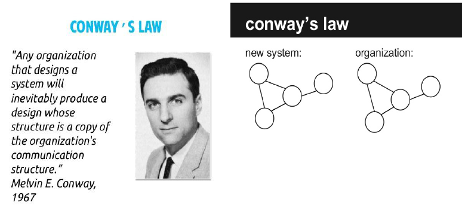

# 架构定义理解

作者：一尾蜂

先引入一句话：

设计系统的组织，其产生的设计和架构等价于组织间的沟通结构。

下面是English原文：

Organizations which design systems[...] are constrained to produce designs which are copies of the communication structures of these organizations.

嗯，很多朋友应该已经看出来了，这不就是大名鼎鼎的 `Conway's law（康威定律）` 吗？没错，你们都很厉害。

>就我自己来说，康威定律，虽早有耳闻，自认为知其义，但叩问灵魂，却是从来没有真正的理解过。

## 参考
