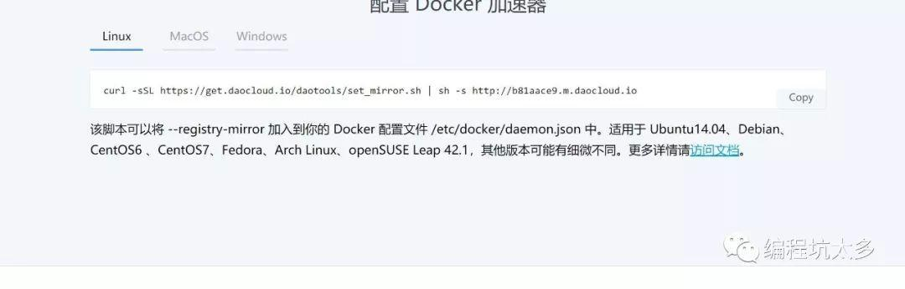

# Docker

## 目录

1. 命令
   - [Docker网络](#Docker网络)
   - [仓库](#仓库)
2. [docker compose](#docker&nbsp;compose)
3. 刻意练习
   - [练习1](#练习1)

## 镜像命令

### 在容器中安装新的程序

下一步我们要做的事情是在容器里面安装一个简单的程序(ping)。我们之前下载的tutorial镜像是基于ubuntu的，所以你可以使用ubuntu的apt-get命令来安装ping程序： `apt-get install -y ping`。

>备注：apt-get 命令执行完毕之后，容器就会停止，但对容器的改动不会丢失。

**目标**：在learn/tutorial镜像里面安装ping程序。

**提示**：在执行apt-get 命令的时候，要带上-y参数。如果不指定-y参数的话，apt-get命令会进入交互模式，需要用户输入命令来进行确认，但在docker环境中是无法响应这种交互的。

**正确的命令**：`docker run learn/tutorial apt-get install -y ping`

### Dockerfile最佳实践

**1、错误定位：**
  
每个Dockerfile的指令可以生成新的一层镜像，如果通过Dockerfile创建镜像出错，可以根据出错所在步骤的上一层启动容器，然后手工执行出错层的命令，以达到调试目的。

好的使用习惯：[http://dockone.io/article/131](http://dockone.io/article/131)，[http://dockone.io/article/132](http://dockone.io/article/132)

**2、使用缓存：**

Dockerfile的每条指令都会将结果提交为新的镜像，下一个指令将会基于上一步指令的镜像的基础上构建，如果一个镜像存在相同的父镜像和指令（除了ADD），Docker将会使用镜像而不是执行该指令，即缓存。

为了有效地利用缓存，你需要保持你的Dockerfile一致，并且尽量在末尾修改。我所有的Dockerfile的前五行都是这样的：

```dockfile
FROM ubuntu
LABEL maintainer="Colin Chen <399596326@qq.com>"
RUN echo "deb http://archive.ubuntu.com/ubuntu precise main universe" > /etc/apt/sources.list
RUN apt-get update
RUN apt-get upgrade -y
```

更改MAINTAINER指令会使Docker强制执行RUN指令来更新apt，而不是使用缓存。所以，我们应该使用常用且不变的Dockerfile开始（译者注：上面的例子）指令来利用缓存。

**3、使用标签：**

除非你正在用Docker做实验，否则你应当通过-t选项来docker build新的镜像以便于标记构建的镜像。一个简单的可读标签将帮助你管理每个创建的镜像。

## 仓库

### Docker Hub

仓库是集中存放镜像的地方。目前Docker官方仓库维护了一个[公共仓库](https://hub.docker.com)，其中已经包括15000多个的镜像。大部分需求都可以通过在Docker Hub中直接下来镜像来实现。

**登录：**

可以通过执行 `docker login` 命令来输入用户名、密码和邮箱来完成注册登录。

**基本操作：**

用户无需登录可以通过 `docker search` 命令来查找官方仓库中的镜像，并利用 `docker pull` 下载到本地，可以通过 `docker push` 命令将本地镜像推送到 docker hub。

先tag一下复制一个镜像，然后把镜像push到服务器上

```sh
docker images
docker tag <ImageID> <ImageName> #复制镜像
docker push <ImageName> #推送到服务器
```

### 创建和使用私有仓库

**使用registry镜像创建私有仓库：**

可以通过docker官方提供的registry镜像来搭建一套本地私有仓库。镜像地址：[https://hub.docker.com/_/registry/](https://hub.docker.com/_/registry/)

命令：

```sh
docker run -e SEARCH_BACKEND=sqlalchemy -e SQLALCHEMY_INDEX_DATABASE=sqlite:////tmp/docker-registry.db -d –name registry -p 5000:5000 registry
```

- -e设定环境变量
- -d从后台启动的方式启动镜像
- -name 启动的容器名字
- -p 暴露端口，容器内部的5000绑定到宿主机的5000端口上。

**registry镜像本身：**

SEARCH_BACKEND=sqlalchemy默认索引是可以查询的

参考地址：

- [https://github.com/docker/docker-registry#search-engine-options](https://github.com/docker/docker-registry#search-engine-options)
- [https://hub.docker.com/_/registry/](https://hub.docker.com/_/registry/)

自动下载并启动一个registry容器，创建本地的私有仓库服务。默认仓库创建在/tmp/registry目录下。上传到本地的私有仓库中

```sh
docker tag <ImageId> <IP:port/ImageName>
docker push <IP:port/ImageName>
```

报错了：http:server gave HTTP response to HTTPS client 后面会告诉你如何解决往下看。

docker启动参数配置：

- 环境：centos7解决上边的问题
- 配置文件：/lib/systemd/system/docker.service 修改成：
  
  ```conf
  #ExecStart=/usr/bin/dockerd
  ExecStart=/usr/bin/dockerd -H tcp://0.0.0.0:2375 -H unix:///var/run/docker.sock --insecure-registry 192.168.100.146:5000
  ```

  （此处默认2375为主管理端口，unix:///var/run/docker.sock用于本地管理，7654是备用的端口）

  重启服务，在启动一个私有仓库的容器，然后push到私有仓库中
  
  ```sh
  systemctl daemon-reload && service docker restart
  ps -ef|grep docker
  docker run -e SEARCH_BACKEND=sqlalchemy -e SQLALCHEMY_INDEX_DATABASE=sqlite:////tmp/docker-registry.db -d –name registry -p 5000:5000 registry
  docker push <IP:port/ImageName>
  ```

参考地址：[https://docs.docker.com/engine/admin/configuring/](https://docs.docker.com/engine/admin/configuring/)

### 仓库加速服务

加速下载官方镜像：

- 推荐服务：[https://dashboard.daocloud.io/](https://dashboard.daocloud.io/)
- 点击加速器：[https://dashboard.daocloud.io/mirror](https://dashboard.daocloud.io/mirror)

配置Docker加速器：

```sh
curl -sSL https://dashboard.daocloud.io/daotools/set_mirror.sh | sh -s http://b8laace9.m.daocloud.io
```



### 仓库管理

Registry Web UI 用于镜像的查询，删除。镜像地址：[https://hub.docker.com/r/atcol/docker-registry-ui/](https://hub.docker.com/r/atcol/docker-registry-ui/)

启动命令：运行下面的命令的时候建议先配置上边讲的加速哦，因为要下载的东西有点多。

```sh
docker run -d –name registry_ui -p 8080:8080 -e REG1=http://172.17.0.2:5000/v1/atcol/docker-registry-ui
```

- 查看端口是否启用：`netstat -nlp|grep 8080`
- 查看logs：`docker logs -f registry_ui`
- 访问地址：`http://IP地址:8080`

## 附录

> [Docker公共镜像库](https://hub.docker.com/)，账号：wolfkings  密码：Cxf5609757。[阿里云镜像库](https://opsx.alibaba.com/mirror)

使用 gitlab-ce 镜像：

```sh
docker run --detach --hostname gitlab.example.com --publish 443:443 --publish 80:80 --publish 22:22 --name gitlab --restart always --volume /srv/gitlab/config:/etc/gitlab --volume /srv/gitlab/logs:/var/log/gitlab --volume /srv/gitlab/data:/var/opt/gitlab gitlab/gitlab-ce:latest
```

- 官方网站：[https://docs.docker.com/linux/started/](https://docs.docker.com/linux/started/)

## docker&nbsp;compose

原文：[https://idig8.com/2018/07/27/docker-chuji-12/](#https://idig8.com/2018/07/27/docker-chuji-12/)

**1. 什么是DockerCompose？**

编排和配置容器集群的工具。

编排：定义被部署的对象的各组成部分之间的耦合关系，部署流程中各个动作的执行顺序，部署过程所需要的依赖文件和被部署文件的存储位置和获取方式，以及如何验证部署成功。这些信息都会在编排工具中以指定的格式定义并保存下来，从而保证这个流程可以在新的环境中快速的复现。

场景：redis容器，tomcat容器，nginx容器，mysql容器，这4个容器的启动是有顺序性的，docker compose就是为了组合启动的，而不是手动来启动。（本例子讲的是2个容器，redis和web）

**2. Docker Compose安装：**

下载docker-compose 二进制文件

```sh
curl -L https://github.com/docker/compose/releases/download/1.24.0/docker-compose-`uname -s`-`uname -m` -o /usr/local/bin/docker-compose
chmod +x /usr/local/bin/docker-compose
```

黑魔法：下载地址：`https://github.com/docker/compose/releases`，可以访问外网的环境，在线安装省心

查看是否成功安装：`docker-compose --help`

**3. DockerCompose使用入门：**

准备环境：

1） 创建测试项目文件夹

```sh
mkdir composetest
cd composetest
```

默认python2.7在centos都安装了，就用python来演示，演示之前需要安装pip工具，类似java的maven管理python模块的工具

```sh
#这个软件包会自动配置yum的软件仓库。
yum install -y epel-release
yum install -y python-pip
```

当然你也可以不安装epel这个包，自己配置软件仓库也是一样的，自己手工添加软件仓库配置文件：

```sh
vi /etc/yum.repos.d/epel.repo

[epel]
name=epel
mirrorlist=http://mirrors.fedoraproject.org/mirrorlist?repo=epel-$releasever&arch=$basearch
enabled=1
gpgcheck=0
```

添加完毕之后：`yum clean all && yum update`

最后终极大发——有pptpd的yum源

```sh
rpm -Uvh http://poptop.sourceforge.net/yum/stable/rhel6/pptp-release-current.noarch.rpm
```

2） 编辑app.py并保存

（描述：简单的一个httpserver，主要是为了类似tomcat的一个sevlet，当访问一次，redis节点就增加一个，就可以看到相应的输出）

```py
from flask import Flask
from redis import Redis
app = Flask(__name__)
redis = Redis(host='redis', port=6379)
@app.route('/')
def hello():
  redis.incr('hits')
  return 'Hello World! I have been seen %s times.' %redis.get('hits')
if __name__ == "__main__":
  app.run(host="192.168.101.13", debug=True)
```

3） 在项目目录创建requirements.txt并保存

命令：

```sh
vi requirements.txt
```

内容：

```txt
flask
redis
```

利用Dockerfile创建docker镜像（重头戏）

命令：

```sh
vi Dockerfile
```

内容：

```sh
FROM python:2.7
ADD . /code
WORKDIR /code
RUN pip install -r requirements.txt
CMD python app.py
```

命令：

```sh
docker build -t web .
```

定义服务

创建docker-compose.yml文件，Compose文件定义了2个服务，web和redis。

Web服务：

1. 从当前目录下的dockerfile创建
2. 容器的5000端口与宿主机5000端口绑定
3. 将项目目录与容器内的/code目录绑定
4. web服务与redis服务建立连接

命令：

```sh
vi docker-compose.yml
```

内容（实践时要将注释内容删除）：

```yml
version: '2'        -- version版本
services:           -- services服务
  web:              -- web服务名称
    build: .        -- build当前目录
    ports:
      - "5000:5800" -- ports映射的端口
    volumes:
      - .:/code     -- 挂载
    depends_on:     -- 前置服务redis
      - redis
  redis:            -- redis依赖的镜像
    image: redis   -- 不能用tab，必须用空格
```

通过compose运行app服务

```sh
docker-compose up
```

备注：

```sh
docker-compose up –d （后台启动）
docker-compose stop （停止运行）
```

Compose命令集：[https://docs.docker.com/compose/reference/](#https://docs.docker.com/compose/reference/)

## 练习1

- 配置文件：[docker-compose.yml](./Codes/docker-compose.yml)
- 初始化：`docker swarm init`
- 运行：

  ```sh
  docker stack deploy -c docker-compose.yml getstartedlab #应用程序命名为getstartedlab
  ```

- 查看应用程序服务：`docker service ls` 或者 `docker stack services getstartedlab`

- 在服务中运行的单个容器称为任务，任务被赋予以数字递增的唯一ID。列出您的服务任务：`docker service ps getstartedlab_web`

  如果您只列出系统上的所有容器，则任务也会显示，但不会被服务过滤：`docker container ls -q`

- 您可以 `curl -4 http://localhost:4000` 连续多次运行，或者在浏览器中转到该URL并点击刷新几次。无论哪种方式，容器ID都会发生变化，从而证明负载均衡；对于每个请求，以循环方式选择5个任务中的一个来响应
  
- 您可以通过更改docker-compose.yml，保存并重新运行 `docker stack deploy` 命令来扩展应用程序，Docker执行实时更新，无需首先删除应用或杀死任何容器。

  Take the app down：`docker stack rm getstartedlab`  
  Take down the swarm：`docker swarm leave --force`

- 基本命令：

  ```sh
  docker stack ls  # List stacks or apps
  docker stack deploy -c <composefile> <appname>  # Run the specified Compose file
  docker service ls  # List running services associated with an app
  docker service ps <service>  # List tasks associated with an app
  docker inspect <task or container>  # Inspect task or container
  docker container ls -q # List container IDs
  docker stack rm <appname> # Tear down an application
  docker swarm leave --force # Take down a single node swarm from the manager
  ```

**集群：**

准备工作：

```sh
# 下载Oracle VirtualBox
wget http1s://download.virtualbox.org/virtualbox/6.0.6/VirtualBox-6.0-6.0.6_130049_el7-1.x86_64.rpm

# 安装VirtualBox
yum install VirtualBox-6.0-6.0.6_130049_el7-1.x86_64.rpm

# 安装docker-machine
base=https://github.com/docker/machine/releases/download/v0.16.1 && curl -L $base/docker-machine-$(uname -s)-$(uname -m) >/tmp/docker-machine && sudo install /tmp/docker-machine /usr/local/bin/docker-machine

# 通过显示机器版本来检查安装：
docker-machine version
```

Machine资源库提供了几个bash脚本，可添加以下功能：

- 命令完成
- 一个在shell提示符下显示活动计算机的函数
- 一个函数包装器，它添加一个docker-machine use子命令来切换活动机器

确认版本并将脚本保存到 /etc/bash_completion.d 或 /usr/local/etc/bash_completion.d：

```bash
base=https://raw.githubusercontent.com/docker/machine/v0.14.0
for i in docker-machine-prompt.bash docker-machine-wrapper.bash docker-machine.bash
do
  sudo wget "$base/contrib/completion/bash/${i}" -P /etc/bash_completion.d
done
```

然后，您需要 `source /etc/bash_completion.d/docker-machine-prompt.bash` 在bash终端中运行，告诉您的设置，它可以找到docker-machine-prompt.bash您之前下载的文件。

要启用 docker-machineshell 提示，请添加 $(__docker_machine_ps1) 到您的PS1设置中~/.bashrc。

```sh
PS1='[\u@\h \W$(__docker_machine_ps1)]\$ '
```

可以在每个脚本顶部的[注释](https://github.com/docker/machine/tree/master/contrib/completion/bash)中找到其他文档。

如何卸载Docker Machine？

- （可选）删除您创建的计算机。

要单独删除每台机器： `docker-machine rm <machine-name>`

要删除所有计算机：(docker-machine rm -f $(docker-machine ls -q) 您可能需要 -force 在 Windows 上使用）。

删除计算机是一个可选步骤，因为在某些情况下，您可能希望将现有计算机保存并迁移到 Docker for Mac 或 Docker for Windows 环境。

- 删除可执行文件：`rm $(which docker-machine)`

注意：作为信息点config.json，与创建的每个虚拟机相关的证书和其他数据docker-machine 存储在 ~/.docker/machine/machines/Mac 和 Linux 以及 ~\.docker\machine\machines\Windows 上。

我们建议您不要直接编辑或删除这些文件，因为这只会影响 Docker CLI 的信息，而不会影响实际的VM，无论它们是本地还是远程服务器。

继续示例：

使用VirtualBox驱动程序创建2个VM

```sh
docker-machine create --driver virtualbox myvm1
docker-machine create --driver virtualbox myvm2
```

如果报错：`yum -y install kernel-devel-3.10.0-862.el7.x86_64`
