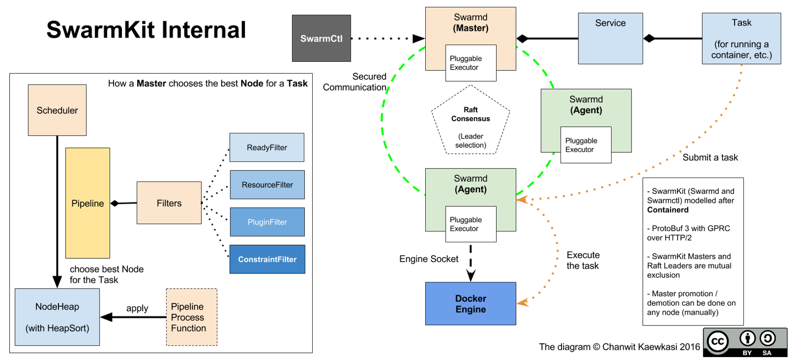
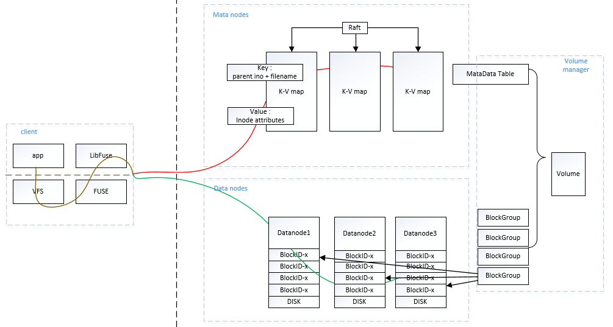
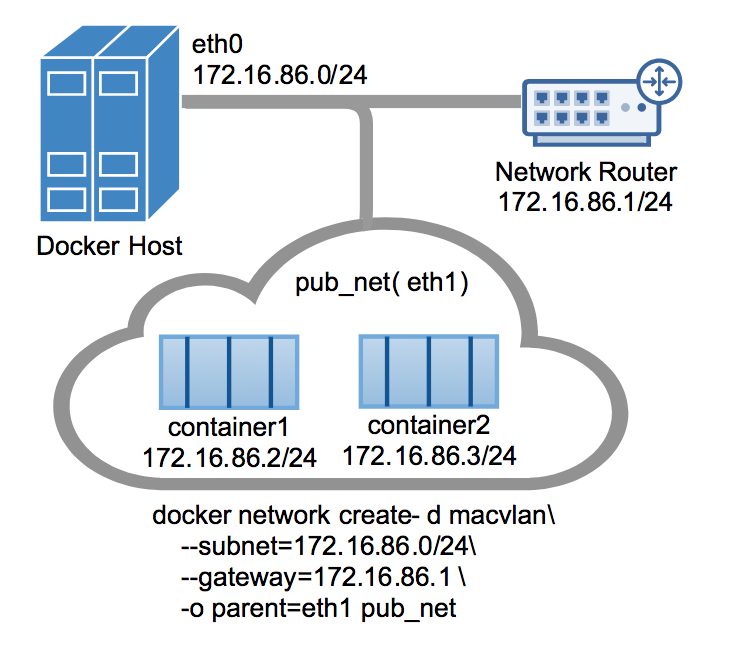
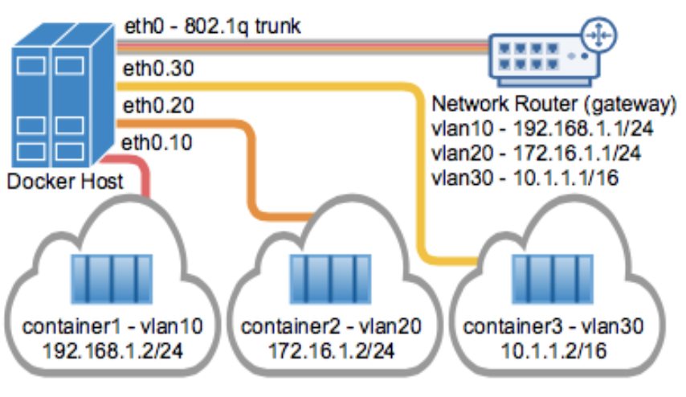
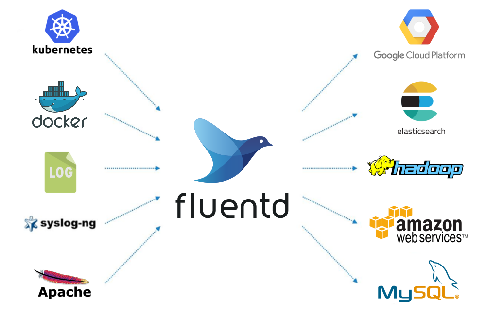
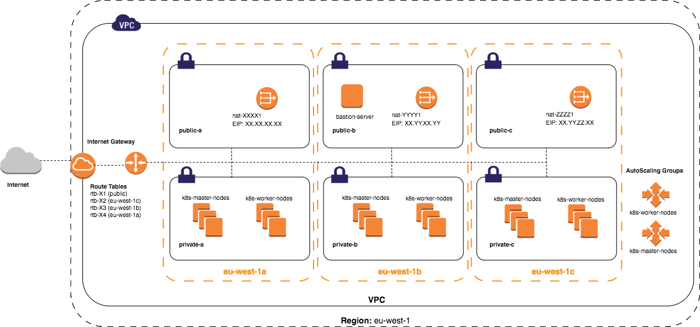

# Docker

## 目录

1. 简介
   - [Windows容器](#Windows容器)
   - [基于Docker的DevOps方案](#基于Docker的DevOps方案)
   - [容器云平台的构建实践](#容器云平台的构建实践)
   - [容器网络机制和多主机网络实践](#容器网络机制和多主机网络实践)
   - [Docker日志机制与监控实践](#Docker日志机制与监控实践)
   - [自动化部署分布式容器云平台实践](#自动化部署分布式容器云平台实践)
2. 命令
   - [Dockerfile命令](#Dockerfile命令)
   - [Docker日志命令](#Docker日志命令)
   - [限制容器资源](#限制容器资源)
     - [内存限制](#内存限制)
     - [CPU限制](#CPU限制)
   - [容器命令](#容器命令)
     - [容器的生命周期](#容器的生命周期)
     - [创建容器](#创建容器)
     - [容器导出](#容器导出)
     - [容器导入](#容器导入)
   - [数据管理](#数据管理)
   - [Docker网络](#Docker网络)
   - [仓库](#仓库)
3. [docker compose](#docker&nbsp;compose)
4. 刻意练习
   - [练习1](#练习1)

## Windows容器

[Windows 容器](https://docs.microsoft.com/zh-cn/virtualization/windowscontainers/about/)：

- Windows Server：通过进程和命名空间隔离技术提供应用程序隔离。Windows Server容器与容器主机和主机上运行的所有容器共享内核。
- Hyper-V：通过在高度优化的虚拟机中运行各容器来扩展 Windows Server 容器提供的隔离。在此配置中，容器主机的内核不与 Hyper-V 容器共享，以提供更好的隔离。

有关详细信息，请参阅 [Hyper-V 容器](https://docs.microsoft.com/virtualization/windowscontainers/manage-containers/hyperv-container)。

Docker 在混合云的所有层部署容器：


## 基于Docker的DevOps方案

这张时序图概括了目前敏捷开发流程的所有环节：


场景管道图：


**最佳发布环境：**

[Kubernetes](https://github.com/GoogleCloudPlatform/kubernetes) 是 Google 的一个容器集群管理工具，它提出两个概念：

- Cluster control plane（AKA master），集群控制面板，内部包括多个组件来支持容器集群需要的功能扩展。
- The Kubernetes Node，计算节点，通过自维护的策略来保证主机上服务的可用性，当集群控制面板发布指令后，也是异步通过 etcd 来存储和发布指令，没有集群控制链路层面的依赖。


SwarmKit 是一个分布式集群调度平台，作为docker 一个新的集群调度开源项目，它大量借鉴了 Kubernetes 和 Apache Mesos 的优秀概念和最佳实践：



Apache Mesos 系统是一套资源管理调度集群系统，生产环境使用它可以实现应用集群。Mesos 是一个框架，在设计它的时候只是为了用它执行 Job 来做数据分析。它并不能运行一个比如 Web 服务 Nginx 这样长时间运行的服务，所以我们需要借助 marathon 来支持这个需求。

marathon 有自己的 REST API，我们可以创建如下的配置文件 Docker.json：

```json
{
  "container": {
    "type": "DOCKER",
    "docker": {
      "image": "libmesos/ubuntu"
    }
  },
  "id": "ubuntu",
  "instances": "1",
  "cpus": "0.5",
  "mem": "512",
  "uris": [],
  "cmd": "while sleep 10; do date -u +%T; done"
}
```

然后调用

```sh
curl -X POST -H "Content-Type: application/json" http://:8080/v2/apps -d@Docker.json
```

我们就可以创建出一个 Web 服务在 Mesos 集群上。对于 Marathon 的具体案例，可以参考[官方案例](https://mesosphere.github.io/marathon/)。


## 容器云平台的构建实践

容器云平台是 Gartner 近些年提出来的云管理平台（Cloud Management Platform，CMP）的企业架构转型衍生品，参考 Gartner 的定义如下：

>云管理平台（CMP）是提供对公有云、私有云和混合云整合管理的产品。

从容器化角度总结起来就是两块，第一是功能需求，管理容器运行引擎、容器编排、容器网络、容器存储、监控报警日志。第二是非功能需求，可用性，兼容性，安全和易用性，负载优化等。容器云平台建设的目标是使企业业务应用被更好的运营管理起来。

从云平台的建设步骤来说，大致需要经过以下步骤来梳理实践，顺序不限：

1.选择运行时容器引擎的基准参考。

实际情况是当前容器运行引擎可以选择的品类并不多，只有 Docker 家的组件是最容易搭建的，所以业界选型的时候，都是默认首选以 Docker 组件作为基准来选型环境配置。当然随着云原生基金会（Cloud Native Computing Foundation，CNCF）接纳下当前几乎所有业界领先的云计算厂商成为其成员单位，从而从侧面奠基了以通用容器运行时接口（CRI）为基础的 cri-o 系列容器引擎的流行，参考 CNCF 的架构鸟瞰图可以看到容器运行引擎的最新的发展走向。

从 CNCF 指导下应用上云的趋势来看，已经在模糊私有云计算资源和公有云计算资源的界限，容器运行引擎也不在是 Docker 一家独有，业界已经偏向选择去除厂商绑定的开源通用容器运行时接口（CRI）对接的容器引擎。这种趋势也明显从 DockerCon17 大会上看到 Docker 宣布支持 Kubernetes 一样，容器引擎已经有了新的架构体系可以参考和扩展。如图：


由于社区的快速变革，很多读者可能已经无法详细梳理和理解 CRI-containerd 和 CRI-O 的一些细微差别。所以我还要把 CRI-O 的架构图放在这里方便大家做对比。


2.容器云平台涉及到多租户环境下多个计算节点的资源有效利用和颗粒度更细的资源控制。

Kubernetes 无疑是最佳的开源项目来支撑云平台的实践。Kubernetes 的架构设计是声明式的 API 和一系列独立、可组合的控制器来保证应用总是在期望的状态。这种设计本身考虑的就是云环境下网络的不可靠性。这种声明式 API 的设计在实践中是优于上一代命令式 API 的设计理念。考虑到云原生系统的普及，未来 Kubernetes 生态圈会是类似 Openstack 一样的热点，所以大家的技术栈选择上，也要多往 Kubernetes 方向上靠拢。如图：


3.容器网络其实从容器云平台建设初期就是重要梳理的对象。

容器引擎是基于单机的容器管理能力，网络默认是基于veth pair 的网桥模式，如图所示：


这种网络模型在云计算下无法跨主机通信，一般的做法需要考虑如何继承原有网络方案。所以 CNCF 框架下定义有容器网络接口（CNI）标准，这个标准就是定义容器网络接入的规范，帮助其他既有的网络方案能平滑接入容器网络空间内。自从有了 CNI 之后，很多协议扩展有了实现，OpenSwitch、Calico、Fannel、Weave 等项目有了更具体的落地实践。从企业选型的角度来看当前网络环境下，我们仍然需要根据不同场景认真分析才可以获得更好的收益。常见的场景中

- 物理网络大都还是二层网络控制面，使用原生的 MacVlan/IPVlan 技术是比较原生的技术。
- 从虚拟网络角度入手，容器网络的选择很多，三层 Overlay 网络最为广泛推荐。
- 还有从云服务商那里可以选择的网络环境都是受限的网络，最优是对接云服务的网络方案，或者就是完全放弃云平台的建设由服务商提供底层方案。

网络性能损耗和安全隔离是最头疼的网络特性。使用容器虚拟网桥一定会有损耗，只有最终嫁接到硬件控制器层面来支撑才能彻底解决此类性能损耗问题。所有从场景出发，网络驱动的选择评估可以用过网络工具的实际压测来得到一些数据的支撑。参考例子：

```sh
docker run  -it --rm networkstatic/iperf3 -c 172.17.0.163

Connecting to host 172.17.0.163, port 5201
[  4] local 172.17.0.191 port 51148 connected to 172.17.0.163 port 5201
[ ID] Interval           Transfer     Bandwidth       Retr  Cwnd
[  4]   0.00-1.00   sec  4.16 GBytes  35.7 Gbits/sec    0    468 KBytes
[  4]   1.00-2.00   sec  4.10 GBytes  35.2 Gbits/sec    0    632 KBytes
[  4]   2.00-3.00   sec  4.28 GBytes  36.8 Gbits/sec    0   1.02 MBytes
[  4]   3.00-4.00   sec  4.25 GBytes  36.5 Gbits/sec    0   1.28 MBytes
[  4]   4.00-5.00   sec  4.20 GBytes  36.0 Gbits/sec    0   1.37 MBytes
[  4]   5.00-6.00   sec  4.23 GBytes  36.3 Gbits/sec    0   1.40 MBytes
[  4]   6.00-7.00   sec  4.17 GBytes  35.8 Gbits/sec    0   1.40 MBytes
[  4]   7.00-8.00   sec  4.14 GBytes  35.6 Gbits/sec    0   1.40 MBytes
[  4]   8.00-9.00   sec  4.29 GBytes  36.8 Gbits/sec    0   1.64 MBytes
[  4]   9.00-10.00  sec  4.15 GBytes  35.7 Gbits/sec    0   1.68 MBytes
- - - - - - - - - - - - - - - - - - - - - - - - -
[ ID] Interval           Transfer     Bandwidth       Retr
[  4]   0.00-10.00  sec  42.0 GBytes  36.1 Gbits/sec    0             sender
[  4]   0.00-10.00  sec  42.0 GBytes  36.0 Gbits/sec                  receiver

iperf Done.
```

对于网络安全的需求，一种是策略性的网络速度的限制，还有一种是策略上的租户网络隔离，类似 VPC。这块比较有想法的参考开源项目是 [cilium](https://github.com/cilium/cilium)，如图：


4.容器存储是容器应用持久化必须解决的问题。

从容器提出来之后，业界就一直在探索如何在分布式场景下对接一套分布式存储来支撑有状态应用。可惜的是，在 CNCF 的容器存储接口（CSI）定义之下，目前还没有最终完成参考实现，所有大家只能参考一下[规范](https://github.com/container-storage-interface/spec)。在没有统一接口之前，我们只能一对一的实现当前的存储接口来调用分布式存储。好在存储并没有太多的选择，除了商用存储之外，开源领域可以选择的无非是 GlusterFS 和 Ceph。一种是作为块存储存在，一种是作为文件存储存在。

从容器使用角度来讲，文件存储是应用场景最多的案例，所以使用 Gluster 类来支持就可以在短时间内实现有状态应用的扩展。这里特别需要提醒一句，容器分布式存储的想法有很多种，并不一定要局限在现有存储方案中，只需要实现 FUSE 协议就可以打造自己的存储，可以参考京东云的容器存储实现 [Containerfs](https://github.com/ipdcode/containerfs) 获得灵感：



5.容器云平台定制化需求最多的地方就是管理平台的功能布局和功能范围。

云平台常常只覆盖底层组件80%左右的功能映射，并不是完全100%匹配。所有通用型云平台的设计实现需要从各家的场景需求出发，大致分为 DevOps 领域的集成开发平台，也可以是支撑微服务的管控平台。两个方向差距非常大，难以放在一起展现，大家的做法就是在行业专家理解的基础之上进行裁剪。目前行业可以参考的案例有 Rancher 的面板，还有 Openshift 的面板，并且谷歌原生的容器面板也是可以参考，如图：


6.镜像仓库的建设和管理，大家往往趋向于对管理颗粒度的把控。这块，可以参考的开源项目有 [Harbor](https://github.com/vmware/harbor)。

围绕镜像仓库的扩展需求还是非常多的，比如和 CI/CD 的集成，帮助用户从源码层面就自动构建并推入到仓库中。从镜像的分发能不能提供更多的接口，不仅仅是 Docker pull 的方式，可能需要通过 Agent 提前加载镜像也是一种业务需求。相信不久就会有对应的方案来解决这块的扩展问题。

7.还有非功能的需求也是需要考虑的。

比如云平台的高可用怎么实现，是需要考虑清楚的。一般分布式系统都有三个副本的主控节点，所有从方便性来讲，会把云管理平台放在3台主控节点上复用部署，通过Haproxy 和 Keeplived 等技术实现面板访问入口的高可用。还有当云平台还有 DB 需求时，需要单独的数据库主备模式作为 DB 高可用的选项，当然选择分布式 DB 作为支持也是可选项，当时这块就需要把 DB 服务化了。

当你真实引入这些组件部署之后，会发现需要冗余的组件是很多的，无状态的组件和有状态的组件并不能随便的混部，需要根据业务场景归类好。通常从可用性上来讲是应该抽离出来单独放把云管理平台部署两台机器上做高可用。其他部分中容器调度集群系统本身就是分布式设计，天然就有高可用的布局，可以直接利用。从应用上 Kubernets 开始很多分布式的优势会立即受益，我们主要的关心重点在于对集群控制器的业务需求扩展实现和算法调度管理。

8.微服务尤其是 Google Istio 的推出对服务网格化的需求，给容器云平台注入了新的实际的微服务场景，可以预见是未来容器云平台应用的一个重要场景。如下图所示。

弱化网关的单入口性，把网关做成了业务控制面板，可以任意的调度用户的请求流量。这是对上一代以 API 网关为中心的微服务的进化，必将引起软件架构的变革。


综上所述，云平台的构建实践不是一蹴而就的。需要结合业务场景在方方面面给予规划并分而治之。技术栈的不断迭代，让云计算开始有了很多新内容可以学习和实践。但是，很多历史遗留的应用的容器化工作还是非常棘手的。附加上流程变革的时间进度，我们还是需要在很多方面折中并给出一些冗余的方案来适配传统业务体系的需求。所有，通过以上功能性和非功能性的需求参考，相信可以加快企业构建云平台的步伐并给予一些必要的指导参考。

## 容器网络机制和多主机网络实践

容器网络不是新技术，它是云计算虚拟化技术互联互通的基础核心技术。一般意义的网络都是主机与主机之间的通信，颗粒度局限在物理层面的网卡接口。随着虚拟化技术的发展，以应用为中心的新网络结构逐渐明朗清晰。容器技术就是让依赖环境可以跟着应用绑定打包，并随需启动并互联。容器技术的特点也对网络技术的发展起到了互推的作用，当网络不在持久化存在的时候，软件定义网络（SDN）技术的能力就会体现的更充分。

### 容器主机网络模型

Docker 内建的网络模型是 Bridge Network。这种网络是基于主机内部模型的网络，设计之初也是为了解决单机模式下容器之间的互联互通问题。如图：


Veth pair 技术源于 Linux 网络模型的虚拟设备，比如 TAP 设备，方便主机上应用程序接收网络数据而创建。TAP 设备只能监听到网卡接口上的数据流量，如果想连接多个网络命名空间，就需要用到 Veth pair 技术来打通连接。容器网络之间的互通就是通过这个做到的，但是细心的读者可以看到，图上主机网卡和 docker0 网桥是没有连接的，不能数据互联。为了让容器与外界网络相连，首先要保证主机能允许转发 IP 数据包，另外需要让 iptables 能指定特定的 IP 链路。通过系统参数 ip_forward 来调节开关，如：

```sh
sysctl net.ipv4.conf.all.forwarding

  net.ipv4.conf.all.forwarding = 0

sysctl net.ipv4.conf.all.forwarding=1

sysctl net.ipv4.conf.all.forwarding

  net.ipv4.conf.all.forwarding = 1
```

另外，当 Docker 后台程序起来后，会自动添加转发规则到 Docker 过滤链上，如下图：

```sh
$ sudo iptables -t filter -L
Chain INPUT (policy ACCEPT)
target     prot opt source               destination
ACCEPT     tcp  --  anywhere             anywhere             tcp dpt:domain
ACCEPT     udp  --  anywhere             anywhere             udp dpt:domain
ACCEPT     tcp  --  anywhere             anywhere             tcp dpt:bootps
ACCEPT     udp  --  anywhere             anywhere             udp dpt:bootps
Chain FORWARD (policy ACCEPT)
target     prot opt source               destination
DOCKER-ISOLATION  all  --  anywhere             anywhere
DOCKER     all  --  anywhere             anywhere
ACCEPT     all  --  anywhere             anywhere             ctstate RELATED,ESTABLISHED
ACCEPT     all  --  anywhere             anywhere
ACCEPT     all  --  anywhere             anywhere
DOCKER     all  --  anywhere             anywhere
ACCEPT     all  --  anywhere             anywhere             ctstate RELATED,ESTABLISHED
ACCEPT     all  --  anywhere             anywhere
ACCEPT     all  --  anywhere             anywhere
DOCKER     all  --  anywhere             anywhere
ACCEPT     all  --  anywhere             anywhere             ctstate RELATED,ESTABLISHED
ACCEPT     all  --  anywhere             anywhere
ACCEPT     all  --  anywhere             anywhere
ACCEPT     all  --  anywhere             anywhere
DROP       all  --  anywhere             anywhere
Chain OUTPUT (policy ACCEPT)
target     prot opt source               destination
Chain DOCKER (3 references)
target     prot opt source               destination
Chain DOCKER-ISOLATION (1 references)
target     prot opt source               destination
DROP       all  --  anywhere             anywhere
DROP       all  --  anywhere             anywhere
DROP       all  --  anywhere             anywhere
DROP       all  --  anywhere             anywhere
DROP       all  --  anywhere             anywhere
DROP       all  --  anywhere             anywhere
RETURN     all  --  anywhere             anywhere
```

另外衍生出来的问题是，所有 Docker 容器启动时都需要显示指定端口参数，这样做是因为由于需要 iptable 规则来开启端口映射能力。

### 跨越主机的容器网络模型

如果需要让容器网络可以跨越主机访问，最原生的方式是 Macvlan 驱动支持的二层网络模型。VLAN 技术是网络组网的基本技术，在网络环境中很容易获得，所以，由此产生的用户映像是能不能打破主机和容器的网络间隙，把他们放在一个网络控制面上协作。Macvlan 技术就是为了这个需求而设计的，它实现了容器网络和主机网络的原生互联。当然，需要支持 Macvlan 也是需要准备一些基础环境的：

- Docker 版本必须在1.12.0+以上
- Linux kernel v3.9–3.19 and 4.0+才内置支持Macvlan 驱动

Macvlan 技术是一种真实的网络虚拟化技术，比其他Linux Bridge 更加轻量级。相比 Linux Bridge，性能更高。因为它跳过了主机网卡和容器网络直接的转发过程，容器网卡接口直接对接主机网口，可以视作为主机网络的延伸。这样的网络，让外部访问容器变的非常简便，不在需要端口映射，如下图所示：



为了让容器网络支持多个分组，可以考虑采用802.1q 的 VALN tagging 技术实现。这种技术的好处对于小规模主机网络下容器网络的搭建非常合适。这块通过如下图可以解释清楚：



### 容器网络标准 CNI

容器网络接口（CNI）是云原生基金会支持项目，属于云计算领域容器行业标准。它包含了定义容器网络插件规范和示范。因为 CNI 仅仅聚焦在容器之间的互联和容器销毁后的网络配置清理，所以它的标准简洁并容易实现。

标准包含两部分，CNI Plugin 旨在配置网络信息，另外定义了 IPAM Plugin 旨在分配 IP，管理 IP。这个接口有更广泛的适用性，适应多种容器标准。如图：


网络插件是独立的可执行文件，被上层的容器管理平台调用。网络插件只有两件事情要做：把容器加入到网络以及把容器从网络中删除。

调用插件的数据通过两种方式传递：环境变量和标准输入。

一般插件需要三种类型的数据：容器相关的信息，比如 ns 的文件、容器 id 等；网络配置的信息，包括网段、网关、DNS 以及插件额外的信息等；还有就是 CNI 本身的信息，比如 CNI 插件的位置、添加网络还是删除网络等。

### 把容器加入到网络

调用插件的时候，这些参数会通过环境变量进行传递：

- CNI_COMMAND：要执行的操作，可以是 ADD（把容器加入到某个网络）、DEL（把容器从某个网络中删除）、VERSION
- CNI_CONTAINERID：容器的 ID，比如 ipam 会把容器 ID 和分配的 IP 地址保存下来。可选的参数，但是推荐传递过去。需要保证在管理平台上是唯一的，如果容器被删除后可以循环使用
- CNI_NETNS：容器的 network namespace 文件，访问这个文件可以在容器的网络 namespace 中操作
- CNI_IFNAME：要配置的 interface 名字，比如 eth0
- CNI_ARGS：额外的参数，是由分号;分割的键值对，比如 “FOO=BAR;ABC=123”
- CNI_PATH：CNI 二进制文件查找的路径列表，多个路径用分隔符 : 分隔

网络信息主要通过标准输入，作为 JSON 字符串传递给插件，必须的参数包括：

- cniVersion：CNI 标准的版本号。因为 CNI 在演化过程中，不同的版本有不同的要求
- name：网络的名字，在集群中应该保持唯一
- type：网络插件的类型，也就是 CNI 可执行文件的名称
- args：额外的信息，类型为字典
- ipMasq：是否在主机上为该网络配置 IP masquerade
- ipam：IP 分配相关的信息，类型为字典
- dns：DNS 相关的信息，类型为字典

CNI 作为一个网络协议标准，它有很强的扩展性和灵活性。如果用户对某个插件有额外的需求，可以通过输入中的 args 和环境变量 CNI_ARGS 传输，然后在插件中实现自定义的功能，这大大增加了它的扩展性；CNI 插件把 main 和 ipam 分开，用户可以自由组合它们，而且一个 CNI 插件也可以直接调用另外一个 CNI 插件，使用起来非常灵活。如果要实现一个继承性的 CNI 插件也不复杂，可以编写自己的 CNI 插件，根据传入的配置调用 main 中已经有的插件，就能让用户自由选择容器的网络。

### 容器网络实践

容器网络的复杂之处在于应用的环境是千变万化的，一招鲜的容器网络模型并不能适用于应用规模的扩张。因为所谓实践，无外乎是在众多网络方案中选择合适自己的网络方案。

一切应用为王，网络性能指标是指导我们选择方案的最佳指南针。主机网络和容器网络互联互通的问题，是首先需要考虑的。当前比较合适的容器网络以 Macvlan/SR-IOV 为主。考虑原因还是尽量在兼容原有网络硬件的集成之上能更方便的集成网络。这块的方案需要软硬件上的支持，如果条件有限制，可能很难实现。比如你的容器网络本来就构建在 Openstack 的虚拟网络中。

退而求其次，当前最普遍的方案就是 Vxlan/overlay 的方案，这种网络方案是虚拟网络，和外界通信需要使用边界网关通信。这块主要的支持者是 Kubernetes 集群。比如常用的 Flannel 方案，主要被用户质疑的地方就是网络效率的损耗。 当然，Vxlan 方案的优秀选择 openswitch，可能是最强有力的支持者。通过 OVS 方便，可以得到一个业界最好的网络通信方案。当遇到生产级瓶颈时，可以考虑使用硬件控制器来代替 OVS 的控制器组件来加速网络。目前 Origin 的方案中选择的就是 OVS 方案，可以认为是当前比较好的选择。

当然，开源的 overlay 方案中有比较优秀的方案比如 Calico 方案，它借用了 BGP 协议作为主机与主机之间边界的路由通信，可以很好的解决小集群模式下的高效网络传输。Calico 的背后公司也是借用此技术在社区中推出商业硬件解决方案。从国内的中小型企业的网络规模来说，此种网络完全可以满足网络需要。

### 展望网络发展趋势

容器网络互联已经不在是棘手的问题，可行的实现就在手边。目前用户进一步的使用中，对网络的限流和安全策略有了更多的需求。这也催生了如 cilium 这样的开源项目，旨在利用 Linux 原生的伯克利包过滤（Berkeley Packet Filter，BPF）技术实现网络流量的安全审计和流量导向。如图：


所以，容器网络的发展正在接近应用生命周期的循环中，从限流，到安全策略，再到可能的虚拟网络 NFV 的构建都有可能改变我们的容器世界。

参考：[容器网络接口标准](https://github.com/containernetworking/cni/blob/master/SPEC.md)

## Docker日志机制与监控实践

日志和监控是容器云平台系统最常见的必备组件，形象一点形容其原理就是咖啡和伴侣一样必须配套使用，让你的应用运行的更贴合用户满意的服务运营目标（SLO）。当容器技术被大量行业采用之后，我们遇到了一个很自然的问题，容器化后应用日志怎么收集，监控报警怎么做。这些问题一直困扰着容器行业的从业者，直到以 Google Borgmon 为理论基础的 Prometheus 开源项目发布，EFK 日志系统的容器化实践落地，得以促成本篇文章的完成。

### EFK 日志系统的容器化实践

日志系统涉及采集、展现和存储三个方面的设计。从采集方面来说，单台容器主机上的采集进程应该是多功能接口的、可以提供插件机制的日志组件才能满足一般采集的需求。那么到了容器这个领域，日志分为控制台日志和应用业务日志两类。对于容器控制台接口，需要通过容器进程开放的接口来采集，如图：


容器默认采用的是日志驱动为 json-file 模式，采集效率极低还占用大量 IO 读写效能，基本无法适应生产环境需要。在我们生产实践推荐中，偏向于采用系统提供的日志系统 systemd-journal 来接收日志采集，然后通过 fluentd 采集代理进程，把相应的日志按照业务规则分类汇聚，发送到 Elasticsearch 这样的中央日志管理系统。由于业务日志量的规模扩大，日志采集的流量速率会让中央日志系统处理负载过高，导致业务日志处理不过来。所以通常采用流式消息队列服务 Kafka 作为日志存储的异步缓冲，可以极大的缓解日志流量，并高效的解决日志采集的汇聚难题。

CNCF 云原生计算基金会推荐的采集解决方案是 Fluentd，作为行业标杆的托管项目，这个项目的插件是非常丰富的。所以，当你在考虑选择日志采集方案的时候，Fluentd 是当前一站式解决容器日志采集方案的首选，如下图：



因为 Fluentd 是一套 ruby 编写的日志采集框架，很难让人信服其海量的日志处理能力。所以在今年早些时候推出了基于 C 语言编写的高性能日志转发工具 fluentbit，可以完美承上输入层，起下输出层，如图：


日志收集到之后，会通过相应的过滤插件汇聚清洗日志条目并聚合到日志中心系统，系统用户通过可视化界面可以检索自己需要的日志信息。

随着 CNCF 在全球范围内吸收了业界主流云计算厂商，导致日志收集又遇到另一个需要解决的问题，那就是 Kubernetes 集群的日志收集问题。所以，我需要逐步按照收集的纬度给予介绍分析。首先，最基本的是 Pod 的日志信息，注意它并不等同于 Docker 容器的控制台日志。

例如 Pod 任务[counter-pod.yaml](https://raw.githubusercontent.com/kubernetes/website/master/docs/tasks/debug-application-cluster/counter-pod.yaml)：

```yaml
apiVersion: v1
kind: Pod
metadata:
  name: counter
spec:
  containers:
  - name: count
    image: busybox
    args: [/bin/sh, -c,
            'i=0; while true; do echo "$i: $(date)"; i=$((i+1)); sleep 1; done']
```

发布这个 Pod 到集群中：

```sh
kubectl create -f https://k8s.io/docs/tasks/debug-application-cluster/counter-pod.yaml
--pod "counter" created
```

查看日志：

```sh
$ kubectl logs counter
0: Mon Jan  1 00:00:00 UTC 2001
1: Mon Jan  1 00:00:01 UTC 2001
2: Mon Jan  1 00:00:02 UTC 2001
...
```

Kubernetes 默认使用容器的 json-file 驱动来写入日志文件，并使用 logrotate 来收敛日志大小。


除了 Pod 之外，我们还需要考虑 Kubernetes 系统组件的日志收集工作。例如这样的场景：

- Scheduler 和 kube-proxy 是容器化运行
- Kubelet 和 Docker 是非容器化运行

对于容器化的系统组件，他们都是采用 [glog](https://godoc.org/github.com/golang/glog) 来写入日志的并存入 /var/log 目录下，可以采用logrotate 来按大小分割日志。对于非容器化的系统组件，直接采用系统内建的 systemd-journal 收集即可。

当然对于分布式系统的日志收集，还可以通过发布日志采集容器组件的方式来采集日志。最好的方式是采用 sidecar 的方式，每个 Pod 中加入一个日志采集器，方便日志的采集流式进入日志系统中。


当应用日志需要落盘的时候，这种 sidecar 模式的日志采集方式尤其灵活，值得推荐采用。

### 容器监控实践

容器监控需要关心的指标范畴主要集中在主机、集群、容器、应用以及报警规则和报警推送。监控的指标也大多放在了 CPU、RAM、NETWORK 三个纬度上面。当然业务应用如果是 Java 系统，还有收集 JMX 的需求存在，从容器角度来讲仅需要暴露 JMX 端口即可。很多开始做容器监控的从业者会考虑使用现有基础监控设施 Zabbix 来做容器监控。但是从业界发展趋势上来说，采用 Prometheus 的解决方案会是主流方案。首先，我们可以通过 Prometheus 的架构来了解监控的流程架构图如下：


它采用 Pull 模式来主动收集监控信息，并可以采用 Grafana 定制出需要的监控大屏面板。从收集探针角度，Prometheus 有很多[输出指标的插件](https://prometheus.io/docs/instrumenting/exporters/)可以使用。注意插件 exporter 的工作目的是能把监控数据缓存起来，供 Prometheus 服务器来主动抓取数据。从生产级别 HA 的需求来看，目前 Prometheus 并没有提供。所有我们需要给 Prometheus Server 和 AlertManager 两个组件提供 HA 的解决方案。

#### HA Prometheus

当前可以实施的方案是建立两套一模一样配置的Prometheus 服务，各自独立配置并本地存储监控数据并独立报警。因为上面介绍了 PULL 的拉取采集方式，对于两个独立的 Prometheus 服务来说是完全可行的，不需要在客户端配置两份监控服务地址。记住两套 Prometheus Server 必须独立，保证一台当机不会影响另外一台 Server 的使用。

#### HA AlertManager

AlertManager 的 HA 配置是复杂的，毕竟有两个Prometheus Server 会同时触发报警给 AlertManager，用户被报警两遍并不是一个好主意。当前 HA 还在开发过程中，采用了[Mesh技术](https://github.com/prometheus/alertmanager#high-availability)帮助 AlertManager 能协调出哪一个接受者可以报告这次警告。

另外，通过 PromSQL 的 DSL 语法，可以定制出任何关心的监控指标：如图：


定义报警规则的例子如下：

```sh
task:requests:rate10s =
  rate(requests{job="web"}[10s])
```

同时我们还关注到当前 Prometheus 2.0 即将发布 GA，从 RC 版本透露新特性是时间序列数据存储的自定义实现，参考了 Facebook 的 Gorilla（[Facebook's "Gorilla" paper](http://www.vldb.org/pvldb/vol8/p1816-teller.pdf)），有兴趣的可以关注一下。

另外，Prometheus 还有一个痛点就是系统部署比较麻烦，现在推荐的方式是采用 Operator 的模式发布到K8S 集群中提供服务（[Prometheus Operator](https://coreos.com/operators/prometheus/docs/latest)），效率高并且云原生架构实现。

**总结：**

Docker 日志机制已经没有什么技巧可以优化。这个也证明了容器技术的成熟度已经瓜熟蒂落，并且在日常应用运维中可以很好的实施完成。主要的实践重点在于日志体系的灵活性和日志数据处理能力方面的不断磨合和升级，这是容器技术本身无法支撑的，还需要用户结合自身情况选择发展路线。

对于监控系统，时间序列数据库的性能尤为重要。老版本的 Prometheus 基本都是在采集性能上得不到有效的发挥，这次2.0版本完全重写了一遍 tsdb，经过评测发现比老版本性能提升3-4倍，让人刮目相看。期待正式版本的推出，可以让这套云原生的监控系统得到更好的发展。

**参考：**

- [Kubernetes Logging Architecture](https://kubernetes.io/docs/concepts/cluster-administration/logging/)
- [HA AlertManager setup (slide)](http://calcotestudios.com/talks/slides-understanding-and-extending-prometheus-alertmanager.html#/1/9)
- [https://fabxc.org/tsdb/](https://fabxc.org/tsdb/)

## 自动化部署分布式容器云平台实践

当前云计算场景中部署一套 Kubernetes 集群系统是最常见的容器需求。在初期阶段，大量的部署经验都依赖于前人设计实现的自动化部署工具之上，比如 Ansible。但是为什么这样的自动化工具并不能彻底解决所有 Kubernetes 集群的安装问题呢，主要的矛盾在于版本的升级更新动作在分布式系统的部署过程中，由于步骤复杂，无法提供统一的自动化框架来支持。

Ansible 需要撰写大量的有状态的情况来覆盖各种可能发生的部署阶段并做出判断。这种二次判断的操作对于 Ansible 这种自动化工具是无法适应的。Ansible 这样的工具期望行为一致性，如果发生可能发生的情况，将无法有效的保证后续的步奏能有效的安装。通过本文分享的 Kubernetes 社区中提供的安装套件可以帮助大家结合实践现在适合自己的部署分布式容器云平台的方法和工具链。

### Kubernetes Operations（kops）

#### 生产级别 k8s 安装、升级和管理

Ansible 部署 k8s 需要投入很多精力来维护集群知识的 roles 和 inventory，在日常分布式系统中会带来很多不确定的异常，很难维护。所以社区提供了 kops，期望能像 kubectl 一样来管理集群部署的问题。目前实现了 AWS 的支持，GCE 支持属于 Beta 阶段，vSphere 处于 alpha 阶段，其他平台属于计划中。对于中国区的 AWS，可以选用 cn-north-1 可用区来支持。



1、配置 AWS 信息

```sh
AWS Access Key ID [None]:
AWS Secret Access Key [None]:
Default region name [None]:
Default output format [None]:
```

注意需要声明可用区信息

```sh
export AWS_REGION=$(aws configure get region)
```

2、DNS 配置

因为工作区没有 AWS 的 Route53 支持，我们通过使用 gossip 技术可以绕过去这个限制。

3、集群状态存储

创建独立的 S3 区来存储集群安装状态。

```sh
aws s3api create-bucket --bucket prefix-example-com-state-store --create-bucket-configuration LocationConstraint=$AWS_REGION
```

4、创建第一个 k8s 集群

在中国区执行安装的时候，会遇到网络不稳定的情况，使用如下的环境声明可以缓解此类问题：

```sh
## Setup vars

KUBERNETES_VERSION=$(curl -fsSL --retry 5 "https://dl.k8s.io/release/stable.txt")
KOPS_VERSION=$(curl -fsSL --retry 5 "https://api.github.com/repos/kubernetes/kops/releases/latest" | grep 'tag_name' | cut -d\" -f4)
ASSET_BUCKET="some-asset-bucket"
ASSET_PREFIX=""

# Please note that this filename of cni asset may change with kubernetes version
CNI_FILENAME=cni-0799f5732f2a11b329d9e3d51b9c8f2e3759f2ff.tar.gz


export KOPS_BASE_URL=https://s3.cn-north-1.amazonaws.com.cn/$ASSET_BUCKET/kops/$KOPS_VERSION/
export CNI_VERSION_URL=https://s3.cn-north-1.amazonaws.com.cn/$ASSET_BUCKET/kubernetes/network-plugins/$CNI_FILENAME

## Download assets

KUBERNETES_ASSETS=(
  network-plugins/$CNI_FILENAME
  release/$KUBERNETES_VERSION/bin/linux/amd64/kube-apiserver.tar
  release/$KUBERNETES_VERSION/bin/linux/amd64/kube-controller-manager.tar
  release/$KUBERNETES_VERSION/bin/linux/amd64/kube-proxy.tar
  release/$KUBERNETES_VERSION/bin/linux/amd64/kube-scheduler.tar
  release/$KUBERNETES_VERSION/bin/linux/amd64/kubectl
  release/$KUBERNETES_VERSION/bin/linux/amd64/kubelet
)
for asset in "${KUBERNETES_ASSETS[@]}"; do
  dir="kubernetes/$(dirname "$asset")"
  mkdir -p "$dir"
  url="https://storage.googleapis.com/kubernetes-release/$asset"
  wget -P "$dir" "$url"
  [ "${asset##*.}" != "gz" ] && wget -P "$dir" "$url.sha1"
  [ "${asset##*.}" == "tar" ] && wget -P "$dir" "${url%.tar}.docker_tag"
done

KOPS_ASSETS=(
  "images/protokube.tar.gz"
  "linux/amd64/nodeup"
  "linux/amd64/utils.tar.gz"
)
for asset in "${KOPS_ASSETS[@]}"; do
  kops_path="kops/$KOPS_VERSION/$asset"
  dir="$(dirname "$kops_path")"
  mkdir -p "$dir"
  url="https://kubeupv2.s3.amazonaws.com/kops/$KOPS_VERSION/$asset"
  wget -P "$dir" "$url"
  wget -P "$dir" "$url.sha1"
done

## Upload assets

aws s3api create-bucket --bucket $ASSET_BUCKET --create-bucket-configuration LocationConstraint=$AWS_REGION
for dir in "kubernetes" "kops"; do
  aws s3 sync --acl public-read "$dir" "s3://$ASSET_BUCKET/$ASSET_PREFIX$dir"
done
```

创建集群的时候加上参数：

```sh
--kubernetes-version https://s3.cn-north-1.amazonaws.com.cn/$ASSET_BUCKET/kubernetes/release/$KUBERNETES_VERSION
```

另外，还有一些镜像是托管在 gcr.io 中的，比如pause-amd64， dns等。需要自行下载并提交部署到所有机器上才能做到离线安装。这里有一个技巧是通过自建的 **Dockerfile** 中加上

```sh
FROM gcr.io/google_containers/pause-amd64
```

一行，并通过 Docker Cloud 自动构建的功能，把 pause-amd64 这样的镜像同步到 docker hub 中，方便国内的 AWS 主机可以下载使用。

### kubeadm——官方安装 k8s 集群命令行工具

kubeadm 主要的目的就为简化部署集群的难度，提供一键式指令如：kubeadm init 和 kubeadm join 让用户在安装集群的过程中获得平滑的用户体验。


#### kubeadm init

初始化的过程被严格定义成多个阶段来分步骤跟踪集群的状态。有些参数必须需要调优：

- --apiserver-advertise-address 这个地址是用来让 API Server 来通告其他集群组件的 IP 地址。

- --apiserver-bind-port 这个端口是 API Server 的端口，默认是6443。

- --apiserver-cert-extra-sans 附加的主机名字或地址，并加入到证书中。例如：

  ```sh
  --apiserver-cert-extra-sans=kubernetes.example.com,kube.example.com,10.100.245.1
  ```

- --cert-dir 证书地址，默认在 /etc/kubernetes/pki。

- --config kubeadm 的配置文件。

- --dry-run 这个参数告诉 kubeadm 不要执行，只是显示执行步骤。

- --feature-gates 通过键值对来激活 alpha/experimental 的特性。

- --kubernetes-version 集群初始化版本号。

- --node-name 主机名称。

- --pod-network-cidr 选择 pod 的网络网段。

- --service-cidr 服务 IP 地址网段。

- --service-dns-domain 服务域名，默认 cluster.local。

- --skip-preflight-checks 默认 kubeadm 运行一系列事前检查来确认系统的有效性。

- --skip-token-print 去掉默认打印 token 的行为。

- --token 指定 token 的字符串。

- --token-ttl 配置 token 的过期时间，默认24个小时。

#### kubeadm join

两种连接方式：

- 通过共享 token 和 ip 地址和 root CA key 来加入集群。

  ```sh
  kubeadm join --discovery-token abcdef.1234567890abcdef --discovery-token-ca-cert-hash sha256:1234..cdef 1.2.3.4:6443
  ```

- 使用配置文件

  ```sh
  kubeadm join --discovery-file path/to/file.conf
  ```

#### kubeadm config

kubeadm v1.8.0+ 将自动创建 ConfigMap 提供kubeadm init 需要的所有参数。

#### kubeadm reset

取消 kubeadm init 或者 kubeadm join 对集群做的改动。

#### kubeadm token

管理集群需要的 token。

还有，kubeadm 可以配置使用其他 docker runtime，比如 cri-o 容器引擎。

```sh
cat > /etc/systemd/system/kubelet.service.d/20-cri.conf <<EOF
Environment="KUBELET_EXTRA_ARGS=--container-runtime=remote --container-runtime-endpoint=$RUNTIME_ENDPOINT --feature-gates=AllAlpha=true"
EOF
systemctl daemon-reload
```

通过初始化后，就可以调用 cri-o 引擎了。

#### kubeadm 配置自定义镜像

默认，kubeadm 会拉取 gcr.io/google_containers 下的镜像。必须通过配置文件覆盖默认的镜像仓库的地址。

- imageRepository 去掉。gcr.io/google_containers 的值。
- unifiedControlPlaneImage 提供面板镜像。
- etcd.image 是 etcd 的镜像。

#### kubeadm 支持云端集成

通过指定--cloud-provider 参数可以实现云端 k8s 集群的部署。比如阿里云就实现了一套 [cloud provider](https://github.com/AliyunContainerService/alicloud-controller-manager) 帮助用户在阿里云一键部署一套集群。从当前社区的热度来看，k8s 社区重点专注在kubeadm的扩展，第三方的 cloud provider 可以自行实现功能，kubeadm 可以通过参数的方式调用阿里云的基础组件。

**总结：**

从 Ansible 自动化工具开始，K8S 集群作为典型的分布式集群系统安装范本，社区在不断的优化用户体验。我们期望集群能够自举的完成系统级配置，并且通过 kubeadm 的方式帮助用户简单的、平滑的升级集群。实现这个 kubeadm，可以帮助任意系统管理员不在为分布式系统的安装犯愁，只需要一行命令就可以完成集群的搭建。所有生产级别的经验都被固化在 kubeadm 的代码中，我们通过参数加以调优，实现集群的生产级别的部署工作。

## 镜像命令

## Docker日志命令

如果你在后台运行一个容器，可是你把"echo"错误输入成了"eceo"：

```sh
sudo docker run -d --name logtest ubuntu:16.04 bash -c "eceo hello"
```

后来，你意识到你的容器没有正常运行，你可以使用"docker logs"指令查看哪里出了问题。

```sh
sudo docker logs logtest
```

## 限制容器资源

资源限制主要包含两个方面的内容——内存限制和 CPU 限制。

### 内存限制

执行 `Docker run` 命令时可以使用的和内存限制有关的参数如下：

- -m, --memory 内存限制，格式：数字+单位，单位可以是 b、k、m、g，最小 4M  
- -- -memory-swap 内存和交换空间总大小限制，注意：必须比 -m 参数大

### CPU限制

`Docker run` 命令执行的时候可以使用的限制 CPU 的参数如下：

- -- -cpuset-cpus="" 允许使用的 CPU 集
- -c,--cpu-shares=0 CPU共享权值
- -- -cpu-quota=0 限制 CPU CFS 配额，必须不小于 1ms，即 >=1000
- cpu-period=0 限制 CPU CFS 调度周期，范围是 100ms~1s，即 [1000，1000000]

现在详细介绍一下 CPU 限制的这几个参数。

1. 可以设置在哪些 CPU 核上运行，比如下面的指令指定容器进程可以在 CPU1 和 CPU3 上运行：

   ```sh
   sudo docker run -ti --cpuset-cpus="1,3" --name cpuset ubuntu:16.04 bash
   ```

2. CPU 共享权值——CPU 资源相对限制

   默认情况下，所有容器都得到同样比例的 CPU 周期，这个比例叫做 CPU 共享权值，通过"-c"或者"- -cpu-shares"设置。Docker 为每个容器设置的默认权值都是1024，不设置或者设置为0都会使用这个默认的共享权值。

   比如你有2个同时运行的容器，第一个容器的 CPU 共享权值为3，第2个容器的 CPU 共享权值为1，那么第一个容器将得到75%的 CPU 时间，而第二个容器只能得到25%的 CPU 时间，如果这时你再添加一个 CPU 共享权值为4的容器，那么第三个容器将得到50%的 CPU 时间，原来的第一个和第二个容器分别得到37.5%和12.5的 CPU 时间。

   但是需要注意，这个比例只有在 CPU 密集型任务执行的是有才有用，否则容器根本不会占用这么多 CPU 时间。

3. CPU 资源绝对限制

   Linux 通过 CFS 来调度各个进程对 CPU 的使用，CFS 的默认调度周期是 100ms。在使用 Docker 的时候我们可以通过"- -cpu-period"参数设置容器进程的调度周期，以及通过"- -cpu-quota"参数设置每个调度周期内容器能使用的 CPU 时间。一般这两个参数是配合使用的。但是，需要注意的是这里的“绝对”指的是一个上限，并不是说容器一定会使用这么多 CPU 时间，如果容器的任务不是很繁重，可能使用的 CPU 时间不会达到这个上限。

## Docker网络

Ubuntu 的官方 Docker 镜像默认没有安装 ping，ifconfig 等网络工具，但是本文为了讲解 Docker 容器的网络使用需要这些工具的辅助。为了跟随本教程的内容，需要创建一个具备一定网络功能的镜像（目前我们依旧使用从容器提交镜像的方法创建镜像，关于如何使用 dockerfile 创建镜像的方法会在下一篇文章介绍）。

首先从之前的 Ubuntu:16.04 创建一个容器：

```sh
docker run -ti --name Exercise ubuntu:16.04 bash
```

进入之后依次执行下述命令：

```sh
apt-get update
apt-get install vim
apt-get install net-tools
apt install iputils-ping
apt install apache2
apt install apache2-utils
apt install openssh-server
apt install openssh-client
```

之后使用 vim 修改：

```sh
vim /etc/ssh/sshd_config
```

把"PermitRootLogin"的内容改为 yes，保存。

输入：`passwd`，输入你的 root 密码。（密码需要记好哦！）

完成之后退出容器。使用 `docker ps -a` 找到你刚才运行的容器，找到之后从这个容器提交新镜像：

```sh
docker commit -m "My network exercise" Exercise net:v1.0
```

>说明：  
>-m 是添加一个对镜像的简短说明，和 git 类似；  
>其后一个参数是刚刚容器的名字或者 ID；  
>最后是新镜像的名字：标签对。  
>Bingo! 我们已经准备好我们的新镜像喽，后面的教程我们将使用这个 net:v1.0 镜像运行容器！

### 端口暴露

我们可以使用 -p 参数执行端口映射，格式如下：

- -p hostPort:containerPort 映射所有 IP 地址上的指定端口到容器内部
- -p ip:hostPort:containerPort 映射指定 IP 地址上的指定端口到容器内部
- -p ip::containerPort 映射指定 IP 地址上的任意端口到容器内部

现在，我们来举个例子看看端口映射到底是什么：

```sh
docker run -ti --name web -p 80:80 net:v1.0 bash
```

这条命令启动了一个容器，映射宿主主机所有 IP 的80端口到容器的80端口。

然后，在容器里面启动 Apache 服务（之前的准备工作中，我们已经安装好了 ApacheWeb 服务器，它提供了一个默认网页），容器里面运行如下指令：`apache2ctl start`

然后查看容器的 IP 地址是"172.17.0.2"（你的 IP 可能有所不同）

此时，打开你的宿主主机（即安装 Docker 的计算机）上的浏览器，输入 IP 地址就可以访问 Apache 服务器的默认主页了

然后，使用 ifconfig 命令查看宿主主机的 IP 地址，我的宿主主机有2个IP，一个是无线网 IP： 10.192.19.12，一个是有线网 IP：223.3.48.163，如果你有另一台在同一局域网的设备，比如你的手机，你可以访问这两个 IP，发现都可以访问 Apache 服务器主页

通过这个例子，你应该对端口暴露有一个比较明白的理解了。当然，端口暴露不仅仅可以用来把容器作为 Web 服务器使用，还可以通过网络让不同容器之间相互通信，Docker 默认使用 TCP 协议在容器之间进行网络通信，如果你需要 UDP，可以使用如下格式指定：

```sh
docker run -ti --name web -p 80:80/udp net:v1.0 bash
```

### 容器互联

容器互联可以不用端口映射就可以让容器之间进行交互。容器互联会在源容器和接收容器之间创建一条安全隧道，接收容器可以看到源容器的信息。

首先，创建一个源容器：

```sh
docker run -ti --name source net:v1.0 bash
```

然后运行另一个容器，使用--link 参数连接第一个容器：

```sh
docker run -ti --name receiver --link source:sender net:v1.0 bash
```

这里的 --link source:sender 的意思是把名字为 source 的容器链接到别名 sender，然后你就可以在第二个容器里以 sender 这个名字和第一个容器通信，比如 `ping sender`。这是因为，系统把这个别名加入到了 /etc/hosts 里面

### ssh登录容器

首先，运行一个容器：

```sh
docker run -ti --name ssh -p 6667:22 net:v1.0 bash
```

然后在容器里面启动 ssh 服务：`service ssh start`

查看我们的容器的 IP 地址：`ifconfig`

然后在新的终端里面运行：`ssh root@172.17.0.3`

然后就顺利进入容器了

### 再进一步

当 Docker 启动的时候，会在宿主主机上面创建一个名字为 docker0 的虚拟网桥，相当于一个软件交换机，并且，Docker 会随机分配一个未被占用的私有网段给 docker0 接口（具体原理在之后的“底层原理初探”讲解）


你可以使用 Docker 组建自己的虚拟局域网。在此之前，首先看看 Docker 默认为我们创建的三个网络：bridge，none，host：


其中，bridge 是默认的网络模式，docker0 是默认的网络，当我们在运行容器的时候，如果没有显式指定网络，那么我们的容器会被默认添加到 docker0 网络中，docker0 的模式正是 bridge。在我的电脑上，docker0 的网址是172.17.0.1，所以我们添加到 docker0 网络的容器的网址都是172.17.0.x。

none 模式翻译过来就是“无网络模式”，加到这个网络模式中容器，无法进行网络通信，我一般不使用。

host 模式将容器网络与宿主主机的网络直接相连通，这听起来不错，但是却破坏了容器的网络隔离，一般我也很少使用。

下面，我们主要说明一下 bridge 模式的使用。虽然 Docker 为我们创建了一个 docker0 的默认网络，但是有时候我们希望定义自己的网络，使用如下指令可以创建一个名为 mynet 的网络：

```sh
docker network create --driver bridge mynet
```

命令解释：

- --driver后面的一项是网络模式，这里我们选 bridge；最后一项 mynet 是我们网络的名字。

下面，使用 ifconfig 发现我们多了一个网络。

现在，我们运行一个容器，并使用 --net 参数把这个容器添加到我们的 mynet 网络：

```sh
docker run -ti --name netcontainer --net mynet net:v1.0 bash
```

使用这种方式，我们可以把容器添加到自定义网络。

删除网络指令：`docker network rm mynet`

Docker 可以通过 docker0 或者你自定义的网络桥接，让容器通过宿主主机的网络访问外部互联网，但是访问外部互联网还需要 DNS 配置，那么容器的 DNS 是怎么配置的呢？

其实，容器通过默认挂载宿主主机的3个相关配置文件来使用宿主主机的 DNS 配置，在容器里面使用 mount 命令可以看到相关信息：


这样，当宿主主机 DNS 信息发生变化的时候，容器的 DNS 配置会通过 /etc/resolv.conf 文件立刻得到更新。

如果你希望自己配置 DNS 信息，可以在使用 docker run 命令的时候加上 --hostname=HOSTNAME 参数设定容器的主机名，使用 --dns=IP_ADDRESS 添加 DNS 服务器到容器的 /etc/resolv.conf 文件中。

### 在容器中安装新的程序

下一步我们要做的事情是在容器里面安装一个简单的程序(ping)。我们之前下载的tutorial镜像是基于ubuntu的，所以你可以使用ubuntu的apt-get命令来安装ping程序： `apt-get install -y ping`。

>备注：apt-get 命令执行完毕之后，容器就会停止，但对容器的改动不会丢失。

**目标**：在learn/tutorial镜像里面安装ping程序。

**提示**：在执行apt-get 命令的时候，要带上-y参数。如果不指定-y参数的话，apt-get命令会进入交互模式，需要用户输入命令来进行确认，但在docker环境中是无法响应这种交互的。

**正确的命令**：`docker run learn/tutorial apt-get install -y ping`

### Dockerfile最佳实践

**1、错误定位：**
  
每个Dockerfile的指令可以生成新的一层镜像，如果通过Dockerfile创建镜像出错，可以根据出错所在步骤的上一层启动容器，然后手工执行出错层的命令，以达到调试目的。

好的使用习惯：[http://dockone.io/article/131](http://dockone.io/article/131)，[http://dockone.io/article/132](http://dockone.io/article/132)

**2、使用缓存：**

Dockerfile的每条指令都会将结果提交为新的镜像，下一个指令将会基于上一步指令的镜像的基础上构建，如果一个镜像存在相同的父镜像和指令（除了ADD），Docker将会使用镜像而不是执行该指令，即缓存。

为了有效地利用缓存，你需要保持你的Dockerfile一致，并且尽量在末尾修改。我所有的Dockerfile的前五行都是这样的：

```dockfile
FROM ubuntu
LABEL maintainer="Colin Chen <399596326@qq.com>"
RUN echo "deb http://archive.ubuntu.com/ubuntu precise main universe" > /etc/apt/sources.list
RUN apt-get update
RUN apt-get upgrade -y
```

更改MAINTAINER指令会使Docker强制执行RUN指令来更新apt，而不是使用缓存。所以，我们应该使用常用且不变的Dockerfile开始（译者注：上面的例子）指令来利用缓存。

**3、使用标签：**

除非你正在用Docker做实验，否则你应当通过-t选项来docker build新的镜像以便于标记构建的镜像。一个简单的可读标签将帮助你管理每个创建的镜像。

## 仓库

### Docker Hub

仓库是集中存放镜像的地方。目前Docker官方仓库维护了一个[公共仓库](https://hub.docker.com)，其中已经包括15000多个的镜像。大部分需求都可以通过在Docker Hub中直接下来镜像来实现。

**登录：**

可以通过执行 `docker login` 命令来输入用户名、密码和邮箱来完成注册登录。

**基本操作：**

用户无需登录可以通过 `docker search` 命令来查找官方仓库中的镜像，并利用 `docker pull` 下载到本地，可以通过 `docker push` 命令将本地镜像推送到 docker hub。

先tag一下复制一个镜像，然后把镜像push到服务器上

```sh
docker images
docker tag <ImageID> <ImageName> #复制镜像
docker push <ImageName> #推送到服务器
```

### 创建和使用私有仓库

**使用registry镜像创建私有仓库：**

可以通过docker官方提供的registry镜像来搭建一套本地私有仓库。镜像地址：[https://hub.docker.com/_/registry/](https://hub.docker.com/_/registry/)

命令：

```sh
docker run -e SEARCH_BACKEND=sqlalchemy -e SQLALCHEMY_INDEX_DATABASE=sqlite:////tmp/docker-registry.db -d –name registry -p 5000:5000 registry
```

- -e设定环境变量
- -d从后台启动的方式启动镜像
- -name 启动的容器名字
- -p 暴露端口，容器内部的5000绑定到宿主机的5000端口上。

**registry镜像本身：**

SEARCH_BACKEND=sqlalchemy默认索引是可以查询的

参考地址：

- [https://github.com/docker/docker-registry#search-engine-options](https://github.com/docker/docker-registry#search-engine-options)
- [https://hub.docker.com/_/registry/](https://hub.docker.com/_/registry/)

自动下载并启动一个registry容器，创建本地的私有仓库服务。默认仓库创建在/tmp/registry目录下。上传到本地的私有仓库中

```sh
docker tag <ImageId> <IP:port/ImageName>
docker push <IP:port/ImageName>
```

报错了：http:server gave HTTP response to HTTPS client 后面会告诉你如何解决往下看。

docker启动参数配置：

- 环境：centos7解决上边的问题
- 配置文件：/lib/systemd/system/docker.service 修改成：
  
  ```conf
  #ExecStart=/usr/bin/dockerd
  ExecStart=/usr/bin/dockerd -H tcp://0.0.0.0:2375 -H unix:///var/run/docker.sock --insecure-registry 192.168.100.146:5000
  ```

  （此处默认2375为主管理端口，unix:///var/run/docker.sock用于本地管理，7654是备用的端口）

  重启服务，在启动一个私有仓库的容器，然后push到私有仓库中
  
  ```sh
  systemctl daemon-reload && service docker restart
  ps -ef|grep docker
  docker run -e SEARCH_BACKEND=sqlalchemy -e SQLALCHEMY_INDEX_DATABASE=sqlite:////tmp/docker-registry.db -d –name registry -p 5000:5000 registry
  docker push <IP:port/ImageName>
  ```

参考地址：[https://docs.docker.com/engine/admin/configuring/](https://docs.docker.com/engine/admin/configuring/)

### 仓库加速服务

加速下载官方镜像：

- 推荐服务：[https://dashboard.daocloud.io/](https://dashboard.daocloud.io/)
- 点击加速器：[https://dashboard.daocloud.io/mirror](https://dashboard.daocloud.io/mirror)

配置Docker加速器：

```sh
curl -sSL https://dashboard.daocloud.io/daotools/set_mirror.sh | sh -s http://b8laace9.m.daocloud.io
```


### 仓库管理

Registry Web UI 用于镜像的查询，删除。镜像地址：[https://hub.docker.com/r/atcol/docker-registry-ui/](https://hub.docker.com/r/atcol/docker-registry-ui/)

启动命令：运行下面的命令的时候建议先配置上边讲的加速哦，因为要下载的东西有点多。

```sh
docker run -d –name registry_ui -p 8080:8080 -e REG1=http://172.17.0.2:5000/v1/atcol/docker-registry-ui
```

- 查看端口是否启用：`netstat -nlp|grep 8080`
- 查看logs：`docker logs -f registry_ui`
- 访问地址：`http://IP地址:8080`

## 附录

> [Docker公共镜像库](https://hub.docker.com/)，账号：wolfkings  密码：Cxf5609757。[阿里云镜像库](https://opsx.alibaba.com/mirror)

使用 gitlab-ce 镜像：

```sh
docker run --detach --hostname gitlab.example.com --publish 443:443 --publish 80:80 --publish 22:22 --name gitlab --restart always --volume /srv/gitlab/config:/etc/gitlab --volume /srv/gitlab/logs:/var/log/gitlab --volume /srv/gitlab/data:/var/opt/gitlab gitlab/gitlab-ce:latest
```

- 官方网站：[https://docs.docker.com/linux/started/](https://docs.docker.com/linux/started/)

## docker&nbsp;compose

原文：[https://idig8.com/2018/07/27/docker-chuji-12/](#https://idig8.com/2018/07/27/docker-chuji-12/)

**1. 什么是DockerCompose？**

编排和配置容器集群的工具。

编排：定义被部署的对象的各组成部分之间的耦合关系，部署流程中各个动作的执行顺序，部署过程所需要的依赖文件和被部署文件的存储位置和获取方式，以及如何验证部署成功。这些信息都会在编排工具中以指定的格式定义并保存下来，从而保证这个流程可以在新的环境中快速的复现。

场景：redis容器，tomcat容器，nginx容器，mysql容器，这4个容器的启动是有顺序性的，docker compose就是为了组合启动的，而不是手动来启动。（本例子讲的是2个容器，redis和web）

**2. Docker Compose安装：**

下载docker-compose 二进制文件

```sh
curl -L https://github.com/docker/compose/releases/download/1.24.0/docker-compose-`uname -s`-`uname -m` -o /usr/local/bin/docker-compose
chmod +x /usr/local/bin/docker-compose
```

黑魔法：下载地址：`https://github.com/docker/compose/releases`，可以访问外网的环境，在线安装省心

查看是否成功安装：`docker-compose --help`

**3. DockerCompose使用入门：**

准备环境：

1） 创建测试项目文件夹

```sh
mkdir composetest
cd composetest
```

默认python2.7在centos都安装了，就用python来演示，演示之前需要安装pip工具，类似java的maven管理python模块的工具

```sh
#这个软件包会自动配置yum的软件仓库。
yum install -y epel-release
yum install -y python-pip
```

当然你也可以不安装epel这个包，自己配置软件仓库也是一样的，自己手工添加软件仓库配置文件：

```sh
vi /etc/yum.repos.d/epel.repo

[epel]
name=epel
mirrorlist=http://mirrors.fedoraproject.org/mirrorlist?repo=epel-$releasever&arch=$basearch
enabled=1
gpgcheck=0
```

添加完毕之后：`yum clean all && yum update`

最后终极大发——有pptpd的yum源

```sh
rpm -Uvh http://poptop.sourceforge.net/yum/stable/rhel6/pptp-release-current.noarch.rpm
```

2） 编辑app.py并保存

（描述：简单的一个httpserver，主要是为了类似tomcat的一个sevlet，当访问一次，redis节点就增加一个，就可以看到相应的输出）

```py
from flask import Flask
from redis import Redis
app = Flask(__name__)
redis = Redis(host='redis', port=6379)
@app.route('/')
def hello():
  redis.incr('hits')
  return 'Hello World! I have been seen %s times.' %redis.get('hits')
if __name__ == "__main__":
  app.run(host="192.168.101.13", debug=True)
```

3） 在项目目录创建requirements.txt并保存

命令：

```sh
vi requirements.txt
```

内容：

```txt
flask
redis
```

利用Dockerfile创建docker镜像（重头戏）

命令：

```sh
vi Dockerfile
```

内容：

```sh
FROM python:2.7
ADD . /code
WORKDIR /code
RUN pip install -r requirements.txt
CMD python app.py
```

命令：

```sh
docker build -t web .
```

定义服务

创建docker-compose.yml文件，Compose文件定义了2个服务，web和redis。

Web服务：

1. 从当前目录下的dockerfile创建
2. 容器的5000端口与宿主机5000端口绑定
3. 将项目目录与容器内的/code目录绑定
4. web服务与redis服务建立连接

命令：

```sh
vi docker-compose.yml
```

内容（实践时要将注释内容删除）：

```yml
version: '2'        -- version版本
services:           -- services服务
  web:              -- web服务名称
    build: .        -- build当前目录
    ports:
      - "5000:5800" -- ports映射的端口
    volumes:
      - .:/code     -- 挂载
    depends_on:     -- 前置服务redis
      - redis
  redis:            -- redis依赖的镜像
    image: redis   -- 不能用tab，必须用空格
```

通过compose运行app服务

```sh
docker-compose up
```

备注：

```sh
docker-compose up –d （后台启动）
docker-compose stop （停止运行）
```

Compose命令集：[https://docs.docker.com/compose/reference/](#https://docs.docker.com/compose/reference/)

## 练习1

- 配置文件：[docker-compose.yml](./Codes/docker-compose.yml)
- 初始化：`docker swarm init`
- 运行：

  ```sh
  docker stack deploy -c docker-compose.yml getstartedlab #应用程序命名为getstartedlab
  ```

- 查看应用程序服务：`docker service ls` 或者 `docker stack services getstartedlab`

- 在服务中运行的单个容器称为任务，任务被赋予以数字递增的唯一ID。列出您的服务任务：`docker service ps getstartedlab_web`

  如果您只列出系统上的所有容器，则任务也会显示，但不会被服务过滤：`docker container ls -q`

- 您可以 `curl -4 http://localhost:4000` 连续多次运行，或者在浏览器中转到该URL并点击刷新几次。无论哪种方式，容器ID都会发生变化，从而证明负载均衡；对于每个请求，以循环方式选择5个任务中的一个来响应
  
- 您可以通过更改docker-compose.yml，保存并重新运行 `docker stack deploy` 命令来扩展应用程序，Docker执行实时更新，无需首先删除应用或杀死任何容器。

  Take the app down：`docker stack rm getstartedlab`  
  Take down the swarm：`docker swarm leave --force`

- 基本命令：

  ```sh
  docker stack ls  # List stacks or apps
  docker stack deploy -c <composefile> <appname>  # Run the specified Compose file
  docker service ls  # List running services associated with an app
  docker service ps <service>  # List tasks associated with an app
  docker inspect <task or container>  # Inspect task or container
  docker container ls -q # List container IDs
  docker stack rm <appname> # Tear down an application
  docker swarm leave --force # Take down a single node swarm from the manager
  ```

**集群：**

准备工作：

```sh
# 下载Oracle VirtualBox
wget http1s://download.virtualbox.org/virtualbox/6.0.6/VirtualBox-6.0-6.0.6_130049_el7-1.x86_64.rpm

# 安装VirtualBox
yum install VirtualBox-6.0-6.0.6_130049_el7-1.x86_64.rpm

# 安装docker-machine
base=https://github.com/docker/machine/releases/download/v0.16.1 && curl -L $base/docker-machine-$(uname -s)-$(uname -m) >/tmp/docker-machine && sudo install /tmp/docker-machine /usr/local/bin/docker-machine

# 通过显示机器版本来检查安装：
docker-machine version
```

Machine资源库提供了几个bash脚本，可添加以下功能：

- 命令完成
- 一个在shell提示符下显示活动计算机的函数
- 一个函数包装器，它添加一个docker-machine use子命令来切换活动机器

确认版本并将脚本保存到 /etc/bash_completion.d 或 /usr/local/etc/bash_completion.d：

```bash
base=https://raw.githubusercontent.com/docker/machine/v0.14.0
for i in docker-machine-prompt.bash docker-machine-wrapper.bash docker-machine.bash
do
  sudo wget "$base/contrib/completion/bash/${i}" -P /etc/bash_completion.d
done
```

然后，您需要 `source /etc/bash_completion.d/docker-machine-prompt.bash` 在bash终端中运行，告诉您的设置，它可以找到docker-machine-prompt.bash您之前下载的文件。

要启用 docker-machineshell 提示，请添加 $(__docker_machine_ps1) 到您的PS1设置中~/.bashrc。

```sh
PS1='[\u@\h \W$(__docker_machine_ps1)]\$ '
```

可以在每个脚本顶部的[注释](https://github.com/docker/machine/tree/master/contrib/completion/bash)中找到其他文档。

如何卸载Docker Machine？

- （可选）删除您创建的计算机。

要单独删除每台机器： `docker-machine rm <machine-name>`

要删除所有计算机：(docker-machine rm -f $(docker-machine ls -q) 您可能需要 -force 在 Windows 上使用）。

删除计算机是一个可选步骤，因为在某些情况下，您可能希望将现有计算机保存并迁移到 Docker for Mac 或 Docker for Windows 环境。

- 删除可执行文件：`rm $(which docker-machine)`

注意：作为信息点config.json，与创建的每个虚拟机相关的证书和其他数据docker-machine 存储在 ~/.docker/machine/machines/Mac 和 Linux 以及 ~\.docker\machine\machines\Windows 上。

我们建议您不要直接编辑或删除这些文件，因为这只会影响 Docker CLI 的信息，而不会影响实际的VM，无论它们是本地还是远程服务器。

继续示例：

使用VirtualBox驱动程序创建2个VM

```sh
docker-machine create --driver virtualbox myvm1
docker-machine create --driver virtualbox myvm2
```

如果报错：`yum -y install kernel-devel-3.10.0-862.el7.x86_64`
