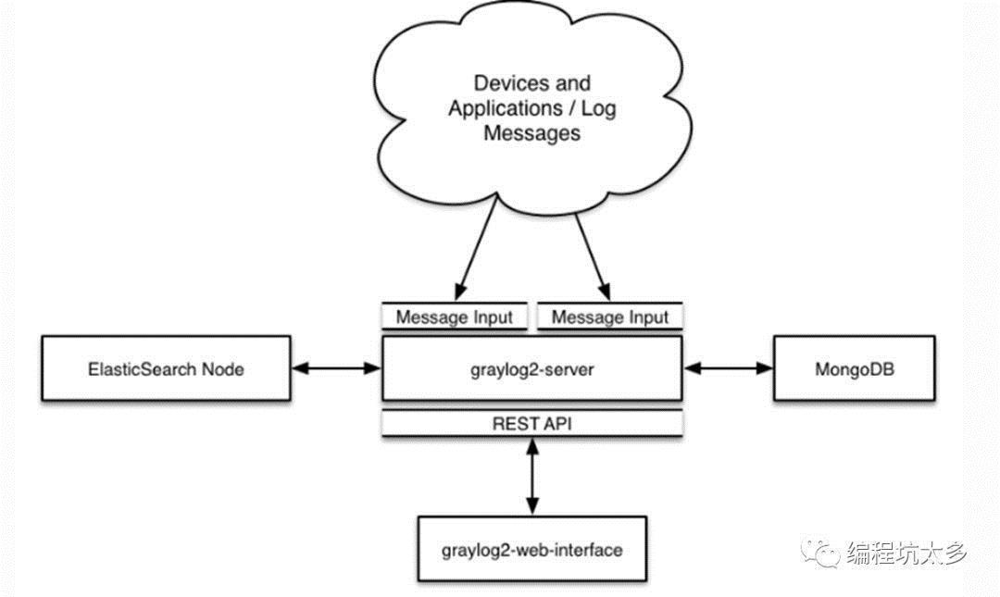
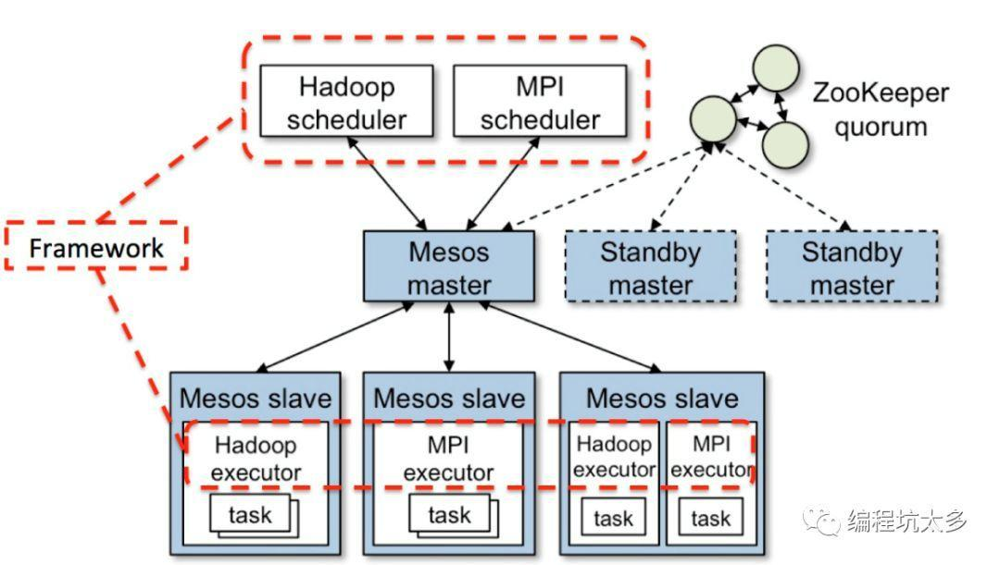
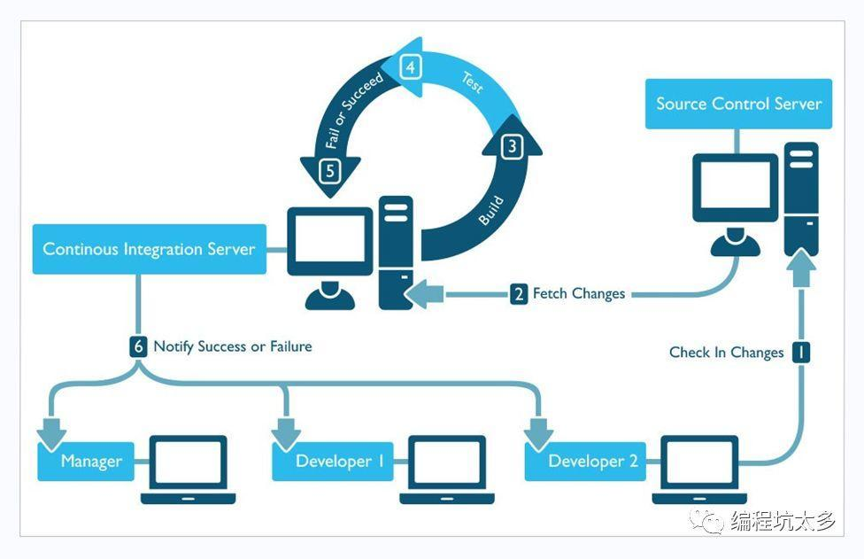
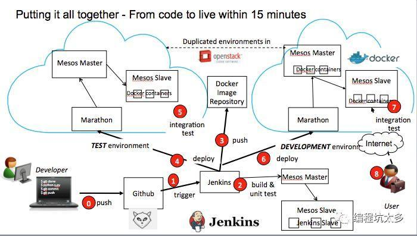
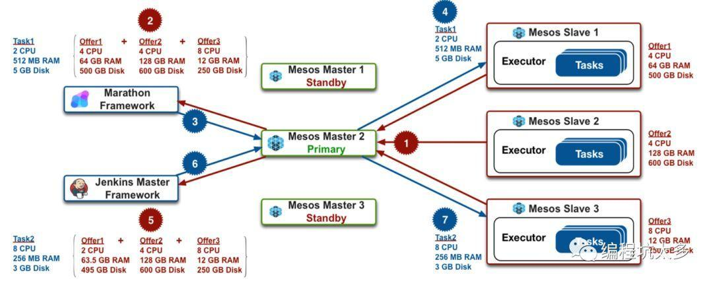
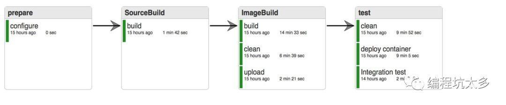

# docker工具

## 目录

- [docker-compose](#docker-compose)
- [docker&nbsp;Machine](#docker-machine)
- [docker&nbsp;swarm](#docker-swarm)
- [docker swarm](#docker&nbsp;swarm)

## docker-compose

Docker Compose 是一个用来定义和运行复杂应用的 Docker 工具。使用 Docker Compose 不再需要使用 shell 脚本来启动容器。（通过 docker-compose.yml 配置）

安装：

```sh
curl -L "https://github.com/docker/compose/releases/download/1.25.0/docker-compose-$(uname -s)-$(uname -m)" -o /usr/local/bin/docker-compose
# 授予执行权限
chmod +x /usr/local/bin/docker-compose
```

卸载：

```sh
rm /usr/local/bin/docker-compose
```

## docker&nbsp;Machine

1.什么是DockerMachine？

Docker Machine是一个工具，它可以帮你在虚拟主机安装docker，并且通过docker-machine 相关命令控制主机。你可以用docker machine在mac、windows、单位的网络、数据中心、云提供商（AWS或Digital Ocean）创建docker主机。

通过docker-machine commands，你能启动、进入、停止、重启主机，也可以升级docker，还可以配置docker client。

2.为什么要用Docker Machine？

Docker Machine是当前docker运行在mac或者windows上的唯一方式，并且操作多种不同linux 系统的docker主机的最佳方式。

3.Docker machine之安装

参考：[https://github.com/docker/machine/](https://github.com/docker/machine/)

下载docker-machine 二进制文件

- Mac Or linux

  ```sh
  curl -Lhttps://github.com/docker/machine/releases/download/v0.8.0/docker-machine-`uname\ -s`-`uname -m` > /usr/local/bin/docker-machine \ && chmod +x/usr/local/bin/docker-machine
  ```

- Windows with git bash

  ```sh
  if [[ ! -d"$HOME/bin" ]]; then mkdir -p "$HOME/bin"; fi && \curl -Lhttps://github.com/docker/machine/releases/download/v0.7.0/docker-machine-Windows-x86_64.exe\ "$HOME/bin/docker-machine.exe" && \ chmod +x"$HOME/bin/docker-machine.exe"
  ```

  黑魔法（离线安装）：

  下载地址：[https://github.com/docker/machine/releases/](https://github.com/docker/machine/releases/)

  直接在csdn下载：[https://download.csdn.net/download/zhugeaming2018/10404327](https://download.csdn.net/download/zhugeaming2018/10404327)

4.Docker machine之使用(macor windows)

使用准备：

安装最新版的virtualbox([https://www.virtualbox.org/wiki/Downloads](https://www.virtualbox.org/wiki/Downloads))

```sh
cd /etc/yum.repos.d
wget http://download.virtualbox.org/virtualbox/rpm/rhel/virtualbox.repo
yum install -y  VirtualBox-5.2
```

- Create a machine

  ```sh
  docker-machine create –driver virtualbox default
  ```

  在上面你会发现这么句话“error in driver during machine creation: This computer doesn't have VT-X/AMD-v enabled.Enabling it in the BIOS is mandatory"意思就是说你没有开启虚拟化。

  有朋友说创建虚拟主机太慢，我提供一个阿里云加速命令很快很暴力：

  ```sh
  docker-machine create –driver virtualbox –engine-registry-mirror https://xu176fzy.mirror.aliyuncs.com default
  ```

- Get the environmentcommands for your new VM

  docker-machine env default

- List available machines again to see your newly minted machine

  docker-machine ls

- Connect your shedocker-machinessh defaultll to the new machine

  docker-machine ssh default

- Start and stop machines

  docker-machine stop default

  docker-machine start default

- Docker machine之使用(Iaas)

## docker&nbsp;swarm

1.什么是Docker Swarm？
    容器集群管理工具。
    通过docker swarm可以将多台机器连接在一起，通过swarm的调度可以实现服务的多台机器的部署，服务的伸缩。
    docker-swarm的场景因为需要多台docker虚拟机，在虚拟机中创建docker-machine会发现一个很重要的问题，无法创建多个docker的虚拟器，虚拟主机报错"Wrapper DockerMachine process exiting due to closed plugin server ..." 该问题是在 Vmware Workstation Pro 14.1.1 & centos10 上出现的，用真实机器测试不会出现。
    所以下面的演示就在Vmware Workstation下演示1台机器。
    docker-machine create –driver virtualbox manager
    docker-machine ssh manager
    docker version
2.Docker Swarm 使用入门
    注意：docker engine版本为1.18.05.0-ce
    docker swarm manager 节点初始化
    docker swarm init --advertise-addr <hostIP>
    说明：init命令初始化后生成结果如下：
To add a worker to this swarm, run the following command:
    docker swarm join --token SWMTKN-1-5t5n2lcqsal12tmhsngww28njm1qcz6917u9bomgmy6bdyw3o0-8gf8jgpb83b22oae92aiamlel 192.168.101.13:2377
To add a manager to this swarm, run 'docker swarm join-token manager' and follow the instructions.
    开启另一台虚拟机，使用上面的命令将docker加入该集群
    查看集群：docker info
    docker node ls
    删除work节点
    docker swarm leave
    通过swarm创建服务
    docker service create –replicas 1 --name helloworld alpine ping docker.com
    查看服务列表
    docker service ls
    查看服务详情
    docker service inspect –pretty helloworld
    服务弹性扩展
    docker service scale =
    Ex:docker service scale helloworld=5
    查看服务列表
    docker service ps
    Ex:docker service ps helloworld
    服务删除
    docker service remove
    Ex:docker service rm helloworld

## 监控日志和日志管理

为什么要进行日志收集？
    应用程序跑在集群中，产生很多的日志，日志中包含着程序运行的情况的纪录，查看单个机器的日志过程繁琐，所以需要统一的日志管理平台对日志进行统一处理，将所有应用程序的日志收集起来，可以对日志进行存储、归档、查询、状态判断。
    例如负载均衡的情况，nginx下面很多的web服务，如果查看日志的话需要进入多个tomcat一个一个看麻烦吧。
    1. ELK技术解决方案吧tomcat收集起来
    2. Graylog+mongo+elasticsearch 日志收集机器。



搭建日志系统
安装要求：docker、docker-compose
配置文件：docker-compose.yml
some-mongo:
image: "mongo:3"
volumes:
  - /opt/graylog/data/mongo:/data/db
some-elasticsearch:
image: "elasticsearch:latest"
command: "elasticsearch  -Des.cluster.name='graylog'"
volumes:
  - /opt/graylog/data/elasticsearch:/usr/share/elasticsearch/data
graylog:
image: graylog2/server
volumes:
  - /opt/graylog/data/journal:/usr/share/graylog/data/journal
  - /opt/graylog/config:/usr/share/graylog/data/config
environment:
GRAYLOG_PASSWORD_SECRET:somepasswordpepper
GRAYLOG_ROOT_PASSWORD_SHA2:8c6976e5b5410415bde908bd4dee15dfb167a9c873fc4bb8a81f6f2ab448a918
GRAYLOG_REST_TRANSPORT_URI: http://192.168.30.3:12900
links:
  - some-mongo:mongo
  - some-elasticsearch:elasticsearch
ports:
  - "9000:9000"
  - "12900:12900"
  - "12201:12201/udp"
  - "1514:1514/udp"
#直接下载官方推荐配置文件
    wget https://raw.githubusercontent.com/Graylog2/graylog2-images/2.1/docker/config/graylog.conf
#日志配置文件
    wget https://raw.githubusercontent.com/Graylog2/graylog2-images/2.1/docker/config/log4j2.xml
#graylog.conf
    修改下载完的graylog.conf中的root_timezone为：
    root_timezone =+08:00
启动运行：
    docker-compose up
配置graylog：
    页面：http://192.168.30.3:9000
    用户名：admin
    密  码：admin
    配置Input
启动应用程序容器：
    docker run -d –name logtest –log-driver=gelf –log-opt gelf-address=udp://192.168.30.3:12201 ubuntu /bin/bash -c "while true;do echo hello;sleep 1;done"

## 单节点mesos集群

Mesos简介
    什么是MESOS？
    Apache Mesos 是一个集群管理器，提供了有效的、跨分布式应用或框架的资源隔离和共享，可以运行 Hadoop、MPI、Hypertable、Spark。
    几个基本概念：
    Mesos master:负责任务调度的节点。
    Mesos slave:负责执行任务的节点。
    Mesos 框架：需要由mesos调度的应用程序，比如hadoop、spark、marathon、chronos等。




    Mesos实现了两级调度架构，它可以管理多种类型的应用程序。第一级调度是Master的守护进程，管理Mesos集群中所有节点上运行的Slave守护进程。集群由物理服务器或虚拟服务器组成，用于运行应用程序的任务，比如Hadoop和MPI作业。第二级调度由被称作Framework的“组件”组成。Framework包括调度器（Scheduler）和执行器（Executor）进程，其中每个节点上都会运行执行器。Mesos能和不同类型的Framework通信，每种Framework由相应的应用集群管理。上图中只展示了Hadoop和MPI两种类型，其它类型的应用程序也有相应的Framework。
    Mesos Master协调全部的Slave，并确定每个节点的可用资源，聚合计算跨节点的所有可用资源的报告，然后向注册到Master的Framework（作为Master的客户端）发出资源邀约。Framework可以根据应用程序的需求，选择接受或拒绝来自master的资源邀约。一旦接受邀约，Master即协调Framework和Slave，调度参与节点上任务，并在容器中执行，以使多种类型的任务，比如Hadoop和Cassandra，可以在同一个节点上同时运行。
单节点mesos集群
安装依赖包
Centos7.1
1.下载rpm包
    sudo rpm -Uvh http://repos.mesosphere.com/el/7/noarch/RPMS/mesosphere-el-repo-7-1.noarch.rpm
2.安装
    sudo yum -y install mesosphere-zookeeper
    sudo yum -y install mesosmarathon
3.配置
    设置/var/lib/zookeeper/myid作为唯一标识（1-255）讲的是单节点直接设置成1
    配置mesos连接的zk，文件位置：/etc/mesos/zk（例如：zk://1.1.1.1:2181,2.2.2.2:2181,3.3.3.3:2181/mesos）
    配置mesos master的法定值（一个节点挂了，立马另一个节点起起来，目前是1台机器，直接填写1；如果是5台机器，一台机器挂了，这里的数字应该填3，也就说3台机器认为一台机器可以当master这台机器才可以当master），文件位置：/etc/mesos-master/quorum
    vi /etc/mesos-master/ip -- 192.168.30.3
    vi /etc/mesos-master/hostname
4.启动
    启动zookeeper：service zookeeper start
    启动mesos－master：service mesos－master start
    启动mesos－slave：servie mesos－slavestart
5.验证
    访问web页面：http://:5050
    执行mesos命令：MASTER=$(mesos-resolve 'cat/etc/mesos/zk')
    mesos-execute --master=$MASTER --name="cluster-test" --command="sleep 5"

## 多节点mesos集群

原文：https://idig8.com/2018/07/27/docker-chuji-17/
1.配置master
    配置文件：/etc/default/mesos
    增加配置：IP=192.168.30.3（当前节点IP）
2.配置slave节点
    配置文件：/etc/default/mesos
    增加配置：IP=192.168.30.4（当前节点IP）
  配置slave节点的master
    配置文件：/etc/mesos/zk
    配置：zk://192.168.30.3:2181/mesos
3.启动slave节点：
    启动命令：service mesos-slavestart
注意：
    1.日志输出是否报错（默认地址：/var/log/mesos/mesos-slave.INFO）
    2.观察进程是否正常（命令：ps –ef|grepmesos-slave）
Marathon
1.什么是marathon？
    marathon是mesos的一个容器编排的插件。
2.配置marathon
    开启mesos容器化配置：
命令：
    echo 'docker,mesos' >/etc/mesos-slave/containerizers
    echo '10mins' > /etc/mesos-slave/executor_registration_timeout
    重启slave节点：service mesos-slave restart
3.安装marathon
    sudo yum -y install marathon
4.启动marathon
    service marathon start
5.Marathon Web：
    http::8080
    通过marathon调度mesos运行容器：
    curl -X POST http://192.168.30.3:8080/v2/apps-d @app1.json -H "Content-type: application/json"
    在页面查看marathon启动测试容器的配置
    访问测试应用的数据
    完成弹性伸缩
扩展：
    marathon官网：https://mesosphere.github.io/marathon/docs/
    安装集群：https://open.mesosphere.com/getting-started/install/

## 持续集成





0 ：开发人员提交代码到github
1 ：触发jenkins操作
2 ：jenkins将代码编译、验证
3 ：将代码封装在docker镜像并上传至docker仓库
4 ：jenkins向marathon发送部署请求，marathon完成相应部署
5 ：进行集成测试
6 ：集成测试通过，触发研发环境部署
7 ：进行集成测试
8 ：供用户访问

基于mesos实践



环境准备：
    mesos-slave1:4CPU-64GBRAM-500GB DISK
    mesos-slave2:4CPU-128GBRAM-600GB DISK
    mesos-slave3:8CPU-12GBRAM-250GB DISK
步骤说明：
    1：3台机器向mesos master发送请求，注册成为mesos slave节点
    2：向marathon发送请求启动容器，容器占用2CPU－512M RAM-5GB DISK
    3：marathon向mesos发送请求，请求启动相应任务
    4：mesos计算后，将marathon发送的任务启动在slave1节点上，任务完成
    5：向jenkins发送请求执行任务，任务需要占用8CPU－256M RAM－5GB DISK
    6：jenkins向mesos发送请求，请求启动相应任务
    7：mesos计算后，将jenkins发送的任务启动在slave3节点上，任务完成
Jenkins Pipine：


