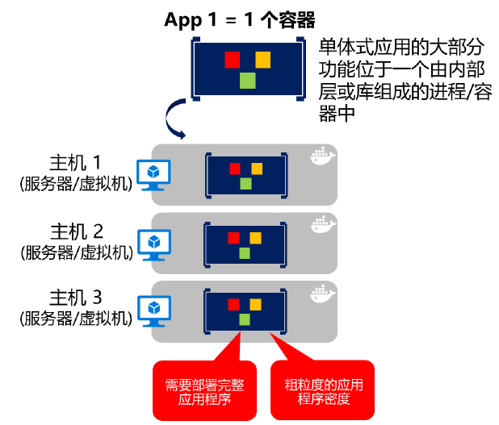
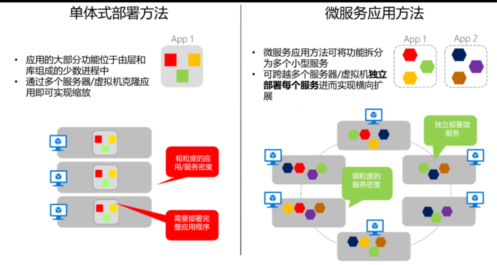

# 平台

## 目录

1. [Kubernetes](#Kubernetes)
   - [安装部署](#安装部署)
2. [AKS](#AKS)
3. [Service Fabric](#Service&nbsp;Fabric)
4. [Azure Service Fabric 网格](#Azure&nbsp;Service&nbsp;Fabric&nbsp;网格)
5. [基于容器和微服务的架构](#基于容器和微服务的架构)

## Kubernetes

[Kubernetes](https://kubernetes.io/) 是一款开源产品，提供各种功能，从群集基础结构和容器计划到安排功能均涵盖在内。 它能实现跨主机群集自动部署、缩放以及执行各种应用程序容器操作。

Kubernetes 提供以容器为中心的基础结构，将应用程序容器分组为逻辑单元，以便管理和发现。

Kubernetes 在 Linux 中的运用已发展成熟，但在 Windows 中相对较弱。

### 安装部署

**1、安装kubelet、kubeadm 和 kubectl：**

kubelet 运行在 Cluster 所有节点上，负责启动 Pod 和容器。

kubeadm 用于初始化 Cluster.

添加阿里源，国外的你懂的：

```sh
cat <<EOF > /etc/yum.repos.d/kubernetes.repo
[kubernetes]
name=Kubernetes
baseurl=https://mirrors.aliyun.com/kubernetes/yum/repos/kubernetes-el7-x86_64/
enabled=1
gpgcheck=1
repo_gpgcheck=1
gpgkey=https://mirrors.aliyun.com/kubernetes/yum/doc/yum-key.gpg https://mirrors.aliyun.com/kubernetes/yum/doc/rpm-package-key.gpg
EOF

setenforce 0
yum install -y kubelet kubeadm kubectl
systemctl enable kubelet && systemctl start kubelet
```

**安装minikube：**

```sh
curl -Lo minikube https://storage.googleapis.com/minikube/releases/latest/minikube-linux-amd64 && chmod +x minikube && sudo mv minikube /usr/local/bin/
```

**安装虚拟机：**

安装包：[https://www.virtualbox.org/wiki/Downloads](https://www.virtualbox.org/wiki/Downloads)

```sh
yum install VirtualBox-6.1-6.1.2_135662_el7-1.x86_64.rpm
```

**使用virtualbox驱动程序启动群集：**

```sh
minikube start --vm-driver=virtualbox
```

root权限不允许，所以添加一个用户：

```sh
# 创建用户：
adduser admin
# 设置密码：
passwd admin

# 找到sudoers文件位置
whereis sudoers

# 修改文件权限，一般文件默认为只读
chmod -v u+w /etc/sudoers

# 修改文件，在如下位置增加一行
vim /etc/sudoers
# 文件内容改变如下：
root ALL=(ALL) ALL # 已有行
admin ALL=(ALL) ALL # 新增行

# 将文件权限还原回只读
chmod -v u-w /etc/sudoers

# 查看文件权限
ls -l /etc/sudoers
```

**2、使用kubeadm创建cluster：**

初始化master：

```sh
kubeadm init --apiserver-advertise-address 192.168.2.120 --pod-network-cidr=10.244.0.0/16
```

参数说明：

- --apiserver-advertise-address

  API服务器将公布它正在监听的IP地址。指定 "0.0.0.0" 以使用默认网络接口的地址。

- -pod-network-cidr string

  指定pod网络的IP地址范围。如果设置，控制平面将自动为每个节点分配CIDR。

**卸载清理K8S：**

```sh
kubeadm reset -f
modprobe -r ipip
lsmod
rm -rf ~/.kube/
rm -rf /etc/kubernetes/
rm -rf /etc/systemd/system/kubelet.service.d
rm -rf /etc/systemd/system/kubelet.service
rm -rf /usr/bin/kube*
rm -rf /etc/cni
rm -rf /opt/cni
rm -rf /var/lib/etcd
rm -rf /var/etcd
```

## AKS

Azure Kubernetes 服务 ([AKS](https://azure.microsoft.com/services/kubernetes-service/)) 是 Azure 中的托管 Kubernetes 容器业务流程服务，简化了 Kubernetes 群集的管理、部署和操作。

## Service&nbsp;Fabric

[Service Fabric](https://docs.microsoft.com/azure/service-fabric/service-fabric-overview) 是用于生成应用程序的 Microsoft 微服务平台。它是服务的业务流程协调程序，可创建计算机群集。Service Fabric 可将服务作为容器或纯进程进行部署。 它甚至可以在同一应用程序和群集中将进程中的服务与容器中的服务进行组合。

Service Fabric 群集可以在 Azure 中、本地或任意云中部署。 但是，Azure 中的部署使用托管方法进行了简化。

Service Fabric 提供其他可选的规定 Service Fabric 编程模型（如有状态服务和 Reliable Actors）。

Service Fabric 在 Windows 中的运用已经成熟（已在 Windows 中发展多年），但在 Linux 中相对较弱。

自 2017 年以来，Service Fabric 同时支持 Linux 和 Windows 容器。

## Azure&nbsp;Service&nbsp;Fabric&nbsp;网格

[Azure Service Fabric 网格](https://docs.microsoft.com/azure/service-fabric-mesh/service-fabric-mesh-overview)提供与 Service Fabric 相同的可靠性、任务关键性能和规模，但也提供完全托管的无服务器平台 。 无需管理群集、虚拟机、存储或网络配置。 只需专注于应用程序的开发。

Service Fabric 网格 支持 Windows 和 Linux 容器，从而允许使用所选择的任何编程语言和框架进行开发。

## 基于容器和微服务的架构

### 容器化单体应用



- 原则：一个容器在一个进程中做一件事
- 缺点：不易伸缩

### 面向服务的架构

面向服务的架构(SOA)是一个被滥用的词汇，不同人有不同的理解。不过作为一个通用标准，SOA意味着需要从结构上将应用尽可能解耦成多个服务（通常为HTTP服务），这些服务要能区分成不同的类型，如子系统或分层。

这些服务也可作为Docker容器来部署，因为所有依赖都包含在容器镜像里，这就解决了部署方面的问题。然而在纵向扩展SOA应用时，如果部署在单个Docker主机中，或许会面临扩展性和可用性的挑战。这就需要Docker集群软件或编排引擎的帮助。

Docker容器对面向服务的传统架构以及更先进的微服务架构都能提供巨大价值（但并非必需）。

微服务是从SOA派生而来的，但SOA与微服务是不同的架构。例如大型中心代理、企业级中心编排引擎和[企业服务总线(ESB)](https://en.wikipedia.org/wiki/Enterprise_service_bus)都是典型的SOA功能。在微服务社区中，大多数情况下这都是SOA的反模式设计。实际上，有争议认为“微服务架构只是正确实现SOA之后的产物”。

相比微服务架构，SOA在要求和技术方面的规范更宽松一些。只要知道如何创建微服务应用，那么就会知道如何创建一个简单的SOA应用。

### 微服务架构

顾名思义，微服务架构是一种以小型服务集合来创建服务端应用的方法。

- 每个服务在独立进程中运行，通过通信协议（如HTTP/HTTPS、WebSockets或[AMQP](https://en.wikipedia.org/wiki/Advanced_Message_Queuing_Protocol)）彼此通信。
- 每个微服务负责实现一个特定的端到端领域，或有着确定边界的业务逻辑，并且每个微服务必须能独立开发和部署。
- 最后，每个微服务应该拥有自己特定的领域数据模型和领域逻辑（自治和去中心化的数据管理），它们是基于不同数据存储技术（SQL、NoSQL）和不同编程语言实现的。

微服务到底能有多小？

在开发微服务时，大小不应该是重点，重点是要创建 **低耦合** 的服务，以便能独立地开发、部署和扩展每个服务。当然在确定和设计微服务时，只要它们之间没有太多直接依赖，就应该使它们尽可能地小。比大小更重要的还有必要的内部一致性和对其他服务的依赖。

微服务架构的优势：

- 提供长期的敏捷性：独立生命周期
- 独立横向扩展



成功实施微服务架构注意点：

- 服务和基础架构的监测和监控状态
- 为服务扩展基础架构（云和编排引擎）
- 在多个层级设计并实现安全性：认证、授权、密文密码管理和安全通信等- 
- 快速应用发布，通常由不同的团队来实现不同微服务
- DevOps和CI/CD的实践和架构

## 参考

- 《使用微软平台和工具的容器化Docker应用的生命周期》
