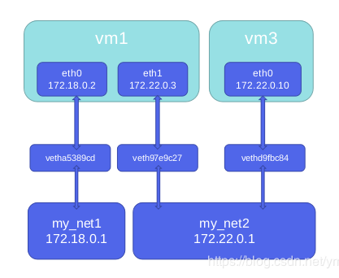

# docker网络

## 目录

1. [原理](#原理)
2. [容器间通信](#容器间通信)
3. [容器与外网通信](#容器与外网通信)
4. [跨主机网络访问](#跨主机网络访问)

## 原理

安装Docker时，它会自动创建三个网络，bridge（创建容器默认连接到此网络）、 none 、host

网络模式|简介
-|-
Host|容器将不会虚拟出自己的网卡，配置自己的IP等，而是使用宿主机的IP和端口
Bridge|此模式会为每一个容器分配、设置IP等，并将容器连接到一个docker0虚拟网桥，通过docker0网桥以及Iptables nat表配置与宿主机通信
None|该模式关闭了容器的网络功能
Container|创建的容器不会创建自己的网卡，配置自己的IP，而是和一个指定的容器共享IP、端口范围
自定义网络|略

```sh
# 列出网络
docker network ls
```


Docker内置这三个网络，运行容器时，你可以使用该 `--network` 标志来指定容器应连接到哪些网络

该bridge网络代表docker0所有Docker安装中存在的网络

除非你使用该 `docker run --network=选项` 指定，否则Docker守护程序默认将容器连接到此网络

```sh
# 查看客户机上网络
ip a
```

我们在使用 `docker run` 创建Docker容器时，可以用 `--net` 选项指定容器的网络模式，Docker可以有以下4种网络模式

1. host模式：使用 --net=host 指定。
2. none模式：使用 --net=none 指定。
3. bridge模式：使用 --net=bridge 指定，默认设置。
4. container模式：使用 --net=container:NAME_or_ID 指定。

下面分别介绍一下Docker的各个网络模式

### Host模式

相当于Vmware中的桥接模式，与宿主机在同一个网络中，但没有独立IP地址

众所周知，Docker使用了Linux的Namespaces技术来进行资源隔离，如PID Namespace隔离进程，Mount Namespace隔离文件系统，Network Namespace隔离网络等

一个Network Namespace提供了一份独立的网络环境，包括网卡、路由、Iptable规则等都与其他的Network Namespace隔离

一个Docker容器一般会分配一个独立的Network Namespace

但如果启动容器的时候使用host模式，那么这个容器将不会获得一个独立的Network Namespace

而是和宿主机共用一个Network Namespace。容器将不会虚拟出自己的网卡，配置自己的IP等，而是使用宿主机的IP和端口

例如，我们在 172.25.2.1/24 的机器上用host模式启动一个ubuntu容器

```sh
docker run -it --network host ubuntu
```

>"#"号前的"/"代表容器内

可以看到，容器的网络使用的是宿主机的网络，但是，容器的其他方面，如文件系统、进程列表等还是和宿主机隔离的。

### Container模式

在理解了host模式后，这个模式也就好理解了

这个模式指定新创建的容器和已经存在的一个容器共享一个Network Namespace，而不是和宿主机共享

新创建的容器不会创建自己的网卡，配置自己的IP，而是和一个指定的容器共享IP、端口范围等

同样，两个容器除了网络方面，其他的如文件系统、进程列表等还是隔离的。两个容器的进程可以通过lo网卡设备通信

### None模式

该模式将容器放置在它自己的网络栈中，但是并不进行任何配置

实际上，该模式关闭了容器的网络功能，在以下情况下是有用的：容器并不需要网络（例如只需要写磁盘卷的批处理任务）

**overlay：**

在docker1.7代码进行了重构，单独把网络部分独立出来编写，所以在docker1.8新加入的一个overlay网络模式。

Docker对于网络访问的控制也是在逐渐完善的。

### Bridge模式

相当于Vmware中的Nat模式，容器使用独立network Namespace，并连接到docker0虚拟网卡（默认模式）

通过docker0网桥以及Iptables nat表配置与宿主机通信；bridge模式是Docker默认的网络设置

此模式会为每一个容器分配Network Namespace、设置IP等，并将一个主机上的Docker容器连接到一个虚拟网桥上

下面着重介绍一下此模式

**Bridge模式的拓扑：**

>当Docker server启动时，会在主机上创建一个名为docker0的虚拟网桥，此主机上启动的Docker容器会连接到这个虚拟网桥上。
>
>虚拟网桥的工作方式和物理交换机类似，这样主机上的所有容器就通过交换机连在了一个二层网络中。
>
>接下来就要为容器分配IP了，Docker会从RFC1918所定义的私有IP网段中，选择一个和宿主机不同的IP地址和子网分配给docker0，
>
>连接到docker0的容器就从这个子网中选择一个未占用的IP使用。
>
>如一般Docker会使用172.17.0.0/16这个网段，并将172.17.0.1/16分配给docker0网桥
>
>（在主机上使用ifconfig命令是可以看到docker0的，可以认为它是网桥的管理接口，在宿主机上作为一块虚拟网卡使用）。

单机环境下的网络拓扑如下，主机地址为10.10.0.186/24。


Docker完成以上网络配置的过程大致是这样的：

（1）在主机上创建一对虚拟网卡veth pair设备。

veth设备总是成对出现的，它们组成了一个数据的通道，数据从一个设备进入，就会从另一个设备出来。

因此，veth设备常用来连接两个网络设备。

（2）Docker将veth pair设备的一端放在新创建的容器中，并命名为eth0。
另一端放在主机中，以veth65f9这样类似的名字命名，并将这个网络设备加入到docker0网桥中，可以通过brctl show命令查看。

```sh
brctl show
```

从docker0子网中分配一个IP给容器使用，并设置docker0的IP地址为容器的默认网关。

```sh
# 运行容器
docker run --name=nginx_bridge --network bridge -p 80:80 -d nginx
# 查看容器
docker ps
# 查看容器网络
docker inspect [ContainerId]
```

启动container的时候出现`iptables: No chain/target/match by that name`

原因（猜测）：

如果在启动 `docker service` 的时候网关是关闭的，那么docker管理网络的时候就不会操作网管的配置（chain docker），然后网关重新启动了，导致docker network无法对新container进行网络配置，也就是没有网管的操作权限，做重启处理

```sh
systemctl restart docker
```

使用的centos7服务器，在部署docker的过程中，因端口问题有启停firewalld服务，在centos7里使用firewalld代替了iptables。在启动firewalld之后，iptables还会被使用，属于引用的关系。所以在docker run的时候，iptables list里没有docker chain，重启docker engine服务后会被加入到iptables list里面。

另一个方法：关闭网关（不建议）

```sh
systemctl stop firewalld
systemctl stop iptables
```


网络拓扑介绍完后，接着介绍一下bridge模式下容器是如何通信的：

>在bridge模式下，连在同一网桥上的容器可以相互通信（若出于安全考虑，也可以禁止它们之间通信，方法是在DOCKER_OPTS变量中设置`–icc=false`，这样只有使用–link才能使两个容器通信）。
>
>Docker可以开启容器间通信（意味着默认配置–icc=true），也就是说，宿主机上的所有容器可以不受任何限制地相互通信，这可能导致拒绝服务攻击。进一步地，Docker可以通过 `–ip_forward` 和 `–iptables` 两个选项控制容器间、容器和外部世界的通信。
>
>容器也可以与外部通信，我们看一下主机上的Iptable规则，可以看到这么一条：
>
>`-A POSTROUTING -s 172.17.0.0/16 ! -o docker0 -j MASQUERADE`
>
>这条规则会将源地址为172.17.0.0/16的包（也就是从Docker容器产生的包），并且不是从docker0网卡发出的，进行源地址转换，转换成主机网卡的地址。这么说可能不太好理解，举一个例子说明一下。
>
>假设主机有一块网卡为eth0，IP地址为10.10.101.105/24，网关为10.10.101.254。从主机上一个IP为172.17.0.1/16的容器中ping百度（180.76.3.151）。IP包首先从容器发往自己的默认网关docker0，包到达docker0后，也就到达了主机上。然后会查询主机的路由表，发现包应该从主机的eth0发往主机的网关10.10.105.254/24。接着包会转发给eth0，并从eth0发出去（主机的ip_forward转发应该已经打开）。这时候，上面的Iptable规则就会起作用，对包做SNAT转换，将源地址换为eth0的地址。
>
>这样，在外界看来，这个包就是从10.10.101.105上发出来的，Docker容器对外是不可见的。

那么，外面的机器是如何访问Docker容器的服务呢？

我们首先用下面命令创建一个含有web应用的容器，将容器的80端口映射到主机的80端口。

```sh
docker run --name=nginx_bridge --net=bridge -p 80:80 -d nginx
```

然后查看Iptable规则的变化，发现多了这样一条规则：

```sh
-A DOCKER ! -i docker0 -p tcp -m tcp --dport 80 -j DNAT --to-destination 172.17.0.2:80
```

此条规则就是对主机eth0收到的目的端口为80的tcp流量进行DNAT转换，将流量发往172.17.0.2:80，也就是我们上面创建的Docker容器。所以，外界只需访问10.10.101.105:80就可以访问到容器中的服务。

除此之外，我们还可以自定义Docker使用的IP地址、DNS等信息，甚至使用自己定义的网桥，但是其工作方式还是一样的。

### 自定义网络

建议使用自定义的网桥来控制哪些容器可以相互通信，还可以自动DNS解析容器名称到IP地址。

Docker提供了创建这些网络的默认网络驱动程序，你可以创建一个新的Bridge网络，Overlay或Macvlan网络。

你还可以创建一个网络插件或远程网络进行完整的自定义和控制。

你可以根据需要创建任意数量的网络，并且可以在任何给定时间将容器连接到这些网络中的零个或多个网络。

此外，您可以连接并断开网络中的运行容器，而无需重新启动容器。

当容器连接到多个网络时，其外部连接通过第一个非内部网络以词法顺序提供。

接下来介绍Docker的内置网络驱动程序。

**bridge：**

一个bridge网络是Docker中最常用的网络类型。桥接网络类似于默认bridge网络，但添加一些新功能并删除一些旧的能力。以下示例创建一些桥接网络，并对这些网络上的容器执行一些实验。

```sh
docker network create --driver bridge new_bridge
```

创建网络后，可以看到新增加了一个网桥

**Macvlan：**

Macvlan是一个新的尝试，是真正的网络虚拟化技术的转折点。Linux实现非常轻量级，因为与传统的Linux Bridge隔离相比，它们只是简单地与一个Linux以太网接口或子接口相关联，以实现网络之间的分离和与物理网络的连接。

Macvlan提供了许多独特的功能，并有充足的空间进一步创新与各种模式。这些方法的两个高级优点是绕过Linux网桥的正面性能以及移动部件少的简单性。删除传统上驻留在Docker主机NIC和容器接口之间的网桥留下了一个非常简单的设置，包括容器接口，直接连接到Docker主机接口。由于在这些情况下没有端口映射，因此可以轻松访问外部服务。

## 容器间通信

`scp` 传送命令

### 2、自定义网络的演示

自定义网络需要使用create命令，先来看看create命令可以跟哪些参数。刚才原生网络不存在域名解析，但是自定义网络存在域名解析

```sh
docker network create --help
```

docker提供3种自定义网络驱动：

1. bridge：类似默认的bridge模式，也增加了一些新功能
2. overlay
3. macvlan

overlay 和 macvlan 创建跨主机网络。

建议使用自定义的网络来控制哪些容器可以相互通信，还可以自动DNS解析容器名称到IP地址。

**bridge模式：**

```sh
# 创建自定义网桥
docker network create -d bridge my_net1
# 查看docker网桥
docker network ls
# 查看容器网络
docker network inspect my_net1
```

创建一个bridge模式的网络，由上图我们可以看到创建的网络ID，使用ip addr查看本机网络：

```sh
# 运行容器vm1并且指定网络模式为刚才自定义的bridge模式
docker run -it --name vm1 --network my_net1 ubuntu
# 可以看到ip地址和宿主机的ip不在一个网段
/ ip addr
```

再运行一个容器，发现ip地址也是递增的，并且容器之间具有域名解析，可以ping通

```sh
docker run -it --name vm2 --network my_net1 ubuntu
/ ip addr
/ ping vm1
```

清理一下实验环境

```sh
docker rm -f vm1
docker rm -f vm2
```

还可以自己定义网段，在创建时指定参数：--subnet，--gateway

```sh
docker network create --subnet 172.22.0.0/24 --gateway 172.22.0.1 my_net2
# 查看docker网桥
docker net ls
# 查看容器网络
docker network inspect my_net2
```

发现自定义网络的ip会出现在宿主机上面。自定义的bridge模式也可以自己指定ip网段和网段

查看一下刚才自定义的网络my_net1和my_net2。my_net1的网段没有指定，那就是以宿主机桥接的网段为基础递增的。查看docker自定义网络如下图，当我们创建好自定义网络后，自定义为其分配IP网段和网关。

>1、docker的bridge自定义网络之间默认是有域名解析的；  
>2、docker的bridge自定义网络与系统自带的网桥之间默认是有解析的；  
>3、但是docker的系统自带的网桥之间默认是没有解析的。

使用 `--ip` 参数可以指定容器ip地址，但必须是在自定义网桥上，默认的bridge模式不支持，同一网桥上的容器可以是互通的

```sh
docker run -it --name vm3 --network my_net2 --ip 172.22.0.10 ubuntu
/ ping 172.22.0.2 # 可以ping通
```

此时在一个网段的容器仍然可以ping通。

刚才在以my_net2为基础运行了两个容器vm1和vm2，网段是172.20.0，可以互相ping通
；接下来在以my_net1为基础运行两个容器vm3和vm4，网段是172.18.0，也可以互相ping通。

但是发现vm1、vm2和vm3、vm4ping不通。因为在宿主机上定义的两个网络my_net1和my_net2就不在一个网段，因此基于这两种网络运行起来的容器肯定ping不通

>1、桥接到不同网桥上的容器，彼此是不通信的  
>2、docker在设计上就是要隔离不同network

那么如何使两个不同网段的容器通信呢？使用 `docker network connect` 给vm1容器添加一块my_net1的网卡，就可以和mysq_net2容器vm3、vm4进行通信了。建立两个容器之间的连接

```sh
docker network connect my_net2 vm1
# 进入容器
docker container attach vm1
# 查看网桥
/ ip addr
```

```sh
# 查看
iptables -s
```



其实上面简单实现了同一宿主机上不同网段容器之间的通信

>1、docker的bridge自定义网络之间：双方可以随便添加对方的网卡  
>2、docker的bridge自定义网络与系统自带的网桥之间：只能是，系统自带的网桥对应的容器 添加 bridge自定义网络对应的容器的网卡。而反过来会报错。  
>3、但是docker的系统自带的网桥之间：是可以通信的，因为是在一个网络桥接上。  
>4、docker 1.10开始,内嵌了一个DNS server。dns解析功能必须在自定义网络中使用。

- Docker 提供三种 user-defined 网络驱动：bridge, overlay 和 macvlan。
- overlay 和 macvlan 用于创建跨主机的网络，后面专门列出来演示

## 容器与外网通信

建议使用自定义的网桥来控制哪些容器可以相互通信，还可以自动DNS解析容器名称到IP地址

### 1、容器如何访问外网是通过iptables的SNAT实现的


### 2、外网如何访问容器

>端口映射，-p指定对应端口  
>外网访问容器用到了docker-proxy和iptables DNAT  
>宿主机访问本机容器使用的是iptables DNAT  
>外部主机访问容器或容器之间的访问是docker-proxy实现


### 3、演示过程

```sh
# 查看当前iptable的nat表防火墙策略
iptables -t nat -nL
```

容器之间除了使用ip通信，还可以使用名称通信：

- docker 1.10开始，内嵌 DNS Server
- dns解析功能必须在自定义网络中使用
- 启动时使用--name参数指定容器

```sh
docker run -d --name vm1 --network my_net1 nginx
docker run -it --name vm2 --network my_net1 ubuntu
/ ping vm1 # 可以ping通
```

Joined容器，一种较为特别的网络模式。在容器创建时使用 --network=container:vm1 指定。（vm1指的是运行的容器名）

```sh
docker run -it --name vm1 --network my_net1 ubuntu
# 加入vm1的网桥内
docker run -it --name vm2 --network container:vm1 ubuntu
```


link可以用来链接两个容器，格式：`--link <name or id>:alias`；先以默认的网络运行一个容器vm1，然后使用link方法运行另外一个容器vm2

```sh
docker run -it --name vm1 ubuntu
docker run -it --name vm2 --link vm1:web ubuntu
```

外网访问容器：

```sh
# 创建nginx的容器，配置端口映射
docker run -d --name nginx -p 80:80 nginx
docker port  nginx
# 80/tcp -> 0.0.0.0:80
netstat -ntpl | grep 80
# tcp6  0  0 :::80  :::*  LISTEN  3901/docker-proxy
iptables -t nat -nL
# 我们可以在nat表的最后一行看到使用了端口转发
ps ax|grep docker-proxy
```

## 跨主机网络访问

解决方案：

1. docker 原生的 overlay 和 macvlan
2. 第三方的 flannel、weave、calico

众多网络方案是如何与docker集成在一起的？

1. libnetwork docker容器网络库
2. CNM (Container Network Model)这个模型对容器网络进行了抽象

CNM三类组件：

组件|功能
-|-
Sandbox|容器网络栈，包含容器接口、dns、路由表。(namespace)
Endpoint|作用是将sandbox接入network(veth pair)
Network|包含一组endpoint，同一network的endpoint可以通信


### macvlan网络方案的实现

Macvlan是一个新的尝试，是真正的网络虚拟化技术的转折点。Linux实现非常轻量级，因为与传统的Linux Bridge隔离相比，它们只是简单地与一个Linux以太网接口或子接口相关联，以实现网络之间的分离和与物理网络的连接。

Macvlan提供了许多独特的功能，并有充足的空间进一步创新与各种模式。这些方法的两个高级优点是绕过Linux网桥的正面性能以及移动部件少的简单性。删除传统上驻留在Docker主机NIC和容器接口之间的网桥留下了一个非常简单的设置，包括容器接口，直接连接到Docker主机接口。由于在这些情况下没有端口映射，因此可以轻松访问外部服务。

```sh
# 清除网络设置
docker network prune
docker network rm my_net1 my_net2
docker network ls
ip link set up eth1
ip addr
brctl show
ip addr show
```

>macvlan本身是linxu kernel的模块，本质上是一种网卡虚拟化技术。
>  
>其功能是允许在同一个物理网卡上虚拟出多个网卡，通过不同的MAC地址在数据链路层进行网络数据的转发，一块网卡上配置多个 MAC 地址（即多个 interface），每个interface可以配置自己的IP，Docker的macvlan网络实际上就是使用了Linux提供的macvlan驱动。
>
>因为多个MAC地址的网络数据包都是从同一块网卡上传输，所以需要打开网卡的混杂模式ip link set eth1 promisc on。

在两台docker主机上各添加一块网卡，打开网卡混杂模式：

```sh
ip link set ens3 promisc on
ip addr show | grep ens3
```

>注意：如果不开启混杂模式，会导致macvlan网络无法访问外界。具体在不使用vlan时，表现为无法ping通路由，无法ping通同一网络内其他主机
