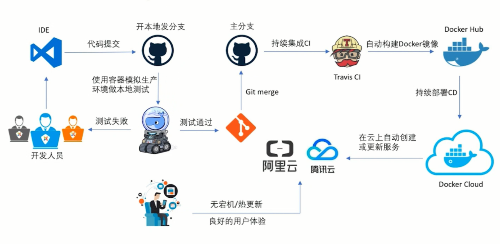

# Gitlab

>不要让懒惰占据你的大脑，不让要妥协拖跨你的人生。青春就是一张票，能不能赶上时代的快车，你的步伐掌握在自己脚下，good luck！

## 目录

1. 介绍
   - [生命周期](#生命周期)
   - [安装](#安装)
     - [在CentOS7上安装GitLab](#在CentOS7上安装GitLab)
     - [手动下载和安装GitLab包](#手动下载和安装GitLab包)
     - [安装GitLab Runner](#安装GitLab&nbsp;Runner)
   - [配置](#配置)
   - [CI/CD（持续集成/持续部署）](#CI/CD（持续集成/持续部署）)
2. [常用命令](#常用命令)

- [官方文档](https://docs.gitlab.com/ee/README.html)
- [安装文档](https://about.gitlab.com/install/)
- [官方项目](https://gitlab.com/gitlab-org/gitlab-ce)

GitLab是一个基于Git的平台，集成了大量用于软件开发和部署以及项目管理的基本工具。

## 生命周期


DevOps阶段|文档
-|-
[管理](https://docs.gitlab.com/ee/README.html#manage)|统计和分析功能。
[计划](https://docs.gitlab.com/ee/README.html#plan)|项目规划和管理功能。
[创建](https://docs.gitlab.com/ee/README.html#create)|源代码和数据创建和管理功能。
[校验](https://docs.gitlab.com/ee/README.html#verify)|测试，代码质量和持续集成功能。
[包](https://docs.gitlab.com/ee/README.html#package)|Docker容器注册表。
[发布](https://docs.gitlab.com/ee/README.html#release)|应用程序发布和交付功能。
[配置](https://docs.gitlab.com/ee/README.html#configure)|应用和基础架构配置工具。
[监控](https://docs.gitlab.com/ee/README.html#monitor)|应用程序监控和指标功能。
[安全](https://docs.gitlab.com/ee/README.html#secure)|安全功能。

## 安装

### 在CentOS7上安装GitLab

1. 在CentOS 7（和RedHat/Oracle/Scientific Linux 7）上，以下命令将在系统防火墙中打开HTTP和SSH访问

   ```sh
   sudo yum install -y curl policycoreutils-python openssh-server
   sudo systemctl enable sshd
   sudo systemctl start sshd
   sudo firewall-cmd --permanent --add-service=http
   sudo systemctl reload firewalld
   ```

   接下来，安装Postfix以发送通知电子邮件。如果要使用其他解决方案发送电子邮件，请跳过此步骤并在安装GitLab后配置外部SMTP服务器。

   ```sh
   sudo yum install postfix
   sudo systemctl enable postfix
   sudo systemctl start postfix
   ```

   在Postfix安装期间，可能会出现配置屏幕。选择"Internet Site"并按Enter键。使用服务器的外部DNS作为“邮件名称”，然后按Enter键。如果出现其他屏幕，请继续按Enter键接受默认值。

2. 添加GitLab软件包存储库并安装软件包

   添加GitLab（社区版）包存储库：

   接下来，安装GitLab包。更改 `https://gitlab.example.com` 为您要访问GitLab实例的URL。安装将自动配置并启动该URL的GitLab。

   ```sh
   curl -s https://packages.gitlab.com/install/repositories/gitlab/gitlab-ce/script.rpm.sh | sudo bash
   ```

   对于 `https://URL`，GitLab将自动使用Let's Encrypt请求证书，该证书需要入站HTTP访问和有效的主机名。您也可以使用自己的证书或只使用 `http://`。

   ```sh
   sudo EXTERNAL_URL="https://gitlab.example.com" yum install -y gitlab-ce
   ```

3. 浏览到主机名并登录

   在您第一次访问时，您将被重定向到密码重置屏幕。提供初始管理员帐户的密码，您将被重定向回登录屏幕。使用默认帐户的用户名root登录。

   有关安装和配置的详细说明，请参阅[文档](https://docs.gitlab.com/omnibus/README.html#installation-and-configuration-using-omnibus-package)。

4. 设置通信首选项

   访问我们的电子邮件订阅偏好中心，告知我们何时与您沟通。我们有明确的电子邮件选择加入政策，因此您可以完全控制我们向您发送电子邮件的频率和频率。

   每月两次，我们会发送您需要了解的GitLab新闻，包括我们开发团队的新功能，集成，文档和幕后故事。有关错误和系统性能的重要安全更新，请注册我们的专用安全通讯。

   >重要说明：如果您不选择加入安全通讯，则不会收到安全警报。

### 手动下载和安装GitLab包

安装pygpgme，一个允许yum处理gpg签名的包，以及一个名为yum-utils的包，其中包含安装源RPM所需的工具。

```sh
sudo yum install pygpgme yum-utils
```

您可能需要为系统安装EPEL存储库以安装这些软件包。如果您不安装pygpgme，GPG验证将无法正常工作。

创建一个名为/etc/yum.repos.d/gitlab_gitlab-ce.repo包含下面的存储库配置的文件。确保使用Linux发行版和版本替换下面配置中的el和6：

```ini
[gitlab_gitlab-ce]
name=gitlab_gitlab-ce
baseurl=https://packages.gitlab.com/gitlab/gitlab-ce/el/6/$basearch
repo_gpgcheck=1
gpgcheck=1
enabled=1
gpgkey=https://packages.gitlab.com/gitlab/gitlab-ce/gpgkey
       https://packages.gitlab.com/gitlab/gitlab-ce/gpgkey/gitlab-gitlab-ce-3D645A26AB9FBD22.pub.gpg
sslverify=1
sslcacert=/etc/pki/tls/certs/ca-bundle.crt
metadata_expire=300

[gitlab_gitlab-ce-source]
name=gitlab_gitlab-ce-source
baseurl=https://packages.gitlab.com/gitlab/gitlab-ce/el/6/SRPMS
repo_gpgcheck=1
gpgcheck=1
enabled=1
gpgkey=https://packages.gitlab.com/gitlab/gitlab-ce/gpgkey
       https://packages.gitlab.com/gitlab/gitlab-ce/gpgkey/gitlab-gitlab-ce-3D645A26AB9FBD22.pub.gpg
sslverify=1
sslcacert=/etc/pki/tls/certs/ca-bundle.crt
metadata_expire=300
```

os和dist参数的有效选项可以在我们在docs中支持的[OS列表](https://packagecloud.io/docs#os_distro_version)中找到。

通过运行更新本地yum缓存：

```sh
sudo yum -q makecache -y --disablerepo='*' --enablerepo='gitlab_gitlab-ce'
```

安装包：[https://packages.gitlab.com/gitlab/gitlab-ce](https://packages.gitlab.com/gitlab/gitlab-ce)

下载所需的软件包后，使用系统软件包管理工具进行安装。例如：

基于DEB(Ubuntu, Debian, Raspberry Pi)：

```sh
sudo EXTERNAL_URL="http://gitlab.example.com" dpkg -i gitlab-ee-9.5.2-ee.0_amd64.deb
```

基于RPM(CentOS, RHEL, Oracle, Scientific, openSUSE, SLES)：

```sh
sudo EXTERNAL_URL="http://gitlab.example.com" rpm -i gitlab-ee-9.5.2-ee.0.el7.x86_64.rpm
```

更改 `http://gitlab.example.com` 为您要访问GitLab实例的URL。安装将自动配置并启动该URL的GitLab。

示例：`sudo EXTERNAL_URL="http://gitlab.colin.com" rpm -i gitlab-ce-11.9.1-ce.0.el7.x86_64.rpm`

### 安装GitLab&nbsp;Runner

1. 添加GitLab的官方存储库

   ```sh
   # For Debian/Ubuntu/Mint
   curl -L https://packages.gitlab.com/install/repositories/runner/gitlab-runner/script.deb.sh | sudo bash

   # For RHEL/CentOS/Fedora
   curl -L https://packages.gitlab.com/install/repositories/runner/gitlab-runner/script.rpm.sh | sudo bash
   ```

2. 安装最新版本的GitLab Runner，或跳到下一步安装特定版本：

   ```sh
   # For Debian/Ubuntu/Mint
   sudo apt-get install gitlab-runner

   # For RHEL/CentOS/Fedora
   sudo yum install gitlab-runner
   ```

3. 要安装特定版本的GitLab Runner：

   ```sh
   # for DEB based systems
   apt-cache madison gitlab-runner
   sudo apt-get install gitlab-runner=10.0.0

   # for RPM based systems
   yum list gitlab-runner --showduplicates | sort -r
   sudo yum install gitlab-runner-10.0.0-1
   ```

## 配置

1. 外部URL

   添加或编辑以下行 vi /etc/gitlab/gitlab.rb：

   ```sh
   external_url "http://gitlab.colin.com"
   ```

   运行 `sudo gitlab-ctl reconfigure` 以使更改生效。

2. SSH密钥

   参考：[http://192.168.235.128/help/ssh/README#locating-an-existing-ssh-key-pair](http://192.168.235.128/help/ssh/README#locating-an-existing-ssh-key-pair)

   在Git Bash中生成新key(RSA)：`ssh-keygen -o -t rsa -b 4096 -C "colin.chen@softtek.com"`

   添加或更改密码：`ssh-keygen -p -o -f <keyname>`

   接下来将SSH密钥添加到GitLab帐户

   在Git Bash中查看密钥(RSA)：`cat ~/.ssh/id_rsa.pub | clip`

   在gitlab中设置密钥：[http://192.168.235.128/profile/keys](http://192.168.235.128/profile/keys)

   测试：`ssh -T git@192.168.235.128`

## CI/CD（持续集成/持续部署）



CICD是一个整套流程的解决方案，光依靠docker和k8s是完全不行的，中间涉及到很多CICD的工具，CI的服务器。本地用github做代码的管理，Travis CI用于构建docker，docker的镜像发布到docker hub，docker hub又和docker cloud做了个集成处理，通过docker image 在公有云上做一个部署。进行服务的更新。github 和 docker hub 都是一种公共服务，都是收费的。jenkins文档太多了不讲了，网上一搜一堆，这次不使用jenkins。gitlab 和 gitlab CI，程序语言python，java！通过之后的学习让CICD更加平民话，而不是高不可攀！

持续集成(Continuous integration)是一种软件开发实践，即团队开发成员经常集成它们的工作，通过每个成员每天至少集成一次，也就意味着每天可能会发生多次集成。每次集成都通过自动化的构建（包括编译，发布，自动化测试）来验证，从而尽早地发现集成错误。

PS：本人的目标CICD的整个流程，可以自己搭建一套小公司内部的流程，方便开发人员和测试使用。

## 常用命令

```sh
# 查看版本号 12.3.5
cat /opt/gitlab/embedded/service/gitlab-rails/VERSION

# 备份。使用该命令会在/var/opt/gitlab/backups目录下创建一个名称类似为1393513186_gitlab_backup.tar的压缩包, 这个压缩包就是Gitlab整个的完整部分, 其中开头的1393513186是备份创建的日期.
gitlab-rake gitlab:backup:create

# 修改备份文件默认目录
vi /etc/gitlab/gitlab.rb
# gitlab_rails['backup_path'] = '/mnt/backups'
# 重载命令
gitlab-ctl reconfigure

# 从备份文件恢复
# 停止相关数据连接服务
gitlab-ctl stop unicorn
gitlab-ctl stop sidekiq
# 从1393513186编号备份中恢复
gitlab-rake gitlab:backup:restore BACKUP=1393513186
# 启动Gitlab
sudo gitlab-ctl start
```

## 参考

- [x](https://idig8.com/2018/09/09/zhongjipiandockerzhici-cdchixujicheng-zhongjizhongjiepian77/)
