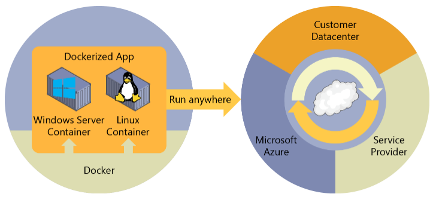

# Docker

## 目录

1. 简介
   - [什么是Docker](#什么是Docker)
   - [Windows容器](#Windows容器)
   - [为什么使用Docker](#为什么使用Docker)
   - [虚拟化与docker](#虚拟化与docker)
   - [VM和Docker容器之间的比较](#VM和Docker容器之间的比较)
   - [Docker官网注册](#Docker官网注册)
   - [安装](#安装)
   - [配置](#配置)
   - [卸载](#卸载)
   - [MySQL示例](#MySQL示例)
2. 命令
   - [Docker子命令分类](#Docker子命令分类)
   - [镜像命令](#镜像命令)
     - [获取镜像](#获取镜像)
     - [查看镜像列表](#查看镜像列表)
     - [上传镜像](#上传镜像)
     - [删除镜像](#删除镜像)
     - [查看镜像操作记录](#查看镜像操作记录)
     - [给镜像设置一个新的仓库：版本对](#给镜像设置一个新的仓库：版本对)
     - [镜像保存](#镜像保存)
     - [查看镜像详细信息](#查看镜像详细信息)
   - [Dockerfile命令](#Dockerfile命令)
   - [Docker日志命令](#Docker日志命令)
   - [限制容器资源](#限制容器资源)
     - [内存限制](#内存限制)
     - [CPU限制](#CPU限制)
   - [容器命令](#容器命令)

## 什么是Docker


官方网站：[https://docs.docker.com/linux/started/](https://docs.docker.com/linux/started/)

Docker是一个开源的引擎，可以轻松的为任何应用创建一个轻量级的、可移植的、自给自足的容器。

Docker最初是dotCloud公司创始人Solomon Hykes在法国期间发起的一个公司内部项目，它是基于dotCloud公司多年云服务技术的一次革新，并于2013年3月以Apache2.0授权协议开源，主要项目代码在 GitHub上进行维护。

Docker使用Google公司推出的Go语言进行开发和实现，在Linux操作系统上提供了一个软件抽象层和操作系统层虚拟化的自动管理机制。Docker利用了Linux的资源分托机制（cgroups以及命名空间）来创建独立的软件容器。Linux对命名空间的支持完全隔离工作环境中的应用程序，包括进程树，网络，用户ID挂载文件系统；而cgroups则提供了资源隔离，包括CPU，内存等。

Docker在容器的基础上，进行了进一步的封装，从文件系统、网络互联到进程隔离等等，极大简化了容器的创建和维护，使得Docker技术比虚拟机技术更为轻便快捷。

Docker的初衷是创建软件程序可移植的轻量容器，让软件可以在任何安装了Docker的主机上运行，而不用关心底层操作系统。

现在[Docker](https://www.docker.com/) 是一种[开源项目](https://github.com/docker/docker)，也是一家公司，它与云、Linux 和 Windows 供应商（包括 Microsoft）协作，致力于推广和发展这项技术。

为了在开发环境中承载容器，并提供其他开发人员工具，Docker 为 Windows 或 macOS 提供了 Docker 社区版 (CE)。 这些产品安装了承载容器所需的 VM（Docker 主机）。 Docker 还提供 Docker 企业版 (EE)，该版本专为企业开发而设计，供生成、交付和在生产中运行大型业务关键型应用程序的 IT 团队使用。

## Windows容器

若要运行 [Windows 容器](https://docs.microsoft.com/zh-cn/virtualization/windowscontainers/about/)，有两种类型的运行时可供使用：

- “Windows Server 容器”通过进程和命名空间隔离技术提供应用程序隔离。Windows Server容器与容器主机和主机上运行的所有容器共享内核。
- “Hyper-V 容器”通过在高度优化的虚拟机中运行各容器来扩展 Windows Server 容器提供的隔离。在此配置中，容器主机的内核不与 Hyper-V 容器共享，以提供更好的隔离。

这些容器的映像的创建和工作方式均相同。 区别在于，在运行 Hyper-V 容器的映像中创建容器的方式需要使用其他参数。有关详细信息，请参阅 [Hyper-V 容器](https://docs.microsoft.com/virtualization/windowscontainers/manage-containers/hyperv-container)。

Docker 在混合云的所有层部署容器：



## 为什么使用Docker

Docker是一种新兴的虚拟化方式，但是，Docker不是虚拟机，传统的虚拟机是先虚拟硬件资源，然后在虚拟的硬件资源之上运行操作系统。而Docker容器作为一个进程，直接运行于宿主主机内核，因此Docker更加快捷。

Docker具有很多优势：

- 高效利用系统资源（没有虚拟硬件的额外开销）。
- 更快的启动时间（通常可以在1秒内启动）。
- 便于部署（镜像包含了应用和相关依赖，可以运行在任何配置了Docker的主机上）。
- 轻松迁移。
- 分层存储，提高存储效率。

Docker容器虚拟化的优点

- 环境隔离；

  通过cgroups和namesapce进行实现资源隔离，实现一台机器运行多个容器互不影响。

- 更快速的交付部署；

  使用docker，开发人员可以利用镜像快速构建一套标准的研发环境；开发完成后，测试和运维人员可以直接通过使用相同的环境来部署代码。Docker可以快速创建和删除容器，实现快速迭代，大量节约开发、测试、部署的时间。并且，各个步骤都有明确的配置和操作，整个过程全程公司内文档说明，使团队更容易理解应用创建和工作的过程。

- 更高效的资源利用；

  docker容器的运行不需要额外的虚拟化管理程序的支持，它是内核级的虚拟化，可以实现更高的性能，同时对资源的额外需求很低。

- 更易迁移扩展；

  docker容器几乎可以在任意的平台上运行，包括物理机、虚拟机、公有云、私有云、个人电脑、服务器等，这种兼容性让用户可以在不同平台之间轻松的迁移应用。

- 更简单的更新管理。

  使用Dockerfile，只需要小小的配置修改，就可以替代以往的大量的更新工作。并且所有修改都是以增量的方式进行分发和更新，从而实现自动化和高效的容器管理。

## 虚拟化与docker

虚拟化定义：虚拟化是一种资源管理技术，是将计算机的各种实体资源，如服务器、网络、内存及存储等，予以抽象、转换后呈现出来，打破实体结构间的不可切割的障碍，使用户可以比原本的配置更好的方式来应用这些资源。这些资源的新虚拟部分是不受现有资源的架设方式，地域或物理配置所限制。一般所指的虚拟化资源包括计算能力和数据存储。

系统虚拟化，Hypervisor Virtualization，全虚拟化。在 Host 中通过 Hypervisor 层实现安装多个 GuestOS，每个 GuestOS 都有自己的内核，和主机的内核不同，GuestOS 之间完全隔离。

容器虚拟化，Operating System Virtualization ，使用 Linux 内核中的 namespaces 和 cgroups 实现进程组之间的隔离。是用内核技术实现的隔离，所以它是一个共享内核的虚拟化技术。

容器虚拟化没有 GuestOS，使用 Docker 时下载的镜像，只是为运行 App 提供的一个依赖的环境，是一个删减版本的系统镜像。一般情况下系统虚拟化没有容器虚拟化的运行效率高，但是系统安全性高很多。

## VM和Docker容器之间的比较

容器所需的资源要少得多，允许在同一硬件单元上运行更多服务，从而降低成本。

在同一内核上运行的副作用是，获得的隔离比 VM 少。

映像的主要目标是确保在不同部署的同一环境（依赖项）。也就是说，可以在计算机上调试它，然后将其部署到保证具有相同环境的另一台计算机上。

借助容器映像，可打包应用或服务并采用可靠且可重现的方式对其进行部署。可以说 Docker 不只是一种技术，还是一种原理和过程。

在使用 Docker 时，你不会听到开发人员说：“为什么它能在我的计算机上使用却不能用在生产中？” 他们只需说“它在 Docker 上运行”，因为打包的 Docker 应用程序可在任何支持的 Docker 环境上执行，而且它在所有部署目标（例如，开发、QA、暂存和生产）上都按预期运行。


也许一个简单的类比有助于掌握 Docker 的核心概念。

让我们回到 20 世纪 50 年代。 那时，还没有处理器这个词，而复印机无处不在（某种程度上）。假设你负责按要求快速发出成批的信件、将这些信件邮寄给客户、使用纸张和信封以物理方式寄送到每个客户的地址（那时还没有电子邮件）。在某个时候，你意识到，这些信件只是由一大组段落组合而成的，根据信件的用途对其进行所需的选取和排列，因此，你设计了一个系统，以快速发送这些信件，希望能大幅提高效率。这个系统很简单：

1. 先从一副透明薄片开始，每个薄片包含一个段落。
2. 若要发送一组信件，你选择包含所需段落的薄片，然后堆栈并对齐它们，使其外观一致且易于阅读。
3. 最后，你将其置于复印机中并按开始，以生成所需的多个信件。

简而言之，这就是 Docker 的核心理念。在 Docker 中，每层都是在执行命令（例如，安装程序）后在文件系统所发生的一组更改。因此，当你在复制层后“查看”文件系统时，你将看到所有文件，包括在安装程序时的层。你可以将映像视为要在“计算机”中安装的辅助只读硬盘，其中操作系统已经安装。同样，你可以将容器视为已安装映像硬盘的“计算机”。与计算机一样，可以打开或关闭容器电源。

优越性：你在一台机器可以开10个虚拟机，如果用docker可以开100个容器，就是这么霸气

## Docker官网注册

注册一个docker账号：[https://hub.docker.com/](https://hub.docker.com/)

## Docker术语

- 存储库 (repo) ：相关的 Docker 映像集合，带有指示映像版本的标记。 某些存储库包含特定映像的多个变量，例如包含 SDK（较重）的映像，包含唯一运行时（较轻）的映像，等等。这些变量可以使用标记进行标记。 单个存储库中可包含平台变量，如 Linux 映像和 Windows 映像。

- 注册表：提供存储库访问权限的服务。 大多数公共映像的默认注册表是 [Docker 中心](https://hub.docker.com/)（归作为组织的 Docker 所有）。 注册表通常包含来自多个团队的存储库。 公司通常使用私有注册表来存储和管理其创建的映像。 另一个示例是 Azure 容器注册表。

- Docker 中心：上传并使用映像的公共注册表。 Docker 中心提供 Docker 映像托管、公共或私有注册表，生成触发器和 Web 挂钩，以及与 GitHub 和 Bitbucket 集成。

- Azure 容器注册表：用于在 Azure 中使用 Docker 映像及其组件的公共资源。 这提供了与 Azure 中的部署接近的注册表，使你可以控制访问权限，从而可以使用 Azure Active Directory 组和权限。

- Docker 受信任注册表 (DTR) ：Docker 注册表服务（来自 Docker），可以安装在本地，因此它存在于组织的数据中心和网络中。 这对于应该在企业内部管理的私有映像来说很方便。 Docker 受信任注册表是 Docker 数据中心产品的一部分。 有关详细信息，请参阅 [Docker 受信任注册表 (DTR)](https://docs.docker.com/docker-trusted-registry/overview/)。

- Docker 社区版 (CE) ：适用于 Windows 和 macOS、用于在本地生成、运行和测试容器的开发工具。 适用于 Windows 的 Docker CE 为 Linux 和 Windows 容器提供了开发环境。 Windows 上的 Linux Docker 主机基于 [Hyper-V](https://www.microsoft.com/cloud-platform/server-virtualization) 虚拟机。 适用于 Windows 容器的主机直接基于 Windows。 适用于 Mac 的 Docker CE 基于 Apple 虚拟机监控程序框架和 [xhyve 虚拟机监控程序](https://github.com/mist64/xhyve)，在 Mac OS X 上提供了 Linux Docker 主机虚拟机。适用于 Windows 和 Mac 的 Docker CE 替换了 Docker 工具箱，后者基于 Oracle VirtualBox。

- Docker 企业版 (EE) ：适用于 Linux 和 Windows 开发的 Docker 工具企业级版本。

## 安装

原文：[https://idig8.com/2018/07/27/docker-chuji-02/](https://idig8.com/2018/07/27/docker-chuji-02/)

**环境介绍：**

操作系统：64bit CentOS7  
docker版本：17.05.0-ce（最新版本）  
版本新功能：[https://github.com/docker/docker/blob/master/CHANGELOG.md](https://github.com/docker/docker/blob/master/CHANGELOG.md)

**安装步骤：**

系统：64位centos7  
迅雷直接下载：[http://mirrors.njupt.edu.cn/centos/7/isos/x86_64/CentOS-7-x86_64-DVD-1708.iso](http://mirrors.njupt.edu.cn/centos/7/isos/x86_64/CentOS-7-x86_64-DVD-1708.iso)  
虚拟机：virtualBox 最好是安装完整版本的centos7。  
要求: 内核版本最低为3.10  
查看当前内核版本：`uname –r`  
要求: 更改网卡配置  
更改网卡配置：`vi/etc/sysconfig/network-scripts/ifcfg-enp0s3`  
`ONBOOT=yes`  
更改完后重启服务：`service network restart`  
注意：如果ifconfig命令不识别的话需要安装：  
`yum install net-tools`

**通过yum方式安装docker：**

1. 更新yum源：`sudo yum update`
2. 增加docker的yum源：  
   输入命令：`vi /etc/yum.repos.d/docker.repo`  
   输入：  

   ```ini
   [dockerrepo]
   name=Docker Repository
   baseurl=https://yum.dockerproject.org/repo/main/centos/7/
   enabled=1
   gpgcheck=1
   gpgkey=https://yum.dockerproject.org/gpg
   ```

   这样我们就添加了yum源  
   可以通过命令：`sudo vi /etc/yum.repos.d/docker.repo`查看
3. 通过yum安装docker  
   `sudo yum install docker-engine`
4. 启动docker服务  
   `sudo service docker start`
5. 查看版本信息，通过测试用例验证docker是否安装成功  
   验证docker版本：`sudo docker version`  
   测试：`sudo docker run hello-world`  

安装完docker后，执行docker相关命令，出现

`"Got permission denied while trying to connect to the Docker daemon socket at unix:///var/run/docker.sock: Get http://%2Fvar%2Frun%2Fdocker.sock/v1.26/images/json: dial unix /var/run/docker.sock: connect: permission denied"`

原因：docker进程使用Unix Socket而不是TCP端口。而默认情况下，Unix socket属于root用户，需要root权限才能访问。

解决方法：docker守护进程启动的时候，会默认赋予名字为docker的用户组读写Unix socket的权限，因此只要创建docker用户组，并将当前用户加入到docker用户组中，那么当前用户就有权限访问Unix socket了，进而也就可以执行docker相关命令

## 配置

docker配置（docker控制应该有个专门的用户）：

```sh
adduser Colin #添加用户
passwd Colin #更改密码
su Colin #切换用户
#将用户Colin加入sudo files
sudo groupadd docker     #添加docker用户组
sudo gpasswd -a $USER docker     #将登陆用户加入到docker用户组中
newgrp docker     #更新用户组
docker ps    #测试docker命令是否可以使用sudo正常使用
```

验证在不使用sudo的情况下docker是否正常工作：`docker run hello-world`

设置docker开机启动：`sudo chkconfig docker on`

## 卸载

查看安装包：`yum list installed | grep docker`  
移除安装包：`sudo yum -y remove docker-engine.x86_64`  
清除所有docker依赖文件：`rm -rf /var/lib/docker`  
删除用户创建的配置文件

## MySQL示例

运行命令：
`docker run --name colin-mysql -p 3306:3306 -e MYSQL_ROOT_PASSWORD=1234 -itd mysql:5.7`

docker run是启动容器的命令；  
--name：指定了容器的名称，方便之后进入容器的命令行  
-itd：其中，i是交互式操作，t是一个终端，d指的是在后台运行  
-p：指在本地生成一个随机端口，用来映射mysql的3306端口  
-e：设置环境变量 `MYSQL_ROOT_PASSWORD=emc123123`：指定了mysql的root密码  
mysql：指运行mysql镜像

进入MySQL容器：`docker exec -it colin-mysql /bin/bash`

进入MySQL：`mysql -uroot -p`

***进行配置，使外部工具可以连接：***

设置root帐号的密码：`update user set authentication_string = password('1234') where user = 'root';`

接着，由于mysql中root执行绑定在了localhost，因此需要对root进行授权

```sql
grant all privileges on *.* to 'root'@'%' identified by '1234' with grant option;
flush privileges;
```

## 命令

启动docker服务：`service docker start`

查看子命令信息：`docker COMMAND --help`

### Docker子命令分类

子命令分类|子命令
-|-
Docker环境信息|info、version
容器生命周期管理|Create、exec、kill、pause、restart、rm、run、start、stop、unpause
镜像仓库命令|login、logout、pull、push、search
镜像管理|build、images、import、load、rmi、save、tag、commit
容器运维操作|attach、export、inspect、port、ps、rename、stats、top、wait、cp、diff、update
容器资源管理|volume、network
系统日志信息|events、history、logs

### 镜像命令

包含创建容器所需的所有依赖项和信息的包。映像包括所有依赖项（例如框架），以及容器运行时使用的部署和执行配置。 通常情况下，映像派生自多个基础映像，这些基础映像是堆叠在一起形成容器文件系统的层。 创建后，映像不可变。

Docker registry是存储容器镜像的仓库，用户可以通过Docker c1ient与Docker registry进行通信，以此来完成镜像的搜索、下载和上传等相关操作。DockerHub是由Docker公司在互联网上提供的一个镜像仓库，提供镜像的公有与私有存储服务，它是用户最主要的镜像来源。除了DockerHub外，用户还可以自行搭建私有服务器来实现镜像仓库的功能。

镜像是一个静态的概念，可以从一个镜像创建多个容器，每个容器互不影响！

所谓“仓库”，简单来说就是集中存放镜像的地方。

Docker 官方维护着一个公共仓库 [Docker store](https://store.docker.com/)，你可以方便的在 Docker store 寻找自己想要的镜像。

当然，你也可以在终端里面登录：`docker login` 输入你的用户名和密码就可以登陆了。然后，可以使用 `sudo docker search ubuntu` 来搜索 Ubuntu 镜像

#### 获取镜像

`docker pull` --从仓库获取所需要的镜像

使用示例：`docker pull centos:centos6`

实际上相当于 `docker pull registry.hub.docker.com/centos:centos6` 命令，即从注册服务器 registry.hub.docker.com 中的 centos 仓库下载标记为 centos6 的镜像。

有时候官方仓库注册服务器下载较慢，可以从其他仓库下载。从其它仓库下载时需要指定完整的仓库注册服务器地址。

标记：可以应用于映像的标记或标签，以便可以识别同一映像的不同映像或版本（具体取决于版本号或目标环境）。

#### 查看镜像列表

`docker images` --列出了所有顶层（top-level）镜像

实际上，在这里我们没有办法区分一个镜像和一个只读层，所以我们提出了top-level镜像。只有创建容器时使用的镜像或者是直接pull下来的镜像能被称为顶层（top-level）镜像，并且每一个顶层镜像下面都隐藏了多个镜像层。

使用示例：`docker images`

REPOSITORY|TAG|IMAGE ID|CREATED|SIZE
-|-|-|-|-
centos|centos6|6a77ab6655b9|8 weeks ago|194.6 MB
ubuntu|latest|2fa927b5cdd3|9 weeks ago|122 MB

在列出信息中，可以看到几个字段信息

- 来自于哪个仓库，比如 ubuntu
- 镜像的标记，比如 14.04
- 它的 ID 号（唯一）
- 创建时间
- 镜像大小

#### 上传镜像

`docker push` --用户可以通过 docker push 命令，把自己创建的镜像上传到仓库中来共享

例如，用户在 Docker Hub 上完成注册后，可以推送自己的镜像到仓库中。

运行实例：`docker push hainiu/httpd:1.0`

#### 删除镜像

`docker rmi <image-id>` --删除构成镜像的一个只读层

你只能够使用`docker rmi`来移除最顶层（top level layer）（也可以说是镜像），你也可以使用-f参数来强制删除中间的只读层

#### 查看镜像操作记录

`docker history [nameOfImage]`

#### 给镜像设置一个新的仓库：版本对

`docker tag my_image:v1.0 my:v0.1`

运行了上面的指令我们就得到了一个新的，和原来的镜像一模一样的镜像。

#### 镜像保存

`docker save <image-id>` --创建一个镜像的压缩文件，这个文件能够在另外一个主机的Docker上使用。

和export命令不同，这个命令为每一个层都保存了它们的元数据。这个命令只能对镜像生效。

使用示例：

```sh
# 保存centos镜像到centos_images.tar 文件
docker save  -o centos_images.tar centos:centos6

# 或者直接重定向
docker save  -o centos_images.tar centos:centos6 > centos_images.tar
```

#### 查看镜像详细信息

`docker inspect <container-id> or <image-id>` -- inspect命令会提取出容器或者镜像最顶层的元数据，默认会列出全部信息

### Dockerfile命令

Dockerfile：包含有关如何生成 Docker 映像的说明的文本文件。与批处理脚本相似，首先第一行将介绍基础映像，然后是关于安装所需程序、复制文件等操作的说明，直至获取所需的工作环境。

生成：基于其 Dockerfile 提供的信息和上下文生成容器映像的操作，以及生成映像的文件夹中的其他文件。可以使用 `docker build` 命令生成映像 。

多阶段生成：Docker 17.05 或更高版本的一个功能，可帮助减小最终映像的大小。概括来说，借助多阶段生成，可以使用一个包含 SDK 的大型基础映像（以此为例）编译和发布应用程序，然后使用发布文件夹和一个小型仅运行时基础映像生成一个更小的最终映像。

多体系结构映像：多体系结构是一项功能，根据运行 Docker 的平台简化相应映像选择。例如，Dockerfile 从注册表请求基础映像  
`FROM mcr.microsoft.com/dotnet/core/sdk:2.2`  
时，实际上它会获得 2.2-nanoserver-1709、2.2-nanoserver-1803、2.2-nanoserver-1809 或 2.2-stretch，具体取决于操作系统和运行 Docker 的版本 。

**docker build：**

使用 `docker commit` 来扩展一个镜像比较简单，但是不方便在一个团队中分享。我们可以使用 `docker build` 来创建一个新的镜像。为此，首先需要创建一个 Dockerfile，包含一些如何创建镜像的指令。新建一个目录和一个 Dockerfile。

```sh
mkdir hainiu
cd hainiu
touch Dockerfile
```

Dockerfile中每一条指令都创建镜像的一层，例如：

```Dockerfile
FROM centos:centos6
LABEL maintainer="chenxiao8516@163.com"
# move all configuration files into container
RUN yum install -y httpd
EXPOSE 80
CMD ["sh","-c","service httpd start;bash"]
```

Dockerfile基本的语法是：

- 使用#来注释
- FROM指令告诉Docker使用哪个镜像作为基础
- 接着是维护者的信息
- RUN开头的指令会在创建中运行，比如安装一个软件包，在这里使用yum来安装了一些软件

更详细的语法说明请参考[Dockerfile](https://docs.docker.com/engine/reference/builder/)

编写完成 Dockerfile 后可以使用 `docker build` 来生成镜像。

`docker build -t hainiu/httpd:1.0 .`

其中 -t标记添加tag，指定新的镜像的用户信息。"."是Dockerfile所在的路径（当前目录），也可以替换为一个具体的Dockerfile的路径。注意一个镜像不能超过127层。用`docker images`查看镜像列表

```sh
docker images
```

REPOSITORY|TAG|IMAGE ID|CREATED|SIZE
-|-|-|-|-
hainiu/httpd|1.0|5f9aa91b0c9e|3 minutes ago|292.4 MB
centos|centos6|6a77ab6655b9|8 weeks ago|194.6 MB
ubuntu|latest|2fa927b5cdd3|9 weeks ago|122 MB

细心的朋友可以看到最后一层的 ID(5f9aa91b0c9e) 和 image id 是一样的

### Docker日志命令

如果你在后台运行一个容器，可是你把"echo"错误输入成了"eceo"：

```sh
sudo docker run -d --name logtest ubuntu:16.04 bash -c "eceo hello"
```

后来，你意识到你的容器没有正常运行，你可以使用"docker logs"指令查看哪里出了问题。

```sh
sudo docker logs logtest
```

### 限制容器资源

资源限制主要包含两个方面的内容——内存限制和 CPU 限制。

#### 内存限制

执行 `Docker run` 命令时可以使用的和内存限制有关的参数如下：

- -m, --memory 内存限制，格式：数字+单位，单位可以是 b、k、m、g，最小 4M  
- -- -memory-swap 内存和交换空间总大小限制，注意：必须比 -m 参数大

#### CPU限制

`Docker run` 命令执行的时候可以使用的限制 CPU 的参数如下：

- -- -cpuset-cpus="" 允许使用的 CPU 集
- -c,--cpu-shares=0 CPU共享权值
- -- -cpu-quota=0 限制 CPU CFS 配额，必须不小于 1ms，即 >=1000
- cpu-period=0 限制 CPU CFS 调度周期，范围是 100ms~1s，即 [1000，1000000]

现在详细介绍一下 CPU 限制的这几个参数。

1. 可以设置在哪些 CPU 核上运行，比如下面的指令指定容器进程可以在 CPU1 和 CPU3 上运行：

   ```sh
   sudo docker run -ti --cpuset-cpus="1,3" --name cpuset ubuntu:16.04 bash
   ```

2. CPU 共享权值——CPU 资源相对限制

   默认情况下，所有容器都得到同样比例的 CPU 周期，这个比例叫做 CPU 共享权值，通过"-c"或者"- -cpu-shares"设置。Docker 为每个容器设置的默认权值都是1024，不设置或者设置为0都会使用这个默认的共享权值。

   比如你有2个同时运行的容器，第一个容器的 CPU 共享权值为3，第2个容器的 CPU 共享权值为1，那么第一个容器将得到75%的 CPU 时间，而第二个容器只能得到25%的 CPU 时间，如果这时你再添加一个 CPU 共享权值为4的容器，那么第三个容器将得到50%的 CPU 时间，原来的第一个和第二个容器分别得到37.5%和12.5的 CPU 时间。

   但是需要注意，这个比例只有在 CPU 密集型任务执行的是有才有用，否则容器根本不会占用这么多 CPU 时间。

3. CPU 资源绝对限制

   Linux 通过 CFS 来调度各个进程对 CPU 的使用，CFS 的默认调度周期是 100ms。在使用 Docker 的时候我们可以通过"- -cpu-period"参数设置容器进程的调度周期，以及通过"- -cpu-quota"参数设置每个调度周期内容器能使用的 CPU 时间。一般这两个参数是配合使用的。但是，需要注意的是这里的“绝对”指的是一个上限，并不是说容器一定会使用这么多 CPU 时间，如果容器的任务不是很繁重，可能使用的 CPU 时间不会达到这个上限。

### 容器命令

Docker 映像的实例。容器表示单个应用程序、进程或服务的执行。它由 Docker 映像的内容、执行环境和一组标准指令组成。在缩放服务时，可以从相同的映像创建多个容器实例。 或者，批处理作业可以从同一个映像创建多个容器，向每个实例传递不同的参数。

## 附录

> [Docker公共镜像库](https://hub.docker.com/)  
> 账号：wolfkings  密码：Cxf5609757
>
> [阿里云镜像库](https://opsx.alibaba.com/mirror)

使用 gitlab-ce 镜像：

```sh
docker run --detach --hostname gitlab.example.com --publish 443:443 --publish 80:80 --publish 22:22 --name gitlab --restart always --volume /srv/gitlab/config:/etc/gitlab --volume /srv/gitlab/logs:/var/log/gitlab --volume /srv/gitlab/data:/var/opt/gitlab gitlab/gitlab-ce:latest
```
