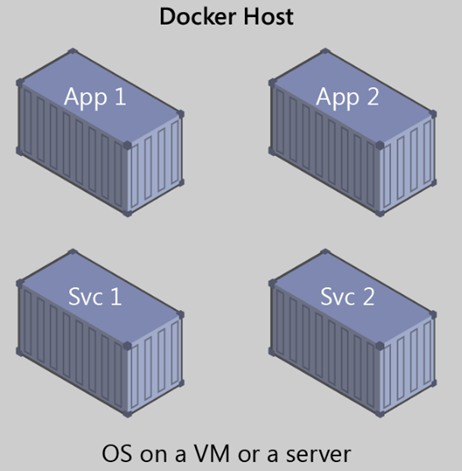
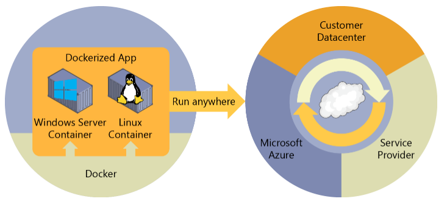
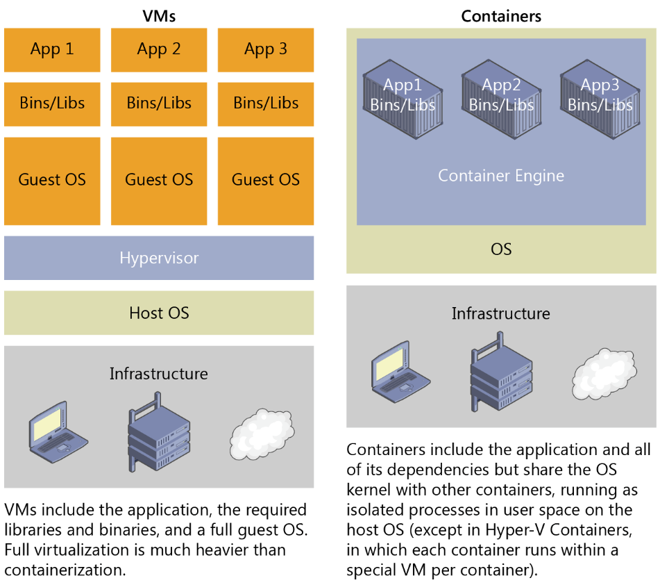

# Docker简介

## 容器和Docker简介

容器化是软件开发的一种方法，通过它可将应用程序或服务、其依赖项及其配置（抽象化为部署清单文件）一起打包为容器映像。然后，可将容器化应用程序作为单元进行测试，并将其作为容器映像实例部署到主机操作系统 (OS)。



就像船只、火车或卡车运输集装箱而不论其内部的货物一样，软件容器充当软件部署的标准单元，其中可以包含不同的代码和依赖项。 按照这种方式容器化软件，开发人员和 IT 专业人员只需进行极少修改或不修改，即可将其部署到不同的环境。

容器还会在共享 OS 上将应用程序彼此隔离开。容器化应用程序在容器主机上运行，而容器主机在 OS（Linux 或 Windows）上运行。 因此，容器的占用比虚拟机 (VM) 映像小得多。

每个容器都可运行整个 Web 应用或服务，如图所示。 在本例中，Docker 主机是容器主机，App1、App2、Svc1 和 Svc2 是容器化的应用程序或服务。

容器在整个应用程序生命周期工作流中提供了隔离性、可移植性、灵活性、可伸缩性和可控性等诸多优点。 最重要的优点是可在开发和运营之间实现环境隔离。

### 什么是Docker

官方网站：[https://docs.docker.com/linux/started/](https://docs.docker.com/linux/started/)

Docker是一个开源的引擎，可以轻松的为任何应用创建一个轻量级的、可移植的、自给自足的容器。开发者在笔记本上编译测试通过的容器可以批量地在生产环境中部署，包括VMs（虚拟机）、bare metal、OpenStack 集群和其他的基础应用平台。

Docker通常用于如下场景：

- web应用的自动化打包和发布；
- 自动化测试和持续集成、发布；
- 在服务型环境中部署和调整数据库或其他的后台应用；
- 从头编译或者扩展现有的OpenShift或Cloud Foundry平台来搭建自己的PaaS环境。

来点通俗的解释：

"Docker"这个单词有“码头工人”的意思，码头工人的工作就是把货物装到集装箱里，然后把集装箱搬到货船上面。Docker就是借鉴了这种做法，想一想，集装箱有什么好处呢？在一艘大货船上，所有货物装成集装箱就可以方便快捷地摆放在一起，并且各种各样的集装箱的规格都被标准化了，不管货物是什么，只要装到集装箱里面，就可以一次性被运走，而不必把不同的货物分开运输。

Docker就使用了这种思想。Docker就像一个码头工人，把可以运行的Linux系统装载到一个个容器）(container)里，这些容器就像一个个“装载了Linux系统”的集装箱。就像每个集装箱都有自己的货物一样，每个容器都像一个独立的Linux系统一样可以运行指定的程序。比如，一个容器可以作为Web服务器，另一个容器作为数据库服务器。

集装箱之间互不影响。同样，容器之间也都是独立的，一个容器不能操作另一个容器的资源，因此可以很好地隔离运行环境。每个容器都像一个独立的操作系统，拥有操作系统运行需要的所有配置和代码。

下面是更官方的解释

Docker最初是dotCloud公司创始人Solomon Hykes在法国期间发起的一个公司内部项目，它是基于dotCloud公司多年云服务技术的一次革新，并于2013年3月以Apache2.0授权协议开源，主要项目代码在 GitHub上进行维护。

Docker使用Google公司推出的Go语言进行开发和实现，在Linux操作系统上提供了一个软件抽象层和操作系统层虚拟化的自动管理机制。Docker利用了Linux的资源分托机制（cgroups以及命名空间）来创建独立的软件容器。Linux对命名空间的支持完全隔离工作环境中的应用程序，包括进程树，网络，用户ID挂载文件系统；而cgroups则提供了资源隔离，包括CPU，内存等。Docker在容器的基础上，进行了进一步的封装，从文件系统、网络互联到进程隔离等等，极大简化了容器的创建和维护，使得Docker技术比虚拟机技术更为轻便快捷。

Docker可以解决虚拟机能够解决的问题，也可以解决虚拟机由于资源要求过高而无法解决的问题。

- 隔离应用依赖
- 创建应用镜像并复制
- 创建易于分发的即开即用的应用或者应用镜像
- 允许实例简单快速扩展
- 易于测试和销毁

Docker的初衷是创建软件程序可移植的轻量容器，让软件可以在任何安装了Docker的主机上运行，而不用关心底层操作系统。

[Docker](https://www.docker.com/) 是一种[开源项目](https://github.com/docker/docker)，用于将应用程序自动部署为可在云或本地运行的便携式独立容器。 Docker 也是一家公司，它与云、Linux 和 Windows 供应商（包括 Microsoft）协作，致力于推广和发展这项技术。

为了在开发环境中承载容器，并提供其他开发人员工具，Docker 为 Windows 或 macOS 提供了 Docker 社区版 (CE)。 这些产品安装了承载容器所需的 VM（Docker 主机）。 Docker 还提供 Docker 企业版 (EE)，该版本专为企业开发而设计，供生成、交付和在生产中运行大型业务关键型应用程序的 IT 团队使用。

若要运行 [Windows 容器](https://docs.microsoft.com/zh-cn/virtualization/windowscontainers/about/)，有两种类型的运行时可供使用：

- “Windows Server 容器”通过进程和命名空间隔离技术提供应用程序隔离。Windows Server容器与容器主机和主机上运行的所有容器共享内核。
- “Hyper-V 容器”通过在高度优化的虚拟机中运行各容器来扩展 Windows Server 容器提供的隔离。在此配置中，容器主机的内核不与 Hyper-V 容器共享，以提供更好的隔离。

这些容器的映像的创建和工作方式均相同。 区别在于，在运行 Hyper-V 容器的映像中创建容器的方式需要使用其他参数。有关详细信息，请参阅 [Hyper-V 容器](https://docs.microsoft.com/virtualization/windowscontainers/manage-containers/hyperv-container)。

Docker 在混合云的所有层部署容器：



### 为什么使用Docker

Docker是一种新兴的虚拟化方式，但是，Docker不是虚拟机，传统的虚拟机是先虚拟硬件资源，然后在虚拟的硬件资源之上运行操作系统。而Docker容器作为一个进程，直接运行于宿主主机内核，因此Docker更加快捷。

Docker具有很多优势：

- 高效利用系统资源（没有虚拟硬件的额外开销）。
- 更快的启动时间（通常可以在1秒内启动）。
- 便于部署（镜像包含了应用和相关依赖，可以运行在任何配置了Docker的主机上）。
- 轻松迁移。
- 分层存储，提高存储效率。

Docker容器虚拟化的优点

- 环境隔离；

  通过cgroups和namesapce进行实现资源隔离，实现一台机器运行多个容器互不影响。

- 更快速的交付部署；

  使用docker，开发人员可以利用镜像快速构建一套标准的研发环境；开发完成后，测试和运维人员可以直接通过使用相同的环境来部署代码。Docker可以快速创建和删除容器，实现快速迭代，大量节约开发、测试、部署的时间。并且，各个步骤都有明确的配置和操作，整个过程全程公司内文档说明，使团队更容易理解应用创建和工作的过程。

- 更高效的资源利用；

  docker容器的运行不需要额外的虚拟化管理程序的支持，它是内核级的虚拟化，可以实现更高的性能，同时对资源的额外需求很低。

- 更易迁移扩展；

  docker容器几乎可以在任意的平台上运行，包括物理机、虚拟机、公有云、私有云、个人电脑、服务器等，这种兼容性让用户可以在不同平台之间轻松的迁移应用。

- 更简单的更新管理。

  使用Dockerfile，只需要小小的配置修改，就可以替代以往的大量的更新工作。并且所有修改都是以增量的方式进行分发和更新，从而实现自动化和高效的容器管理。

### 虚拟化与docker

虚拟化定义：虚拟化是一种资源管理技术，是将计算机的各种实体资源，如服务器、网络、内存及存储等，予以抽象、转换后呈现出来，打破实体结构间的不可切割的障碍，使用户可以比原本的配置更好的方式来应用这些资源。这些资源的新虚拟部分是不受现有资源的架设方式，地域或物理配置所限制。一般所指的虚拟化资源包括计算能力和数据存储。

系统虚拟化，Hypervisor Virtualization，全虚拟化。在 Host 中通过 Hypervisor 层实现安装多个 GuestOS，每个 GuestOS 都有自己的内核，和主机的内核不同，GuestOS 之间完全隔离。

容器虚拟化，Operating System Virtualization ，使用 Linux 内核中的 namespaces 和 cgroups 实现进程组之间的隔离。是用内核技术实现的隔离，所以它是一个共享内核的虚拟化技术。

容器虚拟化没有 GuestOS，使用 Docker 时下载的镜像，只是为运行 App 提供的一个依赖的环境，是一个删减版本的系统镜像。一般情况下系统虚拟化没有容器虚拟化的运行效率高，但是系统安全性高很多。

### VM 和 Docker 容器之间的比较

容器所需的资源要少得多，允许在同一硬件单元上运行更多服务，从而降低成本。

在同一内核上运行的副作用是，获得的隔离比 VM 少。

映像的主要目标是确保在不同部署的同一环境（依赖项）。也就是说，可以在计算机上调试它，然后将其部署到保证具有相同环境的另一台计算机上。

借助容器映像，可打包应用或服务并采用可靠且可重现的方式对其进行部署。可以说 Docker 不只是一种技术，还是一种原理和过程。

在使用 Docker 时，你不会听到开发人员说：“为什么它能在我的计算机上使用却不能用在生产中？” 他们只需说“它在 Docker 上运行”，因为打包的 Docker 应用程序可在任何支持的 Docker 环境上执行，而且它在所有部署目标（例如，开发、QA、暂存和生产）上都按预期运行。



也许一个简单的类比有助于掌握 Docker 的核心概念。

让我们回到 20 世纪 50 年代。 那时，还没有处理器这个词，而复印机无处不在（某种程度上）。

假设你负责按要求快速发出成批的信件、将这些信件邮寄给客户、使用纸张和信封以物理方式寄送到每个客户的地址（那时还没有电子邮件）。

在某个时候，你意识到，这些信件只是由一大组段落组合而成的，根据信件的用途对其进行所需的选取和排列，因此，你设计了一个系统，以快速发送这些信件，希望能大幅提高效率。

这个系统很简单：

1. 先从一副透明薄片开始，每个薄片包含一个段落。
2. 若要发送一组信件，你选择包含所需段落的薄片，然后堆栈并对齐它们，使其外观一致且易于阅读。
3. 最后，你将其置于复印机中并按开始，以生成所需的多个信件。

简而言之，这就是 Docker 的核心理念。

在 Docker 中，每层都是在执行命令（例如，安装程序）后在文件系统所发生的一组更改。

因此，当你在复制层后“查看”文件系统时，你将看到所有文件，包括在安装程序时的层。

你可以将映像视为要在“计算机”中安装的辅助只读硬盘，其中操作系统已经安装。

同样，你可以将容器视为已安装映像硬盘的“计算机”。与计算机一样，可以打开或关闭容器电源。

优越性：你在一台机器可以开10个虚拟机，如果用docker可以开100个容器，就是这么霸气

## Docker官网注册

注册一个docker账号：[https://hub.docker.com/](https://hub.docker.com/)

## Docker术语

- 存储库 (repo) ：相关的 Docker 映像集合，带有指示映像版本的标记。 某些存储库包含特定映像的多个变量，例如包含 SDK（较重）的映像，包含唯一运行时（较轻）的映像，等等。这些变量可以使用标记进行标记。 单个存储库中可包含平台变量，如 Linux 映像和 Windows 映像。

- 注册表：提供存储库访问权限的服务。 大多数公共映像的默认注册表是 [Docker 中心](https://hub.docker.com/)（归作为组织的 Docker 所有）。 注册表通常包含来自多个团队的存储库。 公司通常使用私有注册表来存储和管理其创建的映像。 另一个示例是 Azure 容器注册表。

- Docker 中心：上传并使用映像的公共注册表。 Docker 中心提供 Docker 映像托管、公共或私有注册表，生成触发器和 Web 挂钩，以及与 GitHub 和 Bitbucket 集成。

- Azure 容器注册表：用于在 Azure 中使用 Docker 映像及其组件的公共资源。 这提供了与 Azure 中的部署接近的注册表，使你可以控制访问权限，从而可以使用 Azure Active Directory 组和权限。

- Docker 受信任注册表 (DTR) ：Docker 注册表服务（来自 Docker），可以安装在本地，因此它存在于组织的数据中心和网络中。 这对于应该在企业内部管理的私有映像来说很方便。 Docker 受信任注册表是 Docker 数据中心产品的一部分。 有关详细信息，请参阅 [Docker 受信任注册表 (DTR)](https://docs.docker.com/docker-trusted-registry/overview/)。

- Docker 社区版 (CE) ：适用于 Windows 和 macOS、用于在本地生成、运行和测试容器的开发工具。 适用于 Windows 的 Docker CE 为 Linux 和 Windows 容器提供了开发环境。 Windows 上的 Linux Docker 主机基于 [Hyper-V](https://www.microsoft.com/cloud-platform/server-virtualization) 虚拟机。 适用于 Windows 容器的主机直接基于 Windows。 适用于 Mac 的 Docker CE 基于 Apple 虚拟机监控程序框架和 [xhyve 虚拟机监控程序](https://github.com/mist64/xhyve)，在 Mac OS X 上提供了 Linux Docker 主机虚拟机。适用于 Windows 和 Mac 的 Docker CE 替换了 Docker 工具箱，后者基于 Oracle VirtualBox。

- Docker 企业版 (EE) ：适用于 Linux 和 Windows 开发的 Docker 工具企业级版本。

## 安装

原文：[https://idig8.com/2018/07/27/docker-chuji-02/](https://idig8.com/2018/07/27/docker-chuji-02/)

**环境介绍：**

操作系统：64bit CentOS7  
docker版本：17.05.0-ce（最新版本）  
版本新功能：[https://github.com/docker/docker/blob/master/CHANGELOG.md](https://github.com/docker/docker/blob/master/CHANGELOG.md)

**安装步骤：**

系统：64位centos7  
迅雷直接下载：[http://mirrors.njupt.edu.cn/centos/7/isos/x86_64/CentOS-7-x86_64-DVD-1708.iso](http://mirrors.njupt.edu.cn/centos/7/isos/x86_64/CentOS-7-x86_64-DVD-1708.iso)  
虚拟机：virtualBox 最好是安装完整版本的centos7。  
要求: 内核版本最低为3.10  
查看当前内核版本：`uname –r`  
要求: 更改网卡配置  
更改网卡配置：`vi/etc/sysconfig/network-scripts/ifcfg-enp0s3`  
`ONBOOT=yes`  
更改完后重启服务：`service network restart`  
注意：如果ifconfig命令不识别的话需要安装：  
`yum install net-tools`

**通过yum方式安装docker：**

1. 更新yum源：`sudo yum update`
2. 增加docker的yum源：  
   输入命令：`vi /etc/yum.repos.d/docker.repo`  
   输入：  

   ```ini
   [dockerrepo]
   name=Docker Repository
   baseurl=https://yum.dockerproject.org/repo/main/centos/7/
   enabled=1
   gpgcheck=1
   gpgkey=https://yum.dockerproject.org/gpg
   ```

   这样我们就添加了yum源  
   可以通过命令：`sudo vi /etc/yum.repos.d/docker.repo`查看
3. 通过yum安装docker  
   `sudo yum install docker-engine`
4. 启动docker服务  
   `sudo service docker start`
5. 查看版本信息，通过测试用例验证docker是否安装成功  
   验证docker版本：`sudo docker version`  
   测试：`sudo docker run hello-world`  

安装完docker后，执行docker相关命令，出现

`"Got permission denied while trying to connect to the Docker daemon socket at unix:///var/run/docker.sock: Get http://%2Fvar%2Frun%2Fdocker.sock/v1.26/images/json: dial unix /var/run/docker.sock: connect: permission denied"`

原因：docker进程使用Unix Socket而不是TCP端口。而默认情况下，Unix socket属于root用户，需要root权限才能访问。

解决方法：docker守护进程启动的时候，会默认赋予名字为docker的用户组读写Unix socket的权限，因此只要创建docker用户组，并将当前用户加入到docker用户组中，那么当前用户就有权限访问Unix socket了，进而也就可以执行docker相关命令

docker配置（docker控制应该有个专门的用户）：

```sh
adduser Colin #添加用户
passwd Colin #更改密码
su Colin #切换用户
#将用户Colin加入sudo files
sudo groupadd docker     #添加docker用户组
sudo gpasswd -a $USER docker     #将登陆用户加入到docker用户组中
newgrp docker     #更新用户组
docker ps    #测试docker命令是否可以使用sudo正常使用
```

验证在不使用sudo的情况下docker是否正常工作：`docker run hello-world`

设置docker开机启动：`sudo chkconfig docker on`

**docker卸载：**

查看安装包：`yum list installed | grep docker`  
移除安装包：`sudo yum -y remove docker-engine.x86_64`
清除所有docker依赖文件：`rm -rf /var/lib/docker`  
删除用户创建的配置文件

## MySQL示例

运行命令：
`docker run --name colin-mysql -p 3306:3306 -e MYSQL_ROOT_PASSWORD=1234 -itd mysql:5.7`

docker run是启动容器的命令；  
--name：指定了容器的名称，方便之后进入容器的命令行  
-itd：其中，i是交互式操作，t是一个终端，d指的是在后台运行  
-p：指在本地生成一个随机端口，用来映射mysql的3306端口  
-e：设置环境变量 `MYSQL_ROOT_PASSWORD=emc123123`：指定了mysql的root密码  
mysql：指运行mysql镜像

进入MySQL容器：`docker exec -it colin-mysql /bin/bash`

进入MySQL：`mysql -uroot -p`

***进行配置，使外部工具可以连接：***

设置root帐号的密码：`update user set authentication_string = password('1234') where user = 'root';`

接着，由于mysql中root执行绑定在了localhost，因此需要对root进行授权

```sql
grant all privileges on *.* to 'root'@'%' identified by '1234' with grant option;
flush privileges;
```

## 命令

## 附录

> [Docker公共镜像库](https://hub.docker.com/)  
> 账号：wolfkings  密码：Cxf5609757
>
> [阿里云镜像库](https://opsx.alibaba.com/mirror)

使用 gitlab-ce 镜像：

```sh
docker run --detach --hostname gitlab.example.com --publish 443:443 --publish 80:80 --publish 22:22 --name gitlab --restart always --volume /srv/gitlab/config:/etc/gitlab --volume /srv/gitlab/logs:/var/log/gitlab --volume /srv/gitlab/data:/var/opt/gitlab gitlab/gitlab-ce:latest
```
