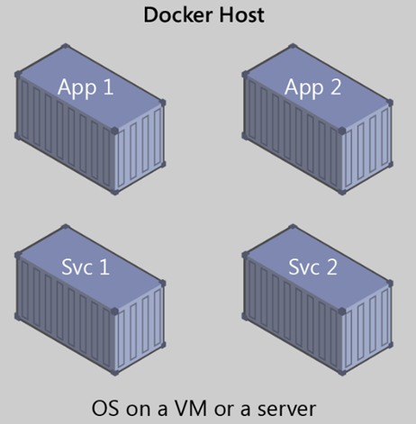

# docker入门

## 目录

1. [什么是Docker](#什么是Docker)
2. [为什么使用Docker](#为什么使用Docker)
3. [Docker术语](#Docker术语)
4. [VM和Docker容器之间的比较](#VM和Docker容器之间的比较)
5. [Docker官网注册](#Docker官网注册)
6. [安装](#安装)
7. [配置](#配置)
8. [卸载](#卸载)
9. [MySQL示例](#MySQL示例)

## 什么是Docker



[Docker](https://www.docker.com/) 是一个开源的引擎，可以轻松的为任何应用创建一个轻量级的、可移植的、自给自足的容器。

- 创始人Solomon Hykes，法国dotCloud公司
- 2013年3月以 Apache2.0 协议开源，在 [GitHub上](https://github.com/docker/docker) 维护
- 使用 Go 语言实现，在Linux操作系统上提供了一个软件抽象层和操作系统层虚拟化的自动管理机制。
  
  Docker 利用了 Linux 的资源分托机制（cgroups 以及 namespace）来创建独立的软件容器。Linux 对 namespace（命名空间）的支持完全隔离工作环境中的应用程序，包括进程树，网络，用户ID挂载文件系统；而 cgroups 则提供了资源隔离，包括CPU，内存等。

- 初衷：创建软件程序可移植的轻量容器，让软件可以在任何安装了 Docker 的主机上运行，而不用关心底层操作系统。

也许一个简单的类比有助于掌握 Docker 的核心概念。

让我们回到 20 世纪 50 年代。那时，还没有处理器这个词，而复印机无处不在（某种程度上）。假设你负责按要求快速发出成批的信件、将这些信件邮寄给客户、使用纸张和信封以物理方式寄送到每个客户的地址（那时还没有电子邮件）。在某个时候，你意识到，这些信件只是由一大组段落组合而成的，根据信件的用途对其进行所需的选取和排列，因此，你设计了一个系统，以快速发送这些信件，希望能大幅提高效率。这个系统很简单：

1. 先从一副透明薄片开始，每个薄片包含一个段落。

2. 若要发送一组信件，你选择包含所需段落的薄片，然后堆栈并对齐它们，使其外观一致且易于阅读。

3. 最后，你将其置于复印机中并按开始，以生成所需的多个信件。

简而言之，这就是 Docker 的核心理念。在 Docker 中，**每层都是在执行命令（例如，安装程序）后在文件系统所发生的一组更改**。因此，当你在复制层后“查看”文件系统时，你将看到所有文件，包括在安装程序时的层。你可以将映像视为要在“计算机”中安装的辅助只读硬盘，其中操作系统已经安装。同样，你可以将容器视为已安装映像硬盘的“计算机”。与计算机一样，可以打开或关闭容器电源。

优越性：如果你在一台机器上可以开10个虚拟机，那么用 docker 可以开100个容器！

基本概念：

- 虚拟化：一种资源管理技术，将计算机的各种实体资源予以抽象、转换后呈现出来，打破实体结构间的不可切割的障碍，使用户可以比原本的配置更好的方式来应用这些资源。

  这些资源的新虚拟部分是不受现有资源的架设方式，地域或物理配置所限制。一般所指的虚拟化资源包括计算能力和数据存储。

- 系统虚拟化，Hypervisor Virtualization，全虚拟化。
  
  在 Host 中通过 Hypervisor 层实现安装多个 GuestOS，每个 GuestOS 都有自己的内核，和主机的内核不同，GuestOS 之间完全隔离。

- 容器虚拟化，Operating System Virtualization ，使用 Linux 内核中的 namespaces 和 cgroups 实现进程组之间的隔离。是用内核技术实现的隔离，所以它是一个共享内核的虚拟化技术。

  容器虚拟化没有 GuestOS，使用 Docker 时下载的镜像，只是为运行 App 提供的一个依赖的环境，是一个删减版本的系统镜像。**一般情况下系统虚拟化没有容器虚拟化的运行效率高，但是系统安全性高很多**。


注册一个docker账号：[https://hub.docker.com/](https://hub.docker.com/)

## 为什么使用Docker

Docker是一种新兴的虚拟化方式，但是，Docker不是虚拟机。传统的虚拟机是先虚拟硬件资源，然后在虚拟的硬件资源之上运行操作系统。而Docker容器作为一个进程，直接运行于宿主主机内核，因此Docker更加快捷。

Docker具有很多优势：

- 高效利用系统资源（没有虚拟硬件的额外开销）。

- 更快的启动时间（通常可以在1秒内启动）。

- 便于部署（镜像包含了应用和相关依赖，可以运行在任何配置了Docker的主机上）。

- 轻松迁移。

- 分层存储，提高存储效率。

## Docker术语

- **存储库(repo)**：相关的 Docker 映像集合，带有指示映像版本的标记。某些存储库包含特定映像的多个变量，例如包含 SDK（较重）的映像，包含唯一运行时（较轻）的映像等等。这些变量可以使用标记进行标记。单个存储库中可包含平台变量，如 Linux 映像和 Windows 映像。

- **注册表**：提供存储库访问权限的服务。大多数公共映像的默认注册表是[Docker 中心](https://hub.docker.com/)（归作为组织的 Docker 所有）。注册表通常包含来自多个团队的存储库。公司通常使用私有注册表来存储和管理其创建的映像。 另一个示例是 Azure 容器注册表。

- **Docker中心**：上传并使用映像的公共注册表。 Docker 中心提供 Docker 映像托管、公共或私有注册表，生成触发器和 Web 挂钩，以及与 GitHub 和 Bitbucket 集成。

- **Azure容器注册表**：用于在 Azure 中使用 Docker 映像及其组件的公共资源。这提供了与 Azure 中的部署接近的注册表，使你可以控制访问权限，从而可以使用 Azure Active Directory 组和权限。

- **Docker受信任注册表(DTR)**：Docker注册表服务（来自Docker），可以安装在本地，因此它存在于组织的数据中心和网络中。这对于应该在企业内部管理的私有映像来说很方便。Docker受信任注册表是Docker数据中心产品的一部分。有关详细信息，请参阅[Docker受信任注册表(DTR)](https://docs.docker.com/docker-trusted-registry/overview/)。

- **Docker社区版(CE)**：适用于 Windows 和 macOS、用于在本地生成、运行和测试容器的开发工具。适用于 Windows 的 Docker CE 为 Linux 和 Windows 容器提供了开发环境。Windows 上的 Linux Docker 主机基于 [Hyper-V](https://www.microsoft.com/cloud-platform/server-virtualization)虚拟机。适用于 Windows 容器的主机直接基于 Windows。适用于 Mac 的 Docker CE 基于 Apple 虚拟机监控程序框架和[xhyve虚拟机监控程序](https://github.com/mist64/xhyve)，在 Mac OS X 上提供了 Linux Docker 主机虚拟机。适用于 Windows 和 Mac 的 Docker CE 替换了 Docker 工具箱，后者基于 Oracle VirtualBox。

- **Docker企业版(EE)**：适用于 Linux 和 Windows 开发的 Docker 工具企业级版本。

## 安装

**环境介绍：**

操作系统：64bit CentOS7  
docker版本：最新版本  
版本新功能：[https://github.com/docker/docker/blob/master/CHANGELOG.md](https://github.com/docker/docker/blob/master/CHANGELOG.md)

**安装步骤：**

```sh
# 查看当前内核版本
uname -r
# 更改网卡配置
vi /etc/sysconfig/network-scripts/ifcfg-enp0s3  
---
ONBOOT=yes
---  
# 更改完后重启服务：
service network restart  
# 注意：如果ifconfig命令不识别的话需要安装：  
yum install net-tools
```

**阿里云安装：**

1、确保服务器连网，配置网络Yum源，安装docker需要extra源

```sh
cd /etc/yum.repos.d/
# 将阿里云的Centos-7.repo下载保存到该目录
wget http://mirrors.aliyun.com/repo/Centos-7.repo
sed -i 's/$releasever/7/g' Centos-7.repo
```

2、安装Docker依赖

```sh
yum install -y yum-utils device-mapper-persistent-data lvm2
```

3、配置Docker的Yum源

```sh
yum-config-manager --add-repo https://download.docker.com/linux/centos/docker-ce.repo
yum-config-manager --enable docker-ce-nightly
yum-config-manager --enable docker-ce-test
yum-config-manager --disable docker-ce-nightly
```

4、安装Docker CE

```sh
yum -y install docker-ce docker-ce-cli containerd.io
```

5、启动Docker

```sh
systemctl start docker
# 查看docker安装版本信息
docker info
```

## 配置

docker配置（docker控制应该有个专门的用户）：

```sh
adduser Colin #添加用户
passwd Colin #更改密码
su Colin #切换用户
#将用户Colin加入sudo files
sudo groupadd docker     #添加docker用户组
sudo gpasswd -a $USER docker     #将登陆用户加入到docker用户组中
newgrp docker     #更新用户组
docker ps    #测试docker命令是否可以使用sudo正常使用
# 验证在不使用sudo的情况下docker是否正常工作：
docker run hello-world
# 设置docker开机启动
chkconfig docker on
```

## 卸载

```sh
# 查看安装包
yum list installed | grep docker
# 移除安装包：
sudo yum -y remove docker-engine.x86_64
# 清除所有docker依赖文件：
rm -rf /var/lib/docker
# 删除用户创建的配置文件
```

## MySQL示例

```sh
# 运行命令
docker run --name colin-mysql -p 3306:3306 -e MYSQL_ROOT_PASSWORD=1234 -itd mysql:5.7
# 进入MySQL容器
docker exec -it colin-mysql /bin/bash
# 进入MySQL
mysql -u root -p
```

docker run是启动容器的命令；  

- --name：指定了容器的名称，方便之后进入容器的命令行  
- -itd：其中，i是交互式操作，t是一个终端，d指的是在后台运行  
- -p：指在本地生成一个随机端口，用来映射mysql的3306端口  
- -e：设置环境变量 `MYSQL_ROOT_PASSWORD=emc123123`：指定了mysql的root密码  
- mysql：指运行mysql镜像

**进行配置，使外部工具可以连接：**

```sql
-- 设置root帐号的密码：
update user set authentication_string = password('1234') where user = 'root';
-- 接着，由于mysql中root执行绑定在了localhost，因此需要对root进行授权
grant all privileges on *.* to 'root'@'%' identified by '1234' with grant option;
flush privileges;
```
