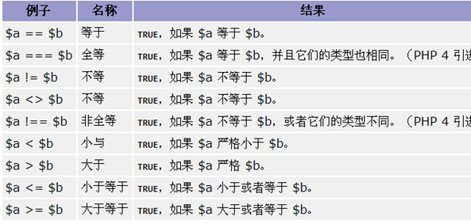
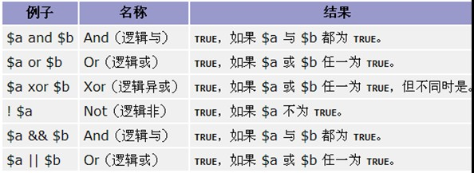
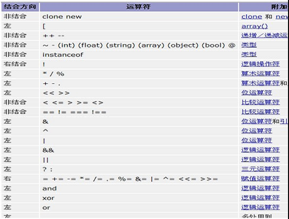
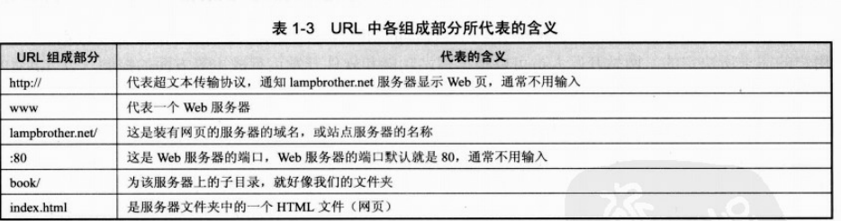

# php

## 目录

## 第一部分 PHP简介

## 第二部分 PHP框架

## 第三部分 PHP开源项目

### 3.1 [禅道](./3.1_zentao.md)

1. [简介](简介)
   - [为什么使用PHP](#为什么使用PHP)
   - [变量](#变量)
   - [常量](#常量)
   - [关键字](#关键字)
   - [数据类型](#数据类型)
   - [运算符](#运算符)
   - [系统变量列表](#系统变量列表)
   - [排序算法](#排序算法)
2. [安装与配置](#安装与配置)
3. [面向对象](#面向对象)
4. [附录](#附录)

## 简介

### 为什么使用PHP

- 可在不同的平台上运行（Windows、Linux、Unix、Mac OS X 等）
- 与目前几乎所有的正在被使用的服务器相兼容（Apache、IIS 等）
- 提供了广泛的数据库支持
- 免费
- 易于学习，并可高效地运行在服务器端

### 变量

- 变量定义要以$符号打头
- 变量的数据类型是变化的
- 区分大小写

### 常量

- 常量前面不需要$
- 一旦定义，则不能修改其值
- 定义的时候，就需要赋初值
- 可以通过define或者const
- 名称，一般全部大写，然后用下划线间隔

### 关键字

- require：遇到即包含文件，如果出现错误，则会终止程序
- require_once：会判断是否已经包含过了，如果包含过了，则不再包含文件。
  
  1. 可以节省资源
  2. 可以避免重复定义的错误

- include：类似require，但是如果出现了错误，会继续执行
- include_once：类似require_once

基本上使用的require_once：require_once / require ... 应当放在 php 最前面

```php
<?php
    require (&apos;要引入的文件名&apos;);
    $filePath="abc.php"
    require $filePath;
    require &apos;要引入的文件名(路径)&apos;
?>
```

### 函数

基本结构

```php
function 函数名(参数列表){
    //函数体;
    //return 语句;
}
```

1. 参数可以多个，同时，其数据类型可以是php语言支持的任意类型
2. 函数名开头的字母，以_或者A_Z或者 a-z，不要用数字或者特殊字符开头
3. 函数名不区分大小写，这个与变量不一样
4. 一个自定义函数中的变量是局部的，函数外不生效
5. 使用global全局变量的时候，可使用在函数外的变量
6. 如果在函数中，我们不希望使用某个变量，或者是希望彻底的不要某个变量，则可以使用unset(变量名)将该变量彻底删除
7. 在php函数中，我们可以给某些参数，赋一个默认的值
8. php传递变量的时候，默认是值传递，如果需要引用(地址)传递，可以使用 &变量名

函数分为两大类：自定义函数、系统函数

### 数据类型

1. 基本数据类型

   整型：表示一个整数

   通过 PHP_INT_SIZE 可以显示我们自己的机器，一个整数用几个字节表示

   通过PHP_INT_MAX 可以显示int 最大的数有多少

   小数型(浮动数)：包含单精度和双精度，精度从左边开始的第一个非0的数字计算

   布尔类型：表示真和假

   布尔值FALSE：自身整型值0(零)，浮点型值0.0(零)，空字符串，以及字符串"0"，不包括任何元素的数组，不包括任何成员变量的对象(仅PHP4.0适用)，特殊类型NULL (包括尚未设定的变量)。

   字符串：定义字符串的时候，可以用单引号，也可以使用双引号。当一个变量包含在双引号中时，会输出变量值，而包含在单引号中时输出变量名。

2. 复合数据类型

   数组（array）

   对象 (object)

3. 特殊数据类型

   null

   资源类型(resource)

### 运算符

比较运算符



逻辑运算符



其它运算符



### 系统变量列表

变量名|变量值类型|变量类型
-|-|-
autocommit|bool|SESSION
big_tables |bool|SESSION
binlog_cache_size|num|GLOBAL
bulk_insert_buffer_size|num|GLOBAL | SESSION
concurrent_insert|bool|GLOBAL
connect_timeout|num|GLOBAL
convert_character_set|string|SESSION
delay_key_write|OFF、ON、ALL|GLOBAL
delayed_insert_limit|num|GLOBAL
delayed_insert_timeout|num|GLOBAL
delayed_queue_size|num|GLOBAL
error_count|num|LOCAL
flush|bool|GLOBAL
flush_time|num|GLOBAL
foreign_key_checks|bool|SESSION
identity|num|SESSION
insert_id|bool|SESSION
interactive_timeout|num|GLOBAL、SESSION
join_buffer_size|num|GLOBAL、SESSION
key_buffer_size|num|GLOBAL
last_insert_id|bool|SESSION
local_infile|bool|GLOBAL
log_warnings|bool|GLOBAL
long_query_time|num|GLOBAL, SESSION
low_priority_updates|bool|GLOBAL, SESSION
max_allowed_packet|num|GLOBAL, SESSION
max_binlog_cache_size|num|GLOBAL
max_binlog_size|num, GLOBAL
max_connect_errors|num|GLOBAL
max_connections|num|GLOBAL
max_error_count|num|GLOBAL, SESSION
max_delayed_threads|num|GLOBAL
max_heap_table_size|num|GLOBAL, SESSION
max_join_size|num|GLOBAL, SESSION
max_sort_length|num|GLOBAL, SESSION
max_tmp_tables|num|GLOBAL
max_user_connections|num|GLOBAL
max_write_lock_count|num|GLOBAL
myisam_max_extra_sort_file_size|num|GLOBAL, SESSION
myisam_max_sort_file_size|num|GLOBAL, SESSION
myisam_sort_buffer_size|num|GLOBAL, SESSION
net_buffer_length|num|GLOBAL, SESSION
net_read_timeout|num|GLOBAL, SESSION
net_retry_count|num|GLOBAL, SESSION
net_write_timeout|num|GLOBAL, SESSION
query_cache_limit|num|GLOBAL
query_cache_size|num|GLOBAL
query_cache_type|enum|GLOBAL
read_buffer_size|num|GLOBAL, SESSION
read_rnd_buffer_size|num|GLOBAL, SESSION
rpl_recovery_rank|num|GLOBAL
safe_show_database|bool|GLOBAL
server_id|num|GLOBAL
slave_compressed_protocol|bool|GLOBAL
slave_net_timeout|num|GLOBAL
slow_launch_time|num|GLOBAL
sort_buffer_size|num|GLOBAL, SESSION
sql_auto_is_null|bool|SESSION
sql_big_selects|bool|SESSION
sql_big_tables|bool|SESSION
sql_buffer_result|bool|SESSION
sql_log_binlog|bool|SESSION
sql_log_off|bool|SESSION
sql_log_update|bool|SESSION
sql_low_priority_updates|bool|GLOBAL, SESSION
sql_max_join_size|num|GLOBAL, SESSION
sql_quote_show_create|bool|SESSION
sql_safe_updates|bool|SESSION
sql_select_limit|bool|SESSION
sql_slave_skip_counter|num|GLOBAL
sql_warnings|bool|SESSION
table_cache|num|GLOBAL
table_type|enum|GLOBAL, SESSION
thread_cache_size|num|GLOBAL
timestamp|bool|SESSION
tmp_table_size|enum|GLOBAL, SESSION
tx_isolation|enum|GLOBAL, SESSION
version|string|GLOBAL
wait_timeout|num|GLOBAL, SESSION
warning_count|num|LOCAL
unique_checks|bool|SESSION

### 排序算法

```php
<?php
// 简单的，现在我们把冒泡法封装成函数，利用以后使用
function bubbleSort(&$myarr) {
    // 这是一个中间变量
    $temp = 0;
    // 我们要把数组，从小到大外层循环
    for($i = 0; $i < count($myarr) - 1; $i ++) {
        for($j = 0; $j < count($myarr) - 1 - $i; $j ++) {
            // 说明前面的数比后面的数大，就要交换
            if ($myarr[$j] > $myarr[$j + 1]) {
                $temp = $myarr[$j];
                $myarr[$j] = $myarr[$j + 1];
                $myarr[$j + 1] = $temp;
            }
        }
    }
    echo "<br/>函数中的myarr数组";
    print_r($myarr);
}

/**
 * 选择排序法
 * @param unknown $arr
 */
function selectSort(&$arr){
    $temp=0;
    for($i=0;$i<count($arr)-1;$i++){
        //假设 $i就是最小的数
        $minVal=$arr[$i];
        //记录我认为的最小数的下标
        $minIndex=$i;
        for($j=$i+1;$j<count($arr);$j++){
            //说明我们认为的最小值，不是最小
            if($minVal>$arr[$j]){
                $minVal=$arr[$j];
                $minIndex=$j;
            }
        }
        //最后交换
        $temp=$arr[$i];
        $arr[$i]=$arr[$minIndex];
        $arr[$minIndex]=$temp;
    }
}

//插入排序法(小->大)
function insertSort(&$arr){
    //先默认下标为0 ，这个数已经是有序
    //1. 知道思想->看懂代码->写(灵活)
    for($i=1;$i<count($arr);$i++){
        //$insertVal是准备插入的数
        $insertVal=$arr[$i];
        //准备先和$insertIndex比较
        $insertIndex=$i-1;
        //如果这个条件满足，说明我们还没有找到适当的位置
        while($insertIndex>=0&&$insertVal<$arr[$insertIndex]){
            //同时把数后移
            $arr[$insertIndex+1]=$arr[$insertIndex];
            $insertIndex--;
        }
        //插入(这时就给$insertVal找到适当位置)
        $arr[$insertIndex+1]=$insertVal;
    }
}
?>
```

## 安装与配置

### Apache

配置文件为"\conf\httpd.conf"

1. 修改默认的路径：Define SRVROOT "/Apache24" 改为安装路径，我的为：Define SRVROOT "D:\Apache24"
2. 修改端口：Listen 80 改为你要监听的端口，不和其他程序冲突即可，我改为Listen 88，同时下面也要改：ServerName localhost:88
3. 进入到bin目录下，然后按住shift键不放单击鼠标的右键，选择“在此处打开命令窗口”，输入 httpd.exe -k install
4. 若出现：“(OS 10048)通常每个套接字地址(协议/网络地址/端口)只允许使用一次。:AH00072: make_sock: could not bind to address [::]:443 。”，说明你的443端口被占用了，解决办法为：注释LoadModule ssl_module modules/mod_ssl.so
5. 现在输入httpd.exe -k start命令就可以启动了。命令：httpd –k start[shutdown|restart]

**问题列表：**

```txt
问题：no listening sockets available
原因：端口被占用
解决：1、改端口  2、关闭占端口的进程
```

### MySQL

停止和启动MySQL数据库服务器的方法：打开命令行窗口，输入"net stop mysql" 或 "net start mysql"

### PHP模块

下载地址：[http://www.php.net/downloads.php](http://www.php.net/downloads.php)

VC6就是legacy Visual Studio 6 compiler，一般就是使用这个编译器编译的

VC9就是the Visual Studio 2008 compiler，就是用微软的VS编辑器编译的

IIS用VC9，Apache用VC6，建议使用Thread Safe版本

在Apache里加载PHP模块

- a、PHPIniDir "D:/php5"

  ServerRoot "D:\Apache24"

  在Apache配置文件httpd.conf中写入以下内容（位置为最后一个LoadModule的后面，大概在130行的位置）：

  ```conf
  LoadModule php5_module "C:\Programs\php5\php5apache2_2.dll"
  #路径根据实际情况写，引号注意用英文字符
  ```

- b、在Apache配置文件httpd.conf中写入以下内容（位置为最后一个AddType的后面，大概在380行的位置）：

  ```conf
  AddType application/x-httpd-php .php
  AddType application/x-httpd-php .php3
  AddType application/x-httpd-php .php4
  AddType application/x-httpd-php .php5
  ```

- c、保存并关闭httpd.conf。重启Apache，测试

  配置PHP的MySQL扩展接口。将php所在目录下的php.ini-development文件重命名为php.ini（工业应用则是重命名php.ini-production）。

  1. 找到short_open_tag （大概在211行），将short_open_tag = Off改为short_open_tag = On。
  2. 找到asp_tags（大概在215行），将asp_tags = Off改为asp_tags = On。
  3. 找到867行，如果该行仅有一个分号（php.ini配置文件中分号表示注释），下面的行都是 `extension=**.dll` 的形式，则去掉分号，并在此行写入extension_dir="C:\Programs\php5\ext"（内容依php所在目录而定）;如果该行是一列extension=**.dll的最开头一行，则在上面增加一行，同样是加入上面的那条语句。
  4. 然后将867行项目的一系列extension=**.dll中的以下几个dll前的分号去掉，使其功能开启：

     ```conf
     extension=php_bz2.dll
     extension=php_gd2.dll
     extension=php_gettext.dll
     extension=php_mbstring.dll
     extension=php_mysql.dll
     extension=php_mysqli.dll
     extension=php_openssl.dll
     extension=php_pdo_mysql.dll
     extension=php_sockets.dll
     extension=php_xmlrpc.dll
     ```

  5. 找到date.timezone（大概在920行），去掉前面的分号，并将其值设置为prc，即date.timezone = prc（设置为中国时区）
  6. 保存php.ini并关闭，然后将其复制到C:\Windows目录下（即系统Windows目录下）。
  7. 将php所在目录下的libeay32.dll、php5ts.dll、ssleay32.dll 和php所在目录的子目录ext下的php_curl.dll、php_openssl.dll 复制到C:\Windows\System32 目录下，这个是为了防止出现找不到一些dll文件的情况 。
  8. 测试mysql是否可以用，写一段php 代码来测试是否成功!

    ```php
    <?php
      $conn = mysql_connect("localhost","root","root");
      if($conn){
        echo "连接mysql数据库ok";
      }else{
        echo "连接数据库失败";
      }
    ?>
    ```

## 面向对象

### 基本概念

张老太养了两只猫猫：一只名字叫小白，今年3岁，白色。还有一只叫小花，今年100岁，花色。请编写一个程序，当用户输入小猫的名字时，就显示该猫的名字，年龄，颜色。如果用户输入的小猫名错误，则显示“张老太没有这只猫猫”。

我们能不能把属于同一事物的变量，统一管理？解决之道->对象

我们这里说明一下类和对象的关系（细节后面逐步展开）

1. 类是抽象的，代表一类事物
2. 对象是具体的，是类的一个具体实例
3. 类是对象的模板，对象是类的一个个体实例

如果一个文件，专门用于定义类，则命名规范应当这样：类名.class.php

### 内部成员

#### 成员属性

成员属性是从某个事物提取出的，它可以是基本数据类型（整数、小数、字符、布尔），也可以是复合数据类型（数组、对象）

怎样访问一个成员属性（其成员属性是public）？基本语法是：$对象名->属性名;

#### 成员方法

函数和成员方法关系：当我们把一个函数写到某个类中，则该函数可以称成员方法

参数传递：默认情况下基本数据类型（整数、小数、布尔、字符）或数组是传递的值，如果你希望传入地址，则应当 &$参数名

成员方法的基本语法：

```php
访问修饰符号 function 函数名(参数列表){
  // 函数体
  // return 语句;
}
```

示例：人类

#### 构造方法

1. 没有返回值，自动被调用
2. 主要作用是完成对新对象的初始化，并不是创建对象本身
3. 在创建新对象后，系统自动的调用该类的构造方法
4. 一旦自定义了一个构造函数，默认的构造函数就被覆盖了，这时在创建对象的时候就要使用自定义的构造函数
5. 构造方法的默认访问修饰符是public
6. 一个类只能有一个构造函数（不能重载）

   两种实现方法：

   - __construct()：推荐
   - 类名()

   当两个同时存在的时候，优先调用__construct()

#### 析构方法

1. 析构方法的作用主要用于，释放资源（比如释放数据库的链接，图片资源...销毁某个对象..）
2. 析构方法会自动调用
3. 析构方法调用顺序是，先创建的对象后被销毁
4. 析构方法调用时机：

   - 当程序（进程结束）退出时
   - 当一个对象成为垃圾对象的时候，该对象的析构方法也会被调用。
  
   所谓垃圾对象，就是指，没有任何变量再引用它
5. 析构方法没有返回值
6. 主要作用是释放资源的操作，并不是销毁对象本身
7. 一个类最多只有一个析构方法

```php
<?php
class Person{
    public $name;
    public $age;
    public $conn;

    //构造方法
    public function __construct($name,$age){
        $this->name=$name;
        $this->age=$age;
        //打开一个$conn链接数据库的资源
    }

    //写一个析构方法 __是两个下划线
    function __destruct(){
        echo $this->name."销毁资源 关闭数据库..<br/>";
    }
}

$p1=new Person("贾宝玉",16);
$p2=new Person("林黛玉",14);
?>
```

#### 静态变量

在类中定义静态变量：`[访问修饰符] static $变量名;`

访问静态变量：

- `self::$静态变量名`
- `类名::$静态变量名`

静态变量存在方式：

- 往往使用静态方法去操作静态变量
- 普通成员方法，既可以操作非静态变量，也可以操作静态变量

### 三大特征

#### 抽象

#### 封装

三种访问控制符：

- public：表示全局，可以在本类，类外部，子类中使用
- protected：表示受到保护，可以在本类，子类中使用
- private：表示私有，只能在本类使用

规则：

- 如果一个方法没有访问修饰符，则默认是public
- 属性必须指定访问修饰符
- 方法之间可以互相调用，但是需要使用 $this 引用

#### 继承

一个子类通过 extends 父类，把父类的 (public/protected) 属性和 (public/protected) 方法继承下来。

一个类只能继承一个父类，（直接继承）。如果你希望继承多个类的属性和方法，则使用多层继承。

当创建子类对象的时候，默认情况下，不会自动调用父类的构造方法

如果我们希望去调用父类的构造方法，或者其它的方法 (public/protected)，可以这样处理：类名::方法名() 或 parent::方法名()

#### 多态

- 重载：函数名一样，通过函数的参数个数或者是参数类型不同，达到调用同一个函数名，但是可以区分不同的函数

  php5默认情况下不直接支持方法重载

  php5可以同__call魔术方法，模拟一个方法重载的效果

  魔术函数实现重载！

    ```php
    <?php
    class A {
        public function test1($p){
            echo "接收一个参数";
            echo "<br/>接收到参数是";
            var_dump($p);
        }

        public function test2($p){
            echo "接收两个参数<br/>";
            var_dump($p);
        }

        //这里提供一个__call
        //调用一个对象的某个方法，而该方法不存在，则系统会自动调用__call
        function __call($method,$p){
            var_dump($p);
            if($method=="test"){
                if(count($p)==1){
                    $this->test1($p);
                }else if(count($p)==2){
                    $this->test2($p);
                }
            }
        }
    }
    $a=new A();
    $a->test(1);
    $a->test(56,90);
    ?>
    ```

- 覆盖：当一个父类知道所有的子类都有一个方法，但是父类不能确定该方法究竟如何写，可以让子类去覆盖这个方法

  要实现重写，要求子类的那个方法的名字和参数列表个数一摸一样，但是并不要求参数的名称一样

  在实现方法覆盖的时候，访问修饰符可以不一样，但是必须满足：子类的访问范围>=父类的访问范围

- 抽象类

  为什么需要？

  在实际开发中，我们可能有这样一种类,是其它类的父类，但是它本身并不需要实例化，主要用途是用于让子类来继承，这样可以到达代码复用。同时利于项目设计者设计类。

  如果一个类使用 abstract 来修饰，则该类就是抽象类，如果一个方法被 abstract 修饰，则该方法就是抽象方法【抽象方法就不能有方法体】

  抽象类可以没有抽象方法，同时还可以有实现了的方法。

  如果一个类中，只要有抽象方法，则该类必须声明为abstract

  如果A类继承了一个抽象类B，则要求A类实现从B类继承的所有抽象方法

- 接口

  基本语法

  ```php
  // 接口实现，接口的方法都不能有方法体
  interface 接口名{
    //属性
    //方法
  }

  //调用接口
  class 类名 implements 接口名1, 接口2 {

  }
  ```

  作用：声明一些方法，供其它类来实现。体现了编程中我们希望的效果：高内聚低耦合。

  使用场景

  - 定下规范，让别的程序员来实现
  - 多个类是平级的关系，它们都会去实现某个功能，只是实现的方式不一样

  规则：

  - 不能去实例化一个接口
  - 接口中的所有方法，都不能有方法体
  - 一个类可以去实现多个接口
  - 接口中可以有属性，但是必须是常量，并且是 public
  - 接口的方法是 public【默认就是 public】，不能是 protected 和 private

```php
<?php
class Person{
    //成员属性
    public $name;
    public $age;
    //成员方法
    public function speak(){
        echo "我是一个好人!";
    }
    public function count1(){
        $res=0;
        for($i=1;$i<=1000;$i++){
            $res+=$i;
        }
        //return 究竟到什么地方去？谁调用，就返回给谁
        return $res;
    }
    //修改jisuan成员方法,该方法可以接收一个数n，计算 1+..+n 的结果
    public function count2($n){
        $res=0;
        for($i=0;$i<=$n;$i++){
            $res+=$i;
        }
        return $res;
    }
    //添加add 成员方法,可以计算两个数的和
    public function add($num1,$num2){
        return $num1+$num2;
    }
    //添加一个新的方法，可以判断三个数最大的数
    public function findMax($arr){
        //这里仍然可以写算法
        //从$arr数组中，找到最大的数.
        //1.假设数组的第一个数就是最大的数
        $maxVal=$arr[0];
        //2.最大数的下标是
        $maxIndex=0;
        //开始循环的比较
        for($i=1;$i<count($arr);$i++){
            //这个条件说明，maxVal不是最大
            if($maxVal<$arr[$i]){
                //调整
                $maxVal=$arr[$i];
                $maxIndex=$i;
            }
        }
        return $maxVal;
    }
}
?>
```

## 附录

`http://www.lampbrother.net:80/book/index.html`的含义


