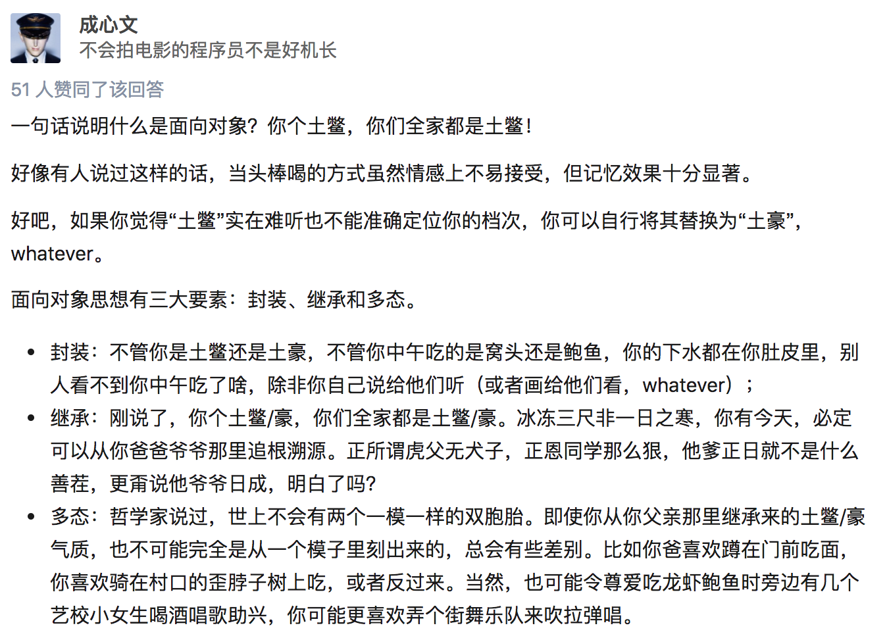
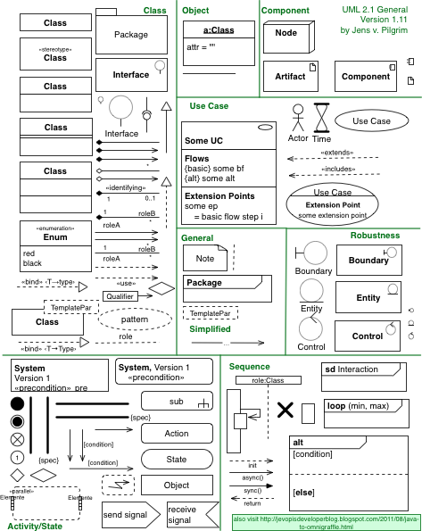

# 面向对象

活在当下的程序员应该都听过"面向对象编程"一词，也经常有人问能不能用一句话解释下什么是"面向对象编程"，我们先来看看比较正式的说法。

"把一组数据结构和处理它们的方法组成对象（object），把相同行为的对象归纳为类（class），通过类的封装（encapsulation）隐藏内部细节，通过继承（inheritance）实现类的特化（specialization）和泛化（generalization），通过多态（polymorphism）实现基于对象类型的动态分派。"

这样一说是不是更不明白了。所以我们还是看看更通俗易懂的说法，下面这段内容来自于[知乎](https://www.zhihu.com/)。



之前我们说过"程序是指令的集合"，我们在程序中书写的语句在执行时会变成一条或多条指令然后由CPU去执行。

当然为了简化程序的设计，我们引入了函数的概念，把相对独立且经常重复使用的代码放置到函数中，在需要使用这些功能的时候只要调用函数即可；如果一个函数的功能过于复杂和臃肿，我们又可以进一步将函数继续切分为子函数来降低系统的复杂性。

但是说了这么多，不知道大家是否发现，所谓编程就是程序员按照计算机的工作方式控制计算机完成各种任务。但是，计算机的工作方式与正常人类的思维模式是不同的，如果编程就必须得抛弃人类正常的思维方式去迎合计算机，编程的乐趣就少了很多，"每个人都应该学习编程"这样的豪言壮语就只能说说而已。

当然，这些还不是最重要的，最重要的是当我们需要开发一个复杂的系统时，代码的复杂性会让开发和维护工作都变得举步维艰，所以在上世纪60年代末期，"[软件危机](https://zh.wikipedia.org/wiki/%E8%BD%AF%E4%BB%B6%E5%8D%B1%E6%9C%BA)"、"[软件工程](https://zh.wikipedia.org/wiki/%E8%BD%AF%E4%BB%B6%E5%B7%A5%E7%A8%8B)"等一系列的概念开始在行业中出现。

当然，程序员圈子内的人都知道，现实中并没有解决上面所说的这些问题的"[银弹](https://zh.wikipedia.org/wiki/%E6%B2%A1%E6%9C%89%E9%93%B6%E5%BC%B9)"，真正让软件开发者看到希望的是上世纪70年代诞生的[Smalltalk](https://zh.wikipedia.org/wiki/Smalltalk)编程语言中引入的面向对象的编程思想（面向对象编程的雏形可以追溯到更早期的[Simula](https://zh.wikipedia.org/wiki/Simula)语言）。

按照这种编程理念，程序中的数据和操作数据的函数是一个逻辑上的整体，我们称之为“对象”，而我们解决问题的方式就是创建出需要的对象并向对象发出各种各样的消息，多个对象的协同工作最终可以让我们构造出复杂的系统来解决现实中的问题。

>说明：当然面向对象也不是解决软件开发中所有问题的最后的“银弹”，所以今天的高级程序设计语言几乎都提供了对多种编程范式的支持，Python也不例外。

## 类和对象

简单的说，类是对象的蓝图和模板，而对象是类的实例。这个解释虽然有点像用概念在解释概念，但是从这句话我们至少可以看出，类是抽象的概念，而对象是具体的东西。

在面向对象编程的世界中，一切皆为对象，对象都有属性和行为，每个对象都是独一无二的，而且对象一定属于某个类（型）。当我们把一大堆拥有共同特征的对象的静态特征（属性）和动态特征（行为）都抽取出来后，就可以定义出一个叫做“类”的东西。


### 定义类

在Python中可以使用`class`关键字定义类，然后在类中通过之前学习过的函数来定义方法，这样就可以将对象的动态特征描述出来，代码如下所示。

```python
class Student(object):

    # __init__是一个特殊方法用于在创建对象时进行初始化操作
    # 通过这个方法我们可以为学生对象绑定name和age两个属性
    def __init__(self, name, age):
        self.name = name
        self.age = age

    def study(self, course_name):
        print('%s正在学习%s.' % (self.name, course_name))

    # PEP 8要求标识符的名字用全小写多个单词用下划线连接
    # 但是部分程序员和公司更倾向于使用驼峰命名法(驼峰标识)
    def watch_movie(self):
        if self.age < 18:
            print('%s只能观看《熊出没》.' % self.name)
        else:
            print('%s正在观看岛国爱情大电影.' % self.name)
```

>说明： 写在类中的函数，我们通常称之为（对象的）方法，这些方法就是对象可以接收的消息。

### 创建和使用对象

当我们定义好一个类之后，可以通过下面的方式来创建对象并给对象发消息。

```python
def main():
    # 创建学生对象并指定姓名和年龄
    stu1 = Student('骆昊', 38)
    # 给对象发study消息
    stu1.study('Python程序设计')
    # 给对象发watch_av消息
    stu1.watch_movie()
    stu2 = Student('王大锤', 15)
    stu2.study('思想品德')
    stu2.watch_movie()

if __name__ == '__main__':
    main()
```

### 访问可见性问题

对于上面的代码，有C++、Java、C#等编程经验的程序员可能会问，我们给Student对象绑定的name和age属性到底具有怎样的访问权限（也称为可见性）。

因为在很多面向对象编程语言中，我们通常会将对象的属性设置为私有的（private）或受保护的（protected），简单的说就是不允许外界访问，而对象的方法通常都是公开的（public），因为公开的方法就是对象能够接受的消息。

在Python中，属性和方法的访问权限只有两种，也就是公开的和私有的，如果希望属性是私有的，在给属性命名时可以用两个下划线作为开头，下面的代码可以验证这一点。

```python
class Test:

    def __init__(self, foo):
        self.__foo = foo

    def __bar(self):
        print(self.__foo)
        print('__bar')


def main():
    test = Test('hello')
    # AttributeError: 'Test' object has no attribute '__bar'
    test.__bar()
    # AttributeError: 'Test' object has no attribute '__foo'
    print(test.__foo)


if __name__ == "__main__":
    main()
```

但是，Python并没有从语法上严格保证私有属性或方法的私密性，它只是给私有的属性和方法换了一个名字来妨碍对它们的访问，事实上如果你知道更换名字的规则仍然可以访问到它们，下面的代码就可以验证这一点。

之所以这样设定，可以用这样一句名言加以解释，就是"**We are all consenting adults here**"。因为绝大多数程序员都认为开放比封闭要好，而且程序员要自己为自己的行为负责。

```python
class Test:

    def __init__(self, foo):
        self.__foo = foo

    def __bar(self):
        print(self.__foo)
        print('__bar')


def main():
    test = Test('hello')
    test._Test__bar()
    print(test._Test__foo)


if __name__ == "__main__":
    main()
```

在实际开发中，我们并不建议将属性设置为私有的，因为这会导致子类无法访问（后面会讲到）。所以大多数Python程序员会遵循一种命名惯例就是让属性名以单下划线开头来表示属性是受保护的，本类之外的代码在访问这样的属性时应该要保持慎重。

这种做法并不是语法上的规则，单下划线开头的属性和方法外界仍然是可以访问的，所以更多的时候它是一种暗示或隐喻，关于这一点可以看看我的[《Python - 那些年我们踩过的那些坑》](http://blog.csdn.net/jackfrued/article/details/79521404)文章中的讲解。

### 同一性

英文单词"same"的意思是同一的、相同的，这似乎没有异议，如果我们再深入探讨一下，可能期望与所想并不一致。

例如，你说，"Chris and I have the same car"，你的意思是Chris和我的车为同一个厂家，同一个型号，但却是两辆不同车。如果你说，"Chris and I have the same mother"，这里意思是Chris和我的妈妈是同
一个人，可不是两个不同的妈妈。由此可见，"Sameness"的真正意思要根据上下文来判断。

当我们讨论对象时，也同样存在这样的模糊性。例如，我们说两个相同的点，可能这两个点的数据（横、纵坐标）相同，也可能他们就是同一个对象。我们可以利用"=="操作符判断两个点是否为同一对象：

```python
>>> p1 = Point()
>>> p1.x = 1.0
>>> p1.x = 9.0
>>> p2 = Point()
>>> p2.x = 1.0
>>> p2.y = 9.0
>>> p1 == p2
0
```

从这个例子可以看到，点p1和p2虽然有相同的数据，但却是两个不相同的对象。若是把p2赋值给p1，那么p1和p2就是同一对象的两个别名。

```python
>>> p1 = p2
>>> p1 == p2
1
```

## 拷贝

别名增加了程序阅读的困难，因为在一个地方改变了对象的值，但在另一个地方可能是不希望的。并且追踪对象所有的别名，又是很困难的。

解决的方法是拷贝对象，生成一个新的对象实例。copy模块的方法copy能够复制任何对象。

```python
>>> p1 = Point()
>>> p1.x = 2.0
>>> p1.y = 4.0
>>> p2 = p1
>>> print p1,p2
<__main__.Point instance at 0x00D76878>
<__main__.Point instance at 0x00D76878>
>>> p2 = copy.copy(p1)
>>> print p1, p2
<__main__.Point instance at 0x00D76878>
<__main__.Point instance at 0x00D009A0>
>>> print p1.x,p1.y
2.0 4.0
>>> print p2.x,p2.y
2.0 4.0
```

输入copy模块之后，我们用copy方法复制了一个新的点对象，但他们数据项的值相同。

一些简单的对象，如点，没有包含任何嵌入的对象，copy方法已经足够了。这种复制叫做浅拷贝。

对于象长方形类的对象，它的属性中包含点对象，再用copy方法进行复制，虽然生成了新的长方形对象，但这两个对象的点对象是同一个对象：

```python
>>> r1 = Rectangle()
>>> r1.width = 1.0
>>> r1.height = 2.0
>>> r1.corner = Point()
>>> r1.corner.x = 0
>>> r1.corner.y = 0
>>> r2 = copy.copy(r1)
>>> print r1.corner, r2.corner
<__main__.Point instance at 0x00D44BA8>
<__main__.Point instance at 0x00D44BA8>
```

显然这也不是我们希望的结果。

幸运的是，copy模块包含了一个名为deepcopy的方法，它可以拷贝任何嵌入的对象。这种拷贝我们称之为深拷贝。

```python
>>> r2 = copy.deepcopy(r1)
>>> id(r1)
13831952
>>> id(r2)
14043608
>>> id(r1.corner)
13913000
>>> id(r2.corner)
14003528
```

b1和b2已经是完全不同的对象了。

## 面向对象的支柱

面向对象有三大支柱：封装、继承和多态。

这里我们先说一下什么是封装。我自己对封装的理解是"**隐藏一切可以隐藏的实现细节，只向外界暴露（提供）简单的编程接口**"。

我们在类中定义的方法其实就是把数据和对数据的操作封装起来了，在我们创建了对象之后，只需要给对象发送一个消息（调用方法）就可以执行方法中的代码，也就是说我们只需要知道方法的名字和传入的参数（方法的外部视图），而不需要知道方法内部的实现细节（方法的内部视图）。

### @property装饰器

之前我们讨论过Python中属性和方法访问权限的问题，虽然我们不建议将属性设置为私有的，但是如果直接将属性暴露给外界也是有问题的，比如我们没有办法检查赋给属性的值是否有效。

我们之前的建议是将属性命名以单下划线开头，通过这种方式来暗示属性是受保护的，不建议外界直接访问，那么如果想访问属性可以通过属性的getter（访问器）和setter（修改器）方法进行对应的操作。如果要做到这点，就可以考虑使用@property包装器来包装getter和setter方法，使得对属性的访问既安全又方便，代码如下所示。

```python
class Person(object):

    def __init__(self, name, age):
        self._name = name
        self._age = age

    # 访问器 - getter方法
    @property
    def name(self):
        return self._name

    # 访问器 - getter方法
    @property
    def age(self):
        return self._age

    # 修改器 - setter方法
    @age.setter
    def age(self, age):
        self._age = age

    def play(self):
        if self._age <= 16:
            print('%s正在玩飞行棋.' % self._name)
        else:
            print('%s正在玩斗地主.' % self._name)


def main():
    person = Person('王大锤', 12)
    person.play()
    person.age = 22
    person.play()
    # person.name = '白元芳'  # AttributeError: can't set attribute


if __name__ == '__main__':
    main()
```

### __slots__魔法

我们讲到这里，不知道大家是否已经意识到，Python是一门[动态语言](https://zh.wikipedia.org/wiki/%E5%8A%A8%E6%80%81%E8%AF%AD%E8%A8%80)。通常，动态语言允许我们在程序运行时给对象绑定新的属性或方法，当然也可以对已经绑定的属性和方法进行解绑定。

但是如果我们需要限定自定义类型的对象只能绑定某些属性，可以通过在类中定义__slots__变量来进行限定。需要注意的是__slots__的限定只对当前类的对象生效，对子类并不起任何作用。

```python
class Person(object):

    # 限定Person对象只能绑定_name, _age和_gender属性
    __slots__ = ('_name', '_age', '_gender')

    def __init__(self, name, age):
        self._name = name
        self._age = age

    @property
    def name(self):
        return self._name

    @property
    def age(self):
        return self._age

    @age.setter
    def age(self, age):
        self._age = age

    def play(self):
        if self._age <= 16:
            print('%s正在玩飞行棋.' % self._name)
        else:
            print('%s正在玩斗地主.' % self._name)


def main():
    person = Person('王大锤', 22)
    person.play()
    person._gender = '男'
    # AttributeError: 'Person' object has no attribute '_is_gay'
    # person._is_gay = True
```

### 静态方法和类方法

之前，我们在类中定义的方法都是对象方法，也就是说这些方法都是发送给对象的消息。

实际上，我们写在类中的方法并不需要都是对象方法，例如我们定义一个“三角形”类，通过传入三条边长来构造三角形，并提供计算周长和面积的方法，但是传入的三条边长未必能构造出三角形对象，因此我们可以先写一个方法来验证三条边长是否可以构成三角形，这个方法很显然就不是对象方法，因为在调用这个方法时三角形对象尚未创建出来（因为都不知道三条边能不能构成三角形），所以这个方法是属于三角形类而并不属于三角形对象的。我们可以使用静态方法来解决这类问题，代码如下所示。

```python
from math import sqrt


class Triangle(object):

    def __init__(self, a, b, c):
        self._a = a
        self._b = b
        self._c = c

    @staticmethod
    def is_valid(a, b, c):
        return a + b > c and b + c > a and a + c > b

    def perimeter(self):
        return self._a + self._b + self._c

    def area(self):
        half = self.perimeter() / 2
        return sqrt(half * (half - self._a) *
                    (half - self._b) * (half - self._c))


def main():
    a, b, c = 3, 4, 5
    # 静态方法和类方法都是通过给类发消息来调用的
    if Triangle.is_valid(a, b, c):
        t = Triangle(a, b, c)
        print(t.perimeter())
        # 也可以通过给类发消息来调用对象方法但是要传入接收消息的对象作为参数
        # print(Triangle.perimeter(t))
        print(t.area())
        # print(Triangle.area(t))
    else:
        print('无法构成三角形.')


if __name__ == '__main__':
    main()
```

和静态方法比较类似，Python还可以在类中定义类方法，类方法的第一个参数约定名为cls，它代表的是当前类相关的信息的对象（类本身也是一个对象，有的地方也称之为类的元数据对象），通过这个参数我们可以获取和类相关的信息并且可以创建出类的对象，代码如下所示。

```python
from time import time, localtime, sleep


class Clock(object):
    """数字时钟"""

    def __init__(self, hour=0, minute=0, second=0):
        self._hour = hour
        self._minute = minute
        self._second = second

    @classmethod
    def now(cls):
        ctime = localtime(time())
        return cls(ctime.tm_hour, ctime.tm_min, ctime.tm_sec)

    def run(self):
        """走字"""
        self._second += 1
        if self._second == 60:
            self._second = 0
            self._minute += 1
            if self._minute == 60:
                self._minute = 0
                self._hour += 1
                if self._hour == 24:
                    self._hour = 0

    def show(self):
        """显示时间"""
        return '%02d:%02d:%02d' % \
               (self._hour, self._minute, self._second)


def main():
    # 通过类方法创建对象并获取系统时间
    clock = Clock.now()
    while True:
        print(clock.show())
        sleep(1)
        clock.run()


if __name__ == '__main__':
    main()
```

### 方法

通常，方法的第一个参数是调用它自己：self。在用函数打印时间时，相当于说，“嘿，printTime！打印now对象。”当调用自己的方法时，等于说，“嘿，now！打印你自己。”

再看另一个方法：

```python
def increment(self, seconds):
  self.seconds = seconds + self.seconds
  
  while self.seconds>=60:
    self.seconds = self.seconds - 60
    self.minutes = self.minutes + 1

  while self.minutes>=60:
    self.minutes = self.minutes - 60
    self.hours = self.hours + 1
```

这个函数有两个参数，一个它自己，一个seconds。函数的意思是，在当前的时间上加上一定的秒数，就得到一个新的时间。例如：

```python
now.nicrement(100)
```

函数调用时，第一参数是默认的，不必写出来。

接下来我们在看一个稍微复杂的after方法。after方法判定两个时间哪一个在前。他有两个参数，一个是它自己，另一个是他的同类。

```python
def after(self, time):
  if self.hour>time.hour:
    return 1
  if self.hour<time.hour:
    return 0

  if self.minute > time.minute:
    return 1
  if self.minute < time.minute:
    return 0

  if self.second > time.second:
    return 1
return 0
```

### 可选择的参数

我们曾见到一些内置的函数，能够接受的参数个数是可变的。同样，你也能够定义可变参数的函数。下面这个函数求从数head开始，到tail为尾，步长为step的所有数之和。

```python
def total(head, tail, step):
  temp = 0
  while head<=tail:
    temp = temp + head
    head = head + step
  return temp
```

它有三个参数，调用函数时，三个参数都不能省略。

有的参数之所以可以省略，是因为函数中已经给出了缺省的参数。我们把上面的函数作一下改造，定义step的缺省参数为1：

```python
total(head, tail, step=1)
```

现在调用total函数时，step参数就可以省略，但不表示step不存在，它的值是默认的1。当然你也可以根据需要取其他值。如下：

```python
>>> print total(1, 100)
5050
>>> print total(1, 100, 2)
2500
```

缺省参数的定义要符合以下规则：缺省参数全部位于参数表的后部，而且缺省参数之间不能在有非缺省参数。下面定义是不合法的：

```python
total(head=1, tail, step) #错误的定义
total(head=1, tail, step=1) #错误的定义
total(head, tail=100, step) #错误的定义
```

### 构造函数

构造函数是任何类都有的特殊方法。当要创建一个类时，就调用构造函数。它的名字是：`__init__`。init的前后分别是两个下划线字符。时间类Time的构造函数如下：

```python
class Time:
  def __init__(self, hours=0, minutes=0, seconds=0):
    self.hours = hours
    self.minutes = minutes
    self.seconds = seconds
```

当我们调用Time的构造函数时，参数依次传递给__init__：

```python
>>> now = Time(12, 10, 30)
>>> now.printTime()
12:10:30
```

因为Time的构造函数都有缺省值，所以在创建类时，可以全部忽略他们：

```python
>>> now = Time()
>>> now.printTime()
>>> 0:0:0
```

还可以传递一个或两个参数：

```python
>>> now = Time(23)
>>> now.printTime()
23:0:0
>>> now = Time(12, 10)
>>> now.printTime()
12:10:0
```

最后，我们还可以传递参数子集：

```python
>>> now = Time(seconds = 35, hours = 19)
>>> now.printTime()
>>> 19:0:35
```

这种情况下，并不强调参数一定要符合定义时的顺序。

### 操作符重定义

#### 加减法重定义

Python的基本数据类型如整数、浮点数，能够进行数学运算。类可以吗？看下例：

```python
>>> class RMB:
  def __init__(self, sum = 0.0):
    self.sum = sum
  def __str__(self):
    return str(self.sum)
>>> a = RMB()
>>> b = RMB()
>>> a + b
TypeError: unsupported operand types for
+: 'instance' and 'instance' #异常信息
```

我们定义了一个人民币类，然后生成两个实例，这两个实例相加之后，显示了一条错误信息，表明实例不能进行相加操作。错误信息的意思是，加法操作暂时不支持两个实例操作数。

为了使类的实例也可以进行数学操作，我们需要在类的内部重新定义数学操作符，使之支持用户定义的数据类型。有些朋友可能马上意识到，这不是C++中的操作符重载吗？在这里我没有用“重载”这个词，

我认为C++中重载要比Python中的重载概念广泛得多，例如C++函数重载，在Python中并不存在这个概念（也许我不知道）。因此，我用了重定义一词。

下面的例子中，修改了RMB类，添加了RMB类的加法和减法操作，也就是RMB类的两个方法：`__add__` 和 `__sub__`。

```python
>>> class RMB:
  def __init__(self, sum = 0.0):
    self.sum = sum
  def __str__(self):
    return str(self.sum)
  def __add__(self, other): #重定义加法操作
    return RMB(self.sum + other.sum)
  def __sub__(self, other): #重定义减法操作
    return RMB(self.sum - other.sum)
```

通常情况下，第一个参数是调用__add__或__sub__方法的对象。第二个参数是other，以区别于第一个参数self。两个实例的相加或相减，也就是各自属性sum的加减，所得的值作为新RMB实例的参数，因此返回值仍是人民币类。请看执行结果：

```python
>>> a = RMB(20000)
>>> b = RMB(234.987)
>>> print a + b
20234.987
>>>print a - b
19765.013
```

其实表达式 a + b 和 `p1.__add__(p2)` 是等同的，我们可以试一试：

```python
>>> a = RMB(34.5)
>>> b = RMB(345.98)
>>> print a.__add__(b), a + b
380.48 380.48
>>> print a.__sub__(b), a - b
-311.48 -311.48
```

#### 乘法重定义

与乘法重定义相关的方法有两个，一个是__mul__，另一个是__rmul__。你可以在类中定义其中的一个，也可以两个都定义。

如果乘法操作符"*"的左右操作数都是用户定义的数据类型，那么调用__mul__。若左边的操作数是原始数据类型，而右边是用户定义数据类型，则调用__rmul__。

请看例子：

```python
class Line:
  def __init__(self, length = 0.0):
    self.length = length

  def __str__(self):
    return str(self.length)

  def __mul__(self, other): #乘法重定义
    return Rect(self.length, other.length)

  def __rmul__(self, other): #乘法重定义
    return Line(self.length * other)

class Rect:
  def __init__(self, width = 0.0, length = 0.0):
    self.width = width
    self.length = length

  def __str__(self):
    return '(' + str(self.length) + ',' + str(self.width) + ')'

  def area(self): #计算长方形的面积
    return self.width * self.length
```

在这个例子中，定义了Line（线类）和Rect（长方形类）。重定义了Line类的乘法操作符。第一个重定义表示两个线实例相乘，得到并返回长方形实例。第二个重定义表示一个线实例乘以一个原始数据类型，得到并返回一个线实例。执行结果如下：

```python
>>> aline = Line(5.87)
>>> bline = 2.9 * Line(8.34)
>>> print 'aline = ' , aline, 'bline = ',bline
aline = 5.87 bline = 24.186
>>> rect = aline * bline
>>> print rect
(24.186,5.87)
>>> print rect.area()
141.97182
```

乘法重定义的第二种形式，必须严格按照"2.9 * Line(8.34)"的书写顺序，要是调换一下顺序，解释器将给出错误信息。

```python
>>> bline = Line(8.34) * 2.9
AttributeError: 'float' object has no attribute 'length'
```

### 类之间的关系

简单的说，类和类之间的关系有三种：is-a、has-a和use-a关系。

- is-a关系也叫继承或泛化，比如学生和人的关系、手机和电子产品的关系都属于继承关系。
- has-a关系通常称之为关联，比如部门和员工的关系，汽车和引擎的关系都属于关联关系；关联关系如果是整体和部分的关联，那么我们称之为聚合关系；如果整体进一步负责了部分的生命周期（整体和部分是不可分割的，同时同在也同时消亡），那么这种就是最强的关联关系，我们称之为合成关系。
- use-a关系通常称之为依赖，比如司机有一个驾驶的行为（方法），其中（的参数）使用到了汽车，那么司机和汽车的关系就是依赖关系。

我们可以使用一种叫做[UML](https://zh.wikipedia.org/wiki/%E7%BB%9F%E4%B8%80%E5%BB%BA%E6%A8%A1%E8%AF%AD%E8%A8%80)（统一建模语言）的东西来进行面向对象建模，其中一项重要的工作就是把类和类之间的关系用标准化的图形符号描述出来。关于UML我们在这里不做详细的介绍，有兴趣的读者可以自行阅读[《UML面向对象设计基础》](https://e.jd.com/30392949.html)一书。




利用类之间的这些关系，我们可以在已有类的基础上来完成某些操作，也可以在已有类的基础上创建新的类，这些都是实现代码复用的重要手段。复用现有的代码不仅可以减少开发的工作量，也有利于代码的管理和维护，这是我们在日常工作中都会使用到的技术手段。

### 继承和多态

刚才我们提到了，可以在已有类的基础上创建新类，这其中的一种做法就是让一个类从另一个类那里将属性和方法直接继承下来，从而减少重复代码的编写。

提供继承信息的我们称之为父类，也叫超类或基类；得到继承信息的我们称之为子类，也叫派生类或衍生类。子类除了继承父类提供的属性和方法，还可以定义自己特有的属性和方法，所以子类比父类拥有的更多的能力，在实际开发中，我们经常会用子类对象去替换掉一个父类对象，这是面向对象编程中一个常见的行为，对应的原则称之为[里氏替换原则](https://zh.wikipedia.org/wiki/%E9%87%8C%E6%B0%8F%E6%9B%BF%E6%8D%A2%E5%8E%9F%E5%88%99)。下面我们先看一个继承的例子。

```python
class Person(object):
    """人"""

    def __init__(self, name, age):
        self._name = name
        self._age = age

    @property
    def name(self):
        return self._name

    @property
    def age(self):
        return self._age

    @age.setter
    def age(self, age):
        self._age = age

    def play(self):
        print('%s正在愉快的玩耍.' % self._name)

    def watch_av(self):
        if self._age >= 18:
            print('%s正在观看爱情动作片.' % self._name)
        else:
            print('%s只能观看《熊出没》.' % self._name)


class Student(Person):
    """学生"""

    def __init__(self, name, age, grade):
        super().__init__(name, age)
        self._grade = grade

    @property
    def grade(self):
        return self._grade

    @grade.setter
    def grade(self, grade):
        self._grade = grade

    def study(self, course):
        print('%s的%s正在学习%s.' % (self._grade, self._name, course))


class Teacher(Person):
    """老师"""

    def __init__(self, name, age, title):
        super().__init__(name, age)
        self._title = title

    @property
    def title(self):
        return self._title

    @title.setter
    def title(self, title):
        self._title = title

    def teach(self, course):
        print('%s%s正在讲%s.' % (self._name, self._title, course))


def main():
    stu = Student('王大锤', 15, '初三')
    stu.study('数学')
    stu.watch_av()
    t = Teacher('骆昊', 38, '砖家')
    t.teach('Python程序设计')
    t.watch_av()


if __name__ == '__main__':
    main()
```

子类在继承了父类的方法后，可以对父类已有的方法给出新的实现版本，这个动作称之为方法重写（override）。

通过方法重写我们可以让父类的同一个行为在子类中拥有不同的实现版本，当我们调用这个经过子类重写的方法时，不同的子类对象会表现出不同的行为，这个就是多态（poly-morphism）。

```python
from abc import ABCMeta, abstractmethod


class Pet(object, metaclass=ABCMeta):
    """宠物"""

    def __init__(self, nickname):
        self._nickname = nickname

    @abstractmethod
    def make_voice(self):
        """发出声音"""
        pass


class Dog(Pet):
    """狗"""

    def make_voice(self):
        print('%s: 汪汪汪...' % self._nickname)


class Cat(Pet):
    """猫"""

    def make_voice(self):
        print('%s: 喵...喵...' % self._nickname)


def main():
    pets = [Dog('旺财'), Cat('凯蒂'), Dog('大黄')]
    for pet in pets:
        pet.make_voice()


if __name__ == '__main__':
    main()
```

在上面的代码中，我们将Pet类处理成了一个抽象类，所谓抽象类就是不能够创建对象的类，这种类的存在就是专门为了让其他类去继承它。

Python从语法层面并没有像Java或C#那样提供对抽象类的支持，但是我们可以通过abc模块的ABCMeta元类和abstractmethod包装器来达到抽象类的效果，如果一个类中存在抽象方法那么这个类就不能够实例化（创建对象）。

上面的代码中，Dog和Cat两个子类分别对Pet类中的make_voice抽象方法进行了重写并给出了不同的实现版本，当我们在main函数中调用该方法时，这个方法就表现出了多态行为（同样的方法做了不同的事情）。

## 练习

- [练习1](./Codes/1.4.1_clock.py)：定义一个类描述数字时钟。
- [练习2](./Codes/1.4.2_point.py)：定义一个类描述平面上的点并提供移动点和计算到另一个点距离的方法。
- [练习3](./Codes/1.4.3_fighter.py)：奥特曼打小怪兽。
- [练习4](./Codes/1.4.4_card.py)：扑克游戏。大家可以自己尝试在源代码的基础上写一个简单的扑克游戏，例如21点(Black Jack)，游戏的规则可以自己在网上找一找。
- [练习5](./Codes/1.4.5_money.py)：：工资结算系统

>说明：本章中的插图来自于Grady Booch等著作的[《面向对象分析与设计》](https://item.jd.com/20476561918.html)一书，该书是讲解面向对象编程的经典著作，有兴趣的读者可以购买和阅读这本书来了解更多的面向对象的相关知识。
