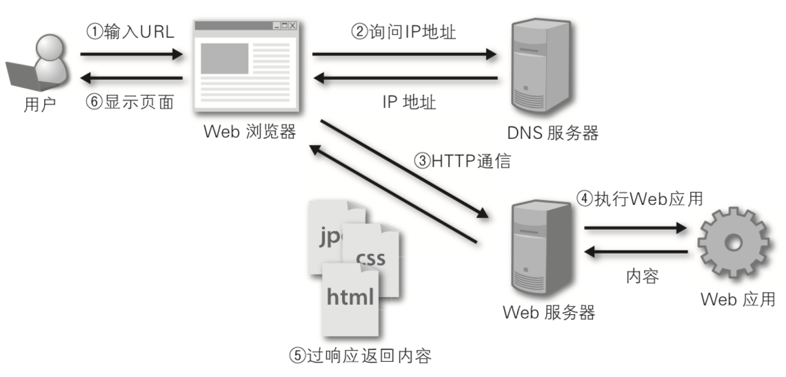
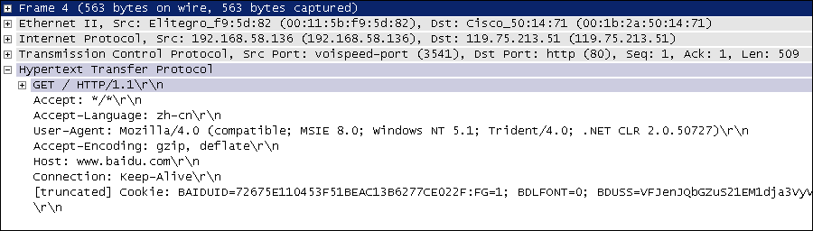
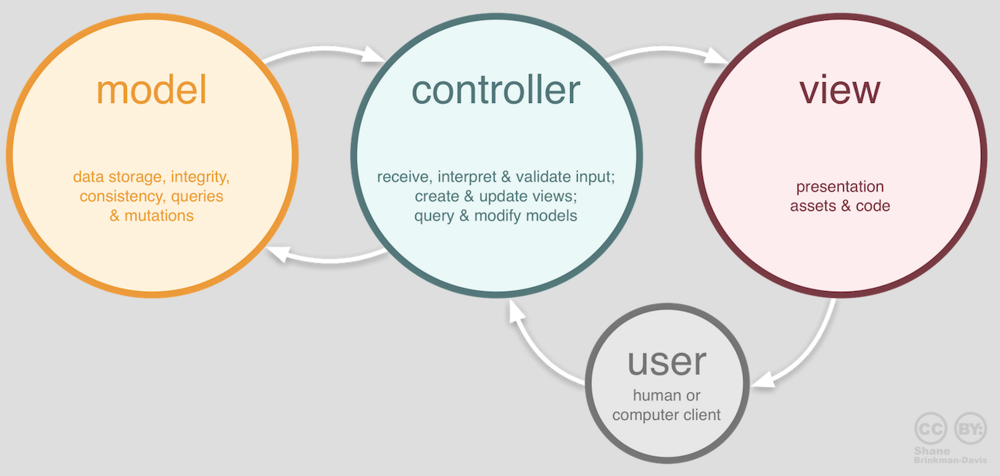

# Django快速上手

## 目录

1. 简介
   - [Web应用机制和术语](#Web应用机制和术语)
2. 

Web开发的早期阶段，开发者需要手动编写每个页面，例如一个新闻门户网站，每天都要修改它的HTML页面，随着网站规模和体量的增大，这种方式就变得极度糟糕。为了解决这个问题，开发人员想到了用外部程序来为Web服务器生成动态内容，也就是说HTML页面以及页面中的动态内容不再通过手动编写而是通过程序自动生成。

最早的时候，这项技术被称为CGI（公共网关接口），当然随着时间的推移，CGI暴露出的问题也越来越多，例如大量重复的样板代码，总体性能较为低下等，因此在时代呼唤新英雄的背景下，PHP、ASP、JSP这类Web应用开发技术在上世纪90年代中后期如雨后春笋般涌现。

通常我们说的Web应用是指通过浏览器来访问网络资源的应用程序，因为浏览器的普及性以及易用性，Web应用使用起来方便简单，免除了安装和更新应用程序带来的麻烦，而且也不用关心用户到底用的是什么操作系统，甚至不用区分是PC端还是移动端。

## Web应用机制和术语

下图向我们展示了Web应用的工作流程，其中涉及到的术语如下表所示。



>说明：相信有经验的读者会发现，这张图中其实还少了很多东西，例如反向代理服务器、数据库服务器、防火墙等，而且图中的每个节点在实际项目部署时可能是一组节点组成的集群。当然，如果你对这些没有什么概念也不要紧，继续下去就行了，后面会给大家一一讲解的。

术语|解释
-|-
URL/URI|统一资源定位符/统一资源标识符，网络资源的唯一标识
域名|与Web服务器地址对应的一个易于记忆的字符串名字
DNS|域名解析服务，可以将域名转换成对应的IP地址
IP地址|网络上的主机的身份标识，通过IP地址可以区分不同的主机
HTTP|超文本传输协议，构建在TCP之上的应用级协议，万维网数据通信的基础
反向代理|代理客户端向服务器发出请求，然后将服务器返回的资源返回给客户端
Web服务器|接受HTTP请求，然后返回HTML文件、纯文本文件、图像等资源给请求者
Nginx|高性能的Web服务器，也可以用作[反向代理](https://zh.wikipedia.org/wiki/%E5%8F%8D%E5%90%91%E4%BB%A3%E7%90%86)，[负载均衡](https://zh.wikipedia.org/wiki/%E8%B4%9F%E8%BD%BD%E5%9D%87%E8%A1%A1) 和 [HTTP缓存](https://zh.wikipedia.org/wiki/HTTP%E7%BC%93%E5%AD%98)

### HTTP协议

这里我们稍微费一些笔墨来谈谈上面提到的HTTP。HTTP（超文本传输协议）是构建于TCP（传输控制协议）之上应用级协议，它利用了TCP提供的可靠的传输服务实现了Web应用中的数据交换。按照维基百科上的介绍，设计HTTP最初的目的是为了提供一种发布和接收[HTML](https://zh.wikipedia.org/wiki/HTML)页面的方法，也就是说这个协议是浏览器和Web服务器之间传输的数据的载体。

关于这个协议的详细信息以及目前的发展状况，大家可以阅读阮一峰老师的[《HTTP 协议入门》](http://www.ruanyifeng.com/blog/2016/08/http.html)、[《互联网协议入门》](http://www.ruanyifeng.com/blog/2012/05/internet_protocol_suite_part_i.html)系列以及[《图解HTTPS协议》](http://www.ruanyifeng.com/blog/2014/09/illustration-ssl.html)进行了解。

下图是我在四川省网络通信技术重点实验室学习和工作期间使用开源协议分析工具Ethereal（抓包工具WireShark的前身）截取的访问百度首页时的HTTP请求和响应的报文（协议数据），由于Ethereal截取的是经过网络适配器的数据，因此可以清晰的看到从物理链路层到应用层的协议数据。

HTTP请求（请求行+请求头+空行+\[消息体]）：



HTTP响应（响应行+响应头+空行+消息体）：

>说明：这两张图是在2009年9月10日截取的，但愿这两张如同泛黄的照片般的截图能帮助你了解HTTP到底是什么样子的。

## Django概述

Python的Web框架有上百个，比它的关键字还要多。所谓Web框架，就是用于开发Web服务器端应用的基础设施（通常指封装好的模块和一系列的工具）。事实上，即便没有Web框架，我们仍然可以通过socket或[CGI](https://zh.wikipedia.org/wiki/%E9%80%9A%E7%94%A8%E7%BD%91%E5%85%B3%E6%8E%A5%E5%8F%A3)来开发Web服务器端应用，但是这样做的成本和代价在实际开发中通常是不能接受的。

通过Web框架，我们可以化繁为简，同时降低创建、更新、扩展应用程序的工作量。Python的Web框架中比较有名的有：Flask、Django、Tornado、Sanic、Pyramid、Bottle、Web2py、web.py等。

在基于Python的Web框架中，Django是所有重量级选手中最有代表性的一位，开发者可以基于Django快速的开发可靠的Web应用程序，因为它减少了Web开发中不必要的开销，对常用的设计和开发模式进行了封装，并对MVC架构提供了支持（MTV）。

许多成功的网站和App都是基于Django框架构建的，国内比较有代表性的网站包括：知乎、豆瓣网、果壳网、搜狐闪电邮箱、101围棋网、海报时尚网、背书吧、堆糖、手机搜狐网、咕咚、爱福窝、果库等。



Django诞生于2003年，它是一个在真正的应用中成长起来的项目，由劳伦斯出版集团旗下在线新闻网站的内容管理系统（CMS）研发团队编写（主要是Adrian Holovaty和Simon Willison），以比利时的吉普赛爵士吉他手Django Reinhardt来命名，在2005年夏天作为开源框架发布。

使用Django能用很短的时间构建出功能完备的网站，因为它代替程序员完成了所有乏味和重复的劳动，剩下真正有意义的核心业务给程序员，这一点就是对DRY（Don't Repeat Yourself）理念的最好践行。

## 快速上手

### 准备工作

1. 检查Python环境：Django 1.11需要Python 2.7或Python 3.4以上的版本；Django 2.0需要Python 3.4以上的版本；Django 2.1需要Python 3.5以上的版本。

   >说明：我自己平时使用macOS做开发，macOS和Linux平台使用的命令跟Windows平台有较大的区别，这一点在之前也有过类似的说明，如果使用Windows平台做开发，替换一下对应的命令即可。

   ```sh
   python3 --version
   ```

   ```sh
   python3
   >>> import sys
   >>> sys.version
   >>> sys.version_info
   ```

2. 创建项目文件夹并切换到该目录，例如我们要实例一个OA（办公自动化）项目。

   ```sh
   mkdir oa
   cd oa
   ```

3. 创建并激活虚拟环境。

   ```sh
   python3 -m venv venv
   source venv/bin/activate
   ```

   >说明：上面使用了Python自带的venv模块完成了虚拟环境的创建，当然也可以使用virtualenv或pipenv这样的工具。要激活虚拟环境，在Windows环境下可以通过"venv/Scripts/activate"执行批处理文件来实现。

4. 更新包管理工具pip。

   ```sh
   (venv)$ pip install -U pip
   ```

   或

   ```sh
   (venv)$ python -m pip install -U pip
   ```

   >注意：请注意终端提示符发生的变化，前面的(venv)说明我们已经进入虚拟环境，而虚拟环境下的python和pip已经是Python 3的解释器和包管理工具了。

5. 安装Django。

   ```sh
   (venv)$ pip install django
   ```

   或指定版本号来安装对应的Django的版本。

   ```sh
   (venv)$ pip install django==2.1.8
   ```

6. 检查Django的版本。

   ```sh
   (venv)$ python -m django --version
   (venv)$ django-admin --version
   ```

   或

   ```sh
   (venv)$ python
   >>> import django
   >>> django.get_version()
   ```

   当然，也可以通过pip来查看安装的依赖库及其版本，如：

   ```sh
   (venv)$ pip freeze
   (venv)$ pip list
   ```

   下图展示了Django版本和Python版本的对应关系，如果在安装时没有指定版本号，将自动选择最新的版本（在写作这段内容时，Django最新的版本是2.2）。

   Django版本|Python版本
   -|-
   1.8|2.7、3.2、3.3、3.4、3.5
   1.9、1.10|2.7、3.4、3.5
   1.11|2.7、3.4、3.5、3.6、3.7
   2.0|3.4、3.5、3.6、3.7
   2.1、2.2|3.5、3.6、3.7

7. 使用django-admin创建项目，项目命名为oa。

   ```sh
   (venv)$ django-admin startproject oa .
   ```

   >注意：上面的命令最后的那个点，它表示在当前路径下创建项目。

   执行上面的命令后看看生成的文件和文件夹，它们的作用如下所示：

   - `manage.py`： 一个让你可以管理Django项目的工具程序。
   - `oa/__init__.py`：一个空文件，告诉Python解释器这个目录应该被视为一个Python的包。
   - `oa/settings.py`：Django项目的配置文件。
   - `oa/urls.py`：Django项目的URL声明（URL映射），就像是你的网站的“目录”。
   - `oa/wsgi.py`：项目运行在WSGI兼容Web服务器上的接口文件。

   >说明：WSGI全称是Web服务器网关接口，维基百科上给出的解释是“为Python语言定义的[Web服务器](https://zh.wikipedia.org/wiki/%E7%B6%B2%E9%A0%81%E4%BC%BA%E6%9C%8D%E5%99%A8)和[Web应用程序](https://zh.wikipedia.org/wiki/%E7%BD%91%E7%BB%9C%E5%BA%94%E7%94%A8%E7%A8%8B%E5%BA%8F)或框架之间的一种简单而通用的接口”。

8. 启动服务器运行项目。

   ```sh
   (venv)$ python manage.py runserver
   ```

   在浏览器中输入 http://127.0.0.1:8000 访问我们的服务器

   >说明1：刚刚启动的是Django自带的用于开发和测试的服务器，它是一个用纯Python编写的轻量级Web服务器，但它并不是真正意义上的生产级别的服务器，千万不要将这个服务器用于和生产环境相关的任何地方。

   >说明2：用于开发的服务器在需要的情况下会对每一次的访问请求重新载入一遍Python代码。所以你不需要为了让修改的代码生效而频繁的重新启动服务器。然而，一些动作，比如添加新文件，将不会触发自动重新加载，这时你得自己手动重启服务器。

   >说明3：可以通过 `python manage.py help` 命令查看可用命令列表；在启动服务器时，也可以通过 `python manage.py runserver 1.2.3.4:5678` 来指定将服务器运行于哪个IP地址和端口。

   >说明4：可以通过Ctrl+C来终止服务器的运行。

9. 接下来我们修改项目的配置文件 settings.py，Django是一个支持国际化和本地化的框架，因此刚才我们看到的默认首页也是支持国际化的，我们将默认语言修改为中文，时区设置为东八区。

   ```sh
   (venv)$ vim oa/settings.py
   ```

   ```py
   # 此处省略上面的内容

   # 设置语言代码
   LANGUAGE_CODE = 'zh-hans'
   # 设置时区
   TIME_ZONE = 'Asia/Chongqing'

   # 此处省略下面的内容
   ```

10. 刷新刚才的页面。

### 动态页面

1. 创建名为hrs（人力资源系统）的应用，一个Django项目可以包含一个或多个应用。

   ```sh
   (venv)$ python manage.py startapp hrs
   ```

   执行上面的命令会在当前路径下创建hrs目录，其目录结构如下所示：

   - `__init__.py`：一个空文件，告诉Python解释器这个目录应该被视为一个Python的包。
   - `admin.py`：可以用来注册模型，用于在Django的管理界面管理模型。
   - `apps.py`：当前应用的配置文件。
   - `migrations`：存放与模型有关的数据库迁移信息。
     - `__init__.py`：一个空文件，告诉Python解释器这个目录应该被视为一个Python的包。
   - `models.py`：存放应用的数据模型，即实体类及其之间的关系（MVC/MTV中的M）。
   - `tests.py`：包含测试应用各项功能的测试类和测试函数。
   - `views.py`：处理请求并返回响应的函数（MVC中的C，MTV中的V）。

2. 修改应用目录下的视图文件views.py。

   ```sh
   (venv)$ vim hrs/views.py
   ```

   ```py
   from django.http import HttpResponse

   def index(request):
    return HttpResponse('<h1>Hello, Django!</h1>')
   ```

3. 在应用目录创建一个urls.py文件并映射URL。

   ```sh
   (venv)$ touch hrs/urls.py
   (venv)$ vim hrs/urls.py
   ```

   ```py
   from django.urls import path
   from hrs import views

   urlpatterns = [
    path('', views.index, name='index'),
   ]
   ```

   >说明：上面使用的path函数是Django 2.x中新添加的函数，除此之外还可以使用支持正则表达式的URL映射函数re_path函数；Django 1.x中是用名为url函数来设定URL映射。

4. 修改项目目录下的urls.py文件，对应用中设定的URL进行合并。

   ```sh
   (venv) $ vim oa/urls.py
   ```

   ```py
   from django.contrib import admin
   from django.urls import path, include

   urlpatterns = [
    path('admin/', admin.site.urls),
    path('hrs/', include('hrs.urls')),
   ]
   ```

   >说明：上面的代码通过include函数将hrs应用中配置URL的文件包含到项目的URL配置中，并映射到hrs/路径下。

5. 重新运行项目，并打开浏览器中访问 http://localhost:8000/hrs 。

   ```sh
   (venv)$ python manage.py runserver
   ```

6. 修改views.py生成动态内容。

   ```sh
   (venv)$ vim hrs/views.py
   ```

    ```py
    from io import StringIO
    from django.http import HttpResponse

    depts_list = [
        {'no': 10, 'name': '财务部', 'location': '北京'},
        {'no': 20, 'name': '研发部', 'location': '成都'},
        {'no': 30, 'name': '销售部', 'location': '上海'},
    ]

    def index(request):
        output = StringIO()
        output.write('<html>\n')
        output.write('<head>\n')
        output.write('\t<meta charset="utf-8">\n')
        output.write('\t<title>首页</title>')
        output.write('</head>\n')
        output.write('<body>\n')
        output.write('\t<h1>部门信息</h1>\n')
        output.write('\t<hr>\n')
        output.write('\t<table>\n')
        output.write('\t\t<tr>\n')
        output.write('\t\t\t<th width=120>部门编号</th>\n')
        output.write('\t\t\t<th width=180>部门名称</th>\n')
        output.write('\t\t\t<th width=180>所在地</th>\n')
        output.write('\t\t</tr>\n')
        for dept in depts_list:
            output.write('\t\t<tr>\n')
            output.write(f'\t\t\t<td align=center>{dept["no"]}</td>\n')
            output.write(f'\t\t\t<td align=center>{dept["name"]}</td>\n')
            output.write(f'\t\t\t<td align=center>{dept["location"]}</td>\n')
            output.write('\t\t</tr>\n')
        output.write('\t</table>\n')
        output.write('</body>\n')
        output.write('</html>\n')
        return HttpResponse(output.getvalue())
    ```

7. 刷新页面查看程序的运行结果。

   

### 使用视图模板

上面通过拼接HTML代码的方式生成动态视图的做法在实际开发中是无能接受的，这一点大家一定能够想到。为了解决这个问题，我们可以提前准备一个模板页，所谓模板页就是一个带占位符的HTML页面，当我们将程序中获得的数据替换掉页面中的占位符时，一个动态页面就产生了。

我们可以用Django框架中template模块的Template类创建模板对象，通过模板对象的render方法实现对模板的渲染，在Django框架中还有一个名为render的便捷函数可以来完成渲染模板的操作。所谓的渲染就是用数据替换掉模板页中的占位符，当然这里的渲染称为后端渲染，即在服务器端完成页面的渲染再输出到浏览器中，这种做法的主要坏处是当并发访问量较大时，服务器会承受较大的负担，所以今天有很多的Web应用都使用了前端渲染，即服务器只提供所需的数据（通常是JSON格式），在浏览器中通过JavaScript获取这些数据并渲染到页面上，这个我们在后面的内容中会讲到。

先回到manage.py文件所在的目录创建名为templates文件夹。

1. 先回到manage.py文件所在的目录创建名为templates文件夹。

   ```sh
   (venv)$ mkdir templates
   ```

2. 创建模板页index.html。

   ```sh
   (venv)$ touch templates/index.html
   (venv)$ vim templates/index.html
   ```

    ```html
    <!DOCTYPE html>
    <html lang="en">
    <head>
        <meta charset="UTF-8">
        <title>首页</title>
    </head>
    <body>
        <h1>部门信息</h1>
        <hr>
        <table>
            <tr>
                <th>部门编号</th>
                <th>部门名称</th>
                <th>所在地</th>
            </tr>
            
            <tr>
                <td>{{ dept.no }}</td>
                <td>{{ dept.name }}</td>
                <td>{{ dept.location }}</td>
            <tr>
            
        </table>
    </body>
    </html>
    ```

    在上面的模板页中我们使用了{{ greeting }}这样的模板占位符语法，也使用了这样的模板指令，这些都是Django模板语言（DTL）的一部分。如果对此不熟悉并不要紧，我们会在后续的内容中进一步的讲解，而且我们刚才也说到了，渲染页面还有更好的选择就是使用前端渲染，当然这是后话。

3. 回到应用目录，修改views.py文件。

   ```sh
   (venv)$ vim hrs/views.py
   ```

    ```py
    from django.shortcuts import render

    depts_list = [
        {'no': 10, 'name': '财务部', 'location': '北京'},
        {'no': 20, 'name': '研发部', 'location': '成都'},
        {'no': 30, 'name': '销售部', 'location': '上海'},
    ]

    def index(request):
        return render(request, 'index.html', {'depts_list': depts_list})
    ```

   >说明：Django框架通过shortcuts模块的便捷函数render简化了渲染模板的操作，有了这个函数，就不用先创建Template对象再去调用render方法。

   到此为止，我们还没有办法让views.py中的render函数找到模板文件index.html，为此我们需要修改settings.py文件，配置模板文件所在的路径。

4. 切换到项目目录修改settings.py文件。

   ```sh
   (venv)$ vim oa/settings.py
   ```

    ```py
    # 此处省略上面的内容

    TEMPLATES = [
        {
            'BACKEND': 'django.template.backends.django.DjangoTemplates',
            'DIRS': [os.path.join(BASE_DIR, 'templates')],
            'APP_DIRS': True,
            'OPTIONS': {
                'context_processors': [
                    'django.template.context_processors.debug',
                    'django.template.context_processors.request',
                    'django.contrib.auth.context_processors.auth',
                    'django.contrib.messages.context_processors.messages',
                ],
            },
        },
    ]

    # 此处省略下面的内容
    ```

5. 重新运行项目或直接刷新页面查看结果。

   ```sh
   (venv)$ python manage.py runserver
   ```

## 总结

至此，我们已经利用Django框架完成了一个非常小的Web应用，虽然它并没有任何的实际价值，但是可以通过这个项目对Django框架有一个感性的认识。

当然，实际开发中我们可以用PyCharm来创建项目，如果使用专业版的PyCharm，可以直接创建Django项目。使用PyCharm的好处在于编写代码时可以获得代码提示、错误修复、自动导入等功能，从而提升开发效率，但是专业版的PyCharm需要按年支付相应的费用，社区版的PyCharm中并未包含对Django框架直接的支持，但是我们仍然可以使用它来创建Django项目，只是在使用上没有专业版的方便。

关于PyCharm的使用，可以参考[《玩转PyCharm》](https://github.com/jackfrued/Python-100-Days/blob/master/%E7%8E%A9%E8%BD%ACPyCharm.md)一文。此外，Django最好的学习资料肯定是它的[官方文档](https://docs.djangoproject.com/zh-hans/2.0/)，当然图灵社区出版的[《Django基础教程》](http://www.ituring.com.cn/book/2630)也是非常适合初学者的入门级读物。

## 深入模型

MVC架构追求的是“模型”和“视图”的解耦合。所谓“模型”说得更直白一些就是数据（的表示），所以通常也被称作“数据模型”。在实际的项目中，数据模型通常通过数据库实现持久化操作，而关系型数据库在过去和当下都是持久化的首选方案，下面我们以MySQL为例来说明如何使用关系型数据库来实现持久化操作。

### 配置关系型数据库MySQL

我们继续来完善上一个章节中的OA项目，首先从配置项目使用的数据库开始。

1. 修改项目的settings.py文件，首先将我们之前创建的应用hrs添加已安装的项目中，然后配置MySQL作为持久化方案。

   ```sh
   (venv)$ vim oa/settings.py
   ```

    ```py
    # 此处省略上面的代码
    INSTALLED_APPS = [
        'django.contrib.admin',
        'django.contrib.auth',
        'django.contrib.contenttypes',
        'django.contrib.sessions',
        'django.contrib.messages',
        'django.contrib.staticfiles',
        'hrs',
    ]

    DATABASES = {
        'default': {
            'ENGINE': 'django.db.backends.mysql',
            'NAME': 'oa',
            'HOST': '127.0.0.1',
            'PORT': 3306,
            'USER': 'root',
            'PASSWORD': '123456',
        }
    }

    # 此处省略下面的代码
    ```

   在配置ENGINE属性时，常用的可选值包括：

   - django.db.backends.sqlite3'：SQLite嵌入式数据库。
   - django.db.backends.postgresql'：BSD许可证下发行的开源关系型数据库产品。
   - django.db.backends.mysql'：转手多次目前属于甲骨文公司的经济高效的数据库产品。
   - django.db.backends.oracle'：甲骨文公司的关系型数据库旗舰产品。 
  
   其他的配置可以参考官方文档中[数据库配置](https://docs.djangoproject.com/zh-hans/2.0/ref/databases/#third-party-notes)的部分。

   NAME属性代表数据库的名称，如果使用SQLite它对应着一个文件，在这种情况下NAME的属性值应该是一个绝对路径；使用其他关系型数据库，则要配置对应的HOST（主机）、PORT（端口）、USER（用户名）、PASSWORD（口令）等属性。

2. 安装Python操作MySQL的依赖库，Python 3中通常使用PyMySQL，Python 2中通常用MySQLdb。

   ```sh
   (venv)$ pip install pymysql
   ```

   如果使用Python 3需要修改**项目目录**下的__init__.py文件并加入如下所示的代码，这段代码的作用是将PyMySQL视为MySQLdb来使用，从而避免Django找不到连接MySQL的客户端工具而询问你：“Did you install mysqlclient? ”（你安装了mysqlclient吗？）。

   ```py
   import pymysql

   pymysql.install_as_MySQLdb()
   ```

3. 如果之前没有为应用程序创建数据库，那么现在是时候创建名为oa的数据库了。在MySQL中创建数据库的SQL语句如下所示：

   ```sql
   create database oa default charset utf8;
   ```

4. Django框架本身有自带的数据模型，我们稍后会用到这些模型，为此我们先做一次迁移操作。所谓迁移，就是根据模型自动生成关系数据库中的二维表，命令如下所示：

   ```sh
   (venv)$ python manage.py migrate
   Operations to perform:
     Apply all migrations: admin, auth, contenttypes, sessions
   Running migrations:
     Applying contenttypes.0001_initial... OK
     Applying auth.0001_initial... OK
     Applying admin.0001_initial... OK
     Applying admin.0002_logentry_remove_auto_add... OK
     Applying contenttypes.0002_remove_content_type_name... OK
     Applying auth.0002_alter_permission_name_max_length... OK
     Applying auth.0003_alter_user_email_max_length... OK
     Applying auth.0004_alter_user_username_opts... OK
     Applying auth.0005_alter_user_last_login_null... OK
     Applying auth.0006_require_contenttypes_0002... OK
     Applying auth.0007_alter_validators_add_error_messages... OK
     Applying auth.0008_alter_user_username_max_length... OK
     Applying auth.0009_alter_user_last_name_max_length... OK
     Applying sessions.0001_initial... OK
   ```

5. 接下来，我们为自己的应用创建数据模型。如果要在hrs应用中实现对部门和员工的管理，我们可以先创建部门和员工数据模型，代码如下所示。

   ```sh
   (venv)$ vim hrs/models.py
   ```

   ```py
   from django.db import models

   class Dept(models.Model):
       """部门类"""
       no = models.IntegerField(primary_key=True, db_column='dno', verbose_name='部门编号')
       name = models.CharField(max_length=20, db_column='dname', verbose_name='部门名称')
       location = models.CharField(max_length=10, db_column='dloc', verbose_name='部门所在地')

       class Meta:
           db_table = 'tb_dept'


   class Emp(models.Model):
       """员工类"""
       no = models.IntegerField(primary_key=True, db_column='eno', verbose_name='员工编号')
       name = models.CharField(max_length=20, db_column='ename', verbose_name='员工姓名')
       job = models.CharField(max_length=10, verbose_name='职位')
       # 多对一外键关联(自参照)
       mgr = models.ForeignKey('self', on_delete=models.SET_NULL, null=True, blank=True, verbose_name='主管')
       sal = models.DecimalField(max_digits=7, decimal_places=2, verbose_name='月薪')
       comm = models.DecimalField(max_digits=7, decimal_places=2, null=True, blank=True, verbose_name='补贴')
       # 多对一外键关联(参照部门模型)
       dept = models.ForeignKey(Dept, db_column='dno', on_delete=models.PROTECT, verbose_name='所在部门')

       class Meta:
           db_table = 'tb_emp'
   ```

   >说明：上面定义模型时使用了字段类及其属性，其中IntegerField对应数据库中的integer类型，CharField对应数据库的varchar类型，DecimalField对应数据库的decimal类型，ForeignKey用来建立多对一外键关联。字段属性primary_key用于设置主键，max_length用来设置字段的最大长度，db_column用来设置数据库中与字段对应的列，verbose_name则设置了Django后台管理系统中该字段显示的名称。如果对这些东西感到很困惑也不要紧，文末提供了字段类、字段属性、元数据选项等设置的相关说明，不清楚的读者可以稍后查看对应的参考指南。

6. 再次执行迁移操作，先通过模型生成迁移文件，再执行迁移创建二维表。

   ```sh
   (venv)$ python manage.py makemigrations hrs
   Migrations for 'hrs':
     hrs/migrations/0001_initial.py
       - Create model Dept
       - Create model Emp
   (venv)$ python manage.py migrate
   Operations to perform:
     Apply all migrations: admin, auth, contenttypes, hrs, sessions
   Running migrations:
     Applying hrs.0001_initial... OK
   ```
