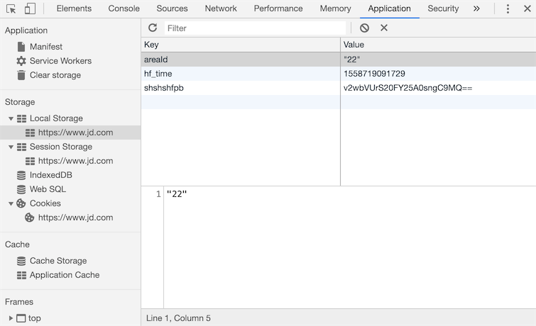

# 身份认证&报表&日志

## Cookie和Session

### 实现用户跟踪

如今，一个网站如果不通过某种方式记住你是谁以及你之前在网站的活动情况，失去的就是网站的可用性和便利性，继而很有可能导致网站用户的流失，所以记住一个用户（更专业的说法叫**用户跟踪**）对绝大多数Web应用来说都是必需的功能。

在服务器端，我们想记住一个用户最简单的办法就是创建一个对象，通过这个对象就可以把用户相关的信息都保存起来，这个对象就是我们常说的session（用户会话对象）。那么问题来了，HTTP本身是一个无连接（每次请求和响应的过程中，服务器一旦完成对客户端请求的响应之后就断开连接）、无状态（客户端再次发起对服务器的请求时，服务器无法得知这个客户端之前的任何信息）的协议，即便服务器通过session对象保留了用户数据，还得通过某种方式来确定当前的请求与之前保存过的哪一个session是有关联的。相信很多人都能想到，我们可以给每个session对象分配一个全局唯一的标识符来识别session对象，我们姑且称之为sessionid，每次客户端发起请求时，只要携带上这个sessionid，就有办法找到与之对应的session对象，从而实现在两次请求之间记住该用户的信息，也就是我们之前说的用户跟踪。

要让客户端记住并在每次请求时带上sessionid又有以下几种做法：

1. URL重写。所谓URL重写就是在URL中携带sessionid，例如：`http://www.example.com/index.html?sessionid=123456`，服务器通过获取sessionid参数的值来取到与之对应的session对象。

2. 隐藏域（隐式表单域）。在提交表单的时候，可以通过在表单中设置隐藏域向服务器发送额外的数据。例如：`<input type="hidden" name="sessionid" value="123456">`。

3. 本地存储。现在的浏览器都支持多种本地存储方案，包括：cookie、localStorage、sessionStorage、IndexedDB等。在这些方案中，cookie是历史最为悠久也是被诟病得最多的一种方案，也是我们接下来首先为大家讲解的一种方案。简单的说，cookie是一种以键值对方式保存在浏览器临时文件中的数据，每次请求时，请求头中会携带本站点的cookie到服务器，那么只要将sessionid写入cookie，下次请求时服务器只要读取请求头中的cookie就能够获得这个sessionid，如下图所示。


在HTML5时代，除了cookie，还可以使用新的本地存储API来保存数据，就是刚才提到的localStorage、sessionStorage、IndexedDB等技术，如下图所示。



## Django框架对session的支持

在创建Django项目时，默认的配置文件 `settings.py` 文件中已经激活了一个名为 `SessionMiddleware` 的中间件（关于中间件的知识我们在下一个章节做详细的讲解，这里只需要知道它的存在即可），因为这个中间件的存在，我们可以直接通过请求对象的 `session` 属性来操作会话对象。`session` 属性是一个像字典一样可以读写数据的容器对象，因此我们可以使用“键值对”的方式来保留用户数据。与此同时，`SessionMiddleware` 中间件还封装了对 `cookie` 的操作，在 `cookie` 中保存了 `sessionid`，就如同我们之前描述的那样。

在默认情况下，Django将session的数据序列化后保存在关系型数据库中，在Django 1.6以后的版本中，默认的序列化数据的方式是JSON序列化，而在此之前一直使用Pickle序列化。JSON序列化和Pickle序列化的差别在于前者将对象序列化为字符串（字符形式），而后者将对象序列化为字节串（二进制形式），因为安全方面的原因，JSON序列化成为了目前Django框架默认序列化数据的方式，这就要求在我们保存在session中的数据必须是能够JSON序列化的，否则就会引发异常。还有一点需要说明的是，使用关系型数据库保存session中的数据在大多数时候并不是最好的选择，因为数据库可能会承受巨大的压力而成为系统性能的瓶颈，在后面的章节中我们会告诉大家如何将session的数据保存到缓存服务中。

我们继续完善之前的投票应用，前一个章节中我们实现了用户的登录和注册，下面我们首先完善登录时对验证码的检查。

```py
def get_captcha(request):
    """验证码"""
    captcha_text = random_captcha_text()
    request.session['captcha'] = captcha_text
    image_data = Captcha.instance().generate(captcha_text)
    return HttpResponse(image_data, content_type='image/png')
```

注意上面代码中的第4行，我们将随机生成的验证码字符串保存到session中，稍后用户登录时，我们要将保存在session中的验证码字符串和用户输入的验证码字符串进行比对，如果用户输入了正确的验证码才能够执行后续的登录流程，代码如下所示。

```py
def login(request: HttpRequest):
    """登录"""
    hint = ''
    if request.method == 'POST':
        form = LoginForm(request.POST)
        if form.is_valid():
            # 对验证码的正确性进行验证
            captcha_from_user = form.cleaned_data['captcha']
            captcha_from_sess = request.session.get('captcha', '')
            if captcha_from_sess.lower() != captcha_from_user.lower():
                hint = '请输入正确的验证码'
            else:
                username = form.cleaned_data['username']
                password = form.cleaned_data['password']
                user = User.objects.filter(username=username, password=password).first()
                if user:
                    # 登录成功后将用户编号和用户名保存在session中
                    request.session['userid'] = user.no
                    request.session['username'] = user.username
                    return redirect('/')
                else:
                    hint = '用户名或密码错误'
        else:
            hint = '请输入有效的登录信息'
    return render(request, 'login.html', {'hint': hint})
```

上面的代码中，我们设定了登录成功后会在session中保存用户的编号（userid）和用户名（username），页面会重定向到首页。接下来我们可以稍微对首页的代码进行调整，在页面的右上角显示出登录用户的用户名。我们将这段代码单独写成了一个名为header.html的HTML文件，首页中可以通过在<body>标签中添加来包含这个页面，代码如下所示。

```html
<div class="user">
    
    <span>{{ request.session.username }}</span>
    <a href="/logout">注销</a>
    
    <a href="/login">登录</a>&nbsp;&nbsp;
    
    <a href="/register">注册</a>
</div>
```

如果用户没有登录，页面会显示登录和注册的超链接；而用户登录成功后，页面上会显示用户名和注销的链接，注销链接对应的视图函数如下所示，URL的映射与之前讲过的类似，不再赘述。

```py
def logout(request):
    """注销"""
    request.session.flush()
    return redirect('/')
```

上面的代码通过session对象flush方法来销毁session，一方面清除了服务器上session对象保存的用户数据，一方面将保存在浏览器cookie中的sessionid删除掉，稍后我们会对如何读写cookie的操作加以说明。

我们可以通过项目使用的数据库中名为django_session 的表来找到所有的session，该表的结构如下所示：

session_key|session_data|expire_date
-|-|-
c9g2gt5cxo0k2evykgpejhic5ae7bfpl|MmI4YzViYjJhOGMyMDJkY2M5Yzg3...|2019-05-25 23:16:13.898522

其中，第1列就是浏览器cookie中保存的sessionid；第2列是经过BASE64编码后的session中的数据，如果使用Python的base64对其进行解码，解码的过程和结果如下所示。

```py
>>> import base64
>>> base64.b64decode('MmI4YzViYjJhOGMyMDJkY2M5Yzg3ZWIyZGViZmUzYmYxNzdlNDdmZjp7ImNhcHRjaGEiOiJzS3d0Iiwibm8iOjEsInVzZXJuYW1lIjoiamFja2ZydWVkIn0=')    
'2b8c5bb2a8c202dcc9c87eb2debfe3bf177e47ff:{"captcha":"sKwt","no":1,"username":"jackfrued"}'
```

第3列是session的过期时间，session过期后浏览器保存的cookie中的sessionid就会失效，但是数据库中的这条对应的记录仍然会存在，如果想清除过期的数据，可以使用下面的命令。

```py
python manage.py clearsessions
```

Django框架默认的session过期时间为两周（1209600秒），如果想修改这个时间，可以在项目的配置文件中添加如下所示的代码。

```sh
# 配置会话的超时时间为1天（86400秒）
SESSION_COOKIE_AGE = 86400
```

有很多对安全性要求较高的应用都必须在关闭浏览器窗口时让会话过期，不再保留用户的任何信息，如果希望在关闭浏览器窗口时就让会话过期（cookie中的sessionid失效），可以加入如下所示的配置。

```sh
# 设置为True在关闭浏览器窗口时session就过期
SESSION_EXPIRE_AT_BROWSER_CLOSE = True
```

如果不希望将session的数据保存在数据库中，可以将其放入缓存中，对应的配置如下所示，缓存的配置和使用我们在后面讲解。

```py
# 配置将会话对象放到缓存中存储
SESSION_ENGINE = 'django.contrib.sessions.backends.cache'
# 配置使用哪一组缓存来保存会话
SESSION_CACHE_ALIAS = 'default'
```

如果要修改session数据默认的序列化方式，可以将默认的JSONSerializer修改为PickleSerializer。

```py
SESSION_SERIALIZER = 'django.contrib.sessions.serializers.PickleSerializer'
```

## 在视图函数中读写cookie

Django封装的HttpRequest和HttpResponse对象分别提供了读写cookie的操作。

HttpRequest封装的属性和方法：

1. COOKIES属性 - 该属性包含了HTTP请求携带的所有cookie。
2. get_signed_cookie方法 - 获取带签名的cookie，如果签名验证失败，会产生BadSignature异常。

HttpResponse封装的方法：

1. set_cookie方法 - 该方法可以设置一组键值对并将其最终将写入浏览器。
2. set_signed_cookie方法 - 跟上面的方法作用相似，但是会对cookie进行签名来达到防篡改的作用。因为如果篡改了cookie中的数据，在不知道[密钥](https://zh.wikipedia.org/wiki/%E5%AF%86%E9%92%A5)和[盐](https://zh.wikipedia.org/wiki/%E7%9B%90_(%E5%AF%86%E7%A0%81%E5%AD%A6))的情况下是无法生成有效的签名，这样服务器在读取cookie时会发现数据与签名不一致从而产生BadSignature异常。需要说明的是，这里所说的密钥就是我们在Django项目配置文件中指定的SECRET_KEY，而盐是程序中设定的一个字符串，你愿意设定为什么都可以，只要是一个有效的字符串。

上面提到的方法，如果不清楚它们的具体用法，可以自己查阅一下Django的[官方文档](https://docs.djangoproject.com/en/2.1/ref/request-response/)，没有什么资料比官方文档能够更清楚的告诉你这些方法到底如何使用。

刚才我们说过了，激活SessionMiddleware之后，每个HttpRequest对象都会绑定一个session属性，它是一个类似字典的对象，除了保存用户数据之外还提供了检测浏览器是否支持cookie的方法，包括：

1. set_test_cookie方法 - 设置用于测试的cookie。
2. test_cookie_worked方法 - 检测测试cookie是否工作。
3. delete_test_cookie方法 - 删除用于测试的cookie。
4. set_expiry方法 - 设置会话的过期时间。
5. get_expire_age/get_expire_date方法 - 获取会话的过期时间。
6. clear_expired方法 - 清理过期的会话。

下面是在执行登录之前检查浏览器是否支持cookie的代码。

```py
def login(request):
    if request.method == 'POST':
        if request.session.test_cookie_worked():
            request.session.delete_test_cookie()
            # Add your code to perform login process here
        else:
            return HttpResponse("Please enable cookies and try again.")
    request.session.set_test_cookie()
    return render_to_response('login.html')
```

## Cookie的替代品

之前我们说过了，cookie的名声一直都不怎么好，当然我们在实际开发中是不会在cookie中保存用户的敏感信息（如用户的密码、信用卡的账号等）的，而且保存在cookie中的数据一般也会做好编码和签名的工作。即便如此，HTML5中还是给出了用于替代cookie的技术方案，其中使用得最为广泛的就是localStorage和sessionStorage，相信从名字上你就能听出二者的差别，存储在localStorage的数据可以长期保留；而存储在sessionStorage的数据会在浏览器关闭时会被清除 。关于这些cookie替代品的用法，建议大家查阅[MDN](https://developer.mozilla.org/zh-CN/docs/Web)来进行了解。

## 报表和日志

### 导出Excel报表

报表就是用表格、图表等格式来动态显示数据，所以有人用这样的公式来描述报表：

```md
报表 = 多样的格式 + 动态的数据
```

有很多的三方库支持在Python程序中写Excel文件，包括[xlwt](https://xlwt.readthedocs.io/en/latest/)、[xlwings](https://docs.xlwings.org/en/latest/quickstart.html)、[openpyxl](https://openpyxl.readthedocs.io/en/latest/)、[xlswriter](https://xlsxwriter.readthedocs.io/)、[pandas](http://pandas.pydata.org/)等，其中的xlwt虽然只支持写xls格式的Excel文件，但在性能方面的表现还是不错的。下面我们就以xlwt为例，来演示如何在Django项目中导出Excel报表，例如导出一个包含所有老师信息的Excel表格。

```py
def export_teachers_excel(request):
    # 创建工作簿
    wb = xlwt.Workbook()
    # 添加工作表
    sheet = wb.add_sheet('老师信息表')
    # 查询所有老师的信息(注意：这个地方稍后需要优化)
    queryset = Teacher.objects.all()
    # 向Excel表单中写入表头
    colnames = ('姓名', '介绍', '好评数', '差评数', '学科')
    for index, name in enumerate(colnames):
        sheet.write(0, index, name)
    # 向单元格中写入老师的数据
    props = ('name', 'detail', 'good_count', 'bad_count', 'subject')
    for row, teacher in enumerate(queryset):
        for col, prop in enumerate(props):
            value = getattr(teacher, prop, '')
            if isinstance(value, Subject):
                value = value.name
            sheet.write(row + 1, col, value)
    # 保存Excel
    buffer = BytesIO()
    wb.save(buffer)
    # 将二进制数据写入响应的消息体中并设置MIME类型
    resp = HttpResponse(buffer.getvalue(), content_type='application/vnd.ms-excel')
    # 中文文件名需要处理成百分号编码
    filename = quote('老师.xls')
    # 通过响应头告知浏览器下载该文件以及对应的文件名
    resp['content-disposition'] = f'attachment; filename="{filename}"'
    return resp
```

映射URL。

```py
urlpatterns = [
    # 此处省略上面的代码
    path('excel/', views.export_teachers_excel),
    # 此处省略下面的代码
]
```

## 生成前端统计图表

如果项目中需要生成前端统计图表，可以使用百度的[ECharts](https://echarts.baidu.com/)。具体的做法是后端通过提供数据接口返回统计图表所需的数据，前端使用ECharts来渲染出柱状图、折线图、饼图、散点图等图表。例如我们要生成一个统计所有老师好评数和差评数的报表，可以按照下面的方式来做。

```py
def get_teachers_data(request):
    # 查询所有老师的信息(注意：这个地方稍后也需要优化)
    queryset = Teacher.objects.all()
    # 用生成式将老师的名字放在一个列表中
    names = [teacher.name for teacher in queryset]
    # 用生成式将老师的好评数放在一个列表中
    good = [teacher.good_count for teacher in queryset]
    # 用生成式将老师的差评数放在一个列表中
    bad = [teacher.bad_count for teacher in queryset]
    # 返回JSON格式的数据
    return JsonResponse({'names': names, 'good': good, 'bad': bad})
```

映射URL。

```py
urlpatterns = [
    # 此处省略上面的代码
    path('teachers_data/', views.export_teachers_excel),
    # 此处省略下面的代码
]
```

使用ECharts生成柱状图。

```html
<!DOCTYPE html>
<html lang="en">
<head>
    <meta charset="UTF-8">
    <title>老师评价统计</title>
</head>
<body>
    <div id="main" style="width: 600px; height: 400px"></div>
    <p>
        <a href="/">返回首页</a>
    </p>
    <script src="https://cdn.bootcss.com/echarts/4.2.1-rc1/echarts.min.js"></script>
    <script>
        var myChart = echarts.init(document.querySelector('#main'))
        fetch('/teachers_data/')
            .then(resp => resp.json())
            .then(json => {
                var option = {
                    color: ['#f00', '#00f'],
                    title: {
                        text: '老师评价统计图'
                    },
                    tooltip: {},
                    legend: {
                        data:['好评', '差评']
                    },
                    xAxis: {
                        data: json.names
                    },
                    yAxis: {},
                    series: [
                        {
                            name: '好评',
                            type: 'bar',
                            data: json.good
                        },
                        {
                            name: '差评',
                            type: 'bar',
                            data: json.bad
                        }
                    ]
                }
                myChart.setOption(option)
            })
    </script>
</body>
</html>
```

## 配置日志

项目开发阶段，显示足够的调试信息以辅助开发人员调试代码还是非常必要的；项目上线以后，将系统运行时出现的警告、错误等信息记录下来以备相关人员了解系统运行状况并维护代码也是很有必要的。要做好这两件事件，我们需要为Django项目配置日志。

Django的日志配置基本可以参照官方文档再结合项目实际需求来进行，这些内容基本上可以从官方文档上复制下来，然后进行局部的调整即可，下面给出一些参考配置。

```py
LOGGING = {
    'version': 1,
    # 是否禁用已经存在的日志器
    'disable_existing_loggers': False,
    # 日志格式化器
    'formatters': {
        'simple': {
            'format': '%(asctime)s %(module)s.%(funcName)s: %(message)s',
            'datefmt': '%Y-%m-%d %H:%M:%S',
        },
        'verbose': {
            'format': '%(asctime)s %(levelname)s [%(process)d-%(threadName)s] '
                      '%(module)s.%(funcName)s line %(lineno)d: %(message)s',
            'datefmt': '%Y-%m-%d %H:%M:%S',
        }
    },
    # 日志过滤器
    'filters': {
        # 只有在Django配置文件中DEBUG值为True时才起作用
        'require_debug_true': {
            '()': 'django.utils.log.RequireDebugTrue',
        },
    },
    # 日志处理器
    'handlers': {
        # 输出到控制台
        'console': {
            'class': 'logging.StreamHandler',
            'level': 'DEBUG',
            'filters': ['require_debug_true'],
            'formatter': 'simple',
        },
        # 输出到文件(每周切割一次)
        'file1': {
            'class': 'logging.handlers.TimedRotatingFileHandler',
            'filename': 'access.log',
            'when': 'W0',
            'backupCount': 12,
            'formatter': 'simple',
            'level': 'INFO',
        },
        # 输出到文件(每天切割一次)
        'file2': {
            'class': 'logging.handlers.TimedRotatingFileHandler',
            'filename': 'error.log',
            'when': 'D',
            'backupCount': 31,
            'formatter': 'verbose',
            'level': 'WARNING',
        },
    },
    # 日志器记录器
    'loggers': {
        'django': {
            # 需要使用的日志处理器
            'handlers': ['console', 'file1', 'file2'],
            # 是否向上传播日志信息
            'propagate': True,
            # 日志级别(不一定是最终的日志级别)
            'level': 'DEBUG',
        },
    }
}
```

大家可能已经注意到了，上面日志配置中的formatters是**日志格式化器**，它代表了如何格式化输出日志，其中格式占位符分别表示：

1. %(name)s - 记录器的名称
2. %(levelno)s - 数字形式的日志记录级别
3. %(levelname)s - 日志记录级别的文本名称
4. %(filename)s - 执行日志记录调用的源文件的文件名称
5. %(pathname)s - 执行日志记录调用的源文件的路径名称
6. %(funcName)s - 执行日志记录调用的函数名称
7. %(module)s - 执行日志记录调用的模块名称
8. %(lineno)s - 执行日志记录调用的行号%(created)s - 执行日志记录的时间
9. %(asctime)s - 日期和时间
10. %(msecs)s - 毫秒部分
11. %(thread)d - 线程ID（整数）
12. %(threadName)s - 线程名称
13. %(process)d - 进程ID （整数）

日志配置中的handlers用来指定**日志处理器**，简单的说就是指定将日志输出到控制台还是文件又或者是网络上的服务器，可用的处理器包括：

1. logging.StreamHandler(stream=None) - 可以向类似与sys.stdout或者sys.stderr的任何文件对象输出信息
2. logging.FileHandler(filename, mode='a', encoding=None, delay=False) - 将日志消息写入文件
3. logging.handlers.DatagramHandler(host, port) - 使用UDP协议，将日志信息发送到指定主机和端口的网络主机上
4. logging.handlers.HTTPHandler(host, url) - 使用HTTP的GET或POST方法将日志消息上传到一台HTTP 服务器
5. logging.handlers.RotatingFileHandler(filename, mode='a', maxBytes=0, backupCount=0, encoding=None, delay=False) - 将日志消息写入文件，如果文件的大小超出maxBytes指定的值，那么将重新生成一个文件来记录日志
6. logging.handlers.SocketHandler(host, port) - 使用TCP协议，将日志信息发送到指定主机和端口的网络主机上
7. logging.handlers.SMTPHandler(mailhost, fromaddr, toaddrs, subject, credentials=None, secure=None, timeout=1.0) - 将日志输出到指定的邮件地址
8. logging.MemoryHandler(capacity, flushLevel=ERROR, target=None, flushOnClose=True) - 将日志输出到内存指定的缓冲区中

上面每个日志处理器都指定了一个名为“level”的属性，它代表了日志的级别，不同的日志级别反映出日志中记录信息的严重性。Python中定义了六个级别的日志，按照从低到高的顺序依次是：NOTSET、DEBUG、INFO、WARNING、ERROR、CRITICAL。

最后配置的**日志记录器**是用来真正输出日志的，Django框架提供了如下所示的内置记录器：

1. django - 在Django层次结构中的所有消息记录器
2. django.request - 与请求处理相关的日志消息。5xx响应被视为错误消息；4xx响应被视为为警告消息
3. django.server - 与通过runserver调用的服务器所接收的请求相关的日志消息。5xx响应被视为错误消息；4xx响应被记录为警告消息；其他一切都被记录为INFO
4. django.template - 与模板渲染相关的日志消息
5. django.db.backends - 有与数据库交互产生的日志消息，如果希望显示ORM框架执行的SQL语句，就可以使用该日志记录器。

日志记录器中配置的日志级别有可能不是最终的日志级别，因为还要参考日志处理器中配置的日志级别，取二者中级别较高者作为最终的日志级别。

### 配置Django-Debug-Toolbar

Django-Debug-Toolbar是项目开发阶段辅助调试和优化的神器，只要配置了它，就可以很方便的查看到如下表所示的项目运行信息，这些信息对调试项目和优化Web应用性能都是至关重要的。

项目|说明
-|-
Versions|Django的版本
Time|显示视图耗费的时间
Settings|配置文件中设置的值
Headers|HTTP请求头和响应头的信息
Request|和请求相关的各种变量及其信息
StaticFiles|静态文件加载情况
Templates|模板的相关信息
Cache|缓存的使用情况
Signals|Django内置的信号信息
Logging|被记录的日志信息
SQL|向数据库发送的SQL语句及其执行时间

1. 安装Django-Debug-Toolbar。

   ```sh
   pip install django-debug-toolbar
   ```

2. 配置 - 修改 settings.py。

   ```py
   INSTALLED_APPS = [
       'debug_toolbar',
   ]

   MIDDLEWARE = [
       'debug_toolbar.middleware.DebugToolbarMiddleware',
   ]

   DEBUG_TOOLBAR_CONFIG = {
       # 引入jQuery库
       'JQUERY_URL': 'https://cdn.bootcss.com/jquery/3.3.1/jquery.min.js',
       # 工具栏是否折叠
       'SHOW_COLLAPSED': True,
       # 是否显示工具栏
       'SHOW_TOOLBAR_CALLBACK': lambda x: True,
   }
   ```

3. 配置 - 修改 urls.py。

   ```py
   if settings.DEBUG:

       import debug_toolbar

       urlpatterns.insert(0, path('__debug__/', include(debug_toolbar.urls)))
   ```

4. 使用。在配置好Django-Debug-Toolbar之后，页面右侧会看到一个调试工具栏，上面包括了如前所述的各种调试信息，包括执行时间、项目设置、请求头、SQL、静态资源、模板、缓存、信号等，查看起来非常的方便。

## 优化ORM代码

在配置了日志或Django-Debug-Toolbar之后，我们可以查看一下之前将老师数据导出成Excel报表的视图函数执行情况，这里我们关注的是ORM框架生成的SQL查询到底是什么样子的，相信这里的结果会让你感到有一些意外。执行Teacher.objects.all()之后我们可以注意到，在控制台看到的或者通过Django-Debug-Toolbar输出的SQL是下面这样的：

```sql
SELECT `tb_teacher`.`no`, `tb_teacher`.`name`, `tb_teacher`.`detail`, `tb_teacher`.`photo`, `tb_teacher`.`good_count`, `tb_teacher`.`bad_count`, `tb_teacher`.`sno` FROM `tb_teacher`; args=()
SELECT `tb_subject`.`no`, `tb_subject`.`name`, `tb_subject`.`intro`, `tb_subject`.`create_date`, `tb_subject`.`is_hot` FROM `tb_subject` WHERE `tb_subject`.`no` = 101; args=(101,)
SELECT `tb_subject`.`no`, `tb_subject`.`name`, `tb_subject`.`intro`, `tb_subject`.`create_date`, `tb_subject`.`is_hot` FROM `tb_subject` WHERE `tb_subject`.`no` = 101; args=(101,)
SELECT `tb_subject`.`no`, `tb_subject`.`name`, `tb_subject`.`intro`, `tb_subject`.`create_date`, `tb_subject`.`is_hot` FROM `tb_subject` WHERE `tb_subject`.`no` = 101; args=(101,)
SELECT `tb_subject`.`no`, `tb_subject`.`name`, `tb_subject`.`intro`, `tb_subject`.`create_date`, `tb_subject`.`is_hot` FROM `tb_subject` WHERE `tb_subject`.`no` = 101; args=(101,)
SELECT `tb_subject`.`no`, `tb_subject`.`name`, `tb_subject`.`intro`, `tb_subject`.`create_date`, `tb_subject`.`is_hot` FROM `tb_subject` WHERE `tb_subject`.`no` = 103; args=(103,)
SELECT `tb_subject`.`no`, `tb_subject`.`name`, `tb_subject`.`intro`, `tb_subject`.`create_date`, `tb_subject`.`is_hot` FROM `tb_subject` WHERE `tb_subject`.`no` = 103; args=(103,)
```

这里的问题通常被称为“1+N查询”（或“N+1查询”），原本获取老师的数据只需要一条SQL，但是由于老师关联了学科，当我们查询到N条老师的数据时，Django的ORM框架又向数据库发出了N条SQL去查询老师所属学科的信息。每条SQL执行都会有较大的开销而且会给数据库服务器带来压力，如果能够在一条SQL中完成老师和学科的查询肯定是更好的做法，这一点也很容易做到，相信大家已经想到怎么做了。是的，我们可以使用连接查询，但是在使用Django的ORM框架时如何做到这一点呢？对于多对一关联（如投票应用中的老师和学科），我们可以使用QuerySet的用select_related()方法来加载关联对象；而对于多对多关联（如电商网站中的订单和商品），我们可以使用prefetch_related()方法来加载关联对象。

在导出老师Excel报表的视图函数中，我们可以按照下面的方式优化代码。

```py
queryset = Teacher.objects.all().select_related('subject')
```

事实上，用ECharts生成前端报表的视图函数中，查询老师好评和差评数据的操作也能够优化，因为在这个例子中，我们只需要获取老师的姓名、好评数和差评数这三项数据，但是在默认的情况生成的SQL会查询老师表的所有字段。可以用QuerySet的only()方法来指定需要查询的属性，也可以用QuerySet的defer()方法来指定暂时不需要查询的属性，这样生成的SQL会通过投影操作来指定需要查询的列，从而改善查询性能，代码如下所示：

```py
queryset = Teacher.objects.all().only('name', 'good_count', 'bad_count')
```

当然，如果要统计出每个学科的老师好评和差评的平均数，利用Django的ORM框架也能够做到，代码如下所示：

```py
queryset = Teacher.objects.values('subject').annotate(
        good=Avg('good_count'), bad=Avg('bad_count'))
```

这里获得的QuerySet中的元素是字典对象，每个字典中有三组键值对，分别是代表学科编号的subject、代表好评数的good和代表差评数的bad。如果想要获得学科的名称而不是编号，可以按照如下所示的方式调整代码：

```py
queryset = Teacher.objects.values('subject__name').annotate(
        good=Avg('good_count'), bad=Avg('bad_count'))
```

可见，Django的ORM框架允许我们用面向对象的方式完成关系数据库中的分组和聚合查询。

## 中间件的应用

### 实现登录验证

我们继续来完善投票应用。在上一个章节中，我们在用户登录成功后通过session保留了用户信息，接下来我们可以应用做一些调整，要求在为老师投票时必须要先登录，登录过的用户可以投票，否则就将用户引导到登录页面，为此我们可以这样修改视图函数。

```py
def praise_or_criticize(request: HttpRequest):
    """投票"""
    if 'username' in request.session:
        try:
            tno = int(request.GET.get('tno', '0'))
            teacher = Teacher.objects.get(no=tno)
            if request.path.startswith('/praise'):
                teacher.good_count += 1
            else:
                teacher.bad_count += 1
            teacher.save()
            data = {'code': 200, 'message': '操作成功'}
        except (ValueError, Teacher.DoesNotExist):
            data = {'code': 404, 'message': '操作失败'}
    else:
        data = {'code': 401, 'message': '请先登录'}
    return JsonResponse(data)
```

前端页面在收到 `{'code': 401, 'message': '请先登录'}` 后，可以将用户引导到登录页面，修改后的teacher.html页面的JavaScript代码部门如下所示。

```js
<script>
    $(() => {
        $('.comment > a').on('click', (evt) => {
            evt.preventDefault()
            let a = $(evt.target)
            $.getJSON(a.attr('href'), (json) => {
                if (json.code == 200) {
                    let span = a.next()
                    span.text(parseInt(span.text()) + 1)
                } else if (json.code == 401) {
                    location.href = '/login/?backurl=' + location.href
                } else {
                    alert(json.message)
                }
            })
        })
    })
</script>
```

>注意：为了在登录成功之后能够回到刚才投票的页面，我们在跳转登录时设置了一个backurl参数，把当前浏览器中的URL作为返回的页面地址。

这样我们已经实现了用户必须登录才能投票的限制，但是一个新的问题来了。如果我们的应用中有很多功能都需要用户先登录才能执行，例如将前面导出Excel报表和查看统计图表的功能都加以登录限制，那么我们是不是需要在每个视图函数中添加代码来检查session中是否包含了登录用户的信息呢？答案是否定的，如果这样做了，我们的视图函数中必然会充斥着大量的重复代码。编程大师Martin Fowler曾经说过：**代码有很多种坏味道，重复是最坏的一种**。在Django项目中，我们可以把验证用户是否登录这样的重复性代码放到中间件中。

### Django中间件概述

中间件是安插在Web应用请求和响应过程之间的组件，它在整个Web应用中扮演了拦截过滤器的角色，通过中间件可以拦截请求和响应，并对请求和响应进行过滤（简单的说就是执行额外的处理）。通常，一个中间件组件只专注于完成一件特定的事，例如：Django框架通过 `SessionMiddleware` 中间件实现了对session的支持，又通过 `AuthenticationMiddleware` 中间件实现了基于session的请求认证。通过把多个中间件组合在一起，我们可以完成更为复杂的任务，Django框架就是这么做的。

Django项目的配置文件中就包含了对中间件的配置，代码如下所示。

```py
MIDDLEWARE = [
    'django.middleware.security.SecurityMiddleware',
    'django.contrib.sessions.middleware.SessionMiddleware',
    'django.middleware.common.CommonMiddleware',
    'django.middleware.csrf.CsrfViewMiddleware',
    'django.contrib.auth.middleware.AuthenticationMiddleware',
    'django.contrib.messages.middleware.MessageMiddleware',
    'django.middleware.clickjacking.XFrameOptionsMiddleware',
]
```

我们稍微为大家解释一下这些中间件的作用：

1. CommonMiddleware - 基础设置中间件，可以处理以下一些配置参数。

   - DISALLOWED_USER_AGENTS - 不被允许的用户代理（浏览器）
   - APPEND_SLASH - 是否追加/
   - USE_ETAG - 浏览器缓存相关

2. SecurityMiddleware - 安全相关中间件，可以处理和安全相关的配置项。

   - SECURE_HSTS_SECONDS - 强制使用HTTPS的时间
   - SECURE_HSTS_INCLUDE_SUBDOMAINS - HTTPS是否覆盖子域名
   - SECURE_CONTENT_TYPE_NOSNIFF - 是否允许浏览器推断内容类型
   - SECURE_BROWSER_XSS_FILTER - 是否启用跨站脚本攻击过滤器
   - SECURE_SSL_REDIRECT - 是否重定向到HTTPS连接
   - SECURE_REDIRECT_EXEMPT - 免除重定向到HTTPS
3. SessionMiddleware - 会话中间件。
4. CsrfViewMiddleware - 通过生成令牌，防范跨请求份伪的造中间件。
5. XFrameOptionsMiddleware - 通过设置请求头参数，防范点击劫持攻击的中间件。

在请求的过程中，上面的中间件会按照书写的顺序从上到下执行，然后是URL解析，最后请求才会来到视图函数；在响应的过程中，上面的中间件会按照书写的顺序从下到上执行，与请求时中间件执行的顺序正好相反。

### 自定义中间件

Django中的中间件有两种实现方式：基于类的实现方式和基于函数的实现方式，后者更接近于装饰器的写法。装饰器实际上是代理模式的应用，将横切关注功能（与正常业务逻辑没有必然联系的功能，例如：身份认证、日志记录、编码转换之类的功能）置于代理中，由代理对象来完成被代理对象的行为并添加额外的功能。

中间件对用户请求和响应进行拦截过滤并增加额外的处理，在这一点上它跟装饰器是完全一致的，所以基于函数的写法来实现中间件就跟装饰器的写法几乎一模一样。下面我们用自定义的中间件来实现用户登录验证的功能。

```py
"""
middlewares.py
"""
from django.http import JsonResponse
from django.shortcuts import redirect

# 需要登录才能访问的资源路径
LOGIN_REQUIRED_URLS = {
    '/praise/', '/criticize/', '/excel/', '/teachers_data/',
}


def check_login_middleware(get_resp):

    def wrapper(request, *args, **kwargs):
        # 请求的资源路径在上面的集合中
        if request.path in LOGIN_REQUIRED_URLS:
            # 会话中包含userid则视为已经登录
            if 'userid' not in request.session:
                # 判断是不是Ajax请求
                if request.is_ajax():
                    # Ajax请求返回JSON数据提示用户登录
                    return JsonResponse({'code': 10003, 'hint': '请先登录'})
                else:
                    backurl = request.get_full_path()
                    # 非Ajax请求直接重定向到登录页
                    return redirect(f'/login/?backurl={backurl}')
        return get_resp(request, *args, **kwargs)

    return wrapper
```

修改配置文件，激活中间件使其生效。

```py
MIDDLEWARE = [
    'django.middleware.security.SecurityMiddleware',
    'django.contrib.sessions.middleware.SessionMiddleware',
    'django.middleware.common.CommonMiddleware',
    'django.middleware.csrf.CsrfViewMiddleware',
    'django.contrib.auth.middleware.AuthenticationMiddleware',
    'django.contrib.messages.middleware.MessageMiddleware',
    'django.middleware.clickjacking.XFrameOptionsMiddleware',
    'debug_toolbar.middleware.DebugToolbarMiddleware',
    'vote.middlewares.check_login_middleware',
]
```

注意上面这个中间件列表中元素的顺序，当收到来自用户的请求时，中间件按照从上到下的顺序依次执行，这行完这些中间件以后，请求才会最终到达视图函数。当然，在这个过程中，用户的请求可以被拦截，就像上面我们自定义的中间件那样，如果用户在没有登录的情况下访问了受保护的资源，中间件会将请求直接重定向到登录页，后面的中间件和视图函数将不再执行。在响应用户请求的过程中，上面的中间件会按照从下到上的顺序依次执行，这样的话我们还可以对响应做进一步的处理。

中间件执行的顺序是非常重要的，对于有依赖关系的中间件必须保证被依赖的中间件要置于依赖它的中间件的前面，就好比我们刚才自定义的中间件要放到SessionMiddleware的后面，因为我们要依赖这个中间件为请求绑定的session对象才能判定用户是否登录。

### 小结

至此，除了对用户投票数量加以限制的功能外，这个投票应用就算基本完成了，整个项目的完整代码请参考[https://github.com/jackfrued/django1902](https://github.com/jackfrued/django1902)，其中用户注册时使用的手机验证码功能请大家使用自己注册的短信平台替代它。如果需要投票应用完整的视频讲解，可以在首页扫码打赏后留言联系作者获取视频下载地址，谢谢大家的理解和支持。
