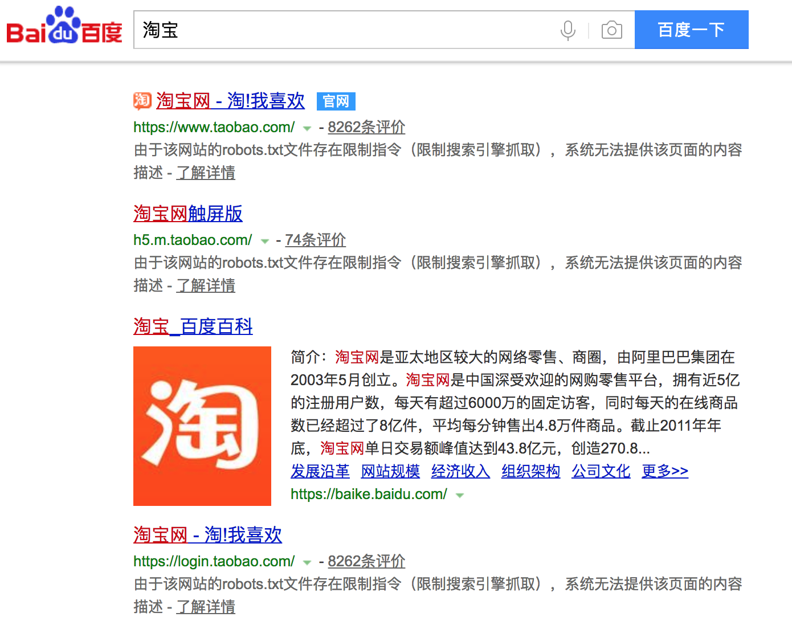
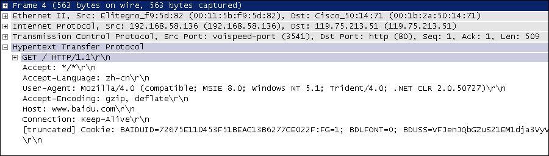

# 网络爬虫和相关工具

## 目录

## 网络爬虫的概念

网络爬虫（web crawler），以前经常称之为网络蜘蛛（spider），是按照一定的规则自动浏览万维网并获取信息的机器人程序（或脚本），曾经被广泛的应用于互联网搜索引擎。

使用过互联网和浏览器的人都知道，网页中除了供用户阅读的文字信息之外，还包含一些超链接。网络爬虫系统正是通过网页中的超链接信息不断获得网络上的其它页面。正因如此，网络数据采集的过程就像一个爬虫或者蜘蛛在网络上漫游，所以才被形象的称为网络爬虫或者网络蜘蛛。

**爬虫的应用领域：**

在理想的状态下，所有ICP（Internet Content Provider）都应该为自己的网站提供API接口来共享它们允许其他程序获取的数据，在这种情况下爬虫就不是必需品。

国内比较有名的电商平台（如淘宝、京东等）、社交平台（如腾讯微博等）等网站都提供了自己的Open API，但是这类Open API通常会对可以抓取的数据以及抓取数据的频率进行限制。

对于大多数的公司而言，及时的获取行业相关数据是企业生存的重要环节之一，然而大部分企业在行业数据方面的匮乏是其与生俱来的短板，合理的利用爬虫来获取数据并从中提取出有商业价值的信息是至关重要的。

当然爬虫还有很多重要的应用领域，下面列举了其中的一部分：

- 搜索引擎
- 新闻聚合
- 社交应用
- 舆情监控
- 行业数据

## 合法性和背景调研

**爬虫合法性探讨：**

网络爬虫领域目前还属于拓荒阶段，虽然互联网世界已经通过自己的游戏规则建立起一定的道德规范(Robots协议，全称是“网络爬虫排除标准”)，但法律部分还在建立和完善中，也就是说，现在这个领域暂时还是灰色地带。

“法不禁止即为许可”，如果爬虫就像浏览器一样获取的是前端显示的数据（网页上的公开信息）而不是网站后台的私密敏感信息，就不太担心法律法规的约束，因为目前大数据产业链的发展速度远远超过了法律的完善程度。

在爬取网站的时候，需要限制自己的爬虫遵守Robots协议，同时控制网络爬虫程序的抓取数据的速度；在使用数据的时候，必须要尊重网站的知识产权（从Web 2.0时代开始，虽然Web上的数据很多都是由用户提供的，但是网站平台是投入了运营成本的，当用户在注册和发布内容时，平台通常就已经获得了对数据的所有权、使用权和分发权）。如果违反了这些规定，在打官司的时候败诉几率相当高。

**Robots.txt文件：**

大多数网站都会定义robots.txt文件，下面以淘宝的robots.txt文件为例，看看该网站对爬虫有哪些限制。

```txt
User-agent:  Baiduspider
Allow:  /article
Allow:  /oshtml
Disallow:  /product/
Disallow:  /

User-Agent:  Googlebot
Allow:  /article
Allow:  /oshtml
Allow:  /product
Allow:  /spu
Allow:  /dianpu
Allow:  /oversea
Allow:  /list
Disallow:  /

User-agent:  Bingbot
Allow:  /article
Allow:  /oshtml
Allow:  /product
Allow:  /spu
Allow:  /dianpu
Allow:  /oversea
Allow:  /list
Disallow:  /

User-Agent:  360Spider
Allow:  /article
Allow:  /oshtml
Disallow:  /

User-Agent:  Yisouspider
Allow:  /article
Allow:  /oshtml
Disallow:  /

User-Agent:  Sogouspider
Allow:  /article
Allow:  /oshtml
Allow:  /product
Disallow:  /

User-Agent:  Yahoo!  Slurp
Allow:  /product
Allow:  /spu
Allow:  /dianpu
Allow:  /oversea
Allow:  /list
Disallow:  /

User-Agent:  *
Disallow:  /
```

注意上面 robots.txt 第一段的最后一行，通过设置 "Disallow: /" 禁止百度爬虫访问除了 "Allow" 规定页面外的其他所有页面。因此当你在百度搜索“淘宝”的时候，搜索结果下方会出现：“由于该网站的robots.txt文件存在限制指令（限制搜索引擎抓取），系统无法提供该页面的内容描述”。

百度作为一个搜索引擎，至少在表面上遵守了淘宝网的robots.txt协议，所以用户不能从百度上搜索到淘宝内部的产品信息。



## 相关工具介绍

### HTTP协议

在开始讲解爬虫之前，我们稍微对HTTP（超文本传输协议）做一些回顾，因为我们在网页上看到的内容通常是浏览器执行HTML语言得到的结果，而HTTP就是传输HTML数据的协议。

HTTP和其他很多应用级协议一样是构建在TCP（传输控制协议）之上的，它利用了TCP提供的可靠的传输服务实现了Web应用中的数据交换。按照维基百科上的介绍，设计HTTP最初的目的是为了提供一种发布和接收[HTML](https://zh.wikipedia.org/wiki/HTML)页面的方法，也就是说这个协议是浏览器和Web服务器之间传输的数据的载体。

关于这个协议的详细信息以及目前的发展状况，大家可以阅读阮一峰老师的[《HTTP 协议入门》](http://www.ruanyifeng.com/blog/2016/08/http.html)、[《互联网协议入门》](http://www.ruanyifeng.com/blog/2012/05/internet_protocol_suite_part_i.html)系列以及[《图解HTTPS协议》](http://www.ruanyifeng.com/blog/2014/09/illustration-ssl.html)进行了解，下图是我在四川省网络通信技术重点实验室工作期间用开源协议分析工具Ethereal（抓包工具WireShark的前身）截取的访问百度首页时的HTTP请求和响应的报文（协议数据），由于Ethereal截取的是经过网络适配器的数据，因此可以清晰的看到从物理链路层到应用层的协议数据。

HTTP请求（请求行+请求头+空行+[消息体]）：



HTTP响应（响应行+响应头+空行+消息体）：


>说明：但愿这两张如同泛黄照片般的截图帮助你大概的了解到HTTP是一个怎样的协议。

**相关工具：**

1. Chrome Developer Tools：谷歌浏览器内置的开发者工具。

   

2. POSTMAN：功能强大的网页调试与RESTful请求工具。

   

3. HTTPie：命令行HTTP客户端。

   ```sh
   pip3 install httpie
   ```

   ```sh
   http --header http://www.scu.edu.cn
   HTTP/1.1 200 OK
   Accept-Ranges: bytes
   Cache-Control: private, max-age=600
   Connection: Keep-Alive
   Content-Encoding: gzip
   Content-Language: zh-CN
   Content-Length: 14403
   Content-Type: text/html
   Date: Sun, 27 May 2018 15:38:25 GMT
   ETag: "e6ec-56d3032d70a32-gzip"
   Expires: Sun, 27 May 2018 15:48:25 GMT
   Keep-Alive: timeout=5, max=100
   Last-Modified: Sun, 27 May 2018 13:44:22 GMT
   Server: VWebServer
   Vary: User-Agent,Accept-Encoding
   X-Frame-Options: SAMEORIGIN
   ```

4. BuiltWith：识别网站所用技术的工具。

   ```sh
   pip3 install builtwith
   ```

   ```py
   >>> import builtwith
   >>> builtwith.parse('http://www.bootcss.com/')
   {'web-servers': ['Nginx'], 'font-scripts': ['Font Awesome'], 'javascript-frameworks': ['Lo-dash', 'Underscore.js', 'Vue.js', 'Zepto', 'jQuery'], 'web-frameworks': ['Twitter Bootstrap']}
   >>>
   >>> import ssl
   >>> ssl._create_default_https_context = ssl._create_unverified_context
   >>> builtwith.parse('https://www.jianshu.com/')
   {'web-servers': ['Tengine'], 'web-frameworks': ['Twitter Bootstrap', 'Ruby on Rails'], 'programming-languages': ['Ruby']}
   ```

5. python-whois：查询网站所有者的工具。

   ```sh
   pip3 install python-whois
   ```

   ```py
   >>> import whois
   >>> whois.whois('baidu.com')
   {'domain_name': ['BAIDU.COM', 'baidu.com'], 'registrar': 'MarkMonitor, Inc.', 'whois_server': 'whois.markmonitor.com', 'referral_url': None, 'updated_date': [datetime.datetime(2017, 7, 28, 2, 36, 28), datetime.datetime(2017, 7, 27, 19, 36, 28)], 'creation_date': [datetime.datetime(1999, 10, 11, 11, 5, 17), datetime.datetime(1999, 10, 11, 4, 5, 17)], 'expiration_date': [datetime.datetime(2026, 10, 11, 11, 5, 17), datetime.datetime(2026, 10, 11, 0, 0)], 'name_servers': ['DNS.BAIDU.COM', 'NS2.BAIDU.COM', 'NS3.BAIDU.COM', 'NS4.BAIDU.COM', 'NS7.BAIDU.COM', 'dns.baidu.com', 'ns4.baidu.com', 'ns3.baidu.com', 'ns7.baidu.com', 'ns2.baidu.com'], 'status': ['clientDeleteProhibited https://icann.org/epp#clientDeleteProhibited', 'clientTransferProhibited https://icann.org/epp#clientTransferProhibited', 'clientUpdateProhibited https://icann.org/epp#clientUpdateProhibited', 'serverDeleteProhibited https://icann.org/epp#serverDeleteProhibited', 'serverTransferProhibited https://icann.org/epp#serverTransferProhibited', 'serverUpdateProhibited https://icann.org/epp#serverUpdateProhibited', 'clientUpdateProhibited (https://www.icann.org/epp#clientUpdateProhibited)', 'clientTransferProhibited (https://www.icann.org/epp#clientTransferProhibited)', 'clientDeleteProhibited (https://www.icann.org/epp#clientDeleteProhibited)', 'serverUpdateProhibited (https://www.icann.org/epp#serverUpdateProhibited)', 'serverTransferProhibited (https://www.icann.org/epp#serverTransferProhibited)', 'serverDeleteProhibited (https://www.icann.org/epp#serverDeleteProhibited)'], 'emails': ['abusecomplaints@markmonitor.com', 'whoisrelay@markmonitor.com'], 'dnssec': 'unsigned', 'name': None, 'org': 'Beijing Baidu Netcom Science Technology Co., Ltd.', 'address': None, 'city': None, 'state': 'Beijing', 'zipcode': None, 'country': 'CN'}
   ```

6. robotparser：解析robots.txt的工具。

   ```py
   >>> from urllib import robotparser
   >>> parser = robotparser.RobotFileParser()
   >>> parser.set_url('https://www.taobao.com/robots.txt')
   >>> parser.read()
   >>> parser.can_fetch('Baiduspider', 'http://www.taobao.com/article')
   True
   >>> parser.can_fetch('Baiduspider', 'http://www.taobao.com/product')
   False
   ```

## 一个简单的爬虫

一个基本的爬虫通常分为数据采集（网页下载）、数据处理（网页解析）和数据存储（将有用的信息持久化）三个部分的内容，当然更为高级的爬虫在数据采集和处理时会使用并发编程或分布式技术，这就需要有调度器（安排线程或进程执行对应的任务）、后台管理程序（监控爬虫的工作状态以及检查数据抓取的结果）等的参与。


一般来说，爬虫的工作流程包括以下几个步骤：

1. 设定抓取目标（种子页面/起始页面）并获取网页。
2. 当服务器无法访问时，按照指定的重试次数尝试重新下载页面。
3. 在需要的时候设置用户代理或隐藏真实IP，否则可能无法访问页面。
4. 对获取的页面进行必要的解码操作然后抓取出需要的信息。
5. 在获取的页面中通过某种方式（如正则表达式）抽取出页面中的链接信息。
6. 对链接进行进一步的处理（获取页面并重复上面的动作）。
7. 将有用的信息进行持久化以备后续的处理。

下面的例子给出了一个从“搜狐体育”上获取NBA新闻标题和链接的爬虫。

```py
from urllib.error import URLError
from urllib.request import urlopen

import re
import pymysql
import ssl

from pymysql import Error


def decode_page(page_bytes, charsets=('utf-8',)):
    """通过指定的字符集对页面进行解码(不是每个网站都将字符集设置为utf-8)"""
    page_html = None
    for charset in charsets:
        try:
            page_html = page_bytes.decode(charset)
            break
        except UnicodeDecodeError:
            pass
            # logging.error('Decode:', error)
    return page_html


def get_page_html(seed_url, *, retry_times=3, charsets=('utf-8',)):
    """获取页面的HTML代码(通过递归实现指定次数的重试操作)"""
    page_html = None
    try:
        page_html = decode_page(urlopen(seed_url).read(), charsets)
    except URLError:
        # logging.error('URL:', error)
        if retry_times > 0:
            return get_page_html(seed_url, retry_times=retry_times - 1,
                                 charsets=charsets)
    return page_html


def get_matched_parts(page_html, pattern_str, pattern_ignore_case=re.I):
    """从页面中提取需要的部分(通常是链接也可以通过正则表达式进行指定)"""
    pattern_regex = re.compile(pattern_str, pattern_ignore_case)
    return pattern_regex.findall(page_html) if page_html else []


def start_crawl(seed_url, match_pattern, *, max_depth=-1):
    """开始执行爬虫程序并对指定的数据进行持久化操作"""
    conn = pymysql.connect(host='localhost', port=3306,
                           database='crawler', user='root',
                           password='123456', charset='utf8')
    try:
        with conn.cursor() as cursor:
            url_list = [seed_url]
            # 通过下面的字典避免重复抓取并控制抓取深度
            visited_url_list = {seed_url: 0}
            while url_list:
                current_url = url_list.pop(0)
                depth = visited_url_list[current_url]
                if depth != max_depth:
                    # 尝试用utf-8/gbk/gb2312三种字符集进行页面解码
                    page_html = get_page_html(current_url, charsets=('utf-8', 'gbk', 'gb2312'))
                    links_list = get_matched_parts(page_html, match_pattern)
                    param_list = []
                    for link in links_list:
                        if link not in visited_url_list:
                            visited_url_list[link] = depth + 1
                            page_html = get_page_html(link, charsets=('utf-8', 'gbk', 'gb2312'))
                            headings = get_matched_parts(page_html, r'<h1>(.*)<span')
                            if headings:
                                param_list.append((headings[0], link))
                    cursor.executemany('insert into tb_result values (default, %s, %s)',
                                       param_list)
                    conn.commit()
    except Error:
        pass
        # logging.error('SQL:', error)
    finally:
        conn.close()


def main():
    """主函数"""
    ssl._create_default_https_context = ssl._create_unverified_context
    start_crawl('http://sports.sohu.com/nba_a.shtml',
                r'<a[^>]+test=a\s[^>]*href=["\'](.*?)["\']',
                max_depth=2)


if __name__ == '__main__':
    main()
```

由于使用了MySQL实现持久化操作，所以要先启动MySQL服务器并创建名为 `crawler` 的数据库和名为 `tb_result` 的二维表才能运行该程序。

## 爬虫注意事项

通过上面的例子，我们对爬虫已经有了一个感性的认识，在编写爬虫时有以下一些注意事项：

1. 处理相对链接。有的时候我们从页面中获取的链接不是一个完整的绝对链接而是一个相对链接，这种情况下需要将其与URL前缀进行拼接（`urllib.parse` 中的 `urljoin()` 函数可以完成此项操作）。

2. 设置代理服务。有些网站会限制访问的区域（例如美国的Netflix屏蔽了很多国家的访问），有些爬虫需要隐藏自己的身份，在这种情况下可以设置使用代理服务器，代理服务器有免费的服务器和付费的商业服务器，但后者稳定性和可用性都更好，强烈建议在商业项目中使用付费的代理服务器。可以通过修改 `urllib.request` 中的 `ProxyHandler` 来为请求设置代理服务器。

3. 限制下载速度。如果我们的爬虫获取网页的速度过快，可能就会面临被封禁或者产生“损害动产”的风险（这个可能会导致吃官司且败诉），可以在两次下载之间添加延时从而对爬虫进行限速。

4. 避免爬虫陷阱。有些网站会动态生成页面内容，这会导致产生无限多的页面（例如在线万年历通常会有无穷无尽的链接）。可以通过记录到达当前页面经过了多少个链接（链接深度）来解决该问题，当达到事先设定的最大深度时爬虫就不再像队列中添加该网页中的链接了。

5. SSL相关问题。在使用 `urlopen` 打开一个HTTPS链接时会验证一次SSL证书，如果不做出处理会产生错误提示 "SSL: CERTIFICATE_VERIFY_FAILED"，可以通过以下两种方式加以解决：

   - 使用未经验证的上下文

     ```py
     import ssl

     request = urllib.request.Request(url='...', headers={...})
     context = ssl._create_unverified_context()
     web_page = urllib.request.urlopen(request, context=context)
     ```

   - 设置全局性取消证书验证

     ```py
     import ssl

     ssl._create_default_https_context = ssl._create_unverified_context
     ```

## 数据采集和解析

通过上面章节的讲解，我们已经了解到了开发一个爬虫需要做的工作以及一些常见的问题，下面我们给出一个爬虫开发相关技术的清单以及这些技术涉及到的标准库和第三方库，稍后我们会一一介绍这些内容。

1. 下载数据 - urllib / requests / aiohttp。
2. 解析数据 - re / lxml / beautifulsoup4 / pyquery。
3. 缓存和持久化 - pymysql / sqlalchemy / peewee/ redis / pymongo。
4. 生成数字签名 - hashlib。
5. 序列化和压缩 - pickle / json / zlib。
6. 调度器 - 多进程（multiprocessing） / 多线程（threading）。

### HTML页面

```html
<!DOCTYPE html>
<html>
<head>
    <title>Home</title>
    <style type="text/css">
        /* 此处省略层叠样式表代码 */
    </style>
</head>
<body>
    <div class="wrapper">
        <header>
            <h1>Yoko's Kitchen</h1>
            <nav>
                <ul>
                    <li><a href="" class="current">Home</a></li>
                    <li><a href="">Classes</a></li>
                    <li><a href="">Catering</a></li>
                    <li><a href="">About</a></li>
                    <li><a href="">Contact</a></li>
                </ul>
            </nav>
        </header>
        <section class="courses">
            <article>
                <figure>
                    
                    <figcaption>Bok Choi</figcaption>
                </figure>
                <hgroup>
                    <h2>Japanese Vegetarian</h2>
                    <h3>Five week course in London</h3>
                </hgroup>
                <p>A five week introduction to traditional Japanese vegetarian meals, teaching you a selection of rice
                    and noodle dishes.</p>
            </article>
            <article>
                <figure>
                    
                    <figcaption>Teriyaki Sauce</figcaption>
                </figure>
                <hgroup>
                    <h2>Sauces Masterclass</h2>
                    <h3>One day workshop</h3>
                </hgroup>
                <p>An intensive one-day course looking at how to create the most delicious sauces for use in a range of
                    Japanese cookery.</p>
            </article>
        </section>
        <aside>
            <section class="popular-recipes">
                <h2>Popular Recipes</h2>
                <a href="">Yakitori (grilled chicken)</a>
                <a href="">Tsukune (minced chicken patties)</a>
                <a href="">Okonomiyaki (savory pancakes)</a>
                <a href="">Mizutaki (chicken stew)</a>
            </section>
            <section class="contact-details">
                <h2>Contact</h2>
                <p>Yoko's Kitchen<br>
                    27 Redchurch Street<br>
                    Shoreditch<br>
                    London E2 7DP</p>
            </section>
        </aside>
        <footer>
            &copy; 2011 Yoko's Kitchen
        </footer>
    </div>
    <script>
        // 此处省略JavaScript代码
    </script>
</body>
</html>
```

如果你对上面的代码并不感到陌生，那么你一定知道HTML页面通常由三部分构成，分别是用来承载内容的Tag（标签）、负责渲染页面的CSS（层叠样式表）以及控制交互式行为的JavaScript。

通常，我们可以在浏览器的右键菜单中通过“查看网页源代码”的方式获取网页的代码并了解页面的结构；当然，我们也可以通过浏览器提供的开发人员工具来了解更多的信息。

### 使用requests获取页面

1. GET请求和POST请求。

2. URL参数和请求头。

3. 复杂的POST请求（文件上传）。

4. 操作Cookie。

5. 设置代理服务器。

>说明：关于requests的详细用法可以参考它的[官方文档](http://docs.python-requests.org/zh_CN/latest/user/quickstart.html)。

### 页面解析

#### 几种解析方式的比较

解析方式|对应的模块|速度|使用难度|备注
-|-|-|-|-
正则表达式解析|re|快|困难|常用正则表达式<br>在线正则表达式测试
XPath解析|lxml|快|一般|需要安装C语言依赖库<br>唯一支持XML的解析器
CSS选择器解析|bs4 / pyquery|不确定|简单

>说明：BeautifulSoup可选的解析器包括：Python标准库（html.parser）、lxml的HTML解析器、lxml的XML解析器和html5lib。

#### 使用正则表达式解析页面

如果你对正则表达式没有任何的概念，那么推荐先阅读[《正则表达式30分钟入门教程》](https://github.com/jackfrued/Python-100-Days/blob/master/Day66-75)，然后再阅读我们之前讲解在Python中如何使用正则表达式一文。

#### XPath解析和lxml

XPath是在XML文档中查找信息的一种语法，它使用路径表达式来选取XML文档中的节点或者节点集。这里所说的XPath节点包括元素、属性、文本、命名空间、处理指令、注释、根节点等。

```xml
<?xml version="1.0" encoding="UTF-8"?>
<bookstore>
  <book>
    <title lang="eng">Harry Potter</title>
    <price>29.99</price>
  </book>
  <book>
    <title lang="eng">Learning XML</title>
      <price>39.95</price>
  </book>
</bookstore>
```

对于上面的XML文件，我们可以用如下所示的XPath语法获取文档中的节点。

路径表达式 | 结果
-|-
bookstore | 选取 bookstore 元素的所有子节点。
/bookstore | 选取根元素 bookstore。注释：假如路径起始于正斜杠( / )，则此路径始终代表到某元素的绝对路径！
bookstore/book | 选取属于 bookstore 的子元素的所有 book 元素。
//book | 选取所有 book 子元素，而不管它们在文档中的位置。
bookstore//book | 选择属于 bookstore 元素的后代的所有 book 元素，而不管它们位于 bookstore 之下的什么位置。
//@lang | 选取名为 lang 的所有属性。

在使用XPath语法时，还可以使用XPath中的谓词。

路径表达式 | 结果
-|-
/bookstore/book[1] | 选取属于 bookstore 子元素的第一个 book 元素。
/bookstore/book[last()] | 选取属于 bookstore 子元素的最后一个 book 元素。
/bookstore/book[last()-1] | 选取属于 bookstore 子元素的倒数第二个 book 元素。
/bookstore/book[position()<3] | 选取最前面的两个属于 bookstore 元素的子元素的 book 元素。
//title[@lang] | 选取所有拥有名为 lang 的属性的 title 元素。
//title[@lang='eng'] | 选取所有 title 元素，且这些元素拥有值为 eng 的 lang 属性。
/bookstore/book[price>35.00] | 选取 bookstore 元素的所有 book 元素，且其中的 price 元素的值须大于 35.00。
/bookstore/book[price>35.00]/title | 选取 bookstore 元素中的 book 元素的所有 title 元素，且其中的 price 元素的值须大于 35.00。

XPath还支持通配符用法，如下所示。

路径表达式|结果
-|-
/bookstore/*|选取 bookstore 元素的所有子元素。
//*|选取文档中的所有元素。
//title[@*]|选取所有带有属性的 title 元素。

如果要选取多个节点，可以使用如下所示的方法。

路径表达式 | 结果
-|-
//book/title \| //book/price | 选取 book 元素的所有 title 和 price 元素。
//title \| //price | 选取文档中的所有 title 和 price 元素。
/bookstore/book/title \| //price | 选取属于 bookstore 元素的 book 元素的所有 title 元素，以及文档中所有的 price 元素。

>说明：上面的例子来自于菜鸟教程网站上[XPath教程](https://www.runoob.com/xpath/xpath-tutorial.html)，有兴趣的读者可以自行阅读原文。

当然，如果不理解或者不太熟悉XPath语法，可以在Chrome浏览器中按照如下所示的方法查看元素的XPath语法。


### BeautifulSoup的使用

BeautifulSoup是一个可以从HTML或XML文件中提取数据的Python库。它能够通过你喜欢的转换器实现惯用的文档导航、查找、修改文档的方式。

1. 遍历文档树

   - 获取标签
   - 获取标签属性
   - 获取标签内容
   - 获取子（孙）节点
   - 获取父节点/祖先节点
   - 获取兄弟节点

2. 搜索树节点

   - find / find_all
   - select_one / select

>说明：更多内容可以参考BeautifulSoup的[官方文档](https://www.crummy.com/software/BeautifulSoup/bs4/doc/index.zh.html)。

### PyQuery的使用

pyquery相当于jQuery的Python实现，可以用于解析HTML网页。

### 实例 - 获取知乎发现上的问题链接

```py
from urllib.parse import urljoin

import re
import requests

from bs4 import BeautifulSoup


def main():
    headers = {'user-agent': 'Baiduspider'}
    proxies = {
        'http': 'http://122.114.31.177:808'
    }
    base_url = 'https://www.zhihu.com/'
    seed_url = urljoin(base_url, 'explore')
    resp = requests.get(seed_url,
                        headers=headers,
                        proxies=proxies)
    soup = BeautifulSoup(resp.text, 'lxml')
    href_regex = re.compile(r'^/question')
    link_set = set()
    for a_tag in soup.find_all('a', {'href': href_regex}):
        if 'href' in a_tag.attrs:
            href = a_tag.attrs['href']
            full_url = urljoin(base_url, href)
            link_set.add(full_url)
    print('Total %d question pages found.' % len(link_set))


if __name__ == '__main__':
    main()
```
