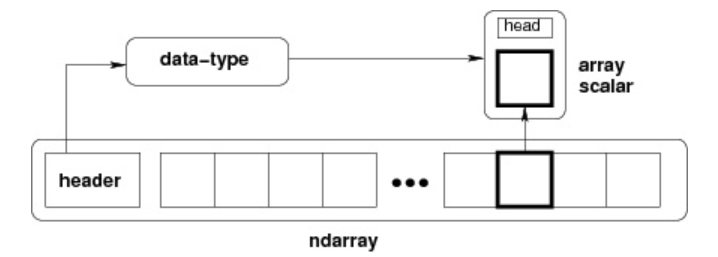

# NumPy和SciPy的应用

NumPy(Numerical Python) 是 Python 语言的一个扩展程序库，支持大量的维度数组与矩阵运算，此外也针对数组运算提供大量的数学函数库。

NumPy 的前身 Numeric 最早是由 Jim Hugunin 与其它协作者共同开发，2005 年，Travis Oliphant 在 Numeric 中结合了另一个同性质的程序库 Numarray 的特色，并加入了其它扩展而开发了 NumPy。NumPy 为开放源代码并且由许多协作者共同维护开发。

NumPy 是一个运行速度非常快的数学库，主要用于数组计算，包含：

- 一个强大的N维数组对象 ndarray
- 广播功能函数
- 整合 C/C++/Fortran 代码的工具
- 线性代数、傅里叶变换、随机数生成等功能

NumPy 通常与 SciPy（Scientific Python）和 Matplotlib（绘图库）一起使用， 这种组合广泛用于替代 MatLab，是一个强大的科学计算环境，有助于我们通过 Python 学习数据科学或者机器学习。

SciPy 是一个开源的 Python 算法库和数学工具包。

SciPy 包含的模块有最优化、线性代数、积分、插值、特殊函数、快速傅里叶变换、信号处理和图像处理、常微分方程求解和其他科学与工程中常用的计算。

Matplotlib 是 Python 编程语言及其数值数学扩展包 NumPy 的可视化操作界面。它为利用通用的图形用户界面工具包，如 Tkinter, wxPython, Qt 或 GTK+ 向应用程序嵌入式绘图提供了应用程序接口（API）。

## 安装

Windows平台上，最简单的方法是下载以下的 Python 发行版：

- [Anaconda](https://www.anaconda.com/download/)
- [Enthought Canopy](https://www.enthought.com/products/canopy)
- [Python(x,y)](https://python-xy.github.io/)
- [WinPython](https://winpython.github.io/)
- [Pyzo](http://www.pyzo.org/)

使用 pip 安装：

```sh
# --user 选项可以设置只安装在当前的用户下，而不是写入到系统目录。
python -m pip install --user numpy scipy matplotlib ipython jupyter pandas sympy nose
```

如果提示要更新pip模块：

```sh
python -m pip install --upgrade pip
```

查看已安装模块：

```sh
python -m pip list
```

## Ndarray 对象

NumPy 最重要的一个特点是其 N 维数组对象 ndarray，它是一系列同类型数据的集合，以 0 下标为开始进行集合中元素的索引。ndarray 中的每个元素在内存中都有相同存储大小的区域。ndarray 内部由以下内容组成：

- 一个指向数据（内存或内存映射文件中的一块数据）的指针。
- 数据类型或 dtype，描述在数组中的固定大小值的格子。
- 一个表示数组形状（shape）的元组，表示各维度大小的元组。
- 一个跨度元组（stride），其中的整数指的是为了前进到当前维度下一个元素需要"跨过"的字节数。

ndarray 的内部结构:



跨度可以是负数，这样会使数组在内存中后向移动，切片中 obj[::-1] 或 obj[:,::-1] 就是如此。

ndarray 对象由计算机内存的连续一维部分组成，并结合索引模式，将每个元素映射到内存块中的一个位置。内存块以行顺序(C样式)或列顺序(FORTRAN或MatLab风格，即前述的F样式)来保存元素。

[示例代码](./Codes/4.3.1_numpy.py)

## 参考

- [NumPy 官网](http://www.numpy.org/) 
- [NumPy 源代码](https://github.com/numpy/numpy)
- [SciPy 官网](https://www.scipy.org/)
- [SciPy 源代码](https://github.com/scipy/scipy)
- [Matplotlib 官网](https://matplotlib.org/)
- [Matplotlib 源代码](https://github.com/matplotlib/matplotlib)
