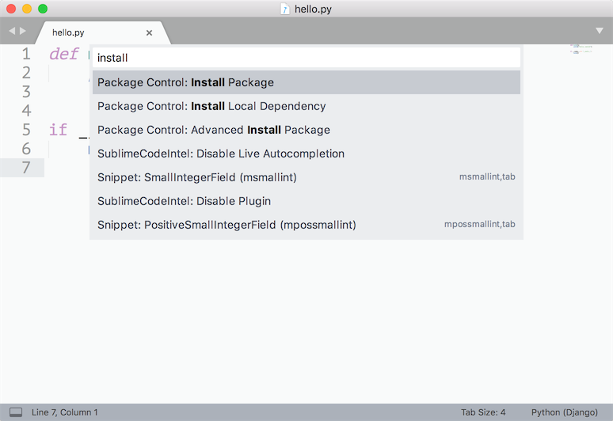

Python

1. 简介
   - [Python历史](#Python历史)
   - [Python优缺点](#Python优缺点)
   - [蟒之禅（Python哲学）](#蟒之禅（Python哲学）)
   - [面向对象](#面向对象)
   - [字符串和正则](#字符串和正则)
   - [文件和异常](#文件和异常)
   - [图形用户界面](#图形用户界面)
   - [进程和线程](#进程和线程)
   - [网络编程](#网络编程)
   - [图像和文档处理](#图像和文档处理)
   - [并发编程](#并发编程)
   - [定时任务](#定时任务)
   - [数据结构和算法](#数据结构和算法)
2. 实战
   - [搭建编程环境](#搭建编程环境)
   - [Python开发工具](#Python开发工具)
   - [BS](#BS)
     - [Django框架](#Django框架)
     - [Flask框架](#Flask框架)
3. 问题
4. 总结


## 第一部分 python语言概述

### 第1天：[初识Python](./1.1_初识python.md)

- 程序语言和自然语言
- Python简介 - Python的历史 / Python的优缺点 / Python的应用领域 / 蟒之禅（Python哲学）
- 搭建编程环境 - Windows环境 / Linux环境 / MacOS环境
- 从终端运行Python程序 - Hello, world / print函数 / 运行程序
- 使用IDLE - 交互式环境(REPL) / 编写多行代码 / 运行程序 / 退出IDLE
- 注释 - 注释的作用 / 单行注释 / 多行注释

### 第2天：[Python基本语法](./1.2_python基本语法.md)

- 语言元素
  - 程序和进制 - 指令和程序 / 冯诺依曼机 / 二进制和十进制 / 八进制和十六进制
  - 变量和类型 - 变量的命名 / 变量的使用 / input函数 / 检查变量类型 / 类型转换
  - 数字和字符串 - 整数 / 浮点数 / 复数 / 字符串 / 字符串基本操作 / 字符编码
  - 运算符 - 数学运算符 / 赋值运算符 / 比较运算符 / 逻辑运算符 / 身份运算符 / 运算符的优先级
  - 应用案例 - 华氏温度转换成摄氏温度 / 输入圆的半径计算周长和面积 / 输入年份判断是否是闰年
- 分支结构
  - 分支结构的应用场景 - 条件 / 缩进 / 代码块 / 流程图
  - if语句 - 简单的if / if-else结构 / if-elif-else结构 / 嵌套的if
  - 应用案例 - 用户身份验证 / 英制单位与公制单位互换 / 掷骰子决定做什么 / 百分制成绩转等级制 / 分段函数求值 / 输入三条边的- 长度如果能构成三角形就计算周长和面积
- 循环结构
  - 循环结构的应用场景 - 条件 / 缩进 / 代码块 / 流程图
  - while循环 - 基本结构 / break语句 / continue语句
  - for循环 - 基本结构 / range类型 / 循环中的分支结构 / 嵌套的循环 / 提前结束程序
  - 应用案例 - 1~100求和 / 判断素数 / 猜数字游戏 / 打印九九表 / 打印三角形图案 / 猴子吃桃 / 百钱百鸡
- 构造程序逻辑
  - 经典案例：水仙花数 / 百钱百鸡 / Craps赌博游戏
  - 练习题目：斐波那契数列 / 完美数 / 素数
- 函数和模块的使用
  - 函数的作用 - 代码的坏味道 / 用函数封装功能模块
  - 定义函数 - def语句 / 函数名 / 参数列表 / return语句 / 调用自定义函数
  - 调用函数 - Python内置函数 / 导入模块和函数
  - 函数的参数 - 默认参数 / 可变参数 / 关键字参数 / 命名关键字参数
  - 函数的返回值 - 没有返回值 / 返回单个值 / 返回多个值
  - 作用域问题 - 局部作用域 / 嵌套作用域 / 全局作用域 / 内置作用域 / 和作用域相关的关键字
  - 用模块管理函数 - 模块的概念 / 用自定义模块管理函数 / 命名冲突的时候会怎样（同一个模块和不同的模块）

### 第3天：[python数据结构](./1.3_python数据结构.md)

- 字符串的使用 - 计算长度 / 下标运算 / 切片 / 常用方法
- 列表基本用法 - 定义列表 / 用下表访问元素 / 下标越界 / 添加元素 / 删除元素 / 修改元素 / 切片 / 循环遍历
- 列表常用操作 - 连接 / 复制(复制元素和复制数组) / 长度 / 排序 / 倒转 / 查找
- 生成列表 - 使用range创建数字列表 / 生成表达式 / 生成器
- 元组的使用 - 定义元组 / 使用元组中的值 / 修改元组变量 / 元组和列表转换
- 集合基本用法 - 集合和列表的区别 / 创建集合 / 添加元素 / 删除元素 / 清空
- 集合常用操作 - 交集 / 并集 / 差集 / 对称差 / 子集 / 超集
- 字典的基本用法 - 字典的特点 / 创建字典 / 添加元素 / 删除元素 / 取值 / 清空
- 字典常用操作 - keys()方法 / values()方法 / items()方法 / setdefault()方法
- 基础练习 - 跑马灯效果 / 列表找最大元素 / 统计考试成绩的平均分 / Fibonacci数列 / 杨辉三角
- 综合案例 - 双色球选号 / 井字棋

### 第4天：[面向对象](./1.4_面向对象.md)

- 类和对象 - 什么是类 / 什么是对象 / 面向对象其他相关概念
- 定义类 - 基本结构 / 属性和方法 / 构造器 / 析构器 / __str__方法
- 使用对象 - 创建对象 / 给对象发消息
- 面向对象的四大支柱 - 抽象 / 封装 / 继承 / 多态
- 基础练习 - 定义学生类 / 定义时钟类 / 定义图形类 / 定义汽车类
- 属性 - 类属性 / 实例属性 / 属性访问器 / 属性修改器 / 属性删除器 / 使用__slots__
- 类中的方法 - 实例方法 / 类方法 / 静态方法
- 运算符重载 - \_\_add__ / \_\_sub__ / \_\_or__ /\_\_getitem__ / \_\_setitem__ / \_\_len__ / \_\_repr__ / \_\_gt__ / \_\_lt__ / \_\_le__ / \_\_ge__ / \_\_eq__ / \_\_ne__ / \_\_contains__
- 类(的对象)之间的关系 - 关联 / 继承 / 依赖
- 继承和多态 - 什么是继承 / 继承的语法 / 调用父类方法 / 方法重写 / 类型判定 / 多重继承 / 菱形继承(钻石继承)和C3算法
- 综合案例 - 工资结算系统 / 图书自动折扣系统 / 自定义分数类

### 第5天：[图形用户界面和游戏开发](./1.5_图形用户界面和游戏开发.md)

- 使用tkinter开发GUI
- 使用pygame三方库开发游戏应用
- “大球吃小球”游戏

### 第6天：[文件和异常](./1.6_文件和异常.md)

- 读文件 - 读取整个文件 / 逐行读取 / 文件路径
- 写文件 - 覆盖写入 / 追加写入 / 文本文件 / 二进制文件
- 异常处理 - 异常机制的重要性 / try-except代码块 / else代码块 / finally代码块 / 内置异常类型 / 异常栈 / raise语句
- 数据持久化 - CSV文件概述 / csv模块的应用 / JSON数据格式 / json模块的应用

### 第7天：[字符串和正则表达式](./1.7_字符串和正则表达式.md)

- 字符串高级操作 - 转义字符 / 原始字符串 / 多行字符串 / in和 not in运算符 / is开头的方法 / join和split方法 / strip相关方法 / pyperclip模块 / 不变字符串和可变字符串 / StringIO的使用
- 正则表达式入门 - 正则表达式的作用 / 元字符 / 转义 / 量词 / 分组 / 零宽断言 /贪婪匹配与惰性匹配懒惰 / 使用re模块实现正则表达式操作（匹配、搜索、替换、捕获）
- 使用正则表达式 - re模块 / compile函数 / group和groups方法 / match方法 / search方法 / findall和finditer方法 / sub和subn方法 / split方法
- 应用案例 - 使用正则表达式验证输入的字符串

### 第8天：[进程和线程](./1.8_进程和线程.md)

- 进程和线程的概念 - 什么是进程 / 什么是线程 / 多线程的应用场景
- 使用进程 - fork函数 / multiprocessing模块 / 进程池 / 进程间通信
- 使用线程 - thread模块 / threading模块 / Thread类 / Lock类 / Condition类 / 线程池

### 第9天：[网络编程入门](./1.9_网络编程入门.md)

- 计算机网络基础 - 计算机网络发展史 / “TCP-IP”模型 / IP地址 / 端口 / 协议 / 其他相关概念
- 网络应用模式 - “客户端-服务器”模式 / “浏览器-服务器”模式
- 基于HTTP协议访问网络资源 - 网络API概述 / 访问URL / requests模块 / 解析JSON格式数据
- Python网络编程 - 套接字的概念 / socket模块 / socket函数 / 创建TCP服务器 / 创建TCP客户端 / 创建UDP服务器 / 创建UDP客户端 / SocketServer模块
- 电子邮件 - SMTP协议 / POP3协议 / IMAP协议 / smtplib模块 / poplib模块 / imaplib模块
- 短信服务 - 调用短信服务网关

### 第10天：[图像和文档处理](./1.10_图像和文档处理.md)

- 用Pillow处理图片 - 图片读写 / 图片合成 / 几何变换 / 色彩转换 / 滤镜效果
- 读写Word文档 - 文本内容的处理 / 段落 / 页眉和页脚 / 样式的处理
- 读写Excel文件 - xlrd模块 / xlwt模块
- 生成PDF文件 - pypdf2模块 / reportlab模块

### 第11天：[Python语言进阶](./1.11_Python语言进阶.md)

## 第二部分 b/s开发

### 第1天：[Django快速上手](./2.1_Django快速上手.md)

- Web应用工作原理和HTTP协议
- Django框架概述
- 5分钟快速上手
- 使用视图模板
- 关系型数据库配置
- 管理后台的使用
- 使用ORM完成对模型的CRUD操作
- Django模型最佳实践
- 模型定义参考

### 第2天：[Ajax和表单](./2.2_Ajax和表单.md)

- 加载静态资源
- 用Ajax请求获取数据
- 表单和表单控件
- 跨站请求伪造和CSRF令牌
- Form和ModelForm
- 表单验证

### 第3天：[身份认证&报表&日志&中间件](./2.3_身份认证&报表&日志&中间件.md)

- 实现用户跟踪
- cookie和session的关系
- Django框架对session的支持
- 视图函数中的cookie读写操作
- 通过HttpResponse修改响应头
- 使用StreamingHttpResponse处理大文件
- 使用xlwt生成Excel报表
- 使用reportlab生成PDF报表
- 使用ECharts生成前端图表
- 配置日志和Django-Debug-Toolbar

### 第4天：[前后端分离](./2.4_前后端分离.md)

### 第5天：[RESTful架构和DRF](./2.5_RESTful架构和DRF.md)

### 第6天：[使用缓存](./2.6_使用缓存.md)

- 网站优化第一定律
- 在Django项目中使用Redis提供缓存服务
- 在视图函数中读写缓存
- 使用装饰器实现页面缓存
- 为数据接口提供缓存服务

### 第7天：[上传 & 通知](./2.7_上传&通知.md)

- 文件上传表单控件和图片文件预览
- 服务器端如何处理上传的文件
- 富文本编辑器概述
- wangEditor的使用
- 常用短信网关平台介绍
- 使用螺丝帽发送短信
- Django框架对邮件服务的支持

### 第8天：[异步任务和定时任务](./2.8_异步任务和定时任务.md)

- 网站优化第二定律
- 配置消息队列服务
- 在项目中使用celery实现任务异步化
- 在项目中使用celery实现定时任务

### 第9天：[单元测试和项目上线](./2.9_单元测试和项目上线.md)

- Python中的单元测试
- Django框架对单元测试的支持
- 使用版本控制系统
- 配置和使用uWSGI
- 动静分离和Nginx配置
- 配置HTTPS

### 第10天：[Flask入门](./2.10_Flask入门.md)

- 安装
- 快速上手
- 模板的使用
- 表单的处理
- 数据库操作
- 项目实战

### 第11天：[实战Tornado](./2.11_实战Tornado.md)

1. 预备知识 - 并发编程 | I/O模式和事件驱动
2. Tornado入门 - 5分钟上手 | 路由解析 | 请求处理器
3. 异步化 - aiomysql和aioredis的使用
4. WebSocket的应用 - 简介 | 服务器端 | 客户端 | 项目：Web聊天室
5. 项目实战

   - 前后端分离开发和接口文档的撰写
   - 使用Vue.js实现前端渲染
   - 使用ECharts实现报表功能
   - 使用WebSocket实现推送服务

## 第三部分 [爬虫开发](./3_爬虫开发.md)

### 第1天：[网络爬虫和相关工具](./3.1_网络爬虫和相关工具.md)

- 网络爬虫的概念及其应用领域
- 网络爬虫的合法性探讨
- 开发网络爬虫的相关工具
- 一个爬虫程序的构成
- 数据采集的标准和三方库
- 页面解析的三种方式：正则表达式解析 / XPath解析 / CSS选择器解析

### 第2天：[存储数据和并发下载](./3.2_存储数据和并发下载.md)

- 如何存储海量数据
- 实现数据的缓存
- 多线程和多进程
- 异步I/O和协程
- async和await关键字的使用
- 三方库aiohttp的应用

### 第3天：[解析动态内容 & 表单交互 & 验证码处理](./3.3_解析动态内容&表单交互&验证码处理.md)

- JavaScript逆向工程
- 使用Selenium获取动态内容
- 自动提交表单
- Cookie池的应用
- 验证码处理

### 第4天：[Scrapy爬虫应用](./3.4_Scrapy爬虫应用.md)

- Scrapy爬虫框架概述
- 安装和使用Scrapy
- Spider的用法
- 中间件的应用：下载中间件 / 蜘蛛中间件
- Scrapy对接Selenium抓取动态内容
- Scrapy部署到Docker
- 分布式爬虫的原理
- Scrapy分布式实现
- 使用Scrapyd实现分布式部署

### 第5天：[爬虫项目实战](。/3.5_爬虫项目实战.md)

- 爬取招聘网站数据
- 爬取房地产行业数据
- 爬取二手车交易平台数据

## 第四部分 数据处理和机器学习

### 第1天：机器学习基础

### 第2天：[Pandas](./4.2_Pandas.md)

### 第3天：[NumPy和SciPy的应用](./4.3_NumPy和SciPy的应用.md)

### 第4天：Matplotlib和数据可视化

### 第5天：k最近邻(KNN)分类

### 第6天：决策树

### 第7天：贝叶斯分类

### 第8天：支持向量机(SVM)

### 第9天：K-均值聚类

### 第10天：回归分析

### 第11天：大数据分析入门

### 第12天：大数据分析进阶

### 第13天：Tensorflow入门

### 第14天：Tensorflow实战

### 第15天：推荐系统

## 第五部分 项目总结和附录

### 第1天：[附录](./Resource/5.1_附录.md)

## 参考

- [100天从新手到大师](https://github.com/jackfrued/Python-100-Days)


## Python历史

- 1989年圣诞节：Guido von Rossum 开始写 Python 语言的编译器。

- 1991年2月：第一个 Python 编译器（同时也是解释器）诞生。

- 1994年1月：Python 1.0 正式发布。

- 2000年10月16日：Python 2.0 发布。

- 2008年12月3日：Python 3.0发布。

- 目前使用的 Python 3.7.x 的版本是在2018年发布的

Python的版本号分为三段，形如A.B.C。其中A表示大版本号，一般当整体重写，或出现不向后兼容的改变时，增加A；B表示功能更新，出现新功能时增加B；C表示小的改动（例如：修复了某个Bug），只要有修改就增加C。

如果对Python的历史感兴趣，可以阅读名为[《Python简史》](http://www.cnblogs.com/vamei/archive/2013/02/06/2892628.html)的博文。

 

## Python优缺点

优点：

1. 简单和明确，做一件事只有一种方法。

2. 学习曲线低，跟其他很多语言相比，Python更容易上手。

3. 开放源代码，拥有强大的社区和生态圈。

4. 解释型语言，天生具有平台可移植性。

5. 对两种主流的编程范式（面向对象编程和函数式编程）都提供了支持。

6. 可扩展性和可嵌入性，例如在 Python 中可以调用 C/C++ 代码。

7. 代码规范程度高，可读性强，适合有代码洁癖和强迫症的人群。

缺点： 

1. 执行效率稍低，因此计算密集型任务可以由C/C++编写。

2. 代码无法加密，但是现在很多公司都不销售软件而是销售服务，这个问题会被弱化。

3. 在开发时可以选择的框架太多（如Web框架就有100多个），有选择的地方就有错误。

 

## 蟒之禅（Python哲学）

> 优美胜过丑陋，明确胜过含蓄 ，简单胜过复杂 ，复杂胜过难懂 ，扁平胜过嵌套 ，稀疏胜过密集。 
>
> 以动手实践为荣 , 以只看不练为耻; 以打印日志为荣 , 以单步跟踪为耻; 
>
> 以空格缩进为荣 , 以制表缩进为耻; 以单元测试为荣 , 以人工测试为耻; 
>
> 以模块复用为荣 , 以复制粘贴为耻; 以多态应用为荣 , 以分支判断为耻; 
>
> 以Pythonic为荣 , 以冗余拖沓为耻; 以总结分享为荣 , 以跪求其解为耻;
>


## 面向对象

正式说法：

"把一组数据结构和处理它们的方法组成对象（object），把相同行为的对象归纳为类（class），通过类的封装（encapsulation）隐藏内部细节，通过继承（inheritance）实现类的特化（specialization）和泛化（generalization），通过多态（polymorphism）实现基于对象类型的动态分派。"

通俗说法：


### 类和对象

简单的说：

- 类是对象的蓝图和模板，而对象是类的实例。

  类是抽象的概念，而对象是具体的东西。

- 一切皆为对象，对象都有属性和行为，每个对象都是独一无二的，而且一定属于某个类（型）。

```python
'''
定义类
'''
class Student(object):

    # __init__是一个特殊方法用于在创建对象时进行初始化操作
    # 通过这个方法我们可以为学生对象绑定name和age两个属性
    def __init__(self, name, age):
        self.name = name
        self.age = age

    def study(self, course_name):
        print('%s正在学习%s.' % (self.name, course_name))

    # PEP 8要求标识符的名字用全小写多个单词用下划线连接
    # 但是部分程序员和公司更倾向于使用驼峰命名法(驼峰标识)
    def watch_movie(self):
        if self.age < 18:
            print('%s只能观看《熊出没》.' % self.name)
        else:
            print('%s正在观看岛国爱情大电影.' % self.name)
    
# 创建和使用对象        
def main():
    # 创建学生对象并指定姓名和年龄
    stu1 = Student('骆昊', 38)
    # 给对象发study消息
    stu1.study('Python程序设计')
    # 给对象发watch_av消息
    stu1.watch_movie()
    stu2 = Student('王大锤', 15)
    stu2.study('思想品德')
    stu2.watch_movie()

if __name__ == '__main__':
    main()
```

### 访问可见性问题

在Python中，属性和方法的访问权限只有两种：公开的和私有的。如果希望属性是私有的，在给属性命名时可以用两个下划线作为开头。

```python
class Test:

    def __init__(self, foo):
        self.__foo = foo

    def __bar(self):
        print(self.__foo)
        print('__bar')

def main():
    test = Test('hello')
    # AttributeError: 'Test' object has no attribute '__bar'
    test.__bar()
    # AttributeError: 'Test' object has no attribute '__foo'
    print(test.__foo)

if __name__ == "__main__":
    main()
```

但是，Python并没有从语法上严格保证私有属性或方法的私密性，它只是给私有的属性和方法换了一个名字来妨碍对它们的访问，事实上如果你知道更换名字的规则仍然可以访问到它们。

之所以这样设定，可以用这样一句名言加以解释，就是"**We are all consenting adults here**"。因为绝大多数程序员都认为开放比封闭要好，而且程序员要自己为自己的行为负责。

```python
class Test:

    def __init__(self, foo):
        self.__foo = foo

    def __bar(self):
        print(self.__foo)
        print('__bar')


def main():
    test = Test('hello')
    test._Test__bar()
    print(test._Test__foo)


if __name__ == "__main__":
    main()
```

实际开发中，不建议将属性设置为私有的，因为这会导致子类无法访问。所以大多数Python程序员会遵循一种命名惯例就是让属性名以单下划线开头来表示属性是受保护的，本类之外的代码在访问这样的属性时应该要保持慎重。

这种做法并不是语法上的规则，单下划线开头的属性和方法外界仍然是可以访问的，所以更多的时候它是一种暗示或隐喻，关于这一点可以看看[《Python - 那些年我们踩过的那些坑》](http://blog.csdn.net/jackfrued/article/details/79521404)中的讲解。

### 同一性

英文单词"same"的意思是同一的、相同的，这似乎没有异议，如果我们再深入探讨一下，可能期望与所想并不一致。

例如，你说，"Chris and I have the same car"，你的意思是Chris和我的车为同一个厂家，同一个型号，但却是两辆不同车。如果你说，"Chris and I have the same mother"，这里意思是Chris和我的妈妈是同
一个人，可不是两个不同的妈妈。由此可见，"Sameness"的真正意思要根据上下文来判断。

当我们讨论对象时，也同样存在这样的模糊性。例如，我们说两个相同的点，可能这两个点的数据（横、纵坐标）相同，也可能他们就是同一个对象。我们可以利用"=="操作符判断两个点是否为同一对象。

### 拷贝

别名增加了程序阅读的困难，因为在一个地方改变了对象的值，但在另一个地方可能是不希望的。并且追踪对象所有的别名，又是很困难的。

解决的方法是拷贝对象，生成一个新的对象实例。copy模块的方法copy能够复制任何对象。

```python
>>> p1 = Point()
>>> p1.x = 2.0
>>> p1.y = 4.0
>>> p2 = p1
>>> print p1,p2
<__main__.Point instance at 0x00D76878>
<__main__.Point instance at 0x00D76878>
>>> p2 = copy.copy(p1)
>>> print p1, p2
<__main__.Point instance at 0x00D76878>
<__main__.Point instance at 0x00D009A0>
>>> print p1.x,p1.y
2.0 4.0
>>> print p2.x,p2.y
2.0 4.0
```

一些简单的对象，如点，没有包含任何嵌入的对象，copy方法已经足够了。这种复制叫做浅拷贝。

对于象长方形类的对象，它的属性中包含点对象，再用copy方法进行复制，虽然生成了新的长方形对象，但这两个对象的点对象是同一个对象：

```python
>>> r1 = Rectangle()
>>> r1.width = 1.0
>>> r1.height = 2.0
>>> r1.corner = Point()
>>> r1.corner.x = 0
>>> r1.corner.y = 0
>>> r2 = copy.copy(r1)
>>> print r1.corner, r2.corner
<__main__.Point instance at 0x00D44BA8>
<__main__.Point instance at 0x00D44BA8>
```

显然这也不是我们希望的结果。

幸运的是，copy模块包含了一个名为deepcopy的方法，它可以拷贝任何嵌入的对象。这种拷贝我们称之为深拷贝。

```python
>>> r2 = copy.deepcopy(r1)
>>> id(r1)
13831952
>>> id(r2)
14043608
>>> id(r1.corner)
13913000
>>> id(r2.corner)
14003528
```

b1和b2已经是完全不同的对象了。

### 面向对象的支柱

面向对象有三大支柱：封装、继承和多态。

封装："**隐藏一切可以隐藏的实现细节，只向外界暴露（提供）简单的编程接口**"。

在类中定义的方法其实就是把数据和对数据的操作封装起来了，创建对象之后，只需要给对象发送一个消息（调用方法）就可以执行方法中的代码，也就是说我们只需要知道方法的名字和传入的参数（方法的外部视图），而不需要知道方法内部的实现细节（方法的内部视图）。

### @property装饰器

之前我们讨论过Python中属性和方法访问权限的问题，虽然我们不建议将属性设置为私有的，但是如果直接将属性暴露给外界也是有问题的，比如我们没有办法检查赋给属性的值是否有效。

我们之前的建议是将属性命名以单下划线开头，通过这种方式来暗示属性是受保护的，不建议外界直接访问，那么如果想访问属性可以通过属性的getter（访问器）和setter（修改器）方法进行对应的操作。如果要做到这点，就可以考虑使用@property包装器来包装getter和setter方法，使得对属性的访问既安全又方便，代码如下所示：

```python
class Person(object):

    def __init__(self, name, age):
        self._name = name
        self._age = age

    # 访问器 - getter方法
    @property
    def name(self):
        return self._name

    # 访问器 - getter方法
    @property
    def age(self):
        return self._age

    # 修改器 - setter方法
    @age.setter
    def age(self, age):
        self._age = age

    def play(self):
        if self._age <= 16:
            print('%s正在玩飞行棋.' % self._name)
        else:
            print('%s正在玩斗地主.' % self._name)


def main():
    person = Person('王大锤', 12)
    person.play()
    person.age = 22
    person.play()
    # person.name = '白元芳'  # AttributeError: can't set attribute


if __name__ == '__main__':
    main()
```

### `__slots__`魔法

Python是一门[动态语言](https://zh.wikipedia.org/wiki/%E5%8A%A8%E6%80%81%E8%AF%AD%E8%A8%80)。通常，动态语言允许我们在程序运行时给对象绑定新的属性或方法，当然也可以对已经绑定的属性和方法进行解绑定。

但是如果我们需要限定自定义类型的对象只能绑定某些属性，可以通过在类中定义`__slots__`变量来进行限定。需要注意的是`__slots__`的限定只对当前类的对象生效，对子类并不起任何作用。

```python
class Person(object):

    # 限定Person对象只能绑定_name, _age和_gender属性
    __slots__ = ('_name', '_age', '_gender')

    def __init__(self, name, age):
        self._name = name
        self._age = age

    @property
    def name(self):
        return self._name

    @property
    def age(self):
        return self._age

    @age.setter
    def age(self, age):
        self._age = age

    def play(self):
        if self._age <= 16:
            print('%s正在玩飞行棋.' % self._name)
        else:
            print('%s正在玩斗地主.' % self._name)

def main():
    person = Person('王大锤', 22)
    person.play()
    person._gender = '男'
    # AttributeError: 'Person' object has no attribute '_is_gay'
    # person._is_gay = True
```

### 静态方法和类方法

```python
from math import sqrt

class Triangle(object):

    def __init__(self, a, b, c):
        self._a = a
        self._b = b
        self._c = c

    @staticmethod
    def is_valid(a, b, c):
        return a + b > c and b + c > a and a + c > b

    def perimeter(self):
        return self._a + self._b + self._c

    def area(self):
        half = self.perimeter() / 2
        return sqrt(half * (half - self._a) *
                    (half - self._b) * (half - self._c))

def main():
    a, b, c = 3, 4, 5
    # 静态方法和类方法都是通过给类发消息来调用的
    if Triangle.is_valid(a, b, c):
        t = Triangle(a, b, c)
        print(t.perimeter())
        # 也可以通过给类发消息来调用对象方法但是要传入接收消息的对象作为参数
        # print(Triangle.perimeter(t))
        print(t.area())
        # print(Triangle.area(t))
    else:
        print('无法构成三角形.')

if __name__ == '__main__':
    main()
```

和静态方法类似，Python还可以在类中定义类方法，类方法的第一个参数约定名为cls，它代表的是当前类相关的信息的对象（类本身也是一个对象，也称之为类的元数据对象），通过这个参数我们可以获取和类相关的信息并且可以创建出类的对象，代码如下所示：

```python
from time import time, localtime, sleep

class Clock(object):
    """数字时钟"""
    def __init__(self, hour=0, minute=0, second=0):
        self._hour = hour
        self._minute = minute
        self._second = second

    @classmethod
    def now(cls):
        ctime = localtime(time())
        return cls(ctime.tm_hour, ctime.tm_min, ctime.tm_sec)

    def run(self):
        """走字"""
        self._second += 1
        if self._second == 60:
            self._second = 0
            self._minute += 1
            if self._minute == 60:
                self._minute = 0
                self._hour += 1
                if self._hour == 24:
                    self._hour = 0

    def show(self):
        """显示时间"""
        return '%02d:%02d:%02d' % \
               (self._hour, self._minute, self._second)


def main():
    # 通过类方法创建对象并获取系统时间
    clock = Clock.now()
    while True:
        print(clock.show())
        sleep(1)
        clock.run()


if __name__ == '__main__':
    main()
```

### 方法

通常，方法的第一个参数是调用它自己：self。

```python
def increment(self, seconds):
  self.seconds = seconds + self.seconds
  
  while self.seconds>=60:
    self.seconds = self.seconds - 60
    self.minutes = self.minutes + 1

  while self.minutes>=60:
    self.minutes = self.minutes - 60
    self.hours = self.hours + 1
```

这个函数有两个参数，一个它自己，一个seconds。函数的意思是，在当前的时间上加上一定的秒数，就得到一个新的时间。例如：

```python
now.nicrement(100)
```

函数调用时，第一参数是默认的，不必写出来。

### 可选择的参数

```python
def total(head, tail, step):
  temp = 0
  while head<=tail:
    temp = temp + head
    head = head + step
  return temp
```

它有三个参数，调用函数时，三个参数都不能省略。有的参数之所以可以省略，是因为函数中已经给出了缺省的参数。我们把上面的函数作一下改造，定义step的缺省参数为1：

```python
total(head, tail, step=1)
```

现在调用total函数时，step参数就可以省略，但不表示step不存在，它的值是默认的1。当然你也可以根据需要取其他值。

缺省参数的定义要符合以下规则：缺省参数全部位于参数表的后部，而且缺省参数之间不能在有非缺省参数。

### 构造函数

构造函数是任何类都有的特殊方法。当要创建一个类时，就调用构造函数。它的名字是：`__init__`。init的前后分别是两个下划线字符。时间类Time的构造函数如下：

```python
class Time:
  def __init__(self, hours=0, minutes=0, seconds=0):
    self.hours = hours
    self.minutes = minutes
    self.seconds = seconds
```

当我们调用Time的构造函数时，参数依次传递给`__init__`

注：可以传递参数子集，这种情况下，并不强调参数一定要符合定义时的顺序。

```python
>>> now = Time(seconds = 35, hours = 19)
>>> now.printTime()
>>> 19:0:35
```

### 操作符重定义

为了使类的实例也可以进行数学操作，我们需要在类的内部重新定义数学操作符，使之支持用户定义的数据类型。

**加法重定义**

```python
>>> class RMB:
  def __init__(self, sum = 0.0):
    self.sum = sum
  def __str__(self):
    return str(self.sum)
  def __add__(self, other): # 重定义加法操作
    return RMB(self.sum + other.sum)
  def __sub__(self, other): # 重定义减法操作
    return RMB(self.sum - other.sum)
```

测试：

```python
>>> a = RMB(20000)
>>> b = RMB(234.987)
>>> print a + b
20234.987
>>>print a - b
19765.013
```

表达式 a + b 和 `p1.__add__(p2)` 是等同的：

```python
>>> a = RMB(34.5)
>>> b = RMB(345.98)
>>> print a.__add__(b), a + b
380.48 380.48
>>> print a.__sub__(b), a - b
-311.48 -311.48
```

**乘法重定义**

```python
class Line:
  def __init__(self, length = 0.0):
    self.length = length

  def __str__(self):
    return str(self.length)

  def __mul__(self, other): # 乘法重定义
    return Rect(self.length, other.length)

  def __rmul__(self, other): # 乘法重定义
    return Line(self.length * other)

class Rect:
  def __init__(self, width = 0.0, length = 0.0):
    self.width = width
    self.length = length

  def __str__(self):
    return '(' + str(self.length) + ',' + str(self.width) + ')'

  def area(self): # 计算长方形的面积
    return self.width * self.length
```

测试：

```python
>>> aline = Line(5.87)
>>> bline = 2.9 * Line(8.34)
>>> print 'aline = ' , aline, 'bline = ',bline
aline = 5.87 bline = 24.186
>>> rect = aline * bline
>>> print rect
(24.186,5.87)
>>> print rect.area()
141.97182
```

乘法重定义的第二种形式，必须严格按照"2.9 * Line(8.34)"的书写顺序，要是调换一下顺序，解释器将给出错误信息。

```python
>>> bline = Line(8.34) * 2.9
AttributeError: 'float' object has no attribute 'length'
```

### 类之间的关系

简单的说，类和类之间的关系有三种：is-a、has-a和use-a关系。

- is-a关系也叫继承或泛化，比如学生和人的关系、手机和电子产品的关系都属于继承关系。
- has-a关系通常称之为关联，比如部门和员工的关系，汽车和引擎的关系都属于关联关系；关联关系如果是整体和部分的关联，那么我们称之为聚合关系；如果整体进一步负责了部分的生命周期（整体和部分是不可分割的，同时同在也同时消亡），那么这种就是最强的关联关系，我们称之为合成关系。
- use-a关系通常称之为依赖，比如司机有一个驾驶的行为（方法），其中（的参数）使用到了汽车，那么司机和汽车的关系就是依赖关系。

我们可以使用[UML](https://zh.wikipedia.org/wiki/%E7%BB%9F%E4%B8%80%E5%BB%BA%E6%A8%A1%E8%AF%AD%E8%A8%80)（统一建模语言）进行面向对象建模，有兴趣的读者可以阅读[《UML面向对象设计基础》](https://e.jd.com/30392949.html)一书。


### 继承和多态

在实际开发中，我们经常会用子类对象去替换掉一个父类对象，这是面向对象编程中一个常见的行为，对应的原则称之为[里氏替换原则](https://zh.wikipedia.org/wiki/%E9%87%8C%E6%B0%8F%E6%9B%BF%E6%8D%A2%E5%8E%9F%E5%88%99)。

子类在继承了父类的方法后，可以对父类已有的方法给出新的实现版本，这个动作称之为方法重写（override）。

通过方法重写我们可以让父类的同一个行为在子类中拥有不同的实现版本，当我们调用这个经过子类重写的方法时，不同的子类对象会表现出不同的行为，这个就是多态（poly-morphism）。

继承示例：

```python
from abc import ABCMeta, abstractmethod


class Pet(object, metaclass=ABCMeta):
    """宠物"""

    def __init__(self, nickname):
        self._nickname = nickname

    @abstractmethod
    def make_voice(self):
        """发出声音"""
        pass


class Dog(Pet):
    """狗"""

    def make_voice(self):
        print('%s: 汪汪汪...' % self._nickname)


class Cat(Pet):
    """猫"""

    def make_voice(self):
        print('%s: 喵...喵...' % self._nickname)


def main():
    pets = [Dog('旺财'), Cat('凯蒂'), Dog('大黄')]
    for pet in pets:
        pet.make_voice()


if __name__ == '__main__':
    main()
```

在上面的代码中，我们将Pet类处理成了一个抽象类，所谓抽象类就是不能够创建对象的类，这种类的存在就是专门为了让其他类去继承它。

Python从语法层面并没有像Java或C#那样提供对抽象类的支持，但是我们可以通过abc模块的ABCMeta元类和abstractmethod包装器来达到抽象类的效果，如果一个类中存在抽象方法那么这个类就不能够实例化（创建对象）。

上面的代码中，Dog和Cat两个子类分别对Pet类中的make_voice抽象方法进行了重写并给出了不同的实现版本，当我们在main函数中调用该方法时，这个方法就表现出了多态行为（同样的方法做了不同的事情）。

### 参考

- [《面向对象分析与设计》](https://item.jd.com/20476561918.html)


## 字符串和正则

**格式化：**

| 文本 | 说明                               |
| ---- | ---------------------------------- |
| %d   | 整数类型，decimal                  |
| %f   | 浮点数，默认的小数点后面有六位小数 |
| %s   | 字符串                             |

对于要格式化的数字，我们还能够指定它所占的位数。"%"后面的数字表明数字的位数，如果位数多于数字的实际位数，且该数为正，则在要格式化的数字的前面添加空格；如果该数为负，空格添加在数字的后面。示例如下：

```python
>>> "%5d" % 1
'     1'
>>> "%-5d" % 1
'1     '
>>> "%4f" % 9.1
'9.100000'
>>> "%3f" % 1234
'1234.000000'
>>> "%3d" % 1234
'1234'
```

对于浮点数，我们还可以指定小数的位数：

```python
>>> "%4.3f" % 1137.98
'1137.980'
```

**Python对正则表达式的支持**

Python提供了re模块来支持正则表达式相关操作，下面是re模块中的核心函数。

| 函数                                         | 说明                                                         |
| -------------------------------------------- | ------------------------------------------------------------ |
| compile(pattern, flags=0)                    | 0编译正则表达式返回正则表达式对象                            |
| match(pattern, string, flags=0)              | 用正则表达式匹配字符串 成功返回匹配对象 否则返回None         |
| search(pattern, string, flags=0)             | 搜索字符串中第一次出现正则表达式的模式 成功返回匹配对象 否则返回None |
| split(pattern, string, maxsplit=0, flags=0)  | 用正则表达式指定的模式分隔符拆分字符串 返回列表              |
| sub(pattern, repl, string, count=0, flags=0) | 用指定的字符串替换原字符串中与正则表达式匹配的模式 可以用count指定替换的次数 |
| fullmatch(pattern, string, flags=0)          | match函数的完全匹配（从字符串开头到结尾）版本                |
| findall(pattern, string, flags=0)            | 查找字符串所有与正则表达式匹配的模式 返回字符串的列表        |
| finditer(pattern, string, flags=0)           | 查找字符串所有与正则表达式匹配的模式 返回一个迭代器          |
| purge()                                      | 清除隐式编译的正则表达式的缓存                               |
| re.I / re.IGNORECASE                         | 忽略大小写匹配标记                                           |
| re.M / re.MULTILINE                          | 多行匹配标记                                                 |

说明：上面提到的re模块中的这些函数，实际开发中也可以用正则表达式对象的方法替代对这些函数的使用，如果一个正则表达式需要重复的使用，那么先通过compile函数编译正则表达式并创建出正则表达式对象无疑是更为明智的选择。

如果要从事爬虫类应用的开发，那么正则表达式一定是一个非常好的助手，当然对于初学者来收，要编写一个正确的适当的正则表达式可能并不是一件容易的事情，所以实际开发爬虫应用的时候，有很多人会选择[Beautiful Soup](https://www.crummy.com/software/BeautifulSoup/)或[Lxml](http://lxml.de/)来进行匹配和信息的提取，前者简单方便但是性能较差，后者既好用性能也好，但是安装稍嫌麻烦。


## 文件和异常

实际开发中常常会遇到对数据进行[持久化](https://baike.baidu.com/item/%E6%95%B0%E6%8D%AE%E6%8C%81%E4%B9%85%E5%8C%96)操作的场景，而实现数据持久化最直接简单的方式就是将数据保存到文件中。说到“文件”这个词，可能需要先科普一下关于[文件系统](https://zh.wikipedia.org/wiki/%E6%96%87%E4%BB%B6%E7%B3%BB%E7%BB%9F)的知识，请大家自行通过维基百科进行了解。

在Python中实现文件的读写操作其实非常简单，通过Python内置的open函数，我们可以指定文件名、操作模式、编码信息等来获得操作文件的对象，接下来就可以对文件进行读写操作了。这里所说的操作模式是指要打开什么样的文件（字符文件还是二进制文件）以及做什么样的操作（读、写还是追加），具体的如下表所示。

| 操作模式 | 具体含义                         |
| -------- | -------------------------------- |
| 'r'      | 读取 （默认）                    |
| 'w'      | 写入（会先截断之前的内容）       |
| 'x'      | 写入，如果文件已经存在会产生异常 |
| 'a'      | 追加，将内容写入到已有文件的末尾 |
| 'b'      | 二进制模式                       |
| 't'      | 文本模式（默认）                 |
| '+'      | 更新（既可以读又可以写）         |

下面这张图来自于[菜鸟教程](http://www.runoob.com/)网站，它展示了如果根据应用程序的需要来设置操作模式。


读写文本文件：

```python
def main():
    f = None
    try:
        f = open('致橡树.txt', 'r', encoding='utf-8')
        print(f.read())
    except FileNotFoundError:
        print('无法打开指定的文件!')
    except LookupError:
        print('指定了未知的编码!')
    except UnicodeDecodeError:
        print('读取文件时解码错误!')
    finally:
        if f:
            f.close()


if __name__ == '__main__':
    main()
```

如果不在finally代码块中关闭文件对象释放资源，也可以使用上下文语法，通过with关键字指定文件对象的上下文环境并在离开上下文环境时自动释放文件资源。

```python
def main():
    try:
        with open('致橡树.txt', 'r', encoding='utf-8') as f:
            print(f.read())
    except FileNotFoundError:
        print('无法打开指定的文件!')
    except LookupError:
        print('指定了未知的编码!')
    except UnicodeDecodeError:
        print('读取文件时解码错误!')


if __name__ == '__main__':
    main()
```

除了使用文件对象的read方法读取文件之外，还可以使用for-in循环逐行读取或者用readlines方法将文件按行读取到一个列表容器中。

```python
import time


def main():
    # 一次性读取整个文件内容
    with open('致橡树.txt', 'r', encoding='utf-8') as f:
        print(f.read())

    # 通过for-in循环逐行读取
    with open('致橡树.txt', mode='r') as f:
        for line in f:
            print(line, end='')
            time.sleep(0.5)
    print()

    # 读取文件按行读取到列表中
    with open('致橡树.txt') as f:
        lines = f.readlines()
    print(lines)


if __name__ == '__main__':
    main()
```

写入文本文件：

```python
from math import sqrt


def is_prime(n):
    """判断素数的函数"""
    assert n > 0
    for factor in range(2, int(sqrt(n)) + 1):
        if n % factor == 0:
            return False
    return True if n != 1 else False


def main():
    filenames = ('a.txt', 'b.txt', 'c.txt')
    fs_list = []
    try:
        for filename in filenames:
            fs_list.append(open(filename, 'w', encoding='utf-8'))
        for number in range(1, 10000):
            if is_prime(number):
                if number < 100:
                    fs_list[0].write(str(number) + '\n')
                elif number < 1000:
                    fs_list[1].write(str(number) + '\n')
                else:
                    fs_list[2].write(str(number) + '\n')
    except IOError as ex:
        print(ex)
        print('写文件时发生错误!')
    finally:
        for fs in fs_list:
            fs.close()
    print('操作完成!')


if __name__ == '__main__':
    main()
```

读写二进制文件：

```python
def main():
    try:
        with open('guido.jpg', 'rb') as fs1:
            data = fs1.read()
            print(type(data))  # <class 'bytes'>
        with open('吉多.jpg', 'wb') as fs2:
            fs2.write(data)
    except FileNotFoundError as e:
        print('指定的文件无法打开.')
    except IOError as e:
        print('读写文件时出现错误.')
    print('程序执行结束.')


if __name__ == '__main__':
    main()
```

读写JSON文件：

关于JSON的知识，可以参考[JSON的官方网站](http://json.org/)，从这个网站也可以了解到每种语言处理JSON数据格式可以使用的工具或三方库，下面是一个简单例子。

```json
{
    "name": "骆昊",
    "age": 38,
    "qq": 957658,
    "friends": ["王大锤", "白元芳"],
    "cars": [
        {"brand": "BYD", "max_speed": 180},
        {"brand": "Audi", "max_speed": 280},
        {"brand": "Benz", "max_speed": 320}
    ]
}
```

JSON的数据类型和Python的数据类型的对应关系：

| JSON                | Python       |
| ------------------- | ------------ |
| object              | dict         |
| array               | list         |
| string              | str          |
| number (int / real) | int / float  |
| true / false        | True / False |
| null                | None         |

| Python                                 | JSON         |
| -------------------------------------- | ------------ |
| dict                                   | object       |
| list, tuple                            | array        |
| str                                    | string       |
| int, float, int- & float-derived Enums | number       |
| True / False                           | true / false |
| None                                   | null         |

代码示例：

```python
import json


def main():
    mydict = {
        'name': '骆昊',
        'age': 38,
        'qq': 957658,
        'friends': ['王大锤', '白元芳'],
        'cars': [
            {'brand': 'BYD', 'max_speed': 180},
            {'brand': 'Audi', 'max_speed': 280},
            {'brand': 'Benz', 'max_speed': 320}
        ]
    }
    try:
        with open('data.json', 'w', encoding='utf-8') as fs:
            json.dump(mydict, fs)
    except IOError as e:
        print(e)
    print('保存数据完成!')


if __name__ == '__main__':
    main()
```

### 序列化和反序列化

json模块主要有四个比较重要的函数，分别是：

- dump - 将Python对象按照JSON格式序列化到文件中
- dumps - 将Python对象处理成JSON格式的字符串
- load - 将文件中的JSON数据反序列化成对象
- loads - 将字符串的内容反序列化成Python对象

这里出现了两个概念，一个叫序列化，一个叫反序列化。自由的百科全书[维基百科](https://zh.wikipedia.org/)上对这两个概念是这样解释的：“序列化（serialization）在计算机科学的数据处理中，是指将数据结构或对象状态转换为可以存储或传输的形式，这样在需要的时候能够恢复到原先的状态，而且通过序列化的数据重新获取字节时，可以利用这些字节来产生原始对象的副本（拷贝）。与这个过程相反的动作，即从一系列字节中提取数据结构的操作，就是反序列化（deserialization）”。

目前绝大多数网络数据服务（或称之为网络API）都是基于[HTTP协议](https://zh.wikipedia.org/wiki/%E8%B6%85%E6%96%87%E6%9C%AC%E4%BC%A0%E8%BE%93%E5%8D%8F%E8%AE%AE)提供JSON格式的数据，关于HTTP协议的相关知识，可以看看阮一峰老师的[《HTTP协议入门》](http://www.ruanyifeng.com/blog/2016/08/http.html)，如果想了解国内的网络数据服务，可以看看[聚合数据](https://www.juhe.cn/)和[阿凡达数据](http://www.avatardata.cn/)等网站，国外的可以看看[{API}Search](http://apis.io/)网站。下面的例子演示了如何使用[requests](http://docs.python-requests.org/zh_CN/latest/)模块（封装得足够好的第三方网络访问模块）访问网络API获取国内新闻，如何通过json模块解析JSON数据并显示新闻标题，这个例子使用了[天行数据](https://www.tianapi.com/)提供的国内新闻数据接口，其中的APIKey需要自己到该网站申请。

```python
import requests
import json


def main():
    resp = requests.get('http://api.tianapi.com/guonei/?key=APIKey&num=10')
    data_model = json.loads(resp.text)
    for news in data_model['newslist']:
        print(news['title'])


if __name__ == '__main__':
    main()
```

在Python中要实现序列化和反序列化除了使用json模块之外，还可以使用pickle和shelve模块，但是这两个模块是使用特有的序列化协议来序列化数据，因此序列化后的数据只能被Python识别。关于这两个模块的相关知识可以自己看看网络上的资料。

另外，如果要了解更多的关于Python异常机制的知识，可以看看segmentfault上面的文章[《总结：Python中的异常处理》](https://segmentfault.com/a/1190000007736783)，这篇文章不仅介绍了Python中异常机制的使用，还总结了一系列的最佳实践，很值得一读。

### 错误信息

```python
filename = ''
while 1:
  filename = raw_input("Input a file name: ")
  if filename == 'q':
    break
  try:
    f = open(filename, "r")
    print 'Opened a file.'
  except:
    print 'There is no file named', filename
```

try块的语句要求打开一个文件，如果没有异常发生，就忽略except块的内容；如果产生异常，就执行except块内的语句，之后是再一次的循环。

**自定义异常信息**

如果程序检测到错误，我们也可以用raise定义异常。

```python
def inputAge():
  age = input("Input your age:")
  if (age>100 or age<18):
    raise 'BadNumberError', 'out of range'
  return age
```

raise有两个参数，第一个是由我们自己定义的异常类型，第二个是关于此异常的少量说明信息。如果调用inputAge的函数有处理异常的程序，即使inputAge出错，整个程序也能正常运行；否则，程序退出，显示错误信息。

```python
>>> inputAge()
Input your age:31
31
>>> inputAge()
Input your age:109
BadNumberError: out of range #异常信息
```

**一个复杂的例子**

```python
while 1:
  try:
    x = int(raw_input("Input a number:"))
    y = int(raw_input("Input a number:"))
    z = x / y
  except ValueError, ev:
    print "That is no valid number.", ev
  except ZeroDivisionError, ez:
    print "divisor is zero:", ez
  except:
    print "Unexpected error."
    raise
  else:
    print "There is no error."
print x , "/" , y , "=" , x/y
```

在这个例子中有三个except语句。一个try语句可以和多个except配合使用，但只可能是其中的一个被执行。

- 前两个except语句，接受两个参数。第一个参数是异常的类型，第二个参数用于接收异常发生时生成的值，异常是否有这个参数及参数的类型如何，由异常的类型决定。
- 异常"ValueError"在这里表示：如果你输入的字符串包含非数字类型的字符，这个异常将被引发。
- 异常"ZeroDivisionError"表示除数为0引发的异常。
- 最后一个except语句表示当有异常发生，但不是前面定义的两种类型，就执行这条语句。用这样的 except 语句要小心，理由是你很可能把一个应该注意的的程序错误隐藏了。为了防止这种情况的发生，我们用了 raise 语句，将异常抛出。

当没有任何异常发生时，else语句的内容被执行。else语句一定放在所有except语句的后面。


## 图形用户界面

### 基于tkinter模块的GUI

GUI是图形用户界面的缩写。Python默认的GUI开发模块是tkinter（在Python 3以前的版本中名为Tkinter），从这个名字就可以看出它是基于Tk的，Tk是一个工具包，最初是为Tcl设计的，后来被移植到很多其他的脚本语言中，它提供了跨平台的GUI控件。

当然Tk并不是最新和最好的选择，也没有功能特别强大的GUI控件，事实上，开发GUI应用并不是Python最擅长的工作，如果真的需要使用Python开发GUI应用，wxPython、PyQt、PyGTK等模块都是不错的选择。

基本上使用tkinter来开发GUI应用需要以下5个步骤：

- 导入tkinter模块中我们需要的东西。
- 创建一个顶层窗口对象并用它来承载整个GUI应用。
- 在顶层窗口对象上添加GUI组件。
- 通过代码将这些GUI组件的功能组织起来。
- 进入主事件循环(main loop)。

下面的代码演示了如何使用tkinter做一个简单的GUI应用。

```python
import tkinter
import tkinter.messagebox


def main():
    flag = True

    # 修改标签上的文字
    def change_label_text():
        nonlocal flag
        flag = not flag
        color, msg = ('red', 'Hello, world!')\
            if flag else ('blue', 'Goodbye, world!')
        label.config(text=msg, fg=color)

    # 确认退出
    def confirm_to_quit():
        if tkinter.messagebox.askokcancel('温馨提示', '确定要退出吗?'):
            top.quit()

    # 创建顶层窗口
    top = tkinter.Tk()
    # 设置窗口大小
    top.geometry('240x160')
    # 设置窗口标题
    top.title('小游戏')
    # 创建标签对象并添加到顶层窗口
    label = tkinter.Label(top, text='Hello, world!', font='Arial -32', fg='red')
    label.pack(expand=1)
    # 创建一个装按钮的容器
    panel = tkinter.Frame(top)
    # 创建按钮对象 指定添加到哪个容器中 通过command参数绑定事件回调函数
    button1 = tkinter.Button(panel, text='修改', command=change_label_text)
    button1.pack(side='left')
    button2 = tkinter.Button(panel, text='退出', command=confirm_to_quit)
    button2.pack(side='right')
    panel.pack(side='bottom')
    # 开启主事件循环
    tkinter.mainloop()


if __name__ == '__main__':
    main()
```

需要说明的是，GUI应用通常是事件驱动式的，之所以要进入主事件循环就是要监听鼠标、键盘等各种事件的发生并执行对应的代码对事件进行处理，因为事件会持续的发生，所以需要这样的一个循环一直运行着等待下一个事件的发生。

另一方面，Tk为控件的摆放提供了三种布局管理器，通过布局管理器可以对控件进行定位，这三种布局管理器分别是：Placer（开发者提供控件的大小和摆放位置）、Packer（自动将控件填充到合适的位置）和Grid（基于网格坐标来摆放控件），此处不进行赘述。

参考：使用Pygame进行游戏开发

Pygame是一个开源的Python模块，专门用于多媒体应用（如电子游戏）的开发，其中包含对图像、声音、视频、事件、碰撞等的支持。Pygame建立在[SDL](https://zh.wikipedia.org/wiki/SDL)的基础上，SDL是一套跨平台的多媒体开发库，用C语言实现，被广泛的应用于游戏、模拟器、播放器等的开发。而Pygame让游戏开发者不再被底层语言束缚，可以更多的关注游戏的功能和逻辑。

下面我们来完成一个简单的小游戏，游戏的名字叫“大球吃小球”，当然完成这个游戏并不是重点，学会使用Pygame也不是重点，最重要的我们要在这个过程中体会如何使用前面讲解的面向对象程序设计，学会用这种编程思想去解决现实中的问题。

**制作游戏窗口：**

```python
import pygame

def main():
    # 初始化导入的pygame中的模块
    pygame.init()
    # 初始化用于显示的窗口并设置窗口尺寸
    screen = pygame.display.set_mode((800, 600))
    # 设置当前窗口的标题
    pygame.display.set_caption('大球吃小球')
    running = True
    # 开启一个事件循环处理发生的事件
    while running:
        # 从消息队列中获取事件并对事件进行处理
        for event in pygame.event.get():
            if event.type == pygame.QUIT:
                running = False

if __name__ == '__main__':
    main()
```

**在窗口中绘图：**

可以通过pygame中draw模块的函数在窗口上绘图，可以绘制的图形包括：线条、矩形、多边形、圆、椭圆、圆弧等。

需要说明的是，屏幕坐标系是将屏幕左上角设置为坐标原点(0, 0)，向右是x轴的正向，向下是y轴的正向，在表示位置或者设置尺寸的时候，我们默认的单位都是[像素](https://zh.wikipedia.org/wiki/%E5%83%8F%E7%B4%A0)。

所谓像素就是屏幕上的一个点，你可以用浏览图片的软件试着将一张图片放大若干倍，就可以看到这些点。

pygame中表示颜色用的是色光[三原色](https://zh.wikipedia.org/wiki/%E5%8E%9F%E8%89%B2)表示法，即通过一个元组或列表来指定颜色的RGB值，每个值都在0~255之间，因为是每种原色都用一个8位（bit）的值来表示，三种颜色相当于一共由24位构成，这也就是常说的“24位颜色表示法”。

```python
import pygame

def main():
    # 初始化导入的pygame中的模块
    pygame.init()
    # 初始化用于显示的窗口并设置窗口尺寸
    screen = pygame.display.set_mode((800, 600))
    # 设置当前窗口的标题
    pygame.display.set_caption('大球吃小球')
    # 设置窗口的背景色(颜色是由红绿蓝三原色构成的元组)
    screen.fill((242, 242, 242))
    # 绘制一个圆(参数分别是: 屏幕, 颜色, 圆心位置, 半径, 0表示填充圆)
    pygame.draw.circle(screen, (255, 0, 0,), (100, 100), 30, 0)
    # 刷新当前窗口(渲染窗口将绘制的图像呈现出来)
    pygame.display.flip()
    running = True
    # 开启一个事件循环处理发生的事件
    while running:
        # 从消息队列中获取事件并对事件进行处理
        for event in pygame.event.get():
            if event.type == pygame.QUIT:
                running = False

if __name__ == '__main__':
    main()
```

**加载图像：**

如果需要直接加载图像到窗口上，可以使用pygame中image模块的函数来加载图像，再通过之前获得的窗口对象的blit方法渲染图像，代码如下所示。

```python
import pygame

def main():
    # 初始化导入的pygame中的模块
    pygame.init()
    # 初始化用于显示的窗口并设置窗口尺寸
    screen = pygame.display.set_mode((800, 600))
    # 设置当前窗口的标题
    pygame.display.set_caption('大球吃小球')
    # 设置窗口的背景色(颜色是由红绿蓝三原色构成的元组)
    screen.fill((255, 255, 255))
    # 通过指定的文件名加载图像
    ball_image = pygame.image.load('./res/ball.png')
    # 在窗口上渲染图像
    screen.blit(ball_image, (50, 50))
    # 刷新当前窗口(渲染窗口将绘制的图像呈现出来)
    pygame.display.flip()
    running = True
    # 开启一个事件循环处理发生的事件
    while running:
        # 从消息队列中获取事件并对事件进行处理
        for event in pygame.event.get():
            if event.type == pygame.QUIT:
                running = False

if __name__ == '__main__':
    main()
```

**实现动画效果：**

说到[动画](https://zh.wikipedia.org/wiki/%E5%8A%A8%E7%94%BB)这个词大家都不会陌生，事实上要实现动画效果，本身的原理也非常简单，就是将不连续的图片连续的播放，只要每秒钟达到了一定的帧数，那么就可以做出比较流畅的动画效果。如果要让上面代码中的小球动起来，可以将小球的位置用变量来表示，并在循环中修改小球的位置再刷新整个窗口即可。

```python
import pygame

def main():
    # 初始化导入的pygame中的模块
    pygame.init()
    # 初始化用于显示的窗口并设置窗口尺寸
    screen = pygame.display.set_mode((800, 600))
    # 设置当前窗口的标题
    pygame.display.set_caption('大球吃小球')
    # 定义变量来表示小球在屏幕上的位置
    x, y = 50, 50
    running = True
    # 开启一个事件循环处理发生的事件
    while running:
        # 从消息队列中获取事件并对事件进行处理
        for event in pygame.event.get():
            if event.type == pygame.QUIT:
                running = False
        screen.fill((255, 255, 255))
        pygame.draw.circle(screen, (255, 0, 0,), (x, y), 30, 0)
        pygame.display.flip()
        # 每隔50毫秒就改变小球的位置再刷新窗口
        pygame.time.delay(50)
        x, y = x + 5, y + 5

if __name__ == '__main__':
    main()
```

**碰撞检测：**

通常一个游戏中会有很多对象出现，而这些对象之间的“碰撞”在所难免，比如炮弹击中了飞机、箱子撞到了地面等。

碰撞检测在绝大多数的游戏中都是一个必须得处理的至关重要的问题，pygame的sprite（动画精灵）模块就提供了对碰撞检测的支持，这里我们暂时不介绍sprite模块提供的功能，因为要检测两个小球有没有碰撞其实非常简单，只需要检查球心的距离有没有小于两个球的半径之和。

为了制造出更多的小球，我们可以通过对鼠标事件的处理，在点击鼠标的位置创建颜色、大小和移动速度都随机的小球，当然要做到这一点，我们可以把之前学习到的面向对象的知识应用起来。

```python
from enum import Enum, unique
from math import sqrt
from random import randint

import pygame


@unique
class Color(Enum):
    """颜色"""

    RED = (255, 0, 0)
    GREEN = (0, 255, 0)
    BLUE = (0, 0, 255)
    BLACK = (0, 0, 0)
    WHITE = (255, 255, 255)
    GRAY = (242, 242, 242)

    @staticmethod
    def random_color():
        """获得随机颜色"""
        r = randint(0, 255)
        g = randint(0, 255)
        b = randint(0, 255)
        return (r, g, b)


class Ball(object):
    """球"""

    def __init__(self, x, y, radius, sx, sy, color=Color.RED):
        """初始化方法"""
        self.x = x
        self.y = y
        self.radius = radius
        self.sx = sx
        self.sy = sy
        self.color = color
        self.alive = True

    def move(self, screen):
        """移动"""
        self.x += self.sx
        self.y += self.sy
        if self.x - self.radius <= 0 or \
                self.x + self.radius >= screen.get_width():
            self.sx = -self.sx
        if self.y - self.radius <= 0 or \
                self.y + self.radius >= screen.get_height():
            self.sy = -self.sy

    def eat(self, other):
        """吃其他球"""
        if self.alive and other.alive and self != other:
            dx, dy = self.x - other.x, self.y - other.y
            distance = sqrt(dx ** 2 + dy ** 2)
            if distance < self.radius + other.radius \
                    and self.radius > other.radius:
                other.alive = False
                self.radius = self.radius + int(other.radius * 0.146)

    def draw(self, screen):
        """在窗口上绘制球"""
        pygame.draw.circle(screen, self.color,
                           (self.x, self.y), self.radius, 0)
```

**事件处理:**

可以在事件循环中对鼠标事件进行处理，通过事件对象的type属性可以判定事件类型，再通过pos属性就可以获得鼠标点击的位置。如果要处理键盘事件也是在这个地方，做法与处理鼠标事件类似。

```python
def main():
    # 定义用来装所有球的容器
    balls = []
    # 初始化导入的pygame中的模块
    pygame.init()
    # 初始化用于显示的窗口并设置窗口尺寸
    screen = pygame.display.set_mode((800, 600))
    # 设置当前窗口的标题
    pygame.display.set_caption('大球吃小球')
    running = True
    # 开启一个事件循环处理发生的事件
    while running:
        # 从消息队列中获取事件并对事件进行处理
        for event in pygame.event.get():
            if event.type == pygame.QUIT:
                running = False
            # 处理鼠标事件的代码
            if event.type == pygame.MOUSEBUTTONDOWN and event.button == 1:
                # 获得点击鼠标的位置
                x, y = event.pos
                radius = randint(10, 100)
                sx, sy = randint(-10, 10), randint(-10, 10)
                color = Color.random_color()
                # 在点击鼠标的位置创建一个球(大小、速度和颜色随机)
                ball = Ball(x, y, radius, sx, sy, color)
                # 将球添加到列表容器中
                balls.append(ball)
        screen.fill((255, 255, 255))
        # 取出容器中的球 如果没被吃掉就绘制 被吃掉了就移除
        for ball in balls:
            if ball.alive:
                ball.draw(screen)
            else:
                balls.remove(ball)
        pygame.display.flip()
        # 每隔50毫秒就改变球的位置再刷新窗口
        pygame.time.delay(50)
        for ball in balls:
            ball.move(screen)
            # 检查球有没有吃到其他的球
            for other in balls:
                ball.eat(other)


if __name__ == '__main__':
    main()
```

上面的两段代码合在一起，我们就完成了“大球吃小球”的游戏，准确的说它算不上一个游戏，但是做一个小游戏的基本知识我们已经通过这个例子告诉大家了，有了这些知识已经可以开始你的小游戏开发之旅了。

其实上面的代码中还有很多值得改进的地方，比如刷新窗口以及让球移动起来的代码并不应该放在事件循环中，等学习了多线程的知识后，用一个后台线程来处理这些事可能是更好的选择。

如果希望获得更好的用户体验，我们还可以在游戏中加入背景音乐以及在球与球发生碰撞时播放音效，利用pygame的mixer和music模块，我们可以很容易的做到这一点，大家可以自行了解这方面的知识。

事实上，想了解更多的关于pygame的知识，最好的教程是pygame的[官方网站](https://www.pygame.org/news)，如果英语没毛病就可以赶紧去看看啦。如果想开发[3D游戏](https://zh.wikipedia.org/wiki/3D%E6%B8%B8%E6%88%8F)，pygame就显得力不从心了，对3D游戏开发如果有兴趣的读者不妨看看[Panda3D](https://www.panda3d.org/)。


## 进程和线程

**进程**就是操作系统中执行的一个程序，操作系统以进程为单位分配存储空间，每个进程都有自己的地址空间、数据栈以及其他用于跟踪进程执行的辅助数据，操作系统管理所有进程的执行，为它们合理的分配资源。进程可以通过fork或spawn的方式来创建新的进程来执行其他的任务，不过新的进程也有自己独立的内存空间，因此必须通过进程间通信机制（IPC，Inter-Process Communication）来实现数据共享，具体的方式包括管道、信号、套接字、共享内存区等。

一个进程还可以拥有多个并发的执行线索，简单的说就是拥有多个可以获得CPU调度的执行单元，这就是所谓的线程。由于线程在同一个进程下，它们可以共享相同的上下文，因此相对于进程而言，线程间的信息共享和通信更加容易。当然在单核CPU系统中，真正的并发是不可能的，因为在某个时刻能够获得CPU的只有唯一的一个线程，多个线程共享了CPU的执行时间。使用多线程实现并发编程为程序带来的好处是不言而喻的，最主要的体现在提升程序的性能和改善用户体验，今天我们使用的软件几乎都用到了多线程技术，这一点可以利用系统自带的进程监控工具（如macOS中的“活动监视器”、Windows中的“任务管理器”）来证实，如下图所示。


当然多线程也并不是没有坏处，站在其他进程的角度，多线程的程序对其他程序并不友好，因为它占用了更多的CPU执行时间，导致其他程序无法获得足够的CPU执行时间；另一方面，站在开发者的角度，编写和调试多线程的程序都对开发者有较高的要求，对于初学者来说更加困难。

Python既支持多进程又支持多线程，因此使用Python实现并发编程主要有3种方式：多进程、多线程、多进程+多线程。

## 多进程

Unix和Linux操作系统上提供了`fork()`系统调用来创建进程，调用fork()函数的是父进程，创建出的是子进程，子进程是父进程的一个拷贝，但是子进程拥有自己的PID。fork()函数非常特殊它会返回两次，父进程中可以通过fork()函数的返回值得到子进程的PID，而子进程中的返回值永远都是0。Python的os模块提供了fork()函数。由于Windows系统没有fork()调用，因此要实现跨平台的多进程编程，可以使用`multiprocessing`模块的Process类来创建子进程，而且该模块还提供了更高级的封装，例如批量启动进程的进程池（Pool）、用于进程间通信的队列（Queue）和管道（Pipe）等。

下面用一个下载文件的例子来说明使用多进程和不使用多进程到底有什么差别，先看看下面的代码。


从上面的例子可以看出，如果程序中的代码只能按顺序一点点的往下执行，那么即使执行两个毫不相关的下载任务，也需要先等待一个文件下载完成后才能开始下一个下载任务，很显然这并不合理也没有效率。接下来我们使用多进程的方式将两个下载任务放到不同的进程中，代码如下所示。


在上面的代码中，我们通过`Process`类创建了进程对象，通过`target`参数我们传入一个函数来表示进程启动后要执行的代码，后面的`args`是一个元组，它代表了传递给函数的参数。`Process`对象的`start`方法用来启动进程，而`join`方法表示等待进程执行结束。运行上面的代码可以明显发现两个下载任务“同时”启动了，而且程序的执行时间将大大缩短，不再是两个任务的时间总和。

我们也可以使用`subprocess`模块中的类和函数来创建和启动子进程，然后通过管道来和子进程通信，这些内容我们不在此进行讲解，有兴趣的读者可以自己了解这些知识。

接下来我们将重点放在如何实现两个进程间的通信。我们启动两个进程，一个输出Ping，一个输出Pong，两个进程输出的Ping和Pong加起来一共10个。听起来很简单吧，但是如果[这样](./Codes/1.8.3_communication.py)写可是错的哦。

看起来没毛病，但是最后的结果是Ping和Pong各输出了10个，Why？当我们在程序中创建进程的时候，子进程复制了父进程及其所有的数据结构，每个子进程有自己独立的内存空间，这也就意味着两个子进程中各有一个counter变量，所以结果也就可想而知了。要解决这个问题比较简单的办法是使用`multiprocessing`模块中的`Queue`类，它是可以被多个进程共享的队列，底层是通过管道和[信号量(semaphore)](https://github.com/jackfrued/Python-100-Days/blob/master/Day01-15)机制来实现的，有兴趣的读者可以自己尝试一下。

## 多线程

在Python早期的版本中就引入了`thread`模块（现在名为_thread）来实现多线程编程，然而该模块过于底层，而且很多功能都没有提供，因此目前的多线程开发我们推荐使用`threading`模块，该模块对多线程编程提供了更好的面向对象的封装。我们把刚才下载文件的例子用[多线程](./Codes/1.8.4_threading.py)的方式来实现一遍。

我们可以直接使用`threading`模块的`Thread`类来创建线程，但是我们之前讲过一个非常重要的概念叫“继承”，我们可以从已有的类创建新类，因此也可以通过继承Thread类的方式来创建自定义的线程类，然后再创建线程对象并启动线程。查看[代码](./Codes/1.8.5_customthread.py)。

因为多个线程可以共享进程的内存空间，因此要实现多个线程间的通信相对简单，大家能想到的最直接的办法就是设置一个全局变量，多个线程共享这个全局变量即可。但是当多个线程共享同一个变量（我们通常称之为“资源”）的时候，很有可能产生不可控的结果从而导致程序失效甚至崩溃。如果一个资源被多个线程竞争使用，那么我们通常称之为“临界资源”，对“临界资源”的访问需要加上保护，否则资源会处于“混乱”的状态。

这个[例子](./Codes/1.8.6_resource.py)演示了100个线程向同一个银行账户转账（转入1元钱）的场景，在这个例子中，银行账户就是一个临界资源，在没有保护的情况下我们很有可能会得到错误的结果。

运行程序，结果让人大跌眼镜，100个线程分别向账户中转入1元钱，结果居然远远小于100元。之所以出现这种情况是因为我们没有对银行账户这个“临界资源”加以保护，多个线程同时向账户中存钱时，会一起执行到`new_balance = self._balance + money`这行代码，多个线程得到的账户余额都是初始状态下的0，所以都是0上面做了+1的操作，因此得到了错误的结果。

在这种情况下，“锁”就可以派上用场了。我们可以通过“锁”来保护“临界资源”，只有获得“锁”的线程才能访问“临界资源”，而其他没有得到“锁”的线程只能被阻塞起来，直到获得“锁”的线程释放了“锁”，其他线程才有机会获得“锁”，进而访问被保护的“临界资源”。这里的[代码](./Codes/1.8.7_lock.py)演示了如何使用“锁”来保护对银行账户的操作，从而获得正确的结果。

比较遗憾的一件事情是Python的多线程并不能发挥CPU的多核特性，这一点只要启动几个执行死循环的线程就可以得到证实了。之所以如此，是因为Python的解释器有一个“全局解释器锁”(GIL)的东西，任何线程执行前必须先获得GIL锁，然后每执行100条字节码，解释器就自动释放GIL锁，让别的线程有机会执行，这是一个历史遗留问题，但是即便如此，就如我们之前举的例子，使用多线程在提升执行效率和改善用户体验方面仍然是有积极意义的。

## 多进程还是多线程

无论是多进程还是多线程，只要数量一多，效率肯定上不去，为什么呢？我们打个比方，假设你不幸正在准备中考，每天晚上需要做语文、数学、英语、物理、化学这5科的作业，每项作业耗时1小时。如果你先花1小时做语文作业，做完了，再花1小时做数学作业，这样，依次全部做完，一共花5小时，这种方式称为单任务模型。如果你打算切换到多任务模型，可以先做1分钟语文，再切换到数学作业，做1分钟，再切换到英语，以此类推，只要切换速度足够快，这种方式就和单核CPU执行多任务是一样的了，以旁观者的角度来看，你就正在同时写5科作业。

但是，切换作业是有代价的，比如从语文切到数学，要先收拾桌子上的语文书本、钢笔（这叫保存现场），然后，打开数学课本、找出圆规直尺（这叫准备新环境），才能开始做数学作业。操作系统在切换进程或者线程时也是一样的，它需要先保存当前执行的现场环境（CPU寄存器状态、内存页等），然后，把新任务的执行环境准备好（恢复上次的寄存器状态，切换内存页等），才能开始执行。这个切换过程虽然很快，但是也需要耗费时间。如果有几千个任务同时进行，操作系统可能就主要忙着切换任务，根本没有多少时间去执行任务了，这种情况最常见的就是硬盘狂响，点窗口无反应，系统处于假死状态。所以，多任务一旦多到一个限度，反而会使得系统性能急剧下降，最终导致所有任务都做不好。

是否采用多任务的第二个考虑是任务的类型，可以把任务分为计算密集型和I/O密集型。计算密集型任务的特点是要进行大量的计算，消耗CPU资源，比如对视频进行编码解码或者格式转换等等，这种任务全靠CPU的运算能力，虽然也可以用多任务完成，但是任务越多，花在任务切换的时间就越多，CPU执行任务的效率就越低。计算密集型任务由于主要消耗CPU资源，这类任务用Python这样的脚本语言去执行效率通常很低，最能胜任这类任务的是C语言，我们之前提到了Python中有嵌入C/C++代码的机制。

除了计算密集型任务，其他的涉及到网络、存储介质I/O的任务都可以视为I/O密集型任务，这类任务的特点是CPU消耗很少，任务的大部分时间都在等待I/O操作完成（因为I/O的速度远远低于CPU和内存的速度）。对于I/O密集型任务，如果启动多任务，就可以减少I/O等待时间从而让CPU高效率的运转。有一大类的任务都属于I/O密集型任务，这其中包括了我们很快会涉及到的网络应用和Web应用。

>说明：上面的内容和例子来自于廖雪峰官方网站的[《Python教程》](https://www.liaoxuefeng.com/wiki/0014316089557264a6b348958f449949df42a6d3a2e542c000)，因为对作者文中的某些观点持有不同的看法，对原文的文字描述做了适当的调整。

## 协程

协程(coroutine)，又称微线程，纤程，是一种用户级的轻量级线程。协程拥有自己的寄存器上下文和栈。协程调度切换时，将寄存器上下文和栈保存到其他地方，在切回来的时候，恢复先前保存的寄存器上下文和栈。因此协程能保留上一次调用时的状态，每次过程重入时，就相当于进入上一次调用的状态。在并发编程中，协程与线程类似，每个协程表示一个执行单元，有自己的本地数据，与其他协程共享全局数据和其他资源。

协程需要用户自己来编写调度逻辑。对于CPU 来说，协程其实是单线程，所以CPU 不用去考虑怎么调度、切换上下文，这就省去了CPU的切换开销，所以协程在一定程度上又好于多线程。看一个[例子](./Codes/1.8.8_coroutine.py)

## 单线程+异步I/O

现代操作系统对I/O操作的改进中最为重要的就是支持异步I/O。如果充分利用操作系统提供的异步I/O支持，就可以用单进程单线程模型来执行多任务，这种全新的模型称为事件驱动模型。Nginx就是支持异步I/O的Web服务器，它在单核CPU上采用单进程模型就可以高效地支持多任务。在多核CPU上，可以运行多个进程（数量与CPU核心数相同），充分利用多核CPU。用Node.js开发的服务器端程序也使用了这种工作模式，这也是当下实现多任务编程的一种趋势。

在Python语言中，单线程+异步I/O的编程模型称为协程，有了协程的支持，就可以基于事件驱动编写高效的多任务程序。协程最大的优势就是极高的执行效率，因为子程序切换不是线程切换，而是由程序自身控制，因此，没有线程切换的开销。协程的第二个优势就是不需要多线程的锁机制，因为只有一个线程，也不存在同时写变量冲突，在协程中控制共享资源不用加锁，只需要判断状态就好了，所以执行效率比多线程高很多。如果想要充分利用CPU的多核特性，最简单的方法是多进程+协程，既充分利用多核，又充分发挥协程的高效率，可获得极高的性能。关于这方面的内容，我稍后会做一个专题来进行讲解。

## 应用案例

### 例子1：将耗时间的任务放到线程中以获得更好的用户体验

如下所示的界面中，有“下载”和“关于”两个按钮，用休眠的方式模拟点击“下载”按钮会联网下载文件需要耗费10秒的时间，如果不使用“多线程”，我们会发现，当点击“下载”按钮后整个程序的其他部分都被这个耗时间的任务阻塞而无法执行了，这显然是非常糟糕的用户体验，代码如下所示。

```python
import time
import tkinter
import tkinter.messagebox


def download():
    # 模拟下载任务需要花费10秒钟时间
    time.sleep(10)
    tkinter.messagebox.showinfo('提示', '下载完成!')


def show_about():
    tkinter.messagebox.showinfo('关于', '作者: 骆昊(v1.0)')


def main():
    top = tkinter.Tk()
    top.title('单线程')
    top.geometry('200x150')
    top.wm_attributes('-topmost', True)

    panel = tkinter.Frame(top)
    button1 = tkinter.Button(panel, text='下载', command=download)
    button1.pack(side='left')
    button2 = tkinter.Button(panel, text='关于', command=show_about)
    button2.pack(side='right')
    panel.pack(side='bottom')

    tkinter.mainloop()


if __name__ == '__main__':
    main()
```

如果使用多线程将耗时间的任务放到一个独立的线程中执行，这样就不会因为执行耗时间的任务而阻塞了主线程，修改后的代码如下所示。

```python
import time
import tkinter
import tkinter.messagebox
from threading import Thread


def main():

    class DownloadTaskHandler(Thread):

        def run(self):
            time.sleep(10)
            tkinter.messagebox.showinfo('提示', '下载完成!')
            # 启用下载按钮
            button1.config(state=tkinter.NORMAL)

    def download():
        # 禁用下载按钮
        button1.config(state=tkinter.DISABLED)
        # 通过daemon参数将线程设置为守护线程(主程序退出就不再保留执行)
        # 在线程中处理耗时间的下载任务
        DownloadTaskHandler(daemon=True).start()

    def show_about():
        tkinter.messagebox.showinfo('关于', '作者: 骆昊(v1.0)')

    top = tkinter.Tk()
    top.title('单线程')
    top.geometry('200x150')
    top.wm_attributes('-topmost', 1)

    panel = tkinter.Frame(top)
    button1 = tkinter.Button(panel, text='下载', command=download)
    button1.pack(side='left')
    button2 = tkinter.Button(panel, text='关于', command=show_about)
    button2.pack(side='right')
    panel.pack(side='bottom')

    tkinter.mainloop()


if __name__ == '__main__':
    main()
```

### 例子2：使用多进程对复杂任务进行“分而治之”

我们来完成1~100000000求和的计算密集型任务，这个问题本身非常简单，有点循环的知识就能解决，代码如下所示。

```python
from time import time


def main():
    total = 0
    number_list = [x for x in range(1, 100000001)]
    start = time()
    for number in number_list:
        total += number
    print(total)
    end = time()
    print('Execution time: %.3fs' % (end - start))


if __name__ == '__main__':
    main()
```

在上面的代码中，我故意先去创建了一个列表容器然后填入了100000000个数，这一步其实是比较耗时间的，所以为了公平起见，当我们将这个任务分解到8个进程中去执行的时候，我们暂时也不考虑列表切片操作花费的时间，只是把做运算和合并运算结果的时间统计出来，代码如下所示。

```python
from multiprocessing import Process, Queue
from random import randint
from time import time


def task_handler(curr_list, result_queue):
    total = 0
    for number in curr_list:
        total += number
    result_queue.put(total)


def main():
    processes = []
    number_list = [x for x in range(1, 100000001)]
    result_queue = Queue()
    index = 0
    # 启动8个进程将数据切片后进行运算
    for _ in range(8):
        p = Process(target=task_handler,
                    args=(number_list[index:index + 12500000], result_queue))
        index += 12500000
        processes.append(p)
        p.start()
    # 开始记录所有进程执行完成花费的时间
    start = time()
    for p in processes:
        p.join()
    # 合并执行结果
    total = 0
    while not result_queue.empty():
        total += result_queue.get()
    print(total)
    end = time()
    print('Execution time: ', (end - start), 's', sep='')


if __name__ == '__main__':
    main()
```

比较两段代码的执行结果（在我目前使用的MacBook上，上面的代码需要大概6秒左右的时间，而下面的代码只需要不到1秒的时间，再强调一次我们只是比较了运算的时间，不考虑列表创建及切片操作花费的时间），使用多进程后由于获得了更多的CPU执行时间以及更好的利用了CPU的多核特性，明显的减少了程序的执行时间，而且计算量越大效果越明显。当然，如果愿意还可以将多个进程部署在不同的计算机上，做成分布式进程，具体的做法就是通过multiprocessing.managers模块中提供的管理器将Queue对象通过网络共享出来（注册到网络上让其他计算机可以访问），这部分内容也留到爬虫的专题再进行讲解。


## 网络编程

### 计算机网络基础

计算机网络是独立自主的计算机互联而成的系统的总称，组建计算机网络最主要的目的是实现多台计算机之间的通信和资源共享。今天计算机网络中的设备和计算机网络的用户已经多得不可计数，而计算机网络也可以称得上是一个“复杂巨系统”，对于这样的系统，我们不可能用一两篇文章把它讲清楚，有兴趣的读者可以自行阅读Andrew S.Tanenbaum老师的经典之作《计算机网络》或Kurose和Ross老师合著的《计算机网络:自顶向下方法》来了解计算机网络的相关知识。

#### 计算机网络发展史

1. 1960s - 美国国防部ARPANET项目问世，奠定了分组交换网络的基础。

   

2. 1980s - 国际标准化组织（ISO）发布OSI/RM，奠定了网络技术标准化的基础。

   

3. 1990s - 英国人[蒂姆·伯纳斯-李](https://zh.wikipedia.org/wiki/%E6%8F%90%E5%A7%86%C2%B7%E6%9F%8F%E5%85%A7%E8%8C%B2-%E6%9D%8E)发明了图形化的浏览器，浏览器的简单易用性使得计算机网络迅速被普及。

   在没有浏览器的年代，上网是这样的。

   

   有了浏览器以后，上网是这样的。

   

#### TCP/IP模型

实现网络通信的基础是网络通信协议，这些协议通常是由[互联网工程任务组(IETF)](https://zh.wikipedia.org/wiki/%E4%BA%92%E8%81%94%E7%BD%91%E5%B7%A5%E7%A8%8B%E4%BB%BB%E5%8A%A1%E7%BB%84)制定的。所谓“协议”就是通信计算机双方必须共同遵从的一组约定，例如怎样建立连接、怎样互相识别等，网络协议的三要素是：语法、语义和时序。构成我们今天使用的Internet的基础的是TCP/IP协议族，所谓协议族就是一系列的协议及其构成的通信模型，我们通常也把这套东西称为TCP/IP模型。与国际标准化组织发布的OSI/RM这个七层模型不同，TCP/IP是一个四层模型，也就是说，该模型将我们使用的网络从逻辑上分解为四个层次，自底向上依次是：网络接口层、网络层、传输层和应用层，如下图所示。


IP通常被翻译为网际协议，它服务于网络层，主要实现了寻址和路由的功能。接入网络的每一台主机都需要有自己的IP地址，IP地址就是主机在计算机网络上的身份标识。当然由于IPv4地址的匮乏，我们平常在家里、办公室以及其他可以接入网络的公共区域上网时获得的IP地址并不是全球唯一的IP地址，而是一个[局域网（LAN）](https://zh.wikipedia.org/zh-hans/%E5%B1%80%E5%9F%9F%E7%BD%91)中的内部IP地址，通过[网络地址转换（NAT）服务](https://zh.wikipedia.org/wiki/%E7%BD%91%E7%BB%9C%E5%9C%B0%E5%9D%80%E8%BD%AC%E6%8D%A2)我们也可以实现对网络的访问。计算机网络上有大量的被我们称为“[路由器](https://zh.wikipedia.org/wiki/%E8%B7%AF%E7%94%B1%E5%99%A8)”的网络中继设备，它们会存储转发我们发送到网络上的数据分组，让从源头发出的数据最终能够找到传送到目的地通路，这项功能就是所谓的路由。

TCP全称传输控制协议，它是基于IP提供的寻址和路由服务而建立起来的负责实现端到端可靠传输的协议，之所以将TCP称为可靠的传输协议是因为TCP向调用者承诺了三件事情：

1. 数据不传丢不传错（利用握手、校验和重传机制可以实现）。
2. 流量控制（通过滑动窗口匹配数据发送者和接收者之间的传输速度）。
3. 拥塞控制（通过RTT时间以及对滑动窗口的控制缓解网络拥堵）。

#### 网络应用模式

1. C/S模式和B/S模式。这里的C指的是Client（客户端），通常是一个需要安装到某个宿主操作系统上的应用程序；而B指的是Browser（浏览器），它几乎是所有图形化操作系统都默认安装了的一个应用软件；通过C或B都可以实现对S（服务器）的访问。关于二者的比较和讨论在网络上有一大堆的文章，在此我们就不再浪费笔墨了。
2. 去中心化的网络应用模式。不管是B/S还是C/S都需要服务器的存在，服务器就是整个应用模式的中心，而去中心化的网络应用通常没有固定的服务器或者固定的客户端，所有应用的使用者既可以作为资源的提供者也可以作为资源的访问者。

### 基于HTTP协议的网络资源访问

#### HTTP（超文本传输协议）

HTTP是超文本传输协议（Hyper-Text Transfer Proctol）的简称，维基百科上对HTTP的解释是：超文本传输协议是一种用于分布式、协作式和超媒体信息系统的应用层协议，它是[万维网](https://zh.wikipedia.org/wiki/%E5%85%A8%E7%90%83%E8%B3%87%E8%A8%8A%E7%B6%B2)数据通信的基础，设计HTTP最初的目的是为了提供一种发布和接收[HTML](https://zh.wikipedia.org/wiki/HTML)页面的方法，通过HTTP或者[HTTPS](https://zh.wikipedia.org/wiki/%E8%B6%85%E6%96%87%E6%9C%AC%E4%BC%A0%E8%BE%93%E5%AE%89%E5%85%A8%E5%8D%8F%E8%AE%AE)（超文本传输安全协议）请求的资源由[URI（统一资源标识符）](https://zh.wikipedia.org/wiki/%E7%B5%B1%E4%B8%80%E8%B3%87%E6%BA%90%E6%A8%99%E8%AD%98%E7%AC%A6)来标识。关于HTTP的更多内容，我们推荐阅读阮一峰老师的[《HTTP 协议入门》](http://www.ruanyifeng.com/blog/2016/08/http.html)，简单的说，通过HTTP我们可以获取网络上的（基于字符的）资源，开发中经常会用到的网络API（有的地方也称之为网络数据接口）就是基于HTTP来实现数据传输的。

#### JSON格式

JSON（JavaScript Object Notation）是一种轻量级的数据交换语言，该语言以易于让人阅读的文字（纯文本）为基础，用来传输由属性值或者序列性的值组成的数据对象。尽管JSON是最初只是Javascript中一种创建对象的字面量语法，但它在当下更是一种独立于语言的数据格式，很多编程语言都支持JSON格式数据的生成和解析，Python内置的json模块也提供了这方面的功能。由于JSON是纯文本，它和[XML](https://zh.wikipedia.org/wiki/XML)一样都适用于异构系统之间的数据交换，而相较于XML，JSON显得更加的轻便和优雅。下面是表达同样信息的XML和JSON，而JSON的优势是相当直观的。

XML的例子：

```xml
<?xml version="1.0" encoding="UTF-8"?>
<message>
	<from>Alice</from>
	<to>Bob</to>
	<content>Will you marry me?</content>
</message>
```

JSON的例子：

```json
{
    "from": "Alice",
    "to": "Bob",
    "content": "Will you marry me?"
}
```

#### requests库

requests是一个基于HTTP协议来使用网络的第三库，其[官方网站](http://cn.python-requests.org/zh_CN/latest/)有这样的一句介绍它的话：“Requests是唯一的一个**非转基因**的Python HTTP库，人类可以安全享用。”简单的说，使用requests库可以非常方便的使用HTTP，避免安全缺陷、冗余代码以及“重复发明轮子”（行业黑话，通常用在软件工程领域表示重新创造一个已有的或是早已被优化過的基本方法）。前面的文章中我们已经使用过这个库，下面我们还是通过requests来实现一个访问网络数据接口并从中获取美女图片下载链接然后下载美女图片到本地的例子程序，程序中使用了[天行数据](https://www.tianapi.com/)提供的网络API。

我们可以先通过pip安装requests及其依赖库。

```sh
pip install requests
```

如果使用PyCharm作为开发工具，可以直接在代码中书写import requests，然后通过代码修复功能来自动下载安装requests。

```py
from time import time
from threading import Thread

import requests


# 继承Thread类创建自定义的线程类
class DownloadHanlder(Thread):

    def __init__(self, url):
        super().__init__()
        self.url = url

    def run(self):
        filename = self.url[self.url.rfind('/') + 1:]
        resp = requests.get(self.url)
        with open('/Users/Hao/' + filename, 'wb') as f:
            f.write(resp.content)


def main():
    # 通过requests模块的get函数获取网络资源
    # 下面的代码中使用了天行数据接口提供的网络API
    # 要使用该数据接口需要在天行数据的网站上注册
    # 然后用自己的Key替换掉下面代码的中APIKey即可
    resp = requests.get(
        'http://api.tianapi.com/meinv/?key=APIKey&num=10')
    # 将服务器返回的JSON格式的数据解析为字典
    data_model = resp.json()
    for mm_dict in data_model['newslist']:
        url = mm_dict['picUrl']
        # 通过多线程的方式实现图片下载
        DownloadHanlder(url).start()


if __name__ == '__main__':
    main()
```

### 基于传输层协议的套接字编程

套接字这个词对很多不了解网络编程的人来说显得非常晦涩和陌生，其实说得通俗点，套接字就是一套用[C语言](https://zh.wikipedia.org/wiki/C%E8%AF%AD%E8%A8%80)写成的应用程序开发库，主要用于实现进程间通信和网络编程，在网络应用开发中被广泛使用。在Python中也可以基于套接字来使用传输层提供的传输服务，并基于此开发自己的网络应用。实际开发中使用的套接字可以分为三类：流套接字（TCP套接字）、数据报套接字和原始套接字。

#### TCP套接字

所谓TCP套接字就是使用TCP协议提供的传输服务来实现网络通信的编程接口。在Python中可以通过创建socket对象并指定type属性为SOCK_STREAM来使用TCP套接字。由于一台主机可能拥有多个IP地址，而且很有可能会配置多个不同的服务，所以作为服务器端的程序，需要在创建套接字对象后将其绑定到指定的IP地址和端口上。这里的端口并不是物理设备而是对IP地址的扩展，用于区分不同的服务，例如我们通常将HTTP服务跟80端口绑定，而MySQL数据库服务默认绑定在3306端口，这样当服务器收到用户请求时就可以根据端口号来确定到底用户请求的是HTTP服务器还是数据库服务器提供的服务。端口的取值范围是0~65535，而1024以下的端口我们通常称之为“著名端口”（留给像FTP、HTTP、SMTP等“著名服务”使用的端口，有的地方也称之为“周知端口”），自定义的服务通常不使用这些端口，除非自定义的是HTTP或FTP这样的著名服务。

下面的代码实现了一个提供时间日期的服务器。

```py
from socket import socket, SOCK_STREAM, AF_INET
from datetime import datetime


def main():
    # 1.创建套接字对象并指定使用哪种传输服务
    # family=AF_INET - IPv4地址
    # family=AF_INET6 - IPv6地址
    # type=SOCK_STREAM - TCP套接字
    # type=SOCK_DGRAM - UDP套接字
    # type=SOCK_RAW - 原始套接字
    server = socket(family=AF_INET, type=SOCK_STREAM)
    # 2.绑定IP地址和端口(端口用于区分不同的服务)
    # 同一时间在同一个端口上只能绑定一个服务否则报错
    server.bind(('192.168.1.2', 6789))
    # 3.开启监听 - 监听客户端连接到服务器
    # 参数512可以理解为连接队列的大小
    server.listen(512)
    print('服务器启动开始监听...')
    while True:
        # 4.通过循环接收客户端的连接并作出相应的处理(提供服务)
        # accept方法是一个阻塞方法如果没有客户端连接到服务器代码不会向下执行
        # accept方法返回一个元组其中的第一个元素是客户端对象
        # 第二个元素是连接到服务器的客户端的地址(由IP和端口两部分构成)
        client, addr = server.accept()
        print(str(addr) + '连接到了服务器.')
        # 5.发送数据
        client.send(str(datetime.now()).encode('utf-8'))
        # 6.断开连接
        client.close()


if __name__ == '__main__':
    main()
```

运行服务器程序后我们可以通过Windows系统的telnet来访问该服务器，结果如下图所示。

```bat
telnet 192.168.1.2 6789
```


当然我们也可以通过Python的程序来实现TCP客户端的功能，相较于实现服务器程序，实现客户端程序就简单多了，代码如下所示。

```py
from socket import socket


def main():
    # 1.创建套接字对象默认使用IPv4和TCP协议
    client = socket()
    # 2.连接到服务器(需要指定IP地址和端口)
    client.connect(('192.168.1.2', 6789))
    # 3.从服务器接收数据
    print(client.recv(1024).decode('utf-8'))
    client.close()


if __name__ == '__main__':
    main()
```

需要注意的是，上面的服务器并没有使用多线程或者异步I/O的处理方式，这也就意味着当服务器与一个客户端处于通信状态时，其他的客户端只能排队等待。很显然，这样的服务器并不能满足我们的需求，我们需要的服务器是能够同时接纳和处理多个用户请求的。下面我们来设计一个使用多线程技术处理多个用户请求的服务器，该服务器会向连接到服务器的客户端发送一张图片。

服务器端代码：

```python
from socket import socket, SOCK_STREAM, AF_INET
from base64 import b64encode
from json import dumps
from threading import Thread


def main():
    
    # 自定义线程类
    class FileTransferHandler(Thread):

        def __init__(self, cclient):
            super().__init__()
            self.cclient = cclient

        def run(self):
            my_dict = {}
            my_dict['filename'] = 'guido.jpg'
            # JSON是纯文本不能携带二进制数据
            # 所以图片的二进制数据要处理成base64编码
            my_dict['filedata'] = data
            # 通过dumps函数将字典处理成JSON字符串
            json_str = dumps(my_dict)
            # 发送JSON字符串
            self.cclient.send(json_str.encode('utf-8'))
            self.cclient.close()

    # 1.创建套接字对象并指定使用哪种传输服务
    server = socket()
    # 2.绑定IP地址和端口(区分不同的服务)
    server.bind(('192.168.1.2', 5566))
    # 3.开启监听 - 监听客户端连接到服务器
    server.listen(512)
    print('服务器启动开始监听...')
    with open('guido.jpg', 'rb') as f:
        # 将二进制数据处理成base64再解码成字符串
        data = b64encode(f.read()).decode('utf-8')
    while True:
        client, addr = server.accept()
        # 启动一个线程来处理客户端的请求
        FileTransferHandler(client).start()


if __name__ == '__main__':
    main()
```

客户端代码：

```py
from socket import socket
from json import loads
from base64 import b64decode


def main():
    client = socket()
    client.connect(('192.168.1.2', 5566))
    # 定义一个保存二进制数据的对象
    in_data = bytes()
    # 由于不知道服务器发送的数据有多大每次接收1024字节
    data = client.recv(1024)
    while data:
        # 将收到的数据拼接起来
        in_data += data
        data = client.recv(1024)
    # 将收到的二进制数据解码成JSON字符串并转换成字典
    # loads函数的作用就是将JSON字符串转成字典对象
    my_dict = loads(in_data.decode('utf-8'))
    filename = my_dict['filename']
    filedata = my_dict['filedata'].encode('utf-8')
    with open('/Users/Hao/' + filename, 'wb') as f:
        # 将base64格式的数据解码成二进制数据并写入文件
        f.write(b64decode(filedata))
    print('图片已保存.')


if __name__ == '__main__':
    main()
```

在这个案例中，我们使用了JSON作为数据传输的格式（通过JSON格式对传输的数据进行了序列化和反序列化的操作），但是JSON并不能携带二进制数据，因此对图片的二进制数据进行了Base64编码的处理。Base64是一种用64个字符表示所有二进制数据的编码方式，通过将二进制数据每6位一组的方式重新组织，刚好可以使用0~9的数字、大小写字母以及“+”和“/”总共64个字符表示从000000到111111的64种状态。[维基百科](https://zh.wikipedia.org/wiki/Base64)上有关于Base64编码的详细讲解，不熟悉Base64的读者可以自行阅读。

>说明： 上面的代码主要为了讲解网络编程的相关内容因此并没有对异常状况进行处理，请读者自行添加异常处理代码来增强程序的健壮性。

#### UDP套接字

传输层除了有可靠的传输协议TCP之外，还有一种非常轻便的传输协议叫做用户数据报协议，简称UDP。TCP和UDP都是提供端到端传输服务的协议，二者的差别就如同打电话和发短信的区别，后者不对传输的可靠性和可达性做出任何承诺从而避免了TCP中握手和重传的开销，所以在强调性能和而不是数据完整性的场景中（例如传输网络音视频数据），UDP可能是更好的选择。可能大家会注意到一个现象，就是在观看网络视频时，有时会出现卡顿，有时会出现花屏，这无非就是部分数据传丢或传错造成的。在Python中也可以使用UDP套接字来创建网络应用，对此我们不进行赘述，有兴趣的读者可以自行研究。

### 网络应用开发

#### 发送电子邮件

在即时通信软件如此发达的今天，电子邮件仍然是互联网上使用最为广泛的应用之一，公司向应聘者发出录用通知、网站向用户发送一个激活账号的链接、银行向客户推广它们的理财产品等几乎都是通过电子邮件来完成的，而这些任务应该都是由程序自动完成的。

就像我们可以用HTTP（超文本传输协议）来访问一个网站一样，发送邮件要使用SMTP（简单邮件传输协议），SMTP也是一个建立在TCP（传输控制协议）提供的可靠数据传输服务的基础上的应用级协议，它规定了邮件的发送者如何跟发送邮件的服务器进行通信的细节，而Python中的smtplib模块将这些操作简化成了几个简单的函数。

下面的代码演示了如何在Python发送邮件。

```python
from smtplib import SMTP
from email.header import Header
from email.mime.text import MIMEText


def main():
    # 请自行修改下面的邮件发送者和接收者
    sender = 'abcdefg@126.com'
    receivers = ['uvwxyz@qq.com', 'uvwxyz@126.com']
    message = MIMEText('用Python发送邮件的示例代码.', 'plain', 'utf-8')
    message['From'] = Header('王大锤', 'utf-8')
    message['To'] = Header('骆昊', 'utf-8')
    message['Subject'] = Header('示例代码实验邮件', 'utf-8')
    smtper = SMTP('smtp.126.com')
    # 请自行修改下面的登录口令
    smtper.login(sender, 'secretpass')
    smtper.sendmail(sender, receivers, message.as_string())
    print('邮件发送完成!')


if __name__ == '__main__':
    main()
```

如果要发送带有附件的邮件，那么可以按照下面的方式进行操作。

```python
from smtplib import SMTP
from email.header import Header
from email.mime.text import MIMEText
from email.mime.image import MIMEImage
from email.mime.multipart import MIMEMultipart

import urllib


def main():
    # 创建一个带附件的邮件消息对象
    message = MIMEMultipart()
    
    # 创建文本内容
    text_content = MIMEText('附件中有本月数据请查收', 'plain', 'utf-8')
    message['Subject'] = Header('本月数据', 'utf-8')
    # 将文本内容添加到邮件消息对象中
    message.attach(text_content)

    # 读取文件并将文件作为附件添加到邮件消息对象中
    with open('/Users/Hao/Desktop/hello.txt', 'rb') as f:
        txt = MIMEText(f.read(), 'base64', 'utf-8')
        txt['Content-Type'] = 'text/plain'
        txt['Content-Disposition'] = 'attachment; filename=hello.txt'
        message.attach(txt)
    # 读取文件并将文件作为附件添加到邮件消息对象中
    with open('/Users/Hao/Desktop/汇总数据.xlsx', 'rb') as f:
        xls = MIMEText(f.read(), 'base64', 'utf-8')
        xls['Content-Type'] = 'application/vnd.ms-excel'
        xls['Content-Disposition'] = 'attachment; filename=month-data.xlsx'
        message.attach(xls)
    
    # 创建SMTP对象
    smtper = SMTP('smtp.126.com')
    # 开启安全连接
    # smtper.starttls()
    sender = 'abcdefg@126.com'
    receivers = ['uvwxyz@qq.com']
    # 登录到SMTP服务器
    # 请注意此处不是使用密码而是邮件客户端授权码进行登录
    # 对此有疑问的读者可以联系自己使用的邮件服务器客服
    smtper.login(sender, 'secretpass')
    # 发送邮件
    smtper.sendmail(sender, receivers, message.as_string())
    # 与邮件服务器断开连接
    smtper.quit()
    print('发送完成!')


if __name__ == '__main__':
    main()
```

#### 发送短信

发送短信也是项目中常见的功能，网站的注册码、验证码、营销信息基本上都是通过短信来发送给用户的。在下面的代码中我们使用了[互亿无线](http://www.ihuyi.com/)短信平台（该平台为注册用户提供了50条免费短信以及常用开发语言发送短信的demo，可以登录该网站并在用户自服务页面中对短信进行配置）提供的API接口实现了发送短信的服务，当然国内的短信平台很多，读者可以根据自己的需要进行选择（通常会考虑费用预算、短信达到率、使用的难易程度等指标），如果需要在商业项目中使用短信服务建议购买短信平台提供的套餐服务。

```python
import urllib.parse
import http.client
import json


def main():
    host  = "106.ihuyi.com"
    sms_send_uri = "/webservice/sms.php?method=Submit"
    # 下面的参数需要填入自己注册的账号和对应的密码
    params = urllib.parse.urlencode({'account': '你自己的账号', 'password' : '你自己的密码', 'content': '您的验证码是：147258。请不要把验证码泄露给其他人。', 'mobile': '接收者的手机号', 'format':'json' })
    print(params)
    headers = {'Content-type': 'application/x-www-form-urlencoded', 'Accept': 'text/plain'}
    conn = http.client.HTTPConnection(host, port=80, timeout=30)
    conn.request('POST', sms_send_uri, params, headers)
    response = conn.getresponse()
    response_str = response.read()
    jsonstr = response_str.decode('utf-8')
    print(json.loads(jsonstr))
    conn.close()


if __name__ == '__main__':
    main()
```


## 图像和文档处理

# 

用程序来处理图像和办公文档经常出现在实际开发中，Python的标准库中虽然没有直接支持这些操作的模块，但我们可以通过Python生态圈中的第三方模块来完成这些操作。

### 计算机图像相关知识

1. 颜色。如果你有使用颜料画画的经历，那么一定知道混合红、黄、蓝三种颜料可以得到其他的颜色，事实上这三种颜色就是被我们称为美术三原色的东西，它们是不能再分解的基本颜色。在计算机中，我们可以将红、绿、蓝三种色光以不同的比例叠加来组合成其他的颜色，因此这三种颜色就是色光三原色，所以我们通常会将一个颜色表示为一个RGB值或RGBA值（其中的A表示Alpha通道，它决定了透过这个图像的像素，也就是透明度）。

   | 名称  | RGBA值               | 名称   | RGBA值             |
   | ----- | -------------------- | ------ | ------------------ |
   | White | (255, 255, 255, 255) | Red    | (255, 0, 0, 255)   |
   | Green | (0, 255, 0, 255)     | Blue   | (0, 0, 255, 255)   |
   | Gray  | (128, 128, 128, 255) | Yellow | (255, 255, 0, 255) |
   | Black | (0, 0, 0, 255)       | Purple | (128, 0, 128, 255) |

2. 像素。对于一个由数字序列表示的图像来说，最小的单位就是图像上单一颜色的小方格，这些小方块都有一个明确的位置和被分配的色彩数值，而这些一小方格的颜色和位置决定了该图像最终呈现出来的样子，它们是不可分割的单位，我们通常称之为像素（pixel）。每一个图像都包含了一定量的像素，这些像素决定图像在屏幕上所呈现的大小。

### 用Pillow操作图像

Pillow是由从著名的Python图像处理库PIL发展出来的一个分支，通过Pillow可以实现图像压缩和图像处理等各种操作。可以使用下面的命令来安装Pillow。

```sh
pip install pillow
```

Pillow中最为重要的是Image类，读取和处理图像都要通过这个类来完成。

```py
>>> from PIL import Image
>>>
>>> image = Image.open('./res/guido.jpg')
>>> image.format, image.size, image.mode
('JPEG', (500, 750), 'RGB')
>>> image.show()
```


1. 剪裁图像

   ```py
   >>> image = Image.open('./res/guido.jpg')
   >>> rect = 80, 20, 310, 360
   >>> image.crop(rect).show()
   ```

   

2. 生成缩略图

   ```py
   >>> image = Image.open('./res/guido.jpg')
   >>> size = 128, 128
   >>> image.thumbnail(size)
   >>> image.show()
   ```

   

3. 缩放和黏贴图像

   ```py
   >>> image1 = Image.open('./res/luohao.png')
   >>> image2 = Image.open('./res/guido.jpg')
   >>> rect = 80, 20, 310, 360
   >>> guido_head = image2.crop(rect)
   >>> width, height = guido_head.size
   >>> image1.paste(guido_head.resize((int(width / 1.5), int(height / 1.5))), (172, 40))
   ```

   

4. 旋转和翻转

   ```py
   >>> image = Image.open('./res/guido.png')
   >>> image.rotate(180).show()
   >>> image.transpose(Image.FLIP_LEFT_RIGHT).show()
   ```

   

   

5. 操作像素

   ```py
   >>> image = Image.open('./res/guido.jpg')
   >>> for x in range(80, 310):
   ...     for y in range(20, 360):
   ...         image.putpixel((x, y), (128, 128, 128))
   ... 
   >>> image.show()
   ```

   

6. 滤镜效果

   ```py
   >>> from PIL import Image, ImageFilter
   >>>
   >>> image = Image.open('./res/guido.jpg')
   >>> image.filter(ImageFilter.CONTOUR).show()
   ```

   

### 处理Excel电子表格

Python的openpyxl模块让我们可以在Python程序中读取和修改Excel电子表格，当然实际工作中，我们可能会用LibreOffice Calc和OpenOffice Calc来处理Excel的电子表格文件，这就意味着openpyxl模块也能处理来自这些软件生成的电子表格。关于openpyxl的使用手册和使用文档可以查看它的[官方文档](https://openpyxl.readthedocs.io/en/stable/#)。

### 处理Word文档

利用python-docx模块，Pytho 可以创建和修改Word文档，当然这里的Word文档不仅仅是指通过微软的Office软件创建的扩展名为docx的文档，LibreOffice Writer和OpenOffice Writer都是免费的字处理软件。

### 处理PDF文档

PDF是Portable Document Format的缩写，使用.pdf作为文件扩展名。接下来我们就研究一下如何通过Python实现从PDF读取文本内容和从已有的文档生成新的PDF文件。


## 并发编程


## 定时任务


## 搭建编程环境

想要开始 Python 编程之旅，首先得在自己使用的计算机上安装 Python 解释器环境，下面将以安装官方的 Python 解释器为例，讲解如何在不同的操作系统上安装 Python 环境。

官方的 Python 解释器是用C语言实现的，也是使用最为广泛的 Python 解释器，通常称之为 CPython。除此之外，Python 解释器还有 Java 语言实现的 Jython、C# 语言实现的 IronPython 以及 PyPy、Brython、Pyston 等版本，我们暂时不对这些内容进行介绍，有兴趣的读者可以自行了解。

 

**Windows环境**

可以在 [Python官方网站](https://www.python.org/) 下载到 Python 的 Windows 安装程序（exe文件）

> 需要注意的是如果在 Windows 7 环境下安装 Python 3.x，需要先安装 Service Pack 1 补丁包（可以通过一些工具软件自动安装系统补丁的功能来安装）。

安装过程建议勾选 "Add Python 3.x to PATH"（将 Python 3.x 添加到 PATH 环境变量）并选择自定义安装，在设置 "Optional Features" 界面最好将 "pip"、"tcl/tk"、"Python test suite" 等项全部勾选上。强烈建议选择自定义的安装路径并保证路径中没有中文。安装完成会看到 "Setup was successful" 的提示。

如果稍后运行 Python 程序时，出现因为缺失一些动态链接库文件而导致 Python 解释器无法工作的问题，可以按照下面的方法加以解决。

如果系统显示 api-ms-win-crt#.dll 文件缺失，可以参照[《api-ms-win-crt*.dll缺失原因分析和解决方法》](https://zhuanlan.zhihu.com/p/32087135)一文讲解的方法进行处理或者直接在 [微软官网](https://www.microsoft.com/zh-cn/download/details.aspx?id=48145) 下载 Visual C++ Redistributable for Visual Studio 2015 文件进行修复；如果是因为更新 Windows 的 DirectX 之后导致某些动态链接库文件缺失问题，可以下载一个[DirectX修复工具](https://dl.pconline.com.cn/download/360074-1.html)进行修复。 

> 注：可以安装 Anaconda 发行版，该版本打包了许多 python 框架，会和 python 程序一同安装！

 

**Linux环境**

Linux环境自带了 Python 2.x 版本，但是如果要更新到 3.x 的版本，可以在 [Python的官方网站](https://www.python.org/) 下载 Python 的源代码并通过源代码构建安装的方式进行安装，具体的步骤如下所示（以 CentOS 为例）。

1. 安装依赖库（因为没有这些依赖库可能在源代码构件安装时因为缺失底层依赖库而失败）。

     ```sh
yum -y install wget gcc zlib-devel bzip2-devel openssl-devel ncurses-devel sqlite-devel readline-devel tk-devel gdbm-devel db4-devel libpcap-devel xz-devel libffi-devel
     ```

2. 下载 Python 源代码并解压缩到指定目录。

    ```sh
wget https://www.python.org/ftp/python/3.7.3/Python-3.7.3.tgz
xz -d Python-3.7.3.tar.xz
tar -xvf Python-3.7.3.tar
    ```

3. 切换至 Python 源代码目录并执行下面的命令进行配置和安装。

     ```sh
cd Python-3.7.3
./configure --prefix=/usr/local/python37 --enable-optimizations
make && make install
     ```

4. 修改用户主目录下名为 .bash_profile 的文件，配置 PATH 环境变量并使其生效。

 ```sh
cd ~
vim .bash_profile
# ------------------------------------------------
# ... 此处省略上面的代码 ...
export PATH=$PATH:/usr/local/python37/bin
# ... 此处省略下面的代码 ...
 ```

5. 激活环境变量。

 ```sh
source .bash_profile
 ```


**macOS环境**

macOS 也自带了 Python 2.x 版本，可以通过 [Python的官方网站](https://www.python.org/) 提供的安装文件（pkg文件）安装 Python 3.x 的版本。默认安装完成后，可以通过在终端执行 python 命令来启动 2.x 版本的 Python 解释器，启动 3.x 版本的 Python 解释器需要执行 python3 命令。

 

**常用命令：** 

```sh
# 查看版本
python --version

# 进入交互式环境
python
# ------------------------------------------------
import sys

print(sys.version_info)
print(sys.version)
# ------------------------------------------------

# 运行程序
python hello.py
```

 

## Python开发工具

 

**IDLE - 自带的集成开发工具**

IDLE 是安装 Python 环境时自带的集成开发工具，如下图所示。但是由于 IDLE 的用户体验并不是那么好所以很少在实际开发中被采用。


 

**IPython - 更好的交互式编程工具**

IPython 是一种基于 Python 的交互式解释器。相较于原生的 Python 交互式环境，IPython 提供了更为强大的编辑和交互功能。可以通过 Python 的包管理工具 pip 安装 IPython 和 Jupyter，具体的操作如下所示：

```sh
pip install ipython
# or
pip3 install ipython
```

安装成功后，可以通过下面的 ipython 命令启动 IPython，如下图所示。


 

**Sublime Text - 高级文本编辑器**



- 首先可以通过[官方网站](https://www.sublimetext.com/)下载安装程序安装 Sublime Text 3 或 Sublime Text 2。

- 安装包管理工具。

- 通过快捷键 Ctrl+` 或者在View菜单中选择 Show Console 打开控制台，输入下面的代码：

  Sublime 3：

  ```python
  import urllib.request,os;
  pf='Package Control.sublime-package';
  ipp=sublime.installed_packages_path();
  urllib.request.install_opener(urllib.request.build_opener(urllib.request.ProxyHandler()));
  open(os.path.join(ipp,pf),'wb').write(urllib.request.urlopen('http://sublime.wbond.net/'+pf.replace(' ','%20')).read())
  ```

  Sublime 2：

  ```python
  import urllib2,os;
  pf='Package Control.sublime-package';
  ipp=sublime.installed_packages_path();
  os.makedirs(ipp)ifnotos.path.exists(ipp)elseNone;urllib2.install_opener(urllib2.build_opener(urllib2.ProxyHandler()));
  open(os.path.join(ipp,pf),'wb').write(urllib2.urlopen('http://sublime.wbond.net/'+pf.replace(' ','%20')).read());
  print('Please restart Sublime Text to finish installation')
  ```

- 在浏览器中输入 [https://sublime.wbond.net/Package%20Control.sublime-package](https://sublime.wbond.net/Package%20Control.sublime-package) 下载包管理工具的安装包，并找到安装Sublime目录下名为"Installed Packages"的目录，把刚才下载的文件放到这个文件加下，然后重启Sublime Text就搞定了。

- 安装插件。通过Preference菜单的Package Control或快捷键Ctrl+Shift+P打开命令面板，在面板中输入Install Package就可以找到安装插件的工具，然后再查找需要的插件。我们推荐大家安装以下几个插件：
  - SublimeCodeIntel - 代码自动补全工具插件。
  - Emmet - 前端开发代码模板插件。
  - Git - 版本控制工具插件。
  - Python PEP8 Autoformat - PEP8规范自动格式化插件。
  - ConvertToUTF8 - 将本地编码转换为UTF-8。

> 说明：事实上 [Visual Studio Code](https://code.visualstudio.com/) 可能是更好的选择，它不用花钱并提供了更为完整和强大的功能，有兴趣的读者可以自行研究。

 

**PyCharm - Python开发神器**

PyCharm 的安装、配置和使用在[《玩转PyCharm》](https://github.com/jackfrued/Python-100-Days/blob/master/%E7%8E%A9%E8%BD%ACPyCharm.md)进行了介绍，有兴趣的读者可以选择阅读。


 

### 练习

**1、在Python交互式环境中输入下面的代码并查看结果，请尝试将看到的内容翻译成中文。**

    ```python
import this
    ```

> 说明：输入上面的代码，在 Python 的交互式环境中可以看到 Tim Peter 撰写的 "Python之禅"，里面讲述的道理不仅仅适用于Python，也适用于其他编程语言。


**2、学习使用 turtle 在屏幕上绘制图形。**

> 说明：turtle 是 Python 内置的一个非常有趣的模块，特别适合对计算机程序设计进行初体验的小伙伴，它最早是 Logo 语言的一部分，Logo 语言是 Wally Feurzig 和 Seymour Papert 在1966发明的编程语言。

 ```python
import turtle

turtle.pensize(4)
turtle.pencolor('red')

turtle.forward(100)
turtle.right(90)
turtle.forward(100)
turtle.right(90)
turtle.forward(100)
turtle.right(90)
turtle.forward(100)

turtle.mainloop()
 ```

> 提示：本章提供的代码中还有画国旗和画小猪佩奇的代码，有兴趣的读者请自行研究。


## BS

Python 的 Web 框架有上百个，比它的关键字还要多。所谓 Web 框架，就是用于开发 Web 服务器端应用的基础设施（通常指封装好的模块和一系列的工具）。事实上，即便没有 Web 框架，我们仍然可以通过 socket 或 [CGI](https://zh.wikipedia.org/wiki/%E9%80%9A%E7%94%A8%E7%BD%91%E5%85%B3%E6%8E%A5%E5%8F%A3) 来开发 Web 服务器端应用，但是这样做的成本和代价在实际开发中通常是不能接受的。

通过 Web 框架，我们可以化繁为简，同时降低创建、更新、扩展应用程序的工作量。Python 的 Web 框架中比较有名的有：Flask、Django、Tornado、Sanic、Pyramid、Bottle、Web2py、web.py 等。

### Django框架

在基于 Python 的 Web 框架中，Django 是所有重量级选手中最有代表性的一位，开发者可以基于 Django 快速的开发可靠的 Web 应用程序，因为它减少了 Web 开发中不必要的开销，对常用的设计和开发模式进行了封装，并对 MVC 架构提供了支持（MTV）。

许多成功的网站和 App 都是基于 Django 框架构建的，国内比较有代表性的网站包括：知乎、豆瓣网、果壳网、搜狐闪电邮箱、101围棋网、海报时尚网、背书吧、堆糖、手机搜狐网、咕咚、爱福窝、果库等。

Django 诞生于2003年，它是一个在真正的应用中成长起来的项目，由劳伦斯出版集团旗下在线新闻网站的内容管理系统(CMS)研发团队编写（主要是Adrian Holovaty 和 Simon Willison），以比利时的吉普赛爵士吉他手 Django Reinhardt 来命名，在2005年夏天作为开源框架发布。

使用 Django 能用很短的时间构建出功能完备的网站，因为它代替程序员完成了所有乏味和重复的劳动，剩下真正有意义的核心业务给程序员，这一点就是对 **DRY（Don't Repeat Yourself）** 理念的最好践行。

### Flask框架

**安装**

依赖套件：

- [Werkzeug](https://palletsprojects.com/p/werkzeug/) 用于实现 WSGI ，应用和服务之间的标准 Python 接口。
- [Jinja](https://palletsprojects.com/p/jinja/) 用于渲染页面的模板语言。
- [MarkupSafe](https://palletsprojects.com/p/markupsafe/) 与 Jinja 共用，在渲染页面时用于避免不可信的输入，防止注入攻击。
- [ItsDangerous](https://palletsprojects.com/p/itsdangerous/) 保证数据完整性的安全标志数据，用于保护 Flask 的 session cookie.
- [Click](https://palletsprojects.com/p/click/) 是一个命令行应用的框架。用于提供 flask 命令，并允许添加自定义 管理命令。

可选依赖：

- [Blinker](https://pythonhosted.org/blinker/) 为 信号 提供支持。
- [SimpleJSON](https://simplejson.readthedocs.io/) 是一个快速的 JSON 实现，兼容 Python’s json 模块。如果安装 了这个软件，那么会优先使用这个软件来进行 JSON 操作。
- [python-dotenv](https://github.com/theskumar/python-dotenv#readme) 当运行 flask 命令时为 通过 dotenv 设置环境变量 提供支持。
- [Watchdog](https://pythonhosted.org/watchdog/) 为开发服务器提供快速高效的重载。

**虚拟环境**

建议在开发环境和生产环境下都使用虚拟环境来管理项目的依赖。

**为什么要使用虚拟环境？**

>随着你的 Python 项目越来越多，你会发现不同的项目会需要 不同的版本的 Python 库。同一个 Python 库的不同版本可能不兼容。虚拟环境可以为每一个项目安装独立的 Python 库，这样就可以隔离不同项目之间的 Python 库，也可以隔离项目与操作系统之间的 Python 库。

Python 3 内置了用于创建虚拟环境的 venv 模块。如果你使用的是较新的 Python 版本，那么请接着阅读本文下面的内容。

如果你使用 Python 2 ，请首先参阅 [安装 virtualenv](#安装virtualenv)。

**创建一个虚拟环境**

创建一个项目文件夹，然后创建一个虚拟环境。创建完成后项目文件夹中会有一个 venv 文件夹：

```sh
mkdir myproject
cd myproject
python3 -m venv venv
```

在 Windows 下：

```bat
py -3 -m venv venv
```

在老版本的 Python 中要使用下面的命令创建虚拟环境：

```sh
python2 -m virtualenv venv
```

在 Windows 下：

```bat
\Python27\Scripts\virtualenv.exe venv
```

**激活虚拟环境**

在开始工作前，先要激活相应的虚拟环境：

```sh
. venv/bin/activate
```

在 Windows 下：

```bat
venv\Scripts\activate
```

激活后，你的终端提示符会显示虚拟环境的名称。

**安装Flask**

在已激活的虚拟环境中可以使用如下命令安装 Flask：

```sh
pip install Flask -i https://pypi.tuna.tsinghua.edu.cn/simple
```

Flask 现在已经安装完毕。

**与时俱进**

如果想要在正式发行之前使用最新的 Flask 开发版本，可以使用如下命令从主分支 安装或者更新代码：

```sh
pip install -U https://github.com/pallets/flask/archive/master.tar.gz
```

**安装virtualenv**

如果你使用的是 Python 2 ，那么 venv 模块无法使用。相应的，必须安装 virtualenv.

在 Linux 下， virtualenv 通过操作系统的包管理器安装：

```sh
# Debian, Ubuntu
sudo apt-get install python-virtualenv

# CentOS, Fedora
sudo yum install python-virtualenv

# Arch
sudo pacman -S python-virtualenv
```

如果是 Mac OS X 或者 Windows ，下载 [get-pip.py](https://bootstrap.pypa.io/get-pip.py) ，然后：

```sh
sudo python2 Downloads/get-pip.py
sudo python2 -m pip install virtualenv
```

在 Windows 下，需要 administrator 权限：

```bat
\Python27\python.exe Downloads\get-pip.py
\Python27\python.exe -m pip install virtualenv
```

现在可以返回[上面](#创建一个虚拟环境)， 创建一个虚拟环境

**快速上手**

一个最小的 Flask 应用（）:

```py
# 1、首先我们导入了Flask类。该类的实例将会成为我们的WSGI应用。
from flask import Flask
'''
2、
接着我们创建一个该类的实例。
第一个参数是应用模块或者包的名称。
如果你使用 一个单一模块（就像本例），那么应当使用 __name__ ，
  因为名称会根据这个模块是按应用方式使用还是作为一个模块导入而发生变化
  （可能是 '__main__' ， 也可能是实际导入的名称）。
这个参数是必需的，这样 Flask 才能知道在哪里可以找到模板和静态文件等东西。
'''
app = Flask(__name__)
# 3、然后我们使用route()装饰器来告诉Flask触发函数的URL。
@app.route('/')
def hello_world():
    return 'Hello, World!'
# 4、上面的函数名称被用于生成相关联的URL。函数最后返回需要在用户浏览器中显示的信息。
```

<b style="color:red">请不要使用 `flask.py` 作为应用名称，这会与 Flask 本身发生冲突</b>。

可以使用 flask 命令或者 python 的 -m 开关来运行这个应用。在运行应用之前，需要在终端里导出 FLASK_APP 环境变量：

```sh
export FLASK_APP=hello.py
flask run
 * Running on http://127.0.0.1:5000/
```

如果是在 Windows 下，那么导出环境变量的语法取决于使用的是哪种命令行解释器。 在 Command Prompt 下：

```bat
C:\path\to\app>set FLASK_APP=hello.py
```

在 PowerShell 下：

```ps
PS C:\path\to\app> $env:FLASK_APP = "hello.py"
```

还可以使用 `python -m flask`：

```sh
export FLASK_APP=hello.py
python -m flask run
 * Running on http://127.0.0.1:5000/
```

这样就启动了一个非常简单的内建的服务器。这个服务器用于测试应该是足够了，但是 用于生产可能是不够的。关于部署的有关内容参见[《部署方式》](https://dormousehole.readthedocs.io/en/latest/deploying/index.html#deployment)。

现在在浏览器中打开 `http://127.0.0.1:5000/`，应该可以看到 Hello World! 字样。

**外部可见的服务器**

运行服务器后，会发现只有你自己的电脑可以使用服务，而网络中的其他电脑却不行。缺省设置就是这样的，因为在调试模式下该应用的用户可以执行你电脑中的任意 Python 代码。

如果你关闭了调试器或信任你网络中的用户，那么可以让服务器被公开访问。只要在命令行上简单的加上 `--host=0.0.0.0` 即可：

```sh
flask run --host=0.0.0.0
```

这行代码告诉你的操作系统监听所有公开的 IP。

**如果服务器不能启动怎么办**

假如运行 `python -m flask` 命令失败或者 flask 命令不存在， 那么可能会有多种原因导致失败。首先应该检查错误信息。

1. 老版本的 Flask

   版本低于 0.11 的 Flask ，启动应用的方式是不同的。简单的说就是 flask 和 python -m flask 命令都无法使用。在这种情况有 两个选择：一是升级 Flask 到更新的版本，二是参阅《开发服务器》，学习其他 启动服务器的方法。

2. 非法导入名称

   FLASK_APP 环境变量中储存的是模块的名称，运行 flask run 命令就 会导入这个模块。如果模块的名称不对，那么就会出现导入错误。出现错误的时机是在 应用开始的时候。如果调试模式打开的情况下，会在运行到应用开始的时候出现导入 错误。出错信息会告诉你尝试导入哪个模块时出错，为什么会出错。

   最常见的错误是因为拼写错误而没有真正创建一个 app 对象。

**调试模式**

（只需要记录出错信息和追踪堆栈？参见[应用错误处理](https://dormousehole.readthedocs.io/en/latest/errorhandling.html#application-errors)）

虽然 flask 命令可以方便地启动一个本地开发服务器，但是每次应用代码 修改之后都需要手动重启服务器。这样不是很方便， Flask 可以做得更好。如果你打开 调试模式，那么服务器会在修改应用代码之后自动重启，并且当应用出错时还会提供一个 有用的调试器。

如果需要打开所有开发功能（包括调试模式），那么要在运行服务器之前导出 FLASK_ENV 环境变量并把其设置为 development:

```sh
export FLASK_ENV=development
flask run
```

（在 Windows 下需要使用 set 来代替 `export`。）

这样可以实现以下功能：

1. 激活调试器。
2. 激活自动重载。
3. 打开 Flask 应用的调试模式。

还可以通过导出 `FLASK_DEBUG=1` 来单独控制调试模式的开关。

[开发服务器](https://dormousehole.readthedocs.io/en/latest/server.html#server)文档中还有更多的参数说明。

>注意：虽然交互调试器不能在分布环境下工作（这使得它基本不可能用于生产环境），但是 它允许执行任意代码，这样会成为一个重大安全隐患。因此，<b style="color:red">绝对不能在生产环境中使用调试器</b>。

更多关于调试器的信息参见 [Werkzeug 文档](https://werkzeug.palletsprojects.com/debug/#using-the-debugger)。

想使用其他调试器？请参阅 [使用调试器](https://dormousehole.readthedocs.io/en/latest/errorhandling.html#working-with-debuggers)。

**路由**

现代 web 应用都使用有意义的 URL ，这样有助于用户记忆，网页会更得到用户的青睐， 提高回头率。

使用 route() 装饰器来把函数绑定到 URL：

```py
@app.route('/')
def index():
    return 'Index Page'

@app.route('/hello')
def hello():
    return 'Hello, World'
```

但是能做的不仅仅是这些！你可以动态变化 URL 的某些部分，还可以为一个函数指定多个规则。

**变量规则**

通过把 URL 的一部分标记为 `<variable_name>` 就可以在 URL 中添加变量。标记的部分会作为关键字参数传递给函数。通过使用 `<converter:variable_name>`，可以选择性的加上一个转换器，为变量指定规则。请看下面的例子：

```py
@app.route('/user/<username>')
def show_user_profile(username):
    # show the user profile for that user
    return 'User %s' % escape(username)

@app.route('/post/<int:post_id>')
def show_post(post_id):
    # show the post with the given id, the id is an integer
    return 'Post %d' % post_id

@app.route('/path/<path:subpath>')
def show_subpath(subpath):
    # show the subpath after /path/
    return 'Subpath %s' % escape(subpath)
```

| 转换器类型 | 说明                                |
| ---------- | ----------------------------------- |
| string     | （缺省值） 接受任何不包含斜杠的文本 |
| int        | 接受正整数                          |
| float      | 接受正浮点数                        |
| path       | 类似 string ，但可以包含斜杠        |
| uuid       | 接受 UUID 字符串                    |

#### 唯一的 URL / 重定向行为

以下两条规则的不同之处在于是否使用尾部的斜杠：

```py
@app.route('/projects/')
def projects():
    return 'The project page'

@app.route('/about')
def about():
    return 'The about page'
```

projects 的 URL 是中规中矩的，尾部有一个斜杠，看起来就如同一个文件夹。访问一个没有斜杠结尾的 URL 时 Flask 会自动进行重定向，帮你在尾部加上一个斜杠。

about 的 URL 没有尾部斜杠，因此其行为表现与一个文件类似。如果访问这个 URL 时添加了尾部斜杠就会得到一个 404 错误。这样可以保持 URL 唯一，并帮助 搜索引擎避免重复索引同一页面。

#### URL 构建

`url_for()` 函数用于构建指定函数的 URL。它把函数名称作为第一个参数。它可以接受任意个关键字参数，每个关键字参数对应 URL 中的变量。未知变量 将添加到 URL 中作为查询参数。

为什么不在把 URL 写死在模板中，而要使用反转函数 url_for() 动态构建？

1. 反转通常比硬编码 URL 的描述性更好。
2. 你可以只在一个地方改变 URL ，而不用到处乱找。
3. URL 创建会为你处理特殊字符的转义和 Unicode 数据，比较直观。
4. 生产的路径总是绝对路径，可以避免相对路径产生副作用。
5. 如果你的应用是放在 URL 根路径之外的地方（如在 /myapplication 中，不在 / 中），`url_for()` 会为你妥善处理。

例如，这里我们使用 `test_request_context()` 方法来尝试使用 `url_for()`。 `test_request_context()` 告诉 Flask 正在处理一个请求，而实际上也许我们正处在交互 Python shell 之中， 并没有真正的请求。参见[本地环境](https://dormousehole.readthedocs.io/en/latest/quickstart.html#context-locals)。

```py
from flask import Flask, escape, url_for

app = Flask(__name__)

@app.route('/')
def index():
    return 'index'

@app.route('/login')
def login():
    return 'login'

@app.route('/user/<username>')
def profile(username):
    return '{}\'s profile'.format(escape(username))

with app.test_request_context():
    print(url_for('index'))
    print(url_for('login'))
    print(url_for('login', next='/'))
    print(url_for('profile', username='John Doe'))
```

```sh
/
/login
/login?next=/
/user/John%20Doe
```

### HTTP 方法

Web 应用使用不同的 HTTP 方法处理 URL。当你使用 Flask 时，应当熟悉 HTTP 方法。 缺省情况下，一个路由只回应 GET 请求。可以使用 `route()` 装饰器的 methods 参数来处理不同的 HTTP 方法：

```py
from flask import request

@app.route('/login', methods=['GET', 'POST'])
def login():
    if request.method == 'POST':
        return do_the_login()
    else:
        return show_the_login_form()
```

如果当前使用了 GET 方法， Flask 会自动添加 HEAD 方法支持，并且同时还会 按照 [HTTP RFC](https://www.ietf.org/rfc/rfc2068.txt) 来处理 HEAD 请求。同样，OPTIONS 也会自动实现。

### 静态文件

动态的 web 应用也需要静态文件，一般是 CSS 和 JavaScript 文件。理想情况下你的 服务器已经配置好了为你的提供静态文件的服务。但是在开发过程中， Flask 也能做好 这项工作。只要在你的包或模块旁边创建一个名为 `static` 的文件夹就行了。 静态文件位于应用的 `/static` 中。

使用特定的 `'static'` 端点就可以生成相应的 URL

```py
url_for('static', filename='style.css')
```

这个静态文件在文件系统中的位置应该是 `static/style.css`。

### 渲染模板

在 Python 内部生成 HTML 不好玩，且相当笨拙。因为你必须自己负责 HTML 转义， 以确保应用的安全。因此， Flask 自动为你配置 [Jinja2](http://jinja.pocoo.org/) 模板引擎。

使用 `render_template()` 方法可以渲染模板，你只要提供模板名称和需要 作为参数传递给模板的变量就行了。下面是一个简单的模板渲染例子：

```py
from flask import render_template

@app.route('/hello/')
@app.route('/hello/<name>')
def hello(name=None):
    return render_template('hello.html', name=name)
```

Flask 会在 `templates` 文件夹内寻找模板。因此，如果你的应用是一个模块， 那么模板文件夹应该在模块旁边；如果是一个包，那么就应该在包里面：

情形1：一个模块

```sh
/application.py
/templates
    /hello.html
```

情形2：一个包

```sh
/application
    /__init__.py
    /templates
        /hello.html
```

你可以充分使用 Jinja2 模板引擎的威力。更多内容，详见官方[Jinja2 模板文档](http://jinja.pocoo.org/docs/templates/)。

模板示例：

```html
<!doctype html>
<title>Hello from Flask</title>

  <h1>Hello {{ name }}!</h1>

  <h1>Hello, World!</h1>

```

在模板内部可以和访问 `get_flashed_messages()` 函数一样访问 `request` 、 `session` 和 `g` 对象。

>不理解什么是 `g` 对象？它是某个可以根据需要储存信息的 东西。更多信息参见 [g](https://dormousehole.readthedocs.io/en/latest/api.html#flask.g) 对象的文档和 使用 [SQLite 3](https://dormousehole.readthedocs.io/en/latest/patterns/sqlite3.html#sqlite3) 文档。

模板在继承使用的情况下尤其有用。其工作原理参见 [模板继承](https://dormousehole.readthedocs.io/en/latest/patterns/templateinheritance.html#template-inheritance) 方案文档。简单的说，模板继承可以使每个页面的特定元素（如页头、导航和页尾） 保持一致。

自动转义默认开启。因此，如果 name 包含 HTML ，那么会被自动转义。如果你可以 信任某个变量，且知道它是安全的 HTML （例如变量来自一个把 wiki 标记转换为 HTML 的模块），那么可以使用 `Markup` 类把它标记为安全的，或者在模板 中使用 `|safe` 过滤器。更多例子参见 Jinja 2 文档。

下面 Markup 类的基本使用方法：

```py
>>> from flask import Markup
>>> Markup('<strong>Hello %s!</strong>') % '<blink>hacker</blink>'
Markup(u'<strong>Hello <blink>hacker</blink>!</strong>')
>>> Markup.escape('<blink>hacker</blink>')
Markup(u'<blink>hacker</blink>')
>>> Markup('<em>Marked up</em> » HTML').striptags()
u'Marked up \xbb HTML'
```

### 操作请求数据

对于 web 应用来说对客户端向服务器发送的数据作出响应很重要。在 Flask 中由全局 对象 [request](https://dormousehole.readthedocs.io/en/latest/api.html#flask.request) 来提供请求信息。如果你有一些 Python 基础，那么 可能 会奇怪：既然这个对象是全局的，怎么还能保持线程安全？答案是本地环境：

#### 本地环境

某些对象在 Flask 中是全局对象，但不是通常意义下的全局对象。这些对象实际上是 特定环境下本地对象的代理。真拗口！但还是很容易理解的。

设想现在处于处理线程的环境中。一个请求进来了，服务器决定生成一个新线程（或者 叫其他什么名称的东西，这个下层的东西能够处理包括线程在内的并发系统）。当 Flask 开始其内部请求处理时会把当前线程作为活动环境，并把当前应用和 WSGI 环境绑定到 这个环境（线程）。它以一种聪明的方式使得一个应用可以在不中断的情况下调用另一个应用。

这对你有什么用？基本上你可以完全不必理会。这个只有在做单元测试时才有用。在测试 时会遇到由于没有请求对象而导致依赖于请求的代码会突然崩溃的情况。对策是自己创建 一个请求对象并绑定到环境。最简单的单元测试解决方案是使用 [test_request_context()](https://dormousehole.readthedocs.io/en/latest/api.html#flask.Flask.test_request_context) 环境管理器。通过使用 `with` 语句 可以绑定一个测试请求，以便于交互。例如：

```py
from flask import request

with app.test_request_context('/hello', method='POST'):
    # now you can do something with the request until the
    # end of the with block, such as basic assertions:
    assert request.path == '/hello'
    assert request.method == 'POST'
```

另一种方式是把整个 WSGI 环境传递给 `request_context()` 方法：

```py
from flask import request

with app.request_context(environ):
    assert request.method == 'POST'
```

#### 请求对象

请求对象在 API 一节中有详细说明这里不细谈（参见 [Request](https://dormousehole.readthedocs.io/en/latest/api.html#flask.Request)）。这里简略地谈一下最常见的操作。首先，你必须从 flask 模块导入请求对象：

```py
from flask import request
```

通过使用 [method](https://dormousehole.readthedocs.io/en/latest/api.html#flask.Request.method) 属性可以操作当前请求方法，通过使用 [form](https://dormousehole.readthedocs.io/en/latest/api.html#flask.Request.form) 属性处理表单数据（在 `POST` 或者 `PUT` 请求 中传输的数据）。以下是使用上述两个属性的例子:

```py
@app.route('/login', methods=['POST', 'GET'])
def login():
    error = None
    if request.method == 'POST':
        if valid_login(request.form['username'],
                       request.form['password']):
            return log_the_user_in(request.form['username'])
        else:
            error = 'Invalid username/password'
    # the code below is executed if the request method
    # was GET or the credentials were invalid
    return render_template('login.html', error=error)
```

当 `form` 属性中不存在这个键时会发生什么？会引发一个 [KeyError](https://docs.python.org/3/library/exceptions.html#KeyError)。如果你不像捕捉一个标准错误一样捕捉 `KeyError`，那么会显示一个 HTTP 400 Bad Request 错误页面。因此，多数情况下你不必处理这个问题。

要操作 URL （如 `?key=value`）中提交的参数可以使用 args 属性：

```py
searchword = request.args.get('key', '')
```

用户可能会改变 URL 导致出现一个 400 请求出错页面，这样降低了用户友好度。因此， 我们推荐使用 get 或通过捕捉 KeyError 来访问 URL 参数。

完整的请求对象方法和属性参见 [Request](https://dormousehole.readthedocs.io/en/latest/api.html#flask.Request) 文档。

### 文件上传

用 Flask 处理文件上传很容易，只要确保不要忘记在你的 HTML 表单中设置 `enctype="multipart/form-data"` 属性就可以了。否则浏览器将不会传送你的文件。

已上传的文件被储存在内存或文件系统的临时位置。你可以通过请求对象 `files` 属性来访问上传的文件。每个上传的文件都储存在这个字典型属性中。这个属性基本和标准 Python file 对象一样，另外多出一个用于把上传文件保存到服务器的文件系统中的 `save()` 方法。下例展示其如何运作：

```py
from flask import request

@app.route('/upload', methods=['GET', 'POST'])
def upload_file():
    if request.method == 'POST':
        f = request.files['the_file']
        f.save('/var/www/uploads/uploaded_file.txt')
    ...
```

如果想要知道文件上传之前其在客户端系统中的名称，可以使用 `filename` 属性。但是请牢记这个值是可以伪造的，永远不要信任这个值。如果想要把客户端的文件名作为服务器上的文件名，可以通过 Werkzeug 提供的 `secure_filename()` 函数：

```py
from flask import request
from werkzeug.utils import secure_filename

@app.route('/upload', methods=['GET', 'POST'])
def upload_file():
    if request.method == 'POST':
        f = request.files['the_file']
        f.save('/var/www/uploads/' + secure_filename(f.filename))
    ...
```

更好的例子参见[上传文件](https://dormousehole.readthedocs.io/en/latest/patterns/fileuploads.html#uploading-files)方案。

### Cookies

要访问 cookies ，可以使用 [cookies](https://dormousehole.readthedocs.io/en/latest/api.html#flask.Request.cookies) 属性。可以使用响应 对象 的 `set_cookie` 方法来设置 cookies 。请求对象的 cookies 属性是一个包含了客户端传输的所有 cookies 的字典。在 Flask 中，如果使用[会话](https://dormousehole.readthedocs.io/en/latest/quickstart.html#sessions)，那么就不要直接使用 cookies ，因为 会话 比较安全一些。

读取 cookies:

```py
from flask import request

@app.route('/')
def index():
    username = request.cookies.get('username')
    # use cookies.get(key) instead of cookies[key] to not get a
    # KeyError if the cookie is missing.
```

储存 cookies:

```py
from flask import make_response

@app.route('/')
def index():
    resp = make_response(render_template(...))
    resp.set_cookie('username', 'the username')
    return resp
```

注意，cookies 设置在响应对象上。通常只是从视图函数返回字符串， Flask 会把它们 转换为响应对象。如果你想显式地转换，那么可以使用 `make_response()` 函数，然后再修改它。

使用 [延迟的请求回调](https://dormousehole.readthedocs.io/en/latest/patterns/deferredcallbacks.html#deferred-callbacks) 方案可以在没有响应对象的情况下设置一个 cookie 。

同时可以参见 [关于响应](https://dormousehole.readthedocs.io/en/latest/quickstart.html#about-responses) 。

### 重定向和错误

使用 `redirect()` 函数可以重定向。使用 `abort()` 可以 更早退出请求，并返回错误代码：

```py
from flask import abort, redirect, url_for

@app.route('/')
def index():
    return redirect(url_for('login'))

@app.route('/login')
def login():
    abort(401)
    this_is_never_executed()
```

上例实际上是没有意义的，它让一个用户从索引页重定向到一个无法访问的页面（401 表示禁止访问）。但是上例可以说明重定向和出错跳出是如何工作的。

缺省情况下每种出错代码都会对应显示一个黑白的出错页面。使用 `errorhandler()` 装饰器可以定制出错页面：

```py
from flask import render_template

@app.errorhandler(404)
def page_not_found(error):
    return render_template('page_not_found.html'), 404
```

>注意 `render_template()` 后面的 404 ，这表示页面对应的出错代码是 404 ，即页面不存在。缺省情况下 200 表示：一切正常。

详见 [错误处理](https://dormousehole.readthedocs.io/en/latest/errorhandling.html#error-handlers)。

### 关于响应

视图函数的返回值会自动转换为一个响应对象。如果返回值是一个字符串，那么会被 转换为一个包含作为响应体的字符串、一个 `200 OK` 代码 和一个 text/html 类型的响应对象。如果返回值是一个字典，那么会调用 `jsonify()` 来产生一个响应。以下是转换的规则：

1. 如果视图返回的是一个响应对象，那么就直接返回它。
2. 如果返回的是一个字符串，那么根据这个字符串和缺省参数生成一个用于返回的 响应对象。
3. 如果返回的是一个字典，那么调用 `jsonify` 创建一个响应对象。
4. 如果返回的是一个元组，那么元组中的项目可以提供额外的信息。元组中必须至少包含一个项目，且项目应当由 `(response, status)` 、 `(response, headers)` 或者 `(response, status, headers)` 组成。 status 的值会重载状态代码， headers 是一个由额外头部值组成的列表 或字典。
5. 如果以上都不是，那么 Flask 会假定返回值是一个有效的 WSGI 应用并把它转换为 一个响应对象。

如果想要在视图内部掌控响应对象的结果，那么可以使用 `make_response()` 函数。

设想有如下视图：

```py
@app.errorhandler(404)
def not_found(error):
    return render_template('error.html'), 404
```

可以使用 `make_response()` 包裹返回表达式，获得响应对象，并对该对象进行修改，然后再返回：

```py
@app.errorhandler(404)
def not_found(error):
    resp = make_response(render_template('error.html'), 404)
    resp.headers['X-Something'] = 'A value'
    return resp
```

### JSON 格式的 API

JSON 格式的响应是常见的，用 Flask 写这样的 API 是很容易上手的。如果从视图返回一个 `dict`，那么它会被转换为一个 JSON 响应。

```py
@app.route("/me")
def me_api():
    user = get_current_user()
    return {
        "username": user.username,
        "theme": user.theme,
        "image": url_for("user_image", filename=user.image),
    }
```

如果 `dict` 还不能满足需求，还需要创建其他类型的 JSON 格式响应，可以使用 `jsonify()` 函数。该函数会序列化任何支持的 JSON 数据类型。也可以研究研究 Flask 社区扩展，以支持更复杂的应用。

```py
@app.route("/users")
def users_api():
    users = get_all_users()
    return jsonify([user.to_json() for user in users])
```

### 会话

除了请求对象之外还有一种称为 [session](https://dormousehole.readthedocs.io/en/latest/api.html#flask.session) 的对象，允许你在不同请求之间储存信息。这个对象相当于用密钥签名加密的 cookie ，即用户可以查看你的 cookie ，但是如果没有密钥就无法修改它。

使用会话之前你必须设置一个密钥。举例说明：

```py
from flask import Flask, session, redirect, url_for, escape, request

app = Flask(__name__)

# Set the secret key to some random bytes. Keep this really secret!
app.secret_key = b'_5#y2L"F4Q8z\n\xec]/'

@app.route('/')
def index():
    if 'username' in session:
        return 'Logged in as %s' % escape(session['username'])
    return 'You are not logged in'

@app.route('/login', methods=['GET', 'POST'])
def login():
    if request.method == 'POST':
        session['username'] = request.form['username']
        return redirect(url_for('index'))
    return '''
        <form method="post">
            <p><input type=text name=username>
            <p><input type=submit value=Login>
        </form>
    '''

@app.route('/logout')
def logout():
    # remove the username from the session if it's there
    session.pop('username', None)
    return redirect(url_for('index'))
```

这里用到的 `escape()` 是用来转义的。如果不使用模板引擎就可以像上例一样使用这个函数来转义。

### 如何生成一个好的密钥

生成随机数的关键在于一个好的随机种子，因此一个好的密钥应当有足够的随机性。操作系统可以有多种方式基于密码随机生成器来生成随机数据。使用下面的命令可以快捷的为 `Flask.secret_key`（或者 [SECRET_KEY](https://dormousehole.readthedocs.io/en/latest/config.html#SECRET_KEY)）生成值：

```sh
$ python -c 'import os; print(os.urandom(16))'
b'_5#y2L"F4Q8z\n\xec]/'
```

基于 cookie 的会话的说明：Flask 会取出会话对象中的值，把值序列化后储存到 cookie 中。在打开 cookie 的情况下，如果需要查找某个值，但是这个值在请求中没有持续储存的话，那么不会得到一个清晰的出错信息。请检查页面响应中的 cookie 的大小是否与网络浏览器所支持的大小一致。

除了缺省的客户端会话之外，还有许多 Flask 扩展支持服务端会话。

### 消息闪现

一个好的应用和用户接口都有良好的反馈，否则到后来用户就会讨厌这个应用。 Flask 通过闪现系统来提供了一个易用的反馈方式。闪现系统的基本工作原理是在请求结束时 记录一个消息，提供且只提供给下一个请求使用。通常通过一个布局模板来展现闪现的消息。

`flash()` 用于闪现一个消息。在模板中，使用 `get_flashed_messages()` 来操作消息。完整的例子参见 [消息闪现](https://dormousehole.readthedocs.io/en/latest/patterns/flashing.html#message-flashing-pattern) 。

### 日志

有时候可能会遇到数据出错需要纠正的情况。例如因为用户篡改了数据或客户端代码出错而导致一个客户端代码向服务器发送了明显错误的 HTTP 请求。多数时候在类似情况下返回 `400 Bad Request` 就没事了，但也有不会返回的时候，而代码还得继续运行下去。

这时候就需要使用日志来记录这些不正常的东西了。自从 Flask 0.3 后就已经为你配置好 了一个日志工具。

以下是一些日志调用示例：

```py
app.logger.debug('A value for debugging')
app.logger.warning('A warning occurred (%d apples)', 42)
app.logger.error('An error occurred')
```

[logger](https://dormousehole.readthedocs.io/en/latest/api.html#flask.Flask.logger) 是一个标准的 Logger Logger 类，更多信息详见官方的 [logging 文档](https://docs.python.org/3/library/logging.html#module-logging)。

更多内容请参阅 [应用错误处理](https://dormousehole.readthedocs.io/en/latest/errorhandling.html#application-errors)。

### 集成 WSGI 中间件

如果想要在应用中添加一个 WSGI 中间件，那么可以包装内部的 WSGI 应用。假设为了解决 lighttpd 的错误，你要使用一个来自 Werkzeug 包的中间件，那么可以这样做：

```py
from werkzeug.contrib.fixers import LighttpdCGIRootFix
app.wsgi_app = LighttpdCGIRootFix(app.wsgi_app)
```

### 使用 Flask 扩展

扩展是帮助完成公共任务的包。例如 Flask-SQLAlchemy 为在 Flask 中轻松使用 SQLAlchemy 提供支持。

更多关于 Flask 扩展的内容请参阅 [扩展](https://dormousehole.readthedocs.io/en/latest/extensions.html#extensions) 。

### 部署到网络服务器

已经准备好部署你的新 Flask 应用了？请移步 [部署方式](https://dormousehole.readthedocs.io/en/latest/deploying/index.html#deployment) 。

## 参考

- [Flask 官方文档](https://dormousehole.readthedocs.io/en/latest/)


用户在提交注册表单时，我们还需要对用户的输入进行验证，例如我们的网站要求用户名必须由字母、数字、下划线构成且长度在4-20个字符之间，密码的长度为8-20个字符，确认密码必须跟密码保持一致。这些验证操作首先可以通过浏览器中的JavaScript代码来完成，但是即便如此，在服务器端仍然要对用户输入再次进行验证来避免将无效的数据库交给数据库，因为用户可能会禁用浏览器的JavaScript功能，也有可能绕过浏览器的输入检查将注册数据提交给服务器，所以服务器端的用户输入检查仍然是必要的。

我们可以利用Django框架封装的表单功能来对用户输入的有效性进行检查，虽然Django封装的表单还能帮助我们定制出页面上的表单元素，但这显然是一种灵活性很差的设计，这样的功能在实际开发中基本不考虑，所以表单主要的作用就在于数据验证，具体的做法如下所示。

```py
USERNAME_PATTERN = re.compile(r'\w{4,20}')

class RegisterForm(forms.ModelForm):
    repassword = forms.CharField(min_length=8, max_length=20)
    
    def clean_username(self):
        username = self.cleaned_data['username']
        if not USERNAME_PATTERN.fullmatch(username):
            raise ValidationError('用户名由字母、数字和下划线构成且长度为4-20个字符')
        return username
        
    def clean_password(self):
        password = self.cleaned_data['password']
        if len(password) < 8 or len(password) > 20:
            raise ValidationError('无效的密码，密码长度为8-20个字符')
        return to_md5_hex(self.cleaned_data['password'])

    def clean_repassword(self):
        repassword = to_md5_hex(self.cleaned_data['repassword'])
        if repassword != self.cleaned_data['password']:
            raise ValidationError('密码和确认密码不一致')
        return repassword

    class Meta:
        model = User
        exclude = ('no', 'regdate')
```

上面，我们定义了一个与User模型绑定的表单（继承自ModelForm），我们排除了用户编号（no）和注册日期（regdate）这两个属性，并添加了一个repassword属性用来接收从用户表单传给服务器的确认密码。我们在定义User模型时已经对用户名的最大长度进行了限制，上面我们又对确认密码的最小和最大长度进行了限制，但是这些都不足以完成我们对用户输入的验证。上面以clean_打头的方法就是我们自定义的验证规则。很明显，clean_username是对用户名的检查，而clean_password是对密码的检查。由于数据库二维表中不应该保存密码的原文，所以对密码做了一个简单的MD5摘要处理，实际开发中如果只做出这样的处理还不太够，因为即便使用了摘要，仍然有利用彩虹表反向查询破解用户密码的风险，如何做得更好我们会在后续的内容中讲到。为字符串生成MD5摘要的代码如下所示。

```py
def to_md5_hex(message):
    return hashlib.md5(message.encode()).hexdigest()
```

新增一个视图函数实现用户注册的功能。

```py
def register(request):
    page, hint = 'register.html', ''
    if request.method == 'POST':
        form = RegisterForm(request.POST)
        if form.is_valid():
            form.save()
            page = 'login.html'
            hint = '注册成功，请登录'
        else:
            hint = '请输入有效的注册信息'
    return render(request, page, {'hint': hint})
```

如果用户发起GET请求，将直接跳转到注册的页面；如果用户以POST方式提交注册表单，则创建自定义的注册表单对象并获取用户输入。可以通过表单对象的is_valid方法对表单进行验证，如果用户输入没有问题，该方法返回True，否则返回False；由于我们定义的RegisterForm继承自ModelForm，因此也可以直接使用表单对象的save方法来保存模型。下面是注册请求的URL配置。

```py
from django.contrib import admin
from django.urls import path

from vote import views

urlpatterns = [
	# 此处省略上面的代码
    path('register/', views.register, name='register'),
    # 此处省略下面的代码
]
```

>说明：path函数可以通过name参数给URL绑定一个逆向解析的名字，也就是说，如果需要可以从后面给的名字逆向解析出对应的URL。

我们再来定制一个非常简单的登录页。

```html
<!DOCTYPE html>
<html lang="en">
<head>
    <meta charset="UTF-8">
    <title>用户登录</title>
    <style>/* 此处省略层叠样式表选择器 */</style>
</head>
<body>
    <h1>用户登录</h1>
    <hr>
    <p class="hint">{{ hint }}</p>
    <form action="/login/" method="post">
        
        <div class="input">
            <label for="username">用户名：</label>
            <input type="text" id="username" name="username">
        </div>
        <div class="input">
            <label for="password">密码：</label>
            <input type="password" id="password" name="password">
        </div>
        <div class="input captcha">
            <label for="captcha">验证码：</label>
            <input type="text" id="captcha" name="captcha">
            
        </div>
        <div class="input">
            <input type="submit" value="登录">
            <input type="reset" value="重置">
        </div>
    </form>
    <a href="/register">注册新用户</a>
</body>
</html>
```

上面的登录页中，我们要求用户提供验证码，验证码全称是**全自动区分计算机和人类的公开图灵测试**，它是一种用来区分系统的使用者是计算机还是人类的程序。简单的说就是程序出一个只有人类能够回答的问题，由系统使用者来解答，由于计算机理论上无法解答程序提出的问题，所以回答出问题的用户就可以被认为是人类。大多数的网站都使用了不同类型的验证码技术来防范用程序自动注册用户或模拟用户登录（暴力破解用户密码），因为验证码具有一次消费性，而没有通过图灵测试的程序是不能够完成注册或登录的。

在Python程序中生成验证码并不算特别复杂，但需要三方库Pillow的支持（PIL的分支），因为要对验证码图片进行旋转、扭曲、拉伸以及加入干扰信息来防范那些用OCR（光学文字识别）破解验证码的程序。下面的代码封装了生成验证码图片的功能，大家可以直接用这些代码来生成图片验证码，不要“重复发明轮子”。

```py
"""
图片验证码
"""
import os
import random

from io import BytesIO

from PIL import Image
from PIL import ImageFilter
from PIL.ImageDraw import Draw
from PIL.ImageFont import truetype


class Bezier(object):
    """贝塞尔曲线"""

    def __init__(self):
        self.tsequence = tuple([t / 20.0 for t in range(21)])
        self.beziers = {}

    def make_bezier(self, n):
        """绘制贝塞尔曲线"""
        try:
            return self.beziers[n]
        except KeyError:
            combinations = pascal_row(n - 1)
            result = []
            for t in self.tsequence:
                tpowers = (t ** i for i in range(n))
                upowers = ((1 - t) ** i for i in range(n - 1, -1, -1))
                coefs = [c * a * b for c, a, b in zip(combinations,
                                                      tpowers, upowers)]
                result.append(coefs)
            self.beziers[n] = result
            return result


class Captcha(object):
    """验证码"""

    def __init__(self, width, height, fonts=None, color=None):
        self._image = None
        self._fonts = fonts if fonts else \
            [os.path.join(os.path.dirname(__file__), 'fonts', font)
             for font in ['ArialRB.ttf', 'ArialNI.ttf', 'Georgia.ttf', 'Kongxin.ttf']]
        self._color = color if color else random_color(0, 200, random.randint(220, 255))
        self._width, self._height = width, height

    @classmethod
    def instance(cls, width=200, height=75):
        prop_name = f'_instance_{width}_{height}'
        if not hasattr(cls, prop_name):
            setattr(cls, prop_name, cls(width, height))
        return getattr(cls, prop_name)

    def background(self):
        """绘制背景"""
        Draw(self._image).rectangle([(0, 0), self._image.size],
                                    fill=random_color(230, 255))

    def smooth(self):
        """平滑图像"""
        return self._image.filter(ImageFilter.SMOOTH)

    def curve(self, width=4, number=6, color=None):
        """绘制曲线"""
        dx, height = self._image.size
        dx /= number
        path = [(dx * i, random.randint(0, height))
                for i in range(1, number)]
        bcoefs = Bezier().make_bezier(number - 1)
        points = []
        for coefs in bcoefs:
            points.append(tuple(sum([coef * p for coef, p in zip(coefs, ps)])
                                for ps in zip(*path)))
        Draw(self._image).line(points, fill=color if color else self._color, width=width)

    def noise(self, number=50, level=2, color=None):
        """绘制扰码"""
        width, height = self._image.size
        dx, dy = width / 10, height / 10
        width, height = width - dx, height - dy
        draw = Draw(self._image)
        for i in range(number):
            x = int(random.uniform(dx, width))
            y = int(random.uniform(dy, height))
            draw.line(((x, y), (x + level, y)),
                      fill=color if color else self._color, width=level)

    def text(self, captcha_text, fonts, font_sizes=None, drawings=None, squeeze_factor=0.75, color=None):
        """绘制文本"""
        color = color if color else self._color
        fonts = tuple([truetype(name, size)
                       for name in fonts
                       for size in font_sizes or (65, 70, 75)])
        draw = Draw(self._image)
        char_images = []
        for c in captcha_text:
            font = random.choice(fonts)
            c_width, c_height = draw.textsize(c, font=font)
            char_image = Image.new('RGB', (c_width, c_height), (0, 0, 0))
            char_draw = Draw(char_image)
            char_draw.text((0, 0), c, font=font, fill=color)
            char_image = char_image.crop(char_image.getbbox())
            for drawing in drawings:
                d = getattr(self, drawing)
                char_image = d(char_image)
            char_images.append(char_image)
        width, height = self._image.size
        offset = int((width - sum(int(i.size[0] * squeeze_factor)
                                  for i in char_images[:-1]) -
                      char_images[-1].size[0]) / 2)
        for char_image in char_images:
            c_width, c_height = char_image.size
            mask = char_image.convert('L').point(lambda i: i * 1.97)
            self._image.paste(char_image,
                        (offset, int((height - c_height) / 2)),
                        mask)
            offset += int(c_width * squeeze_factor)

    @staticmethod
    def warp(image, dx_factor=0.3, dy_factor=0.3):
        """图像扭曲"""
        width, height = image.size
        dx = width * dx_factor
        dy = height * dy_factor
        x1 = int(random.uniform(-dx, dx))
        y1 = int(random.uniform(-dy, dy))
        x2 = int(random.uniform(-dx, dx))
        y2 = int(random.uniform(-dy, dy))
        warp_image = Image.new(
            'RGB',
            (width + abs(x1) + abs(x2), height + abs(y1) + abs(y2)))
        warp_image.paste(image, (abs(x1), abs(y1)))
        width2, height2 = warp_image.size
        return warp_image.transform(
            (width, height),
            Image.QUAD,
            (x1, y1, -x1, height2 - y2, width2 + x2, height2 + y2, width2 - x2, -y1))

    @staticmethod
    def offset(image, dx_factor=0.1, dy_factor=0.2):
        """图像偏移"""
        width, height = image.size
        dx = int(random.random() * width * dx_factor)
        dy = int(random.random() * height * dy_factor)
        offset_image = Image.new('RGB', (width + dx, height + dy))
        offset_image.paste(image, (dx, dy))
        return offset_image

    @staticmethod
    def rotate(image, angle=25):
        """图像旋转"""
        return image.rotate(random.uniform(-angle, angle),
                            Image.BILINEAR, expand=1)

    def generate(self, captcha_text='', fmt='PNG'):
        """生成验证码(文字和图片)"""
        self._image = Image.new('RGB', (self._width, self._height), (255, 255, 255))
        self.background()
        self.text(captcha_text, self._fonts,
                  drawings=['warp', 'rotate', 'offset'])
        self.curve()
        self.noise()
        self.smooth()
        image_bytes = BytesIO()
        self._image.save(image_bytes, format=fmt)
        return image_bytes.getvalue()


def pascal_row(n=0):
    """生成Pascal三角第n行"""
    result = [1]
    x, numerator = 1, n
    for denominator in range(1, n // 2 + 1):
        x *= numerator
        x /= denominator
        result.append(x)
        numerator -= 1
    if n & 1 == 0:
        result.extend(reversed(result[:-1]))
    else:
        result.extend(reversed(result))
    return result


def random_color(start=0, end=255, opacity=255):
    """获得随机颜色"""
    red = random.randint(start, end)
    green = random.randint(start, end)
    blue = random.randint(start, end)
    if opacity is None:
        return red, green, blue
    return red, green, blue, opacity
```

>说明：上面的代码在生成验证码图片时用到了三种字体文件，使用上面的代码时需要添加字体文件到应用目录下的fonts目录中。

下面的视图函数用来生成验证码并通过HttpResponse对象输出到用户浏览器中。

```py
ALL_CHARS = '0123456789abcdefghijklmnopqrstuvwxyzABCDEFGHIJKLMNOPQRSTUVWXYZ'


def get_captcha_text(length=4):
    selected_chars = random.choices(ALL_CHARS, k=length)
    return ''.join(selected_chars)


def get_captcha(request):
    """获得验证码"""
    captcha_text = get_captcha_text()
    image = Captcha.instance().generate(captcha_text)
    return HttpResponse(image, content_type='image/png')
```

生成的验证码如下图所示。


为了验证用户提交的登录表单，我们再定义个表单类。

```py
class LoginForm(forms.Form):
    username = forms.CharField(min_length=4, max_length=20)
    password = forms.CharField(min_length=8, max_length=20)
    captcha = forms.CharField(min_length=4, max_length=4)

    def clean_username(self):
        username = self.cleaned_data['username']
        if not USERNAME_PATTERN.fullmatch(username):
            raise ValidationError('无效的用户名')
        return username

    def clean_password(self):
        return to_md5_hex(self.cleaned_data['password'])
```

跟之前我们定义的注册表单类略有区别，登录表单类直接继承自Form没有跟模型绑定，定义了三个字段分别对应登录表单中的用户名、密码和验证码。接下来是处理用户登录的视图函数。

```py
def login(request):
    hint = ''
    if request.method == 'POST':
        form = LoginForm(request.POST)
        if form.is_valid():
            username = form.cleaned_data['username']
            password = form.cleaned_data['password']
            user = User.objects.filter(username=username, password=password).first()
            if user:
                return redirect('/')
            else:
                hint = '用户名或密码错误'
        else:
            hint = '请输入有效的登录信息'
    return render(request, 'login.html', {'hint': hint})
```

映射URL。

```py
from django.contrib import admin
from django.urls import path

from vote import views

urlpatterns = [
	# 此处省略上面的代码
    path('login/', views.login, name='login'),
    # 此处省略下面的代码
]
```

需要指出，上面我们设定用户登录成功时直接返回首页，而且在用户登录时并没有验证用户输入的验证码是否正确，这些我们留到下一个单元再为大家讲解。另外，如果要在Django自带的管理后台中进行表单验证，可以在admin.py的模型管理类中指定form属性为自定义的表单即可，例如：

```py
class UserForm(forms.ModelForm):
    password = forms.CharField(min_length=8, max_length=20,
                               widget=forms.PasswordInput, label='密码')

    def clean_username(self):
        username = self.cleaned_data['username']
        if not USERNAME_PATTERN.fullmatch(username):
            raise ValidationError('用户名由字母、数字和下划线构成且长度为4-20个字符')
        return username
        
    def clean_password(self):
        password = self.cleaned_data['password']
        return to_md5_hex(self.cleaned_data['password'])

    class Meta:
        model = User
        exclude = ('no', )


class UserAdmin(admin.ModelAdmin):
    list_display = ('no', 'username', 'password', 'email', 'tel')
    ordering = ('no', )
    form = UserForm
    list_per_page = 10


admin.site.register(User, UserAdmin)
```

# 身份认证&报表&日志

## Cookie和Session

### 实现用户跟踪

如今，一个网站如果不通过某种方式记住你是谁以及你之前在网站的活动情况，失去的就是网站的可用性和便利性，继而很有可能导致网站用户的流失，所以记住一个用户（更专业的说法叫**用户跟踪**）对绝大多数Web应用来说都是必需的功能。

在服务器端，我们想记住一个用户最简单的办法就是创建一个对象，通过这个对象就可以把用户相关的信息都保存起来，这个对象就是我们常说的session（用户会话对象）。那么问题来了，HTTP本身是一个无连接（每次请求和响应的过程中，服务器一旦完成对客户端请求的响应之后就断开连接）、无状态（客户端再次发起对服务器的请求时，服务器无法得知这个客户端之前的任何信息）的协议，即便服务器通过session对象保留了用户数据，还得通过某种方式来确定当前的请求与之前保存过的哪一个session是有关联的。相信很多人都能想到，我们可以给每个session对象分配一个全局唯一的标识符来识别session对象，我们姑且称之为sessionid，每次客户端发起请求时，只要携带上这个sessionid，就有办法找到与之对应的session对象，从而实现在两次请求之间记住该用户的信息，也就是我们之前说的用户跟踪。

要让客户端记住并在每次请求时带上sessionid又有以下几种做法：

1. URL重写。所谓URL重写就是在URL中携带sessionid，例如：`http://www.example.com/index.html?sessionid=123456`，服务器通过获取sessionid参数的值来取到与之对应的session对象。

2. 隐藏域（隐式表单域）。在提交表单的时候，可以通过在表单中设置隐藏域向服务器发送额外的数据。例如：`<input type="hidden" name="sessionid" value="123456">`。

3. 本地存储。现在的浏览器都支持多种本地存储方案，包括：cookie、localStorage、sessionStorage、IndexedDB等。在这些方案中，cookie是历史最为悠久也是被诟病得最多的一种方案，也是我们接下来首先为大家讲解的一种方案。简单的说，cookie是一种以键值对方式保存在浏览器临时文件中的数据，每次请求时，请求头中会携带本站点的cookie到服务器，那么只要将sessionid写入cookie，下次请求时服务器只要读取请求头中的cookie就能够获得这个sessionid，如下图所示。


在HTML5时代，除了cookie，还可以使用新的本地存储API来保存数据，就是刚才提到的localStorage、sessionStorage、IndexedDB等技术，如下图所示。


## Django框架对session的支持

在创建Django项目时，默认的配置文件 `settings.py` 文件中已经激活了一个名为 `SessionMiddleware` 的中间件（关于中间件的知识我们在下一个章节做详细的讲解，这里只需要知道它的存在即可），因为这个中间件的存在，我们可以直接通过请求对象的 `session` 属性来操作会话对象。`session` 属性是一个像字典一样可以读写数据的容器对象，因此我们可以使用“键值对”的方式来保留用户数据。与此同时，`SessionMiddleware` 中间件还封装了对 `cookie` 的操作，在 `cookie` 中保存了 `sessionid`，就如同我们之前描述的那样。

在默认情况下，Django将session的数据序列化后保存在关系型数据库中，在Django 1.6以后的版本中，默认的序列化数据的方式是JSON序列化，而在此之前一直使用Pickle序列化。JSON序列化和Pickle序列化的差别在于前者将对象序列化为字符串（字符形式），而后者将对象序列化为字节串（二进制形式），因为安全方面的原因，JSON序列化成为了目前Django框架默认序列化数据的方式，这就要求在我们保存在session中的数据必须是能够JSON序列化的，否则就会引发异常。还有一点需要说明的是，使用关系型数据库保存session中的数据在大多数时候并不是最好的选择，因为数据库可能会承受巨大的压力而成为系统性能的瓶颈，在后面的章节中我们会告诉大家如何将session的数据保存到缓存服务中。

我们继续完善之前的投票应用，前一个章节中我们实现了用户的登录和注册，下面我们首先完善登录时对验证码的检查。

```py
def get_captcha(request):
    """验证码"""
    captcha_text = random_captcha_text()
    request.session['captcha'] = captcha_text
    image_data = Captcha.instance().generate(captcha_text)
    return HttpResponse(image_data, content_type='image/png')
```

注意上面代码中的第4行，我们将随机生成的验证码字符串保存到session中，稍后用户登录时，我们要将保存在session中的验证码字符串和用户输入的验证码字符串进行比对，如果用户输入了正确的验证码才能够执行后续的登录流程，代码如下所示。

```py
def login(request: HttpRequest):
    """登录"""
    hint = ''
    if request.method == 'POST':
        form = LoginForm(request.POST)
        if form.is_valid():
            # 对验证码的正确性进行验证
            captcha_from_user = form.cleaned_data['captcha']
            captcha_from_sess = request.session.get('captcha', '')
            if captcha_from_sess.lower() != captcha_from_user.lower():
                hint = '请输入正确的验证码'
            else:
                username = form.cleaned_data['username']
                password = form.cleaned_data['password']
                user = User.objects.filter(username=username, password=password).first()
                if user:
                    # 登录成功后将用户编号和用户名保存在session中
                    request.session['userid'] = user.no
                    request.session['username'] = user.username
                    return redirect('/')
                else:
                    hint = '用户名或密码错误'
        else:
            hint = '请输入有效的登录信息'
    return render(request, 'login.html', {'hint': hint})
```

上面的代码中，我们设定了登录成功后会在session中保存用户的编号（userid）和用户名（username），页面会重定向到首页。接下来我们可以稍微对首页的代码进行调整，在页面的右上角显示出登录用户的用户名。我们将这段代码单独写成了一个名为header.html的HTML文件，首页中可以通过在<body>标签中添加来包含这个页面，代码如下所示。

```html
<div class="user">
    
    <span>{{ request.session.username }}</span>
    <a href="/logout">注销</a>
    
    <a href="/login">登录</a>&nbsp;&nbsp;
    
    <a href="/register">注册</a>
</div>
```

如果用户没有登录，页面会显示登录和注册的超链接；而用户登录成功后，页面上会显示用户名和注销的链接，注销链接对应的视图函数如下所示，URL的映射与之前讲过的类似，不再赘述。

```py
def logout(request):
    """注销"""
    request.session.flush()
    return redirect('/')
```

上面的代码通过session对象flush方法来销毁session，一方面清除了服务器上session对象保存的用户数据，一方面将保存在浏览器cookie中的sessionid删除掉，稍后我们会对如何读写cookie的操作加以说明。

我们可以通过项目使用的数据库中名为django_session 的表来找到所有的session，该表的结构如下所示：

| session_key                      | session_data                    | expire_date                |
| -------------------------------- | ------------------------------- | -------------------------- |
| c9g2gt5cxo0k2evykgpejhic5ae7bfpl | MmI4YzViYjJhOGMyMDJkY2M5Yzg3... | 2019-05-25 23:16:13.898522 |

其中，第1列就是浏览器cookie中保存的sessionid；第2列是经过BASE64编码后的session中的数据，如果使用Python的base64对其进行解码，解码的过程和结果如下所示。

```py
>>> import base64
>>> base64.b64decode('MmI4YzViYjJhOGMyMDJkY2M5Yzg3ZWIyZGViZmUzYmYxNzdlNDdmZjp7ImNhcHRjaGEiOiJzS3d0Iiwibm8iOjEsInVzZXJuYW1lIjoiamFja2ZydWVkIn0=')    
'2b8c5bb2a8c202dcc9c87eb2debfe3bf177e47ff:{"captcha":"sKwt","no":1,"username":"jackfrued"}'
```

第3列是session的过期时间，session过期后浏览器保存的cookie中的sessionid就会失效，但是数据库中的这条对应的记录仍然会存在，如果想清除过期的数据，可以使用下面的命令。

```py
python manage.py clearsessions
```

Django框架默认的session过期时间为两周（1209600秒），如果想修改这个时间，可以在项目的配置文件中添加如下所示的代码。

```sh
# 配置会话的超时时间为1天（86400秒）
SESSION_COOKIE_AGE = 86400
```

有很多对安全性要求较高的应用都必须在关闭浏览器窗口时让会话过期，不再保留用户的任何信息，如果希望在关闭浏览器窗口时就让会话过期（cookie中的sessionid失效），可以加入如下所示的配置。

```sh
# 设置为True在关闭浏览器窗口时session就过期
SESSION_EXPIRE_AT_BROWSER_CLOSE = True
```

如果不希望将session的数据保存在数据库中，可以将其放入缓存中，对应的配置如下所示，缓存的配置和使用我们在后面讲解。

```py
# 配置将会话对象放到缓存中存储
SESSION_ENGINE = 'django.contrib.sessions.backends.cache'
# 配置使用哪一组缓存来保存会话
SESSION_CACHE_ALIAS = 'default'
```

如果要修改session数据默认的序列化方式，可以将默认的JSONSerializer修改为PickleSerializer。

```py
SESSION_SERIALIZER = 'django.contrib.sessions.serializers.PickleSerializer'
```

## 在视图函数中读写cookie

Django封装的HttpRequest和HttpResponse对象分别提供了读写cookie的操作。

HttpRequest封装的属性和方法：

1. COOKIES属性 - 该属性包含了HTTP请求携带的所有cookie。
2. get_signed_cookie方法 - 获取带签名的cookie，如果签名验证失败，会产生BadSignature异常。

HttpResponse封装的方法：

1. set_cookie方法 - 该方法可以设置一组键值对并将其最终将写入浏览器。
2. set_signed_cookie方法 - 跟上面的方法作用相似，但是会对cookie进行签名来达到防篡改的作用。因为如果篡改了cookie中的数据，在不知道[密钥](https://zh.wikipedia.org/wiki/%E5%AF%86%E9%92%A5)和[盐](https://zh.wikipedia.org/wiki/%E7%9B%90_(%E5%AF%86%E7%A0%81%E5%AD%A6))的情况下是无法生成有效的签名，这样服务器在读取cookie时会发现数据与签名不一致从而产生BadSignature异常。需要说明的是，这里所说的密钥就是我们在Django项目配置文件中指定的SECRET_KEY，而盐是程序中设定的一个字符串，你愿意设定为什么都可以，只要是一个有效的字符串。

上面提到的方法，如果不清楚它们的具体用法，可以自己查阅一下Django的[官方文档](https://docs.djangoproject.com/en/2.1/ref/request-response/)，没有什么资料比官方文档能够更清楚的告诉你这些方法到底如何使用。

刚才我们说过了，激活SessionMiddleware之后，每个HttpRequest对象都会绑定一个session属性，它是一个类似字典的对象，除了保存用户数据之外还提供了检测浏览器是否支持cookie的方法，包括：

1. set_test_cookie方法 - 设置用于测试的cookie。
2. test_cookie_worked方法 - 检测测试cookie是否工作。
3. delete_test_cookie方法 - 删除用于测试的cookie。
4. set_expiry方法 - 设置会话的过期时间。
5. get_expire_age/get_expire_date方法 - 获取会话的过期时间。
6. clear_expired方法 - 清理过期的会话。

下面是在执行登录之前检查浏览器是否支持cookie的代码。

```py
def login(request):
    if request.method == 'POST':
        if request.session.test_cookie_worked():
            request.session.delete_test_cookie()
            # Add your code to perform login process here
        else:
            return HttpResponse("Please enable cookies and try again.")
    request.session.set_test_cookie()
    return render_to_response('login.html')
```

## Cookie的替代品

之前我们说过了，cookie的名声一直都不怎么好，当然我们在实际开发中是不会在cookie中保存用户的敏感信息（如用户的密码、信用卡的账号等）的，而且保存在cookie中的数据一般也会做好编码和签名的工作。即便如此，HTML5中还是给出了用于替代cookie的技术方案，其中使用得最为广泛的就是localStorage和sessionStorage，相信从名字上你就能听出二者的差别，存储在localStorage的数据可以长期保留；而存储在sessionStorage的数据会在浏览器关闭时会被清除 。关于这些cookie替代品的用法，建议大家查阅[MDN](https://developer.mozilla.org/zh-CN/docs/Web)来进行了解。

## 报表和日志

### 导出Excel报表

报表就是用表格、图表等格式来动态显示数据，所以有人用这样的公式来描述报表：

```md
报表 = 多样的格式 + 动态的数据
```

有很多的三方库支持在Python程序中写Excel文件，包括[xlwt](https://xlwt.readthedocs.io/en/latest/)、[xlwings](https://docs.xlwings.org/en/latest/quickstart.html)、[openpyxl](https://openpyxl.readthedocs.io/en/latest/)、[xlswriter](https://xlsxwriter.readthedocs.io/)、[pandas](http://pandas.pydata.org/)等，其中的xlwt虽然只支持写xls格式的Excel文件，但在性能方面的表现还是不错的。下面我们就以xlwt为例，来演示如何在Django项目中导出Excel报表，例如导出一个包含所有老师信息的Excel表格。

```py
def export_teachers_excel(request):
    # 创建工作簿
    wb = xlwt.Workbook()
    # 添加工作表
    sheet = wb.add_sheet('老师信息表')
    # 查询所有老师的信息(注意：这个地方稍后需要优化)
    queryset = Teacher.objects.all()
    # 向Excel表单中写入表头
    colnames = ('姓名', '介绍', '好评数', '差评数', '学科')
    for index, name in enumerate(colnames):
        sheet.write(0, index, name)
    # 向单元格中写入老师的数据
    props = ('name', 'detail', 'good_count', 'bad_count', 'subject')
    for row, teacher in enumerate(queryset):
        for col, prop in enumerate(props):
            value = getattr(teacher, prop, '')
            if isinstance(value, Subject):
                value = value.name
            sheet.write(row + 1, col, value)
    # 保存Excel
    buffer = BytesIO()
    wb.save(buffer)
    # 将二进制数据写入响应的消息体中并设置MIME类型
    resp = HttpResponse(buffer.getvalue(), content_type='application/vnd.ms-excel')
    # 中文文件名需要处理成百分号编码
    filename = quote('老师.xls')
    # 通过响应头告知浏览器下载该文件以及对应的文件名
    resp['content-disposition'] = f'attachment; filename="{filename}"'
    return resp
```

映射URL。

```py
urlpatterns = [
    # 此处省略上面的代码
    path('excel/', views.export_teachers_excel),
    # 此处省略下面的代码
]
```

## 生成前端统计图表

如果项目中需要生成前端统计图表，可以使用百度的[ECharts](https://echarts.baidu.com/)。具体的做法是后端通过提供数据接口返回统计图表所需的数据，前端使用ECharts来渲染出柱状图、折线图、饼图、散点图等图表。例如我们要生成一个统计所有老师好评数和差评数的报表，可以按照下面的方式来做。

```py
def get_teachers_data(request):
    # 查询所有老师的信息(注意：这个地方稍后也需要优化)
    queryset = Teacher.objects.all()
    # 用生成式将老师的名字放在一个列表中
    names = [teacher.name for teacher in queryset]
    # 用生成式将老师的好评数放在一个列表中
    good = [teacher.good_count for teacher in queryset]
    # 用生成式将老师的差评数放在一个列表中
    bad = [teacher.bad_count for teacher in queryset]
    # 返回JSON格式的数据
    return JsonResponse({'names': names, 'good': good, 'bad': bad})
```

映射URL。

```py
urlpatterns = [
    # 此处省略上面的代码
    path('teachers_data/', views.export_teachers_excel),
    # 此处省略下面的代码
]
```

使用ECharts生成柱状图。

```html
<!DOCTYPE html>
<html lang="en">
<head>
    <meta charset="UTF-8">
    <title>老师评价统计</title>
</head>
<body>
    <div id="main" style="width: 600px; height: 400px"></div>
    <p>
        <a href="/">返回首页</a>
    </p>
    <script src="https://cdn.bootcss.com/echarts/4.2.1-rc1/echarts.min.js"></script>
    <script>
        var myChart = echarts.init(document.querySelector('#main'))
        fetch('/teachers_data/')
            .then(resp => resp.json())
            .then(json => {
                var option = {
                    color: ['#f00', '#00f'],
                    title: {
                        text: '老师评价统计图'
                    },
                    tooltip: {},
                    legend: {
                        data:['好评', '差评']
                    },
                    xAxis: {
                        data: json.names
                    },
                    yAxis: {},
                    series: [
                        {
                            name: '好评',
                            type: 'bar',
                            data: json.good
                        },
                        {
                            name: '差评',
                            type: 'bar',
                            data: json.bad
                        }
                    ]
                }
                myChart.setOption(option)
            })
    </script>
</body>
</html>
```

## 配置日志

项目开发阶段，显示足够的调试信息以辅助开发人员调试代码还是非常必要的；项目上线以后，将系统运行时出现的警告、错误等信息记录下来以备相关人员了解系统运行状况并维护代码也是很有必要的。要做好这两件事件，我们需要为Django项目配置日志。

Django的日志配置基本可以参照官方文档再结合项目实际需求来进行，这些内容基本上可以从官方文档上复制下来，然后进行局部的调整即可，下面给出一些参考配置。

```py
LOGGING = {
    'version': 1,
    # 是否禁用已经存在的日志器
    'disable_existing_loggers': False,
    # 日志格式化器
    'formatters': {
        'simple': {
            'format': '%(asctime)s %(module)s.%(funcName)s: %(message)s',
            'datefmt': '%Y-%m-%d %H:%M:%S',
        },
        'verbose': {
            'format': '%(asctime)s %(levelname)s [%(process)d-%(threadName)s] '
                      '%(module)s.%(funcName)s line %(lineno)d: %(message)s',
            'datefmt': '%Y-%m-%d %H:%M:%S',
        }
    },
    # 日志过滤器
    'filters': {
        # 只有在Django配置文件中DEBUG值为True时才起作用
        'require_debug_true': {
            '()': 'django.utils.log.RequireDebugTrue',
        },
    },
    # 日志处理器
    'handlers': {
        # 输出到控制台
        'console': {
            'class': 'logging.StreamHandler',
            'level': 'DEBUG',
            'filters': ['require_debug_true'],
            'formatter': 'simple',
        },
        # 输出到文件(每周切割一次)
        'file1': {
            'class': 'logging.handlers.TimedRotatingFileHandler',
            'filename': 'access.log',
            'when': 'W0',
            'backupCount': 12,
            'formatter': 'simple',
            'level': 'INFO',
        },
        # 输出到文件(每天切割一次)
        'file2': {
            'class': 'logging.handlers.TimedRotatingFileHandler',
            'filename': 'error.log',
            'when': 'D',
            'backupCount': 31,
            'formatter': 'verbose',
            'level': 'WARNING',
        },
    },
    # 日志器记录器
    'loggers': {
        'django': {
            # 需要使用的日志处理器
            'handlers': ['console', 'file1', 'file2'],
            # 是否向上传播日志信息
            'propagate': True,
            # 日志级别(不一定是最终的日志级别)
            'level': 'DEBUG',
        },
    }
}
```

大家可能已经注意到了，上面日志配置中的formatters是**日志格式化器**，它代表了如何格式化输出日志，其中格式占位符分别表示：

1. %(name)s - 记录器的名称
2. %(levelno)s - 数字形式的日志记录级别
3. %(levelname)s - 日志记录级别的文本名称
4. %(filename)s - 执行日志记录调用的源文件的文件名称
5. %(pathname)s - 执行日志记录调用的源文件的路径名称
6. %(funcName)s - 执行日志记录调用的函数名称
7. %(module)s - 执行日志记录调用的模块名称
8. %(lineno)s - 执行日志记录调用的行号%(created)s - 执行日志记录的时间
9. %(asctime)s - 日期和时间
10. %(msecs)s - 毫秒部分
11. %(thread)d - 线程ID（整数）
12. %(threadName)s - 线程名称
13. %(process)d - 进程ID （整数）

日志配置中的handlers用来指定**日志处理器**，简单的说就是指定将日志输出到控制台还是文件又或者是网络上的服务器，可用的处理器包括：

1. logging.StreamHandler(stream=None) - 可以向类似与sys.stdout或者sys.stderr的任何文件对象输出信息
2. logging.FileHandler(filename, mode='a', encoding=None, delay=False) - 将日志消息写入文件
3. logging.handlers.DatagramHandler(host, port) - 使用UDP协议，将日志信息发送到指定主机和端口的网络主机上
4. logging.handlers.HTTPHandler(host, url) - 使用HTTP的GET或POST方法将日志消息上传到一台HTTP 服务器
5. logging.handlers.RotatingFileHandler(filename, mode='a', maxBytes=0, backupCount=0, encoding=None, delay=False) - 将日志消息写入文件，如果文件的大小超出maxBytes指定的值，那么将重新生成一个文件来记录日志
6. logging.handlers.SocketHandler(host, port) - 使用TCP协议，将日志信息发送到指定主机和端口的网络主机上
7. logging.handlers.SMTPHandler(mailhost, fromaddr, toaddrs, subject, credentials=None, secure=None, timeout=1.0) - 将日志输出到指定的邮件地址
8. logging.MemoryHandler(capacity, flushLevel=ERROR, target=None, flushOnClose=True) - 将日志输出到内存指定的缓冲区中

上面每个日志处理器都指定了一个名为“level”的属性，它代表了日志的级别，不同的日志级别反映出日志中记录信息的严重性。Python中定义了六个级别的日志，按照从低到高的顺序依次是：NOTSET、DEBUG、INFO、WARNING、ERROR、CRITICAL。

最后配置的**日志记录器**是用来真正输出日志的，Django框架提供了如下所示的内置记录器：

1. django - 在Django层次结构中的所有消息记录器
2. django.request - 与请求处理相关的日志消息。5xx响应被视为错误消息；4xx响应被视为为警告消息
3. django.server - 与通过runserver调用的服务器所接收的请求相关的日志消息。5xx响应被视为错误消息；4xx响应被记录为警告消息；其他一切都被记录为INFO
4. django.template - 与模板渲染相关的日志消息
5. django.db.backends - 有与数据库交互产生的日志消息，如果希望显示ORM框架执行的SQL语句，就可以使用该日志记录器。

日志记录器中配置的日志级别有可能不是最终的日志级别，因为还要参考日志处理器中配置的日志级别，取二者中级别较高者作为最终的日志级别。

### 配置Django-Debug-Toolbar

Django-Debug-Toolbar是项目开发阶段辅助调试和优化的神器，只要配置了它，就可以很方便的查看到如下表所示的项目运行信息，这些信息对调试项目和优化Web应用性能都是至关重要的。

| 项目        | 说明                              |
| ----------- | --------------------------------- |
| Versions    | Django的版本                      |
| Time        | 显示视图耗费的时间                |
| Settings    | 配置文件中设置的值                |
| Headers     | HTTP请求头和响应头的信息          |
| Request     | 和请求相关的各种变量及其信息      |
| StaticFiles | 静态文件加载情况                  |
| Templates   | 模板的相关信息                    |
| Cache       | 缓存的使用情况                    |
| Signals     | Django内置的信号信息              |
| Logging     | 被记录的日志信息                  |
| SQL         | 向数据库发送的SQL语句及其执行时间 |

1. 安装Django-Debug-Toolbar。

   ```sh
   pip install django-debug-toolbar
   ```

2. 配置 - 修改 settings.py。

   ```py
   INSTALLED_APPS = [
       'debug_toolbar',
   ]
   
   MIDDLEWARE = [
       'debug_toolbar.middleware.DebugToolbarMiddleware',
   ]
   
   DEBUG_TOOLBAR_CONFIG = {
       # 引入jQuery库
       'JQUERY_URL': 'https://cdn.bootcss.com/jquery/3.3.1/jquery.min.js',
       # 工具栏是否折叠
       'SHOW_COLLAPSED': True,
       # 是否显示工具栏
       'SHOW_TOOLBAR_CALLBACK': lambda x: True,
   }
   ```

3. 配置 - 修改 urls.py。

   ```py
   if settings.DEBUG:
   
       import debug_toolbar
   
       urlpatterns.insert(0, path('__debug__/', include(debug_toolbar.urls)))
   ```

4. 使用。在配置好Django-Debug-Toolbar之后，页面右侧会看到一个调试工具栏，上面包括了如前所述的各种调试信息，包括执行时间、项目设置、请求头、SQL、静态资源、模板、缓存、信号等，查看起来非常的方便。

## 优化ORM代码

在配置了日志或Django-Debug-Toolbar之后，我们可以查看一下之前将老师数据导出成Excel报表的视图函数执行情况，这里我们关注的是ORM框架生成的SQL查询到底是什么样子的，相信这里的结果会让你感到有一些意外。执行Teacher.objects.all()之后我们可以注意到，在控制台看到的或者通过Django-Debug-Toolbar输出的SQL是下面这样的：

```sql
SELECT `tb_teacher`.`no`, `tb_teacher`.`name`, `tb_teacher`.`detail`, `tb_teacher`.`photo`, `tb_teacher`.`good_count`, `tb_teacher`.`bad_count`, `tb_teacher`.`sno` FROM `tb_teacher`; args=()
SELECT `tb_subject`.`no`, `tb_subject`.`name`, `tb_subject`.`intro`, `tb_subject`.`create_date`, `tb_subject`.`is_hot` FROM `tb_subject` WHERE `tb_subject`.`no` = 101; args=(101,)
SELECT `tb_subject`.`no`, `tb_subject`.`name`, `tb_subject`.`intro`, `tb_subject`.`create_date`, `tb_subject`.`is_hot` FROM `tb_subject` WHERE `tb_subject`.`no` = 101; args=(101,)
SELECT `tb_subject`.`no`, `tb_subject`.`name`, `tb_subject`.`intro`, `tb_subject`.`create_date`, `tb_subject`.`is_hot` FROM `tb_subject` WHERE `tb_subject`.`no` = 101; args=(101,)
SELECT `tb_subject`.`no`, `tb_subject`.`name`, `tb_subject`.`intro`, `tb_subject`.`create_date`, `tb_subject`.`is_hot` FROM `tb_subject` WHERE `tb_subject`.`no` = 101; args=(101,)
SELECT `tb_subject`.`no`, `tb_subject`.`name`, `tb_subject`.`intro`, `tb_subject`.`create_date`, `tb_subject`.`is_hot` FROM `tb_subject` WHERE `tb_subject`.`no` = 103; args=(103,)
SELECT `tb_subject`.`no`, `tb_subject`.`name`, `tb_subject`.`intro`, `tb_subject`.`create_date`, `tb_subject`.`is_hot` FROM `tb_subject` WHERE `tb_subject`.`no` = 103; args=(103,)
```

这里的问题通常被称为“1+N查询”（或“N+1查询”），原本获取老师的数据只需要一条SQL，但是由于老师关联了学科，当我们查询到N条老师的数据时，Django的ORM框架又向数据库发出了N条SQL去查询老师所属学科的信息。每条SQL执行都会有较大的开销而且会给数据库服务器带来压力，如果能够在一条SQL中完成老师和学科的查询肯定是更好的做法，这一点也很容易做到，相信大家已经想到怎么做了。是的，我们可以使用连接查询，但是在使用Django的ORM框架时如何做到这一点呢？对于多对一关联（如投票应用中的老师和学科），我们可以使用QuerySet的用select_related()方法来加载关联对象；而对于多对多关联（如电商网站中的订单和商品），我们可以使用prefetch_related()方法来加载关联对象。

在导出老师Excel报表的视图函数中，我们可以按照下面的方式优化代码。

```py
queryset = Teacher.objects.all().select_related('subject')
```

事实上，用ECharts生成前端报表的视图函数中，查询老师好评和差评数据的操作也能够优化，因为在这个例子中，我们只需要获取老师的姓名、好评数和差评数这三项数据，但是在默认的情况生成的SQL会查询老师表的所有字段。可以用QuerySet的only()方法来指定需要查询的属性，也可以用QuerySet的defer()方法来指定暂时不需要查询的属性，这样生成的SQL会通过投影操作来指定需要查询的列，从而改善查询性能，代码如下所示：

```py
queryset = Teacher.objects.all().only('name', 'good_count', 'bad_count')
```

当然，如果要统计出每个学科的老师好评和差评的平均数，利用Django的ORM框架也能够做到，代码如下所示：

```py
queryset = Teacher.objects.values('subject').annotate(
        good=Avg('good_count'), bad=Avg('bad_count'))
```

这里获得的QuerySet中的元素是字典对象，每个字典中有三组键值对，分别是代表学科编号的subject、代表好评数的good和代表差评数的bad。如果想要获得学科的名称而不是编号，可以按照如下所示的方式调整代码：

```py
queryset = Teacher.objects.values('subject__name').annotate(
        good=Avg('good_count'), bad=Avg('bad_count'))
```

可见，Django的ORM框架允许我们用面向对象的方式完成关系数据库中的分组和聚合查询。

## 中间件的应用

### 实现登录验证

我们继续来完善投票应用。在上一个章节中，我们在用户登录成功后通过session保留了用户信息，接下来我们可以应用做一些调整，要求在为老师投票时必须要先登录，登录过的用户可以投票，否则就将用户引导到登录页面，为此我们可以这样修改视图函数。

```py
def praise_or_criticize(request: HttpRequest):
    """投票"""
    if 'username' in request.session:
        try:
            tno = int(request.GET.get('tno', '0'))
            teacher = Teacher.objects.get(no=tno)
            if request.path.startswith('/praise'):
                teacher.good_count += 1
            else:
                teacher.bad_count += 1
            teacher.save()
            data = {'code': 200, 'message': '操作成功'}
        except (ValueError, Teacher.DoesNotExist):
            data = {'code': 404, 'message': '操作失败'}
    else:
        data = {'code': 401, 'message': '请先登录'}
    return JsonResponse(data)
```

前端页面在收到 `{'code': 401, 'message': '请先登录'}` 后，可以将用户引导到登录页面，修改后的teacher.html页面的JavaScript代码部门如下所示。

```js
<script>
    $(() => {
        $('.comment > a').on('click', (evt) => {
            evt.preventDefault()
            let a = $(evt.target)
            $.getJSON(a.attr('href'), (json) => {
                if (json.code == 200) {
                    let span = a.next()
                    span.text(parseInt(span.text()) + 1)
                } else if (json.code == 401) {
                    location.href = '/login/?backurl=' + location.href
                } else {
                    alert(json.message)
                }
            })
        })
    })
</script>
```

>注意：为了在登录成功之后能够回到刚才投票的页面，我们在跳转登录时设置了一个backurl参数，把当前浏览器中的URL作为返回的页面地址。

这样我们已经实现了用户必须登录才能投票的限制，但是一个新的问题来了。如果我们的应用中有很多功能都需要用户先登录才能执行，例如将前面导出Excel报表和查看统计图表的功能都加以登录限制，那么我们是不是需要在每个视图函数中添加代码来检查session中是否包含了登录用户的信息呢？答案是否定的，如果这样做了，我们的视图函数中必然会充斥着大量的重复代码。编程大师Martin Fowler曾经说过：**代码有很多种坏味道，重复是最坏的一种**。在Django项目中，我们可以把验证用户是否登录这样的重复性代码放到中间件中。

### Django中间件概述

中间件是安插在Web应用请求和响应过程之间的组件，它在整个Web应用中扮演了拦截过滤器的角色，通过中间件可以拦截请求和响应，并对请求和响应进行过滤（简单的说就是执行额外的处理）。通常，一个中间件组件只专注于完成一件特定的事，例如：Django框架通过 `SessionMiddleware` 中间件实现了对session的支持，又通过 `AuthenticationMiddleware` 中间件实现了基于session的请求认证。通过把多个中间件组合在一起，我们可以完成更为复杂的任务，Django框架就是这么做的。

Django项目的配置文件中就包含了对中间件的配置，代码如下所示。

```py
MIDDLEWARE = [
    'django.middleware.security.SecurityMiddleware',
    'django.contrib.sessions.middleware.SessionMiddleware',
    'django.middleware.common.CommonMiddleware',
    'django.middleware.csrf.CsrfViewMiddleware',
    'django.contrib.auth.middleware.AuthenticationMiddleware',
    'django.contrib.messages.middleware.MessageMiddleware',
    'django.middleware.clickjacking.XFrameOptionsMiddleware',
]
```

我们稍微为大家解释一下这些中间件的作用：

1. CommonMiddleware - 基础设置中间件，可以处理以下一些配置参数。

   - DISALLOWED_USER_AGENTS - 不被允许的用户代理（浏览器）
   - APPEND_SLASH - 是否追加/
   - USE_ETAG - 浏览器缓存相关

2. SecurityMiddleware - 安全相关中间件，可以处理和安全相关的配置项。

   - SECURE_HSTS_SECONDS - 强制使用HTTPS的时间
   - SECURE_HSTS_INCLUDE_SUBDOMAINS - HTTPS是否覆盖子域名
   - SECURE_CONTENT_TYPE_NOSNIFF - 是否允许浏览器推断内容类型
   - SECURE_BROWSER_XSS_FILTER - 是否启用跨站脚本攻击过滤器
   - SECURE_SSL_REDIRECT - 是否重定向到HTTPS连接
   - SECURE_REDIRECT_EXEMPT - 免除重定向到HTTPS
3. SessionMiddleware - 会话中间件。
4. CsrfViewMiddleware - 通过生成令牌，防范跨请求份伪的造中间件。
5. XFrameOptionsMiddleware - 通过设置请求头参数，防范点击劫持攻击的中间件。

在请求的过程中，上面的中间件会按照书写的顺序从上到下执行，然后是URL解析，最后请求才会来到视图函数；在响应的过程中，上面的中间件会按照书写的顺序从下到上执行，与请求时中间件执行的顺序正好相反。

### 自定义中间件

Django中的中间件有两种实现方式：基于类的实现方式和基于函数的实现方式，后者更接近于装饰器的写法。装饰器实际上是代理模式的应用，将横切关注功能（与正常业务逻辑没有必然联系的功能，例如：身份认证、日志记录、编码转换之类的功能）置于代理中，由代理对象来完成被代理对象的行为并添加额外的功能。

中间件对用户请求和响应进行拦截过滤并增加额外的处理，在这一点上它跟装饰器是完全一致的，所以基于函数的写法来实现中间件就跟装饰器的写法几乎一模一样。下面我们用自定义的中间件来实现用户登录验证的功能。

```py
"""
middlewares.py
"""
from django.http import JsonResponse
from django.shortcuts import redirect

# 需要登录才能访问的资源路径
LOGIN_REQUIRED_URLS = {
    '/praise/', '/criticize/', '/excel/', '/teachers_data/',
}


def check_login_middleware(get_resp):

    def wrapper(request, *args, **kwargs):
        # 请求的资源路径在上面的集合中
        if request.path in LOGIN_REQUIRED_URLS:
            # 会话中包含userid则视为已经登录
            if 'userid' not in request.session:
                # 判断是不是Ajax请求
                if request.is_ajax():
                    # Ajax请求返回JSON数据提示用户登录
                    return JsonResponse({'code': 10003, 'hint': '请先登录'})
                else:
                    backurl = request.get_full_path()
                    # 非Ajax请求直接重定向到登录页
                    return redirect(f'/login/?backurl={backurl}')
        return get_resp(request, *args, **kwargs)

    return wrapper
```

修改配置文件，激活中间件使其生效。

```py
MIDDLEWARE = [
    'django.middleware.security.SecurityMiddleware',
    'django.contrib.sessions.middleware.SessionMiddleware',
    'django.middleware.common.CommonMiddleware',
    'django.middleware.csrf.CsrfViewMiddleware',
    'django.contrib.auth.middleware.AuthenticationMiddleware',
    'django.contrib.messages.middleware.MessageMiddleware',
    'django.middleware.clickjacking.XFrameOptionsMiddleware',
    'debug_toolbar.middleware.DebugToolbarMiddleware',
    'vote.middlewares.check_login_middleware',
]
```

注意上面这个中间件列表中元素的顺序，当收到来自用户的请求时，中间件按照从上到下的顺序依次执行，这行完这些中间件以后，请求才会最终到达视图函数。当然，在这个过程中，用户的请求可以被拦截，就像上面我们自定义的中间件那样，如果用户在没有登录的情况下访问了受保护的资源，中间件会将请求直接重定向到登录页，后面的中间件和视图函数将不再执行。在响应用户请求的过程中，上面的中间件会按照从下到上的顺序依次执行，这样的话我们还可以对响应做进一步的处理。

中间件执行的顺序是非常重要的，对于有依赖关系的中间件必须保证被依赖的中间件要置于依赖它的中间件的前面，就好比我们刚才自定义的中间件要放到SessionMiddleware的后面，因为我们要依赖这个中间件为请求绑定的session对象才能判定用户是否登录。

### 小结

至此，除了对用户投票数量加以限制的功能外，这个投票应用就算基本完成了，整个项目的完整代码请参考[https://github.com/jackfrued/django1902](https://github.com/jackfrued/django1902)，其中用户注册时使用的手机验证码功能请大家使用自己注册的短信平台替代它。如果需要投票应用完整的视频讲解，可以在首页扫码打赏后留言联系作者获取视频下载地址，谢谢大家的理解和支持。


## 数据结构和算法

- 算法：解决问题的方法和步骤

- 评价算法的好坏：渐近时间复杂度和渐近空间复杂度。

- 渐近时间复杂度的大O标记：

  

  

  

- 排序算法（选择、冒泡和归并）和查找算法（顺序和折半）

  ```py
  def select_sort(origin_items, comp=lambda x, y: x < y):
      """简单选择排序"""
      items = origin_items[:]
      for i in range(len(items) - 1):
          min_index = i
          for j in range(i + 1, len(items)):
              if comp(items[j], items[min_index]):
                  min_index = j
          items[i], items[min_index] = items[min_index], items[i]
      return items
  ```


  def bubble_sort(origin_items, comp=lambda x, y: x > y):
      """高质量冒泡排序(搅拌排序)"""
      items = origin_items[:]
      for i in range(len(items) - 1):
          swapped = False
          for j in range(i, len(items) - 1 - i):
              if comp(items[j], items[j + 1]):
                  items[j], items[j + 1] = items[j + 1], items[j]
                  swapped = True
          if swapped:
              swapped = False
              for j in range(len(items) - 2 - i, i, -1):
                  if comp(items[j - 1], items[j]):
                      items[j], items[j - 1] = items[j - 1], items[j]
                      swapped = True
          if not swapped:
              break
      return items


  def merge_sort(items, comp=lambda x, y: x <= y):
      """归并排序(分治法)"""
      if len(items) < 2:
          return items[:]
      mid = len(items) // 2
      left = merge_sort(items[:mid], comp)
      right = merge_sort(items[mid:], comp)
      return merge(left, right, comp)


  def merge(items1, items2, comp):
      """合并(将两个有序的列表合并成一个有序的列表)"""
      items = []
      index1, index2 = 0, 0
      while index1 < len(items1) and index2 < len(items2):
          if comp(items1[index1], items2[index2]):
              items.append(items1[index1])
              index1 += 1
          else:
              items.append(items2[index2])
              index2 += 1
      items += items1[index1:]
      items += items2[index2:]
      return items


  def seq_search(items, key):
      """顺序查找"""
      for index, item in enumerate(items):
          if item == key:
              return index
      return -1


  def bin_search(items, key):
      """折半查找"""
      start, end = 0, len(items) - 1
      while start <= end:
          mid = (start + end) // 2
          if key > items[mid]:
              start = mid + 1
          elif key < items[mid]:
              end = mid - 1
          else:
              return mid
      return -1

  ```
- 使用生成式（推导式）语法

  ```py
  prices = {
      'AAPL': 191.88,
      'GOOG': 1186.96,
      'IBM': 149.24,
      'ORCL': 48.44,
      'ACN': 166.89,
      'FB': 208.09,
      'SYMC': 21.29
  }
  # 用股票价格大于100元的股票构造一个新的字典
  prices2 = {key: value for key, value in prices.items() if value > 100}
  print(prices2)
  ```

  >说明：生成式（推导式）可以用来生成列表、集合和字典。

- 嵌套的列表

  ```py
  names = ['关羽', '张飞', '赵云', '马超', '黄忠']
  courses = ['语文', '数学', '英语']
  # 录入五个学生三门课程的成绩
  # 错误 - 参考http://pythontutor.com/visualize.html#mode=edit
  # scores = [[None] * len(courses)] * len(names)
  scores = [[None] * len(courses) for _ in range(len(names))]
  for row, name in enumerate(names):
      for col, course in enumerate(courses):
          scores[row][col] = float(input(f'请输入{name}的{course}成绩: '))
          print(scores)
  ```

  [Python Tutor](http://pythontutor.com/) - VISUALIZE CODE AND GET LIVE HELP

### 分割范围

如果我们测试的范围较大，还算方便。但是范围越小，就越麻烦。例如：

```python
bucket1 = inBucket(a, 0.0, 0.25)
bucket2 = inBucket(a, 0.25, 0.5)
bucket3 = inBucket(a, 0.5, 0.75)
bucket4 = inBucket(a, 0.75, 1.0)
```

有两个问题要解决：一个是要保存每次输入的结果；另一个是计算分割的范围。我们用循环计算分割的范围。

```python
bucketWidth = 1.0 / numBuckets
for i in range(numBuckets):
  low = i * bucketWidth
  high = low + bucketWidth
  print low, "to", high
```

当numBuckets = 8时，输出是：

```sh
0.0 to 0.125
0.125 to 0.25
0.25 to 0.375
0.375 to 0.5
0.5 to 0.625
0.625 to 0.75
0.75 to 0.875
0.875 to 1.0
```

现在回到第一个问题，用一个列表存储这八个整数结果。

```python
numBuckets = 8
buckets = [0] * numBuckets
bucketWidth = 1.0 / numBuckets
for i in range(numBuckets):
  low = i * bucketWidth
  high = low + bucketWidth
  buckets[i] = inBucket(list, low, high)
print buckets
```

通过把一个大问题分解成几个小问题，再逐个解决这些小问题，最后就把大问题解决了。这种方法我称之为“个个击破”。

## 集合

Python中的集合跟数学上的集合是一致的，不允许有重复元素，而且可以进行交集、并集、差集等运算。


```python
set1 = {1, 2, 3, 3, 3, 2}
print(set1)
print('Length =', len(set1))
set2 = set(range(1, 10))
print(set2)
set1.add(4)
set1.add(5)
set2.update([11, 12])
print(set1)
print(set2)
set2.discard(5)
# remove的元素如果不存在会引发KeyError
if 4 in set2:
    set2.remove(4)
print(set2)
# 遍历集合容器
for elem in set2:
    print(elem ** 2, end=' ')
print()
# 将元组转换成集合
set3 = set((1, 2, 3, 3, 2, 1))
print(set3.pop())
print(set3)
# 集合的交集、并集、差集、对称差运算
print(set1 & set2)
# print(set1.intersection(set2))
print(set1 | set2)
# print(set1.union(set2))
print(set1 - set2)
# print(set1.difference(set2))
print(set1 ^ set2)
# print(set1.symmetric_difference(set2))
# 判断子集和超集
print(set2 <= set1)
# print(set2.issubset(set1))
print(set3 <= set1)
# print(set3.issubset(set1))
print(set1 >= set2)
# print(set1.issuperset(set2))
print(set1 >= set3)
# print(set1.issuperset(set3))
```

>**说明**：Python中允许通过一些特殊的方法来为某种类型或数据结构自定义运算符（后面的章节中会讲到），上面的代码中我们对集合进行运算的时候可以调用集合对象的方法，也可以直接使用对应的运算符，例如&运算符跟intersection方法的作用就是一样的，但是使用运算符让代码更加直观。

## 字典

字典是另一种可变容器模型，类似于我们生活中使用的字典，它可以存储任意类型对象，与列表、集合不同的是，字典的每个元素都是由一个键和一个值组成的“键值对”，键和值通过冒号分开。

字典的索引可以是字符串，除了这一点，它与其它组合类型非常相似。当然，字典的索引也可以是整数。

我们可以创造一个空字典，然后再添加元素。字典的元素以逗号为分隔符，每个元素包含键和键值，它俩用冒号分隔。

键值的顺序与创建时的顺序不同。其实，不必太在意键值顺序。因为我们是利用键浏览与之对应的值。

下面的代码演示了如何定义和使用字典。

```python
scores = {'骆昊': 95, '白元芳': 78, '狄仁杰': 82}
# 通过键可以获取字典中对应的值
print(scores['骆昊'])
print(scores['狄仁杰'])
# 对字典进行遍历(遍历的其实是键再通过键取对应的值)
for elem in scores:
    print('%s\t--->\t%d' % (elem, scores[elem]))
# 更新字典中的元素
scores['白元芳'] = 65
scores['诸葛王朗'] = 71
scores.update(冷面=67, 方启鹤=85)
print(scores)
if '武则天' in scores:
    print(scores['武则天'])
print(scores.get('武则天'))
# get方法也是通过键获取对应的值但是可以设置默认值
print(scores.get('武则天', 60))
# 删除字典中的元素
print(scores.popitem())
print(scores.popitem())
print(scores.pop('骆昊', 100))
# 清空字典
scores.clear()
print(scores)
```

### 字典操作

函数del删除字典中的元素。

```python
>>> inventory = {'apples': 430, 'bananas': 312,\
'oranges': 525, 'pears': 217}
>>> print inventory
{'oranges': 525, 'apples': 430, 'pears': 217, 'bananas': 312}
>>> del inventory['pears']
>>> print inventory
{'oranges': 525, 'apples': 430, 'bananas': 312}
>>> inventory['pears'] = 0
>>> print inventory
{'oranges': 525, 'apples': 430, 'pears': 0, 'bananas': 312}
>>> inventory.clear()
{}

>>> os = {1: 'Linux', 2: 'Uinx', 3: 'FreeBSD'}
>>> len(os)
3
```

### 别名和拷贝

字典是可变的。如果你想修改字典，并且保留原来的备份，就要用到字典的copy方法。看下面的例子：

```python
>>> opposites = {'up': 'down', 'right': 'wrong', \
'true': 'false'}
>>> alias = opposites
>>> copy = opposites.copy()
```

alias和opposites指向同一个值。而copy则指向全新的拷贝。如果修改alias，opposites也发生变化。

```python
>>> alias['right'] = 'left'
>>> opposites['right']
'left'
```

但是如果修改copy，opposites不变。

```python
>>> copy['right'] = 'privilege'
>>> opposites['right']
'left'
```

### 稀疏矩阵


如图表示的是稀疏矩阵，用列表表示如下：

```python
matrix = [ [0,0,0,1,0],
           [0,0,0,0,0],
           [0,2,0,0,0],
           [0,0,0,0,0],
           [0,0,0,3,0] ]
```

也可以用字典表示矩阵。该矩阵的非零元素的键用含有两个整数元素的序列表示，分别代表行和列。

```python
matrix = {(0,3): 1, (2, 1): 2, (4, 3): 3}
```

仅仅需要三个键值对表示矩阵的非零值。每个键的类型是数组，键值是整数。用这种方法，我们不能得到值为零的元素，因为这个矩阵中，没有非零值的键。

```python
>>> matrix = {(0,3): 1, (2, 1): 2, (4, 3): 3}
>>> matrix[2, 1]
2
>>> matrix[2, 2]
KeyError: (2, 2)
```

get方法解决了这个问题。

```python
>>> matrix.get((1, 3), 0)
0
```

第一个参数是键；第二个参数表示：如果该键没有出现在字典中，那么这个键的值就是第二个参数。

### 暗示

请看下面的函数：

```python
def fibonacci (n):
  if n == 0 or n == 1:
    return 1
  else:
    return fibonacci(n-1) + fibonacci(n-2)
```

你可能注意到：n的值约大，程序运行的时间就越长。当n等于32时，大约运行25秒。为什么会这样呢？看一下函数的调用图：函数出现了重复的调用。


比如 n=2 就出现了两次。所以这是没有效率的解决方法。当n变大时，情况变得更糟。一个好的解决办法是将已经运算完的结果保存在字典中，以备以后所需。

```python
previous = {0:1, 1:1}
def fibonacci(n):
  if previous.has_key(n):
    return previous[n]
  else:
    newValue = fibonacci(n-1) + fibonacci(n-2)
    previous[n] = newValue
    return newValue
```

字典首先定义了当n=0,1时的值。当函数fibonacci被调用，先检查字典中是否包含要计算的结果。如果有就立刻返回结果，不再做递归调用。若没有，就得计算新值，并且新值在函数返回前加入到字典中。

用这个版本的fibonacci函数，我们的计算机能够瞬间计算n=40的值。要使用老版本的fibonacci函数，你必须耐心等待。当我们计算n=50时，会得到一个错误：

```python
>>> fibonacci(50)
OverflowError: integer addition
```

python用一种叫做长整数的类型处理任意大小的整数。通常，我们用整数后面加一个大写的 L 表示长整数。

```python
>>> type(3L)
<type 'long'>
```

另一种方法是用函数long把任意的数字类型，即使是数字字符窜，转换成长整数。

```python
>>> long(34)
34L
>>> long(3.4)
3L
>>> long('34')
34L
```

所有的数学操作符都适用于长整数。因此，对于上面的函数fibonacci不必做太多的更改，就能正常运行了。

```python
>>> previous = {0:1L, 1:1L}
>>> fibonacci(50)
20365011074
```

### 计算字符串

我们曾写过一个函数,目的是计算字符串中字母出现的次数。而字典提供了一个很好的方法，来统计字母出现的次数。

```python
>>> letterCounts = {}
>>> for letter in "Mississippi":
letterCounts[letter] = letterCounts.get (letter, 0) + 1
>>> print letterCounts
{'i': 4, 'p': 2, 's': 4, 'M': 1}
```

Python有两个函数items和sort能够更好的完成这一功能。

```python
letterItem = letterCounts.items()
print letterItem
[('i', 4), ('p', 2), ('s', 4), ('M', 1)]
letterItem.sort()
print letterItem
[('M', 1), ('i', 4), ('p', 2), ('s', 4)]
```

## [练习](./Codes/1.3_python数据结构.py)

- [约瑟夫环问题](https://zh.wikipedia.org/wiki/%E7%BA%A6%E7%91%9F%E5%A4%AB%E6%96%AF%E9%97%AE%E9%A2%98)

- [井字棋](https://zh.wikipedia.org/wiki/%E4%BA%95%E5%AD%97%E6%A3%8B)

  > 最后这个案例来自[《Python编程快速上手:让繁琐工作自动化》](https://item.jd.com/11943853.html)一书（这本书对有编程基础想迅速使用Python将日常工作自动化的人来说还是不错的选择）