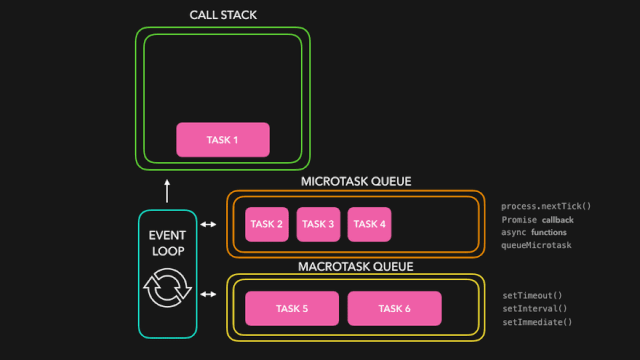

# 总结

1. 常用功能
   - [call和apply](#call和apply)
   - [编码和解码](#编码和解码)
   - [base64转file](#base64转file)
   - [pdf处理](#pdf处理)
   - [canvas](#canvas)
   - [异步](#异步)
2. 常用错误


## 常用功能


### call和apply

情形：

我们知道，`Array.prototype.slice.call(arguments)` 能将具有 length 属性的对象转成数组，除了 IE 下的节点集合（因为ie下的dom对象是以com对象的形式实现的，js对象与com对象不能进行转换）。如：

```js
var a = { length: 2, 0: 'first', 1: 'second' };
Array.prototype.slice.call(a); // ["first", "second"]
  
var a = { length: 2 };
Array.prototype.slice.call(a); // [undefined, undefined]
```

分析：

首先，slice有两个用法，一个是`String.slice`，一个是`Array.slice`，第一个返回的是字符串，第二个返回的是数组，这里我们看第2个。

```js
Array.prototype.slice.call(arguments) 
// 能够将arguments转成数组，那么就是arguments.toArray().slice();
// 到这里，是不是就可以说Array.prototype.slice.call(arguments)的过程就是先将传入进来的第一个参数转为数组，再调用slice？
```

再看call的用法，如下例子

```js
var a = function(){
  console.log(this);  // 'littledu'
  console.log(typeof this);  //  Object
  console.log(this instanceof String);  // true
}
a.call('littledu');
```

可以看出，call了后，就把当前函数推入所传参数的作用域中去了，不知道这样说对不对，但反正this就指向了所传进去的对象。

到这里，基本就差不多了，我们可以大胆猜一下slice的内部实现，如下

```js
Array.prototype.slice = function(start, end) {
  var result = new Array();
  start = start || 0;
  end = end || this.length; //this指向调用的对象，当用了call后，能够改变this的指向，也就是指向传进来的对象，这是关键
  for(var i = start; i < end; i++){
    result.push(this[i]);
  }
  return result;
}
```

最后，附个转成数组的通用函数

```js
var toArray = function(s){
  try{
    return Array.prototype.slice.call(s);
  } catch(e){
    var arr = [];
    for(var i = 0,len = s.length; i < len; i++){
      //arr.push(s[i]);
      arr[i] = s[i];  //据说这样比push快
    }
    return arr;
  }
}
```

call 和 apply 都是为了改变某个函数运行时的 context 即上下文而存在的，换句话说，就是为了改变函数体内部 this 的指向。因为 JavaScript 的函数存在 `定义时上下文` 和 `运行时上下文` 以及 `上下文是可以改变的` 这样的概念。

二者的作用完全一样，只是接受参数的方式不太一样。例如，有一个函数 func1 定义如下：

```js
var func1 = function(arg1, arg2) {};
```

就可以通过 `func1.call(this, arg1, arg2);` 或者 `func1.apply(this, [arg1, arg2]);` 来调用。其中 this 是你想指定的上下文，他可以任何一个 JavaScript 对象（JavaScript 中一切皆对象），call 需要把参数按顺序传递进去，而 apply 则是把参数放在数组里。

JavaScript 中，某个函数的参数数量是不固定的，因此要说适用条件的话，当你的参数是明确知道数量时，用 call；而不确定的时候，用 apply，然后把参数 push 进数组传递进去。当参数数量不确定时，函数内部也可以通过 arguments 这个数组来遍历所有的参数。

要先明白存在call和apply的原因，才能记得牢一点：

在javascript OOP中，我们经常会这样定义：

```js
function cat(){
}
cat.prototype={
  food:"fish",
  say: function(){
    alert("I love "+this.food);
  }
}
var blackCat = new cat;
blackCat.say();
```

但是如果我们有一个对象`whiteDog = {food:"bone"}`，我们不想对它重新定义 say 方法，那么我们可以通过 call 或 apply 用 blackCat 的 say 方法：`blackCat.say.call(whiteDog);`

所以，可以看出call和apply是为了动态改变 `this` 而出现的，当一个object没有某个方法，但是其他的有，我们可以借助call或apply用其它对象的方法来操作。

用的比较多的，通过 `document.getElementsByTagName` 选择的 dom 节点是一种类似 array 的 array。它不能应用 Array 下的 `push`, `pop` 等方法。我们可以通过：

```js
var domNodes = Array.prototype.slice.call(document.getElementsByTagName("*"));

```

这样domNodes就可以应用Array下的所有方法了。

如果没有提供 thisObj 参数，那么 Global 对象被用作 thisObj

Global: 全局属性和函数可用于所有内建的 JavaScript 对象。

你需要明白 IIFE 的原理，我简单说一下：

```js
// 这是定义，Declaration；定义只是让解释器知道其存在，但是不会运行。
function foo() {...}
// 这是语句，Statement；解释器遇到语句是会运行它的。
foo();
```

IIFE 并非必须，那么为什么要 IIFE？

1. 传统的方法啰嗦，定义和执行分开写；
2. 传统的方法直接污染全局命名空间（浏览器里的 global 对象，如 window）

于是，开发者们想找一个可以解决以上问题的写法。那么像下面这么写行不行呢？

```js
function foo(...){}();
```

当然是不能，但是为什么呢？因为 `function foo(...){}` 这个部分只是一个声明，对于解释器来说，就好像你写了一个字符串 "function foo(...){}"，它需要使用解析函数，比如 eval() 来执行它才可以。所以把 () 直接放在声明后面是不会执行，这是错误的语法。

如何把它变得正确？说起来也简单，只要把 `声明` 变成 `表达式(Expression)` 就可以了。

实际上转变表达式的办法还是很多的，最常见的办法是把函数声明用一对 () 包裹起来，于是就变成了：

```js
(function foo() {...})();
```

这就等价于：

```js
var foo = function () {...}; // 这就不是定义，而是表达式了。
foo();
```

但是之前我们说不行的那个写法，其实也可以直接用括号包起来，这也是一种等价的表达式：

```js
(function foo(){...}());
```

所以你问有没有区别？很简单：木有～另外，刚才说过转变表达式的方式很多，的确还有很多别的写法，比如：

```js
!function foo() {...}();
```

或者

```js
+function foo() {...}();
```

这些都可以。我个人挺偏爱用 void 来转变表达式，因为此关键字不会有返回值。不过这一点真的没有什么要紧的……

```js
void function () {
  // 这里是真正需要的代码
}();
```

OK，所谓不去污染全局命名空间，是因为 IIFE 创建了一个新的`函数作用域`，你真正的业务代码被封装在其中，自然就不会触碰到全局对象了。如果你需要全局对象，那就 pass 给 IIFE：

```js
void function (global) {
  // 在这里，global 就是全局对象了
}(this) // 在浏览器里，this 就是 window 对象
```


### 编码和解码

encodeURI、encodeURIComponent、decodeURI、decodeURIComponent

1、用来编码和解码URI的

统一资源标识符，或叫做 URI，是用来标识互联网上的资源（例如，网页或文件）和怎样访问这些资源的传输协议（例如，HTTP 或 FTP）的字符串。除了encodeURI、encodeURIComponent、decodeURI、decodeURIComponent四个用来编码和解码 URI 的函数之外 ECMAScript 语言自身不提供任何使用 URL 的支持。

2、URI组成形式

一个 URI 是由组件分隔符分割的组件序列组成。其一般形式是：

Scheme : First / Second ; Third ? Fourth

其中的名字代表组件；":"  "/"  ";"  "?" 是当作分隔符的保留字符。

3、有何不同？

encodeURI 和 decodeURI 函数操作的是完整的 URI；这俩函数假定 URI 中的任何保留字符都有特殊意义，所有不会编码它们。

encodeURIComponent 和 decodeURIComponent 函数操作的是组成 URI 的个别组件；这俩函数假定任何保留字符都代表普通文本，所以必须编码它们，所以它们（保留字符）出现在一个完整 URI 的组件里面时不会被解释成保留字符了。

4、四个函数的不同：

一个URI可能包含以下5种类型的字符

1) 保留字符： ;/?:@&=+$,
2) 非转义字符：字母、数字、URI标记符 [-_.!~*'()]
3) '#'
4) 其它：
5) 被转义字符：16进制字符，"%xx"

encodeURI: 4)

encodeURIComponent: 1), 3), 4)

### content="IE=edge,chrome=1"详解

`<meta http-equiv = "X-UA-Compatible" content = "IE=edge,chrome=1" />`

这个是IE8的专用标记，用来指定IE8浏览器去模拟某个特定版本的IE浏览器的渲染方式(比如人见人烦的IE6)，以此来解决部分兼容问题，例如模拟IE7的具体方式如下：

`<meta http-equiv = "X-UA-Compatible" content = "IE=EmulateIE7" />`

但令我好奇的是，此处这个标记后面竟然出现了chrome这样的值，难道IE也可以模拟chrome了？

迅速搜索了一下，才明白原来不是微软增强了IE，而是谷歌做了个外挂：Google Chrome Frame(谷歌内嵌浏览器框架GCF)。这个插件可以让用户的IE浏览器外不变，但用户在浏览网页时，实际上使用的是Google Chrome浏览器内核，而且支持IE6、7、8等多个版本的IE浏览器，谷歌这个墙角挖的真给力！

而上文提到的那个meta标记，则是在是安装了GCF后，用来指定页面使用chrome内核来渲染。

GCF下载地址：`http://code.google.com/intl/zh-CN/chrome/chromeframe/`

安装完成后，如果你想对某个页面使用GCF进行渲染，只需要在该页面的地址前加上 gcf： 即可，例如：`gcf:http://cooleep.com`

但是如果想要在开发时指定页面默认首先使用GCF进行渲染，如果未安装GCF再使用IE内核进行渲染，该如何进行呢？

就是使用这个标记。

标记用法：

阅读了下chrome的开发文档(`http://www.chromium.org/developers/how-tos/chrome-frame-getting-started`，需翻墙)，下面来简单讲解一下这个标记的语法。

1.最基本的用法：在页面的头部加入

`<meta http-equiv = "X-UA-Compatible" content = "chrome=1">`

用以声明当前页面用chrome内核来渲染。

复杂一些的就是本文一开始看到的那中用法：

`<meta http-equiv = "X-UA-Compatible" content = "IE=edge,chrome=1" />`

这样写可以达到的效果是如果安装了GCF，则使用GCF来渲染页面，如果为安装GCF，则使用最高版本的IE内核进行渲染。

2.通过修改HTTP头文件的方法来实现让指定的页面使用GCF内核进行渲染：

在HTTP的头文件中加入以下信息：X-UA-Compatible: chrome=1

在Apache服务器中，确保 mod_headers 和 mod_setenvif文件可用，然后在httpd.conf中加入以下配置信息：

```conf
<IfModule mod_setenvif.c>
<IfModule mod_headers.c>

BrowserMatch chromeframe gcf
Header append X-UA-Compatible "chrome=1" env=gcf
```

在IIS7或者更高版本的服务器中，只需要修改web.config文件，添加如下信息即可即可:

```config
<configuration>
  <system.webServer>
    <httpProtocol>
      <customHeaders>
        <add name = "X-UA-Compatible" value = "chrome=1" />
      </customHeaders>
    </httpProtocol>
  </system.webServer>
</configuration>
```

### 中文乱码问题

归纳以下几点：

1. html文件是有编码格式的，这个在特定的编辑器中才能看出来，并进行设置。
2. html文件中头部的"content-type"中设置的"charset"是告诉浏览器打开该文件的编码方式。
3. 一般1、2点中的编码方式应该一致，不一致可能出现乱码。
4. 如果浏览器中显示乱码，但是页面源文件不是乱码，可以通过修改浏览器的编码方式看到正确的中文，如果在源文件中设置了正确的"charset"，就不需要修改浏览器的编码方式了。

### 对象获取

**[object Object]怎么获取？**

```js
var temp = "";
for(var i in obj) { //用javascript的for/in循环遍历对象的属性
  if(i.indexOf("Repeater1")>=0) {
    temp+=i+":"+obj[i]+"\n";
  }
}
alert(temp);
```

js中想根据动态key得到某对象中相对应的value的方法有二：
一、var key = "name1";var value = obj[key];
二、var key = "name1";var value = eval("obj."+key);

### 节点的兄弟，父级，子级元素

先说一下JS的获取方法，其要比JQUERY的方法麻烦很多，后面以JQUERY的方法作对比。

JS的方法会比JQUERY麻烦很多，主要则是因为FF浏览器，FF浏览器会把你的换行也当最DOM元素

```html
<div id="test">
  <div></div>
  <div></div>
</div>
```

原生的JS获取ID为test的元素下的子元素。可以用：

```js
var a = docuemnt.getElementById("test").getElementsByTagName("div"); // 这样是没有问题的
```

此时a.length=2；

但是如果我们换另一种方法

```js
var b = document.getElementById("test").childNodes;  
```

此时b.length 在IE浏览器中没问题，其依旧等于2，但是在FF浏览器中则会使4，是因为FF把换行也当做一个元素了。所以，在此，我们就要做处理了，需遍历这些元素，把元素类型为空格而且是文本都删除。

```js
function del_ff(elem) {
  var elem_child = elem.childNodes;
  for(var i=0; i<elem_child.length; i++) {
    if(elem_child[i].nodeName == "#text" && !/\s/.test(elem_child.nodeValue)){
      elem.removeChild(elem_child)
    }
  }
}
```

上述函数遍历子元素，当元素里面有节点类型是文本并且文本类型节点的节点值是空的。就把他删除。

nodeNames可以得到一个节点的节点类型，/\s/是非空字符在JS里的正则表达式。前面加！,则表示是空字符

test() 方法用于检测一个字符串是否匹配某个模式.语法是：RegExpObject.test(string)

如果字符串 string 中含有与 RegExpObject 匹配的文本，则返回 true，否则返回 false。

nodeValue表示得到这个节点里的值。

removeChild则是删除元素的子元素。

之后，在调用子，父，兄，这些属性之前，调用上面的函数把空格清理一下就可以了

```html
<div id="test">
  <div></div>
  <div></div>
</div>
<script>
  function dom() {
    var s= document.getElementById("test");
    del_ff(s); // 清理空格
    var chils= s.childNodes; // 得到s的全部子节点
    var par=s.parentNode; // 得到s的父节点
    var ns=s.nextSbiling; // 获得s的下一个兄弟节点
    var ps=s.previousSbiling; // 得到s的上一个兄弟节点
    var fc=s.firstChild; // 获得s的第一个子节点
    var lc=s.lastChile; // 获得s的最后一个子节点
  }
</script>
```

下面介绍JQUERY的父，子，兄弟节点查找方法

- jQuery.parent(expr)  找父亲节点，可以传入expr进行过滤，比如$("span").parent()或者$("span").parent(".class")
- jQuery.parents(expr),类似于jQuery.parent(expr),但是是查找所有祖先元素，不限于父元素
- jQuery.children(expr).返回所有子节点，这个方法只会返回直接的孩子节点，不会返回所有的子孙节点
- jQuery.contents(),返回下面的所有内容，包括节点和文本。这个方法和children()的区别就在于，包括空白文本，也会被作为一个jQuery对象返回，children()则只会返回节点
- jQuery.prev()，返回上一个兄弟节点，不是所有的兄弟节点
- jQuery.prevAll()，返回所有之前的兄弟节点
- jQuery.next(),返回下一个兄弟节点，不是所有的兄弟节点
- jQuery.nextAll()，返回所有之后的兄弟节点
- jQuery.siblings(),返回兄弟姐妹节点，不分前后
- jQuery.find(expr),跟jQuery.filter(expr)完全不一样。jQuery.filter()是从初始的jQuery对象集合中筛选出一部分，而jQuery.find()的返回结果，不会有初始集合中的内容，比如$("p"),find("span"),是从<p>元素开始找<span>,等同于$("p span")

```html
<noscript>
  <iframe src="*.htm"></iframe>
</noscript>
```

前面应该还有一段js代码。noscript元素用来定义在脚本未被执行时的替代内容（文本）。此标签可被用于可识别`<script>`标签但无法支持其中的脚本的浏览器。此段代码意思为如果浏览器不支持script的代码，则会显示嵌入的那个页面的内容。

### opener、parent、top

opener即谁打开我的，比如A页面利用window.open弹出了B页面窗口，那么A页面所在窗口就是B页面的opener，在B页面通过opener对象可以访问A页面。

parent表示父窗口，比如一个A页面利用iframe或frame调用B页面，那么A页面所在窗口就是B页面的parent。

top是parent的特殊情况，表示顶层窗口。

在JS 中，window.opener只是对弹出窗口的母窗口的一个引用。比如：a.html中，通过点击按钮等方式window.open出一个新的窗口 b.html。那么在b.html中，就可以通过window.opener（省略写为opener）来引用a.html，包括a.html的 document等对象，操作a.html的内容。

假如这个引用失败，那么将返回null。所以在调用opener的对象前，要先判断对象是否为null，否则会出现“对象为空或者不存在”的JS错误。

### table设置问题

设置table的Width

设置td的Width

如果用百分比，td的宽度有时候会有问题，用绝对值，显示就正常了，当然，先满足table宽度，再根据td宽度值按比例分配

table边框问题，一般在设置边框宽度时光增加border=1显示出来的边界并不是我们希望的那样，因为在各个边框之间还存在着间距，可以如下设置

```html
<table cellpadding="0" cellspacing="0" border=1>
```

### table固定宽度

table-layout:fixed 属性的解说

如果想要一个table固定大小，里面的文字强制换行(尤其是在一长串英文文本，并且中间无空格分隔的情况下)，以达到使过长的文字不撑破表格的目的，一般是使用样式：table-layout:fixed。但是在Firefox下面，会有一些问题，参考 Gmail的一些做法，做了几个测试，得出一种解决办法。

例1：(IE浏览器)普通的情况，CODE:

```html
<table border=1 width=80>
  <tr>
    <td>abcdefghigklmnopqrstuvwxyz 1234567890</td>
  </tr>
</table>
```

效果：可以看到width=80并没有起作用，表格被字符撑开了。

例2：(IE浏览器)使用样式 `table-layout:fixed`，CODE:

```html
<style>
  .tbl {
    table-layout:fixed
  }
</style>
<table class=tbl border=1 width=80>
  <tr>
    <td>abcdefghigklmnopqrstuvwxyz 1234567890</td>
  </tr>
</table>
```

效果：width=80起作用了，但是表格换行了。

例3：(IE浏览器)使用样式table-layout:fixed与nowrap，CODE:

```html
<style>
  .tbl {
    table-layout:fixed
  }
</style>
<table class=tbl border=1 width=80>
  <tr>
    <td nowrap>abcdefghigklmnopqrstuvwxyz 1234567890</td>
  </tr>
</table>
```

效果：width=80起作用了，换行也被干掉了。

例4：(IE浏览器)在使用数值固定td大小情况下使用样式table-layout:fixed与nowrap，CODE:

```html
<style>
  .tbl {
    table-layout:fixed
  }
</style>
<table class=tbl border=1 width=80>
  <tr>
    <td width=20 nowrap>abcdefghigklmnopqrstuvwxyz 1234567890</td>
    <td nowrap>abcdefghigklmnopqrstuvwxyz 1234567890</td>
  </tr>
</table>
```

效果：不幸发生了，第一个td的nowrap不起作用了

例5：(IE浏览器)在使用百分比固定td大小情况下使用样式table-layout:fixed与nowrap，CODE:

```html
<style>
  .tbl {
    table-layout:fixed
  }
</style>
<table class=tbl border=1 width=80>
  <tr>
    <td width=25% nowrap>abcdefghigklmnopqrstuvwxyz 1234567890</td>
    <td nowrap>abcdefghigklmnopqrstuvwxyz 1234567890</td>
  </tr>
</table>
```

效果：改成百分比，终于搞定了

例6：(Firefox浏览器)在使用百分比固定td大小情况下使用样式table-layout:fixed与nowrap 效果：把例5放到firefox下面，又ft了

例7：(Firefox浏览器)在使用百分比固定td大小情况下使用样式table-layout:fixed与nowrap,并且使用div，CODE:

```html
<style>
  .tbl {
    table-layout:fixed
  }
  .td {
    overflow:hidden;
  }
</style>
<table class=tbl border=1 width=80>
  <tr>
    <td width=25% class=td nowrap>
      <div>abcdefghigklmnopqrstuvwxyz 1234567890</div>
    </td>
    <td class=td nowrap>
      <div>abcdefghigklmnopqrstuvwxyz 1234567890</div>
    </td>
  </tr>
</table>
```

效果：天下终于太平了

例8：(Firefox浏览器)在使用数值固定td大小情况下使用样式table-layout:fixed与nowrap,并且使用div，CODE:

```html
<style>
  .tbl {
    table-layout:fixed
  }
  .td {
    overflow:hidden;
  }
</style>
<table class=tbl border=1 width=80>
  <tr>
    <td width=20 class=td nowrap>
      <div>abcdefghigklmnopqrstuvwxyz 1234567890</div>
    </td>
    <td class=td nowrap>
      <div>abcdefghigklmnopqrstuvwxyz 1234567890</div>
    </td>
  </tr>
</table>
```

效果： nowrap又不起作用了

但是使用它在不同浏览器中又会出现问题，显示效果整齐了，确显示内容被覆盖了，这又怎样解决呢，我又开始了搜索，可以强制换行，却又导致有的单词被分家了连不起来，后来有在表单格式中加了一句word-wrap:break-word，详细内容如下：word-wrap是控制换行的。

使用break-word时，是将强制换行。中文没有任何问题，英文语句也没问题。但是对于长串的英文，就不起作用。break-word是控制是否断词的。normal是默认情况，英文单词不被拆开。break-all，是断开单词。在单词到边界时，下个字母自动到下一行。主要解决了长串英文的问题。keep-all，是指Chinese, Japanese, and Korean不断词。即只用此时，不用word-wrap，中文就不会换行了。（英文语句正常。）

ie下：使用word-wrap:break-word;所有的都正常。

ff下：如这2个都不用的话，中文不会出任何问题。英文语句也不会出问题。但是，长串英文会出问题。

为了解决长串英文，一般用word-wrap:break-word;word-break:break-all;。但是，此方式会导致普通的英文语句中的单词会被断开（ie下也是）。

目前主要的问题存在于长串英文和英文单词被断开。其实长串英文就是一个比较长的单词而已。

即英文单词应不应该被断开那？那问题很明显了，显然不应该被断开了。

对于长串英文，就是恶意的东西，自然不用去管了。但是，也要想些办法，不让它把容器撑大。

用：overflow:auto; ie下，长串会自动折行。ff下，长串会被遮盖。

所以，综上，最好的方式是word-wrap:break-word;overflow:hidden;而不是word-wrap:break-word;word-break:break-all;。

word-wrap:break-word;overflow:auto;在ie下没有任何问题。在ff下，长串会被遮住部分内容。加这句话   style="word-wrap:break-word;table-layout: fixed;"，上面的问题就解决了。希望对大家有意!!!!!

table-layout  版本：CSS2　兼容性：IE5+　继承性：无

语法：table-layout : auto | fixed

取值：

- auto: 默认值。默认的自动算法。布局将基于各单元格的内容。表格在每一单元格内所有内容读取计算之后才会显示出来
- fixed: 固定布局的算法。在这种算法中，表格和列的宽度取决于 col 对象的宽度总和，假如没有指定，则会取决于第一行每个单元格的宽度。假如表格没有指定宽度( width )属性，则表格被呈递的默认宽度为 100% 。

说明：

设置或检索表格的布局算法。

你可以通过此属性改善表格呈递性能。此属性导致IE以一次一行的方式呈递表格内容从而提供给信息用户更快的速度。此属性依据此下顺序使用其中一种方式布置表格栏宽度：

使用 col 或 colGroup 对象的宽度( width )属性信息。

使用表格第一行内的单元格的宽度( width )信息。

依据表格列数等分表格宽度。而不考虑表格内容的实际宽度。

假如单元格的内容超过了列宽度，内容将会被换行。假如无法换行，则内容会被裁切。假如此属性被设置为 fixed ，则 overflow 能够被用于控制处理溢出单元格( td )宽度的内容。假如表格行高度被指定了，那么换行的内容如果超出了指定表格行高度也会在纵向上被裁切。

设置此属性值为 fixed ，有助于提高表格性能。对于长表格效果尤其显著。

设置表格行高可以进一步提高呈递速度，浏览器不需要检测行内每一个单元格内容去确定行高就可以开始解析以及呈递。

此属性对于 currentStyle 对象而言是只读的。对于其他对象而言是可读写的。

对应的脚本特性为 tableLayout。

```html
<!--固定表格的宽度，超出部分用...代替-->
<style>
table {
  font-size:small;
  text-align:left;
  table-layout:fixed;
  margin: 0px;
  border-style: solid;
  border-color:Black;
  border-collapse: collapse;
  border-spacing: 0px;
}
td {
  border:solid 1pxblack;
  overflow:hidden;
  white-space:nowrap;
  text-overflow:ellipsis;
}
</style>
<colgroup>
  <colwidth="65px"/>
  <colwidth="141px"/>
  <colwidth="60px"/>
  <colwidth="101px"/>
  <colwidth="52px"/>
  <colwidth="70px"/>
  <colwidth="59px"/>
  <colwidth="56px"/>
  <colwidth="56px"/>
  <colwidth="56px"/>
  <colwidth="56px"/>
  <colwidth="56px"/>
  <colwidth="56px"/>
  <colwidth="56px"/>
  <colwidth="42px"/>
  <colwidth="60px"/>
  <colwidth="50px"/>
  <colwidth="40px"/>
  <colwidth="20px"/>
  <colwidth="20px"/>
  <colwidth="20px"/>
</colgroup>
```

### 隐藏显示div

```html
<!DOCTYPE HTML PUBLIC "-//W3C//DTD HTML 4.0 Transitional//EN">
<html>
<head>
    <title>Test</title>
    <script type="text/javascript">
        function selectCond(id) {
            if (id == "" || id == null) {
                if (document.all['tab'].style.display == "") {
                    document.all['tab'].style.display = "none";
                    return;
                }
                document.all['tab'].style.display = "";
            } else {
                if (document.all['tab' + id].style.display == "") {
                    document.all['tab' + id].style.display = "none";
                    return;
                }
                document.all['tab' + id].style.display = "";
            }
        }
    </script>
</head>
<body>
    <fieldset>
        <legend>
            <span onclick="selectCond();">
                <span>请点击</span>
            </span>
        </legend>
        <div id="tab" style="display: none">
            这就是隐藏的内容！o(∩_∩)o 哈哈
        </div>
    </fieldset>
</body>
</html>
```

### 让div自动适应内容的高度

我们看下面的代码：

```html
<div id="main">
  <div id="content"></div>
</div>
```

当Content内容多时，即使main设置了高度100%或auto。在不同浏览器下还是不能完好的自动伸展。内容的高度比较高了，但容器main的高度还是不能撑开。

我们可以通过三种方法 来解决这个问题。

1.增加一个清除浮动，让父容器知道高度。请注意，清除浮动的容器中有一个空格。

```html
<div id="main">
  <div id="content"></div>
  <div style="font:0px/0px sans-serif;clear:both;display:block">空格</div>
</div>
```

2.增加一个容器，在代码中存在，但在视觉中不可见。

```html
<div id="main">
  <div id="content"></div>
  <div style="height:1px;margin-top:-1px;clear:both;overflow:hidden;"></div>
</div>
```

3.增加一个BR并设置样式为clear:both。

```html
<div id="main">
  <div id="content"></div>
  <br style="clear:both;"/>
</div>
```


### base64转file

```js
// 1. 将base64转换为文件（IOS不兼容）
dataURLtoFile: function(dataurl, filename) { 
  var arr = dataurl.split(','),
	    mime = arr[0].match(/:(.*?);/)[1],
	    bstr = atob(arr[1]),
	    n = bstr.length,
	    u8arr = new Uint8Array(n);
  while (n--) {
	  u8arr[n] = bstr.charCodeAt(n);
	}
	return new File([u8arr], filename, { type: mime });
},
// 调用
var file = dataURLtoFile(base64Data, imgName);

// 2. 先将base64转换成blob，再将blob转换成file文件（此方法基本都兼容）
// 将base64转换为blob
dataURLtoBlob: function(dataurl) { 
  var arr = dataurl.split(','),
      mime = arr[0].match(/:(.*?);/)[1],
      bstr = atob(arr[1]),
      n = bstr.length,
      u8arr = new Uint8Array(n);
  while (n--) {
    u8arr[n] = bstr.charCodeAt(n);
  }
  return new Blob([u8arr], { type: mime });
},
// 将blob转换为file
blobToFile: function(theBlob, fileName){
  theBlob.lastModifiedDate = new Date();
  theBlob.name = fileName;
  return theBlob;
},
// 调用
var blob = dataURLtoBlob(base64Data);
var file = blobToFile(blob, imgName);
```


### pdf处理

参考：

1. https://github.com/goSunadeod/vue-pdf.js-demo/blob/master/src/components/HelloWorld.vue
2. https://www.cnblogs.com/usebtf/p/10329977.html
3. https://www.jianshu.com/p/df5f9726cbbf
4. https://blog.csdn.net/prey1025/article/details/90029284


### canvas

参考：https://www.cnblogs.com/jarson-7426/p/6231767.html

```js
// 获取canvas容器
var can = document.getElementById('canvas');
// 创建一个画布
var ctx = can.getContext('2d');

// 绘制圆形
// 参数解释：x,y-圆心；start-起始角度；end-结束角度；color-绘制颜色；type-绘制类型（'fill'和'stroke'）。
var draw = function(x, y, r, start, end, color, type) {
    var unit = Math.PI / 180;
    ctx.beginPath();
    ctx.arc(x, y, r, start * unit, end * unit);
    ctx[type + 'Style'] = color;
    ctx.closePath();
    ctx[type]();
}

// 绘制三角形
// 参数解释：x1(2、3),y1(2、3)-三角形的三个点的坐标；color-绘制颜色；type-绘制类型（'fill'和'stroke'）。
var draw = function(x1, y1, x2, y2, x3, y3, color, type) {
    ctx.beginPath();
    ctx.moveTo(x1, y1);
    ctx.lineTo(x2, y2);
    ctx.lineTo(x3, y3);
    ctx[type + 'Style'] = color;
    ctx.closePath();
    ctx[type]();
}

// 绘制（圆角）矩形
// 参数解释：x,y-左上角点的坐标；width、height-宽高；radius-圆角；color-绘制颜色；type-绘制类型（'fill'和'stroke'）。
var draw = function(x, y, width, height, radius, color, type){
    ctx.beginPath();
    ctx.moveTo(x, y+radius);
    ctx.lineTo(x, y+height-radius);
    ctx.quadraticCurveTo(x, y+height, x+radius, y+height);
    ctx.lineTo(x+width-radius, y+height);
    ctx.quadraticCurveTo(x+width, y+height, x+width, y+height-radius);
    ctx.lineTo(x+width, y+radius);
    ctx.quadraticCurveTo(x+width, y, x+width-radius, y);
    ctx.lineTo(x+radius, y);
    ctx.quadraticCurveTo(x, y, x, y+radius);
    ctx[type + 'Style'] = color || params.color;
    ctx.closePath();
    ctx[type]();
}

/**
 * 绘制多边形
 * 参数说明：
 *   ctx: canvas画布
 *   conf: 配置项，提供以下一些配置
 *   x： 中心点横坐标
 *   y： 中心点纵坐标
 *   num: 多边形的边数
 *   r：多边形的半径长度
 *   width：多边形线的宽度
 *   strokeStyle：边线的颜色
 *   fillStyle：填充的颜色
 */
var drawPolygon = function(ctx, conf){
    var x = conf && conf.x || 0;  //中心点x坐标
    var y = conf && conf.y || 0;  //中心点y坐标
    var num = conf && conf.num || 3;   //图形边的个数
    var r = conf && conf.r || 100;   //图形的半径
    var width = conf && conf.width || 5;
    var strokeStyle = conf && conf.strokeStyle;
    var fillStyle = conf && conf.fillStyle;
    //开始路径
    ctx.beginPath();
    var startX = x + r * Math.cos(2*Math.PI*0/num);
    var startY = y + r * Math.sin(2*Math.PI*0/num);
    ctx.moveTo(startX, startY);
    for(var i = 1; i <= num; i++) {
        var newX = x + r * Math.cos(2*Math.PI*i/num);
        var newY = y + r * Math.sin(2*Math.PI*i/num);
        ctx.lineTo(newX, newY);
    }
    ctx.closePath();
    //路径闭合
    if(strokeStyle) {
        ctx.strokeStyle = strokeStyle;
        ctx.lineWidth = width;
        ctx.lineJoin = 'round';
        ctx.stroke();
    }
    if(fillStyle) {
        ctx.fillStyle = fillStyle;
        ctx.fill();
    }
}

// 图1的代码：
drawPolygon(ctx, {
    num: 6,
    r: 100,
    strokeStyle: 'blue',
    fillStyle: '#9da'
})
// 图2的代码：
drawPolygon(ctx, {
    num: 4,
    r: 150,
    strokeStyle: 'red',
    width: 4
})
// 图3的代码：
drawPolygon(ctx, {
    x: 800,
    y: 250,
    num: 10,
    fillStyle: '#000'
})
```

使用canvas绘制图形就是那几个函数：`beginPath`、`arc`、`moveTo`、`lineTo`、`closePath`、`fill`、`stroke`。当我们能够熟练掌握并运用自如的时候，就能够独当一面了。


### 异步

参考：https://blog.csdn.net/qq_36174666/article/details/106353457?utm_medium=distribute.pc_relevant.none-task-blog-BlogCommendFromMachineLearnPai2-1.channel_param&depth_1-utm_source=distribute.pc_relevant.none-task-blog-BlogCommendFromMachineLearnPai2-1.channel_param

JavaScript是单线程执行的，无法同时执行多段代码。当某一段代码正在执行的时候，所有后续的任务都必须等待，形成一个队列。一旦当前任务执行完毕，再从队列中取出下一个任务，这也常被称为 “阻塞式执行”。

所以一次鼠标点击，或是计时器到达时间点，或是Ajax请求完成触发了回调函数，这些事件处理程序或回调函数都不会立即运行，而是立即排队，一旦线程有空闲就执行。

假如当前 JavaScript 线程正在执行一段很耗时的代码，此时发生了一次鼠标点击，那么事件处理程序就被阻塞，用户也无法立即看到反馈，事件处理程序会被放入任务队列，直到前面的代码结束以后才会开始执行。

如果代码中设定了一个 setTimeout，那么浏览器便会在合适的时间，将代码插入任务队列，如果这个时间设为 0，就代表立即插入队列，但不是立即执行，仍然要等待前面代码执行完毕。所以 setTimeout 并不能保证执行的时间，是否及时执行取决于 JavaScript 线程是拥挤还是空闲。

#### 1. 回调函数

```js
function f1 (callback) {
  console.log('f1');
  setTimeout(function () {
    // f1的任务代码
    callback();
  }, 1000);
}
function f2 () {
  console.log('f2');
}
```

回调函数的优点是简单、容易理解和部署，缺点是不利于代码的阅读和维护，各个部分之间高度耦合(Coupling)，流程会很混乱，而且每个任务只能指定一个回调函数。

**回调地狱**

在书写JavaScript的时候，我经常不得不去处理一些依赖于其它任务的任务！比如说我们想要得到一个图片，对其进行压缩，应用一个滤镜，然后保存它 。

我们最先需要做的事情是得到我们想要编辑的图片。getImage函数可以处理这个问题！一旦图片被成功加载，我们可以传递那个值到一个resizeImage函数。当图片已经被成功地重新调整大小时，我们想要在applyFilter函数中为图片应用一个滤镜。在图片被压缩和添加滤镜后，我们想要保存图片并且让用户知道所有的事情都正确地完成了！

最后，我们可能得到这样的结果:

```js
getImage('./image.png', (image, err) => {
  if (err) throw new Error(err)
  compressImage(image, (compressedImage, err) => {
    if (err) throw new Error(err)
    applyFilter(compressedImage, (filteredImage, err) => {
      if (err) throw new Error(err)
      saveImage(filteredImage, (res, err) => {
        if (err) throw new Error(err)
        console.log("Successfully saved image!")
      })
    })
  })
})
```

尽管它完成了事情，但是完成的并不是很好。我们最终得到了许多嵌套的回调函数，这些回调函数依赖于前一个回调函数。这通常被称为回调地狱，由于我们最终得到了大量嵌套的回调函数，这使我们的代码阅读起来特别困难。

幸运的是，我们有Promise来帮助我们摆脱困境

#### 2. 事件监听

```js
f1.on('done', f2);
function f1 () {
  setTimeout(function () {
    // f1的任务代码
    f1.trigger('done');
  }, 1000);
}
```

任务的执行不取决于代码的顺序，而取决于某个事件是否发生。还是以f1和f2为例。首先，为f1绑定一个事件（这里采用的jQuery的写法）。

`f1.trigger('done')`表示，执行完成后，立即触发done事件，从而开始执行f2。

这种方法的优点是比较容易理解，可以绑定多个事件，每个事件可以指定多个回调函数，而且可以“去耦合”(Decoupling)，有利于实现模块化。缺点是整个程序都要变成事件驱动型，运行流程会变得很不清晰。

#### 3. 发布/订阅

```js
jQuery.subscribe("done", f2);
function f1 () {
  setTimeout(function () {
    // f1的任务代码
    jQuery.publish("done");
  }, 1000);
}
jQuery.unsubscribe("done", f2); // f2完成后可以取消订阅
```

上一节的“事件”，完全可以理解成“信号”。

我们假定，存在一个“信号中心”，某个任务执行完成，就向信号中心“发布”(publish)一个信号，其他任务可以向信号中心“订阅”(subscribe)这个信号，从而知道什么时候自己可以开始执行。这就叫做“发布/订阅模式”(publish-subscribe pattern），又称“观察者模式”(observer pattern)。

这个模式有多种实现，下面采用的是Ben Alman的Tiny Pub/Sub，这是jQuery的一个插件。

首先，f2向“信号中心”jQuery订阅"done"信号。

然后，改写f1，`jQuery.publish("done")` 的意思是，f1执行完成后，向“信号中心”jQuery发布 "done" 信号，从而引发f2的执行。

此外，f2完成执行后，也可以取消订阅(unsubscribe)。

这种方法的性质与“事件监听”类似，但是明显优于后者。因为我们可以通过查看“消息中心”，了解存在多少信号、每个信号有多少订阅者，从而监控程序的运行。

#### 4. Promises对象

```js
function f1 () {
  var dfd = $.Deferred();
  setTimeout(function () {
    // f1的任务代码
    dfd.resolve();
  }, 500);
  return dfd.promise;
}
f1().then(f2);
f1().then(f2).then(f3); // 指定多个回调函数
f1().then(f2).fail(f3); // 指定发生错误时的回调函数
```

Promises对象是CommonJS工作组提出的一种规范，目的是为异步编程提供统一接口。简单说，它的思想是，每一个异步任务返回一个Promise对象，该对象有一个then方法，允许指定回调函数。

f1要进行改写（这里使用的是jQuery的实现）。这样写的优点在于，回调函数变成了链式写法，程序的流程可以看得很清楚，而且有一整套的配套方法，可以实现许多强大的功能。而且，它还有一个前面三种方法都没有的好处：如果一个任务已经完成，再添加回调函数，该回调函数会立即执行。所以，你不用担心是否错过了某个事件或信号。这种方法的缺点就是编写和理解，都相对比较难。

Promise是一个对象，它包含一个状态[[PromiseStatus]]和一个值[[PromiseValue]]。你永远不会与这个对象进行交互，你甚至不能访问[[PromiseStatus]]和[[PromiseValue]]这俩个属性！但是在使用Promise的时候，这两个属性值是非常重要的。

**PromiseStatus**

PromiseStatus的值，也就是Promise的状态，可以是以下三个值之一：

- ✅ fulfilled: promise已经被resolved。一切都很好，在promise内部没有错误发生。
- ❌rejected: promise已经被rejected。哎呦，某些事情出错了。
- ⏳pending: promise暂时还没有被解决也没有被拒绝，仍然处于pending状态

但是什么时候promise的状态是pending、fulfilled或rejected呢? 为什么这个状态很重要呢？

Promise构造器的回调函数接受两个参数，第一个参数的值经常被叫做resolve或res,它是一个函数， 在Promise应该解决(resolve)的时候会被调用。第二个参数的值经常被叫做reject或rej,它也是一个函数，在Promise出现一些错误应该被拒绝(reject)的时候被调用。

```js
new Promise((res, rej) => res("Yay!"))
new Promise((res, rej) => rej("Aww no!"))
```

> chrome Promise resolved的状态不是fulfilled，而是 resolved(上图是chrome下的截图)，实际上这是Chrome的一个bug,目前已经在Canary中修复了

**PromiseValue**

promise的值，即[[PromiseValue]]的值，是我们作为参数传递给resolve或reject方法的值

现在我们知道如何更好控制Promise对象。但是他被用来做什么呢？

我们用Promise重写上面的图片示例

```js
function getImage(file) {
  return new Promise((res, rej) => {
    try {
      const data = readFile(file)
      res(data) // 如果图片加载完成且一切正常，用加载完的图片解决(resolve)promise
    } catch(err) {
      rej(new Error(err)) // 果在加载文件时某个地方有一个错误，我们将会用发生的错误拒绝(reject)promise
    }
  })
}

getImage(file)
  .then(image => console.log(image))
  .then(compressedImage => applyFilter(compressedImage)) // 添加滤镜
  .then(filteredImage => saveImage(filteredImage))// 保存图片
  .catch(error => console.log(error))
  .finally(() => console.log("All done!"))
```

对于一个promise, 我们可以使用它上面的3个方法：

- .then(): 在一个promise被resolved后调用
- .catch(): 在一个promise被rejected后被调用
- .finally(): 不论promise是被resolved还是reject总是调用

**事件循环**

JavaScript是单线程(single-threaded): 同时只能做一个任务，在任务期间，任何其它事情发生都默认运行在浏览器的主线程上。幸运的是，浏览器给我们一些JavaScript引擎它自己没有提供的特性：WeB API。它包括DOM API、setTimeout、HTTP请求等内容。这能帮助我们创建一些异步、非阻塞的行为。

当我们调用一个函数的时候，它会被添加到一个叫做调用栈的东西中。调用栈不是浏览器特有的，而是JS引擎的一部分。它是栈意味着它是先进后出（想想一堆煎饼）。当函数返回一个值的时候，它会被弹出栈。

可视化效果请前往链接https://blog.csdn.net/qq_36174666/article/details/106347322

在事件循环内部，实际上有2种类型的队列：宏任务(macro)队列(或者只是叫做任务队列)和微任务队列。(宏)任务队列用于宏任务，微任务队列用于微任务。

那么什么是宏任务，什么是微任务呢？

| (Macro)task                           | Microtask                                          |
| ------------------------------------- | -------------------------------------------------- |
| setTimeout, setInterval, setImmediate | process.nextTick, Promise callback, queueMicrotask |

当一个Promise解决(resolve)并且调用它的then()、catch()或finally()方法的时候，这些方法里的回调函数被添加到微任务队列！这意味着then(),chatch()或finally()方法内的回调函数不是立即被执行，本质上是为我们的JavaScript代码添加了一些异步行为！

那么什么时候执行then(),catch(),或finally()内的回调呢？

事件循环给与任务的优先级：

1. 当前在调用栈(call stack)内的所有函数会被执行，当它们返回值的时候，会被从栈内弹出

2. 当调用栈是空的时，所有排队的微任务会一个接一个从微任务任务队列中弹出进入调用栈中，然后在调用栈中被执行！(微任务自己也能返回一个新的微任务，有效地创建无限的微任务循环 ) 

3. 如果调用栈和微任务队列都是空的，事件循环会检查宏任务队列里是否还有任务。如果宏任务中还有任务，会从宏任务队列中弹出进入调用栈，被执行后会从调用栈中弹出！

举个栗子：

Task1: 立即被添加到调用栈中的函数，比如在我们的代码中立即调用它。

Task2,Task3,Task4: 微任务，比如promise中then方法里的回调

Task5,Task6: 宏任务，比如setTimeout或者setImmediate里的回调



首先，Task1返回一个值并且从调用栈中弹出。然后，JavaScript引擎检查微任务队列中排队的任务。一旦微任务中所有的任务被放入调用栈并且最终被弹出，JavaScript引擎会检查宏任务队列中的任务，将他们弹入调用栈中并且在它们返回值的时候把它们弹出调用栈。

附上代码，可以自行测试

```js
console.log('Start!')
 
setTimeout(() => {
  console.log('Timeout!')
}, 0)
 
Promise.resolve('Promise!').then(res => console.log(res))
 
console.log('End!')

// 输出
// Start！
// End！
// Promise!
// Timeout!
```

#### 5. Async/Await

ES7引入了一个新的在JavaScript中添加异步行为的方式并且使promise用起来更加简单！随着async和await关键字的引入，我们能够创建一个隐式的返回一个promise的async函数。但是，我们该怎么做呢？

 之前，我们看到不管是通过输入new Promise(() => {}),Promise.resolve或Promise.reject，我们都可以显式的使用Promise对象创建promise。

我们现在能够创建隐式地返回一个对象的异步函数，而不是显式地使用Promise对象！这意味着我们不再需要写任何Promise对象了。

下面两段代码是等价的

```js
Promise.resolve('Hello!')
 
async function great(){
  return 'Hello!'
}
```

尽管async函数隐式的返回promise是一个非常棒的事实，但是在使用await关键字的时候才能看到async函数的真正力量

 当我们等待await后的值返回一个resolved的promise时，通过await关键字，我们可以暂停异步函数。如果我们想要得到这个resolved的promise的值，就像我们之前用then回调那样，我们可以为被await的promise的值赋值为变量！

 这个暂停（把异步变为同步）是什么意思呢？看看下面这段代码的输出顺序

```js
const one = () => Promise.resolve('One!')
 
async function myFunc(){
  const res = await one()
  console.log(res)
}
 
console.log('Before function!')
myFunc()
console.log('After function!')

// 输出
// Before function!
// After function!
// One!
```

因为遇到了await关键字，异步函数myFunc被暂停， **JavaScript引擎跳出异步函数，并且在异步函数被调用的执行上下文中继续执行代码（而不是阻塞）**：在这个例子中是全局执行上下文！

最终，没有更多的任务在全局执行上下文中运行！事件循环检查看看是否有任何的微任务在排队：是的，有！在解决了one的值以后，异步函数myFunc开始排队。myFunc被弹入调用栈中，在它之前中断的地方继续运行。

变量res最终获得了它的值，也就是one返回的promise被解决的值！我们用res的值（在这个例子中是字符串"One!"）调用console.log。"One!"被打印到控制台并且console.log从调用栈弹出。


## 参考

- [MDN](https://developer.mozilla.org/zh-CN/)
- [CocoaUI](http://www.cocoaui.com/) - 一个强大的 iOS UI 框架
- [梦想天空](https://www.cnblogs.com/lhb25/)

- [企业级实战前端工程师](https://marketing.csdn.net/p/d83bc75569e11362a91b0f0ff37237bb?utm_medium=distribute.pc_relevant_t0.479151&depth_1-utm_source=distribute.pc_relevant_t0.479151)