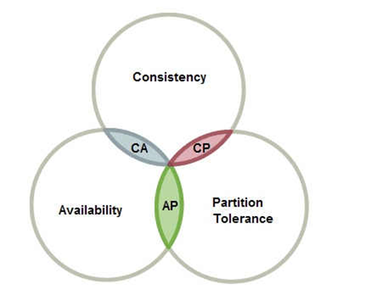

# 目录

1. 简介
   - [API网关](#API网关)
     - [ocelot](#ocelot)
   - [服务注册中心](#服务注册中心)
2. 实战
   - [SFTP安装](#SFTP安装)
   - [搭建consul集群](#搭建consul集群)
   - [部署前准备](#部署前准备)
   - [镜像生成](#镜像生成)
   - [部署前端应用](#部署前端应用)
   - [部署后端微服务](#部署后端微服务)
   - [一键部署](#一键部署)
   - [安装RabbitMQ](#安装RabbitMQ)
3. 附录

## 简介

### API网关

#### ocelot

Ocelot 是一个用 .NET Core 实现并且开源的 API 网关，它功能强大，包括了：路由、请求聚合、服务发现、认证、鉴权、限流熔断、并内置了负载均衡器与 Service Fabric、Butterfly Tracing 集成。这些功能只都只需要简单的配置即可完成。

在配置文件中包含两个根节点：ReRoutes 和 GlobalConfiguration。ReRoutes 是一个数组，其中的每一个元素代表了一个路由，我们可以针对每一个路由进行功能配置：

- Downstream 下游服务配置
- UpStream 上游服务配置
- Aggregates 服务聚合配置
- ServiceName, LoadBalancer, UseServiceDiscovery 配置服务发现
- AuthenticationOptions 配置服务认证
- RouteClaimsRequirement 配置Claims鉴权
- RateLimitOptions 限流配置
- FileCacheOptions 缓存配置
- QosOptions 服务质量与熔断
- DownstreamHeaderTransform 头信息转发

### 服务注册中心

在现在云计算和大数据快速发展的今天，业务快速发展和变化。我们以前的单一应用难以应对这种快速的变化，因此我们需要将以前单一的大应用不断进行差分，分成若干微小的应用或者服务，这就是微服务的思想。

但是当我们对服务进行拆分之后，我们将又面临新的问题。服务之间该如何调用？直接调用？当服务很少只有几个的时候你可能感觉直接调用是最高效和便捷的，但是当服务多达上千个呢？这时我们又该怎么来管理我们的调用关系呢？

**服务注册中心解决的问题：**

主要是两个：服务注册 和 服务发现。

- ***服务注册：*** 服务实例将自身服务信息注册到注册中心。这部分服务信息包括服务所在主机IP和提供服务的Port，以及暴露服务自身状态以及访问协议等信息。
- ***服务发现：*** 服务实例请求注册中心获取所依赖服务信息。服务实例通过注册中心，获取到注册到其中的服务实例的信息，通过这些信息去请求它们提供的服务。

除了这两个核心功能之外，一般服务注册中心还需要监控服务实例的运行状态，负载均衡等问题。

- ***监控：*** 服务实例一直处于动态的变化中，因此我们需要监控服务实例的健康状况，从注册中心剔除无用的服务。一般实现心跳连接等。
- ***负载均衡：*** 在一个服务有多个实例的情况下，我们需要根据负载均衡策略正确处理请求。


**CAP原则：**

这里不得不提一下，我们知道分布式里一个重要的理论，那就是 **CAP** 原则。指的是在一个分布式系统中，Consistency（一致性）、Availability（可用性）、Partition Tolerance（分区容错性），不能同时成立。

- **一致性：** 它要求在同一时刻点，分布式系统中的所有数据备份都处于同一状态。
- **可用性：** 在系统集群的一部分节点宕机后，系统依然能够响应用户的请求。
- **分区容错性：** 在网络区间通信出现失败，系统能够容忍。



一般来讲，基于网络的不稳定性，分布容错是不可避免的，所以我们默认CAP中的P总是成立的。

一致性强制数据统一的要求，必然会导致在更新数据时部分节点处于被锁定状态，此时不可对外提供服务，影响了服务的可用性，反之亦然。因此一致性和可用性不能同时满足。

在注册中心的发展上面，一直有两个分支：一个就是 CP 系统，追求数据的强一致性。还有一个是 AP 系统，追求高可用与最终一致。我们介绍的服务注册和发现组件中，Eureka满足了其中的AP，Consul 和 Zookeeper 满足了其中的CP。

## Eureka

Eureka是在Java语言上，基于Restful Api开发的服务注册与发现组件，由Netflix开源。

遗憾的是，目前Eureka仅开源到1.X版本，2.X版本已经停止开发。

Eureka由两个组件组成：Eureka服务器和Eureka客户端。

- Eureka 服务器用作服务注册服务器。
- Eureka 客户端是一个 java 客户端，用来简化与服务器的交互、作为轮询负载均衡器，并提供服务的故障切换支持。
  
  >Netflix在其生产环境中使用的是另外的客户端，它提供基于流量、资源利用率以及出错状态的加权负载均衡。
  
Spring Cloud 封装了 Netflix 公司开发的 Eureka 模块来实现服务注册和发现。

Eureka 采用了 C-S 的设计架构：

- Eureka Server 作为服务注册功能的服务器，它是服务注册中心。
- 而系统中的其他微服务，使用 Eureka 的客户端连接到 Eureka Server，并维持心跳连接。
  
  >这样系统的维护人员就可以通过 Eureka Server 来监控系统中各个微服务是否正常运行。Spring Cloud 的一些其他模块（比如Zuul）就可以通过 Eureka Server 来发现系统中的其他微服务，并执行相关的逻辑。


上图来自 Eureka 官方的架构图，大致描述了 Eureka 集群的工作过程。图中包含的组件非常多，可能比较难以理解，我们用通俗易懂的语言解释一下：

- Application Service：作为Eureka Client，扮演了服务的提供者，提供业务服务，向Eureka Server注册和更新自己的信息，同时能从Eureka Server的注册表中获取到其他服务的信息。
- Eureka Server：扮演服务注册中心的角色，提供服务注册和发现的功能，每个Eureka Cient向Eureka Server注册自己的信息，也可以通过Eureka Server获取到其他服务的信息达到发现和调用其他服务的目的。
- Application Client：作为Eureka Client，扮演了服务消费者，通过Eureka Server获取到注册到上面的其他服务的信息，从而根据信息找到所需的服务发起远程调用。
- Replicate：Eureka Server中的注册表信息的同步拷贝，保持不同的Eureka Server集群中的注册表中的服务实例信息的一致性。提供了数据的最终一致性。
- Make Remote Call：服务之间的远程调用。
- Register：注册服务实例，Client端向Server端注册自身的元数据以进行服务发现。
- Renew：续约，通过发送心跳到Server维持和更新注册表中的服务实例元数据的有效性（默认周期为30秒）。当在一定时长内Server没有收到Client的心跳信息（默认90秒），将默认服务下线，将服务实例的信息从注册表中删除。
- Cancel：服务下线，Client在关闭时主动向Server注销服务实例元数据，这时Client的的服务实例数据将从Server的注册表中删除。

最后我们需要注意的Eureka的缓存机制。Eureka Client会缓存Eureka Server中的信息。即使所有的Eureka Server节点都宕掉，服务消费者依然可以使用缓存中的信息找到服务提供者。

Ereka Client客户端默认每30秒发送一次请求来更新缓存的注册信息。如果你并不是在Spring Cloud环境下使用这些组件(Eureka, Ribbon)，你的服务启动后并不会马上向Eureka注册，而是需要等到第一次发送心跳请求时才会注册。心跳请求的发送间隔也是30s。（Spring Cloud对此做了修改，服务启动后会马上注册）

## 实战

部署环境：

```txt
服务器：   CentOS 7
上传工具： SFTP
运行环境： Docker
```

### SFTP安装

```sh
# 查看openssh版本，openssh版本必须大于4.8p1
ssh -V
# 创建sftp组
groupadd sftp
# 创建sftp用户
useradd -g sftp -s /sbin/nologin -M sftp
passwd sftp
输入密码
# 建立目录
mkdir -p /data/sftp/mysftp
usermod -d /data/sftp/mysftp sftp

# 修改sshd_config
vim /etc/ssh/sshd_config
# 注释掉
# Subsystem sftp /usr/libexec/openssh/sftp-server
# 添加
Subsystem sftp internal-sftp
Match Group sftp
ChrootDirectory /data/sftp/mysftp
ForceCommand internal-sftp
AllowTcpForwarding no
X11Forwarding no

# 设置Chroot目录权限
chown root:sftp /data/sftp/mysftp
chmod 755 /data/sftp/mysftp

# 设置可以写入的目录
mkdir /data/sftp/mysftp/upload
chown sftp:sftp /data/sftp/mysftp/upload
chmod 755 /data/sftp/mysftp/upload

# 关闭selinux：
vim /etc/selinux/config
# 将文件中的 SELINUX=enforcing 修改为 SELINUX=disabled，然后保存。

# 执行：
setenforce 0
service sshd restart
# 或
systemctl restart sshd.service

# 测试
sftp sftp@127.0.0.1
```

问题：

1、修改sshd_config文件后重启 sshd，报错（通过`sshd -t`查看）：`Directive 'UseDNS' is not allowed within a Match block`

语法错误，原因未知。只需将新加的配置放在下面配置之后就不报错了。

```conf
# 新加配置放在这一段之后
UseDNS no
AddressFamily inet
PermitRootLogin yes
SyslogFacility AUTHPRIV
PasswordAuthentication yes

# 下面是新加的配置
Subsystem sftp internal-sftp
UsePAM yes
Match user sftpuser1
ForceCommand internal-sftp
ChrootDirectory /data/wwwroot/user1/
```

2、新用户通过 sftp 访问时，权限不全，只能读不能写

试着用 root 账号去把该用户的家目录权限改成 777，但是会出现该用户 sftp 登陆不了的情况。（报错：`Server unexpectedly closed network connection`）

google 了原因如下：

给新用户的 Home 目录的权限设定有两个要点：

1. 由 ChrootDirectory 指定的目录开始一直往上到系统根目录为止的目录拥有者都只能是 root
2. 由 ChrootDirectory 指定的目录开始一直往上到系统根目录为止都不可以具有群组写入权限（最大权限 755）

如果违反了上面的两条要求，那么就会出现新用户访问不了 sftp
的情况。

所以 /data/wwwroot/user1/ 及上级的所有目录属主一定要是
root，并且组权限和公共权限不能有写入权限，如果一定需要有写入权限，那们可以在 /data/wwwroot/user1/ 下建立 777 权限的文件夹。

```sh
mkdir /data/wwwroot/user1/upload
chown -R sftpuser1:root /data/wwwroot/user1/upload
```

这样 sftpuser1 用户就可以在 /data/wwwroot/user1/upload 里随意读写文件了。

### 搭建consul集群

使用直接加参数的方式启动集群：

```sh
# 建立数据目录和配置目录
mkdir -p /data/consul_data/data && mkdir -p /data/consul_data/conf

# 试一下这个命令（测试）
docker run -d -p 8500:8500 -p 8300-8302:8300-8302 -p 8600:8600 \
-v /data/consul_data/data:/consul/data \
-v /data/consul_data/conf:/consul/config \
-h node1 --name consul --restart=always \
consul agent -server -bootstrap-expect=1 -node=node1 \
-rejoin -client 0.0.0.0 -ui \
-data-dir /consul/data \
-config-dir /consul/config

# 启动主机1
docker run -d \
-p 8510:8500 \
-p 8310-8312:8300-8302 \
-p 8610:8600 \
-h node1 \
-v /data/lead/consul/node1/data:/consul/data \
-v /data/lead/consul/node1/conf:/consul/config \
--net=lead_dev \
--restart=always \
--name consul_s1 \
consul agent \
-server \
-rejoin \
-node=node1 \
-client 0.0.0.0 \
-ui \
-bootstrap-expect=1 \
-data-dir /consul/data \
-config-dir /consul/config

# 启动主机2
docker run -d \
-p 8500:8500 \
-p 8300-8302:8300-8302 \
-p 8600:8600 \
-h node2 \
-v /data/consul_data/data:/consul/data \
-v /data/consul_data/conf:/consul/config \
--net=lead_dev \
--restart=always \
--name consul_s2 \
consul agent \
-server \
-rejoin \
-node=node2 \
-bind=10.30.100.103 \
-client 0.0.0.0 \
-ui \
-bootstrap-expect=2 \
-data-dir /consul/data \
-config-dir /consul/config \
-join 10.30.100.104
```

都启动完成后，可以通过如下命令观察consul日志，了解启动情况：

```sh
docker logs 容器id/容器名称
```

查看docker image的构建过程：

```sh
docker history leadgateway --format "table {{.ID}}\t{{.CreatedBy}}" --no-trunc
```

### 部署前准备

1、docker 时区

```sh
# 共享主机的localtime
docker run --name <name> -v /etc/localtime:/etc/localtime:ro ....
# 复制主机的localtime
docker cp /etc/localtime [容器ID或者NAME]:/etc/localtime
# 示例，message是容器名
docker cp ../usr/share/zoneinfo/Asia/Shanghai message:/etc/localtime
# 完成后，通过date命令进行查看当前时间
# 但是，在容器中运行的程序的时间不一定能更新过来，比如在容器运行的MySQL服务，这时候必须要重启mysql服务或者重启Docker容器
```

2、查看 docker 启动命令：

```sh
# 外部
docker inspect
docker inspect container
# 内部
ps -fe
```

### 镜像生成

前端：

```Dockerfile
# 拉取 tomcat 镜像
FROM tomcat
ENV CATALINA_HOME /usr/local/tomcat

# 设置时区
RUN /bin/cp /usr/share/zoneinfo/Asia/Shanghai /etc/localtime \
  && echo 'Asia/Shanghai' >/etc/timezone \
```

```Dockerfile
# 拉取 nginx 镜像
FROM nginx:alpine
WORKDIR /app
# 从客户机复制到容器中
COPY nginx.conf /etc/nginx/nginx.conf

# 设置时区
RUN /bin/cp /usr/share/zoneinfo/Asia/Shanghai /etc/localtime \
  && echo 'Asia/Shanghai' >/etc/timezone \
```

网关：

```Dockerfile
# 拉取 .net core 2.1 镜像
FROM mcr.microsoft.com/dotnet/core/aspnet:2.1-stretch-slim AS base
# 工作目录
WORKDIR /app
# COPY . .
# 开放端口
# EXPOSE 80
# EXPOSE 443
RUN /bin/cp /usr/share/zoneinfo/Asia/Shanghai /etc/localtime && echo 'Asia/Shanghai' >/etc/timezone
# ENV TZ=Asia/Shanghai
# RUN ln -snf /usr/share/zoneinfo/$TZ /etc/localtime && echo $TZ > /etc/timezone
ENTRYPOINT ["dotnet", "LeadChina.Gateway.dll"]
```

认证服务器：

```Dockerfile
FROM mcr.microsoft.com/dotnet/core/aspnet:2.1-stretch-slim AS base
WORKDIR /app
RUN /bin/cp /usr/share/zoneinfo/Asia/Shanghai /etc/localtime && echo 'Asia/Shanghai' >/etc/timezone
ENTRYPOINT ["dotnet", "LeadChina.JwtServer.dll"]
```

系统设置微服务：

```Dockerfile
FROM mcr.microsoft.com/dotnet/core/aspnet:2.1-stretch-slim AS base
WORKDIR /app
RUN /bin/cp /usr/share/zoneinfo/Asia/Shanghai /etc/localtime && echo 'Asia/Shanghai' >/etc/timezone
ENTRYPOINT ["dotnet", "LeadChina.BasicData.API.dll"]
```

基础数据微服务：

```Dockerfile
FROM mcr.microsoft.com/dotnet/core/aspnet:2.1-stretch-slim AS base
WORKDIR /app
RUN /bin/cp /usr/share/zoneinfo/Asia/Shanghai /etc/localtime && echo 'Asia/Shanghai' >/etc/timezone
ENTRYPOINT ["dotnet", "LeadChina.Base.API.dll"]
```

项目微服务：

```Dockerfile
FROM mcr.microsoft.com/dotnet/core/aspnet:2.1-stretch-slim AS base
WORKDIR /app
RUN /bin/cp /usr/share/zoneinfo/Asia/Shanghai /etc/localtime && echo 'Asia/Shanghai' >/etc/timezone
ENTRYPOINT ["dotnet", "LeadChina.PM.Project.API.dll"]
```

任务微服务：

```Dockerfile
FROM mcr.microsoft.com/dotnet/core/aspnet:2.1-stretch-slim AS base
WORKDIR /app
RUN /bin/cp /usr/share/zoneinfo/Asia/Shanghai /etc/localtime && echo 'Asia/Shanghai' >/etc/timezone
ENTRYPOINT ["dotnet", "LeadChina.PM.Task.API.dll"]
```

消息微服务：

```Dockerfile
FROM mcr.microsoft.com/dotnet/core/aspnet:2.1-stretch-slim AS base
WORKDIR /app
RUN /bin/cp /usr/share/zoneinfo/Asia/Shanghai /etc/localtime && echo 'Asia/Shanghai' >/etc/timezone
ENTRYPOINT ["dotnet", "LeadChina.PM.Message.API.dll"]
```

文档微服务：

```Dockerfile
FROM mcr.microsoft.com/dotnet/core/aspnet:2.1-stretch-slim AS base
WORKDIR /app
RUN /bin/cp /usr/share/zoneinfo/Asia/Shanghai /etc/localtime && echo 'Asia/Shanghai' >/etc/timezone
ENTRYPOINT ["dotnet", "LeadChina.PM.Document.API.dll"]
```

生成镜像：

```sh
# 前端
cd /data/sftp/mysftp/upload/pmweb/
docker build -t pmweb .

# 网关
cd /data/sftp/mysftp/upload/gateway/
docker build -t gateway .

# 认证服务器
cd /data/sftp/mysftp/upload/JwtServer/
docker build -t jwtserver .

# 系统设置微服务
cd /data/sftp/mysftp/upload/setting/SysSetting/
docker build -t pmsetting .

# 基础数据微服务
cd /data/sftp/mysftp/upload/base
docker build -t basic .

# 项目微服务
cd /data/sftp/mysftp/upload/project
docker build -t project .

# 任务微服务
cd /data/sftp/mysftp/upload/task
docker build -t task .

# 消息微服务
cd /data/sftp/mysftp/upload/message
docker build -t message .

# 文档微服务
cd /data/sftp/mysftp/upload/document
docker build -t document .
```

### 部署前端应用

```sh
# 启动前端
docker run -d -p 6100:6100 -v /data/sftp/mysftp/upload/pmweb/:/app --name pmweb pmweb
```

### 部署后端微服务

```sh
# 启动网关
docker run -d -p 6080:6080 -v /data/sftp/mysftp/upload/gateway/:/app --name gateway gateway

# 启动认证服务器
docker run -d -p 6181:6181 -v /data/sftp/mysftp/upload/JwtServer/:/app --name jwtserver jwtserver

# 启动系统设置微服务
docker run -d -p 6082:6082 -v /data/sftp/mysftp/upload/setting/SysSetting/:/app --name pmsetting pmsetting

# 启动项目微服务
docker run -d -p 6083:6083 -v /data/sftp/mysftp/upload/project/:/app --name project project

# 启动任务微服务
docker run -d -p 6084:6084 -v /data/sftp/mysftp/upload/task/:/app --name task task

# 启动消息微服务
docker run -d -p 6085:6085 -v /data/sftp/mysftp/upload/message/:/app --name message message

# 启动文档微服务
docker run -d -p 6086:6086 -v /data/sftp/mysftp/upload/document/:/app --name document document
```

### 一键部署

```yml
version: '3.7'

services:
  gateway:
    name: gateway
    image: gateway
    privileged: true
    hostname: gateway
    ports:
      - 7080:7080
    volumes:
      - /data/sftp/mysftp/upload/lead/gateway/:/app
    networks:
      default:
        ipv4_address: 172.20.0.3

  auth:
    name: auth
    image: jwtserver
    privileged: true
    hostname: auth
    ports:
      - 7081:7081
    volumes:
      - /data/sftp/mysftp/upload/lead/auth/:/app
    networks:
      default:
        ipv4_address: 172.20.0.4

  setting:
    name: setting
    image: pmsetting
    privileged: true
    hostname: setting
    ports:
      - 7082:7082
    volumes:
      - /data/sftp/mysftp/upload/lead/setting/:/app
    networks:
      default:
        ipv4_address: 172.20.0.5

  base:
    name: base
    image: basic
    privileged: true
    hostname: base
    ports:
      - 7083:7083
    volumes:
      - /data/sftp/mysftp/upload/lead/base/:/app
    networks:
      default:
        ipv4_address: 172.20.0.6

  project:
    name: project
    image: project
    privileged: true
    hostname: project
    ports:
      - 7084:7084
    volumes:
      - /data/sftp/mysftp/upload/lead/project/:/app
    networks:
      default:
        ipv4_address: 172.20.0.7

  task:
    name: task
    image: task
    privileged: true
    hostname: task
    ports:
      - 7085:7085
    volumes:
      - /data/sftp/mysftp/upload/lead/task/:/app
    networks:
      default:
        ipv4_address: 172.20.0.8

  message:
    name: message
    image: message
    privileged: true
    hostname: message
    ports:
      - 7086:7086
    volumes:
      - /data/sftp/mysftp/upload/lead/message/:/app
    networks:
      default:
        ipv4_address: 172.20.0.9

  document:
    name: document
    image: document
    privileged: true
    hostname: document
    ports:
      - 7087:7087
    volumes:
      - /data/sftp/mysftp/upload/lead/document/:/app
    networks:
      default:
        ipv4_address: 172.20.0.10

  suggestion:
    name: suggestion
    image: suggestion
    privileged: true
    hostname: suggestion
    ports:
      - 7088:7088
    volumes:
      - /data/sftp/mysftp/upload/lead/suggestion/:/app
    networks:
      default:
        ipv4_address: 172.20.0.11

  report:
    name: report
    image: report
    privileged: true
    hostname: report
    ports:
      - 7089:7089
    volumes:
      - /data/sftp/mysftp/upload/lead/report/:/app
    networks:
      default:
        ipv4_address: 172.20.0.12

  performance:
    name: performance
    image: performance
    privileged: true
    hostname: performance
    ports:
      - 7090:7090
    volumes:
      - /data/sftp/mysftp/upload/lead/performance/:/app
    networks:
      default:
        ipv4_address: 172.20.0.13

  attend:
    name: attend
    image: attend
    privileged: true
    hostname: attend
    ports:
      - 7091:7091
    volumes:
      - /data/sftp/mysftp/upload/lead/attend/:/app
    networks:
      default:
        ipv4_address: 172.20.0.14

  general:
    name: general
    image: general
    privileged: true
    hostname: general
    ports:
      - 7092:7092
    volumes:
      - /data/sftp/mysftp/upload/lead/general/:/app
    networks:
      default:
        ipv4_address: 172.20.0.15

networks: # 自定义网络
  default:
    external:
      name: lead_dev
```

解释：

- `privileged`：使用该参数，container 内的 root 拥有真正的 root 权限。
否则，container 内的 root 只是外部的一个普通用户权限。privileged 启动的容器，可以看到很多 host 上的设备，并且可以执行 mount。甚至允许你在 docker 容器中启动 docker 容器。

### 安装RabbitMQ

```sh
# 查找RabbitMQ镜像
docker search rabbitmq
# 拉取RabbitMQ镜像
docker pull rabbitmq #（镜像未配有控制台）
docker pull rabbitmq:management #（镜像配有控制台）
```

>注意：rabbitmq是官方镜像，该镜像不带控制台。如果要安装带控制台的镜像，需要在拉取镜像时附带tag标签，例如：management。tag标签可以通过[https://hub.docker.com/_/rabbitmq?tab=tags](https://hub.docker.com/_/rabbitmq?tab=tags)来查询。

```sh
# 安装并运行容器
docker run --name rabbitmq -d -p 15672:15672 -p 5672:5672 rabbitmq:management
# 停止容器
docker stop rabbitmq
# 启动容器
docker start rabbitmq
# 重启
docker restart rabbitmq
# 查看进程信息
```

启动容器后，可以浏览器中访问 [http://localhost:15672](http://localhost:15672) 来查看控制台信息。

RabbitMQ默认的用户名：guest，密码：guest

## 附录

### 前端Vue

获取DOM元素

- 救命稻草，前端框架就是为了减少DOM操作，但是特定情况下，也给你留了后门
- 在指定的元素上，添加 `ref="名称A"`
- 在获取的地方加入 `this.$refs.名称A`  
  - 如果ref放在了原生DOM元素上，获取的数据就是原生DOM对象，可以直接操作
  - 如果ref放在了组件对象上，获取的就是组件对象
  - 获取到DOM对象，通过`this.$refs.sub.$el`，进行操作
  - 对应的事件
    - created 完成了数据的初始化，此时还未生成DOM，无法操作DOM
    - mounted 数据已经装载到了DOM之上，可以操作DOM

- [统一封装 Axios 接口与异常处理](https://blog.csdn.net/qq_40128367/article/details/82735310)

- 实例：
  - 在组件内（xxx.vue）中的this
  - new Vue()
  - 事件
    - this.$on(事件名,回调函数(参数))
    - this.$emit(事件名,数据)
    - this.$once(事件名,回调函数(参数)) 就触发一次
    - this.$off(事件名); 取消事件
  - 实例属性
    - $props,$parent,$children,$refs
- 全局函数
  - Vue.use(param) 安装插件 param需要实现install函数 接受一个Vue，可以在Vue的原型上挂载属性，后期组件内通过this.就可以拿到该数据，在所有组件中使用
  - 单文件 Vue.component(名称,组件对象)
  - 引包 Vue.component(名称,options)
  - Vue.filter(过滤器名,function(value){ return value; } )
- 生僻指令
  - :key 当DOM列表中删除某一个元素 ，更优化的方案是直接删除这一个DOM元素
  - Vue就需要辨识你删除的数组中的元素与DOM中那个元素的对应关系
    - 如果不指定key，vue也会去计算，把对象计算出一个唯一标识，相对损耗性能
    - 我们来通过key告知vue，这个元素的标识就是 obj.id index，可以很好的提升性能
  - v-on:事件  @事件=
  - v-bind:属性 :属性=
- 全局
  - Vue.component('组件名',组件对象)  在哪里都可以使用
- 组件传值
  - 父传子: 属性作为参数
  - 常量 title="xxx"   子组件声明接收参数 props:['xxx']
  - 变量 :title="num"  子组件声明接收参数 props:['xxx']
  - 子传父: vuebus（只能是同一辆车）
  - 先停车到父组件，On一下
  - 再开车到子组件，如果需要的话，emit一下，触发上述时间的回调函数
  - 父子组件之间通信规则不太清楚  
  - 父向子 -> 自定义指令给属性传值  <my-div xxx="{{name}}"
  - 子向父 -> 通过事件触发 -> 只能是同一个对象的事件监听和触发 $emit
  - vue bus 同一辆车在不同的地方使用($on/$emit)
- render: c => c(App)这是啥，babel->语法转换器，转换ES6/7、react  
- options: {presets: ['es2015'], plugins: ['transform-runtime'] }  
- 路由使用
  - 使用步骤
    1. 下载
    2. 引入对象
    3. 安装插件
    4. 创建路由对象配置路由规则
    5. 配置进vue实例对象的options中
    6. 留坑 `<router-view></router-view>`
       1. 去哪里 `<router-link :to="{name:'xxx'}"></router-link>`
       2. 导航 `{name:'xxx', path:'/xxx', component:Home}`
       3. 去了以后干什么
    - 在created函数中，发请求
    - 获取路由参数`this.$route.params|query.xxx;`
  - 套路
    1. 去哪里 `<router-link :to="{name:'bj'}"></router-link>`
    2. 导航（配置路由规则）`{name:'bj',path:'/beijing',组件A}`
    3. 去了干嘛（在组件A内干什么）
       - 在created事件函数中，获取路由参数
       - 发起请求，把数据挂载上去
    4. 参数
       - 查询字符串（#/beijing?id=1&age=2）
          1. 去哪里 `<router-link :to="{name:'bj',query:{id:1,age:2}}"></router-link>`
          2. 导航（配置路由规则） `{name:'bj',path:'/beijing',组件A}`
          3. 去了干嘛（在组件A内干什么）  
       `this.$route.query.id||age`
       - path(#/beijing/1/2)
         1. 去哪里 `<router-link :to="{name:'bj',params:{id:1,age:2}}"></router-link>`
         2. 导航（配置路由规则） `{name:'bj',path:'/beijing/:id/:age',组件A}`
         3. 去了干嘛（在组件A内干什么）`this.$route.params.id||age`
    5. 编程导航
       - 一个获取信息的只读对象($route)
       - 一个具备功能函数的对象($router)
       - 根据浏览器历史记录前进和后台 `this.$router.go(1|-1);`
       - 跳转到指定路由 `this.$router.push({name:'bj'});`
    6. 嵌套路由
       - 让变化的视图(router-view)产生包含关系(router-view)
       - 让路由与router-view关联，并且也产生父子关系
    7. 多视图
       - 让视图更为灵活，以前一个一放，现在可以放多个，通过配置可以去修改
- axios:
  - 开始:
    - 跨域 + 默认的头是因为你的数据是对象，所以content-type:application/json
    - 有OPTIONS预检请求（浏览器自动发起）
  - 最终:
    - 当我们调整为字符串数据，引起content-type变为了www键值对
    - 没有那个OPTIONS预检请求
  - 总结：跨域 + application/json 会引起OPTIONS预检请求，并且自定义一个头（提示服务器，这次的content-type较为特殊），content-type的值
  - 服务器认为这个是一次请求，而没有允许content-type的头，
  - 浏览器就认为服务器不一定能处理掉这个特殊的头的数据
  - 抛出异常
  - 在node服务器`response.setHeader("Access-Control-Allow-Headers","content-type,多个");`
  - formdata的样子: key=value&key=value
  - axios属性关系
    - options: headers、baseURL、params
    - 默认全局设置（大家都是这么用）`Axios.defaults-> options对象`
    - 针对个别请求来附加options
    - axios.get(url,options)
    - axios.post(url,data,options)
  - 独立构建：引包的方式
  - 运行时构建：单文件方式
  - 单文件方式引入bootstrap

    ```javascript
    new webpack.ProvidePlugin({
      $: 'jquery',
      jQuery: 'jquery',
      'window.jQuery': 'jquery',
      'window.$': 'jquery',
    }),
    ```

    以上方式是将jquery声明成全局变量。供bootstrap使用

  - 使用代理跨域

    ```javascript
    devServer: {
      proxy: {
        '/v2/*': {
          target: 'https://api.douban.com/',
          changeOrigin: true,
        }
      }
    ```

  - 合并请求
    - axios.all([请求1,请求2])
    - 分发响应  axios.spread(fn)
    - fn:对应参数(res)和请求的顺序一致
    - 应用场景：必须保证两次请求都成功，比如，分头获取省、市的数据
    - 执行特点：只要有一次失败就算失败，否则成功
  - 拦截器
    - 过滤，在每一次请求与响应中、添油加醋
    - axios.interceptors.request.use(fn)  在请求之前
    - function(config){ config.headers = { xxx }}   config 相当于options对象
    - 默认设置 defaults 范围广、权利小
    - 单个请求的设置options get(url,options)  范围小、权利中
    - 拦截器 范围广、权利大
  - token（扩展）
    - cookie 和session的机制，cookie自动带一个字符串
    - cookie只在浏览器
    - 移动端原生应用，也可以使用http协议，1:可以加自定义的头、原生应用没有cookie
    - 对于三端来讲，token可以作为类似cookie的使用，并且可以通用
    - 拦截器可以用在添加token上
  - 拦截器操作loadding
    - 在请求发起前open，在响应回来后close

- 视口

  ```html
  <meta name="viewport" content="width=device-width, user-scalable=no, initial-scale=1.0, maximum-scale=1.0, minimum-scale=1.0">
  ```

- 相关环境总结

  - webpack.config.js -> 入口和出口，解决文件的解析loader
  - index.html -> SPA
  - main 程序入口
  - app.vue 主体组件文件
  - components -> 各种功能页面的组件
  - static
    - 全局css
    - img图片
    - vender -> mui

- npm命令

  - npm i(install) 包名 -S(--save)-D(--save-dev) 安装包
  - 全部或者生产恢复包: npm i(install) --production(只恢复生产依赖dependencies)

- yarn命令

  - yarn add||remove 包名 -S(--save)-D(--save-dev) 安装包
  - 全部或者生产恢复包: yarn i(install) --production(只恢复生产依赖dependencies)

- 相关命令

  ```bat
  npm i mint-ui vue-preview axios vue-router monent vue - S;
  npm i webpack html - webpack - plugin css - loader style - loader less less - loader autoprefixer - loader babel - loader babel - core babel - preset - es2015 babel - plugin - transform - runtime url - loader file - loader vue - loader vue - template - compiler webpack-dev-server - D
  ```

## 部署

(1) 绝对路径改成相对路径


(2) npm run build

## 多页面

1、创建文件


2、添加多入口


3、开发环境修改


对编译环境进行配置：


配置生产环境，每个页面都要配置一个chunks，不然会加载所有页面的资源。


## iview组件表格render函数的使用

如果要在标签中加入属性，例如img中src属性，a标签中href属性。此时要用attrs来加入而不是props。

## 浅谈$mount()

Vue 的 `$mount()` 为手动挂载，在项目中可用于延时挂载（例如在挂载之前要进行一些其他操作、判断等），之后要手动挂载上。new Vue时，el 和 `$mount` 并没有本质上的不同。

顺便附上vue渲染机制流程图：


## 生成条形码和二维码

### 条形码

1. 命令：`npm install jsbarcode --save`
2. 引入：

   ```html
   <script src="https://www.jq22.com/jquery/vue.min.js"></script>
   <script src='js/JsBarcode.all.min.js'></script>）
   ```
  
   （安装了依赖可不引入）

3. 声明：

   ```js
   var JsBarcode = require('jsbarcode')
   ```

4. 简单例子：

```html
<svg id="barcode"></svg>

<!-- 在HTML元素中定义值和选项 -->
<svg class="barcode"
     jsbarcode-format="CODE128"
     :jsbarcode-value= obj.id
     jsbarcode-textmargin="0"
     jsbarcode-fontoptions="bold">
</svg>

<script>
JsBarcode("#barcode", "Hi world!");

// 配置
JsBarcode("#barcode", "1234", {
　format: "pharmacode",
　lineColor: "#0aa",
　width: 4,
　height: 40,
　displayValue: false
});

// 在HTML元素中定义值和选项
JsBarcode(".barcode").init();

// 高级
JsBarcode("#barcode")
  .options({font: "OCR-B"}) // 会影响所有条形码
  .EAN13("1234567890128", {fontSize: 18, textMargin: 0})
  .blank(20) // 在条形码之间创建空间
  .EAN5("12345", {height: 85, textPosition: "top", fontSize: 16, marginTop: 15})
  .render();
</script>
```

支持的条形码：

- CODE128
  - CODE128（自动模式切换）
  - CODE128 A / B / C（强制模式）
- EAN
  - EAN-13
  - EAN-8
  - EAN-5
  - EAN-2
  - UPC（A）
  - UPC（E）
- CODE39
- ITF-14
- MSI
  - MSI10
  - MSI11
  - MSI1010
  - MSI1110
- Pharmacode
- Codabar

## 组件重新加载

1. 利用v-if控制router-view，在根组件APP.vue中实现一个刷新方法，这种方法可以实现任意组件的刷新。

    ```html
    <template>
      <router-view v-if="isRouterAlive"/>
    </template>
    <script>
      export default {
        data () {
          return {
            isRouterAlive: true
          }
        },
        methods: {
          reload () {
            this.isRouterAlive = false
            this.$nextTick(() => (this.isRouterAlive = true))
          }
        }
      }

      // 然后其它任何想刷新自己的路由页面，都可以这样：
      this.reload()
    </script>
    ```

2. 路由替换

   ```js
   // replace another route (with different component or a dead route) at first
   // 先进入一个空路由
   vm.$router.replace({
     path: '/_empty',
   })
   // then replace your route (with same component)
   vm.$router.replace({
     path: '/student/report',
     query: {
       'paperId':paperId
    }
   })
   ```

## 问题

- 错误：<i style="color:red">无法加载文件 C:\Users\gxf\AppData\Roaming\npm\nodemon.ps1，因为在此系统上禁止运行脚本。</i>

  原因：笔记本禁止运行脚本

  解决方法：

  ```sh
  1.管理员身份打开powerShell
  2.输入 set-ExecutionPolicy RemoteSigned
  3.选择 Y 或者 A，就好了
  ```

- 错误：<i style="color:red">Vue项目启动出现 Error:Cannot find module 'array-includes'</i>

  解决方法：

  ```sh
  1. 删掉项目中的node_modules文件夹，
  2 .执行 npm cache clean 或者  cnpm cache clean 命令清除掉cache缓存，
  3.然后cnpm install 和npm run dev就可以在这台电脑运行你的项目
  ```

FormValidatoe使用时，Prop和Model要同名，只能更改Model属性，不能为了省力将Model对象设置为{}对象，Prop会判断错误！

### 事件总线
