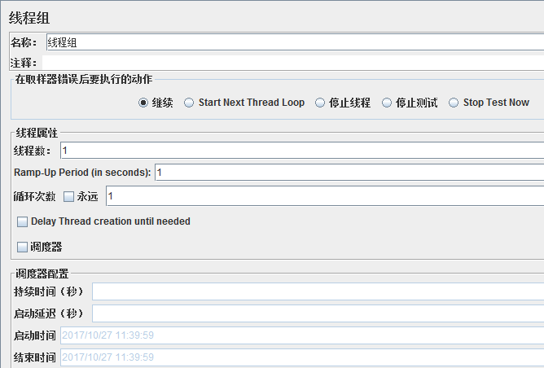

# 武器库

> 工欲善其事，必先利其器

1. 开发工具
   - [代码生成器](#代码生成器)
   - [Make](#make)
- [Cygwin & MinGW](#Cygwin&MinGW)
2. 运维工具

- [Sunny-Ngrok](#Sunny-Ngrok)
   - [Log查看器](#Log查看器)
3. 管理工具
   - [git](#git)
   - [svn](#svn)
4. 文档工具
   - [XMind](#XMind)
   - [Markdown](#Markdown)


## 开发工具


### 代码生成器

> 项目负责人要有意识的提高团队的开发效率！

老的代码生成器的地址：https://www.cnblogs.com/skyme/archive/2011/12/22/2297592.html

#### 懒猴子CG

懒猴子CG支持在线搭建dubbo、springboot、springcloud等框架，支持在线生成swagger实体类等，支持自定义模版，支持多种语言的代码生成。这款生成器是国人研发的，站长迭代速度快，社区活跃，文档齐全。是一款及其灵活的生成器！推荐使用！

官方网址：http://cg.lazy-monkey.com/ 免费

#### IT猿网

在线代码生成器，好处就是方便。重点是连验证码都能在线调试好生成java代码直接使用。

官方网址：https://tool.ityuan.com/captcha 免费

#### listcode

一个超级强大的代码生成器网站，这个代码生成器非常完善， java，php，python，nodejs都支持，前后端分离，翻页，联合查询都做了，当之无愧的代码生成器中的战斗机。

官网地址：https://www.listcode.cn/ 收费

#### magicalcoder

机械的增删改查基础代码和界面功能，自由拖拽定制，面向零基础，拖拽式编程，赋能企业，前后端代码一键生成，能够有效的提升效率。先不讲东西好不好，但他们的理念很贴心：把简单的重复劳动交给我们，把高大上的智力输出交给您，最终提高个人和团队的整体开发效率；我们希望您省下来的时间能多陪陪家人。

官网：http://bbs.magicalcoder.com/ 免费

#### MyBatis-Plus

官网：[MyBatis-Plus](https://baomidou.com/)

#### code-generation

一个小型的业务项目，通常不需要很复杂的架构，一般就是通过单个或两个项目来实现。我们先来看下最基础的开发流程：

1. 了解需求（项目负责人）
2. 设计表结构（项目负责人）
3. 创建基础框架（项目负责人）
4. 制定开发计划，按模块分配任务（项目负责人）
5. 进行模块开发（程序员A、B、C）
6. 测试、上线

程序员进行模块开发的方式有以下几种：

1. 根据表结构设计，手工创建model，然后copy UserDao改名为CompanyDao，copy UserServiceImpl改名为CompanyServiceImpl，并修改引用的UserDao为CompanyDao等；
2. 根据表结构设计，使用工具生成model，后续步骤同1。

如果不细心，总是要修改个两三遍才能让一个模块有一个架子，然后再开始进行真正关心的业务开发，而这时候时间可能已经过去了一个小时，或许更久。

程序员在开发时应该“懒”一点，如果类似的代码多次出现，不要在copy了，提取为公共的方法；如果类似的copy、修改的操作重复的出现的一个项目、不同的项目里，那就写个代码生成器吧，一键完成你手工几十步的操作。

代码生成器是用来生成有规律的代码的，就如controller、service、serviceImpl、dao、daoImpl、model、jsp的结构，用户、角色、权限等等模块都有类似的结构，代码生成器可以代替我们的copy操作，自动生成这些不同业务对象的模板代码。

**代码生成器怎么实现？**

代码生成器的实现由很多种，我们以从mysql数据库表结构生成对应代码为例来说明如何实现一个代码生成器。有以下几个重点：

1. 提前搭建好项目基础框架，因为生成的就是基础框架的模板代码
2. 获取某个数据库内的表及表结构信息，用于生成model及其他代码
3. 使用freemarker进行模板生成

**1、提取基础框架**

如公司项目都是前后端分离的，那我就提取了一个[rest-base](https://link.jianshu.com?t=https://github.com/q7322068/rest-base)项目作为基础框架，该框架满足绝大部分公司项目开发所需的基础功能

**2、获取数据库表结构**

```sql
-- 获取所有库
select DISTINCT(TABLE_SCHEMA) from information_schema.`TABLES`;
-- 获取所有表
SELECT TABLE_NAME as tableName,TABLE_COMMENT as tableComment 
from information_schema.`TABLES` 
where TABLE_SCHEMA='test';
-- 获取某个表的结构
select COLUMN_NAME as columnName,COLUMN_TYPE as columnType,COLUMN_DEFAULT as columnDefault
    ,COLUMN_COMMENT as columnComment,CHARACTER_MAXIMUM_LENGTH as columnCharacterMaximumLength 
from information_schema.columns 
where table_schema = 'test' 
  and table_name = 'rule'; 
```

通过查询information_schema库内的TABLES、columns表，可以获取数据内的表、表字段属性等。然后就可以以此来确定model的内容，如表user_role对应的实体就是UserRole，表字段和实体属性可以根据类型和规则进行映射。

**freemarker生成模板代码**

先大致讲下思路：

1. 根据表名，按规则获取实体名称，从而也确认了dao、service等的类名；
2. 将表字段转为map结构，作为参数传入model对于的模板内，从而生成对应的model类；
3. 依次传入参数，通过模板生成dao、service等代码

需要会一点freemarker的语法，基本上看个一小时就达到了写简单模板的程度了。

**接口：**

```java
public interface GeneratorHelperService {

    /**
     * 设置公共参数，如
     * projectPath 要生成代码的项目的路径：  D:/workspace/code-generator
     * packagePath 要生成代码的项目的包的根路径：/src/main/java/com/hexun/bdc/generator
     * templetePath 本项目内代码模板路径： /src/main/resources/code-templete
     */
    boolean setProperty(Map<String, String> map);

    /**
     * 生成某个库内所有表对应的代码
     * @author yangwenkui
     * @time 2017年10月29日 下午8:22:35
     * @param dbname 数据库名称
     * @return
     */
    boolean allTables(String dbname);

    /**
     * 生成某个库内某个表对应的代码
     * @author yangwenkui
     * @time 2017年10月29日 下午8:22:35
     * @param dbname 数据库名称
     * @param tableName 表名称
     * @return
     */
    boolean oneTable(String dbname, String tableName);

}
```

**实现：**

```java
@Service("generatorHelperService")
public class GeneratorHelperServiceImpl implements GeneratorHelperService {

    private static Logger logger = LoggerFactory.getLogger(GeneratorHelperServiceImpl.class);

    private static Map<String, String> propertyMap = Maps.newConcurrentMap();

    @Autowired
    GeneratorHelperDao generatorHelperDao;
    
    @Value("${generator.project.path}")
    private String localProjectPath;

    @Override
    public boolean setProperty(Map<String, String> map) {
        propertyMap.putAll(map);
        return true;
    }

    @Override
    public boolean allTables(String dbname) {
        List<Object> tables = generatorHelperDao.listAllTable(dbname);
        for (Object item : tables) {
            Object[] arr = (Object[]) item;
            TableInfo tableInfo = new TableInfo(arr);
            boolean success = generateCode(dbname, tableInfo);
            if (!success) {
                logger.error("generator code table=[{}] fail", item.toString());
            }
        }
        return true;
    }

    @Override
    public boolean oneTable(String dbname, String tableName) {
        Object entity = generatorHelperDao.findTableInfo(dbname, tableName);
        Object[] arr = (Object[]) entity;
        TableInfo tableInfo = new TableInfo(arr);
        return generateCode(dbname, tableInfo);
    }

    private boolean generateCode(String dbname, TableInfo item) {
        List<Object> list = generatorHelperDao.listColumInfos(dbname, item.getTabelName());
        List<ColumnInfo> columnInfos = new ArrayList<ColumnInfo>(list.size());
        String idType = "String";
        for (Object obj : list) {
            Object[] arr = (Object[]) obj;
            ColumnInfo columnInfo = new ColumnInfo(arr);
            columnInfos.add(columnInfo);
            if("id".equals(arr[0])){
                if("int".equals(columnInfo.getModelType())){
                    idType = "Integer";
                } else if("long".equals(columnInfo.getModelType())){
                    idType = "Long";
                }
            }
        }
        item.setIdType(idType);
        createModel(item, columnInfos);
        createOther(item,"dao");
        createOther(item,"service");
        createOther(item,"serviceImpl");
        createOther(item,"controller");
        return true;
    }

    
    private void createModel(TableInfo item, List<ColumnInfo> columnInfos) {
        String path = getUpPath();
        String dir = String.format("%s/domain",path);
        File file = new File(dir);
        if(!file.exists()){
            file.mkdirs();
        }
        String templetePath = String.format("%s%s", localProjectPath,propertyMap.get("templetePath"));
        String filePath = String.format("%s/%s.java", dir,item.getModleName());
        
        Map<String, Object> data = Maps.newHashMap();
        data.put("proList", columnInfos);
        data.put("modelParam", String.format("%s%s",item.getModleName().substring(0, 1).toLowerCase(),item.getModleName().substring(1)));
        data.put("modellower", item.getModleName().toLowerCase());
        data.put("tableInfo", item);
        data.put("packagePath", Joiner.on(".").join(propertyMap.get("packagePath").split("/")).substring(15));
        createTempleteFile(filePath,templetePath,"domain.flt",data);
        
    }

    private void createTempleteFile(String filename, String templetePath,String templeteName,
            Map<String, Object> data) {
        try {
            Configuration cfg = new Configuration();  
            cfg.setDirectoryForTemplateLoading(new File(templetePath)); 
            cfg.setObjectWrapper(new DefaultObjectWrapper());  
              
            //设置字符集  
            cfg.setDefaultEncoding("UTF-8");  
              
            //设置尖括号语法和方括号语法,默认是自动检测语法  
            //  自动 AUTO_DETECT_TAG_SYNTAX  
            //  尖括号 ANGLE_BRACKET_TAG_SYNTAX  
            //  方括号 SQUARE_BRACKET_TAG_SYNTAX  
            cfg.setTagSyntax(Configuration.AUTO_DETECT_TAG_SYNTAX);  
  
            Writer out = new OutputStreamWriter(new FileOutputStream(filename),"UTF-8");  
            Template temp = cfg.getTemplate(templeteName);  
            temp.process(data, out); 
            out.flush();
            out.close();
        }catch (Exception e) {
            logger.error("process due to erro",e);
        }  
    }


    private String getUpPath() {
        return String.format("%s/%s", propertyMap.get("projectPath"),
                propertyMap.get("packagePath"));
    }

    private void createOther(TableInfo item,String type) {
        String path = getUpPath();
        String lastDir = type;
        if("serviceImpl".equals(type)){
            lastDir = "service/impl";
        }
        
        String dir = String.format("%s/%s",path,lastDir);
        File file = new File(dir);
        if(!file.exists()){
            file.mkdirs();
        }
        String templetePath = String.format("%s%s", localProjectPath,propertyMap.get("templetePath"));
        String filePath = String.format("%s/%s.java", dir,item.getModleName()+type.substring(0,1).toUpperCase()+type.substring(1));
        
        Map<String, Object> data = Maps.newHashMap();
        data.put("modelParam", String.format("%s%s",item.getModleName().substring(0, 1).toLowerCase(),item.getModleName().substring(1)));
        data.put("modellower", item.getModleName().toLowerCase());
        data.put("item", item);
        data.put("packagePath", Joiner.on(".").join(propertyMap.get("packagePath").split("/")).substring(15));
        
        createTempleteFile(filePath,templetePath,String.format("%s.flt", type),data);
    }

}
```

**model模板(domain.flt)：**

```java
package ${packagePath}.domain;

import io.swagger.annotations.ApiModelProperty;
import javax.persistence.Column;
import javax.persistence.Entity;
import javax.persistence.GeneratedValue;
import javax.persistence.GenerationType;
import javax.persistence.Id;
import javax.persistence.Table;
import java.sql.Timestamp;

/**
 * ${tableInfo.tableComment}
 */
@Entity
@Table(name = "${tableInfo.tabelName}")
public class  ${tableInfo.modleName} {
    
<#list proList as item>
<#if item.modelName == "id">

    @ApiModelProperty(value="主键")
    @Id
    <#if item.modelType == "int">
    @GeneratedValue(strategy=GenerationType.AUTO)
    private Integer id;
    
    </#if>
    <#if item.modelType == "long">
    @GeneratedValue(strategy=GenerationType.AUTO)
    private Long id;
    
    </#if>
    <#if item.modelType == "String">
    @GeneratedValue(generator="system-uuid")
    @GenericGenerator(name="system-uuid",strategy="uuid")
    @Column(length=${item.modelCharacterMaximumLength})
    private String id;//主键
    
    </#if>
<#else>
    @ApiModelProperty(value="${item.modelComment}") 
    @Column(name="${item.columnName}"<#if (item.modelCharacterMaximumLength?exists && item.modelType == "String" && item.modelCharacterMaximumLength?number<=255)>,length=${item.modelCharacterMaximumLength}</#if><#if item.modelDefault?exists && item.modelDefault != "">,columnDefinition="${item.modelDefault}"</#if>)
    private ${item.modelType} ${item.modelName};
    
</#if>
</#list>
<#list proList as item>
    public ${item.modelType} get${item.modelNameFirstUpper}() {
        return ${item.modelName};
    }

    public void set${item.modelNameFirstUpper}(${item.modelType} ${item.modelName}) {
        this.${item.modelName} = ${item.modelName};
    }
    
</#list>

    @Override
    public String toString() {
        return String.format("${tableInfo.modleName} [<#list proList as item>, ${item.modelName}=%s</#list>]"
                      <#list proList as item>, ${item.modelName}</#list>);
    }

}
```

**dao模板(dao.flt)：**

```java
package ${packagePath}.dao;

import com.hexun.bdc.base.component.common.BaseDao;
import ${packagePath}.domain.${item.modleName};

public interface ${item.modleName}Dao extends BaseDao<${item.modleName}, ${item.idType}>{

}
```

代码逻辑不复杂，service提供了三个接口，setProperty用于设置要生成的代码的路径及包名等，allTables用于初次生成，一次生成一个库内所有表对应的代码；oneTable用于生成指定表对应的代码，注意代码开发一段时间后，不要在上传至svn之前给覆盖了。
完整代码在[code-generation](https://link.jianshu.com?t=https://github.com/q7322068/code-generation)，在此基础上，你可以很快修改出适合你公司的代码生成器！

**参考：**

- [开源中国](https://www.oschina.net/project/tag/407/code-generator)


### Sunny-Ngrok

内网穿透工具，让公网可以访问本机！

隧道管理：[https://www.ngrok.cc/user.html](https://www.ngrok.cc/user.html)

申请一个免费隧道，然后下载客户端工具，打开，输入隧道Id即可！

### shadowsocks

Shadowsocks是一个轻量级socks5代理，最初用 Python 编写。

**服务端设置**

登录到ssh界面，切换到root用户。运行命令：

```sh
wget —no-check-certificatehttps://raw.githubusercontent.com/teddysun/shadowsocks_install/master/shadowsocks.sh
```

耐心等待运行结束，运行命令：

```sh
chmod +x shadowsocks.sh
```

耐心等待运行结束，运行命令：

```sh
./shadowsocks.sh 2>&1 | tee shadowsocks.log
```

中间会提示你输入你的SS SERVER的密码，和端口，加密模式。不输入就是默认。跑完命令后会出来你的SS客户端的信息。

特别注意，由于iphone端的的wingy目前只支持到cfb，所以我们选择aes-256-cfb，即7
请立即copy下来加以保存。

上面的命令全部回车执行后，如果没有报错，即为执行成功，出现确认提示的时候，输入 y 后，回车即可。

安装完成后，脚本提示如下：

```sh
Congratulations, shadowsocks install completed!
Your Server IP:45.76.197.221
Your Server Port:9666
Your Password:Cxf5609757
Your Local IP:127.0.0.1
Your Local Port:1080
Your Encryption Method:aes-256-cfb
```

记录保存好你的上述信息：Server IP、Server Port、Password、Encryption Method这时你的专属ss已经搭好了，开始使用吧。

**多用户多端口配置文件**

配置文件路径及代码：

```sh
vi /etcconfig.json
```

或者

```sh
cd /etc/shadowsocks/
vi config.json
```

复制代码

按i编辑，esc退出编辑，然后按Shift+Q编辑状态输入wq保存

```json
{
    "port_password": {
      "8989": "password0",
      "9001": "password1",
      "9002": "password2",
      "9003": "password3",
      "9004": "password4"
    },
    "method": "aes-256-cfb",
    "timeout": 600
}
```

**Shadowsocks使用命令**

- 启动：/etc/init.d/shadowsocks start
- 停止：/etc/init.d/shadowsocks stop
- 重启：/etc/init.d/shadowsocks restart
- 查看状态：/etc/init.d/shadowsocks status
- 卸载：./shadowsocks.sh uninstall

**客户端设置**

1、iphone下载wingy（免费的），app store里搜wingy（中国app store已经下架，可以换到美国账户下载）

[https://itunes.apple.com/us/app/wingy-proxy-for-http-s-socks5/id1178584911?mt=8](https://itunes.apple.com/us/app/wingy-proxy-for-http-s-socks5/id1178584911?mt=8)

点击选择线路—新增线路—shadowsocks—依次填入刚才记录的信息就好—保存—点击连接就可以了

这样就成功了

2、windows下载

windows客户端更新（170925）：[https://github.com/shadowsocks/shadowsocks-windows/releases](https://github.com/shadowsocks/shadowsocks-windows/releases)

下载Shadowsocks-4.0.6.zip

3、android

建议android参考下面这篇文章：[https://www.dou-bi.co/androidkxsw/](https://www.dou-bi.co/androidkxsw/)


**参考**

- [http://www.525.life/article?id=1510739742371](http://www.525.life/article?id=1510739742371)

### 


### Log查看器

**超大****log****文件查看工具**

l PilotEdit（主要是针对文本文件）

l glogg（windows和linux都可以用）

l WINHEX（主要针对二进制文件）

l EmEditor（打开速度快，对中文支持好）

**参考**

https://coderxing.gitbooks.io/architecture-evolution/


# 汇总

## XMind

xmind pro 8是目前互联网上最优秀最专业的思维导图软件，该软件可以将脑中的源源不断涌现的想法完美的展现出来，其思维导图与其他导图图表等更是简单易用，吸引着人们的眼球。

新版本新增了很多方便用户使用的功能，例如新增“资源管理器”，通过它用户可以统一整理XMind资源库，甚至自定义，包括管理剪贴画、图标、风格、样式、模板。还新增了基于幻灯片的演示slide-by-slidepresentation，使用XMind基于幻灯片的演示文稿，创建、展示和共享演示文稿变得比以往任何时候都更容易。全新的xmind8将给用户带来更好的体验，更酷的功能，更漂亮的可视化效果，以及更大的生产力提升。

xmind pro 8破解安装方法如下

1. 下载解压缩，双击exe文件依提安装；
2. 接受条款，勾选“i accept the agreement”点击next；
3. 自行定义xmind8软件安装目录，小编按默认路径；
4. 创建桌面图标，创建快速启动栏；
5. 最后依提示安装即可；
6. ps：此版本为官方测试授权版，自动激活，安装后请使用 Windows 防火墙屏蔽主程序联网。


## Markdown

Markdown是一个好用的编辑器，它是一种纯文本格式的标记语言。通过简单的标记语法，可以使普通文本内容具有一定的格式。下面就是一些编写格式：

1. **标题**

   标题其实和HTML中的h系列很像，想要设置为标题的文字前面加#来表示

   一个#是一级标题，二个#是二级标题，以此类推。支持六级标题。

   注：标准语法一般在#后跟个空格再写文字，

   示例：

   ```md
   # 这是一级标题
   ## 这是二级标题
   ### 这是三级标题
   #### 这是四级标题
   ##### 这是五级标题
   ###### 这是六级标题
   ```

2. **字体**

   - 加粗
   
     要加粗的文字左右分别用两个*号包起来

   - 斜体
   
     要倾斜的文字左右分别用一个*号或者用_包起来

   - 斜体加粗
   
     要倾斜和加粗的文字左右分别用三个*号包起来

   - 删除线
   
     要加删除线的文字左右分别用两个~~号包起来

   示例：

   ```md
   **这是加粗的文字**
   *这是倾斜的文字*
   ***这是斜体加粗的文字***
   ~~这是加删除线的文字~~
   ```

3. **引用**

   - 在引用的文字前加>即可。引用也可以嵌套，如加两个>>三个>>> n个...

   示例：

   ```md
   >这是引用的内容
   >>这是引用的内容
   >>>这是引用的内容
   ```

4. **分割线**

   - 三个或者三个以上的 - 或者 * 都可以。
   - 示例：

   ```md
   ---
   ***
   ```

5. **图片**

   - 语法：``

     图片alt就是显示在图片下面的文字，相当于对图片内容的解释。

     图片title是图片的标题，当鼠标移到图片上时显示的内容。title可加可不加

     **上传本地图片直接拖进去

6. **超链接**

   - 语法：`[超链接名](超链接地址 "超链接title")`

     title可加可不加

   示例：`[百度](http://baidu.com)`

7. **列表**

   - 无序列表

     语法：无序列表用 - + * 任何一种都可以

     ```md
     - 列表内容
     + 列表内容
     * 列表内容
     ```

     注意：- + * 跟内容之间都要有一个空格

   - 有序列表

     语法：数字加点

     ```md
     1.列表内容
     2.列表内容
     3.列表内容
     ```

   注意：序号跟内容之间要有空格；上一级和下一级之间敲三个空格即可

8. **表格**

   语法：

   ```md
   | 表头 | 表头  | 表头 |
   | ---- | :---: | ---: |
   | 内容 | 内容  | 内容 |
   | 内容 | 内容  | 内容 |
   ```

   第二行分割表头和内容。

   `-` 有一个就行，为了对齐，多加了几个

   文字默认居左

   -两边加：表示文字居中

   -右边加：表示文字居右

   注：原生的语法两边都要用 | 包起来。此处省略

   示例：

   ```md
   | 表头   | 表头   | 表头   |
   | ------ | ------ | ------ |
   | 第一行 | 第一行 | 第一行 |
   | 第二行 | 第二行 | 第二行 |
   | 第三行 | 第三行 | 第三行 |
   ```

9. **代码**

   语法：

   - 单行代码：代码之间分别用一个反引号包起来

     \`代码内容\`

   - 代码块：代码之间分别用三个反引号包起来，且两边的反引号单独占一行

     \`\`\`md  
     代码内容  
     \`\`\`

   以上就是常用的格式，很简单，大家试着写一写；很快就能上手。

10. **公式语法**

    **行内与独行**

    1. 行内公式：将公式插入到本行内，符号：`$公式内容$`，如：$xyz$
    2. 独行公式：将公式插入到新的一行内，并且居中，符号：`$$公式内容$$`，如：$$xyz$$

    **上标、下标与组合**

    1. 上标符号，符号：`^`，如：$x^4$
    2. 下标符号，符号：`_`，如：$x_1$
    3. 组合符号，符号：`{}`，如：${16}_{8}O{2+}_{2}$

    **汉字、字体与格式**

    1. 汉字形式，符号：`\mbox{}`，如：$V_{\mbox{初始}}$
    2. 字体控制，符号：`\displaystyle`，如：$\displaystyle \frac{x+y}{y+z}$
    3. 下划线符号，符号：`\underline`，如：$\underline{x+y}$
    4. 标签，符号`\tag{数字}`，如：$\tag{11}$
    5. 上大括号，符号：`\overbrace{算式}`，如：$\overbrace{a+b+c+d}^{2.0}$
    6. 下大括号，符号：`\underbrace{算式}`，如：$a+\underbrace{b+c}_{1.0}+d$
    7. 上位符号，符号：`\stacrel{上位符号}{基位符号}`，如：$\vec{x}\stackrel{\mathrm{def}}{=}{x_1,\dots,x_n}$

    **占位符**

    1. 两个quad空格，符号：`\qquad`，如：$x \qquad y$
    2. quad空格，符号：`\quad`，如：$x \quad y$
    3. 大空格，符号`\`，如：$x \  y$
    4. 中空格，符号`\:`，如：$x : y$
    5. 小空格，符号`\,`，如：$x , y$
    6. 没有空格，符号``，如：$xy$
    7. 紧贴，符号`\!`，如：$x ! y$

    **定界符与组合**

    1. 括号，符号：`（）\big(\big) \Big(\Big) \bigg(\bigg) \Bigg(\Bigg)`，如：$（）\big(\big) \Big(\Big) \bigg(\bigg) \Bigg(\Bigg)$
    2. 中括号，符号：`[]`，如：$[x+y]$
    3. 大括号，符号：`\{ \}`，如：${x+y}$
    4. 自适应括号，符号：`\left \right`，如：$\left(x\right)$，$\left(x{yz}\right)$
    5. 组合公式，符号：`{上位公式 \choose 下位公式}`，如：${n+1 \choose k}={n \choose k}+{n \choose k-1}$
    6. 组合公式，符号：`{上位公式 \atop 下位公式}`，如：$\sum_{k_0,k_1,\ldots>0 \atop k_0+k_1+\cdots=n}A_{k_0}A_{k_1}\cdots$

    **四则运算**

    1. 加法运算，符号：`+`，如：$x+y=z$
    2. 减法运算，符号：`-`，如：$x-y=z$
    3. 加减运算，符号：`\pm`，如：$x \pm y=z$
    4. 减甲运算，符号：`\mp`，如：$x \mp y=z$
    5. 乘法运算，符号：`\times`，如：$x \times y=z$
    6. 点乘运算，符号：`\cdot`，如：$x \cdot y=z$
    7. 星乘运算，符号：`\ast`，如：$x \ast y=z$
    8. 除法运算，符号：`\div`，如：$x \div y=z$
    9. 斜法运算，符号：`/`，如：$x/y=z$
    10. 分式表示，符号：`\frac{分子}{分母}`，如：$\frac{x+y}{y+z}$
    11. 分式表示，符号：`{分子} \voer {分母}`，如：${x+y} \over {y+z}$
    12. 绝对值表示，符号：`||`，如：$|x+y|$

    **高级运算**

    1. 平均数运算，符号：`\overline{算式}`，如：$\overline{xyz}$
    2. 开二次方运算，符号：`\sqrt`，如：$\sqrt x$
    3. 开方运算，符号：`\sqrt[开方数]{被开方数}`，如：$\sqrt[3]{x+y}$
    4. 对数运算，符号：`\log`，如：$\log(x)$
    5. 极限运算，符号：`\lim`，如：$\lim^{x \to \infty}_{y \to 0}{\frac{x}{y}}$
    6. 极限运算，符号：`\displaystyle \lim`，如：$\displaystyle \lim^{x \to \infty}_{y \to 0}{\frac{x}{y}}$
    7. 求和运算，符号：`\sum`，如：$\sum^{x \to \infty}_{y \to 0}{\frac{x}{y}}$
    8. 求和运算，符号：`\displaystyle \sum`，如：$\displaystyle \sum^{x \to \infty}_{y \to 0}{\frac{x}{y}}$
    9. 积分运算，符号：`\int`，如：$\int^{\infty}_{0}{xdx}$
    10. 积分运算，符号：`\displaystyle \int`，如：$\displaystyle \int^{\infty}_{0}{xdx}$
    11. 微分运算，符号：`\partial`，如：$\frac{\partial x}{\partial y}$
    12. 矩阵表示，符号：`\begin{matrix} \end{matrix}`，如：$\left[ \begin{matrix} 1 &2 &\cdots &4\5 &6 &\cdots &8\\vdots &\vdots &\ddots &\vdots\13 &14 &\cdots &16\end{matrix} \right]$

    **逻辑运算**

    1. 等于运算，符号：`=`，如：$x+y=z$
    2. 大于运算，符号：`>`，如：$x+y>z$
    3. 小于运算，符号：`<`，如：$x+y<z$
    4. 大于等于运算，符号：`\geq`，如：$x+y \geq z$
    5. 小于等于运算，符号：`\leq`，如：$x+y \leq z$
    6. 不等于运算，符号：`\neq`，如：$x+y \neq z$
    7. 不大于等于运算，符号：`\ngeq`，如：$x+y \ngeq z$
    8. 不大于等于运算，符号：`\not\geq`，如：$x+y \not\geq z$
    9. 不小于等于运算，符号：`\nleq`，如：$x+y \nleq z$
    10. 不小于等于运算，符号：`\not\leq`，如：$x+y \not\leq z$
    11. 约等于运算，符号：`\approx`，如：$x+y \approx z$
    12. 恒定等于运算，符号：`\equiv`，如：$x+y \equiv z$

    **集合运算**

    1. 属于运算，符号：`\in`，如：$x \in y$
    2. 不属于运算，符号：`\notin`，如：$x \notin y$
    3. 不属于运算，符号：`\not\in`，如：$x \not\in y$
    4. 子集运算，符号：`\subset`，如：$x \subset y$
    5. 子集运算，符号：`\supset`，如：$x \supset y$
    6. 真子集运算，符号：`\subseteq`，如：$x \subseteq y$
    7. 非真子集运算，符号：`\subsetneq`，如：$x \subsetneq y$
    8. 真子集运算，符号：`\supseteq`，如：$x \supseteq y$
    9. 非真子集运算，符号：`\supsetneq`，如：$x \supsetneq y$
    10. 非子集运算，符号：`\not\subset`，如：$x \not\subset y$
    11. 非子集运算，符号：`\not\supset`，如：$x \not\supset y$
    12. 并集运算，符号：`\cup`，如：$x \cup y$
    13. 交集运算，符号：`\cap`，如：$x \cap y$
    14. 差集运算，符号：`\setminus`，如：$x \setminus y$
    15. 同或运算，符号：`\bigodot`，如：$x \bigodot y$
    16. 同与运算，符号：`\bigotimes`，如：$x \bigotimes y$
    17. 实数集合，符号：`\mathbb{R}`，如：`\mathbb{R}`
    18. 自然数集合，符号：`\mathbb{Z}`，如：`\mathbb{Z}`
    19. 空集，符号：`\emptyset`，如：$\emptyset$

    **数学符号**

    1. 无穷，符号：`\infty`，如：$\infty$
    2. 虚数，符号：`\imath`，如：$\imath$
    3. 虚数，符号：`\jmath`，如：$\jmath$
    4. 数学符号，符号`\hat{a}`，如：$\hat{a}$
    5. 数学符号，符号`\check{a}`，如：$\check{a}$
    6. 数学符号，符号`\breve{a}`，如：$\breve{a}$
    7. 数学符号，符号`\tilde{a}`，如：$\tilde{a}$
    8. 数学符号，符号`\bar{a}`，如：$\bar{a}$
    9. 矢量符号，符号`\vec{a}`，如：$\vec{a}$
    10. 数学符号，符号`\acute{a}`，如：$\acute{a}$
    11. 数学符号，符号`\grave{a}`，如：$\grave{a}$
    12. 数学符号，符号`\mathring{a}`，如：$\mathring{a}$
    13. 一阶导数符号，符号`\dot{a}`，如：$\dot{a}$
    14. 二阶导数符号，符号`\ddot{a}`，如：$\ddot{a}$
    15. 上箭头，符号：`\uparrow`，如：$\uparrow$
    16. 上箭头，符号：`\Uparrow`，如：$\Uparrow$
    17. 下箭头，符号：`\downarrow`，如：$\downarrow$
    18. 下箭头，符号：`\Downarrow`，如：$\Downarrow$
    19. 左箭头，符号：`\leftarrow`，如：$\leftarrow$
    20. 左箭头，符号：`\Leftarrow`，如：$\Leftarrow$
    21. 右箭头，符号：`\rightarrow`，如：$\rightarrow$
    22. 右箭头，符号：`\Rightarrow`，如：$\Rightarrow$
    23. 底端对齐的省略号，符号：`\ldots`，如：$1,2,\ldots,n$
    24. 中线对齐的省略号，符号：`\cdots`，如：$x_1^2 + x_2^2 + \cdots + x_n^2$
    25. 竖直对齐的省略号，符号：`\vdots`，如：$\vdots$
    26. 斜对齐的省略号，符号：`\ddots`，如：$\ddots$

    **希腊字母**

    | 字母 | 实现       | 字母 | 实现       |
    | ---- | ---------- | ---- | ---------- |
    | A    | `A`        | α    | `\alhpa`   |
    | B    | `B`        | β    | `\beta`    |
    | Γ    | `\Gamma`   | γ    | `\gamma`   |
    | Δ    | `\Delta`   | δ    | `\delta`   |
    | E    | `E`        | ϵ    | `\epsilon` |
    | Z    | `Z`        | ζ    | `\zeta`    |
    | H    | `H`        | η    | `\eta`     |
    | Θ    | `\Theta`   | θ    | `\theta`   |
    | I    | `I`        | ι    | `\iota`    |
    | K    | `K`        | κ    | `\kappa`   |
    | Λ    | `\Lambda`  | λ    | `\lambda`  |
    | M    | `M`        | μ    | `\mu`      |
    | N    | `N`        | ν    | `\nu`      |
    | Ξ    | `\Xi`      | ξ    | `\xi`      |
    | O    | `O`        | ο    | `\omicron` |
    | Π    | `\Pi`      | π    | `\pi`      |
    | P    | `P`        | ρ    | `\rho`     |
    | Σ    | `\Sigma`   | σ    | `\sigma`   |
    | T    | `T`        | τ    | `\tau`     |
    | Υ    | `\Upsilon` | υ    | `\upsilon` |
    | Φ    | `\Phi`     | ϕ    | `\phi`     |
    | X    | `X`        | χ    | `\chi`     |
    | Ψ    | `\Psi`     | ψ    | `\psi`     |
    | Ω    | `\v`       | ω    | `\omega`   |

    为了在浏览器中能正确显示上述公式，我们可以采取如下方式：

    在chrome的扩展程序中，打开chrome网上应用店，然后搜索MathJax Plugin for Github，下载该插件，并且启用，就可以让上述公式正常显示。


# 测试工具

## 目录

1. 压力测试工具
   - [JMeter](#JMeter)
     - [JMeter脚本编写](#JMeter脚本编写)
     - [执行性能测试](#执行性能测试)
     - [分析测试报告](#分析测试报告)
     - [Badboy](#Badboy)

## JMeter

官网下载地址：[http://jmeter.apache.org/download_jmeter.cgi](http://jmeter.apache.org/download_jmeter.cgi)

解压zip包，双击JMeter解压路径bin下面的jmeter.bat即可启动JMeter。

### JMeter脚本编写

1、添加线程组




线程组参数详解：

1. 线程数：虚拟用户数。一个虚拟用户占用一个进程或线程。设置多少虚拟用户数在这里也就是设置多少个线程数。
2. Ramp-Up Period(in seconds)准备时长：设置的虚拟用户数需要多长时间全部启动。如果线程数为10，准备时长为2，那么需要2秒钟启动10个线程，也就是每秒钟启动5个线程。
3. 循环次数：每个线程发送请求的次数。如果线程数为10，循环次数为100，那么每个线程发送100次请求。总请求数为10*100=1000 。如果勾选了“永远”，那么所有线程会一直发送请求，一到选择停止运行脚本。
4. Delay Thread creation until needed：直到需要时延迟线程的创建。
5. 调度器：设置线程组启动的开始时间和结束时间（配置调度器时，需要勾选循环次数为永远）

- 持续时间（秒）：测试持续时间，会覆盖结束时间
- 启动延迟（秒）：测试延迟启动时间，会覆盖启动时间
- 启动时间：测试启动时间，启动延迟会覆盖它。当启动时间已过，手动只需测试时当前时间也会覆盖它。
- 结束时间：测试结束时间，持续时间会覆盖它。

2、添加HTTP请求


Http请求主要参数详解：

1. Web服务器

   - 协议：向目标服务器发送HTTP请求协议，可以是HTTP或HTTPS，默认为HTTP
   - 服务器名称或IP ：HTTP请求发送的目标服务器名称或IP
   - 端口号：目标服务器的端口号，默认值为80

2. Http请求

   - 方法：发送HTTP请求的方法，可用方法包括GET、POST、HEAD、PUT、OPTIONS、TRACE、DELETE等。
   - 路径：目标URL路径（URL中去掉服务器地址、端口及参数后剩余部分）
   Content encoding ：编码方式，默认为ISO-8859-1编码，这里配置为utf-8

3. 同请求一起发送参数

   在请求中发送的URL参数，用户可以将URL中所有参数设置在本表中，表中每行为一个参数（对应URL中的 name=value），注意参数传入中文时需要勾选“编码”

3、添加察看结果树


4、添加用户自定义变量


5、添加断言


6、添加断言结果


7、添加聚合报告


### 执行性能测试


### 分析测试报告

性能测试执行完成后，打开聚合报告可以看到：


聚合报告参数详解：

1. Label：每个 JMeter 的 element（例如 HTTP Request）都有一个 Name 属性，这里显示的就是 Name 属性的值
2. #Samples：请求数——表示这次测试中一共发出了多少个请求，如果模拟10个用户，每个用户迭代10次，那么这里显示100
3. Average：平均响应时间——默认情况下是单个 Request 的平均响应时间，当使用了 Transaction Controller 时，以Transaction 为单位显示平均响应时间
4. Median：中位数，也就是 50％ 用户的响应时间
5. 90% Line：90％ 用户的响应时间
6. Min：最小响应时间
7. Max：最大响应时间
8. Error%：错误率——错误请求数/请求总数
9. Throughput：吞吐量——默认情况下表示每秒完成的请求数（Request per Second），当使用了 Transaction Controller 时，也可以表示类似 LoadRunner 的 Transaction per Second 数
10. KB/Sec：每秒从服务器端接收到的数据量，相当于LoadRunner中的Throughput/Sec

一般而言，性能测试中我们需要重点关注的数据有： #Samples 请求数，Average 平均响应时间，Min 最小响应时间，Max 最大响应时间，Error% 错误率及Throughput 吞吐量。

### Badboy

Badboy作用很多，但是大部分是作为脚本录制工具来使用。

**为什么使用badboy录制？**

在使用jmeter自动录制脚本时会产生很多无用的请求，所以推荐使用badboy录制脚本之后保存为jmx文件，在jmeter中打开使用。


1、启动

开Badboy，页面如下，录制按钮默认为开启，此时把badboy当做浏览器，进行的各种操作都会被badboy记录下载。


2、记录

举个栗子，我在导航栏输入`www.baidu.com`，点击右侧箭头进入百度，在百度搜索栏搜索badboy后，得到如下图的记录，可以看到操作步骤被记录了下来。


3、重现

记录完成后点击方块停止，然后点击播放，就可以重现刚才的操作，并且可以看到每步下操作下传递的数据。


点击“播放”是执行一个步骤，可能需要多次点击才能完成所有操作。完成一轮操作后，需要点“上一曲”来回到最开始才能再执行。

4、保存

记录完成后，我们需要保存，一般选择两种形式，一种是badboy自身的格式，如果需要导入Jmeter进行自动化测试，我们就用下面的Export to Jmeter。


# Make

## Make简介

代码变成可执行文件，叫做编译(compile)；先编译这个，还是先编译那个（即编译的安排），叫做构建(build)。

Make是最常用的构建工具，诞生于1977年，主要用于C语言的项目。但是实际上 ，任何只要某个文件有变化，就要重新构建的项目，都可以用Make构建。

Make这个词，英语的意思是“制作”。Make命令直接用了这个意思，就是要做出某个文件。比如，要做出文件a.txt，就可以执行下面的命令。

```sh
make a.txt
```

但是，如果你真的输入这条命令，它并不会起作用。因为Make命令本身并不知道，如何做出a.txt，需要有人告诉它，如何调用其他命令完成这个目标。

比如，假设文件 a.txt 依赖于 b.txt 和 c.txt ，是后面两个文件连接（cat命令）的产物。那么，make 需要知道下面的规则。

```sh
a.txt: b.txt c.txt
    cat b.txt c.txt > a.txt
```

也就是说，make a.txt 这条命令的背后，实际上分成两步：第一步，确认 b.txt 和 c.txt 必须已经存在，第二步使用 cat 命令 将这个两个文件合并，输出为新文件。

像这样的规则，都写在一个叫做 Makefile 的文件中，Make命令依赖这个文件进行构建。Makefile文件也可以写为makefile， 或者用命令行参数指定为其他文件名。

```sh
make -f rules.txt
```

或者

```sh
make --file=rules.txt
```

上面代码指定make命令依据rules.txt文件中的规则，进行构建。

总之，make只是一个根据指定的Shell命令进行构建的工具。它的规则很简单，你规定要构建哪个文件、它依赖哪些源文件，当那些文件有变动时，如何重新构建它。

## Makefile文件的格式

构建规则都写在Makefile文件里面，要学会如何Make命令，就必须学会如何编写Makefile文件。

Makefile文件由一系列规则(rules)构成。每条规则的形式如下。

```sh
<target> : <prerequisites> 
[tab]  <commands>
```

上面第一行冒号前面的部分，叫做“目标”(target)，冒号后面的部分叫做“前置条件”(prerequisites)；第二行必须由一个tab键起首，后面跟着“命令”(commands)。

“目标”是必需的，不可省略；“前置条件”和“命令”都是可选的，但是两者之中必须至少存在一个。

每条规则就明确两件事：构建目标的前置条件是什么，以及如何构建。下面就详细讲解，每条规则的这三个组成部分。

### 目标

一个目标（target）就构成一条规则。目标通常是文件名，指明Make命令所要构建的对象，比如上文的 a.txt 。目标可以是一个文件名，也可以是多个文件名，之间用空格分隔。
除了文件名，目标还可以是某个操作的名字，这称为"伪目标"（phony target）。

```sh
clean:
    rm *.o
```

上面代码的目标是clean，它不是文件名，而是一个操作的名字，属于"伪目标 "，作用是删除对象文件。

```	
make  clean
```

但是，如果当前目录中，正好有一个文件叫做clean，那么这个命令不会执行。因为Make发现clean文件已经存在，就认为没有必要重新构建了，就不会执行指定的rm命令。

为了避免这种情况，可以明确声明clean是"伪目标"，写法如下。

```sh
.PHONY: clean
clean:
    rm *.o temp
```

声明clean是"伪目标"之后，make就不会去检查是否存在一个叫做clean的文件，而是每次运行都执行对应的命令。像.PHONY这样的内置目标名还有不少，可以查看手册。

如果Make命令运行时没有指定目标，默认会执行Makefile文件的第一个目标。

```sh
make
```

上面代码执行Makefile文件的第一个目标。

### 前置条件（prerequisites）

前置条件通常是一组文件名，之间用空格分隔。它指定了"目标"是否重新构建的判断标准：只要有一个前置文件不存在，或者有过更新（前置文件的last-modification时间戳比目标的时间戳新），"目标"就需要重新构建。

```sh
result.txt: source.txt
    cp source.txt result.txt
```

上面代码中，构建 result.txt 的前置条件是 source.txt 。如果当前目录中，source.txt 已经存在，那么make result.txt可以正常运行，否则必须再写一条规则，来生成 source.txt 。

```sh
source.txt:
    echo "this is the source" > source.txt
```

上面代码中，source.txt后面没有前置条件，就意味着它跟其他文件都无关，只要这个文件还不存在，每次调用make source.txt，它都会生成。

```sh
make result.txt
make result.txt
```

上面命令连续执行两次make result.txt。第一次执行会先新建 source.txt，然后再新建 result.txt。第二次执行，Make发现 source.txt 没有变动（时间戳晚于 result.txt），就不会执行任何操作，result.txt 也不会重新生成。

如果需要生成多个文件，往往采用下面的写法。

```sh
source: file1 file2 file3
```

上面代码中，source 是一个伪目标，只有三个前置文件，没有任何对应的命令。

```sh
make source
```

执行make source命令后，就会一次性生成 file1，file2，file3 三个文件。这比下面的写法要方便很多。

```sh
make file1
make file2
make file3
```

### 命令（commands）

命令（commands）表示如何更新目标文件，由一行或多行的Shell命令组成。它是构建"目标"的具体指令，它的运行结果通常就是生成目标文件。

每行命令之前必须有一个tab键。如果想用其他键，可以用内置变量.RECIPEPREFIX声明。

```sh
.RECIPEPREFIX = >
all:
> echo Hello, world
```

上面代码用.RECIPEPREFIX指定，大于号（>）替代tab键。所以，每一行命令的起首变成了大于号，而不是tab键。

需要注意的是，每行命令在一个单独的shell中执行。这些Shell之间没有继承关系。

```sh
var-lost:
    export foo=bar
    echo "foo=[$$foo]"
```

上面代码执行后（make var-lost），取不到foo的值。因为两行命令在两个不同的进程执行。一个解决办法是将两行命令写在一行，中间用分号分隔。

```sh
var-kept:
    export foo=bar; echo "foo=[$$foo]"
```

另一个解决办法是在换行符前加反斜杠转义。

```sh
var-kept:
    export foo=bar; \
    echo "foo=[$$foo]"
```

最后一个方法是加上.ONESHELL:命令。

```sh
.ONESHELL:
var-kept:
    export foo=bar; 
    echo "foo=[$$foo]"
```

### Makefile文件的语法

- 注释：井号（#）在Makefile中表示注释。

- 回声（echoing）：正常情况下，make会打印每条命令，然后再执行，这就叫做回声（echoing）。在命令的前面加上@，就可以关闭回声。由于在构建过程中，需要了解当前在执行哪条命令，所以通常只在注释和纯显示的echo命令前面加上@。

- 通配符：通配符（wildcard）用来指定一组符合条件的文件名。Makefile 的通配符与 Bash 一致，主要有星号（*）、问号（？）和 [...] 。比如， *.o 表示所有后缀名为o的文件。

- 模式匹配：Make命令允许对文件名，进行类似正则运算的匹配，主要用到的匹配符是%。比如，假定当前目录下有 f1.c 和 f2.c 两个源码文件，需要将它们编译为对应的对象文件。

  ```sh
  %.o: %.c
  ```

  等同于下面的写法：

  ```sh
  f1.o: f1.c
  f2.o: f2.c
  ```

  使用匹配符%，可以将大量同类型的文件，只用一条规则就完成构建。

- 变量和赋值符：Makefile 允许使用等号自定义变量。

  ```sh
  txt = Hello World
  test:
      @echo $(txt)
  ```

  上面代码中，变量 txt 等于 Hello World。调用时，变量需要放在 $( ) 之中。

  调用Shell变量，需要在美元符号前，再加一个美元符号，这是因为Make命令会对美元符号转义。

- test:

  ```sh  
  @echo $$HOME
  ```

  有时，变量的值可能指向另一个变量。

  ```sh
  v1 = $(v2)
  ```

  上面代码中，变量 v1 的值是另一个变量 v2。这时会产生一个问题，v1 的值到底在定义时扩展（静态扩展），还是在运行时扩展（动态扩展）？如果 v2 的值是动态的，这两种扩展方式的结果可能会差异很大。

  为了解决类似问题，Makefile一共提供了四个赋值运算符 （=、:=、?=、+=），它们的区别请看StackOverflow。

  ```sh
  VARIABLE = value
  # 在执行时扩展，允许递归扩展。
  
  VARIABLE := value
  # 在定义时扩展。
  
  VARIABLE ?= value
  # 只有在该变量为空时才设置值。
  
  VARIABLE += value
  # 将值追加到变量的尾端。
  ```

- 内置变量（Implicit Variables）

  Make命令提供一系列内置变量，比如，$(CC) 指向当前使用的编译器，$(MAKE) 指向当前使用的Make工具。这主要是为了跨平台的兼容性，详细的内置变量清单见手册。

- output:

  ```sh
  $(CC) -o output input.c
  ```

- 自动变量（Automatic Variables）

  Make命令还提供一些自动变量，它们的值与当前规则有关。主要有以下几个。

  - $@

    `$@` 指代当前目标，就是Make命令当前构建的那个目标。比如，make foo的 $@ 就指代foo。

    ```sh
    a.txt b.txt: 
        touch $@
    ```

    等同于下面的写法

    ```sh
    a.txt:
        touch a.txt
    b.txt:
        touch b.txt
    ```

  - $<

    `$<` 指代第一个前置条件。比如，规则为 t: p1 p2，那么$< 就指代p1。

    ```sh
    a.txt: b.txt c.txt
        cp $< $@
    ```

  等同于下面的写法

    ```sh
    a.txt: b.txt c.txt
        cp b.txt a.txt
    ```

  - $?

    `$?` 指代比目标更新的所有前置条件，之间以空格分隔。比如，规则为 t: p1 p2，其中 p2 的时间戳比 t 新，$?就指代p2。

  - $^

    `$^` 指代所有前置条件，之间以空格分隔。比如，规则为 t: p1 p2，那么 $^ 就指代 p1 p2 。

  - $*

    `$*` 指代匹配符 % 匹配的部分， 比如% 匹配 f1.txt 中的f1 ，$* 就表示 f1。

  - $(@D) 和 $(@F)

    $(@D) 和 $(@F) 分别指向 $@ 的目录名和文件名。比如，$@是 src/input.c，那么$(@D) 的值为 src ，$(@F) 的值为 input.c。

  - `$(<D)` 和 `$(<F)`

    `$(<D)` 和 `$(<F)` 分别指向 `$<` 的目录名和文件名。

    所有的自动变量清单，请看手册。下面是自动变量的一个例子。

    ```sh
    dest/%.txt: src/%.txt
        @[ -d dest ] || mkdir dest
        cp $< $@
    ```

    上面代码将 src 目录下的 txt 文件，拷贝到 dest 目录下。首先判断 dest 目录是否存在，如果不存在就新建，然后，$< 指代前置文件（src/%.txt）， $@ 指代目标文件（dest/%.txt）。

- 判断和循环

  Makefile使用 Bash 语法，完成判断和循环。

  ```sh
  ifeq ($(CC),gcc)
    libs=$(libs_for_gcc)
  else
    libs=$(normal_libs)
  endif
  ```

  上面代码判断当前编译器是否 gcc ，然后指定不同的库文件。

  ```sh
  LIST = one two three
  all:
      for i in $(LIST); do \
          echo $$i; \
      done
  
  # 等同于
  
  all:
      for i in one two three; do \
          echo $i; \
      done
  ```

  上面代码的运行结果：

  ```sh
  one
  two
  three
  ```

- 函数：Makefile 还可以使用函数，格式如下：

  ```sh
  $(function arguments)
  # 或者
  ${function arguments}
  ```

  Makefile提供了许多内置函数，可供调用。下面是几个常用的内置函数。

  - shell 函数

    shell 函数用来执行 shell 命令

    ```sh
    srcfiles := $(shell echo src/{00..99}.txt)
    ```

  - wildcard 函数

    wildcard 函数用来在 Makefile 中，替换 Bash 的通配符。

    ```sh
    srcfiles := $(wildcard src/*.txt)
    ```

  - subst 函数

    subst 函数用来文本替换，格式如下。

    ```sh
    $(subst from,to,text)
    ```

  下面的例子将字符串"feet on the street"替换成"fEEt on the strEEt"。

    ```sh
  $(subst ee,EE,feet on the street)
    ```

    下面是一个稍微复杂的例子。

    ```sh
    comma:= ,
    empty:=
    # space变量用两个空变量作为标识符，当中是一个空格
    space:= $(empty) $(empty)
    foo:= a b c
    bar:= $(subst $(space),$(comma),$(foo))
    # bar is now `a,b,c'.
    ```

- patsubst函数：用于模式匹配的替换，格式如下：

  ```sh
  $(patsubst pattern,replacement,text)
  ```

  下面的例子将文件名"x.c.c bar.c"，替换成"x.c.o bar.o"。

  ```sh	
  $(patsubst %.c,%.o,x.c.c bar.c)
  ```

- 替换后缀名

  替换后缀名函数的写法是：变量名 + 冒号 + 后缀名替换规则。它实际上patsubst函数的一种简写形式。

  ```sh
  min: $(OUTPUT:.js=.min.js)
  ```

  上面代码的意思是，将变量OUTPUT中的后缀名 .js 全部替换成 .min.js 。

- Examples：Makefile 的实例

  1、执行多个目标

  ```
  .PHONY: cleanall cleanobj cleandiff
  
  cleanall : cleanobj cleandiff
      rm program
  
  cleanobj :
      rm *.o
  
  cleandiff :
      rm *.diff
  ```

  上面代码可以调用不同目标，删除不同后缀名的文件，也可以调用一个目标（cleanall），删除所有指定类型的文件。

  2、编译C语言项目

  ```sh
  edit : main.o kbd.o command.o display.o 
      cc -o edit main.o kbd.o command.o display.o
  
  main.o : main.c defs.h
      cc -c main.c
  kbd.o : kbd.c defs.h command.h
      cc -c kbd.c
  command.o : command.c defs.h command.h
      cc -c command.c
  display.o : display.c defs.h
      cc -c display.c
  
  clean :
     rm edit main.o kbd.o command.o display.o
  
  .PHONY: edit clean
  ```

## 参考

参考资料主要是 Isaac Schlueter 的《Makefile文件教程》和《GNU Make手册》。


# Cygwin & MinGW

## Cygwin

Cygwin是一个在windows平台上运行的类UNIX模拟环境，是cygnus solutions公司开发的自由软件（该公司开发的著名工具还有eCos，不过现已被Redhat收购）。它对于学习UNIX/Linux操作环境，或者从UNIX到Windows的应用程序移植，或者进行某些特殊的开发工作，尤其是使用GNU工具集在Windows上进行嵌入式系统开发，非常有用。随着嵌入式系统开发在国内日渐流行，越来越多的开发者对Cygwin产生了兴趣。

Cygwin提供一个UNIX 模拟 DLL 以及在其上层构建的多种可以在 Linux 系统中找到的软件包，在 Windows XP SP3 以上的版本提供良好的支持。Cygwin主要由Red Hat及其下属社区负责维护。

## MinGW

MinGW，是Minimalist GNU for Windows的缩写。它是一个可自由使用和自由发布的Windows特定头文件和使用GNU工具集导入库的集合，允许你在GNU/Linux和Windows平台生成本地的Windows程序而不需要第三方C运行时(C Runtime)库。MinGW 是一组包含文件和端口的库，其功能是允许控制台模式的程序使用微软的标准C运行时(C Runtime)库(MSVCRT.DLL)，该库在所有的 NT OS 上有效，在所有的 Windows 95发行版以上的 Windows OS 有效，使用基本运行时，你可以使用 GCC 写控制台模式的符合美国标准化组织(ANSI)程序，可以使用微软提供的 C 运行时(C Runtime)扩展，与基本运行时相结合，就可以有充分的权利既使用 CRT(C Runtime)又使用 Windows API功能。

### Win7下安装GCC编译器

1. 双击GCC安装包，mingw-get-setup.exe，点击Install安装
2. 点击Change选择安装路径，尽量不要有中文和空格
3. 将 package 下面的 `mingw-***` 和 `mingw32-***` 和 `msys-**` 都勾选上，等待下载安装，直到勾选框全部变成土灰色。
4. 找到安装目录的bin目录，将路径右键复制下来。
5. 在系统变量里面找到 Path变量，双击出现下面输入框，在变量值的末尾添加刚刚复制的bin目录，并在最后加上英文状态下的分号(;)。点击确定。
6. 测试是否安装成功，在cmd命令提示符里面输入 gcc --help 回车键。

>注意：在安装目录下面不要有空格或者中文


# vmware虚拟机

## NAT模式联外网

客户机将可用网络<b style="color:red">共享</b>给虚拟网络，默认网关（虚拟机内网络，客户机虚拟网络）都配置为 xxx.xxx.xxx.1

## NAT模式端口转发

作用：外网访问NAT模式虚拟机


效果：

| 机器        | IP地址          | 访问地址                                                     |
| ----------- | --------------- | ------------------------------------------------------------ |
| 电脑1虚拟机 | 192.168.136.128 | `http://192.168.136.128:80`<br>`http://localhost:80`         |
| 电脑1宿主机 | 10.30.100.105   | `http://192.168.136.128:80`<br>`http://10.30.100.105:6090/`<br>`http://localhost:6090` |
| 电脑2       | 10.30.100.106   | `http://10.30.100.105:6090/`                                 |

## 关闭HyperV

```sh
bcdedit /set hypervisorlaunchtype off
```


# 在线工具

## 在线编码

- [Codepen](http://codepen.io/gaearon/pen/rrpgNB?editors=0010)
- [Codepan](https://codepan.net/boilerplate/react)

## 参考

- [详细介绍 BSD 开源协议](https://www.oschina.net/question/12_2825)
- [u盘工具箱](http://u.dafanqie.net/)