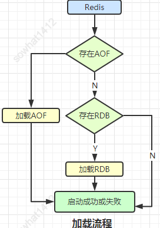
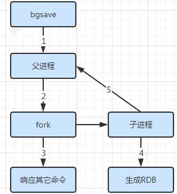
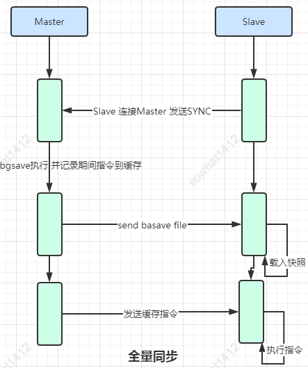
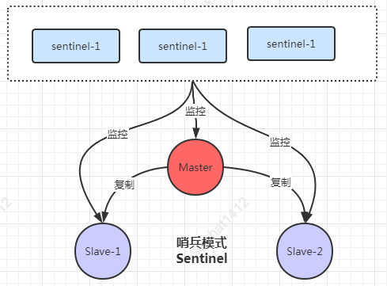
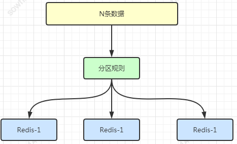
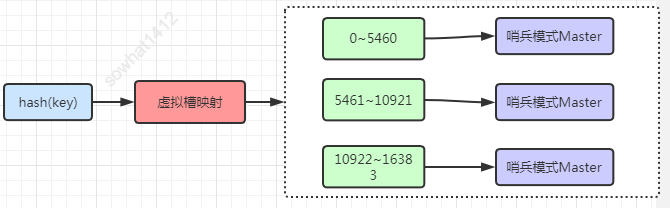
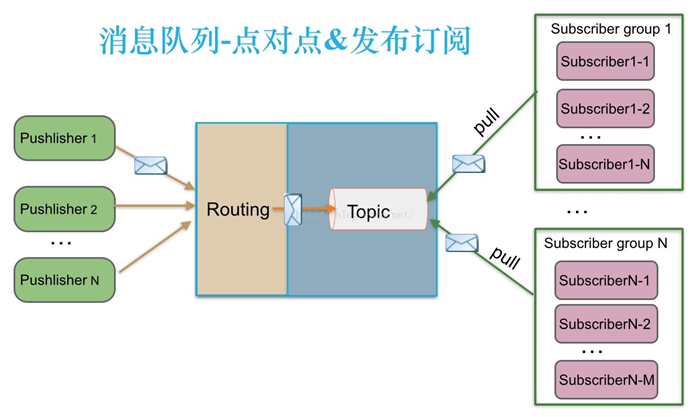

# 面试


1. 架构师
   
   - [JVM](#JVM)
   
2. 项目经理

3. 产品经理

4. 面试题

   - MySQL

     - [1.MySQL日志](#1.MySQL日志)

     - [2.MySQL锁和事务](2.MySQL锁和事务)

   - Redis

     - [1.Redis 持久化机制](#1.Redis 持久化机制)
     - [2.Redis过期策略和内存淘汰策略](#2.Redis过期策略和内存淘汰策略)
  - [3.Redis集群](#3.Redis集群)
   
- [API网关](#API网关)
   
- [消息队列](#消息队列)
   
- [代理模式](#代理模式)
   
- [消费者模式](#消费者模式)
   
- [JS闭包](#JS闭包)
   
   - [.NET多线程](.NET多线程)


## 架构师


### JVM

JVM 是每一个开发人员必备的技能，推荐看国内比较经典的 JVM 书籍，里面包含 JVM 的内存接口，类的加载机制等基础知识，是不是觉得这些在面试中似曾相识？所以对于 JVM 方面的知识的巩固与其在网上看一些零零碎碎的文章不如啃一下这本书。

《深入理解 Java 虚拟机：JVM 高级特性与最佳实践（第2版）》，当然了如果你的英文好强烈推荐看 Oracle 最新发布的 JAVA 虚拟机规范。

在啃书的时候切记不能图快，***你对知识的积累不是通过看书的数量来决定，而是看书的深度***。所以在看每一章节的时候看到不懂的要配合网上的文章理解，并且需要看几篇文章理解，因为一篇文章很可能是错误的，小编认为文章的可信度顺序：自建域名 > github.io > SF > 简书 = 博客园 > CSDN > 转载。


### 算法

#### Java 集合&工具类

这一个分类是每一个人必须掌握的并熟练使用的，那么为什么我把他们放在一起呢？ 

因为工具和集合类都源于算法，在准备算法复习之前你要理解，为什么要必考算法。正式因为排序算法和我们编程息息相关。举两个“栗子”。

你可以看一下 Collections 中的 mergeSort 和 sort 方法，你会发现 mergeSort 就是归并排序的实现，而 sort 方法结合了归并排序和插入排序，这样使得 sort 方法最差O(NlogN)最好可以达到O(N)的效果。那么只有你自己理解了排序方法的实现，才能更好的使用 JAVA 中的集合类啊？

第二个“栗子”，大家都听闻过 TopN 问题吧，经常在面试中遇到请写一下 TopN 的实现，说到算法它就是一个大顶堆，说到 JAVA 它是一个 PriorityQueue 的实现，那么你理解了 TopN 问题，知道他的时间复杂度，优缺点了，那么是不是就可以熟练运用 JAVA 的工具类写更高效的程序了？

之所以排序算法和 JAVA 集合&工具类 一样重要是因为它们和我们每天的编程息息相关。面试官总是问排序算法也不是在难为你，而是在考察你的编程功底。所以你需要对着排序算法和基本的算法配合 JAVA 的集合类、工具类仔细的研究一番，这样才能更深入的理解他们的关联关系。 

https://leetcode-cn.com/


### 多线程和并发

多线程和并发包，重要性就不累述了，直接说一下学习方法。你首先要理解多线程不仅仅是 Thread 和 Runnable 那么简单，整个并发包下面的工具都是在为多线程服务。对于多线程的学习切不可看几篇面试文章，或者几个关键字 CountDownLatch，Lock 巴拉巴拉就以为理解了多线程的精髓，你需要自己梳理一个大图，对里面的类各个击破，他们的使用场景，优缺点。当然你需要配合源码看，源码就是大图里面的每一个源码，和上面讲的 JVM 一样，不要着急马上看完，而是看懂每一个地方是为什么。看的差不多你就会发现，其实他和 JAVA 集合类、工具类密不可分。那么自然把它列为重要知识点的原因不言而喻。


### 存储

我们平时常用的工具：Redis，MySQL，ElasticSearch。

它的知识点分为两方面，一方面是你平时使用过程中积累的经验，另一方面是你对其的深入理解。所以对这个地方的建议就是通过书籍来巩固技术知识。《Redis设计与实现（数据库技术丛书）》，《高性能 MySQL》，《ElasticSearch 权威指南》这三本书不一定是该领域最好的书籍，但是如果你吃透了，对于你对知识的理解和程序的设计必定有很大帮助。书里面的内容太多，还是举两个“栗子”。

第一个“栗子”，使用 Redis 切不可只用他当做 key-value 缓存数据库。小编了解到它的5种基本类型中一种类型叫做 sorted set。sorted set 里 items 内容大于 64 的时候同时使用了 hash 和 skiplist 两种设计实现。这也会为了排序和查找性能做的优化。添加和删除都需要修改 skiplist，所以复杂度为 O(log(n))。 但是如果仅仅是查找元素的话可以直接使用 hash，其复杂度为 O(1) ，其他的 range 操作复杂度一般为 O(log(n))，当然如果是小于 64 的时候，因为是采用了 ziplist 的设计，其时间复杂度为 O(n)。这样以后查询和更新阅读都变得简单，那是不是可以用其实现 TopN 的需求呢？这样类似的需求就不需要你查数据，再在内存里面计算和操作了。比如我们简单的周排行，月排行都可以考虑使用这个数据结构实现，当然并不一定这是最好的解决方案，而是提供了一种解题思路。 

另一个“栗子”，PriorityQueue 是优先队列我们上文已经了解，那么 ElasticSearch 的 query 也是用的优先队列分别在每一个分片上面获取，然后再合并优先队列你了解吗？这个“栗子”告诉我们其实算法是想通的，你理解一个便可以举一反三触类旁通。


### 框架

Spring，SpringMVC，Spring Boot

一谈框架就想起来 Spring，一说 Spring 就想起来 IOC，AOP。因为大家都在用这个框架，所以对于框架也不需要看一些其他的，直接就深入了解一下 Spring 就可以了。通过上面的叙述你已经了解了小编的思路，看什么都要看他的实现原理，所以直接推荐你一本书《Spring 技术内幕》然后对着自己现有的 Spring 项目 Debug，从请求的流转梳理知识点。Spring 出来这么久大家对基本的知识已经了然于胸，重要的是看其解决问题的思路和原理，栗子又来了。 

比如需要实现在 Bean 刚刚初始化的时候做一些操作，是不是需要使用 InitializingBean？那么具体怎么使用，它的原理是什么，Spring Bean 的生命周期是什么样子，通过具体的使用场景逐步展开说明。这样复习效果会更好一些，然后再逐步的思考每一个知识点里面涉及的更多的知识点，比如 AOP 里面的 Proxy 都是基于什么原理实现，有什么优缺点。


### 分布式


#### Dubbo

这是一个老生常谈的话题，也是这几年比较火的话题，说起分布式就一定和 Dubbo 有关系，但是不能仅仅就理解到 Dubbo。

首先我们需要思考它解决的问题，为什么要引入 Dubbo 这个概念。随着业务的发展、用户量的增长，系统数量增多，调用依赖关系也变得复杂，为了确保系统高可用、高并发的要求，系统的架构也从单体时代慢慢迁移至服务SOA时代，应运而生的 Dubbo 出现了，它作为 RPC 的出现使得我们搭建微服务项目变得简单，但是我们不仅仅要思考 Dubbo 带来的框架支撑。

同时需要思考服务的幂等、分布式事务、服务之间的 Trace 定位、分布式日志、数据对账、重试机制等，与此同时考虑 MQ 对系统的解耦和压力的分担、数据库分布式部署和分库分表、限流、熔断等机制。

所以最终总结是不仅仅要看 Dubbo 的使用、原理同时还要思考上下游和一些系统设计的问题，这块相对的知识点较多，可以针对上面抛出来的点各个击破。


### 设计模式

设计模式很多，但是常用的就几种，这个地方可以分两个地方准备。

1. 学以致用，设计模式不是背出来的，而是用出来了。平时多注意思考当前项目的设计，是否可以套用设计模式，当然必须先理解每一个设计模式存在的意义。 

2. 在现有框架中思考设计模式的体现，上面已经讲过框架怎么学习，用 Spring 举例，它里面一共用了9种设计模式，你都知道用到哪里了吗？如果不知道，试着把他们找出来，同时思考为什么这么设计，全部找到以后，基本的设计模式的用法和原理你也就都理解了。


## 项目经理


## 产品经理


## 面试题


## MySQL

#### 1.MySQL日志


#### 2.MySQL锁和事务


### Redis

#### 1.Redis 持久化机制

**怎么保证 Redis 挂掉之后再重启数据可以进行恢复？**

Redis 不同于 Memcached 的很重要一点就是，Redis 支持持久化，而且支持两种不同的持久化操作。

- **快照（snapshotting，RDB）**
- **只追加文件（append-only file, AOF）**。

**快照（snapshotting）持久化（RDB）**

Redis 可以通过创建快照来获得存储在内存里面的数据在某个时间点上的副本。Redis 创建快照之后，可以对快照进行备份，可以将快照复制到其他服务器从而创建具有相同数据的服务器副本（Redis 主从结构，主要用来提高 Redis 性能），还可以将快照留在原地以便重启服务器的时候使用。

快照持久化是 Redis 默认采用的持久化方式，在 Redis.conf 配置文件中默认有此下配置：

```
save 900 1           #在900秒(15分钟)之后，如果至少有1个key发生变化，Redis就会自动触发BGSAVE命令创建快照。

save 300 10          #在300秒(5分钟)之后，如果至少有10个key发生变化，Redis就会自动触发BGSAVE命令创建快照。

save 60 10000        #在60秒(1分钟)之后，如果至少有10000个key发生变化，Redis就会自动触发BGSAVE命令创建快照。
```

同步触发：

- `save` 命令，会阻塞其他所有命令的执行，直到持久化完成；
- 如果存在旧的 RDB 文件，会用新的来替换；
- 复杂度 O(n)，包含所有的数据。

异步触发：

- `bgsave` 命令，创建一个子进程实现数据持久化，完成后通知主进程；
- 不会阻塞其他命令的执行，客户端可以随时访问；
- 文件策略和复杂度都与 save 相同。

自动触发：基于修改数据数量或时间，自动执行持久化。

其他机制：全量复制、debug reload、shutdown。

**AOF（append-only file）持久化**

与快照持久化相比，AOF 持久化 的实时性更好，因此已成为主流的持久化方案。默认情况下 Redis 没有开启 AOF（append only file）方式的持久化，可以通过 appendonly 参数开启：

```
appendonly yes
```

开启 AOF 持久化后每执行一条会更改 Redis 中的数据的命令，Redis 就会将该命令写入硬盘中的 AOF 文件。AOF 文件的保存位置和 RDB 文件的位置相同，都是通过 dir 参数设置的，默认的文件名是 appendonly.aof。

在 Redis 的配置文件中存在三种不同的 AOF 持久化方式，它们分别是：

```
appendfsync always    #每次有数据修改发生时都会写入AOF文件,这样会严重降低Redis的速度
appendfsync everysec  #每秒钟同步一次，显示地将多个写命令同步到硬盘
appendfsync no        #让操作系统决定何时进行同步
```

为了兼顾数据和写入性能，用户可以考虑 appendfsync everysec 选项 ，让 Redis 每秒同步一次 AOF 文件，Redis 性能几乎没受到任何影响。而且这样即使出现系统崩溃，用户最多只会丢失一秒之内产生的数据。当硬盘忙于执行写入操作的时候，Redis 还会优雅的放慢自己的速度以便适应硬盘的最大写入速度。

**相关 issue** ：[783：Redis 的 AOF 方式](https://github.com/Snailclimb/JavaGuide/issues/783)

**拓展：Redis 4.0 对于持久化机制的优化**

Redis 4.0 开始支持 RDB 和 AOF 的混合持久化（默认关闭，可以通过配置项 `aof-use-rdb-preamble` 开启）。

如果把混合持久化打开，AOF 重写的时候就直接把 RDB 的内容写到 AOF 文件开头。这样做的好处是可以结合 RDB 和 AOF 的优点, 快速加载同时避免丢失过多的数据。当然缺点也是有的， AOF 里面的 RDB 部分是压缩格式不再是 AOF 格式，可读性较差。

**恢复**

启动时会先检查AOF(数据更完整)文件是否存在，如果不存在就尝试加载RDB。



**补充内容：AOF 重写**

AOF 重写可以产生一个新的 AOF 文件，这个新的 AOF 文件和原有的 AOF 文件所保存的数据库状态一样，但体积更小。

AOF 重写是一个有歧义的名字，该功能是通过读取数据库中的键值对来实现的，程序无须对现有 AOF 文件进行任何读入、分析或者写入操作。

在执行 BGREWRITEAOF 命令时，Redis 服务器会维护一个 AOF 重写缓冲区，该缓冲区会在子进程创建新 AOF 文件期间，记录服务器执行的所有写命令。当子进程完成创建新 AOF 文件的工作之后，服务器会将重写缓冲区中的所有内容追加到新 AOF 文件的末尾，使得新旧两个 AOF 文件所保存的数据库状态一致。最后，服务器用新的 AOF 文件替换旧的 AOF 文件，以此来完成 AOF 文件重写操作


基本配置：

- auto-aof-rewrite-min-size：AOF 文件重写需要的大小；
- auto-aof-rewrite-percentage：AOF 文件增长率

统计指标：

- aofcurrentsize：AOF 当前大小
- aof-base-size：AOF 上次启动和重写的大小

需要同时满足以下条件才会触发：

- aof_current_size > auto-aof-rewrite-min-size
- aof_current_size - aof_base_size/aof_base_size > auto-aof-rewrite-percentage

**补充内容：两种方式对比**

| 命令       | RDB                            | AOF                              |
| ---------- | ------------------------------ | -------------------------------- |
| 启动优先级 | 低，默认关闭                   | 高，建议打开（缓存场景）         |
| 占用空间   | 二进制存储且压缩，占用空间较小 | 以原始日志形式存储，占用空间较大 |
| 写入开销   | 全量存储数据，开销较大         | 日志追加写入，开销较小           |
| 恢复速度   | 快                             | 慢                               |
| 数据安全性 | 有可能丢失数据                 | 根据策略而定                     |

1. RDB更适合做冷备

   **优点：**

   1、压缩后的二进制文，适用于备份、全量复制，用于灾难恢复加载RDB恢复数据远快于AOF方式，适合大规模的数据恢复。

   2、如果业务对数据完整性和一致性要求不高，RDB是很好的选择。数据恢复比AOF快。

   **缺点：**

   1、RDB是**周期间隔性的快照文件**，数据的完整性和一致性不高，因为RDB可能在最后一次备份时宕机了。

   2、备份时占用内存，因为Redis 在备份时会独立fork一个**子进程**，将数据写入到一个临时文件（此时内存中的数据是原来的两倍哦），最后再将临时文件替换之前的备份文件。所以要考虑到大概两倍的数据膨胀性。

   **注意手动触发及COW：**

   1、`SAVE` 直接调用 rdbSave ，`阻塞` Redis 主进程，导致无法提供服务。2、`BGSAVE` 则 fork 出一个子进程，子进程负责调用 rdbSave ，在保存完成后向主进程发送信号告知完成。在BGSAVE 执行期间**仍可以继续处理客户端的请求**。

   3、Copy On Write 机制，备份的是开始那个时刻内存中的数据，只复制被修改内存页数据，不是全部内存数据。

   4、Copy On Write 时如果父子进程大量写操作会导致分页错误。



2. AOF更适合做热备。

   优点：AOF是一秒一次去通过一个后台的线程fsync操作，数据丢失不用怕。

   缺点：

   1、对于相同数量的数据集而言，AOF文件通常要大于RDB文件。RDB 在**恢复**大数据集时的速度比 AOF 的恢复速度要快。

   2、根据同步策略的不同，AOF在运行效率上往往会慢于RDB。总之，每秒同步策略的效率是比较高的。

   **AOF整个流程分两步**：第一步是命令的实时写入，不同级别可能有1秒数据损失。命令先追加到`aof_buf`然后再同步到AO磁盘，**如果实时写入磁盘会带来非常高的磁盘IO，影响整体性能**。

   第二步是对aof文件的**重写**，目的是为了减少AOF文件的大小，可以自动触发或者手动触发(**BGREWRITEAOF**)，是Fork出子进程操作，期间Redis服务仍可用。

   1、在重写期间，由于主进程依然在响应命令，为了保证最终备份的完整性；它`依然会写入旧`的AOF中，如果重写失败，能够保证数据不丢失。

   2、为了把重写期间响应的写入信息也写入到新的文件中，因此也会`为子进程保留一个buf`，防止新写的file丢失数据。

   3、重写是直接把`当前内存的数据生成对应命令`，并不需要读取老的AOF文件进行分析、命令合并。

   4、**无论是 RDB 还是 AOF 都是先写入一个临时文件，然后通过`rename`完成文件的替换工作**。

   关于Fork的建议：

   1、降低fork的频率，比如可以手动来触发RDB生成快照、与AOF重写；

   2、控制Redis最大使用内存，防止fork耗时过长；

   3、配置牛逼点，合理配置Linux的内存分配策略，避免因为物理内存不足导致fork失败。

   4、Redis在执行`BGSAVE`和`BGREWRITEAOF`命令时，哈希表的负载因子>=5，而未执行这两个命令时>=1。目的是**尽量减少写操作**，避免不必要的内存写入操作。

   5、**哈希表的扩展因子**：哈希表已保存节点数量 / 哈希表大小。因子决定了是否扩展哈希表。


#### 2.Redis过期策略和内存淘汰策略

rRedis中 过期策略 通常有以下三种：

1、**定时过期**：

> 每个设置过期时间的key都需要创建一个定时器，到过期时间就会立即对key进行清除。该策略可以立即清除过期的数据，对内存很友好；但是**会占用大量的CPU资源去处理过期的数据**，从而影响缓存的响应时间和吞吐量。

2、**惰性过期**：

> 只有当访问一个key时，才会判断该key是否已过期，过期则清除。该策略可以最大化地节省CPU资源，却**对内存非常不友好**。极端情况可能出现大量的过期key没有再次被访问，从而不会被清除，占用大量内存。

3、**定期过期**：

> 每隔一定的时间，会扫描一定数量的数据库的expires字典中一定数量的key，并清除其中已过期的key。该策略是前两者的一个折中方案。通过调整定时扫描的时间间隔和每次扫描的限定耗时，可以在不同情况下使得CPU和内存资源**达到最优**的平衡效果。
>
> expires字典会保存所有设置了过期时间的key的过期时间数据，其中 key 是指向键空间中的某个键的指针，value是该键的毫秒精度的UNIX时间戳表示的过期时间。键空间是指该Redis集群中保存的所有键。

Redis采用的过期策略：`惰性删除` + `定期删除`。memcached采用的过期策略：`惰性删除`。

**1、定期删除**

Redis 默认会每秒进行十次过期扫描，过期扫描不会遍历过期字典中所有的 key，而是采用了一种简单的贪心策略。

从过期字典中随机 20 个 key；删除这 20 个 key 中已经过期的 key；如果过期的 key 比率超过 1/4，那就重复步骤 1；同时，为了保证过期扫描不会出现循环过度，导致线程卡死现象，算法还增加了扫描时间的上限，默认不会超过 25ms。

如果某一时刻，有大量key同时过期，Redis 会持续扫描过期字典，造成客户端响应卡顿，因此设置过期时间时，就尽量避免这个问题，在设置过期时间时，可以给过期时间设置一个随机范围，避免同一时刻过期。

**1.1 如何配置定期删除执行时间间隔**

redis的定时任务默认是10s执行一次，如果要修改这个值，可以在redis.conf中修改hz的值。

redis.conf中，hz默认设为10，提高它的值将会占用更多的cpu，当然相应的redis将会更快的处理同时到期的许多key，以及更精确的去处理超时。hz的取值范围是1~500，通常不建议超过100，只有在请求延时非常低的情况下可以将值提升到100。

**1.2 单线程的redis，如何知道要运行定时任务？**

redis是单线程的，线程不但要处理定时任务，还要处理客户端请求，线程不能阻塞在定时任务或处理客户端请求上，那么，redis是如何知道何时该运行定时任务的呢？

Redis 的定时任务会记录在一个称为最小堆的数据结构中。这个堆中，最快要执行的任务排在堆的最上方。在每个循环周期，Redis 都会将最小堆里面已经到点的任务立即进行处理。处理完毕后，将最快要执行的任务还需要的时间记录下来，这个时间就是接下来处理客户端请求的最大时长，若达到了该时长，则暂时不处理客户端请求而去运行定时任务。

**2、懒惰删除**

定时删除策略中，从删除方法来看，必然会导致有key过期了但未从redis中删除的情况。

面对这种情况，redis在操作一个key时，会先判断这个值是否过期，若已过期，则删除该key；若未过期，则进行后续操作。

**aof、rdb和复制功能对过期键的处理**

1、rdb

生成rdb文件：生成时，程序会对键进行检查，过期键不放入rdb文件。

载入rdb文件：载入时，如果以主服务器模式运行，程序会对文件中保存的键进行检查，未过期的键会被载入到数据库中，而过期键则会忽略；如果以从服务器模式运行，无论键过期与否，均会载入数据库中，过期键会通过与主服务器同步而删除。

2、aof

当服务器以aof持久化模式运行时，如果数据库中的某个键已经过期，但它还没有被删除，那么aof文件不会因为这个过期键而产生任何影响；当过期键被删除后，程序会向aof文件追加一条del命令来显式记录该键已被删除。

aof重写过程中，程序会对数据库中的键进行检查，已过期的键不会被保存到重写后的aof文件中。

3、复制

当服务器运行在复制模式下时，从服务器的过期删除动作由主服务器控制：

主服务器在删除一个过期键后，会显式地向所有从服务器发送一个del命令，告知从服务器删除这个过期键;

从服务器在执行客户端发送的读命令时，即使碰到过期键也不会将过期键删除，而是继续像处理未过期的键一样来处理过期键;

从服务器只有在接到主服务器发来的del命令后，才会删除过期键。

Redis 的过期清理策略：

- 定期删除：默认是每隔 100ms 就随机抽取一些设置了过期时间的 key，检查其是否过期，如果过期就删除；缺点是如果大量的 key 过期时遍历删除会严重影响性能、随机抽取也会导致一些 key 过期后仍一直留存；
- 惰性删除：获取 key 的时候，如果此时 key 已经过期，就删除，不会返回任何东西；缺点是对于过期又不再需要访问的 key 无法被删除。

对于以上两种情况无法有效清理过期的 key，因此 Redis 可以设置内存最大使用量，超出用量时根据数据淘汰策略清理：

| 策略             | 描述                                                 |
| ---------------- | ---------------------------------------------------- |
| `volatile-lru`   | 从已设置过期时间的数据集中挑选最近最少使用的数据淘汰 |
| `volatile-ttl`   | 从已设置过期时间的数据集中挑选将要过期的数据淘汰     |
| `latile-random`  | 从已设置过期时间的数据集中任意选择数据淘汰           |
| `llkeys-lru`     | 从所有数据集中挑选最近最少使用的数据淘汰             |
| `allkeys-random` | 从所有数据集中任意选择数据进行淘汰                   |
| `noeviction`     | 禁止驱逐数据                                         |

作为内存数据库，出于对性能和内存消耗的考虑，Redis 的淘汰算法实际实现上并非针对所有 key，而是抽样一小部分并且从中选出被淘汰的 key。

使用 Redis 缓存数据时，为了提高缓存命中率，需要保证缓存数据都是热点数据。可以将内存最大使用量设置为热点数据占用的内存量，然后启用 `allkeys-lru` 淘汰策略，将最近最少使用的数据淘汰。

Redis 4.0 引入了 `volatile-lfu` 和 `allkeys-lfu` 淘汰策略，LFU 策略通过统计访问频率，将访问频率最少的键值对淘汰。


#### 3.Redis集群

单机问题有机器故障、容量瓶颈、QPS瓶颈。在实际应用中，Redis的多机部署时候会涉及到`redis主从复制`、`Sentinel哨兵模式`、`Redis Cluster`。

Redis集群策略主要有:

- 主从复制
- 哨兵模式
- 集群
- 分片

集群简介：

- redis 是一个开源的 key-value 存储系统，受到了广大互联网公司的青睐。redis3.0版本之前只支持单例模式，在3.0版本及以后才支持集群；
- redis 集群采用 P2P 模式，是完全去中心化的，不存在中心节点或者代理节点；
- redis 集群是没有统一的入口的，客户端（client）连接集群的时候连接集群中的任意节点（node）即可，集群内部的节点是相互通信的（PING-PONG机制），每个节点都是一个 redis 实例；
- 为了实现集群的高可用，即判断节点是否健康（能否正常使用），redis-cluster有这么一个投票容错机制：如果集群中超过半数的节点投票认为某个节点挂了，那么这个节点就挂了（fail）。这是判断节点是否挂了的方法；
- 那么如何判断集群是否挂了呢？如果集群中任意一个节点挂了，而且该节点没有从节点（备份节点），那么这个集群就挂了。这是判断集群是否挂了的方法；
- 那么为什么任意一个节点挂了（没有从节点）这个集群就挂了呢？因为集群内置了16384个slot（哈希槽），并且把所有的物理节点映射到了这16384[0-16383]个slot上，或者说把这些slot均等的分配给了各个节点。当需要在Redis集群存放一个数据（key-value）时，redis会先对这个key进行crc16算法，然后得到一个结果。再把这个结果对16384进行求余，这个余数会对应[0-16383]其中一个槽，进而决定key-value存储到哪个节点中。所以一旦某个节点挂了，该节点对应的slot就无法使用，那么就会导致集群无法正常工作。
- 综上所述，每个Redis集群理论上最多可以有16384个节点。

| 模式          | 优点                             | 缺点                                              |
| :------------ | :------------------------------- | :------------------------------------------------ |
| 单机版        | 架构简单，部署方便               | 机器故障、容量瓶颈、QPS瓶颈                       |
| 主从复制      | 高可靠性，读写分离               | 故障恢复复杂，主库的写跟存受单机限制              |
| Sentinel 哨兵 | 集群部署简单，HA                 | 原理繁琐，slave存在资源浪费，不能解决读写分离问题 |
| Redis Cluster | 数据动态存储solt，可扩展，高可用 | 客户端动态感知后端变更，批量操作支持查            |

##### 主从复制

数据从线上 Redis 实例（主）复制到新启动 Redis 实例（从），提供备份和读写分离；

几种流行的Redis集群解决方案都没有将一个key写到多个节点中，若某个节点故障则无法访问访问其上的key这显然是不满足集群的分区容错性的。

Redis集群使用主从模型(master-slave)来提高可靠性。每个master节点上绑定若干个slave节点（哨兵模式下，当master节点故障时集群会推举它的某个slave节点代替master节点）。

使用 **主从复制**，解决 **单点故障**、**容量瓶颈** 和 **QPS瓶颈** 的问题。

使用 slaveof host port 异步命令 或 配置文件 可以让一个节点成为另一个节点的从节点，并复制数据；

从节点在从主节点上同步数据时会把旧数据都清空，同步后只允许读，不能写入数据；

一个主节点可以有多个从节点，但一个从节点只能有一个主节点，并且不支持主主复制。

Redis主从复制常用的几种方式：

- 一主二仆 A（B、C） 一个Master两个Slave
- 薪火相传（去中心化） A-B-C，B既是主节点（C的主节点），又是从节点（A的从节点）
- 反客为主（主节点down掉后，手动操作升级从节点为主节点）
- 哨兵模式（反客为主的自动版，即主节点down掉后，从节点会自动升级为主节点）

参考：[https://blog.csdn.net/weixin_41846320/article/details/83753667](https://blog.csdn.net/weixin_41846320/article/details/83753667)

**复制过程**

同步(sync) + 命令传播(command propagate)

1. 主服务器创建快照文件，发送给从服务器，并在发送期间使用缓冲区记录执行的写命令。快照文件发送完毕之后，开始向从服务器发送存储在缓冲区中的写命令；
2. 从服务器丢弃所有旧数据，载入主服务器发来的快照文件，之后从服务器开始接受主服务器发来的写命令；
3. 主服务器每执行一次写命令，就向从服务器发送相同的写命令。

**全量复制**

主节点所有数据同步到从节点，包括同步过程中产生的数据。




Redis全量复制一般发生在**Slave初始化阶段**，这时Slave需要将Master上的**所有数据**都复制一份：

> 1、slave连接master，发送`psync`命令。
>
> 2、master接收到`psync`命名后，开始执行bgsave命令生成RDB文件并使用缓冲区记录此后执行的所有写命令。
>
> 3、master发送快照文件到slave，并在发送期间继续记录被执行的写命令。4、slave收到快照文件后丢弃所有旧数据，载入收到的快照。
>
> 5、master快照发送完毕后开始向slave发送缓冲区中的写命令。
>
> 6、slave完成对快照的载入，开始接收命令请求，并执行来自master缓冲区的写命令。

**增量复制**

也叫**指令同步**，就是从库重放在主库中进行的指令。Redis会把指令存放在一个**环形队列**当中，因为内存容量有限，如果备机一直起不来，不可能把所有的内存都去存指令，也就是说，如果备机一直未同步，指令可能会被覆盖掉。


Redis增量复制是指Slave初始化后开始正常工作时master发生的写操作同步到slave的过程。增量复制的过程主要是master每执行一个写命令就会向slave发送相同的写命令。

如果主从间网络状况不好，从节点上可能会发生部分数据丢失，这时候再进行一次全量复制开销会很大。可以采用部分复制策略


**主从链**

随着负载不断上升，主服务器可能无法很快地更新所有从服务器，或者重新连接和重新同步从服务器将导致系统超载。为了解决这个问题，可以创建一个中间层来分担主服务器的复制工作。中间层的服务器是最上层服务器的从服务器，又是最下层服务器的主服务器。


**常见问题**

- 同步故障
- 读写分离：将主节点读流量分摊到从节点。但可能存在以下问题：
  - 复制数据延迟（不一致）；
  - 读取过期数据（Slave不能删除数据）；
  - 从节点故障；
  - 主节点故障。
- 配置不一致
- maxmemory不一致：丢失数据；
- 优化参数不一致：内存不一致。

**规避全量复制：**

全量复制开销较大，除了第一次以外，应该尽量规避。

- 可以选择小主节点（分片）、低峰期间操作。
- 如果节点运行 id 不匹配（如主节点重启、运行 id 发生变化），此时要执行全量复制，应该配合哨兵和集群解决。
- 主从复制挤压缓冲区不足产生的问题（网络中断，部分复制无法满足），可增大复制缓冲区（rel_backlog_size 参数）。

**复制风暴**

- 单主节点复制风暴：主节点宕机恢复之后，所有的从节点会重新执行复制，开销非常大。解决方法是更换复制拓扑，把 “一主 - 多从” 替换成 “一主 - 一从 - 多从从” 或更好的拓扑，有效减少多节点复制的压力；
- 单机器复制风暴：一台机器上运行多个主实例，机器宕机后所有实例都要进行复制。解决方法是把主节点分散到多台机器，或改成高可用架构（从节点接替主节点）。

##### Redis主从同步策略：

> 1、`主从刚刚连接的时候，进行全量同步；全同步结束后，进行增量同步`。当然，如果有需要，slave 在任何时候都可以发起全量同步。redis 策略是，无论如何，首先会尝试进行增量同步，如不成功，要求从机进行全量同步。2、slave在同步master数据时候如果slave丢失连接不用怕，slave在重新连接之后`丢失重补`。
>
> 3、一般通过主从来实现读写分离，但是如果master挂掉后如何保证Redis的 HA呢？引入`Sentinel`进行master的选择。

##### 高可用之哨兵模式



Redis-sentinel  本身是一个**独立**运行的进程，一般sentinel集群 节点数至少三个且奇数个，它能监控多个master-slave集群，sentinel节点发现master宕机后能进行自动切换。Sentinel可以监视任意多个主服务器以及主服务器属下的从服务器，并在被监视的主服务器下线时，**自动执行故障转移操作**。这里需注意`sentinel`也有`single-point-of-failure`问题。大致罗列下哨兵用途：

> 集群监控：循环监控master跟slave节点。
>
> 消息通知：当它发现有redis实例有故障的话，就会发送消息给管理员 
>
> 故障转移：这里分为主观下线(单独一个哨兵发现master故障了)。客观下线(多个哨兵进行抉择发现达到quorum数时候开始进行切换)。
>
> 配置中心：如果发生了故障转移，它会通知将master的新地址写在配置中心告诉客户端。

##### Redis Cluster

RedisCluster是Redis的分布式解决方案，在3.0版本后推出的方案，有效地解决了Redis分布式的需求。



**分区规则**



常见的分区规则

> 1. `节点取余`：hash(key) % N
> 2. `一致性哈希`：一致性哈希环
> 3. `虚拟槽哈希`：CRC16[key] & 16383

RedisCluster采用了`虚拟槽分区`方式，具题的实现细节如下：

> 1、采用去**中心化**的思想，它使用**虚拟槽solt分区**覆盖到所有节点上，取数据一样的流程，节点之间使用轻量协议通信**Gossip**来减少带宽占用所以性能很高， 
>
> 2、自动实现**负载均衡与高可用**，自动实现**failover**并且支持**动态扩展**，官方已经玩到可以1000个节点 实现的复杂度低。
>
> 3、每个Master也需要配置主从，并且内部也是采用**哨兵模式**，如果有半数节点发现某个异常节点会共同决定更改异常节点的状态。
>
> 4、如果集群中的master没有slave节点，则master挂掉后整个集群就会进入**fail**状态，因为集群的slot映射不完整。**如果集群超过半数以上的master挂掉，集群都会进入fail状态**。
>
> 5、官方推荐 **集群部署至少要3台以上的master节点**。


**基本概念：**

**HashTag**

HashTag机制可以影响key被分配到的slot，从而可以使用那些被限制在slot中操作。

HashTag即是用 `{}` 包裹key的一个子串，如`{user:}1`, `{user:}2`。

在设置了HashTag的情况下，集群会根据HashTag决定key分配到的slot，两个key拥有相同的HashTag:`{user:}`, 它们会被分配到同一个slot，允许我们使用MGET命令。

通常情况下，HashTag不支持嵌套，即将第一个 `{` 和第一个 `}` 中间的内容作为HashTag。若花括号中不包含任何内容则会对整个key进行散列，如`{}user:`。

HashTag可能会使过多的key分配到同一个slot中，造成数据倾斜影响系统的吞吐量，务必谨慎使用。

**通信机制**

集群元数据的维护有两种方式：集中式、Gossip 协议。

redis cluster 节点间采用 Gossip 协议进行通信。

**集中式：**

将集群元数据（节点信息、故障等等）集中存储在某个节点上。集中式的好处在于，元数据的读取和更新，时效性非常好，一旦元数据出现了变更，就立即更新到集中式的存储中，其它节点读取的时候就可以感知到；不好在于，所有的元数据的更新压力全部集中在一个地方，可能会导致元数据的存储有压力。


集中式元数据集中存储的一个典型代表，就是大数据领域的 storm。它是分布式的大数据实时计算引擎，是集中式的元数据存储的结构，底层基于 zookeeper（分布式协调的中间件）对所有元数据进行存储维护。

**Gossip协议**

redis 维护集群元数据采用 Gossip 协议：所有节点都持有一份元数据，不同的节点如果出现了元数据的变更，就不断将元数据发送给其它的节点，让其它节点也进行元数据的变更。

其好处在于元数据的更新比较分散，不是集中在一个地方，更新请求会陆陆续续打到所有节点上执行，降低了压力；缺点在于元数据的更新有延时，可能导致集群中的一些操作会有一些滞后。

10000 端口：每个节点都有一个专门用于节点间通信的端口，就是自己提供服务的端口号+10000。每个节点每隔一段时间都会往其他节点发送 ping 消息，接收到 ping 之后节点会返回 pong。

交换信息：信息包括故障信息，节点的增加和删除，hash slot 信息等等。

**Gossip消息**

Gossip 协议包含多种消息：

- meet：某个节点发送 meet 给新加入的节点，让新节点加入集群中，然后新节点就会开始与其它节点进行通信：redis-trib.rb add-node，其实内部就是发送了一个 gossip meet 消息给新加入的节点，通知那个节点去加入我们的集群。
- ping：每个节点都会频繁给其它节点发送ping，其中包含自己的状态还有自己维护的集群元数据，互相通过 ping 交换元数据。
- pong：返回 ping 和 meeet，包含自己的状态和其它信息，也用于信息广播和更新。
- fail：某个节点判断另一个节点 fail 之后，就发送 fail 给其它节点，通知其它节点说，某个节点宕机啦。

其中 ping 消息会携带一些元数据，如果很频繁，可能会加重网络负担：

- 每个节点每秒会执行 10 次 ping，每次会选择 5 个最久没有通信的其它节点。

  当然如果发现某个节点通信延时达到了 cluster_node_timeout / 2，那么立即发送 ping，避免数据交换延时过长（比如两个节点之间都 10 分钟没有交换数据了，那么整个集群处于严重的元数据不一致的情况，就会有问题）。

  cluster_node_timeout 如果调得比较大会降低 ping 的频率。

- 每次 ping 会带上自己节点的信息，还有就是带上 1/10 其它节点的信息，发送出去，进行交换。

  至少包含 3 个其它节点的信息，最多包含 **总节点数减 2** 个其它节点的信息。

**数据分片（寻址）：**

分片是将数据划分为多个部分的方法，可以将数据存储到多台机器里面，这种方法在解决某些问题时可以获得线性级别的性能提升。

| 分布方式 | 描述                                                         | 特点                                                       | 典型产品                  |
| -------- | ------------------------------------------------------------ | ---------------------------------------------------------- | ------------------------- |
| 顺序分布 | 把 id 按顺序平均地划分到不同区间，对应的数据分配到不同的实例中 | 数据分散度易倾斜，键值业务相关，可顺序访问，支持批量操作   | BigTable<br>HBase         |
| 哈希分布 | 使用 CRC32 哈希函数将键转换为 hash 值，所得 hash 值取模分配到不同实例中 | 业务分散度高，键值分布业务无关，无法顺序访问，支持批量操作 | MemCache<br>Redis Cluster |

根据执行分片的位置，可以分为三种分片方式：

- 客户端分片：客户端使用一致性哈希等算法决定键应当分布到哪个节点；典型代表为ShardedJedis
- 代理分片：将客户端请求发送到代理上，由代理转发请求到正确的节点上；典型代表为Codis
- 服务器分片：客户端与集群中任意的节点通信，服务端计算 key 在哪一个节点上，若不在当前节点上则通知客户端应访问的节点。典型代表为官方推出的Redis Cluster。

单机版的Redis中单条指令的执行总是原子性的，在集群中则难以保证这一性质，某些指令可能无法在集群中使用或者受到限制。

若需要使用这些指令或需要它们保持原子性，可以采用单机版Redis和集群搭配使用的方法。将主要业务部署在集群上，将需要较多支持的服务部署在单机版Redis上。

**哈希取模**

对于客户端请求的 key，会首先计算 hash 值，然后对节点数取模，分配到不同的 master 节点上。这种做法最简单，但存在以下问题：

- 节点伸缩：数据节点关系变化会导致数据迁移（迁移数量和添加节点数量有关，建议翻倍扩容）；
- 缓存失效：加入某一 master 节点宕机，所有请求过来都会基于最新的剩余可用节点数取模、尝试去取数据。这会导致大部分无法命中缓存的请求流量涌入数据库。

**一致性哈希**

一致性 hash 算法将整个 hash 值空间组织成一个虚拟的圆环，整个空间按顺时针方向组织，下一步将各个 master 节点（ip 或主机名）进行 hash。这样就能确定每个节点在其哈希环上的位置。

对于客户端请求的 key，首先计算 hash 值，并确定此数据在环上的位置，从此位置沿环顺时针移动，遇到的第一个 master 节点就是 key 所在位置。

在一致性哈希算法中增删一个节点受影响的数据仅仅是此节点到环空间前一个节点（沿着逆时针方向行走遇到的第一个节点）之间的数据，其它不受影响（保证节点伸缩、数据迁移受影响范围最小）。

但同样会有问题：一致性哈希算法在节点太少时，容易因为节点分布不均匀而造成缓存热点的问题。可以通过引入虚拟节点机制解决：即对每一个节点计算多个 hash，每个计算结果位置都放置一个虚拟节点。这样就实现了数据的均匀分布，负载均衡。

- 客户端分片：hash + 优化取余
- 节点伸缩：只影响邻近节点，不需要整体上做数据迁移
- 翻倍伸缩：保证最小迁移数据和负载均衡

**虚拟槽**

哈希槽(hash slot)是来自Redis Cluster的概念, 但在各种集群方案都有使用。

redis cluster 有固定的 16384 个 hash slot，对每个 key 计算 CRC16 值，然后对 16384 取模，可以获取 key 对应的 hash slot。

每个 master 都会持有部分 slot（比如有 3 个 master，可能每个 master 持有 5000 多个 hash slot）。因此节点的增加和移除很简单：只需要在 master 之间移动 hash slot 即可，移动成本是非常低的。

客户端的 api，可以对指定的数据，让他们走同一个 hash slot，通过 hash tag 来实现。如果任何一台机器宕机，另外两个节点不受影响。因为 key 找的是 hash slot 不是机器。


以有三个节点的集群为例:

- 节点A包含0到5500号哈希槽
- 节点B包含5501到11000号哈希槽
- 节点C包含11001到16384号哈希槽

这样的设计有利于对集群进行横向伸缩，若要添加或移除节点只需要将该节点上的槽转移到其它节点即可。

在某些集群方案中，涉及多个key的操作会被限制在一个 slot 中，如 Redis Cluster 中的 mget/mset 操作。

**高可用原理**

redis cluster 的高可用的原理，几乎跟哨兵是类似的，直接集成了 replication 和 sentinel 的功能。

**判断节点宕机**

分为主观宕机和客观宕机：

- 主观宕机（pfail）：即一个节点认为另外一个节点宕机。在 cluster-node-timeout 内，某个节点一直没有返回 pong，那么就被认为 pfail。
- 客观宕机（fail）：即多个节点都认为另外一个节点宕机。如果一个节点认为某个节点 pfail 了，那么会在 gossip ping 消息中提示给其他节点，如果超过半数的节点都认为 pfail 了，那么就会变成 fail。

**从节点过滤**

- 对宕机的 master node，从其所有的 slave node 中选择一个切换成 master node；
- 判断标准：检查每个 slave node 与 master node 断开连接的时间，如果超过了 cluster-node-timeout * cluster-slave-validity-factor，就没有资格切换成 master。

**从节点选举**

每个从节点，都根据自己对 master 复制数据的 offset，来设置一个选举时间，offset 越大（复制数据越多）的从节点，选举时间越靠前，优先进行选举。

所有的 master node 开始 slave 选举投票，给要进行选举的 slave 进行投票，如果大部分 master node（N/2 + 1）都投票给了某个从节点，那么选举通过，那个从节点可以切换成 master。

从节点执行主备切换，从节点切换为主节点。

#### Redis&nbsp;Cluster

在分布式架构下：

- 每个节点都负责读写（分配指派槽）；
- 之间相互通信(meet)，所有节点共享指派槽信息，因此客户端请求不需要数据具体在哪个节点；


### API网关

#### 1. 为什么需要API网关？

微服务下一个系统被拆分为多个服务，但是像安全认证，流量控制，日志，监控等功能是每个服务都需要的，没有网关的话，我们就需要在每个服务中单独实现，这使得我们做了很多重复的事情并且没有一个全局的视图来统一管理这些功能。

综上：**一般情况下，网关一般都会提供请求转发、安全认证（身份/权限认证）、流量控制、负载均衡、容灾、日志、监控这些功能。**

上面介绍了这么多功能实际上网关主要做了一件事情：**请求过滤** 。权限校验、流量控制这些都可以通过过滤器实现，请求转发是通过过滤器实现的。


### 消息队列

#### 为什么要使用消息队列？（消息队列的应用场景）

核心3项：**解耦**、**异步**、**削峰**。


（1）点对点&多订阅（因为不删消息，所以这两种就不区分了）。发布者生产一条消息到topic中，不同订阅组消费此消息。



 

对于消费者而言有两种方式从消息中间件获取消息：

① Push方式：由消息中间件主动地将消息推送给消费者；

② Pull方式：由消费者主动向消息中间件拉取消息。

比较：

- 采用Push方式，可以尽可能快地将消息发送给消费者(stream messages to consumers as fast as possible)

- 而采用Pull方式，会增加消息的延迟，即消息到达消费者的时间有点长(adds significant latency per message)。

但是，Push方式会有一个坏处：

如果消费者的处理消息的能力很弱（一条消息需要很长的时间处理），而消息中间件不断地向消费者Push消息，消费者的缓冲区可能会溢出。

ActiveMQ是怎么解决这个问题的呢？那就是[**prefetch limit**](http://activemq.apache.org/what-is-the-prefetch-limit-for.html)

prefetch limit 规定了一次可以向消费者Push（推送）多少条消息。

当推送消息的数量到达了perfetch limit规定的数值时，消费者还没有向消息中间件返回ACK，消息中间件将不再继续向消费者推送消息。

prefetch limit设置的大小根据场景而定：

如果消息的数量很少（生产者生产消息的速率不快），但是每条消息 消费者需要很长的时间处理，那么prefetch limit设置为1比较合适。

这样，消费者每次只会收到一条消息，当它处理完这条消息之后，向消息中间件发送ACK，此时消息中间件再向消费者推送下一条消息。

prefetch limit 设置成0意味着什么？意味着变成 拉pull模式。

push都要设置prefetch。

另外，对于prefetch模式，那么消费需要进行响应ACK。因为服务器需要知道consumer消费的情况。

perfetch limit是“消息预取”的值，这是针对消息中间件如何向消费者发消息 而设置的。

与之相关的还有针对 消费者以何种方式向消息中间件返回确认ACK（响应）：

比如消费者是每次消费一条消息之后就向消息中间件确认呢？还是采用“延迟确认”---即采用批量确认的方式（消费了若干条消息之后，统一再发ACK）。

如果prefetchACK为true，那么prefetch必须大于0；当prefetchACK为false时，你可以指定prefetch为0以及任意大小的正数。

不过，当prefetch=0是，表示consumer将使用PULL（拉取）的方式从broker端获取消息，broker端将不会主动push消息给client端，直到client端发送PullCommand时；

当prefetch>0时，就开启了broker push模式，此后只要当client端消费且ACK了一定的消息之后，会立即push给client端多条消息。

#### 可靠性

**发送端的可靠性**

发送端完成操作后一定能将消息成功发送到消息队列中。

实现方法：在本地数据库建一张消息表，将消息数据与业务数据保存在同一数据库实例里，这样就可以利用本地数据库的事务机制。事务提交成功后，将消息表中的消息转移到消息队列中，若转移消息成功则删除消息表中的数据，否则继续重传。

**接收端的可靠性**

接收端能够从消息队列成功消费一次消息。

两种实现方法：

- 保证接收端处理消息的业务逻辑具有幂等性：只要具有幂等性，那么消费多少次消息，最后处理的结果都是一样的。

- 保证消息具有唯一编号，并使用一张日志表来记录已经消费的消息编号。


### 代理模式


### 消费者模式


### JS闭包

#### 1. 什么是闭包

函数执行后返回结果是一个内部函数，并被外部变量所引用，如果内部函数持有被执行函数作用域的变量，即形成了闭包。

可以在内部函数访问到外部函数作用域。使用闭包，一可以读取函数中的变量，二可以将函数中的变量存储在内存中，保护变量不被污染。而正因闭包会把函数中的变量值存储在内存中，会对内存有消耗，所以不能滥用闭包，否则会影响网页性能，造成内存泄漏。当不需要使用闭包时，要及时释放内存，可将内层函数对象的变量赋值为null。

#### 2. 闭包原理

函数执行分成两个阶段(预编译阶段和执行阶段)。

- 在预编译阶段，如果发现内部函数使用了外部函数的变量，则会在内存中创建一个“闭包”对象并保存对应变量值，如果已存在“闭包”，则只需要增加对应属性值即可。
- 执行完后，函数执行上下文会被销毁，函数对“闭包”对象的引用也会被销毁，但其内部函数还持用该“闭包”的引用，所以内部函数可以继续使用“外部函数”中的变量

利用了函数作用域链的特性，一个函数内部定义的函数会将包含外部函数的活动对象添加到它的作用域链中，函数执行完毕，其执行作用域链销毁，但因内部函数的作用域链仍然在引用这个活动对象，所以其活动对象不会被销毁，直到内部函数被烧毁后才被销毁。

#### 3. 优点

1. 可以从内部函数访问外部函数的作用域中的变量，且访问到的变量长期驻扎在内存中，可供之后使用
2. 避免变量污染全局
3. 把变量存到独立的作用域，作为私有成员存在

#### 4. 缺点

1. 对内存消耗有负面影响。因内部函数保存了对外部变量的引用，导致无法被垃圾回收，增大内存使用量，所以使用不当会导致内存泄漏
2. 对处理速度具有负面影响。闭包的层级决定了引用的外部变量在查找时经过的作用域链长度
3. 可能获取到意外的值(captured value)

#### 5. 应用场景

**应用场景一：** 典型应用是模块封装，在各模块规范出现之前，都是用这样的方式防止变量污染全局。

```js
var Yideng = (function () {
    // 这样声明为模块私有变量，外界无法直接访问
    var foo = 0;

    function Yideng() {}
    Yideng.prototype.bar = function bar() {
        return foo;
    };
    return Yideng;
}());
```

**应用场景二：** 在循环中创建闭包，防止取到意外的值。如下代码，无论哪个元素触发事件，都会弹出 3。因为函数执行后引用的 i 是同一个，而 i 在循环结束后就是 3

```js
for (var i = 0; i < 3; i++) {
    document.getElementById('id' + i).onfocus = function() {
      alert(i);
    };
}
// 可用闭包解决
function makeCallback(num) {
  return function() {
    alert(num);
  };
}
for (var i = 0; i < 3; i++) {
    document.getElementById('id' + i).onfocus = makeCallback(i);
}
```


### .NET多线程

#### 实现异步3种方式

**1. 异步模式**

```c#
/// 异步模式
/// </summary>
/// <param name="start"></param>
/// <param name="num"></param>
/// <returns></returns>
public void SumAsyncPattern(int start, int num)
{
    Func<int> BeginGetNum = () =>
    {
        int result = start;
        // 耗时操作
        for (int i = 0; i < 9; i++)
        {
            Thread.Sleep(1000);
            result += num;
        }
        return result;
    };

    Action<int> EndGetNum = result => Console.WriteLine(result);

    /**
     * <summary>
     * BeginInvoke的参数说明：
     * </summary>
     * <param name="">AsyncCallback类型的委托，需要IAsyncResult作为参数，当异步方法执行完成后，将调用这个委托引用的方法</param>
     * <see cref="AsyncCallback"/>
     * <see cref="IAsyncResult"/>
     */
    BeginGetNum.BeginInvoke(_ =>
    {
        int result = BeginGetNum.EndInvoke(_);
        EndGetNum.Invoke(result);
    }, null);
}
```

**2. 基于事件的异步模式**

```C#
public void SumAsyncEventPattern(int start, int num)
{
    BackgroundWorker bgWorker = new BackgroundWorker();

    bgWorker.RunWorkerCompleted += (sender, e) =>
    {
         Console.WriteLine(e.Result);
    };

    bgWorker.DoWork += (sender, e) =>
    {
        int result = start;
        // 耗时操作
        for (int i = 0; i < 9; i++)
        {
            Thread.Sleep(1000);
            result += num;
        }
        e.Result = result;
    };

    bgWorker.RunWorkerAsync();
}
```

**3. 基于任务的异步模式**

```C#
public async void SumTaskBasedAsyncPattern(int start, int num)
{
    int result = start;
    await Task.Run(() =>
    {
        for (int i = 0; i < 9; i++)
        {
            Thread.Sleep(1000);
            result += num;
        }
    });
    Console.WriteLine(result);
}
```

#### 线程

在 .NET4 之前，必须直接使用 **Thread** 类和 **ThreadPool** 类编写线程。现在 .NET 对这两个类做了抽象，允许使用 **Parallel** 类和 **Task** 类。

数据并行：Parallel.For和Parallel.ForEach

任务并行：Parallel.Invoke

#### 问题

**1. 争用条件**

如果两个或多个线程访问相同的对象，并且对共享**状态**的访问没有同步，就会出现争用条件。

**解决方法：**

1、要避免争用条件，可以**锁定**共享的对象。这可以在线程中完成。

2、将共享对象设置为线程安全的对象。

**2. 死锁**

至少有两个线程被挂起，并等待对方解除锁定。由于两个线程都在等待对方，就出现了死锁，线程将无限等待下去。

死锁问题并不总是这么明显。

一个线程锁定了s1，接着锁定s2；另一个线程锁定了s2，接着锁定s1。

在上例中只需要改变锁定顺序，这两个线程就会以相同的顺序进行锁定。但是，锁定可能隐藏在方法的深处。

为了避免这个问题，可以在应用程序的体系架构中，从一开始就设计好**锁定顺序**，也可以为锁定定义**超时时间**。

#### 同步

lock、Interlocked、Monitor可用于进程内部的同步；Mutex、Event、Semaphore、ReadWriterLockSlim提供了多个进程之间的线程同步。

- Interlocked只能用于简单的同步问题，用于使变量的简单语句原子化，修改后再将它存储回内存。
- Monitor与使用 lock 关键字基本上是一样的，lock 语句由 C# 编译器解析为使用 Monitor 类。
- SpinLock：.NET 4 引入。如果有大量的锁定（例如，列表中的每个节点都有一个锁定），且锁定的时间总是非常短，SpinLock结构就很有用
- WaitHandle：一个抽象基类，用于等待一个信号的设置，可以等待不同的信号。Mutex、EventWaitHandle 和 Semapbore 类派生自 WaitHandle 基类
- Mutex（mutual exclusion，互斥）似于Monitor类，都只有一个线程能拥有锁定。
- Semapbore信号量同步限制了访问同一共享资源的**线程数量**。类似于互斥，其区别是，信号量可以同时由多个线程使用。信号量是一种**计数**的互斥锁定。
- Event事件同步能够通知其他线程执行指定操作（AutoResetEvent、ManualResetEvent、WaitHandle），和基于委托的event关键字没有关系

 

