1. 设计模式
2. 


## 设计模式

**知识点：**

- ★★☆ 设计模式的作用。
- ★★★ 手写单例模式，特别是双重检验锁以及静态内部类。
- ★★★ 手写工厂模式。
- ★★★ 理解 MVC，结合 SpringMVC 回答。
- ★★★ 理解代理模式，结合 Spring 中的 AOP 回答。
- ★★★ 分析 JDK 中常用的设计模式，例如装饰者模式、适配器模式、迭代器模式等。


**总结：**

1. 设计模式作用：**复用**
2. 创建型：单例，工厂


### 创建型

#### 1. 单例(Singleton)

**定义：**

Ensure a class has only one instance, and provide a global point of access to it.（确保某一个类只有一个实例，而且自行实例化并向整个系统提供这个实例。）

**类图：**

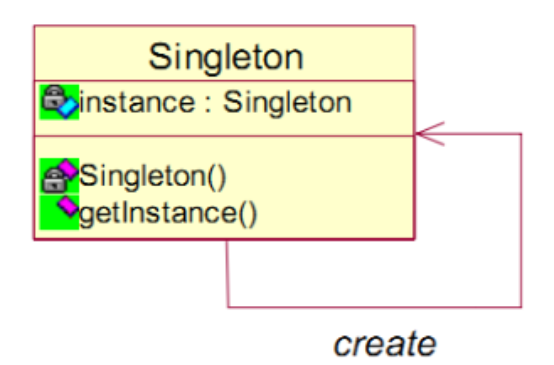

使用一个私有***构造函数***、一个私有***静态变量***以及一个公有***静态函数***来实现。

私有构造函数保证了不能通过构造函数来创建对象实例，只能通过公有静态函数返回唯一的私有静态变量。

**实现：**

1、***懒汉式***，线程不安全，但是延迟了实例化

```java
public class Singleton {

    private static Singleton uniqueInstance;

    private Singleton() {
    }

    public static Singleton getUniqueInstance() {
        if (uniqueInstance == null) {
            uniqueInstance = new Singleton();
        }
        return uniqueInstance;
    }
}
```

2、***饿汉式***，线程安全

```java
private static Singleton uniqueInstance = new Singleton();
```

3、***懒汉式***，线程安全

```java
public static synchronized Singleton getUniqueInstance() {
    if (uniqueInstance == null) {
        uniqueInstance = new Singleton();
    }
    return uniqueInstance;
}
```

4、***双重校验锁***，线程安全

考虑下面的实现，也就是只使用了一个 if 语句。在 uniqueInstance == null 的情况下，如果两个线程都执行了 if 语句，那么两个线程都会进入 if 语句块内。虽然在 if 语句块内有加锁操作，但是两个线程都会执行 uniqueInstance = new Singleton(); 这条语句，只是***先后***的问题，那么就会进行两次实例化。因此必须使用***双重校验锁***，也就是需要使用两个 if 语句：第一个 if 语句用来避免 uniqueInstance 已经被实例化之后的加锁操作，而第二个 if 语句进行了加锁，所以只能有一个线程进入，就不会出现 uniqueInstance == null 时两个线程同时进行实例化操作。

```java
if (uniqueInstance == null) {
    synchronized (Singleton.class) {
        uniqueInstance = new Singleton();
    }
}
```

uniqueInstance 只需要被实例化一次，之后就可以直接使用了。加锁操作只需要对实例化那部分的代码进行，只有当 uniqueInstance 没有被实例化时，才需要进行加锁。

双重校验锁先判断 uniqueInstance 是否已经被实例化，如果没有被实例化，那么才对实例化语句进行加锁。

```java
public class Singleton {

    private volatile static Singleton uniqueInstance;

    private Singleton() {
    }

    public static Singleton getUniqueInstance() {
        if (uniqueInstance == null) {
            synchronized (Singleton.class) {
                if (uniqueInstance == null) {
                    uniqueInstance = new Singleton();
                }
            }
        }
        return uniqueInstance;
    }
}
```

uniqueInstance 采用 ***volatile*** 关键字修饰也是很有必要的，`uniqueInstance = new Singleton();` 这段代码其实是分为三步执行：

1. 为 uniqueInstance 分配内存空间

2. 初始化 uniqueInstance

3. 将 uniqueInstance 指向分配的内存地址

但是由于 JVM 具有**指令重排**的特性，执行顺序有可能变成 1>3>2。指令重排在单线程环境下不会出现问题，但是在多线程环境下会导致一个线程获得还没有初始化的实例。例如，线程 T1 执行了 1 和 3，此时 T2 调用 getUniqueInstance() 后发现 uniqueInstance 不为空，因此返回 uniqueInstance，但此时 uniqueInstance 还未被初始化。

使用 ***volatile*** 可以禁止 JVM 的指令重排，保证在多线程环境下也能正常运行。

5、***静态内部类***

当 Singleton 类被加载时，静态内部类 SingletonHolder 没有被加载进内存。只有当调用 getUniqueInstance() 方法从而触发 SingletonHolder.INSTANCE 时 SingletonHolder 才会被加载，此时初始化 INSTANCE 实例，并且 JVM 能确保 INSTANCE 只被实例化一次。

这种方式不仅具有延迟初始化的好处，而且由 JVM 提供了对线程安全的支持。

```java
public class Singleton {

    private Singleton() {
    }

    private static class SingletonHolder {
        private static final Singleton INSTANCE = new Singleton();
    }

    public static Singleton getUniqueInstance() {
        return SingletonHolder.INSTANCE;
    }
}
```

6、***枚举实现***

```java
public enum Singleton {
    INSTANCE;

    private String objName;

    public String getObjName() {
        return objName;
    }

    public void setObjName(String objName) {
        this.objName = objName;
    }

    public static void main(String[] args) {
        // 单例测试
        Singleton firstSingleton = Singleton.INSTANCE;
        firstSingleton.setObjName("firstName");
        System.out.println(firstSingleton.getObjName());
        Singleton secondSingleton = Singleton.INSTANCE;
        secondSingleton.setObjName("secondName");
        System.out.println(firstSingleton.getObjName());
        System.out.println(secondSingleton.getObjName());

        // 反射获取实例测试
        try {
            Singleton[] enumConstants = Singleton.class.getEnumConstants();
            for (Singleton enumConstant : enumConstants) {
                System.out.println(enumConstant.getObjName());
            }
        } catch (Exception e) {
            e.printStackTrace();
        }
    }
}
```

输出结果：

  firstName
  secondName
  secondName
  secondName

该实现可以防止反射攻击。在其它实现中，通过 setAccessible() 方法可以将私有构造函数的访问级别设置为 public，然后调用构造函数从而实例化对象，如果要防止这种攻击，需要在构造函数中添加防止多次实例化的代码。该实现是由 JVM 保证只会实例化一次，因此不会出现上述的反射攻击。

该实现在多次序列化和反序列化之后，不会得到多个实例。而其它实现需要使用 transient 修饰所有字段，并且实现序列化和反序列化的方法。

***Examples***

- Logger Classes
- Configuration Classes
- Accesing resources in shared mode
- Factories implemented as Singletons

***JDK***

- [java.lang.Runtime#getRuntime()](#getRuntime())

- [java.awt.Desktop#getDesktop()](#getDesktop--)

- [java.lang.System#getSecurityManager()](#getSecurityManager--)


#### 2.工厂(Factory)

**定义：**

工厂模式主要是为创建对象提供过渡接口，以便将创建对象的具体过程屏蔽隔离起来，达到提高灵活性的目的。分为3类：

1）简单工厂模式（Simple Factory） 

2）工厂方法模式（Factory Method） 

3）抽象工厂模式（Abstract Factory） 

这三种模式从上到下逐步抽象，并且更具一般性。 

***产品族：***

先来认识下什么是产品族：位于不同产品等级结构中，功能相关联的产品组成的家族。

下图中的 BmwCar 和 BenzCar 就是两个产品树（产品层次结构）；而如图所示的 BenzSportsCar 和 BmwSportsCar 就是一个产品族。他们都可以放到跑车家族中，因此功能有所关联。同理 BmwBussinessCar 和 BenzBussinessCar 也是一个产品族。 

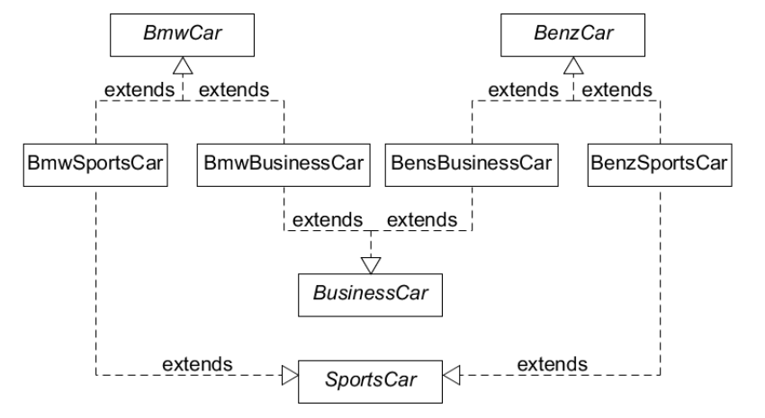

**实现：**

***A.简单工厂模式***

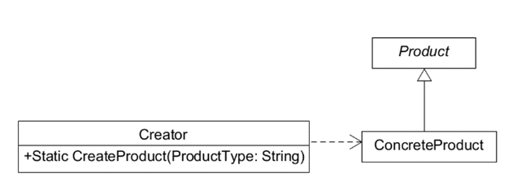

1)  工厂类角色：这是本模式的核心，含有一定的商业逻辑和判断逻辑。在java中它往往由一个具体类实现。 

2)  抽象产品角色：它一般是具体产品继承的父类或者实现的接口。在java中由接口或者抽象类来实现。 

3)  具体产品角色：工厂类所创建的对象就是此角色的实例。在java中由一个具体类实现。 

> **没有抽象工厂，单实例工厂，静态方法**

首先，使用了简单工厂模式后，我们的程序不在“有病”，更加符合现实中的情况；而且客户端免除了直接创建产品对象的责任，而仅仅负责“消费”产品（正如暴发户所为）。 

```java
/**
 * 简单工厂
 */
public class SimpleFactory {

    public Product createProduct(int type) {
        if (type == 1) {
            return new ConcreteProduct1();
        } else if (type == 2) {
            return new ConcreteProduct2();
        }
        return new ConcreteProduct();
    }
}

/**
 * 场景类
 */
public class Client {

    public static void main(String[] args) {
        SimpleFactory simpleFactory = new SimpleFactory();
        Product product = simpleFactory.createProduct(1);
        // do something with the product
    }
}
```

下面我们从开闭原则（对扩展开放；对修改封闭）上来分析下简单工厂模式。当暴发户增加了一辆车的时候，只要符合抽象产品制定的合同，那么只要通知工厂类知道就可以被客户使用了。所以对产品部分来说，它是符合开闭原则的；但是工厂部分好像不太理想，因为每增加一辆车，都要在工厂类中增加相应的业务逻辑或者判断逻辑，这显然是违背开闭原则的。可想而知对于新产品的加入，工厂类是很被动的。对于这样的工厂类（在我们的例子中是为司机师傅），我们称它为全能类或者上帝类。 

我们举的例子是最简单的情况，而在实际应用中，很可能产品是一个多层次的树状结构。

由于简单工厂模式中只有一个工厂类来对应这些产品，所以这可能会把我们的上帝累坏了，也累坏了我们这些程序员:(

于是工厂方法模式作为救世主出现了。工厂方法模式分为两种，单工厂类和多工厂类

***B. 工厂方法模式***

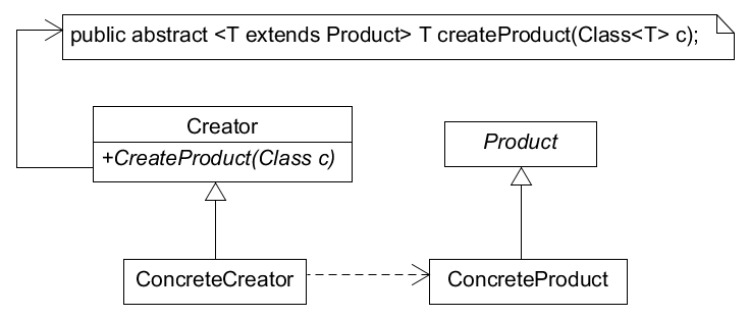

工厂方法模式去掉了简单工厂模式中工厂方法的静态属性，使得它可以被子类继承。这样在简单工厂模式里集中在工厂方法上的压力可以由工厂方法模式里不同的工厂子类来分担。

你应该大致猜出了工厂方法模式的结构，来看下它的组成： 

1) 抽象工厂角色：这是工厂方法模式的核心，它与应用程序无关。是具体工厂角色必须实现的接口或者必须继承的父类。在 java 中它由抽象类或者接口来实现。 

2) 具体工厂角色：它含有和具体业务逻辑有关的代码。由应用程序调用以创建对应的具体产品的对象。

3) 抽象产品角色：它是具体产品继承的父类或者是实现的接口。在 java 中一般有抽象类或者接口来实现。 

4) 具体产品角色：具体工厂角色所创建的对象就是此角色的实例。在 java 中由具体的类来实现。

> **抽象工厂，单实例工厂，实例方法（通过反射，根据参数类型创建不同产品）**

工厂方法模式（单工厂类）的优点：

首先，良好的封装性，代码结构清晰。一个对象创建是有条件约束的，如一个调用者需要一个具体的产品对象，只要知道这个产品的类名（或约束字符串）就可以了，不用知道创建对象的艰辛过程，降低模块间的藕合。

其次，扩展性非常优秀。在增加产品类的情况下，甚至不需要修改工厂类就可以完成“拥抱变化”。

再次，屏蔽产品类。这一特点非常重要，产品类的实现如何变化，调用者都不需要关心，它只需要关心产品的接口，只要接口保持不变，系统中的上层模块就不要发生变化。因为产品类的实例化工作是由工厂类负责的，一个产品对象具体由哪一个产品生成是由工厂类决定的。在数据库开发中，大家应该能够深刻体会到工厂方法模式的好处，如果使用JDBC连接数据库，数据库从MySQL切换到Oracle，需要改动的地方就是切换一下驱动名称（前提条件是SQL语句是标准语句）。其他的都不需要修改，这是工广方法模式灵活性的一个直接案例。

最后，工厂方法模式是典型的解耦框架。高层模块只需要知道产品的抽象类，其他的实现类都不用关心，符合迪米特法则，我不需要的就不要去交流，也符合依赖倒置原则，只依赖产品类的抽象；当然也符合里氏替换原则，使用产品子类替换产品父类，没问题！

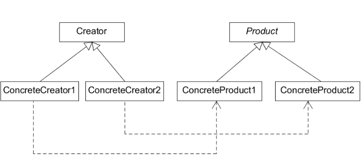

> **抽象工厂，多实例工厂，不同工厂创建不同产品（无需参数）**

工厂方法模式（多工厂类）使用继承自抽象工厂角色的多个子类（不再需要参数）来代替简单工厂模式中的“上帝类”。

正如上面所说，这样便分担了对象承受的压力；而且这样使得结构变得灵活起来——当有新的产品（即暴发户的汽车）产生时，只要按照抽象产品角色、抽象工厂角色提供的合同来生成，那么就可以被客户使用，而不必去修改任何已有的代码。可以看出工厂角色的结构也是符合开闭原则的！ 

话说暴发户生意越做越大，自己的爱车也越来越多。这可苦了那位司机师傅了，什么车它都要记得，维护，都要经过他来使用！于是暴发户同情他说：看你跟我这么多年的份上，以后你不用这么辛苦了，我给你分配几个人手，你只管管好他们就行了！于是，工厂方法模式的管理（一个协调类，避免调用者与各个子工厂交流，封装子工厂类，对高层模块提供统一的访问接口）出现了。

```java
public abstract class Factory {
    abstract public Product factoryMethod();
    public void doSomething() {
        Product product = factoryMethod();
        // do something with the product
    }
}

public class ConcreteFactory extends Factory {
    public Product factoryMethod() {
        return new ConcreteProduct();
    }
}

public class ConcreteFactory1 extends Factory {
    public Product factoryMethod() {
        return new ConcreteProduct1();
    }
}

public class ConcreteFactory2 extends Factory {
    public Product factoryMethod() {
        return new ConcreteProduct2();
    }
}
```

工厂方法模式仿佛已经很完美的对对象的创建进行了包装，使得客户程序中仅仅处理抽象产品角色提供的接口。那我们是否一定要在代码中遍布工厂呢？大可不必。也许在下面情况下你可以考虑使用工厂方法模式： 

1)  当客户程序不需要知道要使用对象的创建过程。 

2)  客户程序使用的对象存在变动的可能，或者根本就不知道使用哪一个具体的对象。

简单工厂模式与工厂方法模式真正的避免了代码的改动了？没有。在简单工厂模式中，新产品的加入要修改工厂角色中的判断语句；而在工厂方法模式中，要么将判断逻辑留在抽象工厂角色中，要么在客户程序中将具体工厂角色写死。而且产品对象创建条件的改变必然会引起工厂角色的修改。 

面对这种情况，Java 的反射机制与配置文件的巧妙结合突破了限制——这在 Spring 中完美的体现了出来。

***JDK***

- [java.util.Calendar](#getInstance--)

- [java.util.ResourceBundle](#getBundle-java.lang.String-)

- [java.text.NumberFormat](#getInstance--)

- [java.nio.charset.Charset](#forName-java.lang.String-)

- [java.net.URLStreamHandlerFactory](#createURLStreamHandler-java.lang.String-)

- [java.util.EnumSet](#of-E-)

- [javax.xml.bind.JAXBContext](#createMarshaller--)

***C. 抽象工厂模式***

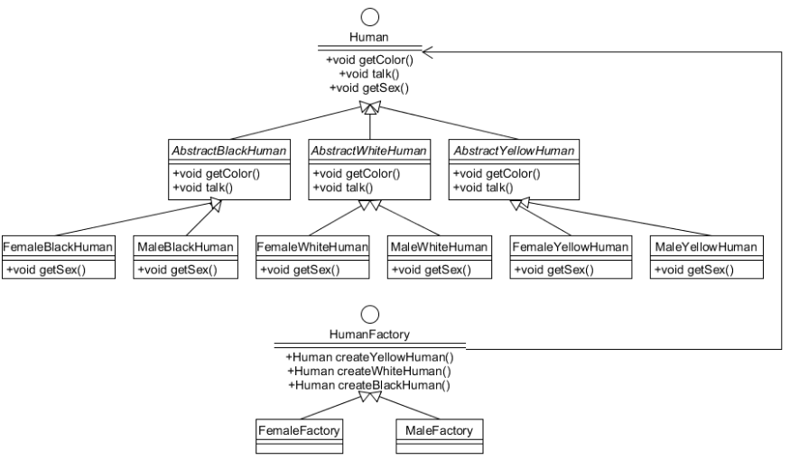

回到抽象工厂模式的话题上。 

可以说，**抽象工厂模式和工厂方法模式的区别就在于需要创建对象的复杂程度上**。而且抽象工厂模式是三个里面最为抽象、最具一般性的。

抽象工厂模式的用意为：给客户端提供一个接口，可以创建多个产品族中的产品对象

而且使用抽象工厂模式还要满足以下条件： 

1)  系统中有多个产品族，而系统一次只可能消费其中一族产品。 

2)  同属于同一个产品族的产品一起使用。 

来看看抽象工厂模式的各个角色（和工厂方法的如出一辙）：

1) 抽象工厂角色： 这是工厂方法模式的核心，它与应用程序无关。是具体工厂角色必须实现的接口或者必须继承的父类。在 java 中它由抽象类或者接口来实现。 

2) 具体工厂角色：它含有和具体业务逻辑有关的代码。由应用程序调用以创建对应的具体产品的对象。在 java 中它由具体的类来实现。 

3) 抽象产品角色：它是具体产品继承的父类或者是实现的接口。在 java 中一般有抽象类或者接口来实现。 

4) 具体产品角色：具体工厂角色所创建的对象就是此角色的实例。在 java 中由具体的类来实现。

为创建一组相关或相互依赖的对象提供一个接口，而且无需指定它们的具体类。（多）工厂方法模式的升级版，一个具体的工厂已经可以生产一系列产品了（多工厂方法模式中，一个具体工厂只能生产单一产品）。

抽象工厂模式的优点：封装性、产品族内的约束为非公开状态。抽象工厂模式的最大缺点就是产品族扩展非常困难。

```java
public class AbstractProductA {
}
public class AbstractProductB {
}
public class ProductA1 extends AbstractProductA {
}
public class ProductA2 extends AbstractProductA {
}
public class ProductB1 extends AbstractProductB {
}
public class ProductB2 extends AbstractProductB {
}
public abstract class AbstractFactory {
    abstract AbstractProductA createProductA();
    abstract AbstractProductB createProductB();
}
public class ConcreteFactory1 extends AbstractFactory {
    AbstractProductA createProductA() {
        return new ProductA1();
    }

    AbstractProductB createProductB() {
        return new ProductB1();
    }
}
public class ConcreteFactory2 extends AbstractFactory {
    AbstractProductA createProductA() {
        return new ProductA2();
    }

    AbstractProductB createProductB() {
        return new ProductB2();
    }
}
public class Client {
    public static void main(String[] args) {
        AbstractFactory abstractFactory = new ConcreteFactory1();
        AbstractProductA productA = abstractFactory.createProductA();
        AbstractProductB productB = abstractFactory.createProductB();
        // do something with productA and productB
    }
}
```

***JDK***

- [javax.xml.parsers.DocumentBuilderFactory](http://docs.oracle.com/javase/8/docs/api/javax/xml/parsers/DocumentBuilderFactory.html)

- [javax.xml.transform.TransformerFactory](#newInstance--)

- [javax.xml.xpath.XPathFactory](#newInstance--)

***D. 单例工厂***

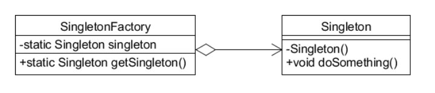

以上通过工厂方法模式创建了一个单例对象，该框架可以继续扩展，在一个项目中可以产生一个单例构造器，所有需要产生单例的类都遵循一定的规则（构造方法是private），然后通过扩展该框架，只要输入一个类型就可以获得唯一的一个实例。

***E. 延迟初始化***

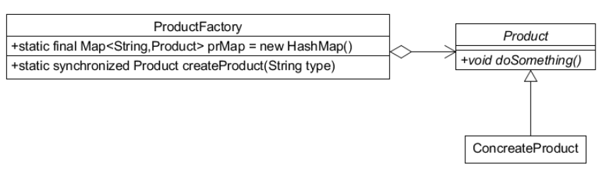

何为延迟初始化(Lazy initialization)？一个对象被消费完毕后，并不立刻释放，工厂类保持其初始状态，等待再次被使用。

延迟加载框架是可以扩展的，例如限制某一个产品类的最大实例化数量，可以通过判断Map中已有的对象数量来实现，这样的处理是非常有意义的，例如 JDBC 连接数据库，都会要求设置一个 MaxConnections 最大连接数量，该数量就是内存中最大实例化的数量。

延迟加载还可以用在对象初始化比较复杂的情况下，例如硬件访问，涉及多方面的交互，则可以通过延迟加载降低对象的产生和销毁带来的复杂性。

**使用场景：**

首先，工厂方法模式是 new 一个对象的替代品，所以在所有需要生成对象的地方都可以使用，但是需要慎重地考虑是否要增加一个工厂类进行管理，增加代码的复杂度。

其次，需要灵活的、可扩展的框架时，可以考虑采用工厂方法模式。

再次，工厂方法模式可以用在异构项目中。例如通过 WebService 与一个非Java的项目交互，虽然 WebService 号称是可以做到异构系统的同构化，但是在实际的开发中，还是会碰到很多问题，如类型问题、WSDL文件的支持问题，等等。从 WSDL 中产生的对象都认为是一个产品，然后用一个具体的工厂类进行管理，减少与外围系统的耦合。

最后，可以使用在测试驱动开发的框架下。例如，测试一个类A，就需要把与类A有关联关系的类B也同时产生出来，我们可以使用工厂方法模式把类B虚拟出来，避免类A与类B的耦合。目前由于 JMock 和 EasyMock 的诞生，该使用场景已经弱化了，读者可以在遇到此种情况时直接考虑使用 JMock 或 EasyMock。

抽象工厂模式的使用场景定义非常简单：一个对象族（或是一组没有任何关系的对象）都有相同的约束，则可以使用抽象工厂模式。


#### 3、建造者(Builder)

**定义：**

建造者模式(Builder Pattem)也叫做生成器模式。

GOF 给建造模式的定义为：将一个复杂对象的构建与它的表示分离，使得同样的构建过程可以创建不同的表示。这句话说得很抽象，不好理解，其实它的意思可以理解为：将构造复杂对象的过程和组成对象的部件解耦。

**类图：**

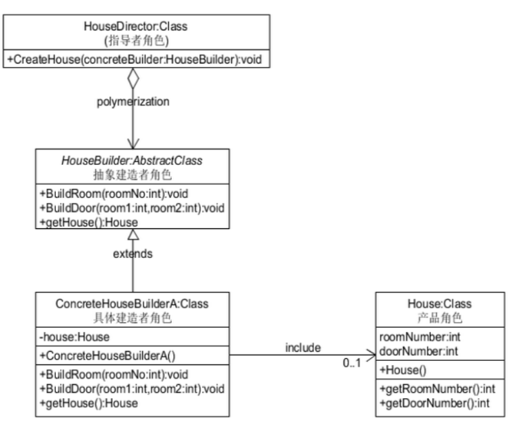

1) 抽象建造者角色：这个角色用来规范产品对象的各个组成成分的建造。一般而言，此角色独立于应用程序的业务逻辑。 

2) 具体建造者角色：担任这个角色的是与应用程序紧密相关的类，它们在指导者的调用下创建产品实例。这个角色在实现抽象建造者角色提供的方法的前提下，达到完成产品组装，提供成品的功能。 

3) 指导者角色：调用具体建造者角色以创建产品对象。指导者并没有产品类的具体知识，真正拥有产品类的具体知识的是具体建造者对象。 

4) 产品角色：建造中的复杂对象。它要包含那些定义组件的类，包括将这些组件装配成产品的接口。

首先客户程序创建一个指导者对象，一个建造者角色，并将建造者角色传入指导者对象进行配置。然后，指导者按照步骤调用建造者的方法创建产品。最后客户程序从建造者或者指导者那里得到产品。 

从建造模式的工作流程来看，建造模式将产品的组装“外部化”到了建造者角色中来。***这是和任何正规的工厂模式不一样的——产品的创建是在产品类中完成的***。

**特点：**

- 独立性：建造模式可以使得产品内部的表象独立变化。在原来的工厂方法模式中，产品内部的表象是由产品自身来决定的；而在建造模式中则是“外部化”为由建造者来负责。这样定义一个新的具体建造者角色就可以改变产品的内部表象，符合“开闭原则”。 

- 封装性：建造模式使得客户不需要知道太多产品内部的细节。它将复杂对象的组建和表示方式封装在一个具体的建造角色中，而且由指导者来协调建造者角色来得到具体的产品实例。每一个具体建造者角色是毫无关系的。 

- 便于控制细节风险：建造模式可以对复杂产品的创建进行更加精细的控制。产品的组成是由指导者角色调用具体建造者角色来逐步完成的，所以比起其它创建型模式能更好的反映产品的构造过程。

**使用场景：**

- 相同的方法，不同的执行顺序，产生不同的事件结果

- 多个部件或零件，都可以装配到一个对象中，但是产生的运行结果又不相同

- 产品类非常复杂，或者产品类中的调用顺序不同产生了不同的效能

- 在对象创建过程中会使用到系统中的一些其他对象，这些对象在产品对象的创建过程中不易得到时，也可以采用建造者模式封装该对象的创建过程。这种场景只能是一个补偿方法，因为一个对象不容易获得，而在设计阶段竟然没有发觉，而要通过创建者模式柔化创建过程，本身已经违反设计的最初目标

**注意事项：**

建造模式中很可能要用到组成成品的各种组件类，对于这些类的创建可以考虑使用工厂方法或者原型模式来实现，在必要的时候也可以加上单例模式来控制类实例的产生。但是要坚持一个大前提就是要使引入的模式给你的系统带来好处，而不是臃肿的结构。 

建造模式在得到复杂产品的时候可能要引用多个不同的组件，在这一点上来看，建造模式和抽象工厂模式是相似的。可以从以下两点来区分两者：创建模式着重于逐步将组件装配成一个成品并向外提供成品，而抽象工厂模式着重于得到产品族中相关的多个产品对象；抽象工厂模式的应用是受限于产品族的，建造模式则不会。 

建造者模式最主要的功能是基本方法的调用顺序安排，也就是这些基本方法已经实现了，通俗地说就是零件的装配，顺序不同产生的对象也不同；而工厂方法则重点是创建，创建零件是它的主要职责，组装顺序则不是它关心的。

由于建造模式和抽象工厂模式在实现功能上相似，所以两者使用的环境都比较复杂并且需要更多的灵活性。 

**最佳实践：**

组合模式中的树枝构件角色(Composite)往往是由多个树叶构件角色(Leaf)组成，因此树枝构件角色的产生可以由建造模式来担当。

建造者模式中还有一个角色没有说明，就是零件，建造者怎么去建造一个对象？是零件的组装，组装顺序不同对象效能也不同，这才是建造者模式要表达的核心意义，而怎么才能更好地达到这种效果呢？引人模板方法模式是一个非常简单而有效的办法。所以在使用建造者模式的时候考虑一下模板方法模式，别孤立地思考一个模式，僵化地套用一个模式会让你受害无穷！

**实现：**

以下是一个简易的 StringBuilder 实现，参考了 JDK 1.8 源码。

```java
public class AbstractStringBuilder {
    protected char[] value;

    protected int count;

    public AbstractStringBuilder(int capacity) {
        count = 0;
        value = new char[capacity];
    }

    public AbstractStringBuilder append(char c) {
        ensureCapacityInternal(count + 1);
        value[count++] = c;
        return this;
    }

    private void ensureCapacityInternal(int minimumCapacity) {
        // overflow-conscious code
        if (minimumCapacity - value.length > 0)
            expandCapacity(minimumCapacity);
    }

    void expandCapacity(int minimumCapacity) {
        int newCapacity = value.length * 2 + 2;
        if (newCapacity - minimumCapacity < 0)
            newCapacity = minimumCapacity;
        if (newCapacity < 0) {
            if (minimumCapacity < 0) // overflow
                throw new OutOfMemoryError();
            newCapacity = Integer.MAX_VALUE;
        }
        value = Arrays.copyOf(value, newCapacity);
    }
}

public class StringBuilder extends AbstractStringBuilder {
    public StringBuilder() {
        super(16);
    }

    @Override
    public String toString() {
        // Create a copy, don't share the array
        return new String(value, 0, count);
    }
}

public class Client {
    public static void main(String[] args) {
        StringBuilder sb = new StringBuilder();
        final int count = 26;
        for (int i = 0; i < count; i++) {
            sb.append((char) ('a' + i));
        }
        System.out.println(sb.toString());
    }
}
```

**JDK**

- [java.lang.StringBuilder](http://docs.oracle.com/javase/8/docs/api/java/lang/StringBuilder.html)

- [java.nio.ByteBuffer](#put-byte-)

- [java.lang.StringBuffer](#append-boolean-)

- [java.lang.Appendable](http://docs.oracle.com/javase/8/docs/api/java/lang/Appendable.html)

- [Apache Camel builders](https://github.com/apache/camel/tree/0e195428ee04531be27a0b659005e3aa8d159d23/camel-core/src/main/java/org/apache/camel/builder)


#### 4、原型(Prototype)

**定义：**

GOF 给它的定义为：用原型实例指定创建对象的种类，并且通过拷贝这些原型创建新的对象。 

在 Java 中提供了 clone() 方法来实现对象的克隆，所以 Prototype 模式实现变得简单许多。注：对于许多原型模式中讲到的浅克隆、深克隆，本文不谈论。 

使用克隆方式来创建对象与同样用来创建对象的工厂模式有什么不同？ 

工厂模式对新产品的适应能力比较弱：创建新的产品时，就必须修改或者增加工厂角色。而且为了创建产品对象要先额外的创建一个工厂对象。那通过原型模式来创建对象会是什么样子呢？

**类图：**

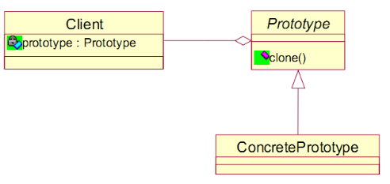

按照定义，客户角色不仅要负责使用对象，而且还要负责对象原型的生成和克隆。这样造成客户角色分工就不是很明确，所以我们把对象原型生成和克隆功能单拿出来放到一个原型管理器中。原型管理器维护了已有原型的清单。客户在使用时会向原型管理器发出请求，而且可以修改原型管理器维护的清单。这样客户不需要编码就可以实现系统的扩展。类图表示如下：

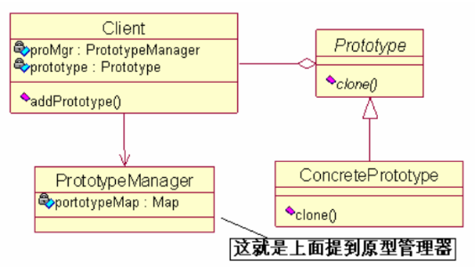

1)  客户角色：让一个原型克隆自己来得到一个新对象。 

2)  抽象原型角色：实现了自己的 clone方法，扮演这种角色的类通常是抽象类，且它具有许多具体的子类。 

3)  具体原型角色：被复制的对象，为抽象原型角色的具体子类。  

**特点：**

对于抽象原型角色和具体原型角色，它们就是一个继承或者实现关系，没有什么好讲的，记住实现好 clone 方法就好了。那么客户是怎么来使用这些角色的对象的呢？最简单的方式就是： 

```java
// 先 new 一个具体原型角色作为样本 
Prototype p = new ConcretePrototype(); 
…… 
// 使用原型 p克隆出一个新对象 p1 
Prototype p1 = (Prototype)p.clone(); 
```

当然这只是简单的表述原型模式的运行过程。实际运用中，客户程序与原型角色之间往往存在一个原型管理器。因此创建原型角色、拷贝原型角色就与客户程序分离开来。这时才能真正的体会到原型模式带给我们的效果。 

```java
// 使用原型管理器后，客户获得对象的方式 
Prototype p1 = PrototypeManager.getManager().getPrototype("ConcretePrototype");
```

上面提到的原型管理器的实现，简单来说就是对原型清单的维护。可以考虑以下几点：

- 要保存一个原型对象的清单，我们可以使用一个 HashMap 来实现，使原型对象和它的名字相对应；原型管理器只需要一个就够了，所以可以使用单例模式来实现控制；实现得到、注册、删除原型对象的功能只是对 HashMap 的对应操作而已。

- 当客户自定义新的产品对象时，同时向原型管理器注册一个原型对象，而使用的类只需要根据客户的需要来从原型管理器中得到一个对象就可以了。这样就使得功能扩展变得容易些。 

原型模式与其它创建型模式有着相同的特点：它们都将具体产品的创建过程进行包装，使得客户对创建不可知。客户程序仅仅知道一个抽象产品的接口。当然它还有过人之处： 

- 通过增加或者删除原型管理器中注册的对象，可以比其它创建型模式更方便的在运行时增加或者删除产品。 
- 如果一个对象的创建总是由几种固定组件不同方式组合而成；如果对象之间仅仅实例属性不同。将不同情况的对象缓存起来，直接克隆使用。也许这比采用传递参数重新 new 一个对象要来的快一些。 

你也许已经发现原型模式与工厂模式有着千丝万缕的联系：原型管理器不就是一个工厂么。当然这个工厂经过了改进（例如采用 java 的反射机制），去掉了像抽象工厂模式或者工厂方法模式那样繁多的子类。因此可以说原型模式就是在工厂模式的基础上加入了克隆方法。 

也许你要说：我实在看不出来使用 clone 方法产生对象和 new 一个对象有什么区别；***原型模式使用 clone 能够动态的抽取当前对象运行时的状态并且克隆到新的对象中，新对象就可以在此基础上进行操作而不损坏原有对象；而 new 只能得到一个刚初始化的对象，而在实际应用中，这往往是不够的***。特别当你的系统需要良好的扩展性时，在设计中使用原型模式也是很必要的。比如说，你的系统可以让客户自定义自己需要的类别，但是这种类别的初始化可能需要传递多于已有类别的参数，而这使得用它的类将不知道怎么来初始化它（因为已经写死了），除非对类进行修改。可见 clone 方法是不能使用构造函数来代替的。

原型模式的优点：

- 性能优良：原型模式是在（堆）内存二进制流的拷贝，要比直接 new 一个对象性能好很多，特别是要在一个循环体内产生大量的对象时，原型模式可以更好地体现其优点。

- 逃避构造函数的约束：这既是它的优点也是缺点，直接在内存中拷贝，构造函数是不会执行的。优点就是减少了约束，缺点也是减少了约束，需要大家在实际应用时考虑。

任何模式都是存在缺陷的。原型模式主要的缺陷就是每个原型必须含有 clone 方法，在已有类的基础上来添加 clone 操作是比较困难的；而且当内部包括一些不支持 copy 或者循环引用的对象时，实现就更加困难了。由于 clone 方法在 java 实现中有着一定的弊端和风险，所以 clone 方法是不建议使用的。因此很少能在 java 应用中看到原型模式的使用。但是原型模式还是能够给我们一些启迪。

**使用场景：**

- 资源优化场景：类初始化需要消耗非常多的资源，这个资源包括数据、硬件资源等。

- 性能和安全要求的场景：通过 new 产生一个对象需要非常繁琐的数据准备或访问权限，则可以使用原型模式。

- 一个对象多个修改者的场景：一个对象需要提供给其他对象访问，而且各个调用者可能都需要修改其值时，可以考虑使用原型模式拷贝多个对象供调用者使用。

分析了这么多，举一个使用原型模式较为经典的例子：绩效考核软件要对今年的各种考核数据进行年度分析，而这一组数据是存放在数据库中的。一般我们会将这一组数据封装在一个类中，然后将此类的一个实例作为参数传入分析算法中进行分析，得到的分析结果返回到类中相应的变量中。假设我们决定对这组数据还要做另外一种分析以对分析结果进行比较评定。这时对封装有这组数据的类进行 clone 要比再次连接数据库得到数据好的多。

**实现：**

```java
public abstract class Prototype {
    abstract Prototype myClone();
}

public class ConcretePrototype extends Prototype {

    private String filed;

    public ConcretePrototype(String filed) {
        this.filed = filed;
    }

    @Override
    Prototype myClone() {
        return new ConcretePrototype(filed);
    }

    @Override
    public String toString() {
        return filed;
    }
}

public class Client {
    public static void main(String[] args) {
        Prototype prototype = new ConcretePrototype("abc");
        Prototype clone = prototype.myClone();
        System.out.println(clone.toString());
    }
}
```

**扩展：**

- 浅拷贝、深拷贝

- clone 与 final 互斥性

**JDK**

- [java.lang.Object#clone()](#clone())


