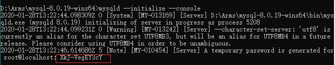

# 目录

1. 理论
   
   - [索引](#索引)
2. [实战](#实战)
   - [安装与配置](#安装与配置)
   - [常用命令语句](#常用命令语句)
     - [控制外键约束](#控制外键约束)
     - [控制安全模式](#控制安全模式)
   - [常用SQL语句](#常用SQL语句)
     - [复制表结构或数据](#复制表结构或数据)
     - [字符串分割](#字符串分割)
   - [常见错误](#常见错误)
     - [1、This function has none of DETERMINISTIC, NOSQL, ...](#1、This function has none of DETERMINISTIC, NOSQL, ...)
   - [2、Illegal mix of collations (utf8_unicode_ci,IMPLICIT) and ...](#2、Illegal mix of collations (utf8_unicode_ci,IMPLICIT) and ...)
     
   - [Handler](#Handler)
   - [事件调度器](#事件调度器)
3. [总结](#总结)
   
   - [性能优化](#性能优化)
   - [编码设置](#编码设置)
- [压缩](#压缩)
4. 升华

## 理论

1、一款开源、免费的数据库软件。MySql官网: [https://www.mysql.com/](https://www.mysql.com/)

2、MySQL不足：

- MyISAM格式的数据表只有数据表锁定，没有数据行锁定，可以使用InnoDB格式数据表绕过这个问题
- MyISAM数据表不能热备份，即无需锁定数据表就可以在对数据表进行处理时同时对其进行备份。InnoDB可以，但是收费
- 不支持自定义类型
- 不能直接处理XML数据
- 没有OLAP功能。支持OLAP的数据库系统通常称为数据仓库(data warehouse)
- 从5.0版本开始支持的存储过程和触发器并不成熟
- 从4.1版本开始支持的GIS也不成熟

3、MySQL版本：

- Alpha：开发
- Beta：基本完成
- Gamma：更加稳定
- Production 或 Generally Available(GA)：足够成熟和稳定

4、MySQL许可证：GPL(GNU Public License)

5、SQL兼容性：MySQL 支持 SQL，SQL 有许多种“方言”，可以通过调整 MySQL 服务器的配置开关 sql-mode 使它在行为上与 IBM DB2 和 Oracle 等多种数据库系统保持最大限度的兼容

6、MySQL数据文件：

- Linux: /var/lib/mysql
- Windows: %MySQL%/data

```txt
data/dbname/tablename.frm: 数据表结构定义
data/dbname/db.opt: 整个数据库的结构定义和设置
data/dbname/tablename.MYD: MyISAM数据表数据
data/dbname/tablename.MYI: MyISAM数据表索引
innodb_file_per_table: InnoDB存储方式（各自一个文件，统一的表空间）
data/dbname/tablename.idb: InnoDB数据表数据、索引默认存储
data/ibdata1,-2,-3:  表空间和撤销日志
data/ib_logfile0,-1,-2: InnoDB日志数据
data/dbname/tablename.TRG: 触发器
```

### 索引

MySQL索引中可以分为聚集索引与非聚集索引两类，在网络上也见过聚簇的说法

**聚集索引**

>索引的键值逻辑顺序决定了表数据行的物理存储顺序

也就是在数据库上连接的记录在磁盘上的物理存储地址也是相邻的，注意这一点特性，我们可以分析出它的适用情况。由于聚集索引规定了数据项，也可以说是记录在表中的物理存储顺序，物理顺序唯一，自然每张表中的聚集索引也是唯一的，但是它可以包含多个列，多个字段。

>聚集索引类似于新华字典中用拼音去查找汉字

拼音检索表于书记顺序都是按照a~z排列的，就像相同的逻辑顺序于物理顺序一样，当你需要查找a,ai两个读音的字，或是想一次寻找多个傻(sha)的同音字时，也许向后翻几页，或紧接着下一行就得到结果了。

进一步来说，当你需要查询的数据经常被分组看待（分类），或是经常查询范围性的数据（本月，本周总结），不同值的小数目等情况时，可以使用聚集索引。

**非聚集索引**

自然，非聚集索引也就是存储的键值逻辑连续，但是在表数据行物理存储顺序上不一定连续的索引

>也就是索引的逻辑顺序与磁盘上的物理存储顺序不同。  
>非聚集索引类似在新华字典上通过偏旁部首来查询汉字

检索表也许是按照横、竖、撇来排列的，但是由于正文中是a~z的拼音顺序，所以就类似于逻辑地址于物理地址的不对应。同时适用的情况就在于分组，大数目的不同值，频繁更新的列中，这些情况即不适合聚集索引。

**索引扩展**

>某些情况下索引与物理存储逻辑有关：

其中存在一种情况，MySQL 的 MyISAM 引擎 B+ 树式的存储结构，把叶子结点上存放的并不是数据本身，而是存放数据的地址，所以在使用索引时，例如主索引、辅助索引有时达不到想要的效果，而且都是非聚集索引。

>对于主键

主键不一定适合加上聚集索引，有时甚至是一种对这个唯一的聚集索引的浪费（虽然在 SQLServer 中主键默认为聚集索引），并非在任何字段上加上聚集/非聚集索引都能提高查询效率。下面我们结合实际情况分析。

>创建“索引”的利与弊

优势：

- 能够保证数据每一行的唯一性
- 合理运用时加快数据的查询速度
- 增强表与表之间的链接，参考完整性
- 减少分组、排序等操作的查询时间
- 优化查询过程，提高系统性能

弊端：

- 创建、维护索引的时间会随着数据量的增加而增加
- 自然，索引也是需要占据物理空间的
- 增删改查数据的时候，也会由于索引的存在而增加时间，类似于多了一个属性，也会降低表更新的速度

总而言之，这只是 MySQL 查询时优化速度等方面的冰山一角，还是需要多分析，多考虑，根据实际情况去选择各种辅助功能的使用，才能得到相对最高的效率。

参考：[https://www.cnblogs.com/zlcxbb/p/5757245.html](https://www.cnblogs.com/zlcxbb/p/5757245.html)

在 MySQL 中，主要有四种类型的索引，分别为：**B-Tree 索引**，**Hash 索引**，**Fulltext 索引** 和 **R-Tree 索引**。我们主要分析 B-Tree 索引。

B-Tree 索引是 MySQL 数据库中使用最为频繁的索引类型，除了 Archive 存储引擎之外的其他所有的存储引擎都支持 B-Tree 索引。Archive 引擎直到 MySQL 5.1 才支持索引，而且只支持索引单个 AUTO_INCREMENT 列。

不仅仅在 MySQL 中是如此，实际上在其他的很多数据库管理系统中 B-Tree 索引也同样是作为最主要的索引类型，这主要是因为 B-Tree 索引的存储结构在数据库的数据检索中有非常优异的表现。

一般来说， MySQL 中的 B-Tree 索引的物理文件大多都是以 Balance Tree 的结构来存储的，也就是所有实际需要的数据都存放于 Tree 的 Leaf Node（叶子节点），而且`到任何一个 Leaf Node 的最短路径的长度都是完全相同的`，所以我们大家都称之为 B-Tree 索引。

当然，可能各种数据库（或 MySQL 的各种存储引擎）在存放自己的 B-Tree 索引的时候会对存储结构稍作改造。如 `Innodb 存储引擎的 B-Tree 索引实际使用的存储结构实际上是 B+Tree`，也就是在 B-Tree 数据结构的基础上做了很小的改造，在每一个 Leaf Node 上面出了存放索引键的相关信息之外，还`存储了指向与该 Leaf Node 相邻的后一个 LeafNode 的指针信息（增加了顺序访问指针）`，这主要是为了加快检索多个相邻 Leaf Node 的效率考虑。

下面主要讨论 MyISAM 和 InnoDB 两个存储引擎的索引实现方式：

>1、MyISAM 索引实现：MyISAM 索引文件和数据文件是分离的，索引文件仅保存数据记录的地址。**

在 MyISAM 中，主索引和辅助索引(Secondary key)在结构上没有任何区别，只是主索引要求 key 是唯一的，而辅助索引的 key 可以重复。

MyISAM 中索引检索的算法为首先按照 B+Tree 搜索算法搜索索引，如果指定的 Key 存在，则取出其 data 域的值，然后以 data 域的值为地址，读取相应数据记录。

MyISAM 的索引方式也叫做“非聚集”的，之所以这么称呼是为了与 InnoDB 的聚集索引区分。

>2、InnoDB索引实现：也使用 B+Tree 作为索引结构，但具体实现方式却与 MyISAM 截然不同。

在 InnoDB 中，表数据文件本身就是按 B+Tree 组织的一个索引结构，这棵树的叶节点 data 域保存了完整的数据记录。这个索引的 key 是数据表的主键，因此 InnoDB 表数据文件本身就是主索引。这种索引叫做 **聚集索引**。

因为 InnoDB 的数据文件本身要按主键聚集，所以 InnoDB 要求表必须有主键（MyISAM可以没有），如果没有显式指定，则 MySQL 系统会自动选择一个可以唯一标识数据记录的列作为主键，如果不存在这种列，则 MySQL 自动为 InnoDB 表生成一个隐含字段作为主键，这个字段长度为6个字节，类型为长整形。

InnoDB 的所有辅助索引都引用主键作为 data 域。InnoDB 表是基于聚簇索引建立的。因此InnoDB 的索引能提供一种非常快速的主键查找性能。不过，它的辅助索引（Secondary Index，也就是非主键索引）也会包含主键列，所以，如果主键定义的比较大，其他索引也将很大。如果想在表上定义很多索引，则争取尽量把主键定义得小一些。InnoDB 不会压缩索引。

>聚集索引这种实现方式使得按主键的搜索十分高效，但是辅助索引搜索需要检索两遍索引：首先检索辅助索引获得主键，然后用主键到主索引中检索获得记录。

不同存储引擎的索引实现方式对于正确使用和优化索引都非常有帮助，例如知道了 InnoDB 的索引实现后，就很容易明白：

1. 为什么不建议使用过长的字段作为主键，因为所有辅助索引都引用主索引，过长的主索引会令辅助索引变得过大。
2. 用非单调的字段作为主键在 InnoDB 中不是个好主意，因为 InnoDB 数据文件本身是一颗 B+Tree，非单调的主键会造成在插入新记录时数据文件为了维持 B+Tree 的特性而频繁的分裂调整，十分低效，而使用自增字段作为主键则是一个很好的选择。

>InnoDB 索引和 MyISAM 索引的区别：

- 一是主索引的区别，InnoDB 的数据文件本身就是索引文件。而 MyISAM 的索引和数据是分开的。

- 二是辅助索引的区别：InnoDB 的辅助索引 data 域存储相应记录主键的值而不是地址。而 MyISAM 的辅助索引和主索引没有多大区别。

## 实战

### 安装与配置

>windows环境：

**压缩包版**

1、设置环境变量  

配置 `MYSQL_HOME` 为MySQL的解压路径，并设置path：`;%MYSQL_HOME%\bin`

2、在MySQL解压路径下，新建 `my.ini` 配置初始化参数：

```ini
[mysql]
# 设置mysql客户端默认字符集
default-character-set=utf8
[mysqld]
#设置3306端口
port = 3306
# 设置mysql的安装目录
basedir=D:\Arms\mysql-8.0.19-winx64
# 设置mysql数据库的数据的存放目录
datadir=D:\Arms\mysql-8.0.19-winx64\data
# 允许最大连接数
max_connections=2000
# 允许连接失败的次数。这是为了防止有人从该主机试图攻击数据库系统
max_connect_errors=10
# 服务端使用的字符集默认为8比特编码的latin1字符集
character-set-server=utf8
# 创建新表时将使用的默认存储引擎
default-storage-engine=INNODB
# 默认使用 "mysql_native_password" 插件认证
default_authentication_plugin=mysql_native_password
[client]
# 设置mysql客户端连接服务端时默认使用的端口
port=3306
default-character-set=utf8
```

>my.ini 文件格式必须是 `ANSI` 格式，否则会报错：`Found option without preceding group in config file`

3、初始化数据库

以 **管理员** 的身份打开cmd命令窗口，输入 `mysqld --initialize --console` 命令初始化 mysql 的 data 数据目录，初始化完毕后，会在解压目录下生成一个data文件夹，cmd窗口中会有随机生成的密码：



生成密码：XkJ-VegEY3cY

4、安装服务  

- 注册服务：`mysqld --install mysql-master --defaults-file="D:\Arms\mysql-8.0.19-winx64\my.ini"`
- 启动服务：`net start mysql-master`
- 登录：`mysql -u root -p`

5、更改密码

```sql
set password for root@localhost='123456';
-- 或者
ALTER USER USER() IDENTIFIED BY '新密码';
```

6、问题解决：

- 6.1 服务名无效  

  原因：没有注册 mysql 到服务中。  

  解决：在命令行中输入`mysqld --install`，出现 `Service successfully install` 代表安装成功

- 6.2 cmd中能登录，Navicat中不能登录  

   错误提示：

   ```sh
   1251 - Client does not support authentication protocol requested by server; consider upgrading MySQL client
   # 或者
   Authentication plugin 'caching_sha2_password' cannot be loaded
   # 或者
   Access denied for user 'root'@'localhost'
   ```

   原因：

   1. 没有开启远程登录
   2. mysql8 之前的版本中加密规则是 `mysql_native_password`，而在 mysql8 之后，加密规则是 `caching_sha2_password`。

   解决：

   1. 开启远程登录
   2. 把 mysql 用户登录密码加密规则还原成 `mysql_native_password`，或者升级 Navicat 驱动。  

```sh
# 登录系统
mysql -u root -p 密码
# 切换数据库
mysql> use mysql;
# 更新，任意客户端可以使用root登录
mysql> update user set host = '%' where user = 'root';

# 修改加密规则
mysql> ALTER USER 'root'@'%' IDENTIFIED BY 'password' PASSWORD EXPIRE NEVER;
# 更新用户密码
mysql> ALTER USER 'root'@'%' IDENTIFIED WITH mysql_native_password BY 'password';

# 刷新权限
mysql> flush privileges;

# 上面的命令不行，可以试试下面的
mysql> grant all privileges on *.* to root@'%' identified by '密码';
# 如果是固定ip就这么写  
mysql> grant all privileges on *.* to 'root'@'192.168.0.49' identified by '密码' with grant option;

mysql> flush privileges;

# 退出命令行
mysql> exit;
```

>安装包版，根据向导安装即可！

### 常用命令语句


#### 控制外键约束

```sql
-- 禁用
SET FOREIGN_KEY_CHECKS = 0;
-- 启用
SET FOREIGN_KEY_CHECKS = 1;
-- 查看当前值
SELECT @@FOREIGN_KEY_CHECKS;
```

#### 控制安全模式

```sql
show variables like 'sql_safe_updates';
set sql_safe_updates=1; --安全模式打开状态
set sql_safe_updates=0; --安全模式关闭状态
```


### 常用SQL语句


#### 复制表结构或数据

```sql
-- 1. 复制表结构及其数据：
create table table_name_new as select * from table_name_old
-- 2. 只复制表结构：
create table table_name_new as select * from table_name_old where 1=2;
-- 或者：
create table table_name_new like table_name_old
-- 3. 只复制表数据：
-- 如果两个表结构一样：
insert into table_name_new select * from table_name_old
-- 如果两个表结构不一样：
insert into table_name_new(column1,column2...) select column1,column2... from table_name_old
```

#### 字符串分割

```sql
-- ","分割
SELECT SUBSTRING_INDEX(SUBSTRING_INDEX('10321,30001',',',help_topic_id+1),',',-1) AS num 
FROM mysql.help_topic 
WHERE help_topic_id < LENGTH('10321,30001')-LENGTH(REPLACE('10321,30001',',',''))+1;

-- "|"分割
SELECT SUBSTRING_INDEX(SUBSTRING_INDEX('10321|30001','|',help_topic_id+1),'|',-1) AS num 
FROM mysql.help_topic 
WHERE help_topic_id < LENGTH('10321|30001')-LENGTH(REPLACE('10321|30001','|',''))+1;
```


```sql


-- 分页
/**
 * 获取门店列表
 */
CREATE PROCEDURE sp_get_shops_by_project(
    searchType INT,
    projId INT,
    userId INT,
    userType INT,
    pageIndex INT,
    pageSize INT,
    searchCondition VARCHAR(60)
)
BEGIN
DECLARE periodId INT;
DECLARE mbdName VARCHAR(60);
-- 获取总期数
-- SELECT COUNT(id) INTO totalRounds FROM t_period_master WHERE ProjectId = projId AND Preview = 0 AND has_data = 1 AND has_users = 1;
IF userType = 0 THEN -- 普通外部用户，需要根据mbd权限查看门店
    SELECT IFNULL(u.period_id, 0) into periodId
    FROM t_user u
    WHERE u.id = userId;

    -- 下面的句式不能同时给多个参数赋值
    SELECT IFNULL(um.mbd_name, '') into mbdName
    FROM t_user u
    INNER JOIN t_user_mbd um ON u.id = um.user_id
    WHERE u.id = userId;

    IF searchCondition != '' THEN
        SET @searchTreeNodeAttrs = '';

        CALL sp_query_tree_nodes(
            searchCondition, 't_mbd_master', 'mbd_name', 'parent_name', 'id',
            CONCAT(' and project_id = ', projId, ' and period_id = ', periodId),
            1, 0, @searchTreeNodeAttrs
        );

        IF @searchTreeNodeAttrs IS NOT NULL AND @searchTreeNodeAttrs != '' THEN
            SET @dynamicWhere = CONCAT(' AND (m.mbd_name LIKE ''%',
            searchCondition, '%'' OR m.city LIKE ''%', searchCondition,
            '%'' OR m.mbd_code LIKE ''%', searchCondition,
            '%'' OR m.id IN (', @searchTreeNodeAttrs, '))');
        ELSE
            SET @dynamicWhere = CONCAT(' AND (m.mbd_name LIKE ''%',
            searchCondition, '%'' OR m.city LIKE ''%', searchCondition,
            '%'' OR m.mbd_code LIKE ''%', searchCondition,
            '%'')');
        END IF;
    ELSE
        SET @dynamicWhere = '';
    END IF;

    SET @treeNodeAttrs = '';

    CALL sp_query_tree_nodes(mbdName, 't_mbd_master', 'mbd_name',
    'parent_name', 'id',
    CONCAT(' and project_id = ', projId, ' and period_id = ', periodId),
    0, 0, @treeNodeAttrs);

    IF @treeNodeAttrs IS NOT NULL AND @treeNodeAttrs != '' THEN
        SET @mbdQuery = CONCAT(' AND m.id IN (', @treeNodeAttrs, ')');
    ELSE
        SET @mbdQuery = '';
    END IF;

    IF searchType = 1 THEN
        SET @sql = CONCAT(
        'SELECT COUNT(m.mbd_code)',
        -- INTO @totalShops',
        ' FROM t_mbd_master m',
        ' LEFT JOIN t_cubedata_01 c ON m.mbd_name = c.mbd_name AND m.project_id = c.project_id AND m.period_id = c.period_id',
        ' WHERE m.level = 2 AND m.project_id = ', projId,
        ' AND c.fact_name = ''平均分''',
        ' AND m.period_id = ', periodId,
        @mbdQuery, @dynamicWhere
    );
    PREPARE tempQuery FROM @sql;
    EXECUTE tempQuery;
    DEALLOCATE PREPARE tempQuery;
    ELSE -- SET totalShops = @totalShops;
        SET @sql = CONCAT(
        'SELECT m.mbd_code mbdCode, m.mbd_name mbdName, m.mbd_title mbdTitle, c.fact_value factValue',
        ' FROM t_mbd_master m',
        ' LEFT JOIN t_cubedata_01 c ON m.mbd_name = c.mbd_name AND m.project_id = c.project_id AND m.period_id = c.period_id',
        ' WHERE m.level = 2 AND m.project_id = ', projId,
        ' AND c.fact_name = ''平均分''',
        ' AND m.period_id = ', periodId,
        @mbdQuery, @dynamicWhere,
        ' ORDER BY m.period_id, m.id LIMIT ', pageSize, ' OFFSET ', pageIndex
        );
        PREPARE tempQuery FROM @sql;
        EXECUTE tempQuery;
        DEALLOCATE PREPARE tempQuery;
    END IF;
ELSE -- 超级用户
    SELECT IFNULL(id, 0) INTO periodId
    FROM t_period_master
    WHERE ProjectId = projId
    AND Preview <> 1
    AND has_users = 1
    ORDER BY update_time DESC
    LIMIT 1;

    IF searchCondition != '' THEN
        SET @searchTreeNodeAttrs = '';

CALL sp_query_tree_nodes(
    searchCondition,
    't_mbd_master',
    'mbd_name',
    'parent_name',
    'id',
    CONCAT(
        ' and project_id = ',
        projId,
        ' and period_id = ',
        periodId
    ),
    1,
    0,
    @searchTreeNodeAttrs
);

IF @searchTreeNodeAttrs IS NOT NULL
AND @searchTreeNodeAttrs != '' THEN
SET
    @dynamicWhere = CONCAT(
        ' AND (m.mbd_name LIKE ''%',
        searchCondition,
        '%'' OR m.city LIKE ''%',
        searchCondition,
        '%'' OR m.mbd_code LIKE ''%',
        searchCondition,
        '%'' OR m.id IN (',
        @searchTreeNodeAttrs,
        '))'
    );

ELSE
SET
    @dynamicWhere = CONCAT(
        ' AND (m.mbd_name LIKE ''%',
        searchCondition,
        '%'' OR m.city LIKE ''%',
        searchCondition,
        '%'' OR m.mbd_code LIKE ''%',
        searchCondition,
        '%'')'
    );

END IF;

ELSE
SET
    @dynamicWhere = '';

END IF;

IF searchType = 1 THEN
SET
    @sql = CONCAT(
        'SELECT COUNT(m.mbd_code)',
        -- INTO @totalShops',
        ' FROM t_mbd_master m',
        ' LEFT JOIN t_cubedata_01 c ON m.mbd_name = c.mbd_name AND m.project_id = c.project_id AND m.period_id = c.period_id',
        ' WHERE m.level = 2 AND m.project_id = ',
        projId,
        ' AND c.fact_name = ''平均分''',
        ' AND m.period_id = ',
        periodId,
        @dynamicWhere
    );

PREPARE tempQuery
FROM
    @sql;

EXECUTE tempQuery;

DEALLOCATE PREPARE tempQuery;

ELSE -- SET totalShops = @totalShops;
SET
    @sql = CONCAT(
        'SELECT m.mbd_code mbdCode, m.mbd_name mbdName, m.mbd_title mbdTitle, c.fact_value factValue',
        ' FROM t_mbd_master m',
        ' LEFT JOIN t_cubedata_01 c ON m.mbd_name = c.mbd_name AND m.project_id = c.project_id AND m.period_id = c.period_id',
        ' WHERE m.level = 2 AND m.project_id = ',
        projId,
        ' AND c.fact_name = ''平均分''',
        ' AND m.period_id = ',
        periodId,
        @dynamicWhere,
        ' ORDER BY m.period_id, m.id LIMIT ',
        pageSize,
        ' OFFSET ',
        pageIndex
    );

PREPARE tempQuery
FROM
    @sql;

    EXECUTE tempQuery;
    DEALLOCATE PREPARE tempQuery;
    END IF;
END IF;
END
-- 调用
CALL sp_get_shops_by_project(1, 1, 1, 0, 0, 900, '');

-- 临时表
/**
 * 查询单店报表数据，使用中
 */
CREATE PROCEDURE sp_get_stores_list(
  columnConfig VARCHAR(2000), -- 查询字段
  whereCondition VARCHAR(2000), -- 查询条件
  orderCondition VARCHAR(50), projectCode VARCHAR(50),
  pageSize INT, -- pageSize为0时，不分页，供导出使用
  startIndex INT
)
BEGIN
DECLARE confirmFields VARCHAR(200);
DECLARE pageQuery VARCHAR(200);

SET confirmFields = '';
SET pageQuery = '';
SET @sql = CONCAT(
  'CREATE TEMPORARY TABLE tmp_CanShowComplainDays',
  ' SELECT MIN(sd.Date_Code) DateCode, sd.DataRound DataRoundCode FROM ',
  '(SELECT Date_Code, DataRound FROM ', projectCode,
  '_t_storedata GROUP BY DataRound, Date_Code) sd',
  ' LEFT JOIN t_disputeconfig dc ON sd.DataRound = dc.DataRoundCode ',
  'AND dc.ProjectCode = ''', projectCode,
  ''' WHERE TIMESTAMPDIFF(DAY, sd.Date_Code, CURDATE()) <= ',
  'dc.CanShowComplainDays - 1 + (SELECT COUNT(*) FROM t_holidays',
  'WHERE sd.Date_Code <= holidays AND CURDATE() >= holidays ',
  'AND years = YEAR(CURDATE())) GROUP BY sd.DataRound'
);
PREPARE tmpData FROM @sql;
DROP TABLE IF EXISTS tmp_CanShowComplainDays;
EXECUTE tmpData;
DEALLOCATE PREPARE tmpData;
SET @sql = CONCAT(
  'CREATE TEMPORARY TABLE tmp_ComplainDays',
  ' SELECT MIN(sd.Date_Code) DateCode, sd.DataRound DataRoundCode FROM (',
  'SELECT Date_Code, DataRound FROM ', projectCode,
  '_t_storedata GROUP BY DataRound, Date_Code) sd',
  ' LEFT JOIN t_disputeconfig dc ON sd.DataRound = dc.DataRoundCode ',
  'AND dc.ProjectCode = ''', projectCode,
  ''' WHERE TIMESTAMPDIFF(DAY, sd.Date_Code, CURDATE()) <= ',
  'dc.ComplainDays - 1 + (SELECT COUNT(*) FROM t_holidays ',
  'WHERE sd.Date_Code <= holidays AND CURDATE() >= holidays ',
  'AND years = YEAR(CURDATE())) GROUP BY sd.DataRound'
);
PREPARE tmpData FROM @sql;
DROP TABLE IF EXISTS tmp_ComplainDays;
EXECUTE tmpData;
DEALLOCATE PREPARE tmpData;

IF pageSize != 0 THEN
  SET confirmFields = ' DATE_FORMAT(sd.Date_Code, ''%Y-%m-%d'') 上传时间, sm.客户号 客户编号, sd.DataRound 轮次, sm.客户标准名称 客户名称, (CASE WHEN sd.Date_Code >= tc.DateCode THEN 0 ELSE 1 END) 能否申诉';
  SET pageQuery = CONCAT(' LIMIT ', pageSize, ' OFFSET ', startIndex);
  IF columnConfig != '' AND columnConfig IS NOT NULL THEN
    SET columnConfig = CONCAT(columnConfig, ',');
  END IF;
END IF;

SET @sql = CONCAT(
  'SELECT ', columnConfig, confirmFields, ' FROM ', ProjectCode,
  '_t_storedata sd', ' INNER JOIN ', ProjectCode,
  '_t_storemaster sm ON sm.客户号 = sd.Store_Code',
  ' LEFT JOIN tmp_CanShowComplainDays ts ON sd.DataRound = ts.DataRoundCode',
  ' LEFT JOIN tmp_ComplainDays tc ON sd.DataRound = tc.DataRoundCode',
  whereCondition, ' AND sd.Date_Code >= ts.DateCode',
  ' AND NOT EXISTS(SELECT Store_Code FROM t_storecomplain WHERE Project_Code = ''', ProjectCode,
  ''' AND DateRound = sd.DataRound AND Store_Code = sd.Store_Code)',
  orderCondition, pageQuery);
PREPARE tmpData FROM @sql;
EXECUTE tmpData;
DEALLOCATE PREPARE tmpData;

END;
--
CALL sp_get_stores_list(
    '客户号,客户标准名称,客户简称,客户总部名称,地址,周围标志性建筑物,联络人,电话,全国,渠道类型,DSR_PSR_DWR,客户性质,客户级别,直辖市,城市代码,地级市,县级市,办事处,OTC总部,OTC_CODE,大区总监,大区总监编号,本级岗位_大区总监,大区总监负责人,MUDID_2,大区总监负责人MUDID,大区,大区编号,本级岗位_大区,大区负责人,MUDID_3,大区MUDID,所属团队,所属团队编号,本级岗位_团队代表,所属团队代表,MUDID_4,所属团队代表MUDID,销售代表,销售代表编号,本级岗位_销售代表,MUDID_5,销售代表MUDID,地区,工作地,报备,OTC_001,OTC_002,OTC_003,OTC_004,OTC_005,OTC_006,OTC_007,OTC_008,OTC_009,OTC_010,OTC_011,OTC_012',
    ' where 1 = 1 and ((全国 = ''全国''))',
    ' order by 客户号 ASC',
    'p01',
    10,
    0
)

-- 字符串转成行
/**
 * 字符串转换成数组行
 */
CREATE PROCEDURE sp_str_transform_rows(
    toSplitString Text,
    splitChar VARCHAR(2)
) BEGIN -- DROP TABLE IF EXISTS tmp_filter;  
CREATE TEMPORARY TABLE tmp_filter(splitString VARCHAR(200));

SET
    @splitValue = toSplitString;

SET
    @counts = LENGTH(toSplitString) - LENGTH(REPLACE(toSplitString, splitChar, ''));

-- SELECT @counts;
SET
    @i = 1;

WHILE @i <= @counts DO
INSERT INTO
    tmp_filter
VALUES
    (SUBSTRING_INDEX(@splitValue, splitChar, 1));

SET
    @splitValue = SUBSTRING_INDEX(@splitValue, splitChar, @i - @counts -1);

SET
    @i = @i + 1;

END WHILE;

INSERT INTO
    tmp_filter
values
    (@splitValue);

SELECT
    *
FROM
    tmp_filter;

DROP TABLE tmp_filter;

END CALL sp_str_transform_rows('1,2,3', ',') -- 分支
/**
 * App用户登录，变量和参数同名有影响
 */
CREATE PROCEDURE sp_login_by_app_user(
    userName VARCHAR(255),
    `passwords` VARCHAR(255),
    `language` VARCHAR(2)
) BEGIN DECLARE user_id INT DEFAULT 0;

-- 默认用户id为0
DECLARE newUserId INT DEFAULT 0;

-- 获取最新轮次的用户
SELECT
    IFNULL(id, 0) into newUserId
FROM
    t_user
WHERE
    `NAME` = userName
ORDER BY
    period_id DESC
LIMIT
    1;

SELECT
    IFNULL(id, 0) into user_id
FROM
    t_user
WHERE
    id = newUserId
    AND `PASSWORD` = `passwords`;

IF user_id = 0 THEN
SELECT
    IFNULL(id, 0) INTO user_id
FROM
    t_manager
WHERE
    `NAME` = userName
    AND `PASSWORD` = `passwords`
    AND `status` = 1
    AND role = 2
LIMIT
    1;

IF user_id > 0 THEN
SELECT
    id,
    `name`,
    '' AS roundId,
    '' AS mbdName,
    '' AS customName,
    'SuperUser' AS role,
    token
FROM
    t_manager
WHERE
    id = user_id;

END IF;

ELSE
SELECT
    u.id,
    u.`name`,
    u.period_id AS roundId,
    um.mbd_name mbdName,
    (
        CASE
            `language`
            WHEN 'en' THEN c.e_name
            ELSE c.c_name
        END
    ) AS customName,
    'ClientUser' AS role,
    u.token
FROM
    t_user u
    LEFT JOIN t_user_mbd um ON u.id = um.user_id
    LEFT JOIN t_project p ON u.project_id = p.id
    LEFT JOIN t_customer c ON p.customer_id = c.id
WHERE
    u.id = user_id;

END IF;

END

-- 循环

/**
 * 获取时间段内的假期天数
 */
CREATE FUNCTION GetHolidaysCount(
  holidays VARCHAR(2000),
  beginDate datetime,
  endDate datetime
) RETURNS int BEGIN DECLARE beginDateValue DOUBLE;

DECLARE endDateValue DOUBLE;
DECLARE holiday DOUBLE;
DECLARE counts INT;
DECLARE itemIndex int;

SET counts = 0;
SET beginDateValue = DATE_FORMAT(beginDate, '%m.%d') - 0.00;
SET endDateValue = DATE_FORMAT(endDate, '%m.%d') - 0.00;
SET itemIndex = INSTR(holidays, ',');

WHILE itemIndex > 0 DO
  SET holiday = LEFT(holidays, itemIndex - 1) - 0.00;
  SET holidays = SUBSTRING(holidays FROM itemIndex + 1);
  SET itemIndex = INSTR(holidays, ',');
  IF holiday >= beginDateValue AND holiday <= endDateValue THEN
    SET counts = counts + 1;
  END IF;
END WHILE;

IF holidays >= beginDateValue AND holidays <= endDateValue THEN
  SET counts = counts + 1;
END IF;

RETURN counts;
END

-- 游标

/**
 * 查询单店报表数据
 */
CREATE PROCEDURE GetStoreTable(
    masterColumnQuery VARCHAR(2000),
    dataColumnQuery VARCHAR(2000),
    masterWhereCondition VARCHAR(2000),
    dataWhereCondition VARCHAR(2000),
    orderCondition VARCHAR(50),
    ProjectCode VARCHAR(50),
    PageSize INT,
    StartIndex INT,
    OUT totalCount INT
) BEGIN DECLARE t_beginDate DATE;

DECLARE t_dateround VARCHAR(50);

DECLARE t_storecode VARCHAR(50) DEFAULT '';

DECLARE maxCnt INT DEFAULT 0;
DECLARE i INT DEFAULT 0;

DECLARE cursorDone INT DEFAULT 0;

DECLARE cur CURSOR FOR
SELECT
    MIN(ts.Date_Code),
    ts.DataRound
FROM
    tmp_DataRound ts
    LEFT JOIN t_disputeconfig dc ON ts.DataRound = dc.DataRoundCode
    AND dc.ProjectCode = ProjectCode
WHERE
    TIMESTAMPDIFF(DAY, ts.Date_Code, curdate()) <= dc.CanShowComplainDays - 1 + (
        SELECT
            count(*)
        FROM
            t_holidays
        WHERE
            ts.Date_Code <= holidays
            AND CURDATE() >= holidays
            AND years = YEAR(CURDATE())
    )
GROUP BY
    ts.DataRound;

DECLARE curRound CURSOR FOR
SELECT
    DISTINCT DateRound
FROM
    t_storecomplain
WHERE
    Project_Code = ProjectCode;

DECLARE CONTINUE HANDLER FOR SQLSTATE '02000'
SET
    cursorDone = 1;

-- 单店Master表处理
SET
    @sql = CONCAT(
        'CREATE TEMPORARY TABLE tmp_MasterTable SELECT ',
        masterColumnQuery,
        ' 客户号 客户编号 FROM ',
        ProjectCode,
        '_t_storemaster ',
        masterWhereCondition
    );

PREPARE storeMaster
FROM
    @sql;

DROP TABLE IF EXISTS tmp_MasterTable;

EXECUTE storeMaster;

-- 单店Data表处理
SET @sql = CONCAT(
  'CREATE TEMPORARY TABLE tmp_DataRound ',
  'SELECT Date_Code,DataRound FROM ', ProjectCode, '_t_storedata ', 'GROUP BY DataRound, Date_Code ORDER BY DataRound, Date_Code'
);
PREPARE tmpData FROM @sql;
DROP TABLE IF EXISTS tmp_DataRound;
EXECUTE tmpData;

SET @sql = CONCAT(
  'CREATE TEMPORARY TABLE tmp_StoreTable ',
  'SELECT ', dataColumnQuery, ' Store_Code StoreCode,DATE_FORMAT(Date_Code, ''%Y-%m-%d'') 上传时间,', 'DataRound 轮次 ',
  'FROM ', ProjectCode, '_t_storedata WHERE 1 = 1 AND');

OPEN cur;
cursorLoop:
LOOP
  FETCH cur INTO t_beginDate, t_dateround;
  IF cursorDone = 1 THEN
    LEAVE cursorLoop;
  END IF;
  SET @sql = CONCAT(@sql, ' (DataRound = ''', t_dateround,
    ''' AND Date_Code > ''', t_beginDate, ''') OR');
END LOOP;
CLOSE cur;

IF RIGHT(@sql, 2) = 'OR' THEN
  SET @sql = MID(@sql, 1, CHAR_LENGTH(@sql) -3);
ELSEIF RIGHT(@sql, 3) = 'AND' THEN
  SET @sql = MID(@sql, 1, CHAR_LENGTH(@sql) -4);
END IF;

DROP TABLE IF EXISTS Gather_Data_Tmp;
CREATE TEMPORARY TABLE Gather_Data_Tmp(
  Tmp_Id INT UNSIGNED NOT NULL AUTO_INCREMENT,
  Store_Code VARCHAR(50) NOT NULL,
  DateRound VARCHAR(8192) NOT NULL,
  PRIMARY KEY (Tmp_Id)
) ENGINE = MyISAM DEFAULT CHARSET = utf8;

SET @cond = ' AND (';
SET @cond1 = '';

OPEN curRound;
cursorLoop:
LOOP
  FETCH curRound INTO t_dateround;
  SET @cond = CONCAT(@cond, '(DataRound=''', t_dateround, ''' AND Store_Code NOT IN (');
  SET @cond1 = CONCAT(@cond1, 'DataRound <> ''', t_dateround, ''' AND ');
  
  TRUNCATE TABLE Gather_Data_Tmp;
  
  INSERT INTO Gather_Data_Tmp (Store_Code, DateRound)
  SELECT DISTINCT Store_Code, DateRound
  FROM t_storecomplain
  WHERE Project_Code = ProjectCode
  AND DateRound = t_dateround
  GROUP BY DateRound, Store_Code;

  SELECT MIN(Tmp_Id) INTO i FROM Gather_Data_Tmp;
  SELECT MAX(Tmp_Id) INTO maxCnt FROM Gather_Data_Tmp;

  WHILE i <= maxCnt DO
    SELECT Store_Code INTO t_storecode
    FROM Gather_Data_Tmp
    WHERE Tmp_Id = i;

    SET @cond = CONCAT(@cond, '''', t_storecode, ''',');

    SET i = i + 1;
  END WHILE;

  IF RIGHT(@cond, 1) = ',' THEN
    SET @cond = MID(@cond, 1, CHAR_LENGTH(@cond) -1);
  END IF;

  SET @cond = CONCAT(@cond, ')) OR ');

  IF cursorDone = 1 THEN
    LEAVE cursorLoop;
  END IF;
END LOOP;
CLOSE curRound;

IF RIGHT(@cond1, 4) = 'AND ' THEN
  SET @cond1 = MID(@cond1, 1, CHAR_LENGTH(@cond1) -5);
END IF;

IF RIGHT(@cond, 1) = '(' THEN
  SET @cond = '';
ELSEIF RIGHT(@cond, 3) = 'OR ' THEN
  SET @cond = CONCAT(@cond, '(', @cond1, '))');
END IF;

SET @sql = CONCAT(@sql, @cond, dataWhereCondition);

-- SELECT @sql;
PREPARE storeData FROM @sql;
DROP TABLE IF EXISTS tmp_StoreTable;
EXECUTE storeData;

-- 两个临时表关联
SET @sql = 'ALTER TABLE tmp_MasterTable ADD INDEX tmp_MasterTable_客户编号 (客户编号);';
PREPARE addIndex1 FROM @sql;
EXECUTE addIndex1;

SET @sql = 'ALTER TABLE tmp_StoreTable ADD INDEX tmp_StoreTable_StoreCode (StoreCode);';
PREPARE addIndex2 FROM @sql;
EXECUTE addIndex2;

SELECT COUNT(tm.客户编号)
FROM tmp_MasterTable tm
INNER JOIN tmp_StoreTable ts ON tm.客户编号 = ts.StoreCode INTO totalCount;

SET
    @sql = CONCAT(
        'SELECT tm.*,ts.* FROM tmp_MasterTable tm ',
        'INNER JOIN tmp_StoreTable ts ON tm.客户编号 = ts.StoreCode ',
        orderCondition,
        ' LIMIT ',
        PageSize,
        ' OFFSET ',
        StartIndex
    );

PREPARE selectStore
FROM
    @sql;

EXECUTE selectStore;

END;

-- 调用
CALL GetStoreTable(
    '客户号,客户标准名称,客户简称,客户总部名称,地址,周围标志性建筑物,联络人,电话,全国,渠道类型,DSR_PSR_DWR,客户性质,客户级别,直辖市,城市代码,地级市,县级市,办事处,OTC总部,OTC_CODE,大区总监,大区总监编号,本级岗位_大区总监,大区总监负责人,MUDID_2,大区总监负责人MUDID,大区,大区编号,本级岗位_大区,大区负责人,MUDID_3,大区MUDID,所属团队,所属团队编号,本级岗位_团队代表,所属团队代表,MUDID_4,所属团队代表MUDID,销售代表,销售代表编号,本级岗位_销售代表,MUDID_5,销售代表MUDID,地区,工作地,报备,',
    'OTC_001,OTC_002,OTC_003,OTC_004,OTC_005,OTC_006,OTC_007,OTC_008,OTC_009,OTC_010,OTC_011,OTC_012,',
    ' where 1 = 1 and ((全国 = ''全国''))',
    ' and DataRound = ''2016Q3''',
    ' order by 客户号 ASC',
    'p01',
    10,
    1,
    @totalCount
)
SELECT
    @totalCount;

-- 遍历父节点
CREATE PROCEDURE sp_query_tree_nodes_up(
  node VARCHAR(10), -- 查询的某个节点值
  tableName VARCHAR(20), -- 查询表名
  childAttr VARCHAR(20), -- 子字段
  parentAttr VARCHAR(20), -- 父子段
  searchAttr VARCHAR(20), -- 查询字段
  `condition` VARCHAR(200), -- 查询条件
  searchType INT, -- 0:精确查找  1:模糊匹配
  deepLevel INT, -- 遍历层数，用于实现只取某一层级的节点
  OUT treeNodes Text -- 返回查询字段
)
BEGIN
DECLARE sTemp Text;
DECLARE sTempChd Text;
DECLARE sTempChdOfCondition Text;
DECLARE beginTag INT;
DECLARE deeps INT;

SET sTemp = '';
SET sTempChd = node;
SET beginTag = 1;
SET deeps = 1;
IF searchType = 0 THEN
  SET @whereQuery = CONCAT(' WHERE ',childAttr,' = ''',sTempChd,'''');
ELSE
  SET @whereQuery = CONCAT(' WHERE ',childAttr,' LIKE ''%',sTempChd,'%''');
END IF;

-- 包含当前节点的值
SET @sql = CONCAT('SELECT ',searchAttr,' INTO @s1 FROM ',tableName,
  @whereQuery,`condition`);
PREPARE tempQuery FROM @sql;
EXECUTE tempQuery;
DEALLOCATE PREPARE tempQuery;

SET sTempChdOfCondition = @s1;
SET sTemp = CONCAT(sTemp, sTempChdOfCondition, ',');

out_label:
BEGIN
WHILE sTempChd IS NOT NULL AND sTempChd <> '' AND sTempChd <> '0' DO
  IF beginTag = 1 THEN
    SET @sql = CONCAT('SELECT ',parentAttr,' INTO @s1 FROM ',tableName,
      @whereQuery,`condition`);
  ELSE
    SET @sql = CONCAT('SELECT ',parentAttr,' INTO @s1 FROM ',tableName,
      ' WHERE ',childAttr,' = ''',sTempChd,'''',`condition`);
  END IF;
  -- SELECT @sql;
  PREPARE tempQuery FROM @sql;
  -- SET @s = sTempChd;
  EXECUTE tempQuery /*USING @s*/;
  DEALLOCATE PREPARE tempQuery;
  SET sTempChd = @s1;
  IF sTempChd IS NOT NULL AND sTempChd <> '' AND sTempChd <> '0' THEN
    SET @sql = CONCAT('SELECT ',searchAttr,' INTO @s1 FROM ',tableName,
      ' WHERE ',childAttr,' = ''',sTempChd,'''',`condition`);
    PREPARE tempQuery FROM @sql;
    EXECUTE tempQuery;
    DEALLOCATE PREPARE tempQuery;
    SET sTempChdOfCondition = @s1;
    IF sTempChdOfCondition IS NOT NULL AND sTempChdOfCondition <> '' THEN
      IF deepLevel = 0 THEN
        SET sTemp = CONCAT(sTemp, sTempChdOfCondition, ',');
      ELSE IF deepLevel = deeps THEN
        SET sTemp = CONCAT(sTemp, sTempChdOfCondition, ',');
        LEAVE out_label;
      END IF;
    END IF;
  END IF;
  SET beginTag = beginTag + 1;
  SET deeps = deeps + 1;
END WHILE;
END out_label;

IF RIGHT(sTemp, 1) = ',' THEN
  SET sTemp = MID(sTemp, 1, CHAR_LENGTH(sTemp) -1);
END IF;
SET treeNodes = sTemp;
END

CALL sp_query_tree_nodes_up('福州路店','t_mbd_master','mbd_name','parent_name','id',' and project_id = 1 and period_id = 2',0,0,@treeNodes);

SELECT @treeNodes

-- 遍历子节点
CREATE PROCEDURE sp_query_tree_nodes(
        node VARCHAR(100),
        -- 查询的某个节点值
        tableName VARCHAR(20),
        -- 查询表名
        childAttr VARCHAR(20),
        -- 子字段
        parentAttr VARCHAR(20),
        -- 父子段
        searchAttr VARCHAR(20),
        -- 查询字段
        `condition` VARCHAR(200),
        -- 查询条件
        searchType INT,
        -- 0:精确查找  1:模糊匹配
        deepLevel INT,
        -- 遍历层数，用于实现只取某一层级的节点，为0时，获取整个结构
        OUT treeNodes Text -- 返回查询字段
    ) BEGIN DECLARE sTemp Text;

DECLARE sTempChd Text;

DECLARE sTempChdOfCondition Text;

DECLARE beginTag INT;

DECLARE deeps INT;

SET
    sTemp = '';

SET
    sTempChd = node;

-- 初始为当前节点值
SET
    beginTag = 1;

-- 查询第一层的标识，精确匹配和模糊匹配都是对应于第一层
SET
    deeps = 1;

IF searchType = 0 THEN -- 精确查找
SET
    @whereQuery = CONCAT(
        ' WHERE FIND_IN_SET(',
        parentAttr,
        ',''',
        sTempChd,
        ''') > 0'
    );

ELSE -- 模糊查找
SET
    @whereQuery = CONCAT(
        ' WHERE ',
        parentAttr,
        ' LIKE ''%',
        sTempChd,
        '%'''
    );

END IF;

SET
    GLOBAL group_concat_max_len = 600000;

-- 返回的数结构中加上当前节点
SET
    @sql = CONCAT(
        'SELECT ',
        searchAttr,
        ' INTO @s1 FROM ',
        tableName,
        ' WHERE ',
        childAttr,
        ' = ''',
        node,
        ''' ',
        `condition`
    );

PREPARE tempQuery
FROM
    @sql;

EXECUTE tempQuery;

DEALLOCATE PREPARE tempQuery;

SET
    sTempChdOfCondition = @s1;

SET
    sTemp = CONCAT(sTemp, sTempChdOfCondition, ',');

out_label :BEGIN WHILE sTempChd IS NOT NULL
AND sTempChd <> '' DO IF beginTag = 1 THEN -- 查询子一层
SET
    @sql = CONCAT(
        'SELECT GROUP_CONCAT(',
        childAttr,
        ') INTO @s1 FROM ',
        tableName,
        @whereQuery,
        `condition`
    );

ELSE -- 查询其它层
SET
    @sql = CONCAT(
        'SELECT GROUP_CONCAT(',
        childAttr,
        ') INTO @s1 FROM ',
        tableName,
        ' WHERE FIND_IN_SET(',
        parentAttr,
        ',''',
        sTempChd,
        ''') > 0',
        `condition`
    );

END IF;

-- SELECT @sql;
PREPARE tempQuery
FROM
    @sql;

-- SET @s = sTempChd;
EXECUTE tempQuery
/*USING @s*/
;

DEALLOCATE PREPARE tempQuery;

SET
    sTempChd = @s1;

IF sTempChd IS NOT NULL
AND sTempChd <> '' THEN -- 如果存在子节点，就获取子节点的值
SET
    @sql = CONCAT(
        'SELECT GROUP_CONCAT(',
        searchAttr,
        ') INTO @s1 FROM ',
        tableName,
        ' WHERE FIND_IN_SET(',
        childAttr,
        ',''',
        sTempChd,
        ''') > 0',
        `condition`
    );

PREPARE tempQuery
FROM
    @sql;

EXECUTE tempQuery;

DEALLOCATE PREPARE tempQuery;

SET
    sTempChdOfCondition = @s1;

IF sTempChdOfCondition IS NOT NULL
AND sTempChdOfCondition <> '' THEN IF deepLevel = 0 THEN -- 获取整个结构
SET
    sTemp = CONCAT(sTemp, sTempChdOfCondition, ',');

ELSE -- 获取特定一层的节点，主观感受使用
IF deepLevel = deeps THEN
SET
    sTemp = CONCAT(sTemp, sTempChdOfCondition, ',');

LEAVE out_label;

END IF;

END IF;

END IF;

END IF;

SET
    beginTag = beginTag + 1;

SET
    deeps = deeps + 1;

-- 执行一次，层数+1
END WHILE;

END out_label;

IF RIGHT(sTemp, 1) = ',' THEN -- 删除最后一个逗号
SET
    sTemp = MID(sTemp, 1, CHAR_LENGTH(sTemp) -1);

END IF;

SET
    treeNodes = sTemp;

END CALL sp_query_tree_nodes(
    '',
    't_mbd_master',
    'mbd_name',
    'parent_name',
    'id',
    ' and project_id = 1 and period_id = 2',
    1,
    0,
    @treeNodes
);

SELECT
    @treeNodes SHOW VARIABLES LIKE "group_concat_max_len";

SET
    GLOBAL group_concat_max_len = 60000;

-- 4、动态拼接
/**
 * App用户获取项目列表
 */
CREATE PROCEDURE sp_get_project_by_app_user(
    userId INT,
    userType INT,
    pageIndex INT,
    pageSize INT,
    projectName VARCHAR(60),
    `language` VARCHAR(2)
) BEGIN DECLARE customerQuery VARCHAR(60);

DECLARE projectQuery VARCHAR(60);

DECLARE roundQuery VARCHAR(200);

SET
    @sql = 'SELECT p.id projectId,';

-- 项目号
SET
    @searchCondition = '';

IF `language` = 'en' THEN
SET
    customerQuery = 'ifnull(c.e_name, c.c_name) customerName,';

SET
    projectQuery = 'ifnull(p.e_name, p.c_name) projectName,';

SET
    roundQuery = '(SELECT ifnull(pm.e_name, pm.c_name) FROM t_period_master pm WHERE pm.ProjectId = p.id AND pm.Preview <> 1 AND pm.has_data = 1 AND pm.has_users = 1 ORDER BY pm.update_time DESC LIMIT 1) roundName';

IF projectName != '' THEN
SET
    @searchCondition = CONCAT(
        ' AND ifnull(p.e_name, p.c_name) like ''%',
        projectName,
        '%'''
    );

END IF;

ELSE
SET
    customerQuery = 'ifnull(c.c_name, c.e_name) customerName,';

SET
    projectQuery = 'ifnull(p.c_name, p.e_name) projectName,';

SET
    roundQuery = '(SELECT ifnull(pm.c_name, pm.e_name) FROM t_period_master pm WHERE pm.ProjectId = p.id AND pm.Preview <> 1 AND pm.has_data = 1 AND pm.has_users = 1 ORDER BY pm.update_time DESC LIMIT 1) roundName';

IF projectName != '' THEN
SET
    @searchCondition = CONCAT(
        ' AND ifnull(p.c_name, p.e_name) like ''%',
        projectName,
        '%'''
    );

END IF;

END IF;

SET
    @sql = CONCAT(
        @sql,
        customerQuery,
        -- 客户名
        projectQuery,
        -- 项目名
        ' DATE_FORMAT(p.update_time, ''%Y-%m-%d'') updateTime,',
        -- 更新时间
        roundQuery,
        -- 最新轮次
        ' FROM t_project p',
        ' LEFT JOIN t_customer c ON p.customer_id = c.id'
    );

IF userType = 1 THEN -- 超级用户获取项目列表
SET
    @sql = CONCAT(@sql, ' WHERE 1 = 1');

ELSE -- 普通用户获取项目列表
SET
    @sql = CONCAT(
        @sql,
        ' INNER JOIN t_user u ON u.project_id = p.id ',
        ' WHERE u.id = ',
        userId
    );

END IF;

SET
    @sql = CONCAT(
        @sql,
        @searchCondition,
        ' AND p.deleted = 0',
        -- 项目未删除
        ' AND ((p.c_des IS NOT NULL AND p.c_des != '''') OR (p.e_des IS NOT NULL AND p.e_des != '''')) ',
        -- 项目介绍已提交
        ' AND ((p.c_method IS NOT NULL AND p.c_method != '''') OR (p.e_method IS NOT NULL AND p.e_method != '''')) ',
        -- 测评方法已提交
        ' AND (SELECT COUNT(r.id) FROM t_report r WHERE r.project_id = p.id AND r.status = 1) > 0 ',
        -- 趋势分析已提交
        ' AND (SELECT COUNT(pe.id) FROM t_period_master pe WHERE pe.ProjectId = p.id AND pe.Preview <> 1 AND pe.has_data = 1 AND pe.has_users = 1) > 0'
    );

SET
    @sql = CONCAT(
        @sql,
        ' ORDER BY p.update_time DESC LIMIT ',
        pageSize,
        ' OFFSET ',
        pageIndex
    );

PREPARE projectList
FROM
    @sql;

EXECUTE projectList;

END

-- 临时表和游标性能对比：

CREATE DEFINER=`root`@`%` PROCEDURE `debug`(
    IN `beginTime` int,
    IN `checkTime` int
)
BEGIN  
DECLARE t_id VARCHAR(64) DEFAULT '';  
DECLARE t_item TINYINT DEFAULT 0;  
DECLARE t_result VARCHAR(8192) DEFAULT '';  

DECLARE cursorDone INT DEFAULT 0;  
DECLARE cur CURSOR FOR
  SELECT Asset_Id, Check_Item, Check_Result
  from IDC_Gather_Info
  WHERE Check_Time > beginTime
  AND Check_Time <= checkTime;  

DECLARE CONTINUE HANDLER FOR SQLSTATE '02000' SET cursorDone = 1;

OPEN cur;  
cursorLoop:LOOP  
  FETCH cur INTO t_id, t_item, t_result;  
  IF cursorDone = 1 THEN  
    LEAVE cursorLoop;  
  END IF;  
END LOOP;  
CLOSE cur;  
END

测试结果：

1. 数据量15万，存储过程执行失败，提示错误：Incorrect key file for table '/tmp/#sql_3044_0.MYI';try to repair it
2. 数据量5万，执行成功，耗时31.051s
3. 数据量1万，执行成功，耗时1.371s

使用临时表替换游标：

CREATE DEFINER=`root`@`%` PROCEDURE `debug`(
    IN `beginTime` int, 
    IN `checkTime` int
)
BEGIN
DECLARE t_id VARCHAR(64) DEFAULT '';  
DECLARE t_item TINYINT DEFAULT 0;  
DECLARE t_result VARCHAR(8192) DEFAULT '';  

DECLARE maxCnt INT DEFAULT 0;  
DECLARE i INT DEFAULT 0;  

DROP TABLE IF EXISTS Gather_Data_Tmp;  
CREATE TEMPORARY TABLE Gather_Data_Tmp(  
    `Tmp_Id` INT UNSIGNED NOT NULL AUTO_INCREMENT,  
    `Asset_Id` VARCHAR(16) NOT NULL,  
    `Check_Item` TINYINT(1) NOT NULL,  
    `Check_Result` VARCHAR(8192) NOT NULL,  
    PRIMARY KEY (`Tmp_Id`)  
)ENGINE=MyISAM DEFAULT CHARSET=utf8;  

SET @tSql = CONCAT('INSERT INTO Gather_Data_Tmp (`Asset_Id`, `Check_Item`, `Check_Result`)
SELECT Asset_Id, Check_Item, Check_Result
FROM IDC_Gather_Info
WHERE Check_Time > ', beginTime,
' AND Check_Time <= ', checkTime);  

PREPARE gatherData FROM @tSql;  
EXECUTE gatherData;  

SELECT MIN(`Tmp_Id`) INTO i FROM Gather_Data_Tmp;  
SELECT MAX(`Tmp_Id`) INTO maxCnt FROM Gather_Data_Tmp;  

WHILE i <= maxCnt DO
    -- 变量赋值
    SELECT Asset_Id, Check_Item, Check_Result
    INTO t_id, t_item, t_result
    FROM Gather_Data_Tmp
    WHERE Tmp_Id = i;  

    SET i = i + 1;  
END WHILE;  
END

1. 数据量15万，执行成功，耗时8.928s
2. 数据量5万，执行成功，耗时2.994s
3. 数据量1万，执行成功，耗时0.634s

可以看到Mysql的游标在处理大一点的数据量时还是比较乏力的，仅适合用于操作几百上千的小数据量。

```


### 常见错误


#### 1、This function has none of DETERMINISTIC, NOSQL, ...

```sql
set global log_bin_trust_function_creators = TRUE;
```

这是我们开启了bin-log, 我们就必须指定我们的函数是否是：

1. DETERMINISTIC 不确定的
2. NO SQL 没有SQl语句，当然也不会修改数据
3. READS SQL DATA 只是读取数据，当然也不会修改数据
4. MODIFIES SQL DATA 要修改数据
5. CONTAINS SQL 包含了SQL语句

其中在 function 里面，只有 DETERMINISTIC, NO SQL 和 READS SQL DATA 被支持。如果我们开启了 bin-log, 我们就必须为我们的 function 指定一个参数。

#### 2、Illegal mix of collations (utf8_unicode_ci,IMPLICIT) and ...

```sql
CONVERT('xxx' USING utf8) COLLATE utf8_unicode_ci
```

存储过程中给字符串变量设置了超出长度的值，也有可能报此异常


### Handler

```sql
DECLARE {EXIT | CONTINUE}
HANDLER FOR
{error-number | SQLSTATE error-string | condition}
SQL statement
```

上述定义包括：

- Handler Type (CONTINUE,EXIT) 处理类型 继续或退出
- Handler condition (SQLSTATE,MYSQL ERROR,CONDITION) 触发条件
- Handler actions（错误触发的操作）

>注意：
>
>1、exit只退出当前的block。exit 意思是当动作成功提交后，退出所在的复合语句。即declare exit handler for... 所在的复合语句。  
>2、如果定义了handler action，会在 continue 或 exit 之前执行
>
>发生错误的条件有：
>
>1、MYSQL错误代码  
>2、ANSI-standard SQLSTATE code  
>3、命名条件。可使用系统内置的SQLEXCEPTION,SQLWARNING和NOT FOUND

例1：

当错误代码为1062时将duplicate_key的值设为1，并继续执行当前任务

declare continue handler for 1062 set duplicate_key=1;

下面的跟上面一样，只是使用的条件为ANSI标准错误代码

declare continue handler for sqlstate '23000' set duplicate_key=1;

当发生SQLEXCEPTION时，将L_error设为1，并继续

declare continue handler for SQLEXCEPTION set L_error=1;

小提示：

当你在MYSQL客户端执行命令并产生错误时，会得到MYSQL和ANSI的SQLSTATE code，

附常见错误号对照表

| MySQL error code | SQLSTATE code | Error message                                                |
| ---------------- | ------------- | ------------------------------------------------------------ |
| 1011             | HY000         | Error on delete of '%s' (errno: %d)                          |
| 1021             | HY000         | Disk full (%s); waiting for someone to free some space . . . |
| 1022             | 23000         | Can't write; duplicate key in table '%s'                     |
|                  |               | 1027 HY000 '%s' is locked against change
1036 HY000 Table '%s' is read only
1048 23000 Column '%s' cannot be null
1062 23000 Duplicate entry '%s' for key %d
1099 HY000 Table '%s' was locked with a READ lock and can't be updated
1100 HY000 Table '%s' was not locked with LOCK TABLES
1104 42000 The SELECT would examine more than MAX_JOIN_SIZE rows; check your WHERE and use SET SQL_BIG_SELECTS=1 or SET SQL_MAX_JOIN_SIZE=# if the SELECT is okay
1106 42000 Incorrect parameters to procedure '%s'
1114 HY000 The table '%s' is full
1150 HY000 Delayed insert thread couldn't get requested lock for table %s
1165 HY000 INSERT DELAYED can't be used with table '%s' because it is locked with LOCK TABLES
1242 21000 Subquery returns more than 1 row
1263 22004 Column set to default value; NULL supplied to NOT NULL column '%s' at row %ld
1264 22003 Out of range value adjusted for column '%s' at row %ld
1265 1000 Data truncated for column '%s' at row %ld
1312 0A000 SELECT in a stored program must have INTO
1317 70100 Query execution was interrupted
1319 42000 Undefined CONDITION: %s
1325 24000 Cursor is already open
1326 24000 Cursor is not open
1328 HY000 Incorrect number of FETCH variables
1329 2000 No data to FETCH
1336 42000 USE is not allowed in a stored program
1337 42000 Variable or condition declaration after cursor or handler declaration
1338 42000 Cursor declaration after handler declaration
1339 20000 Case not found for CASE statement
1348 HY000 Column '%s' is not updatable
1357 HY000 Can't drop a %s from within another stored routine
1358 HY000 GOTO is not allowed in a stored program handler
1362 HY000 Updating of %s row is not allowed in %s trigger
1363 HY000 There is no %s row in %s trigger |

命名条件：

declare conditon_name condition for {SQLSTATE sqlstate_code | MYSQL_ERROR_CODE};

例如：

declare foreign_key_error condition for 1216;

declare continue handler for foreign_key_error mysql_statements;

优先级：当同时使用MYSQL错误码，标准SQLSTATE错误码，命名条件（SQLEXCEPTION）来定义错误处理时，其捕获顺序是（只捕获一条错误）：MYSQL码->SQLSTATE->命名条件

作用域：

1、包括begin...end内的语句

declare continue handler for 1048 select 'attempt to insert a null value';
begin
  insert into a values(6,null);
end;


若a表第二字段定义为非空，则会触发1048错误

2、若错误处理在begin...end内定义，则在之外的语句不会触发错误发生

BEGIN
  BEGIN
    DECLARE CONTINUE HANDLER FOR 1216 select 'Foreign key constraint violated';
  END;
  INSERT INTO departments (department_name,manager_id,location) VALUES ('Elbonian HR','Catbert','Catbertia');
END;
3、能够捕获其它存储过程抛出的错误

下面再通过几个例子来掌握MySQL存储过程中异常处理的使用。

例一：error-number

准备工作

CREATE TABLE `t1` (
`id` INT(10) UNSIGNED NOT NULL AUTO_INCREMENT,PRIMARY KEY (`id`)
)
COLLATE='utf8_general_ci'
ENGINE=InnoDB;
复制代码
CREATE TABLE `t2` (
  `cid` INT(10) UNSIGNED NULL DEFAULT NULL,
  INDEX `FK__t1` (`cid`),
  CONSTRAINT `FK__t1` FOREIGN KEY (`cid`) REFERENCES `t1` (`id`)
)
COLLATE='utf8_general_ci'
ENGINE=InnoDB;
复制代码
创建存储过程 

复制代码
delimiter //
create procedure a(var1 int)
begin
  declare exit handler for 1452 insert into error_log values(
    concat('time:',current_date,'.Foreign Key Reference Failure For Value=',var1)
  );
  insert into t2 values(var1);
end;//
复制代码
如果有1452错误，则当插入到表error_log这个语句完成后，退出（exit），这里申明异常处理的语句在上面begin...end的复合语句中，所以这里退出，其实就表示退出了该存储过程。

例二：sqlstate error-string

准备工作

CREATE TABLE `t4` (
  `id` INT(10) NOT NULL AUTO_INCREMENT,
  PRIMARY KEY (`id`)
)
COLLATE='utf8_general_ci'
ENGINE=InnoDB;


复制代码
create procedure p23()
begin
  begin
  declare exit handler for sqlstate '23000' set @x2=1;
    set @x=1;
    insert into t4 values(1);
    set @x=2;
  end;
  begin
    declare exit handler for sqlstate '23000' set @x2=9;
    insert into t4 values(1);
  end;
  set @x=3;
end

例三：

begin
  declare exit handler for sqlstate '23000' set @x2=1;
  set @x=1;
  insert into t4 values(1);
  set @x=2;
  begin
    declare exit handler for sqlstate '23000' set @x2=9;
    insert into t4 values(1);
  end;
  set @x=3;
end

error-number的例子
create procedure p22(var1 int)
begin
  declare exit handler for 1216 insert into error_log values(
    concat('time:' , current_date , '.Foreign Key Reference Failure For Value='
    ,var1)
  );
  insert into t3 values(var1);
end;//

sqlstate error-string的例子

create procedure p23()
begin
  declare continue handler for sqlstate '23000' set @x2=1;
  set @x=1;
  insert into t4 values(1);
  set @x=2;
  insert into t4 values(1);
  set @x=3;
end;//

condition的例子

declare 'name' condition for sqlstate '23000';
declare exit handler for 'name' rollback;


### 事件调度器

https://www.cnblogs.com/ctaixw/p/5660531.html


## 总结

1. 在1个SQL语句中临时表只能查询一次！连接断开后，自动删除
2. 存储过程（函数）的迁移不要使用 Navicat，会引起 **编码** 异常！！！用自己的脚本创建。


### 编码设置

```sql
-- gbk: create database `test2` default character set gbk collate gbk_chinese_ci;
-- utf8: create database `test2` default character set utf8 collate utf8_general_ci;

show variables like '%character%';
set character_set_client = utf8;
set character_set_connection = utf8;
set character_set_database = utf8;
set character_set_results = utf8;/*这里要注意很有用*/
set character_set_server = utf8;

show variables like '%collation%';
set collation_connection = utf8_unicode_ci;
set collation_database = utf8_unicode_ci;
set collation_server = utf8_unicode_ci;

-- 查看数据表的编码格式
show create table <表名>;
-- 修改数据库的编码格式
alter database <数据库名> character set utf8;
-- 修改数据表格编码格式
alter table <表名> character set utf8;
-- 修改字段编码格式
alter table <表名> change <字段名> <字段名> <类型> character set utf8;

-- my.ini中配置默认编码
default-character-set=utf8

-- 数据库连接串中指定字符集：
url=jdbc:mysql://yourip/college?user=root&password=yourpassword&useunicode=true&characterencoding=gbk
```


### 性能优化

参考：[MYSQL性能优化的最佳20+条经验](https://www.cnblogs.com/zhouyusheng/p/8038224.html)

**1、为查询缓存优化你的查询**

大多数的 MySQL 服务器都开启了查询缓存。这是提高性最有效的方法之一，而且这是被 MySQL 的数据库引擎处理的。当有很多相同的查询被执行了多次的时候，这些查询结果会被放到一个缓存中，这样，后续的相同的查询就不用操作表而直接访问缓存结果了。

这里最主要的问题是，对于程序员来说，这个事情是很容易被忽略的。因为，我们某些查询语句会让 MySQL 不使用缓存。请看下面的示例：

```php
// 查询缓存不开启
$r = mysql_query("SELECT username FROM user WHERE signup_date >= CURDATE()");

// 开启查询缓存
$today = date("Y-m-d");
$r = mysql_query("SELECT username FROM user WHERE signup_date >= '$today'");
```

上面两条 SQL 语句的差别就是 CURDATE() ，MySQL 的查询缓存对这个函数不起作用。所以，像 NOW() 和 RAND() 或是其它的诸如此类的 SQL 函数都不会开启查询缓存，因为这些函数的返回是不定的。所以，你所需要的就是用一个变量来代替 MySQL 的函数，从而开启缓存。

**2、EXPLAIN 你的 SELECT 查询**

**3、当只要一行数据时使用 LIMIT 1**

当你查询表的有些时候，你已经知道结果只会有一条结果，但因为你可能需要去 `fetch` 游标，或是你也许会去检查返回的记录数。

在这种情况下，加上 `LIMIT 1` 可以增加性能。这样一样，MySQL 数据库引擎会在找到一条数据后停止搜索，而不是继续往后查少下一条符合记录的数据。

**4、为搜索字段建索引**

如果在你的表中，有某个字段你总要会经常用来做搜索，那么，请为其建立索引。

另外，你应该也需要知道什么样的搜索是不能使用正常的索引的。例如，当你需要在一篇大的文章中搜索一个词时，如：`WHERE post_content LIKE '%apple%'`，索引可能是没有意义的。你可能需要使用 MySQL全文索引 或是自己做一个索引（比如说：搜索关键词或是 Tag 什么的）。

**5、在Join表的时候使用相同类型的列，并将其索引**

不同类型字段Join，无法使用索引！对于那些 STRING 类型，还需要有相同的字符集才行。

**6、千万不要 ORDER BY RAND()**

想打乱返回的数据行，下面方法会更好：

```php
$r = mysql_query("SELECT count(*) FROM user");
$d = mysql_fetch_row($r);
$rand = mt_rand(0, $d[0] - 1);

$r = mysql_query("SELECT username FROM user LIMIT $rand, 1");
```

**7、避免 SELECT ***

**8、永远为每张表设置一个ID**

最好是一个 INT 型的（推荐使用UNSIGNED），并设置上自动增加的 `AUTO_INCREMENT` 标志，使用 VARCHAR 类型来当主键会使用得性能下降。

只有一个情况是例外，那就是“关联表”的“外键”，也就是说，这个表的主键，通过若干个别的表的主键构成，我们把这个情况叫做“外键”。比如：有一个“学生表”有学生的ID，有一个“课程表”有课程ID，那么，“成绩表”就是“关联表”了，其关联了学生表和课程表，在成绩表中，学生ID和课程ID叫“外键”，其共同组成主键。

**9、使用 ENUM 而不是 VARCHAR**

ENUM 类型是非常快和紧凑的。在实际上，其保存的是 TINYINT，但其外表上显示为字符串。这样一来，用这个字段来做一些选项列表变得相当的完美。

**10、从 PROCEDURE ANALYSE() 取得建议**

只有表中有实际的数据，这些建议才会变得有用；数据不够多，决策可能就做得不够准；数据越来越多，建议才会变得准确。一定要记住，你才是最终做决定的人。

**11、尽可能的使用 NOT NULL**

"Empty" 和 "NULL" 有多大的区别（如果是INT，那就是0和NULL）？如果你觉得它们之间没有什么区别，那么你就不要使用NULL。（在 Oracle 里，NULL 和 Empty 的字符串是一样的！)

NULL 也需要额外的空间，并且，在进行比较的时候，程序会更复杂。

当然，这里并不是说不能使用 NULL，现实情况很复杂，依然会有一些情况，需要使用 NULL 值。

**12、Prepared Statements**

Prepared Statements 很像存储过程，是一种运行在后台的 SQL 语句集合，我们可以从使用 prepared statements 获得很多好处，无论是性能问题还是安全问题。

Prepared Statements 可以检查一些你绑定好的变量，这样可以保护你的程序不会受到“SQL注入式”攻击。当然，你也可以手动地检查你的这些变量，然而，手动的检查容易出问题，而且经常会被程序员忘了。当我们使用一些 framework 或是 ORM 的时候，这样的问题会好一些。

在性能方面，当一个相同的查询被使用多次的时候，这会为你带来可观的性能优势。你可以给这些 Prepared Statements 定义一些参数，而 MySQL 只会解析一次。

最新版本的 MySQL 在传输 Prepared Statements 是使用二进制形式，所以这会使得网络传输非常有效率。

当然，也有一些情况下，我们需要避免使用Prepared Statements，因为其不支持查询缓存，但据说版本5.1后支持了。

**13、无缓冲的查询**

正常的情况下，当你在你的脚本中执行一个SQL语句的时候，你的程序会停在那里直到这个SQL语句返回，然后你的程序再往下继续执行。你可以使用无缓冲查询来改变这个行为。

>思考：使用场景？

**14、把 IP 地址存成 UNSIGNED INT**

可以使用 `INET_ATON()` 来把一个字符串 IP 转成一个整形，并使用 `INET_NTOA()` 把一个整形转成一个字符串 IP。

**15、固定长度的表会更快**

如果表中的所有字段都是“固定长度”的，整个表会被认为是 [static 或 fixed-length](http://dev.mysql.com/doc/refman/5.1/en/static-format.html)。例如，表中没有如下类型的字段：VARCHAR，TEXT，BLOB。只要你包括了其中一个这些字段，那么这个表就不是“固定长度静态表”了，这样，MySQL 引擎会用另一种方法来处理。

固定长度的表会提高性能，因为MySQL搜寻得会更快一些，因为这些固定的长度是很容易计算下一个数据的偏移量的，所以读取的自然也会很快。而如果字段不是定长的，那么，每一次要找下一条的话，需要程序找到主键。

并且，固定长度的表也更容易被缓存和重建。不过，唯一的副作用是，固定长度的字段会浪费一些空间，因为定长的字段无论你用不用，他都是要分配那么多的空间。

使用“垂直分割”技术，你可以分割你的表成为两个一个是定长的，一个则是不定长的。

**16、垂直分割**

“垂直分割”是一种把数据库中的表按列变成几张表的方法，这样可以降低表的复杂度和字段的数目，从而达到优化的目的。

示例一：在 "Users" 表中有一个字段是家庭地址，这个字段是可选字段，而且你在数据库操作的时候除了个人信息外，并不需要经常读取或是改写这个字段。那么，为什么不把他放到另外一张表中呢？ 这样会让你的表有更好的性能。大多数时候，对于用户表来说，只有用户ID，用户名，口令，用户角色等会被经常使用，小一点的表总是会有好的性能。

示例二：你有一个叫 "last_login" 的字段，它会在每次用户登录时被更新。但是，***每次更新时会导致该表的查询缓存被清空***。所以，你可以把这个字段放到另一个表中，这样就不会影响你对用户ID，用户名，用户角色的不停地读取了，因为查询缓存会帮你增加很多性能。

另外，需要注意的是，这些被分出去的字段所形成的表，不需要经常Join，否则，性能会比不分割时还要差，而且，会是指数级的下降。

**17、拆分大的 DELETE 或 INSERT 语句**

如果需要在一个在线的网站上去执行一个大的 DELETE 或 INSERT 查询，你需要非常小心，要避免你的操作让你的整个网站停止响应。因为这两个操作是会锁表的，表一锁住，别的操作都进不来了。

Apache 会有很多的子进程或线程。所以，其工作起来相当有效率，而我们的服务器却不希望有太多的子进程，线程和数据库链接，这是极大的占服务器资源的事情，尤其是内存。

如果你把表锁上一段时间，比如30秒钟，那么对于一个有很高访问量的站点来说，这30秒所积累的访问进程/线程，数据库链接，打开的文件数，可能不仅仅会让你的WEB服务Crash，还可能会让你的整台服务器挂掉。

所以，如果有这种大的处理，一定要拆分，使用 LIMIT 条件是一个好方法！

**18、越小的列会越快**

对于大多数数据库引擎来说，硬盘操作可能是最大的瓶颈。所以，把数据变得紧凑会非常有帮助，因为这减少了对硬盘的访问。

参看 MySQL 的文档 [Storage Requirements](http://dev.mysql.com/doc/refman/5.0/en/storage-requirements.html) 查看所有的数据类型。

如果一个表只会有几行（比如说字典表，配置表），那么，我们就没有理由使用 INT 来做主键，使用 MEDIUMINT, SMALLINT 或是更小的 TINYINT 会更经济一些。如果你不需要记录时间，使用 DATE 要比 DATETIME 好得多。

当然，你也需要留足够的扩展空间，不然，日后来干这个事，你会死的很难看，参看[Slashdot的例子（2009年11月06日）](http://news.slashdot.org/article.pl?sid=06/11/09/1534204)，一个简单的 ALTER TABLE 语句花了3个多小时，因为里面有一千六百万条数据。

**19、选择正确的存储引擎**

在 MySQL 中常用两个存储引擎 MyISAM 和 InnoDB，每个引擎都有利有弊。酷壳以前文章[《MySQL: InnoDB 还是 MyISAM?》](https://coolshell.cn/articles/652.html)讨论过这个事情。

MyISAM 适合于一些需要大量查询的应用，但其对于大量写操作并不是很友好。甚至你只是需要 update 一个字段，整个表都会被锁起来，而别的进程，就算是读进程都无法操作直到表被释放。不过，MyISAM 对于 `SELECT COUNT(*)` 这类的计算是超快无比的。

InnoDB 是一个非常复杂的存储引擎，它比 MyISAM 还慢，但是它支持“行锁” ，于是在写操作比较多的时候，会更优秀。并且，他还支持更多的高级应用，比如：事务。

下面是MySQL的手册：

- [The MyISAM Storage Engine](https://dev.mysql.com/doc/refman/8.0/en/myisam-storage-engine.html)

**20、使用一个对象关系映射器（Object Relational Mapper）**

使用 ORM (Object Relational Mapper)，你能够获得可靠的性能增长。一个 ORM 可以做的所有事情，也能被手动的编写出来。但是，这需要一个高级专家。

ORM 的最重要的是 "Lazy Loading"，也就是说，只有在需要去取值的时候才会真正的去做。但你也要小心这种机制的副作用，因为这很可能会去创建很多很多小的查询降低性能。

ORM 还可以把你的 SQL 语句打包成一个事务，这会比单独执行他们快得多得多。

PHP 的 ORM：[Doctrine](http://www.doctrine-project.org/)。

**21、小心“永久链接”**

“永久链接”的目的是用来减少重新创建 MySQL 链接的次数。当一个链接被创建了，它会永远处在连接的状态，就算是数据库操作已经结束了。而且，自从我们的 Apache 开始重用它的子进程后——也就是说，下一次的 HTTP 请求会重用 Apache 的子进程，并重用相同的 MySQL 链接。

PHP手册：[mysql_pconnect()](http://php.net/manual/en/function.mysql-pconnect.php)

在理论上来说，这听起来非常的不错。但是从个人经验上来说，这个功能制造出来的麻烦事更多。因为，你只有有限的链接数，内存问题，文件句柄数，等等。

而且，Apache 运行在极端并行的环境中，会创建很多很多的子进程。这就是为什么这种“永久链接”的机制工作不好的原因。在你决定要使用“永久链接”之前，你需要好好地考虑一下你的整个系统的架构。

### 压缩

参考：[https://www.jb51.net/article/116140.htm](#https://www.jb51.net/article/116140.htm)
