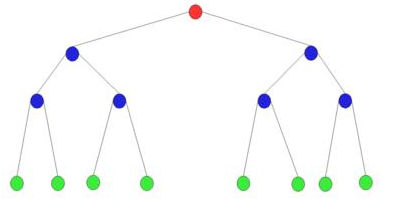
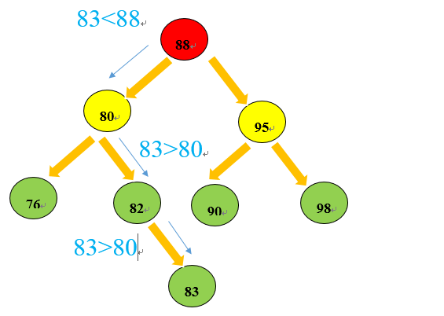

# 目录

1. 理论

   - 树的实现
   - 树的遍历
   - [二叉树](#二叉树)

   - 查找树
   - AVL树
   - 伸展树
   - B树

2. 实战

3. 总结

4. 升华


## 理论

树(Tree)是n(n>=0) 个结点的有限集。n=0 时称为空树。在任意一棵非空树中：

1. 有且仅有一个特定的称为根(Root)的结点；
2. 当 n > 1 时，其余结点可分为 m (m>0) 个互不相交的有限集T1、T2、……、Tm，其中每一个集合本身又是一棵树，并且称为根的子树(SubTree)。

树由N 个结点和 N-1 条边组成（why？）

- **度**：结点拥有的子树数称为结点的度(Degree)。度为0 的结点称为叶结点(Leaf)或终端结点；度不为0的结点称为非终端结点或分支结点。除根结点之外，分支结点也称为内部结点。树的度是树内各结点的度的最大值。
- **双亲/孩子/兄弟**：同一个双亲的孩子之间互称兄弟(Sibling)。结点的 **祖先** 是从根到该结点所经分支上的所有结点。以某结点为根的子树中的任一结点都称为该结点的 **子孙（后裔）**。
- **层次**：从根开始定义起，根为第一层，根的孩子为第二层，依次类推！双亲在同一层的结点互为堂兄弟。树中结点的最大层次称为树的 **深度(Depth)** 或 **高度**。
- **有序/无序**：如果将树中结点的各子树看成从左至右是有次序的，不能互换的，则称该树为有序树，否则称为无序树。
- **森林**：m(m>=0)棵互不相交的树的集合。对树中每个结点而言，其子树的集合即为森林

## 树的实现

3种方法：

1. 双亲表示法
2. 孩子表示法
3. 孩子兄弟表示法

### 双亲表示法

### 孩子兄弟表示法

```C
typedef struct TreeNode *PtrToNode;
struct TreeNode
{
  ElementType Element;
  PtrToNode FirstChild;
  PtrToNode NextSibling;
}
```

```java
class TreeNode {
  Object Element;
  TreeNode FirstChild;
  TreeNode NextSibling;
}
```

## 树的遍历

4种方式：

1. 前序遍历
2. 中序遍历
3. 后序遍历
4. 层序遍历


### 二叉树

二叉树最多有两个节点。

**性质：**

- 二叉树一个节点左子节点的值小于这个节点，右子节点的值大于或等于这个节点。

**优势：**

- 在实际使用时会根据**链表**和**有序数组**等数据结构的不同优势进行选择：有序数组的优势在于二分查找，链表的优势在于数据项的插入和数据项的删除。但是在有序数组中插入数据就会很慢，同样在链表中查找数据项效率就很低。
- 综合以上情况，二叉树可以利用链表和有序数组的优势，同时可以合并有序数组和链表的优势，二叉树也是一种常用的数据结构。

**构成：**

- 二叉树由节点(node)和边组成。节点分为根节点、父节点、子节点。如下图所示：

  

红色是根节点(root)。蓝色是子节点也是父节点，绿色的是子节点。其余的线是边。节点和链表中的节点一样都可以存放数据信息。树中的边可以用自引用表示，这种引用就C/C++里面的指针。通常来说树是顶部小，底部大，且树呈分层结构。root节点时第0层，以此类推。

**创建一个树节点：**

创建一个树节点包括左节点引用和右节点引用。

```java
// 创建一个树的节点，每个node存放两个数据，一个左node引用和一个右node引用
class Node
{
    public int iData;
    public double dData;
    public Node leftNode;
    public Node rightNode;
    // 显示树节点信息
    public void showNode()
    {
        System.out.println("{ "+iData+","+dData+" }");
    }
}
```

**创建一个树结构：**

创建一个树结构首先是向一棵树中插入数据节点。当一棵树为null时，数据项是从树的root节点处开始插入，之后的插入顺序是根据搜索节点顺序规则进行插入。

具体规则是：如果数据项比父节点的数据项要小，则插在父节点的左节点(leftNode)，如果比父节点的数据项要大，则将新的node插入在父节点的右节点处(rightNode)。

```java
private Node root;

// 插入Node，插入之前需要判断是否为null，不为null需要比较大小直到currentNode为null就插入
public void insert(int iData, double dData){
    // 创建node节点
    Node newNode = new Node();
    newNode.iData = iData;
    newNode.dData = dData;
    // 判断root node是否为null
    if(root == null) {
        root = newNode;
    } else {  // 不为null
        Node current = root;
        Node parent;
        while(true) {
            parent = current;  // 保存当current变为null之前的那一个父节点
            if(iData < current.iData) {  // 插入左节点
                current = current.leftNode;  // 不断向左node寻找是否为null
                if(current == null) {
                    parent.leftNode = newNode;
                    return;
                }
            } else {  // 插入右节点
                current = current.rightNode;
                if(current == null) {
                    parent.rightNode = newNode;
                    return;
                }
            }
        }
    }
}
```

以下图表示以上插入数据节点过程：




在插入节点的过程中其实也就是对tree遍历的过程，最终根据条件遍历到左右节点为null时进行添加新的节点。


参考：[https://blog.csdn.net/cai2016/article/details/52589952](#https://blog.csdn.net/cai2016/article/details/52589952)

### 完全二叉树

叶节点只能出现在最下层和次下层，并且最下面一层的结点都集中在该层最左边的若干位置的二叉树。

### 平衡二叉树(AVL)

左右两个子树的高度差的绝对值不超过1，并且左右两个子树都是一棵平衡二叉树。

如果插入或者删除一个节点使得高度之差大于1，就要进行节点之间的旋转，将二叉树重新维持在一个平衡状态。

>这个方案很好的解决了二叉查找树退化成链表的问题，把插入，查找，删除的时间复杂度最好情况和最坏情况都维持在O(logN)。但是频繁旋转会使插入和删除牺牲掉O(logN)左右的时间，不过相对二叉查找树来说，时间上稳定了很多。

参考：[https://www.cnblogs.com/polly333/p/4798944.html](#https://www.cnblogs.com/polly333/p/4798944.html)

## 查找树

## 伸展树

## B树


## 实战


## 总结


## 升华


