# 目录

1. 理论
   - [docker架构](#docker架构)
   - [核心技术](#核心技术)
   - [镜像概述](#镜像概述)
   - [容器概述](#容器概述)
   - [数据管理](#数据管理)
   - [网络模式](#网络模式)
   - [挂载点](#挂载点)
   - [仓库](#仓库)
2. 实战

   - [安装](#安装)
   - [MySQL示例](#MySQL示例)
   - [wordpress示例](#wordpress示例)
   - [常用命令](#常用命令)
     - [镜像命令](#镜像命令)
     - [容器命令](#容器命令)
   
   - [编写Dockerfile](#编写Dockerfile)
   
   - [Portainer管理集群部署](#Portainer管理集群部署)
   - [docker-compose](#docker-compose)
   - [docker-swarm](#docker-swarm)
   - [docker-machine](#docker-machine)
   - [搭建私有镜像仓库](#搭建私有镜像仓库)
3. 总结
   - [常见问题](#常见问题)
   - [Windows容器](#Windows容器)
   - [基于Docker的DevOps方案](#基于Docker的DevOps方案)
   - [容器云平台的构建实践](#容器云平台的构建实践)
   - [参考](#参考)
4. 升华


## 理论

NIST(National Institute of Standards and Technology)对云计算平台的定义：云计算是一种资源的服务模式，该模式可以实现随时随地、便捷按需地从可配直计算资源共享池中获取所需的资源（如网络、服务器、存储、应用及服务)，资源能够快速供应并释放，大大减少了资源管理工作开销，你甚至可以再也不用理会那些令人头痛的传统服务供应商了。

经典云计算架构（三层服务模型）：

- IaaS（Infrastructure as a Service，基础设施即服务）：客户关系管理、邮件、虚拟桌面、通信、游戏......

- PaaS（P1atform as a Service，平台即服务）：运行时环境、数据库、Web服务器、开发工具......

- SaaS（Software as a Service，软件即服务）：虚拟机、存储、负载均衡、网络......

云时代应用生命周期管理机制(Application Lifecycle Management, ALM) 和十二要素应用规范(The Twelve-Factor App)也随之应运而生。

Docker的设计理念是希望用户能够保证一个容器只运行一个进程，即只提供一种服务。然而，对于用户而言，单一容器是无法满足需求的。通常用户需要利用多个容器，分别提供不同的服务，并在不同容器间互连通信，最后形成一个Docker集群，以实现特定的功能。

**为什么需要docker？**

首先，Docker 的出现一定是因为目前的后端在开发和运维阶段确实需要一种虚拟化技术解决开发环境和生产环境环境一致的问题，通过 Docker 我们可以将程序运行的环境也纳入到版本控制中，排除因为环境造成不同运行结果的可能。但是上述需求虽然推动了虚拟化技术的产生，但是如果没有合适的底层技术支撑，那么我们仍然得不到一个完美的产品。

不论IaaS还是PaaS都有各自适用的场景，但依旧存在诸多缺陷，人们亟需一个真正可用的解决方案。每一场革命背后都有着深刻的历史背景和矛盾冲突，新陈代谢是历史的必然结果，新生取代陈旧得益于理念的飞跃和对时代发展需求的契合，很显然Docker抓住了这个契机。作为一种新兴的虚拟化方式，Docker 跟传统的虚拟化方式相比具有众多的优势。

Docker 在如下几个方面具有较大的优势：

- 更快速的交付和部署

  Docker在整个开发周期都可以完美的辅助你实现快速交付。Docker允许开发者在装有应用和服务本地容器做开发。可以直接集成到可持续开发流程中。

  例如：开发者可以使用一个标准的镜像来构建一套开发容器，开发完成之后，运维人员可以直接使用这个容器来部署代码。 Docker 可以快速创建容器，快速迭代应用程序，并让整个过程全程可见，使团队中的其他成员更容易理解应用程序是如何创建和工作的。 Docker 容器很轻很快！容器的启动时间是秒级的，大量地节约开发、测试、部署的时间。

- 高效的部署和扩容

  Docker 容器几乎可以在任意的平台上运行，包括物理机、虚拟机、公有云、私有云、个人电脑、服务器等。这种兼容性可以让用户把一个应用程序从一个平台直接迁移到另外一个。

  Docker的兼容性和轻量特性可以很轻松的实现负载的动态管理。你可以快速扩容或方便的下线的你的应用和服务，这种速度趋近实时。

- 更高的资源利用率

  Docker 对系统资源的利用率很高，一台主机上可以同时运行数千个 Docker 容器。容器除了运行其中应用外，基本不消耗额外的系统资源，使得应用的性能很高，同时系统的开销尽量小。传统虚拟机方式运行 10 个不同的应用就要起 10 个虚拟机，而Docker 只需要启动 10 个隔离的应用即可。

- 更简单的管理

  使用 Docker，只需要小小的修改，就可以替代以往大量的更新工作。所有的修改都以增量的方式被分发和更新，从而实现自动化并且高效的管理。

**开发、测试、发布一体化**

通过Docker提供的虚拟化方式，可以快速建立起一套可复用的开发环境，以镜像的形式将开发环境分发给所有开发成员，达到了简化开发环境搭建过程的目的。Docker的优点在于可以简化CI（持续集成）和CD（持续交付）的构建流程，让开发者集中精力在应用开发上，同时运维和测试也可以并行进行，并保持整个开发、测试、发布和运维的一体化。

Docker以镜像和在镜像基础上构建的容器为基础，以容器为开发、测试和发布的单元，将与应用相关的所有组件和环境进行封装，避免了应用在不同平台间迁移时所带来的依赖性问题，确保了应用在生产环境的各阶段达到高度一致的实际效果。

在开发阶段，镜像的使用使得构建开发环境变得简单和统一。随着Docker的发展，镜像资源也日益丰富，开发人员可以轻易地找到适合的镜像加以利用。同时，利用Dockerfile也可以将一切可代码化的东西进行自动化运行。Docker最佳实践是将应用分割成大量彼此松散耦合的Docker容器，应用的不同组件在不同的容器中同步开发，互不影响，为实现持续集成和持续交付提供了先天的便利。

在测试阶段，可以直接使用开发所构建的镜像进行测试，直接免除了测试环境构建的烦恼，也消除了因为环境不一致所带来的漏洞问题。

在部署和运维阶段，与以往代码级别的部署不同，利用Docker可以进行容器级别的部署，把应用及其依赖环境打包成跨平台、轻量级、可移植的容器来进行部署。

Docker已经逐渐发展成为一个构建、发布、运行分布式应用的开放平台，以轻量级容器为核心建立起了一套完整的生态系统，它重新定义了应用开发、测试、交付和部署的过程。在当前云计算飞速发展的背景下，Docker 将引领着云时代进入一个崭新的发展阶段。

**docker是什么？**

根据官方的定义，Docker是以Docker容器为资源分割和调度的基本单位，封装整个软件运行时环境，为开发者和系统管理员设计的，用于构建、发布和运行分布式应用的平台。

它是一个跨平台、可移植并且简单易用的容器解决方案。

Docker的源代码托管在GitHub上，基于Go语言开发，并遵从Apache 2.0协议。

Docker可在容器内部快速自动化地部署应用，并通过操作系统内核技术（namespaces、cgroups等）为容器提供资源隔离与安全保障。

**讲故事**

首先你有一个 100 平方的房子（服务器），已知你（PHP 应用）需要吃喝拉撒睡觉，所以整个房子划分了卧室、厨房、卫生间等，然后供你一个人享用，但其实挺浪费的，你一个人并不需要 100 平方这么大，可能需要 20 平方（服务器占用 20%）就好了。

后来又来了个别人（Java 应用）也被安排到了这个房子里生活，他也需要吃喝拉撒睡，所以你们挤在了一个床上，用一个卫生间（比如 http 服务器）。如果你改了你的习惯（例如 http 服务配置项）同样会影响别人的生活。

后来又来了人（Node 应用），这时候房东发现房子不够大了，所以搬家（迁移、升级服务器）到另一个 150 平的房子，但是搬家成本好高。由于户型不同（系统版本、环境等）需要装修好久，此外还要把住户（应用代码）搬过来，还需要把住户自定义的习惯都带过来简直麻烦死了。

这时候，房东了解到了一个叫 Docker 的产品。

Docker 是一个可自由伸缩的集装箱房屋，这个集装箱房屋虽小但是五脏俱全，而且可以满足一切用户需求，并支持高度自定义，比如 Node 这位住户不需要厨房，那么他的集装箱房子就小一点，当然房租（服务器消耗）也便宜一些。

房东用了 Docker 这个产品之后，发现租房这个事情变简单了：

- 房东不需要划分卫生间、厨房、卧室并进行装修了，一切由用户自己定制集装箱。房东只需要把集装箱放到房间里即可。
- 住户也不需要打架了，以前一起付房租（消耗服务器资源），现在按照自己集装箱大小付费。而且你可以在你集装箱里面随便折腾，爱怎么改配置就怎么改，也不会影响到别人。
- 集装箱对于空间的使用，更加直观，房东可以更轻松了解到当前房间的空间使用率等，以便升级房间。
- 房东搬新家的时候也开心了，只要把一面墙炸开，把里面一个个集装箱直接移过去新房子就好了，啥也不需要配置，都在集装箱里面呢。

故事讲完了：

- 你就是房东，做运维的。房间是服务器，空间大小表示服务器硬件配置。
- 住户就是你的业务、应用，提供服务的。

-伸缩集装箱房屋，就是 Docker 容器，里面是完全分离、独立、自由的环境和业务代码。你可以在里面装一个 Ubuntu（消耗大）或者简版的、可以跑业务代码的环境（消耗低）。 

- Docker 抹平系统差异，相当于把你多个房间都砸成长方形方便存放集装箱。这样你可以快速把独立容器丢到各个配置了 Docker 的不同系统、硬件配置的服务器上面。

- 因此也可以得到很高的伸缩性，可以瞬间部署很多服务器很多容器，然后负载均衡来提供大促服务等。

- 当然 Docker 概念、功能不只是我上面说的这些，这些只是我认为比较核心关键的。

[Docker](https://www.docker.com/) 是一个开源的引擎，可以轻松的为任何应用创建一个轻量级的、可移植的、自给自足的容器。

- 创始人Solomon Hykes，法国dotCloud公司

- 2013年3月以 Apache2.0 协议开源，在 [GitHub上](https://github.com/docker/docker) 维护

- 使用 Go 语言实现，在Linux操作系统上提供了一个软件抽象层和操作系统层虚拟化的自动管理机制。

  > Docker 利用了 Linux 的资源分托机制（cgroups 以及 namespace）来创建独立的软件容器。Linux 对 namespace（命名空间）的支持完全隔离工作环境中的应用程序，包括进程树，网络，用户ID挂载文件系统；而 cgroups 则提供了资源隔离，包括CPU，内存等。

- 初衷：创建软件程序可移植的轻量容器，让软件可以在任何安装了 Docker 的主机上运行，而不用关心底层操作系统。

**简单类比：**

20 世纪 50 年代，还没有处理器这个词，而复印机无处不在（某种程度上）。假设你负责按要求快速发出成批的信件、将这些信件邮寄给客户、使用纸张和信封以物理方式寄送到每个客户的地址（那时还没有电子邮件）。在某个时候，你意识到，这些信件只是由一大组段落组合而成的，根据信件的用途对其进行所需的选取和排列，因此，你设计了一个系统，以快速发送这些信件，希望能大幅提高效率。这个系统很简单：

1. 先从一副透明薄片开始，每个薄片包含一个段落。

2. 若要发送一组信件，你选择包含所需段落的薄片，然后堆栈并对齐它们，使其外观一致且易于阅读。

3. 最后，你将其置于复印机中并按开始，以生成所需的多个信件。

简而言之，这就是 Docker 的核心理念。在 Docker 中，**每层都是在执行命令（例如，安装程序）后在文件系统所发生的一组更改**。因此，当你在复制层后“查看”文件系统时，你将看到所有文件，包括在安装程序时的层。你可以将映像视为要在“计算机”中安装的辅助只读硬盘，其中操作系统已经安装。同样，你可以将容器视为已安装映像硬盘的“计算机”。与计算机一样，可以打开或关闭容器电源。

**优越性：**如果你在一台机器上可以开10个虚拟机，那么用 docker 可以开100个容器！

**基本概念：**

- 虚拟化：一种资源管理技术，将计算机的各种实体资源予以抽象、转换后呈现出来，打破实体结构间的不可切割的障碍，使用户可以比原本的配置更好的方式来应用这些资源。

  这些资源的新虚拟部分是不受现有资源的架设方式，地域或物理配置所限制。一般所指的虚拟化资源包括计算能力和数据存储。

- 系统虚拟化，Hypervisor Virtualization，全虚拟化。

  在 Host 中通过 Hypervisor 层实现安装多个 GuestOS，每个 GuestOS 都有自己的内核，和主机的内核不同，GuestOS 之间完全隔离。

- 容器虚拟化，Operating System Virtualization ，使用 Linux 内核中的 namespaces 和 cgroups 实现进程组之间的隔离。是用内核技术实现的隔离，所以它是一个共享内核的虚拟化技术。

  容器虚拟化没有 GuestOS，使用 Docker 时下载的镜像，只是为运行 App 提供的一个依赖的环境，是一个删减版本的系统镜像。**一般情况下系统虚拟化没有容器虚拟化的运行效率高，但是系统安全性高很多**。


注册一个docker账号：[https://hub.docker.com/](https://hub.docker.com/)

**为什么使用Docker？**

Docker是一种新兴的虚拟化方式，但是，Docker不是虚拟机。传统的虚拟机是先虚拟硬件资源，然后在虚拟的硬件资源之上运行操作系统。而Docker容器作为一个进程，直接运行于宿主主机内核，因此Docker更加快捷。

Docker具有很多优势：

- 高效利用系统资源（没有虚拟硬件的额外开销）。
- 更快的启动时间（通常可以在1秒内启动）。
- 便于部署（镜像包含了应用和相关依赖，可以运行在任何配置了Docker的主机上）。
- 轻松迁移。
- 分层存储，提高存储效率。


**Docker术语**

- **存储库(repo)**：相关的 Docker 映像集合，带有指示映像版本的标记。某些存储库包含特定映像的多个变量，例如包含 SDK（较重）的映像，包含唯一运行时（较轻）的映像等等。这些变量可以使用标记进行标记。单个存储库中可包含平台变量，如 Linux 映像和 Windows 映像。

- **注册表**：提供存储库访问权限的服务。大多数公共映像的默认注册表是[Docker 中心](https://hub.docker.com/)（归作为组织的 Docker 所有）。注册表通常包含来自多个团队的存储库。公司通常使用私有注册表来存储和管理其创建的映像。 另一个示例是 Azure 容器注册表。

- **Docker中心**：上传并使用映像的公共注册表。 Docker 中心提供 Docker 映像托管、公共或私有注册表，生成触发器和 Web 挂钩，以及与 GitHub 和 Bitbucket 集成。

- **Azure容器注册表**：用于在 Azure 中使用 Docker 映像及其组件的公共资源。这提供了与 Azure 中的部署接近的注册表，使你可以控制访问权限，从而可以使用 Azure Active Directory 组和权限。

- **Docker受信任注册表(DTR)**：Docker注册表服务（来自Docker），可以安装在本地，因此它存在于组织的数据中心和网络中。这对于应该在企业内部管理的私有映像来说很方便。Docker受信任注册表是Docker数据中心产品的一部分。有关详细信息，请参阅[Docker受信任注册表(DTR)](https://docs.docker.com/docker-trusted-registry/overview/)。

- **Docker社区版(CE)**：适用于 Windows 和 macOS、用于在本地生成、运行和测试容器的开发工具。适用于 Windows 的 Docker CE 为 Linux 和 Windows 容器提供了开发环境。Windows 上的 Linux Docker 主机基于 [Hyper-V](https://www.microsoft.com/cloud-platform/server-virtualization)虚拟机。适用于 Windows 容器的主机直接基于 Windows。适用于 Mac 的 Docker CE 基于 Apple 虚拟机监控程序框架和[xhyve虚拟机监控程序](https://github.com/mist64/xhyve)，在 Mac OS X 上提供了 Linux Docker 主机虚拟机。适用于 Windows 和 Mac 的 Docker CE 替换了 Docker 工具箱，后者基于 Oracle VirtualBox。

- **Docker企业版(EE)**：适用于 Linux 和 Windows 开发的 Docker 工具企业级版本。

Docker 目前已经成为了非常主流的技术，已经在很多成熟公司的生产环境中使用，但是 Docker 的核心技术其实已经有很多年的历史了，Linux 命名空间、控制组和 UnionFS 三大技术支撑了目前 Docker 的实现，也是 Docker 能够出现的最重要原因。

由于 Docker 目前的代码库实在是太过庞大，想要从源代码的角度完全理解 Docker 实现的细节已经是非常困难的了，但是如果各位读者真的对其实现细节感兴趣，可以从 [Docker CE](https://github.com/docker/docker-ce) 的源代码开始了解 Docker 的原理。

**容器云概念**

**为什么出现？**

容器为用户打开了一扇通往新世界的大门，真正进入这个容器的世界后，却发现新的生态系统如此庞大。在生产使用中，不论是个人还是企业，都会提出更复杂的需求。这时，我们需要众多跨主机的容器协同工作，需要支持各种类型的工作负载，企业级应用开发更是需要基于容器技术，实现支持多人协作的持续集成、持续交付平台。从容器到容器云的进化便应运而生。

**什么是容器云？**

容器云以容器为资源分割和调度的基本单位，封装整个软件运行时环境，为开发者和系统管理员提供用于构建、发布和运行分布式应用的平台。


### docker架构

**Docker Engine**

1. 最核心的是 Docker Daemon 我们称之为**Docker守护进程**，也就是 Server 端，Server 端可以部署在远程，也可以部署在本地，因为 Server 端与客户端(Docker Client)是通过 Rest API 进行通信。

2. REST 做过 web 开发都了解，它的效率杠杠的。

3. docker CLI 实现容器和镜像的管理，为用户提供统一的操作界面，这个客户端提供一个只读的镜像，然后通过镜像可以创建一个或者多个容器。(container)，这些容器可以只是一个RFS(Root File System)，也可以是一个包含了用户应用的RFS。容器在docker Client中只是一个进程，两个进程是互不可见的。用户不能与 server 直接交互，但可以通过与容器这个桥梁来交互，由于是操作系统级别的虚拟技术，中间的损耗几乎可以不计。

4. 其实 docker 就是个 C/S 的架构，有 client 和 server 的。

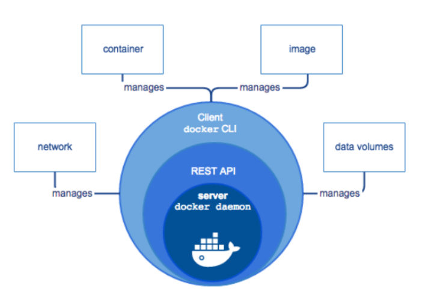

**Docker的组织架构**

Docker使用C/S架构，Client 通过接口与Server进程通信实现容器的构建，运行和发布。client和server可以运行在同一台集群，也可以通过跨主机实现远程通信。

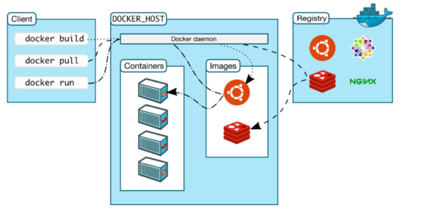

**Docker的底层技术支持**

容器 = cgroup（资源控制）+ namespace（访问隔离）+ rootfs（文件系统隔离）+ 容器引擎（用户态工具LXC，生命周期控制）


### 核心技术

#### Namespaces

命名空间 (namespaces)是 Linux 为我们提供的用于分离进程树、网络接口、挂载点以及进程间通信等资源的方法。在日常使用 Linux 或者 macOS 时，我们并没有运行多个完全分离的服务器的需要，但是如果我们在服务器上启动了多个服务，这些服务其实会相互影响的，每一个服务都能看到其他服务的进程，也可以访问宿主机器上的任意文件，这是很多时候我们都不愿意看到的，我们更希望运行在同一台机器上的不同服务能做到完全隔离，就像运行在多台不同的机器上一样。

在这种情况下，一旦服务器上的某一个服务被入侵，那么入侵者就能够访问当前机器上的所有服务和文件，这也是我们不想看到的，而Docker其实就通过Linux的Namespaces对不同的容器实现了隔离。

Linux的命名空间机制提供了七种不同的命名空间，通过这七个选项我们能在创建新的进程时设置新进程应该在哪些资源上与宿主机器进行隔离。

| **namespaces** | **系统调用参数** | **隔离内容**               |
| -------------- | ---------------- | -------------------------- |
| UTS            | CLONE_NEWUTS     | 主机名与域名               |
| IPC            | CLONE_NEWIPC     | 信号量、消息队列和共享内存 |
| PID            | CLONE_NEWPID     | 进程编号                   |
| Network        | CLONE_NEWNET     | 网络设备、网络栈、端口等   |
| Mount          | CLONE_NEWNS      | 挂载点（文件系统）         |
| User           | CLONE_NEWUSER    | 用户和用户组               |
|                | CLONE_NEWCGROUP  |                            |

实际上，Linux内核实现namespace的一个主要目的，就是实现轻量级虚拟化（容器）服务。在同一个namespace下的进程可以感知彼此的变化，而对外界的进程一无所知。这样就可以让容器中的进程产生错觉，仿佛自己置身于一个独立的系统环境中，以达到独立和隔离的目的。

本节所讨论的namespace实现针对的均是Linux内核3.8及以后的版本。

进行 namespace API 操作的方式：

1、 通过 clone() 在创建新进程的同时创建namespace

2、 查看 /proc/[pid]/ns 文件

3、 通过 setns() 加入一个已经存在的 namespace

4、 通过 unshare() 在原先进程上进行 namespace 隔离

5、 fork() 系统调用

#### 进程

进程是 Linux 以及现在操作系统中非常重要的概念，它表示一个正在执行的程序，也是在现代分时系统中的一个任务单元。在每一个 *nix 的操作系统上，我们都能够通过 ps 命令打印出当前操作系统中正在执行的进程，比如在 Ubuntu 上，使用该命令就能得到以下的结果：

```sh 
ps -ef

UID     PID  PPID  C STIME TTY      TIME CMD
root     1   0  0 Apr08 ?     00:00:09 /sbin/init
root     2   0  0 Apr08 ?     00:00:00 [kthreadd]
root     3   2  0 Apr08 ?     00:00:05 [ksoftirqd/0]
root     5   2  0 Apr08 ?     00:00:00 [kworker/0:0H]
root     7   2  0 Apr08 ?     00:07:10 [rcu_sched]
root     39   2  0 Apr08 ?     00:00:00 [migration/0]
root     40   2  0 Apr08 ?     00:01:54 [watchdog/0]
...
```

当前机器上有很多的进程正在执行，在上述进程中有两个非常特殊，一个是 pid 为 1 的 /sbin/init 进程，另一个是 pid 为 2 的 kthreadd 进程，这两个进程都是被 Linux 中的上帝进程 idle 创建出来的，其中前者负责执行内核的一部分初始化工作和系统配置，也会创建一些类似 getty 的注册进程，而后者负责管理和调度其他的内核进程。


如果我们在当前的 Linux 操作系统下运行一个新的 Docker 容器，并通过 exec 进入其内部的 bash 并打印其中的全部进程，我们会得到以下的结果：

```sh
root@iZ255w13cy6Z:~# docker run -it -d ubuntu
b809a2eb3630e64c581561b08ac46154878ff1c61c6519848b4a29d412215e79
root@iZ255w13cy6Z:~# docker exec -it b809a2eb3630 /bin/bash
root@b809a2eb3630:/# ps -ef

UID     PID  PPID  C STIME TTY      TIME CMD
root     1   0  0 15:42 pts/0   00:00:00 /bin/bash
root     9   0  0 15:42 pts/1   00:00:00 /bin/bash
root     17   9  0 15:43 pts/1   00:00:00 ps -ef
```

在新的容器内部执行 ps 命令打印出了非常干净的进程列表，只有包含当前 ps -ef 在内的三个进程，在宿主机器上的几十个进程都已经消失不见了。

当前的 Docker 容器成功将容器内的进程与宿主机器中的进程隔离，如果我们在宿主机器上打印当前的全部进程时，会得到下面三条与 Docker 相关的结果：

```sh
UID     PID  PPID  C STIME TTY      TIME CMD
root   29407   1  0 Nov16 ?     00:08:38 /usr/bin/dockerd --raw-logs
root    1554 29407  0 Nov19 ?     00:03:28 docker-containerd -l unix:///var/run/docker/libcontainerd/docker-containerd.sock --metrics-interval=0 --start-timeout 2m --state-dir /var/run/docker/libcontainerd/containerd --shim docker-containerd-shim --runtime docker-runc
root    5006  1554  0 08:38 ?     00:00:00 docker-containerd-shim b809a2eb3630e64c581561b08ac46154878ff1c61c6519848b4a29d412215e79 /var/run/docker/libcontainerd/b809a2eb3630e64c581561b08ac46154878ff1c61c6519848b4a29d412215e79 docker-runc
```

在当前的宿主机器上，可能就存在由上述的不同进程构成的进程树：


这就是在使用 clone(2) 创建新进程时传入 CLONE_NEWPID 实现的，也就是使用 Linux 的命名空间实现进程的隔离，Docker 容器内部的任意进程都对宿主机器的进程一无所知。

containerRouter.postContainersStart

└── daemon.ContainerStart

  └── daemon.createSpec

​    └── setNamespaces

​      └── setNamespace

Docker 的容器就是使用上述技术实现与宿主机器的进程隔离，当我们每次运行 docker run 或者 docker start时，都会在下面的方法中创建一个用于设置进程间隔离的 Spec：

```go
func (daemon *Daemon) createSpec(c *container.Container) (*specs.Spec, error) {
	s := oci.DefaultSpec()
	// ...
	if err := setNamespaces(daemon, &s, c); err != nil {
		return nil, fmt.Errorf("linux spec namespaces: %v", err)
	}
	return &s, nil
}
```

在 setNamespaces 方法中不仅会设置进程相关的命名空间，还会设置与用户、网络、IPC 以及 UTS 相关的命名空间：

```go
func setNamespaces(daemon *Daemon, s *specs.Spec, c *container.Container) error {
	// user
	// network
	// ipc
	// uts
	// pid
	if c.HostConfig.PidMode.IsContainer() {
		ns := specs.LinuxNamespace{Type: "pid"}
		pc, err := daemon.getPidContainer(c)
		if err != nil {
			return err
		}
		ns.Path = fmt.Sprintf("/proc/%d/ns/pid", pc.State.GetPID())
		setNamespace(s, ns)
	} else if c.HostConfig.PidMode.IsHost() {
		oci.RemoveNamespace(s, specs.LinuxNamespaceType("pid"))
	} else {
		ns := specs.LinuxNamespace{Type: "pid"}
		setNamespace(s, ns)
	}
	return nil
}
```

所有命名空间相关的设置 Spec 最后都会作为 Create 函数的入参在创建新的容器时进行设置：

daemon.containerd.Create(context.Background(), container.ID, spec, createOptions)

所有与命名空间的相关的设置都是在上述的两个函数中完成的，Docker 通过命名空间成功完成了与宿主机进程和网络的隔离。


### 镜像概述

Docker镜像(Image)就是一个只读的模板。例如：一个镜像可以包含一个完整的操作系统环境，里面仅安装了Apache或用户需要的其它应用程序。镜像可以用来创建Docker容器，一个镜像可以创建很多容器。

Docker提供了一个很简单的机制来创建镜像或者更新现有的镜像，用户甚至可以直接从其他人那里下载一个已经做好的镜像来直接使用。

镜像(Image)就是一堆只读层(read-only layer)的统一视角！

多个只读层重叠在一起。除了最下面一层，其它层都会有一个指针指向下一层。这些层是Docker内部的实现细节，并且能够在docker宿主机的文件系统上访问到。统一文件系统(Union File System)技术能够将不同的层整合成一个文件系统，为这些层提供了一个统一的视角，这样就隐藏了多层的存在，在用户的角度看来，只存在一个文件系统。

**什么是Image？**

- 文件和 meta data 的集合(root filesystem)
  1. 对于 linux 系统来说就是内核空间(kernel space)和用户空间(user space)，内核空间linux kernel，就理解成root filesystem
  2. 用户空间就是在内核上层建立的，其实就是：ubuntu，centos，redhat，Debian。

- 分层的，并且每一层都是可以添加改变的，成为一个新的Image。例如：先建立个 apache 的 Image，结果在 apache 的 Image 上边我有建立一个 mysql 的 Image。

- 不同的 Image 之前可以共享分层。例如：apache 的 Image 可以跟 mysql 的 Image 之间进行通信。

- Image 本身是只读的

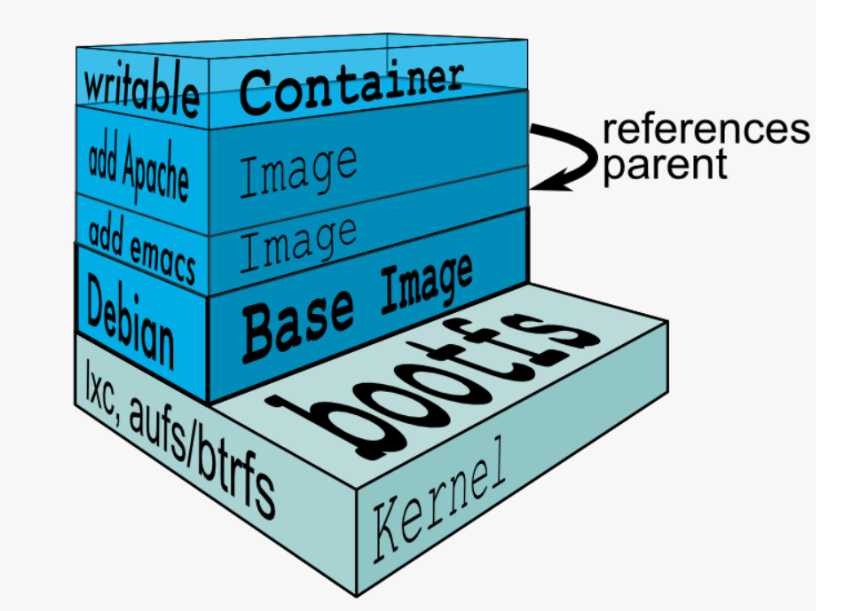

**开始Image的表演**

```sh
# 首先启动vagrant创建的虚机
vagrant reload
# 进入
vagrant ssh
sudo service docker restart
sudo docker version
# 挂个国内的加速器
sudo curl -sSL https://get.daocloud.io/daotools/set_mirror.sh | sh -s http://b81aace9.m.daocloud.io
sudo systemctl restart docker
# 查看Image
sudo docker image ls


# 获取Image

# 1、bulid from Dockerfile
ls
cd labs
cd docker-centos-vim/
ls
pwd
more Dockerfile
----------------------------------------
FROM centos
RUN vum install -v vim
----------------------------------------
sudo service docker restart
sudo docker build -t liming/vim:latest .
# 这里注意里面一共用了两步，这个跟编写的Dockfile有关系，因为Dockfile也就两行。

# 2、Pull from Registry（从仓库中下载，这个概念有点像git的方式，其实docker就是模仿了git的方式，我们可以从https://hub.docker.com/pull，也可以把的Image push 到https://hub.docker.com/ 中）
sudo docker pull ubuntu:14.04
sudo docker image ls

# 1、liming/vim 是在centos之上的一个Image
# 2、因为Dockerfile中需要from centos 所以也下了centos Image
# 3、ubuntu 刚刚pull下来的
#   如果自己安装一个centos 和ubuntu 在虚拟机上也需要几个G吧，这里通过docker 才几百兆，是不是很省空间。
#   注意：从：https://hub.docker.com/ 中不仅仅可以下载官方的Image还可以下载私人的Image 
#   他们的区别是：官方的名字后面没有/，私人的：人名/Image的名称
# 4、通过版本号
sudo docker pull bitnami/wordpress:4
# 默认的latest
sudo docker pull bitnami/wordpress

# 进入容器内部
# 创建文件
touch test.txt
# 执行yum安装
yum install vim
# 从容器内部退出，容器也变成了exited
```

**手动建立一个base Image**

一. 通过 pull 的方式

```sh
docker pull hello-world
docker image ls
docker run hello-world
```

二. 通过 build 的方式

1、创建文件

```sh
mkdir hello-world
cd hello-world/
vim hello.c
```

2、编辑c文件

```c
#include<stdio.h>
int main()
{
    printf("hello docker");
}
```

3、编译程序gcc

```sh
sudo yum install -y gcc
sudo yum install -y glibc-static
gcc -static hello.c -o hello
```

4、创建编辑Dockerfile

```sh
vim Dockfile
---------------------------------------
FROM scratch
ADD hello /
CMD ["/hello"]
---------------------------------------
docker build -t liming/hello .
# 查看分层layer（通过image id）
docker history a4cb86cc8d6b
```

5、运行Image

```sh
docker run liming/hello
docker container ls -a
```


### 容器概述

镜像(Image)，跟你装操作系统的 iso 镜像一个概念。容器(Container)，就是基于这个镜像启动的操作系统。一个镜像，可以用来在各种地方启动任意多个容器，也就是一个镜像可以装很多个操作系统。当然，镜像，不一定是操作系统的镜像，也可能是软件的镜像。等你以后明白了，你就知道我这解释也是不完全对的。但是，你可以先这么理解。

Docker 利用容器(Container)来运行应用。容器是从镜像创建的运行实例。它可以被启动、开始、停止、删除。每个容器都是相互隔离的、保证安全的平台。可以把容器看做是一个简易版的 Linux 环境（包括root用户权限、进程空间、用户空间和网络空间等）和运行在其中的应用程序。

容器的定义和镜像几乎一模一样，也是一堆层的统一视角，唯一区别在于容器的最上面那一层是可读可写的。

一个运行态容器被定义为一个可读写的统一文件系统加上隔离的进程空间和包含其中的进程。

**什么是Container？**

- 通过 Image 创建的
- 在 Image layer 之上建立一个 container layer（可读写）
- 类比面向对象，类和实例，容器就是实例，Image就是类
- Image 负责 application 的存储和分发，Container 负责运行 app


```sh
# 创建
sudo docker image ls
sudo docker container ls
sudo docker run liming/hello-world
sudo docker container ls
sudo docker container ls -a
# 注：运行上边的命令发现，为什么每次 sudo docker container ls后，里面都是空的，都没有列表呢，因为后台没有运行程序，所以不会常驻内存，所以后面的status = exited 退出的状态。
sudo docker run -it liming/hello-world
# 增加-it命令，可以让后端进行运行，直接进入容器，新建的状态发生了改变，up 和 exited。通过ls，可以看到里面类似一个linux系统的文件格式。
# 列表
sudo docker container ls
# 删除
sudo docker rm  容器id
# 批量删除容器
# 只删除退出的
docker rm $(docker container ls -f "status=exited" -q)
# 全部删除
docker rm $(docker container ls -aq)
```


### 数据管理

在容器里直接写入数据是很不好的习惯，那么，如果想在容器里面写入数据，该怎么做呢？

Docker 数据管理主要有两种方式：**数据卷** 和 **数据卷容器**。下面我们会分别展开介绍。

卷：提供一个容器可以使用的可写文件系统。由于映像只可读取，而多数程序需要写入到文件系统，因此卷在容器映像顶部添加了一个可写层，这样程序就可以访问可写文件系统。 程序并不知道它正在访问的是分层文件系统，此文件系统就是往常的文件系统。卷位于主机系统中，由 Docker 管理。

#### 数据卷（Data Volume）

数据卷的使用其实和 Linux 挂载文件目录是很相似的。简单来说，数据卷就是一个可以供容器使用的特殊目录。

- 创建一个数据卷

  在运行 `Docker run` 命令的时候使用 `-v` 参数为容器挂载一个数据卷：

  ```sh
  docker run -ti --name volume1 -v /myDir ubuntu:16.04 bash
  ```

  可以发现我们的容器里面有一个 myDir 的目录，这个目录就是我们所说的数据卷

- 删除一个数据卷

  数据卷是用来持久化数据的，所以数据卷的生命周期独立于容器。所以在容器结束后数据卷并不会被删除，如果你希望删除数据卷，可以在使用 `docker rm` 命令删除容器的时候加上 `-v` 参数。

  值得注意的是，如果你删除挂载某个数据卷的所有容器的同时没有使用 -v 参数清理这些容器挂载的数据卷，你之后再想清理这些数据卷会很麻烦，所以在你确定某个数据卷没有必要存在的时候，在删除最后一个挂载这个数据卷的容器的时候，使用 `-v` 参数删除这个数据卷。

- 挂载一个主机目录作为数据卷

  当然，你也可以挂载一个主机目录到容器，同样是使用 `-v` 参数。

  ```sh
  docker run -ti --name volume2 -v /home/zsc/Music/:/myShare ubuntu:16.04 bash
  ```

  以上指令会把宿主主机的目录 /home/zsc/Music 挂载到容器的 myShare 目录下，然后你可以发现我们容器内的 myShare 目录就会包含宿主主机对应目录下的文件

  Docker 挂载数据卷的默认权限是读写，你可以通过 :ro 指令为只读：

  ```sh
  docker run -ti --name volume2 -v /home/zsc/Music/:/myShare:ro ubuntu:16.04 bash
  ```

  直接挂载宿主主机目录作为数据卷到容器内的方式在测试的时候很有用，你可以在本地目录放置一些程序，用来测试容器工作是否正确。当然，Docker也可以挂载宿主主机的一个文件到容器，但是这会出现很多问题，所以不推荐这样做。如果你要挂载某个文件，最简单的办法就是挂载它的父目录。

#### 数据卷容器（Data Volume Container）

所谓数据卷容器，其实就是一个普通的容器，只不过这个容器专门作为数据卷供其它容器挂载。

首先，在运行 docker run 指令的时候使用 -v 参数创建一个数据卷容器（这和我们之前创建数据卷的指令是一样的）：

```sh
docker run -ti  -d -v /dataVolume --name v0 ubuntu:16.04
```

然后，创建一个新的容器挂载刚才创建的数据卷容器中的数据卷：使用 `--volumes-from` 参数

```sh
docker run -ti --volumes-from v0 --name v1 ubuntu:16.04 bash
```

然后，我们的新容器里就可以看到数据卷容器的数据卷内容

>注意：  
>1、数据卷容器被挂载的时候不必保持运行！  
>2、如果删除了容器 v0 和 v1，数据卷并不会被删除。如果想要删除数据卷，应该在执行 docker rm 命令的时候使用 -v 参数。

### 网络模式

如果 Docker 的容器通过 Linux 的命名空间完成了与宿主机进程的网络隔离，但是却有没有办法通过宿主机的网络与整个互联网相连，就会产生很多限制，所以 Docker 虽然可以通过命名空间创建一个隔离的网络环境，但是 Docker 中的服务仍然需要与外界相连才能发挥作用。

每一个使用 docker run 启动的容器其实都具有单独的网络命名空间，Docker 为我们提供了四种不同的网络模式，Host、Container、None 和 Bridge 模式。

安装 Docker 时，它会自动创建三个网络，bridge（创建容器默认连接到此网络）、none、host

| 网络模式   | 简介                                                         |
| ---------- | ------------------------------------------------------------ |
| Host       | 容器将不会虚拟出自己的网卡，配置自己的 IP 等，而是使用宿主机的 IP 和端口 |
| Bridge     | 此模式会为每一个容器分配、设置 IP 等，并将容器连接到一个 docker0 虚拟网桥，通过 docker0 网桥以及 Iptables nat 表配置与宿主机通信 |
| None       | 该模式关闭了容器的网络功能                                   |
| Container  | 创建的容器不会创建自己的网卡，配置自己的 IP，而是和一个指定的容器共享 IP、端口范围 |
| 自定义网络 | 略                                                           |

>Docker有三种网络模式，bridge、host、none，在你创建容器的时候，不指定 --network 默认是bridge。
>
>bridge：为每一个容器分配IP，并将容器连接到一个  docker0 虚拟网桥，通过 docker0 网桥与宿主机通信。也就是说，此模式下，你不能用 **宿主机的IP + 容器映射端口** 来进行Docker容器之间的通信。
>
>host：容器不会虚拟自己的网卡，配置自己的IP，而是使用宿主机的IP和端口。这样一来，Docker容器之间的通信就可以用 `宿主机的IP+容器映射端口`
>
>none：无网络。

```sh
# 列出网络
docker network ls
```


Docker 内置这三个网络，运行容器时，你可以使用该 `--network` 标志来指定容器应连接到哪些网络

该 bridge 网络代表 docker0 所有 Docker 安装中存在的网络，除非你使用该 `docker run --network=选项` 指定，否则 Docker 守护程序默认将容器连接到此网络

```sh
# 查看客户机上网络
ip a
```

我们在使用 `docker run` 创建Docker容器时，可以用 `--net` 选项指定容器的网络模式，Docker可以有以下4种网络模式

1. host 模式：使用 `--net=host` 指定。
2. none 模式：使用 `--net=none` 指定。
3. bridge 模式：使用 `--net=bridge` 指定，默认设置。
4. container 模式：使用 `--net=container:NAME_or_ID` 指定。

下面分别介绍一下 Docker 的各个网络模式

#### Host模式

相当于 Vmware 中的桥接模式，与宿主机在同一个网络中，但没有独立 IP 地址。

众所周知，Docker 使用了 Linux 的 Namespaces 技术来进行资源隔离，如 PID Namespace 隔离进程，Mount Namespace 隔离文件系统，Network Namespace 隔离网络等

一个 Network Namespace 提供了一份独立的网络环境，包括网卡、路由、Iptable 规则等都与其他的 Network Namespace 隔离。一个 Docker 容器一般会分配一个独立的 Network Namespace，但如果启动容器的时候使用 host 模式，那么这个容器将不会获得一个独立的 Network Namespace，而是和宿主机共用一个 Network Namespace。容器将不会虚拟出自己的网卡，配置自己的 IP 等，而是使用宿主机的 IP和端口

例如，我们在 172.25.2.1/24 的机器上用 host 模式启动一个 ubuntu 容器

```sh
docker run -it --network host ubuntu
```

进入容器可以看到，容器的网络使用的是宿主机的网络，但是，容器的其他方面，如文件系统、进程列表等还是和宿主机隔离的。

#### Container模式

在理解了 host 模式后，这个模式也就好理解了

这个模式指定新创建的容器和已经存在的一个容器共享一个 Network Namespace，而不是和宿主机共享

新创建的容器不会创建自己的网卡，配置自己的 IP，而是和一个指定的容器共享 IP、端口范围等

同样，两个容器除了网络方面，其他的如文件系统、进程列表等还是隔离的。两个容器的进程可以通过 IO 网卡设备通信

#### None模式

该模式将容器放置在它自己的网络栈中，但是并不进行任何配置。实际上，该模式关闭了容器的网络功能，在以下情况下是有用的：容器并不需要网络（例如只需要写磁盘卷的批处理任务）

#### overlay模式

在 docker1.7 代码进行了重构，单独把网络部分独立出来编写，所以在 docker1.8 新加入一个 overlay 网络模式。Docker 对于网络访问的控制也是在逐渐完善的。

#### Bridge模式

相当于 Vmware 中的 Nat 模式，容器使用独立 network Namespace，并连接到 docker0 虚拟网卡（默认模式）。

通过 docker0 网桥以及 Iptables nat 表配置与宿主机通信；bridge 模式是 Docker 默认的网络设置。

此模式会为每一个容器分配 Network Namespace、设置 IP 等，并将一个主机上的 Docker 容器连接到一个虚拟网桥上。下面着重介绍一下此模式：

在默认情况下，每一个容器在创建时都会创建一对虚拟网卡，两个虚拟网卡组成了数据的通道，其中一个会放在创建的容器中，会加入到名为 docker0 网桥中。我们可以使用如下的命令来查看当前网桥的接口：

```sh
$ brctl show
bridge name	bridge id		STP enabled	 interfaces
docker0		8000.0242a6654980	no		 veth3e84d4f
							       veth9953b75
```

docker0会为每一个容器分配一个新的IP地址并将docker0的IP地址设置为默认的网关。网桥docker0通过iptables中的配置与宿主机器上的网卡相连，所有符合条件的请求都会通过iptables转发到 docker0并由网桥分发给对应的机器。

```sh
$ iptables -t nat -L

Chain PREROUTING (policy ACCEPT)
target   prot opt source        destination
DOCKER   all  --  anywhere       anywhere       ADDRTYPE match dst-type LOCAL
Chain DOCKER (2 references)
target   prot opt source        destination
RETURN   all  --  anywhere       anywhere
```

我们在当前的机器上使用 docker run -d -p 6379:6379 redis 命令启动了一个新的 Redis 容器，在这之后我们再查看当前 iptables 的 NAT 配置就会看到在 DOCKER 的链中出现了一条新的规则：

```sh
DNAT    tcp  --  anywhere       anywhere       tcp dpt:6379 to:192.168.0.4:6379
```

上述规则会将从任意源发送到当前机器 6379 端口的 TCP 包转发到 192.168.0.4:6379 所在的地址上。

这个地址其实也是 Docker 为 Redis 服务分配的 IP 地址，如果我们在当前机器上直接 ping 这个 IP 地址就会发现它是可以访问到的：

```sh
$ ping 192.168.0.4

PING 192.168.0.4 (192.168.0.4) 56(84) bytes of data.
64 bytes from 192.168.0.4: icmp_seq=1 ttl=64 time=0.069 ms
64 bytes from 192.168.0.4: icmp_seq=2 ttl=64 time=0.043 ms
^C
--- 192.168.0.4 ping statistics ---
2 packets transmitted, 2 received, 0% packet loss, time 999ms
rtt min/avg/max/mdev = 0.043/0.056/0.069/0.013 ms
```

从上述一系列现象，我们就可以推测出 Docker 是如何将容器的内部的端口暴露出来并对数据包进行转发的了；当有 Docker 的容器需要将服务暴露给宿主机器，就会为容器分配一个 IP 地址，同时向 iptables 中追加一条新的规则。

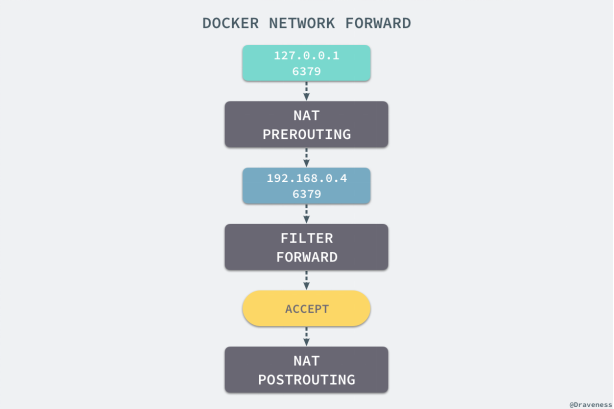

当我们使用 redis-cli 在宿主机器的命令行中访问 127.0.0.1:6379 的地址时，经过 iptables 的 NAT PREROUTING 将 ip 地址定向到了 192.168.0.4，重定向过的数据包就可以通过 iptables 中的 FILTER 配置，最终在 NAT POSTROUTING 阶段将 ip 地址伪装成 127.0.0.1，到这里虽然从外面看起来我们请求的是 127.0.0.1:6379，但是实际上请求的已经是 Docker 容器暴露出的端口了。

```sh
$ redis-cli -h 127.0.0.1 -p 6379 ping

PONG
```

Docker 通过 Linux 的命名空间实现了网络的隔离，又通过 iptables 进行数据包转发，让 Docker 容器能够优雅地为宿主机器或者其他容器提供服务。

**libnetwork**

整个网络部分的功能都是通过 Docker 拆分出来的 libnetwork 实现的，它提供了一个连接不同容器的实现，同时也能够为应用给出一个能够提供一致的编程接口和网络层抽象的**容器网络模型**。

**The goal of libnetwork is to deliver a robust Container Network Model that provides a consistent programming interface and the required network abstractions for applications.**

libnetwork 中最重要的概念，容器网络模型由以下的几个主要组件组成，分别是 Sandbox、Endpoint 和 Network：


在容器网络模型中，每一个容器内部都包含一个 Sandbox，其中存储着当前容器的网络栈配置，包括容器的接口、路由表和 DNS 设置，Linux 使用网络命名空间实现这个 Sandbox，每一个 Sandbox 中都可能会有一个或多个 Endpoint，在 Linux 上就是一个虚拟的网卡 veth，Sandbox 通过 Endpoint 加入到对应的网络中，这里的网络可能就是我们在上面提到的 Linux 网桥或者 VLAN。

想要获得更多与 libnetwork 或者容器网络模型相关的信息，可以阅读 [Design·libnetwork](https://github.com/docker/libnetwork/blob/master/docs/design.md) 了解更多信息，当然也可以阅读源代码了解不同 OS 对容器网络模型的不同实现。

**Bridge模式的拓扑：**

>当 Docker server 启动时，会在主机上创建一个名为 docker0 的虚拟网桥，此主机上启动的 Docker 容器会连接到这个虚拟网桥上。
>
>虚拟网桥的工作方式和物理交换机类似，这样主机上的所有容器就通过交换机连在了一个二层网络中。
>
>接下来就要为容器分配 IP 了，Docker 会从 RFC1918 所定义的私有 IP 网段中，选择一个和宿主机不同的 IP 地址和子网分配给 docker0，连接到 docker0 的容器就从这个子网中选择一个未占用的 IP 使用。
>
>如一般 Docker 会使用 172.17.0.0/16 这个网段，并将 172.17.0.1/16 分配给 docker0 网桥
>
>（在主机上使用 ifconfig 命令是可以看到 docker0 的，可以认为它是网桥的管理接口，在宿主机上作为一块虚拟网卡使用）。

单机环境下的网络拓扑如下，主机地址为10.10.0.186/24。

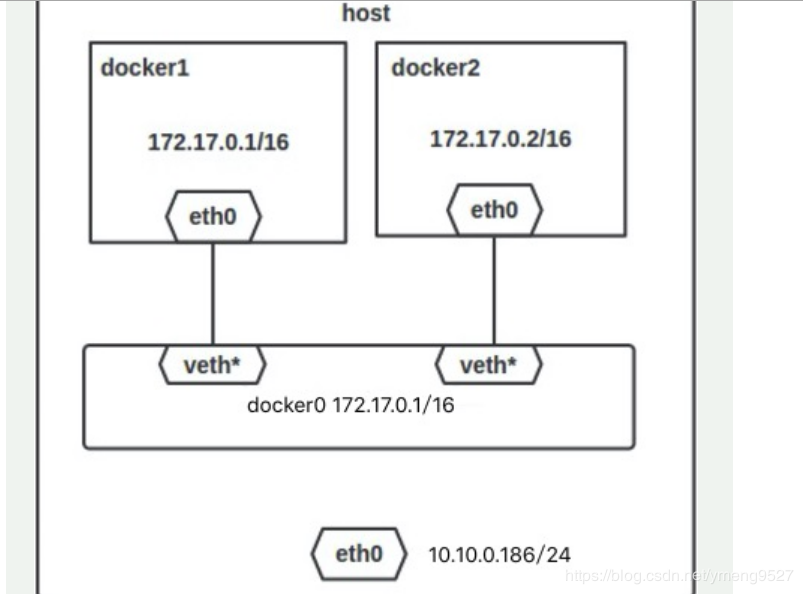

Docker 完成以上网络配置的过程大致是这样的：

1、在主机上创建一对虚拟网卡 veth pair 设备。

veth 设备总是成对出现的，它们组成了一个数据的通道，数据从一个设备进入，就会从另一个设备出来。因此，veth 设备常用来连接两个网络设备。

2、Docker 将 veth pair 设备的一端放在新创建的容器中，并命名为 eth0。
另一端放在主机中，以 veth65f9 这样类似的名字命名，并将这个网络设备加入到 docker0 网桥中，可以通过 `brctl show` 命令查看。

从 docker0 子网中分配一个 IP 给容器使用，并设置 docker0 的 IP 地址为容器的默认网关。

```sh
# 运行容器
docker run --name=nginx_bridge --network bridge -p 80:80 -d nginx
# 查看容器
docker ps
# 查看容器网络
docker inspect [ContainerId]
```

启动 container 的时候出现`iptables: No chain/target/match by that name`，原因（猜测）：

如果在启动 `docker service` 的时候网关是关闭的，那么 docker 管理网络的时候就不会操作网管的配置(chain docker)，然后网关重新启动了，导致 docker network 无法对新 container 进行网络配置，也就是没有网管的操作权限，做重启处理

```sh
systemctl restart docker
```

使用的 centos7 服务器，在部署 docker 的过程中，因端口问题有启停 firewalld 服务，在 centos7 里使用 firewalld 代替了 iptables。在启动 firewalld 之后，iptables 还会被使用，属于引用的关系。所以在 `docker run` 的时候，iptables list 里没有 docker chain，重启 docker engine 服务后会被加入到 iptables list 里面。

另一个方法：关闭网关（不建议）

```sh
systemctl stop firewalld
systemctl stop iptables
```

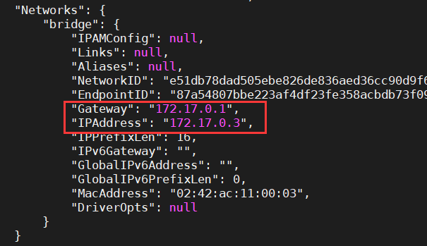

网络拓扑介绍完后，接着介绍一下 bridge 模式下容器是如何通信的：

>在 bridge 模式下，连在同一网桥上的容器 **可以相互通信**（若出于安全考虑，也可以禁止它们之间通信，方法是在DOCKER_OPTS变量中设置`–icc=false`，这样只有使用–link才能使两个容器通信）。
>
>Docker可以开启容器间通信（意味着默认配置–icc=true），也就是说，宿主机上的所有容器可以不受任何限制地相互通信，这可能导致拒绝服务攻击。进一步地，Docker可以通过 `–ip_forward` 和 `–iptables` 两个选项控制容器间、容器和外部世界的通信。
>
>容器也可以与外部通信，我们看一下主机上的 Iptable 规则，可以看到这么一条：`-A POSTROUTING -s 172.17.0.0/16 ! -o docker0 -j MASQUERADE`
>
>这条规则会将源地址为 172.17.0.0/16 的包（也就是从 Docker 容器产生的包），并且不是从 docker0 网卡发出的，进行源地址转换，转换成主机网卡的地址。这么说可能不太好理解，举一个例子说明一下。
>
>假设主机有一块网卡为 eth0，IP 地址为 10.10.101.105/24，网关为 10.10.101.254。从主机上一个 IP 为 172.17.0.1/16 的容器中 ping 百度（180.76.3.151）。IP 包首先从容器发往自己的默认网关 docker0，包到达 docker0 后，也就到达了主机上。然后会查询主机的路由表，发现包应该从主机的 eth0 发往主机的网关 10.10.105.254/24。接着包会转发给 eth0，并从 eth0 发出去（主机的 ip_forward 转发应该已经打开）。这时候，上面的 Iptable 规则就会起作用，对包做 SNAT 转换，将源地址换为 eth0 的地址。
>
>这样，在外界看来，这个包就是从 10.10.101.105 上发出来的，Docker 容器对外是不可见的。

那么，外面的机器是如何访问 Docker 容器的服务呢？

我们首先用下面命令创建一个含有 web 应用的容器，将容器的 80 端口映射到主机的 80 端口。

```sh
docker run --name=nginx_bridge --net=bridge -p 80:80 -d nginx
```

然后查看 Iptable 规则的变化，发现多了这样一条规则：

```sh
-A DOCKER ! -i docker0 -p tcp -m tcp --dport 80 -j DNAT --to-destination 172.17.0.2:80
```

此条规则就是对主机eth0收到的目的端口为80的tcp流量进行DNAT转换，将流量发往172.17.0.2:80，也就是我们上面创建的Docker容器。所以，外界只需访问10.10.101.105:80就可以访问到容器中的服务。

除此之外，我们还可以自定义Docker使用的IP地址、DNS等信息，甚至使用自己定义的网桥，但是其工作方式还是一样的。

#### 自定义网络

建议使用自定义的网桥来控制哪些容器可以相互通信，还可以自动DNS解析容器名称到IP地址。

Docker提供了创建这些网络的默认网络驱动程序，你可以创建一个新的Bridge网络，Overlay或Macvlan网络。

你还可以创建一个网络插件或远程网络进行完整的自定义和控制。

你可以根据需要创建任意数量的网络，并且可以在任何给定时间将容器连接到这些网络中的零个或多个网络。

此外，您可以连接并断开网络中的运行容器，而无需重新启动容器。

当容器连接到多个网络时，其外部连接通过第一个非内部网络以词法顺序提供。

接下来介绍Docker的内置网络驱动程序。

**bridge：**

一个bridge网络是Docker中最常用的网络类型。桥接网络类似于默认bridge网络，但添加一些新功能并删除一些旧的能力。以下示例创建一些桥接网络，并对这些网络上的容器执行一些实验。

```sh
docker network create --driver bridge new_bridge
```

创建网络后，可以看到新增加了一个网桥

**Macvlan：**

Macvlan是一个新的尝试，是真正的网络虚拟化技术的转折点。Linux实现非常轻量级，因为与传统的Linux Bridge隔离相比，它们只是简单地与一个Linux以太网接口或子接口相关联，以实现网络之间的分离和与物理网络的连接。

Macvlan提供了许多独特的功能，并有充足的空间进一步创新与各种模式。这些方法的两个高级优点是绕过Linux网桥的正面性能以及移动部件少的简单性。删除传统上驻留在Docker主机NIC和容器接口之间的网桥留下了一个非常简单的设置，包括容器接口，直接连接到Docker主机接口。由于在这些情况下没有端口映射，因此可以轻松访问外部服务。

## 容器间通信

`scp` 传送命令

### 2、自定义网络的演示

自定义网络需要使用create命令，先来看看create命令可以跟哪些参数。刚才原生网络不存在域名解析，但是自定义网络存在域名解析

```sh
docker network create --help
```

docker提供3种自定义网络驱动：

1. bridge：类似默认的bridge模式，也增加了一些新功能
2. overlay
3. macvlan

overlay 和 macvlan 创建跨主机网络。

建议使用自定义的网络来控制哪些容器可以相互通信，还可以自动DNS解析容器名称到IP地址。

**bridge模式：**

```sh
# 创建自定义网桥
docker network create -d bridge my_net1
# 查看docker网桥
docker network ls
# 查看容器网络
docker network inspect my_net1
```

创建一个bridge模式的网络，由上图我们可以看到创建的网络ID，使用ip addr查看本机网络：

```sh
# 运行容器vm1并且指定网络模式为刚才自定义的bridge模式
docker run -it --name vm1 --network my_net1 ubuntu
# 可以看到ip地址和宿主机的ip不在一个网段
/ ip addr
```

再运行一个容器，发现ip地址也是递增的，并且容器之间具有域名解析，可以ping通

```sh
docker run -it --name vm2 --network my_net1 ubuntu
/ ip addr
/ ping vm1
```

清理一下实验环境

```sh
docker rm -f vm1
docker rm -f vm2
```

还可以自己定义网段，在创建时指定参数：--subnet，--gateway

```sh
docker network create --subnet 172.22.0.0/24 --gateway 172.22.0.1 my_net2
# 查看docker网桥
docker net ls
# 查看容器网络
docker network inspect my_net2
```

发现自定义网络的ip会出现在宿主机上面。自定义的bridge模式也可以自己指定ip网段和网段

查看一下刚才自定义的网络my_net1和my_net2。my_net1的网段没有指定，那就是以宿主机桥接的网段为基础递增的。查看docker自定义网络如下图，当我们创建好自定义网络后，自定义为其分配IP网段和网关。

>1、docker的bridge自定义网络之间默认是有域名解析的；  
>2、docker的bridge自定义网络与系统自带的网桥之间默认是有解析的；  
>3、但是docker的系统自带的网桥之间默认是没有解析的。

使用 `--ip` 参数可以指定容器ip地址，但必须是在自定义网桥上，默认的bridge模式不支持，同一网桥上的容器可以是互通的

```sh
docker run -it --name vm3 --network my_net2 --ip 172.22.0.10 ubuntu
/ ping 172.22.0.2 # 可以ping通
```

此时在一个网段的容器仍然可以ping通。

刚才在以my_net2为基础运行了两个容器vm1和vm2，网段是172.20.0，可以互相ping通
；接下来在以my_net1为基础运行两个容器vm3和vm4，网段是172.18.0，也可以互相ping通。

但是发现vm1、vm2和vm3、vm4ping不通。因为在宿主机上定义的两个网络my_net1和my_net2就不在一个网段，因此基于这两种网络运行起来的容器肯定ping不通

>1、桥接到不同网桥上的容器，彼此是不通信的  
>2、docker在设计上就是要隔离不同network

那么如何使两个不同网段的容器通信呢？使用 `docker network connect` 给vm1容器添加一块my_net1的网卡，就可以和mysq_net2容器vm3、vm4进行通信了。建立两个容器之间的连接

```sh
docker network connect my_net2 vm1
# 进入容器
docker container attach vm1
# 查看网桥
/ ip addr
```

```sh
# 查看
iptables -s
```


其实上面简单实现了同一宿主机上不同网段容器之间的通信

>1、docker的bridge自定义网络之间：双方可以随便添加对方的网卡  
>2、docker的bridge自定义网络与系统自带的网桥之间：只能是，系统自带的网桥对应的容器 添加 bridge自定义网络对应的容器的网卡。而反过来会报错。  
>3、但是docker的系统自带的网桥之间：是可以通信的，因为是在一个网络桥接上。  
>4、docker 1.10开始,内嵌了一个DNS server。dns解析功能必须在自定义网络中使用。

- Docker 提供三种 user-defined 网络驱动：bridge, overlay 和 macvlan。
- overlay 和 macvlan 用于创建跨主机的网络，后面专门列出来演示

## 容器与外网通信

建议使用自定义的网桥来控制哪些容器可以相互通信，还可以自动DNS解析容器名称到IP地址

### 1、容器如何访问外网是通过iptables的SNAT实现的


### 2、外网如何访问容器

>端口映射，-p指定对应端口  
>外网访问容器用到了docker-proxy和iptables DNAT  
>宿主机访问本机容器使用的是iptables DNAT  
>外部主机访问容器或容器之间的访问是docker-proxy实现


### 3、演示过程

```sh
# 查看当前iptable的nat表防火墙策略
iptables -t nat -nL
```

容器之间除了使用ip通信，还可以使用名称通信：

- docker 1.10开始，内嵌 DNS Server
- dns解析功能必须在自定义网络中使用
- 启动时使用--name参数指定容器

```sh
docker run -d --name vm1 --network my_net1 nginx
docker run -it --name vm2 --network my_net1 ubuntu
/ ping vm1 # 可以ping通
```

Joined容器，一种较为特别的网络模式。在容器创建时使用 --network=container:vm1 指定。（vm1指的是运行的容器名）

```sh
docker run -it --name vm1 --network my_net1 ubuntu
# 加入vm1的网桥内
docker run -it --name vm2 --network container:vm1 ubuntu
```


link可以用来链接两个容器，格式：`--link <name or id>:alias`；先以默认的网络运行一个容器vm1，然后使用link方法运行另外一个容器vm2

```sh
docker run -it --name vm1 ubuntu
docker run -it --name vm2 --link vm1:web ubuntu
```

外网访问容器：

```sh
# 创建nginx的容器，配置端口映射
docker run -d --name nginx -p 80:80 nginx
docker port  nginx
# 80/tcp -> 0.0.0.0:80
netstat -ntpl | grep 80
# tcp6  0  0 :::80  :::*  LISTEN  3901/docker-proxy
iptables -t nat -nL
# 我们可以在nat表的最后一行看到使用了端口转发
ps ax|grep docker-proxy
```

## 跨主机网络访问

解决方案：

1. docker 原生的 overlay 和 macvlan
2. 第三方的 flannel、weave、calico

众多网络方案是如何与docker集成在一起的？

1. libnetwork docker容器网络库
2. CNM (Container Network Model)这个模型对容器网络进行了抽象

CNM三类组件：

| 组件     | 功能                                               |
| -------- | -------------------------------------------------- |
| Sandbox  | 容器网络栈，包含容器接口、dns、路由表。(namespace) |
| Endpoint | 作用是将sandbox接入network(veth pair)              |
| Network  | 包含一组endpoint，同一network的endpoint可以通信    |


### macvlan网络方案的实现

Macvlan是一个新的尝试，是真正的网络虚拟化技术的转折点。Linux实现非常轻量级，因为与传统的Linux Bridge隔离相比，它们只是简单地与一个Linux以太网接口或子接口相关联，以实现网络之间的分离和与物理网络的连接。

Macvlan提供了许多独特的功能，并有充足的空间进一步创新与各种模式。这些方法的两个高级优点是绕过Linux网桥的正面性能以及移动部件少的简单性。删除传统上驻留在Docker主机NIC和容器接口之间的网桥留下了一个非常简单的设置，包括容器接口，直接连接到Docker主机接口。由于在这些情况下没有端口映射，因此可以轻松访问外部服务。

```sh
# 清除网络设置
docker network prune
docker network rm my_net1 my_net2
docker network ls
ip link set up eth1
ip addr
brctl show
ip addr show
```

>macvlan本身是linxu kernel的模块，本质上是一种网卡虚拟化技术。
>
>其功能是允许在同一个物理网卡上虚拟出多个网卡，通过不同的MAC地址在数据链路层进行网络数据的转发，一块网卡上配置多个 MAC 地址（即多个 interface），每个interface可以配置自己的IP，Docker的macvlan网络实际上就是使用了Linux提供的macvlan驱动。
>
>因为多个MAC地址的网络数据包都是从同一块网卡上传输，所以需要打开网卡的混杂模式ip link set eth1 promisc on。

在两台docker主机上各添加一块网卡，打开网卡混杂模式：

```sh
ip link set ens3 promisc on
ip addr show | grep ens3
```

>注意：如果不开启混杂模式，会导致macvlan网络无法访问外界。具体在不使用vlan时，表现为无法ping通路由，无法ping通同一网络内其他主机

### 端口暴露

然后，使用 ifconfig 命令查看宿主主机的 IP 地址，我的宿主主机有2个IP，一个是无线网 IP： 10.192.19.12，一个是有线网 IP：223.3.48.163，如果你有另一台在同一局域网的设备，比如你的手机，你可以访问这两个 IP，发现都可以访问 Apache 服务器主页

通过这个例子，你应该对端口暴露有一个比较明白的理解了。当然，端口暴露不仅仅可以用来把容器作为 Web 服务器使用，还可以通过网络让不同容器之间相互通信，Docker 默认使用 TCP 协议在容器之间进行网络通信，如果你需要 UDP，可以使用如下格式指定：

```sh
docker run -ti --name web -p 80:80/udp net:v1.0 bash
```

### 容器互联

容器互联可以不用端口映射就可以让容器之间进行交互。容器互联会在源容器和接收容器之间创建一条安全隧道，接收容器可以看到源容器的信息。

首先，创建一个源容器：

```sh
docker run -ti --name source net:v1.0 bash
```

然后运行另一个容器，使用--link 参数连接第一个容器：

```sh
docker run -ti --name receiver --link source:sender net:v1.0 bash
```

这里的 --link source:sender 的意思是把名字为 source 的容器链接到别名 sender，然后你就可以在第二个容器里以 sender 这个名字和第一个容器通信，比如 `ping sender`。这是因为，系统把这个别名加入到了 /etc/hosts 里面

### ssh登录容器

首先，运行一个容器：

```sh
docker run -ti --name ssh -p 6667:22 net:v1.0 bash
```

然后在容器里面启动 ssh 服务：`service ssh start`

查看我们的容器的 IP 地址：`ifconfig`

然后在新的终端里面运行：`ssh root@172.17.0.3`

然后就顺利进入容器了

### 再进一步

当 Docker 启动的时候，会在宿主主机上面创建一个名字为 docker0 的虚拟网桥，相当于一个软件交换机，并且，Docker 会随机分配一个未被占用的私有网段给 docker0 接口（具体原理在之后的“底层原理初探”讲解）


你可以使用 Docker 组建自己的虚拟局域网。在此之前，首先看看 Docker 默认为我们创建的三个网络：bridge，none，host：


其中，bridge 是默认的网络模式，docker0 是默认的网络，当我们在运行容器的时候，如果没有显式指定网络，那么我们的容器会被默认添加到 docker0 网络中，docker0 的模式正是 bridge。在我的电脑上，docker0 的网址是172.17.0.1，所以我们添加到 docker0 网络的容器的网址都是172.17.0.x。

none 模式翻译过来就是“无网络模式”，加到这个网络模式中容器，无法进行网络通信，我一般不使用。

host 模式将容器网络与宿主主机的网络直接相连通，这听起来不错，但是却破坏了容器的网络隔离，一般我也很少使用。

下面，我们主要说明一下 bridge 模式的使用。虽然 Docker 为我们创建了一个 docker0 的默认网络，但是有时候我们希望定义自己的网络，使用如下指令可以创建一个名为 mynet 的网络：

```sh
docker network create --driver bridge mynet
```

命令解释：

- --driver后面的一项是网络模式，这里我们选 bridge；最后一项 mynet 是我们网络的名字。

下面，使用 ifconfig 发现我们多了一个网络。

现在，我们运行一个容器，并使用 --net 参数把这个容器添加到我们的 mynet 网络：

```sh
docker run -ti --name netcontainer --net mynet net:v1.0 bash
```

使用这种方式，我们可以把容器添加到自定义网络。

删除网络指令：`docker network rm mynet`

Docker 可以通过 docker0 或者你自定义的网络桥接，让容器通过宿主主机的网络访问外部互联网，但是访问外部互联网还需要 DNS 配置，那么容器的 DNS 是怎么配置的呢？

其实，容器通过默认挂载宿主主机的3个相关配置文件来使用宿主主机的 DNS 配置，在容器里面使用 mount 命令可以看到相关信息：


这样，当宿主主机 DNS 信息发生变化的时候，容器的 DNS 配置会通过 /etc/resolv.conf 文件立刻得到更新。

如果你希望自己配置 DNS 信息，可以在使用 docker run 命令的时候加上 --hostname=HOSTNAME 参数设定容器的主机名，使用 --dns=IP_ADDRESS 添加 DNS 服务器到容器的 /etc/resolv.conf 文件中。


### 挂载点

虽然我们已经通过 Linux 的命名空间解决了进程和网络隔离的问题，在 Docker 进程中我们已经没有办法访问宿主机器上的其他进程并且限制了网络的访问，但是 Docker 容器中的进程仍然能够访问或者修改宿主机器上的其他目录，这是我们不希望看到的。

在新的进程中创建隔离的挂载点命名空间需要在 clone 函数中传入 CLONE_NEWNS，这样子进程就能得到父进程挂载点的拷贝，如果不传入这个参数子进程对文件系统的读写都会同步回父进程以及整个主机的文件系统。

如果一个容器需要启动，那么它一定需要提供一个根文件系统(rootfs)，容器需要使用这个文件系统来创建一个新的进程，所有二进制的执行都必须在这个根文件系统中。

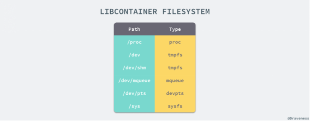

想要正常启动一个容器就需要在 rootfs 中挂载以上的几个特定的目录，除了上述的几个目录需要挂载之外我们还需要建立一些符号链接保证系统 IO 不会出现问题。


为了保证当前的容器进程没有办法访问宿主机器上其他目录，我们在这里还需要通过 libcontainer 提供的 pivot_root 或者 chroot 函数改变进程能够访问个文件目录的根节点。

```go
// pivor_root
put_old = mkdir(...);
pivot_root(rootfs, put_old);
chdir("/");
unmount(put_old, MS_DETACH);
rmdir(put_old);

// chroot
mount(rootfs, "/", NULL, MS_MOVE, NULL);
chroot(".");
chdir("/");
```

到这里我们就将容器需要的目录挂载到了容器中，同时也禁止当前的容器进程访问宿主机器上的其他目录，保证了不同文件系统的隔离。

这一部分的内容是作者在 libcontainer 中的[SPEC.md](https://github.com/opencontainers/runc/blob/master/libcontainer/SPEC.md) 文件中找到的，其中包含了 Docker 使用的文件系统的说明，对于 Docker 是否真的使用 **chroot** 来确保当前的进程无法访问宿主机器的目录，作者其实也没有确切的答案，一是 Docker 项目的代码太庞大，不知道该从何入手，作者尝试通过 Google 查找相关的结果，但是既找到了无人回答的[问题](https://forums.docker.com/t/does-the-docker-engine-use-chroot/25429)，也得到了与 SPEC 中的描述有冲突的[答案](https://www.quora.com/Do-Docker-containers-use-a-chroot-environment) ，如果各位读者有明确的答案可以在博客下面留言，非常感谢。


### 仓库

仓库(Repository)是集中存放镜像文件的场所。有时候会把仓库和仓库注册服务器(Registry)混为一谈，并不严格区分。实际上，仓库注册服务器上往往存放着多个仓库，每个仓库中又包含了多个镜像，每个镜像有不同的标签(tag)。

仓库分为公开仓库(Public)和私有仓库(Private)两种形式。最大的公开仓库是 Docker Hub，存放了数量庞大的镜像供用户下载。国内的公开仓库包括时速云、网易云等，可以提供大陆用户更稳定快速的访问。当然，用户也可以在本地网络内创建一个私有仓库。

当用户创建了自己的镜像之后就可以使用 push 命令将它上传到公有或者私有仓库，这样下次在另外一台机器上使用这个镜像时候，只需要从仓库上 pull 下来就可以了。

Docker 仓库的概念跟 Git 类似，注册服务器可以理解为 GitHub 这样的托管服务。

#### Docker Hub

仓库是集中存放镜像的地方。目前Docker官方仓库维护了一个[公共仓库](https://hub.docker.com)，其中已经包括15000多个的镜像。大部分需求都可以通过在Docker Hub中直接下来镜像来实现。

**登录：**

可以通过执行 `docker login` 命令来输入用户名、密码和邮箱来完成注册登录。

**基本操作：**

用户无需登录可以通过 `docker search` 命令来查找官方仓库中的镜像，并利用 `docker pull` 下载到本地，可以通过 `docker push` 命令将本地镜像推送到 docker hub。

先tag一下复制一个镜像，然后把镜像push到服务器上

```sh
docker images
docker tag <ImageID> <ImageName> #复制镜像
docker push <ImageName> #推送到服务器
```

#### 创建和使用私有仓库

**使用registry镜像创建私有仓库：**

可以通过docker官方提供的registry镜像来搭建一套本地私有仓库。镜像地址：[https://hub.docker.com/_/registry/](https://hub.docker.com/_/registry/)

命令：

```sh
docker run -e SEARCH_BACKEND=sqlalchemy -e SQLALCHEMY_INDEX_DATABASE=sqlite:////tmp/docker-registry.db -d –name registry -p 5000:5000 registry
```

- -e设定环境变量
- -d从后台启动的方式启动镜像
- -name 启动的容器名字
- -p 暴露端口，容器内部的5000绑定到宿主机的5000端口上。

**registry镜像本身：**

SEARCH_BACKEND=sqlalchemy默认索引是可以查询的

参考地址：

- [https://github.com/docker/docker-registry#search-engine-options](https://github.com/docker/docker-registry#search-engine-options)
- [https://hub.docker.com/_/registry/](https://hub.docker.com/_/registry/)

自动下载并启动一个registry容器，创建本地的私有仓库服务。默认仓库创建在/tmp/registry目录下。上传到本地的私有仓库中

```sh
docker tag <ImageId> <IP:port/ImageName>
docker push <IP:port/ImageName>
```

报错了：http:server gave HTTP response to HTTPS client 后面会告诉你如何解决往下看。

docker启动参数配置：

- 环境：centos7解决上边的问题

- 配置文件：/lib/systemd/system/docker.service 修改成：

  ```conf
  #ExecStart=/usr/bin/dockerd
  ExecStart=/usr/bin/dockerd -H tcp://0.0.0.0:2375 -H unix:///var/run/docker.sock --insecure-registry 192.168.100.146:5000
  ```

  （此处默认2375为主管理端口，unix:///var/run/docker.sock用于本地管理，7654是备用的端口）

  重启服务，在启动一个私有仓库的容器，然后push到私有仓库中

  ```sh
  systemctl daemon-reload && service docker restart
  ps -ef|grep docker
  docker run -e SEARCH_BACKEND=sqlalchemy -e SQLALCHEMY_INDEX_DATABASE=sqlite:////tmp/docker-registry.db -d –name registry -p 5000:5000 registry
  docker push <IP:port/ImageName>
  ```

参考地址：[https://docs.docker.com/engine/admin/configuring/](https://docs.docker.com/engine/admin/configuring/)

#### 仓库加速服务

加速下载官方镜像：

- 推荐服务：[https://dashboard.daocloud.io/](https://dashboard.daocloud.io/)
- 点击加速器：[https://dashboard.daocloud.io/mirror](https://dashboard.daocloud.io/mirror)

配置Docker加速器：

```sh
curl -sSL https://dashboard.daocloud.io/daotools/set_mirror.sh | sh -s http://b8laace9.m.daocloud.io
```


#### 仓库管理

Registry Web UI 用于镜像的查询，删除。镜像地址：[https://hub.docker.com/r/atcol/docker-registry-ui/](https://hub.docker.com/r/atcol/docker-registry-ui/)

启动命令：运行下面的命令的时候建议先配置上边讲的加速哦，因为要下载的东西有点多。

```sh
docker run -d –name registry_ui -p 8080:8080 -e REG1=http://172.17.0.2:5000/v1/atcol/docker-registry-ui
```

- 查看端口是否启用：`netstat -nlp|grep 8080`
- 查看logs：`docker logs -f registry_ui`
- 访问地址：`http://IP地址:8080`


## 实战


### 安装

**环境介绍：**

操作系统：64bit CentOS7
docker版本：最新版本
版本新功能：[https://github.com/docker/docker/blob/master/CHANGELOG.md](https://github.com/docker/docker/blob/master/CHANGELOG.md)

**安装步骤：**

```sh
# 查看当前内核版本
uname -r
# 更改网卡配置
vi /etc/sysconfig/network-scripts/ifcfg-enp0s3  
---
ONBOOT=yes
---  
# 更改完后重启服务：
service network restart  
# 注意：如果ifconfig命令不识别的话需要安装：  
yum install net-tools
```

**阿里云安装：**

1、确保服务器连网，配置网络Yum源，安装docker需要extra源

```sh
cd /etc/yum.repos.d/
# 将阿里云的Centos-7.repo下载保存到该目录
wget http://mirrors.aliyun.com/repo/Centos-7.repo
sed -i 's/$releasever/7/g' Centos-7.repo
```

2、安装Docker依赖

```sh
yum install -y yum-utils device-mapper-persistent-data lvm2
```

3、配置Docker的Yum源

```sh
yum-config-manager --add-repo https://download.docker.com/linux/centos/docker-ce.repo
yum-config-manager --enable docker-ce-nightly
yum-config-manager --enable docker-ce-test
yum-config-manager --disable docker-ce-nightly
```

4、安装Docker CE

```sh
yum -y install docker-ce docker-ce-cli containerd.io
```

5、启动Docker

```sh
systemctl start docker
# 查看docker安装版本信息
docker info
```

另一种：

```sh
# 增加docker的yum源
vi /etc/yum.repos.d/docker.repo
--------------------------------------------------------------------
[dockerrepo]
name=Docker Repository
baseurl=https://yum.dockerproject.org/repo/main/centos/$releasever/        
enabled=1        
gpgcheck=1
gpgkey=https://yum.dockerproject.org/gpg
--------------------------------------------------------------------
# 安装docker
yum install docker-engine
```

**加速器：**

注册：[daocloud](https://www.daocloud.io/) 或者 [阿里巴巴](#/accelerator) 这里我用的是daocloud

```sh
curl -sSL https://get.daocloud.io/daotools/set_mirror.sh | sh -s http://b81aace9.m.daocloud.io
```

**配置**

docker配置（docker控制应该有个专门的用户）：

```sh
adduser Colin #添加用户
passwd Colin #更改密码
su Colin #切换用户
#将用户Colin加入sudo files
sudo groupadd docker     #添加docker用户组
sudo gpasswd -a $USER docker     #将登陆用户加入到docker用户组中
newgrp docker     #更新用户组
docker ps    #测试docker命令是否可以使用sudo正常使用
# 验证在不使用sudo的情况下docker是否正常工作：
docker run hello-world
# 设置docker开机启动
chkconfig docker on
```

**卸载**

```sh
# 查看安装包
yum list installed | grep docker
# 移除安装包：
sudo yum -y remove docker-engine.x86_64
# 清除所有docker依赖文件：
rm -rf /var/lib/docker
# 删除用户创建的配置文件
```


### MySQL示例

```sh
# 运行命令
docker run --name colin-mysql -p 3306:3306 -e MYSQL_ROOT_PASSWORD=1234 -itd mysql:5.7
# 进入MySQL容器
docker exec -it colin-mysql /bin/bash
# 进入MySQL
mysql -u root -p
```

docker run是启动容器的命令；  

- --name：指定了容器的名称，方便之后进入容器的命令行  
- -itd：其中，i是交互式操作，t是一个终端，d指的是在后台运行  
- -p：指在本地生成一个随机端口，用来映射mysql的3306端口  
- -e：设置环境变量 `MYSQL_ROOT_PASSWORD=emc123123`：指定了mysql的root密码  
- mysql：指运行mysql镜像

**进行配置，使外部工具可以连接：**

```sql
-- 设置root帐号的密码：
update user set authentication_string = password('1234') where user = 'root';
-- 接着，由于mysql中root执行绑定在了localhost，因此需要对root进行授权
grant all privileges on *.* to 'root'@'%' identified by '1234' with grant option;
flush privileges;
```


### wordpress示例

```sh
# 1. 准备目录
mkdir myblog && cd myblog
# 2. 编辑文件
vi docker-compose.yml
----------------------------------------------------------
version: '2'
services:
   db:
     image: mysql:5.7
     volumes:
       - db_data:/var/lib/mysql
     restart: always
     environment:
       MYSQL_ROOT_PASSWORD: your-mysql-root-password
       MYSQL_DATABASE: wordpress
       MYSQL_USER: wordpress
       MYSQL_PASSWORD: wordpress
   wordpress:
     depends_on:
       - db
     image: wordpress:latest
     volumes:
        - wp_site:/var/www/html
     ports:
       - "80:80"
       - "443:443"
     restart: always
     environment:
       WORDPRESS_DB_HOST: db:3306
       WORDPRESS_DB_USER: wordpress
       WORDPRESS_DB_PASSWORD: wordpress
volumes:
    db_data:
    wp_site:
----------------------------------------------------------
# 3. 执行安装命令
docker-compose up -d
```


### 常用命令


```sh
# 启动docker服务
service docker start
# 查看帮助信息
docker COMMAND --help
```

分类|命令
--|--
Docker环境信息|info、version
镜像仓库命令|login、logout、pull、push、search
镜像管理|build、images、import、load、rmi、save、tag、commit
容器生命周期管理|Create、exec、kill、pause、restart、rm、run、start、stop、unpause
容器运维操作|attach、export、inspect、port、ps、rename、stats、top、wait、cp、diff、update
容器资源管理|volume、network
系统日志信息| events、history、logs


#### 镜像命令

Docker系统有两个程序：docker服务端 和 docker客户端。其中 docker服务端 是一个服务进程，管理着所有的容器。docker客户端 则扮演着 docker服务端 的远程控制器，可以用来控制 docker 的服务端进程。大部分情况下，服务端 和 客户端 运行在一台机器上。

```sh
# 检查docker的版本，这样可以用来确认docker服务在运行并可通过客户端链接
docker version
```

镜像是包含创建容器所需的所有依赖项和信息的包。映像包括所有依赖项（例如框架）以及容器运行时使用的部署和执行配置。通常情况下，映像派生自多个基础映像，这些基础映像是堆叠在一起形成容器文件系统的层。创建后，映像不可变。

镜像是一个静态的概念，可以从一个镜像创建多个容器，每个容器互不影响！所谓“仓库”，简单来说就是集中存放镜像的地方。

Docker registry 是存储容器镜像的仓库，用户可以通过 Docker c1ient 与 Docker registry 进行通信，以此来完成镜像的搜索、下载和上传等相关操作。DockerHub 是由 Docker 公司在互联网上提供的一个镜像仓库，提供镜像的公有与私有存储服务，它是用户最主要的镜像来源。除了 DockerHub 外，用户还可以自行搭建私有服务器来实现镜像仓库的功能。

Docker 官方维护着一个公共仓库 [Docker store](https://store.docker.com/)，你可以方便的在 Docker store 寻找自己想要的镜像。当然，你也可以在终端里面登录：docker login 输入你的用户名和密码就可以登陆了。然后，可以使用 sudo docker search ubuntu 来搜索 Ubuntu 镜像

**查找镜像**

```sh
# 使用 docker search 命令可以搜索远端仓库中共享的镜像，默认搜索 Docker hub 官方仓库中的镜像。
# 示例：搜索 tomcat 镜像
docker search tomcat
```

**获取镜像**

```sh
# 使用 docker pull 从仓库获取所需要的镜像
# 实际上相当于  docker pull registry.hub.docker.com/<name>:<tag> 命令，即从注册服务器 registry.hub.docker.com 中的 <name> 仓库下载标记为 <tag> 的镜像。
# 有时候官方仓库注册服务器下载较慢，可以从其他仓库下载。从其它仓库下载时需要指定完整的仓库注册服务器地址。
# name：镜像名称
# tag：可以应用于映像的标记或标签，以便可以识别同一映像的不同映像或版本（具体取决于版本号或目标环境）。
docker pull centos:7
```

**查看镜像列表**

```sh
# 列出所有顶层（top-level）镜像
docker images
------------------------------------------------
REPOSITORY|TAG|IMAGE ID|CREATED|SIZE
-|-|-|-|-
centos|centos6|6a77ab6655b9|8 weeks ago|194.6 MB
ubuntu|latest|2fa927b5cdd3|9 weeks ago|122 MB
```

实际上，在这里我们没有办法区分一个镜像和一个只读层，所以我们提出了 top-level 镜像。只有创建容器时使用的镜像或者是直接 pull 下来的镜像能被称为顶层(top-level)镜像，并且每一个顶层镜像下面都隐藏了多个镜像层。

在列出信息中，可以看到几个字段信息

- 来自于哪个仓库，比如 ubuntu
- 镜像的标记，比如 14.04
- 它的 ID 号（唯一）
- 创建时间
- 镜像大小

**创建镜像**

```sh
docker commit
```

参数说明：

- -a, –author: 作者信息
- -m, –meassage: 提交消息
- -p, –pause=true: 提交时暂停容器运行

说明：基于已有的镜像的容器的创建。

```sh
# 以ubuntu为例子创建
docker pull ubuntu
# 运行ubuntu，-ti把容器内标准绑定到终端并运行bash，这样开跟传统的linux操作系统没什么两样
docker run -ti ubuntu bash
```

现在我们直接在容器内运行。这个内部系统是极简的，只保留一些系统运行参数，里面很多命令（vi）可能都是没有的。

```sh
# 退出容器
exit
# 容器创建成镜像的方法：docker commit
# 通过某个容器 <id> 创建对应的镜像，有点类似git
docker commit -a 'Colin Chen' -m 'This is a demo' d1d6706627f1 Colin/test
# 通过 docker images 发现里面多了一个镜像 Colin/test
```

**上传镜像**

```sh
# 用户可以通过 docker push 命令，把自己创建的镜像上传到仓库中来共享
# 例如，用户在 Docker Hub 上完成注册后，可以推送自己的镜像到仓库中。
docker push hainiu/httpd:1.0
```

**删除镜像**

```sh
# 删除构成镜像的一个只读层
docker rmi <image-id>
```

你只能够使用 `docker rmi` 来移除最顶层（top level layer）（也可以说是镜像），你也可以使用 `-f` 参数来强制删除中间的只读层

>注意：当同一个镜像拥有多个标签，`docker rmi` 只是删除该镜像多个标签中的指定标签而已，而不影响镜像文件。如果一个镜像只有一个tag的话，删除tag就删除了镜像的本身。

```sh
# 为一个镜像做一个tag
docker tag c9d990395902 Colin/ubuntu:test  
# 执行删除tag操作
docker rmi Colin/ubuntu:test
# 删除镜像操作
docker rmi ubuntu
```

如果镜像里面有容器正在运行，删除镜像的话，会提示error，系统默认是不允许删除的，如果强制删除需要加入 `-f` 操作，但是docker是不建议这么操作的，因为你删除了镜像其实容器并未删除，直接导致容器找不到镜像，这样会比较混乱。

```sh
# 运行一个镜像里面的容器
docker run ubuntu echo 'Hello World'
# 查看运行中的容器
docker ps -a
# 删除镜像，报错误error，有一个容器正在这个镜像内运行
docker rmi ubuntu  
# 强制删除
docker rmi -f ubuntu  
# 再次查看运行中的容器，已经找不到镜像（删除镜像未删除容器的后果）
```

**查看镜像操作记录**

```sh
docker history [name]
```

**给镜像设置一个新的仓库：版本对**

```sh
docker tag my_image:v1.0 my:v0.1
```

运行了上面的指令我们就得到了一个新的，和原来的镜像一模一样的镜像。

**镜像保存**

```sh
# 创建一个镜像的压缩文件，这个文件能够在另外一个主机的 Docker 上使用。
docker save <image-id>
```

和 export 命令不同，这个命令为每一个层都保存了它们的元数据。这个命令只能对镜像生效。

使用示例：

```sh
# 保存 centos 镜像到 centos_images.tar 文件
docker save -o centos_images.tar centos:centos6
# 或者直接重定向
docker save -o centos_images.tar centos:centos6 > centos_images.tar
```

**载入镜像**

```sh
# 使用 docker load 命令可以载入镜像，其中 image 可以为标签或ID。这将导入镜像及相关的元数据信息（包括标签等），可以使用 docker images 命令进行查看。我们先删除原有的 Colin/test 镜像，执行查看镜像，然后在导入镜像
docker load --input test.jar
# 可能这个镜像的名字不符合 docker 的要求，重新命名一下
docker tag <ImageId> <ImageName>
```

**查看镜像详细信息**

```sh
# inspect命令会提取出容器或者镜像最顶层的元数据，默认会列出全部信息
docker inspect <container-id> or <image-id>
# 查看镜像的某一个详细信息
docker inspect -f {{.os}} c9d990395902
```

说明：docker inspect 命令返回的是一个 JSON 的格式消息，如果我们只要其中的一项内容时，可以通过 -f 参数来指定。Image_id 通常可以使用该镜像ID的前若干个字符组成的可区分字符串来替代完成的ID。

**生成镜像**

**Dockerfile**：包含有关如何生成 Docker 映像的说明的文本文件。与批处理脚本相似，首先第一行将介绍基础映像，然后是关于安装所需程序、复制文件等操作的说明，直至获取所需的工作环境。

**生成**：基于其 Dockerfile 提供的信息和上下文生成容器映像的操作，以及生成映像的文件夹中的其他文件。可以使用 `docker build` 命令生成映像 。

**多阶段生成**：Docker 17.05 或更高版本的一个功能，可帮助减小最终映像的大小。概括来说，借助多阶段生成，可以使用一个包含 SDK 的大型基础映像（以此为例）编译和发布应用程序，然后使用发布文件夹和一个小型仅运行时基础映像生成一个更小的最终映像。

**多体系结构映像**：多体系结构是一项功能，根据运行 Docker 的平台简化相应映像选择。例如，Dockerfile 从注册表请求基础映像 
FROM mcr.microsoft.com/dotnet/core/sdk:2.2 时，实际上它会获得 2.2-nanoserver-1709、2.2-nanoserver-1803、2.2-nanoserver-1809 或 2.2-stretch，具体取决于操作系统和运行 Docker 的版本 。

**docker build：**

使用 docker commit 来扩展一个镜像比较简单，但是不方便在一个团队中分享。我们可以使用 docker build 来创建一个新的镜像。为此，首先需要创建一个 Dockerfile，包含一些如何创建镜像的指令。新建一个目录和一个 Dockerfile。

```sh
mkdir hainiu
cd hainiu
touch Dockerfile
```

Dockerfile 中每一条指令都创建镜像的一层，例如：

```Dockerfile
FROM centos:centos6
LABEL maintainer="chenxiao8516@163.com"
# move all configuration files into container
RUN yum install -y httpd
EXPOSE 80
CMD ["sh","-c","service httpd start;bash"]
```

Dockerfile基本的语法是：

- 使用#来注释
- FROM指令告诉Docker使用哪个镜像作为基础
- 接着是维护者的信息
- RUN开头的指令会在创建中运行，比如安装一个软件包，在这里使用yum来安装了一些软件
- 更详细的语法说明请参考[Dockerfile](https://docs.docker.com/engine/reference/builder/)

编写完成 Dockerfile 后可以使用 docker build 来生成镜像。

```sh
docker build -t hainiu/httpd:1.0 .
```

其中 -t 标记添加tag，指定新的镜像的用户信息。"." 是 Dockerfile 所在的路径（当前目录），也可以替换为一个具体的 Dockerfile 的路径。注意一个镜像不能超过127层。用 docker images 查看镜像列表

```sh
docker images
```

| REPOSITORY   | TAG     | IMAGE ID     | CREATED       | SIZE     |
| ------------ | ------- | ------------ | ------------- | -------- |
| hainiu/httpd | 1.0     | 5f9aa91b0c9e | 3 minutes ago | 292.4 MB |
| centos       | centos6 | 6a77ab6655b9 | 8 weeks ago   | 194.6 MB |
| ubuntu       | latest  | 2fa927b5cdd3 | 9 weeks ago   | 122 MB   |

细心的朋友可以看到最后一层的 ID(5f9aa91b0c9e) 和 image id 是一样的

示例1：

```dockerfile
# Use an official Python runtime as a parent image
FROM python:2.7-slim
# Set the working directory to /app
WORKDIR /app
# Copy the current directory contents into the container at /app
COPY . /app
# Install any needed packages specified in requirements.txt
RUN pip install --trusted-host pypi.python.org -r requirements.txt
# Make port 80 available to the world outside this container
EXPOSE 80
# Define environment variable
ENV NAME World
# Run app.py when the container launches
CMD ["python", "app.py"]
```

示例2：

```sh
# 后台模式运行：获得应用程序的长容器ID，然后被踢回终端
docker run -d -p 4000:80 friendlyhello

# 查看运行容器：
docker container ls
# List all containers, even those not running
docker container ls -a
# 结束运行：
docker container stop <containId>
# Force shutdown of the specified container
docker container kill <hash>
# Remove specified container from this machine
docker container rm <hash>
# Remove all containers
docker container rm $(docker container ls -a -q)

 # Create image using this directory's Dockerfile
docker build -t friendlyhello .
# Run image from a registry
docker run username/repository:tag
# Run "friendlyhello" mapping port 4000 to 80
docker run -p 4000:80 friendlyhello
# 查看新标记的图像：
docker image ls
# List all images on this machine
docker image ls -a
# Remove specified image from this machine
docker image rm <image id>
# Remove all images from this machine
docker image rm $(docker image ls -a -q)
# 登录公共镜像库：
docker login
# Tag <image> for upload to registry
docker tag <image> username/repository:tag
# 标记镜像：
docker tag friendlyhello wolfkings/get-started:part2
# Upload tagged image to registry
docker push username/repository:tag
# 发布镜像：
docker push wolfkings/get-started:part2

# 从公共存储库中拉出并运行映像：
docker run -d -p 4000:80 wolfkings/get-started:part2
```

#### 容器命令

Docker 映像的实例。容器表示单个应用程序、进程或服务的执行。它由 Docker 映像的内容、执行环境和一组标准指令组成。在缩放服务时，可以从相同的映像创建多个容器实例。 或者，批处理作业可以从同一个映像创建多个容器，向每个实例传递不同的参数。

**生命周期**

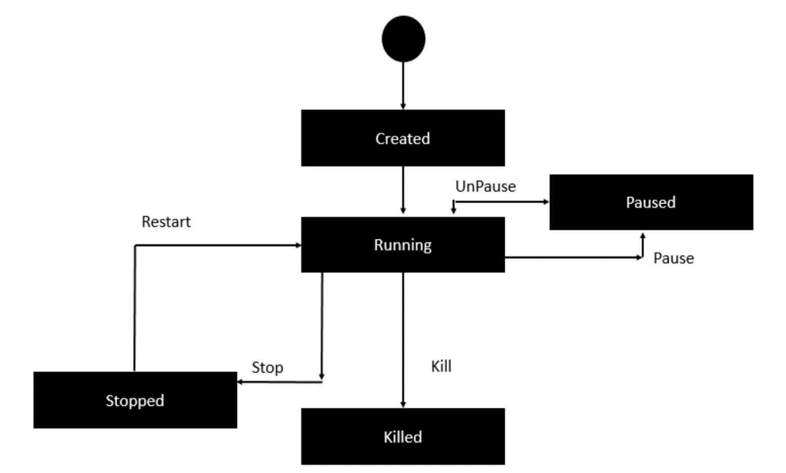

```sh
# 查看容器详细信息：
sudo docker inspect [nameOfContainer]
# 查看容器最近一个进程：
sudo docker top [nameOfContainer]
# 停止一个正在运行的容器：
sudo docker stop [nameOfContainer]
# 继续运行一个被停止的容器：
sudo docker restart [nameOfContainer]
# 暂停一个容器进程：
sudo docker pause [nameOfContainer]
# 取消暂停：
sudo docker unpause [nameOfContainer]
# 终止一个容器：
sudo docker kill [nameOfContainer]
```

**创建容器**

docker create <image-id>

docker create 命令为指定的镜像（image）添加了一个可读写层，构成了一个新的容器。注意，这个容器并没有运行。

docker create 命令提供了许多参数选项可以指定名字，硬件资源，网络配置等等。

运行示例：创建一个centos的容器，可以使用仓库＋标签的名字确定image，也可以使用image－id指定image。返回容器id

```sh
# 查看本地images列表
docker images

# 用仓库＋标签
docker create -it --name centos6_container centos:centos6

# 使用image -id
docker create -it --name centos6_container 6a77ab6655b9 bash
b3cd0b47fe3db0115037c5e9cf776914bd46944d1ac63c0b753a9df6944c7a67

#可以使用 docker ps查看一件存在的容器列表，不加参数默认只显示当前运行的容器
docker ps -a

# 可以使用 -v 参数将本地目录挂载到容器中。
docker create -it --name centos6_container -v /src/webapp:/opt/webapp centos:centos6

# 这个功能在进行测试的时候十分方便，比如用户可以放置一些程序到本地目录中，来查看容器是否正常工作。本地目录的路径必须是绝对路径，如果目录不存在 Docker 会自动为你创建它。
```

**启动容器**

docker start <container-id>

Docker start命令为容器文件系统创建了一个进程隔离空间。注意，每一个容器只能够有一个进程隔离空间。

运行实例：

```sh
# 通过名字启动
docker start -i centos6_container

# 通过容器ID启动
docker start -i b3cd0b47fe3d
```

**进入容器**

进入容器一般有三种方法：

1. ssh 登录
2. attach 和 exec
3. nesenter

attach 和 exec 方法是 Docker 自带的命令，使用起来比较方便；而无论是 ssh 还是 nesenter 的使用都需要一些额外的配置。

attach 实际就是进入容器的主进程，所以无论你同时 attach 多少，其实都是进入了主进程。比如，我使用两次 attach 进入同一个容器，然后我在一个 attach 里面运行的指令也会在另一个 attach 里面同步输出，因为它们两个 attach 进入的根本就是一个进程！

在 attach 进入的容器（前提是你退出了 exec）使用“ps -ef”指令可以看出，我们的容器只有一个 bash 进程和 ps 命令本身

而 exec 就不一样了，exec 的过程其实是给容器新开了一个进程，比如我们使用 exec 进入容器后，使用 ps -ef 命令查看进程，你会发现，我们除了 ps 命令本身，还有两个 bash 进程，究其原因，就是因为我们 exec 进入容器的时候实际是在容器里面新开了一个进程。

这就涉及到了另一个问题，如果你在 exec 里面执行 exit 命令，你只是关掉了 exec 命令新开的进程，而主进程依旧在运行，所以容器并不会停止；而在 attach 里面运行 exit 命令，你实际是终止了主进程，所以容器也就随之被停止了。总结一下，**attach 的使用不会在容器开辟新的进程；exec 主要用在需要给容器开辟新进程的情况下**。

现在来介绍一下如何终止一个运行的容器。我们的容器在后台运行，现在我们觉得这个容器已经完成了任务，可以把它终止了，怎么办呢？一种办法是 attach 进入容器之后运行"exit"结束容器主进程，这样容器也就随之被终止了。另一种比较推荐的方法是运行：`sudo kill nameOfContainer`

```sh
# 在当前容器中执行新命令
docker exec <container-id>
# 如果增加 -it参数运行 bash 就和登录到容器效果一样的。
docker exec -it centos6_container bash
# attach命令可以连接到正在运行的容器，观察该容器的运行情况，或与容器的主进程进行交互。
docker attach [OPTIONS] CONTAINER
```

**停止容器**

```sh
docker stop <container-id>
```

**删除容器**

```sh
docker rm <container-id>
```

如果删除正在运行的容器，需要停止容器再进行删除

```sh
docker stop <name>
docker rm <name>
```

不管容器是否运行，可以使用 `docker rm –f` 命令进行删除。

**运行容器**

docker run <image-id>

docker run 就是 docker create 和 docker start 两个命令的组合，支持参数也是一致的，如果指定容器名字时，容器已经存在会报错，可以增加 --rm 参数实现容器退出时自动删除。

运行示例：`docker run -it --rm --name hello hello-world:latest bash`

命令解释：

- Docker run 是从一个镜像运行一个容器的指令。
- -ti 参数的含义是：terminal interactive，这个参数可以让我们进入容器的交互式终端。
- --name 指定容器的名字，后面的 hello 就是我们给这个容器起的名字。
- hello-world:latest是指明从哪个镜像运行容器，hello-world是仓库名，latest是标签。如在选取镜像启动容器时，用户未指定具体tag，Docker将默认选取tag为latest的镜像。
- bash 指明我们使用 bash 终端。

具体来说，当你运行 "Docker run" 的时候：

- 检查本地是否存在指定的镜像，不存在就从公共仓库下载；
- 利用镜像创建并启动一个容器；
- 给容器包含一个主进程（Docker 原则之一：一个容器一个进程，只要这个进程还存在，容器就会继续运行）；
- 为容器分配文件系统，IP，从宿主主机配置的网桥接口中桥接一个虚拟接口等（会在之后的教程讲解）。

守护态运行

所谓“守护态运行”其实就是后台运行(background running)，有时候，需要让 Docker 在后台运行而不是直接把执行的结果输出到当前的宿主主机下，这个时候需要在运行 "docker run" 命令的时候加上 "-d" 参数(-d means detach)。

>注意：这里说的后台运行和容器长久运行不是一回事，后台运行只是说不会在宿主主机的终端打印输出，但是你给定的指令执行完成后，容器就会自动退出，所以，长久运行与否是与你给定的需要容器运行的命令有关，与"-d"参数没有关系。

**查看容器列表**

docker ps 命令会列出所有运行中的容器。这隐藏了非运行态容器的存在，如果想要找出这些容器，增加 -a 参数。

**提交容器**

```sh
docker commit <container-id>  # 将容器的可读写层转换为一个只读层，这样就把一个容器转换成了不可变的镜像。
```

**容器导出**

docker export <container-id>  --创建一个tar文件，并且移除了元数据和不必要的层，将多个层整合成了一个层，只保存了当前统一视角看到的内容。export后的容器再import到Docker中，只有一个容器当前状态的镜像；而save后的镜像则不同，它能够看到这个镜像的历史镜像。

接下来，根据我们学过的内容，列出一点使用容器的建议，更多的建议会随着阅读的深入进一步提出。

1. 要在容器里面保存重要文件，因为容器应该只是一个进程，数据需要使用数据卷保存，关于数据卷的内容在下一篇文章介绍；
2. 尽量坚持 **一个容器，一个进程** 的使用理念，当然，在调试阶段，可以使用exec命令为容器开启新进程。

**容器导入**

导出的文件又可以使用 docker import 命令导入，成为镜像。示例：

```sh
cat export.tar | docker import – Colin/testimport:latest
docker images
```

导入容器生成镜像，通过镜像生成容器。

**限制容器资源**

资源限制主要包含两个方面的内容——内存限制和 CPU 限制。

**内存限制**：执行 Docker run 命令时可以使用的和内存限制有关的参数如下：

- -m, --memory 内存限制，格式：数字+单位，单位可以是 b、k、m、g，最小 4M  
- -- -memory-swap 内存和交换空间总大小限制，注意：必须比 -m 参数大

**CPU限制**：Docker run 命令执行的时候可以使用的限制 CPU 的参数如下：

- -- -cpuset-cpus="" 允许使用的 CPU 集
- -c,--cpu-shares=0 CPU共享权值
- -- -cpu-quota=0 限制 CPU CFS 配额，必须不小于 1ms，即 >=1000
- cpu-period=0 限制 CPU CFS 调度周期，范围是 100ms~1s，即 [1000，1000000]

现在详细介绍一下 CPU 限制的这几个参数。

1. 可以设置在哪些 CPU 核上运行，比如下面的指令指定容器进程可以在 CPU1 和 CPU3 上运行：

   ```sh
   sudo docker run -ti --cpuset-cpus="1,3" --name cpuset ubuntu:16.04 bash
   ```

2. CPU 共享权值——CPU 资源相对限制

   默认情况下，所有容器都得到同样比例的 CPU 周期，这个比例叫做 CPU 共享权值，通过"-c"或者"- -cpu-shares"设置。Docker 为每个容器设置的默认权值都是1024，不设置或者设置为0都会使用这个默认的共享权值。

   比如你有2个同时运行的容器，第一个容器的 CPU 共享权值为3，第2个容器的 CPU 共享权值为1，那么第一个容器将得到75%的 CPU 时间，而第二个容器只能得到25%的 CPU 时间，如果这时你再添加一个 CPU 共享权值为4的容器，那么第三个容器将得到50%的 CPU 时间，原来的第一个和第二个容器分别得到37.5%和12.5的 CPU 时间。

   但是需要注意，这个比例只有在 CPU 密集型任务执行的是有才有用，否则容器根本不会占用这么多 CPU 时间。

3. CPU 资源绝对限制

   Linux 通过 CFS 来调度各个进程对 CPU 的使用，CFS 的默认调度周期是 100ms。在使用 Docker 的时候我们可以通过"- -cpu-period"参数设置容器进程的调度周期，以及通过"- -cpu-quota"参数设置每个调度周期内容器能使用的 CPU 时间。一般这两个参数是配合使用的。但是，需要注意的是这里的“绝对”指的是一个上限，并不是说容器一定会使用这么多 CPU 时间，如果容器的任务不是很繁重，可能使用的 CPU 时间不会达到这个上限。

**查看日志**

如果你在后台运行一个容器，可是你把 `echo` 错误输入成了 `eceo`：

```sh
docker run -d --name logtest ubuntu:16.04 bash -c "eceo hello"
```

后来，你意识到你的容器没有正常运行，你可以使用 `docker logs` 指令查看哪里出了问题。

```sh
docker logs logtest
```


## 实战

### 搭建私有镜像仓库

1、下载镜像registry

```sh
docker pull registry
```

2、运行registry容器

```sh
docker run -itd -v /data/registry:/var/lib/registry -p 5000:5000 --restart=always --name registry registry:latest

# 测试镜像仓库中所有的镜像
curl http://127.0.0.1:5000/v2/_catalog
```

参数说明：

- -itd：在容器中打开一个伪终端进行交互操作，并在后台运行；
- -v：把宿主机的/data/registry目录绑定 到 容器/var/lib/registry目录(这个目录是registry容器中存放镜像文件的目录)，来实现数据的持久化；
- -p：映射端口；访问宿主机的5000端口就访问到registry容器的服务了；
- --restart=always：这是重启的策略，假如这个容器异常退出会自动重启容器；
- --name registry：创建容器命名为registry，你可以随便命名；
registry:latest：这个是刚才pull下来的镜像；

3、为镜像打标签

```sh
docker tag consul:latest 10.30.100.103:5000/consul:v1
```

- consul:lastest 这是源镜像，也是刚才pull下来的镜像文件；
- 10.30.100.103:5000/consul:v1：这是目标镜像，也是registry私有镜像服务器的IP地址和端口；

4、上传到镜像服务器

```sh
docker push 10.30.100.103:5000/consul:v1
```

提示：`Get https://10.30.100.103:5000/v2/: http: server gave HTTP response to HTTPS client`

注意，这是报错了，需要https的方法才能上传，我们可以修改下daemon.json来解决：

```sh
vim /etc/docker/daemon.json
```

```json
{
  "registry-mirrors": ["https://registry.docker-cn.com"],
  "insecure-registries": ["10.30.100.103:5000"]
}
```

添加私有镜像服务器的地址，注意书写格式为json，有严格的书写要求，然后重启docker服务：

```sh
systemctl  restart docker
```

再次上传，没问题。

5、拉取私有镜像

```sh
docker pull 10.30.100.103:5000/consul:v1

# 测试镜像仓库中所有的镜像
curl http://127.0.0.1:5000/v2/_catalog
# 列出consul镜像有哪些tag
curl http://127.0.0.1:5000/v2/consul/tags/list
```

## 容器网络机制和多主机网络实践

容器网络不是新技术，它是云计算虚拟化技术互联互通的基础核心技术。一般意义的网络都是主机与主机之间的通信，颗粒度局限在物理层面的网卡接口。随着虚拟化技术的发展，以应用为中心的新网络结构逐渐明朗清晰。容器技术就是让依赖环境可以跟着应用绑定打包，并随需启动并互联。容器技术的特点也对网络技术的发展起到了互推的作用，当网络不在持久化存在的时候，软件定义网络（SDN）技术的能力就会体现的更充分。

### 容器主机网络模型

Docker 内建的网络模型是 Bridge Network。这种网络是基于主机内部模型的网络，设计之初也是为了解决单机模式下容器之间的互联互通问题。如图：


Veth pair 技术源于 Linux 网络模型的虚拟设备，比如 TAP 设备，方便主机上应用程序接收网络数据而创建。TAP 设备只能监听到网卡接口上的数据流量，如果想连接多个网络命名空间，就需要用到 Veth pair 技术来打通连接。容器网络之间的互通就是通过这个做到的，但是细心的读者可以看到，图上主机网卡和 docker0 网桥是没有连接的，不能数据互联。为了让容器与外界网络相连，首先要保证主机能允许转发 IP 数据包，另外需要让 iptables 能指定特定的 IP 链路。通过系统参数 ip_forward 来调节开关，如：

```sh
sysctl net.ipv4.conf.all.forwarding

  net.ipv4.conf.all.forwarding = 0

sysctl net.ipv4.conf.all.forwarding=1

sysctl net.ipv4.conf.all.forwarding

  net.ipv4.conf.all.forwarding = 1
```

另外，当 Docker 后台程序起来后，会自动添加转发规则到 Docker 过滤链上，如下图：

```sh
$ sudo iptables -t filter -L
Chain INPUT (policy ACCEPT)
target     prot opt source               destination
ACCEPT     tcp  --  anywhere             anywhere             tcp dpt:domain
ACCEPT     udp  --  anywhere             anywhere             udp dpt:domain
ACCEPT     tcp  --  anywhere             anywhere             tcp dpt:bootps
ACCEPT     udp  --  anywhere             anywhere             udp dpt:bootps
Chain FORWARD (policy ACCEPT)
target     prot opt source               destination
DOCKER-ISOLATION  all  --  anywhere             anywhere
DOCKER     all  --  anywhere             anywhere
ACCEPT     all  --  anywhere             anywhere             ctstate RELATED,ESTABLISHED
ACCEPT     all  --  anywhere             anywhere
ACCEPT     all  --  anywhere             anywhere
DOCKER     all  --  anywhere             anywhere
ACCEPT     all  --  anywhere             anywhere             ctstate RELATED,ESTABLISHED
ACCEPT     all  --  anywhere             anywhere
ACCEPT     all  --  anywhere             anywhere
DOCKER     all  --  anywhere             anywhere
ACCEPT     all  --  anywhere             anywhere             ctstate RELATED,ESTABLISHED
ACCEPT     all  --  anywhere             anywhere
ACCEPT     all  --  anywhere             anywhere
ACCEPT     all  --  anywhere             anywhere
DROP       all  --  anywhere             anywhere
Chain OUTPUT (policy ACCEPT)
target     prot opt source               destination
Chain DOCKER (3 references)
target     prot opt source               destination
Chain DOCKER-ISOLATION (1 references)
target     prot opt source               destination
DROP       all  --  anywhere             anywhere
DROP       all  --  anywhere             anywhere
DROP       all  --  anywhere             anywhere
DROP       all  --  anywhere             anywhere
DROP       all  --  anywhere             anywhere
DROP       all  --  anywhere             anywhere
RETURN     all  --  anywhere             anywhere
```

另外衍生出来的问题是，所有 Docker 容器启动时都需要显示指定端口参数，这样做是因为由于需要 iptable 规则来开启端口映射能力。

### 跨越主机的容器网络模型

如果需要让容器网络可以跨越主机访问，最原生的方式是 Macvlan 驱动支持的二层网络模型。VLAN 技术是网络组网的基本技术，在网络环境中很容易获得，所以，由此产生的用户映像是能不能打破主机和容器的网络间隙，把他们放在一个网络控制面上协作。Macvlan 技术就是为了这个需求而设计的，它实现了容器网络和主机网络的原生互联。当然，需要支持 Macvlan 也是需要准备一些基础环境的：

- Docker 版本必须在1.12.0+以上
- Linux kernel v3.9–3.19 and 4.0+才内置支持Macvlan 驱动

Macvlan 技术是一种真实的网络虚拟化技术，比其他Linux Bridge 更加轻量级。相比 Linux Bridge，性能更高。因为它跳过了主机网卡和容器网络直接的转发过程，容器网卡接口直接对接主机网口，可以视作为主机网络的延伸。这样的网络，让外部访问容器变的非常简便，不在需要端口映射，如下图所示：


为了让容器网络支持多个分组，可以考虑采用802.1q 的 VALN tagging 技术实现。这种技术的好处对于小规模主机网络下容器网络的搭建非常合适。这块通过如下图可以解释清楚：


### 容器网络标准 CNI

容器网络接口（CNI）是云原生基金会支持项目，属于云计算领域容器行业标准。它包含了定义容器网络插件规范和示范。因为 CNI 仅仅聚焦在容器之间的互联和容器销毁后的网络配置清理，所以它的标准简洁并容易实现。

标准包含两部分，CNI Plugin 旨在配置网络信息，另外定义了 IPAM Plugin 旨在分配 IP，管理 IP。这个接口有更广泛的适用性，适应多种容器标准。如图：


网络插件是独立的可执行文件，被上层的容器管理平台调用。网络插件只有两件事情要做：把容器加入到网络以及把容器从网络中删除。

调用插件的数据通过两种方式传递：环境变量和标准输入。

一般插件需要三种类型的数据：容器相关的信息，比如 ns 的文件、容器 id 等；网络配置的信息，包括网段、网关、DNS 以及插件额外的信息等；还有就是 CNI 本身的信息，比如 CNI 插件的位置、添加网络还是删除网络等。

### 把容器加入到网络

调用插件的时候，这些参数会通过环境变量进行传递：

- CNI_COMMAND：要执行的操作，可以是 ADD（把容器加入到某个网络）、DEL（把容器从某个网络中删除）、VERSION
- CNI_CONTAINERID：容器的 ID，比如 ipam 会把容器 ID 和分配的 IP 地址保存下来。可选的参数，但是推荐传递过去。需要保证在管理平台上是唯一的，如果容器被删除后可以循环使用
- CNI_NETNS：容器的 network namespace 文件，访问这个文件可以在容器的网络 namespace 中操作
- CNI_IFNAME：要配置的 interface 名字，比如 eth0
- CNI_ARGS：额外的参数，是由分号;分割的键值对，比如 “FOO=BAR;ABC=123”
- CNI_PATH：CNI 二进制文件查找的路径列表，多个路径用分隔符 : 分隔

网络信息主要通过标准输入，作为 JSON 字符串传递给插件，必须的参数包括：

- cniVersion：CNI 标准的版本号。因为 CNI 在演化过程中，不同的版本有不同的要求
- name：网络的名字，在集群中应该保持唯一
- type：网络插件的类型，也就是 CNI 可执行文件的名称
- args：额外的信息，类型为字典
- ipMasq：是否在主机上为该网络配置 IP masquerade
- ipam：IP 分配相关的信息，类型为字典
- dns：DNS 相关的信息，类型为字典

CNI 作为一个网络协议标准，它有很强的扩展性和灵活性。如果用户对某个插件有额外的需求，可以通过输入中的 args 和环境变量 CNI_ARGS 传输，然后在插件中实现自定义的功能，这大大增加了它的扩展性；CNI 插件把 main 和 ipam 分开，用户可以自由组合它们，而且一个 CNI 插件也可以直接调用另外一个 CNI 插件，使用起来非常灵活。如果要实现一个继承性的 CNI 插件也不复杂，可以编写自己的 CNI 插件，根据传入的配置调用 main 中已经有的插件，就能让用户自由选择容器的网络。

### 容器网络实践

容器网络的复杂之处在于应用的环境是千变万化的，一招鲜的容器网络模型并不能适用于应用规模的扩张。因为所谓实践，无外乎是在众多网络方案中选择合适自己的网络方案。

一切应用为王，网络性能指标是指导我们选择方案的最佳指南针。主机网络和容器网络互联互通的问题，是首先需要考虑的。当前比较合适的容器网络以 Macvlan/SR-IOV 为主。考虑原因还是尽量在兼容原有网络硬件的集成之上能更方便的集成网络。这块的方案需要软硬件上的支持，如果条件有限制，可能很难实现。比如你的容器网络本来就构建在 Openstack 的虚拟网络中。

退而求其次，当前最普遍的方案就是 Vxlan/overlay 的方案，这种网络方案是虚拟网络，和外界通信需要使用边界网关通信。这块主要的支持者是 Kubernetes 集群。比如常用的 Flannel 方案，主要被用户质疑的地方就是网络效率的损耗。 当然，Vxlan 方案的优秀选择 openswitch，可能是最强有力的支持者。通过 OVS 方便，可以得到一个业界最好的网络通信方案。当遇到生产级瓶颈时，可以考虑使用硬件控制器来代替 OVS 的控制器组件来加速网络。目前 Origin 的方案中选择的就是 OVS 方案，可以认为是当前比较好的选择。

当然，开源的 overlay 方案中有比较优秀的方案比如 Calico 方案，它借用了 BGP 协议作为主机与主机之间边界的路由通信，可以很好的解决小集群模式下的高效网络传输。Calico 的背后公司也是借用此技术在社区中推出商业硬件解决方案。从国内的中小型企业的网络规模来说，此种网络完全可以满足网络需要。

### 展望网络发展趋势

容器网络互联已经不在是棘手的问题，行的实现就在手边。目前用户进一步的使用中，对网络的限流和安全策略有了更多的需求。这也催生了如 cilium 这样的开源项目，旨在利用 Linux 原生的伯克利包过滤（Berkeley Packet Filter，BPF）技术实现网络流量的安全审计和流量导向。如图：


所以，容器网络的发展正在接近应用生命周期的循环中，从限流，到安全策略，再到可能的虚拟网络 NFV 的构建都有可能改变我们的容器世界。

参考：[容器网络接口标准](https://github.com/containernetworking/cni/blob/master/SPEC.md)

## Docker日志机制与监控实践

日志和监控是容器云平台系统最常见的必备组件，形象一点形容其原理就是咖啡和伴侣一样必须配套使用，让你的应用运行的更贴合用户满意的服务运营目标（SLO）。当容器技术被大量行业采用之后，我们遇到了一个很自然的问题，容器化后应用日志怎么收集，监控报警怎么做。这些问题一直困扰着容器行业的从业者，直到以 Google Borgmon 为理论基础的 Prometheus 开源项目发布，EFK 日志系统的容器化实践落地，得以促成本篇文章的完成。

### EFK 日志系统的容器化实践

日志系统涉及采集、展现和存储三个方面的设计。从采集方面来说，单台容器主机上的采集进程应该是多功能接口的、可以提供插件机制的日志组件才能满足一般采集的需求。那么到了容器这个领域，日志分为控制台日志和应用业务日志两类。对于容器控制台接口，需要通过容器进程开放的接口来采集，如图：


容器默认采用的是日志驱动为 json-file 模式，采集效率极低还占用大量 IO 读写效能，基本无法适应生产环境需要。在我们生产实践推荐中，偏向于采用系统提供的日志系统 systemd-journal 来接收日志采集，然后通过 fluentd 采集代理进程，把相应的日志按照业务规则分类汇聚，发送到 Elasticsearch 这样的中央日志管理系统。由于业务日志量的规模扩大，日志采集的流量速率会让中央日志系统处理负载过高，导致业务日志处理不过来。所以通常采用流式消息队列服务 Kafka 作为日志存储的异步缓冲，可以极大的缓解日志流量，并高效的解决日志采集的汇聚难题。

CNCF 云原生计算基金会推荐的采集解决方案是 Fluentd，作为行业标杆的托管项目，这个项目的插件是非常丰富的。所以，当你在考虑选择日志采集方案的时候，Fluentd 是当前一站式解决容器日志采集方案的首选，如下图：


因为 Fluentd 是一套 ruby 编写的日志采集框架，很难让人信服其海量的日志处理能力。所以在今年早些时候推出了基于 C 语言编写的高性能日志转发工具 fluentbit，可以完美承上输入层，起下输出层，如图：


日志收集到之后，会通过相应的过滤插件汇聚清洗日志条目并聚合到日志中心系统，系统用户通过可视化界面可以检索自己需要的日志信息。

随着 CNCF 在全球范围内吸收了业界主流云计算厂商，导致日志收集又遇到另一个需要解决的问题，那就是 Kubernetes 集群的日志收集问题。所以，我需要逐步按照收集的纬度给予介绍分析。首先，最基本的是 Pod 的日志信息，注意它并不等同于 Docker 容器的控制台日志。

例如 Pod 任务[counter-pod.yaml](https://raw.githubusercontent.com/kubernetes/website/master/docs/tasks/debug-application-cluster/counter-pod.yaml)：

```yaml
apiVersion: v1
kind: Pod
metadata:
  name: counter
spec:
  containers:
  - name: count
    image: busybox
    args: [/bin/sh, -c,
            'i=0; while true; do echo "$i: $(date)"; i=$((i+1)); sleep 1; done']
```

发布这个 Pod 到集群中：

```sh
kubectl create -f https://k8s.io/docs/tasks/debug-application-cluster/counter-pod.yaml
--pod "counter" created
```

查看日志：

```sh
$ kubectl logs counter
0: Mon Jan  1 00:00:00 UTC 2001
1: Mon Jan  1 00:00:01 UTC 2001
2: Mon Jan  1 00:00:02 UTC 2001
...
```

Kubernetes 默认使用容器的 json-file 驱动来写入日志文件，并使用 logrotate 来收敛日志大小。


除了 Pod 之外，我们还需要考虑 Kubernetes 系统组件的日志收集工作。例如这样的场景：

- Scheduler 和 kube-proxy 是容器化运行
- Kubelet 和 Docker 是非容器化运行

对于容器化的系统组件，他们都是采用 [glog](https://godoc.org/github.com/golang/glog) 来写入日志的并存入 /var/log 目录下，可以采用logrotate 来按大小分割日志。对于非容器化的系统组件，直接采用系统内建的 systemd-journal 收集即可。

当然对于分布式系统的日志收集，还可以通过发布日志采集容器组件的方式来采集日志。最好的方式是采用 sidecar 的方式，每个 Pod 中加入一个日志采集器，方便日志的采集流式进入日志系统中。


当应用日志需要落盘的时候，这种 sidecar 模式的日志采集方式尤其灵活，值得推荐采用。

### 容器监控实践

容器监控需要关心的指标范畴主要集中在主机、集群、容器、应用以及报警规则和报警推送。监控的指标也大多放在了 CPU、RAM、NETWORK 三个纬度上面。当然业务应用如果是 Java 系统，还有收集 JMX 的需求存在，从容器角度来讲仅需要暴露 JMX 端口即可。很多开始做容器监控的从业者会考虑使用现有基础监控设施 Zabbix 来做容器监控。但是从业界发展趋势上来说，采用 Prometheus 的解决方案会是主流方案。首先，我们可以通过 Prometheus 的架构来了解监控的流程架构图如下：


它采用 Pull 模式来主动收集监控信息，并可以采用 Grafana 定制出需要的监控大屏面板。从收集探针角度，Prometheus 有很多[输出指标的插件](https://prometheus.io/docs/instrumenting/exporters/)可以使用。注意插件 exporter 的工作目的是能把监控数据缓存起来，供 Prometheus 服务器来主动抓取数据。从生产级别 HA 的需求来看，目前 Prometheus 并没有提供。所有我们需要给 Prometheus Server 和 AlertManager 两个组件提供 HA 的解决方案。

#### HA Prometheus

当前可以实施的方案是建立两套一模一样配置的Prometheus 服务，各自独立配置并本地存储监控数据并独立报警。因为上面介绍了 PULL 的拉取采集方式，对于两个独立的 Prometheus 服务来说是完全可行的，不需要在客户端配置两份监控服务地址。记住两套 Prometheus Server 必须独立，保证一台当机不会影响另外一台 Server 的使用。

#### HA AlertManager

AlertManager 的 HA 配置是复杂的，毕竟有两个Prometheus Server 会同时触发报警给 AlertManager，用户被报警两遍并不是一个好主意。当前 HA 还在开发过程中，采用了[Mesh技术](https://github.com/prometheus/alertmanager#high-availability)帮助 AlertManager 能协调出哪一个接受者可以报告这次警告。

另外，通过 PromSQL 的 DSL 语法，可以定制出任何关心的监控指标：如图：


定义报警规则的例子如下：

```sh
task:requests:rate10s =
  rate(requests{job="web"}[10s])
```

同时我们还关注到当前 Prometheus 2.0 即将发布 GA，从 RC 版本透露新特性是时间序列数据存储的自定义实现，参考了 Facebook 的 Gorilla（[Facebook's "Gorilla" paper](http://www.vldb.org/pvldb/vol8/p1816-teller.pdf)），有兴趣的可以关注一下。

另外，Prometheus 还有一个痛点就是系统部署比较麻烦，现在推荐的方式是采用 Operator 的模式发布到K8S 集群中提供服务（[Prometheus Operator](https://coreos.com/operators/prometheus/docs/latest)），效率高并且云原生架构实现。

**总结：**

Docker 日志机制已经没有什么技巧可以优化。这个也证明了容器技术的成熟度已经瓜熟蒂落，并且在日常应用运维中可以很好的实施完成。主要的实践重点在于日志体系的灵活性和日志数据处理能力方面的不断磨合和升级，这是容器技术本身无法支撑的，还需要用户结合自身情况选择发展路线。

对于监控系统，时间序列数据库的性能尤为重要。老版本的 Prometheus 基本都是在采集性能上得不到有效的发挥，这次2.0版本完全重写了一遍 tsdb，经过评测发现比老版本性能提升3-4倍，让人刮目相看。期待正式版本的推出，可以让这套云原生的监控系统得到更好的发展。

**参考：**

- [Kubernetes Logging Architecture](https://kubernetes.io/docs/concepts/cluster-administration/logging/)
- [HA AlertManager setup (slide)](http://calcotestudios.com/talks/slides-understanding-and-extending-prometheus-alertmanager.html#/1/9)
- [https://fabxc.org/tsdb/](https://fabxc.org/tsdb/)


17、Dockerfile详解
原文：https://idig8.com/2018/07/29/docker-zhongji-17/
一般的，Dockerfile 分为四部分：基础镜像信息、维护者信息、镜像操作指令和容器启动时执行指令。

18、镜像的发布
原文：https://idig8.com/2018/07/29/docker-zhongji-18/
19、Dockerfile实战
原文：https://idig8.com/2018/07/29/docker-zhongji-19/
20、容器的操作
原文：https://idig8.com/2018/07/29/docker-zhongji-20/
21、Dockerfile实战CMD和ENTRTYPOINT的配合
原文：https://idig8.com/2018/07/29/docker-zhongji-21/
22、容器的资源限制
原文：https://idig8.com/2018/07/29/docker-zhongji-22/
23、docker网络
原文：https://idig8.com/2018/07/29/docker-zhongji-23/
24、docker学习必会网络基础
原文：https://idig8.com/2018/07/29/docker-zhongji-24/
25、Linux网络命名空间
原文：https://idig8.com/2018/07/29/docker-zhongji-25/
26、Docker Bridge详解
原文：https://idig8.com/2018/07/29/docker-zhongji-26/
27、容器之间的Link
原文：https://idig8.com/2018/07/29/docker-zhongji-27/
28、容器的端口映射
原文：https://idig8.com/2018/07/29/docker-zhongji-28/
29、容器网络之host和none
原文：https://idig8.com/2018/07/29/docker-zhongji-29/
30、多容器复杂应用的部署
原文：https://idig8.com/2018/07/29/docker-zhongji-30/
31、overlay网络和etcd实现多机的容器通信
原文：https://idig8.com/2018/07/29/docker-zhongji-31/
32、docker的数据持久化存储和数据共享
原文：https://idig8.com/2018/07/29/docker-zhongji-32/
33、windows下vagrant 通过SecureCRT连接centos7
原文：https://idig8.com/2018/07/29/docker-zhongji-33/
34、数据持久化之Data Volume
原文：https://idig8.com/2018/07/29/docker-zhongji-34/
35、数据持久化之bind Mounting
原文：https://idig8.com/2018/07/29/docker-zhongji-35/
36、docker 使用bind Mounting实战
原文：https://idig8.com/2018/07/29/docker-zhongji-36/
37、docker容器安装wordpress
原文：https://idig8.com/2018/07/29/docker-zhongji-37/


### 编写Dockerfile

Dockerfile 是构建 Docker 镜像最好的方式，也是最推荐使用的方式。通过本文，读者将了解 Dockerfile 的构成以及如何通过 Dockerfile 构建 Docker 镜像，同时也将更深入理解 Docker 的分层存储机制。

**Docker的分层存储进阶**

在开篇中，对于 Docker 的分层存储是这么介绍的：

Docker 镜像是一个特殊的文件系统，类似于 Linux 的 root 文件系统，镜像提供了容器运行时所需的程序、库、资源、配置等文件，还包含了一些为运行时准备的一些配置参数。镜像是一个静态的概念，镜像不包含任何动态数据，其内容在构建之后也不会被改变。

由于镜像包含完整的 Linux root 文件系统，所以它可能会很庞大。因此，Docker 的设计者充分利用 Unions FS 技术，把 Docker 设计为分层存储的结构。什么意思呢？也就是说，镜像是分层构建的，每一层是上面一层的基础，每一层在构建完成之后都不会再发生变化。

这提醒我们，构建镜像的时候我们要保证每一层都只包含我们的应用需要的东⻄，不要包含不需要的文件，***因为每一层在构建之后不再发生变化，所以即使你在之上的层删除了那些不需要的文件，这些文件也只是被标记为删除，实际上并没有真正删除。***如果每一层都包含一些可有可无的文件，就会使得我们的镜像越来越臃肿。一个镜像实际上并不是一个文件，而是一组分层文件。分层存储还使得不同的镜像可以共享某些层，便于镜像的复用。

现在，我们对这段话做一个更加通俗和深入的解释。

这里，我们用到了 **写时拷贝(Copy On Write)** 的思想。现在，让我们用几幅 COW 的图片来说明写时拷贝的工作原理。首先，我们有一张没有斑点的奶牛图片（相当于我们有一个**基础镜像**）：


现在，我希望从这张图片得到一张有斑点的奶牛图像，我不是直接在这个原始图片画斑点，而是将斑点单独作为一层，把斑点层和原始图片叠加，就得到了斑点奶牛：


这样做有什么好处呢？设想一下，如果你直接把你想要的黑色斑点画到原图上，那么其他人想在原始的无斑点奶牛图片上做一些其它的创作就会很麻烦。但是，如果采取分层的方式，他们也只需要设计自己想要的斑点就可以了，从而原始的无斑点奶牛图片可以**共享**：


这样，每次你想查看自己的斑点奶牛的时候，就会把原始的无斑点奶牛复制一份给你，然后叠加你的斑点图层，你就可以看到你的斑点奶牛了。而你不查看的时候，原始的无斑点奶牛图片是共享存储的，这就是**写时拷贝**——只有在需要叠加斑点图给你看效果的时候才把原图拷贝一份给你，在拷贝的上面叠加一层来画斑点，否则，你与其他人的无斑点奶牛图层是共享存储的。

我们之前提到 Docker 镜像的分层存储和这个过程是很相似的。首先，你有一个**基础镜像（无斑点奶牛）**，你可以从这个基础镜像构建**自定义的新镜像（画斑点）**。你在构建新镜像的时候，并不是对原始镜像直接做修改，而是在其上创建一个新的存储层，在这个新的存储层上面作自定义的修改从而得到新的镜像。为了后面表述方便，我们姑且把原始镜像称为镜像 0，把你叠加一层新的存储层得到的新镜像称为镜像 1。

**注意：**现在我们仅仅在原始镜像叠加了一层，比如在镜像 1 的存储层安装了一些软件，添加了一些文本文件。现在，你希望以镜像 1 为基础镜像，再创建一个新镜像 2。在镜像 2 的存储层，你希望把在镜像 1 里安装的一些软件卸载，把一些文件删除，提交后得到新镜像 2。但是，你发现，新镜像 2 的体积根本就没有变小，甚至还多了几 MB，为什么会出现这种情况呢？这是因为，镜像是分层存储的，你在镜像 2 的存储层只是把你需要删除的内容**标记为删除**，实际上你并不能修改基础镜像 1 的存储层，也就是说，你想删除的内容依旧还在，只不过你在镜像 2 的存储层看不到它们了。

这就好比，你现在把褐色斑点奶牛作为基础图片，希望在褐色斑点奶牛的基础上设计新的斑点，那么你不能直接擦除黑色斑点奶牛的斑点，你只能在你的图层用白色把这些斑点覆盖，然后再画新的斑点。


从镜像的 pull 过程或者 commit 过程也可以看出镜像是**分层下载和提交**的：


运行容器的时候，实际是以镜像为基础层，在其上创建一个**容器的存储层**。容器存储层的生命周期和容器是一样的，所以我们**建议使用数据卷存储数据**，而**不要直接在容器的存储层写入数据**。

值得一提的是，分层存储机制使得镜像之间可以共享很多层，节约大量存储空间！

好了，相信介绍到这里，读者对于分层存储应该有一个清晰的理解了。之所以在这里介绍分层存储，是因为后文的 Dockerfile 的一些编写注意事项的提出需要在读者理解分层存储的基础上才能理解为什么我们会要求这些注意事项！

**Dockerfile初步**

Dockerfile 是一个文本文件，包含构建镜像的一条条指令，每一条指令构建一层，每一条指令描述当前层如何构建。

以 [Docker网络](#Docker网络) 的 net:v1.0 为例，如果使用 Dockerfile 构建的话应该按照如下步骤，首先新建一个空白目录，在这个目录下使用 `touch Dockerfile` 命令新建一个文本文件，文件内容如下：

```sh
FROM ubuntu:16.04

RUN apt-get update && apt-get install -y apt-utils
RUN apt-get install -y vim 
RUN apt-get install -y net-tools
RUN apt-get install -y iputils-ping
RUN apt-get install -y apache2
RUN apt-get install -y apache2-utils
RUN apt-get install -y openssh-server
RUN apt-get install -y openssh-client

RUN mkdir /var/run/sshd
RUN echo 'root:root' |chpasswd

RUN sed -ri 's/^PermitRootLogin\s+.*/PermitRootLogin yes/' /etc/ssh/sshd_config
RUN sed -ri 's/UsePAM yes/#UsePAM yes/g' /etc/ssh/sshd_config

EXPOSE 22

CMD ["/usr/sbin/sshd", "-D"]
```

下面，我们对这个 Dockerfile 里面用到的命令做一些解释：

**FROM**

FROM 指令指定基础镜像，我们定制的镜像是在基础镜像之上进行修改的。FROM 指令必须是Dockerfile文件的第一条指令。

**RUN**

RUN 是用来执行命令的，这条指令的格式有两种：

Shell 格式是 `RUN <命令>`，我们的 Dockerfile 就是使用的 Shell 格式。

exec 格式：`RUN [<可执行文件>，<参数1>，<参数2>，... ]`，和函数调用的格式很相似。

**EXPOSE**

EXPOSE 用来暴露端口，格式为：`EXPOSE <端口1> [<端口2>……]`

值得注意的是，EXPOSE 只是声明运行容器时提供的服务端口，这**仅仅是一个声明**，在运行容器的时候并不会因为这个声明就会开启端口服务，你依旧需要使用 -P 或者 -p 参数映射端口。在 Dockerfile 中写这样的端口声明有助于使用者理解这个镜像开放哪些服务端口，以便配置映射。并且，可以在 docker run 命令执行的时候使用 -P 参数随机映射宿主主机端口到 EXPOSE 的容器端口。

**CMD**

CMD是容器启动命令，和 RUN 命令类似，它也有两种格式：

shell 格式： CMD <命令>

exec格式： CMD [<可执行文件>，<参数1>，<参数2>，... ]

记得我们早就说过，***容器不是虚拟机，容器的本质是进程***。既然是进程，就需要指定进程运行的时候的参数和程序。CMD 就是为容器主进程启动命令而存在的。比如，在我们的文件中，我们使用 CMD 开启了 ssh 进程。

使用 CMD 命令的时候，初学者容易混淆 **前台运行** 和 **后台运行**。再强调一遍，Docker 不是虚拟机，容器是进程，所以容器中的应用都应该以前台模式运行，比如，如果你把我们的 Dockerfile 的最后一行写成 `CMD service ssh start`，那么我们使用 `docker run` 从镜像运行容器后，容器马上就退出了。这是因为，容器就是为了主进程而存在的，一旦执行完我们的 `service ssh start`，主进程就认为完成了任务，于是就退出了。所以，注意应该直接执行 sshd 可执行文件，并以前台模式执行：`CMD ["/usr/sbin/sshd", "-D"]`

现在，让我们开始 **构建镜像** 吧，在 **Dockerfile所在的目录下** 执行以下指令：

```sh
docker build -t net:v1.2 .
```

 -t 参数后面指定镜像的名字。最后一个 "." 指的是当前目录。执行后，会得到类似下面的输出。

如果之前构建过这个镜像，你可以看到 step 中，都是"using cache"，并没有下载 apt install 需要的文件。如果你是第一次构建，可能会输出很多文件下载，更新等信息，并且构建速度取决于你的网速（因为要下载好多文件）。在这里，我想多讲一点，如果你使用一个 Dockerfile 构建过镜像，并且你没有删除这个镜像，那么在你第 2 次使用同一个 Dockerfile 构建镜像的时候，Docker不会重新下载文件，而是使用之前构建好的"cache"。那么，请读者思考一下，这些"cache"是什么呢？没错，就是我们之前说的**分层存储的层**。

**重点来了**，这就告诉我们，我们应该将 Dockerfile 里很少变动的部分写在前面，因为每一行指令都构建一层，层层叠加，如果 Dockerfile 里开始若干行是相同的话，那么即使是新的 Dockerfile 也可以在构建的时候共享之前的"cache"。换句话说，一个 Dockerfile 在构建的时候，如果发现本地有可用的"cache"，就不会去重新下载和构建这些层，直到遇到第一处不同的指令，无法使用"cache"，才会下载和构建。（全新的构建是从 Dockerfile 的第一处改动开始的，在此之前只是在使用之前构建好的层！）

好了，现在让我们从这个镜像运行一个容器：

```sh
docker run --name sshtest --rm -d -p 6666:22 net:v1.2
```

这里的 --rm 参数的作用是容器终止后立刻删除。

然后使用 `docker inspect sshtest` 查看容器网址为172.17.0.3，现在使用 ssh 登录（密码：root）：


在 ssh 的时候你可能会遇到如下问题：


解决的办法是：`ssh-keygen -R yourIP`（上图有具体例子）

好了，第一个Dockerfile定制镜像到此为止就完成了，但是，还记得我们之前提到过的吗？我们不推荐使用commit来构建镜像，给的理由之一是会使我们的镜像越来越臃肿！但是，现在我们的新镜像真的比原来使用commit得到的镜像更精简吗？看下图：


net:v1.0是我们commit得到的镜像，net:v1.2是我们使用Dockerfile定制的镜像，可是使用Dockerfile得到的镜像竟然更大！！！现在你的心里一定有一句 MMP 要跟我说吧！？ “宝宝费了这么大劲学习Dockerfile，最后结果竟然更差？”下面，我就来解释一下为什么吧。

使用commit提交镜像的缺点我们之前提到过，现在复习一下。使用docker commit提交镜像主要有两个缺点：其一，你的镜像会变成一个黑盒，除了本人，别人很难知道镜像里发生过的操作；其二，由于镜像的分层存储，会有大量冗余数据，使得镜像越来越臃肿。

而Dockerfile解决了这些问题。首先，编写Dockerfile可以很清楚地表述镜像构建的过程；第二，可以让我们的镜像很清爽，不会很臃肿。

可是刚才我们使用Dockerfile构建的镜像甚至比使用commit构建的同样功能镜像还要臃肿，这又怎么解释呢？这其实是因为我们的Dockerfile写得太随意了！！之前说过，Dockerfile的每一条指令都会构建一层，RUN命令也不例外，每一个RUN命令都会像我们手动构建的过程一样，新建立一层，在这个新的一层上做修改后提交，所以我们刚刚的例子构建的镜像足足有15层！！！这种写法是很不好的，会把很多容器运行时不需要的东西装到镜像里面，结果就让镜像很臃肿。解决的办法是把可以在同一层执行的命令尽可能放在一层去执行，并且执行完的同时在这一层清理不需要的东西，所以我们的 Dockerfile推荐下面这种写法（使用&&符号把命令串联起来）：

```sh
FROM ubuntu:16.04

RUN softwares='apt-utils vim net-tools iputils-ping apache2 apache2-utils openssh-server openssh-client' && apt-get update && apt-get install -y $softwares && rm -rf /var/lib/apt/lists/* 

RUN mkdir /var/run/sshd
RUN echo 'root:root' |chpasswd

RUN sed -ri 's/^PermitRootLogin\s+.*/PermitRootLogin yes/' /etc/ssh/sshd_config
RUN sed -ri 's/UsePAM yes/#UsePAM yes/g' /etc/ssh/sshd_config

EXPOSE 22

CMD ["/usr/sbin/sshd", "-D"]
```


### Portainer管理集群部署

之前都是通过命令的方式，管理docker的，其实docker还是有图形界面的。使用图形界面如何管理docker，其实业界很多公司都对docker进行了图形化的封装。之前在初级和中级的时候也有界面marathon。这里说下业界比较出名的portainer。

官网：https://www.portainer.io

Portainer的开发是为了帮助客户采用Docker容器技术，加快交付价值的时间。构建、管理和维护Docker环境从来没有这么容易。Portainer易于使用为软件开发人员和IT操作提供直观界面的软件。Portainer为您提供了Docker环境的详细概述，并允许您管理容器、图像、网络和卷。Portainer很容易部署——您只需要一个Docker命令就可以在任何地方运行Portainer。

写了那么多命令，现在才说有一个开源Portainer，其实我的目的就是先学会走，在学会跑。如果直接用图形界面对docker的运行，理解不深入，网络原理也不理解。通过图形界面运行后，可以透过图形界面，理解后台是如何运行命令的。

**portainer安装**

开放Docker网络管理端口（四台机器都需要执行）

```sh
vim /lib/systemd/system/docker.service#找到 ExecStart行  ExecStart=/usr/bin/dockerd -H tcp://0.0.0.0:2375 -H unix:///var/run/docker.sock  systemctl daemon-reload systemctl restart docker  
```

启动容器（四台机器）

```sh
# 66.100机器执行
docker run -d -p 9000:9000 portainer/portainer -H tcp://192.168.66.100:2375
# 66.101机器执行
docker run -d -p 9000:9000 portainer/portainer -H tcp://192.168.66.101:2375
# 66.102机器执行
docker run -d -p 9000:9000 portainer/portainer -H tcp://192.168.66.102:2375
# 66.103机器执行
docker run -d -p 9000:9000 portainer/portainer -H tcp://192.168.66.103:2375
```

功能页面：http://192.168.66.100:9000/#/init/admin

可能设置完密码会崩了容器，重新 `docker start 容器ID`


### docker-compose

Docker Compose 是一个用来定义和运行复杂应用的 Docker 工具。使用 Docker Compose 不再需要使用 shell 脚本来启动容器（通过 docker-compose.yml 配置）。

**安装：**

```sh
curl -L "https://github.com/docker/compose/releases/download/1.25.0/docker-compose-$(uname -s)-$(uname -m)" -o /usr/local/bin/docker-compose
# 授予执行权限
chmod +x /usr/local/bin/docker-compose
```

**卸载：**

```sh
rm /usr/local/bin/docker-compose
```

**命令：**

1、Docker compose 的使用非常类似于 docker 命令的使用，但是需要注意的是**大部分的 compose 命令都需要到 docker-compose.yml 文件所在的目录下才能执行**。

2、compose 以守护进程模式运行加 `-d` 选项。服务状态：Up

```sh
docker-compose up -d
docker-compose -f docker-compose.yml up -d
```

3、查看有哪些服务，使用 `docker-compose ps` 命令，非常类似于 docker 的 ps 命令。

4、查看 compose 日志

```sh
docker-compose logs web
docker-compose logs redis
```

5、停止 compose 服务。服务状态：Exit 0（所有关联的活动容器也被停止）

```sh
docker-compose stop
docker-compose ps
```

6、重启 compose 服务

```sh
docker-compose restart
docker-compose ps
```

7、kill compose 服务。服务状态：Exit 137

```sh
docker-compose kill
docker-compose ps
```

8、删除 compose 服务（删除所有已停止的关联容器）

```sh
docker-compose rm
```

9、帮助命令

```sh
docker-compose --help
```

>注意：yaml文件里不能有tab，只能有空格。关于 version 与 Docker 版本的关系如下：

| Compose file format | Docker engine |
| ------------------- | ------------- |
| 1                   | 1.9.0+        |
| 2.0                 | 1.10.0+       |
| 2.1                 | 1.12.0+       |
| 2.2, 3.0, 3.1, 3.2  | 1.13.0+       |
| 2.3, 3.3, 3.4, 3.5  | 17.06.0+      |
| 2.4                 | 17.12.0+      |
| 3.6                 | 18.02.0+      |
| 3.7                 | 18.06.0+      |

docker-compose 源码实例

```yaml
# docker-Compose的版本
version: '3'

# 建立2个service 一个wordpress 一个 mysql
services:

  wordpress:
    image: wordpress
    ports:  # 端口映射 80映射到8080端口
      - 8080:80
    environment:  # 环境变量2个
      WORDPRESS_DB_HOST: mysql
      WORDPRESS_DB_PASSWORD: root
    networks:
      - my-bridge

  mysql:
    image: mysql
    environment:
      MYSQL_ROOT_PASSWORD: root
      MYSQL_DATABASE: wordpress
    volumes:
      - mysql-data:/var/lib/mysql
    networks:
      - my-bridge

# 建立一个volumes 
volumes:
  mysql-data:
# 建立一个networks
networks:
  my-bridge:
    driver: bridge
```

services:

1. 一个 service 代表一个 container，这个 container 可以从 docker hub 的 image 来创建，也可以从本地的 Dockerfile build 出来的 image 来创建。

2. service 的启动类似 docker run，我们可以给其指定 network 和 volume，所以可以给 service 指定 network 和 volume 的引用

源码地址：[https://github.com/limingios/docker ](https://github.com/limingios/docker )中的No.4

**水平扩展和负载均衡**

原文：[https://idig8.com/2018/07/29/docker-zhongji-40/](https://idig8.com/2018/07/29/docker-zhongji-40/)

**scale** 命令的使用

设置为一个服务启动的容器数量，数量是以这样的参数形式指定的：service=num

```sh
docker-compose up --scale web=3 -d
```

如果报错，请修改 docker-compose.yml 配置文件，将 web 对应的端口映射去掉！示例：

```sh
# -d后台运行
sudo docker-compose up -d
# 启动了2个容器，1个web，1个resdis
sudo docker-compose ps
# 水平扩展给web的容器增加到3个
sudo docker-compose up --scale web=3 -d
# 启动了4个容器，3个web，1个resdis
sudo docker-compose ps
```

但是问题来了没有暴露到外边的端口都是5000内部端口，所以出来了一个命令负载均衡工具：**haproxy**

**参考：**

- 官网：[https://docs.docker.com/compose/compose-file/](https://docs.docker.com/compose/compose-file/)


### docker-swarm

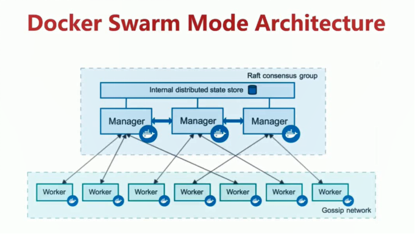

 

为了让学习的知识融汇贯通，目前是把所有的集群都放在了一个虚拟机上，如果这个虚拟机宕机了怎么办？俗话说鸡蛋不要都放在一个篮子里面，把各种集群的节点拆分部署，应该把各种节点分机器部署，多个宿主机，这样部署随便挂哪个主机我们都不担心。

源码：https://github.com/limingios/netFuture/blob/master/docker-swarm/

swarm 是docker的三剑客一员，之前都说过了，可以看中级和高级啊 。

1. docker machine 容器服务

2. docker compose 脚本服务

3. docker swarm 容器集群技术

**去中心化的设计**

- Swarm Manager 也承担worker节点的作用。
- Swarm Worker 运行容器部署项目


Swarm是没有中心节点的，挂掉其中一个其他是不会挂掉的。Swarm Manager 如果master挂了，立马选举一个新的master。

**创建集群环境**

首先机器已经安装了docker环境

```sh
docker swarm init
```

**加入swarm集群**

```sh
# 加入到 manager 中
docker swarm join-token manager
# 加入到 worker 中
docker swarm join-token worker
```

**环境搭建**


一共4个节点，2个manager节点，2个work节点，manager不光是管理，而且也干活，说白了一共4个干活的节点。

**创建 docker swarm 集群**

```sh
docker swarm init
```

报错注意：如果你在新建集群时遇到双网卡情况，可以指定使用哪个 IP，例如上面的例子会有可能遇到下面的错误。

Error response from daemon: could not choose an IP address to advertise since this system has multiple addresses on different interfaces (10.0.2.15 on enp0s3 and 192.168.66.100 on enp0s8) 
\- specify one with --advertise-addr

再次创建 docker swarm 集群 192.168.66.100

```sh
docker swarm init --advertise-addr 192.168.66.100 --listen-addr 192.168.66.100:2377docker swarm join-token manager
```

再次创建 docker swarm 集群192.168.66.101当前节点以manager的身份加入swarm集群

```sh
docker swarm join --token SWMTKN-1-4itumtscktomolcau8a8cte98erjn2420fy2oyj18ujuvxkkzx-9qutkvpzk87chtr4pv8770mcb 192.168.66.100:2377
```

再次创建 docker swarm 集群 192.168.66.102 当前节点以 worker 的身份加入 swarm 集群

```sh
docker swarm join --token SWMTKN-1-4itumtscktomolcau8a8cte98erjn2420fy2oyj18ujuvxkkzx-f2dlt8g3hg86gyc9x6esewtwl 192.168.66.100:2377
```

再次创建 docker swarm 集群 192.168.66.103 当前节点以 worker 的身份加入 swarm 集群

```sh
docker swarm join --token SWMTKN-1-4itumtscktomolcau8a8cte98erjn2420fy2oyj18ujuvxkkzx-f2dlt8g3hg86gyc9x6esewtwl 192.168.66.100:2377
```

**查看swarm集群**

只能在 manager 节点内执行，leader 挂掉后，reachable 就可以管理集群了。

```sh
docker node ls
```


**创建容器间的共享网络**

只能在manager节点内执行

```sh
docker network create -d overlay --attachable swarm_test
docker network ls
```

目前是4台机器，如果想让4台机器内的容器可以进行共享，overlay的网络就可以了，只需要在创建容器的时候 `–net=swarm_test`


**创建5个pxc容器**


### docker-machine

**1、什么是 Docker Machine？**

Docker Machine是一个工具，它可以帮你在虚拟主机安装 docker，并且通过 `docker-machine` 相关命令控制主机。你可以用 docker machine 在 mac、windows、单位的网络、数据中心、云提供商（AWS 或 Digital Ocean）创建 docker 主机。

通过 docker-machine commands，你能启动、进入、停止、重启主机，也可以升级 docker，还可以配置 docker client。

**2、为什么要用 Docker Machine？**

Docker Machine 是当前 docker 运行在 mac 或者 windows 上的唯一方式，并且操作多种不同 linux 系统的 docker 主机的最佳方式。

**3、Docker Machine之安装**

参考：[https://github.com/docker/machine/](https://github.com/docker/machine/)

下载 docker-machine 二进制文件

Mac Or linux

```sh
curl -Lhttps://github.com/docker/machine/releases/download/v0.8.0/docker-machine-`uname\ -s`-`uname -m` > /usr/local/bin/docker-machine \ && chmod +x/usr/local/bin/docker-machine
```

Windows with git bash

```sh
if [[ ! -d"$HOME/bin" ]]; then mkdir -p "$HOME/bin"; fi && \curl -Lhttps://github.com/docker/machine/releases/download/v0.7.0/docker-machine-Windows-x86_64.exe\ "$HOME/bin/docker-machine.exe" && \ chmod +x"$HOME/bin/docker-machine.exe"
```

黑魔法（离线安装）：

下载地址：[https://github.com/docker/machine/releases/](https://github.com/docker/machine/releases/)

直接在csdn下载：[https://download.csdn.net/download/zhugeaming2018/10404327](https://download.csdn.net/download/zhugeaming2018/10404327)

**4、Docker Machine之使用(macor windows)**

使用准备：

安装最新版的 virtualbox([https://www.virtualbox.org/wiki/Downloads](https://www.virtualbox.org/wiki/Downloads))

```sh
cd /etc/yum.repos.d
wget http://download.virtualbox.org/virtualbox/rpm/rhel/virtualbox.repo
yum install -y  VirtualBox-5.2
```

Create a machine

```sh
docker-machine create –driver virtualbox default
```

在上面你会发现这么句话 "error in driver during machine creation: This computer doesn't have VT-X/AMD-v enabled.Enabling it in the BIOS is mandatory" 意思就是说你没有开启虚拟化。

有朋友说创建虚拟主机太慢，我提供一个阿里云加速命令很快很暴力：

```sh
docker-machine create –driver virtualbox –engine-registry-mirror https://xu176fzy.mirror.aliyuncs.com default
```

- Get the environmentcommands for your new VM

  docker-machine env default

- List available machines again to see your newly minted machine

  docker-machine ls

- Connect your shedocker-machinessh defaultll to the new machine

  docker-machine ssh default

- Start and stop machines

  docker-machine stop default

  docker-machine start default

- Docker machine之使用(Iaas)

原文：https://idig8.com/2018/07/29/docker-zhongji-10/

\#查看docker-machine的版本

docker-machine version

如果你不是window10或者是你在mac中已经安装了docker了，但是docker-machine还没安装的话，可以通过官网来进行安装

https://docs.docker.com/machine/install-machine/#install-machine-directly

\#通过docker-machine 创建一个docker的虚拟机

docker-machine create demo

\#查看创建的虚拟机

docker-machine ls

\#进入创建的虚拟机

docker-machine ssh demo

\#查看docker-machine 创建的docker版本

docker --version

\#再创建一个docker-machine

docker-machine create demo1

\#关闭docker-mache demo1

docker-machine stop demo1

\#docker-machine远程server

先关闭本地的server端，点击docker的右下角图标选择-quit docker

\#共享server

#查看本地docker version#查看docker-machine的环境变量导入到本地docker-machine env demo#windows执行命令 @FOR /f "tokens=*" %i IN ('docker-machine env demo') DO @%i#mac下执行命令eval $(docker-machine env demo)#查看新的环境变量docker version

通过上边这种方式，可以远程管理docker-machine！

docker-machine还可以更换driver的方式，具体查看官网吧：https://docs.docker.com/machine/get-started-cloud/

总体来说docker-machine跟咱们的之前说过的vagrant非常的类似，条条大路通罗马

***\*11、\*******\*在linux/mac下通过Docker-Machine在阿里云上的使用\****

原文：https://idig8.com/2018/07/29/docker-zhongji-11/

在第十节说到，在本地通过docker-machine创建虚拟机，在虚拟机安装了咱们使用的docker。通过docker-machine也可以在云上创建虚拟机。

官网直接推荐的：https://docs.docker.com/machine/get-started-cloud/#drivers-for-cloud-providers

使用Docker Machine管理阿里云ECS

https://github.com/AliyunContainerService/docker-machine-driver-aliyunecs

准备工作

下载 https://docker-machine-drivers.oss-cn-beijing.aliyuncs.com/docker-machine-driver-aliyunecs_linux-amd64.tgz)

通过centos虚拟机来进行安装，先进行docker安装，具体可以看『在centos上安装docker』，记住安装docker-machine。也把如何安装docker-machine给大家说下

base=https://github.com/docker/machine/releases/download/v0.14.0 && curl -L $base/docker-machine-$(uname -s)-$(uname -m) >/tmp/docker-machine && sudo install /tmp/docker-machine /usr/local/bin/docker-machine

安装阿里的docker-machine 的第三方

安装步骤

mkdir docker-machine# Download and unzip Aliyun ECS drivercurl -L https://docker-machine-drivers.oss-cn-beijing.aliyuncs.com/docker-machine-driver-aliyunecs_linux-amd64.tgz > driver-aliyunecs.tgz && tar xzvf driver-aliyunecs.tgz -C docker-machine && rm driver-aliyunecs.tgz mv docker-machine/bin/* /usr/local/bin mv /usr/local/bin/docker-machine-driver-aliyunecs.linux-amd64 /usr/local/bin/docker-machine-driver-aliyunecs && chmod +x /usr/local/bin/docker-machine-driver-aliyunecs

查看是否安装成功

docker-machine create -d aliyunecs --help

开始安装

登录阿里云账号控制台https://home.console.aliyun.com/new#/开通『访问控制』、创建用户、授权

最重要的一步保证自己的账户有100以上的钱，这个很重要啊，要不阿里不让你创建docker-machine。记住你比别人就差这110块钱吗？机会面前这110是小钱。

安装

docker-machine create -d aliyunecs --aliyunecs-io-optimized=optimized --aliyunecs-instance-type=ecs.c5.large --aliyunecs-access-key-id=XXXX --aliyunecs-access-key-secret=XXXX --aliyunecs-region=cn-qingdao liming

安装结果

docker-machine ls

登录

docker-machine ssh liming

docker version

本地的docker server没启动，咱们直接连接阿里云的docker server

docker-machine env liming
eval $(docker-machine env liming)

如果不想连接远程的docker server

docker-machine env --unset
eval $(docker-machine env --unset)

钱不是大风刮来的，了解完了记得删除

docker-machine rm liming

记住安装过程中有错误把错误内容输入到：https://error-center.aliyun.com/status/search 就可以看到提示啦！


### docker-swarm

1.什么是Docker Swarm？
    容器集群管理工具。
    通过docker swarm可以将多台机器连接在一起，通过swarm的调度可以实现服务的多台机器的部署，服务的伸缩。
    docker-swarm的场景因为需要多台docker虚拟机，在虚拟机中创建docker-machine会发现一个很重要的问题，无法创建多个docker的虚拟器，虚拟主机报错"Wrapper DockerMachine process exiting due to closed plugin server ..." 该问题是在 Vmware Workstation Pro 14.1.1 & centos10 上出现的，用真实机器测试不会出现。
    所以下面的演示就在Vmware Workstation下演示1台机器。
    docker-machine create –driver virtualbox manager
    docker-machine ssh manager
    docker version
2.Docker Swarm 使用入门
    注意：docker engine版本为1.18.05.0-ce
    docker swarm manager 节点初始化
    docker swarm init --advertise-addr <hostIP>
    说明：init命令初始化后生成结果如下：
To add a worker to this swarm, run the following command:
    docker swarm join --token SWMTKN-1-5t5n2lcqsal12tmhsngww28njm1qcz6917u9bomgmy6bdyw3o0-8gf8jgpb83b22oae92aiamlel 192.168.101.13:2377
To add a manager to this swarm, run 'docker swarm join-token manager' and follow the instructions.
    开启另一台虚拟机，使用上面的命令将docker加入该集群
    查看集群：docker info
    docker node ls
    删除work节点
    docker swarm leave
    通过swarm创建服务
    docker service create –replicas 1 --name helloworld alpine ping docker.com
    查看服务列表
    docker service ls
    查看服务详情
    docker service inspect –pretty helloworld
    服务弹性扩展
    docker service scale =
    Ex:docker service scale helloworld=5
    查看服务列表
    docker service ps
    Ex:docker service ps helloworld
    服务删除
    docker service remove
    Ex:docker service rm helloworld


## 自动化部署分布式容器云平台实践

当前云计算场景中部署一套 Kubernetes 集群系统是最常见的容器需求。在初期阶段，大量的部署经验都依赖于前人设计实现的自动化部署工具之上，比如 Ansible。但是为什么这样的自动化工具并不能彻底解决所有 Kubernetes 集群的安装问题呢，主要的矛盾在于版本的升级更新动作在分布式系统的部署过程中，由于步骤复杂，无法提供统一的自动化框架来支持。

Ansible 需要撰写大量的有状态的情况来覆盖各种可能发生的部署阶段并做出判断。这种二次判断的操作对于 Ansible 这种自动化工具是无法适应的。Ansible 这样的工具期望行为一致性，如果发生可能发生的情况，将无法有效的保证后续的步奏能有效的安装。通过本文分享的 Kubernetes 社区中提供的安装套件可以帮助大家结合实践现在适合自己的部署分布式容器云平台的方法和工具链。

### Kubernetes Operations（kops）

#### 生产级别 k8s 安装、升级和管理

Ansible 部署 k8s 需要投入很多精力来维护集群知识的 roles 和 inventory，在日常分布式系统中会带来很多不确定的异常，很难维护。所以社区提供了 kops，期望能像 kubectl 一样来管理集群部署的问题。目前实现了 AWS 的支持，GCE 支持属于 Beta 阶段，vSphere 处于 alpha 阶段，其他平台属于计划中。对于中国区的 AWS，可以选用 cn-north-1 可用区来支持。


1、配置 AWS 信息

```sh
AWS Access Key ID [None]:
AWS Secret Access Key [None]:
Default region name [None]:
Default output format [None]:
```

注意需要声明可用区信息

```sh
export AWS_REGION=$(aws configure get region)
```

2、DNS 配置

因为工作区没有 AWS 的 Route53 支持，我们通过使用 gossip 技术可以绕过去这个限制。

3、集群状态存储

创建独立的 S3 区来存储集群安装状态。

```sh
aws s3api create-bucket --bucket prefix-example-com-state-store --create-bucket-configuration LocationConstraint=$AWS_REGION
```

4、创建第一个 k8s 集群

在中国区执行安装的时候，会遇到网络不稳定的情况，使用如下的环境声明可以缓解此类问题：

```sh
## Setup vars

KUBERNETES_VERSION=$(curl -fsSL --retry 5 "https://dl.k8s.io/release/stable.txt")
KOPS_VERSION=$(curl -fsSL --retry 5 "https://api.github.com/repos/kubernetes/kops/releases/latest" | grep 'tag_name' | cut -d\" -f4)
ASSET_BUCKET="some-asset-bucket"
ASSET_PREFIX=""

# Please note that this filename of cni asset may change with kubernetes version
CNI_FILENAME=cni-0799f5732f2a11b329d9e3d51b9c8f2e3759f2ff.tar.gz


export KOPS_BASE_URL=https://s3.cn-north-1.amazonaws.com.cn/$ASSET_BUCKET/kops/$KOPS_VERSION/
export CNI_VERSION_URL=https://s3.cn-north-1.amazonaws.com.cn/$ASSET_BUCKET/kubernetes/network-plugins/$CNI_FILENAME

## Download assets

KUBERNETES_ASSETS=(
  network-plugins/$CNI_FILENAME
  release/$KUBERNETES_VERSION/bin/linux/amd64/kube-apiserver.tar
  release/$KUBERNETES_VERSION/bin/linux/amd64/kube-controller-manager.tar
  release/$KUBERNETES_VERSION/bin/linux/amd64/kube-proxy.tar
  release/$KUBERNETES_VERSION/bin/linux/amd64/kube-scheduler.tar
  release/$KUBERNETES_VERSION/bin/linux/amd64/kubectl
  release/$KUBERNETES_VERSION/bin/linux/amd64/kubelet
)
for asset in "${KUBERNETES_ASSETS[@]}"; do
  dir="kubernetes/$(dirname "$asset")"
  mkdir -p "$dir"
  url="https://storage.googleapis.com/kubernetes-release/$asset"
  wget -P "$dir" "$url"
  [ "${asset##*.}" != "gz" ] && wget -P "$dir" "$url.sha1"
  [ "${asset##*.}" == "tar" ] && wget -P "$dir" "${url%.tar}.docker_tag"
done

KOPS_ASSETS=(
  "images/protokube.tar.gz"
  "linux/amd64/nodeup"
  "linux/amd64/utils.tar.gz"
)
for asset in "${KOPS_ASSETS[@]}"; do
  kops_path="kops/$KOPS_VERSION/$asset"
  dir="$(dirname "$kops_path")"
  mkdir -p "$dir"
  url="https://kubeupv2.s3.amazonaws.com/kops/$KOPS_VERSION/$asset"
  wget -P "$dir" "$url"
  wget -P "$dir" "$url.sha1"
done

## Upload assets

aws s3api create-bucket --bucket $ASSET_BUCKET --create-bucket-configuration LocationConstraint=$AWS_REGION
for dir in "kubernetes" "kops"; do
  aws s3 sync --acl public-read "$dir" "s3://$ASSET_BUCKET/$ASSET_PREFIX$dir"
done
```

创建集群的时候加上参数：

```sh
--kubernetes-version https://s3.cn-north-1.amazonaws.com.cn/$ASSET_BUCKET/kubernetes/release/$KUBERNETES_VERSION
```

另外，还有一些镜像是托管在 gcr.io 中的，比如pause-amd64， dns等。需要自行下载并提交部署到所有机器上才能做到离线安装。这里有一个技巧是通过自建的 **Dockerfile** 中加上

```sh
FROM gcr.io/google_containers/pause-amd64
```

一行，并通过 Docker Cloud 自动构建的功能，把 pause-amd64 这样的镜像同步到 docker hub 中，方便国内的 AWS 主机可以下载使用。

### kubeadm——官方安装 k8s 集群命令行工具

kubeadm 主要的目的就为简化部署集群的难度，提供一键式指令如：kubeadm init 和 kubeadm join 让用户在安装集群的过程中获得平滑的用户体验。


#### kubeadm init

初始化的过程被严格定义成多个阶段来分步骤跟踪集群的状态。有些参数必须需要调优：

- --apiserver-advertise-address 这个地址是用来让 API Server 来通告其他集群组件的 IP 地址。

- --apiserver-bind-port 这个端口是 API Server 的端口，默认是6443。

- --apiserver-cert-extra-sans 附加的主机名字或地址，并加入到证书中。例如：

  ```sh
  --apiserver-cert-extra-sans=kubernetes.example.com,kube.example.com,10.100.245.1
  ```

- --cert-dir 证书地址，默认在 /etc/kubernetes/pki。

- --config kubeadm 的配置文件。

- --dry-run 这个参数告诉 kubeadm 不要执行，只是显示执行步骤。

- --feature-gates 通过键值对来激活 alpha/experimental 的特性。

- --kubernetes-version 集群初始化版本号。

- --node-name 主机名称。

- --pod-network-cidr 选择 pod 的网络网段。

- --service-cidr 服务 IP 地址网段。

- --service-dns-domain 服务域名，默认 cluster.local。

- --skip-preflight-checks 默认 kubeadm 运行一系列事前检查来确认系统的有效性。

- --skip-token-print 去掉默认打印 token 的行为。

- --token 指定 token 的字符串。

- --token-ttl 配置 token 的过期时间，默认24个小时。

#### kubeadm join

两种连接方式：

- 通过共享 token 和 ip 地址和 root CA key 来加入集群。

  ```sh
  kubeadm join --discovery-token abcdef.1234567890abcdef --discovery-token-ca-cert-hash sha256:1234..cdef 1.2.3.4:6443
  ```

- 使用配置文件

  ```sh
  kubeadm join --discovery-file path/to/file.conf
  ```

#### kubeadm config

kubeadm v1.8.0+ 将自动创建 ConfigMap 提供kubeadm init 需要的所有参数。

#### kubeadm reset

取消 kubeadm init 或者 kubeadm join 对集群做的改动。

#### kubeadm token

管理集群需要的 token。

还有，kubeadm 可以配置使用其他 docker runtime，比如 cri-o 容器引擎。

```sh
cat > /etc/systemd/system/kubelet.service.d/20-cri.conf <<EOF
Environment="KUBELET_EXTRA_ARGS=--container-runtime=remote --container-runtime-endpoint=$RUNTIME_ENDPOINT --feature-gates=AllAlpha=true"
EOF
systemctl daemon-reload
```

通过初始化后，就可以调用 cri-o 引擎了。

#### kubeadm 配置自定义镜像

默认，kubeadm 会拉取 gcr.io/google_containers 下的镜像。必须通过配置文件覆盖默认的镜像仓库的地址。

- imageRepository 去掉。gcr.io/google_containers 的值。
- unifiedControlPlaneImage 提供面板镜像。
- etcd.image 是 etcd 的镜像。

#### kubeadm 支持云端集成

通过指定--cloud-provider 参数可以实现云端 k8s 集群的部署。比如阿里云就实现了一套 [cloud provider](https://github.com/AliyunContainerService/alicloud-controller-manager) 帮助用户在阿里云一键部署一套集群。从当前社区的热度来看，k8s 社区重点专注在kubeadm的扩展，第三方的 cloud provider 可以自行实现功能，kubeadm 可以通过参数的方式调用阿里云的基础组件。

**总结：**

从 Ansible 自动化工具开始，K8S 集群作为典型的分布式集群系统安装范本，社区在不断的优化用户体验。我们期望集群能够自举的完成系统级配置，并且通过 kubeadm 的方式帮助用户简单的、平滑的升级集群。实现这个 kubeadm，可以帮助任意系统管理员不在为分布式系统的安装犯愁，只需要一行命令就可以完成集群的搭建。所有生产级别的经验都被固化在 kubeadm 的代码中，我们通过参数加以调优，实现集群的生产级别的部署工作。

## 监控日志和日志管理

为什么要进行日志收集？
    应用程序跑在集群中，产生很多的日志，日志中包含着程序运行的情况的纪录，查看单个机器的日志过程繁琐，所以需要统一的日志管理平台对日志进行统一处理，将所有应用程序的日志收集起来，可以对日志进行存储、归档、查询、状态判断。
    例如负载均衡的情况，nginx下面很多的web服务，如果查看日志的话需要进入多个tomcat一个一个看麻烦吧。
    1. ELK技术解决方案吧tomcat收集起来
    2. Graylog+mongo+elasticsearch 日志收集机器。


搭建日志系统
安装要求：docker、docker-compose
配置文件：docker-compose.yml
some-mongo:
image: "mongo:3"
volumes:
  - /opt/graylog/data/mongo:/data/db
some-elasticsearch:
image: "elasticsearch:latest"
command: "elasticsearch  -Des.cluster.name='graylog'"
volumes:
  - /opt/graylog/data/elasticsearch:/usr/share/elasticsearch/data
graylog:
image: graylog2/server
volumes:
  - /opt/graylog/data/journal:/usr/share/graylog/data/journal
  - /opt/graylog/config:/usr/share/graylog/data/config
environment:
GRAYLOG_PASSWORD_SECRET:somepasswordpepper
GRAYLOG_ROOT_PASSWORD_SHA2:8c6976e5b5410415bde908bd4dee15dfb167a9c873fc4bb8a81f6f2ab448a918
GRAYLOG_REST_TRANSPORT_URI: http://192.168.30.3:12900
links:
  - some-mongo:mongo
  - some-elasticsearch:elasticsearch
ports:
  - "9000:9000"
  - "12900:12900"
  - "12201:12201/udp"
  - "1514:1514/udp"
#直接下载官方推荐配置文件
    wget https://raw.githubusercontent.com/Graylog2/graylog2-images/2.1/docker/config/graylog.conf
#日志配置文件
    wget https://raw.githubusercontent.com/Graylog2/graylog2-images/2.1/docker/config/log4j2.xml
#graylog.conf
    修改下载完的graylog.conf中的root_timezone为：
    root_timezone =+08:00
启动运行：
    docker-compose up
配置graylog：
    页面：http://192.168.30.3:9000
    用户名：admin
    密  码：admin
    配置Input
启动应用程序容器：
    docker run -d –name logtest –log-driver=gelf –log-opt gelf-address=udp://192.168.30.3:12201 ubuntu /bin/bash -c "while true;do echo hello;sleep 1;done"

## 单节点mesos集群

Mesos简介
    什么是MESOS？
    Apache Mesos 是一个集群管理器，提供了有效的、跨分布式应用或框架的资源隔离和共享，可以运行 Hadoop、MPI、Hypertable、Spark。
    几个基本概念：
    Mesos master:负责任务调度的节点。
    Mesos slave:负责执行任务的节点。
    Mesos 框架：需要由mesos调度的应用程序，比如hadoop、spark、marathon、chronos等。


    Mesos实现了两级调度架构，它可以管理多种类型的应用程序。第一级调度是Master的守护进程，管理Mesos集群中所有节点上运行的Slave守护进程。集群由物理服务器或虚拟服务器组成，用于运行应用程序的任务，比如Hadoop和MPI作业。第二级调度由被称作Framework的“组件”组成。Framework包括调度器（Scheduler）和执行器（Executor）进程，其中每个节点上都会运行执行器。Mesos能和不同类型的Framework通信，每种Framework由相应的应用集群管理。上图中只展示了Hadoop和MPI两种类型，其它类型的应用程序也有相应的Framework。
    Mesos Master协调全部的Slave，并确定每个节点的可用资源，聚合计算跨节点的所有可用资源的报告，然后向注册到Master的Framework（作为Master的客户端）发出资源邀约。Framework可以根据应用程序的需求，选择接受或拒绝来自master的资源邀约。一旦接受邀约，Master即协调Framework和Slave，调度参与节点上任务，并在容器中执行，以使多种类型的任务，比如Hadoop和Cassandra，可以在同一个节点上同时运行。
单节点mesos集群
安装依赖包
Centos7.1
1.下载rpm包
    sudo rpm -Uvh http://repos.mesosphere.com/el/7/noarch/RPMS/mesosphere-el-repo-7-1.noarch.rpm
2.安装
    sudo yum -y install mesosphere-zookeeper
    sudo yum -y install mesosmarathon
3.配置
    设置/var/lib/zookeeper/myid作为唯一标识（1-255）讲的是单节点直接设置成1
    配置mesos连接的zk，文件位置：/etc/mesos/zk（例如：zk://1.1.1.1:2181,2.2.2.2:2181,3.3.3.3:2181/mesos）
    配置mesos master的法定值（一个节点挂了，立马另一个节点起起来，目前是1台机器，直接填写1；如果是5台机器，一台机器挂了，这里的数字应该填3，也就说3台机器认为一台机器可以当master这台机器才可以当master），文件位置：/etc/mesos-master/quorum
    vi /etc/mesos-master/ip -- 192.168.30.3
    vi /etc/mesos-master/hostname
4.启动
    启动zookeeper：service zookeeper start
    启动mesos－master：service mesos－master start
    启动mesos－slave：servie mesos－slavestart
5.验证
    访问web页面：http://:5050
    执行mesos命令：MASTER=$(mesos-resolve 'cat/etc/mesos/zk')
    mesos-execute --master=$MASTER --name="cluster-test" --command="sleep 5"

## 多节点mesos集群

原文：https://idig8.com/2018/07/27/docker-chuji-17/
1.配置master
    配置文件：/etc/default/mesos
    增加配置：IP=192.168.30.3（当前节点IP）
2.配置slave节点
    配置文件：/etc/default/mesos
    增加配置：IP=192.168.30.4（当前节点IP）
  配置slave节点的master
    配置文件：/etc/mesos/zk
    配置：zk://192.168.30.3:2181/mesos
3.启动slave节点：
    启动命令：service mesos-slavestart
注意：
    1.日志输出是否报错（默认地址：/var/log/mesos/mesos-slave.INFO）
    2.观察进程是否正常（命令：ps –ef|grepmesos-slave）
Marathon
1.什么是marathon？
    marathon是mesos的一个容器编排的插件。
2.配置marathon
    开启mesos容器化配置：
命令：
    echo 'docker,mesos' >/etc/mesos-slave/containerizers
    echo '10mins' > /etc/mesos-slave/executor_registration_timeout
    重启slave节点：service mesos-slave restart
3.安装marathon
    sudo yum -y install marathon
4.启动marathon
    service marathon start
5.Marathon Web：
    http::8080
    通过marathon调度mesos运行容器：
    curl -X POST http://192.168.30.3:8080/v2/apps-d @app1.json -H "Content-type: application/json"
    在页面查看marathon启动测试容器的配置
    访问测试应用的数据
    完成弹性伸缩
扩展：
    marathon官网：https://mesosphere.github.io/marathon/docs/
    安装集群：https://open.mesosphere.com/getting-started/install/

## 持续集成


0 ：开发人员提交代码到github
1 ：触发jenkins操作
2 ：jenkins将代码编译、验证
3 ：将代码封装在docker镜像并上传至docker仓库
4 ：jenkins向marathon发送部署请求，marathon完成相应部署
5 ：进行集成测试
6 ：集成测试通过，触发研发环境部署
7 ：进行集成测试
8 ：供用户访问

基于mesos实践


环境准备：
    mesos-slave1:4CPU-64GBRAM-500GB DISK
    mesos-slave2:4CPU-128GBRAM-600GB DISK
    mesos-slave3:8CPU-12GBRAM-250GB DISK
步骤说明：
    1：3台机器向mesos master发送请求，注册成为mesos slave节点
    2：向marathon发送请求启动容器，容器占用2CPU－512M RAM-5GB DISK
    3：marathon向mesos发送请求，请求启动相应任务
    4：mesos计算后，将marathon发送的任务启动在slave1节点上，任务完成
    5：向jenkins发送请求执行任务，任务需要占用8CPU－256M RAM－5GB DISK
    6：jenkins向mesos发送请求，请求启动相应任务
    7：mesos计算后，将jenkins发送的任务启动在slave3节点上，任务完成
Jenkins Pipine：


## 总结

### 常见问题

**1、iptables: No chain/target/match by that name**

解决方法：

```sh
# 重启docker服务
systemctl restart docker
```

**2、Job for docker.service failed**

解决：执行 `vim /etc/sysconfig/selinux`，把 `selinux` 属性值改为 disabled。然后重启系统，docker 就可以启动了。

### Windows容器

[Windows 容器](https://docs.microsoft.com/zh-cn/virtualization/windowscontainers/about/)：

- Windows Server：通过进程和命名空间隔离技术提供应用程序隔离。Windows Server容器与容器主机和主机上运行的所有容器共享内核。
- Hyper-V：通过在高度优化的虚拟机中运行各容器来扩展 Windows Server 容器提供的隔离。在此配置中，容器主机的内核不与 Hyper-V 容器共享，以提供更好的隔离。

有关详细信息，请参阅 [Hyper-V 容器](https://docs.microsoft.com/virtualization/windowscontainers/manage-containers/hyperv-container)。

### 基于Docker的DevOps方案

这张时序图概括了目前敏捷开发流程的所有环节：

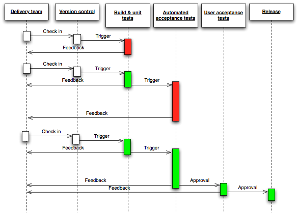

场景管道图：

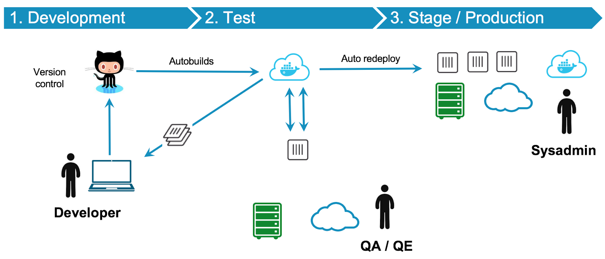

**最佳发布环境：**

[Kubernetes](https://github.com/GoogleCloudPlatform/kubernetes) 是 Google 的一个容器集群管理工具，它提出两个概念：

- **Cluster control plane（AKA master）**：集群控制面板，内部包括多个组件来支持容器集群需要的功能扩展。
- **The Kubernetes Node**：计算节点，通过自维护的策略来保证主机上服务的可用性，当集群控制面板发布指令后，也是异步通过 etcd 来存储和发布指令，没有集群控制链路层面的依赖。

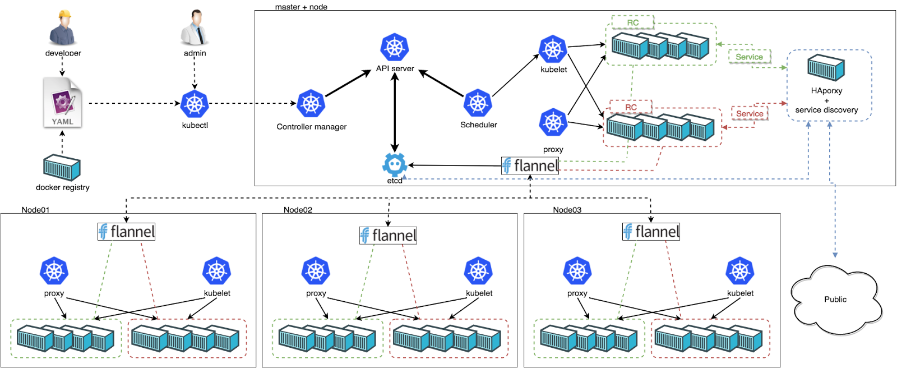

SwarmKit 是一个分布式集群调度平台，作为 docker 一个新的集群调度开源项目，它大量借鉴了 Kubernetes 和 Apache Mesos 的优秀概念和最佳实践：

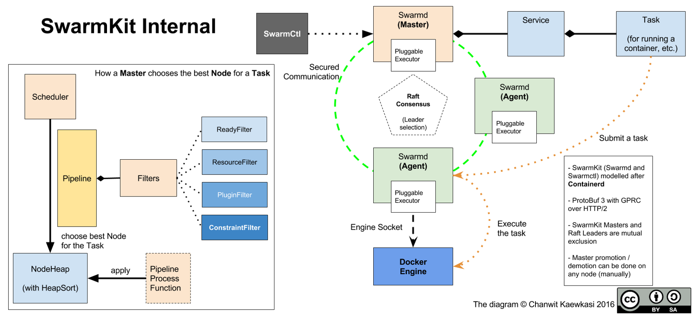

Apache Mesos 系统是一套资源管理调度集群系统，生产环境使用它可以实现应用集群。Mesos 是一个框架，在设计它的时候只是为了用它执行 Job 来做数据分析。它并不能运行一个比如 Web 服务 Nginx 这样长时间运行的服务，所以我们需要借助 marathon 来支持这个需求。

marathon 有自己的 REST API，我们可以创建如下的配置文件 Docker.json：

```json
{
  "container": {
    "type": "DOCKER",
    "docker": {
      "image": "libmesos/ubuntu"
    }
  },
  "id": "ubuntu",
  "instances": "1",
  "cpus": "0.5",
  "mem": "512",
  "uris": [],
  "cmd": "while sleep 10; do date -u +%T; done"
}
```

然后调用

```sh
curl -X POST -H "Content-Type: application/json" http://:8080/v2/apps -d@Docker.json
```

我们就可以创建出一个 Web 服务在 Mesos 集群上。对于 Marathon 的具体案例，可以参考[官方案例](https://mesosphere.github.io/marathon/)。


### 容器云平台的构建实践

容器云平台是 Gartner 近些年提出来的云管理平台（Cloud Management Platform，CMP）的企业架构转型衍生品，参考 Gartner 的定义如下：

>云管理平台（CMP）是提供对公有云、私有云和混合云整合管理的产品。

从容器化角度总结起来就是两块，第一是功能需求，管理容器运行引擎、容器编排、容器网络、容器存储、监控报警日志。第二是非功能需求，可用性，兼容性，安全和易用性，负载优化等。容器云平台建设的目标是使企业业务应用被更好的运营管理起来。

从云平台的建设步骤来说，大致需要经过以下步骤来梳理实践，顺序不限：

1.选择运行时容器引擎的基准参考。

实际情况是当前容器运行引擎可以选择的品类并不多，只有 Docker 家的组件是最容易搭建的，所以业界选型的时候，都是默认首选以 Docker 组件作为基准来选型环境配置。当然随着云原生基金会（Cloud Native Computing Foundation，CNCF）接纳下当前几乎所有业界领先的云计算厂商成为其成员单位，从而从侧面奠基了以通用容器运行时接口（CRI）为基础的 cri-o 系列容器引擎的流行，参考 CNCF 的架构鸟瞰图可以看到容器运行引擎的最新的发展走向。

从 CNCF 指导下应用上云的趋势来看，已经在模糊私有云计算资源和公有云计算资源的界限，容器运行引擎也不在是 Docker 一家独有，业界已经偏向选择去除厂商绑定的开源通用容器运行时接口（CRI）对接的容器引擎。这种趋势也明显从 DockerCon17 大会上看到 Docker 宣布支持 Kubernetes 一样，容器引擎已经有了新的架构体系可以参考和扩展。如图：


由于社区的快速变革，很多读者可能已经无法详细梳理和理解 CRI-containerd 和 CRI-O 的一些细微差别。所以我还要把 CRI-O 的架构图放在这里方便大家做对比。


2.容器云平台涉及到多租户环境下多个计算节点的资源有效利用和颗粒度更细的资源控制。

Kubernetes 无疑是最佳的开源项目来支撑云平台的实践。Kubernetes 的架构设计是声明式的 API 和一系列独立、可组合的控制器来保证应用总是在期望的状态。这种设计本身考虑的就是云环境下网络的不可靠性。这种声明式 API 的设计在实践中是优于上一代命令式 API 的设计理念。考虑到云原生系统的普及，未来 Kubernetes 生态圈会是类似 Openstack 一样的热点，所以大家的技术栈选择上，也要多往 Kubernetes 方向上靠拢。如图：


3.容器网络其实从容器云平台建设初期就是重要梳理的对象。

容器引擎是基于单机的容器管理能力，网络默认是基于veth pair 的网桥模式，如图所示：


这种网络模型在云计算下无法跨主机通信，一般的做法需要考虑如何继承原有网络方案。所以 CNCF 框架下定义有容器网络接口（CNI）标准，这个标准就是定义容器网络接入的规范，帮助其他既有的网络方案能平滑接入容器网络空间内。自从有了 CNI 之后，很多协议扩展有了实现，OpenSwitch、Calico、Fannel、Weave 等项目有了更具体的落地实践。从企业选型的角度来看当前网络环境下，我们仍然需要根据不同场景认真分析才可以获得更好的收益。常见的场景中

- 物理网络大都还是二层网络控制面，使用原生的 MacVlan/IPVlan 技术是比较原生的技术。
- 从虚拟网络角度入手，容器网络的选择很多，三层 Overlay 网络最为广泛推荐。
- 还有从云服务商那里可以选择的网络环境都是受限的网络，最优是对接云服务的网络方案，或者就是完全放弃云平台的建设由服务商提供底层方案。

网络性能损耗和安全隔离是最头疼的网络特性。使用容器虚拟网桥一定会有损耗，只有最终嫁接到硬件控制器层面来支撑才能彻底解决此类性能损耗问题。所有从场景出发，网络驱动的选择评估可以用过网络工具的实际压测来得到一些数据的支撑。参考例子：

```sh
docker run  -it --rm networkstatic/iperf3 -c 172.17.0.163

Connecting to host 172.17.0.163, port 5201
[  4] local 172.17.0.191 port 51148 connected to 172.17.0.163 port 5201
[ ID] Interval           Transfer     Bandwidth       Retr  Cwnd
[  4]   0.00-1.00   sec  4.16 GBytes  35.7 Gbits/sec    0    468 KBytes
[  4]   1.00-2.00   sec  4.10 GBytes  35.2 Gbits/sec    0    632 KBytes
[  4]   2.00-3.00   sec  4.28 GBytes  36.8 Gbits/sec    0   1.02 MBytes
[  4]   3.00-4.00   sec  4.25 GBytes  36.5 Gbits/sec    0   1.28 MBytes
[  4]   4.00-5.00   sec  4.20 GBytes  36.0 Gbits/sec    0   1.37 MBytes
[  4]   5.00-6.00   sec  4.23 GBytes  36.3 Gbits/sec    0   1.40 MBytes
[  4]   6.00-7.00   sec  4.17 GBytes  35.8 Gbits/sec    0   1.40 MBytes
[  4]   7.00-8.00   sec  4.14 GBytes  35.6 Gbits/sec    0   1.40 MBytes
[  4]   8.00-9.00   sec  4.29 GBytes  36.8 Gbits/sec    0   1.64 MBytes
[  4]   9.00-10.00  sec  4.15 GBytes  35.7 Gbits/sec    0   1.68 MBytes
- - - - - - - - - - - - - - - - - - - - - - - - -
[ ID] Interval           Transfer     Bandwidth       Retr
[  4]   0.00-10.00  sec  42.0 GBytes  36.1 Gbits/sec    0             sender
[  4]   0.00-10.00  sec  42.0 GBytes  36.0 Gbits/sec                  receiver

iperf Done.
```

对于网络安全的需求，一种是策略性的网络速度的限制，还有一种是策略上的租户网络隔离，类似 VPC。这块比较有想法的参考开源项目是 [cilium](https://github.com/cilium/cilium)，如图：


4.容器存储是容器应用持久化必须解决的问题。

从容器提出来之后，业界就一直在探索如何在分布式场景下对接一套分布式存储来支撑有状态应用。可惜的是，在 CNCF 的容器存储接口（CSI）定义之下，目前还没有最终完成参考实现，所有大家只能参考一下[规范](https://github.com/container-storage-interface/spec)。在没有统一接口之前，我们只能一对一的实现当前的存储接口来调用分布式存储。好在存储并没有太多的选择，除了商用存储之外，开源领域可以选择的无非是 GlusterFS 和 Ceph。一种是作为块存储存在，一种是作为文件存储存在。

从容器使用角度来讲，文件存储是应用场景最多的案例，所以使用 Gluster 类来支持就可以在短时间内实现有状态应用的扩展。这里特别需要提醒一句，容器分布式存储的想法有很多种，并不一定要局限在现有存储方案中，只需要实现 FUSE 协议就可以打造自己的存储，可以参考京东云的容器存储实现 [Containerfs](https://github.com/ipdcode/containerfs) 获得灵感：


5.容器云平台定制化需求最多的地方就是管理平台的功能布局和功能范围。

云平台常常只覆盖底层组件80%左右的功能映射，并不是完全100%匹配。所有通用型云平台的设计实现需要从各家的场景需求出发，大致分为 DevOps 领域的集成开发平台，也可以是支撑微服务的管控平台。两个方向差距非常大，难以放在一起展现，大家的做法就是在行业专家理解的基础之上进行裁剪。目前行业可以参考的案例有 Rancher 的面板，还有 Openshift 的面板，并且谷歌原生的容器面板也是可以参考，如图：


6.镜像仓库的建设和管理，大家往往趋向于对管理颗粒度的把控。这块，可以参考的开源项目有 [Harbor](https://github.com/vmware/harbor)。

围绕镜像仓库的扩展需求还是非常多的，比如和 CI/CD 的集成，帮助用户从源码层面就自动构建并推入到仓库中。从镜像的分发能不能提供更多的接口，不仅仅是 Docker pull 的方式，可能需要通过 Agent 提前加载镜像也是一种业务需求。相信不久就会有对应的方案来解决这块的扩展问题。

7.还有非功能的需求也是需要考虑的。

比如云平台的高可用怎么实现，是需要考虑清楚的。一般分布式系统都有三个副本的主控节点，所有从方便性来讲，会把云管理平台放在3台主控节点上复用部署，通过Haproxy 和 Keeplived 等技术实现面板访问入口的高可用。还有当云平台还有 DB 需求时，需要单独的数据库主备模式作为 DB 高可用的选项，当然选择分布式 DB 作为支持也是可选项，当时这块就需要把 DB 服务化了。

当你真实引入这些组件部署之后，会发现需要冗余的组件是很多的，无状态的组件和有状态的组件并不能随便的混部，需要根据业务场景归类好。通常从可用性上来讲是应该抽离出来单独放把云管理平台部署两台机器上做高可用。其他部分中容器调度集群系统本身就是分布式设计，天然就有高可用的布局，可以直接利用。从应用上 Kubernets 开始很多分布式的优势会立即受益，我们主要的关心重点在于对集群控制器的业务需求扩展实现和算法调度管理。

8.微服务尤其是 Google Istio 的推出对服务网格化的需求，给容器云平台注入了新的实际的微服务场景，可以预见是未来容器云平台应用的一个重要场景。如下图所示。

弱化网关的单入口性，把网关做成了业务控制面板，可以任意的调度用户的请求流量。这是对上一代以 API 网关为中心的微服务的进化，必将引起软件架构的变革。


综上所述，云平台的构建实践不是一蹴而就的。需要结合业务场景在方方面面给予规划并分而治之。技术栈的不断迭代，让云计算开始有了很多新内容可以学习和实践。但是，很多历史遗留的应用的容器化工作还是非常棘手的。附加上流程变革的时间进度，我们还是需要在很多方面折中并给出一些冗余的方案来适配传统业务体系的需求。所有，通过以上功能性和非功能性的需求参考，相信可以加快企业构建云平台的步伐并给予一些必要的指导参考。

# Docker

## 目录

1. 命令
   - [Docker网络](#Docker网络)
   - [仓库](#仓库)
2. [docker compose](#docker&nbsp;compose)
3. 刻意练习
   - [练习1](#练习1)

## 镜像命令

### 在容器中安装新的程序

下一步我们要做的事情是在容器里面安装一个简单的程序(ping)。我们之前下载的tutorial镜像是基于ubuntu的，所以你可以使用ubuntu的apt-get命令来安装ping程序： `apt-get install -y ping`。

>备注：apt-get 命令执行完毕之后，容器就会停止，但对容器的改动不会丢失。

**目标**：在learn/tutorial镜像里面安装ping程序。

**提示**：在执行apt-get 命令的时候，要带上-y参数。如果不指定-y参数的话，apt-get命令会进入交互模式，需要用户输入命令来进行确认，但在docker环境中是无法响应这种交互的。

**正确的命令**：`docker run learn/tutorial apt-get install -y ping`

### Dockerfile最佳实践

**1、错误定位：**

每个Dockerfile的指令可以生成新的一层镜像，如果通过Dockerfile创建镜像出错，可以根据出错所在步骤的上一层启动容器，然后手工执行出错层的命令，以达到调试目的。

好的使用习惯：[http://dockone.io/article/131](http://dockone.io/article/131)，[http://dockone.io/article/132](http://dockone.io/article/132)

**2、使用缓存：**

Dockerfile的每条指令都会将结果提交为新的镜像，下一个指令将会基于上一步指令的镜像的基础上构建，如果一个镜像存在相同的父镜像和指令（除了ADD），Docker将会使用镜像而不是执行该指令，即缓存。

为了有效地利用缓存，你需要保持你的Dockerfile一致，并且尽量在末尾修改。我所有的Dockerfile的前五行都是这样的：

```dockfile
FROM ubuntu
LABEL maintainer="Colin Chen <399596326@qq.com>"
RUN echo "deb http://archive.ubuntu.com/ubuntu precise main universe" > /etc/apt/sources.list
RUN apt-get update
RUN apt-get upgrade -y
```

更改MAINTAINER指令会使Docker强制执行RUN指令来更新apt，而不是使用缓存。所以，我们应该使用常用且不变的Dockerfile开始（译者注：上面的例子）指令来利用缓存。

**3、使用标签：**

除非你正在用Docker做实验，否则你应当通过-t选项来docker build新的镜像以便于标记构建的镜像。一个简单的可读标签将帮助你管理每个创建的镜像。

- 

## 附录

> [Docker公共镜像库](https://hub.docker.com/)，账号：wolfkings  密码：Cxf5609757。[阿里云镜像库](https://opsx.alibaba.com/mirror)

使用 gitlab-ce 镜像：

```sh
docker run --detach --hostname gitlab.example.com --publish 443:443 --publish 80:80 --publish 22:22 --name gitlab --restart always --volume /srv/gitlab/config:/etc/gitlab --volume /srv/gitlab/logs:/var/log/gitlab --volume /srv/gitlab/data:/var/opt/gitlab gitlab/gitlab-ce:latest
```

- 官方网站：[https://docs.docker.com/linux/started/](https://docs.docker.com/linux/started/)

## docker&nbsp;compose

原文：[https://idig8.com/2018/07/27/docker-chuji-12/](#https://idig8.com/2018/07/27/docker-chuji-12/)

**1. 什么是DockerCompose？**

编排和配置容器集群的工具。

编排：定义被部署的对象的各组成部分之间的耦合关系，部署流程中各个动作的执行顺序，部署过程所需要的依赖文件和被部署文件的存储位置和获取方式，以及如何验证部署成功。这些信息都会在编排工具中以指定的格式定义并保存下来，从而保证这个流程可以在新的环境中快速的复现。

场景：redis容器，tomcat容器，nginx容器，mysql容器，这4个容器的启动是有顺序性的，docker compose就是为了组合启动的，而不是手动来启动。（本例子讲的是2个容器，redis和web）

**2. Docker Compose安装：**

下载docker-compose 二进制文件

```sh
curl -L https://github.com/docker/compose/releases/download/1.24.0/docker-compose-`uname -s`-`uname -m` -o /usr/local/bin/docker-compose
chmod +x /usr/local/bin/docker-compose
```

黑魔法：下载地址：`https://github.com/docker/compose/releases`，可以访问外网的环境，在线安装省心

查看是否成功安装：`docker-compose --help`

**3. DockerCompose使用入门：**

准备环境：

1） 创建测试项目文件夹

```sh
mkdir composetest
cd composetest
```

默认python2.7在centos都安装了，就用python来演示，演示之前需要安装pip工具，类似java的maven管理python模块的工具

```sh
#这个软件包会自动配置yum的软件仓库。
yum install -y epel-release
yum install -y python-pip
```

当然你也可以不安装epel这个包，自己配置软件仓库也是一样的，自己手工添加软件仓库配置文件：

```sh
vi /etc/yum.repos.d/epel.repo

[epel]
name=epel
mirrorlist=http://mirrors.fedoraproject.org/mirrorlist?repo=epel-$releasever&arch=$basearch
enabled=1
gpgcheck=0
```

添加完毕之后：`yum clean all && yum update`

最后终极大发——有pptpd的yum源

```sh
rpm -Uvh http://poptop.sourceforge.net/yum/stable/rhel6/pptp-release-current.noarch.rpm
```

2） 编辑app.py并保存

（描述：简单的一个httpserver，主要是为了类似tomcat的一个sevlet，当访问一次，redis节点就增加一个，就可以看到相应的输出）

```py
from flask import Flask
from redis import Redis
app = Flask(__name__)
redis = Redis(host='redis', port=6379)
@app.route('/')
def hello():
  redis.incr('hits')
  return 'Hello World! I have been seen %s times.' %redis.get('hits')
if __name__ == "__main__":
  app.run(host="192.168.101.13", debug=True)
```

3） 在项目目录创建requirements.txt并保存

命令：

```sh
vi requirements.txt
```

内容：

```txt
flask
redis
```

利用Dockerfile创建docker镜像（重头戏）

命令：

```sh
vi Dockerfile
```

内容：

```sh
FROM python:2.7
ADD . /code
WORKDIR /code
RUN pip install -r requirements.txt
CMD python app.py
```

命令：

```sh
docker build -t web .
```

定义服务

创建docker-compose.yml文件，Compose文件定义了2个服务，web和redis。

Web服务：

1. 从当前目录下的dockerfile创建
2. 容器的5000端口与宿主机5000端口绑定
3. 将项目目录与容器内的/code目录绑定
4. web服务与redis服务建立连接

命令：

```sh
vi docker-compose.yml
```

内容（实践时要将注释内容删除）：

```yml
version: '2'        -- version版本
services:           -- services服务
  web:              -- web服务名称
    build: .        -- build当前目录
    ports:
      - "5000:5800" -- ports映射的端口
    volumes:
      - .:/code     -- 挂载
    depends_on:     -- 前置服务redis
      - redis
  redis:            -- redis依赖的镜像
    image: redis   -- 不能用tab，必须用空格
```

通过compose运行app服务

```sh
docker-compose up
```

备注：

```sh
docker-compose up –d （后台启动）
docker-compose stop （停止运行）
```

Compose命令集：[https://docs.docker.com/compose/reference/](#https://docs.docker.com/compose/reference/)

## 练习1

- 配置文件：[docker-compose.yml](./Codes/docker-compose.yml)

- 初始化：`docker swarm init`

- 运行：

  ```sh
  docker stack deploy -c docker-compose.yml getstartedlab #应用程序命名为getstartedlab
  ```

- 查看应用程序服务：`docker service ls` 或者 `docker stack services getstartedlab`

- 在服务中运行的单个容器称为任务，任务被赋予以数字递增的唯一ID。列出您的服务任务：`docker service ps getstartedlab_web`

  如果您只列出系统上的所有容器，则任务也会显示，但不会被服务过滤：`docker container ls -q`

- 您可以 `curl -4 http://localhost:4000` 连续多次运行，或者在浏览器中转到该URL并点击刷新几次。无论哪种方式，容器ID都会发生变化，从而证明负载均衡；对于每个请求，以循环方式选择5个任务中的一个来响应

- 您可以通过更改docker-compose.yml，保存并重新运行 `docker stack deploy` 命令来扩展应用程序，Docker执行实时更新，无需首先删除应用或杀死任何容器。

  Take the app down：`docker stack rm getstartedlab`  
  Take down the swarm：`docker swarm leave --force`

- 基本命令：

  ```sh
  docker stack ls  # List stacks or apps
  docker stack deploy -c <composefile> <appname>  # Run the specified Compose file
  docker service ls  # List running services associated with an app
  docker service ps <service>  # List tasks associated with an app
  docker inspect <task or container>  # Inspect task or container
  docker container ls -q # List container IDs
  docker stack rm <appname> # Tear down an application
  docker swarm leave --force # Take down a single node swarm from the manager
  ```

**集群：**

准备工作：

```sh
# 下载Oracle VirtualBox
wget http1s://download.virtualbox.org/virtualbox/6.0.6/VirtualBox-6.0-6.0.6_130049_el7-1.x86_64.rpm

# 安装VirtualBox
yum install VirtualBox-6.0-6.0.6_130049_el7-1.x86_64.rpm

# 安装docker-machine
base=https://github.com/docker/machine/releases/download/v0.16.1 && curl -L $base/docker-machine-$(uname -s)-$(uname -m) >/tmp/docker-machine && sudo install /tmp/docker-machine /usr/local/bin/docker-machine

# 通过显示机器版本来检查安装：
docker-machine version
```

Machine资源库提供了几个bash脚本，可添加以下功能：

- 命令完成
- 一个在shell提示符下显示活动计算机的函数
- 一个函数包装器，它添加一个docker-machine use子命令来切换活动机器

确认版本并将脚本保存到 /etc/bash_completion.d 或 /usr/local/etc/bash_completion.d：

```bash
base=https://raw.githubusercontent.com/docker/machine/v0.14.0
for i in docker-machine-prompt.bash docker-machine-wrapper.bash docker-machine.bash
do
  sudo wget "$base/contrib/completion/bash/${i}" -P /etc/bash_completion.d
done
```

然后，您需要 `source /etc/bash_completion.d/docker-machine-prompt.bash` 在bash终端中运行，告诉您的设置，它可以找到docker-machine-prompt.bash您之前下载的文件。

要启用 docker-machineshell 提示，请添加 $(__docker_machine_ps1) 到您的PS1设置中~/.bashrc。

```sh
PS1='[\u@\h \W$(__docker_machine_ps1)]\$ '
```

可以在每个脚本顶部的[注释](https://github.com/docker/machine/tree/master/contrib/completion/bash)中找到其他文档。

如何卸载Docker Machine？

- （可选）删除您创建的计算机。

要单独删除每台机器： `docker-machine rm <machine-name>`

要删除所有计算机：(docker-machine rm -f $(docker-machine ls -q) 您可能需要 -force 在 Windows 上使用）。

删除计算机是一个可选步骤，因为在某些情况下，您可能希望将现有计算机保存并迁移到 Docker for Mac 或 Docker for Windows 环境。

- 删除可执行文件：`rm $(which docker-machine)`

注意：作为信息点config.json，与创建的每个虚拟机相关的证书和其他数据docker-machine 存储在 ~/.docker/machine/machines/Mac 和 Linux 以及 ~\.docker\machine\machines\Windows 上。

我们建议您不要直接编辑或删除这些文件，因为这只会影响 Docker CLI 的信息，而不会影响实际的VM，无论它们是本地还是远程服务器。

继续示例：

使用VirtualBox驱动程序创建2个VM

```sh
docker-machine create --driver virtualbox myvm1
docker-machine create --driver virtualbox myvm2
```

如果报错：`yum -y install kernel-devel-3.10.0-862.el7.x86_64`

### 参考

- [https://idig8.com](https://idig8.com)

- [容器在2019年必将碾压VMware ！](https://mp.weixin.qq.com/s/vl3fmI1-vVWhWn5T6TZ31Q)

- 知乎 [点击链接](https://www.zhihu.com/question/28300645)

- 谷歌图片 [点击链接](#imgrc=gziAQRUGLNM7rM:)

- Docker官网 [点击链接](https://www.docker.com/what-docker)

- Docker的一本电子书（英文资源可能需要科学上网）[点击链接](https://www.tutorialspoint.com/docker/docker_tutorial.pdf)

- Docker教程 [点击链接](http://www.runoob.com/docker/docker-tutorial.html)


## 升华

最早系统部署到自己的服务器，有虚拟IP，可以完成热备，大概是2013年的时候，公司的服务器要升级到云端放到阿里云上，阿里云没有虚拟ip，keepalived没办法完成热备。只能通过nginx来进行负载完成十几台机器的负载。也有nginx挂的时候，2014年，面试认识了个大哥，建议接触下docker。于是自己搭建虚拟网络，学习至今，发现 docker-swarm 实在方便想热备就可以热备。通过 docker-swarm 得虚拟网络 –net 多台机器轻松互联，容器挂了自动重启。如果知道 Docker 可以这样用，你就会彻底爱上Docker！

有老铁问我，买电脑thinkpad还是mac，我强烈用建议使用mac，安装个docker环境，随时安装各种容器，方便自己用，自己写写shell，美滋滋比 windows10 老更新开心多了，100g的C盘过几天就没了。

1. 这次主要做的前后端分离的项目，高级的专辑说的是微服务的项目

2. 编排真的需要吗？没用服务编排就没排面吗？老铁看你个人需求，没有最好的只有最适合的。

3. docker太省事了，站在别人的镜像里面搬自己砖

4. 良好的移植性，你做好的镜像打成包稳，到其他环境继续执行

5. 应用 Docker 时，你不仅是在分布你的代码，也是在分布你的代码所运行的环境

6. 用Docker的logo来解释，鲸鱼和集装箱，鱼中的大哥鲸鱼，慢慢的运载集装箱。

7. 服务的容灾性好，挂了自动重启，重启只是一个点

8. 古人云：有容乃大。是吧，容器就是docker哦

9. 未来在应用的开发测试，编译构建，和部署运行等环境，都使用Docker容器，并利用服务编排来管理容器集群。