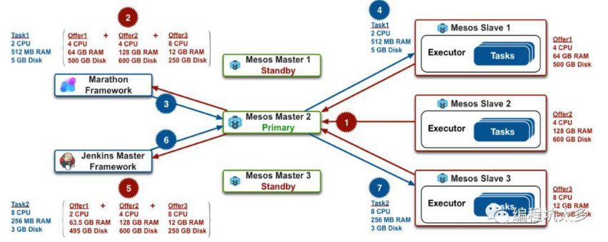

# jenkins

1. 理论
2. 实战
3. 总结
4. 升华

## 理论

步骤：

1. 开发人员提交代码到 git
2. 触发 jenkins 操作
3. jenkins 将代码编译、验证
4. 将代码封装在 docker 镜像并上传至 docker 仓库
5. jenkins 向 marathon 发送部署请求，marathon 完成相应部署
6. 进行集成测试
7. 集成测试通过，触发研发环境部署
8. 进行集成测试
9. 供用户访问

## 实战

基于 mesos 实践：

环境准备：

- mesos-slave1: 4CPU-64GBRAM-500GB DISK
- mesos-slave2: 4CPU-128GBRAM-600GB DISK
- mesos-slave3: 8CPU-12GBRAM-250GB DISK

步骤说明：

1. 3 台机器向 mesos master 发送请求，注册成为 mesos slave 节点
2. 向 marathon 发送请求启动容器，容器占用 2 CPU－512M RAM-5GB DISK
3. marathon 向 mesos 发送请求，请求启动相应任务
4. mesos 计算后，将 marathon 发送的任务启动在 slave1 节点上，任务完成
5. 向 jenkins 发送请求执行任务，任务需要占用 8 CPU－256M RAM－5GB DISK
6. jenkins 向 mesos 发送请求，请求启动相应任务
7. mesos 计算后，将 jenkins 发送的任务启动在 slave3 节点上，任务完成

Jenkins Pipine：

