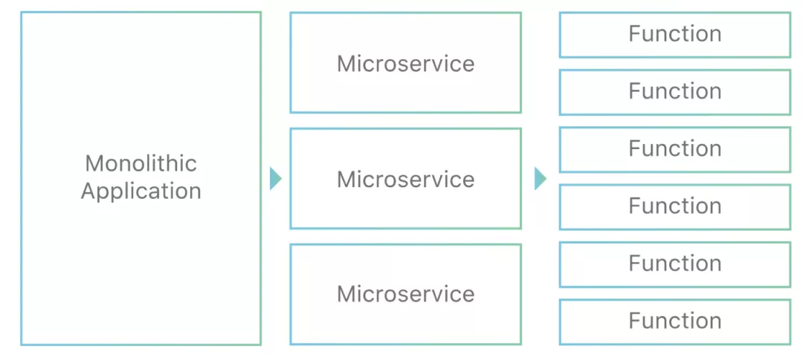

# 目录

1. 单体架构
2. SOA架构
3. 微服务架构
4. [架构定义理解](#架构定义理解)
5. [参考](#参考)
6. [架构师的成长](#架构师的成长)
7. [Serverless](#Serverless)

软件架构是一个包含各种组件的生态系统，这些组件包括Web服务器、应用服务器、数据库、文件存储、通讯层，它们彼此存在关系。系统架构的目标是解决利益相关者的关注点。

>利益相关者的关注点？很抽象，是不是？出自《软件系统架构：使用视点和视角与利益相关者合作》一书，具体意义会在下一篇《架构定义理解》中谈及。

## 单体架构

简单架构图示例：

很久以前，我们去公司面试时，面试官通常会让我们简要介绍下软件设计中的三层设计模型（表示层、业务逻辑处理层、数据访问层）：

- **表示层：** 通常理解为用于和用户交互的视图层；
- **业务逻辑处理层：** 用户提交请求，经过业务逻辑层处理后，对用户请求作出响应；
- **数据库访问层：** 主要用于操作数据库。

尽管在软件设计过程中，架构师或者程序设计者遵守了流行一时的经典的三层模型，但由于并未按照业务场景进行划分，使得最终的系统应用将所有的业务场景的表示层、业务逻辑处理层、数据访问层放在一个项目中，然后经过编译、打包并部署到一台服务器上。

这种架构(Monolithic)适用于用户业务不复杂、访问量较小的时候，甚至可以将应用服务、数据库、文件服务器部署在一台服务器上。但随着用户业务场景变得越来越复杂，单体架构的局限性就很快暴露出来了，主要体现在如下几方面：

- ***开发效率低：*** 开发人员在一个项目改代码，代码冲突不断
- ***代码维护难：*** 代码功能耦合在一起，新人不知道从何下手
- ***测试难度大：*** 随着系统代码量的剧增，当修改应用程序或者新增需求时，测试难度成指数级增长
- ***扩展性不够：*** 随着用户访问量增加，单体应用的并发能力有限
- ***稳定性不高：*** 一个微不足道的小问题，可以导致整个应用挂掉
- ***部署效率低：*** 构建时间长，任何小修改必须重新构建整个项目，这个过程往往很长；

当然也有优点：

- 开发简单直接，集中式管理，基本不会重复开发
- 功能都在本地，没有分布式的管理开销和调用开销

## SOA架构

SOA(Service Oriented Architecture)是一种粗粒度、松耦合服务架构，服务之间通过简单、精确定义的接口进行通讯，不涉及底层编程接口和通讯模型。SOA可以看作是B/S模型、XML（标准通用标记语言的子集）/WebService技术之后的自然延伸。

**主要优点：**

- 把模块（即服务）拆分，使用接口通信，降低模块之间的耦合度；
- 把项目拆分成若干个子项目，不同的团队负责不同的子项目；
- 增加功能时只需要再增加一个子项目，调用其它系统的接口就可以；
- 可以灵活的进行分布式部署。

**主要缺点：**

- 和单体架构相比，增加了系统复杂度，系统整体性能有较大影响；
- 多服务数据通信协议之间转换过程复杂，容易造成ESB(Enterprise Service Bus)性能瓶颈。

## 微服务架构

微服务(MicroServices)的概念是 Martin Flower 在2014年写的一篇论文《MicroServices》中提出来的。

**主要特点：**

- 每个服务按照业务划分；
- 服务之间通过轻量级API调用；
- 可以使用不同语言开发；
- 可以使用不同的数据存储技术；
- 可独立部署，服务之间互相不影响；
- 可针对用户访问流量大的服务单独扩展，从而能够节约资源；
- 管理自动化。

**主要挑战：**

- 微服务粒度大小难以划分，需要设计人员对业务有很好的掌握；
- 分布式复杂性，主要体现在分布式事务、网络延迟、系统容错等问题解决难度较大；
- 微服务之间通信成本较高，对微服务之间网络稳定性、通信速度要求较高；
- 由于微服务数量较大，运维人员运维、部署有较大的挑战。

## 架构定义理解

先引入一句话：**设计系统的组织，其产生的设计和架构等价于组织间的沟通结构**。下面是English原文：

Organizations which design systems[...] are constrained to produce designs which are copies of the communication structures of these organizations.

嗯，很多朋友应该已经看出来了，这不就是大名鼎鼎的 `Conway's law（康威定律）` 吗？没错，你们都很厉害。

>就我自己来说，康威定律，虽早有耳闻，自认为知其义，但叩问灵魂，却是从来没有真正的理解过。

## 架构师的成长

>很多有多年工作经验的程序员，在公司中早已成为能独当一面的技术老大哥，但是却始终得不到晋升，出去找工作也已碰壁居多。撇开职场因素，我认为，问题是出在 `定位` 和 `策略` 上。

## 参考

# ***\*架构演进\****

网站的架构不是一成不变的，随着新功能的集成，用户量的增加，原有的架构不能高效地解决问题时，就需要进行一次***\*架构升级\****！原则上是为了满足现有系统能够正确高效运行的需求。

  正因为系统架构有着不可避免的***\*变化\****性，所以架构师通常被要求能顾设计出高性能，高可用，高可靠，***\*高可扩展\****的系统架构！当然，这几个指标有些是互为逆命题的：比如高性能，追求更快的响应速度，而为了实现其它指标，系统中自然会加入一些特定的代码或配置，这对性能难免产生不利影响！因此，***\*平衡\****是关键（balence也是灭霸同志一生的追求）。

  好的架构师通常都需要***\*经验\****。普通程序员，靠自己是很难获得这样的经验的，那么从大师的经验中学习，就成了最好的替代品！这就相当于张无忌捡到了斗酒僧的***\*九阳真经\****，以此为据，自己修炼，一样成为高手！

  了解架构演变的过程，就相当于是了解了总纲，往后我们学习的各个知识点都能在这里找到根源，因此，第一章，非它莫属！

## ***\*最初\****

 

***\*架构演变第一步：物理分离webserver和\*******\*数据库\****

  最开始，由于某些想法，于是在互联网上搭建了一个网站，这个时候甚至有可能主机都是租借的，但由于这篇文章我们只关注架构的演变历程，因此就假设这个时候已经是托管了一台主机，并且有一定的带宽了，这个时候由于网站具备了一定的特色，吸引了部分人访问，逐渐你发现系统的压力越来越高，响应速度越来越慢，而这个时候比较明显的是数据库和应用互相影响，应用出问题了，数据库也很容易出现问题，而数据库出问题的时候，应用也容易出问题，于是进入了第一步演变阶段：将应用和数据库从物理上分离，变成了两台机器，这个时候技术上没有什么新的要求，但你发现确实起到效果了，系统又恢复到以前的响应速度了，并且支撑住了更高的流量，并且不会因为数据库和应用形成互相的影响。

  看看这一步完成后系统的图示：

  

  这一步架构演变对技术上的知识体系基本没有要求。

***\*架构演变第二步：增加页面缓存\****

  好景不长，随着访问的人越来越多，你发现响应速度又开始变慢了，查找原因，发现是访问数据库的操作太多，导致数据连接竞争激烈，所以响应变慢，但数据库连接又不能开太多，否则数据库机器压力会很高，因此考虑采用缓存机制来减少数据库连接资源的竞争和对数据库读的压力，这个时候首先也许会选择采用squid 等类似的机制来将系统中相对静态的页面（例如一两天才会有更新的页面）进行缓存（当然，也可以采用将页面静态化的方案），这样程序上可以不做修改，就能够很好的减少对webserver的压力以及减少数据库连接资源的竞争，OK，于是开始采用squid来做相对静态的页面的缓存。

  看看这一步完成后系统的图示：

  

  这一步涉及到了这些知识体系：前端页面缓存技术，例如squid，如想用好的话还得深入掌握下squid的实现方式以及缓存的失效算法等。

  ***\*前端性能优化之缓存技术\*******\*：\****https://www.jianshu.com/p/f4dbaaebe902

***\*架构演变第三步：增加页面片段缓存\****

  增加了squid做缓存后，整体系统的速度确实是提升了，webserver的压力也开始下降了，但随着访问量的增加，发现系统又开始变的有些慢了，在尝到了squid之类的动态缓存带来的好处后，开始想能不能让现在那些动态页面里相对静态的部分也缓存起来呢，因此考虑采用类似ESI之类的页面片段缓存策略，OK，于是开始采用ESI来做动态页面中相对静态的片段部分的缓存。

  看看这一步完成后系统的图示：

  

  这一步涉及到了这些知识体系：页面片段缓存技术，例如ESI等，想用好的话同样需要掌握ESI的实现方式等；

  https://blog.csdn.net/zshake/article/details/50659873

***\*架构演变第四步：数据缓存\****

  在采用ESI之类的技术再次提高了系统的缓存效果后，系统的压力确实进一步降低了，但同样，随着访问量的增加，系统还是开始变慢，经过查找，可能会发现系统中存在一些重复获取数据信息的地方，像获取用户信息等，这个时候开始考虑是不是可以将这些数据信息也缓存起来呢，于是将这些数据缓存到本地内存，改变完毕后，完全符合预期，系统的响应速度又恢复了，数据库的压力也再度降低了不少。

  看看这一步完成后系统的图示：

  

  这一步涉及到了这些知识体系：缓存技术，包括像Map数据结构、缓存算法、所选用的框架本身的实现机制等。

***\*架构演变第五步： 增加webserver\****

  好景不长，发现随着系统访问量的再度增加，webserver机器的压力在高峰期会上升到比较高，这个时候开始考虑增加一台webserver，这也是为了同时解决可用性的问题，避免单台的webserver down机的话就没法使用了，在做了这些考虑后，决定增加一台webserver，增加一台webserver时，会碰到一些问题，典型的有：

  1、如何让访问分配到这两台机器上，这个时候通常会考虑的方案是Apache自带的负载均衡方案，或LVS这类的软件负载均衡方案；

  2、如何保持状态信息的同步，例如用户session等，这个时候会考虑的方案有写入数据库、写入存储、cookie或同步session信息等机制等；

  3、如何保持数据缓存信息的同步，例如之前缓存的用户数据等，这个时候通常会考虑的机制有缓存同步或分布式缓存；

  4、如何让上传文件这些类似的功能继续正常，这个时候通常会考虑的机制是使用共享文件系统或存储等；

  在解决了这些问题后，终于是把webserver增加为了两台，系统终于是又恢复到了以往的速度。

  看看这一步完成后系统的图示：

  

  这一步涉及到了这些知识体系：负载均衡技术（包括但不限于硬件负载均衡、软件负载均衡、负载算法、Linux转发协议、所选用的技术的实现细节等）、主备技术（包括但不限于ARP欺骗、linux heart-beat等）、状态信息或缓存同步技术（包括但不限于Cookie技术、UDP协议、状态信息广播、所选用的缓存同步技术的实现细节等）、共享文件技术（包括但不限于NFS等）、存储技术（包括但不限于存储设备等）。

***\*架构演变第六步：分库\****

  享受了一段时间的系统访问量高速增长的幸福后，发现系统又开始变慢了，这次又是什么状况呢，经过查找，发现数据库写入、更新的这些操作的部分数据库连接的资源竞争非常激烈，导致了系统变慢，这下怎么办呢，此时可选的方案有数据库集群和分库策略，集群方面像有些数据库支持的并不是很好，因此分库会成为比较普遍的策略，分库也就意味着要对原有程序进行修改，一通修改实现分库后，不错，目标达到了，系统恢复甚至速度比以前还快了。

  看看这一步完成后系统的图示：

  

  这一步涉及到了这些知识体系：这一步更多的是需要从业务上做合理的划分，以实现分库，具体技术细节上没有其他的要求；

  但同时随着数据量的增大和分库的进行，在数据库的设计、调优以及维护上需要做的更好，因此对这些方面的技术还是提出了很高的要求的。

***\*架构演变第七步：分表、DAL和分布式缓存\****

  随着系统的不断运行，数据量开始大幅度增长，这个时候发现分库后查询仍然会有些慢，于是按照分库的思想开始做分表的工作，当然，这不可避免的会需要对程序进行一些修改，也许在这个时候就会发现应用自己要关心分库分表的规则等，还是有些复杂的，于是萌生能否增加一个通用的框架来实现分库分表的数据访问，这个在ebay的架构中对应的就是DAL，这个演变的过程相对而言需要花费较长的时间，当然，也有可能这个通用的框架会等到分表做完后才开始做，同时，在这个阶段可能会发现之前的缓存同步方案出现问题，因为数据量太大，导致现在不太可能将缓存存在本地，然后同步的方式，需要采用分布式缓存方案了，于是，又是一通考察和折磨，终于是将大量的数据缓存转移到分布式缓存上了。

  看看这一步完成后系统的图示：

  

  这一步涉及到了这些知识体系：分表更多的同样是业务上的划分，技术上涉及到的会有动态hash算法、consistent hash算法等；

  DAL涉及到比较多的复杂技术，例如数据库连接的管理（超时、异常）、数据库操作的控制（超时、异常）、分库分表规则的封装等；

***\*架构演变第八步：增加更多的webserver\****

  在做完分库分表这些工作后，数据库上的压力已经降到比较低了，又开始过着每天看着访问量暴增的幸福生活了，突然有一天，发现系统的访问又开始有变慢的趋势了，这个时候首先查看数据库，压力一切正常，之后查看webserver，发现apache阻塞了很多的请求，而应用服务器对每个请求也是比较快的，看来是请求数太高导致需要排队等待，响应速度变慢，这还好办，一般来说，这个时候也会有些钱了，于是添加一些webserver服务器，在这个添加 webserver服务器的过程，有可能会出现几种挑战：

  1、Apache的软负载或LVS软负载等无法承担巨大的web访问量（请求连接数、网络流量等）的调度了，这个时候如果经费允许的话，会采取的方案是购买硬件负载，例如F5、Netsclar、Athelon之类的，如经费不允许的话，会采取的方案是将应用从逻辑上做一定的分类，然后分散到不同的软负载集群中；

  2、原有的一些状态信息同步、文件共享等方案可能会出现瓶颈，需要进行改进，也许这个时候会根据情况编写符合网站业务需求的分布式文件系统等；

  在做完这些工作后，开始进入一个看似完美的无限伸缩的时代，当网站流量增加时，应对的解决方案就是不断的添加webserver。

  看看这一步完成后系统的图示：

  

  这一步涉及到了这些知识体系：到了这一步，随着机器数的不断增长、数据量的不断增长和对系统可用性的要求越来越高，这个时候要求对所采用的技术都要有更为深入的理解，并需要根据网站的需求来做更加定制性质的产品。

 

***\*Squid\**** 

  Squid是一个高性能的代理缓存服务器，Squid支持FTP、gopher、HTTPS和[HTTP协议](https://baike.baidu.com/item/HTTP协议)。和一般的代理缓存软件不同，Squid用一个单独的、非模块化的、I/O驱动的进程来处理所有的客户端请求。

  1．Squid是什么？

  Squid是一种用来缓冲Internet数据的软件。它是这样实现其功能的，接受来自人们需要下载的目标（object）的请求并适当地处理这些请求。也就是说，如果一个人想下载一web页面，他请求Squid为他取得这个页面。Squid随之连接到远程服务器（比如：http://squid.nlanr.net/）并向这个页面发出请求。然后，Squid显式地聚集数据到客户端机器，而且同时复制一份。当下一次有人需要同一页面时，Squid可以简单地从磁盘中读到它，那样数据迅即就会传输到客户机上。当前的Squid可以处理HTTP，FTP，GOPHER，SSL和WAIS等协议。但它不能处理如POP，NNTP，RealAudio以及其它类型的东西。

  2．Internet缓冲的一些概念

  你可能会想到一些问题：缓冲有多大的用处？什么时候目标（object）应该或者不应该被缓冲？例如，缓冲信用卡号码是完全不适合的，脚本文件的执行结果在远程服务器端，站点经常更新（像www.cnn.com）或者甚至站点不允许缓冲，这些情况也都是不适合缓冲的。Squid处理各种情况是不错的(当然,这需要远程站点按标准形式工作)。可执行的cgi-bin脚本文件不被缓冲，返回正确页眉的页面是在一段限制了的时间内被缓冲，而且你可以规定特殊的规则以确定什么是可以或不可以被缓冲的，还有缓冲的时间为多长。谈到缓冲的用处有多大，这要看Internet的容量大小，各有不同。对于小型的缓冲区（几转磁盘空间）来说，返回值非常高（达到25%）。这个空间缓冲经常访问的站点，如netscape，cnn和其它一些类似情况的站点。如果你增加一倍缓冲的磁盘空间，但你不会成倍增加你的命中率。这是因为你开始缓冲网络中剩余部分时，这些通常时很大的而且很少被访问。一个非常大的高速缓冲区，有20转左右，可能返回值仍小于50%，除非你对保存数据的时间长短经常改变（一般地你不要分配20转的磁盘空间，因为页面很快就会过时，应该被删除掉）。我们在这里说的目标（object）指的是可保存的web页面或其它类似的可下载页面（ftp文件或目录内容也称为目标（object））。

  3．Squid运行在什么系统上？

  Squid可运行在大多数Unix和OS/2版本的系统之上，已知的可工作的有：Windows,AIX，Digital Unix，FreeBSD，HP-UX，Irix，Linux，NetBSD，Nextstep，SCO，Solaris

  4.Squid的下载和获取

  squid在诸多unix like系统上都有软件库的提供，比如在ubuntu可以使用apt install squid进行安装，也可以到squid的官网直接下载二进制的编译好的软件包，下载地址

  https://baike.baidu.com/item/squid/8915511?fr=aladdin

 

 

 

***\*多租户技术\****

  多租户技术（英语：multi-tenancy technology）或称多重租赁技术，是一种[软件架构](https://baike.baidu.com/item/软件架构/7485920)技术，它是在探讨与实现如何于多用户的环境下共用相同的系统或程序组件，并且仍可确保各用户间数据的隔离性。

  多租户简单来说是指一个单独的实例可以为多个组织服务。多租户技术为共用的数据中心内如何以单一系统架构与服务提供多数客户端相同甚至可定制化的服务，并且仍然可以保障客户的数据隔离。一个支持多租户技术的系统需要在设计上对它的数据和配置进行虚拟分区，从而使系统的每个租户或称组织都能够使用一个单独的系统实例，并且每个租户都可以根据自己的需求对租用的系统实例进行个性化配置。

  多租户技术可以实现多个租户之间共享系统实例，同时又可以实现租户的系统实例的个性化定制。通过使用多租户技术可以保证系统共性的部分被共享，个性的部分被单独隔离。通过在多个租户之间的资源复用，运营管理维护资源，有效节省开发应用的成本。而且，在租户之间共享应用程序的单个实例，可以实现当应用程序升级时，所有租户可以同时升级。同时，因为多个租户共享一份系统的核心代码，因此当系统升级时，只需要升级相同的核心代码即可。

 

***\*高并发\****

***\*在开发高并发系统时有三把利器用来保护系统：缓存、降级和限流\****。

***\*缓存\****

缓存比较好理解，在大型高并发系统中，如果没有缓存数据库将分分钟被爆，系统也会瞬间瘫痪。使用缓存不单单能够提升系统访问速度、提高并发访问量，也是保护数据库、保护系统的有效方式。大型网站一般主要是“读”，缓存的使用很容易被想到。在大型“写”系统中，缓存也常常扮演者非常重要的角色。比如累积一些数据批量写入，内存里面的缓存队列（生产消费），以及HBase写数据的机制等等也都是通过缓存提升系统的吞吐量或者实现系统的保护措施。甚至消息中间件，你也可以认为是一种分布式的数据缓存。

***\*降级\****

服务降级是当服务器压力剧增的情况下，根据当前业务情况及流量对一些服务和页面有策略的降级，以此释放服务器资源以保证核心任务的正常运行。降级往往会指定不同的级别，面临不同的异常等级执行不同的处理。根据服务方式：可以拒接服务，可以延迟服务，也有时候可以随机服务。根据服务范围：可以砍掉某个功能，也可以砍掉某些模块。总之服务降级需要根据不同的业务需求采用不同的降级策略。主要的目的就是服务虽然有损但是总比没有好。

***\*限流\****

限流可以认为服务降级的一种，限流就是限制系统的输入和输出流量已达到保护系统的目的。一般来说系统的吞吐量是可以被测算的，为了保证系统的稳定运行，一旦达到的需要限制的阈值，就需要限制流量并采取一些措施以完成限制流量的目的。比如：延迟处理，拒绝处理，或者部分拒绝处理等等。

参考：https://www.cnblogs.com/haoxinyue/p/6792309.html

 

 

 

## [Serverless](https://www.kubernetes.org.cn/8687.html)

> Serverless是一种构建和管理基于微服务架构的完整流程，允许你在服务部署级别而不是服务器部署级别来管理你的应用部署。
>
> 它与传统架构的不同之处在于，完全由第三方管理，由事件触发，存在于无状态（Stateless）、暂存（可能只存在于一次调用的过程中）计算容器内。构建无服务器应用程序意味着开发者可以专注在产品代码上，而无须管理和操作云端或本地的服务器或运行时。
>
> Serverless真正做到了部署应用无需涉及基础设施的建设，自动构建、部署和启动服务。

**微服务的概念非常适合Serverless功能的结构，可以轻松实现不同服务在部署和运行时隔离。**在数据存储方面，使用诸如DynamoDB之类的数据库，还使得每个微服务都能拥有独立的数据库，并在需要独立扩展它们时变得更加容易。

在我们深入研究细节之前，请考虑微服务对于你的特定项目和团队而言，其好处是否大于其缺点。 请不要因为“微服务是趋势”，就要必须选择它。[单体架构(Monolith)](https://www.martinfowler.com/bliki/MonolithFirst.html)也有他的适用场景。

### Serverless中微服务的优势

**1. 选择性地可伸缩性和并发性**

Serverless功能使管理应用程序的并发性和可伸缩性变得容易。在微服务架构中，我们充分利用了这一点，每个微服务都可以根据需要具有自己的并发/可伸缩性设置。

这是有价值的：减轻DDoS攻击的可能性，减少无法控制的云账单的财务风险，更好地分配资源等等。

**2. 细粒度的资源分配**

通过选择性的可伸缩性和并发性，可以对资源分配优先级进行详细控制。

每个（微）服务可以根据其需求和目的具有不同级别的内存分配。面向客户的服务可以分配更高的内存，因为它将有助于缩短执行时间，提高响应速度。可以通过[优化的内存设置](https://medium.com/hackernoon/lower-your-aws-lambda-bill-by-increasing-memory-size-yep-e591ae499692)来部署对延迟不敏感的内部服务。

存储机制也是如此，DynamoDB或Aurora Serverless等数据库可以根据（微）服务的需求而具有不同级别的容量分配。

**3. 松耦合**

这是微服务的基本属性，这样它可以使具有不同用途的系统组件更容易[解耦](https://dashbird.io/blog/using-api-gateway-to-decouple-and-scale-serverless-architectures/)。

**4. 支持多运行时环境**

Serverless功能配置，部署和执行的简便性为基于多个运行时的系统提供了可能性。

尽管Node.js是后端Web应用程序中最流行的技术之一，但它不可能成为每个任务的最佳工具。但，对于数据密集型任务，预测分析和任何形式的机器学习，Python可能会成为你的选择。专用平台（例如[SageMaker](https://aws.amazon.com/sagemaker/)）则更适合于大型项目。

借助Serverless基础架构，在运维方面，你无需再花额外的精力就可以为常规后端项目选择Node.js，为数据密集型选择Python。当然，这将在代码维护和团队管理方面增加一些工作。

**5. 开发团队的独立性**

不同的开发人员或团队可以在各自的（微）服务上工作，修复错误，扩展功能等。

[AWS SAM](https://aws.amazon.com/serverless/sam/)，[Serverless](https://www.serverless.com/)之类的工具使得在操作方面也具有更大的独立性。 [AWS CDK constructs](https://docs.aws.amazon.com/cdk/latest/guide/constructs.html) 可实现更大的独立性，而无需牺牲更高级别的质量和运维标准。

### Serverless中微服务的缺点

**1. 难以监视和调试**

Serverless带来的许多挑战中，监视和调试是最有难度的。因为计算和存储系统分散在许多不同节点中，更不用说缓存等的其他服务了。

但是，有专业平台可以解决所有这些问题。

**2. 可能会经历更多的冷启动**

> 调用功能时，Lambda会检查microVM是否已激活。如果有空闲的microVM可用，它将用于服务新的传入请求。在这种特殊情况下，没有启动时间，因为microVM已经启动并且代码包已在内存中。这称为 热启动。
>
> 相反的方法-必须从头开始提供新的microVM来满足传入的请求-被称为 冷启动。

**当FaaS(Function as a Services)平台（例如Lambda）需要启动新的虚拟机来运行功能代码时，就会发生[冷启动](https://dashbird.io/knowledge-base/aws-lambda/cold-starts/?utm_source=dashbird-blog&utm_medium=article&utm_campaign=well-architected&utm_content=microservices-in-faas)。如果你的应用对延迟很敏感，则它们可能会出现问题，因为冷启动会在总启动时间中增加几百毫秒到几秒钟。**

因为在完成一个请求后，FaaS平台通常会将microVM闲置一段时间，然后在10-60分钟后关闭。因此，函数执行的频率越高，microVM越有可能运行传入的请求（避免冷启动）。

当我们将应用程序分散在数百或数千个（微）服务中时，我们还可能分散每个服务的调用时间，从而导致每个功能的调用频率降低，可能会经历更多的冷启动。

**3. 其他缺点**

微服务概念本身还具有其他固有的缺点。这些并不是与Serverless固有的联系。尽管如此，每个采用这种架构的团队都应努力降低其潜在的风险和成本：

- 确定服务边界并非易事
- 更广泛的攻击面
- 服务编排开销
- 同步计算和存储并不容易

### Serverless微服务的挑战和最佳实践

**1. Serverless中微服务应该是多大**

> 微服务（MicroService）是软件架构领域业另一个热门的话题。如果说微服务是以专注于单一责任与功能的小型功能块为基础，利用模组化的方式组合出复杂的大型应用程序，那么我们还可以进一步认为Serverless架构可以提供一种更加“代码碎片化”的软件架构范式，我们称之为Function as a Services（FaaS）。
>
> 而所谓的“函数”（Function）提供的是相比微服务更加细小的程序单元。例如，可以通过微服务代表为某个客户执行所有CRUD操作所需的代码，而FaaS中的“函数”可以代表客户所要执行的每个操作：创建、读取、更新，以及删除。当触发“创建账户”事件后，将通过AWS Lambda函数的方式执行相应的“函数”。从这一层意思来说，我们可以简单地将Serverless架构与FaaS概念等同起来。

在Serverless中，经常会将“Function as a Services（FaaS）”的概念与你所选择的编程语言中的函数语句混淆。

我们正在进入一个无法画出完美界限的领域，但是[经验](https://dev.to/rehanvdm/comment/121pa)表明，使用非常小的Serverless功能并不是一个好主意。

你应该记住的一件事是，当决定将（微）服务分拆为单独的功能时，你将不得不应对[Serverless困境](https://dashbird.io/knowledge-base/well-architected/serverless-trilemma/?utm_source=dashbird-blog&utm_medium=article&utm_campaign=well-architected&utm_content=microservices-in-faas)。只要有可能，将相关逻辑保持在单个功能中就会有很多好处。

决策过程也应考虑到拥有单独的微服务的优势。

如果我分拆这个微服务，

- 这将使不同的团队独立工作吗？
- 我可以从细粒度的资源分配或选择性可伸缩性功能中受益吗？

如果不是，则应该考虑将该服务与所需的组件等捆绑在一起。

**2. 松耦合你的架构**

通过[组成Serverless功能](https://dashbird.io/knowledge-base/well-architected/serverless-functions-composition-strategies/?utm_source=dashbird-blog&utm_medium=article&utm_campaign=well-architected&utm_content=microservices-in-faas)来协调微服务的方法有很多。

当需要同步通信时，可以进行直接调用（即[AWS Lambda RequestResponse调用方法](https://dashbird.io/knowledge-base/aws-lambda/invocation-methods-and-integrations/?utm_source=dashbird-blog&utm_medium=article&utm_campaign=well-architected&utm_content=microservices-in-faas#synchronous)），但这会导致高度耦合的架构。更好的选择是使用[Lambda Layers](https://dashbird.io/knowledge-base/aws-lambda/lambda-layers/?utm_source=dashbird-blog&utm_medium=article&utm_campaign=well-architected&utm_content=microservices-in-faas)或[HTTP API](https://docs.aws.amazon.com/apigateway/latest/developerguide/http-api.html)，这使得以后可以在不中断客户端请求的情况下，修改或迁移服务成为可能。

对于异步通信，我们有几种选择：消息队列（[SQS](https://dashbird.io/knowledge-base/sqs/intro-to-sqs-queue-service/)），主题通知（[SNS](https://aws.amazon.com/sns/)），[Event Bridge](https://dashbird.io/knowledge-base/event-bridge/intro-to-event-bridge/)或者[DynamoDB Streams](https://dashbird.io/knowledge-base/dynamodb/operations-and-data-access/?utm_source=dashbird-blog&utm_medium=article&utm_campaign=well-architected&utm_content=microservices-in-faas#streams)。

**3. 组件隔离**

理想情况下，微服务不应将实现细节暴露给用户。

诸如Lambda之类的Serverless平台已经提供了隔离功能的API。但这本身就会导致实现细节泄漏，理想情况下，我们将在功能之上添加一个不可知的HTTP API层，以使其真正隔离。

**4. 使用并发限制策略**

为了减轻DDoS攻击，在使用AWS API Gateway等服务时，请确保为每个面向公众的终端节点[设置单独的并发限制策略](https://dev.to/theburningmonk/the-api-gateway-security-flaw-you-need-to-pay-attention-to-44)。

此类服务在云平台中具有针对全局并发配额。如果你没有基于端点的限制，则攻击者只需将一个端点作为目标即可耗尽你的资源配额并使整个系统瘫痪。

### 总结

无论你是迁移旧系统还是从头开始构建某些产品，确保其**按预期顺利运行**都是一个持续的挑战。在本文中，我们研究了Serverless的优点和缺点，Serverless的微服务挑战和最佳实践等等。

译文链接：https://dzone.com/articles/microservices-and-serverless-winning-strategies-an

2019 年，O’Reilly 对 1500 名 IT 专业人员的[调查中](https://www.oreilly.com/radar/oreilly-serverless-survey-2019-concerns-what-works-and-what-to-expect/)，有 40％ 的受访者在采用 Serverless 架构的组织中工作。2020 年 [DataDog 调查](https://www.datadoghq.com/state-of-serverless/)显示，现在有超过 50％ 的 AWS 用户正在使用 Serverless 架构的 AWS Lambda。

Serverless 正在成为主流，于是就诞生了下面这幅图，从单体应用的管理到微服务应用的管理再到函数的管理。

Serverless 到目前为止还没有一个精准定义。Martin Fowler 在个人博客上有一篇[《Serverless Architectures》文章](https://martinfowler.com/articles/serverless.html)，其对 Serverless 的的定义分成了 BaaS 或 FaaS。

Baas 是全称是 Backend-as-a-Service，后端即服务，FaaS 的全称是 Function-as-a-Service，函数即服务。

今天我们来聊聊 FaaS。这是维基百科对 FaaS 的定义:

> 函数即服务（FaaS）是一类云计算服务，它提供了一个平台，使客户可以开发，运行和管理应用程序功能，而无需构建和维护通常与开发和启动应用程序相关的基础架构。遵循此模型构建应用程序是实现 Serverless 架构的一种方法，通常在构建微服务应用程序时使用。

对于 Python、JavaScript 这种天生支持 Lambda 的开发语言，和 FaaS 简直是完美结合。[Serverless Framework 的调研报告](https://www.serverless.com/blog/serverless-by-the-numbers-2018-data-report/)也很好地说明了这一点。NodeJS、Python 是 FaaS 使用率前二的语言。