# 设计模式


## 目录

1. [设计原则](#设计原则)
2. 创建型
   - [单例(Singleton)](#1.单例)
   - [工厂(Factory)](#2.工厂)
3. 行为型
   - [责任链(Chain Of Responsibility)](#1. 责任链)
   - [命令(Command)](#2.命令)
   - [解释器(Interpreter)](#3.解释器)
   - [迭代器(Iterator)](#4.迭代器)
   - [中介者(Mediator)](#5.中介者)
   - [备忘录(Memento)](#6.备忘录)
   - [观察者(Observer)](#7.观察者)
   - [状态(State)](#8.状态)
   - [策略(Strategy)](#9.策略)
   - [模板方法(Template Method)](#10.模板方法)
   - [访问者(Visitor)](#11.访问者)
   - [空对象(Null)](#12.空对象)
4. 结构型
   - [适配器(Adapter)](#1.适配器)
   - [桥接(Bridge)](#2.桥接)
   - [组合(Composite)](#3.组合)
   - [装饰(Decorator)](#4.装饰)
   - [外观(Facade)](#5.外观)
   - [享元(Flyweight)](#6.享元)
   - [代理(Proxy)](#7. 代理)


**知识点：**

- ★★☆ 设计模式的作用。
- ★★★ 手写单例模式，特别是双重检验锁以及静态内部类。
- ★★★ 手写工厂模式。
- ★★★ 理解 MVC，结合 SpringMVC 回答。
- ★★★ 理解代理模式，结合 Spring 中的 AOP 回答。
- ★★★ 分析 JDK 中常用的设计模式，例如装饰者模式、适配器模式、迭代器模式等。


**总结：**

1. 设计模式作用：**复用**
2. 创建型：单例，工厂


## 设计原则

> SOLID

| **简写** | **全拼**                             | **中文翻译** |
| -------- | ------------------------------------ | ------------ |
| SRP      | The  Single Responsibility Principle | 单一责任原则 |
| OCP      | The  Open Closed Principle           | 开放封闭原则 |
| LSP      | The  Liskov Substitution Principle   | 里氏替换原则 |
| ISP      | The  Interface Segregation Principle | 接口分离原则 |
| DIP      | The  Dependency Inversion Principle  | 依赖倒置原则 |

### 单一职责(Single Responsibility Principle)

**定义：**

There should never be more than one reason for a class to change.

应该有且仅有一个原因引起类的变更

**示例：**

Role-Based Access Control

用户信息抽取成Business Object

用户行为抽取成Business Logic

**实现：**

一个职责一个接口

一个方法一个职责

类的设计尽量做到只有一个原因引起变化

**优点：**

类的复杂性降低

可读性提高

可维护性提高

变更风险降低

### 里氏替换(Liskov Substitution Principle)

**两种定义：**

通俗地讲，只要父类能出现的地方子类就可以出现，而且替换为子类不会产生任何问题，使用者不需要知道是父类还是子类。但是，反过来就不行，子类出现的地方，父类未必适应。

**实现：**

Ø 子类必须完全实现父类的方法

Ø 子类可以有自己的个性，但是实际使用中尽量避免

Ø 覆盖或实现父类的方法时输入参数可以被放大

webservice：契约优先，先定义出WSDL接口，制定好双方开发协议，再各自实现

Design by Contract（契约设计），就是父类或接口

重载：子类重载（不是覆盖）父类的方法，表现自己的特征

如果父类的输入参数类型宽于子类的输入参数类型，会出现父类存在的地方，子类未必可以存在。因为调用者很可能进入子类的方法范畴。传递实现类会引起业务逻辑混乱，传递接口或超类

Ø 覆写或实现父类的方法时输出结果可以被缩小

实际项目中，每个子类对应不同的业务含义，使用父类作为参数，传递不同的子类完成不同的业务逻辑

### 依赖倒置(Dependence Inversion Principle)

**定义：**

每一个逻辑的实现都是由原子逻辑组成，不可分割的原子逻辑就是低层模块，原子逻辑的再组装就是高层模块。

抽象：接口或抽象类

细节：实现类

模块间的依赖通过抽象发生，实现类之间的依赖关系是通过接口或抽象类产生的

接口或抽象类不依赖于实现类

实现类依赖于接口或抽象类

即：面向接口编程(Object-Oriented Design)

**优点：**

减少类间耦合，提高系统稳定性

降低并行开发引起的风险

Test-Driven Development，测试驱动开发，JMock工具

提高代码可读性和可维护性

**实现（依赖的三种写法）：**

构造函数传递依赖对象

Setter方法传递依赖对象

接口声明依赖对象

**最佳实践：**

每个类尽量都有接口或抽象类

变量的声明类型尽量是接口或抽象类

任何类都不应该从具体类派生

尽量不要覆写基类的方法

结合里氏替换原则使用

### 接口隔离(Interface Segregation Principle)

**定义：**

Clients should not be forced to depend upon interfaces that they don't use. （客户端不应该依赖它不需要的接口。）

The dependency of one class to another one should depend on the smallest possible interface.（类间的依赖关系应该建立在最小的接口上。）

**最佳实践：**

Ø 保证接口的纯洁性：

接口要尽量小（但是首先必须满足单一职责原则）

接口要高内聚（减少public方法，提高内部处理能力）

定制服务

接口设计是有限度的

Ø 一个接口只服务于一个子模块或业务逻辑

Ø 通过业务逻辑压缩接口中的public方法，接口时常去回顾，尽量让接口达到“满身筋骨肉”，而不是“肥嘟嘟”的一大堆方法

Ø 已经被污染了的接口，尽量去修改，若变更的风险较大，则采用适配器模式进行转化处理

Ø 了解环境，拒绝盲从。每个项目或产品都有特定的环境因素，别看到大师是这样做的你就照抄。环境不同，接口拆分的标准就不同，深入了解业务逻辑，最好的接口设计就出自你的手中！

### 开闭(Open Closed Principle)

**定义：**

Software entities like classes, modules and functions should be open for extension but closed for modifications.（一个软件实体如类、模块和函数应该对扩展开放，对修改关闭）

一个软件实体应该通过扩展来实现变化，而不是通过修改已有的代码来实现变化

**开闭原则是最基础的一个原则，前五个原则就是指导设计的工具和方法，而开闭原则才是其精神领袖**

**其他常见原则**

除了上述的经典原则，在实际开发中还有下面这些常见的设计原则。

| **简写** | **全拼**                          | **中文翻译** |
| -------- | --------------------------------- | ------------ |
| LOD      | The  Law of Demeter               | 迪米特法则   |
| CRP      | The Composite Reuse Principle     | 合成复用原则 |
| CCP      | The Common Closure Principle      | 共同封闭原则 |
| SAP      | The Stable Abstractions Principle | 稳定抽象原则 |
| SDP      | The Stable Dependencies Principle | 稳定依赖原则 |

### 迪米特法则(Law of Demeter, LoD)

**定义：**

也称为最少知识原则(Least Knowledge Principle ,LKP)，一个对象应该对其他对象有最少的了解

**优点和最佳实践：**

类间解耦，只和朋友交流：

Ø 出现在成员变量、方法的输入输出参数中的类称为成员朋友类，而出现在方法体内部的类不属于朋友

Ø 类与类之间的关系是建立在类间的，而不是方法间，因此一个方法尽量不引入一个类中不存在的对象

Ø 朋友间有距离。是否可以再减少public方法和属性？

Ø 是自己的就是自己的。如果一个方法放在本类中，即不增加类间关系，也对本类不产生负面影响，就放置在本类中

Ø 谨慎使用Serializable

### 合成复用原则(Composite Reuse Principle)

尽量使用对象组合，而不是通过继承来达到复用的目的。

### 共同封闭原则(Common Closure Principle)

一起修改的类，应该组合在一起（同一个包里）。如果必须修改应用程序里的代码，我们希望所有的修改都发生在一个包里（修改关闭），而不是遍布在很多包里。

### 稳定抽象原则(Stable Abstractions Principle)

最稳定的包应该是最抽象的包，不稳定的包应该是具体的包，即包的抽象程度跟它的稳定性成正比。

### 稳定依赖原则(Stable Dependencies Principle)

包之间的依赖关系都应该是稳定方向依赖的，包要依赖的包要比自己更具有稳定性。


## 创建型

### 1.单例

**定义：**

Ensure a class has only one instance, and provide a global point of access to it.（确保某一个类只有一个实例，而且自行实例化并向整个系统提供这个实例。）

**类图：**


使用一个私有***构造函数***、一个私有***静态变量***以及一个公有***静态函数***来实现。

私有构造函数保证了不能通过构造函数来创建对象实例，只能通过公有静态函数返回唯一的私有静态变量。

**实现：**

1、***懒汉式***，线程不安全，但是延迟了实例化

```java
public class Singleton {

    private static Singleton uniqueInstance;

    private Singleton() {
    }

    public static Singleton getUniqueInstance() {
        if (uniqueInstance == null) {
            uniqueInstance = new Singleton();
        }
        return uniqueInstance;
    }
}
```

2、***饿汉式***，线程安全

```java
private static Singleton uniqueInstance = new Singleton();
```

3、***懒汉式***，线程安全

```java
public static synchronized Singleton getUniqueInstance() {
    if (uniqueInstance == null) {
        uniqueInstance = new Singleton();
    }
    return uniqueInstance;
}
```

4、***双重校验锁***，线程安全

考虑下面的实现，也就是只使用了一个 if 语句。在 uniqueInstance == null 的情况下，如果两个线程都执行了 if 语句，那么两个线程都会进入 if 语句块内。虽然在 if 语句块内有加锁操作，但是两个线程都会执行 uniqueInstance = new Singleton(); 这条语句，只是***先后***的问题，那么就会进行两次实例化。因此必须使用***双重校验锁***，也就是需要使用两个 if 语句：第一个 if 语句用来避免 uniqueInstance 已经被实例化之后的加锁操作，而第二个 if 语句进行了加锁，所以只能有一个线程进入，就不会出现 uniqueInstance == null 时两个线程同时进行实例化操作。

```java
if (uniqueInstance == null) {
    synchronized (Singleton.class) {
        uniqueInstance = new Singleton();
    }
}
```

uniqueInstance 只需要被实例化一次，之后就可以直接使用了。加锁操作只需要对实例化那部分的代码进行，只有当 uniqueInstance 没有被实例化时，才需要进行加锁。

双重校验锁先判断 uniqueInstance 是否已经被实例化，如果没有被实例化，那么才对实例化语句进行加锁。

```java
public class Singleton {

    private volatile static Singleton uniqueInstance;

    private Singleton() {
    }

    public static Singleton getUniqueInstance() {
        if (uniqueInstance == null) {
            synchronized (Singleton.class) {
                if (uniqueInstance == null) {
                    uniqueInstance = new Singleton();
                }
            }
        }
        return uniqueInstance;
    }
}
```

uniqueInstance 采用 ***volatile*** 关键字修饰也是很有必要的，`uniqueInstance = new Singleton();` 这段代码其实是分为三步执行：

1. 为 uniqueInstance 分配内存空间

2. 初始化 uniqueInstance

3. 将 uniqueInstance 指向分配的内存地址

但是由于 JVM 具有**指令重排**的特性，执行顺序有可能变成 1>3>2。指令重排在单线程环境下不会出现问题，但是在多线程环境下会导致一个线程获得还没有初始化的实例。例如，线程 T1 执行了 1 和 3，此时 T2 调用 getUniqueInstance() 后发现 uniqueInstance 不为空，因此返回 uniqueInstance，但此时 uniqueInstance 还未被初始化。

使用 ***volatile*** 可以禁止 JVM 的指令重排，保证在多线程环境下也能正常运行。

5、***静态内部类***

当 Singleton 类被加载时，静态内部类 SingletonHolder 没有被加载进内存。只有当调用 getUniqueInstance() 方法从而触发 SingletonHolder.INSTANCE 时 SingletonHolder 才会被加载，此时初始化 INSTANCE 实例，并且 JVM 能确保 INSTANCE 只被实例化一次。

这种方式不仅具有延迟初始化的好处，而且由 JVM 提供了对线程安全的支持。

```java
public class Singleton {

    private Singleton() {
    }

    private static class SingletonHolder {
        private static final Singleton INSTANCE = new Singleton();
    }

    public static Singleton getUniqueInstance() {
        return SingletonHolder.INSTANCE;
    }
}
```

6、***枚举实现***

```java
public enum Singleton {
    INSTANCE;

    private String objName;

    public String getObjName() {
        return objName;
    }

    public void setObjName(String objName) {
        this.objName = objName;
    }

    public static void main(String[] args) {
        // 单例测试
        Singleton firstSingleton = Singleton.INSTANCE;
        firstSingleton.setObjName("firstName");
        System.out.println(firstSingleton.getObjName());
        Singleton secondSingleton = Singleton.INSTANCE;
        secondSingleton.setObjName("secondName");
        System.out.println(firstSingleton.getObjName());
        System.out.println(secondSingleton.getObjName());

        // 反射获取实例测试
        try {
            Singleton[] enumConstants = Singleton.class.getEnumConstants();
            for (Singleton enumConstant : enumConstants) {
                System.out.println(enumConstant.getObjName());
            }
        } catch (Exception e) {
            e.printStackTrace();
        }
    }
}
```

输出结果：

  firstName
  secondName
  secondName
  secondName

该实现可以防止反射攻击。在其它实现中，通过 setAccessible() 方法可以将私有构造函数的访问级别设置为 public，然后调用构造函数从而实例化对象，如果要防止这种攻击，需要在构造函数中添加防止多次实例化的代码。该实现是由 JVM 保证只会实例化一次，因此不会出现上述的反射攻击。

该实现在多次序列化和反序列化之后，不会得到多个实例。而其它实现需要使用 transient 修饰所有字段，并且实现序列化和反序列化的方法。

***Examples***

- Logger Classes
- Configuration Classes
- Accesing resources in shared mode
- Factories implemented as Singletons

***JDK***

- [java.lang.Runtime#getRuntime()](#getRuntime())

- [java.awt.Desktop#getDesktop()](#getDesktop--)

- [java.lang.System#getSecurityManager()](#getSecurityManager--)


### 2.工厂

**定义：**

工厂模式主要是为创建对象提供过渡接口，以便将创建对象的具体过程屏蔽隔离起来，达到提高灵活性的目的。分为3类：

1）简单工厂模式（Simple Factory） 

2）工厂方法模式（Factory Method） 

3）抽象工厂模式（Abstract Factory） 

这三种模式从上到下逐步抽象，并且更具一般性。 

***产品族：***

先来认识下什么是产品族：位于不同产品等级结构中，功能相关联的产品组成的家族。

下图中的 BmwCar 和 BenzCar 就是两个产品树（产品层次结构）；而如图所示的 BenzSportsCar 和 BmwSportsCar 就是一个产品族。他们都可以放到跑车家族中，因此功能有所关联。同理 BmwBussinessCar 和 BenzBussinessCar 也是一个产品族。 


**实现：**

***A.简单工厂模式***

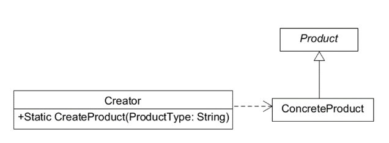

1)  工厂类角色：这是本模式的核心，含有一定的商业逻辑和判断逻辑。在java中它往往由一个具体类实现。 

2)  抽象产品角色：它一般是具体产品继承的父类或者实现的接口。在java中由接口或者抽象类来实现。 

3)  具体产品角色：工厂类所创建的对象就是此角色的实例。在java中由一个具体类实现。 

> **没有抽象工厂，单实例工厂，静态方法**

首先，使用了简单工厂模式后，我们的程序不在“有病”，更加符合现实中的情况；而且客户端免除了直接创建产品对象的责任，而仅仅负责“消费”产品（正如暴发户所为）。 

```java
/**
 * 简单工厂
 */
public class SimpleFactory {

    public Product createProduct(int type) {
        if (type == 1) {
            return new ConcreteProduct1();
        } else if (type == 2) {
            return new ConcreteProduct2();
        }
        return new ConcreteProduct();
    }
}

/**
 * 场景类
 */
public class Client {

    public static void main(String[] args) {
        SimpleFactory simpleFactory = new SimpleFactory();
        Product product = simpleFactory.createProduct(1);
        // do something with the product
    }
}
```

下面我们从开闭原则（对扩展开放；对修改封闭）上来分析下简单工厂模式。当暴发户增加了一辆车的时候，只要符合抽象产品制定的合同，那么只要通知工厂类知道就可以被客户使用了。所以对产品部分来说，它是符合开闭原则的；但是工厂部分好像不太理想，因为每增加一辆车，都要在工厂类中增加相应的业务逻辑或者判断逻辑，这显然是违背开闭原则的。可想而知对于新产品的加入，工厂类是很被动的。对于这样的工厂类（在我们的例子中是为司机师傅），我们称它为全能类或者上帝类。 

我们举的例子是最简单的情况，而在实际应用中，很可能产品是一个多层次的树状结构。

由于简单工厂模式中只有一个工厂类来对应这些产品，所以这可能会把我们的上帝累坏了，也累坏了我们这些程序员:(

于是工厂方法模式作为救世主出现了。工厂方法模式分为两种，单工厂类和多工厂类

***B. 工厂方法模式***


工厂方法模式去掉了简单工厂模式中工厂方法的静态属性，使得它可以被子类继承。这样在简单工厂模式里集中在工厂方法上的压力可以由工厂方法模式里不同的工厂子类来分担。

你应该大致猜出了工厂方法模式的结构，来看下它的组成： 

1) 抽象工厂角色：这是工厂方法模式的核心，它与应用程序无关。是具体工厂角色必须实现的接口或者必须继承的父类。在 java 中它由抽象类或者接口来实现。 

2) 具体工厂角色：它含有和具体业务逻辑有关的代码。由应用程序调用以创建对应的具体产品的对象。

3) 抽象产品角色：它是具体产品继承的父类或者是实现的接口。在 java 中一般有抽象类或者接口来实现。 

4) 具体产品角色：具体工厂角色所创建的对象就是此角色的实例。在 java 中由具体的类来实现。

> **抽象工厂，单实例工厂，实例方法（通过反射，根据参数类型创建不同产品）**

工厂方法模式（单工厂类）的优点：

首先，良好的封装性，代码结构清晰。一个对象创建是有条件约束的，如一个调用者需要一个具体的产品对象，只要知道这个产品的类名（或约束字符串）就可以了，不用知道创建对象的艰辛过程，降低模块间的藕合。

其次，扩展性非常优秀。在增加产品类的情况下，甚至不需要修改工厂类就可以完成“拥抱变化”。

再次，屏蔽产品类。这一特点非常重要，产品类的实现如何变化，调用者都不需要关心，它只需要关心产品的接口，只要接口保持不变，系统中的上层模块就不要发生变化。因为产品类的实例化工作是由工厂类负责的，一个产品对象具体由哪一个产品生成是由工厂类决定的。在数据库开发中，大家应该能够深刻体会到工厂方法模式的好处，如果使用JDBC连接数据库，数据库从MySQL切换到Oracle，需要改动的地方就是切换一下驱动名称（前提条件是SQL语句是标准语句）。其他的都不需要修改，这是工广方法模式灵活性的一个直接案例。

最后，工厂方法模式是典型的解耦框架。高层模块只需要知道产品的抽象类，其他的实现类都不用关心，符合迪米特法则，我不需要的就不要去交流，也符合依赖倒置原则，只依赖产品类的抽象；当然也符合里氏替换原则，使用产品子类替换产品父类，没问题！

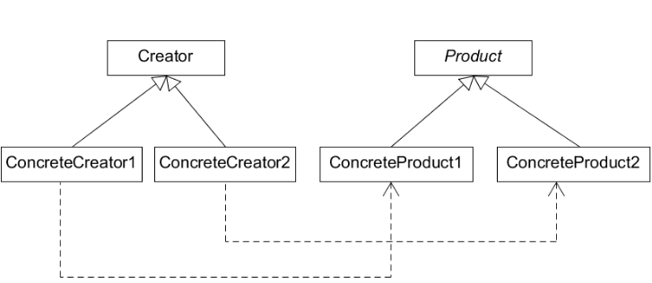

> **抽象工厂，多实例工厂，不同工厂创建不同产品（无需参数）**

工厂方法模式（多工厂类）使用继承自抽象工厂角色的多个子类（不再需要参数）来代替简单工厂模式中的“上帝类”。

正如上面所说，这样便分担了对象承受的压力；而且这样使得结构变得灵活起来——当有新的产品（即暴发户的汽车）产生时，只要按照抽象产品角色、抽象工厂角色提供的合同来生成，那么就可以被客户使用，而不必去修改任何已有的代码。可以看出工厂角色的结构也是符合开闭原则的！ 

话说暴发户生意越做越大，自己的爱车也越来越多。这可苦了那位司机师傅了，什么车它都要记得，维护，都要经过他来使用！于是暴发户同情他说：看你跟我这么多年的份上，以后你不用这么辛苦了，我给你分配几个人手，你只管管好他们就行了！于是，工厂方法模式的管理（一个协调类，避免调用者与各个子工厂交流，封装子工厂类，对高层模块提供统一的访问接口）出现了。

```java
public abstract class Factory {
    abstract public Product factoryMethod();
    public void doSomething() {
        Product product = factoryMethod();
        // do something with the product
    }
}

public class ConcreteFactory extends Factory {
    public Product factoryMethod() {
        return new ConcreteProduct();
    }
}

public class ConcreteFactory1 extends Factory {
    public Product factoryMethod() {
        return new ConcreteProduct1();
    }
}

public class ConcreteFactory2 extends Factory {
    public Product factoryMethod() {
        return new ConcreteProduct2();
    }
}
```

工厂方法模式仿佛已经很完美的对对象的创建进行了包装，使得客户程序中仅仅处理抽象产品角色提供的接口。那我们是否一定要在代码中遍布工厂呢？大可不必。也许在下面情况下你可以考虑使用工厂方法模式： 

1)  当客户程序不需要知道要使用对象的创建过程。 

2)  客户程序使用的对象存在变动的可能，或者根本就不知道使用哪一个具体的对象。

简单工厂模式与工厂方法模式真正的避免了代码的改动了？没有。在简单工厂模式中，新产品的加入要修改工厂角色中的判断语句；而在工厂方法模式中，要么将判断逻辑留在抽象工厂角色中，要么在客户程序中将具体工厂角色写死。而且产品对象创建条件的改变必然会引起工厂角色的修改。 

面对这种情况，Java 的反射机制与配置文件的巧妙结合突破了限制——这在 Spring 中完美的体现了出来。

***JDK***

- [java.util.Calendar](#getInstance--)

- [java.util.ResourceBundle](#getBundle-java.lang.String-)

- [java.text.NumberFormat](#getInstance--)

- [java.nio.charset.Charset](#forName-java.lang.String-)

- [java.net.URLStreamHandlerFactory](#createURLStreamHandler-java.lang.String-)

- [java.util.EnumSet](#of-E-)

- [javax.xml.bind.JAXBContext](#createMarshaller--)

***C. 抽象工厂模式***


回到抽象工厂模式的话题上。 

可以说，**抽象工厂模式和工厂方法模式的区别就在于需要创建对象的复杂程度上**。而且抽象工厂模式是三个里面最为抽象、最具一般性的。

抽象工厂模式的用意为：给客户端提供一个接口，可以创建多个产品族中的产品对象

而且使用抽象工厂模式还要满足以下条件： 

1)  系统中有多个产品族，而系统一次只可能消费其中一族产品。 

2)  同属于同一个产品族的产品一起使用。 

来看看抽象工厂模式的各个角色（和工厂方法的如出一辙）：

1) 抽象工厂角色： 这是工厂方法模式的核心，它与应用程序无关。是具体工厂角色必须实现的接口或者必须继承的父类。在 java 中它由抽象类或者接口来实现。 

2) 具体工厂角色：它含有和具体业务逻辑有关的代码。由应用程序调用以创建对应的具体产品的对象。在 java 中它由具体的类来实现。 

3) 抽象产品角色：它是具体产品继承的父类或者是实现的接口。在 java 中一般有抽象类或者接口来实现。 

4) 具体产品角色：具体工厂角色所创建的对象就是此角色的实例。在 java 中由具体的类来实现。

为创建一组相关或相互依赖的对象提供一个接口，而且无需指定它们的具体类。（多）工厂方法模式的升级版，一个具体的工厂已经可以生产一系列产品了（多工厂方法模式中，一个具体工厂只能生产单一产品）。

抽象工厂模式的优点：封装性、产品族内的约束为非公开状态。抽象工厂模式的最大缺点就是产品族扩展非常困难。

```java
public class AbstractProductA {
}
public class AbstractProductB {
}
public class ProductA1 extends AbstractProductA {
}
public class ProductA2 extends AbstractProductA {
}
public class ProductB1 extends AbstractProductB {
}
public class ProductB2 extends AbstractProductB {
}
public abstract class AbstractFactory {
    abstract AbstractProductA createProductA();
    abstract AbstractProductB createProductB();
}
public class ConcreteFactory1 extends AbstractFactory {
    AbstractProductA createProductA() {
        return new ProductA1();
    }

    AbstractProductB createProductB() {
        return new ProductB1();
    }
}
public class ConcreteFactory2 extends AbstractFactory {
    AbstractProductA createProductA() {
        return new ProductA2();
    }

    AbstractProductB createProductB() {
        return new ProductB2();
    }
}
public class Client {
    public static void main(String[] args) {
        AbstractFactory abstractFactory = new ConcreteFactory1();
        AbstractProductA productA = abstractFactory.createProductA();
        AbstractProductB productB = abstractFactory.createProductB();
        // do something with productA and productB
    }
}
```

***JDK***

- [javax.xml.parsers.DocumentBuilderFactory](http://docs.oracle.com/javase/8/docs/api/javax/xml/parsers/DocumentBuilderFactory.html)

- [javax.xml.transform.TransformerFactory](#newInstance--)

- [javax.xml.xpath.XPathFactory](#newInstance--)

***D. 单例工厂***


以上通过工厂方法模式创建了一个单例对象，该框架可以继续扩展，在一个项目中可以产生一个单例构造器，所有需要产生单例的类都遵循一定的规则（构造方法是private），然后通过扩展该框架，只要输入一个类型就可以获得唯一的一个实例。

***E. 延迟初始化***


何为延迟初始化(Lazy initialization)？一个对象被消费完毕后，并不立刻释放，工厂类保持其初始状态，等待再次被使用。

延迟加载框架是可以扩展的，例如限制某一个产品类的最大实例化数量，可以通过判断Map中已有的对象数量来实现，这样的处理是非常有意义的，例如 JDBC 连接数据库，都会要求设置一个 MaxConnections 最大连接数量，该数量就是内存中最大实例化的数量。

延迟加载还可以用在对象初始化比较复杂的情况下，例如硬件访问，涉及多方面的交互，则可以通过延迟加载降低对象的产生和销毁带来的复杂性。

**使用场景：**

首先，工厂方法模式是 new 一个对象的替代品，所以在所有需要生成对象的地方都可以使用，但是需要慎重地考虑是否要增加一个工厂类进行管理，增加代码的复杂度。

其次，需要灵活的、可扩展的框架时，可以考虑采用工厂方法模式。

再次，工厂方法模式可以用在异构项目中。例如通过 WebService 与一个非Java的项目交互，虽然 WebService 号称是可以做到异构系统的同构化，但是在实际的开发中，还是会碰到很多问题，如类型问题、WSDL文件的支持问题，等等。从 WSDL 中产生的对象都认为是一个产品，然后用一个具体的工厂类进行管理，减少与外围系统的耦合。

最后，可以使用在测试驱动开发的框架下。例如，测试一个类A，就需要把与类A有关联关系的类B也同时产生出来，我们可以使用工厂方法模式把类B虚拟出来，避免类A与类B的耦合。目前由于 JMock 和 EasyMock 的诞生，该使用场景已经弱化了，读者可以在遇到此种情况时直接考虑使用 JMock 或 EasyMock。

抽象工厂模式的使用场景定义非常简单：一个对象族（或是一组没有任何关系的对象）都有相同的约束，则可以使用抽象工厂模式。


#### 3、建造者(Builder)

**定义：**

建造者模式(Builder Pattem)也叫做生成器模式。

GOF 给建造模式的定义为：将一个复杂对象的构建与它的表示分离，使得同样的构建过程可以创建不同的表示。这句话说得很抽象，不好理解，其实它的意思可以理解为：将构造复杂对象的过程和组成对象的部件解耦。

**类图：**


1) 抽象建造者角色：这个角色用来规范产品对象的各个组成成分的建造。一般而言，此角色独立于应用程序的业务逻辑。 

2) 具体建造者角色：担任这个角色的是与应用程序紧密相关的类，它们在指导者的调用下创建产品实例。这个角色在实现抽象建造者角色提供的方法的前提下，达到完成产品组装，提供成品的功能。 

3) 指导者角色：调用具体建造者角色以创建产品对象。指导者并没有产品类的具体知识，真正拥有产品类的具体知识的是具体建造者对象。 

4) 产品角色：建造中的复杂对象。它要包含那些定义组件的类，包括将这些组件装配成产品的接口。

首先客户程序创建一个指导者对象，一个建造者角色，并将建造者角色传入指导者对象进行配置。然后，指导者按照步骤调用建造者的方法创建产品。最后客户程序从建造者或者指导者那里得到产品。 

从建造模式的工作流程来看，建造模式将产品的组装“外部化”到了建造者角色中来。***这是和任何正规的工厂模式不一样的——产品的创建是在产品类中完成的***。

**特点：**

- 独立性：建造模式可以使得产品内部的表象独立变化。在原来的工厂方法模式中，产品内部的表象是由产品自身来决定的；而在建造模式中则是“外部化”为由建造者来负责。这样定义一个新的具体建造者角色就可以改变产品的内部表象，符合“开闭原则”。 

- 封装性：建造模式使得客户不需要知道太多产品内部的细节。它将复杂对象的组建和表示方式封装在一个具体的建造角色中，而且由指导者来协调建造者角色来得到具体的产品实例。每一个具体建造者角色是毫无关系的。 

- 便于控制细节风险：建造模式可以对复杂产品的创建进行更加精细的控制。产品的组成是由指导者角色调用具体建造者角色来逐步完成的，所以比起其它创建型模式能更好的反映产品的构造过程。

**使用场景：**

- 相同的方法，不同的执行顺序，产生不同的事件结果

- 多个部件或零件，都可以装配到一个对象中，但是产生的运行结果又不相同

- 产品类非常复杂，或者产品类中的调用顺序不同产生了不同的效能

- 在对象创建过程中会使用到系统中的一些其他对象，这些对象在产品对象的创建过程中不易得到时，也可以采用建造者模式封装该对象的创建过程。这种场景只能是一个补偿方法，因为一个对象不容易获得，而在设计阶段竟然没有发觉，而要通过创建者模式柔化创建过程，本身已经违反设计的最初目标

**注意事项：**

建造模式中很可能要用到组成成品的各种组件类，对于这些类的创建可以考虑使用工厂方法或者原型模式来实现，在必要的时候也可以加上单例模式来控制类实例的产生。但是要坚持一个大前提就是要使引入的模式给你的系统带来好处，而不是臃肿的结构。 

建造模式在得到复杂产品的时候可能要引用多个不同的组件，在这一点上来看，建造模式和抽象工厂模式是相似的。可以从以下两点来区分两者：创建模式着重于逐步将组件装配成一个成品并向外提供成品，而抽象工厂模式着重于得到产品族中相关的多个产品对象；抽象工厂模式的应用是受限于产品族的，建造模式则不会。 

建造者模式最主要的功能是基本方法的调用顺序安排，也就是这些基本方法已经实现了，通俗地说就是零件的装配，顺序不同产生的对象也不同；而工厂方法则重点是创建，创建零件是它的主要职责，组装顺序则不是它关心的。

由于建造模式和抽象工厂模式在实现功能上相似，所以两者使用的环境都比较复杂并且需要更多的灵活性。 

**最佳实践：**

组合模式中的树枝构件角色(Composite)往往是由多个树叶构件角色(Leaf)组成，因此树枝构件角色的产生可以由建造模式来担当。

建造者模式中还有一个角色没有说明，就是零件，建造者怎么去建造一个对象？是零件的组装，组装顺序不同对象效能也不同，这才是建造者模式要表达的核心意义，而怎么才能更好地达到这种效果呢？引人模板方法模式是一个非常简单而有效的办法。所以在使用建造者模式的时候考虑一下模板方法模式，别孤立地思考一个模式，僵化地套用一个模式会让你受害无穷！

**实现：**

以下是一个简易的 StringBuilder 实现，参考了 JDK 1.8 源码。

```java
public class AbstractStringBuilder {
    protected char[] value;

    protected int count;

    public AbstractStringBuilder(int capacity) {
        count = 0;
        value = new char[capacity];
    }

    public AbstractStringBuilder append(char c) {
        ensureCapacityInternal(count + 1);
        value[count++] = c;
        return this;
    }

    private void ensureCapacityInternal(int minimumCapacity) {
        // overflow-conscious code
        if (minimumCapacity - value.length > 0)
            expandCapacity(minimumCapacity);
    }

    void expandCapacity(int minimumCapacity) {
        int newCapacity = value.length * 2 + 2;
        if (newCapacity - minimumCapacity < 0)
            newCapacity = minimumCapacity;
        if (newCapacity < 0) {
            if (minimumCapacity < 0) // overflow
                throw new OutOfMemoryError();
            newCapacity = Integer.MAX_VALUE;
        }
        value = Arrays.copyOf(value, newCapacity);
    }
}

public class StringBuilder extends AbstractStringBuilder {
    public StringBuilder() {
        super(16);
    }

    @Override
    public String toString() {
        // Create a copy, don't share the array
        return new String(value, 0, count);
    }
}

public class Client {
    public static void main(String[] args) {
        StringBuilder sb = new StringBuilder();
        final int count = 26;
        for (int i = 0; i < count; i++) {
            sb.append((char) ('a' + i));
        }
        System.out.println(sb.toString());
    }
}
```

**JDK**

- [java.lang.StringBuilder](http://docs.oracle.com/javase/8/docs/api/java/lang/StringBuilder.html)

- [java.nio.ByteBuffer](#put-byte-)

- [java.lang.StringBuffer](#append-boolean-)

- [java.lang.Appendable](http://docs.oracle.com/javase/8/docs/api/java/lang/Appendable.html)

- [Apache Camel builders](https://github.com/apache/camel/tree/0e195428ee04531be27a0b659005e3aa8d159d23/camel-core/src/main/java/org/apache/camel/builder)


#### 4、原型(Prototype)

**定义：**

GOF 给它的定义为：用原型实例指定创建对象的种类，并且通过拷贝这些原型创建新的对象。 

在 Java 中提供了 clone() 方法来实现对象的克隆，所以 Prototype 模式实现变得简单许多。注：对于许多原型模式中讲到的浅克隆、深克隆，本文不谈论。 

使用克隆方式来创建对象与同样用来创建对象的工厂模式有什么不同？ 

工厂模式对新产品的适应能力比较弱：创建新的产品时，就必须修改或者增加工厂角色。而且为了创建产品对象要先额外的创建一个工厂对象。那通过原型模式来创建对象会是什么样子呢？

**类图：**


按照定义，客户角色不仅要负责使用对象，而且还要负责对象原型的生成和克隆。这样造成客户角色分工就不是很明确，所以我们把对象原型生成和克隆功能单拿出来放到一个原型管理器中。原型管理器维护了已有原型的清单。客户在使用时会向原型管理器发出请求，而且可以修改原型管理器维护的清单。这样客户不需要编码就可以实现系统的扩展。类图表示如下：

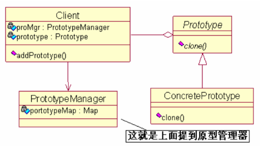

1)  客户角色：让一个原型克隆自己来得到一个新对象。 

2)  抽象原型角色：实现了自己的 clone方法，扮演这种角色的类通常是抽象类，且它具有许多具体的子类。 

3)  具体原型角色：被复制的对象，为抽象原型角色的具体子类。  

**特点：**

对于抽象原型角色和具体原型角色，它们就是一个继承或者实现关系，没有什么好讲的，记住实现好 clone 方法就好了。那么客户是怎么来使用这些角色的对象的呢？最简单的方式就是： 

```java
// 先 new 一个具体原型角色作为样本 
Prototype p = new ConcretePrototype(); 
…… 
// 使用原型 p克隆出一个新对象 p1 
Prototype p1 = (Prototype)p.clone(); 
```

当然这只是简单的表述原型模式的运行过程。实际运用中，客户程序与原型角色之间往往存在一个原型管理器。因此创建原型角色、拷贝原型角色就与客户程序分离开来。这时才能真正的体会到原型模式带给我们的效果。 

```java
// 使用原型管理器后，客户获得对象的方式 
Prototype p1 = PrototypeManager.getManager().getPrototype("ConcretePrototype");
```

上面提到的原型管理器的实现，简单来说就是对原型清单的维护。可以考虑以下几点：

- 要保存一个原型对象的清单，我们可以使用一个 HashMap 来实现，使原型对象和它的名字相对应；原型管理器只需要一个就够了，所以可以使用单例模式来实现控制；实现得到、注册、删除原型对象的功能只是对 HashMap 的对应操作而已。

- 当客户自定义新的产品对象时，同时向原型管理器注册一个原型对象，而使用的类只需要根据客户的需要来从原型管理器中得到一个对象就可以了。这样就使得功能扩展变得容易些。 

原型模式与其它创建型模式有着相同的特点：它们都将具体产品的创建过程进行包装，使得客户对创建不可知。客户程序仅仅知道一个抽象产品的接口。当然它还有过人之处： 

- 通过增加或者删除原型管理器中注册的对象，可以比其它创建型模式更方便的在运行时增加或者删除产品。 
- 如果一个对象的创建总是由几种固定组件不同方式组合而成；如果对象之间仅仅实例属性不同。将不同情况的对象缓存起来，直接克隆使用。也许这比采用传递参数重新 new 一个对象要来的快一些。 

你也许已经发现原型模式与工厂模式有着千丝万缕的联系：原型管理器不就是一个工厂么。当然这个工厂经过了改进（例如采用 java 的反射机制），去掉了像抽象工厂模式或者工厂方法模式那样繁多的子类。因此可以说原型模式就是在工厂模式的基础上加入了克隆方法。 

也许你要说：我实在看不出来使用 clone 方法产生对象和 new 一个对象有什么区别；***原型模式使用 clone 能够动态的抽取当前对象运行时的状态并且克隆到新的对象中，新对象就可以在此基础上进行操作而不损坏原有对象；而 new 只能得到一个刚初始化的对象，而在实际应用中，这往往是不够的***。特别当你的系统需要良好的扩展性时，在设计中使用原型模式也是很必要的。比如说，你的系统可以让客户自定义自己需要的类别，但是这种类别的初始化可能需要传递多于已有类别的参数，而这使得用它的类将不知道怎么来初始化它（因为已经写死了），除非对类进行修改。可见 clone 方法是不能使用构造函数来代替的。

原型模式的优点：

- 性能优良：原型模式是在（堆）内存二进制流的拷贝，要比直接 new 一个对象性能好很多，特别是要在一个循环体内产生大量的对象时，原型模式可以更好地体现其优点。

- 逃避构造函数的约束：这既是它的优点也是缺点，直接在内存中拷贝，构造函数是不会执行的。优点就是减少了约束，缺点也是减少了约束，需要大家在实际应用时考虑。

任何模式都是存在缺陷的。原型模式主要的缺陷就是每个原型必须含有 clone 方法，在已有类的基础上来添加 clone 操作是比较困难的；而且当内部包括一些不支持 copy 或者循环引用的对象时，实现就更加困难了。由于 clone 方法在 java 实现中有着一定的弊端和风险，所以 clone 方法是不建议使用的。因此很少能在 java 应用中看到原型模式的使用。但是原型模式还是能够给我们一些启迪。

**使用场景：**

- 资源优化场景：类初始化需要消耗非常多的资源，这个资源包括数据、硬件资源等。

- 性能和安全要求的场景：通过 new 产生一个对象需要非常繁琐的数据准备或访问权限，则可以使用原型模式。

- 一个对象多个修改者的场景：一个对象需要提供给其他对象访问，而且各个调用者可能都需要修改其值时，可以考虑使用原型模式拷贝多个对象供调用者使用。

分析了这么多，举一个使用原型模式较为经典的例子：绩效考核软件要对今年的各种考核数据进行年度分析，而这一组数据是存放在数据库中的。一般我们会将这一组数据封装在一个类中，然后将此类的一个实例作为参数传入分析算法中进行分析，得到的分析结果返回到类中相应的变量中。假设我们决定对这组数据还要做另外一种分析以对分析结果进行比较评定。这时对封装有这组数据的类进行 clone 要比再次连接数据库得到数据好的多。

**实现：**

```java
public abstract class Prototype {
    abstract Prototype myClone();
}

public class ConcretePrototype extends Prototype {

    private String filed;

    public ConcretePrototype(String filed) {
        this.filed = filed;
    }

    @Override
    Prototype myClone() {
        return new ConcretePrototype(filed);
    }

    @Override
    public String toString() {
        return filed;
    }
}

public class Client {
    public static void main(String[] args) {
        Prototype prototype = new ConcretePrototype("abc");
        Prototype clone = prototype.myClone();
        System.out.println(clone.toString());
    }
}
```

**扩展：**

- 浅拷贝、深拷贝

- clone 与 final 互斥性

**JDK**

- [java.lang.Object#clone()](#clone())


## 行为型

### 1. 责任链

**定义：**

使多个对象都有机会处理请求，从而避免请求的发送者和接收者之间的耦合关系。将这些对象连成一条链，并沿着这条链传递该请求，直到有一个对象处理它为止。 

呵呵，从定义上可以看出，责任链模式的提出是为了“解耦”，以应变系统需求的变更和不明确性。 

下面是《设计模式》中给出的适用范围： 

1) 有多个的对象可以处理一个请求，哪个对象处理该请求运行时刻自动确定。 

2) 你想在不明确指定接收者的情况下，向多个对象中的一个提交一个请求。 

3) 可处理一个请求的对象集合应被动态指定。

**类图：** 

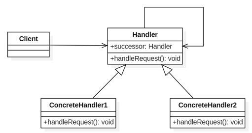

 

1)  抽象处理者角色(Handler)：它定义了一个处理请求的接口。当然对于链子的不同实现，也可以在这个角色中实现后继链。 

2)  具体处理者角色(Concrete Handler)：实现抽象角色中定义的接口，并处理它所负责的请求。如果不能处理则访问它的后继者。

纯的责任链模式，规定一个具体处理者角色只能对请求作出两种动作：自己处理；传给下家。不能出现处理了一部分，把剩下的传给了下家的情况。而且请求在责任链中必须被处理，而不能出现无果而终的结局。 

反之，则就是不纯的责任链模式。

**特点：**

责任链模式非常显著的优点是将请求和处理分开。请求者可以不用知道是谁处理的，处理者可以不用知道请求的全貌（例如在J2EE项目开发中，可以剥离出无状态Bean由责任链处理），降低了耦合、提高了灵活性。

责任链有两个非常显著的缺点：一是性能问题，可能会带来一些额外的性能损耗，因为它每次执行请求都要从链的开头开始遍历。二是调试不很方便，特别是链条比较长，环节比较多的时候，由于采用了类似递归的方式，调试的时候逻辑可能比较复杂。

责任链模式的注意事项：链中节点数量需要控制，避免出现超长链的情况，一般的做法是在Handler中设置一个最大节点数量，在setNext方法中判断是否已经超过其阈值，超过则不允许该链建立，避免无意识地破坏系统性能。

**实现：**

```java
public abstract class Handler {

    protected Handler successor;

    public Handler(Handler successor) {
        this.successor = successor;
    }

    protected abstract void handleRequest(Request request);
}

public class ConcreteHandler1 extends Handler {

    public ConcreteHandler1(Handler successor) {
        super(successor);
    }

    @Override
    protected void handleRequest(Request request) {
        if (request.getType() == RequestType.TYPE1) {
            System.out.println(request.getName() + " is handle by ConcreteHandler1");
            return;
        }
        if (successor != null) {
            successor.handleRequest(request);
        }
    }
}

public class ConcreteHandler2 extends Handler {

    public ConcreteHandler2(Handler successor) {
        super(successor);
    }

    @Override
    protected void handleRequest(Request request) {
        if (request.getType() == RequestType.TYPE2) {
            System.out.println(request.getName() + " is handle by ConcreteHandler2");
            return;
        }
        if (successor != null) {
            successor.handleRequest(request);
        }
    }
}

public class Request {

    private RequestType type;
    private String name;

    public Request(RequestType type, String name) {
        this.type = type;
        this.name = name;
    }

    public RequestType getType() {
        return type;
    }

    public String getName() {
        return name;
    }
}

public enum RequestType {
    TYPE1, TYPE2
}

public class Client {

    public static void main(String[] args) {

        Handler handler1 = new ConcreteHandler1(null);
        Handler handler2 = new ConcreteHandler2(handler1);

        Request request1 = new Request(RequestType.TYPE1, "request1");
        handler2.handleRequest(request1);

        Request request2 = new Request(RequestType.TYPE2, "request2");
        handler2.handleRequest(request2);
    }
}
```

输出：

  request1 is handle by ConcreteHandler1
  request2 is handle by ConcreteHandler2

**JDK**

- [java.util.logging.Logger#log()](http://docs.oracle.com/javase/8/docs/api/java/util/logging/Logger.html#log(java.util.logging.Level, java.lang.String))

- [Apache Commons Chain](https://commons.apache.org/proper/commons-chain/index.html)

- [javax.servlet.Filter#doFilter()](http://docs.oracle.com/javaee/7/api/javax/servlet/Filter.html#doFilter-javax.servlet.ServletRequest-javax.servlet.ServletResponse-javax.servlet.FilterChain-)


### 2.命令

**定义：**

将一个请求封装为一个对象，从而使你可用不同的请求对客户进行参数化；对请求排队或记录请求日志，以及支持可撤消的操作。

**类图：**

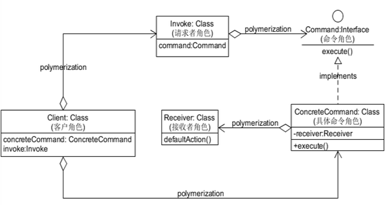

 

1)  命令角色(Command)：声明执行操作的接口。由接口或者抽象类来实现。 

2)  具体命令角色(Concrete Command)：将一个接收者对象绑定于一个动作；调用接收者相应的操作，以实现命令角色声明的执行操作的接口。 

3)  客户角色(Client)：创建一个具体命令对象（并可以设定它的接收者）。 

4)  请求者角色(Invoker)：调用命令对象执行这个请求。 

5)  接收者角色(Receiver)：知道如何实施与执行一个请求相关的操作。任何类都可能作为一个接收者。

在定义中提到，命令模式支持可撤销的操作。其实命令模式之所以能够支持这种操作，完全得益于在请求者与接收者之间添加了中间角色。为了实现 undo功能，首先需要一个历史列表来保存已经执行过的具体命令角色对象；修改具体命令角色中的执行方法，使它记录更多的执行细节，并将自己放入历史列表中；并在具体命令角色中添加 undo 方法，此方法根据记录的执行细节来复原状态（很明显，首先程序员要清楚怎么来实现，因为它和 execute 的效果是一样的）。同样，redo功能也能够照此实现。 

命令模式还有一个常见的用法就是执行事务操作。这就是为什么命令模式还叫做**事务模式**的原因。它可以在请求被传递到接收者角色之前，检验请求的正确性，甚至可以检查和数据库中数据的一致性，而且可以结合组合模式的结构，来一次执行多个命令。使用命令模式不仅仅可以解除请求者和接收者之间的耦合，而且可以用来做批处理操作，这完全可以发挥你自己的想象——请求者发出的请求到达命令角色这里以后，先保存在一个列表中而不执行；等业务需要时，命令模式再将列表中全部的操作逐一执行。

**特点：**

由上面的讲解可以看出命令模式有以下优点： 

l 类间解耦：命令模式将调用操作的请求对象与知道如何实现该操作的接收对象解耦。 

l 可扩展性：增加新的具体命令角色很容易，因为这无需改变已有的类。具体命令角色可以被不同的请求者角色重用。

l 结合其它模式更优秀：你可将多个命令装配成一个复合命令。可以结合责任链模式，实现命令族解析任务，结合模板方法模式，则可以减少Command子类的膨胀问题。

缺点就是Command子类的膨胀问题。

**使用场景：**

GOF总结了命令模式的以下适用环境：

1)  需要抽象出待执行的动作，然后以参数的形式提供出来——类似于过程设计中的回调机制。而命令模式正是回调机制的一个面向对象的替代品。 

2)  在不同的时刻指定、排列和执行请求。一个命令对象可以有与初始请求无关的生存期。 

3)  需要支持取消操作。 

4)  支持修改日志功能。这样当系统崩溃时，这些修改可以被重做一遍。 

5)  需要支持事务操作。 

从面向对象的角度来看，命令模式是不完美的。命令角色仅仅包含一个方法，没有任何属性存在。这是将函数层面的任务提升到了类的层面。但不可否认的是：命令模式很成功的解决了许多问题。

**实现：**

设计一个遥控器，可以控制电灯开关。

```java
public interface Command {
    void execute();
}

public class LightOnCommand implements Command {
    Light light;

    public LightOnCommand(Light light) {
        this.light = light;
    }

    @Override
    public void execute() {
        light.on();
    }
}

public class LightOffCommand implements Command {
    Light light;

    public LightOffCommand(Light light) {
        this.light = light;
    }

    @Override
    public void execute() {
        light.off();
    }
}

public class Light {
    public void on() {
        System.out.println("Light is on!");
    }

    public void off() {
        System.out.println("Light is off!");
    }
}

/**
 * 遥控器
 */
public class Invoker {
    private Command[] onCommands;
    private Command[] offCommands;
    private final int slotNum = 7;

    public Invoker() {
        this.onCommands = new Command[slotNum];
        this.offCommands = new Command[slotNum];
    }

    public void setOnCommand(Command command, int slot) {
        onCommands[slot] = command;
    }

    public void setOffCommand(Command command, int slot) {
        offCommands[slot] = command;
    }

    public void onButtonWasPushed(int slot) {
        onCommands[slot].execute();
    }

    public void offButtonWasPushed(int slot) {
        offCommands[slot].execute();
    }
}

public class Client {
    public static void main(String[] args) {
        Invoker invoker = new Invoker();
        Light light = new Light();
        Command lightOnCommand = new LightOnCommand(light);
        Command lightOffCommand = new LightOffCommand(light);
        invoker.setOnCommand(lightOnCommand, 0);
        invoker.setOffCommand(lightOffCommand, 0);
        invoker.onButtonWasPushed(0);
        invoker.offButtonWasPushed(0);
    }
}
```

**JDK**

- [java.lang.Runnable](http://docs.oracle.com/javase/8/docs/api/java/lang/Runnable.html)

- [Netflix Hystrix](https://github.com/Netflix/Hystrix/wiki)

- [javax.swing.Action](http://docs.oracle.com/javase/8/docs/api/javax/swing/Action.html)


### 3.解释器

**定义：**

定义语言的文法，并且建立一个解释器来解释该语言中的句子。

它属于类的行为模式。这里的语言意思是使用规定格式和语法的代码。 

在 GOF的书中指出：如果一种特定类型的问题发生的频率足够高，那么可能就值得将该问题的各个实例表述为一个简单语言中的句子。这样就可以构建一个解释器，该解释器通过解释这些句子来解决该问题。而且当文法简单、效率不是关键问题的时候效果最好——这也就是解释器模式适用的环境。

**类图：**

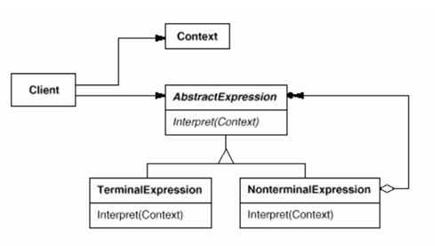

1)  抽象表达式角色：声明一个抽象的解释操作，这个接口为所有具体表达式角色（抽象语法树中的节点）都要实现的。 

什么叫做抽象语法树呢？《java 与模式》中给的解释为：抽象语法树的每一个节点都代表一个语句，而在每个节点上都可以执行解释方法。这个解释方法的执行就代表这个语句被解释。由于每一个语句都代表这个语句被解释。由于每一个语句都代表一个常见的问题的实例，因此每一个节点上的解释操作都代表对一个问题实例的解答。 

2)  终结符表达式角色：具体表达式。 

a) 实现与文法中的终结符相关联的解释操作 

b) 而且句子中的每个终结符需要该类的一个实例与之对应 

3)  非终结符表达式角色：具体表达式。 

a) 文法中的每条规则 R::=R1R2…Rn 都需要一个非终结符表带式角色 

b) 对于从 R1到 Rn 的每个符号都维护一个抽象表达式角色的实例变量 

c) 实现解释操作，解释一般要递归地调用表示从 R1 到Rn 的那些对象的解释操作

4)  上下文（环境）角色：包含解释器之外的一些全局信息。 

5)  客户角色： 

a) 构建（或者被给定）表示该文法定义的语言中的一个特定的句子的抽象语法树 

b) 调用解释操作

**特点：**

解释器模式提供了一个简单的方式来执行语法，而且容易修改或者扩展语法。一般系统中很多类使用相似的语法，可以使用一个解释器来代替为每一个规则实现一个解释器。而且在解释器中不同的规则是由不同的类来实现的，这样使得添加一个新的语法规则变得简单。 但是解释器模式对于复杂文法难以维护。可以想象一下，每一个规则要对应一个处理类，而且这些类还要递归调用抽象表达式角色，多如乱麻的类交织在一起是多么恐怖的一件事啊！ 

**实现：**

实现1：

以下是一个规则检验器实现，具有 and 和 or 规则，通过规则可以构建一颗解析树，用来检验一个文本是否满足解析树定义的规则。

例如一颗解析树为 D And (A Or (B C))，文本 "D A" 满足该解析树定义的规则。

这里的 Context 指的是 String。

```java
public abstract class Expression {
    public abstract boolean interpret(String str);
}

public class TerminalExpression extends Expression {
    private String literal = null;

    public TerminalExpression(String str) {
        literal = str;
    }

    public boolean interpret(String str) {
        StringTokenizer st = new StringTokenizer(str);
        while (st.hasMoreTokens()) {
            String test = st.nextToken();
            if (test.equals(literal)) {
                return true;
            }
        }
        return false;
    }
}

public class AndExpression extends Expression {
    private Expression expression1 = null;
    private Expression expression2 = null;

    public AndExpression(Expression expression1, Expression expression2) {
        this.expression1 = expression1;
        this.expression2 = expression2;
    }

    public boolean interpret(String str) {
        return expression1.interpret(str) && expression2.interpret(str);
    }
}

public class OrExpression extends Expression {
    private Expression expression1 = null;
    private Expression expression2 = null;

    public OrExpression(Expression expression1, Expression expression2) {
        this.expression1 = expression1;
        this.expression2 = expression2;
    }

    public boolean interpret(String str) {
        return expression1.interpret(str) || expression2.interpret(str);
    }
}

public class Client {
    /**
     * 构建解析树
     */
    public static Expression buildInterpreterTree() {
        // Literal
        Expression terminal1 = new TerminalExpression("A");
        Expression terminal2 = new TerminalExpression("B");
        Expression terminal3 = new TerminalExpression("C");
        Expression terminal4 = new TerminalExpression("D");
        // B C
        Expression alternation1 = new OrExpression(terminal2, terminal3);
        // A Or (B C)
        Expression alternation2 = new OrExpression(terminal1, alternation1);
        // D And (A Or (B C))
        return new AndExpression(terminal4, alternation2);
    }

    public static void main(String[] args) {
        Expression define = buildInterpreterTree();
        String context1 = "D A";
        String context2 = "A B";
        System.out.println(define.interpret(context1));
        System.out.println(define.interpret(context2));
    }
}
```

输出：

  true
  false

实现2：

```java
package Interpreter;

import java.util.*;

/**
 * 上下文(环境)角色
 * A Context to record variable value
 */
public class Context {
    private Hashtable<String,Boolean> context = new Hashtable<String,Boolean>();

    public void Assign(String name, boolean val) {
        context.put(name, new Boolean(val));
    }

    public boolean LookUp(String name) {
        return ((Boolean) context.get(name)).booleanValue();
    }

    public Context() {
    }
}

/**
 *  The interface of our BooleanExp Interpreter
 *  BooleanExp definition is:
 *      BooleanExp ::= VariableExp | Constant | OrExp | AndExp
 *                               | NotExp | '(' BooleanExp ')'
 *      AndExp ::= BooleanExp 'and' BooleanExp
 *      OrExp ::= BooleanExp 'or' BooleanExp
 *      NotExp ::= BooleanExp 'not' BooleanExp
 *      Constant ::= 'true' | 'false'
 *      VariableExp ::= 'A' | 'B' | ... | 'Z'
 *  抽象表达式角色
 */
public interface BooleanExp {
    public abstract boolean Evaluate(Context c);
    public abstract BooleanExp Replace(String var, BooleanExp exp);
    public abstract BooleanExp Copy();
}

/**
 * A NonterminalExpression 
 * 非终结符表达式角色
 */
public class AndExp implements BooleanExp {
    private BooleanExp operand1;
    private BooleanExp operand2;

    public AndExp(BooleanExp oper1, BooleanExp oper2) {
        operand1 = oper1;
        operand2 = oper2;
    }

    public boolean Evaluate(Context c) {
        return operand1.Evaluate(c) && operand2.Evaluate(c);
    }

    public BooleanExp Copy() {
        return new AndExp(operand1.Copy(), operand2.Copy());
    }

    public BooleanExp Replace(String var, BooleanExp exp) {
        return new AndExp(operand1.Replace(var, exp), operand2.Replace(var, exp));
    }
}

/**
 * A NonterminalExpression
 * 非终结符表达式角色
 */
public class NotExp implements BooleanExp {
    private BooleanExp opernot1;
    // private BooleanExp operor2;

    public NotExp(BooleanExp oper1) {
        opernot1 = oper1;
    }

    public boolean Evaluate(Context c) {
        return !(opernot1.Evaluate(c));
    }

    public BooleanExp Copy() {
        return new NotExp(opernot1.Copy());
    }

    public BooleanExp Replace(String var, BooleanExp exp) {
        return new NotExp(opernot1.Replace(var, exp));
    }
}

/**
 * A NonterminalExpression 
 * 非终结符表达式角色
 */
public class OrExp implements BooleanExp {
    private BooleanExp operor1;
    private BooleanExp operor2;

    public OrExp(BooleanExp oper1, BooleanExp oper2) {
        operor1 = oper1;
        operor2 = oper2;
    }

    public boolean Evaluate(Context c) {
        return operor1.Evaluate(c) || operor2.Evaluate(c);
    }

    public BooleanExp Copy() {
        return new OrExp(operor1.Copy(), operor2.Copy());
    }

    public BooleanExp Replace(String var, BooleanExp exp) {
        return new OrExp(operor1.Replace(var, exp), operor2.Replace(var, exp));
    }
}

/**
 *  A variable expression implements BooleanExp
 *  A terminal expression
 *  终结符表达式角色
 */
public class VariableExp implements BooleanExp {
    private String name;

    public VariableExp(String _name) {
        name = _name;
    }

    public boolean Evaluate(Context c) {
        return c.LookUp(name);
    }

    public BooleanExp Copy() {
        return new VariableExp(name);
    }

    public BooleanExp Replace(String var, BooleanExp exp) {
        if (var.equals(name)) {
            return exp.Copy();
        } else {
            return new VariableExp(name);
        }
    }

}

/**
 * 客户角色
 */
public class Test  {
    public static void main(String[] args) {
        // Test :
        //         (true and x) and (y and (not x))
        Context context = new Context();
       
        VariableExp x = new VariableExp("X");
        VariableExp y = new VariableExp("Y");
        VariableExp bTure = new VariableExp("true");
        VariableExp bFalse = new VariableExp("false");

        context.Assign("true", true);
        context.Assign("false", false);
        context.Assign("X", false);
        context.Assign("Y", true);
        
        BooleanExp expression = new AndExp(
            new AndExp(bTure, x),
            new AndExp(y, new NotExp(x))
        );
        boolean result = expression.Evaluate(context);
        System.out.println("The result is:" + result);
        
        expression = new OrExp(y, bFalse);
        result = expression.Evaluate(context);
        System.out.println("The result is:" + result);
    }
}
```

**JDK**

- [java.util.Pattern](http://docs.oracle.com/javase/8/docs/api/java/util/regex/Pattern.html)

- [java.text.Normalizer](http://docs.oracle.com/javase/8/docs/api/java/text/Normalizer.html)

- All subclasses of [java.text.Format](http://docs.oracle.com/javase/8/docs/api/java/text/Format.html)

- [javax.el.ELResolver](http://docs.oracle.com/javaee/7/api/javax/el/ELResolver.html)


#### 4.迭代器

**定义：**

选代器模式(Iterator Pattern)目前已经是一个没落的模式，基本上没人会单独写一个迭代器，除非是产品性质的开发。

它提供一种方法访问一个容器对象中各个元素，而又不需暴露该对象的内部细节。

迭代器是为容器服务的，那什么是容器呢？能容纳对象的所有类型都可以称之为容器，例如Collection集合类型、Set类型等，迭代器模式就是为解决遍历这些容器中的元素而诞生的。

**类图：**

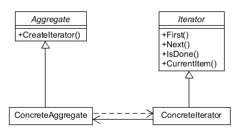

1)  Iterator抽象迭代器：抽象迭代器负责定义访问和遍历元素的接口，而且基本上是有固定的3个方法：first()获得第一个元素，next()访问下一个元素，isDone()是否已经访问到底部（Java叫做hasNext()方法）。

2)  ConcreteIterator具体选代器：具体迭代器角色要实现迭代器接口，完成容器元素的遍历。

3)  Aggregate抽象容器：容器角色负责提供创建具体选代器角色的接口，必然提供一个类似createIterator()这样的方法，在Java中一般是iterator()方法。

4)  ConcreteAggregate具体容器：具体容器实现容器接口定义的方法，创建出容纳迭代器的对象。

**实现：**

```java
public interface Aggregate {
    Iterator createIterator();
}

public class ConcreteAggregate implements Aggregate {
    private Integer[] items;

    public ConcreteAggregate() {
        items = new Integer[10];
        for (int i = 0; i < items.length; i++) {
            items[i] = i;
        }
    }

    @Override
    public Iterator createIterator() {
        return new ConcreteIterator<Integer>(items);
    }
}

public interface Iterator<Item> {
    Item next();
    boolean hasNext();
}

public class ConcreteIterator<Item> implements Iterator {
    private Item[] items;
    private int position = 0;

    public ConcreteIterator(Item[] items) {
        this.items = items;
    }

    @Override
    public Object next() {
        return items[position++];
    }

    @Override
    public boolean hasNext() {
        return position < items.length;
    }
}

public class Client {
    public static void main(String[] args) {
        Aggregate aggregate = new ConcreteAggregate();
        Iterator<Integer> iterator = aggregate.createIterator();
        while (iterator.hasNext()) {
            System.out.println(iterator.next());
        }
    }
}
```

**JDK**

- [java.util.Iterator](http://docs.oracle.com/javase/8/docs/api/java/util/Iterator.html)

- [java.util.Enumeration](http://docs.oracle.com/javase/8/docs/api/java/util/Enumeration.html)


#### 5.中介者

**定义：**

用一个中介对象封装一系列的对象交互，中介者使各对象不需要显示地相互作用，从而使其耦合松散，而且可以独立地改变它们之间的交互。

**类图：**

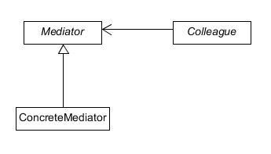

- 抽象中介者角色：定义统一的接口，用于各同事角色之间的通信
- 具体中介者角色：通过协调各同事角色实现协作行为，因此它必须依赖于各个同事角色。
- 同事角色：每一个同事角色都知道中介者角色，而且与其他的同事角色通信的时候，一定要通过中介者角色协作。每个同事类的行为分为两种：一种是同事本身的行为，比如改变对象本身的状态，处理自己的行为等，这种方法叫做自发行为(Self-Method)，与其他的同事类或中介者没有任何的依赖；第二种是必须依赖中介者才能完成的行为，叫做依赖方法(Dep-Method)。

同事类必须有中介者，而中介者却可以只有部分同事类。

**特点：**

中介者模式的优点就是减少类间的依赖，把原有的一对多的依赖变成了一对一的依赖，同事类只依赖中介者，减少了依赖，当然同时也降低了类间的耦合。

中介者模式的缺点就是中介者会膨胀得很大，而且逻辑复杂，原本N个对象直接的相互依赖关系转换为中介者和同事类的依赖关系，同事类越多，中介者的逻辑就越复杂。

**使用场景：**

中介者模式适用于多个对象之间紧密藕合的情况，紧密耦合的标准是：在类图中出现了蜘蛛网状结构。在这种情况下一定要考虑使用中介者模式，这有利于把蜘蛛网梳理为星型结构，使原本复杂混乱的关系变得清晰简单。

**实际应用**

中介者模式也叫做调停者模式，是什么意思呢？一个对象要和N多个对象交流，就像对象间的战争，很混乱。这时，需要加入一个中心，所有的类都和中心交流，中心说怎么处理就怎么处理。

- 机场调度中心
- MVC框架：其中的C(Controller)就是一个中介者，叫做前端控制器(Front Controller)，它的作用就是把M（Model，业务逻辑）和V（View，视图）隔离开，协调M和V协同工作，把M运行的结果和V代表的视图融合成一个前端可以展示的页面，减少M和V的依赖关系。
- 媒体网关
- 中介服务

**最佳实践**

- N个对象之间产生了相互的依赖关系(N>2)。
- 多个对象有依赖关系，但是依赖的行为尚不确定或者有发生改变的可能，在这种情况下一般建议采用中介者模式，降低变更引起的风险扩散。
- 产品开发。一个明显的例子就是MVC框架，把中介者模式应用到产品中，可以提升产品的性能和扩展性，但是对于项目开发就未必，因为项目是以交付投产为目标，而产品则是以稳定、高效、扩展为宗旨。

**实现：**

Alarm（闹钟）、CoffeePot（咖啡壶）、Calendar（日历）、Sprinkler（喷头）是一组相关的对象，在某个对象的事件产生时需要去操作其它对象，形成了下面这种依赖结构：

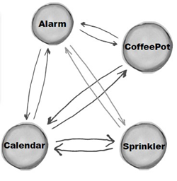

使用中介者模式可以将复杂的依赖结构变成星形结构：


```java
public abstract class Colleague {
    public abstract void onEvent(Mediator mediator);
}

public class Alarm extends Colleague {
    @Override
    public void onEvent(Mediator mediator) {
        mediator.doEvent("alarm");
    }

    public void doAlarm() {
        System.out.println("doAlarm()");
    }
}

public class CoffeePot extends Colleague {
    @Override
    public void onEvent(Mediator mediator) {
        mediator.doEvent("coffeePot");
    }

    public void doCoffeePot() {
        System.out.println("doCoffeePot()");
    }
}

public class Calender extends Colleague {
    @Override
    public void onEvent(Mediator mediator) {
        mediator.doEvent("calender");
    }

    public void doCalender() {
        System.out.println("doCalender()");
    }
}

public class Sprinkler extends Colleague {
    @Override
    public void onEvent(Mediator mediator) {
        mediator.doEvent("sprinkler");
    }

    public void doSprinkler() {
        System.out.println("doSprinkler()");
    }
}

public abstract class Mediator {
    public abstract void doEvent(String eventType);
}

public class ConcreteMediator extends Mediator {
    private Alarm alarm;
    private CoffeePot coffeePot;
    private Calender calender;
    private Sprinkler sprinkler;

    public ConcreteMediator(Alarm alarm, CoffeePot coffeePot, Calender calender, Sprinkler sprinkler) {
        this.alarm = alarm;
        this.coffeePot = coffeePot;
        this.calender = calender;
        this.sprinkler = sprinkler;
    }

    @Override
    public void doEvent(String eventType) {
        switch (eventType) {
            case "alarm":
                doAlarmEvent();
                break;
            case "coffeePot":
                doCoffeePotEvent();
                break;
            case "calender":
                doCalenderEvent();
                break;
            default:
                doSprinklerEvent();
        }
    }

    public void doAlarmEvent() {
        alarm.doAlarm();
        coffeePot.doCoffeePot();
        calender.doCalender();
        sprinkler.doSprinkler();
    }

    public void doCoffeePotEvent() {
        // ...
    }

    public void doCalenderEvent() {
        // ...
    }

    public void doSprinklerEvent() {
        // ...
    }
}

public class Client {
    public static void main(String[] args) {
        Alarm alarm = new Alarm();
        CoffeePot coffeePot = new CoffeePot();
        Calender calender = new Calender();
        Sprinkler sprinkler = new Sprinkler();
        Mediator mediator = new ConcreteMediator(alarm, coffeePot, calender, sprinkler);
        // 闹钟事件到达，调用中介者就可以操作相关对象
        alarm.onEvent(mediator);
    }
}
```


### 6.备忘录

**定义：**

在不破坏封装性的前提下，捕获一个对象的内部状态，并在该对象之外保存这个状态。这样以后就可将该对象恢复到原先保存的状态。

**类图：**


- Originator发起人角色：记录当前时刻的内部状态，负责定义哪些属于备份范围的状态，负责创建和恢复备忘录数据。

- Memento备忘录角色：负责存储Originator发起人对象的内部状态，在需要的时候提供发起人需要的内部状态。

- Caretaker备忘录管理员角色：对备忘录进行管理、保存和提供备忘录。

**应用**

使用场景：

- 需要保存和恢复数据的相关状态场景。

- 提供一个可回滚(rollback)的操作

- 需要监控的副本场景中。例如要监控一个对象的属性，但是监控又不应该作为系统的主业务来调用，它只是边缘应用，即使出现监控不准，错误报警也影响不大，因此一般的做法是备份一个主线程中的对象，然后由分析程序来分析。

- 数据库连接的事务管理就是用的备忘录模式

注意事项：

- 备忘录的生命期：备忘录创建出来就要在“最近”的代码中使用，要主动管理它的生命周期，建立就要使用，不使用就要立刻删除其引用，等待垃圾回收器对它的回收处理。

- 备忘录的性能：不要在频繁建立备份的场景中使用备忘录模式（比如一个for循环中），原因有二：一是控制不了备忘录建立的对象数量，二是大对象的建立是要消耗资源的，系统的性能需要考虑。因此，如果出现这样的代码，设计师就应该好好想想怎么修改架构了。

**扩展**

clone方式的备忘录


多状态备忘录模式


多备份的备忘录

**实现：**

以下实现了一个简单计算器程序，可以输入两个值，然后计算这两个值的和。备忘录模式允许将这两个值存储起来，然后在某个时刻用存储的状态进行恢复。

实现参考：[Memento Pattern - Calculator Example - Java Sourcecode](https://www.oodesign.com/memento-pattern-calculator-example-java-sourcecode.html)

```java
/**
 * Originator Interface
 */
public interface Calculator {
    // Create Memento
    PreviousCalculationToCareTaker backupLastCalculation();
    // setMemento
    void restorePreviousCalculation(PreviousCalculationToCareTaker memento);
    int getCalculationResult();
    void setFirstNumber(int firstNumber);
    void setSecondNumber(int secondNumber);
}

/**
 * Originator Implementation
 */
public class CalculatorImp implements Calculator {
    private int firstNumber;
    private int secondNumber;

    @Override
    public PreviousCalculationToCareTaker backupLastCalculation() {
        // create a memento object used for restoring two numbers
        return new PreviousCalculationImp(firstNumber, secondNumber);
    }

    @Override
    public void restorePreviousCalculation(PreviousCalculationToCareTaker memento) {
        this.firstNumber = ((PreviousCalculationToOriginator) memento).getFirstNumber();
        this.secondNumber = ((PreviousCalculationToOriginator) memento).getSecondNumber();
    }

    @Override
    public int getCalculationResult() {
        // result is adding two numbers
        return firstNumber + secondNumber;
    }

    @Override
    public void setFirstNumber(int firstNumber) {
        this.firstNumber = firstNumber;
    }

    @Override
    public void setSecondNumber(int secondNumber) {
        this.secondNumber = secondNumber;
    }
}
/**
 * Memento Interface to Originator
 *
 * This interface allows the originator to restore its state
 */
public interface PreviousCalculationToOriginator {
    int getFirstNumber();
    int getSecondNumber();
}

/**
 *  Memento interface to CalculatorOperator (Caretaker)
 */
public interface PreviousCalculationToCareTaker {
    // no operations permitted for the caretaker
}

/**
 * Memento Object Implementation
 * <p>
 * Note that this object implements both interfaces to Originator and CareTaker
 */
public class PreviousCalculationImp implements PreviousCalculationToCareTaker,
        PreviousCalculationToOriginator {
    private int firstNumber;
    private int secondNumber;

    public PreviousCalculationImp(int firstNumber, int secondNumber) {
        this.firstNumber = firstNumber;
        this.secondNumber = secondNumber;
    }

    @Override
    public int getFirstNumber() {
        return firstNumber;
    }

    @Override
    public int getSecondNumber() {
        return secondNumber;
    }
}

/**
 * CareTaker object
 */
public class Client {
    public static void main(String[] args) {
        // program starts
        Calculator calculator = new CalculatorImp();

        // assume user enters two numbers
        calculator.setFirstNumber(10);
        calculator.setSecondNumber(100);

        // find result
        System.out.println(calculator.getCalculationResult());

        // Store result of this calculation in case of error
        PreviousCalculationToCareTaker memento = calculator.backupLastCalculation();

        // user enters a number
        calculator.setFirstNumber(17);

        // user enters a wrong second number and calculates result
        calculator.setSecondNumber(-290);

        // calculate result
        System.out.println(calculator.getCalculationResult());

        // user hits CTRL + Z to undo last operation and see last result
        calculator.restorePreviousCalculation(memento);

        // result restored
        System.out.println(calculator.getCalculationResult());
    }
}
```

输出：

  110
   -273
   110

**JDK**

- java.io.Serializable


### 7.观察者

**定义：**

观察者模式(Observer Pattern)也叫做发布订阅模式(Publishlsubscribe)。定义对象间一种一对多的依赖关系，使得每当一个对象改变状态，则所有依赖于它的对象都会得到通知并被自动更新。

**类图：**

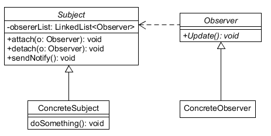

- Subject被观察者：定义被观察者必须实现的职责，它必须能够动态地增加、取消观察者。它一般是抽象类或者是实现类，仅仅完成作为被观察者必须实现的职责：管理观察者并通知观察者。

- Observer观察者：观察者接收到消息后，即进行update（更新方法）操作，对接收到的信息进行处理。

- ConcreteSubject具体的被观察者：定义被观察者自己的业务逻辑，同时定义对哪些事件进行通知。

- ConcreteObserver具体的观察者：每个观察在接收到消息后的处理反应不同，各个观察者有自己的处理逻辑。

**特点**

**优点：**

- 观察者和被观察者之间是抽象耦合：如此设计，则不管是增加观察者还是被观察者都非常容易扩展，而且在Java中都已经实现的抽象层级的定义，在系统扩展方面更是得心应手。

- 建立一套触发机制：根据单一职责原则，每个类的职责是单一的，那么怎么把各个单一的职责串联成真实世界的复杂的逻辑关系呢？比如，我们去打猎，打死了一只母鹿，母鹿有三个幼崽，因失去了母鹿而饿死，尸体又被两只秃鹰争抢，因分配不均，秃鹰开始斗殴，然后赢弱的秃鹰死掉，生存下来的秃鹰，则因此扩大了地盘……这就是一个触发机制，形成了一个触发链。观察者模式可以完美地实现这里的链条形式。

**缺点：**

观察者模式需要考虑一下开发效率和运行效率问题，一个被观察者，多个观察者，开发和调试就会比较复杂，而且在Java中消息的通知默认是顺序执行，一个观察者卡壳，会影响整体的执行效率。在这种情况下， 一般考虑采用异步的方式。多级触发时的效率更是让人担忧，大家在设计时注意考虑。

**使用场景：**

- 关联行为场景。需要注意的是，关联行为是可拆分的，而不是“组合”关系。

- 事件多级触发场景。

- 跨系统的消息交换场景，如消息队列的处理机制。

**注意事项：**

- 在一个观察者模式中最多出现一个对象既是观察者也是被观察者，也就是说消息最多转发一次（传递两次）。它和责任链模式的最大区别就是观察者广播链在传播的过程中消息是随时更改的，它是由相邻的两个节点协商的消息结构；责任链模式在消息传递过程中基本上保持消息不可变，如果要改变，也只是在原有的消息土进行修正。

- 异步处理问题：如果观察者比较多，而且处理时间比较长怎么办？那就用异步呗，异步处理就要考虑钱程安全和队列的问题，这个大家有时间看看Message Queue，就会有更深的了解。

**扩展**

JAVA中的观察者模式，java.util.Observable（被观察者）实现类和java.util.Observer（观察者）接口。

项目中真实的观察者模式：

- 观察者和被观察者之间的消息沟通：被观察者状态改变会触发观察者的一个行为，同时会传递一个消息给观察者。在实际中一般的做法是：观察者中的update方法接受两个参数，一个是被观察者，一个是DTO(Data Transfer Object，数据传输对象)，DTO一般是一个纯洁的JavaBean，由被观察者生成，由观察者消费。当然，如果考虑到远程传输，一般消息是以XML格式传递。

- 观察者响应方式：我们这样来想一个问题，观察者是一个比较复杂的逻辑，它要接受被观察者传递过来的信息，同时还要对他们进行逻辑处理，在一个观察者多个被观察者的情况下，性能就需要提到日程上来考虑了，为什么呢？如果观察者来不及响应，被观察者的执行时间是不是也会被拉长？那现在的问题就是：观察者如何快速响应？有两个办法：一是采用多线程技术，甭管是被观察者启动线程还是观察者启动线程，都可以明显地提高系统性能，这也就是大家通常所说的异步架构，二是缓存技术，甭管你谁来，我已经准备了足够的资源给你了，我保证快速响应，这当然也是一种比较好方案，代价就是开发难度很大，而且压力测试要做的足够充分，这种方案也就是大家说的同步架构。

- 被观察者尽量自己做主：这是什么意思呢？被观察者的状态改变是否一定要通知观察者呢？不一定吧，在设计的时候要灵活考虑，否则会加重观察者的处理逻辑，一般是这样做的，对被观察者的业务逻辑doSomething方法实现重载，如增加一个doSomething(boolean isNotifyObs)方法，决定是否通知观察者，而不是在消息到达观察者时才判断是否要消费。

**实现**

天气数据布告板会在天气信息发生改变时更新其内容，布告板有多个，并且在将来会继续增加。

```java
public interface Subject {
    void registerObserver(Observer o);
    void removeObserver(Observer o);
    void notifyObserver();
}

public class WeatherData implements Subject {
    private List<Observer> observers;
    private float temperature;
    private float humidity;
    private float pressure;

    public WeatherData() {
        observers = new ArrayList<>();
    }

    public void setMeasurements(float temperature, float humidity, float pressure) {
        this.temperature = temperature;
        this.humidity = humidity;
        this.pressure = pressure;
        notifyObserver();
    }

    @Override
    public void registerObserver(Observer o) {
        observers.add(o);
    }

    @Override
    public void removeObserver(Observer o) {
        int i = observers.indexOf(o);
        if (i >= 0) {
            observers.remove(i);
        }
    }

    @Override
    public void notifyObserver() {
        for (Observer o : observers) {
            o.update(temperature, humidity, pressure);
        }
    }
}

public interface Observer {
    void update(float temp, float humidity, float pressure);
}

public class StatisticsDisplay implements Observer {
    public StatisticsDisplay(Subject weatherData) {
        weatherData.reisterObserver(this);
    }

    @Override
    public void update(float temp, float humidity, float pressure) {
        System.out.println("StatisticsDisplay.update: " + temp + " " + humidity + " " + pressure);
    }
}

public class CurrentConditionsDisplay implements Observer {

    public CurrentConditionsDisplay(Subject weatherData) {
        weatherData.registerObserver(this);
    }

    @Override
    public void update(float temp, float humidity, float pressure) {
        System.out.println("CurrentConditionsDisplay.update: " + temp + " " + humidity + " " + pressure);
    }
}

public class WeatherStation {
    public static void main(String[] args) {
        WeatherData weatherData = new WeatherData();
        CurrentConditionsDisplay currentConditionsDisplay = new CurrentConditionsDisplay(weatherData);
        StatisticsDisplay statisticsDisplay = new StatisticsDisplay(weatherData);

        weatherData.setMeasurements(0, 0, 0);
        weatherData.setMeasurements(1, 1, 1);
    }
}
```

输出：

CurrentConditionsDisplay.update: 0.0 0.0 0.0
 StatisticsDisplay.update: 0.0 0.0 0.0
 CurrentConditionsDisplay.update: 1.0 1.0 1.0
 StatisticsDisplay.update: 1.0 1.0 1.0

**JDK**

- [java.util.Observer](http://docs.oracle.com/javase/8/docs/api/java/util/Observer.html)

- [java.util.EventListener](http://docs.oracle.com/javase/8/docs/api/java/util/EventListener.html)

- [javax.servlet.http.HttpSessionBindingListener](http://docs.oracle.com/javaee/7/api/javax/servlet/http/HttpSessionBindingListener.html)

- [RxJava](https://github.com/ReactiveX/RxJava)


#### 8.状态

**定义：**

GOF《设计模式》中给状态模式下的定义为：允许一个对象在其内部状态改变时改变它的行为。这个对象看起来似乎修改了它的类。看起来，状态模式好像是神通广大——居然能够“修改自身的类”！ 

能够让程序根据不同的外部情况来做出不同的响应，最直接的方法就是在程序中将这些可能发生的外部情况全部考虑到，使用 if else 语句来进行代码响应选择。但是这种方法对于复杂一点的状态判断，就会显得杂乱无章，容易产生错误；而且增加一个新的状态将会带来大量的修改。这个时候“能够修改自身”的状态模式的引入也许是个不错的主意。 

状态模式可以有效的替换充满在程序中的 if else 语句：将不同条件下的行为封装在一个类里面，再给这些类一个统一的父类来约束他们。

**类图：**


1) 使用环境（Context）角色：客户程序是通过它来满足自己的需求。它定义了客户程序需要的接口；并且维护一个具体状态角色的实例，这个实例来决定当前的状态。 

2) 状态（State）角色：定义一个接口以封装与使用环境角色的一个特定状态相关的行为。 

3) 具体状态（Concrete State）角色：实现状态角色定义的接口。

**特点**

在引子中已经提到，状态模式在具体实现上存在不同的方案。因此这里重点就这些不同的实现方式进行介绍和讨论。 

首先，实现时是否将状态角色、具体状态角色暴露给客户程序？按照 GOF 的建议是不希望将状态角色暴露给客户程序的，与客户程序打交道的仅仅是使用环境角色，客户是不知道系统是怎么实现的，更不关心有几个具体状态。但是当使用环境角色中的初始状态紧紧依赖于客户程序时，似乎暴露是在所难免的——这就与策略模式异常相似了！ 

具体状态角色中的行为一般是与使用环境角色密切相关的。因此这里便有了一个小细节：我们把使用环境角色作为参数传递进入具体状态角色后，是在具体状态角色中来实现状态响应行为；还是仅仅调用在使用环境角色中已经实现了的方法？由于这些行为往往与使用环境角色相关，所以按照《重构》一书的“指导”——后一种实现方法是比较地道的。 

从定义可知，状态模式是要应对状态转换的。那么状态的转换在哪里定义呢？你可以选择在使用环境角色的代码中来表现出来，当然这便意味着状态转变的规则就固定下来了。

GOF还给出了另外一种稍微灵活一点的实现方式：在每一个具体状态角色中来指定后续状态以及何时进行转换。 

其实在java强大的反射机制的支持下，我们还可以将状态的转换做的更加灵活——我们可以将状态转换的规则写在.xml等等的配置文件里面甚至是数据库中，我们姑且叫做状态转换表。进行转换前，根据状态转换表来读取下一个状态，然后利用反射获得具体的状态对象……。哈哈，看起来很不错的样子，只是效率可能低一些——当然在企业应用中这应该不是最重要的。  

状态模式已经被我们想象着“实现”了一番。那么状态模式的引入会给我们的程序带来哪些优势呢？前面我们已经说过：状态模式的引入免除了代码中复杂而庸长的逻辑判断语句。而且具体状态角色将具体状态和它对应的行为封装了起来，这使得增加一种新的状态变得简单一些。而且如果设计合理得话，具体状态角色可以被重用（和策略模式一样，可以考虑使用享元模式来实现）。 

使用状态模式也会带来一些问题。每个状态对应一个具体的状态类，使得整体分散，逻辑不太清晰。当然对于一个状态非常多的系统，状态模式带来的优点还是大于它的缺点的。 

由上面的分析就可以很明确的知道什么时候该使用状态模式了。下面是 GOF 在《设计模式》中给出的状态模式的适用情况： 

1) 一个对象的行为取决于它的状态，并且它必须在运行时刻根据状态改变它的行为。 

2) 一个操作中含有庞大的多分支的条件语句，且这些分支依赖于该对象的状态。 

仔细对比状态模式和策略模式，难免会产生疑问：这两个明明是一个东西嘛！下面我们就来分析下两者区别。 

首先我要声明，在实际应用中只要能够使得你的代码灵活漂亮起来，何必计较这些方方面面的差别呢？ 

Brandon Goldfedder在《模式的乐趣》里是怎么说的：“strategy模式在结构上与 state模式非常相似，但是在概念上，他们的目的差异非常大。区分这两个模式的关键是看行为是由状态驱动还是由一组算法驱动，这条规则似乎有点随意，但是在判断时还是需要考虑它。通常，State 模式的“状态”是在对象内部的，Strategy 模式的“策略”可以在对象外部，不过这也不是一条严格、可靠的规则。” 

我很同意 Brandon Goldfedder 的观点。这两个模式的划分，就在于使用的目的是不同的——策略模式用来处理算法变化，而状态模式则是处理状态变化（好玄乎阿）。策略模式中，算法是否变化完全是由客户程序开决定的，而且往往一次只能选择一种算法，不存在算法中途发生变化的情况。而状态模式如定义中所言，在它的生命周期中存在着状态的转变和行为得更改，而且状态变化是一个线形的整体；对于客户程序来言，这种状态变化往往是透明的。 

**实现：**

糖果销售机有多种状态，每种状态下销售机有不同的行为，状态可以发生转移，使得销售机的行为也发生改变。

```java
public interface State {
    /**
     * 投入 25 分钱
     */
    void insertQuarter();

    /**
     * 退回 25 分钱
     */
    void ejectQuarter();

    /**
     * 转动曲柄
     */
    void turnCrank();

    /**
     * 发放糖果
     */
    void dispense();
}

public class HasQuarterState implements State {

    private GumballMachine gumballMachine;

    public HasQuarterState(GumballMachine gumballMachine) {
        this.gumballMachine = gumballMachine;
    }

    @Override
    public void insertQuarter() {
        System.out.println("You can't insert another quarter");
    }

    @Override
    public void ejectQuarter() {
        System.out.println("Quarter returned");
        gumballMachine.setState(gumballMachine.getNoQuarterState());
    }

    @Override
    public void turnCrank() {
        System.out.println("You turned...");
        gumballMachine.setState(gumballMachine.getSoldState());
    }

    @Override
    public void dispense() {
        System.out.println("No gumball dispensed");
    }
}

public class NoQuarterState implements State {

    GumballMachine gumballMachine;

    public NoQuarterState(GumballMachine gumballMachine) {
        this.gumballMachine = gumballMachine;
    }

    @Override
    public void insertQuarter() {
        System.out.println("You insert a quarter");
        gumballMachine.setState(gumballMachine.getHasQuarterState());
    }

    @Override
    public void ejectQuarter() {
        System.out.println("You haven't insert a quarter");
    }

    @Override
    public void turnCrank() {
        System.out.println("You turned, but there's no quarter");
    }

    @Override
    public void dispense() {
        System.out.println("You need to pay first");
    }
}

public class SoldOutState implements State {

    GumballMachine gumballMachine;

    public SoldOutState(GumballMachine gumballMachine) {
        this.gumballMachine = gumballMachine;
    }

    @Override
    public void insertQuarter() {
        System.out.println("You can't insert a quarter, the machine is sold out");
    }

    @Override
    public void ejectQuarter() {
        System.out.println("You can't eject, you haven't inserted a quarter yet");
    }

    @Override
    public void turnCrank() {
        System.out.println("You turned, but there are no gumballs");
    }

    @Override
    public void dispense() {
        System.out.println("No gumball dispensed");
    }
}

public class SoldState implements State {

    GumballMachine gumballMachine;

    public SoldState(GumballMachine gumballMachine) {
        this.gumballMachine = gumballMachine;
    }

    @Override
    public void insertQuarter() {
        System.out.println("Please wait, we're already giving you a gumball");
    }

    @Override
    public void ejectQuarter() {
        System.out.println("Sorry, you already turned the crank");
    }

    @Override
    public void turnCrank() {
        System.out.println("Turning twice doesn't get you another gumball!");
    }

    @Override
    public void dispense() {
        gumballMachine.releaseBall();
        if (gumballMachine.getCount() > 0) {
            gumballMachine.setState(gumballMachine.getNoQuarterState());
        } else {
            System.out.println("Oops, out of gumballs");
            gumballMachine.setState(gumballMachine.getSoldOutState());
        }
    }
}

public class GumballMachine {

    private State soldOutState;
    private State noQuarterState;
    private State hasQuarterState;
    private State soldState;

    private State state;
    private int count = 0;

    public GumballMachine(int numberGumballs) {
        count = numberGumballs;
        soldOutState = new SoldOutState(this);
        noQuarterState = new NoQuarterState(this);
        hasQuarterState = new HasQuarterState(this);
        soldState = new SoldState(this);

        if (numberGumballs > 0) {
            state = noQuarterState;
        } else {
            state = soldOutState;
        }
    }

    public void insertQuarter() {
        state.insertQuarter();
    }

    public void ejectQuarter() {
        state.ejectQuarter();
    }

    public void turnCrank() {
        state.turnCrank();
        state.dispense();
    }

    public void setState(State state) {
        this.state = state;
    }

    public void releaseBall() {
        System.out.println("A gumball comes rolling out the slot...");
        if (count != 0) {
            count -= 1;
        }
    }

    public State getSoldOutState() {
        return soldOutState;
    }

    public State getNoQuarterState() {
        return noQuarterState;
    }

    public State getHasQuarterState() {
        return hasQuarterState;
    }

    public State getSoldState() {
        return soldState;
    }

    public int getCount() {
        return count;
    }
}

public class Client {

    public static void main(String[] args) {
        GumballMachine gumballMachine = new GumballMachine(5);

        gumballMachine.insertQuarter();
        gumballMachine.turnCrank();

        gumballMachine.insertQuarter();
        gumballMachine.ejectQuarter();
        gumballMachine.turnCrank();

        gumballMachine.insertQuarter();
        gumballMachine.turnCrank();
        gumballMachine.insertQuarter();
        gumballMachine.turnCrank();
        gumballMachine.ejectQuarter();

        gumballMachine.insertQuarter();
        gumballMachine.insertQuarter();
        gumballMachine.turnCrank();
        gumballMachine.insertQuarter();
        gumballMachine.turnCrank();
        gumballMachine.insertQuarter();
        gumballMachine.turnCrank();
    }
}
```

**输出：**

```markdown
You insert a quarter
You turned...
A gumball comes rolling out the slot...
You insert a quarter
Quarter returned
You turned, but there's no quarter
You need to pay first
You insert a quarter
You turned...
A gumball comes rolling out the slot...
You insert a quarter
You turned...
A gumball comes rolling out the slot...
You haven't insert a quarter
You insert a quarter
You can't insert another quarter
You turned...
A gumball comes rolling out the slot...
You insert a quarter
You turned...
A gumball comes rolling out the slot...
Oops, out of gumballs
You can't insert a quarter, the machine is sold out
You turned, but there are no gumballs
No gumball dispensed
```


#### 9.策略

**定义：**

策略模式(Strategy Pattern)是一种比较简单的模式，也叫做政策模式(Policy Pattern)。其定义如下：定义一组算法，将每个算法都封装起来，并且使它们之间可以互换。

**类图：**

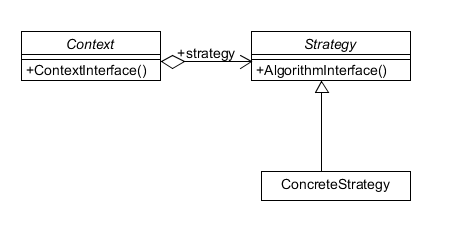

- Context封装角色：它也叫做上下文角色，起承上启下封装作用，屏蔽高层模块对策略、算法的直接访问，封装可能存在的变化。

- Strategy抽象策略角色：策略、算法家族的抽象，通常为接口，定义每个策略或算法必须具有的方法和属性。

- ConcreteStrategy具体策略角色：实现抽象策略中的操作，该类含有具体的算法。

策略模式的重点就是封接角色，它是借用了代理模式的思路。它和代理模式有什么差别，差别就是策略模式的封装角色和被封装的策略类不用是同一个接口，如果是同一个接口那就成为了代理模式。

**特点**

策略模式的优点：

- 算法可以自由切换：这是策略模式本身定义的，只要实现抽象策略，它就成为策略家族的一个成员，通过封装角色对其进行封装，保证对外提供“可自由切换”的策略。

- 避免使用多重条件判断：如果没有策略模式，我们想想看会是什么样子？一个策略家族有5个策略算法，一会要使用A策略，一会要使用B策略，怎么设计呢？使用多重的条件语句？多重条件语句不易维护，而且出错的概率大大增强。使用策略模式后，可以由其他模块决定采用何种策略，策略家族对外提供的访问接口就是封装类，简化了操作，同时避免了条件语句判断。

- 扩展性良好：在现有的系统中增加一个策略太容易了，只要实现接口就可以了，其他都不用修改，类似于一个可反复拆卸的插件，这大大地符合了OCP原则。

策略模式的缺点：

- 策略类数量增多

- 所有的策略类都需要对外暴露：这是原装策略模式的一个缺点，幸运的是，我们可以使用其他模式来修正这个缺陷，如工厂方法模式、代理模式或享元模式。

策略模式的使用场景：

- 多个类只有在算法或行为上稍有不同的场景。

- 算法需要自由切换的场景。

- 需要屏蔽算法规则的场景。

策略模式的注意事项：

如果系统中的一个策略家族的具体策略数量超过4个，则需要考虑使用混合模式，解决策略类膨胀和对外暴露的问题。

策略模式的扩展：策略枚举

**最佳实践**

和工厂方法模式混编

**实现**

设计一个鸭子，它可以动态地改变叫声。这里的算法族是鸭子的叫声行为。

```java
public interface QuackBehavior {
    void quack();
}

public class Quack implements QuackBehavior {
    @Override
    public void quack() {
        System.out.println("quack!");
    }
}

public class Squeak implements QuackBehavior{
    @Override
    public void quack() {
        System.out.println("squeak!");
    }
}

public class Duck {
    private QuackBehavior quackBehavior;

    public void performQuack() {
        if (quackBehavior != null) {
            quackBehavior.quack();
        }
    }

    public void setQuackBehavior(QuackBehavior quackBehavior) {
        this.quackBehavior = quackBehavior;
    }
}

public class Client {

    public static void main(String[] args) {
        Duck duck = new Duck();
        duck.setQuackBehavior(new Squeak());
        duck.performQuack();
        duck.setQuackBehavior(new Quack());
        duck.performQuack();
    }
}
```

**输出：**

  squeak!
  quack!

**JDK**

- java.util.Comparator#compare()
- javax.servlet.http.HttpServlet
- javax.servlet.Filter#doFilter()


#### 10.模板方法

**定义**

这是一个很简单的模式，却被非常广泛的使用。之所以简单是因为在这个模式中仅仅使用到了继承关系。 

继承关系由于自身的缺陷，被专家们扣上了“罪恶”的帽子。“使用委派关系代替继承关系”，“尽量使用接口实现而不是抽象类继承”等等专家警告，让我们这些菜鸟对继承“另眼相看”。 

其实，继承还是有很多自身的优点所在。只是被大家滥用的似乎缺点更加明显了。合理的利用继承关系，还是能对你的系统设计起到很好的作用的。而模板方法模式就是其中的一个使用范例。

模板方法(Template Method)模式：定义一个操作中的算法的骨架，而将一些步骤延迟到子类中。使得子类可以不改变一个算法的结构即可重定义该算法的某些特定步骤。这里的算法的结构，可以理解为你根据需求设计出来的业务流程。特定的步骤就是指那些可能在内容上存在变数的环节。 

可以看出来，模板方法模式也是为了巧妙解决变化对系统带来的影响而设计的。使用模板方法使系统扩展性增强，最小化了变化对系统的影响。这一点，在下面的举例中可以很明显的看出来。

**类图** 

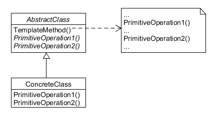

1)  抽象类（Abstract Class）：定义了一到多个的抽象方法，以供具体的子类来实现它们；而且还要实现一个模板方法，来定义一个算法的骨架。该模板方法不仅调用前面的抽象方法，也可以调用其他的操作，只要能完成自身的使命。 为了防止恶意的操作，一般模板方法都加上final关键字，不允许被覆写。抽象模板中的基本方法尽量设计为protected类型，符合迪米特法则，不需要暴露的属性或方法尽量不要设置为public类型。

2)  具体类（Concrete Class）：实现父类中的抽象方法以完成算法中与特定子类相关的步骤。实现类若非必要，尽量不要扩大父类中的访问权限。

**特点**

根据上面对定义的分析，可以看出模板方法适用于以下情况： 

1)  一次性实现一个算法的不变的部分，并将可变的行为留给子类来实现。 

2)  各子类中公共的行为应被提取出来并集中到一个公共父类中以避免代码重复。其实这可以说是一种好的编码习惯了。 

3)  控制子类扩展。模板方法只在特定点调用操作，这样就只允许在这些点进行扩展。如果你不愿子类来修改你的模板方法定义的框架，你可以采用两种方式来做：一是在 API 中不体现出你的模板方法；或者将你的模板方法置为 final就可以了。 

可以看出，使用模板方法模式可以将代码的公共行为提取出来，达到复用的目的。而且，在模板方法模式中，是由父类的模板方法来控制子类中的具体实现。这样你在实现子类的时候，根本不需要对业务流程有太多的了解。

按照我们的设计习惯，抽象类负责声明最抽象、最一般的事物属性和方法，实现类完成具体的事物属性和方法。但是模板方法模式却颠倒了，抽象类定义了部分抽象方法，由子类实现，子类执行的结果影响了父类的结果，也就是子类对父类产生了影响，这在复杂的项目中，会带来代码阅读的难度，而且也会让新手产生不适感。

**使用场景**

- 多个子类有公有的方法， 并且逻辑基本相同时。
- 重要、复杂的算法，可以把核心算法设计为模板方法，周边的相关细节功能则由各个子类实现。
- 重构时，模板模式是一个经常使用的模式，把相同的代码抽取到父类中，然后通过钩子函数约束其行为。

**实现**

冲咖啡和冲茶都有类似的流程，但是某些步骤会有点不一样，要求复用那些相同步骤的代码。

```java
public abstract class CaffeineBeverage {

    final void prepareRecipe() {
        boilWater();
        brew();
        pourInCup();
        addCondiments();
    }

    abstract void brew();

    abstract void addCondiments();

    void boilWater() {
        System.out.println("boilWater");
    }

    void pourInCup() {
        System.out.println("pourInCup");
    }
}

public class Coffee extends CaffeineBeverage {
    @Override
    void brew() {
        System.out.println("Coffee.brew");
    }

    @Override
    void addCondiments() {
        System.out.println("Coffee.addCondiments");
    }
}

public class Tea extends CaffeineBeverage {
    @Override
    void brew() {
        System.out.println("Tea.brew");
    }

    @Override
    void addCondiments() {
        System.out.println("Tea.addCondiments");
    }
}

public class Client {
    public static void main(String[] args) {
        CaffeineBeverage caffeineBeverage = new Coffee();
        caffeineBeverage.prepareRecipe();
        System.out.println("-----------");
        caffeineBeverage = new Tea();
        caffeineBeverage.prepareRecipe();
    }
}
```

**输出：**

```markdown
boilWater
Coffee.brew
pourInCup
Coffee.addCondiments
\-----------
boilWater
Tea.brew
pourInCup
Tea.addCondiments
```

**JDK**

- java.util.Collections#sort()
- java.io.InputStream#skip()
- java.io.InputStream#read()
- java.util.AbstractList#indexOf()


#### 11.访问者

**定义**

封装一些作用于某种数据结构中的各元素的操作，它可以在不改变数据结构的前提下定义作用于这些元素的新的操作。

可以这样理解坊问者模式，我作为一个访客(Visitor)到朋友家(Visited Class)去拜访，朋友之间聊聊天，喝喝酒，再相互吹捧吹捧，炫耀炫耀，这都正常。聊天的时候，朋友告诉我，他今年加官进爵了，工资也涨了30%，准备再买套房子，那我就在心里盘算(Visitor-self-method)“你这么有钱，我去年要借10万你都不借”，我根据朋友的信息，执行了自己的一个方法。

**类图**

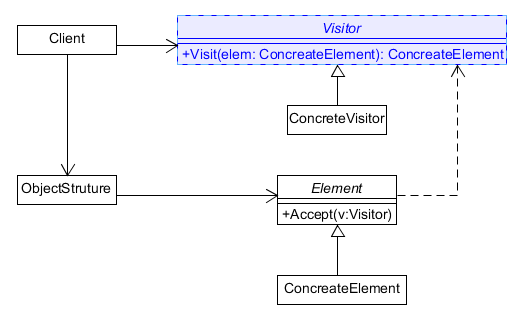

Visitor（抽象访问者）：抽象类或者接口，声明访问者可以访问哪些元素，具体到程序中就是visit方法的参数定义哪些对象是可以被访问的。

ConcreteVisitor（具体访问者）：它影响访问者访问到一个类后该怎么干，要做什么事情。

Element（抽象元素）：接口或者抽象类，声明接受哪一类访问者访问，程序上是通过accept方法中的参数来定义的。

ConcreteElement（具体元素）：实现accept方法，通常是visitor.visit(this)，基本上都形成了一种模式了。

ObjectStruture（结构对象）：元素产生者，一般容纳在多个不同类、不同接口的容器，如List、Set 、Map等，在项目中，一般很少抽象出这个角色。

**特点**

**优点：**

n 符合单一职责原则：具体元素角色也就是Employee抽象类的两个子类负责数据的加载，而Visitor类则负责报表的展现，两个不同的职责非常明确地分离开来，各自演绎变化。

n 优秀的扩展性：由于职责分开，继续增加对数据的操作是非常快捷的，例如现在要增加一份给大老板的报表，这份报表格式又有所不同，直接在Visitor中增加一个方法，传递数据后进行整理打印。

n 灵活性非常高：例如，数据汇总，就以刚刚我们说的Employee的例子，如果我现在要统计所有员工的工资之和，怎么计算？把所有人的工资for循环加一遍？是个办法，那再提个问题，员工工资x1.2，部门经理x1.4，总经理x 1.8，然后把这些工资加起来，你怎么处理？1.2, 1.4, 1.8是什么？不是吧？你没看到领导不论什么时候都比你拿得多，工资奖金就不说了，就是过节发个慰问券也比你多，就是这个系数在作祟。我们继续说你想怎么统计？使用for循环，然后使用instanceof来判断是员工还是经理？这可以解决，但不是个好办法，好办法是通过访问者模式来实现，把数据扔给访问者，由访问者来进行统计计算。

**缺点：**

n 具体元素对访问者公布细节：访问者要访问一个类就必然要求这个类公布一些方法和数据，也就是说访问者关注了其他类的内部细节，这是迪米特法则所不建议的。

n 具体元素变更比较困难：具体元素角色的增加、删除、修改都是比较困难的，要是想增加一个成员变量，Visitor就需要修改，如果Visitor是一个还好办，多个呢？业务逻辑再复杂点呢？

n 违背了依赖倒置转原则：访问者依赖的是具体元素，而不是抽象元素，这破坏了依赖倒置原则，特别是在面向对象的编程中，抛弃了对接口的依赖，而直接依赖实现类，扩展比较难。

**使用场景：**

一个对象结构包含很多类对象，它们有不同的接口，而你想对这些对象实施一些依赖于其具体类的操作，也就说是用迭代器模式已经不能胜任的情景。

需要对一个对象结构中的对象进行很多不同并且不相关的操作，而你想避免让这些操作“污染”这些对象的类。

总结一下，在这种地方你一定要考虑使用访问者模式：业务规则要求遍历多个不同的对象。这本身也是访问者模式出发点，选代器模式只能访问同类或同接口的数据（当然了，如果你使用instanceof，那么能访问所有的数据，这没有争论），而访问者模式是对迭代器模式的扩充，可以遍历不同的对象，然后执行不同的操作，也就是针对访问的对象不同，执行不同的操作。访问者模式还有一个用途，就是充当拦截器(Interceptor)角色。

**实现：**

```java
public interface Element {
    void accept(Visitor visitor);
}

class CustomerGroup {
    private List<Customer> customers = new ArrayList<>();

    void accept(Visitor visitor) {
        for (Customer customer : customers) {
            customer.accept(visitor);
        }
    }

    void addCustomer(Customer customer) {
        customers.add(customer);
    }
}

public class Customer implements Element {
    private String name;
    private List<Order> orders = new ArrayList<>();

    Customer(String name) {
        this.name = name;
    }

    String getName() {
        return name;
    }

    void addOrder(Order order) {
        orders.add(order);
    }

    public void accept(Visitor visitor) {
        visitor.visit(this);
        for (Order order : orders) {
            order.accept(visitor);
        }
    }
}

public class Order implements Element {
    private String name;
    private List<Item> items = new ArrayList();

    Order(String name) {
        this.name = name;
    }

    Order(String name, String itemName) {
        this.name = name;
        this.addItem(new Item(itemName));
    }

    String getName() {
        return name;
    }

    void addItem(Item item) {
        items.add(item);
    }

    public void accept(Visitor visitor) {
        visitor.visit(this);

        for (Item item : items) {
            item.accept(visitor);
        }
    }
}

public class Item implements Element {
    private String name;

    Item(String name) {
        this.name = name;
    }

    String getName() {
        return name;
    }

    public void accept(Visitor visitor) {
        visitor.visit(this);
    }
}

public interface Visitor {
    void visit(Customer customer);
    void visit(Order order);
    void visit(Item item);
}

public class GeneralReport implements Visitor {
    private int customersNo;
    private int ordersNo;
    private int itemsNo;

    public void visit(Customer customer) {
        System.out.println(customer.getName());
        customersNo++;
    }

    public void visit(Order order) {
        System.out.println(order.getName());
        ordersNo++;
    }

    public void visit(Item item) {
        System.out.println(item.getName());
        itemsNo++;
    }

    public void displayResults() {
        System.out.println("Number of customers: " + customersNo);
        System.out.println("Number of orders:    " + ordersNo);
        System.out.println("Number of items:     " + itemsNo);
    }
}

public class Client {
    public static void main(String[] args) {
        Customer customer1 = new Customer("customer1");
        customer1.addOrder(new Order("order1", "item1"));
        customer1.addOrder(new Order("order2", "item1"));
        customer1.addOrder(new Order("order3", "item1"));

        Order order = new Order("order_a");
        order.addItem(new Item("item_a1"));
        order.addItem(new Item("item_a2"));
        order.addItem(new Item("item_a3"));
        Customer customer2 = new Customer("customer2");
        customer2.addOrder(order);

        CustomerGroup customers = new CustomerGroup();
        customers.addCustomer(customer1);
        customers.addCustomer(customer2);

        GeneralReport visitor = new GeneralReport();
        customers.accept(visitor);
        visitor.displayResults();
    }
}
```

**输出：**

```markdown
customer1
order1
item1
order2
item1
order3
item1
customer2
order_a
item_a1
item_a2
item_a3
Number of customers: 2
Number of orders:    4
Number of items:     6
```

**JDK**

- javax.lang.model.element.Element and     javax.lang.model.element.ElementVisitor
- javax.lang.model.type.TypeMirror and     javax.lang.model.type.TypeVisitor


#### 12.空对象

**定义：**

使用什么都不做的空对象来代替 NULL。

一个方法返回 NULL，意味着方法的调用端需要去检查返回值是否是 NULL，这么做会导致非常多的冗余的检查代码。并且如果某一个调用端忘记了做这个检查返回值，而直接使用返回的对象，那么就有可能抛出空指针异常。

**类图：**

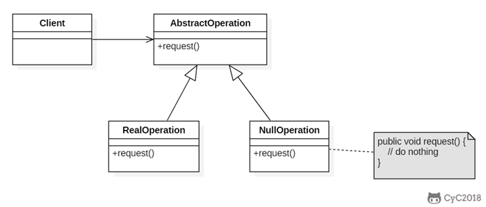

**实现：**

```java
public abstract class AbstractOperation {
    abstract void request();
}

public class RealOperation extends AbstractOperation {
    @Override
    void request() {
        System.out.println("do something");
    }
}

public class NullOperation extends AbstractOperation{
    @Override
    void request() {
        // do nothing
    }
}

public class Client {
    public static void main(String[] args) {
        AbstractOperation abstractOperation = func(-1);
        abstractOperation.request();
    }

    public static AbstractOperation func(int para) {
        if (para < 0) {
            return new NullOperation();
        }
        return new RealOperation();
    }
}
```


## 结构型

### 1.适配器

**定义：**

一个对象如果不存储实体状态以及对象之间的关系，该对象就叫做贫血对象，对应的领域模型就是贫血领域模型，有实体状态和对象关系的模型就是充血领域模型。

《设计模式》一书中是这样给适配器模式定义的：将一个类的接口转换成客户希望的另外一个接口。Adapter 模式使得原本由于接口不兼容而不能一起工作的那些类可以一起工作。

适配器模式又叫做变压器模式，也叫做包装模式(Wrapper)，但是包装模式可不止一个，还包括装饰模式。

可能你还是不太明白为什么要使用适配器模式。我们来举个例子也许能更直接的解除你的疑惑。 

比如，在一个画图的小程序中，你已经实现了绘制点、直线、方块等图形的功能。而且为了让客户程序在使用的时候不用去关心它们的不同，还使用了一个抽象类来规范这些图形的接口。现在你要来实现圆的绘制，这时你发现在系统其他的地方已经有了绘制圆的实现。在你庆幸之余，发现系统中已有的方法和你在抽象类中规定的方法名称不一样！这可怎么办？修改绘制圆的方法名，就要去修改所有使用它的地方；修改你的抽象类的方法名，也要去修改所有图形的实现方法以及已有的引用。还有其它的方法没有？那就是适配器模式了。 

可以看出使用适配器模式是为了在面向接口编程中更好的复用。如果你的系统中没有使用到面向接口编程，没有使用到多态，我想大概也不会使用到适配器模式。

**类图：**

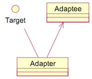

接着上面举的画图程序的例子，先来看看在添加绘制圆的需求前的类结构：

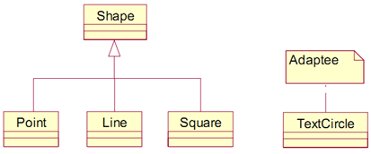

添加了圆的绘制以后的类结构：

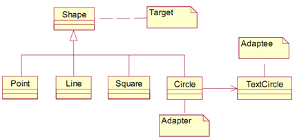

 

1)  目标（Target）角色：定义 Client 使用的接口。 

2)  被适配（Adaptee）角色：这个角色有一个已存在并使用了的接口，而这个接口是需要我们适配的。 

3)  适配器（Adapter）角色：这是适配器模式的核心。它将被适配角色已有的接口转换为目标角色希望的接口。

**特点**

**适配器模式的优点：**

- 增加类的透明性

- 提高类的复用度

- 灵活性非常好

**使用场景：**

你有动机修改一个已经投产中的接口时，适配器模式可能是最适合你的模式。

**注意事项：**

- 详细设计阶段不要考虑它

- 遵守依赖倒置原则和里氏替换原则，否则即使在适合使用适配器的场合，也会带来非常大的改造。

在《设计模式》一书中将适配器模式分为类适配器模式和对象适配器模式。区别仅在于适配器角色对于被适配角色的适配是通过继承完成的还是通过组合来完成的。由于在java中不支持多重继承，而且继承有破坏封装之嫌，众多的书中（包括《设计模式》）都提倡使用组合来代替继承。因此这里我们就不再对类适配器模式进行介绍（其实用的也很少）。 

在上一小节的类图中描述的就是对象适配器模式。Adapter对Adaptee的转换是通过组合来完成的。

其实在适配器角色中不仅仅可以完成接口转换的过程，而且还可以对其功能进行改进和扩充，当然这就不属于适配器模式描述的范围内了。 

还有一种代理模式，两者的主要区别在于代理模式应用的情况是不改变接口命名的，而且是对已有接口功能的一种控制；而适配器模式则强调接口转换。

在java中有一种叫做“缺省适配模式”的应用，它和我们所讲的适配器模式是完全的两种东西。缺省适配模式是为一个接口提供缺省的实现，这样子类型就可以从缺省适配模式中进行扩展，避免了从原有接口中扩展时要实现一些自己不关心的接口。在 java.awt.event 中的XXXAdapter就是它的很好的例子，有兴趣的可以看看。

适配器模式是一个补偿模式，或者说是一个“补救”模式，通常用来解决接口不相容的问题。

**实现：**

鸭子（Duck）和火鸡（Turkey）拥有不同的叫声，Duck 的叫声调用 quack() 方法，而 Turkey 调用 gobble() 方法。

要求将 Turkey 的 gobble() 方法适配成 Duck 的 quack() 方法，从而让火鸡冒充鸭子！

```java
public interface Duck {
    void quack();
}

public interface Turkey {
    void gobble();
}

public class WildTurkey implements Turkey {
    @Override
    public void gobble() {
        System.out.println("gobble!");
    }
}

public class TurkeyAdapter implements Duck {
    Turkey turkey;

    public TurkeyAdapter(Turkey turkey) {
        this.turkey = turkey;
    }

    @Override
    public void quack() {
        turkey.gobble();
    }
}

public class Client {
    public static void main(String[] args) {
        Turkey turkey = new WildTurkey();
        Duck duck = new TurkeyAdapter(turkey);
        duck.quack();
    }
}
```

**JDK**

- [java.util.Arrays#asList()](http://docs.oracle.com/javase/8/docs/api/java/util/Arrays.html#asList(T...))
- [java.util.Collections#list()](https://docs.oracle.com/javase/8/docs/api/java/util/Collections.html#list-java.util.Enumeration-)
- [java.util.Collections#enumeration()](https://docs.oracle.com/javase/8/docs/api/java/util/Collections.html#enumeration-java.util.Collection-)
- [javax.xml.bind.annotation.adapters.XMLAdapter](http://docs.oracle.com/javase/8/docs/api/javax/xml/bind/annotation/adapters/XmlAdapter.html#marshal-BoundType-)


### 2.桥接

**定义：**

将抽象部分与它的实现部分分离，使它们都可以独立地变化。这里的抽象部分和实现部分不是我们通常认为的父类与子类、接口与实现类的关系，而是组合关系。也就是说，实现部分是被抽象部分调用，来完成（实现）抽象部分的功能。

系统设计中，总是充满了各种变数，这是防不慎防的。面对这样那样的变动，你只能去不停的修改设计和代码，并且要开始新的一轮测试……。那采取什么样的方式可以较好的解决变化带给系统的影响？你可以分析变化的种类，将不变的框架使用抽象类定义出来，然后再将变化的内容使用具体的子类来分别实现。这样面向客户的只是一个抽象类，这种方式可以较好的避免为抽象类中现有接口添加新的实现所带来的影响，缩小了变化带来的影响。但是这可能会造成子类数量的爆炸，并且在某些时候不是很灵活。 

当这颗继承树上一些子树存在了类似的行为。这意味着这些子树中存在了几乎重复的功能代码。这时我们不妨将这些行为提取出来，也采用接口的方式提供出来，然后以组合的方式将服务提供给原来的子类。这样就达到了前端和被使用的后端独立的变化，而且还达到了后端的重用。 

其实这就是桥梁模式的诞生。

**类图：**

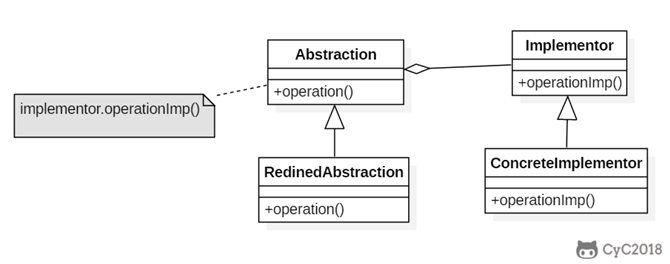

 

在《Thinking in Patterns with Java》一书中，作者将抽象部分叫做“front-end”（权且翻译为“前端”），而实现部分叫做“back-end”（后端）。这种叫法要比抽象实现什么的好理解多了。

1)  抽象（Abstraction）角色：它定义了抽象类的接口而且维护着一个指向实现（Implementor）角色的引用。

2)  精确抽象（RefinedAbstraction）角色：实现并扩充由抽象角色定义的接口。

3)  实现（Implementor）角色：给出了实现类的接口，这里的接口与抽象角色中的接口可以不一致。

4)  具体实现（ConcreteImplementor）角色：给出了实现角色定义接口的具体实现。

**特点**

由上面我们分析得来的桥梁模式，可以看出来桥梁模式应该适用于以下环境： 

1)  当你的系统中有多个地方要使用到类似的行为，或者是多个类似行为的组合时，可以考虑使用桥梁模式来提高重用，并减少因为行为的差异而产生的子类。 

2)  系统中某个类的行为可能会有几种不同的变化趋势，为了有效的将变化封装，可以考虑将类的行为抽取出来。 

3)  当然上面的情况也可以是这样，行为可能要被不同相似类使用，也可以考虑使用桥梁模式来实现。 

桥梁模式使用了低耦合性的组合代替继承，使得它具备了不少好处： 

1) 将可能变化的部分单独封装起来，使得变化产生的影响最小，不用编译不必要的代码。 

2) 抽象部分和实现部分可以单独的变动，并且每一部分的扩充都不会破坏桥梁模式搭起来架子。 

3) 对于客户程序来说，你的实现细节是透明的。 

Bruce Eckel在《Thinking in patterns with Java》中提到，可以把桥梁模式当作帮助你编码前端和后端独立变化的框架。

**实现：**

RemoteControl 表示遥控器，指代 Abstraction。

TV 表示电视，指代 Implementor。

桥接模式将遥控器和电视分离开来，从而可以独立改变遥控器或者电视的实现。

```java
public abstract class TV {
    public abstract void on();
    public abstract void off();
    public abstract void tuneChannel();
}

public class Sony extends TV {
    @Override
    public void on() {
        System.out.println("Sony.on()");
    }

    @Override
    public void off() {
        System.out.println("Sony.off()");
    }

    @Override
    public void tuneChannel() {
        System.out.println("Sony.tuneChannel()");
    }
}

public class RCA extends TV {
    @Override
    public void on() {
        System.out.println("RCA.on()");
    }

    @Override
    public void off() {
        System.out.println("RCA.off()");
    }

    @Override
    public void tuneChannel() {
        System.out.println("RCA.tuneChannel()");
    }
}

public abstract class RemoteControl {
    protected TV tv;

    public RemoteControl(TV tv) {
        this.tv = tv;
    }

    public abstract void on();

    public abstract void off();

    public abstract void tuneChannel();
}

public class ConcreteRemoteControl1 extends RemoteControl {
    public ConcreteRemoteControl1(TV tv) {
        super(tv);
    }

    @Override
    public void on() {
        System.out.println("ConcreteRemoteControl1.on()");
        tv.on();
    }

    @Override
    public void off() {
        System.out.println("ConcreteRemoteControl1.off()");
        tv.off();
    }

    @Override
    public void tuneChannel() {
        System.out.println("ConcreteRemoteControl1.tuneChannel()");
        tv.tuneChannel();
    }
}

public class ConcreteRemoteControl2 extends RemoteControl {
    public ConcreteRemoteControl2(TV tv) {
        super(tv);
    }

    @Override
    public void on() {
        System.out.println("ConcreteRemoteControl2.on()");
        tv.on();
    }

    @Override
    public void off() {
        System.out.println("ConcreteRemoteControl2.off()");
        tv.off();
    }

    @Override
    public void tuneChannel() {
        System.out.println("ConcreteRemoteControl2.tuneChannel()");
        tv.tuneChannel();
    }
}

public class Client {
    public static void main(String[] args) {
        RemoteControl remoteControl1 = new ConcreteRemoteControl1(new RCA());
        remoteControl1.on();
        remoteControl1.off();
        remoteControl1.tuneChannel();
        RemoteControl remoteControl2 = new ConcreteRemoteControl2(new Sony());
         remoteControl2.on();
         remoteControl2.off();
         remoteControl2.tuneChannel();
    }
}
```

**JDK**

- AWT (It provides an abstraction layer which     maps onto the native OS the windowing support.)
- JDBC


#### 3.组合

**定义：**

将对象以树形结构组织起来，以达成“部分－整体”的层次结构，使得客户端对单个对象和组合对象的使用具有一致性。

从定义中可以得到使用组合模式的环境为：在设计中想表示对象的“部分－整体”层次结构；希望用户忽略组合对象与单个对象的不同，统一地使用组合结构中的所有对象。

**类图：**

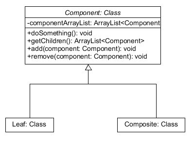

 

1)  抽象构件角色(Component)：它为组合中的对象声明接口，也可以为共有接口实现缺省行为。 

2)  树叶构件角色(Leaf)：在组合中表示叶节点对象——没有子节点，实现抽象构件角色声明的接口。 

3)  树枝构件角色(Composite)：在组合中表示分支节点对象——有子节点，实现抽象构件角色声明的接口；存储子部件。

组合模式中必须提供对子对象的管理方法，不然无法完成对子对象的添加删除等等操作，也就失去了灵活性和扩展性。但是管理方法是在 Component中就声明还是在Composite中声明呢？

一种方式是在Component里面声明所有的用来管理子类对象的方法，以达到Component接口的最大化（如下图所示）。目的就是为了使客户看来在接口层次上树叶和分支没有区别——透明性。但树叶是不存在子类的，因此Component声明的一些方法对于树叶来说是不适用的。这样也就带来了一些安全性问题。

另一种方式就是只在 Composite 里面声明所有的用来管理子类对象的方法（如下图所示）。这样就避免了上一种方式的安全性问题，但是由于叶子和分支有不同的接口，所以又失去了透明性。

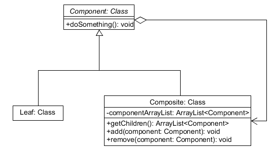

《设计模式》一书认为：在这一模式中，相对于安全性，我们比较强调透明性。对于第一种方式中叶子节点内不需要的方法可以使用空处理或者异常报告的方式来解决。

**特点**

**组合模式有以下优点：** 

1)  高层模块调用简单：使客户端调用简单，客户端可以一致的使用组合结构或其中单个对象，用户就不必关心自己处理的是单个对象还是整个组合结构，这就简化了客户端代码。 

2)  节点自由增加：更容易在组合体内加入对象部件，客户端不必因为加入了新的对象部件而更改代码。这一点符合开闭原则的要求，对系统的二次开发和功能扩展很有利！ 

**当然组合模式也少不了缺点：**

组合模式不容易限制组合中的构件。如果使用的是第二种模式，在场景类中的定义，提到树叶和树枝使用时直接使用了实现类！这在面向接口编程上是很不恰当的，与依赖倒置原则冲突，读者在使用的时候要考虑清楚，它限制了你接口的影响范图。

**使用场景：**

n 维护和展示部分-整体关系的场景，如树形菜单、文件和文件夹管理。

n 从一个整体中能够独立出部分模块或功能的场景。

**实现：**

```java
public abstract class Component {
    protected String name;

    public Component(String name) {
        this.name = name;
    }

    public void print() {
        print(0);
    }

    abstract void print(int level);
    abstract public void add(Component component);
    abstract public void remove(Component component);
}

public class Composite extends Component {
    private List<Component> child;

    public Composite(String name) {
        super(name);
        child = new ArrayList<>();
    }

    @Override
    void print(int level) {
        for (int i = 0; i < level; i++) {
            System.out.print("--");
        }
        System.out.println("Composite:" + name);
        for (Component component : child) {
            component.print(level + 1);
        }
    }

    @Override
    public void add(Component component) {
        child.add(component);
    }

    @Override
    public void remove(Component component) {
        child.remove(component);
    }
}

public class Leaf extends Component {
    public Leaf(String name) {
        super(name);
    }

    @Override
    void print(int level) {
        for (int i = 0; i < level; i++) {
            System.out.print("--");
        }
        System.out.println("left:" + name);
    }

    @Override
    public void add(Component component) {
        throw new UnsupportedOperationException(); // 牺牲透明性换取单一职责原则，这样就不用考虑是叶子节点还是组合节点
    }

    @Override
    public void remove(Component component) {
        throw new UnsupportedOperationException();
    }
}

public class Client {
    public static void main(String[] args) {
        Composite root = new Composite("root");
        Component node1 = new Leaf("1");
        Component node2 = new Composite("2");
        Component node3 = new Leaf("3");
        root.add(node1);
        root.add(node2);
        root.add(node3);
        Component node21 = new Leaf("21");
        Component node22 = new Composite("22");
        node2.add(node21);
        node2.add(node22);
        Component node221 = new Leaf("221");
        node22.add(node221);
        root.print();
    }
}
```

输出：

```markdown
Composite:root
--left:1
--Composite:2
----left:21
----Composite:22
------left:221
--left:3
```

**JDK**

- javax.swing.JComponent#add(Component)
- java.awt.Container#add(Component)
- java.util.Map#putAll(Map)
- java.util.List#addAll(Collection)
- java.util.Set#addAll(Collection)


#### 4.装饰

**定义：**

装饰模式（Decorator）也叫包装器模式（Wrapper）。GOF 在《设计模式》一书中给出的定义为：动态地给一个对象添加一些额外的职责。就增加功能来说，Decorator模式相比生成子类更为灵活。让我们来理解一下这句话。

假设设计“门”这个类。现在，在系统的一个地方需要一个能够报警的Door，怎么做呢？你或许写一个Door的子类 AlarmDoor，在里面添加一个子类独有的方法 alarm()。嗯，那在使用警报门的地方你必须让客户知道使用的是警报门，不然无法使用这个独有的方法。而且，这个还违反了里氏替换原则。

也许你要说，那就把这个方法添加到 Door 里面，这样不就统一了？但是这样所有的门都必须有警报，至少是个“哑巴”警报。而当你的系统仅仅在一两个地方使用了警报门，这明显是不合理的——虽然可以使用缺省适配器来弥补一下。

这时候，你可以考虑采用装饰模式来给门动态的添加些额外的功能。 

**类图：**


1)  抽象构件角色(Component)：定义一个抽象接口，以规范准备接收附加责任的对象。

2)  具体构件角色(Concrete Component)：这是被装饰者，定义一个将要被装饰增加功能的类。

3)  装饰角色(Decorator)：持有一个构件对象的实例，并定义了抽象构件定义的接口。 

4)  具体装饰角色(Concrete Decorator)：负责给构件添加增加的功能。 

整个装饰模式的结构是按照组合模式来实现的——两者都有类似的结构图，都基于递归组合来组织可变数目的对象。但是两者的目的是截然不同的，组合(Composite)模式侧重通过递归组合构造类，使不同的对象、多重的对象可以“一视同仁”；而装饰(Decorator)模式仅仅是借递归组合来达到定义中的目的。 

**透明和半透明** 

对于面向接口编程，应该尽量使客户程序不知道具体的类型，而对一个接口进行操作。这样就要求装饰角色和具体装饰角色要满足里氏替换原则。像下面这样：

```java
Component c = new ConcreteComponent(); 
Component c1 = new ConcreteDecorator(c); 
```

这种方式被称为透明式。在实际应用中，往往因为要对原有接口做太多的扩展而需要公开新的方法（这也是为了重用），所以往往不能对客户程序隐瞒具体的类型，这种方式称为“半透明式”。

**特点**

**装饰模式的优点：**

- 装饰类和被装饰类可以独立发展，而不会相互耦合。换句话说，Component类无须知道Decorator类，Decorator类是从外部来扩展Component类的功能，而Decorator也不用知道具体的构件。

- 装饰模式是继承关系的一个替代方案。我们看装饰类Decorator，不管装饰多少层，返回的对象还是Component，实现的还是ls-a的关系。

- 装饰模式可以动态地扩展一个实现类的功能，这不需要多说，装饰模式的定义就是如此。

**装饰模式的缺点：**

采用 Decorator 模式进行系统设计往往会产生许多看上去类似的小对象，这些对象仅仅在他们相互连接的方式上有所不同，而不是它们的类或是它们的属性值有所不同。尽管对于那些了解这些系统的人来说，很容易对它们进行定制，但是很难学习这些系统，排错也很困难。这是 GOF 提到的装饰模式的缺点。小对象指的应该是具体装饰角色。这是为一个对象动态添加功能所带来的副作用。

**应用环境** 

GOF 书中给出了以下使用情况： 

1)  在不影响其他对象的情况下，以动态、透明的方式给单个对象添加职责。 

2)  处理那些可以撤消的职责。 

3)  当不能采用生成子类的方法进行扩充时。一种情况是，可能有大量独立的扩展，为支持每一种扩展将产生大量的子类，使得子类数目呈爆炸性增长。另一种情况可能是因为类定义被隐藏，或类定义不能用于生成子类。

**实现**

设计不同种类的饮料，饮料可以添加配料，比如可以添加牛奶，并且支持动态添加新配料。每增加一种配料，该饮料的价格就会增加，要求计算一种饮料的价格。

下面表示在 DarkRoast 饮料上新增新添加 Mocha 配料，之后又添加了 Whip 配料。DarkRoast 被 Mocha 包裹，Mocha 又被 Whip 包裹。它们都继承自相同父类，都有 cost() 方法，外层类的 cost() 方法调用了内层类的 cost() 方法。

```java
public interface Beverage {
    double cost();
}

public class DarkRoast implements Beverage {
    @Override
    public double cost() {
        return 1;
    }
}

public class HouseBlend implements Beverage {
    @Override
    public double cost() {
        return 1;
    }
}

public abstract class CondimentDecorator implements Beverage {
    protected Beverage beverage;
}

public class Milk extends CondimentDecorator {
    public Milk(Beverage beverage) {
        this.beverage = beverage;
    }

    @Override
    public double cost() {
        return 1 + beverage.cost();
    }
}

public class Mocha extends CondimentDecorator {
    public Mocha(Beverage beverage) {
        this.beverage = beverage;
    }

    @Override
    public double cost() {
        return 1 + beverage.cost();
    }
}

public class Client {
    public static void main(String[] args) {
        Beverage beverage = new HouseBlend();
        beverage = new Mocha(beverage);
        beverage = new Milk(beverage);
        System.out.println(beverage.cost());
    }
}
```

类应该对扩展开放，对修改关闭：也就是添加新功能时不需要修改代码。饮料可以动态添加新的配料，而不需要去修改饮料的代码。

不可能把所有的类设计成都满足这一原则，应当把该原则应用于最有可能发生改变的地方。

**JDK**

- java.io.BufferedInputStream(InputStream)
- java.io.DataInputStream(InputStream)
- java.io.BufferedOutputStream(OutputStream)
- java.util.zip.ZipOutputStream(OutputStream)
- java.util.Collections#checked[List|Map|Set|SortedSet|SortedMap](https://github.com/CyC2018/CS-Notes/blob/master/notes)


### 5.外观

**定义：**

门面模式（facade）又称外观模式。GOF在《设计模式》一书中给出如下定义：为子系统中的一组接口提供一个一致的界面，Facade模式定义了一个高层接口，这个接口使得这一子系统更加容易使用。 

定义中提到的子系统是指在设计中为了降低复杂性根据一定的规则（比如业务、功能），对系统进行的划分。子系统中封装有一些类。客户程序在使用子系统的时候，可能会非常零乱。客户类紧紧地依赖在子系统的实现上。子系统发生的变化，很可能要影响到客户类的调用。而且子系统在不断优化、可重用化的重构路上，会产生更多更小的类。这对使用子系统的客户类来说要完成一个工作流程，似乎要记住的接口太多了。门面模式就是为了解决这种问题而产生的。

类图：

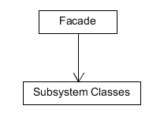

1)  门面角色（facade）：这是门面模式的核心。它被客户角色调用，因此它熟悉子系统的功能。它内部根据客户角色已有的需求预定了几种功能组合。 

2)  子系统角色：实现了子系统的功能。对它而言，facade角色就和客户角色一样是未知的，它没有任何facade角色的信息和链接。 

3)  客户角色：调用facade角色来完成要得到的功能。

这样就减少了客户程序和子系统之间的耦合，增加了可维护性。

**特点**

**优点：** 

1)  减少系统的相互依赖：它实现了子系统与客户之间的松耦合关系，而子系统内部的功能组件往往是紧耦合的。松耦合关系使得子系统的组件变化不会影响到它的客户。Facade模式有助于建立层次结构系统，也有助于对对象之间的依赖关系分层。Facade模式可以消除复杂的循环依赖关系。这一点在客户程序与子系统是分别实现的时候尤为重要。在大型软件系统中降低编译依赖性至关重要。在子系统类改变时，希望尽量减少重编译工作以节省时间。用Facade可以降低编译依赖性，限制重要系统中较小的变化所需的重编译工作。Facade模式同样也有利于简化系统在不同平台之间的移植过程，因为编译一个子系统一般不需要编译所有其他的子系统。 

2)  提高灵活性：它对客户屏蔽子系统组件，因而减少了客户处理的对象的数目并使得子系统使用起来更加方便。 

3)  提高安全性：想让你访问子系统的哪些业务就开通哪些逻辑，不在门面上开通的方怯，就访问不到。 

从整体上来看门面模式给我的感觉是，它对于使两层之间的调用粗颗粒化很有帮助，避免了大量细颗粒度的访问。这和SOA中的一些观点是相同的。

**缺点：**

门面模式最大的缺点就是不符合开闭原则，对修改关闭，对扩展开放，看看我们那个门面对象吧，它可是重中之重， 一旦在系统投产后发现有一个小错误，你怎么解决？完全遵从开闭原则，根本没办怯解决。继承？覆写？都顶不上用，唯一能做的一件事就是修改门面角色的代码，这个风险相当大，这就需要大家在设计的时候慎之又慎，多思考几遍才会有好收获。

**使用环境：** 

1)  当你要为一个复杂子系统提供一个简单接口时。在上面已经描述了原因。 

2)  客户程序与抽象类的实现部分之间存在着很大的依赖性。引入 facade 将这个子系统与客户以及其他的子系统分离，可以提高子系统的独立性和可移植性（上面也提到了）。 

3)  当你需要构建一个层次结构的子系统时，使用facade模式定义子系统中每层的入口点。如果子系统之间是相互依赖的，你可以让它们仅通过facade进行通讯，从而简化了它们之间的依赖关系。 

**注意事项：**

- 1个子系统可以有多个门面：门面已经庞大到不能忍受的程度、子系统可以提供不同访问路径
- 门面不参与子系统内的业务逻辑

**实现**

观看电影需要操作很多电器，使用外观模式实现一键看电影功能。

```java
public class SubSystem {
    public void turnOnTV() {
        System.out.println("turnOnTV()");
    }

    public void setCD(String cd) {
        System.out.println("setCD( " + cd + " )");
    }

    public void startWatching(){
        System.out.println("startWatching()");
    }
}

public class Facade {
    private SubSystem subSystem = new SubSystem();

    public void watchMovie() {
        subSystem.turnOnTV();
        subSystem.setCD("a movie");
        subSystem.startWatching();
    }
}

public class Client {
    public static void main(String[] args) {
        Facade facade = new Facade();
        facade.watchMovie();
    }
}
```

最少知识原则：只和你的密友谈话。也就是说客户对象所需要交互的对象应当尽可能少。


### 6.享元

**定义**

享元模式英文称为“Flyweight Pattern”，又译为羽量级模式或者蝇量级模式。我非常认同将 Flyweight Pattern 翻译为享元模式，因为这个词将这个模式使用的方式明白得表示了出来。 

享元模式的定义为：采用一个共享类来避免大量拥有相同内容的“小类”的开销。这种开销中最常见、直观的影响就是增加了内存的损耗。享元模式以共享的方式高效的支持大量的细粒度对象，减少其带来的开销。 

在名字和定义中都体现出了共享这一个核心概念，那么怎么来实现共享呢？事物之间都是不同的，但是又存在一定的共性，如果只有完全相同的事物才能共享，那么享元模式可以说就是不可行的；因此我们应该尽量将事物的共性共享，而又保留它的个性。为了做到这点，享元模式中区分了内蕴状态和外蕴状态。内蕴状态就是共性，外蕴状态就是个性了。 

内蕴状态存储在享元内部，不会随环境的改变而有所不同，是可以共享的；外蕴状态是不可以共享的，它随环境的改变而改变的，因此外蕴状态是由客户端来保持（因为环境的变化是由客户端引起的）。在每个具体的环境下，客户端将外蕴状态传递给享元，从而创建不同的对象出来。

引用《Java 与模式》中的分类，将享元模式分为：单纯享元模式和复合享元模式。

**类图** 


- Flyweight：享元对象
- IntrinsicState：内部状态，享元对象共享内部状态
- ExtrinsicState：外部状态，每个享元对象的外部状态不同

**单纯享元模式：**

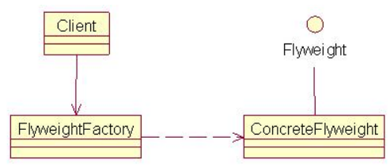

 先从简单的入手，看看单纯享元模式的结构。 

1)  抽象享元角色：为具体享元角色规定了必须实现的方法，而外蕴状态就是以参数的形式通过此方法传入。在 Java 中可以由抽象类、接口来担当。 

2)  具体享元角色：实现抽象角色规定的方法。如果存在内蕴状态，就负责为内蕴状态提供存储空间。 

3)  享元工厂角色：负责创建和管理享元角色。要想达到共享的目的，这个角色的实现是关键！ 

4)  客户端角色：维护对所有享元对象的引用，而且还需要存储对应的外蕴状态。 

**复合享元模式：**


正如你所想，复合享元模式采用了组合模式——为了将具体享元角色和复合享元角色同等对待和处理。这也就决定了复合享元角色中所包含的每个单纯享元都具有相同的外蕴状态，而这些单纯享元的内蕴状态可以是不同的。

再来看看复合享元模式的结构。 

1)  抽象享元角色：为具体享元角色规定了必须实现的方法，而外蕴状态就是以参数的形式通过此方法传入。在 Java 中可以由抽象类、接口来担当。 

2)  具体享元角色：实现抽象角色规定的方法。如果存在内蕴状态，就负责为内蕴状态提供存储空间。 

3)  复合享元角色：它所代表的对象是不可以共享的，并且可以分解成为多个单纯享元对象的组合。 

4)  享元工厂角色：负责创建和管理享元角色。要想达到共享的目的，这个角色的实现是关键！ 

5)  客户端角色：维护对所有享元对象的引用，而且还需要存储对应的外蕴状态。 

对比一下单纯享元对象和复合享元对象，里面只多出了一个复合享元角色，但是它的结构就发生了很大的变化。

**特点**

享元模式优点就在于它能够大幅度的降低内存中对象的数量；而为了做到这一步也带来了它的缺点：它使得系统逻辑复杂化，而且在一定程度上外蕴状态影响了系统的速度。 

所以一定要切记使用享元模式的条件： 

1)  系统中有大量的对象，他们使系统的效率降低。 

2)  这些对象的状态可以分离出所需要的内外两部分。 

外蕴状态和内蕴状态的划分以及两者关系的对应也是非常值得重视的。只有将内外划分妥当才能使内蕴状态发挥它应有的作用；如果划分失误，在最糟糕的情况下系统中的对象是一个也不会减少的！两者的对应关系的维护和查找也是要花费一定的空间（当然这个比起不使用共享对象要小得多）和时间的，可以说享元模式就是使用时间来换取空间的。可以采用相应的算法来提高查找的速度。 

**实现：**

```java
public interface Flyweight {
    void doOperation(String extrinsicState);
}

public class ConcreteFlyweight implements Flyweight {
    private String intrinsicState;

    public ConcreteFlyweight(String intrinsicState) {
        this.intrinsicState = intrinsicState;
    }

    @Override
    public void doOperation(String extrinsicState) {
        System.out.println("Object address: " + System.identityHashCode(this));
        System.out.println("IntrinsicState: " + intrinsicState);
        System.out.println("ExtrinsicState: " + extrinsicState);
    }
}

public class FlyweightFactory {
    private HashMap<String, Flyweight> flyweights = new HashMap<>();

    Flyweight getFlyweight(String intrinsicState) {
        if (!flyweights.containsKey(intrinsicState)) {
            Flyweight flyweight = new ConcreteFlyweight(intrinsicState);
            flyweights.put(intrinsicState, flyweight);
        }
        return flyweights.get(intrinsicState);
    }
}

public class Client {
    public static void main(String[] args) {
        FlyweightFactory factory = new FlyweightFactory();
        Flyweight flyweight1 = factory.getFlyweight("aa");
        Flyweight flyweight2 = factory.getFlyweight("aa");
        flyweight1.doOperation("x");
        flyweight2.doOperation("y");
    }
}
```

输出：

```markdown
Object address: 1163157884
IntrinsicState: aa
ExtrinsicState: x
Object address: 1163157884
IntrinsicState: aa
ExtrinsicState: y
```

**JDK**

Java 利用缓存来加速大量小对象的访问时间。

- java.lang.Integer#valueOf(int)
- java.lang.Boolean#valueOf(boolean)
- java.lang.Byte#valueOf(byte)
- java.lang.Character#valueOf(char)


#### 7. 代理

[查看](./总结-面试1.md#代理模式)


