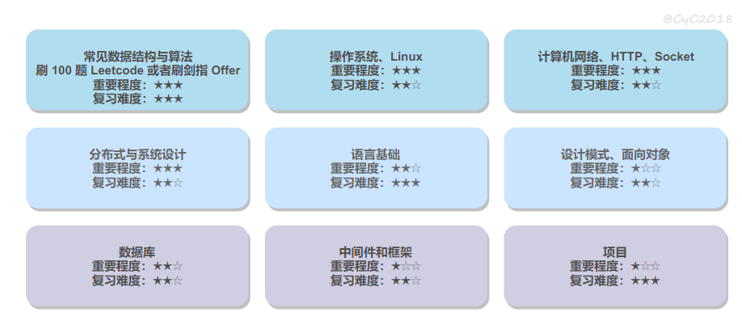
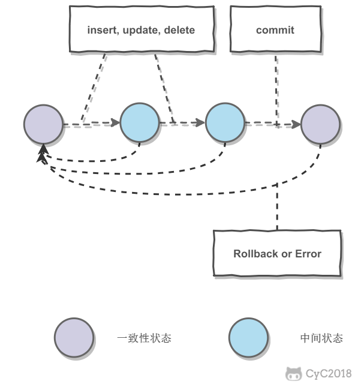
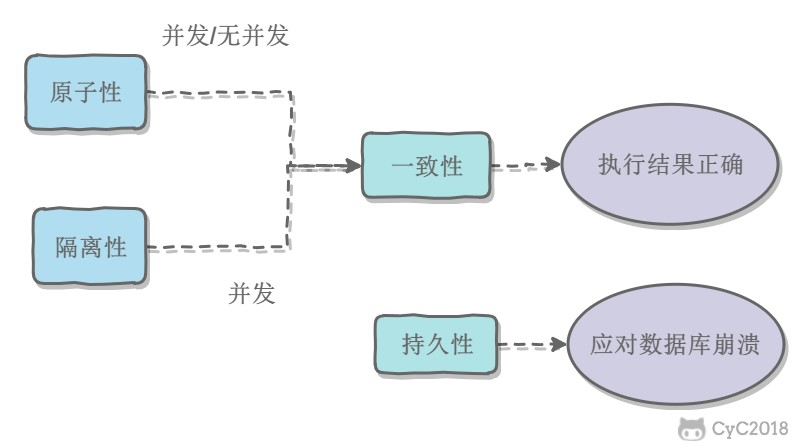
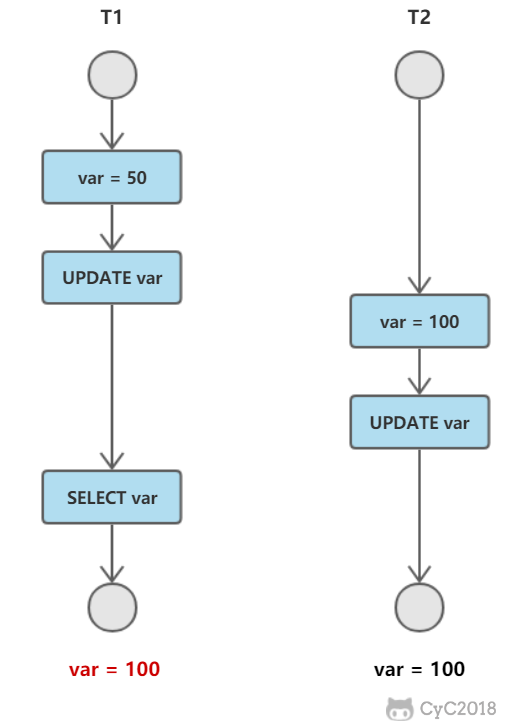
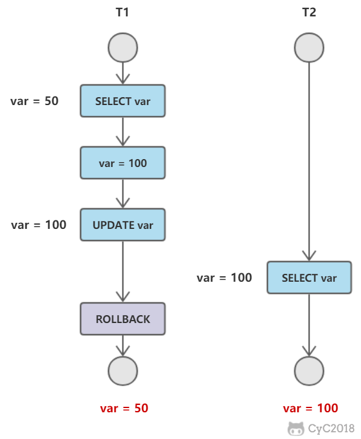
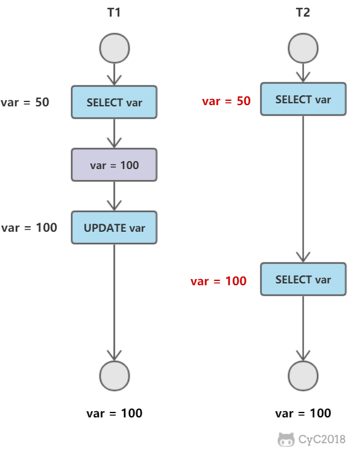
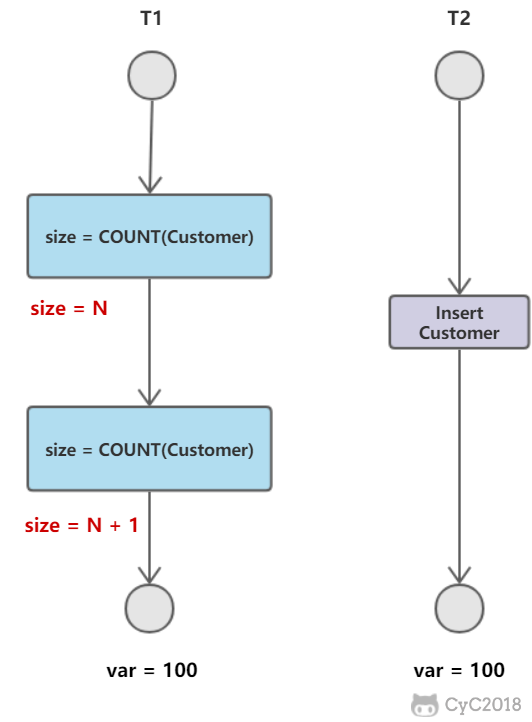

# 面试

## 目录

1. [总览](#总览)
2. [数据库](#数据库)

## 总览



## 数据库

### SQL

- ★★☆ 手写 SQL 语句，特别是连接查询与分组查询。
- ★★☆ 连接查询与子查询的比较。
- 内连接、外连接、完全连接、交叉连接、联合
- ★★☆ drop、delete、truncate 比较。
- ★★☆ 视图的作用，以及何时能更新视图。
- ★☆☆ 理解存储过程、触发器等作用。

### 系统原理

- ★★★ 聚集索引和非聚集索引。

   >聚集索引：每表一个，记录按索引进行物理排序。百科全书中的“页码”。  
   >非聚集索引：每表可以有多个。百科全书中的“关键字索引”。

- ★★★ ACID 的作用以及实现原理。
- ★★★ 四大隔离级别，以及不可重复读和幻影读的出现原因。
- ★★☆ 封锁的类型以及粒度，两段锁协议，隐式和显示锁定。
- ★★★ 乐观锁与悲观锁。
- ★★★ MVCC原理，当前读以及快照读，Next-Key Locks解决幻影读。
- ★★☆ 范式理论。
- ★★★ SQL 与 NoSQL 的比较。

### 事务

**概念**：事务指的是满足 ACID 特性的一组操作，可以通过 Commit 提交一个事务，也可以使用 Rollback 进行回滚。



**ACID：**

1. 原子性（Atomicity）

   事务被视为不可分割的最小单元，事务的所有操作要么全部提交成功，要么全部失败回滚。回滚可以用回滚日志来实现，回滚日志记录着事务所执行的修改操作，在回滚时反向执行这些修改操作即可。

2. 一致性（Consistency）

   数据库在事务执行前后都保持一致性状态。在一致性状态下，所有事务对一个数据的读取结果都是相同的。

3. 隔离性（Isolation）

   一个事务所做的修改在最终提交以前，对其它事务是不可见的。

4. 持久性（Durability）

   一旦事务提交，则其所做的修改将会永远保存到数据库中。即使系统发生崩溃，事务执行的结果也不能丢失。使用重做日志来保证持久性。

事务的 ACID 特性概念简单，但不是很好理解，主要是因为这几个特性不是一种平级关系：

- 只有满足一致性，事务的执行结果才是正确的。
- 在无并发的情况下，事务串行执行，隔离性一定能够满足。此时只要能满足原子性，就一定能满足一致性。
- 在并发的情况下，多个事务并行执行，事务不仅要满足原子性，还需要满足隔离性，才能满足一致性。
- 事务满足持久化是为了能应对数据库崩溃的情况。



**AUTOCOMMIT**：MySQL默认采用自动提交模式。也就是说，如果不显式使用 `START TRANSACTION` 语句来开始一个事务，那么每个查询都会被当做一个事务自动提交。

### 并发一致性问题

在并发环境下，事务的隔离性很难保证，因此会出现很多并发一致性问题。

**丢失修改：**

T1 和 T2 两个事务都对一个数据进行修改，T1 先修改，T2 随后修改，T2 的修改覆盖了 T1 的修改。



**读脏数据：**

T1 修改一个数据，T2 随后读取这个数据。如果 T1 撤销了这次修改，那么 T2 读取的数据是脏数据。



**不可重复读：**

T2 读取一个数据，T1 对该数据做了修改。如果 T2 再次读取这个数据，此时读取的结果和第一次读取的结果不同。



**幻影读：**

T1 读取某个范围的数据，T2 在这个范围内插入新的数据，T1 再次读取这个范围的数据，此时读取的结果和和第一次读取的结果不同。



产生并发不一致性问题主要原因是破坏了事务的隔离性，解决方法是通过并发控制来保证隔离性。并发控制可以通过封锁来实现，但是封锁操作需要用户自己控制，相当复杂。数据库管理系统提供了事务的隔离级别，让用户以一种更轻松的方式处理并发一致性问题。

### 封锁

#### 封锁粒度

MySQL中提供了两种封锁粒度：行级锁以及表级锁。

应该尽量只锁定需要修改的那部分数据，而不是所有的资源。锁定的数据量越少，发生锁争用的可能就越小，系统的并发程度就越高。

但是加锁需要消耗资源，锁的各种操作（包括获取锁、释放锁、以及检查锁状态）都会增加系统开销。因此封锁粒度越小，系统开销就越大。

在选择封锁粒度时，需要在锁开销和并发程度之间做一个权衡。

#### 封锁类型

1. 读写锁

   - 排它锁（Exclusive），简写为 X 锁，又称写锁。
   - 共享锁（Shared），简写为 S 锁，又称读锁。

   有以下两个规定：

   - 一个事务对数据对象 A 加了 X 锁，就可以对 A 进行读取和更新。加锁期间其它事务不能对 A 加任何锁。
   - 一个事务对数据对象 A 加了 S 锁，可以对 A 进行读取操作，但是不能进行更新操作。加锁期间其它事务能对 A 加 S 锁，但是不能加 X 锁。

   锁的兼容关系如下：

   -|X|S
   -|-|-
   X|×|×
   S|×|√

2. 意向锁

   使用意向锁（Intention Locks）可以更容易地支持多粒度封锁。

   在存在行级锁和表级锁的情况下，事务 T 想要对表 A 加 X 锁，就需要先检测是否有其它事务对表 A 或者表 A 中的任意一行加了锁，那么就需要对表 A 的每一行都检测一次，这是非常耗时的。

   意向锁在原来的 X/S 锁之上引入了 IX/IS，IX/IS 都是表锁，用来表示一个事务想要在表中的某个数据行上加 X 锁或 S 锁。有以下两个规定：

   - 一个事务在获得某个数据行对象的 S 锁之前，必须先获得表的 IS 锁或者更强的锁；
   - 一个事务在获得某个数据行对象的 X 锁之前，必须先获得表的 IX 锁。

   通过引入意向锁，事务 T 想要对表 A 加 X 锁，只需要先检测是否有其它事务对表 A 加了 X/IX/S/IS 锁，如果加了就表示有其它事务正在使用这个表或者表中某一行的锁，因此事务 T 加 X 锁失败。

各种锁的兼容关系如下：

-|X|IX|S|IS
-|-|-|-|-
X|×|×|×|×
IX|×|√|×|√
S|×|×|√|√
IS|×|√|√|√

解释如下：

- 任意 IS/IX 锁之间都是兼容的，因为它们只是表示想要对表加锁，而不是真正加锁；
- S 锁只与 S 锁和 IS 锁兼容，也就是说事务 T 想要对数据行加 S 锁，其它事务可以已经获得对表或者表中的行的 S 锁。

#### 封锁协议

##### 三级封锁协议

**一级封锁协议：**

事务 T 要修改数据 A 时必须加 X 锁，直到 T 结束才释放锁。可以解决丢失修改问题，因为不能同时有两个事务对同一个数据进行修改，那么事务的修改就不会被覆盖。

T1|T2
-|-
lock-x(A)|-
read A=20|-
-|lock-x(A)
-|wait
write A=19|-
commit|-
unlock-x(A)|-
-|obtain
-|read A=19
-|write A=21
-|commit
-|unlock-x(A)

**二级封锁协议：**

在一级的基础上，要求读取数据 A 时必须加 S 锁，读取完马上释放 S 锁。可以解决读脏数据问题，因为如果一个事务在对数据 A 进行修改，根据 1 级封锁协议，会加 X 锁，那么就不能再加 S 锁了，也就是不会读入数据。

T1|T2
-|-
lock-x(A)|-
read A=20|-
write A=19|-
-|lock-s(A)
-|wait
rollback|-
A=20|-
unlock-x(A)|-
-|obtain
-|read A=20
-|unlock-s(A)
-|commit

**三级封锁协议：**

在二级的基础上，要求读取数据 A 时必须加 S 锁，直到事务结束了才能释放 S 锁。可以解决不可重复读的问题，因为读 A 时，其它事务不能对 A 加 X 锁，从而避免了在读的期间数据发生改变。

T1|T2
-|-
lock-s(A)|-
read A=20|-
-|lock-x(A)
-|wait
read A=20|-
commit|-
unlock-s(A)|-
-|obtain
-|read A=20
-|write A=19
-|commit
-|unlock-X(A)

##### 两段锁协议

加锁和解锁分为两个阶段进行。

可串行化调度是指，通过并发控制，使得并发执行的事务结果与某个串行执行的事务结果相同。

事务遵循两段锁协议是保证可串行化调度的充分条件。例如以下操作满足两段锁协议，它是可串行化调度。

lock-x(A)...lock-s(B)...lock-s(C)...unlock(A)...unlock(C)...unlock(B)

但不是必要条件，例如以下操作不满足两段锁协议，但是它还是可串行化调度。

lock-x(A)...unlock(A)...lock-s(B)...unlock(B)...lock-s(C)...unlock(C)

##### MySQL隐式与显示锁定

MySQL 的 InnoDB 存储引擎采用两段锁协议，会根据隔离级别在需要的时候自动加锁，并且所有的锁都是在同一时刻被释放，这被称为隐式锁定。

InnoDB 也可以使用特定的语句进行显示锁定：

```sql
SELECT ... LOCK In SHARE MODE;
SELECT ... FOR UPDATE;
```
